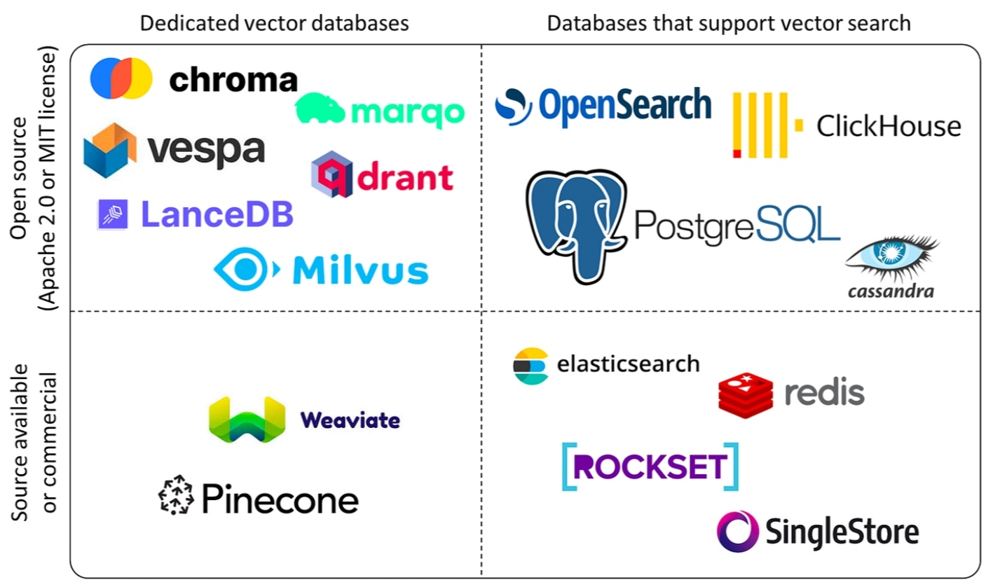

# 一、向量数据库

- [什么是向量](../AI/大模型.md#二向量-embedding)

## 什么是向量数据库

向量数据库是一种特殊的数据库，它具备数据存储和读取的基础能力，同时也有一个特殊的查询操作，即向量检索；

向量检索是通过向量的匹配来找到最相似的数据，而不仅仅是简单地查出一行数据；

向量数据库的核心思想是：将文本转换成向量，然后将向量存储在数据库中，当用户输入问题时，将问题转换成向量，然后在数据库中搜索最相似的向量和上下文，最后将文本返回给用户

向量数据库的核心价值在于其高效处理海量高维向量的能力。其主要功能可以概括为以下几点：
- **高效的相似性搜索**：这是向量数据库最重要的功能。它利用专门的索引技术（如 HNSW, IVF），能够在数十亿级别的向量中实现毫秒级的近似最近邻(ANN)查询，快速找到与给定查询最相似的数据。
- **高维数据存储与管理**：专门为存储高维向量（通常维度成百上千）而优化，支持对向量数据进行增、删、改、查等基本操作。
- **丰富的查询能力**：除了基本的相似性搜索，还支持按标量字段过滤查询（例如，在搜索相似图片的同时，指定`年份 > 2023`）、范围查询和聚类分析等，满足复杂业务需求。
- **可扩展与高可用**：现代向量数据库通常采用分布式架构，具备良好的水平扩展能力和容错性，能够通过增加节点来应对数据量的增长，并确保服务的稳定可靠。
- **数据与模型生态集成**：与主流的 AI 框架（如 LangChain, LlamaIndex）和机器学习工作流无缝集成，简化了从模型训练到向量检索的应用开发流程。

## 向量数据库与传统数据库

向量数据库与传统数据库的主要差异如下：

| **维度** | **向量数据库** | **传统数据库 (RDBMS)** |
| :--- | :--- | :--- |
| **核心数据类型** | 高维向量 (Embeddings) | 结构化数据 (文本、数字、日期) |
| **查询方式** | **相似性搜索** (ANN) | **精确匹配** |
| **索引机制** | HNSW, IVF, LSH 等 ANN 索引 | B-Tree, Hash Index |
| **主要应用场景** | AI 应用、RAG、推荐系统、图像/语音识别 | 业务系统 (ERP, CRM)、金融交易、数据报表 |
| **数据规模** | 轻松应对千亿级向量 | 通常在千万到亿级行数据，更大规模需复杂分库分表 |
| **性能特点** | 高维数据检索性能极高，计算密集型 | 结构化数据查询快，高维数据查询性能呈指数级下降 |
| **一致性** | 通常为最终一致性 | 强一致性 (ACID 事务) |

向量数据库和传统数据库并非相互替代的关系，而是**互补关系**。在构建现代 AI 应用时，通常会将两者结合使用：利用传统数据库存储业务元数据和结构化信息，而向量数据库则专门负责处理和检索由 AI 模型产生的海量向量数据。

## 相似度算法

有三种常见的向量相似度算法：欧几里德距离、余弦相似度和点积相似度。

### 欧几里得距离（Euclidean Distance）

欧几里得距离是指两个向量之间的距离，它的计算公式为：

$$
d(\mathbf{A}, \mathbf{B}) = \sqrt{\sum_{i=1}^{n} (\mathbf{A}_i - \mathbf{B}_i)^2}
$$

其中，A 和 B 分别表示两个向量，n 表示向量的维度。

欧几里得距离算法的优点是可以反映向量的绝对距离，适用于需要考虑向量长度的相似性计算。例如推荐系统中，需要根据用户的历史行为来推荐相似的商品，这时就需要考虑用户的历史行为的数量，而不仅仅是用户的历史行为的相似度。

### 余弦相似度（Cosine Similarity）

余弦相似度是指两个向量之间的夹角余弦值，它的计算公式为：

$$
\cos(\theta) = \frac{\mathbf{A} \cdot \mathbf{B}}{\|\mathbf{A}\| \|\mathbf{B}\|}
$$

其中，A 和 B 分别表示两个向量，`⋅` 表示向量的点积，`∣A∣` 和 `∣B∣` 分别表示两个向量的模长。

余弦相似度对向量的长度不敏感，只关注向量的方向，因此适用于高维向量的相似性计算。例如语义搜索和文档分类。

### 点积相似度 (Dot product Similarity)

向量的点积相似度是指两个向量之间的点积值，它的计算公式为：

$$
\mathbf{A} \cdot \mathbf{B} = \sum_{i=1}^{n} A_i B_i
$$

其中，A 和 B 分别表示两个向量，n 表示向量的维度。

点积相似度算法的优点在于它简单易懂，计算速度快，并且兼顾了向量的长度和方向。它适用于许多实际场景，例如图像识别、语义搜索和文档分类等。但点积相似度算法对向量的长度敏感，因此在计算高维向量的相似性时可能会出现问题。

## 向量数据库选型

- 分布式部署
- 访问控制和备份
- API & SDK

其他
-  POC 验证一下效果，直接用 Chroma，轻量、上手快，别在基础设施上花太多时间
- 刚入门？ 先玩玩Faiss，理解原理，科研和原型的首选
- 快速验证想法？ Pinecone，贵但省心
- 中小项目？ Qdrant，性价比高
- 企业级应用？ Milvus，功能最全
- 已有PostgreSQL？ 试试PGVector，成本最低
- 已有ES基础设施，希望添加向量搜索能力

## 主流的向量数据库



以下是几款主要开源高性能向量数据库的简要比较，基于 2025 年的最新基准测试和用户反馈：
* Milvus：在查询每秒（QPS）方面表现最佳，适合大规模向量相似性搜索，支持多种索引类型。
* Qdrant：以可扩展性和性能优化著称，适合大规模场景。
* [Weaviate](https://github.com/weaviate/weaviate)：提供良好的开发体验，性能均衡，适合需要同时处理向量和结构化数据的应用。
* Chroma：易于使用，适合原型设计和中小型应用。
* pgvector 和 pgvecto-rs：利用 PostgreSQL 的成熟性，适合已有 PostgreSQL 基础设施的用户。
* Opensearch 和 Elasticsearch：适合需要全文搜索和向量混合搜索的场景。
* Tidb_vector 和 Couchbase：适合需要分布式架构和多模型支持的应用。
* Myscale：适合分析型工作负载，支持向量搜索。
* [Zvec](https://github.com/alibaba/zvec):轻量级向量数据库

适用场景与建议
* 如果项目需要处理十亿级别的向量数据，Milvus 和 Qdrant 是首选。
* 对于需要 AI 原生功能和开发友好性的场景，Weaviate 和 Chroma 是一个不错的选择。
* 在可扩展性和分布式环境中有需求时，Opensearch、Tidb_vector 和 Elasticsearch 表现优异。
* 如果已有 PostgreSQL 基础设施，考虑使用 pgvector 或 pgvecto-rs，但注意在大规模场景下的性能限制。
* 对于 NoSQL 数据库和多模型支持，Couchbase 是一个轻量级选项。
* 新兴的 Myscale 适合高吞吐量分析型工作负载，特别适合 AI 开发者的快速原型设计
新手入门/小型项目：从 ChromaDB 或 FAISS 开始是最佳选择。它们与 LangChain/LlamaIndex 紧密集成，几行代码就能运行，且能满足基本的存储和检索需求。
生产环境/大规模应用：当数据量超过百万级，或需要高并发、实时更新、复杂元数据过滤时，应考虑更专业的解决方案，如 Milvus、Weaviate 或云服务 Pinecone

## 企业向量数据库要求

- 可扩展性：当数据量增加时，是否能通过增加节点来扩展系统的容量和计算能力
- 吞吐量：当请求量和数据量增加时，系统能否在短时间内处理更多的请求(QPS)
- 稳定性：当系统故障时，数据是否丢失，是否能备份和恢复，是否有监控和日志


# 二、Chroma

- [官方文档](https://www.trychroma.com/)

## 1、安装部署

```
pip install chromadb
```
服务端部署
```
chroma run --path ./data

Usage: chroma run [OPTIONS]                                                                                                                        
 Run a chroma server                                                                                                                                
╭─ Options ────────────────────────────────────────────────────────────────────────────────╮
│ --path            TEXT     The path to the file or directory. [default: ./chroma_data]   │
│ --host            TEXT     The host to listen to. Default: localhost [default: localhost]│
│ --log-path        TEXT     The path to the log file. [default: chroma.log]               │
│ --port            INTEGER  The port to run the server on. [default: 8000]                │
│ --help                     Show this message and exit.                                   │
╰──────────────────────────────────────────────────────────────────────────────────────────╯
```
客户端使用
```python
import chromadb
chroma_client = chromadb.HttpClient(host='localhost', port=8000)
# 直接使用
import chromadb
client = chromadb.Client()
client = chromadb.PersistentClient(path="./data")
```

# 三、Milvus

- [Milvus-官方文档](https://milvus.io/zh)

Milvus 是一个开源的、专为大规模向量相似性搜索和分析而设计的向量数据库。它诞生于 Zilliz 公司，并已成为 LF AI & Data 基金会的顶级项目，在AI领域拥有广泛的应用。

与 FAISS、ChromaDB 等轻量级本地存储方案不同，Milvus 从设计之初就瞄准了生产环境。其采用云原生架构，具备高可用、高性能、易扩展的特性，能够处理十亿、百亿甚至更大规模的向量数据。

## 安装部署

- [官方安装文档](https://milvus.io/docs/zh/install-overview.md)

```bash
# 方式一
curl -sfL https://raw.githubusercontent.com/milvus-io/milvus/master/scripts/standalone_embed.sh -o standalone_embed.sh

bash standalone_embed.sh start
bash standalone_embed.sh stop
bash standalone_embed.sh delete

# 方式二
# 通过docker-compose
mkdir milvus_compose
cd milvus_compose
wget https://github.com/milvus-io/milvus/releases/download/v2.2.8/milvus-standalone-docker-compose.yml -O docker-compose.yml
 
sudo systemctl daemon-reload
sudo systemctl restart docker
# 启动服务
docker-compose up -d
# 安装 python接口库
pip install pymilvus
```

## 核心组件

### Collection (集合)

可以用一个图书馆的比喻来理解 Collection：
- **Collection (集合)**: 相当于一个**图书馆**，是所有数据的顶层容器。一个 Collection 可以包含多个 Partition，每个 Partition 可以包含多个 Entity。
- **Partition (分区)**: 相当于图书馆里的**不同区域**（如“小说区”、“科技区”），将数据物理隔离，让检索更高效。
- **Schema (模式)**: 相当于图书馆的**图书卡片规则**，定义了每本书（数据）必须登记哪些信息（字段）。
- **Entity (实体)**: 相当于**一本具体的书**，是数据本身。
- **Alias (别名)**: 相当于一个**动态的推荐书单**（如“本周精选”），它可以指向某个具体的 Collection，方便应用层调用，实现数据更新时的无缝切换。 

**Collection** 是 Milvus 中最基本的数据组织单位，类似于关系型数据库中的一张**表 (Table)**。是我们存储、管理和查询向量及相关元数据的容器。所有的数据操作，如插入、删除、查询等，都是围绕 Collection 展开的。

一个 Collection 由其 **Schema** 定义，并包含以下重要的子概念和特性：

#### Schema

在创建 Collection 之前，必须先定义它的 **Schema**。 `Schema` 规定了 Collection 的数据结构，定义了其中包含的所有**字段 (Field)** 及其属性。一个设计良好的 Schema 是能够保证数据一致性并提升查询性能。

Schema 通常包含以下几类字段：
- **主键字段 (Primary Key Field)**: 每个 Collection 必须有且仅有一个主键字段，用于唯一标识每一条数据（实体）。它的值必须是唯一的，通常是整数或字符串类型。
- **向量字段 (Vector Field)**: 用于存储核心的向量数据。一个 Collection 可以有一个或多个向量字段，以满足多模态等复杂场景的需求。
- **标量字段 (Scalar Field)**: 用于存储除向量之外的元数据，如字符串、数字、布尔值、JSON 等。这些字段可以用于过滤查询，实现更精确的检索。

#### Partition (分区)

**Partition** 是 Collection 内部的一个逻辑划分。每个 Collection 在创建时都会有一个名为 `_default` 的默认分区。我们可以根据业务需求创建更多的分区，将数据按特定规则（如类别、日期等）存入不同分区。

**为什么使用分区？**
- **提升查询性能**: 在查询时，可以指定只在一个或几个分区内进行搜索，从而大幅减少需要扫描的数据量，显著提升检索速度。
- **数据管理**: 便于对部分数据进行批量操作，如加载/卸载特定分区到内存，或者删除整个分区的数据。

一个 Collection 最多可以有 1024 个分区。合理利用分区是 Milvus 性能优化的重要手段之一。

#### Alias (别名)

**Alias** (别名) 是为 Collection 提供的一个“昵称”。通过为一个 Collection 设置别名，可以在应用程序中使用这个别名来执行所有操作，而不是直接使用真实的 Collection 名称。

**为什么使用别名？**
- **安全地更新数据**：想象一下，你需要对一个在线服务的 Collection 进行大规模的数据更新或重建索引。直接在原 Collection 上操作风险很高。正确的做法是：
    1. 创建一个新的 Collection (`collection_v2`) 并导入、索引好所有新数据。
    2. 将指向旧 Collection (`collection_v1`) 的别名（例如 `my_app_collection`）原子性地切换到新 Collection (`collection_v2`) 上。
- **代码解耦**：整个切换过程对上层应用完全透明，无需修改任何代码或重启服务，实现了数据的平滑无缝升级。

### 索引 (Index)

如果说 Collection 是 Milvus 的骨架，那么 **索引 (Index)** 就是其加速检索的神经系统。从宏观上看，索引本身就是一种 **为了加速查询而设计的复杂数据结构**。对向量数据创建索引后，Milvus 可以极大地提升向量相似性搜索的速度，代价是会占用额外的存储和内存资源。

#### 主要向量索引类型

Milvus 提供了多种向量索引算法，以适应不同的应用场景。以下是几种最核心的类型：
- **FLAT (精确查找)**
  - **原理**：暴力搜索（Brute-force Search）。它会计算查询向量与集合中所有向量之间的实际距离，返回最精确的结果。
  - **优点**：100% 的召回率，结果最准确。
  - **缺点**：速度慢，内存占用大，不适合海量数据。
  - **适用场景**：对精度要求极高，且数据规模较小（百万级以内）的场景。

- **IVF 系列 (倒排文件索引)**
  - **原理**：类似于书籍的目录。它首先通过聚类将所有向量分成多个“桶”(`nlist`)，查询时，先找到最相似的几个“桶”，然后只在这几个桶内进行精确搜索。`IVF_FLAT`、`IVF_SQ8`、`IVF_PQ` 是其不同变体，主要区别在于是否对桶内向量进行了压缩（量化）。
  - **优点**：通过缩小搜索范围，极大地提升了检索速度，是性能和效果之间很好的平衡。
  - **缺点**：召回率不是100%，因为相关向量可能被分到了未被搜索的桶中。
  - **适用场景**：通用场景，尤其适合需要高吞吐量的大规模数据集。

- **HNSW (基于图的索引)**
  - **原理**：构建一个多层的邻近图。查询时从最上层的稀疏图开始，快速定位到目标区域，然后在下层的密集图中进行精确搜索。
  - **优点**：检索速度极快，召回率高，尤其擅长处理高维数据和低延迟查询。
  - **缺点**：内存占用非常大，构建索引的时间也较长。
  - **适用场景**：对查询延迟有严格要求（如实时推荐、在线搜索）的场景。

- **DiskANN (基于磁盘的索引)**
  - **原理**：一种为在 SSD 等高速磁盘上运行而优化的图索引。
  - **优点**：支持远超内存容量的海量数据集（十亿级甚至更多），同时保持较低的查询延迟。
  - **缺点**：相比纯内存索引，延迟稍高。
  - **适用场景**：数据规模巨大，无法全部加载到内存的场景。

#### 如何选择索引？

选择索引没有唯一的“最佳答案”，需要根据业务场景在 **数据规模、内存限制、查询性能和召回率** 之间进行权衡。

| 场景 | 推荐索引 | 备注 |
| :--- | :--- | :--- |
| 数据可完全载入内存，追求低延迟 | **HNSW** | 内存占用较大，但查询性能和召回率都很优秀。 |
| 数据可完全载入内存，追求高吞吐 | **IVF_FLAT / IVF_SQ8** | 性能和资源消耗的平衡之选。 |
| 数据量巨大，无法载入内存 | **DiskANN** | 在 SSD 上性能优异，专为海量数据设计。 |
| 追求 100% 准确率，数据量不大 | **FLAT** | 暴力搜索，确保结果最精确。 |

在实际应用中，通常需要通过测试来找到最适合自己数据和查询模式的索引类型及其参数。

# 参考资料

- [什么是向量数据库](https://www.pinecone.io/learn/vector-database/)
- [向量数据库选型](https://zhuanlan.zhihu.com/p/27399676042)
- [向量数据库-原理和选型](https://guangzhengli.com/blog/zh/vector-database)