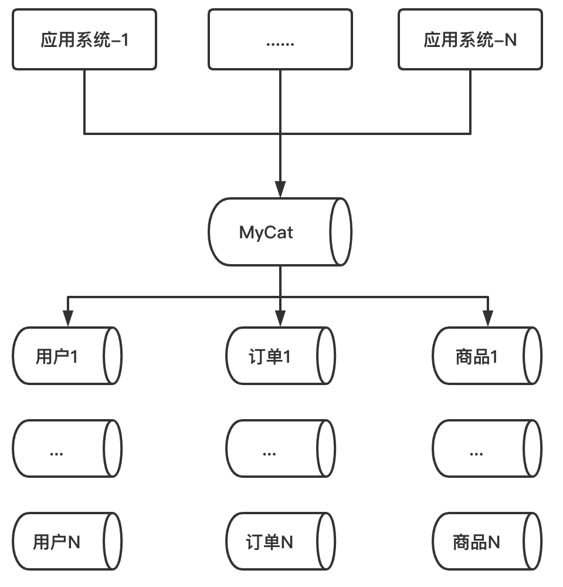

# 一、Mycat

## 1、概述

它是一个开源的分布式数据库系统，前端的用户可以把它看成一个数据库代理，用MySql客户端和命令行工具都可以访问，而其后端则是用MySql原生的协议与多个MySql服务之间进行通信；

MyCat的核心功能是分库分表，即将一个大表水平切分成N个小表，然后存放在后端的MySql数据当中；

MyCat发展到目前的版本，已经不是一个单纯的MySql代理了，它的后端支持MySql，Oracle，SqlServer，DB2等主流的数据库，也支持MongoDB这种NoSql数据库。而对于前端的用户来说，无论后端采用哪一种数据库，在MyCat里都是一个传统的数据库，支持标准的SQL语句，对于前端的开发人员来说，可以大大地降低开发难度，提升开发速度；

## 2、适用场景

典型的应用场景有：
- 单纯的读写分离，此时配置最为简单，支持读写分离，主从切换；
- 分库分表，对于超过1000w的表进行分片，最大支持1000亿的数据；
- 多租户应用，每个应用一个数据库，应用只连接MyCat，程序本身不需要改造；
- 代替HBase，分析大数据

## 3、MyCat基本概念

**逻辑库（Schema）：**

在实际的开发中，开发人员不需要知道数据库中间件的存在，开发人员只需要有数据库的概念就可以了。所以数据库中间件可以被看做是一个或者多个数据库集群构成的逻辑库；

**逻辑表（table）：**

对于应用系统来说，读写数据的表，就是逻辑表。而逻辑表中的数据，则是被水平切分后，分布在不同的分片库中。如上图所示：假设用户库中有一张用户表，这个用户表就被称为逻辑表，而用户表又被水平切分为3个表，每一个表中都存储一部分用户数据。业务系统在进行用户数据的读写时，只需要操作逻辑表就可以了，后面的分片细节则由MyCat进行操作，这些对于业务开发人员来说时完全透明的。当然，有些表的数据量没有那么大，完全不需要进行分片，只在一个物理的数据库表中即可；

**分片节点（dataNode）：**

数据被切分后，一张大表被分到不同的分片数据库上面，每个分片表所在的数据库就叫做分片节点

**节点主机（dataHost）：**

数据切分后，每一个分片节点不一定都会占用一个真正的物理主机，会存在多个分片节点在同一个物理主机上的情况，这些分片节点所在的主机就叫做节点主机。为了避免单节点并发数的限制，尽量将读写压力高的分片节点放在不同的节点主机上

**分片规则（rule）：**

一个大表被拆分成多个分片表，就需要一定的规则，按照某种业务逻辑，将数据分到一个确定的分片当中，这个规则就叫做分片规则。数据切分选择合适的分片规则非常重要，这将影响到后的数据处理难度，结合业务，选择合适的分片规则，是对架构师的一个重大考验。对于架构师来说，选择分片规则是一个艰难的，难以抉择的过程；

**全局序列号（sequence）：**

需要借助外部的机制保证数据的唯一标识，这种保证数据唯一标识的机制，我们叫做全局序列号

# 二、ShardingSphere

- [京东白条在ShardingSphere上的实践](https://mp.weixin.qq.com/s/Hv_d1z8GhkOi0Ok5uHZMzw)

ShardingSphere-JDBC 是 Apache ShardingSphere 的第一款产品，它定位为轻量级 Java 框架，在 Java 的 JDBC 层提供的额外服务。它使用客户端直连数据库，以 jar 包形式提供服务，无需额外部署和依赖，可理解为增强版的 JDBC 驱动，完全兼容 JDBC 和各种 ORM 框架

## 1、基本概念

## 2、数据分片

### 分片算法

目前提供4种分片算法。由于分片算法和业务实现紧密相关，因此并未提供内置分片算法，而是通过分片策略将各种场景提炼出来，提供更高层级的抽象，并提供接口让应用开发者自行实现分片算法。
- 精确分片算法：对应PreciseShardingAlgorithm，用于处理使用单一键作为分片键的=与IN进行分片的场景。需要配合StandardShardingStrategy使用。

- 范围分片算法：对应RangeShardingAlgorithm，用于处理使用单一键作为分片键的BETWEEN AND进行分片的场景。需要配合StandardShardingStrategy使用。

- 复合分片算法：对应ComplexKeysShardingAlgorithm，用于处理使用多键作为分片键进行分片的场景，包含多个分片键的逻辑较复杂，需要应用开发者自行处理其中的复杂度。需要配合ComplexShardingStrategy使用。

- Hint分片算法：对应HintShardingAlgorithm，用于处理使用Hint行分片的场景。需要配合HintShardingStrategy使用；

### 分片策略

包含分片键和分片算法，由于分片算法的独立性，将其独立抽离。真正可用于分片操作的是分片键 + 分片算法，也就是分片策略。目前提供5种分片策略。
- 标准分片策略：对应StandardShardingStrategy。提供对SQL语句中的=, IN和BETWEEN AND的分片操作支持。StandardShardingStrategy只支持单分片键，提供PreciseShardingAlgorithm和RangeShardingAlgorithm两个分片算法。PreciseShardingAlgorithm是必选的，用于处理=和IN的分片。RangeShardingAlgorithm是可选的，用于处理BETWEEN AND分片，如果不配置RangeShardingAlgorithm，SQL中的BETWEEN AND将按照全库路由处理。

- 复合分片策略：对应ComplexShardingStrategy。复合分片策略。提供对SQL语句中的=, IN和BETWEEN AND的分片操作支持。ComplexShardingStrategy支持多分片键，由于多分片键之间的关系复杂，因此并未进行过多的封装，而是直接将分片键值组合以及分片操作符透传至分片算法，完全由应用开发者实现，提供最大的灵活度。

- 行表达式分片策略：对应InlineShardingStrategy。使用Groovy的表达式，提供对SQL语句中的=和IN的分片操作支持，只支持单分片键。对于简单的分片算法，可以通过简单的配置使用，从而避免繁琐的Java代码开发，如: t_user_$->{u_id % 8} 表示t_user表根据u_id模8，而分成8张表，表名称为t_user_0到t_user_7。

- Hint分片策略：对应HintShardingStrategy。通过Hint而非SQL解析的方式分片的策略。

- 不分片策略：对应NoneShardingStrategy。不分片的策略。

## 3、广播表

## 4、子表

## 5、读写分离

其只能从读库中读取数据

# 参考资料

- [ShardingSphere](http://shardingsphere.apache.org/index_zh.html)