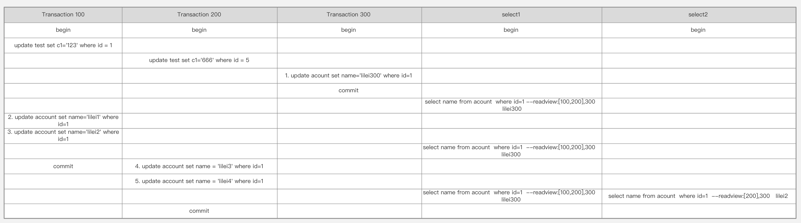
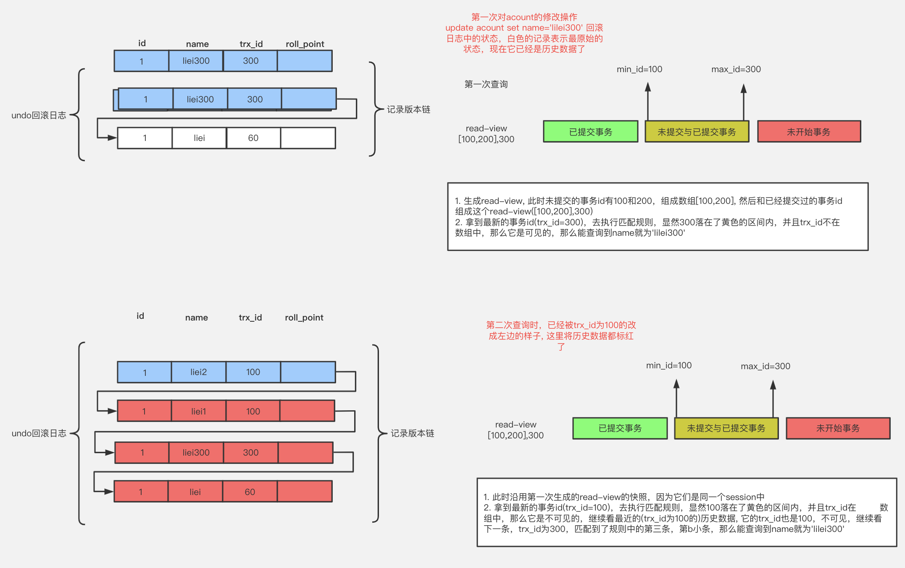
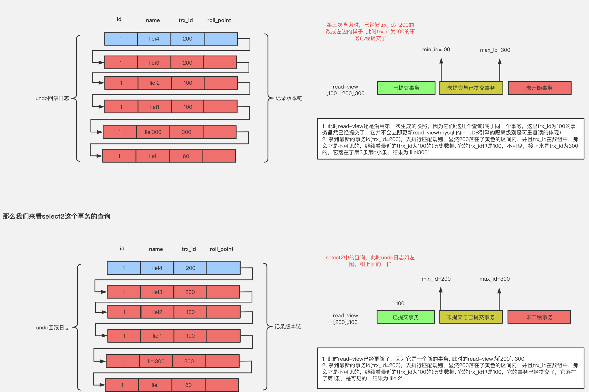

# 一、数据库锁机制

- 在并发访问中，可能会出现脏读、不可重复读和幻读等读现象，为了应对这些问题，主流数据库都提供了锁机制，并引入了事务隔离级别的概念

- 并发控制：确保及时纠正由并发操作导致的错误的一种机制；
	- 数据库管理系统(DBMS)中的并发控制的任务是：确保在多个事务同时存取数据库中同一数据时不破坏事务的隔离性和统一性以及数据库的统一性；
	- 封锁、时间戳、乐观并发控制(乐观锁)和悲观并发控制（悲观锁）是并发控制主要采用的技术手段

- 锁：将数据访问顺序化，以保证数据库数据的一致性；在执行多线程时用于强行限制资源访问的同步机制，即用于在并发控制中保证对互斥要求的满足
	- 锁的分类(Oracle)：
		- 按操作划分：可分为DML锁、DDL锁
		- 按锁的粒度划分：可分为表级锁、行级锁、页级锁（mysql）
		- 按锁级别划分：可分为共享锁、排他锁
		- 按加锁方式划分：可分为自动锁、显示锁
		- 按使用方式划分：可分为乐观锁、悲观锁
	- DML锁（data locks，数据锁），用于保护数据的完整性，其中包括行级锁(Row Locks (TX锁))、表级锁(table lock(TM锁))；DDL锁（dictionary locks，数据字典锁），用于保护数据库对象的结构，如表、索引等的结构定义。其中包排他DDL锁（Exclusive DDL lock）、共享DDL锁（Share DDL lock）、可中断解析锁（Breakable parse locks）

减少并发操作的锁冲突：把复杂的sql语句，拆分成多条简单的SQL语句

# 二、MySQL中的锁

## 1、行级锁

是Mysql中锁定粒度最细的一种锁，表示只针对当前操作的行进行加锁
- 行级锁能大大减少数据库操作的冲突；
- 其加锁粒度最小，但加锁的开销也最大
- 特点：开销大，加锁慢；会出现死锁；锁定粒度最小，发生锁冲突的概率最低，并发度也最高
- 行级锁分为共享锁 和 排他锁

### 1.1、概述

行级锁都是基于索引的，如果一条SQL语句用不到索引是不会使用行级锁的，会使用表级锁把整张表锁住
- MyISAM中是不会产生死锁的，因为MyISAM总是一次性获得所需的全部锁，要么全部满足，要么全部等待在InnoDB中，锁是逐步获得的，就造成了死锁的可能
- 在MySQL中，行级锁并不是直接锁记录，而是锁索引；索引分为主键索引和非主键索引两种.如果一条sql语句操作了主键索引，MySQL就会锁定这条主键索引；如果一条语句操作了非主键索引，MySQL会先锁定该非主键索引，再锁定相关的主键索引。在UPDATE、DELETE操作时，MySQL不仅锁定WHERE条件扫描过的所有索引记录，而且会锁定相邻的键值，即所谓的next-key locking；

InnoDB 存储引擎由于实现了行级锁虽然在锁定机制的实现方面锁带来的性能损耗可能会比表级锁定会更高些，但是在整体并发处理能力方面要远远优于 MyISAM 的表级锁定。当系统并发量较高时，InnoDB的整体性能和MyISAM 相比会有比较明显的优势；但是InnoDB的行级锁定同样有脆弱的一面，当我们使用不当时，可能会让InnoDB 的整体性能表现不仅不能比MyISAM 高，甚至可能更差

- 当两个事务同时执行，一个锁住了主键索引在等待其他相关索引，一个锁定了非主键索引，在等待主键索引。这样就会发生死锁
- 发生死锁后，InnoDB一般都可以检测到，并使一个事务释放锁回退，另一个获取锁完成事务

行级锁分类：主要分为 `Record Lock`、`Gap Locks`和`Next-Key Locks`。
- `Gap Locks`（间隙锁）会锁住两个索引之间的区间，比如`select * from User where id>3 and id<5 for update`，就会在区间（3，5）之间加上`Gap Locks`
- `Next-Key Locks`是`Gap Locks+Record Locks`形成闭区间锁`select * from User where id>=3 and id=<5 for update`，就会在区间[3,5]之间加上Next-Key Locks，锁定记录本身；

### 1.2、记录锁-RecordLock

是最简单的行锁。如下语句，id为主键
```sql
mysql> UPDATE accounts SET level = 100 WHERE id = 5;
```
这条 SQL 语句就会在 id = 5 这条记录上加上记录锁，防止其他事务对 id = 5 这条记录进行修改或删除。记录锁永远都是加在索引上的，就算一个表没有建索引，数据库也会隐式的创建一个索引；如果 WHERE 条件中指定的列是个`二级索引`，那么记录锁不仅会加在这个二级索引上，还会加在这个`二级索引所对应的聚簇索引`上；

如果 SQL 语句无法使用索引时会走主索引实现全表扫描，这个时候 MySQL 会给整张表的所有数据行加记录锁。如果一个 WHERE 条件无法通过索引快速过滤，存储引擎层面就会将所有记录加锁后返回，再由 MySQL Server 层进行过滤。不过在实际使用过程中，MySQL 做了一些改进，在 MySQL Server 层进行过滤的时候，如果发现不满足，会调用 unlock_row 方法，把不满足条件的记录释放锁（显然这违背了[二段锁协议](#6两阶段锁协议-TwoPhaseLocking)）。这样做，保证了最后只会持有满足条件记录上的锁，但是每条记录的加锁操作还是不能省略的。可见在没有索引时，不仅会消耗大量的锁资源，增加数据库的开销，而且极大的降低了数据库的并发性能，所以说，更新操作一定要记得走索引；

### 1.3、间隙锁-GapLocks

间隙锁：是一种加在两个索引之间的锁，或者加在第一个索引之前，或最后一个索引之后的间隙。有时候又称为范围锁（Range Locks），这个范围可以跨一个索引记录，多个索引记录，甚至是空的。使用间隙锁可以防止其他事务在这个范围内插入或修改记录，保证两次读取这个范围内的记录不会变，从而不会出现幻读现象。很显然，间隙锁会增加数据库的开销，虽然解决了幻读问题，但是数据库的并发性一样受到了影响，所以在选择数据库的隔离级别时，要注意权衡性能和并发性，根据实际情况考虑是否需要使用间隙锁，大多数情况下使用 read committed 隔离级别就足够了，对很多应用程序来说，幻读也不是什么大问题。

`UPDATE accounts SET level = 100 WHERE id = 5;` 这个 SQL 语句在 RC 隔离级别不会加任何锁，在 RR 隔离级别会在 id = 5 前后两个索引之间加上间隙锁。

值得注意的是：间隙锁和间隙锁之间是互不冲突的，间隙锁唯一的作用就是为了防止其他事务的插入，所以加间隙 S 锁和加间隙 X 锁没有任何区别；

### 1.4、Next-Key Locks

Next-key 锁：是记录锁和间隙锁的组合，它指的是加在某条记录以及这条记录前面间隙上的锁

假设一个索引包含：10、11、13 和 20 这几个值，可能的 Next-key 锁如下：
```
(-∞, 10]
(10, 11]
(11, 13]
(13, 20]
(20, +∞)
```
通常我们都用这种左开右闭区间来表示 Next-key 锁，其中，圆括号表示不包含该记录，方括号表示包含该记录。 前面四个都是 Next-key 锁，最后一个为间隙锁。和间隙锁一样，`在 RC 隔离级别下没有 Next-key 锁，只有 RR 隔离级别才有；`

`UPDATE accounts SET level = 100 WHERE id = 5;` 如果 id 不是主键，而是二级索引，且不是唯一索引，那么这个 SQL 在 RR 隔离级别下会加什么锁呢？答案就是 Next-key 锁，如下：
```
(a, 5]
(5, b)
```
其中，a 和 b 是 id = 5 前后两个索引，我们假设 a = 1、b = 10，那么此时如果插入一条 id = 3 的记录将会阻塞住。之所以要把 id = 5 前后的间隙都锁住，仍然是为了解决幻读问题，因为 id 是非唯一索引，所以 id = 5 可能会有多条记录，为了防止再插入一条 id = 5 的记录，必须将下面标记 ^ 的位置都锁住，因为这些位置都可能再插入一条 id = 5 的记录：`1 ^ 5 ^ 5 ^ 5 ^ 10 11 13 15`，这样避免了幻读的情况发生；

### 1.5、行级锁分析

```
mysql> show status like 'innodb_row_lock%'；
+-------------------------------+-------+
| Variable_name                 | Value |
+-------------------------------+-------+
| Innodb_row_lock_current_waits | 0     |
| Innodb_row_lock_time          | 41389 |
| Innodb_row_lock_time_avg      | 13796 |
| Innodb_row_lock_time_max      | 20024 |
| Innodb_row_lock_waits         | 3     |
+-------------------------------+-------+
```
- Innodb_row_lock_current_waits：当前正在等待的锁定数量；
- Innodb_row_lock_time：从系统启动到现在锁定的总时间长度；(******)
- Innodb_row_lock_time_avg：每次等待所花平均时间；(******)
- Innodb_row_lock_time_max：从系统启动到现在等待最长的一次所花的时间
- Innodb_row_lock_waits：等待总次数(******)

只有在两个事务出现锁竞争时才能在这个表 information_schema.innodb_locks 中看到锁信息，譬如你执行一条 UPDATE 语句，它会对某条记录加 X 锁，这个时候 information_schema.innodb_locks 表里是没有任何记录的。

另外，只看这个表只能得到当前持有锁的事务，至于是哪个事务被阻塞，可以通过 information_schema.innodb_lock_waits 表来查看

**如何手动锁定一行：**
```
begin：<br>
select xxx for update 锁定某一行后，其他的操作会被阻塞，直到锁定行的会话commit;
```

## 2、表级锁

### 2.1、概述

是MySQL中锁定粒度最大的一种锁，表示对当前操作的整张表加锁，它实现简单，资源消耗较少，被大部分MySQL引擎支持；
- 最常使用的MYISAM与INNODB都支持表级锁定。表级锁定分为表共享读锁（共享锁）与表独占写锁（排他锁）
- 特点：开销小，加锁快；不会出现死锁；锁定粒度大，发出锁冲突的概率最高，并发度最低

偏向 MyISAM 存储引擎，开销小，加锁快，无死锁；锁粒度大，发生的锁冲突的概率最高，并发度最低；

表锁机制：
	
	意向锁（升级锁）：当一个事务带着表锁去访问一个被加锁了行锁的资源，此时，行锁会升级成意向锁；
	自增锁：自增类型的数据

MyISAM 在执行查询语句之前，会自动给涉及的所有表加读锁，在执行增删改操作前，会自动给涉及的表加写锁；在对 MyISAM 表进行操作时，会出现以下情况：
- 对 MyISAM 表的读操作不会阻塞其他进程对同一表的请求，但会阻塞对同一表的写请求.只有当读锁释放后，才会进行其他进程的写操作；
- 对 MyISAM 表的写操作会阻塞其他进程对同一表的读和写操作，只有当写锁释放后，才会执行其他进程的读写操作；

**读锁会阻塞写锁，不会阻塞读； 而写锁会把读和写都阻塞.**

MySQL的表级锁有两种：
- 表共享读锁
- 表独占写锁


### 2.2、看哪些表被加锁了

0 -> 表示没有加锁； 1 -> 表示加锁
```
mysql> show open tables；
+--------------------+----------------------------------------------+--------+-------------+
| Database           | Table                                        | In_use | Name_locked |
+--------------------+----------------------------------------------+--------+-------------+
| mysql              | time_zone_transition_type                    |      0 |           0 |
| performance_schema | events_waits_summary_global_by_event_name    |      0 |           0 |
| performance_schema | file_summary_by_instance                     |      0 |           0 |
| performance_schema | setup_instruments                            |      0 |           0 |
| mysql              | servers                                      |      0 |           0 |
+--------------------+----------------------------------------------+--------+-------------+
```

### 2.3、分析表锁

可以通过检查 table_locks_immediate 和 table_locks_waited 状态变量来分析系统上的表锁定
```
mysql> show status like 'table%'；
+-----------------------+-------+
| Variable_name         | Value |
+-----------------------+-------+
| Table_locks_immediate | 36    |
| Table_locks_waited    | 0     |
+-----------------------+-------+
```
- table_locks_immediate：产生表级锁定的次数，表示可以立即获取锁的查询次数，每立即获取锁值加1；
- table_locks_waited：出现表级锁定争用而发生等待的次数（不能立即获取锁的次数，每等待一次锁值加1）此值高则说明存在着较为严重的表级锁定争用情况；

MyISAM 的读写锁调度是写优先，这也是 MyISAM 不适合做写为主表的引擎。因为写锁后，其他线程不能做任何操作，大量的更新会使查询很难得到锁，从而造成永远阻塞

## 3、页级锁

MySQL中锁定粒度介于行级锁和表级锁中间的一种锁；开销和加锁时间界于表锁和行锁之间；会出现死锁；锁定粒度界于表锁和行锁之间，并发度一般	

## 4、MySQL常用存储引擎的锁机制

- MyISAM和MEMORY采用表级锁(table-level locking)：
- BDB采用页面锁(page-level locking)或表级锁，默认为页面锁：
- InnoDB支持行级锁(row-level locking)和表级锁，默认为行级锁：
	- InnoDB行锁是通过给索引上的索引项加锁来实现的，只有通过索引条件检索数据，InnoDB才使用行级锁，否则，InnoDB将使用表锁！
	- 行级锁都是基于索引的，如果一条SQL语句用不到索引是不会使用行级锁的，会使用表级锁
	- 行级锁的缺点是：由于需要请求大量的锁资源，所以速度慢，内存消耗大

## 5、死锁

### 5.1、什么是死锁

是指两个或两个以上的进程在执行过程中，因争夺资源而造成的一种互相等待的现象，若无外力作用，它们都将无法推进下去。此时称系统处于死锁状态或系统产生了死锁，这些永远在互相等竺的进程称为死锁进程。表级锁不会产生死锁。所以解决死锁主要还是针对于最常用的InnoDB。

**死锁的关键在于：两个（或以上）的Session加锁的顺序不一致；解决死锁的问题的关键是加锁的顺序**

### 5.2、死锁产生原因

死锁一般是事务相互等待对方资源，最后形成环路造成的

分析死锁日志：`SHOW ENGINE INNODB STATUS;`

### 5.3、死锁处理策略

- 直接进入等待，知道超时。超时时间可以通过参数：`innodb_lock_wait_timeout` 来设置；

	在Innodb中`innodb_lock_wait_timeout` 参数默认值时50s，意味着如果采用该策略的话，当出现死锁一行，第一个被锁住的线程要等待50s才会超时退出。但是又不可能设置成很小值，会存在误伤不是死锁，只是简单的锁等待；

- 发起死锁检测，发生死锁后，将持有最少行级排它锁的事务进行回滚，让其他事务得以继续执行。将参数 `innodb_deadlock_detect` 设置为on，表示开启这个逻辑；

	`innodb_deadlock_detect`默认是on的，主动死锁检测在发生死锁的时候，能够快速发现并进行处理的。

### 5.4、死锁案例

- 不同表相同记录行锁冲突：事务A和事务B操作两张表，但出现循环等待锁情况
- 相同表记录行锁冲突，这种情况比较常见：遇到两个job在执行数据批量更新时，jobA处理的的id列表为[1，2，3，4]，	而job处理的id列表为[8，9，10，4，2]，这样就造成了死锁
- 不同索引锁冲突：事务A在执行时，除了在二级索引加锁外，还会在聚簇索引上加锁，在聚簇索引上加锁的顺序是[1，4，2，3，5]，而事务B执行时，只在聚簇索引上加锁，加锁顺序是[1，2，3，4，5]，这样就造成了死锁的可能性.
- gap锁冲突：innodb在RR级别下，如下的情况也会产生死锁
- 一般的情况，两个session分别通过一个sql持有一把锁，然后互相访问对方加锁的数据产生死锁；
- 两个单条的sql语句涉及到的加锁数据相同，但是加锁顺序不同，导致了死锁

**（1）in() 锁住一部分数据：在in里面的列表值mysql是会自动从小到大排序，加锁也是一条条从小到大加的锁**

session1：
```sql
mysql> select * from t3 where id in (8,9) for update;
+----+--------+------+---------------------+
| id | course | name | ctime               |
+----+--------+------+---------------------+
|  8 | WA     | f    | 2016-03-02 11:36:30 |
|  9 | JX     | f    | 2016-03-01 11:36:30 |
+----+--------+------+---------------------+
rows in set (0.04 sec)
```

session2:
```sql
mysql> select * from t3 where id in (10,8,5) for update;
-- 锁等待中：其实这个时候id=10这条记录没有被锁住的，但id=5的记录已经被锁住了，锁的等待在id=8的这里
```

session3:
```sql
mysql> select * from t3 where id=5 for update;
-- 锁等待中
```

session4:
```sql
mysql> select * from t3 where id=10 for update;
+----+--------+------+---------------------+
| id | course | name | ctime               |
+----+--------+------+---------------------+
| 10 | JB     | g    | 2016-03-10 11:45:05 |
+----+--------+------+---------------------+
row in set (0.00 sec)
```
在其它session中id=5是加不了锁的，但是id=10是可以加上锁的

**（2）根据字段值查询（有索引），如果不存在，则插入；否则更新**

session1:
```sql
select * from t3 where id=22 for update;
Empty set (0.00 sec)
```
session2:
```sql
select * from t3 where id=23  for update;
Empty set (0.00 sec)
```
然后session1:
```sql
insert into t3 values(22,'ac','a',now());
-- 锁等待中
```
session2:
```sql
insert into t3 values(23,'bc','b',now());
-- ERROR 1213 (40001): Deadlock found when trying to get lock; try restarting transaction
```

当对存在的行进行锁的时候(主键)，mysql就只有行锁。当对未存在的行进行锁的时候(即使条件为主键)，mysql是会锁住一段范围（有gap锁）

锁住的范围为：(无穷小或小于表中锁住id的最大值，无穷大或大于表中锁住id的最小值)

如：如果表中目前有已有的id为（11 ， 12），那么就锁住（12，无穷大）

如果表中目前已有的id为（11 ， 30），那么就锁住（11，30）

对于这种死锁的解决办法是：
```sql
insert into t3(xx,xx) on duplicate key update `xx`='XX';
```
用mysql特有的语法来解决此问题。因为insert语句对于主键来说，插入的行不管有没有存在，都会只有行锁

**（3）范围查询**

session1:
```sql
mysql> select * from t3 where id=9 for update;
+----+--------+------+---------------------+
| id | course | name | ctime               |
+----+--------+------+---------------------+
|  9 | JX     | f    | 2016-03-01 11:36:30 |
+----+--------+------+---------------------+
row in set (0.00 sec)
```
session2:
```sql
mysql> select * from t3 where id<20 for update;
-- 锁等待
```
Session1:
```sql
mysql> insert into t3 values(7,'ae','a',now());
ERROR 1213 (40001): Deadlock found when trying to get lock; try restarting transaction
```
Session2在等待Session1的id=9的锁，session2又持了1到8的锁（注意9到19的范围并没有被session2锁住），最后，session1在插入新行时又得等待session2，故死锁发生了；

### 5.5、避免死锁

- 以固定的顺序访问表和行：比如两个job批量更新的情形，简单方法是对id列表先排序，后执行，这样就避免了交叉等待锁的情形；又比如将两个事务的sql顺序调整为一致，也能避免死锁；
- 大事务拆小：大事务更容易死锁，如果业务允许，将大事务拆小；
- 在同一个事务中，尽可能做到一次锁定所需要的所有资源，减少死锁概率；
- 降低隔离级别：如果业务允许，将隔离级别调低也是较好的选择，比如将隔离级别从RR调整为RC，可以避免掉很多因为gap锁造成的死锁；
- 为表添加合理的索引：可以看到如果不走索引将会为表的每一行记录添加上锁，死锁的概率大大增大；

可以从以下角度考虑：
- 如果确保业务一定不会出现死锁，可以临时把死锁检测关掉；
- 控制并发度；

### 5.6、定位死锁问题

- 通过应用业务日志定位到问题代码，找到相应的事务对应的sql；
- 确定数据库隔离级别

## 6、两阶段锁协议-TwoPhaseLocking

在InnoDB事务中，行锁是在需要的时候才加上的，但并不是不需要了就立刻释放，而是要等到事务结束时才释放，并且锁是在同一时刻被释放。这就是两阶段锁协议。

2PL锁操作分为两个阶段：加锁阶段与解锁阶段，并且保证加锁阶段与解锁阶段不相交；
- 加锁阶段：只加锁，不解锁。
- 解锁阶段：只解锁，不加锁

## 7、共享锁与排他锁

属于行级锁

- 共享锁(Share Lock)：又称读锁，是读取操作创建的锁
	- 其他用户可以并发读取数据，但任何事务都不能对数据进行修改(获取数据上的排他锁)，直到已释放所有共享锁；如果事务T对数据A加上共享锁后，则其他事务只能对A再加共享锁，不能加排他锁
	- 使用：
		`SELECT ... LOCK IN SHARE MODE;`
		在查询语句后面增加`LOCK IN SHARE MODE`，Mysql会对查询结果中的每行都加共享锁，当没有其他线程对查询结果集中的任何一行使用排他锁时，可以成功申请共享锁，否则会被阻塞；

- 排他锁(eXclusive Lock)：又称写锁
	- 如果事务T对数据A加上排他锁后，则其他事务不能再对A加任任何类型的封锁.获准排他锁的事务既能读数据，又能修改数据；
	- 用法：`SELECT ... FOR UPDATE;`在查询语句后面增加 FOR UPDATE，Mysql会对查询结果中的每行都加排他锁，当没有其他线程对查询结果集中的任何一行使用排他锁时，可以成功申请排他锁，否则会被阻塞

## 8、意向锁：InnoDB还有两个表锁

- InnoDB还有两个表锁：
	- 意向共享锁(IS)：表示事务准备给数据行加入共享锁，也就是说一个数据行加共享锁前必须先取得该表的IS锁
	- 意向排他锁(IX)：表示事务准备给数据行加入排他锁，说明事务在一个数据行加排他锁前必须先取得该表的IX锁

- 意向锁是InnoDB自动加的，不需要用户干预
	对于 `insert，update，delete`，InnoDB会自动给涉及的数据加排他锁（X）；对于一般的 select 语句，InnoDB不会加任何锁，事务可以通过以下语句给显示加共享锁或排他锁
	- 共享锁：`SELECT ... LOCK IN SHARE MODE`；
	- 排他锁：`SELECT ... FOR UPDATE`；

## 9、AUTO_INC锁

AUTO_INC 锁又叫自增锁（一般简写成 AI 锁），它是一种特殊类型的表锁，当插入的表中有自增列（AUTO_INCREMENT）的时候可能会遇到。当插入表中有自增列时，数据库需要自动生成自增值，在生成之前，它会先为该表加 AUTO_INC 表锁，其他事务的插入操作阻塞，这样保证生成的自增值肯定是唯一的。AUTO_INC 锁具有如下特点：
- AUTO_INC 锁互不兼容，也就是说同一张表同时只允许有一个自增锁；
- 自增锁不遵循二段锁协议，它并不是事务结束时释放，而是在 INSERT 语句执行结束时释放，这样可以提高并发插入的性能。
- 自增值一旦分配了就会 +1，如果事务回滚，自增值也不会减回去，所以自增值可能会出现中断的情况；

## 10、隐式和显示锁定

InnoDB采用的是两阶段锁定协议。在事务的执行过程中，随时可以执行锁定，锁只有在执行commit或rollback的时候才释放，并且所有的锁是在同一时刻释放。

InnoDB会根据隔离级别在需要的时候自动加锁；

InnoDB也支持通过特定的语句进行显示锁定：
- `select ... lock in share mode;`
- `select ... for update;`，其加的是悲观锁，没用`索引/主键`的话就是表锁，否则就是是行锁；
	- 如果查询条件用了索引/主键，那么`select ..... for update`就会进行行锁；
	- 如果是普通字段(没有索引/主键)，那么`select ..... for update`就会进行锁表；

## 11、MySQL加锁分析

- [MySQL加锁处理分析.pdf](MySQL/MySQL加锁处理分析.pdf)
- [加锁分析](https://www.aneasystone.com/archives/2017/11/solving-dead-locks-two.html)
- [加锁场景分析](https://mp.weixin.qq.com/s/CIRbrYpm88959kQtuyQRyg)

关键点：
当执行下面的 SQL 时（id 为 students 表的主键），我们要知道，InnoDb 存储引擎会在 id = 49 这个主键索引上加一把 X 锁。
```
mysql> update students set score = 100 where id = 49;
```
当执行下面的 SQL 时（name 为 students 表的二级索引），InnoDb 存储引擎会在 name = 'Tom' 这个索引上加一把 X 锁，同时会通过 name = 'Tom' 这个二级索引定位到 id = 49 这个主键索引，并在 id = 49 这个主键索引上加一把 X 锁。
```
mysql> update students set score = 100 where name = 'Tom';
```

# 三、乐观锁与悲观锁

## 1、悲观锁

- 定义：在关系数据库管理系统里，悲观并发控制(又名"悲观锁"，Pessimistic Concurrency Control，缩写"PCC")是一种并发控制的方法；
	- 它可以阻止一个事务以影响其他用户的方式来修改数据。如果一个事务执行的操作都某行数据应用了锁，那只有当这个事务把锁释放，其他事务才能够执行与该锁冲突的操作
	- 悲观并发控制主要用于数据争用激烈的环境，以及发生并发冲突时使用锁保护数据的成本要低于回滚事务的成本的环境中

- 它指的是对数据被外界(包括本系统当前的其他事务，以及来自外部系统的事务处理)修改持保守态度(悲观)，因此，在整个数据处理过程中，将数据处于锁定状态，悲观锁的实现，往往依靠数据库提供的锁机制 

- 在数据库中，悲观锁的流程如下：
	- 在对任意记录进行修改前，先尝试为该记录加上排他锁（exclusive locking）
	- 如果加锁失败，说明该记录正在被修改，那么当前查询可能要等待或者抛出异常。具体响应方式由开发者根据实际需要决定。
	- 如果成功加锁，那么就可以对记录做修改，事务完成后就会解锁了。
	- 其间如果有其他对该记录做修改或加排他锁的操作，都会等待我们解锁或直接抛出异常。

- MySQL InnoDB中使用悲观锁：要使用悲观锁，我们必须关闭mysql数据库的自动提交属性，因为MySQL默认使用autocommit模式，也就是说，当你执行一个更新操作后，MySQL会立刻将结果进行提交。`set autocommit=0;`

- 优点与不足
	- 悲观并发控制实际上是"先取锁再访问"保守策略，为数据处理的安全提供了保证
	- 效率方面，处理加锁的机制会让数据库产生额外的开销，还有增加产生死锁的机会；
	- 另外，在只读型事务处理中由于不会产生冲突，也没必要使用锁，这样做只能增加系统负载；
	- 还有会降低了并行性，一个事务如果锁定了某行数据，其他事务就必须等待该事务处理完才可以处理那行数

## 2、乐观锁

- 定义：
	在关系数据库管理系统里，乐观并发控制。它假设多用户并发的事务在处理时不会彼此互相影响，各事务能够在不产生锁的情况下处理各自影响的那部分数据。在提交数据更新之前，每个事务会先检查在该事务读取数据后，有没有其他事务又修改了该数据。如果其他事务有更新的话，正在提交的事务会进行回滚

- 相对于悲观锁而言，乐观锁假设认为数据源一般情况下不会造成数据冲突，所以在数据进行提交更新的时候，才正式对数据的冲突与否进行检测，如果发现冲突了，则让返回用户错误的信息，让用户决定如何去做

- 数据版本：
	在对数据库进行处理的时候，乐观锁并不会使用数据库提供的锁机制。一般的实现乐观锁的方式就是记录数据版本。
	* 数据版本：为数据增加一个版本标识.当读取数据时，将版本标识一同读出，数据每更新一次，同时对版本标识进行更新。当我们提交更新时，判断数据库表对应记录的当前版本信息与第一次取出来的版本标识进行比对，如果数据库表当前版本号与第一次取出来的版本标识值相等，则予以更新，否则认为是过期数据。

- 数据版本的实现方式：
	- 使用版本号
	- 使用时间戳

- CAS：乐观锁技术，Java5之后的`J.U.C`包就是建立在[CAS](../Java/Java基础/Java并发与多线程.md#2cascompare-and-swap-比较与交换)之上的
	
- 优点与不足：乐观并发控制相信事务之间的数据竞争的概率是比较小的，因此尽可能之间做下去，直到提交的采取锁定，所以不会产生任何锁和死锁。但如果直接简单这么做，还是有可能遇到不可预期的结果.

## 3、悲观锁与乐观锁适用场景

### 3.1、悲观锁

比较适合写入操作比较频繁的场景，如果出现大量的读取操作，每次读取的时候都会进行加锁，这样会增加大量的锁的开销，降低了系统的吞吐量；

### 3.2、乐观锁

比较适合读取操作比较频繁的场景，如果出现大量的写入操作，数据发生冲突的可能性就会增大，为了保证数据的一致性，应用层需要不断的重新获取数据，这样会增加大量的查询操作，降低了系统的吞吐量.

乐观锁本身是不加锁的，只是在更新时判断一下数据是否被其他线程更新了；有时乐观锁可能与加锁操作合作

# 四、MySQL加锁分析

## 1、MVCC：多版本并发控制

### 1.1、MVCC概述

MVCC，全称Multi-Version Concurrency Control，即多版本并发控制。MVCC是一种并发控制的方法，一般在数据库管理系统中，实现对数据库的并发访问，在编程语言中实现事务内存；可以认为MVCC是行级锁的一个变种；不同存储引擎的MVCC实现是不同的，典型的有乐观并发控制和悲观并发控制；

REPEATABLE READ隔离级别，MVCC的操作过程：
```
select
	InnoDB会根据以下两个条件检查每行记录：
	a.InnoDB只查找版本早于当前事务版本的数据行（也就是行的系统版本号小于或等于当前事务系统版本号），这样可以确保事务读取的行，要么是在事务开始已经存在的，要么是事务自身插入或者修改过的；
	b.行的删除版本要么未定义，要么大于当前事务版本号。这样可以确保事务读取到的行，在事务开始之前未被删除；
	只有符合上述两个条件的记录，才能作为查询结果；

insert：InnoDB为新插入的每一行保存当前系统版本号作为行版本号；

delete：InnoDB为删除的每一行保存当前系统版本号作为行删除标识；

update：InnoDB为插入一行新记录，保存当前系统版本号作为行版本号，同时保存当前系统版本号作为原来的行作为删除标识；
```
保存这两个额外的系统版本号，使得大多读操作都可以不用加锁；

### 1.2、MySQL当前读与快照读

在MVCC并发控制中，读操作可以分成两类：`快照读 (snapshot read)`与`当前读 (current read)`。
- 快照读，读取的是记录的可见版本 (有可能是历史版本)，不用加锁。快照读的前提是隔离级别不是串行化级别，串行化级别下的快照读会退化成当前读
- 当前读，读取的是记录的最新版本，并且，当前读返回的记录，都会加上锁，保证其他事务不会再并发修改这条记录

MVCC就是为了实现读-写冲突不加锁，而这个读指的就是快照读, 而非当前读，当前读实际上是一种加锁的操作，是悲观锁的实现

在一个支持MVCC并发控制的系统中，哪些读操作是快照读？哪些操作又是当前读呢？以MySQL InnoDB为例：
- 快照读：简单的select操作，属于快照读，不加锁。(当然，也有例外，下面会分析)：`select * from table where ?;`；不加锁
- 当前读：特殊的读操作，插入/更新/删除操作，属于当前读，需要加锁。
	- `select * from table where ? lock in share mode;`  加 S 锁；
	- `select * from table where ? for update;` 加 X 锁；
	- `insert into table values (…);` 加 X 锁；
	- `update table set ? where ?;` 加 X 锁；
	- `delete from table where ?;` 加 X 锁；

	所有以上的语句，都属于当前读，读取记录的最新版本。并且，读取之后，还需要保证其他并发事务不能修改当前记录，对读取记录加锁。其中，除了第一条语句，对读取记录加S锁 (共享锁)外，其他的操作，都加的是X锁 (排它锁)

 	一个Update操作的具体流程。当Update SQL被发给MySQL后，MySQL Server会根据where条件，读取第一条满足条件的记录，然后InnoDB引擎会将第一条记录返回，并加锁 (current read)。待MySQL Server收到这条加锁的记录之后，会再发起一个Update请求，更新这条记录。一条记录操作完成，再读取下一条记录，直至没有满足条件的记录为止。因此，Update操作内部，就包含了一个当前读。同理，Delete操作也一样。Insert操作会稍微有些不同，简单来说，就是Insert操作可能会触发Unique Key的冲突检查，也会进行一个当前读；

	针对一条当前读的 SQL 语句，InnoDB 与 MySQL Server 的交互，是一 条一条进行的，因此，加锁也是一条一条进行的。先对一条满足条件的记录加锁，返回给 MySQL Server，做一些 DML 操作;然后在读取下一条加锁，直至读取完毕


MVCC只在`Read committed`、`Repeatable read`两个隔离级别下工作，其他两个级别都和MVCC不兼容；因为`Read uncommitted`总是读取最新的数据行，而不是符合当前事务版本的数据行；

`Read committed`和`Repeatable read`在MVCC实现层面上的区别：
- `Read committed`，每次快照读都会新生成一个快照和Read View；针对当前读，RC 隔离级别保证对读取到的记录加锁 (记录锁)
- 在实现`Repeatable read`隔离级别，只需要在事务开始的时候创建一致性视图（Read VIEW），也叫做快照，之后的查询里都共用这个一致性视图，后续的事务对数据的更改是对当前事务是不可见的，这样就实现了可重复读；针对当前读，RR 隔离级别保证对读取到的记录加锁 (记录锁)，同时保证对读取的范围 加锁，新的满足查询条件的记录不能够插入 (间隙锁)，不存在幻读现象

### 1.3、MVCC解决的问题

多版本并发控制（MVCC）是一种用来解决读-写冲突的无锁并发控制，也就是为事务分配单向增长的时间戳，为每个修改保存一个版本，版本与事务时间戳关联，读操作只读该事务开始前的数据库的快照，MVCC可以为数据库解决以下问题：
- 在并发读写数据库时，可以做到在读操作时不用阻塞写操作，写操作也不用阻塞读操作，提高了数据库并发读写的性能；
- 同时还可以解决脏读，幻读，不可重复读等事务隔离问题，但不能解决更新丢失问题；

### 1.4、MVCC的实现原理

MVCC的目的就是多版本并发控制，在数据库中的实现，就是为了解决读写冲突，它的实现原理主要是依赖记录中的：3个隐式字段、undo日志、Read View 来实现的

**隐式字段：**每行记录除了我们自定义的字段外，还有数据库隐式定义的`DB_TRX_ID`、`DB_ROLL_PTR`、`DB_ROW_ID`等字段
- `DB_TRX_ID`：6byte，最近修改(修改/插入)事务ID：记录创建这条记录/最后一次修改该记录的事务ID；
- `DB_ROLL_PTR`：7byte，回滚指针，指向这条记录的上一个版本（存储于rollback segment里）；
- `DB_ROW_ID`6byte，隐含的自增ID（隐藏主键），如果数据表没有主键，InnoDB会自动以DB_ROW_ID产生一个聚簇索引；
- 实际还有一个删除flag隐藏字段, 既记录被更新或删除并不代表真的删除，而是删除flag变了；

`DB_ROW_ID`是数据库默认为该行记录生成的唯一隐式主键，`DB_TRX_ID`是当前操作该记录的事务ID,而`DB_ROLL_PTR`是一个回滚指针，用于配合undo日志，指向上一个旧版本；

**undo日志：**
- `insert undo log`：代表事务在insert新记录时产生的undo log, 只在事务回滚时需要，并且在事务提交后可以被立即丢弃
- `update undo log`：事务在进行update或delete时产生的undo log; 不仅在事务回滚时需要，在快照读时也需要；所以不能随便删除，只有在快速读或事务回滚不涉及该日志时，对应的日志才会被purge线程统一清除；

**Read View(读视图)：** Read View就是事务进行`快照读`操作的时候生产的读视图(Read View)，在该事务执行的快照读的那一刻，会生成数据库系统当前的一个快照，记录并维护系统`当前活跃事务的ID`(当每个事务开启时，都会被分配一个ID, 这个ID是递增的，所以最新的事务，ID值越大)

Read View 主要是用来做可见性判断的, 即当我们某个事务执行快照读的时候，对该记录创建一个Read View读视图，把它比作条件用来判断当前事务能够看到哪个版本的数据，既可能是当前最新的数据，也有可能是该行记录的undo log里面的某个版本的数据

Read View 遵循一个可见性算法，主要是将要被修改的数据的最新记录中的`DB_TRX_ID`（即当前事务ID）取出来，与`系统当前其他活跃事务的ID`去对比（由Read View维护），如果`DB_TRX_ID`跟Read View的属性做了某些比较，不符合可见性，那就通过`DB_ROLL_PTR`回滚指针去取出`Undo Log`中的`DB_TRX_ID`再比较，即遍历链表的`DB_TRX_ID`（从链首到链尾，即从最近的一次修改查起），直到找到满足特定条件的`DB_TRX_ID,` 那么这个`DB_TRX_ID`所在的旧记录就是当前事务能看见的最新老版本；

比较规则，假设将read view中的几个事务ID形成变量：`trx_list`（活跃事务id列表）、`min_trx_id`（最小事务id）、`max_trx_id`（ReadView生成时刻系统尚未分配的下一个事务ID，也就是目前已出现过的事务ID的最大值+1）、`DB_TRX_ID`（当前事务id）
- 当 `DB_TRX_ID < min_trx_id`时，则当前事务能看到`DB_TRX_ID` 所在的记录；如果大于，进入下一个判断：
- 当 `DB_TRX_ID > max_trx_id`，如果大于等于则代表DB_TRX_ID 所在的记录在Read View生成后才出现的，那对当前事务肯定不可见；
- 如果是在 `min_trx_id <= DB_TRX_ID <= max_trx_id`，包含两种情况：
	- 如果 DB_TRX_ID 在 trx_list 列表中，代表在Read View生成时刻，该事务还在活跃，还没有Commit，该事务修改的数据，当前事务也是看不见的；
	- 如果不在 trx_list 列表中，表示其是已提交的事务，其数据是可见的；

```c++
/** Check whether the changes by id are visible.
@param[in]	id	transaction id to check against the view
@param[in]	name	table name
@return whether the view sees the modifications of id. */
bool changes_visible(trx_id_t id, const table_name_t &name) const MY_ATTRIBUTE((warn_unused_result)) {
  ut_ad(id > 0);
  if (id < m_up_limit_id || id == m_creator_trx_id) {
    return (true);
  }
  check_trx_id_sanity(id, name);
  if (id >= m_low_limit_id) {
    return (false);
  } else if (m_ids.empty()) {
    return (true);
  }
  const ids_t::value_type *p = m_ids.data();
  return (!std::binary_search(p, p + m_ids.size(), id));
}
```

### 1.5、MVCC整体流程

以下列执行过程为例：



其中上面的 Transaction100 和 Transaction200 修改操作用来生成两个事务id，在开启事务执行写操作时会生成事务id，而查询不会

执行过程：





对于删除可以认为是特殊的update操作，会将版本链上最新数据复制一份，然后将 trx_id 修改成删除的 trx_id，同时在该条记录的头信息（record_head）里的delete_flag 标记位上写上true，用来表示当前记录已经被删除，在查询时按照上面的规则匹配时，如果查到对应的记录delete_flag 为true，意味着记录被删除，不返回数据；

# 参考文章

* [深入理解悲观锁与乐观锁](http://www.hollischuang.com/archives/934)
* [MVCC底层实现](https://blog.csdn.net/SnailMann/article/details/94724197)
* [MVCC流程](https://www.processon.com/view/link/5eef4a2d6376891e81dc7d28)
