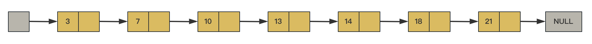
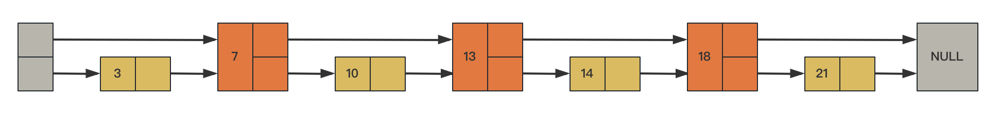
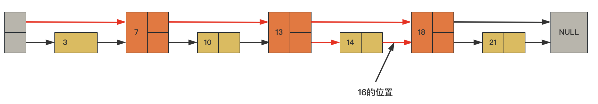
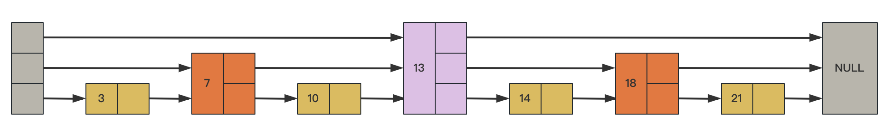
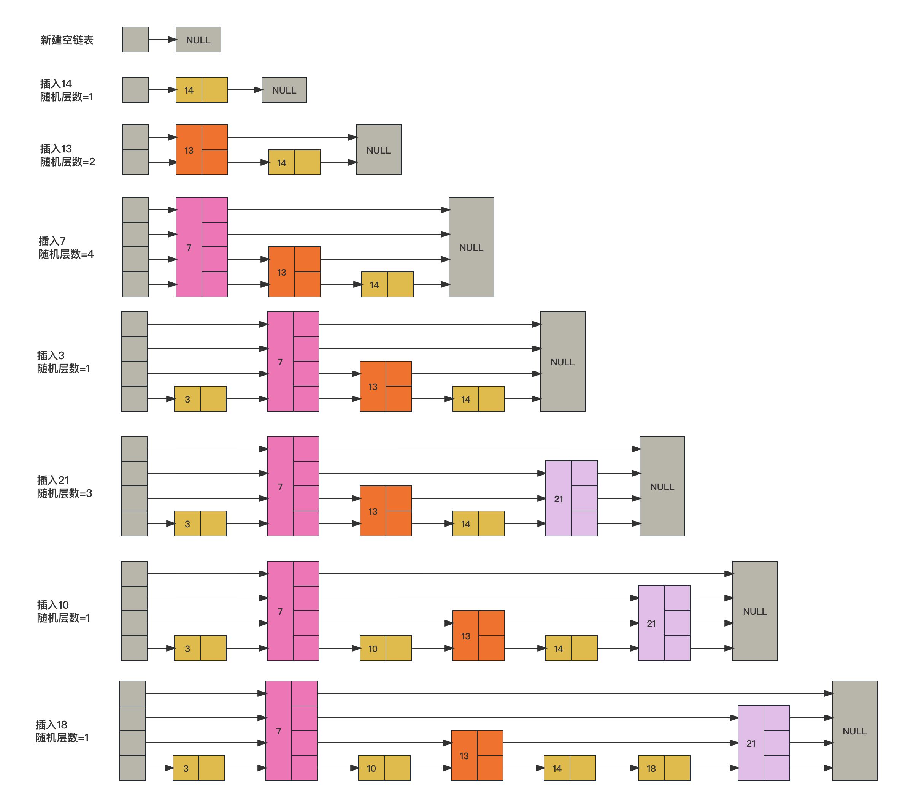
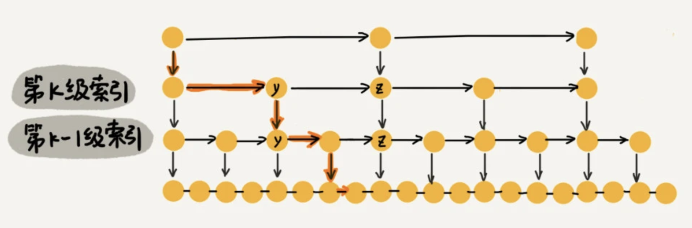

- [数据结构学习](https://mp.weixin.qq.com/s/utnN3S2IFktFREMxFsI3mw)

# 二、SkipList-跳表

- [跳表](https://mp.weixin.qq.com/s/drEJPZw7iYiwtMlRI--L6g)
- [Redis为什么用跳表不用红黑树](https://juejin.cn/post/6844903446475177998)
- [Skip Lists: A Probabilistic Alternative to Balanced Trees](https://15721.courses.cs.cmu.edu/spring2018/papers/08-oltpindexes1/pugh-skiplists-cacm1990.pdf)

## 1、什么是跳表

它允许快速查询一个有序连续元素的数据链表。跳跃列表的平均查找和插入时间复杂度都是O(log n)，优于普通队列的O(n)；跳表的思想，用“空间换时间”，通过给链表建立索引，提高了查找的效率；

- 跳跃表是基于链表扩展实现的一种特殊链表，类似于树的实现，跳跃表不仅实现了横向链表，还实现了垂直方向的分层索引
- 跳表是可以实现二分查找的有序链表；链表加多级索引的结构就是跳表
- 一个跳跃表由若干层链表组成，每一层都实现了一个有序链表索引，只有最底层包含了所有数据，每一层由下往上依次通过一个指针指向上层相同值的元素，每层数据依次减少，等到了最顶层就只会保留部分数据了
- 跳表使用了空间换时间的设计思路

## 2、基本结构

最底层是原始链表，如果在原始链表查询任何数据，时间复杂度都是$O(N)$；假如我们每相邻两个节点增加一个指针，让指针指向下下个节点，如下图：

这样所有新增加的指针连成了一个新的链表，但它包含的节点个数只有原来的一半（上图中是7, 13, 18）

如果想查找数据的时候，可以先沿着这个新链表进行查找。当碰到比待查数据大的节点时，再回到原来的链表中进行查找。比如，我们想查找16，查找的路径是沿着下图中标红的指针所指向的方向进行的：

- 16首先和7比较，再和13比较，比它们都大，继续向后比较。
- 但16和18比较的时候，比18要小，因此回到下面的链表（原链表），与14比较。
- 16比14要大，沿下面的指针继续向后和18比较。16比18小，说明待查数据18在原链表中不存在，而且它的插入位置应该在14和18s之间。

利用同样的方式，我们可以在上层新产生的链表上，继续为每相邻的两个节点增加一个指针，从而产生第三层链表。如下图：

跳表不要求上下相邻两层链表之间的节点个数有严格的对应关系，而是为每个节点随机出一个层数(level)。比如，一个节点随机出的层数是3，那么就把它链入到第1层到第3层这三层链表中；

## 3、插入过程

跳表这个动态数据结构，不仅支持查找操作，还支持动态的插入、删除操作，而且插入、删除操作的时间复杂度也是 $O({\log}n)$

下图是跳表数据插入过程：s

从上面跳表的创建和插入过程可以看出，每一个节点的层数（level）是随机出来的，而且新插入一个节点不会影响其它节点的层数。因此，插入操作只需要修改插入节点前后的指针，而不需要对很多节点都进行调整。这就降低了插入操作的复杂度。实际上，这是条包的一个很重要的特性，这让它在插入性能上明显优于平衡树的方案

## 4、复杂度

### 4.1、时间复杂度

上面讲到的，每两个结点会抽出一个结点作为上一级索引的结点，那第一级索引的结点个数大约就是 $n/2$，第二级索引的结点个数大约就是 $n/4$，第三级索引的结点个数大约就是 $n/8$，依次类推，也就是说，第 $k$ 级索引的结点个数是第 $k-1$ 级索引的结点个数的 $1/2$，那第 k级索引结点的个数就是 $n/(2^k)$ ；

假设索引有 h 级，最高级的索引有 2 个结点。通过上面的公式，我们可以得到 $n/(2^h)=2$，从而求得 $h=\log_2n-1$。如果包含原始链表这一层，整个跳表的高度就是 $\log_2n$。我们在跳表中查询某个数据的时候，如果每一层都要遍历 m 个结点，那在跳表中查询一个数据的时间复杂度就是 $O(m*{\log}n)$

m的值等于3，为什么？假设我们要查找的数据是 x，在第 k 级索引中，我们遍历到 y 结点之后，发现 x 大于 y，小于后面的结点 z，所以我们通过 y 的 down 指针，从第 k 级索引下降到第 k-1 级索引。在第 k-1 级索引中，y 和 z 之间只有 3 个结点（包含 y 和 z），所以，我们在 K-1 级索引中最多只需要遍历 3 个结点，依次类推，每一级索引都最多只需要遍历 3 个结点

通过上面的分析，我们得到 m=3，所以在跳表中查询任意数据的时间复杂度就是 $O({\log}n)$。这个查找的时间复杂度跟二分查找是一样的；这种查询效率的提升，前提是建立了很多级索引，也就是空间换时间的设计思路；

### 4.2、空间复杂度

假设原始链表大小为 n，那第一级索引大约有 $n/2$ 个结点，第二级索引大约有 $n/4$ 个结点，以此类推，每上升一级就减少一半，直到剩下 2 个结点。如果我们把每层索引的结点数写出来，就是一个等比数列：（原始链表大小为n，每2个节点抽一个，每层的索引节点数）

$$ \frac n2,\frac n4,\frac n8, {\ldots}{\ldots} , 8,4,2$$

这几级索引的结点总和就是 $\frac n2 + \frac n4 + \frac n8 + {\ldots}{\ldots} + 8 + 4 + 2=n-2$。所以，跳表的空间复杂度是 O(n)。也就是说，如果将包含 n 个结点的单链表构造成跳表，我们需要额外再用接近 n 个结点的存储空间

## 5、删除

如果这个结点在索引中也有出现，除了要删除原始链表中的结点，还要删除索引中的。因为单链表中的删除操作需要拿到要删除结点的前驱结点，然后通过指针操作完成删除。所以在查找要删除的结点的时候，一定要获取前驱结点。当然，如果用的是双向链表，就不需要考虑这个问题了；

## 6、代码实现

[SkipList.java](code/SkipList.java)

执行插入操作时计算随机数的过程，是一个很关键的过程，它对skiplist的统计特性有着很重要的影响，这并不是一个普通的服从均匀分布的随机数，计算过程如下：
- 首先，每个节点肯定都有第1层指针（每个节点都在第1层链表里）；
- 如果一个节点有第i层(i>=1)指针（即节点已经在第1层到第i层链表中），那么它有第(i+1)层指针的概率为p；
- 节点最大的层数不允许超过一个最大值，记为MaxLevel；

# 三、散列表

- [设计一个哈希映射](https://leetcode-cn.com/problems/design-hashmap/)
- [哈希的本质](https://mp.weixin.qq.com/s/cKtJHDzz2Z8N_2wdLvYfOQ)

## 1、基本概念

散列表用的是数组支持按照下标随机访问数据的特性，所以散列表其实就是数组的一种扩展，由数组演化而来。可以说，如果没有数组，就没有散列表；其时间复杂度是$O(N)$
- 散列函数：将各类值转为数组下标的函数；
- 散列值：散列函数计算得到的值就叫作散列值（或“Hash 值”“哈希值”）；

## 2、散列函数

散列函数，顾名思义，它是一个函数。可以把它定义成 `hash(key)`，其中 key 表示元素的键值，`hash(key)` 的值表示经过散列函数计算得到的散列值；

散列函数设计的基本要求：
- 散列函数计算得到的散列值是一个非负整数；
- 如果 $key1 = key2$，那 $hash(key1) == hash(key2)$
- 如果 $key1 ≠ key2$，那 $hash(key1) ≠ hash(key2)$，这点主要是跟散列冲突有关，即便像著名的MD5、SHA、CRC等哈希算法，也无法完全避免这种散列冲突。而且，因为数组的存储空间有限，也会加大散列冲突的概率。

## 3、散列冲突

如何解决散列冲突呢？常用的散列冲突解决方法有两类，`开放寻址法（open addressing）`和`链表法（chaining）`。

### 3.1、开发寻址法

开放寻址法的核心思想是：如果出现了散列冲突，就重新探测一个空闲位置，将其插入；

**线性探测**

当我们往散列表中插入数据时，如果某个数据经过散列函数散列之后，存储位置已经被占用了，我们就从当前位置开始，依次往后查找，看是否有空闲位置，直到找到为止。

但是线性探测问题比较大。当散列表中插入的数据越来越多时，散列冲突发生的可能性就会越来越大，空闲位置会越来越少，线性探测的时间就会越来越久。极端情况下，我们可能需要探测整个散列表，所以最坏情况下的时间复杂度为 O(n)。同理，在删除和查找时，也有可能会线性探测整张散列表，才能找到要查找或者删除的数据；

适用场景：当数据量比较小、装载因子小的时候，适合采用开放寻址法。这也是 Java 中的ThreadLocalMap使用开放寻址法解决散列冲突的原因

### 3.2、链表法

链表法是一种更加常用的散列冲突解决办法，相比开放寻址法，它要简单很多。在散列表中，每个“桶（bucket）”或者“槽（slot）”会对应一条链表，所有散列值相同的元素都放到相同槽位对应的链表中；

在极端情况下，有些恶意的攻击者，还有可能通过精心构造的数据，使得所有的数据经过散列函数之后，都散列到同一个槽里。如果使用的是基于链表的冲突解决方法，那这个时候，散列表就会退化为链表，查询的时间复杂度就从 O(1) 急剧退化为 O(n)；

基于链表的散列冲突处理方法比较适合存储大对象、大数据量的散列表，而且，比起开放寻址法，它更加灵活，支持更多的优化策略，比如用红黑树代替链表；

## 4、如何设计散列函数

散列函数设计的好坏，决定了散列表冲突的概率大小，也直接决定了散列表的性能
- 首先，散列函数的设计不能太复杂；过于复杂的散列函数，势必会消耗很多计算时间，也就间接地影响到散列表的性能
- 其次，散列函数生成的值要尽可能随机并且均匀分布；这样才能避免或者最小化散列冲突，而且即便出现冲突，散列到每个槽里的数据也会比较平均，不会出现某个槽内数据特别多的情

实际中还需要考虑关键字的长度、特点、分布、还有散列表的大小等；

## 5、装载因子

装载因子（load factor）来表示空位的多少。装载因子越大，说明散列表中的元素越多，空闲位置越少，散列冲突的概率就越大

装载因子计算公式：`散列表的装载因子 = 填入表中的元素个数 / 散列表的长度`；

针对散列表，当装载因子过大时，可以进行动态扩容，重新申请一个更大的散列表，将数据搬移到这个新散列表中。假设每次扩容我们都申请一个原来散列表大小两倍的空间。如果原来散列表的装载因子是 0.8，那经过扩容之后，新散列表的装载因子就下降为原来的一半，变成了 0.4；

装载因子阈值的设置要权衡时间、空间复杂度：
- 如果内存空间不紧张，对执行效率要求很高，可以降低负载因子的阈值；
- 相反，如果内存空间紧张，对执行效率要求又不高，可以增加负载因子的值，甚至可以大于 1。

## 6、扩容

为了解决一次性扩容耗时过多的情况，可以将扩容操作穿插在插入操作的过程中，分批完成。当装载因子触达阈值之后，只申请新空间，但并不将老的数据搬移到新散列表中；

当有新数据要插入时，将新数据插入新散列表中，并且从老的散列表中拿出一个数据放入到新散列表。每次插入一个数据到散列表，都重复上面的过程。经过多次插入操作之后，老的散列表中的数据就一点一点全部搬移到新散列表中了。这样没有了集中的一次性数据搬移，插入操作就都变得很快了；

这期间的查询操作，为了兼容了新、老散列表中的数据，先从新散列表中查找，如果没有找到，再去老的散列表中查找；

## 7、设计一个散列表

- 设计一个合适的散列函数；
- 定义装载因子阈值，并且设计动态扩容策略；
- 选择合适的散列冲突解决方法

# 四、数据结构设计

## 1、云计算任务调度系统
- 需要实现一个云计算任务调度系统，希望可以保证VIP客户的任务被优先处理，可以利用的数据结构或者标准的集合类型？类似场景大多数是基于什么数据结构？**

    PriorityBlockingQueue

