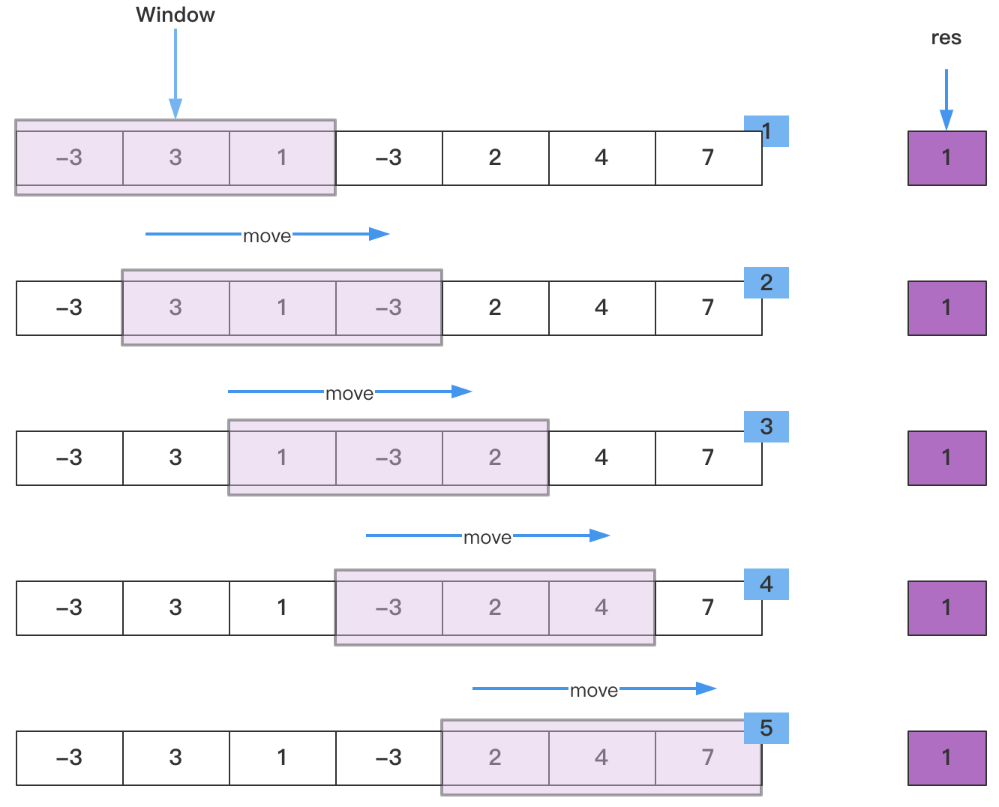
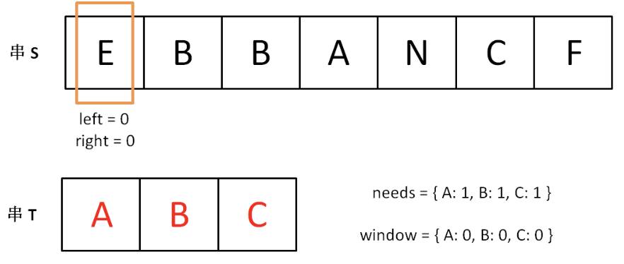
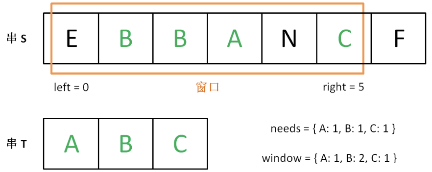
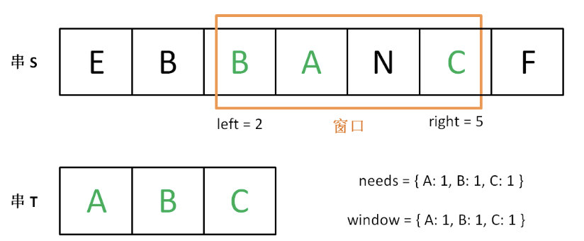
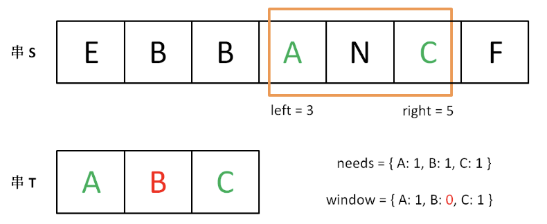

- [数据结构学习](https://mp.weixin.qq.com/s/utnN3S2IFktFREMxFsI3mw)

# 二、SkipList-跳表

- [跳表](https://mp.weixin.qq.com/s/drEJPZw7iYiwtMlRI--L6g)

## 1、什么是跳表

它允许快速查询一个有序连续元素的数据链表。跳跃列表的平均查找和插入时间复杂度都是O(log n)，优于普通队列的O(n)；跳表的思想，用“空间换时间”，通过给链表建立索引，提高了查找的效率；

- 跳跃表是基于链表扩展实现的一种特殊链表，类似于树的实现，跳跃表不仅实现了横向链表，还实现了垂直方向的分层索引
- 跳表是可以实现二分查找的有序链表
- 一个跳跃表由若干层链表组成，每一层都实现了一个有序链表索引，只有最底层包含了所有数据，每一层由下往上依次通过一个指针指向上层相同值的元素，每层数据依次减少，等到了最顶层就只会保留部分数据了


# 三、哈希

- [设计一个哈希映射](https://leetcode-cn.com/problems/design-hashmap/)
- [哈希的本质](https://mp.weixin.qq.com/s/cKtJHDzz2Z8N_2wdLvYfOQ)


## 1、基本介绍

最有用的基本数据结构之一，散列是一种用于以常数平均时间执行插入、删除和查找的技术，根据key值直接访问的数据结构


# 四、数据结构设计

## 1、云计算任务调度系统
- 需要实现一个云计算任务调度系统，希望可以保证VIP客户的任务被优先处理，可以利用的数据结构或者标准的集合类型？类似场景大多数是基于什么数据结构？**

    PriorityBlockingQueue


# 五、滑动窗口

- [滑动窗口算法基本原理与实践](https://www.cnblogs.com/huansky/p/13488234.html)
- [程序员吴师兄:长度最小的连续子数组](https://mp.weixin.qq.com/s/qWRzm_iLz953Dp6i9WhUWw)
- [数组中滑动窗口实现](数组/数组.md#18长度最小的连续子数组)
- [字符串中滑动窗口实现](../算法/字符串/字符串.md#11最长无重复子串)

## 1、滑动窗口算法

滑动窗口算法是在给定特定窗口大小的数组或字符串上执行要求的操作。该技术可以将一部分问题中的嵌套循环转变为一个单循环，因此它可以减少时间复杂度；

简而言之：滑动窗口算法在一个特定大小的字符串或数组上进行操作，而不在整个字符串和数组上操作，这样就降低了问题的复杂度，从而也达到降低了循环的嵌套深度。其实这里就可以看出来滑动窗口主要应用在数组和字符串上

## 2、基本过程



可以用来解决一些查找满足一定条件的连续区间的性质（长度等）的问题。由于区间连续，因此当区间发生变化时，可以通过旧有的计算结果对搜索空间进行剪枝，这样便减少了重复计算，降低了时间复杂度。往往类似于“ 请找到满足 xx 的最 x 的区间（子串、子数组）的 xx ”这类问题都可以使用该方法进行解决。

需要注意的是，滑动窗口算法更多的是一种思想，而非某种数据结构的使用;

## 3、大体框架

- 滑动：说明这个窗口是移动的，也就是移动是按照一定方向来的。
- 窗口：窗口大小并不是固定的，可以不断扩容直到满足一定的条件；也可以不断缩小，直到找到一个满足条件的最小窗口；当然也可以是固定大小。

对于字符串来说，滑动窗口算法的思路是这样：
- （1）在字符串 S 中使用双指针中的左右指针技巧，初始化 `left = right = 0`，把索引闭区间 `[left, right]` 称为一个`「窗口」`
- （2）先不断地增加 right 指针扩大窗口 `[left, right]`，直到窗口中的字符串符合要求（包含了 T 中的所有字符）;
- （3）此时，停止增加 right，转而不断增加 left 指针缩小窗口 `[left, right]`，直到窗口中的字符串不再符合要求（不包含 T 中的所有字符了）。同时，每次增加 left，都要更新一轮结果;
- （4）重复第 （2） 和第 （3） 步，直到 right 到达字符串 S 的尽头；

> 第 2 步相当于在寻找一个`「可行解」`，然后第 3 步在优化这个「可行解」，最终找到`最优解`。左右指针轮流前进，窗口大小增增减减，窗口不断向右滑动;

下面画图理解一下，needs 和 window 相当于计数器，分别记录 T 中字符出现次数和窗口中的相应字符的出现次数:
- 初始状态：



- 增加 right，直到窗口 `[left, right]` 包含了 T 中所有字符：



- 现在开始增加 left，缩小窗口 `[left, right]`



- 直到窗口中的字符串不再符合要求，left 不再继续移动



之后重复上述过程，先移动 right，再移动 left…… 直到 right 指针到达字符串 S 的末端，算法结束

对于非固定大小的滑动窗口，可以简单地写出如下伪码框架：
```java
String s, t;
// 在 s 中寻找 t 的「最小覆盖子串」
int left = 0, right = 0;
String res = s;
while(right < s.size()) {
    window.add(s[right]);
    right++;
    // 如果符合要求，说明窗口构造完成，移动 left 缩小窗口
    while (window 符合要求) {
        // 如果这个窗口的子串更短，则更新 res
        res = minLen(res, window);
        window.remove(s[left]);
        left++;
    }
}
return res;
```
但是，对于固定窗口大小，可以总结如下：
```java
// 固定窗口大小为 k
string s;
// 在 s 中寻找窗口大小为 k 时的所包含最大元音字母个数
int  right = 0;while(right < s.size()) {
    window.add(s[right]);
    right++;
    // 如果符合要求，说明窗口构造完成，
    if (right>=k) {
        // 这是已经是一个窗口了，根据条件做一些事情
        // ... 可以计算窗口最大值等 
        // 最后不要忘记把 right -k 位置元素从窗口里面移除
    }
}
return res;
```
- 对于固定窗口，此时不需要依赖 left 指针了。因为窗口固定所以其实就没必要使用left，right 双指针来控制窗口的大小；
- 其次是对于窗口是固定的，可以轻易获取到 left 的位置，此处 `left = right-k`；

## 4、算法实例

### 4.1、尽可能使字符串相等

- [Leetcode-1208:尽可能使字符串相等](https://leetcode.com/problems/get-equal-substrings-within-budget/)


### 4.2、滑动窗口最大值

- [Leetcode-239](https://leetcode.com/problems/sliding-window-maximum/)

### 4.3、定长子串中元音的最大数目

- [Leetcode-1456](https://leetcode.com/problems/maximum-number-of-vowels-in-a-substring-of-given-length/)