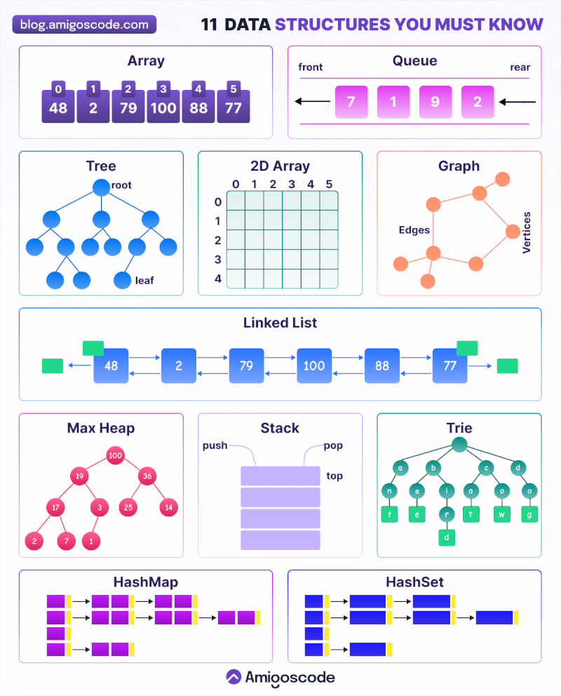

- [数据结构学习](https://mp.weixin.qq.com/s/utnN3S2IFktFREMxFsI3mw)

# 一、常见数据结构

11 种开发者必须熟悉的数据结构

- [数组](./数组/数组.md)：最基础、最常用的数据结构之一。它在一块连续的内存中存储元素，并可以通过下标快速访问。数组中的每个元素都有对应的下标编号，因此可以直接使用下标来读取或更新对应的元素
- [二维数组](./数组/数组.md#三二维数组)：也称为矩阵，可以理解为“数组的数组”。它以行和列的形式组织数据，常用于表示网格状的信息
- [链表](./链表/链表.md)：是一种线性数据结构，每个元素（称为节点）都包含一个值，以及指向下一个节点的引用（或指针）
- [队列](./栈和队列/栈和队列.md)：是一种先进先出（FIFO）的数据结构。元素从队尾加入，从队首移除，非常适合处理需要按顺序执行的任务
- [栈](./栈和队列/栈和队列.md)：是一种后进先出（LIFO）的数据结构，元素只能在栈顶进行添加或移除。它的特点就像一叠书，只能从最上面放置或取走
- [图](./图/图.md)：由顶点（节点）和边（节点之间的连接）组成，常用于表示实体之间的关系或网络结构
- [树](./树/树.md)：是一种层级结构，由节点组成。每个节点包含一个值，并可以拥有子节点，形成分支。最顶端的节点称为根节点，而没有子节点的节点则称为叶子节点
- [字典树（Trie）](./树/树.md#五trie树)：是一种类似树形结构的数据结构，主要用于存储字符串。它常用于需要高效检索前缀或单词的场景；
- [哈希表](#二散列表哈希表)：是一种存储键值对的数据结构。它通过哈希函数计算出键对应的索引位置，从而在数组的桶中快速找到目标值；
- [最大堆](./树/树.md#三堆)：是一种特殊的树形数据结构，每个父节点的值都大于其子节点的值，因此堆顶始终存放着最大元素。最大堆常用于实现优先队列

# 二、散列表/哈希表

- [设计一个哈希映射](https://leetcode-cn.com/problems/design-hashmap/)
- [哈希的本质](https://mp.weixin.qq.com/s/cKtJHDzz2Z8N_2wdLvYfOQ)

## 1、基本概念

散列表用的是数组支持按照下标随机访问数据的特性，所以散列表其实就是数组的一种扩展，由数组演化而来。可以说，如果没有数组，就没有散列表；其时间复杂度是$O(N)$
- 散列函数：将各类值转为数组下标的函数；
- 散列值：散列函数计算得到的值就叫作散列值（或“Hash 值”“哈希值”）；

## 2、散列函数

散列函数，顾名思义，它是一个函数。可以把它定义成 `hash(key)`，其中 key 表示元素的键值，`hash(key)` 的值表示经过散列函数计算得到的散列值；

散列函数设计的基本要求：
- 散列函数计算得到的散列值是一个非负整数；
- 如果 $key1 = key2$，那 $hash(key1) == hash(key2)$
- 如果 $key1 ≠ key2$，那 $hash(key1) ≠ hash(key2)$，这点主要是跟散列冲突有关，即便像著名的MD5、SHA、CRC等哈希算法，也无法完全避免这种散列冲突。而且，因为数组的存储空间有限，也会加大散列冲突的概率。

## 3、散列冲突

如何解决散列冲突呢？常用的散列冲突解决方法有两类，`开放寻址法（open addressing）`和`链表法（chaining）`。

### 3.1、开发寻址法

开放寻址法的核心思想是：如果出现了散列冲突，就重新探测一个空闲位置，将其插入；

**线性探测**

当我们往散列表中插入数据时，如果某个数据经过散列函数散列之后，存储位置已经被占用了，我们就从当前位置开始，依次往后查找，看是否有空闲位置，直到找到为止。

但是线性探测问题比较大。当散列表中插入的数据越来越多时，散列冲突发生的可能性就会越来越大，空闲位置会越来越少，线性探测的时间就会越来越久。极端情况下，我们可能需要探测整个散列表，所以最坏情况下的时间复杂度为 O(n)。同理，在删除和查找时，也有可能会线性探测整张散列表，才能找到要查找或者删除的数据；

适用场景：当数据量比较小、装载因子小的时候，适合采用开放寻址法。这也是 Java 中的ThreadLocalMap使用开放寻址法解决散列冲突的原因

### 3.2、链表法

链表法是一种更加常用的散列冲突解决办法，相比开放寻址法，它要简单很多。在散列表中，每个“桶（bucket）”或者“槽（slot）”会对应一条链表，所有散列值相同的元素都放到相同槽位对应的链表中；

在极端情况下，有些恶意的攻击者，还有可能通过精心构造的数据，使得所有的数据经过散列函数之后，都散列到同一个槽里。如果使用的是基于链表的冲突解决方法，那这个时候，散列表就会退化为链表，查询的时间复杂度就从 O(1) 急剧退化为 O(n)；

基于链表的散列冲突处理方法比较适合存储大对象、大数据量的散列表，而且，比起开放寻址法，它更加灵活，支持更多的优化策略，比如用红黑树代替链表；

## 4、如何设计散列函数

散列函数设计的好坏，决定了散列表冲突的概率大小，也直接决定了散列表的性能
- 首先，散列函数的设计不能太复杂；过于复杂的散列函数，势必会消耗很多计算时间，也就间接地影响到散列表的性能
- 其次，散列函数生成的值要尽可能随机并且均匀分布；这样才能避免或者最小化散列冲突，而且即便出现冲突，散列到每个槽里的数据也会比较平均，不会出现某个槽内数据特别多的情

实际中还需要考虑关键字的长度、特点、分布、还有散列表的大小等；

## 5、装载因子

装载因子（load factor）来表示空位的多少。装载因子越大，说明散列表中的元素越多，空闲位置越少，散列冲突的概率就越大

装载因子计算公式：`散列表的装载因子 = 填入表中的元素个数 / 散列表的长度`；

针对散列表，当装载因子过大时，可以进行动态扩容，重新申请一个更大的散列表，将数据搬移到这个新散列表中。假设每次扩容我们都申请一个原来散列表大小两倍的空间。如果原来散列表的装载因子是 0.8，那经过扩容之后，新散列表的装载因子就下降为原来的一半，变成了 0.4；

装载因子阈值的设置要权衡时间、空间复杂度：
- 如果内存空间不紧张，对执行效率要求很高，可以降低负载因子的阈值；
- 相反，如果内存空间紧张，对执行效率要求又不高，可以增加负载因子的值，甚至可以大于 1。

## 6、扩容

为了解决一次性扩容耗时过多的情况，可以将扩容操作穿插在插入操作的过程中，分批完成。当装载因子触达阈值之后，只申请新空间，但并不将老的数据搬移到新散列表中；

当有新数据要插入时，将新数据插入新散列表中，并且从老的散列表中拿出一个数据放入到新散列表。每次插入一个数据到散列表，都重复上面的过程。经过多次插入操作之后，老的散列表中的数据就一点一点全部搬移到新散列表中了。这样没有了集中的一次性数据搬移，插入操作就都变得很快了；

这期间的查询操作，为了兼容了新、老散列表中的数据，先从新散列表中查找，如果没有找到，再去老的散列表中查找；

## 7、设计一个散列表

- 设计一个合适的散列函数；
- 定义装载因子阈值，并且设计动态扩容策略；
- 选择合适的散列冲突解决方法

# 三、数据结构设计

## 1、云计算任务调度系统

- 需要实现一个云计算任务调度系统，希望可以保证VIP客户的任务被优先处理，可以利用的数据结构或者标准的集合类型？类似场景大多数是基于什么数据结构？

    PriorityBlockingQueue

# 四、文本编辑器数据结构

- [rope，可以作为整个文本编辑器内部文档字符串内容存储的数据结构](https://en.m.wikipedia.org/wiki/Rope_(data_structure))
- [Gap Buffer](https://en.m.wikipedia.org/wiki/Gap_buffer)
- [《The Craft of Text Editing》](http://www.finseth.com/craft/)
