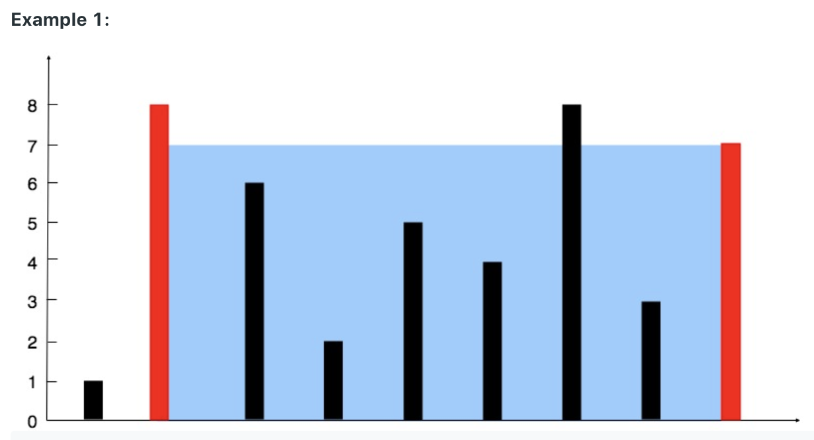
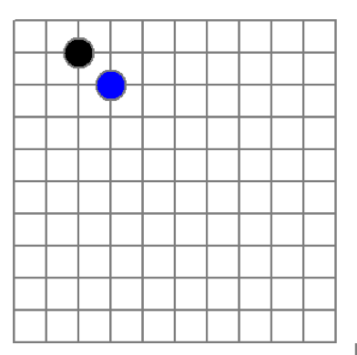
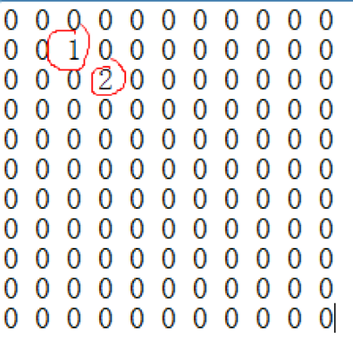

# 一、数组

数组就是 **存储在连续内存空间** 的数据项的集合，目的就是将多个 **具有相同数据类型** 的数据存储在一段连续的内存空间。这样就可以很容易的通过数组的 **首地址** 和 **偏移量（offset）** 计算数组中每一个元素的地址，数组的第一个元素的存储位置是整个数组的首地址（通常由数组的名称表示），默认起始地址的索引为 0，两个索引之间的差值为偏移量；

由 new 分配的数组中的元素将默认初始化为 0（对于数字类型），false（对于布尔值）或null（对于引用类型）。

## 1、数组的优点

- 数组支持随机访问元素。查找的时间复杂度为 。
- 数组具有更好的缓存局部性，可以在很大程度上提高访问速度。
- 数组可以使用一个变量名表示同一数据类型的多个数据项。

## 2、数组的缺点

- 数组一旦声明，就不能更改大小。因为声明时分配给数组的是连续的静态内存空间，要想更改大小，只能由编译器释放原来的内存空间，重新声明。
- 数组的插入和删除时间复杂度为 O(n)，因为数组中的元素被存储在连续的内存位置中，插入和删除的移位操作比较耗时

```java
int[] intArray = new int[10]; // 结合了声明和实例化
// 数组静态初始化
int[] intArray = new int[]{1,2,3,4,5,6,7,8,9,10};
int[] intArray = {1,2,3,4,5,6,7,8,9,10};
```

## 3、数组中间索引

比如二分查找中，定位数组的中间索引
```java
int mid = (l + r) / 2;// 这里,如果在极限情况下,可能出现int溢出

int mid = l + ((r - l) >>> 1);
```

# 二、数据题目

[Leetcode-数组](https://leetcode.com/tag/array/)

## 1、数组的逆置算法

- 1.1、整型数组的逆置算法：
	- 给定整形数组，实现数组的逆置；要求时间复杂度为 $O(N)$，空间复杂度为 O(1)。

		1，2，3，4，5，6，7 ==> 7，6，5，4，3，2，1

	- 实现1：时间复杂度 O(N)， 空间复杂度 O(1)
		```java
		public void swap(int[] array, int i, int j){
			int t = array[i];
			array[i] = array[j];
			array[j] = t;
		}
		public void inverse01(int[] array){
			if(array == null || array.length <= 1){
				return;
			}
			for(int i=0,j=array.length-1; i<j; i++,j--){
				swap(array, i, j);
			}
		}
		```
	- 实现2：省略上述的 j ，循环条件：`i<n/2`， 时间复杂度 O(N)， 空间复杂度 O(1)
		```java
		public void inverse02(int[] array){
			if(array == null || array.length <= 1){
				return;
			}
			int n = array.length;
			int half = n / 2;
			for(int i=0; i< half; i++){
				swap(array, i, n-1-i);
			}
		}
		```
- 1.2、合理利用泛型：时间复杂度 O(N)， 空间复杂度 O(1)
	```java
	public class InverseArray<T> {
		public void printArray(T[] array) {
			for(int i=0; i<array.length; i++){
				System.out.print(array[i]);
			}
			System.out.println();
		}
		public void swap(T[] array, int i, int j){
			T t = array[i];
			array[i] = array[j];
			array[j] = t;
		}
		public void inverse01(T[] array){
			if(array == null || array.length <= 1){
				return;
			}
			for(int i=0,j=array.length-1; i<j; i++,j--){
				swap(array, i, j);
			}
		}				
		public void inverse02(T[] array){
			if(array == null || array.length <= 1){
				return;
			}
			for(int i=0; i< array.length / 2; i++){
				swap(array, i, array.length-1-i);
			}
		}
	}
	```

## 2、旋转数组

- [Leetcode-189](https://leetcode.com/problems/rotate-array/)

### 2.1、描述

给定一个数组，长度为n，要求把后k个元素移动至前面，前n-k个元素移动至后面。比如，n=7，k=3

1,2,3,4,5,6,7 ==> 5,6,7,1,2,3,4
* 翻转前半部分：4 3 2 1 5 6 7；
* 翻转后半部分：4 3 2 1 7 6 5；
* 翻转整个数组：5 6 7 1 2 3 4；

### 2.2、分析

```
反转整个数组：[7,6,5,4,3,2,1]
反转区间为前k的子串：[5,6,7,4,3,2,1]
反转区间为k到末尾的子串：[5,6,7,1,2,3,4]
```
> 注意：k有可能大于n，n=7，k=24，此时 `k = k %n，即 24%7=3`

### 2.3、实现：时间复杂度 O(N)， 空间复杂度 O(1)

```java
public void rotate(int[] nums, int k) {
	int n = nums.length;
	k = k % n;
	reverse(nums, 0, n - 1);
	reverse(nums, 0, k - 1);
	reverse(nums, k, n - 1);
}
private void reverse(int[] nums, int start, int end) {
	int temp;
	for (int i = start, j = end; i < j; i++, j--) {
		temp = nums[i];
		nums[i] = nums[j];
		nums[j] = temp;
	}
}
```

### 2.4、扩展：旋转数组的最小数字

[find-minimum-in-rotated-sorted-array](https://leetcode.com/problems/find-minimum-in-rotated-sorted-array-ii/)

把一个数组最开始的若干个元素搬到数组的末尾，我们称之为数组的旋转。输入一个递增排序的数组的一个旋转，输出旋转数组的最小元素。例如，数组` [3,4,5,1,2]` 为 `[1,2,3,4,5]` 的一个旋转，该数组的最小值为 1

**示例 1：**

```
输入：[3,4,5,1,2]
输出：1
```
**示例 2：**

```
输入：[2,2,2,0,1]
输出：0
```

**思路分析**：

最直观的解法是 **从头到尾遍历数组一次**，轻轻松松就能找出最小的元素，这种思路的时间复杂度显然是 **O(n)**。

一般的，O(n) 复杂度的优化我们都是往 **二分查找** 这个思路上去考虑的。

设置 `start`, `end` 指针分别指向 `numbers` 数组左右两端，取它们的中点 mid = (start + end ) / 2，然后将 **numbers[mid]** 与 **numbers[end]** 进行对比：

* 当 *numbers[mid] > numbers[end]*：此时，mid 在 **左排序数组** 中，而旋转点 x 一定在 [ mid + 1，end ] 闭区间内，所以接下来的操作是在 [ mid + 1，end ] 区间内寻找旋转点，相应的，改变 start 的值为 mid + 1
* 当 *numbers[mid] < numbers[end]*：mid 在 **右排序数组** 中，而旋转点 x 一定在 [ start，mid ] 闭区间内，所以接下来的操作是在 [ start，mid ] 区间内寻找旋转点，相应的，改变 end 的值为 mid ；
* 当 *numbers[mid] = numbers[end]*：遍历区间是否有序；

**代码实现：**
```java
// 直接遍历
public int minArray(int[] numbers) {
	int result = numbers[0];
	int len = numbers.length;
	for (int i = 0; i < len; i++) {
		if (numbers[i] < result) {
			result = numbers[i];
		}
	}
	return result;
}
```
在上面的基础上利用原数组的有序性，使用二分查找优化
```java
public int minArray(int[] numbers) {
	//设置 start, end 指针分别指向 numbers 数组左右两端
	int start = 0, end = numbers.length - 1;
	//循环判断处理，直到找到结果
	while (start < end) {
		// mid 为中点（这里向下取整，比如 （ 2 + 7 ）/ 2 = 4 )
		int mid = (start + end) / 2;
		//当 mid 点所在元素大于数组末端的元素时，这意味着 [start , mid] 是有序的数组
		if (numbers[mid] > numbers[end]){
			// 所以旋转点在 [ mid + 1, end ] 区间里面 ，更新 start 的位置为 mid + 1
			start = mid + 1;
		}else if (numbers[mid] < numbers[end]){
			// 当 mid 点所在元素小于数组开始端的元素时，这意味着 [mid , end] 是有序的数组
			// 所以旋转点在 [ start, mid ] 区间里面 ，更新 end 的位置为 mid 
			end = mid;
			//思考题🤔：为什么 start 是更新为 mid + 1，而 end 却是更新为 mid
		}else{
			//此时，出现了 numbers[mid] = numbers[end] 的情况，无法判断 
			//    [ start , mid ]  为有序数组区间
			//  还是  [ mid , end ]  为有序数组区间
			//  比如： [1, 0, 1, 1, 1] 和  [1, 1, 1, 0, 1]
			//  所以这里采取遍历的方式
			return findMin(numbers,start,end);
		}
	}
	return numbers[start];
}
public int findMin(int[] numbers,int start,int end){
	int result = numbers[start];
	for(int i = start;i <= end;i++){
		if (numbers[i] < result) {
			result = numbers[i];
		}
	}
	return result;
}
```

### 2.5、扩展：旋转有序数组中找到匹配的值

- [Leetcode-33](https://leetcode.com/problems/search-in-rotated-sorted-array/)

```java
public static int search(int[] nums, int target) {
	int len = nums.length;
	int left = 0, right = len - 1;
	while (left <= right) {
		int mid = (left + right) >> 1;
		if (nums[mid] == target) {
			// 如果有重复元素，找最右边那个
			if (mid == 0 || nums[mid - 1] != target) {
				return mid;
			}
			right = mid - 1;
		} else if (nums[mid] < nums[right]) {
			// [mid, right]区间内是有序的，判断target是不是在这个区间内，如果在，则将left置为 mid + 1;
			if (nums[mid] < target && target <= nums[right]) {
				left = mid + 1;
			} else {
				// 否则就right左移
				right = mid - 1;
			}
		} else {
			// [left, mid]区间内是有序的，判断target是不是在这个区间内，如果在，则将right置为 mid - 1;
			if (nums[left] <= target && target < nums[mid]) {
				right = mid - 1;
			} else {
				left = mid + 1;
			}
		}
	}
	return -1;
}
```

## 3、找出有序数组中和为 s 的两个数字

### 3.1、描述

已知一个升序数组array和一个数字s，数组不包含重复数字，在数组中查找两个数，使得它们的和正好为s；如果有多对数字的和等于s，则全部输出

array={1 ， 3 ， 4 ， 5 ， 8 ， 9 ， 11}， s=13

==> [4，9]， [5，8];

### 3.2、平方级算法

时间复杂度 O(N^2)， 空间复杂度 O(1)
```java
public void printResult(int a， int b) {
	System.out.println("[" + a + "，" + b + "]");
}		
public void sumCompare(int[] array， int s){
	int n  = array.length;
	for(int i = 0; i<n;i++){
		for(int j=i+1;j<n;j++){
			if( (array[i] + array[j]) == s){
				printResult(array[i]， array[j]);
				break;
			}
		}
	}
}
```

### 3.3、线性算法：充分利用提供的数组是升序数组

array={1 ， 3 ， 4 ， 5 ， 8 ， 9 ， 11}， s=13

- 分析：利用数组是升序的数组，使用头尾指针来实现
	```
	i = 0， j = array.length-1
	array={1 ， 3 ， 4 ， 5 ， 8 ， 9 ， 11} ==> i=0，	j=6， 1 + 11 = 12
	array={1 ， 3 ， 4 ， 5 ， 8 ， 9 ， 11} ==> i++，	j， 3 + 11 = 14
	array={1 ， 3 ， 4 ， 5 ， 8 ， 9 ， 11} ==> i，j--， 3 + 9 = 12
	array={1 ， 3 ， 4 ， 5 ， 8 ， 9 ， 11} ==> i++，j， 4 + 9 = 13
	array={1 ， 3 ， 4 ， 5 ， 8 ， 9 ， 11} ==> i++，j--， 5 + 8 = 13
	```
- 实现：时间复杂度 O(N)， 空间复杂度 O(1)
	```java
	public void sumCompare1(int[] array， int s) {
		int i = 0;
		int j = array.length - 1;
		while(i < j){
			int sum = array[i] + array[j];
			if(sum == s){
				printResult(array[i] ， array[j]);
				i++;
				j--;
			} else if(sum < s){
				i++;
			} else{
				j--;
			}
		}
	}
	```

### 3.4、二分查找法

时间复杂度 $O(N*logN)$， 空间复杂度 $O(1)$
```java
public void sumCompare2(int[] array， int s){
	int n = array.length;
	for(int i=0;i<n-1;i++){
		int another = s - array[i];
		if(Arrays.binarySearch(array， another) >= i+1){
			printResult(array[i] ， another);
		}
	}
}
```

## 4、和为 s 连续正整数序列

- 4.1、描述：输入一个正整数s，打印出所有和为s的连续正整数序列（至少含有两个数字）

	输入：21

	输出：1 2 3 4 5 6， 6 7 8， 10 11

	依然是双指针！不过，start指针从 1 开始，end指针从 2 开始
	```java
	end=2，start=1	1 + 2 = 3 < 21
	end++			1 + 2 + 3 = 6 < 21 
	end++			1 + 2 + 3 + 4 = 10 < 21
	end++			1 + 2 + 3 + 4 + 5 = 15 < 21
	end++			1 + 2 + 3 + 4 + 5 + 6 = 21 ==21
	end++，start++	2 + 3 + 4 + 5 + 6 + 7 = 27 > 21
	start++			3 + 4 + 5 + 6 + 7 = 25 > 21
	start++			4 + 5 + 6 + 7 = 22 > 21
	start++			5 + 6 + 7 = 18 < 21
	end++			5 + 6 + 7 + 8 = 26 > 21
	start++			6 + 7 + 8 =21 == 21
	...
	start = (s + 1) / 2，算法停止
	```

- 4.2、实现：时间复杂度 O(N)， 空间复杂度 O(1)
	```java
	public void printResult(int start， int end) {
		for(int k = start; k<=end; k++){
			System.out.print(k + " ");
		}
		System.out.println();
	}			
	public void sum(int s) {
		int start = 1，
			end = 2，
			sum = start + end，
			half = (s + 1) / 2;
		while(start < half){
			if(sum == s){
				printResult(start， end);
				sum -= start;
				start++;
				end++;
				sum += end;
			} else if(sum < s){
				end ++;
				sum += end;
			} else{
				sum -= start;
				start ++;
			}
		}
	}
	```

## 5、移除有序数组的重复元素

- [Leetcode-26](https://leetcode.com/problems/remove-duplicates-from-sorted-array/)

### 5.1、描述

给定升序数组array，删除重复元素，并返回新的长度len；使得前len个数字升序，并且不得含有重复数字；后面的数字是什么，无所谓

### 5.2、借助ArrayList解决问题

- 思路：
	- 新建list
	- 遍历数组，不断的把不重复的元素添加进list
	- 把list里边的元素拷贝进array
	- 返回list.size()
- 实现：时间复杂度 O(N)， 空间复杂度 O(N)
	```java
	public int remove(int[] nums){
		if(nums == null || nums.length == 0){
			return 0;
		}else if(nums.length == 1){
			return 1;
		}else{
			int i = 0;
			int end = nums.length - 1;
			ArrayList<Integer> list = new ArrayList<Integer>();
			while(i <= end){
				if(i == end){
					list.add(nums[i]);
					i++;
				}else{
					int j  = i + 1;
					if(nums[i] == nums[j]){
						while(j <= end && nums[i] == nums[j]){
							j++;
						}
					}
					list.add(nums[i]);
					i = j;
				}
			}
			for(i=0;i<list.size();i++){
				nums[i] = list.get(i);
			}
			return list.size();
		}
	}
	```
### 5.3、借助ArrayCopy解决问题

时间复杂度 O(N^2)， 空间复杂度 O(N)
```java
public int remove02(int[] nums){
	if(nums==null||nums.length==0){
		return 0;
	}else if(nums.length==1){
		return 1;
	}else{
		int end=nums.length-1;
		for(int i=0;i<=end;i++){
			if(i<end){
				int j=i+1;
				if(nums[i]==nums[j]){
					while(j<=end&&nums[i]==nums[j]){
						j++;
					}
				}
				System.arraycopy(nums， j， nums， i+1， end-j+1);						
				end-=j-i-1;
			}
		}
		return end+1;
	}
}
```
### 5.4、借助临时变量解决问题

时间复杂度 O(N)， 空间复杂度 O(1)
```java
public int remove03(int[] nums){
	if (nums == null || nums.length == 0) {
		return 0;
	} else if (nums.length == 1) {
		return 1;
	} else {
		int temp = nums[0];
		int len = 1;
		for (int i = 1; i < nums.length; i++) {
			if (temp != nums[i]) {
				temp = nums[i];
				nums[len] = nums[i];
				len++;
			}
		}
		return len;
	}
}
```
### 5.5、快慢指针

慢指针slow走在后面，快指针fast走在前面探路，找到一个不重复的元素就告诉slow并让slow前进一步。这样当fast指针遍历完整个数组nums后，`nums[0..slow]`就是不重复元素；时间复杂度O(N)，空间复杂度 O(1)
```java
public int removeDuplicates(int[] nums) {
	if (nums.length == 0) {
		return 0;
	}
	int slow = 0, fast = 0;
	while (fast < nums.length) {
		if (nums[fast] != nums[slow]) {
			slow++;
			// 维护 nums[0..slow] 无重复
			nums[slow] = nums[fast];
		}
		fast++;
	}
	// 数组长度为索引 + 1
	return slow + 1;
}
```

## 6、找出无序数组中和为s的两个数字

数组中无重复元素

### 6.1、暴力解法

```java
public int[] twoSum(int[] nums, int target) {
    for (int i = 0; i < nums.length; i++) {
        for (int j = i + 1; j < nums.length; j++) {
            if (nums[j] == target - nums[i]) {
                return new int[] { i, j };
            }
        }
    }
    throw new IllegalArgumentException("No two sum solution");
}
```

### 6.2、Hash-用空间换时间

为了对运行时间复杂度进行优化，我们需要一种更有效的方法来检查数组中是否存在目标元素。如果存在，我们需要找出它的索引。保持数组中的每个元素与其索引相互对应的最好方法是什么？哈希表；

通过以空间换取速度的方式，我们可以将查找时间从 O(n)O(n) 降低到 O(1)O(1)。哈希表正是为此目的而构建的，它支持以 近似 恒定的时间进行快速查找。我用“近似”来描述，是因为一旦出现冲突，查找用时可能会退化到 O(n)O(n)。但只要你仔细地挑选哈希函数，在哈希表中进行查找的用时应当被摊销为 O(1)；

在进行迭代并将元素插入到表中的同时，我们还会回过头来检查表中是否已经存在当前元素所对应的目标元素。如果它存在，那我们已经找到了对应解，并立即将其返回
```java
// 找出一组
public static int[] twoSum(int[] nums, int target) {
	Map<Integer, Integer> map = new HashMap<>();
	for (int i = 0; i < nums.length; i++) {
		int complement = target - nums[i];
		if (map.containsKey(complement)) {
			return new int[]{map.get(complement), i};
		}
		map.put(nums[i], i);
	}
	throw new IllegalArgumentException("No two sum solution");
}
// 找出全部
public static List<int[]> allTwoSum(int[] nums, int target) {
	Map<Integer, Integer> map = new HashMap<>();
	List<int[]> result = new ArrayList<>();
	for (int i = 0; i < nums.length; i++) {
		int complement = target - nums[i];
		if (map.containsKey(complement)) {
			result.add(new int[]{map.get(complement), i});
		}
		map.put(nums[i], i);
	}
	return result;
}
```

## 7、寻找无序数组的第k大元素

- [Leetcode-215](https://leetcode.com/problems/kth-largest-element-in-an-array/)
- [漫画：寻找无序数组的第k大元素](https://mp.weixin.qq.com/s/1Y6yLuErGhDE0bA_M8mEjg)

### 7.1、问题描述

给定数组：`{7,5,15,3,17,2,20,24,1,9,12,8}`

如果 k=6，也就是要寻找第6大的元素，这个元素是哪一个呢？

显然，数组中第一大的元素是24，第二大的元素是20，第三大的元素是17 ...... 第6大的元素是9。

### 7.2、排序法

先把无序数组从大到小进行排序，排序后的第k个元素，自然就是数组中的第k大元素；

上述思路实现复杂度为$O(N*logN)$

### 7.3、TopK问题

[关于TopK问题](../树/树.md#5topK问题)

这其实一道经典的TopK问题，其可以使用[二叉堆](../树/树.md#三堆)来解决，简而言之，二叉堆是一种特殊的完全二叉树，它包含大顶堆和小顶堆两种形式，
其中小顶堆的特点，是每一个父节点都大于等于自己的子节点。要解决这个算法题，我们可以利用小顶堆的特性

**思路：**

维护一个容量为`k`的小顶堆，堆中的`k`个节点代表着当前最大的`k`个元素，而堆顶显然是这`k`个元素中的最小值；遍历原数组，每遍历一个元素，就和堆顶比较，如果当前元素小于等于堆顶，则继续遍历；如果元素大于堆顶，则把当前元素放在堆顶位置，并调整二叉堆（下沉操作）。遍历结束后，堆顶就是数组的最大k个元素中的最小值，也就是第k大元素；

**过程：**假设 k=5：
- （1）把数组的前k个元素构建成堆；
```
7 5 15 3 17 2 20 24 1 9 12 8 
        3       
       /  \     
    5       15  
   /  \         
  7   17
```
- （2）继续遍历数组，和堆顶比较，如果小于等于堆顶，则继续遍历；如果大于堆顶，则取代堆顶元素并调整堆，遍历到元素2，由于 2<3，所以继续遍历；
- （3）遍历到元素20，由于 20>3，20取代堆顶位置，并调整堆
```
        5       
       /  \     
    7       15  
   /  \         
  20  17  
```
- （4）以此类推，我们一个一个遍历元素，当遍历到最后一个元素8的时候，小顶堆的情况如下,此时的堆顶，就是堆中的最小值，也就是数组中的第k大元素。
```
        12      
       /   \    
    17      15  
   /   \        
  20  24  
```

整体时间复杂度：
- 构建堆的时间复杂度是 $O(k)$
- 遍历剩余数组的时间复杂度是 $O(n-k)$
- 每次调整堆的时间复杂度是 $O(logk)$

其中2和3是嵌套关系，1和2,3是并列关系，所以总的最坏时间复杂度是 $O((n-k)logk + k)$。当k远小于n的情况下，也可以近似地认为是$O(nlogk)$。

### 7.4、二叉堆实现

```java
public static int findNumber(int[] arr, int k) {
	// 使用前k个元素构建小顶堆
	buildHeap(arr, k);
	for (int i = k; i < arr.length; i++) {
		if (arr[i] > arr[0]) {
			arr[0] = arr[i];
			shiftDown(arr, 0, k);
		}
	}
	return arr[0];
}
private static void buildHeap(int[] arr, int k) {
	for (int i = k / 2 - 1; i >= 0; i--) {
		shiftDown(arr, i, k);
	}
}
/**
 * 下沉调整
 *
 * @param arr 待调整的堆
 * @param index 需要下沉的节点
 * @param len 堆的有效大小
 */
private static void shiftDown(int[] arr, int index, int len) {
	int temp = arr[index];
	int leftChild = index * 2 + 1;
	while (leftChild < len) {
		// 如果有右孩子，且右孩子小于左孩子的值，则定位右孩子
		if (leftChild + 1 < len && arr[leftChild + 1] < arr[leftChild]) {
			leftChild++;
		}
		// 如果父节点小任何一个孩子的值，直接跳出
		if (temp <= arr[leftChild]) {
			break;
		}
		arr[index] = arr[leftChild];
		index = leftChild;
		leftChild = leftChild * 2 + 1;
	}
	arr[index] = temp;
}
```

## 8、查找一个数组的中位数

- [求中位数](https://segmentfault.com/a/1190000038595283)

### 8.1、

### 8.2、寻找两个正序数组的中位数

- [Leetcode-4](https://leetcode.com/problems/median-of-two-sorted-arrays/)

```java
public double findMedianSortedArrays(int[] nums1, int[] nums2) {
	if (nums1 == null && nums2 == null) {
		return 0D;
	}
	if (nums1 == null || nums1.length == 0) {
		return findMedianSortedArrays(nums2);
	}
	if (nums2 == null || nums2.length == 0) {
		return findMedianSortedArrays(nums1);
	}

	int len1 = nums1.length;
	int len2 = nums2.length;
	int[] res = new int[len1 + len2];

	int idx1 = 0;
	int idx2 = 0;
	int i = 0;
	while (idx1 < len1 && idx2 < len2) {
		if (nums1[idx1] < nums2[idx2]) {
			res[i] = nums1[idx1];
			idx1++;
		} else {
			res[i] = nums2[idx2];
			idx2++;
		}
		i++;
	}
	while (idx1 < len1) {
		res[i] = nums1[idx1];
		idx1++;
		i++;
	}
	while (idx2 < len2) {
		res[i] = nums2[idx2];
		idx2++;
		i++;
	}
	return findMedianSortedArrays(res);
}
/**
	* [1,2,3,4,5] [1,2,3,4]
	*/
public double findMedianSortedArrays(int[] num) {
	int len = num.length;
	int mid = len / 2;
	if (len % 2 != 0) {
		return num[mid];
	} else {
		return (num[mid - 1] + num[mid]) / 2.0;
	}
}
```

## 9、盛最多水的容器

- [Leetcode-11](https://leetcode.com/problems/container-with-most-water/)
- [双指针解题](https://www.algomooc.com/587.html)

### 9.1、问题描述

给你 n 个非负整数 a1，a2，...，an，每个数代表坐标中的一个点 (i, ai) 。在坐标内画 n 条垂直线，垂直线 i 的两个端点分别为 (i, ai) 和 (i, 0) 。

找出其中的两条线，使得它们与 x 轴共同构成的容器可以容纳最多的水

### 9.2、题目解析

> 木桶原理，一个木桶能盛多少谁，看最短的那块木板



一开始，我们先去考虑相距最远的两个柱子所能容纳水的面积

接下来去思考，我们去移动哪根柱子会更加合适?

这里我们需要注意一点：无论移动哪根柱子，柱子之间的宽度都是变小的。

由于水面高度是由最短的柱子决定的，所以移动右边那根更高的柱子的时候，水面高度一定是不会增加，甚至有可能遇到更短的柱子而变小，而宽度有一定再减少，所以水的面积也一定减少。

移动左边那根更短的柱子？

我们可以得出一个结论：移动两根柱子之间更短的那根柱子，才有可能在宽度一定变小的情况下，找到一个更高的水面，从而使得面积有可能更大

这道题目的解法也就有了：
- （1）设置两个索引，分别指向容器的两侧，即索引 left 指向最左边的柱子，索引 right 指向最右边的柱子；
- （2）记录下此时的水的面积，可以定义为 res；
- （3）观察需要向内移动哪根柱子：
	- 如果移动较高的柱子，由于水的宽度在变小，而水的高度一定不会增加，所以最终水的面积不会超过之前记录的水的面积 res
	- 所以，只能移动较短的柱子，然后计算此时水的面积，再与之前记录的水的面积 res 进行比较，保存那个更大的值；
- （4）再去判断应该向内移动哪根柱子
- （5）直到 left 和 right 相遇为止

### 9.3、代码实现

```java
public int maxArea(int[] height) {
	// 设置两个索引，分别指向容器的两侧
	// 索引 left 指向最左边的柱子
	int left = 0;
	// 索引 right 指向最右边的柱子
	int right = height.length - 1;
	// 设置一个变量用来保存当下水的最大面积
	int res = 0;
	// 移动 left 和 right，直到 left 和 right 相遇为止
	while(left < right){
		// 水的宽度是 right - left
		int width = right - left;
		// 水的高度由两根柱子最短的那根决定
		int h = Math.min(height[left],height[right]);
		// 计算此时水的面积
		int area = width * h;
		// 如果此时水的面积大于了我们之前保存的那个值，我们需要更新一下
		if(area >= res){
			// 更新 res 的值为 area，确保 res 一直都是最大的值
			res = area;
		}
		// 接下来去观察需要移动哪根柱子：必定是最短的那根柱子
		// 如果左边的柱子更短，那么向内移动左边的柱子，因为只有这样，才有可能找到一个更高的水面
		// 在宽度一定变小的情况下，水的面积才有可能增大
		if(height[left] < height[right]){
			// 向内移动左边的柱子
			left++;
		// 如果右边的柱子更短，那么向内移动右边的柱子，因为只有这样，才有可能找到一个更高的水面
		// 在宽度一定变小的情况下，水的面积才有可能增大
		}else{
			// 向内移动右边的柱子
			right--;
		}

	}

	// 最后返回最大的面积 res 即可
	return res;
}
```


## 10、给定一个数组num和一个val值，移除所有等于val的元素

- [Leetcode-27](https://leetcode.com/problems/remove-element/)

### 10.1、要求

给你一个数组 nums 和一个值 val，你需要 原地 移除所有数值等于 val 的元素，并返回移除后数组的新长度。不要使用额外的数组空间，你必须仅使用 O(1) 额外空间并 原地 修改输入数组。元素的顺序可以改变。你不需要考虑数组中超出新长度后面的元素；

### 10.2、思路

快慢指针：如果fast遇到需要去除的元素，则直接跳过，否则就告诉slow指针，并让slow前进一步

### 10.3、实现

```java
public static int removeElement(int[] nums, int val) {
	int len = nums.length;
	int fast = 0, slow = 0;
	while (fast < len) {
		if (nums[fast] != val) {
			nums[slow] = nums[fast];
			slow++;
		}
		fast++;
	}
	return slow;
}
```

## 11、移动0

- [Leetcode-283](https://leetcode.com/problems/move-zeroes/)

给定一个数组 nums，编写一个函数将所有 0 移动到数组的末尾，同时保持非零元素的相对顺序；
- 必须在原数组上操作，不能拷贝额外的数组。
- 尽量减少操作次数。

**思路：**

其实跟上面删除元素类似的；就相当于移除nums中的所有 0，然后再把后面的元素都赋值为 0 即可

**实现：**
```java
public static void moveZeros(int[] nums) {
	int len = nums.length;
	int fast = 0, slow = 0;
	while (fast < len) {
		if (nums[fast] != 0) {
			nums[slow] = nums[fast];
			slow++;
		}
		fast++;
	}
	for (; slow < len; slow++) {
		nums[slow] = 0;
	}
}
```

## 12、合并有序数组

- [Leetcode-88](https://leetcode.com/problems/merge-sorted-array/)

### 12.1、问题描述

给到两个有序数组，将其合并为一个有序数组

合并前：
```
[1,2,4]
[1,3,4]
```
合并后：
```
[1, 1, 2, 3, 4, 4]
```

### 12.2、实现

```java
public int[] merge(int[] nums1, int m, int[] nums2, int n) {
    if (nums1 == null || nums1.length == 0 || nums2 == null || nums2.length == 0) {
        return;
    }
    int[] res = new int[m + n];
    int idx1 = 0;
    int idx2 = 0;
    int i = 0;
    while (idx1 < m && idx2 < n) {
        if (nums1[idx1] < nums2[idx2]) {
            res[i] = nums1[idx1];
            idx1++;
        } else {
            res[i] = nums2[idx2];
            idx2++;
        }
        i++;
    }

    while (idx1 < m) {
        res[i] = nums1[idx1];
        idx1++;
        i++;
    }

    while (idx2 < n) {
        res[i] = nums2[idx2];
        idx2++;
        i++;
    }
	return res;
}
```

## 13、无序数组找出所有K，K比左边大，比右边小

https://mp.weixin.qq.com/s/5R6Tj4KbCuzTRRwtGL3IcA

### 13.1、问题描述

求数组中比左边元素都大同时比右边元素都小的元素，返回这些元素的索引，要求时间复杂度 O(N)；

```
输入：[2, 3, 1, 8, 9, 20, 12]
输出：3, 4
解释：数组中 8, 9 满足题目要求，他们的索引分别是 3、4
```

### 13.2、暴力解法

最简单的思路是：遍历数组，对于每个元素分别往前、往后遍历一下，看看是否它是否满足条件，这种解法是 O(N^2) ，不符合题目要求。
```java
for(int i = 0; i < n; i ++) {
	for(int j = 0; j < i; j ++) {
		//左侧是否都比它小
	}
	for(int k = j + 1; k < n; k ++) {
		//右侧是否都比它大
	}
	//若两条件均满足则记录下来
}
```

### 13.3、内循环优化解法

通过分析可以得到，对于每个元素，如果它比左侧最大的值要大，同时比右侧最小的值要小，就满足条件；

那如果有这样两个数组，
- `left_max[i]` 表示原数组 [0, i) 的最大值
- `right_min[i]` 表示原数组 (i, n) 的最小值

内循环就可以通过 `left_max[i] < nums[i] && nums[i] < right_min[i]` 来判断了

### 13.4、实现

```java
public static void find(int[] A) {
	int n = A.length;
	int[] left_max = new int[n];
	int[] right_min = new int[n];
	// 左边最大、右边最小
	for (int i = 0; i < n; i++) {
		left_max[i] = Integer.MIN_VALUE;
		right_min[i] = Integer.MAX_VALUE;
	}
	for (int i = 1; i < n; i++) {
		left_max[i] = Math.max(left_max[i - 1], A[i - 1]);
	}
	for (int i = n - 2; i >= 0; i--) {
		right_min[i] = Math.min(right_min[i + 1], A[i + 1]);
	}

	for (int i = 0; i < n; i++) {
		if (left_max[i] < A[i] && A[i] < right_min[i]) {
			System.out.println(i);
		}
	}
}
```

## 14、统计一个数字在排序数组中出现的次数

### 14.1、题目描述

统计一个数字在排序数组中出现的次数

```
输入: nums = [5,7,7,8,8,10], target = 8
输出: 2

输入: nums = [5,7,7,8,8,10], target = 6
输出: 0
```

### 14.2、思路

使用二分查找，找到最小的位置和最大的位置，两个索引相减；
- 找左边界的时候，如果mid值等于target，需要判断mid是否为0，或者说是mid-1索引位置的值小于target；
- 找右边界的时候，如果mid值等于target，需要判断mid是否为len-1，或者说是mid+1索引位置的值大于target；

### 14.3、代码实现

```java
public class FindTargetInSortedArray {
    public int search(int[] nums, int target) {
        // 寻找目标值在数组中的开始位置
        int firstIdx = findBeginPosition(nums, target);
        // 寻找目标值在数组中的结束位置
        int lastIdx = findEndPosition(nums, target);
        // 1、如果在数组中找不到目标值的开始位置，同时也找不到目标值的结束位置
        // 那说明目标值不存在，返回 0
        if (firstIdx == -1 && lastIdx == -1) {
            return 0;
        }
        // 2、如果在数组中只能找到目标值的开始位置和结束位置其中一个
        // 那说明目标值的个数只有一个，返回 1
        if (firstIdx == -1 || lastIdx == -1) {
            return 1;
        }
        // 3、如果在数组中可以找到目标值的开始位置，同时也可以找到目标值的结束位置
        // 那说明目标值的个数有多个，返回 lastIdx - firstIdx + 1;
        return lastIdx - firstIdx + 1;

    }
    // 寻找目标值在数组中的开始位置
    private int findBeginPosition(int[] nums, int target) {
        // left 指向当前区间的最左边位置，所以初始化为 0
        int left = 0;
        // right 指向当前区间的最右边位置，所以初始化为 nums.length - 1
        int right = nums.length - 1;
        // 循环进行二分查找，直到左端点位置超过了右端点
        // 或者在循环过程中找到了起始位置
        while (left <= right) {
            // 计算当前区间的中间位置，向下取整
            int mid = (left + right) / 2;
            // 如果中间位置的元素值等于目标值 target
            if (nums[mid] == target) {
                // 并且中间位置 mid 的左边没有元素，即中间位置 mid 为当前区间的起始位置
                // 或者中间位置 mid 的前一个元素小于目标值 target
                // 说明 mid 指向了 target 的起始位置
                if (mid == 0 || nums[mid - 1] < target) {
                    // mid 指向了 target 的起始位置，返回这个结果
                    return mid;
                }
                // 否则，说明 mid 的左边依然有元素值等于 target
                // 那么 mid 就不是 target 的起始位置，需要在 mid 的左边进行查找
                // 所以缩小范围为 left 到 mid - 1
                // 当前区间的左侧为 left，右侧 right = mid - 1
                right = mid - 1;
                // 如果中间位置的元素值大于目标值 target
                // 说明需要在 mid 的左边进行查找
            } else if (nums[mid] > target) {
                // 所以缩小范围为 left 到 mid - 1
                // 当前区间的左侧为 left，右侧 right = mid - 1
                right = mid - 1;
                // 如果中间位置的元素值小于目标值 target
                // 说明需要在 mid 的右边进行查找
            } else {
                // 所以缩小范围为 mid + 1 到 right
                // 当前区间的左侧为 left = mid + 1，右侧 right
                left = mid + 1;
            }
        }
        // 如果循环结束后还没有返回，说明找不到目标值 target，返回 -1
        return -1;
    }
    // 寻找目标值在数组中的结束位置
    private int findEndPosition(int[] nums, int target) {
        // left 指向当前区间的最左边位置，所以初始化为 0
        int left = 0;
        // right 指向当前区间的最右边位置，所以初始化为 nums.length - 1
        int right = nums.length - 1;
        // 循环进行二分查找，直到左端点位置超过了右端点
        // 或者在循环过程中找到了结束位置
        while (left <= right) {
            // 计算当前区间的中间位置，向下取整
            int mid = (left + right) / 2;
            // 如果中间位置的元素值等于目标值 target
            if (nums[mid] == target) {
                // 并且中间位置 mid 的右边没有元素，即中间位置 mid 为当前区间的结束位置
                // 或者中间位置 mid 的后一个元素大于目标值 target
                // 说明 mid 指向了 target 的结束位置
                if (mid == nums.length - 1 || nums[mid + 1] > target) {
                    // mid 指向了 target 的结束位置，返回这个结果
                    return mid;
                }
                // 否则，说明 mid 的右边依然有元素值等于 target
                // 那么 mid 就不是 target 的结束位置，需要在 mid 的右边进行查找
                // 所以缩小范围为 mid + 1 到 right
                // 当前区间的左侧为 left = mid + 1 ，右侧为 right
                left = mid + 1;
                // 如果中间位置的元素值大于目标值 target
                // 说明需要在 mid 的左边进行查找
            } else if (nums[mid] > target) {
                // 所以缩小范围为 left 到 mid - 1
                // 当前区间的左侧为 left，右侧 right = mid - 1
                right = mid - 1;
                // 如果中间位置的元素值小于目标值 target
                // 说明需要在 mid 的右边进行查找
            } else {
                // 所以缩小范围为 mid + 1 到 right
                // 当前区间的左侧为 left = mid + 1，右侧 right
                left = mid + 1;

            }
        }
        // 如果循环结束后还没有返回，说明找不到目标值 target，返回 -1
        return -1;
    }
}
```

## 15、寻找缺失的数字

### 15.1、描述

一个长度为 n - 1 的递增排序数组中的所有数字都是唯一的，并且每个数字都在范围 0 ～ n - 1 之内。

在范围 `0 ～ n - 1` 内的 n 个数字中有且只有一个数字不在该数组中，请找出这个数字

比如：
```
输入: [0,1,3]
输出: 2

输入: [0,1,2,3,4,5,6,7,9]
输出: 8
```
限制：`1 <= 数组长度 <= 10000`

### 15.2、实现

```java
public int missingNumber(int[] nums) {
	// left 指向当前区间的最左边位置，所以初始化为 0
	int left = 0;
	// right 指向当前区间的最右边位置，所以初始化为 nums.length - 1
	int right = nums.length - 1;
	// 循环进行二分查找，直到左端点位置超过了右端点
	while (left <= right) {
		// 计算当前区间的中间位置，向下取整
		int mid = (left + right) / 2;
		// 如果中间位置的元素值等于当前索引的值
		// 那么说明从 left 到 mid 的这些元素都在正确的位置上
		// 即从 left 到 mid 的这些数字都在数组中，没有发生缺失
		// 所以需要在 mid + 1 到 right 这个区间去查找缺失的数字
		if (nums[mid] == mid) {
			// 缩小范围为 mid + 1 到 right
			// 当前区间的左侧为 left = mid + 1，右侧 right
			left = mid + 1;
			// 否则，说明从 left 到 mid 的这些元素，有元素不在正确的位置上
			// 即从 left 到 mid 的这些数字有数字发生缺失
			// 所以需要在 left 到 mid - 1 这个区间去查找缺失的数字
		} else {

			// 所以缩小范围为 left 到 mid - 1
			// 当前区间的左侧为 left，右侧 right = mid - 1
			right = mid - 1;

		}
	}
	// 由于只有一个数字缺失，所以找到的时候，left 指向的那个数字就是，使得后面所有数字与索引不一一对应时的第一个数字
	return left;
}
```

## 16、找重复数字

- [leetcode-287](https://leetcode.com/problems/find-the-duplicate-number/)
- [找重复数字实现](../链表/链表.md#十七找重复数字)

### 16.1、问题描述

给定一个包含 n + 1 个整数的数组 nums，其数字都在 1 到 n 之间（包括 1 和 n），可知至少存在一个重复的整数。假设只有一个重复的整数，找出这个重复的数
示例 1:
```
输入: [1,3,4,2,2]
输出: 2
```
示例 2:
```
输入: [3,1,3,4,2]
输出: 3
```
要求：
- 不能更改原数组（假设数组是只读的）。
- 只能使用额外的 O(1) 的空间。
- 时间复杂度小于 O(n^2) 。
- 数组中只有一个重复的数字，但它可能不止重复出现一次

### 16.2、实现思路

按值二分：数组里的元素，利用二分我们需要去思考的是，我们要找符合条件的元素作为答案，那么比答案小的元素具有什么样的特质，比答案大的元素又具有什么样的特质
```
例1:
[1,3,4,2,2]                         元素个数
<= 1 的元素：1                          1
<= 2 的元素：1, 2, 2                    3
<= 3 的元素：1, 2, 2, 3                 4
<= 4 的元素：1, 2, 2, 3, 4              5

例2:
[3,1,3,4,2]
<= 1 的元素：1                          1
<= 2 的元素：1, 2                       2
<= 3 的元素：1, 2, 3, 3                 4
<= 4 的元素：1, 2, 3, 3, 4              5

极端一点的例子 (必须保证数组的长度是 n + 1, 并且元素都在区间[1,n] 上, 有且只有一个重复)
[3,3,3,3,4]
<= 1 的元素：                           0
<= 2 的元素：                           0
<= 3 的元素：3, 3, 3, 3                 4
<= 4 的元素：3, 3, 3, 3, 4              5
```
通过上面可以得到：
- `如果选中的数小于我们要找的答案，那么整个数组中小于或等于该数的元素个数必然小于或等于该元素的值；`
- `如果选中的数大于或等于我们要找的答案，那么整个数组中小于或等于该数的元素个数必然大于该元素的值`

不对数组进行二分，而是对可能存在的值进行二分。还是老样子，建立头尾指针，分别指向第一个元素和最后一个元素：
```
可能存在的树： 1 2 3 4
原数组：      1 2 3 3 4
```
此时的中点是 2，我们遍历数组，发现仅有两个元素是小于或等于 2 的，这说明 2 之前（包括 2）不可能存在重复的元素；原因很好解释，可以用反证法来证明，假设 2 前面存在重复的元素，由于题目限定只可能存在一个重复的元素，那么说明后面就没有重复的元素。由于数组的大小是 5，5 - 2 = 3，说明后面必须有 3 个不重复的数，但是在 2 后面的仅有可能是 3，4，没法形成 3 个数；

说明答案肯定是在后面，移动头指针缩小范围；这次的中点是 3，还是按上面那样遍历数组数出小于或等于 3 的元素个数，结果发现四个。这只能说明答案可能出现在 3 上，也有可能出现在 3 之前，我们不确定，移动尾指针

```java
public static int findDuplicate(int[] nums) {
	final int len = nums.length;
	int start = 1, end = len - 1;
	while (start < end) {
		int mid = start + (end - start) / 2;
		int counter = 0;
		for (int num : nums) {
			if (num <= mid) {
				counter++;
			}
		}
		if (counter > mid) {
			end = mid;
		} else {
			start = mid + 1;
		}
	}
	return start;
}
```

### 16.3、快慢指针

快慢指针其实是借鉴链表的环的思路
```java
//快慢指针
public int findDuplicate(int[] nums) {        
    int fast = nums[nums[0]];
    int slow = nums[0];
    while (fast != slow) {
        fast = nums[nums[fast]];
        slow = nums[slow];
    }
    slow = 0;
    while (fast != slow) {
        fast = nums[fast];
        slow = nums[slow];
    }
    return slow;
}
```

### 16.4、数组环的思路

- 给定乱序、不含有重复数字的数组。
	```
	从数组末尾开始，不断的执行把当前元素值作为下一个下标的操作。形成数组环
	==> 下标：	0	1	2	3	4
	==> 元素值：	1	3	4	2	0
		4->0->1->3->2->4
	```
- 有序数组，任意元素都能形成独立的环
- 给定含有重复数字的数组。从数组末尾开始，不断的执行把当前元素值作为下一个下标的操作。也能形成数组环
- 求解步骤：借用链表环的起始节点的思路，求出重复元素；假设有两个指针：slow，fast，slow每次走一步，fast每次走两步，初始化 `slow = nums[0];`, `fast = num[nums[0]];`，第一个循环找到相交点（即数组有环），然后第二个将fast置为从头开始然后开始找到环的起点；


代码实现：
```java
public int findDuplicate(int[] nums) {
	if (nums == null || nums.length < 2) {
		return -1;
	}
	int slow = nums[0];
	int fast = nums[nums[0]];
	while (slow != fast) {
		slow = nums[slow];
		fast = nums[nums[fast]];
	}
	fast = 0;
	while (slow != fast) {
		fast = nums[fast];
		slow = nums[slow];
	}
	return slow;
}
```

### 16.5、扩展：在有序序列中找重复数字

上面描述的是在一个无序序列中找重复的数字，那么在一个有序序列（序列范围:`[1,n]`）中只有一个数字是重复的

思路：因为是有序数组，所以可以通过二分法来查找
- 首先找到中间元素索引（mid），将 `num[mid]` 与前后比较，如果有重复的，则直接返回；
- 如果没有，比较 `left - mid` 是否等于 `nums[mid] - nums[left]`，如果是的，则表示重复元素在`[mid,right]`范围，那么`left = mid + 1`；否则`right = mid - 1`；

代码实现：
```java
/**
* 在有序数组中找到唯一的重复数字
*/
public static int findDuplicateInSortedArray(int[] nums) {
	int l = 0;
	int r = nums.length - 1;
	int ans = -1;
	while (l <= r) {
		int m = l + (r - l) / 2;
		if ((m - 1 >= 0 && nums[m - 1] == nums[m]) || (m + 1 < nums.length && nums[m + 1] == nums[m])) {
			ans = m;
			break;
		}
		if (m - l == nums[m] - nums[l]) {
			l = m + 1;
		} else {
			r = m - 1;
		}
	}
	return ans == -1 ? 0 : nums[ans];
}
```

## 17、数组拼接最小数

- [思路分析](https://mp.weixin.qq.com/s/gb5pl8xFHwfnBwo_F3Rs7w)
- [leetcode题目](https://leetcode-cn.com/problems/ba-shu-zu-pai-cheng-zui-xiao-de-shu-lcof/)

### 17.1、题目描述

输入一个非负整数数组，把数组里所有数字拼接起来排成一个数，打印能拼接出的所有数字中最小的一个
示例 1:
```
输入: [10,2]
输出: "102"
```
示例 2:
```
输入: [3,30,34,5,9]
输出: "3033459"
```
> 拼接起来的数字可能会有前导 0，最后结果不需要去掉前导 0

### 17.2、思路分析

那么，更一般的，对于两个数字 m 和 n ，拼接的方式就两种：
- “ m ” + “ n ” = “ mn ”
- “ n ” + “ m ” = “ nm ”

最终，我们选取哪种方式取决于 mn 和 nm 的比较。
- 当 mn < nm 时，选取 mn
- 当 nm < mn 时，选取 nm

### 17.3、代码实现

```java
public String minNumber(int[] nums) {
	// 先将 nums 转换为字符串数组的形式
	String[] strings = new String[nums.length];
	for (int i = 0; i < nums.length; i++) {
		strings[i] = String.valueOf(nums[i]);
	}
	// 通过快速排序的方式，将字符串数组的每个字符按照约定的顺序进行排序
	quickSort(strings, 0, strings.length - 1);
	// 再把字符串数组转字符串的形式
	StringBuilder ans = new StringBuilder();
	for (String s : strings) {
		ans.append(s);
	}
	return ans.toString();
}
// 函数传入待排序数组 nums
// 排序区间的左端点 left
// 排序区间的右端点 right
private void quickSort(String[] strings, int left, int right) {
	// 如果 left 大于等于 right，说明该区间只有 1 个或者没有元素
	if (left >= right) {
		// 无需再递归划分后再排序，直接返回
		return;
	}
	// 调用函数 partition，将 left 和 right 之间的元素划分为左右两部分
	int mid = partition(strings, left, right);
	// 划分之后，再对 mid 左侧的元素进行快速排序
	quickSort(strings, left, mid - 1);
	// 划分之后，再对 mid 右侧的元素进行快速排序
	quickSort(strings, mid + 1, right);
}

// 直接套之前的快速排序的代码进行修改
// 原先的小于的含义指的是数值上的小于，比如 1  < 10
// 但现在的小于含义为：a + b 拼凑的字符串小于 b + a 拼凑的字符串
// 比如 a = 1 ，b = 10
// 那么 a + b = “110”，b + a = “101”
// 显然，b + a < a + b
// 也就是说 a 应该放到 b 的后面来拼凑字符串
private int partition(String[] strings, int left, int right) {
	// 经典快速排序的写法
	// 设置当前区间的第一个元素为基准元素
	String pivot = strings[left];
	// left 向右移动，right 向左移动，直到 left 和 right 指向同一元素为止
	while (left < right) {
		// 当 pivot + strings[right] 的字符串小于 strings[right] + pivot 的字符串时
		// 说明 strings[right] 在正确的位置上，right 向左移动
		while (left < right && (pivot + strings[right]).compareTo(strings[right] + pivot) <= 0) {
			// right 不断的向左移动
			right--;
		}
		// 此时，跳出了上面这个 while 循环，说明 pivot + strings[right] 的字符串大于 strings[right] + pivot 的字符串了
		// 说明 strings[right] 不在正确的位置上
		// 将此时的 strings[left] 赋值为 strings[right]
		// 执行完这个操作，比 pivot 小的这个元素被移动到了左侧
		strings[left] = strings[right];
		// 当 strings[left] + pivot 的字符串小于 pivot + strings[left] 的字符串时
		// 说明 strings[left] 在正确的位置上，left 向右移动
		while (left < right && (strings[left] + pivot).compareTo(pivot + strings[left]) <= 0) {
			// left 不断的向右移动
			left++;
		}
		// 此时，跳出了上面这个 while 循环，说明 strings[left] + pivot 的字符串大于 pivot + strings[left] 的字符串了
		// 说明 strings[left] 不在正确的位置上
		// 将此时的 strings[right] 赋值为 strings[left]
		// 执行完这个操作，比 pivot 大的这个元素被移动到了右侧
		strings[right] = strings[left];
	}

	// 此时，left 和 right 相遇，那么需要将此时的元素设置为 pivot
	// 这个时候，pivot 的左侧元素都小于它，右侧元素都大于它
	strings[left] = pivot;

	// 返回 left
	return left;

}
```

## 18、长度最小的连续子数组 

- [Leetcode-209](https://leetcode.com/problems/minimum-size-subarray-sum/)
- [程序员吴师兄:长度最小的连续子数组](https://mp.weixin.qq.com/s/qWRzm_iLz953Dp6i9WhUWw)
- [滑动窗口](../../算法/常见算法.md#十六滑动窗口)

### 18.1、题目描述

给定一个含有 n 个正整数的数组和一个正整数 target，找出该数组中满足其和 `≥ target` 的长度最小的 连续子数组 `[numsl, numsl+1, ..., numsr-1, numsr]` ，并返回其长度。如果不存在符合条件的子数组，返回 0 ；

示例1：
```
输入：target = 7, nums = [2,3,1,2,4,3]
输出：2
解释：子数组 [4,3] 是该条件下的长度最小的子数组。
```
示例2：
```
输入：target = 4, nums = [1,4,4]
输出：1
```
示例 3：
```
输入：target = 11, nums = [1,1,1,1,1,1,1,1]
输出：0
```

### 18.2、思路解析

很经典的`滑动窗口`的题目

具体操作如下：
- 1、初始化一个滑动窗口，左边界位置为 0，接下来开始设置右边界的位置，通过数组不断的去调整右边界的位置，所以一开始右边界的位置也是 0，如果数组为空，那么这个窗口就不存在；如果数组不为空，那么窗口就是第一个元素；
- 2、计算此时滑动窗口里面所有元素的值；
- 3、如果滑动窗口的元素和小于了 target，那么说明还没有找到了一个满足条件的连续子数组，需要继续扩充滑动窗口，扩充的方式就是让右边界向右移动；
- 4、如果滑动窗口的元素和大于等于了 target，那么说明找到了一个满足条件的连续子数组，计算出这个连续子数组的长度来，把这个结果 result 和之前的保存的结果进行对比取最小值；
- 5、基于 4 的情况，需要开始尝试缩小滑动窗口，去寻找更短的滑动窗口，缩小的方法就是不断的移动左边界，直到滑动窗口里面的元素和小于了 target 为止，在移动过程中，如果发现滑动窗口的元素和依旧大于等于了 target，继续缩小同时更新 result；
- 6、最后需要注意一点， 一开始，result 可以初始化为一个超过数组长度的值，这样的目的是为了最后返回结果的时候判断 result 有没有被更新，如果没有被更新，并且滑动窗口的长度不可能为 result，因为超过了数组的长度，那就代表不存在符合条件的子数组，需要返回 0 ，比如 target = 11， nums = [1,1,1,1,1,1,1,1]， 先设置 result = 9，执行完后续代码，result 依旧为 9，代表 nums 里面找不到一个子数组和大于等于 11 ，需要返回 0

### 18.3、代码实现

```java
public int minSubArrayLen(int target, int[] nums) {
	// 滑动窗口的左端
	int left = 0;
	// 滑动窗口中所有元素的和
	int sum = 0;
	// 记录滑动窗口的长度，并且不断更新获取最小的那个
	// 一开始，result 可以初始化为一个超过数组长度的值
	// 这样的目的是为了最后返回结果的时候判断 result 有没有被更新
	// 如果没有被更新，并且滑动窗口的长度不可能为 result，因为超过了数组的长度
	// 那就代表不存在符合条件的子数组，需要返回 0 
	// 比如 target = 11, nums = [1,1,1,1,1,1,1,1]
	// 先设置 result = 9，执行完后续代码，result 依旧为 9
	// 代表 nums 里面找不到一个子数组和大于等于 11 ，需要返回 0
	int result = nums.length + 1;
	// 滑动窗口的右端从 0 开始，这样，当 nums 为空时，可以直接跳出 for 循环
	for (int right = 0; right < nums.length; right++) {
		// 滑动窗口中加入了 nums[right] 这个元素
		// 滑动窗口元素和需要发生变化
		sum += nums[right];
		// 变化之后需要判断一下，如果滑动窗口的元素和大于等于了 target
		// 那么这个时候就需要不断的向右移动 left，缩小滑动窗口的长度
		while (sum >= target) {
			// 在获取到一个满足要求的子数组时，更新 result 的值
			result = Math.min(result, right - left + 1);

			// 把 nums[left] 移除滑动窗口
			sum -= nums[left];

			// 即 left 向右移动
			left++;

		}
	}

	// 返回结果
	return result == nums.length + 1 ? 0 : result;
}
```

## 19、有序数组的平方

- [Leetcode-977](https://leetcode.com/problems/squares-of-a-sorted-array/)

### 19.1、问题描述

给定一个升序的数组，然后求数组的每个元素的平方，并返回 每个数字的平方 组成的新数组，要求也按 升序 排序

```
示例 1：
输入：nums = [-4,-1,0,3,10]
输出：[0,1,9,16,100]
解释：平方后，数组变为 [16,1,0,9,100]
排序后，数组变为 [0,1,9,16,100]

示例 2：
输入：nums = [-7,-3,2,3,11]
输出：[4,9,9,49,121]
```

### 19.2、思路一：排序

将原数组每个元素求完平方之后，对平方的数组进行排序操作；

### 19.3、思路二：双指针

原数组是有序的， 只不过负数平方之后可能成为最大数了。那么数组平方的最大值就在数组的两端，不是最左边就是最右边，不可能是中间。

可以考虑双指针法了，i指向起始位置，j指向终止位置。定义一个新数组res，和A数组一样的大小，让k指向result数组终止位置。
- 如果`Math.abs(A[i]) < A[j] `那么 `result[k--] = A[j] * A[j];` ;
- 如果`Math.abs(A[i]) >= A[j]` 那么 `result[k--] = A[i] * A[i];`;

具体代码如下：
```java
public int[] sortedSquares(int[] nums) {
	int i = 0;
	int j = nums.length - 1;
	int[] res = new int[nums.length];
	int ans = nums.length - 1;
	for (; i <= j; ) {
		if (Math.abs(nums[i]) > nums[j]) {
			res[ans--] = nums[i] * nums[i];
			i++;
		} else {
			res[ans--] = nums[j] * nums[j];
			j--;
		}
	}
	return res;
}
```

## 20、水果成篮

- [Leetcode-904](https://leetcode.com/problems/fruit-into-baskets/)
- [滑动窗口](../../算法/常见算法.md#十六滑动窗口)

### 20.1、问题描述

你正在探访一家农场，农场从左到右种植了一排果树。这些树用一个整数数组 fruits 表示，其中 fruits[i] 是第 i 棵树上的水果 种类 。

你想要尽可能多地收集水果。然而，农场的主人设定了一些严格的规矩，你必须按照要求采摘水果：

你只有 两个 篮子，并且每个篮子只能装 单一类型 的水果。每个篮子能够装的水果总量没有限制。
你可以选择任意一棵树开始采摘，你必须从 每棵 树（包括开始采摘的树）上 恰好摘一个水果 。采摘的水果应当符合篮子中的水果类型。每采摘一次，你将会向右移动到下一棵树，并继续采摘。
一旦你走到某棵树前，但水果不符合篮子的水果类型，那么就必须停止采摘。
给你一个整数数组 fruits ，返回你可以收集的水果的 最大 数目。
```
示例 1：
	输入：fruits = [1,2,1]
	输出：3
	解释：可以采摘全部 3 棵树。

示例 2：
	输入：fruits = [0,1,2,2]
	输出：3
	解释：可以采摘 [1,2,2] 这三棵树。
	如果从第一棵树开始采摘，则只能采摘 [0,1] 这两棵树。

示例 3：
	输入：fruits = [1,2,3,2,2]
	输出：4
	解释：可以采摘 [2,3,2,2] 这四棵树。
	如果从第一棵树开始采摘，则只能采摘 [1,2] 这两棵树。

示例 4：
	输入：fruits = [3,3,3,1,2,1,1,2,3,3,4]
	输出：5
	解释：可以采摘 [1,2,1,1,2] 这五棵树。
```
关于问题描述：fruits = `[1,2,1]` 表示，第0棵树和第2棵树都是第 1类水果， 第 1棵树上是第 2类水果。

### 20.2、思路

通过阅读题目发现，其实问题可以理解为一个固定滑动窗口问题：两个篮子==果子种类，可以通过map保存-键为果子类型，值为果子数量
```java
public static int totalFruit(int[] fruits) {
    Map<Integer, Integer> map = new HashMap<>();
    int l = 0;
    int ans = 0;
    int r = 0;
    while (r < fruits.length) {
        map.put(fruits[r], map.getOrDefault(fruits[r], 0) + 1);
        while (map.size() > 2) {
            map.put(fruits[l], map.get(fruits[l]) - 1);
            if (map.get(fruits[l]) == 0) {
                map.remove(fruits[l]);
            }
            l++;
        }
        ans = Math.max(ans, r - l + 1);
        r++;
    }
    return ans;
}
```


## 21、加1

- [Leetcode-66](https://leetcode.com/problems/plus-one/)

### 21.1、问题描述

给定一个由 整数 组成的 非空 数组所表示的非负整数，在该数的基础上加一。最高位数字存放在数组的首位， 数组中每个元素只存储单个数字。

你可以假设除了整数 0 之外，这个整数不会以零开头。
```
示例 1：
	输入：digits = [1,2,3]
	输出：[1,2,4]
	解释：输入数组表示数字 123。

示例 2：
	输入：digits = [4,3,2,1]
	输出：[4,3,2,2]
	解释：输入数组表示数字 4321。

示例 3：
	输入：digits = [0]
	输出：[1]
```

### 21.2、思路

这里主要是主要进位的问题，如果有一个数字是9，那么需要像前进位；如果是所有数字都是9，那么需要扩充数组，首位设置为1，其他元素都是0

### 21.3、代码实现

```java
public static int[] plusOne(int[] digits) {
    if (digits == null || digits.length == 0) {
        return digits;
    }
    for (int i = digits.length - 1; i >= 0; i--) {
		// 跳出循环的情况是当前数组元素的值不是9，也就是不再需要进位的情况
		if (digits[i] != 9) {
			digits[i]++;
			return digits;
		}
	    // 如果到这说明当前元素的值9，所以直接将当前的值设为0，因为9+1=10，末尾0，需要继续参与循环
        digits[i] = 0;
    }
	// 到这说明整个数组都是9，其实主要是第一位是9，也就是数组需要扩张，这里有个比较巧妙的小地方吧，不用指定其他位置的值，因为初始化后的数组，所有的值都是0，只需要在第一位设置为1，也就是原来如果是9999，新数组就是10000,，其他位默认为0
    int[] res = new int[digits.length + 1];
    res[0] = 1;
    return res;
}
```

## 22、寻找数组的中心索引

- [Leetcode-724](https://leetcode.com/problems/find-pivot-index/)

### 22.1、问题描述

给你一个整数数组 nums ，请计算数组的 中心下标 。

数组 中心下标 是数组的一个下标，其左侧所有元素相加的和等于右侧所有元素相加的和。

如果中心下标位于数组最左端，那么左侧数之和视为 0 ，因为在下标的左侧不存在元素。这一点对于中心下标位于数组最右端同样适用。

如果数组有多个中心下标，应该返回 最靠近左边 的那一个。如果数组不存在中心下标，返回 -1 

```
Example 1:
	Input: nums = [1,7,3,6,5,6]
	Output: 3
	Explanation:
	The pivot index is 3.
	Left sum = nums[0] + nums[1] + nums[2] = 1 + 7 + 3 = 11
	Right sum = nums[4] + nums[5] = 5 + 6 = 11

Example 2:
	Input: nums = [1,2,3]
	Output: -1
	Explanation:
	There is no index that satisfies the conditions in the problem statement.

Example 3:
	Input: nums = [2,1,-1]
	Output: 0
	Explanation:
	The pivot index is 0.
	Left sum = 0 (no elements to the left of index 0)
	Right sum = nums[1] + nums[2] = 1 + -1 = 0
```

### 22.2、思路

可以通过求和的方式来解决，记全部数组元素之和为 total，当遍历到第 i 个元素时，设其左边数之和为 sum，则其右侧元素之和为 `total - nums[i] - sum`，左右侧元素之和相等，即 `sum = total - sum - nums[i]`，即 `2 * sum + nums[i] = total`。当中心索引左侧或右侧没有元素时，即为零个项相加，这在数学上称作「空和」。在程序设计中我们约定「空和是零」

### 22.3、代码

```java
public static int pivotIndex(int[] nums) {
	final int len = nums.length;
	int total = 0;
	for (int num : nums) {
		total += num;
	}
	int sum = 0;
	for (int i = 0; i < len; i++) {
		if (2 * sum + nums[i] == total) {
			return i;
		}
		sum += nums[i];
	}
	return -1;
}
```

# 三、二维数组

## 1、在二维数组中查找数据

- [Leetcode-240](https://leetcode.com/problems/search-a-2d-matrix-ii/)
- [Leetcode-74](https://leetcode.com/problems/search-a-2d-matrix/)

### 1.1、问题描述

在一个 n * m 的二维数组中，每一行都按照从左到右递增的顺序排序，每一列都按照从上到下递增的顺序排序。请完成一个高效的函数，输入这样的一个二维数组和一个整数，判断数组中是否含有该整数

示例，现有矩阵 matrix 如下：
```
[
  [1,   4,  7, 11, 15],
  [2,   5,  8, 12, 19],
  [3,   6,  9, 16, 22],
  [10, 13, 14, 17, 24],
  [18, 21, 23, 26, 30]
]
```
- 给定 target = 5，返回 true；
- 给定 target = 20，返回 false；

### 1.2、思路

仔细观察矩阵，可以发现：**左下角元素** 为所在**列最大**元素，所在**行最小**元素
- 如果 **左下角元素** 大于了目标值，则目标值一定在该行的上方， **左下角元素** 所在行可以消去。
- 如果 **左下角元素** 小于了目标值，则目标值一定在该列的右方， **左下角元素** 所在列可以消去。

具体操作为从矩阵左下角元素开始遍历，并与目标值对比：
- 当 `matrix[i][j] > target` 时： 行索引向上移动一格（即 `i--`），即消去矩阵第 `i` 行元素；
- 当 `matrix[i][j] < target` 时： 列索引向右移动一格（即 `j++`），即消去矩阵第 `j` 列元素；
- 当 `matrix[i][j] == target` 时： 返回 true；
- 如果越界，则返回 false；

### 1.3、代码实现

```java
public boolean findNumberIn2DArray(int[][] matrix, int target) {
	//初始化 i 和 j 为数组左下角元素
	int i = matrix.length - 1, 
	int j = 0;
	//如果 i 和 j 没有越界继续判断
	while(i >= 0 && j < matrix[0].length){
		if(matrix[i][j] > target){
			//行索引向上移动一格（即 i-- ），即消去矩阵第 i 行元素
			i--;
		}else if(matrix[i][j] < target){
			//列索引向右移动一格（即 j++ ），即消去矩阵第 j 列元素
			j++;
		}else{
			//找到目标值，直接返回 true
			return true;
		}     
	}
	//没有找到目标值，返回 false
	return false;
}
```

## 2、稀疏数组

- [稀疏数组实现](https://zq99299.github.io/dsalg-tutorial/dsalg-java-hsp/03/01.html)

### 2.1、介绍

比如在棋盘等二维数组的操作上，比如



用如下二维数组表示：



- 0：表示没有棋子
- 1：表示黑棋
- 2：表示白棋

可以看到二维数组中很多值都是 0，因此记录了很多没有意义的数据。

当一个数组中 大部分元素为 0（或是同一个值） 时，可以使用 稀疏数组 来保存该数组：
- 记录数组一共有 几行几列，有多少个不同的值；
- 把具有 不同值的元素 的 行列及值 记录在一个 小规模的数组 中，从而缩小程序的规模；

```
原始数组
[0]		0 	0 	0 	0 	0 	0 	0 	0 	0 	0 	0 	
[1]		0 	0 	1 	0 	0 	0 	0 	0 	0 	0 	0 	
[2]		0 	0 	0 	2 	0 	0 	0 	0 	0 	0 	0 	
[3]		0 	0 	0 	0 	0 	0 	0 	0 	0 	0 	0 	
[4]		0 	0 	0 	0 	0 	0 	0 	0 	0 	0 	0 	
[5]		0 	0 	0 	0 	0 	0 	0 	0 	0 	0 	0 	
[6]		0 	0 	0 	0 	0 	0 	0 	0 	0 	0 	0 	
[7]		0 	0 	0 	0 	0 	0 	0 	0 	0 	0 	0 	
[8]		0 	0 	0 	0 	0 	0 	0 	0 	0 	0 	0 	
[9]		0 	0 	0 	0 	0 	0 	0 	0 	0 	0 	0 	
[10]	0 	0 	0 	0 	0 	0 	0 	0 	0 	0 	0 	
稀疏数组
[0]		11	11	2 	
[1]		1 	2 	1 	
[2]		2 	3 	2 	
```
比如上面是一个`11*11`的数组，下面是一个 `3*3` 的稀疏数组；
- [0]：记录了棋盘的大小，11 行 11 列，棋盘上有 2 个不为 0 的值;
- 其他行：分别记录每一个非 0 值的所在行、所在列、值；比如 [1]：在第 1 行第 2 列上有一个 1（这里的行列都是下标）

### 2.2、实现思路

使用 稀疏数组 保留类似前面的 二维数组（如棋盘、地图等等的场景），把 稀疏数组存盘，并且可以从新 恢复原来的二维数组

稀疏数组与二维数组互转思路：

**二维数组转稀疏数组思路：**
- 遍历原始的二维数组，得到有效个数 sum
- 根据 sum 创建 稀疏数组 sparseArr = int[sum + 1][3]
- 将二维数据的有效数据存入到稀疏数组中（从第 2 行开始存储）
- 最后将棋盘大小和有效个数写入第一行

**稀疏数组转原始二维数组思路：**
- 读取第一行数据，根据棋盘大小，创建原始的二维数组 chessArr = int [11][11]
- 从第二行开始，将有效数据还原到原始数组中；

### 2.3、具体代码

```java
public class SparseArray {
    public static void main(String[] args) {
        int[][] chessArr = new int[11][11];
        chessArr[1][2] = 1;
        chessArr[2][3] = 2;
        System.out.println("原始数组");
        printArray(chessArr);
        System.out.println("稀疏数组");
        int[][] sparseArray = chessToSparseArray(chessArr);
        printArray(sparseArray);
        System.out.println("还原数组");
        printArray(sparseToChessArray(sparseArray));
    }
    private static int[][] sparseToChessArray(int[][] arr) {
		// 还原数组
        int[][] chess = new int[arr[0][0]][arr[0][1]];
        for (int i = 1; i < arr.length; i++) {
            int[] rows = arr[i];
            chess[rows[0]][rows[1]] = rows[2];
        }
        return chess;
    }
    private static int[][] chessToSparseArray(int[][] arr) {
		// 转换成稀疏数组
        int sum = getDataSum(arr);
        // 稀疏数组的每一行表示原始数组 arr 中的一个有效值；
        // sparse[?][0] 表示有效值的行索引；
        // sparse[?][1] 表示有效值的列索引；
        // sparse[?][2] 表示有效值的具体值数据；
        int[][] sparse = new int[sum + 1][3];
        // sparse[0][0] 表示原始数组的行数
        // sparse[0][1] 表示原始数组的列数
        // sparse[0][2] 表示原始数组中有效的数据个数
        // 所以其是从第一行开始存储有效值的数据
        sparse[0][0] = arr.length;
        sparse[0][1] = arr[0].length;
        sparse[0][2] = sum;
        int count = 0;
        for (int i = 0; i < arr.length; i++) {
            for (int j = 0; j < arr[0].length; j++) {
                if (arr[i][j] != 0) {
                    // 第一行存储的是原始数组的信息
                    count++;
                    sparse[count][0] = i;
                    sparse[count][1] = j;
                    sparse[count][2] = arr[i][j];
                }
            }
        }
        return sparse;
    }
    // 获取二维数组中有效的数据个数：非0为有效数据个数
    private static int getDataSum(int[][] arr) {
        int sum = 0;
        for (int i = 0; i < arr.length; i++) {
            for (int j = 0; j < arr[0].length; j++) {
                if (arr[i][j] != 0) {
                    sum++;
                }
            }
        }
        return sum;
    }
    private static void printArray(int[][] arr) {
        for (int i = 0; i < arr.length; i++) {
            System.out.printf("[%d]\t\t", i);
            for (int j = 0; j < arr[0].length; j++) {
                // 左对齐，使用两个空格补齐 2 位数
                System.out.printf("%-2d\t", arr[i][j]);
            }
            System.out.println("");
        }
    }
}
```

## 3、螺旋矩阵

- [Leetcode-54](https://leetcode.com/problems/spiral-matrix/)
- [螺旋矩阵-2](https://programmercarl.com/0059.%E8%9E%BA%E6%97%8B%E7%9F%A9%E9%98%B5II.html)

### 3.1、问题描述

给定一个二维数组，螺旋遍历
```
1  2  3  4  5
6  7  8  9  10
11 12 13 14 15
16 17 18 19 20
```
遍历二维矩阵结果：`1,2,3,4,5,    10,15,20,   19,18, 17,16,  11,6,    7,8,9,    14,13,12`

### 3.2、思路

可以把二维数组的每一层拆解为 上下左右 4条变，按照顺时针遍历，对应的访问顺序是：上 -> 右 -> 下 -> 左，需要注意在每一层遍历的时候需要注意不能重复遍历

### 3.3、实现

```java
public static List<Integer> iterate(int[][] matrix) {
	List<Integer> result = new ArrayList<>();
	if (matrix == null || matrix.length == 0 || matrix[0].length == 0) {
		return result;
	}
	// 矩阵的行数
	int m = matrix.length;
	// 矩阵的列数
	int n = matrix[0].length;
	int count = (Math.min(m, n) + 1) / 2;
	for (int i = 0; i < count; i++) {
		// 从左到右遍历：上边
		for (int j = i; j < n - i; j++) {
			result.add(matrix[i][j]);
		}
		// 从上到下遍历：右边
		for (int j = i + 1; j < m - i; j++) {
			result.add(matrix[j][(n - 1) - i]);
		}
		// 从右到左遍历：下边
		for (int j = i + 1; j < n - i; j++) {
			result.add(matrix[(m - 1) - i][(n - 1) - j]);
		}
		// 从下到上遍历：左边
		for (int j = i + 1; j < m - 1 - i; j++) {
			result.add(matrix[(m - 1) - j][i]);
		}
	}
	return result;
}
```
