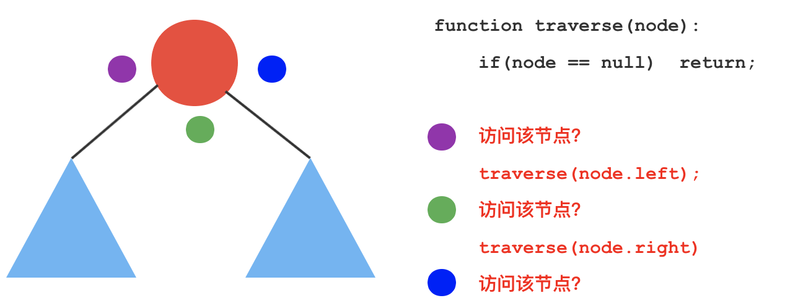
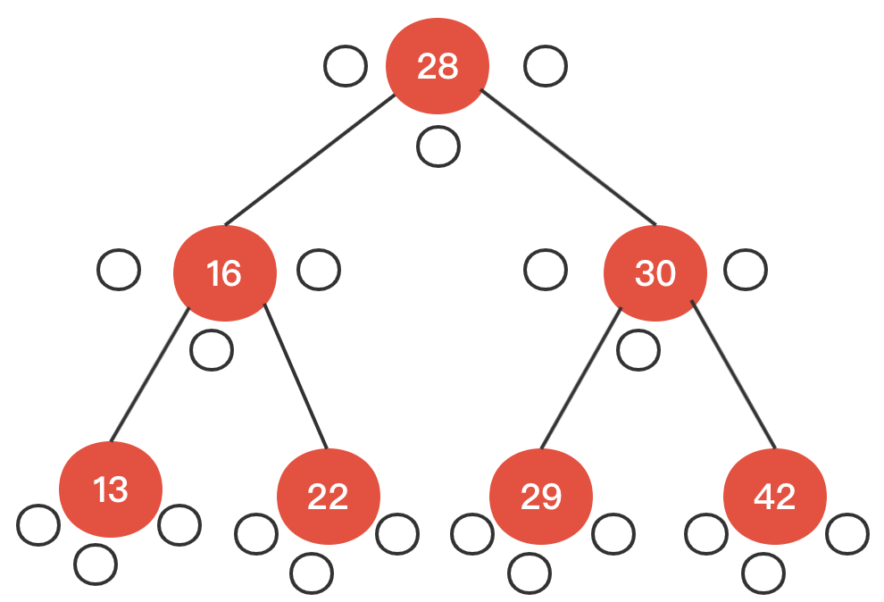

# 一、树结构

树具备天然的递归性，左右子树都是可以递归的；

## 1、概述

### 1.1、基本概念

树是数据元素之间具有次层关系的非线性的结构，树是由n(n≥0)个结点组成的有限集合，n=0的树是空树，n大于0的树T由以下两个条件约定构成：
- 有一个特殊的结点，称为根结点（root），它没有前驱结点只有后继结点；
- 除了根结点之外的其他结点分为m(0≤m≤n)个互不相交的集合T0,T1,T2,…,Tm−1,其中吧每个集合Ti也是一个树型结构，称之为子树(Subtree)

### 1.2、树的遍历

- 深度优先遍历：先序遍历（preorder tree walk）、中序遍历（inorder tree walk）、后序遍历（postorder tree walk）
- 广度优先遍历：层序遍历

**深度优先遍历：**
- **前序遍历：**先访问当前节点，再依次递归访问左右子树；
    ```java
    // 对以node为根的二叉搜索树进行前序遍历, 递归算法
    private void preOrder(Node node){
        if( node != null ){
            System.out.println(node.key);
            preOrder(node.left);
            preOrder(node.right);
        }
    }
    ```
- **中序遍历：**先递归访问左子树，再访问自身，再递归访问右子树；
    ```java
    // 对以node为根的二叉搜索树进行中序遍历, 递归算法
    private void inOrder(Node node){
        if( node != null ){
            inOrder(node.left);
            System.out.println(node.key);
            inOrder(node.right);
        }
    }
    ```
- **后序遍历：**先递归访问左右子树，再访问自身节点；
    ```java
    // 对以node为根的二叉搜索树进行后序遍历, 递归算法
    private void postOrder(Node node){
        if( node != null ){
            postOrder(node.left);
            postOrder(node.right);
            System.out.println(node.key);
        }
    }
    ```

深度优先便来都是使用递归来实现的，如果使用非递归来实现的话，可以使用额外的数据结构来实现，比如栈

**广度优先遍历：**

层序遍历：即逐层进行遍历，即将每层的节点存在队列当中，然后进行出队（取出节点）和入队（存入下一层的节点）的操作，以此达到遍历的目的；通过引入一个队列来支撑层序遍历：
- 如果根节点为空，无可遍历；
- 如果根节点不为空：
  - 先将根节点入队；
  - 只要队列不为空：（循环）
    - 出队队首节点，并遍历；
    - 如果队首节点有左孩子，将左孩子入队；
    - 如果队首节点有右孩子，将右孩子入队；
```java
public void levelOrder(){
    // 我们使用LinkedList来作为我们的队列
    LinkedList<Node> q = new LinkedList<Node>();
    q.add(root);
    while( !q.isEmpty() ){
        Node node = q.remove();
        System.out.println(node.key);
        if( node.left != null )
            q.add( node.left );
        if( node.right != null )
            q.add( node.right );
    }
}
```

## 2、二叉树

树表家族最为基础的结构

### 2.1、定义

- 具有为一个根节点
- 二叉树的每个结点至多只有二棵子树(不存在度大于2的结点)；
- 二叉树的子树有左右之分，次序不能颠倒；
- 二叉树的第i层至多有`2i-1`个结点；
- 深度为k的二叉树至多有`2k-1`个结点；
- 对任何一棵二叉树T，如果其终端结点数为`n0`，度为2的结点数为n2，则`n0=n2+1`

### 2.2、分类

- 二分搜索树
- 完全二叉树
- 满二叉树

## 3、完全二叉树

## 4、平衡二叉树

https://mp.weixin.qq.com/s/AweeCscNoLM2kKRA6Q_U8A

# 二、二分搜索树

## 1、定义

- 是一颗二叉树
- 每个节点的键值大于左孩子节点；
- 每个节点的键值小于右孩子节点；
- 以左右孩子为根的子树仍然是二分搜索树；
- 存储的元素有可比较性；
- 二分搜索树的中序遍历结果是顺序的；

后序遍历可以为二分搜索树释放内存；

## 2、基本定义

```java
public class BinarySearchTree<E extends Comparable<E>> {
    private class Node {
        public E e;
        public Node left, right;
        public Node(E e) {
            this.e = e;
            left = null;
            right = null;
        }
    }
    private Node root;
    private int size;
    public BinarySearchTree() {
        this.root = null;
        this.size = 0;
    }
    public int size() {
        return size;
    }
    public boolean isEmpty() {
        return size == 0;
    }
}
```

## 3、添加元素

```java
public void add(E e) {
    root = add(root, e);
}
/**
* 递归算法，返回插入新节点后二分搜索树的根
*/
public Node add(Node node, E e) {
    if (node == null) {
        size++;
        return new Node(e);
    }
    if (e.compareTo(node.e) < 0) {
        node.left = add(node.left, e);
    } else if (e.compareTo(node.e) > 0) {
        node.right = add(node.right, e);
    }
    return node;
}
```

## 4、查询元素

```java
public boolean contains(E e) {
    return contains(root, e);
}
private boolean contains(Node node, E e) {
    if (node == null) {
        return false;
    }
    if (e.compareTo(node.e) == 0) {
        return true;
    } else if (e.compareTo(node.e) < 0) {
        return contains(node.left, e);
    } else {
        return contains(node.right, e);
    }
}
```

## 5、遍历

### 5.1、前序遍历

递归实现：
```java
private void inOrder(Node root) {
    if (root == null) {
        return;
    }
    inOrder(root.left);
    System.out.print(root.e + "\t");
    inOrder(root.right);
}
```
非递归实现：
```java
/**
* 使用栈来实现非递归前序遍历
*/
public void preOrderNotRecursive() {
    if (root == null) {
        return;
    }
    Stack<Node> stack = new Stack<>();
    stack.push(root);
    while (!stack.isEmpty()) {
        final Node node = stack.pop();
        System.out.print(node.e + "\t");
        if (node.right != null) {
            stack.push(node.right);
        }
        if (node.left != null) {
            stack.push(node.left);
        }
    }
}
```

### 5.2、中序遍历

递归实现：
```java
private void inOrder(Node root) {
    if (root == null) {
        return;
    }
    inOrder(root.left);
    System.out.print(root.e + "\t");
    inOrder(root.right);
}
```
非递归实现
```java
public void inOrderNotRecursive() {
    if (root == null) {
        return;
    }
    Stack<Node> stack = new Stack<>();
    Node cur = root;

    while (cur != null || !stack.isEmpty()) {
        while (cur != null) {
            stack.push(cur);
            cur = cur.left;
        }
        cur = stack.pop();
        System.out.print(cur.e + "\t");
        cur = cur.right;
    }
}
```

### 5.3、后序遍历

递归实现：
```java
private void postOrder(Node root) {
    if (root == null) {
        return;
    }
    postOrder(root.left);
    postOrder(root.right);
    System.out.print(root.e + "\t");
}
```
非递归实现
```java
public void postOrderNotRecursive() {
    if (root == null) {
        return;
    }
    Stack<Node> stack = new Stack<>();
    Node cur = root;
    Node last = null;
    while (cur != null || !stack.isEmpty()) {
        while (cur != null) {
            stack.push(cur);
            cur = cur.left;
        }
        cur = stack.peek();
        if (cur.right == null || cur.right == last) {
            System.out.print(cur.e + "\t");
            stack.pop();
            // 记录上一个访问的节点
            // 用于判断“访问根节点之前，右子树是否已访问过”
            last = cur;
            cur = null;
        } else {
            cur = cur.right;
        }
    }
}
```

### 5.4、深度理解深度优先遍历

假设有如下树结构：
```
        28      
       /   \    
    16      30  
   /   \   /   \
  13  22  29   42
```
在遍历过程中，对每个节点都有三次访问机会：
- 在遍历该节点左子树之前，会访问一次该节点；
- 遍历完左子树之后，会回到该节点，又访问了一次该节点；
- 然后遍历右子树，在遍历完右子树之后，回到该节点

对于二分搜索树的遍历中，是在哪次访问该节点时对该节点进行操作：



如上图，紫色、绿色、蓝色三个圆点表示访问节点的操作，对应右边代码的时机



那么对于上面的树结构：
- 前序遍历过程为：28-16-13-22-30-29-42
- 中序遍历过程为：13-16-22-28-29-30-42
- 后序遍历过程为：13-22-16-29-42-30-28

### 5.5、层序遍历


# 三、二叉堆

# 四、线段树

# 五、Trie树

* [Trie树结构](https://www.cxyxiaowu.com/1873.html)

又称字典树，单词查找树或者前缀树，是一种用于快速检索的多叉树结构；Trie树优点是最大限度地减少无谓的字符串比较，查询效率比较高。核心思想是空间换时间，利用字符串的公共前缀来降低查询时间的开销以达到提高效率的目的。
- 插入、查找的时间复杂度均为O(N)，其中N为字符串长度。
- 空间复杂度是26^n级别的，非常庞大（可采用双数组实现改善）

1.决策树
2.哈夫曼树


# 六、并查集

# 七、AVL树

# 八、红黑树

- [红黑树Java实现](https://tech.meituan.com/2016/12/02/redblack-tree.html)
* [红黑树视频解析](http://www.csanimated.com/animation.php?t=Red-black_tree)
* [20张图红黑树入门](https://mp.weixin.qq.com/s/IaYnfEZ2bUXIpQvN3ZqFGA)
* [红黑树深入剖析及Java实现](http://tech.meituan.com/redblack-tree.html)
* [深入理解红黑树](http://blog.csdn.net/u011240877/article/details/53329023)
* [平衡查找树之红黑树](http://www.cnblogs.com/yangecnu/p/Introduce-Red-Black-Tree.html)
* [红黑树](http://www.tianxiaobo.com/2018/01/11/%E7%BA%A2%E9%BB%91%E6%A0%91%E8%AF%A6%E7%BB%86%E5%88%86%E6%9E%90/)
* [红黑树图](https://juejin.im/post/6844904020549730318)

# 九、树面试题

## 1、打印二叉树

### 1.1、问题描述

从上到下打印出二叉树的每个节点，同一层的节点按照从左到右的顺序打印

例如: 给定二叉树: `[3,9,20,null,null,15,7]`
```
    3
   / \
  9  20
    /  \
   15   7
```
返回：`[3,9,20,15,7]`

### 1.2、实现

```java
public int[] levelOrder(TreeNode root) {
    if (root == null) {
        return new int[0];
    }
    Queue<TreeNode> queue = new LinkedList<>();
    // 生成一个 list，用来保存输出的节点
    List<Integer> list = new ArrayList<>();
    // 首先让根节点入队
    queue.add(root);

    while (!queue.isEmpty()) {
        TreeNode node = queue.poll();
        list.add(node.value);
        // 判断该节点是否有左右子节点
        // 如果左子节点有值，则把左子节点加入到队列中
        if (node.left != null) {
            queue.add(node.left);
        }
        // 如果右子节点有值，则把右子节点加入到队列中
        if (node.right != null) {
            queue.add(node.right);
        }
    }
    // 根据题目要求，把 list 转化为数组
    int[] res = new int[list.size()];
    for (int i = 0; i < list.size(); i++) {
        res[i] = list.get(i);
    }
    // 返回 res
    return res;
}
```

### 1.3、扩展

从上到下按层打印二叉树，同一层的节点按从左到右的顺序打印，每一层打印到一行

例如: 给定二叉树: `[3,9,20,null,null,15,7]`
```
    3
   / \
  9  20
    /  \
   15   7
```
返回其层次遍历结果：
```
[
  [3],
  [9,20],
  [15,7]
]
```
代码实现
```java
public List<List<Integer>> levelOrder(TreeNode root) {
    // 设置 res 用来保存输出结果
    List<List<Integer>> res = new LinkedList<>();
    // 边界情况处理
    if (root == null) {
        return res;
    }
    // 设置一个队列，用来存储二叉树中的元素
    Queue<TreeNode> queue = new LinkedList<>();
    // 队列添加二叉树的根节点
    queue.add(root);
    // 遍历队列，直到队列为空，说明访问了二叉树中所有的节点
    while (!queue.isEmpty()) {
        // 用来记录 queue 的长度，即每层节点的个数
        int size = queue.size();
        // 用来保存每一层节点，保存成功后添加到 res 中
        List<Integer> temp = new ArrayList<>();
        // 使用 for 循环，将 queue 中的元素添加的 temp 中
        for (int i = 0; i < size; i++) {
            // 从 queue 中取出一个节点
            TreeNode node = queue.poll();
            // 把节点存放到 list 中
            temp.add(node.value);  //将节点值加入list
            // 判断当前节点的左子节点是否有值，如果有，则添加到 queue 中
            if (node.left != null) {
                queue.add(node.left);
            }
            // 判断当前节点的右子节点是否有值，如果有，则添加到 queue 中
            if (node.right != null) {
                queue.add(node.right);
            }
        }
        // 把存放了每一层元素的数组 temp 添加到 res 中
        res.add(temp);
    }
    return res;
}
```

### 1.4、蛇形打印

请实现一个函数按照之字形顺序打印二叉树，即第一行按照从左到右的顺序打印，第二层按照从右到左的顺序打印，第三行再按照从左到右的顺序打印，其他行以此类推。

例如: 给定二叉树: `[3,9,20,null,null,15,7]`
```
    3
   / \
  9  20
    /  \
   15   7
```
返回其层次遍历结果：
```
[
  [3],
  [20,9],
  [15,7]
]
```

代码实现：
```java
public List<List<Integer>> levelOrder(TreeNode root) {
    // 设置 res 用来保存输出结果
    List<List<Integer>> res = new LinkedList<>();
    // 边界情况处理
    if (root == null) {
        return res;
    }
    // 设置一个队列，用来存储二叉树中的元素
    Queue<TreeNode> queue = new LinkedList<>();
    // 队列添加二叉树的根节点
    queue.add(root);

    // 用来判断当前的层数是否为奇数层，初始化在第 0 层，为偶数层
    boolean isOddNumber = false;
    // 遍历队列，直到队列为空，说明访问了二叉树中所有的节点
    while (!queue.isEmpty()) {
        // 用来记录 queue 的长度，即每层节点的个数
        int size = queue.size();

        // 奇偶层总是交替出现的
        // 通过取反操作，判断当前的层数是否为奇偶层
        // 由于 isOddNumber 初始化为 false，所以第一次进来这个 while 循环取反后为 true，符合第一层是奇数层的定义
        isOddNumber = !isOddNumber;

        // 生成一个双端队列 temp，用来保存每一层节点，保存成功后添加到 res 中
        LinkedList<Integer> temp = new LinkedList<>();
        // 使用 for 循环，将 queue 中的元素按照给定的规则添加的 temp 中
        for (int i = 0; i < size; i++) {
            // 从 queue 中取出一个节点
            TreeNode node = queue.poll();
            // 如果是奇数层，那么按顺序添加到双端队列的尾部
            if (isOddNumber) {
                temp.addLast(node.value);
            } else {
                // 如果是偶数层，那么按顺序添加到双端队列的头部
                temp.addFirst(node.value);
            }
            // 判断当前节点的左子节点是否有值，如果有，则添加到 queue 中
            if (node.left != null) {
                queue.add(node.left);
            }
            // 判断当前节点的右子节点是否有值，如果有，则添加到 queue 中
            if (node.right != null) {
                queue.add(node.right);
            }
        }
        // 把存放了每一层元素的数组 temp 添加到 res 中
        res.add(temp);
    }

    return res;
}
```

## 2、对称树

### 2.1、问题描述

请实现一个函数，用来判断一棵二叉树是不是对称的。如果一棵二叉树和它的镜像一样，那么它是对称的

例如，二叉树 [1,2,2,3,4,4,3] 是对称的。
```
    1
   / \
  2   2
 / \ / \
3  4 4  3
```
但是下面这个 [1,2,2,null,3,null,3] 则不是镜像对称的：
```
    1
   / \
  2   2
   \   \
   3    3
```

### 2.2、代码实现

```java
public boolean isSymmetric(TreeNode root) {
    // 边界情况
    if(root == null) return true;
    // 递归判断左子树和右子树是否对称
    return isSymmetriacalCor(root.left,root.right);

}
private boolean isSymmetriacalCor(TreeNode L,TreeNode R){
    // 如果某根子树的左右两子树同时为空，肯定是对称的，直接返回 true
    if(L == null && R == null){
        return true;
    }
    // 说明根子树的左右两子树有某子树为空，某子树有值，不对称，返回 false
    if(L == null || R == null){
        return false;
    }
    // 左子树的值与右子树的值不相等，不对称，返回 false
    if(L.val != R.val){
        return false;
    }
    // 递归的对比当前节点的左子树的左子树与右子树的右子树、左子树的右子树与右子树的左子树是否对称
    return isSymmetriacalCor(L.left,R.right) && isSymmetriacalCor(L.right,R.left);
}
```

# 参考资料

* [数据结构中各种树](http://www.cnblogs.com/maybe2030/p/4732377.html)
* [树结构详解](http://data.biancheng.net/tree/)


