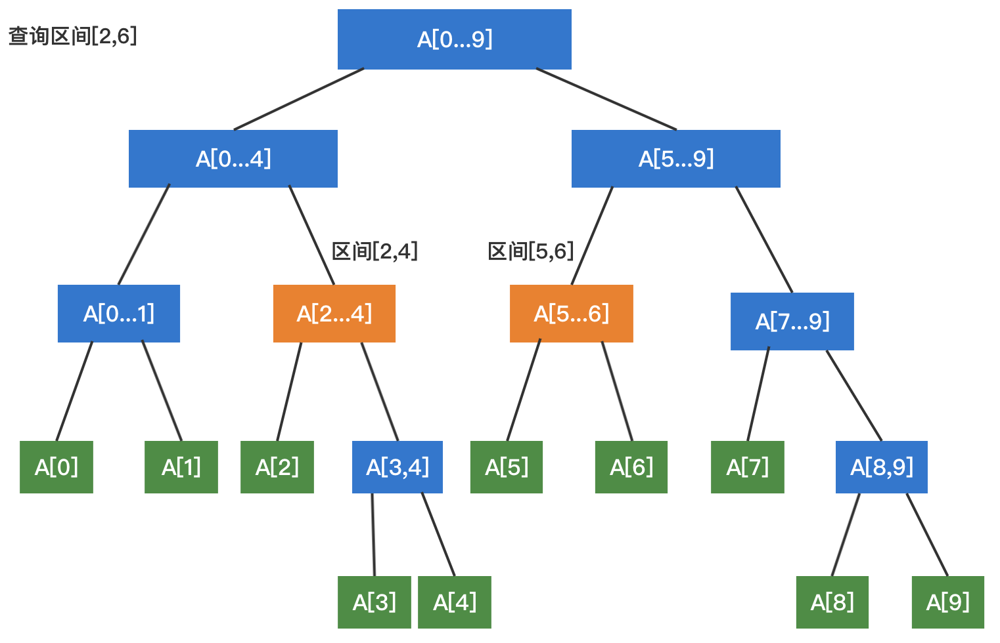

# 一、树结构

树具备天然的递归性，左右子树都是可以递归的；

## 1、概述

### 1.1、基本概念

树是数据元素之间具有次层关系的非线性的结构，树是由n(n≥0)个结点组成的有限集合，n=0的树是空树，n大于0的树T由以下两个条件约定构成：
- 有一个特殊的结点，称为根结点（root），它没有前驱结点只有后继结点；
- 除了根结点之外的其他结点分为m(0≤m≤n)个互不相交的集合T0,T1,T2,…,Tm−1,其中吧每个集合Ti也是一个树型结构，称之为子树(Subtree)

### 1.2、树的遍历

- 深度优先遍历：先序遍历（preorder tree walk）、中序遍历（inorder tree walk）、后序遍历（postorder tree walk）
- 广度优先遍历：层序遍历

**深度优先遍历：**
- **前序遍历**：先访问当前节点，再依次递归访问左右子树；
    ```java
    // 对以node为根的二叉搜索树进行前序遍历, 递归算法
    private void preOrder(Node node){
        if( node != null ){
            System.out.println(node.key);
            preOrder(node.left);
            preOrder(node.right);
        }
    }
    ```
- **中序遍历**：先递归访问左子树，再访问自身，再递归访问右子树；
    ```java
    // 对以node为根的二叉搜索树进行中序遍历, 递归算法
    private void inOrder(Node node){
        if( node != null ){
            inOrder(node.left);
            System.out.println(node.key);
            inOrder(node.right);
        }
    }
    ```
- **后序遍历**：先递归访问左右子树，再访问自身节点；
    ```java
    // 对以node为根的二叉搜索树进行后序遍历, 递归算法
    private void postOrder(Node node){
        if( node != null ){
            postOrder(node.left);
            postOrder(node.right);
            System.out.println(node.key);
        }
    }
    ```

深度优先便来都是使用递归来实现的，如果使用非递归来实现的话，可以使用额外的数据结构来实现，比如栈

**广度优先遍历：**

层序遍历：即逐层进行遍历，即将每层的节点存在队列当中，然后进行出队（取出节点）和入队（存入下一层的节点）的操作，以此达到遍历的目的；通过引入一个队列来支撑层序遍历：
- 如果根节点为空，无可遍历；
- 如果根节点不为空：
  - 先将根节点入队；
  - 只要队列不为空：（循环）
    - 出队队首节点，并遍历；
    - 如果队首节点有左孩子，将左孩子入队；
    - 如果队首节点有右孩子，将右孩子入队；
- 广度优先遍历能够更快找到问题的解，常用语算法设计：最短路径
```java
public void levelOrder(){
    // 我们使用LinkedList来作为我们的队列
    LinkedList<Node> q = new LinkedList<Node>();
    q.add(root);
    while( !q.isEmpty() ){
        Node node = q.remove();
        System.out.println(node.key);
        if( node.left != null )
            q.add( node.left );
        if( node.right != null )
            q.add( node.right );
    }
}
```

## 2、二叉树

树表家族最为基础的结构

### 2.1、定义

- 具有为一个根节点
- 二叉树的每个结点至多只有二棵子树(不存在度大于2的结点)；
- 二叉树的子树有左右之分，次序不能颠倒；
- 二叉树的第i层至多有`2i-1`个结点；
- 深度为k的二叉树至多有`2k-1`个结点；
- 对任何一棵二叉树T，如果其终端结点数为`n0`，度为2的结点数为n2，则`n0=n2+1`

### 2.2、分类

（1）满二叉树：除最后一层无任何子节点外，每一层上的所有结点都有两个子结点二叉树


（2）完全二叉树：一棵二叉树至多只有最下面的一层上的结点的度数可以小于2，并且最下层上的结点都集中在该层最左边的若干位置上，则此二叉树成为完全二叉树


（3）平衡二叉树：是一棵空树或它的左右两个子树的高度差的绝对值不超过1，并且左右两个子树都是一棵平衡二叉树


（4）二叉搜索树：它或者是一棵空树，或者是具有下列性质的二叉树：若它的左子树不空，则左子树上所有结点的值均小于它的根结点的值；若它的右子树不空，则右子树上所有结点的值均大于它的根结点的值；它的左、右子树也分别为二叉搜索树

（5）红黑树：平衡二叉搜索树

（6）哈弗曼树：给定n个权值作为n个叶子结点，构造一棵二叉树，若带权路径长度达到最小，称这样的二叉树为最优二叉树，也称为哈夫曼树(Huffman Tree)。哈夫曼树是带权路径长度最短的树，权值较大的结点离根较近

# 二、二分搜索树

## 1、定义

- 是一颗二叉树
- 每个节点的键值大于左孩子节点；
- 每个节点的键值小于右孩子节点；
- 以左右孩子为根的子树仍然是二分搜索树；
- 存储的元素有可比较性；
- 二分搜索树的中序遍历结果是顺序的；

后序遍历可以为二分搜索树释放内存；

## 2、基本定义

```java
public class BinarySearchTree<E extends Comparable<E>> {
    private class Node {
        public E e;
        public Node left, right;
        public Node(E e) {
            this.e = e;
            left = null;
            right = null;
        }
    }
    private Node root;
    private int size;
    public BinarySearchTree() {
        this.root = null;
        this.size = 0;
    }
    public int size() {
        return size;
    }
    public boolean isEmpty() {
        return size == 0;
    }
}
```

## 3、添加元素

```java
public void add(E e) {
    root = add(root, e);
}
/**
* 递归算法，返回插入新节点后二分搜索树的根
*/
public Node add(Node node, E e) {
    if (node == null) {
        size++;
        return new Node(e);
    }
    if (e.compareTo(node.e) < 0) {
        node.left = add(node.left, e);
    } else if (e.compareTo(node.e) > 0) {
        node.right = add(node.right, e);
    }
    return node;
}
```

## 4、查询元素

```java
public boolean contains(E e) {
    return contains(root, e);
}
private boolean contains(Node node, E e) {
    if (node == null) {
        return false;
    }
    if (e.compareTo(node.e) == 0) {
        return true;
    } else if (e.compareTo(node.e) < 0) {
        return contains(node.left, e);
    } else {
        return contains(node.right, e);
    }
}
```

## 5、遍历

### 5.1、前序遍历

递归实现：
```java
private void inOrder(Node root) {
    if (root == null) {
        return;
    }
    inOrder(root.left);
    System.out.print(root.e + "\t");
    inOrder(root.right);
}
```
非递归实现：
```java
/**
* 使用栈来实现非递归前序遍历
*/
public void preOrderNotRecursive() {
    if (root == null) {
        return;
    }
    Stack<Node> stack = new Stack<>();
    stack.push(root);
    while (!stack.isEmpty()) {
        final Node node = stack.pop();
        System.out.print(node.e + "\t");
        if (node.right != null) {
            stack.push(node.right);
        }
        if (node.left != null) {
            stack.push(node.left);
        }
    }
}
```

### 5.2、中序遍历

递归实现：
```java
private void inOrder(Node root) {
    if (root == null) {
        return;
    }
    inOrder(root.left);
    System.out.print(root.e + "\t");
    inOrder(root.right);
}
```
非递归实现
```java
public void inOrderNotRecursive() {
    if (root == null) {
        return;
    }
    Stack<Node> stack = new Stack<>();
    Node cur = root;

    while (cur != null || !stack.isEmpty()) {
        while (cur != null) {
            stack.push(cur);
            cur = cur.left;
        }
        cur = stack.pop();
        System.out.print(cur.e + "\t");
        cur = cur.right;
    }
}
```

### 5.3、后序遍历

递归实现：
```java
private void postOrder(Node root) {
    if (root == null) {
        return;
    }
    postOrder(root.left);
    postOrder(root.right);
    System.out.print(root.e + "\t");
}
```
非递归实现
```java
public void postOrderNotRecursive() {
    if (root == null) {
        return;
    }
    Stack<Node> stack = new Stack<>();
    Node cur = root;
    Node last = null;
    while (cur != null || !stack.isEmpty()) {
        while (cur != null) {
            stack.push(cur);
            cur = cur.left;
        }
        cur = stack.peek();
        if (cur.right == null || cur.right == last) {
            System.out.print(cur.e + "\t");
            stack.pop();
            // 记录上一个访问的节点
            // 用于判断“访问根节点之前，右子树是否已访问过”
            last = cur;
            cur = null;
        } else {
            cur = cur.right;
        }
    }
}
```

### 5.4、深度理解深度优先遍历

假设有如下树结构：
```
        28      
       /   \    
    16      30  
   /   \   /   \
  13  22  29   42
```
在遍历过程中，对每个节点都有三次访问机会：
- 在遍历该节点左子树之前，会访问一次该节点；
- 遍历完左子树之后，会回到该节点，又访问了一次该节点；
- 然后遍历右子树，在遍历完右子树之后，回到该节点

对于二分搜索树的遍历中，是在哪次访问该节点时对该节点进行操作：


如上图，紫色、绿色、蓝色三个圆点表示访问节点的操作，对应右边代码的时机


那么对于上面的树结构：
- 前序遍历过程为：28-16-13-22-30-29-42
- 中序遍历过程为：13-16-22-28-29-30-42
- 后序遍历过程为：13-22-16-29-42-30-28

### 5.5、层序遍历

```java
public void levelOrder() {
    if (root == null) {
        return;
    }
    Queue<Node> queue = new LinkedList<>();
    queue.add(root);

    while (!queue.isEmpty()) {
        Node node = queue.poll();
        System.out.print(node.e + "\t");
        if (node.left != null) {
            queue.add(node.left);
        }
        if (node.right != null) {
            queue.add(node.right);
        }
    }
}
```

## 6、删除元素

### 6.1、删除最大

最大值就是从根节点往右子树开始查找，直到右节点是一个叶子节点
```java
/**
* 找出二分搜索树的最大值
*/
public E max() {
    if (size == 0) {
        throw new IllegalStateException("tree empty");
    }
    return max(root).e;
}
private Node max(Node node) {
    if (node.right == null) {
        return node;
    }
    return max(node.right);
}
public E removeMax() {
    E res = max();
    root = removeMax(root);
    return res;
}
private Node removeMax(Node node) {
    if (node.right == null) {
        Node leftNode = node.left;
        node.left = null;
        size--;
        return leftNode;
    }
    node.right = removeMax(node.right);
    return node;
}
```

### 6.2、删除最小

最小值就是从根节点往左子树开始查找，直到左节点是一个叶子节点
```java
/**
* 找出二分搜索树的最小值
*/
public E min() {
    if (size == 0) {
        throw new IllegalStateException("tree empty");
    }
    return min(root).e;
}
private Node min(Node node) {
    if (node.left == null) {
        return node;
    }
    return min(node.left);
}
public E removeMin() {
    E res = min();
    root = removeMin(root);
    return res;
}
private Node removeMin(Node node) {
    if (node.left == null) {
        Node rightNode = node.right;
        node.right = null;
        size--;
        return rightNode;
    }
    node.left = removeMin(node.left);
    return node;
}
```

### 6.3、删除任意元素

比如有如下树结构，比如删除节点的操作
```
                41              
               /   \            
        22              58      
       /   \           /        
    15      33      50          
   /           \   /   \        
  13          37  42  53      
```
- 删除只有左子树的节点，比如：58，只需要把58这个用其左子树取代；
- 删除只有右子树的节点，比如：33，只需要把33这个用其右子树取代；

再看如下树结构：
```
                41              
               /   \            
        22              58      
       /   \           /   \    
    15      33      50      60  
   /   \   /   \   /   \   /   \
  13  18  28  37  42  53  59  63
```
删除左右子树都有的节点，比如58，有两种操作，用以58这个节点点为根节点的树找到：比58更大的最小值（59）或者比58更小的最大值（比如53）；以59为例，假设要删除的节点命名为d，替代d节点的为s：
- 找到 `s = min(d -> right);`
- s 是 d 的后继节点；
- `s -> right = removeMin(d -> right);`
- `s -> left = d -> left`
- 删除d，`d -> left = d -> right = null;`，s是新的子树的根；

```java
/**
* 删除指定的元素
*/
public void remove(E e) {
    root = remove(root, e);
}
private Node remove(Node node, E e) {
    if (node == null) {
        return null;
    }
    if (e.compareTo(node.e) < 0) {
        node.left = remove(node.left, e);
        return node;
    } else if (e.compareTo(node.e) > 0) {
        node.right = remove(node.right, e);
        return node;
    } else {
        // 待删除节点左子树为空的情况
        if (node.left == null) {
            Node rightNode = node.right;
            node.right = null;
            size--;
            return rightNode;
        }
        // 待删除节点右子树为空的情况
        if (node.right == null) {
            Node leftNode = node.left;
            node.left = null;
            size--;
            return leftNode;
        }
        // node节点的左右子树都不为空
        // 找到比待删除节点大的最小节点, 即待删除节点右子树的最小节点
        // 用这个节点顶替待删除节点的位置
        Node successor = min(node.right);
        successor.right = removeMin(node.right);
        successor.left = node.left;
        node.left = node.right = null;
        // 或者还有一种写法，找到比待删除节点小的最大节点，即待删除节点左子树的最大节点，用这个节点顶替待删除节点的位置
        /*
        Node successor = max(node.left);
        successor.left = removeMax(node.left);
        successor.right = node.right;
        node.left = node.right = null;
        */
        return successor;
    }
}
```

## 7、树的深度

```java
public int heightOf() {
    return heightOf(root);
}

private int heightOf(Node node) {
    if (node == null) {
        return 0;
    }
    return Math.max(
            heightOf(node.left),
            heightOf(node.right)
    ) + 1;
}
```

## 8、按照树结构打印

```java
public void print() {
    int h = heightOf(root);
    int W = 2 * (int) Math.pow(2, h);
    var lines = new StringBuilder[h * 2];
    for (int i = 0; i < h * 2; i++) {
        lines[i] = new StringBuilder(String.format("%" + W + "s", ""));
    }
    printNode(lines, W, root, 0, 0);
    for (var line : lines) {
        System.out.println(line.toString());
    }

}
private void printNode(StringBuilder[] lines, int W, Node node, int h, int base) {
    var nums = Math.pow(2, h);
    var pos = base + (int) (W / (nums * 2));
    var str = node.e.toString();
    for (int i = 0; i < str.length(); i++) {
        lines[h * 2].setCharAt(pos + i, str.charAt(i));
    }
    if (node.left != null) {
        lines[h * 2 + 1].setCharAt(pos - 1, '/');
        printNode(lines, W, node.left, h + 1, base);
    }

    if (node.right != null) {
        lines[h * 2 + 1].setCharAt(pos + str.length() + 1, '\\');
        printNode(lines, W, node.right, h + 1, pos);
    }
}
```

# 三、堆

## 1、优先队列

普通队列：先进先出

优先队列：出队顺序跟入队顺序无关，由优先级决定；

## 2、堆


- 二叉堆是一颗完全二叉树（把元素顺序排列成树的形状）
- 最大堆：堆中某个节点的值总是不大于其父节点的值，根节点元素是最大的
- 最小堆：堆中某个节点的值总是不小于其父节点的值，根节点元素是最小的
- 可以使用数组的形式表示一个二叉堆：

    对于索引是从1开始的：第i个节点
    - left child索引： `2 * i`
    - right child索引： `2 * i + 1;`
    - parent索引： `i / 2`

    对于索引是从0开始的：第i个节点
    - left child索引： `2 * i + 1`
    - right child索引：`2 * i + 2;`
    - parent索引： `(i-1) / 2`
- 找到一个堆中的最后一个非叶子节点：数组的最后一个值的父节点的索引就是最后一个非叶子节点`(data.size() - 1)/ 2`

## 3、堆的实现

详细[MaxHeap.java](MaxHeap.java)

## 4、优先队列实现

可以使用堆来实现优先队列

JDK的PriorityQueue 是使用最小堆来实现的；另外其内部元素比较是通过 Comparator 比较器来实现的，其构造函数可以传入一个 Comparator，如果没有，则使用元素的自然顺序的；也就是如果没有传入比较器，且队列内元素不是可比较的（没有实现 Comparable接口）的，会报如下错误：ClassCastException
```
Exception in thread "main" java.lang.ClassCastException: class com.algorithm.tree.heap.TestMaxHeap$Person cannot be cast to class java.lang.Comparable (com.algorithm.tree.heap.TestMaxHeap$Person is in unnamed module of loader 'app'; java.lang.Comparable is in module java.base of loader 'bootstrap')
```

## 5、topK问题

topK问题是优先队列的经典问题：在1000000万元素选出前100名

即在N个元素选出前M个元素；可以使用优先队列维护当前看到的前M个元素

可以看下：[leetcode-347-前K个高频元素](https://leetcode.com/problems/top-k-frequent-elements/)
```java
class Solution {
    public int[] topKFrequent(int[] nums, int k) {
        TreeMap<Integer, Integer> map = new TreeMap<>();
        for (int num : nums) {
            if (map.containsKey(num)) {
                map.put(num, map.get(num) + 1);
            } else {
                map.put(num, 1);
            }
        }
        PriorityQueue<Integer> pq = new PriorityQueue<>((a, b) -> map.get(a) - map.get(b));
        for (Entry<Integer, Integer> entry : map.entrySet()) {
            if (pq.size() < k) {
                pq.add(entry.getKey());
            } else if (entry.getValue() > map.get(pq.peek())) {
                pq.remove();
                pq.add(entry.getKey());
            }
        }
        int[] res = new int[pq.size()];
        int i = 0;
        while (!pq.isEmpty()) {
            res[i++] = pq.remove();
        }
        return res;
    }
}
```

## 6、索引堆

### 6.1、概述

索引堆是对堆进行了优化，在堆中，构建堆、插入、删除过程都需要大量的交换操作。在前面的实现中，进行交换操作是直接交换datas数组中两个元素。而索引堆交换的是这两个元素的索引，而不是直接交换元素；


主要有两个好处：
- 减小交换操作的消耗，尤其是对于元素交换需要很多资源的对象来说，比如大字符串。
- 可以根据原位置找到元素，即便这个元素已经换了位置。

### 6.2、实现思路

索引堆使用了一个新的int类型的数组，用于存放索引信息
```java
private E[] data; // 比较大小的数据
private int[] indexes; // 对应数据的索引，由索引数组来构建堆
```

### 6.3、优化

针对索引堆中需要找寻的数据，可以将其索引数组在维护一个反向数组来实现


其中索引数组和反向数组元素之间的关系：


## 7、缺点

对于一个很大的堆，这种存储是低效的。因为节点的子节点很可能在另外一个内存页中。B-heap是一种效率更高的存储方式，把每个子树放到同一内存页

# 四、线段树

## 1、概述

线段树（区间树）是用来存放给定区间（segment, or interval）内对应信息的一种数据结构；线段树用来处理数组相应的区间查询（range query）和元素更新（update）操作。与树状数组不同的是，线段树不止可以适用于区间求和的查询，也可以进行区间最大值，区间最小值（Range Minimum/Maximum Query problem）或者区间异或值的查询；

对应于树状数组，线段树进行更新（update）的操作为O($logN$)，进行区间查询（range query）的操作也为O($logN$)

未优化的空间复杂度为2N，实际应用时一般还要开4N的数组以免越界，因此有时需要离散化让空间压缩；

使用场景：
- 查询：一个区间[i, j]的最⼤大值，最⼩小值，或者区间数字和；
- 实质：基于区间的统计查询

## 2、结构

- 线段树不是完全二叉树，是平衡二叉树
- 线段树可以使用数组来表示，那么表示线段树的容量怎么计算：一般是4*N（N表示区间有N个元素），如果线段树不考虑添加元素，那么可以使用静态空间，即4N容量的数组

有10个元素的数组`A[5,6,7,4,3,2,1,-1,-5,8]`，可以形成如下线段树结构


## 3、创建线段树

根据上面的数组为例，以求区间数据和为例


从数据结构的角度来说，线段树是用一个完全二叉树来存储对应于其每一个区间（segment）的数据。该二叉树的每一个结点中保存着相对应于这一个区间的信息。同时，线段树所使用的这个二叉树是用一个数组保存的，与堆（Heap）的实现方式相同

```java
@SuppressWarnings("unchecked")
public class SegmentTree<E> {
    // 原始数据
    private final E[] data;
    // 线段树
    private final E[] tree;
    // 对于每个节点的数据如何产生的
    private final Merger<E> merger;
    public SegmentTree(E[] arr, Merger<E> merger) {
        this.merger = merger;
        final int len = arr.length;
        data = (E[]) new Object[len];
        System.arraycopy(arr, 0, data, 0, len);
        // 线段树数组默认为原数组容量的4倍
        tree = (E[]) new Object[4 * len];
        buildSegmentTree(0, 0, len - 1);
    }
    private void buildSegmentTree(int treeIndex, int l, int r) {
        if (l == r) {
            tree[treeIndex] = data[l];
            return;
        }
        int leftTree = leftChild(treeIndex);
        int rightTree = rightChild(treeIndex);

        int mid = l + (r - l) / 2;
        buildSegmentTree(leftTree, l, mid);
        buildSegmentTree(rightTree, mid + 1, r);

        tree[treeIndex] = merger.merge(data[leftTree], data[rightTree]);
    }
    // 返回完全二叉树的数组表示中，一个索引所表示的元素的左孩子节点的索引
    private int leftChild(int index) {
        return 2 * index + 1;
    }

    // 返回完全二叉树的数组表示中，一个索引所表示的元素的右孩子节点的索引
    private int rightChild(int index) {
        return 2 * index + 2;
    }
    // 通过何种逻辑构建线段树
    public interface Merger<E> {
        E merge(E a, E b);
    }
}
```

## 4、查询

根据上面求和线段树，查询区间`[2,6]`的数据之和


- 首先将区间`[2,6]`拆分为`[2,4]`和`[5,6]`；
- 然后递归分别在根节点两变进行查询

```java
public E query(int queryL, int queryR) {
    if (queryL < 0 || queryL >= size() || queryR < 0 || queryR >= size()) {
        throw new IllegalArgumentException("index illegal");
    }
    return query(0, 0, data.length - 1, queryL, queryR);
}
private E query(int treeIndex, int l, int r, int queryL, int queryR) {
    if (l == queryL && r == queryR) {
        return tree[treeIndex];
    }
    int mid = l + (r - l) / 2;
    int leftIndex = leftChild(treeIndex);
    int rightIndex = rightChild(treeIndex);

    if (queryL >= mid + 1) {
        return query(rightIndex, mid + 1, r, queryL, queryR);
    } else if (queryR <= mid) {
        return query(leftIndex, l, mid, queryL, queryR);
    }
    E leftResult = query(leftIndex, l, mid, queryL, mid);
    E rightResult = query(rightIndex, mid + 1, r, mid + 1, queryR);

    return merger.merge(leftResult, rightResult);
}
```

## 5、更新

### 5.1、更新具体值

```java
// 将index位置的值，更新为e
public void set(int index, E e) {
    if (index < 0 || index >= data.length) {
        throw new IllegalArgumentException("Index is illegal.");
    }
    data[index] = e;
    set(0, 0, data.length - 1, index, e);
}
/**
* 在以treeIndex为根的线段树中更新index的值为e
*/
private void set(int treeIndex, int l, int r, int index, E e) {
    if (l == r) {
        tree[treeIndex] = e;
        return;
    }
    // treeIndex的节点分为[l...mid]和[mid+1...r]两部分
    int mid = l + (r - l) / 2;
    int leftIndex = leftChild(treeIndex);
    int rightIndex = rightChild(treeIndex);

    if (index >= mid + 1) {
        set(rightIndex, mid + 1, r, index, e);
    } else {
        set(leftIndex, l, mid, index, e);
    }
    tree[treeIndex] = merger.merge(tree[leftIndex], tree[rightIndex]);
}
```

### 5.2、更新区间

## 6、相关题目

### 6.1、线段数组求和

[leetcode-303](https://leetcode.com/problems/range-sum-query-immutable/)

使用线段树实现：
```java
class NumArray {
    private SegmentTree<Integer> segmentTree;
    public NumArray(int[] nums) {
        if (nums.length > 0) {
            Integer[] arr = new Integer[nums.length];
            for (int i = 0; i < nums.length; i++) {
                arr[i] = nums[i];
            }
            segmentTree = new SegmentTree<>(arr, Integer::sum);
        }
    }
    public int sumRange(int left, int right) {
        if (segmentTree == null) {
            return 0;
        }
        return segmentTree.query(left, right);
    }
}
```
不使用线段树：
```java
public class NumArray2 {
    private int[] sum; // sum[i]存储前i个元素和, sum[0] = 0
                       // 即sum[i]存储nums[0...i-1]的和
                       // sum(i, j) = sum[j + 1] - sum[i]
    public NumArray2(int[] nums) {
        sum = new int[nums.length + 1];
        sum[0] = 0;
        for(int i = 1 ; i < sum.length ; i ++)
            sum[i] = sum[i - 1] + nums[i - 1];
    }
    public int sumRange(int i, int j) {
        return sum[j + 1] - sum[i];
    }
}
```

### 6.2、区域查询-可修改

[leetcode-307](https://leetcode.com/problems/range-sum-query-mutable/)

使用数组实现：会报超出时间限制
```java
class NumArray {
    private int[] data;
    private int[] sum;
    public NumArray(int[] nums) {
        data = new int[nums.length];
        for(int i = 0 ; i < nums.length ; i ++)
            data[i] = nums[i];

        sum = new int[nums.length + 1];
        sum[0] = 0;
        for(int i = 1 ; i <= nums.length ; i ++)
            sum[i] = sum[i - 1] + nums[i - 1];
    }
    public int sumRange(int i, int j) {
        return sum[j + 1] - sum[i];
    }
    public void update(int index, int val) {
        data[index] = val;
        for(int i = index + 1 ; i < sum.length ; i ++)
            sum[i] = sum[i - 1] + data[i - 1];
    }
}
```
使用线段树实现：
```java

```

# 五、Trie树

* [Trie树结构](https://www.cxyxiaowu.com/1873.html)

又称字典树，单词查找树或者前缀树，是一种用于快速检索的多叉树结构；Trie树优点是最大限度地减少无谓的字符串比较，查询效率比较高。核心思想是空间换时间，利用字符串的公共前缀来降低查询时间的开销以达到提高效率的目的。
- 插入、查找的时间复杂度均为O(N)，其中N为字符串长度。
- 空间复杂度是26^n级别的，非常庞大（可采用双数组实现改善）

1.决策树
2.哈夫曼树


# 六、并查集

# 七、AVL树

https://mp.weixin.qq.com/s/AweeCscNoLM2kKRA6Q_U8A

# 八、红黑树

- [红黑树Java实现](https://tech.meituan.com/2016/12/02/redblack-tree.html)
* [红黑树视频解析](http://www.csanimated.com/animation.php?t=Red-black_tree)
* [20张图红黑树入门](https://mp.weixin.qq.com/s/IaYnfEZ2bUXIpQvN3ZqFGA)
* [红黑树深入剖析及Java实现](http://tech.meituan.com/redblack-tree.html)
* [深入理解红黑树](http://blog.csdn.net/u011240877/article/details/53329023)
* [平衡查找树之红黑树](http://www.cnblogs.com/yangecnu/p/Introduce-Red-Black-Tree.html)
* [红黑树](http://www.tianxiaobo.com/2018/01/11/%E7%BA%A2%E9%BB%91%E6%A0%91%E8%AF%A6%E7%BB%86%E5%88%86%E6%9E%90/)
* [红黑树图](https://juejin.im/post/6844904020549730318)

# 九、树面试题

## 1、打印二叉树

### 1.1、问题描述

从上到下打印出二叉树的每个节点，同一层的节点按照从左到右的顺序打印

例如: 给定二叉树: `[3,9,20,null,null,15,7]`
```
    3
   / \
  9  20
    /  \
   15   7
```
返回：`[3,9,20,15,7]`

### 1.2、实现

```java
public int[] levelOrder(TreeNode root) {
    if (root == null) {
        return new int[0];
    }
    Queue<TreeNode> queue = new LinkedList<>();
    // 生成一个 list，用来保存输出的节点
    List<Integer> list = new ArrayList<>();
    // 首先让根节点入队
    queue.add(root);

    while (!queue.isEmpty()) {
        TreeNode node = queue.poll();
        list.add(node.value);
        // 判断该节点是否有左右子节点
        // 如果左子节点有值，则把左子节点加入到队列中
        if (node.left != null) {
            queue.add(node.left);
        }
        // 如果右子节点有值，则把右子节点加入到队列中
        if (node.right != null) {
            queue.add(node.right);
        }
    }
    // 根据题目要求，把 list 转化为数组
    int[] res = new int[list.size()];
    for (int i = 0; i < list.size(); i++) {
        res[i] = list.get(i);
    }
    // 返回 res
    return res;
}
```

### 1.3、扩展

从上到下按层打印二叉树，同一层的节点按从左到右的顺序打印，每一层打印到一行

例如: 给定二叉树: `[3,9,20,null,null,15,7]`
```
    3
   / \
  9  20
    /  \
   15   7
```
返回其层次遍历结果：
```
[
  [3],
  [9,20],
  [15,7]
]
```
代码实现
```java
public List<List<Integer>> levelOrder(TreeNode root) {
    // 设置 res 用来保存输出结果
    List<List<Integer>> res = new LinkedList<>();
    // 边界情况处理
    if (root == null) {
        return res;
    }
    // 设置一个队列，用来存储二叉树中的元素
    Queue<TreeNode> queue = new LinkedList<>();
    // 队列添加二叉树的根节点
    queue.add(root);
    // 遍历队列，直到队列为空，说明访问了二叉树中所有的节点
    while (!queue.isEmpty()) {
        // 用来记录 queue 的长度，即每层节点的个数
        int size = queue.size();
        // 用来保存每一层节点，保存成功后添加到 res 中
        List<Integer> temp = new ArrayList<>();
        // 使用 for 循环，将 queue 中的元素添加的 temp 中
        for (int i = 0; i < size; i++) {
            // 从 queue 中取出一个节点
            TreeNode node = queue.poll();
            // 把节点存放到 list 中
            temp.add(node.value);  //将节点值加入list
            // 判断当前节点的左子节点是否有值，如果有，则添加到 queue 中
            if (node.left != null) {
                queue.add(node.left);
            }
            // 判断当前节点的右子节点是否有值，如果有，则添加到 queue 中
            if (node.right != null) {
                queue.add(node.right);
            }
        }
        // 把存放了每一层元素的数组 temp 添加到 res 中
        res.add(temp);
    }
    return res;
}
```

### 1.4、蛇形打印

请实现一个函数按照之字形顺序打印二叉树，即第一行按照从左到右的顺序打印，第二层按照从右到左的顺序打印，第三行再按照从左到右的顺序打印，其他行以此类推。

例如: 给定二叉树: `[3,9,20,null,null,15,7]`
```
    3
   / \
  9  20
    /  \
   15   7
```
返回其层次遍历结果：
```
[
  [3],
  [20,9],
  [15,7]
]
```

代码实现：
```java
public List<List<Integer>> levelOrder(TreeNode root) {
    // 设置 res 用来保存输出结果
    List<List<Integer>> res = new LinkedList<>();
    // 边界情况处理
    if (root == null) {
        return res;
    }
    // 设置一个队列，用来存储二叉树中的元素
    Queue<TreeNode> queue = new LinkedList<>();
    // 队列添加二叉树的根节点
    queue.add(root);

    // 用来判断当前的层数是否为奇数层，初始化在第 0 层，为偶数层
    boolean isOddNumber = false;
    // 遍历队列，直到队列为空，说明访问了二叉树中所有的节点
    while (!queue.isEmpty()) {
        // 用来记录 queue 的长度，即每层节点的个数
        int size = queue.size();

        // 奇偶层总是交替出现的
        // 通过取反操作，判断当前的层数是否为奇偶层
        // 由于 isOddNumber 初始化为 false，所以第一次进来这个 while 循环取反后为 true，符合第一层是奇数层的定义
        isOddNumber = !isOddNumber;

        // 生成一个双端队列 temp，用来保存每一层节点，保存成功后添加到 res 中
        LinkedList<Integer> temp = new LinkedList<>();
        // 使用 for 循环，将 queue 中的元素按照给定的规则添加的 temp 中
        for (int i = 0; i < size; i++) {
            // 从 queue 中取出一个节点
            TreeNode node = queue.poll();
            // 如果是奇数层，那么按顺序添加到双端队列的尾部
            if (isOddNumber) {
                temp.addLast(node.value);
            } else {
                // 如果是偶数层，那么按顺序添加到双端队列的头部
                temp.addFirst(node.value);
            }
            // 判断当前节点的左子节点是否有值，如果有，则添加到 queue 中
            if (node.left != null) {
                queue.add(node.left);
            }
            // 判断当前节点的右子节点是否有值，如果有，则添加到 queue 中
            if (node.right != null) {
                queue.add(node.right);
            }
        }
        // 把存放了每一层元素的数组 temp 添加到 res 中
        res.add(temp);
    }

    return res;
}
```

## 2、对称树

### 2.1、问题描述

请实现一个函数，用来判断一棵二叉树是不是对称的。如果一棵二叉树和它的镜像一样，那么它是对称的

例如，二叉树 [1,2,2,3,4,4,3] 是对称的。
```
    1
   / \
  2   2
 / \ / \
3  4 4  3
```
但是下面这个 [1,2,2,null,3,null,3] 则不是镜像对称的：
```
    1
   / \
  2   2
   \   \
   3    3
```

### 2.2、代码实现

```java
public boolean isSymmetric(TreeNode root) {
    // 边界情况
    if(root == null) return true;
    // 递归判断左子树和右子树是否对称
    return isSymmetriacalCor(root.left,root.right);

}
private boolean isSymmetriacalCor(TreeNode L,TreeNode R){
    // 如果某根子树的左右两子树同时为空，肯定是对称的，直接返回 true
    if(L == null && R == null){
        return true;
    }
    // 说明根子树的左右两子树有某子树为空，某子树有值，不对称，返回 false
    if(L == null || R == null){
        return false;
    }
    // 左子树的值与右子树的值不相等，不对称，返回 false
    if(L.val != R.val){
        return false;
    }
    // 递归的对比当前节点的左子树的左子树与右子树的右子树、左子树的右子树与右子树的左子树是否对称
    return isSymmetriacalCor(L.left,R.right) && isSymmetriacalCor(L.right,R.left);
}
```

## 3、不同的二叉搜索树

[Leetcode-96](https://mp.weixin.qq.com/s/dWleWATSrJJF6gahJr6UCg)

### 3.1、问题描述

给你一个整数 n ，求恰由 n 个节点组成且节点值从 1 到 n 互不相同的 二叉搜索树 有多少种？返回满足题意的二叉搜索树的种数


### 3.2、思路

n为1的时候有一棵树，n为2有两棵树，这个是很直观的

来看看n为3的时候，有哪几种情况：


- 当1为头结点的时候，其右子树有两个节点，看这两个节点的布局，是不是和 n 为2的时候两棵树的布局是一样的啊！
- 当3为头结点的时候，其左子树有两个节点，看这两个节点的布局，是不是和n为2的时候两棵树的布局也是一样的啊！
- 当2为头结点的时候，其左右子树都只有一个节点，布局是不是和n为1的时候只有一棵树的布局也是一样的啊！

其实我们就找到了重叠子问题了，其实也就是发现可以通过dp[1] 和 dp[2] 来推导出来dp[3]的某种方式

dp[3]，就是 元素1为头结点搜索树的数量 + 元素2为头结点搜索树的数量 + 元素3为头结点搜索树的数量
- 元素1为头结点搜索树的数量 = 右子树有2个元素的搜索树数量 * 左子树有0个元素的搜索树数量
- 元素2为头结点搜索树的数量 = 右子树有1个元素的搜索树数量 * 左子树有1个元素的搜索树数量
- 元素3为头结点搜索树的数量 = 右子树有0个元素的搜索树数量 * 左子树有2个元素的搜索树数量

所以`dp[3] = dp[2] * dp[0] + dp[1] * dp[1] + dp[0] * dp[2]`

### 3.3、实现

```java
public int numTrees(int n) {
    //初始化 dp 数组
    int[] dp = new int[n + 1];
    //初始化0个节点和1个节点的情况
    dp[0] = 1;
    dp[1] = 1;
    for (int i = 2; i <= n; i++) {
        for (int j = 1; j <= i; j++) {
            //对于第i个节点，需要考虑1作为根节点直到i作为根节点的情况，所以需要累加
            //一共i个节点，对于根节点j时,左子树的节点个数为j-1，右子树的节点个数为i-j
            dp[i] += dp[j - 1] * dp[i - j];
        }
    }
    return dp[n];
}
```

# 参考资料

* [数据结构中各种树](http://www.cnblogs.com/maybe2030/p/4732377.html)
* [树结构详解](http://data.biancheng.net/tree/)


