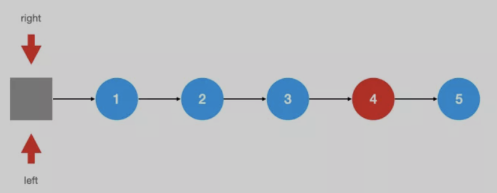
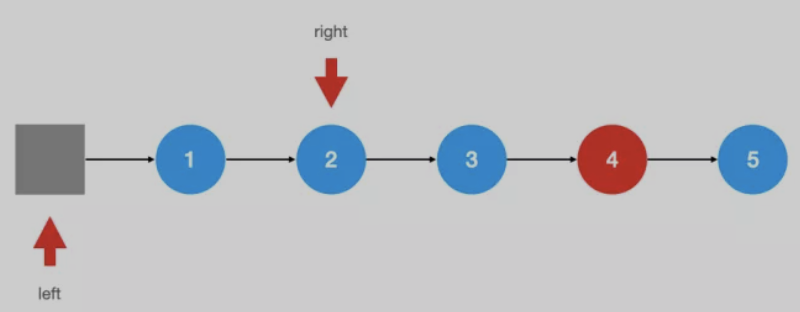
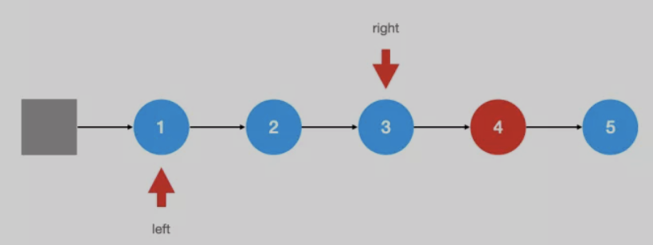
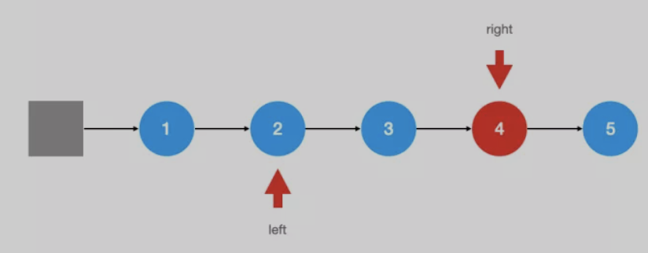
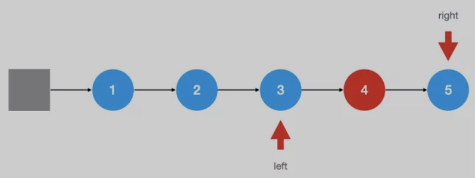
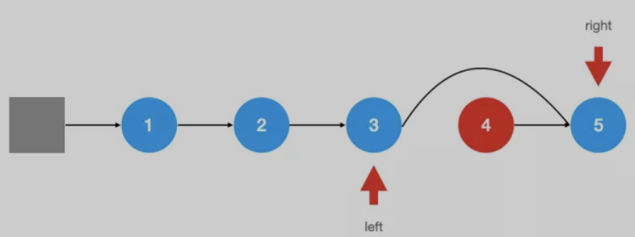

[Leetcode-链表](https://leetcode.com/tag/linked-list/)

# 一、链表基本介绍

数据存在节点中，可以看成是一列火车，车厢存储数据，车厢与车厢之间有连接

## 1、简介

单链表：链表中的每个元素实际上是一个单独的对象，而所有对象都通过每个元素中的引用字段链接在一起。包含两个属性
- value：值
- next：指向下一个节点的指针（引用）

双链表：与单链表不同的是，双链表的每个结点中都含有两个引用字段，在单链表的基础上有增加一个属性
- pre： 指向上一个节点的指针(引用)

## 2、链表优缺点

**优点：**
- 链表能灵活地分配内存空间；
- 能在 O(1) 时间内删除或者添加元素，前提是该元素的前一个元素已知，当然也取决于是单链表还是双链表，在双链表中，如果已知该元素的后一个元素，同样可以在 O(1) 时间内删除或者添加该元素

**缺点：**
- 不能随机访问，所以不能像数组那样，能通过下标迅速读取元素，每次都要从链表头开始一个一个读取；
- 查询第 k 个元素需要 O(k) 时间；

应用场景：如果要解决的问题里面需要很多快速查询，链表可能并不适合；如果遇到的问题中，数据的元素个数不确定，而且需要经常进行数据的添加和删除，那么链表会比较合适。而如果数据元素大小确定，删除插入的操作并不多，那么数组可能更适合

## 3、经典解法

### 3.1、利用快慢指针（有时候需要用到三个指针）

典型题目例如：链表的翻转，寻找倒数第 k 个元素，寻找链表中间位置的元素，判断链表是否有环等等

### 3.2、构建一个虚假的链表头

一般用在要返回新的链表的题目中，比如，给定两个排好序的链表，要求将它们整合在一起并排好序。又比如，将一个链表中的奇数和偶数按照原定的顺序分开后重新组合成一个新的链表，链表的头一半是奇数，后一半是偶数

# 二、逆序打印链表

递归与非递归空间复杂度与时间复杂度都为 O(N)

- 1、问题描述：

	给定单链表，从尾到头打印每个节点的值，不同的值之间用空格隔开

	比如：1 -> 2 -> 3 -> 4 -> 5

	输出：5 4 3 2 1

- 2、非递归算法的思路：打印尾部、后打印头部，自然而然联想到：先进后出的栈
	- 遍历链表，将所有的节点（值）依次压栈;
	- 依次弹栈、打印，直到栈为空;	

- 3、非递归算法的实现：
	```java
	private ListNode<T> i = new ListNode<T>(null， null);
	public void printReverse(){
		if(head.next == null){
			return;
		}
		Stack<T> stack = new Stack<T>();
		ListNode<T> p = head;
		while(p != null){
			stack.push(p.value);
			p = p.next;
		}
		while(!stack.isEmpty()){
			System.out.print(stack.pop() + " ");
		}
		System.out.println();
	}
	```
- 4、递归算法的思路：对于某个节点，递归p的下一个节点

- 5、递归算法的实现：递归的深度为链表的长度 N
	```java
	/**
		* 递归逆序打印链表
		*/
	public void printReverseRecursive(){
		if(head.next == null){
			return;
		}
		recursive(head.next);
		System.out.println();
	}
	private void recursive(ListNode<T> p){
		if(p!= null){
			recursive(p.next);
			System.out.print(p.value + " ");
		}
	}
	```

# 三、链表的最大元素

- 1、如何比较大小：对于T类型的a和b，如何比较大小？Comparable 接口、自定义 Comparator

- 2、打擂台算法：遍历链表，依次比较max与当前值的大小

- 3、实现：
	```java
	public Comparator<T> comp;	
	@SuppressWarnings("unchecked")
	public int  compare(T a， T b){		
		if(comp != null){
			return comp.compare(a， b);
		}else{
			Comparable<T> c = (Comparable<T>) a;
			return c.compareTo(a);
		}
	}
	public T getMax(){
		if(head.next == null){
			return null;
		}
		ListNode<T> p = head.next;
		T max = p.value;
		p = p.next;
		while(p != null){
			if(compare(p.value， max)>0){
				max = p.value;
			}
			p = p.next;
		}
		return max;
	}
	```

# 四、链表反转

## 1、问题描述

给定单链表，反转这个单链表，并返回新的头节点

例如，给定单链表：1 -> 2 -> 3 -> 4 -> 5 -> 6

经过反转之后变成：6 -> 5 -> 4 -> 3 -> 2 -> 1

用递归、非递归两种算法实现。假设链表的长度为n，要求两种算法的时间复杂度必须为O(N)；非递归算法的空间复杂度必须为O(1)。

## 2、非递归算法的思路：

- 三个指针：
	- pre 	前趋节点
	- p 	当前节点
	- next	下一个节点
- 关键的四个步骤：
	```
	next = p.next;
	p.next = pre;
	pre = p;
	p = next;
	```
		
## 3、非递归算法的实现

```java
public class ListNode{
	public int value;
	public ListNode next;
	public ListNode(int value， ListNode next) {
		super();
		this.value = value;
		this.next = next;
	}
	public ListNode() {
		super();
	}
}
public ListNode reverseList(ListNode head){
	if(head == null || head.next == null){
		return head;
	}else{
		ListNode pre = head;
		ListNode p = head.next;
		ListNode n = null;
		while(p != null){
			n = p.next;
			p.next = pre;
			pre = p;
			p = n;
		}
		head.next = null;
		return pre;				
	}
}
```

## 4、递归算法的思路

对于某个节点p，递归处理next

next.next=p，返回尾部节点

1 -> 2 -> 3 -> 4 -> 5 -> 6

假设 p 指向节点 3， p.next指向节点 4， 节点 4 后面的已经反转，则 next.next = p，即此时节点 4 的下一个节点指向 p，即节点 3，递归处理

递归算法的实现
```java
public static ListNode reverseList(ListNode head){
	// 反转链表：1 --> 2 --> 3 --> 4 --> 5 --> 6
	// 第一步：反转  2 --> 3 --> 4 --> 5 --> 6，反转之后变成：6 --> 5 --> 4 --> 3 --> 2 <-- 1
	// 再将 2 和 1 的next改变下即可
	// 1.递归结束条件
	if (head == null || head.next == null) {
		return head;
	}
	// 递归反转 子链表
	ListNode newNode = reverseList(head.next);
	// 改变 1，2节点的指向。
	// 通过 head.next获取节点2
	ListNode node = head.next;
	// 让 2 的 next 指向 1
	node.next = head;
	// 1 的 next 指向 null.
	head.next = null;
	// 把调整之后的链表返回。
	return newNode;
}
```

## 5、从链表头依次反转链表的k个节点

- leetCode 25：Reverse Nodes in k-Group：依次反转链表的k个节点。 假设：`1 -> 2 -> 3 -> 4 -> 5 -> 6 -> 7，k=2`，反转之后：`2 -> 1 -> 4 -> 3 -> 6 -> 5 -> 7`	

大致的思路应该就有了：
- 确定接下来要反转的区间有没有 K 个节点，有的话继续，没有的话直接结束；
- 对区间进行反转操作；
- 把反转的区间和原链表进行拼接；
- 重复操作上述操作，直到结束；

基本实现：
```java
public ListNode reverseKGroup(ListNode head, int k) {
	if(head == null || head.next == null || k <= 1) {
		return head;
	}
	ListNode dumpy = new ListNode(-1, head);
	ListNode cur = head;
	ListNode pre = dumpy;
	while (cur != null) {
		ListNode tail = cur;
		int index = 0;
		while (index < k && cur != null) {
			cur = cur.next;
			index ++;
		}
		if (index != k) {
			pre.next = tail;
		} else {
			pre.next = reverse(tail, k);
			pre = tail;
		}
	}
	return dumpy.next;
}
public ListNode reverse(ListNode head, int k) {
	ListNode pre = null;
	ListNode cur = head;
	ListNode next = null;
	int n = k;
	while (cur != null && n-- > 0) {
		next = cur.next;
		cur.next = pre;
		pre = cur;
		cur = next;
	}
	return pre;
}
```
递归来实现：
```java
// k个为一组逆序
public ListNode reverseKGroup(ListNode head, int k) {
	ListNode temp = head;
	for (int i = 1; i < k && temp != null; i++) {
		temp = temp.next;
	} //判断节点的数量是否能够凑成一组
	if (temp == null) {
		return head;
	}
	ListNode t2 = temp.next;
	temp.next = null;
	//把当前的组进行逆序
	ListNode newHead = reverseList(head);
	//把之后的节点进行分组逆序
	ListNode newTemp = reverseKGroup(t2, k);
	// 把两部分连接起来
	head.next = newTemp;
	return newHead;
}
// 逆序单链表
private static ListNode reverseList(ListNode head) {
	if (head == null || head.next == null) {
		return head;
	}
	ListNode result = reverseList(head.next);
	head.next.next = head;
	head.next = null;
	return result;
}
```

## 6、从链表尾部开始依次反转链表的Kge节点

给定一个单链表的头节点 head,实现一个调整单链表的函数，使得每K个节点之间为一组进行逆序，并且从链表的尾部开始组起，头部剩余节点数量不够一组的不需要逆序。（不能使用队列或者栈作为辅助）

链表：`1->2->3->4->5->6->7->8->null, K = 3`。那么 `6->7->8，3->4->5，1->2`各位一组。调整后：`1->2->5->4->3->8->7->6->null`。其中 1，2不调整，因为不够一组；

跟上面从链表头反转很类似的，其实此题思路很简单，只需要先把链表反转一次，反转之后的话就是从头部开始了，按照上面[从链表头依次反转链表的k个节点]解法实现一遍，然后再次逆序；
- 将链表`1->2->3->4->5->6->7->8->null`，反转变成：`8->7->6->5->4->3->2->1->null`；
- 依次反转每K个节点，如果K=3，结果如下：`6->7->8->3->4->5->2->1->null`；
- 再次反转：`1->2->5->4->3->8->7->6->null`

实现：
```java
public ListNode solve(ListNode head, int k) {
	// 先反转一次
	head = reverseList(head);
	// 每K个反转
	head = reverseKGroup(head, k);
	// 再次反转链表
	head = reverseList(head);
	return head;
}

// k个为一组逆序
public ListNode reverseKGroup(ListNode head, int k) {
	ListNode temp = head;
	for (int i = 1; i < k && temp != null; i++) {
		temp = temp.next;
	} //判断节点的数量是否能够凑成一组
	if (temp == null) {
		return head;
	}
	ListNode t2 = temp.next;
	temp.next = null;
	//把当前的组进行逆序
	ListNode newHead = reverseList(head);
	//把之后的节点进行分组逆序
	ListNode newTemp = reverseKGroup(t2, k);
	// 把两部分连接起来
	head.next = newTemp;
	return newHead;
}

// 逆序单链表
private ListNode reverseList(ListNode head) {
	if (head == null || head.next == null) {
		return head;
	}
	ListNode result = reverseList(head.next);
	head.next.next = head;
	head.next = null;
	return result;
}
```

## 7、反转链表的某个区间

- leetCode 92：Reverse Linked List II 反转链表的某一部分。`1 -> 2 -> 3 -> 4 -> 5，m=2，n=4`，反转之后：`1 -> 4 -> 3 -> 2 -> 5`

- 思路：
	- 需要多少个指针，一开始需要两个指针：cur 指向的是当前节点，prev 指向的是前一个节点；
	- 当我们找到边界的时候，也就是当前指针指向了需要反转的第一个节点，表明我们可以进行反转操作了
	- 在反转操作之前，我们需要记录两个节点位置
		- 需要反转的链表的外边界节点 (pre)
		- 反转之后的末尾节点 (tail)

- leetCode 92 实现
```java
public ListNode reverseBetween(ListNode head, int left, int right) {
	// 创建哨兵节点
	ListNode dummy = new ListNode();
	dummy.next = head;
	// 记录当前节点的位置（cur 指向的节点）
	int curPos = 1;
	ListNode prev = dummy, cur = head;
	// 找到左端点
	for (; curPos < left; ++curPos) {
		prev = cur;
		cur = cur.next;
	}
	// 标记以方便操作完后进行拼接
	ListNode pre = prev, tail = cur;
	// 进行链表反转操作
	for (; curPos <= right; ++curPos) {
		ListNode tmp = cur.next;
		cur.next = prev;
		prev = cur;
		cur = tmp;
	}
	// 根据之前做的标记进行拼接
	tail.next = cur;
	pre.next = prev;

	// 返回反转后的链表
	return dummy.next;
}
// 实现2
public ListNode reverseBetween(ListNode head， int m， int n) {
	if (head == null || head.next == null) {
		return head;
	} else {
		ListNode newHead = new ListNode(0);
		newHead.next = head;
		ListNode first = newHead;
		int k = 1;
		while (k < m) {
			first = first.next;
			k++;
		}
		ListNode pre = first.next;
		ListNode p = pre.next;
		ListNode next = null;
		final ListNode top = pre;
		while (k < n) {
			next = p.next;
			p.next = pre;
			pre = p;
			p = next;
			k++;
		}
		top.next = p;
		first.next = pre;
		return newHead.next;
	}
}
```

## 8、小结

- 指针（引用）：pre、p、next
- p=p.next
- xxx.next=yyy.next

# 五、寻找一个单链表的倒数第N个节点
    
- 1、问题描述：

	寻找一个单链表的倒数第N个节点，N 从1开始计数。

	样例输入：1 -> 2 -> 3 -> 4 -> 5 -> 6， N = 4

	样例输出：值为3的节点

	假设N不会越界

- 2、普通算法思路1：

	假设链表的长度为 M，寻找倒数第 N 个节点，相当于寻找链表的第 M-N+1 个节点， 如：M = 6，N = 4，那么M-N+1 = 3

	- 遍历链表，取得链表的长度M
	- 再次遍历链表，找到第 M-N+1 个节点

	*注意：第二次遍历，指针向后移动 M-N 次*

- 3、普通算法实现：
	```java
	public int getLengthOfList(ListNode head) {
		int m = 0;
		ListNode p = head;
		while (p != null) {
			m++;
			p = p.next;
		}
		return m;
	}
	public ListNode find01(ListNode head， int n) {
		if (head == null) {
			return head;
		} else {
			int m = getLengthOfList(head);
			ListNode p = head;
			for (int i = 1; i <= m - n; i++) {
				p = p.next;
			}
			return p;
		}
	}
	```
- 4、OnePass 算法的思路：

	- 额外要求：只允许遍历一次链表，也就是OnePass，但允许存在多个指针
	- 第一个指针指向倒数第 N (M - N + 1)个节点，第二个指针指向最后的空节点 M+1，这两个几点之前相差 N 个节点；以最后一个节点为参照，决定其他节点的指向
		- 定义指针p1、p2
		- 指针p2往后移动N位
		- 同时将p1、p2往后移动，直到p2遇到 null

- 5、OnePass 算法的实现：
	```java
	public ListNode find02(ListNode head， int n) {
		if (head == null) {
			return head;
		} else {
			ListNode p1 = head， p2 = head;
			for (int i = 1; i <= n; i++) {
				p2 = p2.next;
			}
			while (p2 != null) {
				p1 = p1.next;
				p2 = p2.next;
			}
			return p1;
		}
	}
	```

# 六、删除单链表的倒数第 N 个节点

https://leetcode.com/problems/remove-nth-node-from-end-of-list/

## 1、问题描述

样例输入：1 -> 2 -> 3 -> 4 -> 5 -> 6，N = 4

样例输出：1 -> 2 -> 4 -> 5 -> 6

**额外要求：InPlace；空间复杂度必须为O(1)；OnePass；只允许遍历一次链表，但允许多个指针**

## 2、思路分析

删除节点p， 关键步骤 ==> 找到p的前趋节点pre。

删除链表的倒数第N个节点：找到链表的倒数第N+1个节点pre，pre.next=pre.next.next

特殊情况：删除头结点

此时题目的难点在于定位节点，这里涉及到一个参照点的问题；倒数意味着离链表末尾的距离。你可以假定一个指针最后就会指向链表的末尾，然后在弄一个和它相距为 n 的一个指针。这两个指针就互为参照，两个指针同时从头开始遍历，当后一个指针接触到链表的末尾，前面一个指针所指的就是我们要找的节点；

- 移动其中一个指针，使两个指针一前一后相距为 n。此时，这两个指针就互为参照；

	

- 两个指针同时向后移动；

	

- 当后面一个节点指到链表最后一个节点时，停止遍历。按理来说，后面的指针需要遍历出链表，前面的指针才能刚好定位到需要被删除的节点。这里有一个细节，我们需要定位的其实是被删除节点的前面一个节点，因为只有这样我们才能执行删除操作，于是到这里就可以停了；

	    

	

- 直接返回哨兵节点的后面一个节点，就是最后的答案；

## 3、实现

```java
public ListNode removeNthFromEnd(ListNode head， int n) {
	if(head == null){
		return head;
	}else{
		n++;
		ListNode pre = head, p2 = head;
		for(int i =1;i<=n;i++){
			if(p2 == null){
				return head.next;
			}
			p2=p2.next;
		}
		while(p2 != null){
			pre = pre.next;
			p2 = p2.next;
		}
		pre.next = pre.next.next;
		return head;
	}
}
```
或者如下做法
```java
public ListNode removeNthFromEnd(ListNode head, int n) {
	// 因为有可能对头节点执行操作，创建一个哨兵节点
	ListNode dummy = new ListNode(0);
	dummy.next = head;
	ListNode right = dummy, left = dummy;
	// 遍历其中一个指针，使两个指针相距为 n
	for (int i = 0; i < n; ++i) {
		// 如果链表的长度小于 n，说明 n 不合法，直接返回原链表
		if (right == null) {
			return dummy.next;
		}
		right = right.next;
	}
	// 前后两个指针同时遍历，知道后一个指针指向链表的最后一个节点
	while (right != null && right.next != null) {
		left = left.next;
		right = right.next;
	}
	// 执行删除操作
	if (left.next != null) {
		left.next = left.next.next;
	}
	// 返回删除后的链表
	return dummy.next;
}
```

# 七、给定单链表、值val，删除所有值为val的节点

- 1、问题描述：

	样例输入：1 -> 6 -> 4 -> 6 -> 6 -> 3 -> 5，val = 6

	样例输出：1 -> 4 -> 3 -> 5

	额外要求：InPlace、	OnePass

- 2、思路：为头结点设置虚拟节点

	删除，pre指针、p指针：
	- 如果p的值等于val，删除；pre不动，p往后移动一位
	- 否则，pre、p都往后移动一位

	边界情况：头结点head的值为val

- 3、实现：
	```java
	public ListNode removeElements(ListNode head， int val){
		if(head == null){
			return head;
		}else{
			// 考虑到 head 节点被删除的情况
			ListNode newHead = new ListNode(0);
			newHead.next = head;
			ListNode pre = newHead;
			ListNode p = head;
			while( p != null){
				if(p.value == val){
					pre.next = p.next;
					p = p.next;
					p.next=null
				}else{
					pre = p;
					p = p.next;
				}
			}
			return newHead.next;
		}
	}
	```

# 八、给定已经排完序的单链表，删除重复元素，使得每个数字只出现一次

- 1、问题描述：

	样例输入：1 1 2 2 2 3 4

	样例输出：1 2 3 4

	额外要求：InPlace、OnePass

- 2、思路：

	删除，pre指针、p指针
	- 如果`pre.val==p.val`，表明重复；p往后移动，直到不相等；删除操作
	- 否则，不重复，pre、p往后移动一位

- 3、实现：
	```java
	public ListNode deleteDuplicates(ListNode head) {
		if(head == null || head.next == null){
			return head;
		}else{
			ListNode pre = head;
			ListNode p = head.next;
			while( p != null){
				if(pre.value == p.value){
					while(p!= null && pre.value == p.value){
						p = p.next;
					}
					pre.next = p;
				}else{
					pre = p;
					p = p.next;
				}
			}
			return head;
		}
	}
	```
- 4、快慢指针：慢指针slow走在后面，快指针fast走在前面探路，找到一个不重复的元素就告诉slow并让slow前进一步。这样当fast指针遍历完整个链表之后，将slow.next指针断开与后面重复元素的连接；
	```java
	public static ListNode removeDuplicateNode(ListNode head) {
        if (head == null || head.next == null) {
            return head;
        }
        ListNode slow = head;
        ListNode fast = head;

        while (fast != null) {
            if (slow.value != fast.value) {
                slow.next = fast;
                slow = slow.next;
            }
            fast = fast.next;
        }
        slow.next = null;
        return head;
    }
	```

# 九、给定已经排完序的单链表，删除含有重复元素的节点，只保留原本不重复的节点

## 1、问题描述

样例输入：1 -> 2 -> 3 -> 3 -> 3 -> 4 -> 4 -> 5

样例输出：1 -> 2 -> 5

额外要求：
	InPlace、OnePass

## 2、思路分析

删除自身，pre指针、p指针、next指针。
- `p.val != next.val`，不重复，pre、p往后移动一位
- `p.val == next.val`，表明重复；next往后移动，直到不相等；删除节点；p = next

## 3、实现

```java
public ListNode deleteDuplicates(ListNode head) {
	if (head == null || head.next == null) {
		return head;
	} else {
		ListNode newHead = new ListNode(0);
		newHead.next = head;
		ListNode pre = newHead;
		ListNode p = head;
		ListNode next = null;
		while (p != null && p.next != null) {
			next = p.next;
			if (p.value == next.value) {
				while (next != null && next.value == p.value) {
					next = next.next;
				}
				pre.next = next;
				p = next;
			}else{
				pre = p;
				p = p.next;
			}
		}
		return newHead.next;
	}
}
```

## 4、解题技巧：

删除链表节点的常用策略和技巧：
- 遍历链表、删除节点、调整指针指向
- 双指针、三指针
- 尽量 OnePass、InPlace
- newHead，处理头结点

# 十、旋转链表

Given a list， rotate the list to the right by k places， where k is non-negative.

- 1、问题描述：For example：

	Given 	1->2->3->4->5->NULL and k = 2，

	return 	4->5->1->2->3->NULL.

- 2、思路：
	- 1 -> 2 -> 3 -> 4 -> 5， k=2，	将节点3与节点4断开 1 -> 2 -> 3	   4 -> 5，	再将节点5的 next 节点指向 节点 1，即头节点，此时 节点4变为头节点
	- 此时变为寻找出链表的倒数第 k+1 个节点
	
	注意：k有可能大于链表长度n，k=k%n，比如：2=7%5

- 3、实现：
	```java
	public int getLengthOfList(ListNode head) {
		int count = 0;
		ListNode p = head;
		while (p != null) {
			p = p.next;
			count++;
		}
		return count;
	}
	public ListNode rotateRight(ListNode head， int k) {
		if (k == 0 || head == null || head.next == null) {
			return head;
		} else {
			int len = getLengthOfList(head);
			if (k >= len) {
				k = k % len;
			}
			if (k == 0) {
				return head;
			}
			ListNode pre = head;
			int index = 1;
			while(index < len - k){
				pre = pre.next;
				index++;
			}
			ListNode newHead = pre.next;
			ListNode last = newHead;
			while(last.next != null){
				last = last.next;
			}
			pre.next = null;
			last.next = head;
			return newHead;
		}
	}
	```
- 4、试一试：

	分别反转、全体反转，OnePass 算法，有可能存在Bug

# 十一、回文链表

- 1、问题描述：

	1 -> 2 -> 3 -> 4 -> 3 -> 2 -> 1	回文链表，时间复杂度为 O(N)，但不一定 OnePass，空间复杂度为 O(1)

- 2、思路：
	- 从两头往中间扫描，从中间往两头扫描，但是单链表没有 pre 指针
	- 反转任意一半，双指针，从前往后扫描

	注意点：链表长度的奇偶判断

- 3、实现：
	```java
	public int getLengthOfList(ListNode head) {
		int count = 0;
		ListNode p = head;
		while (p != null) {
			p = p.next;
			count++;
		}
		return count;
	}
	public ListNode reverse(ListNode head) {
		ListNode pre = head;
		ListNode p = pre.next;
		ListNode next = null;
		while (p != null) {
			next = p.next;
			p.next = pre;
			pre = p;
			p = next;
		}
		head.next = null;
		return pre;
	}
	public boolean isPalindrome(ListNode head) {
		if (head == null || head.next == null) {
			return true;
		}
		int len = getLengthOfList(head);
		int half = len / 2;	
		ListNode leftEnd = head;
		for (int i = 0; i < half - 1; i++) {
			leftEnd = leftEnd.next;
		}
		ListNode rightStart = leftEnd.next;
		if (len % 2 != 0) {
			rightStart = rightStart.next;
		}
		rightStart = reverse(rightStart);
		ListNode leftStart = head;
		for (int i = 1; i <= half; i++) {
			if(leftStart.val != rightStart.val){
				return false;
			}
			leftStart = leftStart.next;
			rightStart = rightStart.next;
		}		
		return true;
	}
	```
- 4、思考：不允许改变链表结构

	- 栈：将任意一半入栈，然后弹栈比较其值
	- 2次反转：第一次反转后再次反转该部分

# 十二、交换链表的相邻节点

- 1、问题描述：

	样例输入：1 -> 2 -> 3 -> 4 -> 5 -> 6

	样例输出：2 -> 1 -> 4 -> 3 -> 6 -> 5

	额外要求：空间复杂度为O(1)、时间复杂度为O(N)、不允许改变节点的值

- 2、思路分析：

	- 遍历链表，每次反转两个节点
	- 需要的指针数：

		0 -> 1 -> 2 -> 3 -> 4 -> 5 -> 6

		固定的头节点： 0

		0 -> 2 -> 1 -> 3 -> 4 -> 5 -> 6 

		节点1，节点3，节点4，节点5

- 3、实现：(多画图去理解)
	```java
	public ListNode swapPairs(ListNode head) {
		if (head == null || head.next == null) {
			return head;
		}
		ListNode newHead = new ListNode(0);
		newHead.next = head;
		ListNode zero = newHead;
		ListNode pre = head;
		ListNode p = pre.next;
		ListNode next = null;
		while (pre != null && p != null) {
			next = p.next;
			p.next = pre;
			pre.next = next;
			zero.next = p;
			if (next == null) {
				break;
			} else {
				zero = pre;
				pre = next;
				p = pre.next;
			}
		}
		return newHead.next;
	}
	```
# 十三、链表划分：Partition

- 1、初识划分(Partition)的概念：

	对于某个线性结构，通过某种操作(算法)，使得它的左半部分具有某种属性，右半部分具有另外的属性，这种操作(算法)叫做 Partition。例如快速排序的一次划分：选取随机元素为枢纽元pivot，使得数组的左边的元素都小于pivot，右边的元素大于或等于pivot

- 2、问题描述：

	- 给定链表与值x，划分链表，将小于x的节点放到左边，大于等于x的节点放到右边。

		样例输入：1 -> 4 -> 3 -> 2 -> 5 -> 2，x=3

		样例输出：1 -> 2 -> 2 -> 4 -> 3 -> 5

	- 额外条件：

		- 时间复杂度为O(N)
		- 空间复杂度为O(1)
		- 保持节点的自然顺序不变
			- 样例输入：1 -> 4 -> 3 -> 2 -> 5 -> 2，x=3
			- 正确样例输出：1 -> 2 -> 2 -> 4 -> 3 -> 5
			- 错误样例输出1：2 -> 1 -> 2 -> 5 -> 3 -> 4
			- 错误样例输出2： 1 -> 2 -> 2 -> 4 -> 3 -> 5

- 3、思路：

	- 新建左链表LeftList、右链表RightList
	- 遍历链表，小于x的节点插入LeftList的尾部，大于等于x的节点同理
	- 合并LeftList和RightList，将LeftList的尾节点与RightList的头节点相连
	- 返回LeftList的头结点，作为结果
	- 注意点：如何实现尾部插入、是否需要新建默认节点

- 4、实现：
	```java
	public ListNode partition(ListNode head， int x) {
		if(head == null || head.next == null){
			return head;
		}
		ListNode leftNode = new ListNode(0);
		ListNode leftTail = leftNode;
		ListNode rightNode = new ListNode(0);
		ListNode rightTail = rightNode;
		ListNode p = head;
		while(p != null){
			if(p.val < x){
				leftTail.next = p;
				leftTail = p;
			}else{
				rightTail.next = p;
				rightTail = p;
			}
			p = p.next;
		}
		p = leftTail;
		p.next = rightNode.next;
		rightTail.next = null;
		return leftNode.next;
	}
	```

- 5、其他知识点：
	
	快速排序、奇偶数分离、正负数分割、荷兰国旗问题、回文子串的划分

# 十二、链表洗牌

[Leetcode-143](https://leetcode-cn.com/problems/reorder-list/)

## 1、问题描述：

给定单链表，实现反转与洗牌两个操作：

样例输入：`1 -> 2 -> 3 -> 4 -> 5 -> 6`

样例输出：`1 -> 6 -> 2 -> 5 -> 3 -> 4`

额外要求：空间复杂度为O(1)、不允许改变节点的值

## 2、思路

取得链表长度、反转后一半、洗牌，伪代码：
```java
init(left， right);
flag=true;
next=null;
	while(right!=null){
		if(flag){
			next=left.next;
			left.next=right;
			left=next;
		}else	//相似操作
		flag=!flag;
}
```
或者找到链表的中部对比发现，链表的前半部分好像和后半部分交叉在一起了，但是貌似后半部分和前半部分并不是平行着交叉在一起。

再看，前半部分的下标是在递增的，后半部分的下标是在递减的。

到这里，你应该可以知道后半部分是在反转之后，再与前半部分进行交叉的。

基本上这道题目的思路就是这样，一般来说，链表的题目并不是难在思路上，而是难在具体的实现上面，实在没有思路的话，可以试着把链表当成数组来思考。

解决这道题目有三个步骤，这三个步骤都可以单独拿出来作为链表的考察。

第一步是 找链表的中点，这里我们需要用到快慢指针这一技巧，需要注意的是，我们要根据题目的要求来调节快慢指针的起始位置，这个拿几个例子跑跑大概就能知道。

第二步是 反转链表，一般来说用普通循环实现的话，需要三个指针交替完成。

第三步是 合并链表，这一步相对前两步来说，思考难度会小一点，需要注意的一点是，出了循环，我们仍然要判断

## 3、实现

```java
public int getLength(ListNode head) {
	ListNode p = head;
	int count = 0;
	while (p != null) {
		p = p.next;
		count++;
	}
	return count;
}
public ListNode reverseListNode(ListNode head) {
	if(head == null || head.next == null){
		return head;
	}
	ListNode pre = head;
	ListNode p = pre.next;
	ListNode next = null;
	while (p != null) {
		next = p.next;
		p.next = pre;
		pre = p;
		p = next;
	}
	head.next = null;
	return pre;
}
public void reorderList(ListNode head) {
	if (head == null || head.next == null) {
		return;
	}
	int len = getLength(head);
	int half = len / 2;
	// 考虑奇数个问题
	if (len % 2 != 0) {
		half++;
	}
	ListNode leftEnd = head;
	for (int i = 1; i < half; i++) {
		leftEnd = leftEnd.next;
	}
	ListNode rightStart = leftEnd.next;
	rightStart = reverseListNode(rightStart);
	leftEnd.next = null;
	ListNode left = head;
	ListNode right = rightStart;
	boolean flag = true;
	ListNode next;
	while(right != null){
		if(flag){
			next = left.next;
			left.next = right;
			left = next;
		}else{
			next = right.next;
			right.next = left;
			right = next;
		}
		flag = !flag;
	}
}
```

实现2：
```java
public static void reorderList(ListNode head) {
	if (head == null || head.next == null) {
		return;
	}
	// 步骤 1: 通过快慢指针找到链表中点
	// 通过调节快慢指针的起始位置，可以保证前半部分的长度大于等于后半部分
	ListNode slow = head, fast = head.next;
	while (fast != null && fast.next != null) {
		slow = slow.next;
		fast = fast.next.next;
	}

	// 步骤 2: 反转后半部分的链表
	// 在反转之前需要的一个操作是将前后半部分断开
	ListNode second = slow.next;
	slow.next = null;
	second = reverseList(second);

	// 步骤 3: 合并前半部分链表以及反转后的后半部分链表
	mergeList(head, second);
}

private static ListNode reverseList(ListNode head) {
	ListNode prev = null, tmp = null, pointer = head;
	while (pointer != null) {
		tmp = pointer.next;
		pointer.next = prev;
		prev = pointer;
		pointer = tmp;
	}
	return prev;
}

private static void mergeList(ListNode first, ListNode second) {
	ListNode dummy = new ListNode(0);
	ListNode pointer = dummy;

	while (first != null && second != null) {
		pointer.next = first;
		first = first.next;
		pointer.next.next = second;
		second = second.next;
		pointer = pointer.next.next;
	}

	// 因为我们之前找中点的时候保证了前半部分的长度不小于后半部分的长度
	// 因此交叉后，多出来的部分只可能是前半部分，判断前半部分即可
	if (first != null) {
		pointer.next = first;
	}
}
```

## 4、总结：

- 空间复杂度为 O(1)，不要轻易使用 ArrayList、LinkedList、HashMap 等等容器
- 时间复杂度为 O(N)，LinearTime、OnePass(遍历一次链表)

# 十三、约瑟夫环

## 1、问题描述

- n个人围在一起形成圆环;
- 从某个编号(start)开始报数;
- 数到某个数(step)的时候，此人出列，下一个人重新从1开始报数;
- 循环执行第三步，直到所有人都出列，游戏结束

==>要求：编写程序，打印出列顺序

==>注意：编号、报数等等都从1开始

## 2、思路分析

用循环链表模拟报数、出队过程：
- 创建循环链表
- 找到编号为start的节点
- 打印并删除第step-1个节点(注意：这里是step-1，不是step，因为报数的人算是1，)
- 从下一个节点重新开始计数，循环执行第三步，直到链表为空

## 3、创建循环链表

数组转换为约瑟夫环

```java
public static ListNode arrayToList(int[] array) {
	ListNode head = new ListNode(0);
	ListNode p = head;
	for (int value ： array) {
		p.next = new ListNode(value);
		p = p.next;
	}
	return head.next;
}
```

## 4、代码实现
```java
/**
* 取得一开始报数的人
* @param head 链表
* @param start 开始报数的序号
* @return
*/
public ListNode getStart(ListNode head， int start) {
	ListNode p = head;
	for (int i = 1; i < start; i++) {
		p = p.next;
	}
	return p;
}
/**
* 单次的报数和删除节点
* @param node	报数的节点
* @param step	步数
* @return
*/
public ListNode countAndRemove(ListNode node， int step) {
	ListNode pre = node;
	for (int i = 1; i < step - 1; i++) {
		pre = pre.next;
	}
	System.out.println(pre.next.val);
	pre.next = pre.next.next;
	return pre.next;
}
/**
* 
* @param head	头节点
* @param n		一共多少个人
* @param start	从第几个人开始报数
* @param step	每次报多少个数
*/
public void josephusCircle(ListNode head， int n， int start， int step){
	ListNode startNode = getStart(head， start);
	for(int i = 1;i<=n;i++){
		startNode = countAndRemove(startNode， step);
	}
	startNode.next = null;
}
```

## 5、其它解法

只需要求最后一个出队的人，更快的方法，时间复杂度为O(N)，空间复杂度为O(1)。
这种方法的重点在于推导，不在于编程

# 十四、链表交点

    1.问题描述：
    	(1).链表交点：两个链表，从某个节点开始，后面的节点均相同，则称这个节点为两个链表的交点，如：
    		1	2	3	4	5	6	7	8
    		9	10	5	6	7	8
    		那么对于上述两个链表， 5 就是两个链表的交点
    	(2).问题：给定两个单链表，寻找它们的交点
    		额外要求：
    			如果没有交点，返回null
    			不允许改变链表的结构
    			假设链表没有环
    			时间复杂度尽量为O(N)，空间复杂度尽量为O(1)
    2.创建链表交点：根据两个数组，创建有交点的两个链表
    	/**
    	 * 如果arr1={1，2，3，4，5，6，7，8}， arr2={9，10}， startIndex = 5，
    	 * 则生成的链表：list1=1，2，3，4，5，6，7，8;
    	 * list2=9，10，5，6，7，8
    	 * @param arr1	数组1
    	 * @param arr2 	数组2
    	 * @param startIndex 交点开始的索引位置
    	 * @return
    	 */
    	public static ListNode[] arrayToIntersection(int[] arr1， int[] arr2， int startIndex) {
    		ListNode head1 = new ListNode(0);
    		ListNode head2 = new ListNode(0);
    		int m = arr1.length;
    		int n = arr2.length;
    		ListNode p1 = head1;
    		ListNode p2 = head2;
    		ListNode intersection = null;
    		for (int i = 0; i < m; i++) {
    			ListNode p = new ListNode(arr1[i]);
    			p1.next = p;
    			p1 = p1.next;
    			if (i == startIndex - 1) { // i 从 0 开始计算， startIndex 从 1 开始计算
    				intersection = p1;
    			}
    		}
    		for (int i = 0; i < n; i++) {
    			ListNode p = new ListNode(arr2[i]);
    			p2.next = p;
    			p2 = p2.next;
    		}
    		p2.next = intersection;
    		return new ListNode[] { head1.next， head2.next };
    	}
    3.暴力求解法：
    	遍历第一个链表，依次判断遍历到的节点是否能在第二个链表中找到
    	暴力求解法， 时间复杂度为 O(m*n)，空间复杂度为 O(1)
    	public ListNode bruteForce(ListNode headA， ListNode headB) {
    		for (ListNode p = headA; p != null; p = p.next) {
    			for (ListNode q = headB; q != null; q = q.next) {
    				if (p == q) {
    					return p;
    				}
    			}
    		}
    		return null;
    	}
    4.利用哈希表：
    	利用哈希表优化时间复杂度。
    	时间复杂度为 O(M+N)--O(M*sqrt(N))，空间复杂度为 O(N)(Hash表的空间复杂度是线性的)
    	public ListNode hashFunction(ListNode headA， ListNode headB) {
    		HashSet<ListNode> hash = new HashSet<ListNode>();
    		for (ListNode p = headA; p != null; p = p.next) {
    			hash.add(p);
    		}
    		for (ListNode p = headB; p != null; p = p.next) {
    			if (hash.contains(p)) {
    				return p;
    			}
    		}
    		return null;
    	}
    5.线性算法：
    	定义两个指针
    	(1).长度相同的两个链表，两个指针同时往后移动，直到两个链表交点处;
    	(2).长度不同的两个链表，长度更长的链表指针先往后走 m - n 步，然后在两个指针同时往后移动，直到两个链表交点处;
    		public int getLengthOfListNode(ListNode head) {
    			ListNode p = head;
    			int count = 0;
    			while (p != null) {
    				p = p.next;
    				count++;
    			}
    			return count;
    		}
    		public ListNode getIntersectionNode(ListNode headA， ListNode headB) {
    			int m = getLengthOfListNode(headA);
    			int n = getLengthOfListNode(headB);
    			if (m == 0 || n == 0) {
    				return null;
    			} else {
    				int k;
    				ListNode p = headA;
    				ListNode q = headB;
    				if (m > n) {
    					k = m - n;
    					for (int i = 0; i < k; i++) {
    						p = p.next;
    					}
    				} else if (m < n) {
    					k = n - m;
    					for (int i = 0; i < k; i++) {
    						q = q.next;
    					}
    				}
    				while (p != null && q != null) {
    					if (p == q) {
    						return p;
    					}
    					p = p.next;
    					q = q.next;
    				}
    				return null;
    			}
    		}

# 十五、判断链表是否有环

## 1、龟兔赛跑原理

假设兔子不睡觉，兔子比乌龟跑得快，如果是绕圆跑，兔子总是能够在某一时间与追上乌龟的，同样适用于先跑直道，再跑圆形跑道的情况

## 2、问题描述

给定单链表，判断它是否有环，要求空间复杂度为O(1)，线性链表，约瑟夫环，先是线性链表然后是约瑟夫环的

## 3、思路分析

模拟龟兔赛跑的过程：
- 定义两个指针fast、slow，初始化为head
- 反复执行“fast向后移动两位、slow向后移动一位”，直到fast与slow相遇
- 如果到达链表尾部还未相遇，则不存在环
- 结束条件：fast不为空且fast的后继也不为空

## 4、创建链表环

```java
public static ListNode createCycle(int[] arr， int index) {
	ListNode head = new ListNode(0);
	int m = arr.length;
	ListNode p = head;
	ListNode startNode = null;
	for (int i = 0; i < m; i++) {
		p.next = new ListNode(arr[i]);
		p = p.next;
		if(i == index - 1){
			startNode = p;
		}
	}
	// 形成环，最后一个节点的 next 节点指向 startNode
	p.next = startNode;
	return head.next;
}	
```

## 5、代码实现

```java
/**
* 模拟"龟兔赛跑"的原理来实现，兔子比乌龟跑得快，如果是绕圆跑，兔子总是能够在某一时间与乌龟相遇的;
* 即兔子为 fast， 乌龟为 slow， fast 走两步，slow 走一步，
* 循环结束的条件是 fast为 null 或 fast.next 为null	 
*/
public boolean hasCycle(ListNode head) {
	if(head == null || head.next == null){
		return false;
	}else{
		ListNode slow = head;
		ListNode fast = head;
		while(fast != null && fast.next != null){
			slow = slow.next;
			fast = fast.next.next;
			if(slow == fast){
				return true;
			}
		}
		return false;
	}
}
```

# 十六、链表环的起始节点

## 1、问题描述

给定单链表，寻找链表环的开始位置；如果没有环，返回空。额外要求：空间复杂度为O(1)

## 2、思路分析

结论：相遇点到链表环起始节点的距离 = 头结点到链表环起始节点的距离

推到过程：https://mp.weixin.qq.com/s/Xl0AWxxFRisXSqwewVVLvg

## 3、代码实现

```java
public ListNode detectCycle(ListNode head) {
	if (head == null || head.next == null) {
		return null;
	} else {
		// 创建快指针和慢指针
		ListNode slow = head;
		ListNode fast = head;
		// 两个指针同时遍历链表，慢指针每走一步，快指针走两步
        // 快指针遍历完链表，或者是两个指针相遇就退出循环
		while (fast != null && fast.next != null) {
			slow = slow.next;
			fast = fast.next.next;
			if (slow == fast) {
				break;
			}
		}
		 // 快指针遍历完链表，两个指针并没有相遇，表示链表无环，直接返回 null
		if(fast == null || fast.next == null){
			return null;
		}
		// 两个指针相遇了，一个指针回到头节点，另一个指针还是带在相遇的地方，两个指针进行第二次遍历
		slow = head;
		while(fast != slow){
			fast = fast.next;
			slow = slow.next;
		}
		return fast;
	}
}
```

# 十七、找重复数字

- 1、问题描述：

	- 给定长度为n+1的整形数组，数组元素的范围在1到n之间，有一个数字重复出现了多次，找出这个数字。
	- 额外要求：

		数组是只读的，不允许改变数组元素，时间复杂度与空间复杂度尽量低，只有一个重复的数字，但有可能出现多次

- 2、暴力求解法：时间复杂度O(N^2)，空间复杂度O(1)
	```java
	public int bruteForce(int[] nums){
		if(nums==null||nums.length==0){
			return 0;
		}else{
			int n=nums.length;
			for(int i=0;i<n;i++){
				for(int j=i+1;j<n;j++){
					if(nums[i]==nums[j]){
						return nums[i];
					}
				}
			}
			return 0;
		}
	}
	```

- 3、哈希表法：时间复杂度O(N)--O(N*sqrt(N))，空间复杂度O(N)

	```java
	public int hashFunction(int[] nums){
		if(nums==null||nums.length==0){
			return 0;
		}else{
			HashSet<Integer> hashSet=new HashSet<Integer>();
			for(int i：nums){
				if(!hashSet.contains(i)){
					hashSet.add(i);
				}else{
					return i;
				}
			}
			return 0;
		}
	}
	```

- 4、数组环的思路：
	- 给定乱序、不含有重复数字的数组。

		从数组末尾开始，不断的执行把当前元素值作为下一个下标的操作。形成数组环

		==> 下标：	0	1	2	3	4

		==> 元素值：	1	3	4	2	0

			4->0->1->3->2->4

	- 有序数组，任意元素都能形成独立的环：
	- 给定含有重复数字的数组。从数组末尾开始，不断的执行把当前元素值作为下一个下标的操作。也能形成数组环
	- 求解步骤：

		假设数组长度为length，初始化快指针fast、慢指针slow为length-1，从数组末尾开始，执行index = array[index]，其中fast执行2次，不断地执行第2步，直到fast与slow相遇，借用链表环的起始节点的思路，求出重复元素

		*注意：*题目给定的元素介于1到n之间，数组的下标是从 0 开始的，不能从数组头部开始，从数组头部开始，形成的数组环有可能无法包含重复元素

- 5、代码实现：

	```java
	public int findDuplicate(int[] nums) {
		if(nums == null || nums.length == 0){
			return 0;
		}else{
			int m = nums.length;
			int fast = m - 1;
			int slow = m - 1;
			while(true){
				slow = nums[slow] - 1;
				fast = nums[fast] - 1;
				fast = nums[fast] - 1;
				if(slow == fast){
					break;
				}
			}
			slow = m -1;
			while(fast != slow){
				slow = nums[slow] - 1;
				fast = nums[fast] - 1;
			}
			return slow + 1;
		}
	}
    ```

# 十八、链表合并

https://leetcode.com/problems/merge-two-sorted-lists/

## 1、问题描述

给你两个排序好的单链表 l1, l2，请你合并这 2 个链表成 1 个链表，并且合并后的链表也是排序好的

合并前：
```
1 2 4
1 3 4
```
合并后：
```
1 1 2 3 4 4
```

## 2、思路

根据输入得到两个链表的头指针，为了操作方便，定一个 dummy 节点，成为哨兵节点，这是链表的一个操作技巧，当我们需要操作链表的头节点时；
```
1 2 4
1 3 4
dummy
```
- 比较当前 2 个链表的最小节点，把更小的那个放到我们最终我们需要返回的结果后面，当然这里出现的值相同的情况，任意拆一个即可
	```
	  2 4
	1 3 4

	dummy -> 1
	```
- 用相同的方法继续去做比较，拆节点：
	```
	  2 4
	  3 4

	dummy -> 1 -> 1
	```
- 到最后我们就会把其中一个链表给拆分完：
	```
	  4

	dummy -> 1 -> 1 -> 2 -> 3 -> 4
	```
- 到这个时候，只需要把没拆分完的那个链表整个直接接到合并的链表后面即可，因为已经是排好序的，所以不需要再进行拆分

## 3、代码实现

```java
public class MergeSortList {
    public ListNode mergeTwoLists(ListNode l1, ListNode l2) {
        if (l1 == null && l2 == null) {
            return null;
        }
        // 创建 dummy 节点
        ListNode dummy = new ListNode(0);
        // 用户构建合并链表的指针
        ListNode pointer = dummy;
        while (l1 != null && l2 != null) {
            // 比较两个链表的当前最小节点
            // 如果 l2 更小，把 l2 的当前节点放到合并链表的末尾，并移动指针到下一个节点
            if (l1.val > l2.val) {
                pointer.next = l2;
                l2 = l2.next;
            } else {
                // 如果 l1 更小，把 l1 的当前节点放到合并链表的末尾，并移动指针到下一个节点
                pointer.next = l1;
                l1 = l1.next;
            }
            // 移动指针到合并链表末尾，因为每次都有且仅有一个节点被加到合并链表，这里 .next 即可
            pointer = pointer.next;
        }
        // 把没拆分完的那个链表整个直接接到合并的链表后面
        if (l1 != null) {
            pointer.next = l1;
        } else {
            pointer.next = l2;
        }
        return dummy.next;
    }
}
```

## 4、还可以使用递归来实现

```java
public class MergeSortListRecursive {
    public ListNode mergeTwoLists(ListNode l1, ListNode l2) {
        if (l1 == null) {
            return l2;
        }
        if (l2 == null) {
            return l1;
        }
        if (l1.val > l2.val) {
            l2.next = mergeTwoLists(l1, l2.next);
            return l2;
        }
        l1.next = mergeTwoLists(l1.next, l2);
        return l1;
    }
}
```

## 5、总结

- 链表的节点的地址不受链表中其他的节点的影响，而数组不同
- 当我们需要对返回的结果链表的头节点进行操作的话，创建一个 dummy 节点（哨兵节点）可以简化操作，这在链表操作中非常常见

# 十九、删除给定的节点

https://leetcode.com/problems/delete-node-in-a-linked-list/

## 1、问题描述

给你一个节点，让你将其从链表中移除。注意题目 仅仅给你要删除的节点，并没有给你头节点。

题目保证要删除的节点，即输入节点，不是链表的最后一个节点；

## 2、思路

题目并没有给定单链表的头节点，而是给一个需要删除的节点，这可能和我们想的不一样。这里会有一个问题就是，如果把这个节点删除了，那这个节点之前的一个节点的 next 指针怎么修改？

在回答这个问题之前，我们需要搞清楚一个事情就是，这里要删除的东西到底是什么？更确切地说，我们需要知道，我们要做的到底是删除一个节点的值，还是删除这个节点本身？ 貌似这两者在表面看来差不多，但其实有着本质的区别。删除值 你大可直接改变节点中的值，用值的覆盖来达到删除的目的。而 删除节点 意味着你需要把整个节点从链表中移除。我们最后会分析这两个操作的细微差别和所需要注意的事项，现在暂且回到这道题目中来；

根据它给的条件我们可以很明显地知道是前一种，也就是 值删除；

“删除的节点不是链表的最后一个节点”。关于值删除，我们之前提到，用值的覆盖来达到删除的目的，也就是用新的值覆盖旧的值，那么新的值从何而来？没错，其实就是用后一个节点的值覆盖当前需要删除的节点的值，然后把后一个节点删除即可。

- 拿到需要删除的节点的指针；
- 用后一个指针的值来覆盖当前需要删除的值；
- 直接通过改变当前节点的 next 指针的指向来删除后一个节点；

## 3、代码实现

```java
public void deleteNode(ListNode node) {
	// 用后一个节点的值覆盖当前节点的值
	node.val = node.next.val;
	// 改变当前节点的 next 指针的指向，来删除后一个节点
	node.next = node.next.next;
}
```

## 4、总结

- 链表节点的删除其实可以分成：`节点删除` 和 `值删除`
- `值删除` 其实本质上是值的覆盖，这一个操作其实既包含节点删除，也包含节点更新，而且还是对两个节点进行操作。在实际工作中使用这种操作时需要多加小心，因为它会带来数据的不一致

# 二十、找出链表的中间节点

https://leetcode.com/problems/middle-of-the-linked-list

## 1、问题描述

给你一个单链表的头节点 head，请你返回位于该链表中间位置的节点。

示例：
```
Input: head = [1,2,3,4,5]
Output: [3,4,5]
Explanation: The middle node of the list is node 3.
```

## 2、思路

其实跟数组已有，可以通过遍历链表，获取链表的长度，然后再次遍历，只遍历到长度的一半即可，但是这里需要注意奇偶；

更简便的思路：快慢指针，顾名思义就是 2 个指针，一个指针走得慢，一个指针走得快（这好像是句废话）。重要的是它们是朝着相同的方向移动。另外一个问题就是，慢的指针到底有多慢，快的到底有多快？通常情况下来说（比如说这道题目），慢的指针每走一步，快的指针需要走两步。也就是说快的指针要比慢的指针多走一倍的距离。那么快的指针遍历完链表，慢的指针不就刚好在中点上吗？于是通过这样的方式，链表找中点的问题就可以被很好地解决

## 3、基本实现

```java
public ListNode middleNode(ListNode head) {
	if (head == null || head.next == null) {
		return head;
	}
	// 初始化快慢指针，让其在一开始时都指向链表头节点
	ListNode slow = head, fast = head;
	// 判断快指针是不是到了链表结尾
	// 因为快指针一次走两步，所以这里要先判断其是不是为空
	while (fast != null && fast.next != null) {
		// 慢指针每走一步，快指针走两步
		slow = slow.next;
		fast = fast.next.next;
	}
	// 最后慢指针指向的节点就是链表的中点
	return slow;
}
```
