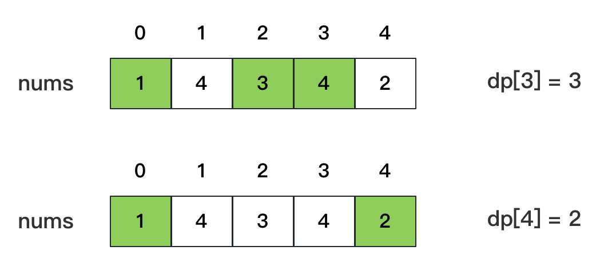
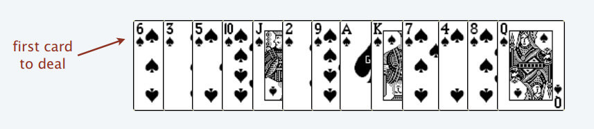

# 1、概述

动态规划问题的一般形式就是求最值。动态规划其实是运筹学的一种最优化方法

求最值，核心问题是什么呢？求解动态规划的核心问题是穷举。因为要求最值，肯定要把所有可行的答案穷举出来，然后在其中找最值呗

## 1.1、动态规划

将原问题拆解成若干个子问题，同时保存子问题的答案，使得每个子问题只求解一次，最终获得原问题的答案；是求解决策过程(decision process)最优化的数学方法；

动态规划需要通过子问题的最优解，推导出最终问题的最优解，因此这种方法特别注重子问题之间的转移关系。通常把这些子问题之间的转移称为`状态转移`，并把用于刻画这些状态转移的表达式称为`状态转移方程`。很显然，找到合适的状态转移方程，是动态规划的关键

把多阶段过程转化为一系列单阶段问题，利用各阶段之间的关系，逐个求解，创立了解决这类过程优化问题的新方法；

动态规划三要素:
- 重叠子问题；
- 状态转移方程（最关键）；
- 最优子结构

## 1.2、动态规划的本质

动态规划的本质是穷举

如何穷举？写出状态转移方程，暴力穷举出所有可行解

如何聪明的穷举：
- 用备忘录法消除重复子问题 -> 自顶向下；
- 进一步，写出自底向上的写法；

## 1.3、基本思想

动态规划的核心设计思想是数学归纳法

与分治算法类类似，是将待求解的问题分解为若干个子问题(阶段)，按顺序求解子阶段，前一子问题的解为后一子问题的求解.

多数有重叠子问题这个特点，为减少重复计算，对每一个子问题只解一次，将其不同阶段的不同状态保存在一个二维数组中

动态规划的难点本来就在于寻找正确的`状态转移方程`

## 1.4、与分治算法区别

适合于用动态规划法求解的问题，经分解后得到的子问题往往不是互相独立的，即下一个子阶段的求解是建立在上一个子阶段的解的基础上，进行进一步的求解。

## 1.5、适用情况

- 最优化原理：如果问题的最优解所包含的子问题的解也是最优的，就称该问题具有最优子结构，即满足最优化原理；
- 无后效性：即某阶段状态一旦确定，就不受这个状态以后决策的影响。也就是说，某状态以后的过程不会影响以前的状态，只与当前状态有关。
- 有重叠子问题：即子问题之间是不独立的，一个子问题在下一阶段决策中可能被多次使用到；该性质并不是动态规划适用的必要条件，但是如果没有这条性质，动态规划算法同其他算法相比就不具备优势.

## 1.6、求解的基本步骤

动态规划所处理的问题是一个多阶段决策问题，动态规划的设计都有着一定的模式，一般要经历以下几个步骤：初始状态→│决策１│→│决策２│→…→│决策ｎ│→结束状态

- （1）划分阶段：按照问题的时间或空间特征，把问题分为若干个阶段。在划分阶段时，注意划分后的阶段一定要是有序的或者是可排序的，否则问题就无法求解；
- （2）确定状态和状态变量： 将问题发展到各个阶段时所处于的各种客观情况用不同的状态表示出来.当然，状态的选择要满足无后效性；
- （3）确定决策并写出状态转移方程： 因为决策和状态转移有着天然的联系，状态转移就是根据上一阶段的状态和决策来导出本阶段的状态。根据相邻两个阶段的状态之间的关系来确定决策方法和状态转移方程.
- （4）寻找边界条件：给出的状态转移方程是一个递推式，需要一个递推的终止条件或边界条件.

实际应用中可以按以下几个简化的步骤进行设计：

- A、分析最优解的性质，并刻画其结构特征。
- B、递归的定义最优解。
- C、以自底向上或自顶向下的记忆化方式（备忘录法）计算出最优值
- D、根据计算最优值时得到的信息，构造问题的最优解

思维框架：`明确 base case` -> `明确「状态」`-> `明确「选择」` -> `定义 dp 数组/函数的含义`

按上面的套路走，最后的解法代码就会是如下的框架：
```python
# 自顶向下递归的动态规划
def dp(状态1, 状态2, ...):
    for 选择 in 所有可能的选择:
        # 此时的状态已经因为做了选择而改变
        result = 求最值(result, dp(状态1, 状态2, ...))
    return result

# 自底向上迭代的动态规划
# 初始化 base case
dp[0][0][...] = base case
# 进行状态转移
for 状态1 in 状态1的所有取值：
    for 状态2 in 状态2的所有取值：
        for ...
            dp[状态1][状态2][...] = 求最值(选择1，选择2...)
```

## 1.7、算法实现

最重要的就是确定动态规划三要素-问题的阶段、每个阶段的状态、从前一个阶段转化到后一个阶段之间的递推关系
- 推关系必须是从次小的问题开始到较大的问题之间的转化，从这个角度来说，动态规划往往可以用递归程序来实现。不过因为递推可以充分利用前面保存的子问题的解来减少重复计算，所以对于大规模问题来说，有递归不可比拟的优势，这也是动态规划算法的核心之处
- 确定了动态规划的这三要素，整个求解过程就可以用一个最优决策表来描述，最优决策表是一个二维表，其中行表示决策的阶段，列表示问题状态，表格需要填写的数据一般对应此问题的在某个阶段某个状态下的最优值.

## 1.8、最优子结构

- [最优子结构原理](https://labuladong.github.io/algo/di-er-zhan-a01c6/dong-tai-g-a223e/zui-you-zi-fbef6/)

最优子结构：可以从子问题的最优结果推出更大规模问题的最优结果；想满足最优子结，子问题之间必须互相独立

让你算每个班的最优成绩就是子问题，你知道所有子问题的答案后，就可以借此推出全校学生的最优成绩这个规模更大的问题的答案；

最优子结构并不是动态规划独有的一种性质，能求最值的问题大部分都具有这个性质；但反过来，最优子结构性质作为动态规划问题的必要条件，一定是让你求最值的

## 1.9、如何看出重叠子问题

首先，最简单粗暴的方式就是画图，把递归树画出来，看看有没有重复的节点；可以通过递归框架直接判断是否存在重叠子问题

# 2、斐波那契数列

## 2.1、基本递归实现

时间复杂度：$O(2^N)$
```java
/**
  * 基本算法：里面有很多重复运算，其最终的递归结果是一个递归树；<br/>
  * 比如计算 5：<br/>
  * 先计算 4、3；<br/>
  * 计算 4 的话需要计算3、2；计算 3 的话计算 2、1；<br/>
  * 计算 3 的话计算 2、1；。。。。<br/>
  * 如此重复计算：3 重复计算了两次，2 重复计算了三次，如果更大的输的话，重复计算的次数将会非常巨大。<br/>
  * 该算法的时间复杂度为指数级的 O(2^N)。
  */
public static int bruteForce(int n) {
    if (n == 0) {
        return 0;
    }
    if (n == 1) {
        return 1;
    }
    return bruteForce(n - 1) + bruteForce(n - 2);
}
```

## 2.2、备忘录

上面基本递归实现时存在重复计算的问题，为了避免重复计算的问题，这里将计算过的数据缓存起来
由于申请了额外的空间，所以其时间和空间复杂度都是$O(N)$
```java
/**
  * 记忆搜索（备忘录）：在基本算法的思路上将有计算过的数据存储起来，如果有重复计算的，就不递归调用；<br/>
  * 该算法的时间复杂度是：O(N)，空间复杂度是：O(N)-因为需要申请空间来存储计算过的数据
  */
public static int memorySearch(int n, Map<Integer, Integer> memo) {
    if (n == 0) {
        return 0;
    }
    if (n == 1) {
        return 1;
    }
    if (!memo.containsKey(n)) {
        memo.put(n, memorySearch(n - 1, memo) + memorySearch(n - 2, memo));
    }
    return memo.get(n);
}
```

## 2.3、自底向上

```java
/**
  * 动态规划法：其实跟记忆搜索类似，记忆搜索是自顶向下解决问题；而动态规划是自下而上解决问题；<br/>
  * 相比于 记忆搜索法，这里动态规划并未使用递归，减少了函数的调用栈空间；同时减少了数据的搜索过程；<br/>
  * 该算法的时间复杂度是：O(N)，空间复杂度是：O(N)-因为需要申请空间来存储计算过的数据
  * 这里的 list 也可以替换为数组
  */
public static int dynamicProgramming(int n) {
    List<Integer> list = new ArrayList<>(n);
    list.add(0);
    list.add(1);
    for (int i = 2; i <= n; i++) {
        list.add(list.get(i - 1) + list.get(i - 2));
    }
    return list.get(n);
}
```

## 2.4、优化自底向上

上面自底向上申请了额外的空间，可以继续优化
```java
public int fib(int n) {
    if (n == 0 || n == 1) {
        return n;
    }
    int prev = 0, cur = 1;
    for(int i = 2; i <= n; i++) {
        int sum = prev + cur;
        prev = cur;
        cur = sum;
    }
    return cur;
}
```

# 3、硬币兑换问题

- [Leetcode-322](https://leetcode.com/problems/coin-change/)

## 3.1、问题描述

给你一个整数数组 coins ，表示不同面额的硬币；以及一个整数 amount ，表示总金额。计算并返回可以凑成总金额所需的 最少的硬币个数 。如果没有任何一种硬币组合能组成总金额，返回 -1 。

你可以认为每种硬币的数量是无限的

示例1：coins = [1,2,5]， amount=11，那么最少硬币个数是3（[1,5,5]）

## 3.2、暴力解法

首先，这个问题是动态规划问题，因为它具有「最优子结构」的。要符合「最优子结构」，子问题间必须互相独立；

那么，既然知道了这是个动态规划问题，就要思考如何列出正确的状态转移方程？
- `1、确定 base case`，这个很简单，显然目标金额 amount 为 0 时算法返回 0，因为不需要任何硬币就已经凑出目标金额了；
- `2、确定「状态」`，也就是原问题和子问题中会变化的变量。由于硬币数量无限，硬币的面额也是题目给定的，只有目标金额会不断地向 base case 靠近，所以`唯一的「状态」`就是目标金额 amount。
- `3、确定「选择」`，也就是导致「状态」产生变化的行为。目标金额为什么变化呢，因为你在选择硬币，你每选择一枚硬币，就相当于减少了目标金额。所以说所有硬币的面值，就是你的「选择」
- `4、明确 dp 函数/数组的定义`。这里讲的是自顶向下的解法，所以会有一个递归的 dp 函数，一般来说函数的参数就是状态转移中会变化的量，也就是上面说到的「状态」；函数的返回值就是题目要求我们计算的量。就本题来说，状态只有一个，即「目标金额」，题目要求我们计算凑出目标金额所需的最少硬币数量

可以这样定义dp函数：$dp(n)$ 表示，输入一个目标金额 n，返回凑出目标金额 n 所需的最少硬币数量，伪代码如下：
```java
// 伪码框架
int coinChange(int[] coins, int amount) {
    // 题目要求的最终结果是 dp(amount)
    return dp(coins, amount);
}
// 定义：要凑出金额 n，至少要 dp(coins, n) 个硬币
int dp(int[] coins, int n) {
    // 做选择，选择需要硬币最少的那个结果
    for (int coin : coins) {
        res = min(res, 1 + dp(coins, n - coin))
    }
    return res
}
```
根据伪码，我们加上 base case 即可得到最终的答案。显然目标金额为 0 时，所需硬币数量为 0；当目标金额小于 0 时，无解，返回 -1：
```java
int coinChange(int[] coins, int amount) {
    // 题目要求的最终结果是 dp(amount)
    return dp(coins, amount)
}
// 定义：要凑出金额 n，至少要 dp(coins, n) 个硬币
int dp(int[] coins, int amount) {
    // base case
    if (amount == 0) return 0;
    if (amount < 0) return -1;
    int res = Integer.MAX_VALUE; // 给result一个特殊值
    for (int coin : coins) {
        // 计算子问题的结果
        int subProblem = dp(coins, amount - coin);
        // 子问题无解则跳过
        if (subProblem == -1) continue;
        // 在子问题中选择最优解，然后加一
        res = Math.min(res, subProblem + 1);
    }
    return res == Integer.MAX_VALUE ? -1 : res;
}
```

以上算法是暴力解法了，数学形式就是状态转移方程：

$$dp(n)= \begin{cases} 0,n=0\\ -1,n<0\\min\{dp(n-coin)+1 | coin\in{coins}\},n>0 \end{cases} $$

比如 amount = 11, coins = {1,2,5} 时画出递归树看看：


上面相同颜色是重复子问题

$coinChanges([1,2,5], 11) = 1 + min(coinChanges([1,2,5], 10), coinChanges([1,2,5], 9), coinChanges([1,2,5], 6) )$

时间复杂度：假设目标金额为 n，给定的硬币个数为 k，那么递归树最坏情况下高度为 n（全用面额为 1 的硬币），然后再假设这是一棵满 k 叉树，则节点的总数在 $k^n$ 这个数量级。接下来看每个子问题的复杂度，由于每次递归包含一个 for 循环，复杂度为$O(k)$，相乘得到总时间复杂度为 $O(k^n)$，指数级别

## 3.3、备忘录法

根据前面的斐波那契数列中关于备忘录的写法，可以得到如下代码
```java
int[] memory;
public int coinChange(int[] coins, int amount) {
    memory = new int[amount + 1];
    Arrays.fill(memory, -666); //  // 备忘录初始化为一个不会被取到的特殊值，代表还未被计算
    return dp(coins, amount);
}
private int dp(int[] coins, int amount) {
    if (amount == 0) return 0;
    if (amount < 0) return -1;
    if (memory[amount] != -666) { // 查备忘录，防止重复计算
        return memory[amount];
    }
    int res = Integer.MAX_VALUE;
    for (int coin : coins) {
        int sub = dp(coins, amount - coin);  // 计算子问题
        if (sub == -1) continue;
        res = Math.min(res, sub + 1);  // 在子问题中选择最优解，然后加一
    }
    // 将计算过程的值存储起来
    memory[amount] = (res == Integer.MAX_VALUE ? -1 : res);
    return memory[amount];
}
```
很显然「备忘录」大大减小了子问题数目，完全消除了子问题的冗余，所以子问题总数不会超过金额数 n，即子问题数目为$O(n)$。处理一个子问题的时间不变，仍是 $O(k)$，所以总的时间复杂度是 $O(k*n)$

## 3.4、迭代解法

当然也可以自底向上使用 dp table 来消除重叠子问题，关于「状态」「选择」和 base case 与之前没有区别，dp 数组的定义和刚才 dp 函数类似，也是把「状态」，也就是目标金额作为变量。不过 dp 函数体现在函数参数，而 dp 数组体现在数组索引：

dp 数组的定义：当目标金额为 i 时，至少需要 `dp[i]` 枚硬币凑出。
```java
public static int coinChange(int[] coins, int amount) {
    int[] dp = new int[amount + 1];
    // 数组大小为 amount + 1，初始值也为 amount + 1
    Arrays.fill(dp, amount + 1);
    dp[0] = 0;
    // 外层 for 循环在遍历所有状态的所有取值
    for (int i = 0; i < dp.length; i++) {
        // 内层 for 循环在求所有选择的最小值
        for (int coin : coins) {
            // 子问题无解，跳过
            if (i - coin < 0) {
                continue;
            }
            dp[i] = Math.min(dp[i], 1 + dp[i - coin]);
        }
    }
    return (dp[amount] == amount + 1) ? -1 : dp[amount];
}
```
为啥 dp 数组中的值都初始化为 $amount + 1$ 呢，因为凑成 amount 金额的硬币数最多只可能等于 amount（全用 1 元面值的硬币），所以初始化为 amount + 1 就相当于初始化为正无穷，便于后续取最小值。为啥不直接初始化为 int 型的最大值 Integer.MAX_VALUE 呢？因为后面有 $dp[i - coin] + 1$，这就会导致整型溢出

假设 $coins = [1,2,5]; amount = 11$，那么对应dp数组的是：$[0, 1, 1, 2, 2, 1, 2, 2, 3, 3, 2, 3]$

# 4、最长递增子序列

- [Leetcode-300](https://leetcode.com/problems/longest-increasing-subsequence/)
- [动态规划设计：最长递增子序列](https://labuladong.github.io/algo/di-er-zhan-a01c6/dong-tai-g-a223e/dong-tai-g-6ea57/)

## 4.1、问题描述

给你一个整数数组 nums ，找到其中最长严格递增子序列的长度。

`子序列` 是由数组派生而来的序列，删除（或不删除）数组中的元素而不改变其余元素的顺序。例如，$[3,6,2,7]$ 是数组 $[0,3,1,6,2,2,7]$ 的子序列

示例：
```
输入：nums = [10,9,2,5,3,7,101,18]
输出：4
解释：最长递增子序列是 [2,3,7,101]，因此长度为 4 。
```
> 注意 $「子序列」$和$「子串」$这两个名词的区别，子串一定是连续的，而子序列不一定是连续的

## 4.2、动态规划设计

定义一个dp数组，$dp[i]$ 表示以 $nums[i]$ 这个数结尾的最长递增子序列的长度，那么可以推断出 base case：$dp[i]$ 初始值为 1，因为以 $nums[i]$ 结尾的最长递增子序列起码要包含它自己



根据这个定义，我们的最终结果（子序列的最大长度）应该是 dp 数组中的最大值
```java
int res = 0;
for (int i = 0; i < dp.length; i++) {
    res = Math.max(res, dp[i]);
}
return res;
```
假设我们已经知道了 $dp[0..4]$ 的所有结果，我们如何通过这些已知结果推出 $dp[5]$ 呢？


根据刚才对 dp 数组的定义，现在想求 $dp[5]$ 的值，也就是想求以 $nums[5]$ 为结尾的最长递增子序列。

$nums[5] = 3$，既然是递增子序列，我们只要找到前面那些结尾比 3 小的子序列，然后把 3 接到这些子序列末尾，就可以形成一个新的递增子序列，而且这个新的子序列长度加一。

$nums[5]$ 前面有哪些元素小于 $nums[5]$？这个好算，用 for 循环比较一波就能把这些元素找出来。

以这些元素为结尾的最长递增子序列的长度是多少？回顾一下我们对 dp 数组的定义，它记录的正是以每个元素为末尾的最长递增子序列的长度。

以我们举的例子来说，$nums[0]$ 和 $nums[4]$ 都是小于 $nums[5]$ 的，然后对比 $dp[0]$ 和 $dp[4]$ 的值，我们让 $nums[5]$ 和更长的递增子序列结合，得出 $dp[5]$ = 3：
```java
for (int j = 0; j < i; j++) {
    if (nums[i] > nums[j]) {
        dp[i] = Math.max(dp[i], dp[j] + 1);
    }
}
```
当 $i = 5$ 时，这段代码的逻辑就可以算出 $dp[5]$。其实到这里，这道算法题我们就基本做完了。

读者也许会问，我们刚才只是算了 $dp[5] 呀，$dp[4]$, $dp[3]$ 这些怎么算呢？类似数学归纳法，你已经可以算出 $dp[5]$ 了，其他的就都可以算出来：
```java
for (int i = 0; i < nums.length; i++) {
    for (int j = 0; j < i; j++) {
        // 寻找 nums[0..j-1] 中比 nums[i] 小的元素
        if (nums[i] > nums[j]) {
            // 把 nums[i] 接在后面，即可形成长度为 dp[j] + 1，
            // 且以 nums[i] 为结尾的递增子序列
            dp[i] = Math.max(dp[i], dp[j] + 1);
        }
    }
}
```

完整代码：时间复杂度 $O(N^2)$
```java
int lengthOfLIS(int[] nums) {
    // 定义：dp[i] 表示以 nums[i] 这个数结尾的最长递增子序列的长度
    int[] dp = new int[nums.length];
    // base case：dp 数组全都初始化为 1
    Arrays.fill(dp, 1);
    for (int i = 0; i < nums.length; i++) {
        for (int j = 0; j < i; j++) {
            if (nums[i] > nums[j]) 
                dp[i] = Math.max(dp[i], dp[j] + 1);
        }
    }
    int res = 0;
    for (int i = 0; i < dp.length; i++) {
        res = Math.max(res, dp[i]);
    }
    return res;
}
```

## 4.3、二分查找

这个解法的时间复杂度为 $O(N{\log}N)$，最长递增子序列和一种叫做 patience game 的纸牌游戏有关，甚至有一种排序方法就叫做 patience sorting（耐心排序）。

首先，给你一排扑克牌，我们像遍历数组那样从左到右一张一张处理这些扑克牌，最终要把这些牌分成若干堆s



处理这些扑克牌要遵循以下规则：
- 只能把点数小的牌压到点数比它大的牌上；
- 如果当前牌点数较大没有可以放置的堆，则新建一个堆，把这张牌放进去；
- 如果当前牌有多个堆可供选择，则选择最左边的那一堆放置。

比如说上述的扑克牌最终会被分成这样 5 堆（我们认为纸牌 A 的牌面是最大的，纸牌 2 的牌面是最小的）


为什么遇到多个可选择堆的时候要放到最左边的堆上呢？因为这样可以保证牌堆顶的牌有序（2, 4, 7, 8, Q）


按照上述规则执行，可以算出最长递增子序列，牌的堆数就是最长递增子序列的长度


每次处理一张扑克牌不是要找一个合适的牌堆顶来放吗，牌堆顶的牌不是有序吗，这就能用到二分查找了：用二分查找来搜索当前牌应放置的位置

编程过程：
- 新建数组 top，用于保存最长上升子序列。
- 对原序列进行遍历，将每位元素二分插入 top 数组中。
    - 如果 top 中元素都比它小，将它插到最后
    - 否则，用它覆盖掉比它大的元素中最小的那个

总之，思想就是让 top数组中存储比较小的元素。这样，top 未必是真实的最长上升子序列，但长度是对的
```java
int lengthOfLIS(int[] nums) {
    // 存储的就是其中一个最长子序列
    int[] top = new int[nums.length];
    // 牌堆数初始化为 0
    int piles = 0;
    for (int i = 0; i < nums.length; i++) {
        // 要处理的扑克牌
        int poker = nums[i];
        /***** 搜索左侧边界的二分查找 *****/
        int left = 0, right = piles;
        while (left < right) {
            int mid = (left + right) / 2;
            if (top[mid] > poker) {
                right = mid;
            } else if (top[mid] < poker) {
                left = mid + 1;
            } else {
                right = mid;
            }
        }
        /*********************************/
        // 没找到合适的牌堆，新建一堆
        if (left == piles) piles++;
        // 把这张牌放到牌堆顶
        top[left] = poker;
    }
    // 牌堆数就是 LIS 长度
    return piles;
}
```

## 4.4、拓展

- [俄罗斯套娃信封问题](https://leetcode.com/problems/russian-doll-envelopes/)

```java
// envelopes = [[w, h], [w, h]...]
public int maxEnvelopes(int[][] envelopes) {
    int n = envelopes.length;
    // 按宽度升序排列，如果宽度一样，则按高度降序排列
    Arrays.sort(envelopes, new Comparator<int[]>() 
    {
        public int compare(int[] a, int[] b) {
            return a[0] == b[0] ? 
                b[1] - a[1] : a[0] - b[0];
        }
    });
    // 对高度数组寻找 LIS
    int[] height = new int[n];
    for (int i = 0; i < n; i++)
        height[i] = envelopes[i][1];

    return lengthOfLIS(height);
}
```

# 编辑距离问题

- [LeetCode-71-Edit Distance](https://leetcode.com/problems/edit-distance/)
- [编辑距离问题解答](https://www.cxyxiaowu.com/10220.html)
- [编辑距离问题](https://labuladong.github.io/algo/di-er-zhan-a01c6/zi-xu-lie--6bc09/jing-dian--e5f5e/)
- [动画演示编辑距离](https://www.youtube.com/watch?v=Mowr0huRJFA)


# 参考资料

- [手把手教你学动态规划](https://labuladong.github.io/algo/di-er-zhan-a01c6/dong-tai-g-a223e/dong-tai-g-1e688/)
