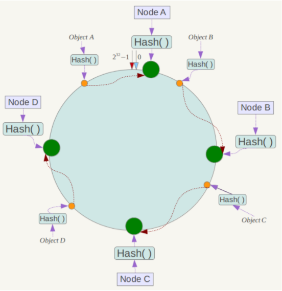
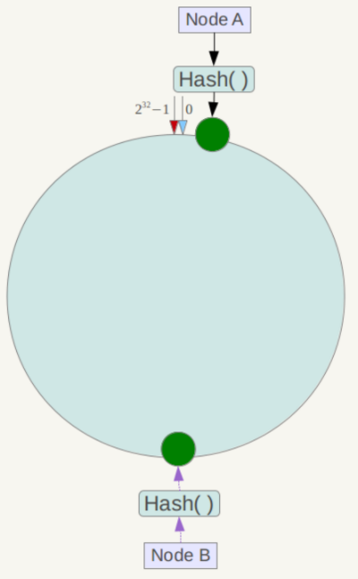
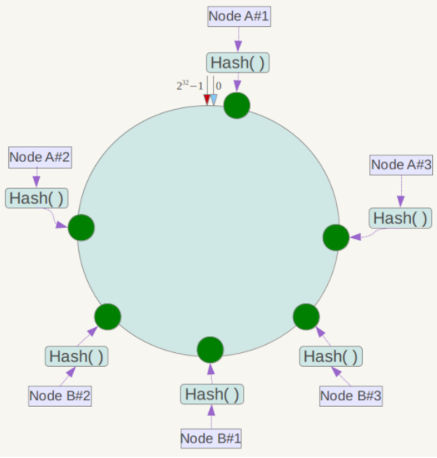
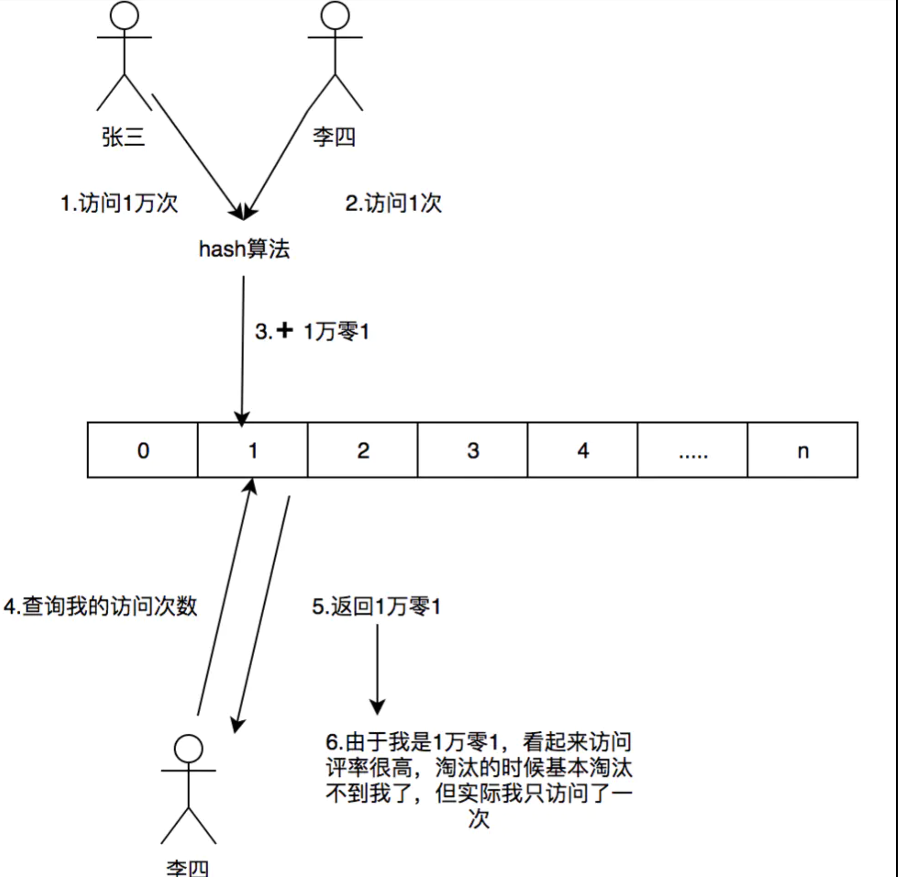
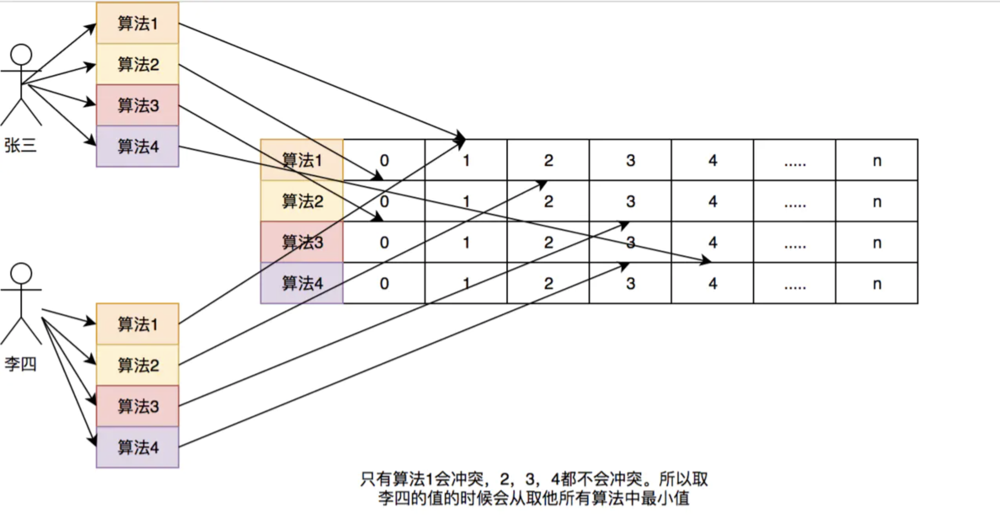
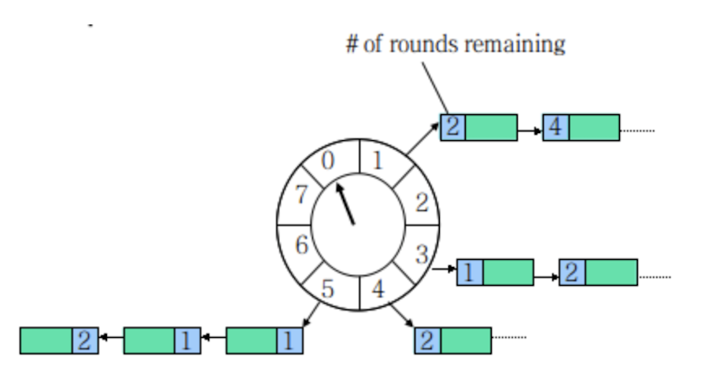
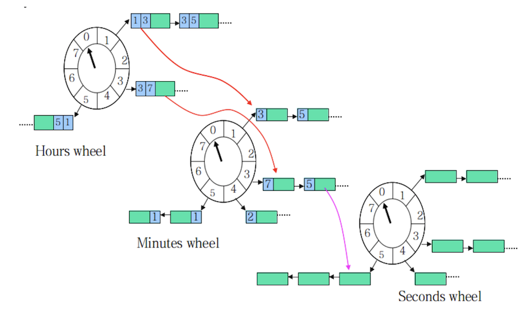

# 一、一致性Hash算法

* [一致性哈希算法原理](https://www.cnblogs.com/lpfuture/p/5796398.html)
* [一致性Hash算法实现](https://www.cnblogs.com/xrq730/p/5186728.html)
* [一致性Hash算法实现负载均衡](https://www.cnblogs.com/tanshaoshenghao/p/10816480.html)

## 1、定义

一致性哈希将整个哈希值空间组织成一个虚拟的圆环，如假设某哈希函数H的值空间为0-2^32-1（即哈希值是一个32位无符号整型），整个空间按顺时针方向组织。0和2^32-1在零点中方向重合；



算法的原理：先构造一个长度为`2^32`的整数环（这个环被称为一致性Hash环），根据节点名称的Hash值（其分布为[0, 2^32-1]）将服务器节点放置在这个Hash环上，然后根据数据的Key值计算得到其Hash值（其分布也为[0, 2^32-1]），接着在Hash环上顺时针查找距离这个Key值的Hash值最近的服务器节点，完成Key到服务器的映射查找；

## 2、一致性Hash特性

- 平衡性(Balance)：是指哈希的结果能够尽可能分布到所有的缓冲中去，这样可以使得所有的缓冲空间都得到利用；
- 单调性(Monotonicity)：是指如果已经有一些内容通过哈希分派到了相应的缓冲中，又有新的缓冲区加入到系统中，那么哈希的结果应能够保证原有已分配的内容可以被映射到新的缓冲区中去，而不会被映射到旧的缓冲集合中的其他缓冲区；
- 分散性(Spread)：
- 负载(Load)：
- 平滑性(Smoothness)：是指缓存服务器的数目平滑改变和缓存对象的平滑改变是一致的

## 3、Hash环的偏斜

一致性哈希算法在服务节点太少时，容易因为节点分部不均匀而造成数据倾斜问题，例如系统中只有两台服务器，其环分布如下：



此时必然造成大量数据集中到Node A上，而只有极少量会定位到Node B上
- 虚拟节点：为了解决这种数据倾斜问题，一致性哈希算法引入了虚拟节点机制，即对每一个服务节点计算多个哈希，每个计算结果位置都放置一个此服务节点，称为虚拟节点

    具体做法可以在服务器ip或主机名的后面增加编号来实现。例如上面的情况，可以为每台服务器计算三个虚拟节点，于是可以分别计算 “Node A#1”、“Node A#2”、“Node A#3”、“Node B#1”、“Node B#2”、“Node B#3”的哈希值，于是形成六个虚拟节点：

    

    同时数据定位算法不变，只是多了一步虚拟节点到实际节点的映射，例如定位到“Node A#1”、“Node A#2”、“Node A#3”三个虚拟节点的数据均定位到Node A上。这样就解决了服务节点少时数据倾斜的问题。在实际应用中，通常将虚拟节点数设置为32甚至更大，因此即使很少的服务节点也能做到相对均匀的数据分布；

## 4、一致性Hash算法Java实现

### 4.1、Hash算法的选择

选择能散列出32位整数的 FNV 算法, 由于该哈希函数可能产生负数, 需要作取绝对值处理

### 4.2、请求节点在哈希环上寻找对应服务器的策略

新节点寻找最近比且它大的节点, 比如说现在已经有环[0, 5, 7, 10], 来了个哈希值为6的节点, 那么它应该由哈希值为7对应的服务器处理. 如果请求节点所计算的哈希值大于环上的所有节点, 那么就取第一个节点. 比如来了个11, 将分配到0所对应的节点；

### 4.3、哈希环的组织结构

采用红黑树结构来实现的，Java中提供了红黑树的实现 TreeMap

### 4.4、虚拟节点与真实节点的映射关系

如何确定一个虚拟节点对应的真实节点也是个问题。理论上应该维护一张表记录真实节点与虚拟节点的映射关系。本案例为了演示，采用简单的字符串处理

### 4.5、实现


# 二、负载


# 三、缓存淘汰算法

* [缓存淘汰算法](http://flychao88.iteye.com/blog/1977653)
* [缓存实现](https://www.open-open.com/lib/view/open1388368682469.html)

缓存的驱逐策略是为了预测哪些数据在短期内最可能被再次用到，从而提升缓存的命中率

## 1、FIFO

先进先出，在这种淘汰算法中，先进入缓存的会先被淘汰。这种可谓是最简单的了，但是会导致我们命中率很低。试想一下我们如果有个访问频率很高的数据是所有数据第一个访问的，而那些不是很高的是后面再访问的，那这样就会把我们的首个数据但是他的访问频率很高给挤出

## 2、LRU算法

* [什么是LRU算法](https://mp.weixin.qq.com/s/h_Ns5HY27NmL_odCYLgx_Q)

根据数据的历史访问记录来进行淘汰数据，其核心思想是：如果数据最近被访问过，那么将来被访问的几率也更高

### 2.1、实现：最常见的实现是使用一个链表保存缓存数

使用的数据结构：哈希链表；在哈希链表当中，这些Key-Value不再是彼此无关的存在，而是被一个链条串了起来。每一个Key-Value都具有它的前驱Key-Value、后继Key-Value，就像双向链表中的节点一样，这样一来，原本无序的哈希表拥有了固定的排列顺序；
- 新数据插入链表头部;
- 每当缓存命中（即缓存数据被访问）,则将数据移动到链表头部;
- 当链表满的时候,将链表尾部的数据丢弃;

### 2.2、分析

- 命中率：当存在热点数据时,LRU的效率很好,但偶发性的\周期性的批量操作会导致LRU命中率急剧下降,缓存污染情况比较严重；
- 实现简单；
- 代价：命中时需要遍历链表,找到命中的数据索引,然后将数据移到头部；

### 2.3、源码实现

- 实现1：[LRUMap](https://github.com/chenlanqing/algorithm-learning/blob/master/interview/src/main/java/com/algorithm/interview/lru/LRUMap.java)

- 实现2：使用LinkedHashMap来实现，LinkedHashMap 内部也有维护一个双向队列，在初始化时也会给定一个缓存大小的阈值，初始化时自定义是否需要删除最近不常使用的数据，如果是则会按照实现二中的方式管理数据：
    ```java
    // accessOrder 参数是实现 LRU 的关键。当 accessOrder 的值为 true 时，将按照对象的访问顺序排序；当 accessOrder 的值为 false 时，将按照对象的插入顺序排序。我们上面提到过，按照访问顺序排序，其实就是 LRU
    public LinkedHashMap(int initialCapacity, float loadFactor, boolean accessOrder) {
        super(initialCapacity, loadFactor);
        this.accessOrder = accessOrder;
    }
    protected boolean removeEldestEntry(Map.Entry<K,V> eldest) {
        return false;
    }
    // 实现
    public class LRU extends LinkedHashMap {
        private int capacity;
        public LRU(int capacity) {
            super(16, 0.75F, true);
            this.capacity = capacity;
        }
        @Override
        protected boolean removeEldestEntry(Map.Entry eldest) {
            return size() > capacity;
        }
    }
    ```
    我们自定义大于了阈值时返回 true，这样 LinkedHashMap 就会帮我们删除最近最少使用的数据，这段代码实现的功能是比较简陋的，它甚至不是线程安全的，但它体现了缓存设计的一般思路，是 Java 中最简单的 LRU 实现方式

### 2.4、存在问题

比如有个数据在1个小时的前59分钟访问了1万次(可见这是个热点数据)，再后一分钟没有访问这个数据，但是有其他的数据访问，就导致了我们这个热点数据被淘汰

### 2.5、其他问题

设计并实现最近最少经用（LRU）缓存的数据结构。它应该支持以下操作：get 和 put。
- get(key) – 如果键存在于缓存中，则获取键的值（总是正数），否则返回 -1。
- put(key, value) – 如果键不存在，请设置或插入值。当缓存达到其容量时，它应该在插入新项目之前，使最近最少使用的项目无效；

### 2.6、单链表实现

基本解决办法：链表，我们要删的是最近最少使用的节点，一种比较容易想到的方法就是使用单链表这种数据结构来存储了。当我们进行 put 操作的时候，会出现以下几种情况：
- 如果要 put(key,value) 已经存在于链表之中了（根据key来判断），那么我们需要把链表中久的数据删除，然后把新的数据插入到链表的头部。、
- 如果要 put(key,value) 的数据没有存在于链表之后，我们我们需要判断下缓存区是否已满，如果满的话，则把链表尾部的节点删除，之后把新的数据插入到链表头部。如果没有满的话，直接把数据插入链表头部即可。

对于 get 操作，则会出现以下情况
- 如果要 get(key) 的数据存在于链表中，则把 value 返回，并且把该节点删除，删除之后把它插入到链表的头部。
- 如果要 get(key) 的数据不存在于链表之后，则直接返回 -1 即可。

对于这种方法，put 和 get 都需要遍历链表查找数据是否存在，所以时间复杂度为 O(n)。空间复杂度为 O(1)

```java
public class LinkedListLRU {
    static class LruNode {
        String key;
        Object value;
        LruNode next;
        public LruNode(String key, Object value) {
            this.key = key;
            this.value = value;
        }
    }
    LruNode head;
    int size = 0;
    int capacity = 0;
    public LinkedListLRU(int capacity) {
        this.capacity = capacity;
    }

    public Object get(String key) {
        LruNode cur = head;
        LruNode pre = head;
        if (head == null) {
            return null;
        }
        if (cur.key.equals(key)) {
            return cur.value;
        }
        cur = cur.next;
        while (cur != null) {
            if (cur.key.equals(key)) {
                break;
            }
            pre = cur;
            cur = cur.next;
        }
        // 代表没找到了节点
        if (cur == null) {
            return null;
        }
        // 进行删除
        pre.next = cur.next;
        // 删除之后插入头结点
        cur.next = head;
        head = cur;
        return cur.value;
    }

    public void put(String key, Object value) {
        if (capacity == 1) {
            head = new LruNode(key, value);
        }
        LruNode cur = head;
        LruNode pre = head;
        if (head == null) {
            head = new LruNode(key, value);
            head.next = null;
            return;
        }
        // 判断是否为第一个
        if (head.key.equals(key)) {
            head.value = value;
            return;
        }
        cur = cur.next;
        while (cur != null) {
            if (cur.key.equals(key)) {
                break;
            }
            pre = cur;
            cur = cur.next;
        }
        // 代表要插入的节点的 key 已存在，则进行 value 的更新
        // 以及把它放到第一个节点去
        if (cur != null) {
            cur.value = value;
            pre.next = cur.next;
            cur.next = head;
            head = cur;
        } else {
            // 创建一个临时节点
            LruNode tmp = new LruNode(key, value);
            if (size >= capacity) {
                cur = head;
                // 往后平移一个节点
                while (cur.next != null && cur.next.next != null) {
                    cur = cur.next;
                }
                cur.next = null;
                tmp.next = head;
                head = tmp;
            }
        }
    }
}
```

### 2.7、双链表+哈希表实现

采用这两种数据结构的组合，我们的 get 操作就可以在 O(1) 时间复杂度内完成了。由于 put 操作我们要删除的节点一般是尾部节点，所以我们可以用一个变量 tail 时刻记录尾部节点的位置，这样的话，我们的 put 操作也可以在 O(1) 时间内完成了
```java
public class DoubleLinkedListLRU {
    static class LruNode {
        String key;
        Object value;
        LruNode next;
        LruNode pre;
        public LruNode(String key, Object value) {
            this.key = key;
            this.value = value;
        }
    }
    Map<String, LruNode> map = new HashMap<>();
    LruNode head;
    LruNode tail;
    int capacity;
    public DoubleLinkedListLRU(int capacity) {
        this.capacity = capacity;
    }
    public void put(String key, Object value) {
        if (head == null) {
            head = new LruNode(key, value);
            tail = head;
            map.put(key, head);
        }
        LruNode node = map.get(key);
        if (node != null) {
            node.value = value;
            removeAndInsert(node);
        } else {
            LruNode tmp = new LruNode(key, value);
            if (map.size() >= capacity) {
                map.remove(tail.key);
                tail = tail.pre;
                tail.next = null;
            }
            map.put(key, tmp);
            tmp.next = head;
            head.pre = tmp;
            head = tmp;
        }
    }
    public Object get(String key) {
        LruNode node = map.get(key);
        if (node == null) {
            return null;
        }
        removeAndInsert(node);
        return node.value;
    }
    private void removeAndInsert(LruNode node) {
        if (node == head) {
            return;
        }
        if (node == tail) {
            tail = node.pre;
            tail.next = null;
        } else {
            node.pre.next = node.next;
            node.next.pre = node.pre;
        }
        node.next = head;
        node.pre = null;
        head.pre = node;
        head = node;
    }
}
```

需要注意的是：对于链表这种数据结构，头结点和尾节点是两个比较特殊的点，如果要删除的节点是头结点或者尾节点，一般要先对他们进行处理

## 3、LFU

最近最少频率使用。在这种算法中又对上面进行了优化，利用额外的空间记录每个数据的使用频率，然后选出频率最低进行淘汰。这样就避免了LRU不能处理时间段的问题

## 4、Window TinyLFU

https://juejin.cn/post/6844903660653117447#comment

### 4.1、简介

Caffeine 使用 Window TinyLfu策略因为其高命中率和更低的内存开销

LRU（Least Recently Used）策略或许是最流行的驱逐策略，它在保持算法简单的前提下，效果还不错。但LRU对未来的预测有明显的局限性，它会认为「最后到来的数据是最可能被再次访问的，从而给予它最高的优先级；

在LFU中只要数据访问模式的概率分布随时间保持不变时，其命中率就能变得非常高，比如有部新剧出来了，我们使用LFU给他缓存下来，这部新剧在这几天大概访问了几亿次，这个访问频率也在我们的LFU中记录了几亿次。但是新剧总会过气的，比如一个月之后这个新剧的前几集其实已经过气了，但是他的访问量的确是太高了，其他的电视剧根本无法淘汰这个新剧，所以在这种模式下是有局限性。所以各种LFU的变种出现了，基于时间周期进行衰减，或者在最近某个时间段内的频率。同样的LFU也会使用额外空间记录每一个数据访问的频率，即使数据没有在缓存中也需要记录，所以需要维护的额外空间很大

W-TinyLFU结合了LRU和LFU，LFU+LRU算法的变种

### 4.2、频率记录

频率记录的问题，要实现的目标是利用有限的空间可以记录随时间变化的访问频率。在W-TinyLFU中使用`Count-Min Sketch`记录我们的访问频率，而这个也是布隆过滤器的一种变种

Window TinyLFU（W-TinyLFU）算法将Sketch作为过滤器，当新来的数据比要驱逐的数据高频时，这个数据才会被缓存接纳（admission）。这个许可窗口给予每个数据项积累热度的机会，而**不是立即过滤掉** 。这避免了持续的未命中，特别是在突然流量暴涨的的场景中，一些短暂的重复流量就不会被长期保留。为了刷新历史数据，一个时间衰减进程被周期性或增量的执行，给所有计数器减半；

如果需要记录一个值，那我们需要通过多种Hash算法对其进行处理hash，然后在对应的hash算法的记录中+1，为什么需要多种hash算法呢？由于这是一个压缩算法必定会出现冲突，比如我们建立一个Long的数组，通过计算出每个数据的hash的位置。比如张三和李四，他们两有可能hash值都是相同，比如都是1那Long[1]这个位置就会增加相应的频率，张三访问1万次，李四访问1次那Long[1]这个位置就是1万零1，如果取李四的访问评率的时候就会取出是1万零1，但是李四命名只访问了1次啊，为了解决这个问题，所以用了多个hash算法可以理解为long[][]二维数组的一个概念，比如在第一个算法张三和李四冲突了，但是在第二个，第三个中很大的概率不冲突，比如一个算法大概有1%的概率冲突，那四个算法一起冲突的概率是1%的四次方。通过这个模式我们取李四的访问率的时候取所有算法中，李四访问最低频率的次数。所以他的名字叫Count-Min Sketch





在Count-Min Sketch中，我这里直接说caffeine中的实现吧(在FrequencySketch这个类中),如果你的缓存大小是100，他会生成一个long数组大小是和100最接近的2的幂的数，也就是128。而这个数组将会记录我们的访问频率。在caffeine中他规则频率最大为15，15的二进制位1111，总共是4位，而Long型是64位。所以每个Long型可以放16种算法，但是caffeine并没有这么做，只用了四种hash算法，每个Long型被分为四段，每段里面保存的是四个算法的频率。这样做的好处是可以进一步减少Hash冲突，原先128大小的hash，就变成了128X4

# 四、A*寻路算法

https://mp.weixin.qq.com/s/FYKR_1yBKR4GJTn0fFIuAA

# 五、分治算法

## 1、概述

### 1.1、基本概念

分而治之，把一个复杂的问题分成两个或更多的相同或相似的子问题，再把子问题分成更小的子问题……直到最后子问题可以简单的直接求解，原问题的解即子问题的解的合并；

### 1.2、设计思想与策略

- 设计思想

  将一个难以直接解决的大问题，分割成一些规模较小的相同问题，以便各个击破，分而治之

- 分治策略

  对于一个规模为n的问题，若该问题可以容易地解决（比如说规模n较小）则直接解决，否则将其分解为k个规模较小的子问题，这些子问题互相独立且与原问题形式相同，递归地解这些子问题，然后将各子问题的解合并得到原问题的解

### 1.3、分治法所能解决问题的特征

- （1）该问题的规模缩小到一定的程度就可以容易地解决；
- （2）该问题可以分解为若干个规模较小的相同问题，即该问题具有最优子结构性质
- （3）利用该问题分解出的子问题的解可以合并为该问题的解；
- （4）该问题所分解出的各个子问题是相互独立的，即子问题之间不包含公共的子子问题

第一条特征是绝大多数问题都可以满足的，因为问题的计算复杂性一般是随着问题规模的增加而增加

第二条特征是应用分治法的前提它也是大多数问题可以满足的，此特征反映了递归思想的应用

**第三条特征是关键，能否利用分治法完全取决于问题是否具有第三条特征，如果具备了第一条和第二条特征，而不具备第三条特征，则可以考虑用贪心法或动态规划法**

*第四条特征涉及到分治法的效率，如果各子问题是不独立的则分治法要做许多不必要的工作，重复地解公共的子问题，此时虽然可用分治法，但一般用动态规划法较好*

### 1.4、分治法的基本步骤

- （1）分解：将原问题分解为若干个规模较小，相互独立，与原问题形式相同的子问题；
- （2）解决：若子问题规模较小而容易被解决则直接解，否则递归地解各个子问题
- （3）合并：将各个子问题的解合并为原问题的解

### 1.5、可用分治法解决的经典问题

- 二分搜索
- [大整数乘法](算法题.md#4大数的乘法)
- Strassen矩阵乘法
- 棋盘覆盖
- [归并排序](排序/Java排序算法.md#4归并排序-on--log-n)
- [快速排序](排序/Java排序算法.md#5快速排序-类似于归并排序)
- 线性时间选择
- 最接近点对问题
- 循环赛日程表
- 汉诺塔


# 六、动态规划

## 1、概述

### 1.1、动态规划

将原问题拆解成若干个子问题，同时保存子问题的答案，使得每个子问题只求解一次，最终获得原问题的答案；是求解决策过程(decision process)最优化的数学方法；

把多阶段过程转化为一系列单阶段问题，利用各阶段之间的关系，逐个求解，创立了解决这类过程优化问题的新方法；

### 1.2、动态规划的本质是-递归问题

递归问题 -> 重叠子问题
- 记忆化搜索 -> 自顶向下解决问题
- 动态规划 -> 自底向上的解决问题

### 1.3、基本思想

与分治算法类类似，是将待求解的问题分解为若干个子问题(阶段)，按顺序求解子阶段，前一子问题的解为后一子问题的求解.

多数有重叠子问题这个特点，为减少重复计算，对每一个子问题只解一次，将其不同阶段的不同状态保存在一个二维数组中

### 1.4、与分治算法区别

适合于用动态规划法求解的问题，经分解后得到的子问题往往不是互相独立的，即下一个子阶段的求解是建立在上一个子阶段的解的基础上，进行进一步的求解。

### 1.5、适用情况

- 最优化原理：如果问题的最优解所包含的子问题的解也是最优的，就称该问题具有最优子结构，即满足最优化原理；
- 无后效性：即某阶段状态一旦确定，就不受这个状态以后决策的影响。也就是说，某状态以后的过程不会影响以前的状态，只与当前状态有关。
- 有重叠子问题：即子问题之间是不独立的，一个子问题在下一阶段决策中可能被多次使用到；该性质并不是动态规划适用的必要条件，但是如果没有这条性质，动态规划算法同其他算法相比就不具备优势.

### 1.6、求解的基本步骤

动态规划所处理的问题是一个多阶段决策问题，动态规划的设计都有着一定的模式，一般要经历以下几个步骤：初始状态→│决策１│→│决策２│→…→│决策ｎ│→结束状态

- （1）划分阶段：按照问题的时间或空间特征，把问题分为若干个阶段。在划分阶段时，注意划分后的阶段一定要是有序的或者是可排序的，否则问题就无法求解；
- （2）确定状态和状态变量： 将问题发展到各个阶段时所处于的各种客观情况用不同的状态表示出来.当然，状态的选择要满足无后效性；
- （3）确定决策并写出状态转移方程： 因为决策和状态转移有着天然的联系，状态转移就是根据上一阶段的状态和决策来导出本阶段的状态。根据相邻两个阶段的状态之间的关系来确定决策方法和状态转移方程.
- （4）寻找边界条件：给出的状态转移方程是一个递推式，需要一个递推的终止条件或边界条件.

实际应用中可以按以下几个简化的步骤进行设计：

- A、分析最优解的性质，并刻画其结构特征。
- B、递归的定义最优解。
- C、以自底向上或自顶向下的记忆化方式（备忘录法）计算出最优值
- D、根据计算最优值时得到的信息，构造问题的最优解

### 1.7、算法实现

最重要的就是确定动态规划三要素-问题的阶段、每个阶段的状态、从前一个阶段转化到后一个阶段之间的递推关系

- 推关系必须是从次小的问题开始到较大的问题之间的转化，从这个角度来说，动态规划往往可以用递归程序来实现。不过因为递推可以充分利用前面保存的子问题的解来减少重复计算，所以对于大规模问题来说，有递归不可比拟的优势，这也是动态规划算法的核心之处
- 确定了动态规划的这三要素，整个求解过程就可以用一个最优决策表来描述，最优决策表是一个二维表，其中行表示决策的阶段，列表示问题状态，表格需要填写的数据一般对应此问题的在某个阶段某个状态下的最优值.

## 2、斐波那契数列
```java
/**
  * 基本算法：里面有很多重复运算，其最终的递归结果是一个递归树；<br/>
  * 比如计算 5：<br/>
  * 先计算 4、3；<br/>
  * 计算 4 的话需要计算3、2；计算 3 的话计算 2、1；<br/>
  * 计算 3 的话计算 2、1；。。。。<br/>
  * 如此重复计算：3 重复计算了两次，2 重复计算了三次，如果更大的输的话，重复计算的次数将会非常巨大。<br/>
  * 该算法的时间复杂度为指数级的 O(2^N)。
  */
public static int bruteForce(int n) {
    if (n == 0) {
        return 0;
    }
    if (n == 1) {
        return 1;
    }
    return bruteForce(n - 1) + bruteForce(n - 2);
}
/**
  * 记忆搜索（备忘录）：在基本算法的思路上将有计算过的数据存储起来，如果有重复计算的，就不递归调用；<br/>
  * 该算法的时间复杂度是：O(N)，空间复杂度是：O(N)-因为需要申请空间来存储计算过的数据
  */
public static int memorySearch(int n, Map<Integer, Integer> memo) {
    if (n == 0) {
        return 0;
    }
    if (n == 1) {
        return 1;
    }
    if (!memo.containsKey(n)) {
        memo.put(n, memorySearch(n - 1, memo) + memorySearch(n - 2, memo));
    }
    return memo.get(n);
}

/**
  * 动态规划法：其实跟记忆搜索类似，记忆搜索是自顶向下解决问题；而动态规划是自下而上解决问题；<br/>
  * 相比于 记忆搜索法，这里动态规划并未使用递归，减少了函数的调用栈空间；同时减少了数据的搜索过程；<br/>
  * 该算法的时间复杂度是：O(N)，空间复杂度是：O(N)-因为需要申请空间来存储计算过的数据
  */
public static int dynamicProgramming(int n) {
    List<Integer> list = new ArrayList<>(n);
    list.add(0);
    list.add(1);
    for (int i = 2; i <= n; i++) {
        list.add(list.get(i - 1) + list.get(i - 2));
    }
    return list.get(n);
}
```

- 矩阵

# 七、贪心算法

- [删去k个数字后的最小值](https://mp.weixin.qq.com/s/4pK5MLMkcuX_1RK_2Pth9g)


# 八、回溯

[回溯](递归/递归与回溯.md#3回溯)

# 九、二分查找

二分查找针对的是一个有序的数据集合，查找思想有点类似分治思想。每次都通过跟区间的中间元素对比，将待查找的区间缩小为之前的一半，直到找到要查找的元素，或者区间被缩小为 0；

## 1、简单二分查找

循环方式实现：
```java
public int bsearch(int[] a, int n, int value) {
    int low = 0;
    int high = n - 1;
    while (low <= high) {
        int mid = (low + high) / 2;
        if (a[mid] == value) {
            return mid;
        } else if (a[mid] < value) {
            low = mid + 1;
        } else {
            high = mid - 1;
        }
    }
    return -1;
}
```
需要注意的几点：
- 循环退出条件：注意是 low<=high，而不是 low；
- mid 的取值：`mid=(low+high)/2` 这种写法是有问题的。因为如果 low 和 high 比较大的话，两者之和就有可能会溢出。改进的方法是将 mid 的计算方式写成 `low+(high-low)/2`。更进一步，如果要将性能优化到极致的话，我们可以将这里的除以 2 操作转化成位运算 `low+((high-low)>>1)`；
- low 和 high 的更新：low=mid+1，high=mid-1。注意这里的 +1 和 -1，如果直接写成 low=mid 或者 high=mid，就可能会发生死循环

二分查找除了用循环来实现，还可以用递归来实现：
```java
// 二分查找的递归实现
public int bsearch(int[] a, int n, int val) {
    return bsearchInternally(a, 0, n - 1, val);
}
private int bsearchInternally(int[] a, int low, int high, int value) {
    if (low > high) return -1;

    int mid =  low + ((high - low) >> 1);
    if (a[mid] == value) {
        return mid;
    } else if (a[mid] < value) {
        return bsearchInternally(a, mid+1, high, value);
    } else {
        return bsearchInternally(a, low, mid-1, value);
    }
}
```

## 2、二分查找的局限性

- 二分查找依赖的是顺序表结构，简单点说就是数组：主要原因是二分查找算法需要按照下标随机访问元素，数组按照下标随机访问数据的时间复杂度是 O(1)，而链表随机访问的时间复杂度是 O(n)；二分查找只能用在数据是通过顺序表来存储的数据结构上。如果你的数据是通过其他数据结构存储的，则无法应用二分查找；
- 二分查找针对的是有序数据：数据必须是有序的。如果数据没有序，我们需要先排序；
- 数据量太小不适合二分查找：如果要处理的数据量很小，完全没有必要用二分查找，顺序遍历就足够了；
- 数据量太大也不适合二分查找：二分查找的底层需要依赖数组这种数据结构，而数组为了支持随机访问的特性，要求内存空间连续，对内存的要求比较苛刻。比如，我们有 1GB 大小的数据，如果希望用数组来存储，那就需要 1GB 的连续内存空间；

## 3、二分查找变形

### 3.1、查找第一个值等于给定值的元素

前面的二分查找是最简单的一种，即有序数据集合中不存在重复的数据，我们在其中查找值等于某个给定值的数据。如果我们将这个问题稍微修改下，有序数据集合中存在重复的数据，我们希望找到第一个值等于给定值的数据；

按照这种的实现
```java
// 如果我们查找的是任意一个值等于给定值的元素
// 但是，如果我们求解的是第一个值等于给定值的元素，当 a[mid]等于要查找的值时，我们就需要确认一下这个 a[mid]是不是第一个值等于给定值的元素
// 如果 mid 等于 0，那这个元素已经是数组的第一个元素，那它肯定是我们要找的；如果 mid 不等于 0，但 a[mid]的前一个元素 a[mid-1]不等于 value，那也说明 a[mid]就是我们要找的第一个值等于给定值的元素
public static int binarySearch_1(int[] a, int n, int value) {
    int low = 0;
    int high = n - 1;
    while (low <= high) {
        int mid = low + ((high - low) >> 1);
        if (a[mid] > value) {
            high = mid - 1;
        } else if (a[mid] < value) {
            low = mid + 1;
        } else {
            if ((mid == 0) || (a[mid - 1] != value)) {
                return mid;
            } else {
                high = mid - 1;
            }
        }
    }
    return -1;
}
```

### 3.2、查找最后一个值等于给定值的元素

上面的问题是查找第一个值等于给定值的元素，如果把问题稍微改一下，查找最后一个值等于给定值的元素，又该如何做呢？
```java
public static int binarySearch_findLast(int[] a, int n, int value) {
    int low = 0;
    int high = n - 1;
    while (low <= high) {
        int mid = low + ((high - low) >> 1);
        if (a[mid] > value) {
            high = mid - 1;
        } else if (a[mid] < value) {
            low = mid + 1;
        } else {
            if ((mid == n - 1) || (a[mid + 1] != value)) {
                return mid;
            } else {
                low = mid + 1;
            }
        }
    }
    return -1;
}
```

### 3.3、查找第一个大于等于给定值的元素

在有序数组中，查找第一个大于等于给定值的元素。比如，数组中存储的这样一个序列：`{3,4,6,7,10}`。如果查找第一个大于等于 5 的元素，那就是 6
```java
public static int binarySearch_findFirstLarger(int[] a, int n, int value) {
    int low = 0;
    int high = n - 1;
    while (low <= high) {
        int mid = low + ((high - low) >> 1);
        if (a[mid] >= value) {
            if ((mid == 0) || (a[mid - 1] < value)) {
                return mid;
            } else {
                high = mid - 1;
            }
        } else {
            low = mid + 1;
        }
    }
    return -1;
}
```

### 3.4、查找最后一个小于等于给定值的元素

查找最后一个小于等于给定值的元素
```java
public static int binarySearch_findLastLitter(int[] a, int n, int value) {
    int low = 0;
    int high = n - 1;
    while (low <= high) {
        int mid = low + ((high - low) >> 1);
        if (a[mid] <= value) {
            if ((mid == n - 1) || (a[mid + 1] > value)) {
                return mid;
            } else {
                low = mid + 1;
            }
        } else {
            high = mid - 1;
        }
    }
    return -1;
}
```


# 十、海量数据处理算法

- [海量数据处理](https://mp.weixin.qq.com/s/dpVar5U_rjsmKD08_gXv-g)
- [海量数据处理面试题](https://mp.weixin.qq.com/s/9DGva_vgBCNWXTQt5vCYUg)

何谓海量，就是数据量太大，导致要么是无法在较短时间内迅速解决，要么是数据太大，导致无法一次性装入内存；解决办法：
- 针对时间，可以采用巧妙的算法搭配合适的数据结构，如Bloom filter/Hash/bit-map/堆/数据库或倒排索引/trie树；
- 针对空间，无非就一个办法：大而化小，分而治之（hash映射），把规模大化为规模小的，各个击破；

处理海量数据，无外乎：
- 分而治之/hash映射 + hash统计 + 堆/快速/归并排序
- 双层桶划分
- Bloom filter/Bitmap；
- Trie树/数据库/倒排索引；
- 外排序；
- 分布式处理之Hadoop/Mapreduce；

## 1、BitMap算法

- [用户打标](https://mp.weixin.qq.com/s/xxauNrJY9HlVNvLrL5j2hg)

### 1.1、概述

所谓的Bit-map就是用一个bit位来标记某个元素对应的Value，而Key即是该元素。由于采用了Bit为单位来存储数据，因此在存储空间方面，可以大大节省

可以进行数据的快速查找、判重、删除，一般来说数据范围是int的10倍以下；

### 1.2、具体实现

可以参考JDK中的BitSet，或者谷歌：EWAHCompressedBitmap，其做了很多优化
```xml
<dependency>
  <groupId>com.googlecode.javaewah</groupId>
  <artifactId>JavaEWAH</artifactId>
  <version>1.1.0</version>
</dependency>
```

### 1.3、相关问题

**在2.5亿个整数中找出不重复的整数，注，内存不足以容纳这2.5亿个整数**

解法一：采用2-Bitmap（每个数分配2bit，00表示不存在，01表示出现一次，10表示多次，11无意义）进行，共需内存2^32 * 2 bit=1 GB内存，还可以接受。然后扫描这2.5亿个整数，查看Bitmap中相对应位，如果是00变01，01变10，10保持不变。所描完事后，查看bitmap，把对应位是01的整数输出即可。

解法二：也可采用与第1题类似的方法，进行划分小文件的方法。然后在小文件中找出不重复的整数，并排序。然后再进行归并，注意去除重复的元素。”

**给40亿个不重复的unsigned int的整数，没排过序的，然后再给一个数，如何快速判断这个数是否在那40亿个数当中？**

解法一：可以用位图/Bitmap的方法，申请512M的内存，一个bit位代表一个unsigned int值。读入40亿个数，设置相应的bit位，读入要查询的数，查看相应bit位是否为1，为1表示存在，为0表示不存在；

## 2、布隆过滤器

* [布隆算法](https://mp.weixin.qq.com/s/RmR5XmLeMvk35vgjwxANFQ)

### 2.1、概念

Bloom Filter-布隆过滤器，是一种空间效率很高的随机数据结构，其是由一个固定大小的二进制向量或者位图（bitmap）和一系列（通常好几个）映射函数组成的，它的原理是：

当一个元素被加入集合时，通过K个Hash函数将这个元素映射成一个位阵列（Bit array）中的K个点，把它们置为1。检索时，我们只要看看这些点是不是都是1就（大约）知道集合中有没有它了：
- 如果这些点有任何一个0，则被检索元素一定不在；
- 如果都是1，则被检索元素很可能在；
- 布隆过滤器可以添加元素，但是不能删除元素。为什么不能删除元素呢？原因很简单，因为删除元素后，将对应元素的下标设置为零，可能别的元素的下标也引用改下标，这样别的元素的判断就会收到影响，导致误判率增加；

Bloom Filter的这种高效是有一定代价的：在判断一个元素是否属于某个集合时，有可能会把不属于这个集合的元素误认为属于这个集合（false positive）。因此，Bloom Filter不适合那些“零错误”的应用场合。而在能容忍低错误率的应用场合下，Bloom Filter通过极少的错误换取了存储空间的极大节省；

利用它可以快速地解决项目中一些比较棘手的问题。如网页 URL 去重、垃圾邮件识别、大集合中重复元素的判断和缓存穿透等问题

### 2.2、使用场景

- 网页 URL 去重
- 黑白名单存储
- 热点数据访问
- 垃圾邮件过滤

### 2.3、实现

#### 2.3.1、自定义实现

在Java中一般可以使用java.util.BitSet来实现，主要步骤：
- 定义一个bitmap的大小：`private static final int DEFAULT_SIZE = 2 << 24;`；
- 为了降低错误率，这里选取一些数字作为基准数：`private static final int[] seeds = {3, 5, 7, 11, 13, 31, 37, 61};`；
- 设置 bitmap：`private static BitSet bitset = new BitSet(DEFAULT_SIZE);`；
- 定义hash函数；
```java
public class MyBloomFilter {
    /**
    * 位数组的大小
    */
    private static final int DEFAULT_SIZE = 2 << 24;
    /**
    * 通过这个数组可以创建 6 个不同的哈希函数
    */
    private static final int[] SEEDS = new int[]{3, 13, 46, 71, 91, 134};
    /**
    * 位数组。数组中的元素只能是 0 或者 1
    */
    private BitSet bits = new BitSet(DEFAULT_SIZE);
    /**
    * 存放包含 hash 函数的类的数组
    */
    private SimpleHash[] func = new SimpleHash[SEEDS.length];
    /**
    * 初始化多个包含 hash 函数的类的数组，每个类中的 hash 函数都不一样
    */
    public MyBloomFilter() {
        // 初始化多个不同的 Hash 函数
        for (int i = 0; i < SEEDS.length; i++) {
            func[i] = new SimpleHash(DEFAULT_SIZE, SEEDS[i]);
        }
    }
    /**
    * 添加元素到位数组
    */
    public void add(Object value) {
        for (SimpleHash f : func) {
            bits.set(f.hash(value), true);
        }
    }
    /**
    * 判断指定元素是否存在于位数组
    */
    public boolean contains(Object value) {
        boolean ret = true;
        for (SimpleHash f : func) {
            ret = ret && bits.get(f.hash(value));
        }
        return ret;
    }
    /**
    * 静态内部类。用于 hash 操作！
    */
    public static class SimpleHash {
        private int cap;
        private int seed;
        public SimpleHash(int cap, int seed) {
            this.cap = cap;
            this.seed = seed;
        }
        /**
        * 计算 hash 值
        */
        public int hash(Object value) {
            int h;
            return (value == null) ? 0 : Math.abs(seed * (cap - 1) & ((h = value.hashCode()) ^ (h >>> 16)));
        }
    }
}
```

#### 2.3.2、Guava实现：BloomFilter

```java
// 后面两个参数：一个是预计包含的数据量，一个是允许的误差
BloomFilter<Integer> bloomFilter = BloomFilter.create(Funnels.integerFunnel(), 100000, 0.01);
for (int i = 0; i < 100000; i++) {
    bloomFilter.put(i);
}
System.out.println(bloomFilter.mightContain(1));
System.out.println(bloomFilter.mightContain(100001));
```
Guava提供的布隆过滤器只能在单机情况下使用，另外扩容也不易；

- BloomFilter声明：
    ```java
    public final class BloomFilter<T> implements Predicate<T>, Serializable{}
    ```
- BloomFilter成员变量：  
    ```java
    /** The bit set of the BloomFilter (not necessarily power of 2!) */
    private final LockFreeBitArray bits;
    /** Number of hashes per element */
    private final int numHashFunctions;
    /** The funnel to translate Ts to bytes */
    private final Funnel<? super T> funnel;
    /** The strategy we employ to map an element T to {@code numHashFunctions} bit indexes. */
    private final Strategy strategy;
    ```
  - bits即上文讲到的长度为m的位数组，采用LockFreeBitArray类型做了封装。
  - numHashFunctions即哈希函数的个数k。
  - funnel是Funnel接口实现类的实例，它用于将任意类型T的输入数据转化为Java基本类型的数据（byte、int、char等等）。这里是会转化为byte。
  - strategy是布隆过滤器的哈希策略，即数据如何映射到位数组，其具体方法在BloomFilterStrategies枚举中；

- 哈希策略：
  
    在BloomFilterStrategies枚举中定义了两种哈希策略，都基于著名的MurmurHash算法，分别是`MURMUR128_MITZ_32`和`MURMUR128_MITZ_64`

- Guava没有使用`java.util.BitSet`，而是封装了一个long型的数组，另外还有一个long型整数，用来统计数组中已经占用（置为1）的数量，在第一个构造函数中，它把传入的long型整数按长度64分段（例如129分为3段），段数作为数组的长度，你可以想象成由若干个64位数组拼接成一个超长的数组，它的长度就是64乘以段数，即bitSize，在第二个构造函数中利用Long.bitCount方法来统计对应二进制编码中的1个数（guava23.0之前是用BitSet实现的）

#### 2.3.3、Redis实现.

Redis v4.0 之后有了 Module（模块/插件） 功能，Redis Modules 让 Redis 可以使用外部模块扩展其功能，[RedisBloom](https://github.com/RedisBloom/RedisBloom)就是Redis核心的一个扩展模块，用来解决布隆过滤器问题的，这个模块是需要安装的。

启动时装载命令：`redis-server --loadmodule /data/redis-5.0.10/module/redisbloom/redisbloom.so`

- 常用命令：
    - `BF.ADD`：将元素添加到布隆过滤器中，如果该过滤器尚不存在，则创建该过滤器。格式：`BF.ADD {key} {item}`。
    - `BF.MADD` : 将一个或多个元素添加到“布隆过滤器”中，并创建一个尚不存在的过滤器。该命令的操作方式`BF.ADD`与之相同，只不过它允许多个输入并返回多个值。格式：`BF.MADD {key} {item} [item ...]` 。
    - `BF.EXISTS` : 确定元素是否在布隆过滤器中存在。格式：`BF.EXISTS {key} {item}`。
    - `BF.MEXISTS` ：确定一个或者多个元素是否在布隆过滤器中存在格式：`BF.MEXISTS {key} {item} [item ...]`；
    - `BF.RESERVE`：格式 `BF.RESERVE {key} {error_rate} {capacity} [EXPANSION expansion]`，根据给到的key、错误率、容量等创建一个布隆过滤器；
        - `key`：布隆过滤器的名称
        - `error_rate`：误报的期望概率。这应该是介于0到1之间的十进制值。例如，对于期望的误报率0.1％（1000中为1），error_rate应该设置为0.001。该数字越接近零，则每个项目的内存消耗越大，并且每个操作的CPU使用率越高。
        - `capacity`: 过滤器的容量。当实际存储的元素个数超过这个值之后，性能将开始下降。实际的降级将取决于超出限制的程度。随着过滤器元素数量呈指数增长，性能将线性下降。
        - `expansion`：如果创建了一个新的子过滤器，则其大小将是当前过滤器的大小乘以expansion。默认扩展值为2。这意味着每个后续子过滤器将是前一个子过滤器的两倍；

RedisBloom 提供了多种语言的客户端支持，包括：Python、Java、JavaScript 和 PHP，其中Java的支持是[JedisBloom](https://github.com/RedisBloom/JRedisBloom)

### 2.4、误判率

### 2.5、最优哈希函数个数

既然Bloom Filter要靠多个哈希函数将集合映射到位数组中，那么应该选择几个哈希函数才能使元素查询时的错误率降到最低呢？这里有两个互斥的理由：如果哈希函数的个数多，那么在对一个不属于集合的元素进行查询时得到0的概率就大；但另一方面，如果哈希函数的个数少，那么位数组中的0就多。

哈希函数的特性：比如任意一个字符串，但是输出域是固定的范围，假设为S
- 典型的哈希函数都有无限的输入值域；
- 当给哈斯函数传入相同的输入值时，返回值一样；
- 当给哈斯函数传入不同的输入值时，返回值可能一样，也可能不一样；
- 最重要的性质：很多不同的输入值所得到的返回值会均匀的分布在S上，这个是评价一个哈希函数优劣；

### 2.6、如何实现布隆过滤器删除元素

可以针对布隆过滤器再增加一层，每个bit位置增加一个落到该位置的hash的次数，删除则对应bit位置的元素格式-1

## 3、Hashing

适用访问：快速查找、删除的基本数据结构，通常用于总数据量可以放入内存；

基本原理：Hash函数的选择，针对字符串、整数、排列

碰撞处理：一种是open hashing，也成为拉链法；另一种是 closed hashing，开放地址法；

问题实例：海量日志数据，提取出某日志访问百度次数最多的IP

IP的数据有限的，最多 2^32个，所以可以考虑使用hash将ip直接存入内存，然后进行统计；

## 4、堆

适用范围：海量数据前N大，并且n比较小，可以方放入内存；

基本原理及要点：最大堆求前N小，最小堆求前N大。

# 十一、时间轮-TimeWheel算法

- [时间轮算法](https://mp.weixin.qq.com/s/lBJs8mQpPJGdleLqtGS-dw)
- [时间轮算法简介](https://spongecaptain.cool/post/widget/timingwheel/)

## 1、时间轮算法

时间轮其实就是一种环形的数据结构，可以想象成时钟，分成很多格子，一个格子代码一段时间（这个时间越短，Timer的精度越高）。并用一个链表绑定在该格子上的到期任务，同时一个指针随着时间一格一格转动，并执行相应格子中的到期任务。任务通过取摸决定放入那个格子；



以上图为例，假设一个格子是1秒，则整个wheel能表示的时间段为8s，假如当前指针指向2，此时需要调度一个3s后执行的任务，显然应该加入到(2+3=5)的方格中，指针再走3次就可以执行了；如果任务要在10s后执行，应该等指针走完一个round零2格再执行，因此应放入4，同时将round（1）保存到任务中。检查到期任务时应当只执行round为0的，格子上其他任务的round应减1

- 添加任务-schedule: O(1) 
- 删除/取消任务-cancel : O(1) 
- expire : 最坏情况O(n)，平均O(1) // 显然格子越多每个格子对应的List就越短，越接近O(1)；最坏情况下所有的任务都在一个格子中，O(n)

单层时间轮只需增加每一轮的格子就能解决链表过长的问题。因此，更倾向使用单层的时间轮，netty4中时间轮的实现也是单层的

## 2、多层时间轮

如果任务的时间跨度很大，数量很大，单层的时间轮会造成任务的round很大，单个格子的链表很长。这时候可以将时间轮分层，类似于时钟的时分秒3层



现在，每个任务除了要维护在当前轮子的round，还要计算在所有下级轮子的round。当本层的round为0时，任务按下级round值被下放到下级轮子，最终在最底层的轮子得到执行。

现在，schedule的复杂度提高到了O(m)，m为轮子的级数，因为要计算每级的round值。

这种方式的优点在于能够保证任务链表的长度一直在比较短的状态，但缺点是需要更多的空间。

而多层次时间轮还会有降级的操作，假设一个任务延迟 500 秒执行，那么刚开始加进来肯定是放在第三层的，当时间过了 436 秒后，此时还需要 64 秒就会触发任务的执行，而此时相对而言它就是个延迟 64 秒后的任务，因此它会被降低放在第二层中，第一层还放不下它。再过个 56 秒，相对而言它就是个延迟 8 秒后执行的任务，因此它会再被降级放在第一层中，等待执行。

**降级是为了保证时间精度一致性。Kafka内部用的就是多层次的时间轮算法**

## 3、Netty中的时间轮

- [Netty源码解读之时间轮算法实现](https://zacard.net/2016/12/02/netty-hashedwheeltimer/)

在 Netty 中时间轮的实现类是 HashedWheelTimer，代码中的 wheel 就是循环数组，mask 的设计和HashMap一样，通过限制数组的大小为2的次方，利用位运算来替代取模运算，提高性能。tickDuration 就是每格的时间即精度。可以看到配备了一个工作线程来处理任务的执行。其使用的是单层时间轮来实现的
```java
private final Queue<HashedWheelTimeout> timeouts = PlatformDependent.newMpscQueue();
public Timeout newTimeout(TimerTask task, long delay, TimeUnit unit) {
    ObjectUtil.checkNotNull(task, "task");
    ObjectUtil.checkNotNull(unit, "unit");

    long pendingTimeoutsCount = pendingTimeouts.incrementAndGet();

    if (maxPendingTimeouts > 0 && pendingTimeoutsCount > maxPendingTimeouts) {
        pendingTimeouts.decrementAndGet();
        throw new RejectedExecutionException("Number of pending timeouts ("
            + pendingTimeoutsCount + ") is greater than or equal to maximum allowed pending "
            + "timeouts (" + maxPendingTimeouts + ")");
    }
    // 第一次添加任务时，会启动时间轮，这个方法会启动工作线程，然后工作线程会记录当前时间为startTime
    start();
    long deadline = System.nanoTime() + unit.toNanos(delay) - startTime; // 算出延迟时间
    if (delay > 0 && deadline < 0) {
        deadline = Long.MAX_VALUE;
    }
    HashedWheelTimeout timeout = new HashedWheelTimeout(this, task, deadline);// 创建任务
    timeouts.add(timeout);// 将任务添加到 mpsc 队列
    return timeout;
}
```
任务并没有直接添加到时间轮中，而是先入了一个 mpsc 队列， mpsc 是 JCTools 中的并发队列，用在多个生产者可同时访问队列，但只有一个消费者会访问队列的情况；

总体上看 Netty 的实现就是上面说的时间轮通过轮数的实现，完全一致。可以看出时间精度由 TickDuration 把控，并且工作线程的除了处理执行到时的任务还做了其他操作，因此任务不一定会被精准的执行。

而且任务的执行如果不是新起一个线程，或者将任务扔到线程池执行，那么耗时的任务会阻塞下个任务的执行；

Netty 中是通过固定的时间间隔扫描，时候未到就等待来进行时间轮的推动；会有很多无用的 tick 推进，例如 TickDuration 为1秒，此时就一个延迟350秒的任务，那就是有349次无用的操作

## 4、Kafka 中的时间轮

Kafka内部有很多延时任务，没有基于JDK Timer来实现，那个插入和删除任务的时间复杂度是$O(NlogN)$， 而是基于了自己写的时间轮来实现的，时间复杂度是O(1)，依靠时间轮机制，延时任务插入和删除，O(1)

Kafka 中的时间轮是多层次时间轮实现。Kafka 就利用了空间换时间的思想，通过 DelayQueue，来保存每个槽，通过每个槽的过期时间排序。这样拥有最早需要执行任务的槽会有优先获取。如果时候未到，那么  delayQueue.poll 就会阻塞着，这样就不会有空推进的情况发送；

Kafka 用了多层次时间轮来实现，并且是按需创建时间轮，采用任务的绝对时间来判断延期，并且对于每个槽(槽内存放的也是任务的双向链表)都会维护一个过期时间，利用 DelayQueue 来对每个槽的过期时间排序，来进行时间的推进，防止空推进的存在。

每次推进都会更新 currentTime 为当前时间戳，当然做了点微调使得 currentTime 是 tickMs 的整数倍。并且每次推进都会把能降级的任务重新插入降级

# 十二、牛顿迭代法

- [如何求根号2](https://mp.weixin.qq.com/s/NyOO6408rLN524vCB0-KhA)

引出问题：求一个数的平方根？输入int类型整数t，求t的平方根，返回类型为double

## 1、使用二分查找

### 1.1、思路

- 先确定当前数所处的最小整数区间（如果开方之后还是整数值，那就直接返回）
- 然后再通过二分法来进行判断检测 （确定一个精确值，当二分相差小于精确值，则返回当前二分区间中间值）；

### 1.2、代码实现

```java
/**
* 小数位数
*
* @param t 需要求平方根的值
* @param precise 小数位数，默认7位小数
*/
public static double sqrt(int t, Double precise) {
    if (t < 0) {
        throw new IllegalArgumentException("Negative number cannot have a sqrt root");
    }
    // 先确定当前数所处的最小整数区间
    int i = 0;
    for (; i <= t; i++) {
        if (i * i == t) {
            return i;
        }
        if (i * i > t) {
            break;
        }
    }
    // 再通过二分法来进行判断检测
    double low = i - 1, high = i;
    precise = precise != null ? precise : 1e-7;
    double middle, squre;
    while (high - low > precise) {
        middle = (low + high) / 2;
        squre = middle * middle;
        if (squre > t) {
            high = middle;
        } else {
            low = middle;
        }
    }
    return (low + high) / 2;
}
```

## 2、Java中Math.sqrt实现

```java
public static double sqrt(double a) {
    return StrictMath.sqrt(a); 
}
// StrictMath.java
public static native double sqrt(double a);
```
C语言实现的库函数（源码），用到了牛顿迭代法的思想，但又不完全是牛顿迭代法
```c
//源码中求的是根号x的倒数，参数x必须大于0
float invSqrt(float x){
    float xhalf = 0.5f*x;
    int i = *(int*)&x;
    //下面这句是核心，有兴趣可阅读相关论文
    i = 0x5f375a86 - (i>>1); 

    x = *(float*)&i;
    //下面使用了三次牛顿迭代 
    x = x*(1.5f-xhalf*x*x); 
    x = x*(1.5f-xhalf*x*x); 
    x = x*(1.5f-xhalf*x*x);
    //注：此函数返回的是根号x的倒数
    return x;
}
```

## 3、牛顿迭代法

牛顿迭代法的作用是使用迭代法来求解函数方程的根，简单的说就是不断地求取切线的过程
```java
 /**
    * 牛顿迭代法求平方根
    *
    * @param number 求值的数
    * @param accuracy 精度
    * @return Double
    */
public static double sqrt(double number, double accuracy) {
    // 第一个猜测值
    double guess = number / 2;
    int count = 0;
    if (number < 0) {
        return Double.NaN;
    }
    // 当两个猜测的差值大于精度即return
    while (Math.abs(guess - (number / guess)) > accuracy) {
        //迭代公式推导而成
        guess = (guess + (number / guess)) / 2;
        count++;
//            System.out.printf("try count = %d, guess = %f\n", count, guess);
    }
//        System.out.printf("final result = %f\n", guess);
    return guess;
}
```

# 十三、泰勒公式法

# 十四、快速幂

- [快速幂数学思想](https://oi-wiki.org/math/quick-pow/)

快速幂，二进制取幂（Binary Exponentiation，也称平方法），是一个在 O(logN)  的时间内计算  的小技巧，而暴力的计算需要O(N)的时间；

二进制取幂的想法是，我们将取幂的任务按照指数的 二进制表示 来分割成更小的任务；计算 $a^n$，首先将 n 表示为二进制，比如

$$ 3^{13} = 3^{(1101)_2} = 3^8 * 3^4 * 3^1 $$

因为n有 $\log(n)$ + 1 个进制位，因此当我们知道了 $a^1,a^2,a^4,a^8,...,a^{2^{\log(n)}}$，我们只用计算 $O{\log(n)}$ 次乘法就可以计算出 $a^n$

# 十五、分支界定


# 算法技巧

## 1、巧用数组下标

数组的下标是一个隐含的很有用的数组，特别是在统计一些数字，或者判断一些整型数是否出现过的时候；

例如，给你一串字母，让你判断这些字母出现的次数时，我们就可以把这些字母作为下标，在遍历的时候，如果字母a遍历到，则arr[a]就可以加1了，即  arr[a]++;

给你n个无序的int整型数组arr，并且这些整数的取值范围都在0-20之间，要你在O(n)的时间复杂度中把这 n 个数按照从小到大的顺序打印出来？
```java
public void f(int arr[]) {
    int[] temp = new int[21];
    for (int i = 0; i < arr.length; i++) {
        temp[arr[i]]++;
    }
    //顺序打印
    for (int i = 0; i < 21; i++) {
        for (int j = 0; j < temp[i]; j++) {
            System.out.println(i);
        }
    }
}
```
又比如计数排序：数组有20个随机整数，取值范围是0~10，要求用最快的顺序速度把这几个数进行排序；

## 2、巧用取余

有时候我们在遍历数组的时候，会进行越界判断，如果下标差不多要越界了，我们就把它置为0重新遍历。

特别是在一些环形的数组中，例如用数组实现的队列。往往会写出这样的代码：
```java
for (int i = 0; i < N; i++) {
    if (pos < N) {
    //没有越界
    // 使用数组arr[pos]
    else {
        pos = 0;//置为0再使用数组
        //使用arr[pos]
        }
    pos++;
}
```
实际上可以使用取余来实现：
```java
for (int i = 0; i < N; i++) {
    //使用数组arr[pos]   (我们假设刚开始的时候pos < N)
    pos = (pos + 1) % N;
}
```

## 3、巧用双指针

对于双指针，在做关于单链表的题是特别有用，比如“判断单链表是否有环”、“如何一次遍历就找到链表中间位置节点”、“单链表中倒数第 k 个节点”等问题。对于这种问题，我们就可以使用双指针了，会方便很多。我顺便说下这三个问题怎么用双指针解决吧

- 判断单链表是否有环：可以设置一个慢指针和一个快指针来遍历这个链表。慢指针一次移动一个节点，而快指针一次移动两个节点，如果该链表没有环，则快指针会先遍历完这个表，如果有环，则快指针会在第二次遍历时和慢指针相遇；

- 如何一次遍历就找到链表中间位置节点：一个快指针和慢指针。慢的一次移动一个节点，而快的两个。在遍历链表的时候，当快指针遍历完成时，慢指针刚好达到中点；

- 单链表中倒数第 k 个节点：设置两个指针，其中一个指针先移动k个节点。之后两个指针以相同速度移动。当那个先移动的指针遍历完成的时候，第二个指针正好处于倒数第k个节点；

## 4、巧用移位运算

有时候我们在进行除数或乘数运算的时候，例如n / 2，n / 4, n / 8这些运算的时候，我们就可以用移位的方法来运算了，这样会快很多

    n / 2 等价于 n >> 1
    n / 4 等价于 n >> 2
    n / 8 等价于 n >> 3

还有一些 &(与)、|(或)的运算，也可以加快运算的速度。例如判断一个数是否是奇数，你可能会这样做
```java
if(n & 1 == 1){
    dosomething();
)
```

## 5、设置哨兵位

在链表的相关问题中，我们经常会设置一个头指针，而且这个头指针是不存任何有效数据的，只是为了操作方便，这个头指针我们就可以称之为哨兵位了

例如我们要删除头第一个节点是时候，如果没有设置一个哨兵位，那么在操作上，它会与删除第二个节点的操作有所不同。但是我们设置了哨兵，那么删除第一个节点和删除第二个节点那么在操作上就一样了，不用做额外的判断。当然，插入节点的时候也一样。

有时候我们在操作数组的时候，也是可以设置一个哨兵的，把arr[0]作为哨兵。例如，要判断两个相邻的元素是否相等时，设置了哨兵就不怕越界等问题了，可以直接arr[i] == arr[i-1]?了。不用怕i = 0时出现越界。

## 6、递归问题的优化

- 对于可以递归的问题考虑状态保存

    当我们使用递归来解决一个问题的时候，容易产生重复去算同一个子问题，这个时候我们要考虑状态保存以防止重复计算

- 考虑自底向上

    对于递归的问题，我们一般都是从上往下递归的，直到递归到最底，再一层一层着把值返回。

    不过，有时候当n比较大的时候，例如当 n = 10000时，那么必须要往下递归10000层直到 n <=2 才将结果慢慢返回，如果n太大的话，可能栈空间会不够用。

对于这种情况，其实我们是可以考虑自底向上的做法

## 7、巧用快慢指针

快慢指针，顾名思义，就是有两个指针，往后移动的速度一个快，一个慢，比如快指针移动两步，慢指针移动一步等，通常的步骤：
- （1）快慢指针初始指向 head 节点；
- （2）快指针往后移动两步，慢指针往后移动一步；
- （3）不断重复步骤二，这取决于链表的长度是奇数还是偶数；

需要注意的一点是快慢指针对于链表的长度是奇数还是偶数是不一样的：

比如获取链表的中点，对于奇数长度链表，slow指针指向的就是中间节点；但是对于偶数链表，slow指针可能指向第一个中间节点、也可能指向第二个中间节点
```java
// 写法-1
public static void findMid(ListNode head) {
    ListNode slow = head;
    ListNode fast = head;
    // 从下一个节点判断，对于偶数长度链表来说，则获取的是第一个中间节点
    while (fast.next != null && fast.next.next != null) {
        slow = slow.next;
        fast = fast.next.next;
    }
    assert slow != null;
    System.out.println(slow.val);
}
// 写法-2
public static void findMid_1(ListNode head) {
    ListNode slow = head;
    ListNode fast = head;
    // 从fast开始判断，对于偶数长度链表来说，则获取的是第二个中间节点
    while (fast != null && fast.next != null) {
        slow = slow.next;
        fast = fast.next.next;
    }
    assert slow != null;
    System.out.println(slow.val);
}
```
但是除非特殊情况，正常一般都是获取到第一个中间节点即可，所以常见的写法是第一种；


# 参考资料

* [面试和算法心得](https://www.kancloud.cn/kancloud/the-art-of-programming/41619)
* [常见算法讲解](https://developer.aliyun.com/article/745389?utm_content=g_1000187293)
* [数据结构C语言版教程](http://data.biancheng.net/)


