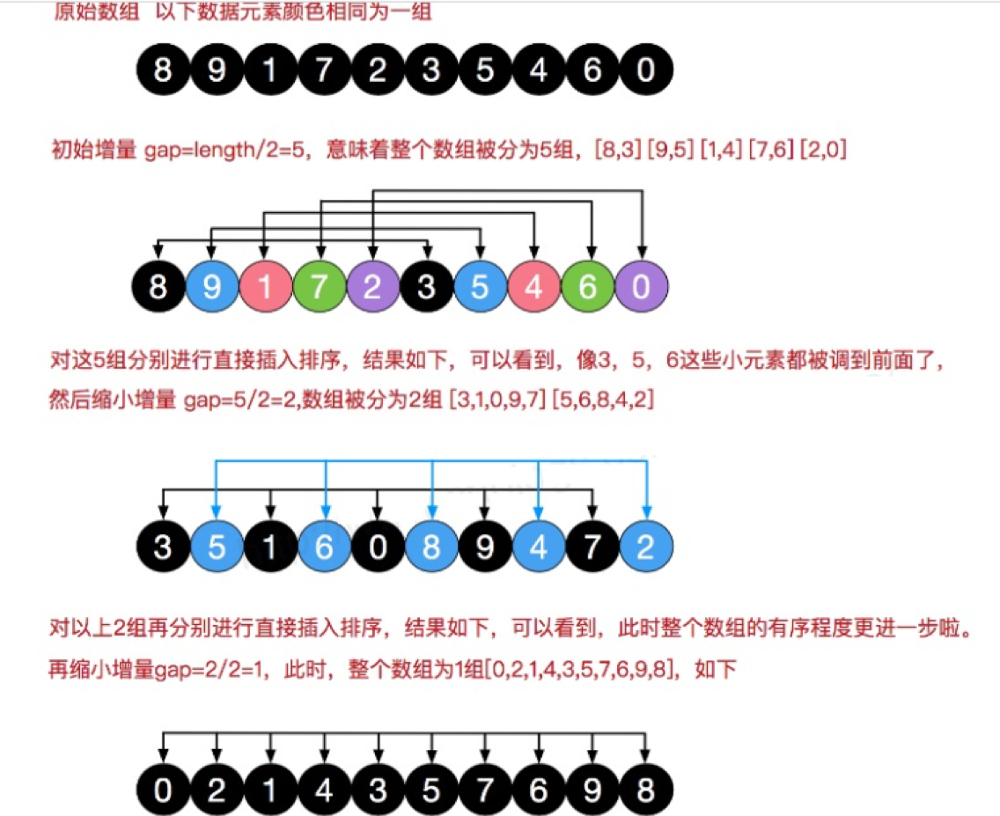
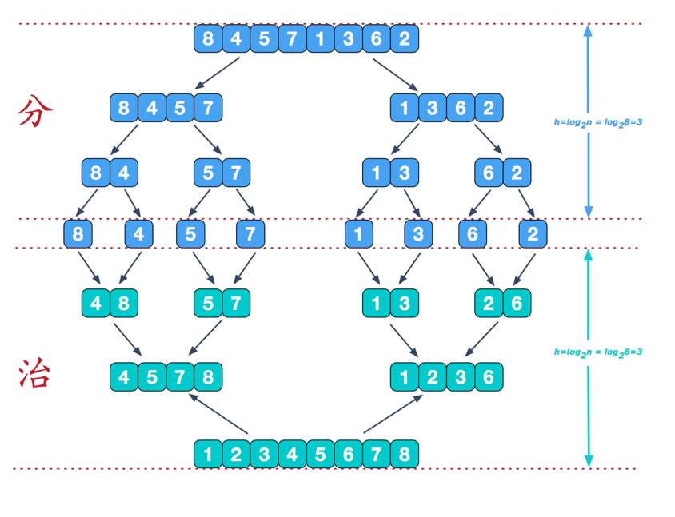
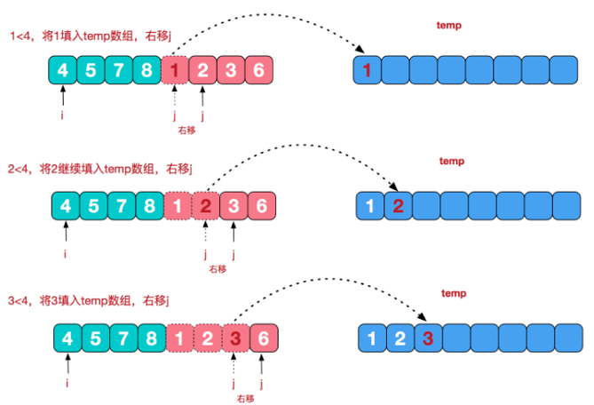
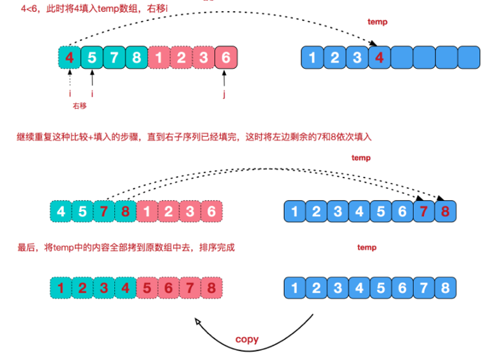
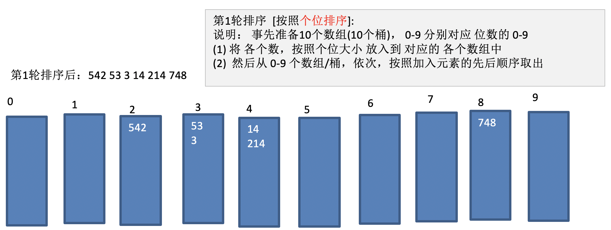
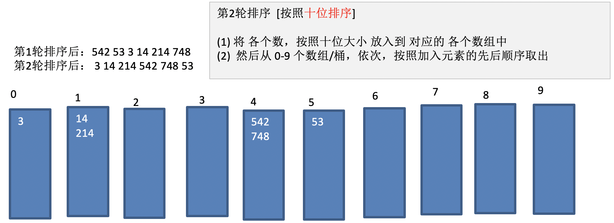
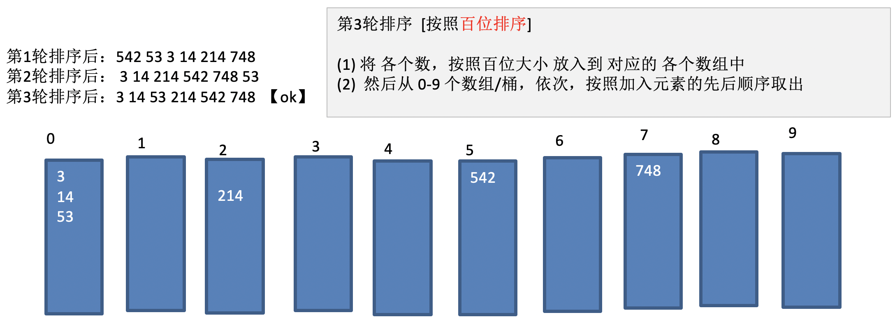

# 1、冒泡排序

## 1.1、基本思想

在要排序的一组数中，对当前还未排好序的范围内的全部数，自上而下对相邻的两个数依次进行比较和调整，让较大的数往下沉，较小的往上冒。即：每当两相邻的数比较后发现它们的排序与排序要求相反时，就将它们互换；

时间复杂度 $O(n^2)$

## 1.2、实现

```java
public void bubble(int[] A) {
	for (int i = A.length - 1; i >= 0; i--) {
		// 找到0-i间的最大元素放到A[i]
		bubble(A, 0, i + 1);
	}
}
private void bubble(int[] A, int i, int j) {
	for (int k = 0; k < j - 1; k++) {
		if (A[k] > A[k + 1]) {
			ArrayUtils.exchange(A, k, k + 1);
		}
	}
}
// 优化
public void sort(int[] arr， int n) {
	for (int i = 0; i < n; i++) {
		for (int j = 0; j < n - i - 1; j++) { // 每排序一趟，则必然后面有一个已经有序，可以缩小排序的范围
			if (arr[j] > arr[j + 1]) {
				ArrayUtils.exchange(arr， j， j + 1);
			}
		}
	}
}
```

## 1.3、优化方案

加一个标记来判断每一趟排序时是否交换过数据，如果哪一趟排序没有交换数据，则这时就已经有序了

```java
public void sort(int[] arr， int n) {
	boolean flag;
	for (int i = 0; i < n; i++) {
		flag = true;
		for (int j = 0; j < n - i - 1; j++) {
			if (arr[j] > arr[j + 1]) {
				ArrayUtils.exchange(arr, j, j + 1);// 交换数据
				flag = false;
			}
		}
		// 如果在一次循环过程中没有发生数据交换，表示数组已经有序了
		if (flag){
			break;
		}
	}
}
```

# 2、选择排序

## 2.1、基本思想

在要排序的一组数中，选出最小的一个数与第一个位置的数交换；然后在剩下的数当中再找最小的与第二个位置的数交换，如此循环到倒数第二个数和最后一个数比较为止。选择排序算法的时间复杂度为 $O(n^2)$，空间复杂度为 $O(1)$

## 2.2、实现

```java
public void sort(int[] arr， int n) {
	if (arr == null || arr.length != n) {
		return;
	}
	// 外层循环从0开始，区间为[i, len)
	for (int i = 0; i < n; i++) {
		// 以外层循环索引值认为其是最小值
		int min = i;
		// 内层循环从外层循环索引 + 1作为起始位置，从[i+1, len)开始寻找最小位置的索引
		for (int j = i + 1; j < n; j++) {
			if (arr[j] < arr[min]) {
				min = j;
			}
		}
		ArrayUtils.exchange(arr, i, min);
	}
}
```
实现2：
```java
public void sort(int[] A) {
    for(int i = A.length - 1; i >= 0; i--) {
        // 0 - A[i]
        int j = maxIndex(A, 0, i+1);
        ArrayUtils.exchange(A, i, j);
    }
}
static private int maxIndex(int[] A, int i, int j) {
    int max = Integer.MIN_VALUE;
    int maxIndex = j-1;
    for(int k = j-1; k >= i; k--) {
        if(max < A[k]) {
            max = A[k];
            maxIndex = k;
        }
    }
    return maxIndex;
}
```

# 3、插入排序

## 3.1、基本思想

在要排序的一组数中，假设前面(n-1)[n>=2] 个数已经是排好顺序的，现在要把第n个数插到前面的有序数中，使得这n个数也是排好顺序的。如此反复循环，直到全部排好顺序；

就是在排序的过程中，把数组的每一个元素按照大小关系，插入到前面有序区的对应位置

时间复杂度：$O(n^2)$

## 3.2、基本实现

```java
public static int[] insertionSort(int[] A, int n) {
	if(A == null || A.length < 2){
		return A;
	}				
	int index = 0,
		len = A.length;				
	for(int i = 0; i < len; i++){
		index = i;
		while(index > 0){
			if(A[index-1] > A[index]){
				int temp = A[index - 1];
				A[index - 1] = A[index];
				A[index] = temp;
				index --;
			}else{
				break;
			}
		}
	}
	return A;
}
```

## 3.3、插入排序

```java
public void sort(int[] arr， int n) {
	// 从第二个元素开始比较，默认认为第一个元素是有序，
	for (int i = 1; i < n; i++) {
		// 查找到 arr[i]元素的合适位置
		for (int j = i; j > 0 && arr[j] < arr[j - 1]; j--) {
			arr[j] ^= arr[j-1];
			arr[j-1] ^= arr[j];
			arr[j] ^= arr[j-1];
		}
	}
}
```

## 3.4、插入排序优化

```java
public void sort(int[] arr， int n) {
	for (int i = 1; i < n; i++) {
		int j;
		int temp = arr[i];
		// 如果不需要交换，就直接终止内层循环
		for (j = i; j > 0 && arr[j - 1] > temp; j--) {
			arr[j] = arr[j - 1];
		}
		arr[j] = temp;
	}
}
```

## 3.5、插入排序性能

- 对于无序的数组，其性能是O(N^2)；
- 对于有序的数组，其性能是O(N)

## 3.6、希尔排序

### 3.6.1、概述

也是一种插入排序，在简单插入排序经过改造之后的一个更高效的算法，也称为缩小增量排序

基本思想：把待排序的数列按照一定的增量分割成多个子数列。但是这个子数列不是连续的，而是通过前面提到的增量，按照一定相隔的增量进行分割的，然后对各个子数列进行插入排序，接着增量逐渐减小，然后仍然对每部分进行插入排序，在减小到1之后直接使用插入排序处理数列；

插入排序的问题：当需要插入的数是较小的数时，后移的次数明显增多，对效率有影响；

排序过程：



### 3.6.2、交换式实现

推导过程：
```java
/**
 * 希尔排序推导过程
 */
public static void shellSortDerivation() {
    // 假设有如下数组
    int[] arr = {8, 9, 1, 7, 2, 3, 5, 4, 6, 0};
    int temp;
    // >>>> 第一轮排序
    // 步长 = arr.length / 2，即 10/2 = 5；
    for (int i = 5; i < arr.length; i++) {
        // 遍历各组中所有的元素(共5组，每组有2个元素), 步长5
        for (int j = i - 5; j >= 0; j -= 5) {
            if (arr[j] > arr[j + 5]) {
                temp = arr[j];
                arr[j] = arr[j + 5];
                arr[j + 5] = temp;
            }
        }
    }
    ArrayUtils.print(arr, "希尔排序第1轮排序=");
    // >>>> 第二轮排序
    // 步长 = arr.length / 2 / 2，即 10/2/2 = 2；
    for (int i = 2; i < arr.length; i++) {
        // 遍历各组中所有的元素(共2组，每组有5个元素), 步长2
        for (int j = i - 2; j >= 0; j -= 2) {
            if (arr[j] > arr[j + 2]) {
                temp = arr[j];
                arr[j] = arr[j + 2];
                arr[j + 2] = temp;
            }
        }
    }
    ArrayUtils.print(arr, "希尔排序第2轮排序=");
    // >>>> 第三轮排序
    // 步长 = arr.length / 2 / 2 / 2，即 10/2/2/2 = 1；
    for (int i = 1; i < arr.length; i++) {
        // 遍历各组中所有的元素(共1组，每组有10个元素), 步长1
        for (int j = i - 1; j >= 0; j -= 1) {
            if (arr[j] > arr[j + 1]) {
                temp = arr[j];
                arr[j] = arr[j + 1];
                arr[j + 1] = temp;
            }
        }
    }
    ArrayUtils.print(arr, "希尔排序第3轮排序=");
}
```
实际肯定不能每一轮都写一个循环，通过上面的代码找出对应的规律：
```java
public static int[] shellSort(int[] A, int n) {
    // 通过上面的 shellSortDerivation 可以找出规律
    int temp;
    int count = 0;
    for (int gap = n / 2; gap > 0; gap = gap / 2) {
        for (int i = gap; i < A.length; i++) {
            // 遍历各组中所有的元素(共gap组), 步长gap
            for (int j = i - gap; j >= 0; j -= gap) {
                if (A[j] > A[j + gap]) {
					// 这里交换很费时间
                    temp = A[j];
                    A[j] = A[j + gap];
                    A[j + gap] = temp;
                }
            }
        }
        System.out.println(("希尔排序第" + (++count) + "轮排序=") + Arrays.toString(A));
    }
    return A;
}
```

### 3.6.3、移位式实现

上面交换数据的过程是很耗时间的，那么根据简单插入排序中，移位的处理，也可以对希尔排序进行优化：
```java
public static int[] shellSort2(int[] A, int n) {
	System.out.println(("原始数组=") + Arrays.toString(A));
	int count = 0;
	// 增量gap, 并逐步的缩小增量
	for (int gap = n / 2; gap > 0; gap = gap / 2) {
		// 从第gap个元素，逐个对其所在的组进行直接插入排序
		for (int i = gap; i < A.length; i++) {
			int j = i;
			int temp = A[j];
			if (A[j] < A[j - gap]) {
				while (j - gap >= 0 && temp < A[j - gap]) {
					A[j] = A[j - gap];
					j -= gap;
				}
				A[j] = temp;
			}
		}
		System.out.println(("希尔排序第" + (++count) + "轮排序=") + Arrays.toString(A));
	}
	return A;
}
```

# 4、归并排序

## 4.1、基本思路

归并排序使用了一种叫做"分治"的思想来解决排序问题：也就是把一个大问题分解为众多子问题，而后分别得到每个子问题的解，最终以某种方式合并这些子问题的解就可以得到原问题的解；将待排序数组递归的分解成两半，分别对它们进行排序，然后将结果"归并"(递归的合并)起来归并排序的时间复杂度为 $O(N\log N)$， 它的主要缺点是所需的额外空间与待排序数组的尺寸成正比



合并过程可以看成是合并两个有序数组的过程

  

## 4.2、实现

```java
public void sort(int[] A) {
	mergeSort(A, 0, A.length);
}
private static void mergeSort(int[] A, int l, int r) {
	// 边界条件
	if (r - l <= 1) {
		return;
	}
	int mid = (l + r) / 2;
	/*
	* 数组元素：55 54 87 73 29 47 50 89 20 78，长度：10
	* mid = (5)
	*/
	mergeSort(A, l, mid); // [0,5)
	mergeSort(A, mid, r); // [5,10)

	merge(A, l, mid, r);
}
// 其实最终是合并两个有序的数组
private static void merge(int[] A, int l, int mid, int r) {
	int[] B = copy(A, l, mid + 1);
	int[] C = copy(A, mid, r + 1);
	// 超过一个元素，如果越界会补0；
//        int[] B = Arrays.copyOfRange(A, l, mid + 1);
//        int[] C = Arrays.copyOfRange(A, mid, r + 1);

	// 临时数组最后一个元素加入哨兵
	B[B.length - 1] = C[C.length - 1] = Integer.MAX_VALUE;
	int i = 0, j = 0;
	for (int k = l; k < r; k++) {
		if (B[i] > C[j]) {
			A[k] = C[j++];
		} else {
			A[k] = B[i++];
		}
	}
}
private static int[] copy(int[] A, int l, int r) {
	int[] res = new int[r - l];
	int j = 0;
	for (int i = l; i < r - 1; i++) {
		res[j++] = A[i];
	}
	return res;
}
```

```java
public class MergeSort {
	public static void main(String[] args) {
		int[] A = new int[]{1，5，9，0，3，10，8};
		System.out.println(Arrays.toString(A));
		int[] sorted = mergeSort(A， A.length);
		System.out.println(Arrays.toString(sorted));
	}			
	public static int[] mergeSort(int[] A， int n){
		if(A == null || A.length < 2){
			return A;
		}
		mergeSort(A， 0， A.length - 1);
		return A;
	}
	private static void mergeSort(int[] a， int left， int right) {
		if(left == right){
			return;
		}
		int mid = (left + right) / 2;
		mergeSort(a， left， mid);
		mergeSort(a， mid+1， right);
		mergeSort(a， left， mid， right);
	}
	private static void mergeSort(int[] a， int left， int mid， int right) {
		int[] help = new int[right - left + 1];
		int l = left;
		int r = mid + 1;
		int index = 0;
		while(l <= mid && r <= right){
			if(a[l] <= a[r]){
				help[index++] = a[l++];
			}else{
				help[index++] = a[r++];
			}
		}
		while(l <= mid){
			help[index++] = a[l++];
		}
		while(r <= right){
			help[index++] = a[r++];
		}
		for(int i=0;i<help.length;i++){
			a[left+i] = help[i];
		}
	}
}
```

## 4.3、归并排序的优化

```java
public void sort(int[] arr， int n) {
	mergeSort(arr， 0， n - 1);
}
private void mergeSort(int[] arr， int left， int right) {
	// 如果数组的元素个数小于某个值时，那么其尽可能在有序的范围内的话，可以使用插入排序来实现
	if (right - left <= 15) {
		sort(arr， left， right);
		return;
	}
	int mid = (right + left) / 2;
	mergeSort(arr， left， mid);
	mergeSort(arr， mid + 1， right);
	// 优化思路：如果mid的值小于mid+1的值说明已经有序了
	if (arr[mid] > arr[mid + 1]) {
		mergeSort(arr， left， mid， right);
	}
}
private void mergeSort(int[] arr， int left， int mid， int right) {
	int[] help = new int[right - left + 1];

	for (int i = left; i <= right; i++) {
		help[i - left] = arr[i];
	}
	int i = left， j = mid + 1;
	for (int k = left; k <= right; k++) {
		if (i > mid) {
			arr[k] = help[j - left];
			j++;
		} else if (j > right) {
			arr[k] = help[i - left];
			i++;
		} else if (help[i - left] > help[j - left]) {
			arr[k] = help[j - left];
			j++;
		} else {
			arr[k] = help[i - left];
			i++;
		}
	}
}
public static void sort(int[] arr， int left， int right) {
	if (arr == null || left > right || left > arr.length || right > arr.length) {
		return;
	}
	for (int i = left+1; i <= right; i++) {
		int j;
		int temp = arr[i];
		for (j = i; j > left && arr[j - 1] > temp; j--) {
			arr[j] = arr[j-1];
		}
		arr[j] = temp;
	}
}
```

## 4.4、有k个有序数组，将他们归并为一个有序数组

Leetcode-23

# 5、快速排序-类似于归并排序

通常情况下，快速排序的时间复杂度为$O(N\log\N)$，但在最坏情况下它的时间复杂度会退化至$O(n^2)$

对冒泡排序的一种改进

## 5.1、思路

假设待排序数组为`a[0..N-1]`，递归的对该数组执行以下过程：选取一个切分元素，而后通过数组元素的交换将这个切分元素移动到位置j，使得所有`a[0..j-1]`的元素都小于等于`a[j]`，所有`a[j+1..N-1]`的元素都大于等于`a[j]`。在快速排序中，切分元素的选取很关键，通常我们可以选取输入数组的第一个元素作为切分元素，然后把它交换到数组中的合适位置使得它左边的元素都小于等于它，右边的元素都大于等于它，而后对其左右两边的子数组递归执行切分过程，即可完成对整个数组的排序；

## 5.2、基本实现

```java
public void sort(int[] arr， int n) {
	quickSort(arr， 0， n - 1);
}

public void quickSort(int[] arr， int left， int right) {
	if (left >= right) {
		return;
	}
	int p = partition(arr， left， right);
	quickSort(arr， left， p - 1);
	quickSort(arr， p + 1， right);
}

/**
	* 对arr[l...r]部分进行partition操作
	* 返回p，使得arr[l...p-1] < arr[p] ; arr[p+1...r] > arr[p]
	* @return
	*/
private int partition(int[] arr， int left， int right) {
	int temp = arr[left];
	// 使得 arr[left+1...j] < temp， arr[j+1...right] > temp
	int j = left;
	for (int i = left + 1; i <= right; i++) {
		if (arr[i] < temp) {
			ArrayUtils.exchange(arr， j+1， i);
			j++;
		}
	}
	ArrayUtils.exchange(arr， j， left);
	return j;
}
```

## 5.3、快速排序优化1

随机化快速排序，在近乎有序的数组中，快速排序的算法时间复杂度会退化成 O(n^2)。这里可以在数组中随机选取一个数作为切分数组的元素；

```java
/*
	* 对arr[l...r]部分进行partition操作
	* 返回p，使得arr[l...p-1] < arr[p] ; arr[p+1...r] > arr[p]
	* @return
	*/
private int partition(int[] arr， int left， int right) {
	// 随机获取标的，
	int random = left + (int) (Math.random()*(right - left + 1 ));
	ArrayUtils.exchange(arr， left， random);
	int temp = arr[left];
	// 使得 arr[left+1...j] < temp， arr[j+1...right] > temp
	int j = left;
	for (int i = left + 1; i <= right; i++) {
		if (arr[i] < temp) {
			ArrayUtils.exchange(arr， j+1， i);
			j++;
		}
	}
	ArrayUtils.exchange(arr， j， left);
	return j;
}
```

## 5.4、快速排序优化2

一个数组中如果有大量的重复元素存在的化，快速排序的算法时间复杂度会退化成 O(n^2)。可以有通过两个双索引，一个从前往后遍历处理大于于中间值的数据，一个从后往前遍历处理小于中间值的数据。

```java
private int partition2(int[] arr， int left， int right) {
	// 随机化取几个索引值
	int random = left + (int) (Math.random() * (right - left + 1));
	ArrayUtils.exchange(arr， left， random);
	int temp = arr[left];
	// 使得 arr[left+1...i) < temp， arr(j...right] > temp
	int i = left + 1， j = right;
	while (true) {
		// 右边遍历
		while (i <= right && arr[i] < temp) {
			i++;
		}
		// 左边遍历
		while (j >= left + 1 && arr[j] > temp) {
			j--;
		}
		if (i > j) {
			break;
		}
		ArrayUtils.exchange(arr， i， j);
		i++;
		j--;
	}
	ArrayUtils.exchange(arr， j， left);
	return j;
}
```

## 5.5、优化：三路排序

即小于中间值，大于中间值，等于中间值，分三部分来排序

```java
public void sort(int[] arr， int n) {
		quickSort3Way(arr， 0， n - 1);
	}
private void quickSort3Way(int[] arr， int left， int right) {
	if (left > right) {
		return;
	}
	if (right - left <= 15) {
		InsertSelectIntOpt.sort(arr， left， right);
		return;
	}

	// 三路快速排序
	int random = left + (int) (Math.random() * (right - left + 1));
	ArrayUtils.exchange(arr， random， left);
	int temp = arr[left];

	int lt = left， // arr[left+1，lt] < temp
			gt = right + 1，// arr[gt，r] > temp
			i = left + 1;
	while (i < gt) {
		if (arr[i] < temp) {
			ArrayUtils.exchange(arr， i， lt + 1);
			lt++;
			i++;
		} else if (arr[i] > temp){
			// gt 和 i 交换完数据之后，i 位置的元素还没有处理过，所以 i不需要 ++
			ArrayUtils.exchange(arr， gt-1， i);
			gt--;
		} else {
			// arr[i] == temp
			i++;
		}
	}
	ArrayUtils.exchange(arr， left， lt);
	quickSort3Way(arr， left， lt-1);
	quickSort3Way(arr， gt， right);
}
```

# 6、归并排序和快速排序衍生的问题

- 找出数组中的逆序对(归并排序的思路)
- 数组中第 n 大的元素(可以排序后取，也可以使用 快速排序的思想)

# 7、堆排序：堆就是完全二叉树，堆是优先队列

## 7.1、思路

数组元素构建堆，根节点最大，删除根节点得到最大值，剩下的元素再次构建堆，接着再删除根节点，得到第二大元素，剩下的元素再次构建堆，依次类推，得到一组排好序的数据。为了更好地利用空间，我们把删除的元素不使用新的空间，而是使用堆的最后一位保存删除的数据；

## 7.2、实现

```java
public class HeapSort {
	public static void main(String[] args) {
		int[] arr = Utils.generateArray(10， 50);
		System.out.println(Arrays.toString(arr));
		new HeapSort().heapSort(arr， arr.length);
		System.out.println(Arrays.toString(arr));
	}			
	public int[] heapSort(int[] A， int n){
		if(A == null || A.length < 2){
			return A;
		}
		for(int i = A.length / 2; i>= 0; i--){
			buildHeap(A， i， A.length);
		}
		for(int i = A.length - 1;i>0;i--){
			swap(A， 0， i);
			buildHeap(A， 0， i);
		}
		return A;
	}
	private void swap(int[] a， int i， int j) {
		int temp = a[i];
		a[i] = a[j];
		a[j] = temp;
	}
	private void buildHeap(int[] a， int i， int len) {
		int leftChild = leftChild(i);
		int temp = a[i];
		for(;leftChild < len;){
			if(leftChild != len - 1 && a[leftChild] < a[leftChild+1]){
				leftChild++;
			}
			if(temp < a[leftChild]){
				a[i] = a[leftChild];
			}else{
				break;
			}
			i = leftChild;
			leftChild = leftChild(i);
		}
		a[i] = temp;
	}			
	private int leftChild(int i){
		return 2 * i + 1;
	}
}
```

# 8、跟堆相关的问题

- 使用堆实现有限队列(索引堆)
- 在N个元素中选出前M个元素
- 最大最小队列
- 二项堆，斐波那契堆


# 9、排序算法比较

## 9.1、基本比较

|排序方法|平均情况|最好情况|最坏情况|辅助空间|稳定性|
|-------|--------|-------|-------|--------|-----|
|冒泡排序|$O(N^2)$|$O(N)$|$O(N^2)$|$O(1)$|稳定|
|选择排序|$O(N^2)$|$O(N^2)$|$O(N^2)$|$O(1)$|不稳定|
|插入排序|$O(N^2)$|$O(N)$|$O(N^2)$|$O(1)$|稳定|
|希尔排序|$O(N*lgN)$~$O(N^2)$|$O(N^{1.3})$|$O(N^2)$|$O(1)$|不稳定|
|堆排序|$O(N*lgN)$|$O(N*lgN)$|$O(N*lgN)$|$O(1)$|不稳定|
|归并排序|$O(N*lgN)$|$O(N*lgN)$|$O(N*lgN)$|$O(N)$|稳定|
|快速排序|$O(N*lgN)$|$O(N*lgN)$|$O(N^2)$|$O(lgN)$~$O(N)$|不稳定|

## 9.2、关于稳定性与非稳定性

- 排序前后两个相等的数相对位置不变，则算法稳定；从一个键上排序，然后再从另一个键上排序，第一个键排序的结果可以为第二个键排序所用

# 10、桶排序

[什么是桶排序](https://mp.weixin.qq.com/s/qrboxA5SwN7AbAcpZ_dpNQ)

## 10.1、思想

每一个桶（bucket）代表一个区间范围，里面可以承载一个或多个元素。

- 桶排序的第一步，就是创建这些桶，确定每一个桶的区间范围;

	我们这里创建的桶数量等于原始数列的元素数量，除了最后一个桶只包含数列最大值，前面各个桶的区间按照比例确定。
	`区间跨度 = （最大值-最小值）/ （桶的数量 - 1）`

- 第二步，遍历原始数列，把元素对号入座放入各个桶中；
- 第三步，每个桶内部的元素分别排序；
- 第四步，遍历所有的桶，输出所有元素；

基数排序是使用空间换时间的经典算法

基本实现：
```java
public static void bucketSort(int[] A) {
	int max = A[0];
	int len = A.length;
	for (int i = 0; i < len; i++) {
		if (A[i] > max) {
			max = A[i];
		}
	}
	// 找到数组中最大的数的长度
	int maxLength = (max + "").length();
	// 获取需要分的桶
	int k = Integer.parseInt(String.format("1%0" + maxLength + "d", 0));
	bucketSort(A, k);
}
public static void bucketSort(int[] A, int k) {
	final ArrayList<LinkedList<Integer>> buckets = new ArrayList<>();
	final ArrayList<Integer> list = new ArrayList<>();
	for (int i = 0; i < k; i++) {
		buckets.add(new LinkedList<>());
	}
	for (var item : A) {
		buckets.get(item % k).add(item);
	}

	for (var bucket : buckets) {
		list.addAll(bucket);
	}
	System.out.println(list);
}
```

## 10.2、计数排序

计数排序是适用于一定范围内的帧数排序，在取值范围不是很大的情况下，它的性能甚至快过复杂度为$O(N * lgN)$的排序算法；

### 10.2.1、思路

假设数组中有20个随机整数，取值范围是0~10，要求用最快的速度把这20个整数从小到大排序；

考虑到这些整数只能够在0、1、2、3、4、5、6、7、8、9、10，这11个数中取值，取值范围有限；所以根据其有限范围，建立一个长度为11的数组。数组下标从1到10，元素初始值全为0
```
0	0	0	0	0	0	0	0	0	0	0
0	1	2	3	4	5	6	7	8	9	10
```
给到一个数组，开始遍历整个无序的随机数组，每个整数值按照其值对号入座，同时对应数组下标的元素进行加1操作；当遍历完数组后，该数组中每一个下标位置的值代表数组中对应整数出现的次数；

有了统计结果之后，直接遍历数组，输出数组元素的下标值，元素的值是几，就输出几次；

### 10.2.2、基本实现

```java
public static int[] countSort(int[] array) {
	int max = array[0];
	int len = array.length;
	// 找出最大的元素，其作为计数数组的索引最大值
	for (int i = 1; i < len; i++) {
		if (max < array[i]) {
			max = array[i];
		}
	}
	// 遍历原数组，
	int[] countArr = new int[max + 1];
	for (int i = 0; i < len; i++) {
		countArr[array[i]]++;
	}
	// 迭代数组
	int[] result = new int[len];
	int index = 0;
	for (int i = 0; i < max + 1; i++) {
		for (int j = 0; j < countArr[i]; j++) {
			result[index++] = i;
		}
	}
	return result;
}
```

### 10.2.3、优化

上面的实现存在比较大的问题，比如有个数组：`[95, 94, 91, 98, 99, 90, 93, 91, 92]`，这个数组的最大值是99，但是最小的整数是92，如果创建长度为100的数组，那么前面0-92空间位置就浪费了；

解决思路：在创建数组的时候，只要不再以`输入数组的最大值 + 1` 作为统计数组的长度，而是`以数组最大值 - 最小值 + 1` 作为统计数组的长度即可，同时，数组的最小值作为一个偏移量，用于计算整数在统计数组中的下标；

以上面的数组为例，统计出数组的长度为 `99 - 90 + 1 = 10`, 偏移量等于数组的最小值90，对于第一个整数95，对应的统计数组下标是 `95 - 90 = 5`；

```java
public static int[] countSort(int[] array) {
	int max = array[0];
	int min = array[0];
	int len = array.length;
	// 找出最大和最小的元素，其作为计数数组的索引最大值
	for (int i = 1; i < len; i++) {
		if (max < array[i]) {
			max = array[i];
		}
		if (min > array[i]) {
			min = array[i];
		}
	}
	int subLen = max - min;
	// 创建统计数组并统计对应元素个数
	int[] countArr = new int[subLen + 1];
	for (int i = 0; i < len; i++) {
		countArr[array[i] - min]++;
	}
	// 统计数组变形，后面的元素等于前面的元素之和
	int sum = 0;
	for (int i = 0; i < countArr.length; i++) {
		sum += countArr[i];
		countArr[i] = sum;
	}
	// 倒序遍历元素数列，从统计数组找到正确的位置，输出到结果数组
	int[] result = new int[len];
	for (int i = len - 1; i >= 0; i--) {
		result[countArr[array[i] - min] - 1] = array[i];
		countArr[array[i] - min]--;
	}
	return result;
}
```

## 10.3、基数排序

基数排序法是属于稳定性的排序，基数排序法的是效率高的稳定性排序法；基数排序(Radix Sort)是桶排序的扩展

### 10.3.1、基本思想

将所有待比较数值统一为同样的数位长度，数位较短的数前面补零。然后，从最低位开始，依次进行一次排序。这样从最低位排序一直到最高位排序完成以后, 数列就变成一个有序序列

### 10.3.2、思路

将数组 `{53, 3, 542, 748, 14, 214}` 使用基数排序, 进行升序排序







### 10.3.3、代码实现

如下是代码推导过程
```java
//基数排序方法
public static void radixSort_2(int[] arr) {
	//根据前面的推导过程，我们可以得到最终的基数排序代码
	//1. 得到数组中最大的数的位数
	int max = arr[0]; //假设第一数就是最大数
	for (int i = 1; i < arr.length; i++) {
		if (arr[i] > max) {
			max = arr[i];
		}
	}
	//得到最大数是几位数
	int maxLength = (max + "").length();

	//定义一个二维数组，表示10个桶, 每个桶就是一个一维数组
	//说明
	//1. 二维数组包含10个一维数组
	//2. 为了防止在放入数的时候，数据溢出，则每个一维数组(桶)，大小定为arr.length
	//3. 名明确，基数排序是使用空间换时间的经典算法
	int[][] bucket = new int[10][arr.length];

	//为了记录每个桶中，实际存放了多少个数据,我们定义一个一维数组来记录各个桶的每次放入的数据个数
	//可以这里理解
	//比如：bucketElementCounts[0] , 记录的就是  bucket[0] 桶的放入数据个数
	int[] bucketElementCounts = new int[10];

	// 这里我们使用循环将代码处理
	/*
	for (int i = 0, n = 1; i < maxLength; i++, n *= 10) {
		//(针对每个元素的对应位进行排序处理)， 第一次是个位，第二次是十位，第三次是百位..
		for (int j = 0; j < arr.length; j++) {
			//取出每个元素的对应位的值
			int digitOfElement = arr[j] / n % 10;
			//放入到对应的桶中
			bucket[digitOfElement][bucketElementCounts[digitOfElement]] = arr[j];
			bucketElementCounts[digitOfElement]++;
		}
		//按照这个桶的顺序(一维数组的下标依次取出数据，放入原来数组)
		int index = 0;
		//遍历每一桶，并将桶中是数据，放入到原数组
		for (int k = 0; k < bucketElementCounts.length; k++) {
			//如果桶中，有数据，我们才放入到原数组
			if (bucketElementCounts[k] != 0) {
				//循环该桶即第k个桶(即第k个一维数组), 放入
				for (int l = 0; l < bucketElementCounts[k]; l++) {
					//取出元素放入到arr
					arr[index++] = bucket[k][l];
				}
			}
			//第i+1轮处理后，需要将每个 bucketElementCounts[k] = 0 ！！！！
			bucketElementCounts[k] = 0;

		}
		//System.out.println("第"+(i+1)+"轮，对个位的排序处理 arr =" + Arrays.toString(arr));
	}
	*/

	// 第1轮(针对每个元素的个位进行排序处理)
	for (int j = 0; j < arr.length; j++) {
		//取出每个元素的个位的值
		int digitOfElement = arr[j] / 1 % 10;
		//放入到对应的桶中
		bucket[digitOfElement][bucketElementCounts[digitOfElement]] = arr[j];
		bucketElementCounts[digitOfElement]++;
	}
	//按照这个桶的顺序(一维数组的下标依次取出数据，放入原来数组)
	int index = 0;
	//遍历每一桶，并将桶中是数据，放入到原数组
	for (int k = 0; k < bucketElementCounts.length; k++) {
		//如果桶中，有数据，我们才放入到原数组
		if (bucketElementCounts[k] != 0) {
			//循环该桶即第k个桶(即第k个一维数组), 放入
			for (int l = 0; l < bucketElementCounts[k]; l++) {
				//取出元素放入到arr
				arr[index++] = bucket[k][l];
			}
		}
		//第l轮处理后，需要将每个 bucketElementCounts[k] = 0 ！！！！
		bucketElementCounts[k] = 0;

	}
	System.out.println("第1轮，对个位的排序处理 arr =" + Arrays.toString(arr));

	//==========================================

	//第2轮(针对每个元素的十位进行排序处理)
	for (int j = 0; j < arr.length; j++) {
		// 取出每个元素的十位的值
		int digitOfElement = arr[j] / 10 % 10; //748 / 10 => 74 % 10 => 4
		// 放入到对应的桶中
		bucket[digitOfElement][bucketElementCounts[digitOfElement]] = arr[j];
		bucketElementCounts[digitOfElement]++;
	}
	// 按照这个桶的顺序(一维数组的下标依次取出数据，放入原来数组)
	index = 0;
	// 遍历每一桶，并将桶中是数据，放入到原数组
	for (int k = 0; k < bucketElementCounts.length; k++) {
		// 如果桶中，有数据，我们才放入到原数组
		if (bucketElementCounts[k] != 0) {
			// 循环该桶即第k个桶(即第k个一维数组), 放入
			for (int l = 0; l < bucketElementCounts[k]; l++) {
				// 取出元素放入到arr
				arr[index++] = bucket[k][l];
			}
		}
		//第2轮处理后，需要将每个 bucketElementCounts[k] = 0 ！！！！
		bucketElementCounts[k] = 0;
	}
	System.out.println("第2轮，对个位的排序处理 arr =" + Arrays.toString(arr));

	//第3轮(针对每个元素的百位进行排序处理)
	for (int j = 0; j < arr.length; j++) {
		// 取出每个元素的百位的值
		int digitOfElement = arr[j] / 100 % 10; // 748 / 100 => 7 % 10 = 7
		// 放入到对应的桶中
		bucket[digitOfElement][bucketElementCounts[digitOfElement]] = arr[j];
		bucketElementCounts[digitOfElement]++;
	}
	// 按照这个桶的顺序(一维数组的下标依次取出数据，放入原来数组)
	index = 0;
	// 遍历每一桶，并将桶中是数据，放入到原数组
	for (int k = 0; k < bucketElementCounts.length; k++) {
		// 如果桶中，有数据，我们才放入到原数组
		if (bucketElementCounts[k] != 0) {
			// 循环该桶即第k个桶(即第k个一维数组), 放入
			for (int l = 0; l < bucketElementCounts[k]; l++) {
				// 取出元素放入到arr
				arr[index++] = bucket[k][l];
			}
		}
		//第3轮处理后，需要将每个 bucketElementCounts[k] = 0 ！！！！
		bucketElementCounts[k] = 0;
	}
	System.out.println("第3轮，对个位的排序处理 arr =" + Arrays.toString(arr));
}
```

具体实现：
```java
public static int[] radixSort(int[] A, int n) {
	// 定义一个二维数组，表示10个桶, 每个桶就是一个一维数组
	// 说明
	//1. 二维数组包含10个一维数组
	//2. 为了防止在放入数的时候，数据溢出，则每个一维数组(桶)，大小定为arr.length
	//3. 名明确，基数排序是使用空间换时间的经典算法
	int[][] buckets = new int[10][n];
	//为了记录每个桶中，实际存放了多少个数据,我们定义一个一维数组来记录各个桶的每次放入的数据个数
	//可以这里理解
	//比如：count[0] , 记录的就是  bucket[0] 桶的放入数据个数
	int[] count = new int[10];
	int index = 0;
	for (int i = 1; i <= 1000; i *= 10) {
		// (针对每个元素的对应位进行排序处理)， 第一次是个位，第二次是十位，第三次是百位..
		for (int j = 0; j < n; j++) {
			// 取出每个元素的对应位的值
			index = A[j] / i % 10;
			buckets[index][count[index]++] = A[j];
		}
		//按照这个桶的顺序(一维数组的下标依次取出数据，放入原来数组)
		index = 0;
		// 遍历每一桶，并将桶中是数据，放入到原数组
		for (int j = 0; j < buckets.length; j++) {
			// 如果桶中，有数据，我们才放入到原数组
			for (int k = 0; k < count[j]; k++) {
				//循环该桶即第j个桶(即第j个一维数组), 放入
				A[index++] = buckets[j][k];
				buckets[j][k] = 0;
			}
			// 第i+1轮处理后，需要将每个 count[j] = 0 ！！！！
			count[j] = 0;
		}
	}
	return A;
}
```

### 10.3.4、说明

- 基数排序是对传统桶排序的扩展，速度很快.
- 基数排序是经典的空间换时间的方式，占用内存很大, 当对海量数据排序时，容易造成 OutOfMemoryError 。
- 基数排序是稳定的。[注:假定在待排序的记录序列中，存在多个具有相同的关键字的记录，若经过排序，这些记录的相对次序保持不变，即在原序列中，r[i]=r[j]，且r[i]在r[j]之前，而在排序后的序列中，r[i]仍在r[j]之前，则称这种排序算法是稳定的；否则称为不稳定的]

### 10.3.5、负数支持基数排序

```java
public static void radixSort_3(int[] arr) {
	if (arr == null || arr.length < 2) {
		return;
	}
	// 原数组：{53, 3, 542, -5, 748, -100, -3, -10, 14, 214};
	// 记录数组中负数的个数
	int negNum = 0;
	// 遍历数组，获取数组中负数的总个数
	for (int i = 0; i < arr.length; i++) {
		negNum += arr[i] < 0 ? 1 : 0;
	}
	// 负数的数组
	int[] negArr = new int[negNum];
	// 正数的数组
	int[] posArr = new int[arr.length - negNum];
	int negi = 0;
	int posi = 0;
	// 遍历原数组，填充正数组和负数组
	for (int i = 0; i < arr.length; i++) {
		if (arr[i] < 0) {
			// 负数数组存储正数，本来负数数组是：[-5,-100,-3, -10]，转变成正数数组：[5, 100, 3, 10]
			negArr[negi++] = -arr[i];
		} else {
			posArr[posi++] = arr[i];
		}
	}
	// 负数数组排序，正数数组：[5, 100, 3, 10]，排序之后是：[3, 5, 10, 100]
	radixSortForPositive(negArr);
	// 正数数组排序
	radixSortForPositive(posArr);
	int index = 0;
	// 将负数数组填充回原数组，由于是按正数排序的，所以遍历的时候从尾部开始遍历
	for (int i = negArr.length - 1; i >= 0; i--) {
		arr[index++] = -negArr[i];
	}
	for (int i = 0; i < posArr.length; i++) {
		arr[index++] = posArr[i];
	}
}

private static void radixSortForPositive(int[] arr) {
	if (arr == null || arr.length < 2) {
		return;
	}
	ArrayList<LinkedList<Integer>> qArr1 = new ArrayList<>();
	ArrayList<LinkedList<Integer>> qArr2 = new ArrayList<>();
	for (int i = 0; i < 10; i++) {
		qArr1.add(new LinkedList<Integer>());
            qArr2.add(new LinkedList<Integer>());
        }
        for (int i = 0; i < arr.length; i++) {
            qArr1.get(arr[i] % 10).offer(arr[i]);
        }
        long base = 10;
        while (base <= Integer.MAX_VALUE) {
            for (int i = 0; i < 10; i++) {
                LinkedList<Integer> queue = qArr1.get(i);
                while (!queue.isEmpty()) {
                    int value = queue.poll();
                    qArr2.get((int) (value / base) % 10).offer(value);
                }
            }
            ArrayList<LinkedList<Integer>> tmp = qArr1;
            qArr1 = qArr2;
            qArr2 = tmp;
            base *= 10;
        }
        int index = 0;
        for (int i = 0; i < 10; i++) {
            LinkedList<Integer> queue = qArr1.get(i);
            while (!queue.isEmpty()) {
                arr[index++] = queue.poll();
            }
        }
    }
}
```

# 参考资料

* [快速排序算法实现原理](http://www.cnblogs.com/nullzx/p/5880191.html)
* [计数排序](https://mp.weixin.qq.com/s/WGqndkwLlzyVOHOdGK7X4Q)


