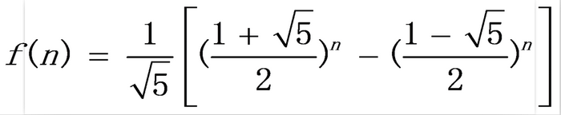

<!-- START doctoc generated TOC please keep comment here to allow auto update -->
<!-- DON'T EDIT THIS SECTION, INSTEAD RE-RUN doctoc TO UPDATE -->
**目录**

- [一、递归](#%E4%B8%80%E9%80%92%E5%BD%92)
  - [1、递归结构](#1%E9%80%92%E5%BD%92%E7%BB%93%E6%9E%84)
  - [2、递归回溯](#2%E9%80%92%E5%BD%92%E5%9B%9E%E6%BA%AF)
- [二、递归算法](#%E4%BA%8C%E9%80%92%E5%BD%92%E7%AE%97%E6%B3%95)
  - [1、猴子吃桃问题](#1%E7%8C%B4%E5%AD%90%E5%90%83%E6%A1%83%E9%97%AE%E9%A2%98)
    - [1.1、问题描述](#11%E9%97%AE%E9%A2%98%E6%8F%8F%E8%BF%B0)
    - [1.2、递推](#12%E9%80%92%E6%8E%A8)
    - [1.3、递归：](#13%E9%80%92%E5%BD%92)
  - [2、最大公约数与最小公倍数](#2%E6%9C%80%E5%A4%A7%E5%85%AC%E7%BA%A6%E6%95%B0%E4%B8%8E%E6%9C%80%E5%B0%8F%E5%85%AC%E5%80%8D%E6%95%B0)
    - [2.1、最大公约数](#21%E6%9C%80%E5%A4%A7%E5%85%AC%E7%BA%A6%E6%95%B0)
    - [2.2、最小公倍数](#22%E6%9C%80%E5%B0%8F%E5%85%AC%E5%80%8D%E6%95%B0)
  - [3、1到100累加的“非主流算法”：求 1 + 2 + 3 + ... + n](#31%E5%88%B0100%E7%B4%AF%E5%8A%A0%E7%9A%84%E9%9D%9E%E4%B8%BB%E6%B5%81%E7%AE%97%E6%B3%95%E6%B1%82-1--2--3----n)
    - [3.1、普通算法](#31%E6%99%AE%E9%80%9A%E7%AE%97%E6%B3%95)
    - [3.2、等差数列：时间复杂度 O(1)， 空间复杂度 O(1)[没有进行循环也没有开辟额外的空间]](#32%E7%AD%89%E5%B7%AE%E6%95%B0%E5%88%97%E6%97%B6%E9%97%B4%E5%A4%8D%E6%9D%82%E5%BA%A6-o1-%E7%A9%BA%E9%97%B4%E5%A4%8D%E6%9D%82%E5%BA%A6-o1%E6%B2%A1%E6%9C%89%E8%BF%9B%E8%A1%8C%E5%BE%AA%E7%8E%AF%E4%B9%9F%E6%B2%A1%E6%9C%89%E5%BC%80%E8%BE%9F%E9%A2%9D%E5%A4%96%E7%9A%84%E7%A9%BA%E9%97%B4)
    - [3.3、抛出异常算法](#33%E6%8A%9B%E5%87%BA%E5%BC%82%E5%B8%B8%E7%AE%97%E6%B3%95)
  - [4、爬楼梯问题，即斐波那契数列问题](#4%E7%88%AC%E6%A5%BC%E6%A2%AF%E9%97%AE%E9%A2%98%E5%8D%B3%E6%96%90%E6%B3%A2%E9%82%A3%E5%A5%91%E6%95%B0%E5%88%97%E9%97%AE%E9%A2%98)
    - [4.1、描述](#41%E6%8F%8F%E8%BF%B0)
    - [4.2、递推公式：](#42%E9%80%92%E6%8E%A8%E5%85%AC%E5%BC%8F)
    - [4.3、备忘录法](#43%E5%A4%87%E5%BF%98%E5%BD%95%E6%B3%95)
    - [4.4、动态规划法（Dynamic programming）简称DP](#44%E5%8A%A8%E6%80%81%E8%A7%84%E5%88%92%E6%B3%95dynamic-programming%E7%AE%80%E7%A7%B0dp)
    - [4.5、状态压缩法](#45%E7%8A%B6%E6%80%81%E5%8E%8B%E7%BC%A9%E6%B3%95)
    - [4.6、通项公式](#46%E9%80%9A%E9%A1%B9%E5%85%AC%E5%BC%8F)
    - [4.7、比较](#47%E6%AF%94%E8%BE%83)
  - [5、汉诺塔](#5%E6%B1%89%E8%AF%BA%E5%A1%94)
  - [6、求一颗二叉树的深度](#6%E6%B1%82%E4%B8%80%E9%A2%97%E4%BA%8C%E5%8F%89%E6%A0%91%E7%9A%84%E6%B7%B1%E5%BA%A6)
    - [6.1、二叉树的最大深度](#61%E4%BA%8C%E5%8F%89%E6%A0%91%E7%9A%84%E6%9C%80%E5%A4%A7%E6%B7%B1%E5%BA%A6)
    - [6.2、二叉树的最低深度](#62%E4%BA%8C%E5%8F%89%E6%A0%91%E7%9A%84%E6%9C%80%E4%BD%8E%E6%B7%B1%E5%BA%A6)
- [参考资料](#%E5%8F%82%E8%80%83%E8%B5%84%E6%96%99)

<!-- END doctoc generated TOC please keep comment here to allow auto update -->

# 一、递归

将复杂的问题转换为较为简单的同类问题然后再找出解决方法最终利用简单同类问题解出复杂问题的过程，而这种思维的方式就是递归-是一种复杂问题简单化的思维方式

递归问题：https://mp.weixin.qq.com/s/Hew44D8rdXb3pf8mZGk67w

## 1、递归结构

- 递归终止条件
- 递归过程

## 2、递归回溯

# 二、递归算法

## 1、猴子吃桃问题

### 1.1、问题描述

孙悟空第一天摘下若干蟠桃，当即吃了一半，还不过瘾，又多吃了一个。第二天早上，他又将剩下的蟠桃吃掉一半，还不过瘾，又多吃了一个。之后每天早上他都吃掉前一天剩下桃子的一半零一个。到第10天早上想再吃时，就只剩下一个蟠桃了。求孙悟空第一天共摘了多少个蟠桃？

### 1.2、递推

10 = (5+1)+4  前一天剩下的蟠桃 = (前一天剩下的一半+1个) + 当天剩下的蟠桃

### 1.3、递归：

开始调用哪个函数，该函数就压栈；调用完毕，该函数就弹栈。
```java
a.n = 2 * a.(n-1) + 2
// 实现
return n==1 ? 1 ： eat(n - 1) * 2 + 2;

Space(N) = Heap(N)+Stack(N)
Heap(N) =0
Stack(N) =N
故而，Space(N) = 0+N = O(N)
```
当Stack(N)增长率很快（超过NlogN）的时候，慎用递归！

## 2、最大公约数与最小公倍数

### 2.1、最大公约数
- 算法：欧几里得算法

	- 令较大数为m，较小数为n；
	- 当m除以n的余数不等于0时，把n作为m，并把余数作为n，进行下一次循环；
	- 当余数等于0时，返回n

- 递推实现：时间复杂度 O(lgM)，空间复杂度 O(1)
	```java
	public int gcd(int m， int n){					
		int a = Math.max(m， n);
		int b = Math.min(m， n);
		m = a;
		n = b;
		int r = m % n;
		while(r != 0){
			m = n;
			n = r;
			r = m % n;
		}
		return n;
	}
	```
	```
	m 	n 	r
	100 44  12
	44  12 	8
	12	8	4
	8	4	0
	```
	每执行一次循环，m或者n至少有一个缩小了2倍，故时间复杂度上限为 log2M。
	对于大量的随机测试样例，每次循环平均能使m与n的值缩小一个10进位，所以平均复杂度为 O(lgM)(以10为底的对数)

- 递归实现
	```java
	public int gcd02(int m， int n){
		int a = Math.max(m，n)，
			b = Math.min(m，n);
		return a % b == 0 ? b ： gcd02(b， a % b);
		或者一行：
		return m >=n ? (m % n == 0 ? n ： gcd02(n， m%n))：(n % m == 0 ? m ： gcd02(m， n%m));
	}
	```

### 2.2、最小公倍数

两个数的乘积除以最大公约数，60 和 24 的最小公倍数：	60 * 24 / gcd02(60, 24)

## 3、1到100累加的“非主流算法”：求 1 + 2 + 3 + ... + n

### 3.1、普通算法

- for 循环运算：时间复杂度 O(N)， 空间复杂度 O(1)
	```java
	int sum = 0;
	for(int i = 1;i <= 100; i++){
		sum += i;
	}	
	```
- 递归：时间复杂度 O(N)， 空间复杂度 O(N)[栈深度为 N，堆深度为 1]
	```java
	public int sum(int n){
		return n == 1 ? 1 ： sum(n - 1) + n;
	}
	```

### 3.2、等差数列：时间复杂度 O(1)， 空间复杂度 O(1)[没有进行循环也没有开辟额外的空间]
```java
n * (a + b) / 2 // a 表示数列的第1项， b 表示数列的最后一项
public int sum(int n){
	return n * (1 + n) / 2
}
```

### 3.3、抛出异常算法

捕获异常 ArrayIndexOutOfBoundsException  时间复杂度 O(N)， 空间复杂度 O(N)

- 条件：不允许使用循环语句，不允许使用选择语句，不允许使用乘法、除法
- 设计递归算法，使用数组存储数据；当发生数组越界异常时，捕获异常并结束递归，数组第20位置的元素array[20]存储前20项的和：1+2+3+…+20
	```java
	public class SumException {
		private int n;
		private int[] array;			
		public SumException() {	}
		public SumException(int n){
			this.n = n;
			this.array = new int[n+1];// 数组的长度为 n+1
		}			
		public int sum(int i){
			try {
				array[i] = array[i-1] + i;
				int k = sum(i + 1);
				return k;
			} catch (ArrayIndexOutOfBoundsException e) {
				return array[n];
			}
		}			
	}
	```
### 3.4、构造函数抛出异常
时间复杂度 O(N)， 空间复杂度 O(N)
```java
Heap(N) = 2N，Stack(N) = N
Space(N) = Heap(N)+Stack(N) = 3N = O(N)
public class SumExceptionConstructor {
	public static int n;
	public static int[] array;			
	public SumExceptionConstructor(int i){
		try {
			array[i] = array[i-1] + i;
			new SumExceptionConstructor(i+1);
		} catch (ArrayIndexOutOfBoundsException e) {
			System.out.println(array[n]);
			return;
		}
	}			
	public static void main(String[] args) {
		int n = 100;
		SumExceptionConstructor.n = n;
		SumExceptionConstructor.array = new int[n+1];
		new SumExceptionConstructor(1);
	}			
}
```

## 4、爬楼梯问题，即斐波那契数列问题

### 4.1、描述

楼梯一共有n级，每次你只能爬1级或者2级。问：从底部爬到顶部一共有多少种不同的路径?

### 4.2、递推公式：

f1 = 1， f2 = 2， f(n) = f(n-1) + f(n-2);

由此斐波那契数列：

a1 = 1， a2 = 2， a3 = 3， a4 = 5， a5 = 8，...

- 递归实现：时间复杂度 O(2^N)， 空间复杂度 O(N);
	```java
	public int fib01(int n){
		if(n == 1 || n == 2){
			return n;
		}else {
			return climb01(n-1) + climb01(n-2);
		}
	}
	public int fib02(int n){
		return n==1||n==2? n ： climb01(n-1) + climb01(n-2);
	}
	```
- 递归数：

	其弹栈为二叉树的后序遍历序列， 2 1 3 2 4 2 1 3 5，树的高度 = 栈的最大深度

### 4.3、备忘录法
将重复计算的值存入数组， 时间复杂度 O(N)， 空间复杂度 O(N),如果array[i]不为0，则直接返回；如果array[i]为0，array[i]=f(i-1)+f(i-2)，并返回array[i]
```java
public int dfs(int n， int[] array){
	if(array[n] != 0){
		return array[n];
	}else{
		array[n] = dfs(n-1， array) + dfs(n-2， array);
		return array[n];
	}
}
public int fib03(int n){
	if(n == 1 || n == 2){
		return n;
	}else{
		int[] array = new int[n+1];
		array[1] = 1;
		array[2] = 2;
		return dfs(n， array);
	}
}	
```

### 4.4、动态规划法（Dynamic programming）简称DP

时间复杂度 O(N)， 空间复杂度 O(N)；满足条件：最优子结构[fib(n-1)+fib(n-2)=fib(n)]，重叠子问题[由递归树可知]

```java
public int fib04(int n) {
	if(n == 1 || n == 2){
		return n;
	}else{
		int[] array = new int[n+1];
		array[1] = 1;
		array[2] = 2;
		for(int i=3;i<n+1;i++){
			array[i] = array[i-1] + array[i-2];
		}
		return array[n];
	}
}
```

### 4.5、状态压缩法
又称滚动数组、滑动窗口(Sliding Window)，用于优化动态规划法的空间复杂度，时间复杂度 O(N)， 空间复杂度 O(1);
```java
public int fib05(int n){
	if(n == 1 || n == 2){
		return n;
	}else{
		int a = 1;
		int b = 2;
		int t;
		for(int i=3;i<n+1;i++){
			t = a + b;
			a = b;
			b = t;
		}
		return b;
	}
}
```
### 4.6、通项公式



时间复杂度 O(log2N)， 空间复杂度 O(1);
```java
public int fib06(int n){
	if(n == 1 || n == 2){
		return n;
	}else{
		double sqrtFive = Math.sqrt(5);
		n++;
		double a = Math.pow((1 + sqrtFive)/2， n);
		double b = Math.pow((1 - sqrtFive)/2， n);
		double result = 1 / sqrtFive * (a - b);
		return (int) Math.floor(result);
	}
}
```

### 4.7、比较
上述写的六个方法

- 方法对比

	- fib01	递归，未做优化
	- fib02	递归，一行代码
	- fib03	递归，备忘录法
	- fib04	非递归，动态规划法
	- fib05	非递归，状态压缩法
	- fib06	非递归，通项公式法

- 面试要求：

	|面试官要求|			可采取的方法|
	|--------|-------------------|
	|代码简洁			|fib02|
	|递归				|fib01、fib02、fib03|
	|非递归				|fib04、fib05、fib06|
	|方便查询			|fib03、fib04|
	|时间复杂度尽量低	|fib04、fib05、fib06|
	|空间复杂度尽量低	|fib05、fib06|

## 5、汉诺塔

以x为起点柱，y为目标柱，z为中转柱，然后给出解出N层汉诺塔的过程。利用z柱将n个圆盘从x柱转移到y柱的解法如下：
```
当 n=0时，无需任何移动
当 n>0时，
    ①将n-1个圆盘从x柱，经y柱中转，移动到z柱(即解出n-1层汉诺塔)
    ②然后将1个圆盘从x柱移动到y柱(最大的圆盘)
    ③最后将n-1个圆盘从z柱，经x中转移动到y柱(即解出n-1层汉诺塔) 

```

## 6、求一颗二叉树的深度

### 6.1、二叉树的最大深度
LeetCode-104 

取左右最高深度的最大值 + 1

### 6.2、二叉树的最低深度

leetCode-111


# 参考资料

* [递归思维](https://blog.csdn.net/javazejian/article/details/53452971)


