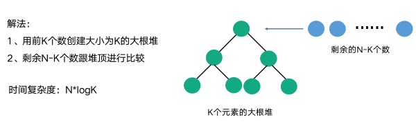

- [算法仓库](https://github.com/chefyuan/algorithm-base)
- [算法辅助学习](https://juejin.cn/post/6997188984988254222)
- [算法小册](https://www.desgard.com/algo/)
- [信息学奥林匹克竞赛](https://oi-wiki.org/)
- [Hello算法](https://www.hello-algo.com/)

# 一、算法思路

## 1、字符串

**字符串匹配类问题的解题技巧：**
- 首先要认真审题，避免答偏。可以先确定是单模式匹配问题还是多模式匹配问题，命中条件是否有多个。
- 然后确定对算法时间复杂度或者内存占用是否有额外要求。
- 最后要明确期望的返回值是什么，比如存在有多个命中结果时，是返回第一个命中的，还是全部返回。

**关于解题思路：**
- 如果是单模式匹配问题，可以考虑使用 BM 或者 KMP 算法。
- 如果是多模匹配，可以考虑使用 Tire 树来解决。
- 在实现匹配算法时，可以考虑用前缀或者后缀匹配的方式来进行。
- 最后可以考虑是否能够通过栈、二叉树或者多叉树等数据结构来辅助解决。

**了解一下常见的字符串单模、多模匹配算法的处理思路**

## 2、TopK 问题

TopK 一般是要求在 N 个数的集合中找到最小或者最大的 K 个值，通常 N 都非常得大。TopK 可以通过排序的方式解决，但是时间复杂度较高，一般是 O(nk)，这里我们来看看更加高效的方法。

如下图所示，首先取前 K 个元素建立一个大根堆，然后对剩下的 N-K 个元素进行遍历，如果小于堆顶的元素，则替换掉堆顶元素，然后调整堆。当全部遍历完成时，堆中的 K 个元素就是最小的 K 个值

这个算法的时间复杂度是 N*logK。算法的优点是不用在内存中读入全部的元素，能够适用于非常大的数据集

# 二、十大算法

## 1、排序算法

归并排序(MERGE SORT)：分治算法的一个典型应用

快速排序(QUICK SORT)：结合了集合划分算法和分治算法，不是很稳定，但在处理随机列阵(AM-based arrays)时效率相当高

堆积排序(HEAP SORT)：采用优先伫列机制，减少排序时的搜索时间，同样不是很稳定

## 2、傅立叶变换和快速傅立叶变换

## 3、迪杰斯特拉算法

## 4、RSA非对称加密算法

## 5、哈希安全算法

## 6、整数质因子分解算法

## 7、链接分析算法

## 8、比例微积分算法

## 9、数据压缩算法

## 10、随机数生成算法

