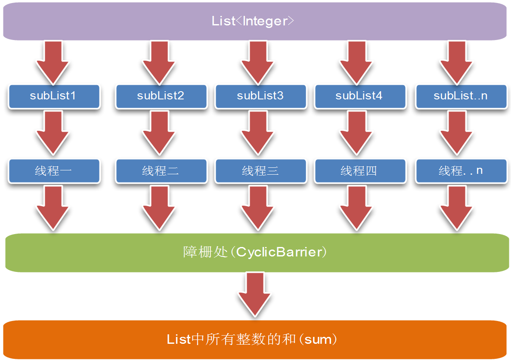

# 1、10000个数排序取前十，十万个数排序取中位数，一万个数排序取某页

从10万个数中找最小的10个，时间复杂度分析

PriorityQueue

# 2、队列反转实现(递归或非递归实现)

# 3、微信红包算法

## 3.1、红包里的金额怎么算

二倍均值法：随机，额度在0.01和剩余平均值*2之间

例如：发100块钱，总共10个红包，那么平均值是10块钱一个，那么发出来的红包的额度在0.01元～20元之间波动。 当前面3个红包总共被领了40块钱时，剩下60块钱，总共7个红包，那么这7个红包的额度在：0.01～（60/7*2）=17.14之间。

注意：这里的算法是每被抢一个后，剩下的会再次执行上面的这样的算法。

这样算下去，会超过最开始的全部金额，因此到了最后面如果不够这么算，那么会采取如下算法：保证剩余用户能拿到最低1分钱即可

## 3.2、发红包后台操作

- 在数据库中增加一条红包记录，存储到CKV，设置过期时间；
- 在Cache（可能是腾讯内部kv数据库，基于内存，有落地，有内核态网络处理模块，以内核模块形式提供服务））中增加一条记录，存储抢红包的人数N

## 3.3、抢红包后台操作

- 抢红包分为抢和拆，抢操作在Cache层完成，通过原子减操作进行红包数递减，到0就说明抢光了，最终实际进入后台拆操作的量不大，通过操作的分离将无效请求直接挡在Cache层外面。这里的原子减操作并不是真正意义上的原子减操作，是其Cache层提供的CAS，通过比较版本号不断尝试，存在一定程度上的冲突，冲突的用户会放行，让其进入下一步拆的操作，这也解释了为啥有用户抢到了拆开发现领完了的情况。

- 拆红包在数据库完成，通过数据库的事务操作累加已经领取的个数和金额，插入一条领取流水，入账为异步操作，这也解释了为啥在春节期间红包领取后在余额中看不到。拆的时候会实时计算金额，其金额为1分到剩余平均值2倍之间随机数，一个总金额为M元的红包，最大的红包为 M * 2 /N（且不会超过M），当拆了红包后会更新剩余金额和个数。财付通按20万笔每秒入账准备，实际只到8万每秒。

# 4、大数四则运算

## 4.1、大数的乘法

[大数乘法](https://mp.weixin.qq.com/s/KV4Y9R17AZZ0xek579OpCA)


## 4.2、大数的加法

[大数的加法](https://mp.weixin.qq.com/s/GXclPfm_L2kIGAjgLSPX5g)


# 5、如何充分利用多核CPU，计算很大的List中所有整数的和

* [Fork/Join实现并行计算](https://juejin.im/post/59be875e5188257e6b6d91c1)
* [CyclicBarrier实现求和](http://flysnow.iteye.com/blog/711162)

## 5.1、CyclicBarrier实现方式

它是一个同步辅助类，它允许一组线程（任务）互相等待，直到到达某个公共屏障点（common barrier point）

处理步骤：

- 分割List，根据采用的线程（任务）数平均分配，即list.size()/threadCounts
- 定义一个记录“很大List”中所有整数和的变量sum，采用一个线程（任务）处理一个分割后的子List，计算子List中所有整数和（subSum），然后把和（subSum）累加到sum上
- 等待所有线程（任务）完成后输出总和(sum)的值

如图所示：



```java
@Slf4j
public class CyclicBarrierCountListSum {
    /**
     * 存放整数的和
     */
    private long sum;
    /**
     * 同步器
     */
    private CyclicBarrier barrier;
    /**
     * 整数集合List
     */
    private List<Integer> list;
    /**
     * 使用的线程数
     */
    private int threadCounts;
    public CyclicBarrierCountListSum(List<Integer> list， int threadCounts) {
        this.list = list;
        this.threadCounts = threadCounts;
    }
    /**
     * 获取List中所有整数的和
     * @return
     */
    public long getIntegerSum() {
        ExecutorService exec = Executors.newFixedThreadPool(threadCounts);
        // 平均分割List
        int len = list.size() / threadCounts;
        // List中的数量没有线程数多（很少存在）
        if (len == 0) {
            // 采用一个线程处理任务
            threadCounts = list.size();
            len = list.size() / threadCounts;
        }
        barrier = new CyclicBarrier(threadCounts + 1);
        for (int i = 0; i < threadCounts; i++) {
            if (i == threadCounts - 1) {
                // 最后一个线程承担剩下的所有元素的计算
                exec.execute(new SubIntegerTask(list.subList(i * len， list.size())));
            } else {
                exec.execute(new SubIntegerTask(list.subList(i * len， len * (i + 1) > list.size() ? list.size() ： len * (i + 1))));
            }
        }
        try {
            // 使该线程在障栅处等待，直到所有的线程都到达障栅处
            barrier.await();
        } catch (InterruptedException e) {
            log.info("{}：Interrupted"， Thread.currentThread().getName());
        } catch (BrokenBarrierException e) {
            log.info("{}：BrokenBarrier"， Thread.currentThread().getName());
        }
        exec.shutdown();
        return sum;
    }
    /**
     * 分割计算List整数和的线程任务
     */
    public class SubIntegerTask implements Runnable {
        private List<Integer> subList;
        public SubIntegerTask(List<Integer> subList) {
            this.subList = subList;
        }
        @Override
        public void run() {
            long subSum = 0L;
            for (Integer i ： subList) {
                subSum += i;
            }
            synchronized (CyclicBarrierCountListSum.this) {
                sum += subSum;
            }
            try {
                // 使该线程在障栅处等待，直到所有的线程都到达障栅处
                barrier.await();
            } catch (InterruptedException e) {
                log.info("{}：Interrupted"， Thread.currentThread().getName());
            } catch (BrokenBarrierException e) {
                log.info("{}：BrokenBarrier"， Thread.currentThread().getName());
            }
            log.info("分配给线程：{} 那一部分List整数和为 subSum={}"， Thread.currentThread().getName()， subSum);
        }
    }
}
```

## 5.2、Fork/Join框架实现
```java
public class ForkJoinLargeSum {
    public static void main(String[] args) throws Exception {
        int[] array = IntStream.rangeClosed(0， 100).toArray();
        ForkJoinPool pool = new ForkJoinPool();
        Task task = new Task(0， array.length， 100， array);
        Future<Integer> future = pool.submit(task);
        System.out.println(future.get());

        pool.shutdown();
    }
    static class Task extends RecursiveTask<Integer> {
        public static final int DEFAULT_THRESHOLD = 1000;
        private int high， low;
        private int threshold;
        private int[] array;
        public Task(int low， int high， int threshold， int[] array) {
            this.high = high;
            this.low = low;
            this.threshold = threshold;
            this.array = array;
        }
        @Override
        protected Integer compute() {
            if (high - low <= threshold) {
                int sum = 0;
                for (int i = low; i < high; i++) {
                    sum += array[i];
                }
                return sum;
            } else {
                int middle = (high - low) / 2 + low;
                Task leftTask = new Task(low， middle， threshold， array);
                Task rightTask = new Task(middle， high， threshold， array);
                leftTask.fork();
                rightTask.fork();
                return leftTask.join() + rightTask.join();
            }
        }
    }
}
```

### 5.3、使用Stream的并行流操作
```java
public long sumList(List<Long> list) {
    return list.parallelStream().reduce(0L, Long::sum);
}
```


# 6、八皇后问题：递归回溯

https://mp.weixin.qq.com/s/puk7IAZkSe6FCkZnt0jnSA
https://mp.weixin.qq.com/s/c-J5yfTGGuGt4YnHeInkUw


# 7、最大公约数与最小公倍数

## 7.1、辗转相除法-欧几里德算法，求出两个正整数的最大公约数

- 1、欧几里德算法定理：两个正整数a和b(a>b)它们的最大公约数等于a除以b的余数c和b之间的最大公约数

- 2、思路：基于上述定理，可以使用递归的方法来把问题逐步简化：
    - 首先，我们先计算出a除以b的余数c，把问题转化成求出b和c的最大公约数；
    - 然后计算出b除以c的余数d，把问题转化成求出c和d的最大公约数；
    - 再然后计算出c除以d的余数e，把问题转化成求出d和e的最大公约数； ......

    逐渐把两个较大整数之间的运算简化成两个较小整数之间的运算，直到两个数可以整除，或者其中一个数减小到1为止

- 3、代码一：
    ```java
    public static int getGreatestCommonDivisor(int a， int b){
        int result = 1;
        if (a > b) {
            result = gcd(a， b);
        } else {
            result = gcd(b， a);
        }
        return result;
    }
    public static int gcd(int a， int b){
        if (a % b == 0) {
            return b;
        } else {
            return gcd(b， a%b);
        }
    }
    ```
- 4、上述代码问题点：当两个整数比较大时，做 a%b 取模运算性能比较低

## 7.2、更相减损术（九章算术），也是求最大公约数的方法

- 1、定理：两个正整数a和b(a>b)，它们的最大公约数等于a-b的差值c和较小数b的最大公约数

- 2、思路：我们同样可以通过递归来简化问题.
    - 首先，我们先计算出a和b的差值c（假设a>b），把问题转化成求出b和c的最大公约数;
    - 然后计算出c和b的差值d（假设c>b），把问题转化成求出b和d的最大公约数;
    - 再然后计算出b和d的差值e（假设b>d），把问题转化成求出d和e的最大公约数;

    ......

    - 逐渐把两个较大整数之间的运算简化成两个较小整数之间的运算
- 3、代码二：
    ```java
    public static int getGreatestCommonDivisor(int a， int b){
        if (a == b) {
            return b;
        } else if (a > b) {
            getGreatestCommonDivisor(a - b， b);
        } else {
            getGreatestCommonDivisor(b - a， a);
        }
    }
    ```
- 4、相对于欧几里得算法，更相减损术依靠求两数的差方式来递归，运算的次数肯定远大于欧几里德算法.

- 5、优化思路：在更相减损术基础上使用移位算法：

    对于给定的正整数a和b，不难得到如下的结论。其中gcb(a，b)的意思是a，b的最大公约数函数：
    - 当a和b均为偶数，```gcb(a，b) = 2*gcb(a/2， b/2) = 2*gcb(a>>1， b>>1)```
    - 当a为偶数，b为奇数，gcb(a，b) = gcb(a/2， b) = gcb(a>>1， b) 
    - 当a为奇数，b为偶数，gcb(a，b) = gcb(a， b/2) = gcb(a， b>>1) 
    - 当a和b均为奇数，利用更相减损术运算一次，gcb(a，b) = gcb(b， a-b)， 此时a-b必然是偶数，又可以继续进行移位运算.

    - 比如：计算10和25的最大公约数的步骤如下
        - 整数10通过移位，可以转换成求5和25的最大公约数;
        - 利用更相减损法，计算出25-5=20，转换成求5和20的最大公约数;
        - 整数20通过移位，可以转换成求5和10的最大公约数，
        - 整数10通过移位，可以转换成求5和5的最大公约数
        - 利用更相减损法，因为两数相等，所以最大公约数是5

- 6、代码三：
    ```java
    public static int getData(int a， int b) {
        if (a == b) {
            return a;
        } else if (a < b) {
            return getData(b， a);
        } else {
            if ((a & 1) == 0 && (b & 1) == 0) {
                return getData(a >> 1， b >> 1) << 1;
            } else if ((a & 1) == 0 && (b & 1) != 0) {
                return getData(a >> 1， b);
            } else if ((a & 1) != 0 && (b & 1) == 0) {
                return getData(a， b >> 1);
            } else {
                return getData(b， a - b);
            }
        }
    }
    ```
## 7.3、最小公倍数

两个正整数a和b的乘积除以两个数的最大公约数--> 最小公倍数=两整数的乘积 / 最大公约数


# 8、给你5000万个int，求出前1000个最大的数，有2G内存


# 9、从一个有正有负数组中找连续子数组的最大和


# 10、满二叉树第i层有多少个节点，n层的满二叉树共有多少个节点


# 11、有3n+1个数字，其中3n个中是重复的，只有1个是不重复的，怎么找出来


# 12、平方数之和


# 13、大文件词频统计

## 13.1、使用BufferedInputStream

使用BufferedInputStream单线程来处理
```java
@Test
public void count_single_thread() throws Exception {
    BufferedInputStream inputStream = new BufferedInputStream(new FileInputStream("word"));
    byte[] buffer = new byte[4 * 1024];
    int len;
    HashMap<String, Integer> hashMap = new HashMap<>();
    long startTime = System.currentTimeMillis();
    while ((len = inputStream.read(buffer)) != -1) {
        byte[] bytes = Arrays.copyOfRange(buffer, 0, len);
        String str = new String(bytes);
        HashMap<String, Integer> map = countByString(str);
        for (Map.Entry<String, Integer> entry : map.entrySet()) {
            incKey(entry.getKey(), hashMap, entry.getValue());
        }
    }
    System.out.println("time:" + (System.currentTimeMillis() - startTime) + "ms");
    System.out.println(hashMap.get("ababb"));
    System.out.println(hashMap.size());
}

private static HashMap<String, Integer> countByString(String str) {
    HashMap<String, Integer> hashMap = new HashMap<String, Integer>();
    StringTokenizer tokenizer = new StringTokenizer(str);
    while (tokenizer.hasMoreTokens()) {
        String token = tokenizer.nextToken();
        incKey(token, hashMap, 1);
    }
    return hashMap;
}

private static void incKey(String key, HashMap<String, Integer> map, Integer n) {
    if (map.containsKey(key)) {
        map.put(key, map.get(key) + n);
    } else {
        map.put(key, n);
    }
}
```

## 13.2、多线程处理

通过RandomAccessaFile来随机读取文件
```java
ForkJoinPool pool = ForkJoinPool.commonPool();
static class CounterTask implements Callable<HashMap<String, Integer>> {
    private final long start; // 读文件的起始位置
    private final long end; // 读文件的末尾位置
    private final String fileName; // 文件名称
    public CounterTask(long start, long end, String fileName) {
        this.start = start;
        this.end = end;
        this.fileName = fileName;
    }
    @Override
    public HashMap<String, Integer> call() throws Exception {
        FileChannel channel = new RandomAccessFile(this.fileName, "rw").getChannel();
        // [start, end] -> Memory
        // Device -> Kernel Space -> UserSpace(buffer) -> Thread
        MappedByteBuffer buffer = channel.map(FileChannel.MapMode.READ_ONLY, start, end - start);
        // 编码
        String str = StandardCharsets.US_ASCII.decode(buffer).toString();
        return countByString(str);
    }
}
public void run(String fileName, long chunkSize) throws Exception {
    File file = new File(fileName);
    // 文件大小
    long len = file.length();
    long position = 0;
    long startTime = System.currentTimeMillis();
    ArrayList<Future<HashMap<String, Integer>>> tasks = new ArrayList<>();
    while (position < len) {
        // 主要是读取到最后一次的数据
        long next = Math.min(position + chunkSize, len);
        CounterTask task = new CounterTask(position, next, fileName);
        ForkJoinTask<HashMap<String, Integer>> joinTask = pool.submit(task);
        tasks.add(joinTask);
        position = next;
    }
    System.out.format("split to %d tasks\n", tasks.size());

    HashMap<String, Integer> totalMap = new HashMap<>();
    for (Future<HashMap<String, Integer>> future : tasks) {
        HashMap<String, Integer> map = future.get();
        for (Map.Entry<String, Integer> entry : map.entrySet()) {
            incKey(entry.getKey(), totalMap, entry.getValue());
        }
    }
    System.out.println("time:" + (System.currentTimeMillis() - startTime) + "ms");
    System.out.println("total:" + totalMap.size());
    System.out.println(totalMap.get("ababb"));
}
@Test
public void count() throws ExecutionException, InterruptedException {
    var counter = new WordCount();
    System.out.println("processors:" + Runtime.getRuntime().availableProcessors());
    // chunkSize 每次切分文件的大小
    counter.run("word", 1024*1024*20);
}
```

# 14、敏感词过滤

## 14.1、暴力解法

通过字符串匹配算法，例如在字符串”abcdefghi”在查找是否存在字串“de”，如果找到了就把”de“用”“代替。通过三次匹配之后，接变成这样了：“abc fghi”

## 14.2、trie 树

# 15、幂运算

[快速幂](常见算法.md#十四快速幂)

实现 pow(x, n) ，即计算 x 的 n 次幂函数（即，$x^n$）

求pow(x,y)递归实现：
```java
public static double myPow(double x, int n) {
    long N = n;
    // 从条件里面可以看出来指数会存在负数的情况
    return N >= 0 ? quickMul(x, N) : 1.0 / quickMul(x, -N);
}
public static double quickMul(double x, long N) {
    if (N == 0) {
        return 1.0;
    }
    double y = quickMul(x, N / 2);
    // 进行奇偶判断奇数要乘上x
    return N % 2 == 0 ? y * y : y * y * x;
}
```
非递归实现：
```java
public static double myPow(double x, int n) {
    if (n < 0) {
        n = -n;
        x = 1 / x;
    }
    double pow = 1;
    while (n != 0) {
        // n & 1 是否为0是判断奇偶数的
        if ((n & 1) != 0) {
            pow *= x;
        }
        x *= x;
        n >>>= 1;

    }
    return pow;
}
```
