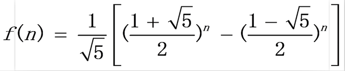

# 一、递归

将复杂的问题转换为较为简单的同类问题然后再找出解决方法最终利用简单同类问题解出复杂问题的过程，而这种思维的方式就是递归-是一种复杂问题简单化的思维方式

## 1、递归结构

递归有三大要素

### 1.1、第一要素：明确你这个函数想要干什么

这个函数的功能是什么，他要完成什么样的一件事，而这个，是完全由你自己来定义的。也就是说，我们先不管函数里面的代码什么，而是要先明白，你这个函数是要用来干什么；

比如，定义一个函数
```java
// 算 n 的阶乘(假设n不为0)
int f(n){
}
```

### 1.2、第二要素：寻找递归结束条件

所谓递归，就是会在函数内部代码中，调用这个函数本身，所以，我们必须要找出递归的结束条件，不然的话，会一直调用自己，抛出StackOverFlowError。也就是说，我们需要找出当参数为啥时，递归结束，之后直接把结果返回；请注意，这个时候我们必须能根据这个参数的值，能够直接知道函数的结果是什么；

例如，上面那个例子，当 n = 1 时，那你应该能够直接知道 f(n) 是啥吧？此时，f(1) = 1。完善我们函数内部的代码，把第二要素加进代码里面，如下
```java
int f(n){
	if(n <= 2) {
		return n;
	}
}
```

### 1.3、第三要素：找出函数的等价关系式

第三要素就是，我们要不断缩小参数的范围，缩小之后，我们可以通过一些辅助的变量或者操作，使原函数的结果不变。

例如，f(n) 这个范围比较大，我们可以让 f(n) = n * f(n-1)。这样，范围就由 n 变成了 n-1 了，范围变小了，并且为了原函数f(n) 不变，我们需要让 f(n-1) 乘以 n。

说白了，就是要找到原函数的一个等价关系式，f(n) 的等价关系式为 n * f(n-1)，即：`f(n) = n * f(n-1)`

找出了这个等价，继续完善我们的代码，我们把这个等价式写进函数里。如下：
```java
int f(n){
	if(n <= 2) {
		return n;
	}
	return f(n-1) * n
}
```

> 总结：写递归代码的关键就是找到如何将大问题分解为小问题的规律，并且基于此写出递推公式，然后再推敲终止条件，最后将递推公式和终止条件翻译成代码

## 2、递归优化思路

### 2.1、考虑是否重复计算

使用递归的时候不进行优化，是有非常非常非常多的子问题被重复计算的。使用递归的时候，必要须要考虑有没有重复计算，如果重复计算了，一定要把计算过的状态保存起来
```java
// 我们实现假定 arr 数组已经初始化好的了。
int f(n) {
	if(n <= 1){
		return n;
	}
	if(arr[n] != -1) {
		return arr[n];
	}
	arr[n] = f(n-1) + f(n-2)
	return arr[n];
}
```

### 2.2、考虑是否可以自底向上

对于递归的问题，我们一般都是从上往下递归的，直到递归到最底，再一层一层着把值返回；不过，有时候当 n 比较大的时候，例如当 n = 10000 时，那么必须要往下递归10000层直到 n <=1 才将结果慢慢返回，如果n太大的话，可能栈空间会不够用；

对于这种情况，其实我们是可以考虑自底向上的做法的。例如我知道
- f(1) = 1;
- f(2) = 2;

那么我们就可以推出 f(3) = f(2) + f(1) = 3。从而可以推出f(4),f(5)等直到f(n)。因此，我们可以考虑使用自底向上的方法来取代递归，代码如下：
```java
int f(int n) {
	if(n <= 2) {
		return n;
	}
	int f1 = 1;
	int f2 = 2;
	int sum = 0;
	for(int i =3 i<= n; i++) {
		sum = f1 + f2;
		f1 = f2;
		f2 = sum;
	}
	return sum;
}
```


# 二、递归算法

## 1、猴子吃桃问题

### 1.1、问题描述

孙悟空第一天摘下若干蟠桃，当即吃了一半，还不过瘾，又多吃了一个。第二天早上，他又将剩下的蟠桃吃掉一半，还不过瘾，又多吃了一个。之后每天早上他都吃掉前一天剩下桃子的一半零一个。到第10天早上想再吃时，就只剩下一个蟠桃了。求孙悟空第一天共摘了多少个蟠桃？

### 1.2、递推

10 = (5+1)+4  前一天剩下的蟠桃 = (前一天剩下的一半+1个) + 当天剩下的蟠桃

### 1.3、递归：

开始调用哪个函数，该函数就压栈；调用完毕，该函数就弹栈。
```java
a.n = 2 * a.(n-1) + 2
// 实现
return n==1 ? 1 ： eat(n - 1) * 2 + 2;

Space(N) = Heap(N)+Stack(N)
Heap(N) =0
Stack(N) =N
故而，Space(N) = 0+N = O(N)
```
当Stack(N)增长率很快（超过NlogN）的时候，慎用递归！

## 2、最大公约数与最小公倍数

### 2.1、最大公约数
- 算法：欧几里得算法

	- 令较大数为m，较小数为n；
	- 当m除以n的余数不等于0时，把n作为m，并把余数作为n，进行下一次循环；
	- 当余数等于0时，返回n

- 递推实现：时间复杂度 O(lgM)，空间复杂度 O(1)
	```java
	public int gcd(int m， int n){					
		int a = Math.max(m， n);
		int b = Math.min(m， n);
		m = a;
		n = b;
		int r = m % n;
		while(r != 0){
			m = n;
			n = r;
			r = m % n;
		}
		return n;
	}
	```
	```
	m 	n 	r
	100 44  12
	44  12 	8
	12	8	4
	8	4	0
	```
	每执行一次循环，m或者n至少有一个缩小了2倍，故时间复杂度上限为 log2M。
	对于大量的随机测试样例，每次循环平均能使m与n的值缩小一个10进位，所以平均复杂度为 O(lgM)(以10为底的对数)

- 递归实现
	```java
	public int gcd02(int m， int n){
		int a = Math.max(m，n)，
			b = Math.min(m，n);
		return a % b == 0 ? b ： gcd02(b， a % b);
		或者一行：
		return m >=n ? (m % n == 0 ? n ： gcd02(n， m%n))：(n % m == 0 ? m ： gcd02(m， n%m));
	}
	```

### 2.2、最小公倍数

两个数的乘积除以最大公约数，60 和 24 的最小公倍数：	60 * 24 / gcd02(60, 24)

## 3、1到100累加的“非主流算法”：求 1 + 2 + 3 + ... + n

### 3.1、普通算法

- for 循环运算：时间复杂度 O(N)， 空间复杂度 O(1)
	```java
	int sum = 0;
	for(int i = 1;i <= 100; i++){
		sum += i;
	}	
	```
- 递归：时间复杂度 O(N)， 空间复杂度 O(N)[栈深度为 N，堆深度为 1]
	```java
	public int sum(int n){
		return n == 1 ? 1 ： sum(n - 1) + n;
	}
	```

### 3.2、等差数列：时间复杂度 O(1)， 空间复杂度 O(1)[没有进行循环也没有开辟额外的空间]
```java
n * (a + b) / 2 // a 表示数列的第1项， b 表示数列的最后一项
public int sum(int n){
	return n * (1 + n) / 2
}
```

### 3.3、抛出异常算法

捕获异常 ArrayIndexOutOfBoundsException  时间复杂度 O(N)， 空间复杂度 O(N)

- 条件：不允许使用循环语句，不允许使用选择语句，不允许使用乘法、除法
- 设计递归算法，使用数组存储数据；当发生数组越界异常时，捕获异常并结束递归，数组第20位置的元素array[20]存储前20项的和：1+2+3+…+20
	```java
	public class SumException {
		private int n;
		private int[] array;			
		public SumException() {	}
		public SumException(int n){
			this.n = n;
			this.array = new int[n+1];// 数组的长度为 n+1
		}			
		public int sum(int i){
			try {
				array[i] = array[i-1] + i;
				int k = sum(i + 1);
				return k;
			} catch (ArrayIndexOutOfBoundsException e) {
				return array[n];
			}
		}			
	}
	```
### 3.4、构造函数抛出异常
时间复杂度 O(N)， 空间复杂度 O(N)
```java
Heap(N) = 2N，Stack(N) = N
Space(N) = Heap(N)+Stack(N) = 3N = O(N)
public class SumExceptionConstructor {
	public static int n;
	public static int[] array;			
	public SumExceptionConstructor(int i){
		try {
			array[i] = array[i-1] + i;
			new SumExceptionConstructor(i+1);
		} catch (ArrayIndexOutOfBoundsException e) {
			System.out.println(array[n]);
			return;
		}
	}			
	public static void main(String[] args) {
		int n = 100;
		SumExceptionConstructor.n = n;
		SumExceptionConstructor.array = new int[n+1];
		new SumExceptionConstructor(1);
	}			
}
```

## 4、爬楼梯问题，即斐波那契数列问题

### 4.1、描述

楼梯一共有n级，每次你只能爬1级或者2级。问：从底部爬到顶部一共有多少种不同的路径?

### 4.2、递推公式：

f1 = 1， f2 = 2， f(n) = f(n-1) + f(n-2);

由此斐波那契数列：

a1 = 1， a2 = 2， a3 = 3， a4 = 5， a5 = 8，...

- 递归实现：时间复杂度 O(2^N)， 空间复杂度 O(N);
	```java
	public int fib01(int n){
		if(n == 1 || n == 2){
			return n;
		}else {
			return climb01(n-1) + climb01(n-2);
		}
	}
	public int fib02(int n){
		return n==1||n==2? n ： climb01(n-1) + climb01(n-2);
	}
	```
- 递归数：

	其弹栈为二叉树的后序遍历序列， 2 1 3 2 4 2 1 3 5，树的高度 = 栈的最大深度

### 4.3、备忘录法
将重复计算的值存入数组， 时间复杂度 O(N)， 空间复杂度 O(N),如果array[i]不为0，则直接返回；如果array[i]为0，array[i]=f(i-1)+f(i-2)，并返回array[i]
```java
public int dfs(int n， int[] array){
	if(array[n] != 0){
		return array[n];
	}else{
		array[n] = dfs(n-1， array) + dfs(n-2， array);
		return array[n];
	}
}
public int fib03(int n){
	if(n == 1 || n == 2){
		return n;
	}else{
		int[] array = new int[n+1];
		array[1] = 1;
		array[2] = 2;
		return dfs(n， array);
	}
}	
```

### 4.4、动态规划法（Dynamic programming）简称DP

时间复杂度 O(N)， 空间复杂度 O(N)；满足条件：最优子结构[fib(n-1)+fib(n-2)=fib(n)]，重叠子问题[由递归树可知]

```java
public int fib04(int n) {
	if(n == 1 || n == 2){
		return n;
	}else{
		int[] array = new int[n+1];
		array[1] = 1;
		array[2] = 2;
		for(int i=3;i<n+1;i++){
			array[i] = array[i-1] + array[i-2];
		}
		return array[n];
	}
}
```

### 4.5、状态压缩法
又称滚动数组、滑动窗口(Sliding Window)，用于优化动态规划法的空间复杂度，时间复杂度 O(N)， 空间复杂度 O(1);
```java
public int fib05(int n){
	if(n == 1 || n == 2){
		return n;
	}else{
		int a = 1;
		int b = 2;
		int t;
		for(int i=3;i<n+1;i++){
			t = a + b;
			a = b;
			b = t;
		}
		return b;
	}
}
```
### 4.6、通项公式



时间复杂度 O(log2N)， 空间复杂度 O(1);
```java
public int fib06(int n){
	if(n == 1 || n == 2){
		return n;
	}else{
		double sqrtFive = Math.sqrt(5);
		n++;
		double a = Math.pow((1 + sqrtFive)/2， n);
		double b = Math.pow((1 - sqrtFive)/2， n);
		double result = 1 / sqrtFive * (a - b);
		return (int) Math.floor(result);
	}
}
```

### 4.7、比较
上述写的六个方法

- 方法对比

	- fib01	递归，未做优化
	- fib02	递归，一行代码
	- fib03	递归，备忘录法
	- fib04	非递归，动态规划法
	- fib05	非递归，状态压缩法
	- fib06	非递归，通项公式法

- 面试要求：

	|面试官要求|			可采取的方法|
	|--------|-------------------|
	|代码简洁			|fib02|
	|递归				|fib01、fib02、fib03|
	|非递归				|fib04、fib05、fib06|
	|方便查询			|fib03、fib04|
	|时间复杂度尽量低	|fib04、fib05、fib06|
	|空间复杂度尽量低	|fib05、fib06|

## 5、汉诺塔

以x为起点柱，y为目标柱，z为中转柱，然后给出解出N层汉诺塔的过程。利用z柱将n个圆盘从x柱转移到y柱的解法如下：
```
当 n=0时，无需任何移动
当 n>0时，
    ①将n-1个圆盘从x柱，经y柱中转，移动到z柱(即解出n-1层汉诺塔)
    ②然后将1个圆盘从x柱移动到y柱(最大的圆盘)
    ③最后将n-1个圆盘从z柱，经x中转移动到y柱(即解出n-1层汉诺塔) 

```

## 6、求一颗二叉树的深度

### 6.1、二叉树的最大深度
LeetCode-104 

取左右最高深度的最大值 + 1

### 6.2、二叉树的最低深度

leetCode-111


# 参考资料

* [递归思维](https://blog.csdn.net/javazejian/article/details/53452971)
* [快速掌握递归](https://mp.weixin.qq.com/s/Hew44D8rdXb3pf8mZGk67w)
* [递归思路](https://mp.weixin.qq.com/s/mJ_jZZoak7uhItNgnfmZvQ)