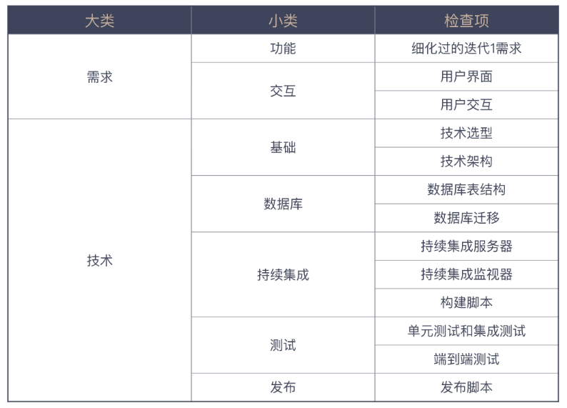

# 一、10X工作法

当一个产品经理给我交代一个要开发的功能特性时，我通常会问他这样一些问题：
- 为什么要做这个特性，它会给用户带来怎样的价值？
- 什么样的用户会用到这个特性，他们在什么场景下使用，他们又会怎样使用它？
- 达成这个目的是否有其它手段？是不是一定要开发一个系统？
- 这个特性上线之后，怎么衡量它的有效性？

## 1、以终为始

### 1.1、什么事以终为始

人们习惯采用顺序思考的思维方式，几十万年的进化将这种思考模式刻在了我们的基因里。要成为更好的自己，我们要克服自身的不足，而这个做法很简单，那就是“以终为始”，做事倒着想，先考虑结果；

以终为始即结果导向；

以终为始的前提是，你要确保你的“终”是有价值的。对于在职场上的我们来说，我们的“终”要定位成做对用户有价值的事。这个用户可以是指我们产品的实际使用用户，也可以是日常和我们合作利益相关方（Stakeholders）

### 1.2、完成的定义

DoD（Definition of Done，完成的定义）告诉我们怎样算是完成了，尽量减少因为理解偏差造成的各种浪费，比如常见的`开发完成`，表示开发人员编写好功能代码，编写好单元测试代码，编写好集成测试代码，测试可以通过，代码通过了代码风格检查、测试覆盖率检查；

怎样让 DoD 更好地发挥作用：
- DoD 是一个清单，清单是由一个个的检查项组成的，用来检查我们的工作完成情况；
- DoD 的检查项应该是实际可检查的；
- DoD 是团队成员间彼此汇报的一种机制：当我们有了 DoD，做事只有两种状态，即“做完”和“没做完”

比如经常会有人过来，让帮忙做些事。运用 DoD 的思维，首先会问他具体要做哪些事，确认好细节（相当于定义好“检查项”），然后就知道，这个忙能帮到什么程度

DoD 是一个思维模式，是一种尽可能消除不确定性，达成共识的方式。

> 在做任何事之前，先定义完成的标准

### 1.3、验收

用户故事：用户故事是一种分析需求的方法，能将各个功能串联起来以便做场景化的思考。最重要的是它能确定验收标准，这将作为后续开发的准绳；

在做任何需求或任务之前，先定好验收标准。

### 1.4、事前推演

“最后一公里”，这个说法指的是完成一件事，在最后也是最关键的步骤；

问题解决计划：
- 先从结果的角度入手，看看最终上线要考虑哪些因素。
- 推演出一个可以一步一步执行的上线方案，用前面考虑到的因素作为衡量指标。
- 根据推演出来的上线方案，总结要做的任务

### 1.5、数字化思维

如果我们可以在一开始，就设计好测量工作有效性的指标，那么就可以更有目的性地去工作了；

"数字也是沟通的一把利器，用数字说话，避免空谈"，可以提高沟通效率；

使用数字量化，可以先从沟通开始，少用甚至不用“可能”、”应该“、“大概”等字眼，在监控系统状态的时候，也都尽量将指标量化而不是凭感觉。这样做了之后可以减少内部甚至外部沟通成本，更好的规划自己的工作，也能快速确定系统出现问题的原因

> 问一下自己，我的工作是不是可以用数字衡量。

### 1.6、迭代0

一般来说，第一个迭代周期就是迭代 1，然后是迭代 2、迭代 3，依次排列。从名字上不难发现，所谓迭代 0，就是在迭代 1 之前的一个迭代，所以可以把它理解成开发的准备阶段；

迭代0的具体内容只是基本的清单：

