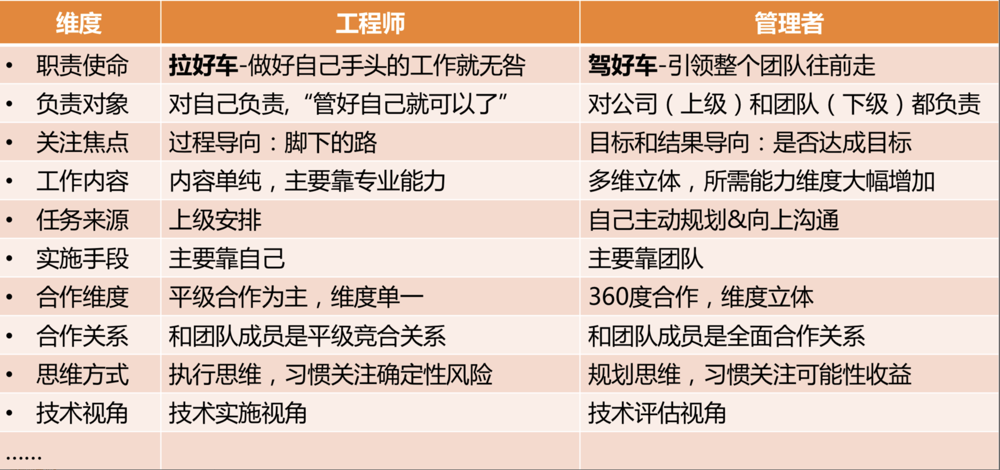
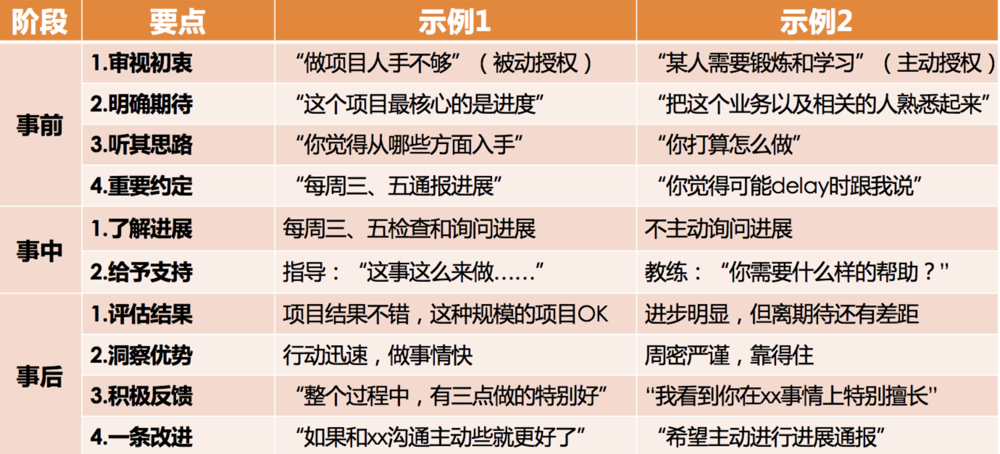

## 1、管理风格

四类领导力风格，简单概况如下：
- 指令式管理：重事不重人，关注目标和结果，喜欢发号施令但不亲力亲为。
- 支持式管理：重人不重事，希望带头冲锋亲力亲为，特别在意团队成员的感受，并替他们分担工作。
- 教练式管理：重人也重事，关注全局和方向，并在做事上给予教练式辅导和启发。
- 授权式管理：不重人也不重事，关注目标和结果，不关心过程和人员发展。

不过，不同的风格，在不同的场景下，的确会有不同的适用程度，简单列出几个场景做一些说明：
- 当一项工作不容有闪失，而你又是唯一熟悉、且最有掌控力的人时，一个命令式的你可能更能降低风险、达成目标。所以，命令式管理最适用于需要强执行的场景。
- 当一个团队特别需要凝聚力和斗志，需要攻坚的时候，一个支持式的你会促成很好的效果。所以，支持式管理特别能带团队士气和凝聚力，在带动大家热情和积极性方面很有优势。
- 当有一些核心人才需要重点培养，团队需要发展梯队的时候，一个教练式的你会带来明显的效果。他们不但能把事情做好，个人能力还能成长。虽然执行速度通常不会太快，但是不会偏离方向。
- 当团队梯队很成熟，团队成员需要发挥空间的时候，一个授权式的你能提供最恰当的管理方式。

## 2、如何面对团队里的老资格员工和高能力员工

- 你现在是团队的负责人，需要把自己从和任何团队成员的比较和竞争中抽离，把目光投向远方，去看看你将带出一个什么样的团队，以及在这个过程中，你能为公司、团队和各位团队成员带来什么样的成绩和成长
- 你要做的，不是和团队成员竞争、比较，也不是比团队每个人都强，而是要考虑如何让大家把自己的才智都发挥出来，去达成一个共同的团队目标。总之，你要做的不是管束和控制大家，而是引导和支持大家
- 当你用引导方向和支持帮助的视角去看待你和那些老资格、高能力的员工时，你会因为自己的初心而不再有猜疑和恐惧，因为只有当你真的能够为团队带来更好发展的时候，才能赢得员工发自内心的真正的信赖

## 3、管理到底都要做哪些事呢

主要做好三件事：带人、做事、看方向，当然，做好这些事都要基于良好的角色认知和管理沟通。”

## 4、管理认知角色

> 从要我做，转变为我要做。我要做的事情，需要调动团队内部和外部的资源共同完成，同时还要确保要做的事情方向要对，不能跑偏。通过团队拿结果，从而获得更大的成就

## 5、管理三步曲：管理规划

**如何开始带团队？**

弄清楚它是一个背负着什么样职责和使命的团队，决定了你需要设定什么样的工作目标，并通过哪些要素来衡量你的目标；决定了你需要什么样的人加入你的团队，以及需要多少；还决定了你选择什么样手段，投入什么样的资源来完成工作
- 职能：你是干什么的？团队是干什么的？
- 目标：你想要什么？关于团队要去哪里？
- 团队：你靠谁？依靠谁去达成目标
- 资源：你要投入什么？

所谓的管理规划，其实就是要管理者说明白一个问题，即，你想要什么目标，以及你需要投入什么资源。由于目标取决于团队的职能，而团队又是管理者的核心资源。所以，一份合格的规划报告，至少需要体现职能、目标、团队、路径这四个要素

**问题：空降管理相关问题**
- 团队中有老员工，无论是从业务、技术方面都很优秀,如何才能获取老员工的支持？
- 团队中层为项目经理，相互之间有业务交叉，但都不积极配合，如何协调其之间的关系？
- 团队成员中有关系户，手可以直触摸到老板，对于这样的成员，如何让其服从管理？
- 团队成员中的既得利益者，如何平衡他们之间的利益？

### 5.1、职能：如何界定团队是干什么的

- 公司为什么要给我这批资源（指这个团队）？是希望我产出什么？
- 这个团队存在的独特价值是什么？
- 你用什么维度来衡量团队的价值高低？

设定团队职责：
- `向上沟通`：听听上级对你团队的期待和要求，以及希望用什么维度来衡量你做得好还是不好。这个信息非常重要，团队的初始定位和基本职责，一般都是上级直接给定的；
- `向下沟通`：主要是和大家探讨对团队业务的看法和理解，以及对未来发展的期待，为以后的沟通做好铺垫；
- `左看右看`：主要是看职能定位的边界在哪里，最好和兄弟团队的职能是无缝对接的。但不要覆盖兄弟团队的职责，否则会带来各种合作上的冲突；
- `你的理解`：即，你对业务的理解，你对领域的理解，你对团队的期待，以及你对自己的期待。团队的更高职责，即，团队使命和愿景，往往来自于你的设想

### 5.2、目标：如何为团队设定合理的目标

团队目标的意义：
- 最基本的，目标包含着你和上级的诉求，即，你们希望收获的东西；
- 目标意味着资源的有效配置。明确的目标可以让你把资源投注在有效的方向上，从“该做什么”去调配资源，而不是“能干什么”；
- 目标意味着执行力：清晰的目标是高效执行的必要条件
- 目标意味着凝聚力；
- 目标也意味着激励

目标设定的原则，即`SMART`原则。分别对应着 5 个英文单词，即 `Specific`、`Measurable`、`Attainable`、`Relevant` 和 `Time-bound`，用中文来说就是目标的`明确性`、`可衡量性`、`可达性`、`相关性`和`时限性`

日常听到：`目标要明确`-可以简单地理解为，把目标设定到可以衡量的程度，就叫做明确了；下面两组目标对比：
- 第一组： 
    - a、`我们的目标是提升某个服务的性能。`这不是一个明确的可以衡量的目标。
    - b、`我们的目标是把某个服务的单机性能从 300qps 提升到 500qps。`这就是一个可以明确衡量的目标。
- 第二组：
    - a、`我们的目标是发布 BI 系统 1.0。`这看似是一个可以衡量的目标，但是 BI 系统 1.0 如何衡量是否完成了呢？又比较模糊。
    - b、`我们的目标是发布 BI 系统 1.0，支持 KPI 数据统计、全量数据导出功能。`这样就清楚 BI 系统 1.0 如何衡量了，要支持这样两项核心功能才行

当评判一个目标是否合理时：
- Specific：目标是否明确具体？
- Measurable：目标的实现是否可测？
- Attainable：目标描述是可达的吗？
- Relevant：目标和总目标是否相关？
- Time-bound：目标是否有时限限制？

目标的描述形式，大体分为两类：一类是可以量化的指标，就是大家常说的 KPI（Key Performance Indicator，关键绩效指标）；另外一类是不可量化的目标，用关键结果来衡量，就是我们常说的 KRA(Key Result Areas) 或 OKR(Objectives & Key Results)，总之就是对关键结果的一种描述
- KPI：到某时间点，什么指标达到什么数字；
- KRA/OKR：到某时间点，完成什么工作，该工作实现了哪些功能或达到了哪些效果。

### 5.3、规划

- 团队规划的第一个视角，是根据团队目标的设定去梳理团队：团队的目标，不是指团队所要完成的业务目标，而是你希望在某个时间节点到来的时候，把团队发展成什么状态，衡量的基础指标：
    - 团队的规模：也就是你团队有多少人，这其中要理清楚有多少人是现有的，有多少人是接下来要新增的，即实际人数和预算人数，加起来就是你规划的团队总规模；
    - 团队的分工：即你的团队都负责哪些业务，每个业务配置了多少人力，以及这些人员都如何分工，人力分布和业务目标是否匹配等；
    - 团队的梯队：一个团队的梯队情况代表了团队的成熟度和复原力
- 团队规划的第二个视角，是从资源角度来审视团队：作为一个管理者，在盘点自己当前人力和预算人力的时候，需要有成本意识，要考虑投入这么多资源和成本是否值得，是否合理；
- 团队规划的第三个视角，是从人才培养角度来看梯队规划

**如何提交规划报告？**

- 第一部分，绘制一张组织结构图。这张图需要体现我前面提到的团队状态三要素：
    - 规模：包括当前人数、预算人数和总人数；
    - 分工：体现团队人力都分布在哪些业务上，以及各个业务都由谁来负责；
    - 梯队：包括团队的级别和梯队分布情况；
- 第二部分，列出整个团队的资源盘点情况。大体是这样的：
    - A 级别：x 人，其中当前 m 人，预算新增 n 人；
    - B 级别：y 人，其中当前 m 人，预算新增 n 人；
    - C 级别：z 人，其中当前 m 人，预算新增 n 人；
- 第三，列出重点培养对象，以及负责业务。大体是这样的：
    - 张三，XX 业务核心工程师，到年底能完全负责 XX 业务，并能带新人

### 5.4、资源：需要申请哪些资源

**（1）你是否了解资源的丰富性？**

一般我们认为的资源主要是：人、财、物，但是其他的一些资源也不可忽视：
- 时间：很多管理者会忽略时间这个最重要的资源。对于任何一项工作，你预算多少人和你预算多少时间是分不开的；
- 信息：信息资源，是另外一个常被忽视的资源。有的时候，你需要更多的公司内外的信息，可能是业务的，也可能是人员的；你的工作如果需要特殊的信息和数据，需要提前和上级沟通，寻求必要的支持
- 权限：看看需要开通哪些之前不具备的权限，以及这些权限是否可获得。比如有的公司一线管理者是有沟通绩效权限的，而有的公司则不允许；

**（2）你是否意识到手段的多样性呢？**

通常在做一个新功能的时候，以下的做法是不同的管理者所采用过的：
- `自学自研`：由于靠自己团队的力量，资金开销比较低，维护成本也可控；而由于需要边学边做，时间成本会比较高
- `招聘专业级人才`：不确定性比较高，招聘顺利固然好，但招聘不顺则时间完全不可预期，整体上时间成本比较高
- `借调工程师`：如果能借调到合适的人，各方面的成本是最低的，但是需要这个事情足够重要才能获得支持
- `跨部门合作`：项目推进的可控性取决于合作情况，这里最大的风险就是合作成本能否控制住
- `请外包或者外部专业人士兼职做`：时间和资金成本一般都可控，用来做尝试性项目或者 demo 是比较合理的。但如果是长期的任务，你会发现外包的解决方案可维护性比较差，迁移和替换的成本会比较高
- `采购云服务`：对于中小公司来说，其实是很好的解决方案，对人才成本、维护成本、时间成本，都可以降得很低，特别适合初创公司
- `购买现成的解决方案`：时间成本很低，资金成本略高的一种方案

## 6、管理三步曲：团队建设

- 提升管理者的角色认知，让他们清楚自己作为 leader 都要做哪些工作；
- 团队融合，你希望工作坊之后，经理间有更好的互信和默契。

### 6.1、如何着手团队建设

团队建设，俗称带人、带团队

**员工个体：**
- `员工实力-能力培养`：如何培养员工的工作能力；
- `使用实力的意愿-员工激励`：提升员工的工作意愿

**员工个体之间：**
- `排兵布阵-团队分工`：分工不是简单地“谁做啥”的问题，还包括是否有相互统一的评估维度；
- `合作默契-协作水平`：团队之间的信任、默契，协作上是否高效等；

**团队整体：**
- `新老强弱-梯队建设`：盘点团队新老强弱的构成。团队工作是着眼长线的工作，我们不是只赶一段路。一个团队如果没有良好的梯队，只是靠一两个成熟的高手在支撑，那么一旦这一两个高手请假、调走或者离职，整个团队就瘫痪了；
- `归属认同-团队文化`：或者可以叫团队氛围，总之就是团队成员能够在这里找到非常好的认同感，大家也非常清楚在这个团队里，什么是重要的，什么是不重要的，什么是应该的，什么是不应该的，都不需要去一点一点交代

### 6.2、提升个人能力

提升团队战斗力的基础和前提，是提升员工的个体能力；但是个体能力是团队战斗力的基础，但是这并不意味着，当你要提升团队战斗力的时候，就必须先从这个要素下手；

**1、要提升员工的什么能力**

什么是工作能力？
- 第一种：分为知识、技能和才干三层，大部分管理者希望员工提升的能力，是在“技能”这个层次，也就是员工能操作和完成的技术，比如快速学习能力、进度控制能力；
- 第二种：是把做好一份工作的能力分为人格力量、专业能力和通用能力：
    - 人格力量通常是指一个人在面对某一情形时稳定的态度和表现，比如迎难而上、坚持不懈、积极正向、主动担当等等，注重平时积累；
    - 专业能力，对于技术人来说，一般就是指技术能力。很多公司都有技术能力衡量标准和体系，用于评估工程师的技术水平；
    - 通用能力，可以自己去定义一些你团队所重视的通用能力就好，比如沟通表达能力、团队协作能力、快速学习能力等作为重要的通用能力，并和团队达成共识；

**2、提升员工个人能力的初衷是什么**

对于一个人的评价，从来都是有双重标准的，一个标准是“及格”，另外一个标准是“优秀”：
- 所谓“及格”，就是只要胜任工作的要求就好了：对他们的期待是把交代给他们的工作做好即可，所以侧重于提升他们的专业技能，以达到专业能力的硬指标，目标是“胜任”
- 而“优秀”，除了胜任工作要求，还需要脱颖而出，超出团队普通表现，成为整个团队的核心人物：对他们的要求和期待就不只是做好本职工作那么简单了，不但对他们的专业能力要求高，还会对很多通用能力做出要求，比如目标管理、沟通协作等等，你甚至会为他们量身打造一个培养计划；

**3、如何达成上述目标**

按照`7-2-1`法则，即：`10%` 靠听课和看书自学，`20%` 靠相互交流和讨论，`70%` 靠工作实践；
- 第一类，关于帮助员工自学。对于管理者来说，常见的做法有：
    - 组织员工参加培训；
    - 为员工推荐和购买书籍；
    - 提供学习文档、视频等；
- 第二类，关于相互交流讨论。对于管理者来说，常见的做法有：
    - 组织兴趣小组、读书会等；
    - 技术分享交流会、代码评审会等；
    - 重点工作复盘，即 case study 等；
- 第三类，关于工作实践。对于管理者来说，常见的做法有：
    - 授权和辅导。给员工独立负责重要工作的机会，并给予辅导和反馈。
    - 调研工作项目化。即把调研学习的工作进行项目化管理。
    - 总结并内化。对于员工完成的重要工作，有必要请其做一个工作总结，看从中学到了什么。员工在这个总结和反思过程中的收获，甚至比总结的结果本身更重要

> 对于提升员工个人能力来说，最关键的往往不是学习的方法，而是学习的意愿

**4、应该如何激发员工学习的动力和意愿呢**

大体上可总结为如下三板斧：`推`、`拉`、`放手`：

所谓`推`，就是给压力，推着他们学：
- 提出明确的工作要求：比如，在 1 周内熟悉某个业务并可以做开发；
- 设置学习机制：也就是强制要求遵守学习规则，并完成学习任务；
- peer pressure：团队整体学习成长的氛围，会给不学习的员工带来压力；
- 惩罚：包括从绩效等级、晋升机会、调薪幅度等等，对于学习意愿低的员工有适当的“关照”

所谓`拉`，就是给方向，引导他们学：
- 树立榜样：把特别有学习意愿和成长快速的员工设为标杆人物，在团队内给予认可和奖励；
- 配备导师：有明确导师的新人和员工，更愿意请教问题并快速融入团队；*`找谁都行`，即意味着没有人对此负责*；
- 给地图：成熟的公司往往会有技术方面的“技能图”，作为管理者，你也可以为自己团队制定一个成长的“技能图”，并标记出重要等级；

所谓`放手`，就是给发挥空间，让他们自主学习：
- 给员工勇挑重担的机会。在风险可控的情况下，给员工承担责任的机会，让他们去负责一些有挑战的工作；
- 给员工自主空间，让他们独立思考，独立决策。你的辅导仅限于在他们的决策之后给出看法和建议；
- 给员工信心和耐心，允许他们犯错、走弯路。因为很多经验都是踩坑儿踩出来的，所以不能一出问题就劈头盖脸一顿批，甚至是剥夺其做事的机会；

**5、关于提升员工的能力，有两个信念特别重要：**
- 第一是相信员工能力的差异性：即看到差异，重视丰富性；创造力往往来源于差异的碰撞，所以作为管理者，你要特别关注能力的丰富性，标准不能太单一；
- 第二是相信团队能力的系统性：即欣赏差异，重视互补性；所谓完美的团队，就是价值观相同，优势互补的团队。所以，作为管理者，你要看到团队能力的系统性，不要把各个员工的能力割裂来看；

> 总结：如何提升员工的个人能力，归结起来无非就是三个步骤：
- 首先，定义你所谓的员工能力；
- 其次，设计出一些可行的方法；
- 最后，激发员工的学习动力

### 6.3、提升员工的工作意愿和积极性

**1、管理者遇到激励相关问题**
- 激励认知不系统：不清楚激励都有哪些手段，以及如何使用，各种零散的说法让人无所适从；
- 激励可用资源匮乏：实实在在的物质激励不受自己掌控，画大饼的精神激励，员工又不买账；
- 激励达不到效果：虽然激励的动作都做到位了，但是并没有收到激发员工动力的效果，或者效果不够令人满意

那么上述问题如何解决呢？

**2、关于对激励的系统认知**

关于驱动力：其发展归纳为三个阶段：驱动力 1.0、2.0 和 3.0。
- 驱动力 1.0：是指驱动力主要来源于对生存和安全的渴望；人们对这个层次的需求似乎已经默认能够保障，所以不再是关注重点，在企业员工激励中，也很少会用到；

- 驱动力 2.0：其基本哲学就是认为人们都是“寻求奖励、避免惩罚”的，所以采取的方案是“奖励好的行为、惩罚坏的行为”，也就是人们经常念叨的“胡萝卜加大棒”。效果不错，但是越用效果越差；因为无论是奖励还是惩罚，这类驱动力最大的特点是来自外部刺激。人对外部刺激的应对机制是增强免疫力；

    表扬一个员工，若遵循下面这三个原则和要素就会让你的表扬效果倍增：
    - `具体`：就是表扬的内容和原因要非常具体，让员工和团队都知道他是因为哪一两点得到了认可；比如`员工 A 非常主动及时地处理了一个线上故障`；
    - `公开`：公开表扬有两大好处，一个是被表扬的同学受到了更大的激励；另外一个更大的好处是，你其实告诉了团队每个人，什么样的行为和价值观在你们团队是被认同和倡导的；
    - `及时`：所有的期待都有时效性，表扬及时，其实就是对员工的反馈要及时。一个不及时的表扬不但会让激励效果大打折扣，而且还会让团队成员很不理解，`这么点事，至于挖坟拿出来说吗！`

- 驱动力 3.0：核心就在于自驱力，前面驱动力 2.0 的核心是外驱力（驱动力 2.0 的核心价值观是“顺从”；而驱动力 3.0 的核心价值观是“自主”）；究竟怎么激发员工的自驱力呢：
    - **第一，提升员工工作的自主性**。即，给员工一定程度的自主掌控感：
        - **工作时间和地点上的自由度**：把焦点放在对结果的评价上，而不是把焦点放在员工的作息习惯上；
        - **工作内容上的自由度**：员工可以在一定程度上选择自己的工作内容；在做季度规划的时候，也可以聊聊员工的意愿，看看能否兼顾个人兴趣和工作要求。
    - **第二，提升员工专精度，让员工持续有成长**，“专精”强调的不是要设定目标去成为某个“专家”，而是强调“自主投入”的过程，为员工创造愿意自主投入的条件，因为只有自主投入才能带来专精；
        - **明确的工作目标**：即，对员工的要求越清晰，他就越愿意投入努力；
        - **目标要略有挑战**：即，对员工的要求要有一定挑战，但又不能太高，要求太高带给员工的是焦虑；要求太低带给员工的是无聊；
        - **要能发挥其优势**：每个人都愿意做自己擅长的事情，如果某项工作能发挥员工的独特优势，必定会给他带来投入的热情；比如某些人特别爱和人沟通协调，那就让他用沟通讨论的方式去工作；如果有人特别善于独立思考和筹划，那就发挥他的思维优势；有的人行动特别迅速，那就让他去快速启动一项工作。总之，千万别简单认为发挥员工优势，就是鼓励员工“挑活”；优势是多层次的，所以让员工发挥优势这件事并不困难;
    - **第三，给予员工意义和使命**，驱动力 3.0 在不拒绝利益的同时，更强调的是工作价值的最大化，希望自己做出来的工作是有意义和价值的

**3、如何提升员工工作幸福感**

- **第一，积极正向的情绪**：你在营造什么样的团队氛围呢？
- **第二，良好的人际关系**：
- **第三，自主投入**：你为员工自主投入提供条件了吗？
- **第四，取得成就**：迎接挑战并取得成就
- **第五，意义和使命**

> 一个简单且实用的方法：即尽量避免用“任务性”的语言，而多使用“成果性”的语言。比如你安排一项工作给员工，常见的说法是：“把项目 A 抓紧做一下吧，下周要发布。”这在员工看起来，他收到了一项任务。但换成“成果性”的说法是：“项目 A 会帮我们验证一个结论，决定我们是否在这个方向上持续投入，下周就要做出决策，所以，你看下周能否搞定？”显然，成果性的说法会让员工更清楚自己工作的价值，完成之后也会很有成就感；

**4、总结**

- `第一，激励要立体`：本文介绍了非常丰富的激励要素，你需要从单一的激励维度，升级为更加立体的激励体系，从而适应新职场环境的要求。
- `第二，激励在平时`：你不能指望一些临时性刺激方案来做好激励，激励体系的搭建应在平时。当员工跟你提离职的时候，它就已经不再是一个激励问题了。
- `第三，激励要设计`：由于每个人的业务特点不同、团队性质不同、管理风格不同、员工特征不同、问题挑战不同，所以不要迷信别人给你的激励建议，我更建议你充分考虑自己面临的实际情况，结合自己的特质和激励框架，来设计适用于自己的激励体系；

### 6.4、如何团队分工

**1、为什么要分工**
- **为了实现规模化**：是为了干大事。因为干大事需要很多人，当有很多人一起做事的时候，就得有一种方式来容纳这么多的人，这个容纳方式就是分工；
- **为了实现协作**：分工是手段，协作是目的，分工和协作是不能割裂开的；
- **为了实现专精**

> 是出于规模化、协作和专精的目的来进行分工的，在做分工的时候不能忘记了这个初衷

**2、常见的分工形式有哪些？**

- **矩阵式结构**：可以这样简单地理解：员工按照角色被划分到不同的团队，每个团队都有自己的负责人。要做项目的时候，会有专门的项目经理来向各个角色的 leader 协调人力，然后把申请到的各个角色的人组织在一起去完成这个特定项目。一旦项目完成之后，人员将回归各自团队去迎接新的项目；这类组织架构的好处是各个角色团队的专业度都会很高，而且角色归属感比较强，资源调配灵活；但不足之处是项目执行起来较为低效，因为每次都要重新申请人力，而且每次的项目团队都需要重新磨合

- **BU 式结构**：也叫事业部制，是指做某项业务所有的人员和资源都统一调配，无论这个事业部是大是小，都角色齐全。这样做的好处是团队长期合作磨合充分，协作效率高，执行速度快；不足是各种角色自己都要有，资源冗余和浪费比较多。另外，由于某些角色不在业务主干上，团队规模比较小，能力要求也不高，所以其角色专业度很难提升；

**3、几个常见的误区、问题和建议原则**

- 最常见的一个分工误区，就是**分工模糊**：为了能够让大家互相补位、主动承担、增强互助，还会刻意去模糊边界；因为只有明确的分工，才能让员工清楚和认同自己的本职职责，产生归属感，并愿意主动付出多做一些；在“边界模糊”之前，要加上“分工明确”这四个字。

- 分工稳定性的问题：分工需要尽可能稳定，因为只有稳定的分工才能体现出分工的价值，比如对某项工作的专精、员工的归属感等，所以，分工能稳定的话，就最好稳定；但是管理者可以通过主动调整分工，因为你可能意识到了长期稳定的分工带来的局限和怠惰。因为分工能带来专精，同时也带来了割裂的视野，所以很多管理者会通过“轮岗”的方式来提升员工的能力和全局观；

- 虚拟组织：虚拟组织又叫虚拟团队，是为了某一个特定的目的和工作内容把大家组织到一起的

### 6.5、如何有效提升团队凝聚力

**1、如何不断提升团队的协作水平呢**，主要是从两个角度来做工作：
- 第一个角度是建立协作机制：通过机制来约定协作的动作，以此来保证大家“动作协调”；
- 第二个视角是提升团队凝聚力：通过提升团队成员间的信任度、认同度和默契度来降低协作成本，提高协作效率

团队凝聚力和协作水平是两个非常有意思的概念，他们含义不同，又紧密相关。团队凝聚力更侧重团队成员间的关系，体现他们的信任度和向心力如何；而协作水平则更关注做事过程中的互动情况；要想提升协作水平，“硬件”靠机制，而“软件”靠凝聚力。凝聚力即是团队协作的基础，又是团队协作的目标。强大的凝聚力，是战斗力强大的团队的重要特征之一

**2、如何来提升团队凝聚力呢？**

从4个角度来看问题：

- 第一个角度，设立共同愿景

    如果团队有着自己的使命，又能得到团队成员的普遍认同，大家会更容易朝着一个方向共同努力，也更容易肩并肩地一起迎接挑战，即所谓的“志同道合”。它是如此重要，下面我简要描述一下其设立步骤：
    - （1）明确你团队的职责、使命和工作目标（这里的工作目标是长远的共同目标）；
    - （2）管理者自己要笃信第 1 条的内容。如果不笃信，就返回步骤 1 继续提炼；
    - （3）在各种合适的场合宣贯这一内容，比如季度会、总结会、沟通会、启动会，以及 1 对 1 沟通等，都要不失时机、不突兀地把使命和愿景同步给大家；
    - （4）坚持不懈地做步骤 3。不要指望一蹴而就，开个会大家就都认同了的好事，现实中不会发生，只有时间长了、频次够了，才会内化，才会深深植入员工的内心；

- 第二个角度，提升员工归属

    提升员工归属感，则是为了让员工凝聚到团队上，让员工从心里就认为自己是团队的一份子
    - 要给他一个位置，给他一个“立足之地”，也就是要分给他一份职责，只有当员工清楚自己能为团队做出什么贡献的时候，才会心安，才会感受到自己是团队的一份子，即`事对`；
    - 要营造良好的团队人际关系，让彼此间形成紧密的连接，即`人对`；
    - 明确亮出团队的文化价值观，好在团队文化本身就是一个筛选器，最终留在团队发挥核心作用的都会是认同团队价值观的人，当然前提是团队先有明确的价值取向，即`味对`；

- 第三个角度，加强相互了解

    比如设计团建活动或者头脑风暴等；

- 第四个角度，共同面对挑战

    让大家在“硝烟”和“炮火”中去建立深厚的感情，这就是所谓的“事上练”

### 6.6、如何物色和培养核心人才？

梯队培养包含两部分工作：
- 选拨和物色培养对象
- 培养这些人

物色培养对象应该要满足以下两个原则：
- 第一：要保持人才选拔和团队建设的一致性，即你对核心人才的选择，需要和你团队建设的理念保持一致，应避免你一方面倡导和推崇某个理念，而在选人上又是另外一个理念
    - **能力**：主要是确保其个体能力和业务特点相互匹配，能力潜质是可成长的；
    - **协作**：其协作的意识和能力，和你团队的要求和期待是否匹配；
    - **文化**：其行为风格和价值观，和团队文化价值观是否匹配；

- 第二：和你相似的人才是人才，和你互补的人才是更宝贵的人才，强调行为风格和思维方式的多样性

如何培养呢？下面三件事情

**1、对齐期待，达成共识。常用方式是 IDP，即个人发展计划**

可以把绩效计划和 IDP 合二为一：其前半部分是关于绩效的约定，比重在 80% 左右，换句话说，培养人才也是要以做出绩效为依托，而不只是为了培养而培养；后半部分是关于成长的约定，比重在 20% 左右，主要约定了未来的一个绩效周期内，个人需要特别聚焦的成长有哪些，并通过“把哪几件事情做到什么标准”来体现，也为之后的评估和反馈提供了一个参照

在对齐期待的环节，有一个原则需要引起重视，就是不承诺原则。你在和培养对象共同制定培养计划的时候，最好秉承“不承诺原则”，这主要有两个方面的原因：
- 一是他能否成为团队核心骨干，或晋升某个岗位，是靠他自己的影响力来获取的，而不是靠你们的约定和承诺；
- 二是为培养失败留下退路。如果你承诺了，未来却又兑现不了，那这个人才大概率就流失了；

**2、提供机会和发挥空间，做好授权**

做培养计划只是第一步，而能力和影响力都是在实战中积累起来的，这就需要给培养对象提供发挥空间，让他在“事上练”，所以就不可避免地要做工作授权；工作授权，并不只是用于人才培养，还可能是因为自己应接不暇时，迫不得已把一些工作授权给员工来做，这种授权以交付结果为核心目的，姑且叫做“被动授权”；用于培养人才的“主动授权”，就是图表中的“示例 2”

- **审视初衷**：主要是管理者审视自己想要在此次授权中收获什么，你是想把某件事做出来，还是想把人带出来，抑或是其他？你可能想说，“我都想要！”也不是不可以，但是总得有个先后主次。明确初衷，就是为了避免“什么都想要”的心理最终导致自己决策标准模糊；
- **明确期待**：“明确期待”就是为了让培养对象清楚你对他的期待是什么，也就是你们就授权目标达成的共识。既然是目标，也就需要符合 SMART 原则。这一点是管理者普遍能够想到的，可能会有不同的表述，比如明确要求、明确口径等，都是一回事；
- **听其思路**：当你交代好授权任务之后，你可以首先听听他对这件工作的看法和思路。你从他的思路和方案中就大体可以判断出，他独立负责这项工作的靠谱程度如何，这不失为风险把控的良方；
- **重要约定**：即，你需要对你特别关心的事情和他做一个约定，比如在什么情况下他需要告知你；
- **了解进展**：大多管理者都能够想到这一点，就是在工作进展过程中要了解进度、评估风险，而不是任务交代完了就撒手不管了；
- **给予支持**：在工作执行过程中，管理者需要给予必要的支持和帮助，这一点也是大部分管理者能够想到的；
- **评估结果**：对于任何一次授权，针对授权对象的工作结果和表现给予有理有据的评价和及时的反馈，都是必要环节；
- **洞察优势**：盘点在整个授权过程中，授权对象所表现出来的突出的优势有哪些，比如特别谨慎周密、特别有责任心、思路特别灵活、特别善于沟通表达等等；
- **积极反馈**：就是对于授权对象的工作，一定要给出一些“正向”的反馈，即，有哪些做的好的方面。主要目的是告诉他，哪些做法是你们推崇和提倡的，哪些是需要持续保持和增强的，同时也能起到激励的作用；
- **一条改进**：就是要给出 1～2 条改进建议，也许你认为他需要改进的地方非常多

**3、建立反馈机制**
- **建立周期性沟通机制**。即，和你的重点培养对象，建立周期性的沟通机制，让沟通常规化，而不是想到了就沟通一下，想不到就不沟通，这样会比较随意，沟通不系统也不深入；
- **review IDP**。IDP 做出来之后只是发挥了一部分价值，即双方明确了目标和期待；对于 IDP 执行情况的评估和反馈，才能体现 IDP 更大的价值；
- **安排第二导师，给予支持和反馈**。为了使培养对象得到更好的成长，也可以为他安排一个除你之外的“指导老师”

> 人才选拔上求同（价值观）存异（行为/思维），培养上有的放矢的授权。

## 关于一些问题

### 团队资历老的成员

骨干成员交付能力一般，质量一般，设计能力偏差，经常延期。但来公司时间较长，得大领导喜欢，交付能力强的来公司剪短。如何破解这种难题

划定他的工作范围和工作要求，胜任一定工作就好了。