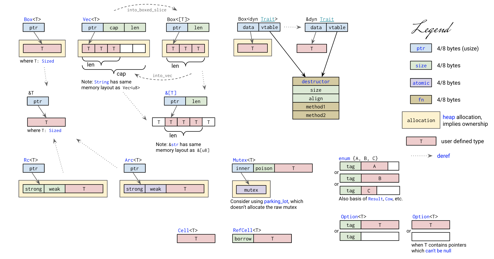

# 1、编程基本概念

- 数据（值和类型、指针和引用）；
- 代码（函数、方法、闭包、接口和虚表）；
- 运行方式（并发并行、同步异步和 Promise / async / await ）
- 编程范式（泛型编程）

# 2、vscode搭建rust开发环境

- rust-analyzer：它会实时编译和分析你的 Rust 代码，提示代码中的错误，并对类型进行标注。你也可以使用官方的 Rust 插件取代。
- rust syntax：为代码提供语法高亮。
- crates：帮助你分析当前项目的依赖是否是最新的版本。
- better toml：Rust 使用 toml 做项目的配置管理。
- better toml 可以帮你语法高亮，并展示 toml 文件中的错误。
- rust test lens：可以帮你快速运行某个 Rust 测试。
- Tabnine：基于 AI 的自动补全，可以帮助你更快地撰写代码；

# 参考资料

- [Rust Cheat Sheet](https://cheats.rs/)
- [Rust程序设计语言](https://kaisery.github.io/trpl-zh-cn/title-page.html)
- [Rust](https://docs.rs/)
- [Rust国内镜像](https://rsproxy.cn/)
- [Rust Course](https://github.com/sunface/rust-course)