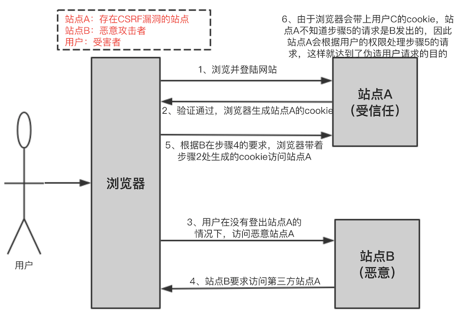

[火线安全-log4j2](https://log4j2.huoxian.cn/layout)

# 一、CSRF

- [如何防止CSRF攻击](https://tech.meituan.com/2018/10/11/fe-security-csrf.html)

## 1、概述

CSRF：Cross Site Request Forgery，跨站点请求伪造，是一种常见的web攻击。

可以理解为：攻击者盗用了你的身份，以你的名义向第三方网站发送恶意请求。 CRSF能做的事情包括利用你的身份发邮件、发短信、进行交易转账等，甚至盗取你的账号

## 2、攻击原理



- （1）首先用户C浏览并登录了受信任站点A；
- （2）登录信息验证通过以后，站点A会在返回给浏览器的信息中带上已登录的cookie，cookie信息会在浏览器端保存一定时间（根据服务端设置而定）；
- （3）完成这一步以后，用户在没有登出（清除站点A的cookie）站点A的情况下，访问恶意站点B；
- （4）这时恶意站点 B的某个页面向站点A发起请求，而这个请求会带上浏览器端所保存的站点A的cookie；
- （5）站点A根据请求所带的cookie，判断此请求为用户C所发送的。

## 3、CSRF的防御

- 尽量使用POST，限制GET，GET接口太容易被拿来做CSRF攻击；

- 将cookie设置为HttpOnly：CRSF攻击很大程度上是利用了浏览器的cookie，为了防止站内的XSS漏洞盗取cookie，需要在cookie中设置“HttpOnly”属性，这样通过程序（如JavaScript脚
本、Applet等）就无法读取到cookie信息，避免了攻击者伪造cookie的情况出现；

- 增加token：

    抵御CSRF攻击的关键在于：在请求中放入攻击者所不能伪造的信息，并且该信总不存在于cookie之中。系统开发人员可以在HTTP请求中以参数的形式加入一个随机产生的token，并在服务端进行token校验，如果请求中没有token或者token内容不正确，则认为是CSRF攻击而拒绝该请求；

- 通过Referer识别：根据HTTP协议，在HTTP头中有一个字段叫Referer，它记录了该HTTP请求的来源地址。但是因为服务器并不是什么时候都能取到Referer，所以也无法作为CSRF防御的主要手段。用Referer Check来监控CSRF攻击的发生，倒是一种可行的方法

- 加验证码：验证码，强制用户必须与应用进行交互，才能完成最终请求。在通常情况下，验证码能很好遏制CSRF攻击。但是出于用户体验考虑，网站不能给所有的操作都加上验证码

- 在 HTTP 头中自定义属性并验证

# 二、XSS

- [防止XSS跨站脚本攻击：Java过滤器](https://developer.aliyun.com/article/885857)
- [如何防止XSS攻击](https://tech.meituan.com/2018/09/27/fe-security.html)
- [如何使用antisamy防御 XSS ](https://developer.aliyun.com/article/1165745) 

## 1、概述

XSS（跨站脚本）攻击：是让浏览器渲染DOM的时候意外的执行了恶意的JS代码。

比如下列脚本：
```html

```
这个脚本加载到页面时，由于图片引用为null，故会执行后面的onerror。

## 2、攻击原理

XSS攻击主要是在网页中嵌入一个恶意脚本。

XSS的类型：
- 反射型XSS：只是简单的把用户入的数据反射给浏览器。需要诱使用户“点击”一个恶意链接，才能攻击成功。也成为“非持久型XSS”；
- 存储型XSS：会把用户输入的数据“存储”在服务器端。比较常见的是写一篇含有恶意JS代码的文章，然后发表；

CSRF与XSS差别很大，CSRF则是通过伪装来自受信任用户的请求来利用受信任的网站，而XSS利用的是站点内的信任用户；

常见的XSS攻击-Cookie劫持：常见的XSS Payload是通过读取浏览器的Cookie对象，从而发起“Cookie”劫持攻击

## 3、如何防御

流行的浏览器都内置了一些对抗XSS的措施，比如Firefox的CSP、Noscript扩展等。

### 3.1、HttpOnly

浏览器将禁止页面的Javascript访问带有HttpOnly属性的Cookie。其解决的主要是XSS后存在的Cookie劫持

### 3.2、输入检查

常见的XSS、SQL注入等都是需要构造一些特殊字符，这些特殊字符可能只正常用户用不到的，所以需要对用户的输入进行相应的检查

### 3.3、输出检查

一般来说，除了富文本的输出外，在变量输出到HTML页面时，可以使用编码或者转义的方式来防御XSS攻击。

### 3.4、富文本的处理

在标签的选择上，应该使用白名单，只允许比较安全的标签。同时应该尽可能的禁止用户自定义CSS与style

如Java中的antisamy第三方扩展，可以对用户输入的存在恶意的脚本进行清理，其可以对富文本进行过滤。

# 三、点击劫持

## 1、概述

点击劫持是一种视觉上的欺骗手段，攻击者使用一个透明的、不可见的iframe，覆盖在一个网页上，然后诱使用户在该网页上进程操作，可以调整iframe页面的位置，可以诱使用户恰好点击在iframe页面上的一些功能按钮；

## 2、Flash点击劫持

主要是用过flash游戏，诱使用户来玩这个游戏。然后让用户去点击按钮，每次点击按钮的位置都会发生变化，最终可以达到控制用户电脑的目的；

## 3、图片覆盖攻击

# 四、注入攻击

## 1、SQL注入

### 1.1、如何理解SQL注入

SQL注入是一种将SQL代码添加到输入参数中，传递到服务器解析并执行的一种攻击手法

### 1.2、SQL注入如何产生

- Web开发人员无法保证所有输入都已经过滤；
- 攻击者利用发生给SQL服务器的输入数据构造可执行SQL代码；
- 数据库未做相应的安全配置；

### 1.3、如何寻找SQL注入漏洞

- 借助逻辑推理
    - 识别web应用中所有输入点
    - 了解哪些类型的请求会触发异常
    - 检测服务器响应中的异常
    

### 1.4、SQL注入类型

- 布尔型注入：主要是判断
- 可联合查询注入：union
- 基于时间延迟注入
- 报错型注入；
- 可多语句查询注入


### 1.5、如何防御SQL注入攻击

- 检查遍历数据类型和格式：只要是有固定格式的遍历，在SQL执行之前，应该严格按照格式去校验，确保是我们预想的格式
- 过滤特殊符号：对于无法确定固定格式的变量，一定要进行特殊符号的过滤或者转义处理
- 绑定变量，使用预编译语句-预防SQL注入的最佳方式
- 对于任何服务器的异常信息，不要暴露给到web端，如:异常堆栈信息等

## 2、命令注入

Java语言提供了类似Runtime.exec(....)的API，可以用来执行特定命令；

命令注入漏洞产生的原因是外部参数没有经过有效的过滤就直接拼到系统命令中去执行；

场景主要出现在一些执行某些命令操作的功能模块/接口上，比如：ping、nslookup 等；命令注入被称为漏洞老大，正是因为其能直接执行系统命令，攻击难度低，漏洞危害大；

命令注入漏洞分隔符：

字符 | 说明
----|-----
`;` | 仅限Linux环境，用于隔离命令，按顺序执行
`\|` | 前面命令的输出结果作为后面命令的输入内容
`\|\|`| 前提是前面的命令执行失败，和 `&&` 相反
`&` | 前后两条命令按顺序执行
`&&`| 前提是前面的命令正确执行之后才能接着执行后面的命令；

示例，正常ping本机 127.0.0.1 地址，OK；

尝试切分字符进行命令注入：`127.0.0.1&&ipconfg`

**如何防御命令注入漏洞**
- 根源是：没有对外部传入参数进行严格有效过滤处理就拼接到系统命令中执行；
- 一般防御方法：
    - 调用命令注入过滤函数处理；
    - 黑白名单过滤；尤其推荐白名单，即用户只能输入白名单范围内的参数值，其他参数输入都不通过校验；
    - 参数类型过滤，具体根据业务场景
    
## 3、代码注入

当web应用未对外部参数进行严格有效过滤就拼接到要进行代码执行的的函数中执行时，会造成代码注入漏洞危险；

与命令注入漏洞的区别：代码注入漏洞注入的是恶意代码；命令注入漏洞注入的是恶意系统命令；

危害：可以执行任意代码执行，包括调用执行系统命令的函数来执行恶意命令；

**代码注入漏洞防御：**
- 尽量将相关功能通过其他非拼接外部传入代码的方式来实现；

## 4、表达式注入漏洞

在某些拥有表达式引擎的Web应用中，如果未对外部参数进行严格的过滤就拼接到表达式中执行时，会造成表达式注入漏洞；

表达式分类：主要是Java表达式，常见的有Spring框架，SpEL 表达式，Struts2框架的ONGL表达式；

危害：可以通过表达式注入可实现任意代码执行；

SpEL表达式注入漏洞防御：参考官方将 StandardEvaluationContext 替代为： SimpleEvaluationContext;

## 5、JNDI注入攻击

- [JNDI-如何操作远程代码](https://www.blackhat.com/docs/us-16/materials/us-16-Munoz-A-Journey-From-JNDI-LDAP-Manipulation-To-RCE.pdf?continueFlag=e64d0e19c6b126cc746264eefd21425d)
- [利用Java中的JNDI注入](https://www.veracode.com/blog/research/exploiting-jndi-injections-java?continueFlag=e64d0e19c6b126cc746264eefd21425d)
- [Log4JShell-JNDI注入漏洞](https://nvd.nist.gov/vuln/detail/CVE-2021-44228)

JDNI（Java Naming and Directory Interface）即Java命名和目录接口，是一组应用程序接口，为开发人员查找和访问各种资源提供了统一的通用接口，可以用来定义用户、网络、机器、对象和服务器等各种资源；

JNDI 支持的服务主要有：DNS、LDAP、CORBA、RMI等；简单理解就是 JNDI 是一组API接口。每一个对象都有一组唯一的键值绑定，按名字和对象绑定，可以通过名字检索指定的对象，而该对象可能存储在 RMI、LDAP、CORBA 等；

JNDI 注入漏洞：当JNDI客户端的 lookup() 函数的参数可控即 URI 可控时，根据 JNDI 协议动态转换的原理，攻击者可以传入恶意 URI地址指向攻击者的 RMI/LDAP 注册表服务，以使受害者客户端加载绑定在攻击者 RMI/LDAP 注册表服务上的恶意类，从而实现远程代码执行；

攻击向量：常见 RMI和LDAP

前提条件：JDK6U141、7u131、8u121之后禁用RMI，JDK6u211、7u201、8u191之后禁用 LDAP

**如何防御：**
- 尽量使用最新版的JDK；
- 将外部数据传入 InitialContext.lookup() 方法前先进行严格的过滤；
- 针对Log4Shell漏洞，升级 log4j 组件版本为最新版本；


# 五、DDOS

## 1、概述

DDOS又称为分布式拒绝服务，全称是：Distributed Denial of Services。其是利用合理的请求造成资源过载，导致服务不可用

## 2、DDOS分类

- SYN Flood：该攻击以多个随机的源主机地址向目的主机发送SYN包，而在收到目的主机的SYN ACK后并不回应，这样，目的主机就为这些源主机建立了大量的连接队列，而且由于没有收到ACK一直维护着这些队列，造成了资源的大量消耗而不能向正常请求提供服务。

- Smurf：该攻击向一个子网的广播地址发一个带有特定请求(如ICMP回应请求)的包，并且将源地址伪装成想要攻击的主机地址。子网上所有主机都回应广播包请求而向被攻击主机发包，使该主机受到攻击。

- Land-based：攻击者将一个包的源地址和目的地址都设置为目标主机的地址，然后将该包通过IP欺骗的方式发送给被攻击主机，这种包可以造成被攻击主机因试图与自己建立连接而陷入死循环，从而很大程度地降低了系统性能。

- Ping of Death：根据TCP/IP的规范，一个包的长度最大为65536字节。尽管一个包的长度不能超过65536字节，但是一个包分成的多个片段的叠加却能做到。当一个主机收到了长度大于65536字节的包时，就是受到了Ping of Death攻击，该攻击会造成主机的宕机。

- Teardrop：IP数据包在网络传递时，数据包可以分成更小的片段。攻击者可以通过发送两段(或者更多)数据包来实现Teardrop攻击。第一个包的偏移量为0，长度为N，第二个包的偏移量小于N。为了合并这些数据段，TCP/IP堆栈会分配超乎寻常的巨大资源，从而造成系统资源的缺乏甚至机器的重新启动。

- PingSweep：使用ICMP Echo轮询多个主机。

- Pingflood：该攻击在短时间内向目的主机发送大量ping包，造成网络堵塞或主机资源耗尽。

## 3、SYN Flood

一种最为经典的DDOS攻击。其是利用了TCP协议设计中的缺陷，发送大量伪造的TCP连接请求，从而使得被攻击方资源耗尽（CPU满负荷或内存不足）的攻击方式；主要是根据TCP的三次握手机制；

一次正常的建立TCP连接，需要三次握手：客户端发送SYN报文，服务端收到请求并返回报文表示接受，客户端也返回确认，完成连接。

SYN Flood 就是用户向服务器发送报文后突然死机或掉线，那么服务器在发出应答报文后就无法收到客户端的确认报文（第三次握手无法完成），这时服务器端一般会重试并等待一段时间后再丢弃这个未完成的连接。

一个用户出现异常导致服务器的一个线程等待一会儿并不是大问题，但恶意攻击者大量模拟这种情况，服务器端为了维护数以万计的半连接而消耗非常多的资源，结果往往是无暇理睬客户的正常请求，甚至崩溃。从正常客户的角度看来，网站失去了响应，无法访问

## 4、预防DDOS

- 高防服务器：高防服务器主要是指能独立硬防御 50Gbps 以上的服务器，能够帮助网站拒绝服务攻击，定期扫描网络主节点等，不过成本比较高；
- 黑名单
- DDoS 清洗：DDoS 清洗会对用户请求数据进行实时监控，及时发现DOS攻击等异常流量，在不影响正常业务开展的情况下清洗掉这些异常流量
- CDN 加速：CDN 服务将网站访问流量分配到了各个节点中，这样一方面隐藏网站的真实 IP，另一方面即使遭遇 DDoS 攻击，也可以将流量分散到各个节点中，防止源站崩溃

# 六、文件上传漏洞

## 1、概述

文件上传漏洞是指开发者没有做充足的验证情况下，允许用户上传恶意文件，可以是木马、病毒、恶意脚本或者WebShell

大多数情况下，文件上传漏洞一般是指：上传web脚本能够被服务器解析的问题。要完成这个攻击，需要满足几个条件：
- 首先，上传的文件能够被web容器解释执行。所以文件上传后所在的目录要是web容器所覆盖到的路径；
- 其次，用户能够从web上访问这个文件。如果文件上传了，但用户无法通过web访问或者无法使得web容器解释这个脚本，那也不能成为漏洞；
- 最后，用户上传的文件若被安全检查、格式化、图片压缩等功能改变了内容，可能导致攻击不成功；

## 2、后缀名绕过

文件扩展名检测一般是基于和白名单的方式，其中白名单的方式最为严格；

常见黑名单：
- HTML：`html、htm、shtml、shtm`
- PHP：`php、php2、php3、php4、php5、phtml、pwml`
- ASP：`asp、aspx、ascx、ashx、asa、cer、cdx`
- JSP：`jsp、jspx、jspf`
- 其他：`xml、ini、htaccess、cgi、pl、js、exe、bat、swf、so、dll`

常见白名单：
- 图像：`png、jpeg、jpg、gif、bmp`
- 文档：`doc、docx、xls、xlsx、csv、ppt、pptx、zip、rar、7z、gz、bz2、md`
- Flash：`swf、fla`
- Media：`swf、flv、mp3、mp4、wav、wma`

黑名单常见绕过方法：特殊可解析后缀、大小写、`.`、`$::DATA`、空格、嵌套、htaccess、解析漏洞等

常见白名单绕过方法：00截断、解析漏洞

白名单相比黑名单更为安全；

## 3、设计安全的文件上传功能

- 文件上传的目录设置为不可置信；
- 判断文件类型：可以结合MIME Type、后缀等检查方式；
- 使用随机数改写文件名和文件路径
- 单独设置服务器的域名；
- 文件格式后缀判断：黑（主要针对脚本语言，比如html、php、asp、jsp等）、白名单检测（只允许上传的文件）


# 七、中间人攻击（MITM）

# 八、Java安全机制

## 1、运行时安全机制

即限制Java运行时的行为，不做越权或者不靠谱的事情
- 在类加载过程中，进行字节码验证，以防止不合规的代码影响JVM运行或者载入其他恶意代码；
- 类加载器本身也可以对代码之间进行隔离；
- 利用SercurityManager机制和相关的组件，限制代码的运行时行为能力，其中，你可以定制policy文件和各种粒度的权限定义，限制代码的作用域和权限；

    在应用实践中，如果对安全要求非常高，建议打开SercurityManager ```-Djava.sercurity.manager```，请注意其开销，通常只要开启Sercurity，就会导致10%~15%性能下降；

- 从原则上来讲，Java的GC等资源回收管理机制，都可以看作是运行时安全的一部分，如果相应机制失效，就会导致JVM出现OOM等错误；

## 2、Java提供的安全框架API

这些API是构建安全通信的基础；
- 加密、解密API；
- 授权、鉴权API；
- 安全通信相关类库，比如基本的HTTPS通信协议相关标准实现；

## 3、JDK集成的各种安全工具

- [keytool](https://docs.oracle.com/javase/8/docs/technotes/tools/unix/keytool.html)，这是个强大的工具，可以管理安全场景中不可或缺的秘钥、证书等，并且可以管理java程序使用的keystore文件；
- [jarsinger](https://docs.oracle.com/javase/9/tools/jarsigner.htm#JSWOR-GUID-925E7A1B-B3F3-44D2-8B49-0B3FA2C54864)，用于对jar文件进行签名或者验证；

## 4、安全漏洞

任何可以用来绕过安全策略限制的程序瑕疵，都可以算作是安全漏洞；

# 九、Zip炸弹

- 概述：是指解压缩后能够产生巨大的数据量的可疑压缩文件，这样的压缩文件解压缩可能对解压程序造成严重负担或崩溃，如果带有格式化参数的压缩包，双击压缩包后，所在的硬盘分区被完全格式化了

# 十、计时攻击


# 十一、远程命令执行漏洞

所谓的远程命令执行漏洞，即利用漏洞入侵到目标服务器，通过服务器执行命令

## 1、FastJSON

- [FastJson远程执行漏洞原因](https://mp.weixin.qq.com/s/E7B69TTIqXvDplZmlnqFBQ)

FastJson频繁报远程执行的漏洞，AutoType引起的。

### 1.1、FastJson序列化机制

fastjson在序列化以及反序列化的过程中并没有使用Java自带的序列化机制，而是自定义了一套机制。

对于JSON框架来说，想要把一个Java对象转换成字符串，可以有两种选择：
- 基于属性
- 基于setter/getter

常见的json序列化框架中，FastJson和jackson在把对象序列化成json字符串的时候，是通过遍历出该类中的所有getter方法进行的。Gson并不是这么做的，他是通过反射遍历该类中的所有属性，并把其值序列化成json。

**当一个类中包含了一个接口（或抽象类）的时候，在使用Fastjson进行序列化的时候，会将子类型抹去，只保留接口（抽象类）的类型，使得反序列化时无法拿到原始类型！**

为了解决拿不到原始类型的问题，FastJson引入了AutoType，即在序列化的时候，把原始类型记录下来。使用方法是通过`SerializerFeature.WriteClassName`进行标记：
```java
String jsonString = JSON.toJSONString(store, SerializerFeature.WriteClassName);
```
jsonString内容如下：
```json
{
    "@type":"com.blue.fish.example.json.model.Store",
    "fruit":{
        "@type":"com.blue.fish.example.json.model.Apple",
        "price":0.5
    },
    "name":"Store"
}
```
也正是这个特性，因为在功能设计之初在安全方面考虑的不够周全，也给后续fastjson使用者带来了无尽的痛苦

### 1.2、AutoType

因为有了autoType功能，那么fastjson在对JSON字符串进行反序列化的时候，就会读取`@type`到内容，试图把JSON内容反序列化成这个对象，并且会调用这个类的setter方法。
那么就可以利用这个特性，自己构造一个JSON字符串，并且使用`@type`指定一个自己想要使用的攻击类库

而fastjson在反序列化时会调用目标类的setter方法，那么如果黑客在JdbcRowSetImpl的dataSourceName中设置了一个想要执行的命令，那么就会导致很严重的后果。
如通过以下方式定一个JSON串，即可实现远程命令执行（新版本中JdbcRowSetImpl已经被加了黑名单）
`{"@type":"com.sun.rowset.JdbcRowSetImpl","dataSourceName":"rmi://localhost:1099/Exploit","autoCommit":true}`

这就是所谓的`远程命令执行漏洞`，即利用漏洞入侵到目标服务器，通过服务器执行命令。

从v1.2.25开始，fastjson默认关闭了autotype支持，并且加入了checkAutotype，加入了黑名单+白名单来防御autotype开启的情况

### 1.3、攻击方法

在fastjson v1.2.41 之前，在checkAutotype的代码中，会先进行黑白名单的过滤，如果要反序列化的类不在黑白名单中，那么才会对目标类进行反序列化。
但是在加载的过程中，fastjson有一段特殊的处理，那就是在具体加载类的时候会去掉className前后的L和;，形如Lcom.lang.Thread;

**autoType不开启也能被攻击：**

因为在fastjson中有一个全局缓存，在类加载的时候，如果autotype没开启，会先尝试从缓存中获取类，如果缓存中有，则直接返回。黑客正是利用这里机制进行了攻击，黑客先想办法把一个类加到缓存中，然后再次执行的时候就可以绕过黑白名单检测了

**利用异常进行攻击：**

在fastjson中， 如果，@type 指定的类为 Throwable 的子类，那对应的反序列化处理类就会使用到 ThrowableDeserializer，而在ThrowableDeserializer#deserialze的方法中，当有一个字段的key也是 @type时，就会把这个 value 当做类名，然后进行一次 checkAutoType 检测。并且指定了expectClass为Throwable.class，但是在checkAutoType中，有这样一约定，那就是如果指定了expectClass ，那么也会通过校验。因为fastjson在反序列化的时候会尝试执行里面的getter方法，而Exception类中都有一个getMessage方法，黑客只需要自定义一个异常，并且重写其getMessage就达到了攻击的目的

# 十二、重放攻击

## 1、什么是重放攻击

在开发接口的时候通常会考虑接口的安全性，比如说通常会要求请求的url携带一个经过算法加密的签名sign到服务端进行验证，如果验证通过，证明请求是合法的；

其中sign的常用加密算法为MD5，MD5算法是一种不可逆算法，通常双方约定一个私钥，该私钥不在网络中传输；

在该种网络攻击的情况下恶意实体将会拦截有效数据，并将其在网络中重复传输。由于原始数据（通常来自已授权用户）的有效性，所以网络的安全协议通常会将此种攻击视为正常的数据传输。同时，由于进行重放攻击的黑客会将原始信息拦截并原样重传，所以黑客通常不需要对这些数据进行破解

## 2、防御

### 2.1、随机数

该方法优点是认证双方不需要时间同步，双方记住使用过的随机数，如发现报文中有以前使用过的随机数，就认为是重放攻击。缺点是需要额外保存使用过的随机数，若记录的时间段较长，则保存和查询的开销较大

### 2.2、时间戳

该方法优点是不用额外保存其他信息。缺点是认证双方需要准确的时间同步，同步越好，受攻击的可能性就越小。但当系统很庞大，跨越的区域较广时，要做到精确的时间同步并不是很容易

### 2.3、时间戳 + 随机数

即timestamp+nonce方案

nonce指唯一的随机字符串，用来标识每个被签名的请求。通过为每个请求提供一个唯一的标识符，服务器能够防止请求被多次使用（记录所有用过的nonce以阻止它们被二次使用）

假设允许客户端和服务端最多能存在15分钟的时间差，同时追踪记录在服务端的nonce集合。

当有新的请求进入时，首先检查携带的timestamp是否在15分钟内，如超出时间范围，则拒绝，然后查询携带的nonce，如存在已有集合，则拒绝。

否则，记录该nonce，并删除集合内时间戳大于15分钟的nonce（可以使用redis的expire，新增nonce的同时设置它的超时失效时间为15分钟）

# 十三、路径穿越

系统中有一个功能组件使用外部输入来构建文件名，而这个文件名会用来定位一个在受限目录的文件，如果文件名中既包含一些特殊元素，又没有进行合理的过滤处理，就会导致路径被解析到受限文件夹之外的目录；

比如用户输入的路径：`../../../etc/passwd`，如果进行路径拼接，会存在：`/users/example/profiles/../../../etc/passwd ==> /etc/passwd`，通过这条路径，攻击者就可以成功访问到 Linux 系统的 password 文件；

漏洞：CVE-2009-4194，该漏洞是一个目录穿越漏洞，影响的软件版本是 Golden FTP Server 4.30 Free 以及 Professional 版本、4.50 版本（未验证），允许攻击者通过 DELE 命令删除任意文件；

**如何防御：**

编码阶段
- 假设所有的输入都是恶意的，使用“只接受已知的善意的”输入检查策略，也就是使用一些定义清晰且严格的参数格式；
- 输入都应该被解码为程序内部的处理格式，并且确保在应用系统没有被二次解码，防止攻击者通过编码或者二次编码进行绕过；
- 如果可能，为用户提供选项或者通过应用系统内部 ID 映射的方式进行对象访问，例如 ID 1 对应“info.txt”；
- 确保 Error Message 只包含最小必要信息，避免过于详细的信息展示，防止攻击者因此获取系统相关信息。

架构设计阶段：
- 确保所有客户端发生的安全检查，都在服务端完成第二次检查，这样做的目的是防止攻击者在客户端进行安全检查绕过；
- 使用成熟的库或者框架来使开发者更容易规避这种特定类型的风险。
- 使用最小权限运行开发完毕的应用系统，如果可能，创建独立的受限账户用于应用系统运行；
- 使用沙箱环境运行开发完毕的应用系统，做好进程和系统之间的边界隔离。

# 十三、安全规则

- 对于HTTP请求：任何客户端传过来的数据都是不能直接信任的；
- 任何涉及钱的代码必须要考虑防刷、限量和防重，要做好安全兜底

# 参考资料

* 《白帽子讲Web安全》
* [如何有效预防脱库](https://ningyu1.github.io/20201229/datasource-security.html)
* [ESAPI（OWASP 企业安全 API）](https://github.com/ESAPI/esapi-java-legacy)
* [Web安全资料](https://www.gem-love.com/categories/WEB%E5%AE%89%E5%85%A8/)
