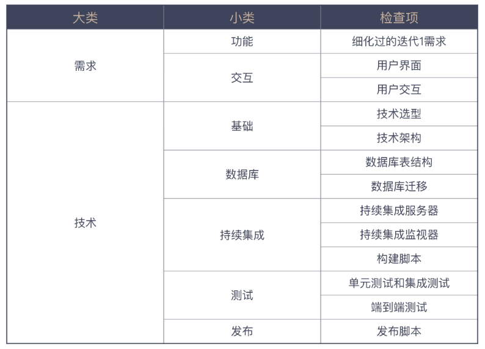
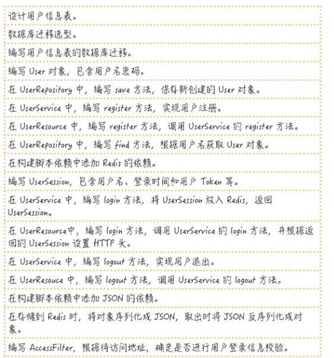
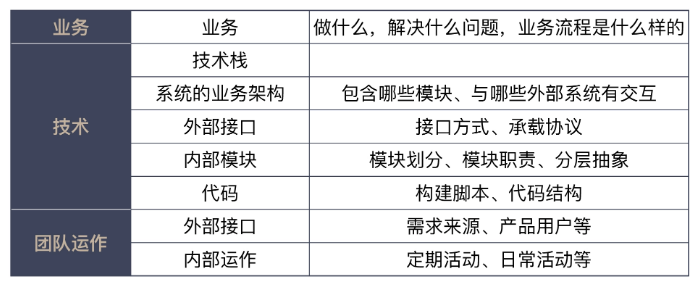

# 一、10X工作法

当一个产品经理给我交代一个要开发的功能特性时，我通常会问他这样一些问题：
- 为什么要做这个特性，它会给用户带来怎样的价值？
- 什么样的用户会用到这个特性，他们在什么场景下使用，他们又会怎样使用它？
- 达成这个目的是否有其它手段？是不是一定要开发一个系统？
- 这个特性上线之后，怎么衡量它的有效性？

## 1、以终为始

### 1.1、什么事以终为始

人们习惯采用顺序思考的思维方式，几十万年的进化将这种思考模式刻在了我们的基因里。要成为更好的自己，我们要克服自身的不足，而这个做法很简单，那就是“以终为始”，做事倒着想，先考虑结果；

以终为始即结果导向；

以终为始的前提是，你要确保你的“终”是有价值的。对于在职场上的我们来说，我们的“终”要定位成做对用户有价值的事。这个用户可以是指我们产品的实际使用用户，也可以是日常和我们合作利益相关方（Stakeholders）

### 1.2、完成的定义

DoD（Definition of Done，完成的定义）告诉我们怎样算是完成了，尽量减少因为理解偏差造成的各种浪费，比如常见的`开发完成`，表示开发人员编写好功能代码，编写好单元测试代码，编写好集成测试代码，测试可以通过，代码通过了代码风格检查、测试覆盖率检查；

怎样让 DoD 更好地发挥作用：
- DoD 是一个清单，清单是由一个个的检查项组成的，用来检查我们的工作完成情况；
- DoD 的检查项应该是实际可检查的；
- DoD 是团队成员间彼此汇报的一种机制：当我们有了 DoD，做事只有两种状态，即“做完”和“没做完”

比如经常会有人过来，让帮忙做些事。运用 DoD 的思维，首先会问他具体要做哪些事，确认好细节（相当于定义好“检查项”），然后就知道，这个忙能帮到什么程度

DoD 是一个思维模式，是一种尽可能消除不确定性，达成共识的方式。

> 在做任何事之前，先定义完成的标准

### 1.3、验收

用户故事：用户故事是一种分析需求的方法，能将各个功能串联起来以便做场景化的思考。最重要的是它能确定验收标准，这将作为后续开发的准绳；

在做任何需求或任务之前，先定好验收标准。

### 1.4、事前推演

“最后一公里”，这个说法指的是完成一件事，在最后也是最关键的步骤；

问题解决计划：
- 先从结果的角度入手，看看最终上线要考虑哪些因素。
- 推演出一个可以一步一步执行的上线方案，用前面考虑到的因素作为衡量指标。
- 根据推演出来的上线方案，总结要做的任务

### 1.5、数字化思维

如果我们可以在一开始，就设计好测量工作有效性的指标，那么就可以更有目的性地去工作了；

"数字也是沟通的一把利器，用数字说话，避免空谈"，可以提高沟通效率；

使用数字量化，可以先从沟通开始，少用甚至不用“可能”、”应该“、“大概”等字眼，在监控系统状态的时候，也都尽量将指标量化而不是凭感觉。这样做了之后可以减少内部甚至外部沟通成本，更好的规划自己的工作，也能快速确定系统出现问题的原因

> 问一下自己，我的工作是不是可以用数字衡量。

### 1.6、迭代0

一般来说，第一个迭代周期就是迭代 1，然后是迭代 2、迭代 3，依次排列。从名字上不难发现，所谓迭代 0，就是在迭代 1 之前的一个迭代，所以可以把它理解成开发的准备阶段；

迭代0的具体内容只是基本的清单：



### 1.7、总结

行业最佳实践：
- DoD，确定好完成的定义，减少团队内部的理解不一致。
- 用户故事，细化出有价值的需求。
- 持续集成，通过尽早集成，减少改动量，降低集成的难度。
- 精益创业，减少过度开发不确定性产品带来的浪费。
- 迭代 0，在项目开始之前，做好一些基础准备。

实战指南：
- 遇到事情，倒着想。
- 在做任何事之前，先定义完成的标准。
- 在做任何需求或任务之前，先定好验收标准。
- 尽早提交代码去集成。
- 默认所有需求都不做，直到弄清楚为什么要做这件事。
- 扩大自己工作的上下文，别把自己局限在一个“程序员”的角色上。
- 在动手做一件事之前，先推演一番。
- 问一下自己，我的工作是不是可以用数字衡量。
- 设计你的迭代 0 清单，给自己的项目做体检。

## 2、任务分解

通过任务分解，一个原本复杂的问题，甚至看起来没有头绪的问题，逐渐有了一个通向答案的方向；

任务分解是一个知难行易的过程。知道怎么分解是困难的，一旦知道了，行动反而要相对来说容易一些；任务分解是做好 TDD 的关键点。只有把任务分解到可以测试的地步，才能够有针对性地写测试

将任务拆小，越小越好；任务分解的关键在于：小

### 2.1、如何分解任务

在分解过程中的顺序，按照这个完整的任务清单中的内容一项一项地做，调整最基本的标准是，按照这些任务的依赖关系以及“完整地实现一个需求”的原则

所有分解出来的任务，都是独立的。也就是说，每做完一个任务，代码都是可以提交的。只有这样，才可能做到真正意义上的小步提交

> 按照完整实现一个需求的顺序去安排分解出来的任务；

如果对于一个功能，你做过多次，很熟悉，在任务分解的时候粒度可以偏粗；如果面对的是一个全新/复杂的需求，在任务分解的时候需要做到细粒度的；

案例：以用户登录需求为例

**完整的需求列表：**
- 用户注册用户名、密码；
- 注册用户通过用户名、密码登录；
- 登录用户退出；

针对上面的需求，任务拆解之后：



如果针对一个你分解不了的任务，如何处理？很简单，先把它变成你熟悉的技术，[快速尝试](https://blog.ming.ws/posts/read/10x-develop-technique/technical-spkie/#post)，其作用就在于消除不确定性，让项目经理知道这里要用到一项全团队没有人懂的技术，需要花时间弄清楚。
- 首先，跟着官方教程走一遍；
- 确定两点：这项技术在项目中的应用场景和我们关注的点；无论是场景，还是关注点，要在前面先想清楚，其目的就是为了防止发散；
- 开发出一个验证我们想法的原型

### 2.2、需求拆分与需求管理

上面针对的是开发任务，在砍需求的时候，我们需要针对某个需求进行分解，然后按照分解的后的需求排优先级；

> 想要管理好需求，先把需求拆小；

进行开发之前先把需求理解好，也就是要做什么，然后进行需求的拆分，也就是怎么做，到这时候有些用户故事肯定会由于某些原因做不了，就砍掉，再然后对需求进行排期。所以拆分需求的过程也是梳理项目的过程；

需求拆分完成之后，就是需求管理了，其实就是确定优先级，

将事情按照重要和紧急两个维度进行划分，也就形成了四个部分：重要且紧急，重要不紧急，不重要且紧急，不重要不紧急；按照时间管理的理念，重要且紧急的事情要立即做。重要但不紧急的事情应该是我们重点投入精力的地方。紧急但不重要的事情，可以委托别人做。不重要不紧急的事情，尽量少做；

需求分解之后，最重要的是，排列需求的优先级。优先级的排列方式有很多，可以借鉴时间管理的方法，把事情按照重要和紧急的维度进行划分，得到了四个象限。要尽可能把精力放在重要的事情上，而不是把紧急的事情当成优先级排序的方式；

> 尽量做最重要的事

以最低的代价做最有价值的事情（最小可行产品（Minimum Viable Product，MVP）），当时间有限时，我们需要学会找到一条可行的路径，在完整用户体验和完整系统之间，找到一个平衡；做好产品开发，最可行的方式是采用 MVP。

### 2.3、关于目标与现状

目标是应该怎么做，现状是我们正在怎么做；如果对现状不满意，可以尝试制定一定的目标，然后对目标进行分解，分步骤进行，不需要一步到位;

## 3、沟通反馈

### 3.1、信息传达

信息的传达要经过编码和解码两个过程，无论是编码出现问题，还是解码出现问题，都会造成信息的不准确；而因为每个人经历见识的差异，造成了各自编解码器的差异。世界是同一个世界，每个人看到的却是千姿百态

> 几乎是很多程序员讲东西的通病：讲东西直奔细节

沟通反馈就是改善编码、解码以及算法的方式

改善编解码的方式：
- 编码器，让信息能输出更准确；
- 解码器，减少信号过滤，改善解码能力；
- 还有编解码算法，也就是各种来自行业的“最佳实践”，协调沟通的双方

可用做法：
- 讲话前，想好自己想说什么；如果可能，可用请别人复述一遍，至少保证在信息源上不丢失信息；
- 听完后，复述一遍；甚至可用复述多遍

### 3.2、改善会议

开会是为了解决问题，但真实情况却是开了会又没有解决多少问题，这真是一个奇特的矛盾。

开会是一种重量级的沟通；

如何改善会议：
- 减少参与讨论的人数；
- 如果你要讨论，找人面对面沟通

**关于站会：**如果站会超过 10 分钟，你的站会一定是错的，站会一般内容：
- 我昨天做了什么？为了与其他人同步进展，看事情是否在计划上。一旦偏离计划，请主动把它提出，这样，项目经理可以过问，因为这会涉及到是否要调整项目计划；
- 我今天打算做什么？同步你接下来的工作安排。如果涉及到与其他人协作，也就是告诉大家，让他们有个配合的心理准备
- 我在过程中遇到了什么问题，需要请求帮助；就是与其他人的协作，表示：我遇到不懂的问题，你们有信息的话，可以给我提供一下。

开会相关实践：
- 开会前，将说明议程、及讨论内容等前提内容并提前告知与会人员；会议过程中记录会议纪要，保证纪要可以收集全所有的笔记和行动计划。如果是关联会议，则使用上次相关的文档进行追加内容（保持事件连贯性、完整性）

### 3.3、可视化

多尝试用可视化的方式进行沟通。
- 技术雷达
- 看板，比如电子看板等

### 3.4、快速反馈

持续集成的本质：尽快得到工作反馈，即快速反馈

### 3.5、复盘

把过程还原，进行研讨与分析的方式，叫复盘

**回顾会议**

组织回顾会议，可以从几点：做得好的、做得欠佳的、问题或建议；

或者可以按照海星图的方式：分成了五大类：“继续保持、开始做、停止做、多做一些、少做一些”五类。

无论采取何种方式进行复盘，分析问题，找到根因都是重要的一环

> 定期复盘，找准问题根因，不断改善。

好的复盘需要有坦诚的文化氛围，不然有可能变成互相指责甩锅，就失去了意义；复盘是为了找出问题的所在，而不是为了责备别人

### 3.6、用户视角

走近用户，才能真实体验用户的感受

### 3.7、Fail Fast

遇到问题，最好的解决方案是尽早把问题暴露出来，越早发现问题，解决的成本就越低，不仅仅是解决问题本身的成本，更多的是对团队整体计划的影响

尽早暴露问题需要克服心理障碍

### 3.8、写文档

将零散的知识结构化，有很多种方式，但输出是非常关键的一环。

输出的过程，本质上就是把知识连接起来的过程。自己以为自己懂的东西，当你真的需要把它按照一个完整的逻辑呈现出来时，那些缺失的细节就会冒出来，而补齐这些细节，一张知识地图就逐渐成型了

如何输出：（金字塔原理）从中心论点、分论点至论据，这样一层层向下展开，从结构上看，就像金字塔一样，所以，这个方法称之为金字塔原理
- 首先，我们要确定想要表达的是什么，也就是找到中心论点；
- 然后，再确定支撑这个论点的分论点，再来就是找到支撑每个分论点的论据


## 4、自动化

学习自动化，先要知道哪些东西不要自动化，尽最大的努力不做浪费时间的事。一方面，我们要从需求上规避那些没必要做的事；另一方面，我们也从自身防止 NIH 综合症（Not Invented Here Syndrome），争取做一个懒惰的程序员；

想拥有打造良好的自动化工具，我们需要对软件设计有着充分地理解；

### 4.1、验收测试自动化

验收测试（Acceptance Testing），是确认应用是否满足设计规范的测试。验收测试是技术交付必经的环节

行为驱动开发（Behavior Driven Development，BDD）：行为驱动开发中的行为，指的是业务行为。BDD 希望促进业务人员与开发团队之间的协作，换句话说，如果你想做 BDD，就应该用业务语言进行描述，其强调使用DSL(Domain Specific Language，领域特定语言)描述用户行为，定义业务需求，是需求分析人员、开发人员与测试人员进行沟通的有效方法

当前最流行的 BDD 框架应该是 Cucumber；

想写好 BDD 的测试用例，关键点在用业务视角描述

### 4.2、微服务

别轻易使用微服务，先用分模块的方式在一个工程内，让服务先演化一段时间，等到真的觉得某个模块可以“毕业”了，再去开启微服务之旅。

## 5、实践

### 5.1、入职一家新公司快速融入

运用思考框架，问三个问题：
- Where are we?（我们现在在哪？）
- Where are we going?（我们要到哪儿去？）：能够解决日常的项目问题
- How can we get there?（我们如何到达那里？）：如何达成目标；

主要从以下三个方面入手：
- 业务：了解业务，一般可以找相关同事了解，这个业务是做什么的，解决什么样的问题，具体的业务流程是什么样子的等等；
- 技术：技术栈，接下来是系统架构，系统包含了哪些模块，与哪些外部系统有交互等等；可以从外向内了解；
    
    外部包含：
    - 这个系统对外提供哪些接口，这对应着系统提供的能力；
    - 这个系统需要集成哪些外部系统，对应着它需要哪些支持

    内部主要是要从业务入手，对应起来就是，这个系统由哪些模块组成，每个模块承担怎样的职责。如果系统已经是微服务，每个服务就应该是一个独立的模块；系统分层等，最后才是代码，比如，代码的目录结构、配置文件的位置、模块在源码上的体现

- 团队运作：比如，需求是从哪来的，产品最终会由谁使用，团队需要向谁汇报。如果有外部客户，日常沟通是怎么安排的。如果是内部的活动，一方面是定期的活动，比如，站会、回顾会议、周会，这些不同活动的时间安排是怎样的；另一方面是团队的日常活动，比如，是否有每天的代码评审、是否有内部的分享机制等等



### 5.2、面对遗留系统

运用思考框架，问三个问题：
- Where are we?（我们现在在哪？）
- Where are we going?（我们要到哪儿去？）：能够解决日常的项目问题
- How can we get there?（我们如何到达那里？）：如何达成目标；

相应的对应上面三步走：
- 分清现象与根因：需要找到遗留系统和烂代码的根源，因为遗留系统和烂代码只是现象，不是根源；比如代码耦合严重、架构存在问题；
- 确定方案：如果分析好了遗留系统存在问题的根因，先尝试重构你的代码，尽可能在已有代码上做小步调整，不要走到大规模改造的路上，因为重构的成本是最低的；
- 如何做：如果是重构或者重写之后，如何保证跟之前的功能是一样的，唯一靠谱的做法是依赖测试；如果没有测试，最好是先补上测试；
- 如何替换遗留系统：分成小块，逐步替换；比如可以有两套系统，在前面的流量入口做控制，逐步把流量从老系统转到新系统上去；如果只是代码层面上，根据参数将流程转到不同的代码上去，然后，根据开发的进展，逐步减少对老代码的调用，一直到完全不依赖于老代码；
- 如何不走老路：构建好领域模型，并寻找行业中关于系统构建的最新理解

> 改造遗留系统，一个关键点就是，不要回到老路上

### 5.3、如何保持竞争力

我们的焦虑来自于对未来的不确定性，而这种不确定性是一个特定时代加上特定行业的产物。

成为 T 型人，简言之，一专多能，有了“一专”，“多能”才是有意义的，否则，就是低水平重复，而这正是很多人职业生涯不见起色的真正原因；这里的“专”不是熟练，而是深入；

很多人的焦虑就源自目标太低，找不到前进的动力。给自己定下一个可以长期努力的目标，走在职业的道路上才不致于很快丧失动力；

怎么才能让自己的水平不断提高呢？一个好问题去解决，解决了一个好的问题能够让你的水平快速得到提升，什么是好问题？就是比你当前能力略高一点的问题；

当你成为了一个行业级别的专家，就可以在这条路上一直走下去，而不必担心自己是不是拼得过年轻人了，因为你也在一直前进！

> 在学习区工作和成长，不要躺在舒适区；

### 5.4、如何推行新技术

最好的办法是，找到愿意和你一起改变的人，做一件具体的事，比如找一个愿意改变的团队试点；

讲道理很容易，但也难以让人真正的信服。同样，做事很难，但成果摆在那里，让人不得不信服。

# 二、如何判断自己的业务是否靠谱

- [判断业务是否靠谱](https://time.geekbang.org/column/article/545373)

- 选择靠谱的业务。跳槽或者内部换新业务的时候，选择那个更靠谱的，可以长期拿钱且后续能发生行业溢价的业务，往往才是最关键的。选择靠谱的业务，能让自己事半功倍，趋吉避凶，起码裁员的时候不会是第一批。
- 提升做事的正确性。即便选择了靠谱的业务或赛道，也并不代表你所处的公司或者团队一定能成功，还有一种失败是解决方案本来就是错的。怎么做，也是“靠谱”的一部分。
- 多一些重来的机会。假设在实际的工作当中，你领到了一个很难完成的任务，短时间内你把能想到且行之有效的方案都尝试了，即使失败了，我相信你的老板也会理解你；

## 1、方向：为什么要有这个业务？

判断业务是否靠谱的第一个点：为什么要有这个业务。

公司的业务大致可分为两类：一类是**外部业务**，可分为 C 端和 B 端或者 G 端（政府）三类，一类是**内部业务**，大致为中台业务（增长 / 数据 / 商业）、研究业务（AI Lab）或者支撑业务（运维 / 市场 / 财务 /HR）等。前者目标为拓展市场和获取收益，后者是优化内部协同效率或者支撑业务发展；

如何判断这两类业务的靠谱性呢？判断一个外部业务立项是否靠谱的办法是赛道法，而判断内部业务立项是否靠谱的办法是换位法；

### 1.1、外部业务：赛道法

公司的赛道结构大致可以分为三类，不同赛道分配的资源权重也不一样，一种是主赛道及其衍生赛道业务，一种是次赛道业务，还有一种是尝试性赛道：
- 主赛道代表了公司不容有失的业务，属于公司的生命线。因此主赛道投入的资源是最多的，且往往不是一个团队在负责，而是多个团队在相互竞争；
- 次赛道则代表了公司认可其业务价值，但还需要长期投入才可以成为公司新的现金流或者流量池的业务；
- 尝试性赛道则代表了公司看到了市场机会，但是又看不太懂，或者，这不是公司擅长的业务方向。为了避免错失机会，往往会小成本投入或者投资跟进，如果一段时间内没有看到有放大的机会或者这个领域也没有风口，则会放弃；

用**赛道法**去判断跳槽的机会，简单理解就是我要去的这个业务或者部门与所在公司的主赛道及其延伸是否挂钩，核心在于只有主赛道业务才会有公司长期的投入和宽广的市场空间，前者代表了项目相对稳定有较充足的时间去尝试，后者代表了行业溢价空间；

大致步骤：
- 首先我们要判断这家公司的主赛道是什么，主赛道代表了这家公司的用户从哪里来或者收入从哪里来；
- 你可以选择的业务，在主赛道上吗？或者说，它们和主赛道强关联吗？

**总结：** 
- 在选择一个新业务的时候，要优先看这个业务与该公司赛道结构的关系，一定要优先规避边缘赛道；
- 进一步做决策的时候则尽可能要考虑主赛道与自己的能力项是否契合，如果同时有两个主赛道相关的业务让你选择，就可以进一步看工作的外溢性，也就是说，下次换工作的时候哪个岗位对你帮助更大，如果自己处于一个头部公司的核心赛道以及核心业务逻辑，且自己的能力项又很契合业务，那么下一次换公司的溢价空间则极大；

如果跳槽时没有可选择的业务或者不是在主赛道上的业务，也可以在这个业务上做出一定的亮点，可以提升自己的能力和心态；

### 1.2、内部业务：换位法

外部业务看市场空间，内部业务则看内部需求。一个业务可能没有外部价值，但是有着极高的内部价值。如何判断一个业务是否具备较高的内部价值，或者如何让其发挥更高的内部价值呢？建议是用换位法辅助判断；

简单理解，就是变身为另外一个角色，换位思考。想一想：
- **核心价值**：你所在业务的核心价值是什么？
- **判断标准**：判断你做得好坏的标准是什么？
- **协同价值**：最后，它对其他协同业务的价值又是什么？

以这样的方式，抽身换一个角度来审视业务，通过不同的视角得出的不同结论，对业务方向做一个复盘；

换位角色可以从两方面去延展：
- 一个是纵轴，换位到你的上级，并不断往上直到最高层，从你的直接主管，到负责业务的总监，再到总经理乃至更高；
- 一个是横轴，遍历你周边的协同方，切换到和你协同最密切的三个负责人

你的上级、协同方的需求并不一定都要满足，而是要寻找你的上级和周边协同方，对于你所负责业务价值的共同判断是什么，这个叫“最大公约数”。如果所有人对于你这一块业务都有一个共同的需求，那么这个“最大公约数”一定要优先去满足，这样可以确保你还有内部需求，起码业务不会挂。需要警惕的是，如果你跟你的上级以及周边协同方对于业务的价值判断并不一致，没有这个“最大公约数”，那么肯定是你的业务判断出了问题

## 2、价值：是否创造了极大的商业价值？

判断业务是否靠谱的第二个点：是否创造了极大的商业价值。

如何判断解决方案靠谱，核心还是其是否产生了足够的商业价值。

## 3、验证：怎么找到快速试错的办法？

如果是一个新的业务，无论方向和商业价值在纸张上推论得如何完美，都要到实践中接受市场的检验，通俗点说“是骡子是马，拉出来溜溜”，项目的快速试错则非常关键，迭代速度越高成功的几率越大；

互联网公司试错一个新项目的时候，常采用 MVP 模式（即最小化可实行产品，Minimum Viable Product），简单来说，就是在做一个新产品的时候，不要一下子做一个尽善尽美的产品，而是先花费最小的代价做一个可用的产品原型，去验证这个产品是否有价值、是否可行，再通过迭代来完善细节；MVP 的核心是简化一切非必要因素，最小化成本去验证方案的可行性；

好的 MVP 方案具备三个特征：低成本、验证方案的核心价值以及快速提供反馈。

# 三、如何规避方法论的过度影响

- [如何在实际工作中规避方法论的过度影响](https://time.geekbang.org/column/article/568615)

- 理解世界对方法论的执念：方法论是人类更深层理解世界的手段，是人类持续进步的阶梯，尤其站在公司角度，方法论是提升企业经营效率的工具，也是筛选人才的标准。因此方法论的存在是有其合理性的；
- 学会规避方法论的陷阱：了解方法论的局限性，了解其在什么场景和什么环节是不适用的，进而学习几个常用的工作方法，来尽量规避方法论的过度影响。

## 1、大厂为何迷信方法论

- 方法论重复利用，可以提升企业的经营效率；
- 为项目的成功归因，论证成功不是偶然；
- 支持人才的筛选，为企业激励提供证明。

### 1.1、方法论重复利用

当公司问你“有没有形成自己的方法论”，站在企业的角度思考，就是想要找你索要银弹，何为银弹？即具有极端有效性的解决方案，是杀手锏、大招的代称；

公司找你索要方法论，其实想表达的内容是：你干得还不错，是有什么样的方法导致的？能不能总结出来让其他的员工也这么干？所以，公司都要求员工在做好个人工作之余还要多多思考、积极产出方法总结，本质就是追求对“员工”这项资源最大化的、重复性的利用

### 1.2、成功的归因

大厂迷信方法论的第二个原因：需要给成功找到一个解释，而解释需要跟自己相关；

一个一定程度上可归因的方法论，是一个你好我好大家好的结果，既体现了业务有章法，又可以体现个人的价值，既体现了团队有思考，又证明了公司有总结。公司愿意买单，媒体愿意倾听，个人也有收益；

总不能一块业务做起来之后，老板问你是为啥，你跟老板说运气吧？虽然很有可能这就是真相，但是这个结果对所有人都不利；

### 1.3、有人才的筛选

团队管理最基础的原则：团队需要划分梯队，确保每一个人既有空间又有容错。

通常可以把团队人才分类四类：
- 这个事情交给他 / 她，有没有结果；
- 这个事情除了结果以外，有没有业务亮点；
- 这个事情除了亮点以外，是否有业务的前瞻判断，基于判断做了提前准备；
- 这个人有没有办法在无授权的情况下凝聚一波人为一个目标去努力；

方法论就可以成为筛选人才的一个漏斗；因为选拔人才不能够只看业务结果的好坏，有些业务容易做，有些业务有时机。因此需要找到个人因素在其中起到的作用力，不管是个人的能力、判断还是影响力

## 2、方法论的陷阱

上述方法论逻辑非常自洽，但是在实际工作中，会碰到很多过度重视方法论所带来的问题。
- 无法复用：方法论一看就会，一做就废，达不到想要的业务效果，强行套用反而让业务停滞不前；
- 错误归因：明明是大环境底层的影响，结果非要总结出个一二三，反过来要拿一二三去做业务；
- 空余概念：概念大于实际，很多时候因为对概念的执着影响了实际业务，忽略了常识；

## 3、如何规避方法论的错误影响

### 3.1、不要纠结方法，应该大胆尝试

长期以来，人类认识世界并理解世界的方法论有两种。哲学家休谟用一把叉子，把这两种方法论一分为二，分别为理性知识和经验知识：
- 叉子的一边是理性知识，它们不需要经验的验证。比如数学，欧几里得的几何原理，通过几个简明易懂的公式从而构建数学殿堂的根基，数学的知识不需要做实验来验证，只需要理性思考就能够获得，而理性主义的思考方法就是演绎法，简单来说就是推导；
- 叉子另一边，是经验知识，这些知识单靠理性是得不到的，或者说，这部分知识单纯靠理性去想，反而不可靠。经验主义的观点立足于自然，我们会通过自己的观察来理解世界：通过观察自然界中许多个个别现象，总结出普遍的规律，这个就是归纳法；

但是这两个方法论体系都有其自身的问题：
- 理性知识的问题是需要一个确定性的因果前提，但实际上我们很难判断真正的因果关系是什么。我们经常只是给两件在时间和空间上挨得很近，一前一后发生的事情套上了因果关系，从而进行推导；
- 经验主义的问题是知识底座并不牢固，通过归纳所获得的知识都是不可靠的，不是必然的，也不是普遍的。比如小说三体里面的火鸡悖论；

既然理性知识和经验知识都可能靠不住，那么能依靠的是什么呢？答案：`实用主义`。不需要去纠结发现的方案是否就是最好的，就是真理，因为我们无从判断。**对于我们来说，能够指导我们往前走一步的理论，都可以认为是真理。而无法让我们前进的理论，都可以认为是谬误。**

> 行动准则就是遇到问题解决问题，不要太纠结所谓的终极真理

对于明确的事情，能够 A/B 的事情就不要讨论，即方向明确的问题可以用 A/B；那方向不明确的，当一个问题讨论不清楚的时候，我倾向于先丢一个最简方案看看效果，通过反馈迭代下一步的重点。因为数据总能够反馈你认知以外的东西，从而帮助你找到更优的方案

> 可以 A/B 的就不讨论，想不清楚的就先动手最快获取反馈信息，一定要避免原地踏步、贻误时机

### 3.2、不要放大自我，应该抽离审视

很多成功的方法论来自过往的经验总结：想当年我做成了某某业务，用了某某方法，现在我们的业务跟之前做的很类似，那么我们就应该用某某方法；

这里判断成功有一个很有意思的现象：归因标尺发生了变化；

在实际业务中常用的“底层环境法”，以及在换业务的时候常用的“平替换位法”
- **底层环境法**：我们在面对一个同类型业务的时候，总会不自觉地套用过往的方法论，从而快速找到切入点。但是，这个思路成立必须具备一个前提：**原有方法论成立的底层环境与当前是一致的**；
- **平替换位法**：当我们换一个新业务的时候，要降低对自己能力的预判，反过来思考：如果一个你认为相对平庸的人放到那个位置上，是否也可以取得一定的成功？如果这个人也可以取得成功，那么说明自己成功的几率也相对较大。我们在换业务的时候，就可以用这个方法避免自己踩坑；

### 3.3、不要执着概念，应该回归常识

人的思想是很容易被污染的，当你对一件事做判断的时候，你需要了解背景和事实。了解之后你需要的不是睿智，而是面对事实时是否还有勇气用理性、用常识来判断。常识是显而易见、容易理解的，但各种因为成长、学习形成的偏见和个人利益的诉求蒙蔽了我们

> 当面对一个复杂问题的时候，要了解清楚背景和事实之后，换位用户角度，用常识进行判断。

# 四、非共识能力

- [如何用开放的心态来挖掘非共识机会](https://time.geekbang.org/column/article/576925)

非共识，是指与已知的科学知识不相吻合的创意和设想，还得不到业界和同行的普遍认同。这类创新往往与权威论断不一致，又因创新性太强而实现难度大、风险高，容易被贴上“离经叛道”的标签，从而很难得到支持；

## 1、非共识的机会是如何产生的

- 资深行业从业者对市场的理解再创造；
- 行业外的人的用新方式对原有行业进行重塑；
- 偶尔的灵光闪现；

> 专业领域的持续积累，多领域的综合知识以及敏锐的生活观察能力；

## 2、好奇心是非共识的契机

不管是知识的持续积累还是敏锐的生活观察能力，都要求你有足够多的好奇心。如果你对于任何事都没有好奇心，那么永远不可能对新事物有探索的想法，也就不会产生任何新的机会；

### 2.1、新事物是靠“空下来”发现的

所以保持好奇心的第一个点就是让自己空下来，有一段属于自己的时间。

如果觉得自己很忙，可以有两个办法可以帮你把时间给挤出来：一个是时间错位，另一个是会议复利；让自己的工作更有效率，从而节约出更多的时间；
- 时间错位的方法，简单来说，就是当大多数人在忙碌的时候，你应该在休息，当所有人在休息的时候，你应该在忙碌，从而创造更多独处的时间，避免自己的时间跟着其他人的节奏走；比如：大多数互联网公司的上班时间是 10 点左右，晚上的下班时间差不多 9 点或者 10 点之后，那你有没有办法尝试 7 点上班、晚上 6 点下班呢？

### 2.2、如果一切都有意义，那就是没有意义

影响好奇心建立的另外一个点，就是所谓的意义感。追求意义感会有一个隐性的影响：任何时间尽可能希望其有价值，不能让它被浪费了；

很多灵感和好的想法是来自生活的点点滴滴，来自过往兴趣爱好，也来自发呆，有更多生活的爱好才有更多创造性的灵感产生。如果被工作填充了所有，被意义填充了一切，那么人生的一切将没有意义；

## 3、知识是机会的试金石

如果说好奇心是发现非共识机会的基石和契机，那么知识的持续积累则是非共识机会的催化剂和试金石；

- 催化剂是指，只有大量的知识累积才可以把一个灵光一现的想法和点子，转化成一个可落地的方案，找到可使用的场景，从而形成新的机会。
- 试金石是指，只有大量的知识积累才可以判断提出来的想法和点子，到底只是“非共识”的想法，还是有更多成为“机会”的可能性

因此我们一方面需要在自己擅长的业务领域方向有长足的积累，构建起足够的知识纵深；另一方面要快速学习新领域的知识内容，成为多学科领域的“游牧民族”
- 自己擅长的专业领域，使用人肉图谱；
- 多领域知识的快速学习，使用费曼学习

### 3.1、专业领域：人肉图谱

要想在某一专业领域有足够的知识纵深，一方面需要自己下场实践，去真实的市场环境上感知行业的变化，另一方面需要其他知识信息的补充，以便从全局了解自己所处领域的发展情况。

如何建立人肉图谱？把所处的业务进行拆解，基于关键业务环节 + 重点公司，构建一张鸟瞰式的图谱网格，逐步与这些岗位的人建立朋友关系，来保障信息的获取；

如何找到关键公司和关键岗位上的人？尝试着先从一两个身边的人着手，不断扩充自己的行业深度理解，积累越多，你对行业的理解也就越深，也就可以提供更多的信息价值，然后才能慢慢延伸扩展至更多，这个是需要时间的；

### 3.2、多领域知识：费曼学习

费曼学习的核心理念是：你是否真正掌握一个知识的关键点在于，看你能否用直白浅显的语言把复杂深奥的问题和知识讲清楚；

整个学习法大致可以分为四个关键环节：分别是确定学习内容、尝试给别人讲明白，遇到问题想办法搞清楚，通过类比的方式简化内容，从而让不懂这个领域的人也听得懂你想说的东西；
- 第一步：选择要学习的方向，或者说提出你想要学习的问题；
- 第二步：设想你需要把这个知识传递，要把这个知识点教给一个不懂的人；你先要对问题进行拆解并分析，最好的方式就是自己完整的把内容写下来，然后讲解给这一方面毫无经验知识的人，让他听懂，中间也尝试把自己的解释记录下来，便于回溯修改；
- 第三步：每一个听众都会给你反馈，当你觉得不明白时，再返回去了解；
- 第四步：进一步简单化，用上比喻，尽量用简单通俗的语言重新表述；

# 五、终局思维

终局思维，也就是时间是一切事物发展最大的变量，在面对选择时，从终点出发考虑问题，来决定你当下的选择。因为当我们思考任何一个业务机会点或者看到行业热点机会的时候，如果带上了时间这个要素再去判断，可能得出的结论会和过往大相径庭。

它是一种倒序思考模式，每一次的判断和决策都带入时间和环境的考量因素，随着变化而不断调整策略。它可以让你对市场和业务有更深层的思考，判断哪些业务是短期套利机会，哪些业务是长期复利机会

# 六、如何在一周内快速的了解一个行业

- [如何在一周内快速了解一个行业](https://time.geekbang.org/column/article/597880)

是一个常被人所忽视的关键性技能点，核心原因有两点：
- 缺乏使用场景：
- 学习难度较高，一份好的行业分析报告需要满足三个条件：
  - 能把行业说清楚。解释行业的发展规律、盈利模式以及影响行业发展的关键因素（包含数据）；
  - 能把公司说清楚。分析企业在这个行业的生存情况以及核心竞争力（包含数据）；
  - 有独特的见解以及相应的策略。通过切入点分析发现企业面临的问题，从而提出相应的解决方案；

## 1、了解行业的价值

主要作用：
- 首先，构建行业认知；把目光放高，看上下游的机会，一些思考不见得可以给工作带来太多的价值，但是可以让人抬头看到星辰大海，构建起一个更宏观的行业认知，也可以更清晰地认知自己当前岗位的现状
- 其次，越上两级思考；越一级思考是向上管理，越两级思考是顶层对齐，前者可以让你获得更为轻松的工作环境和信任度，后者才可以让你的长期发展更有空间；常常需要从当前业务和周边信息去反推验证，而掌握行业分析的全视角能力，会让你更容易理解老板们的想法和原因；
- 最后，了解行业化的方向

如何了解行业，按如下步骤

### 1.1、准备：大规模获取信息

第一步，建立对这个行业的基准认知和概况了解；常用的方式是读行业研报以及行业分析文档。前者一般要看 20 份左右，后者一般是把几个关键信息源的关键词内容全部检索一遍

**行业研报**：一般来自券商分析师或者行业报告。前者比较有名的是天风证券、浙商证券、东吴证券等，后者来源则非常杂，有些来自数据分析平台，有些来自头部领先公司；行业研报一般是券商写给各大投资机构的内容，这类内容大多为付费内容，所以这里介绍几个性价比高的研报网站：[发现报告](https://www.fxbaogao.com/)、[财联社](https://www.cls.cn/vip?column=20021)以及[萝卜投研](https://robo.datayes.com/v2/selection)。

另外获取渠道比如Google搜索，一般搜索可以使用：xxxx PDF的模式，比如想知道社区团购，可以按照：`社区团队 PDF`

**行业信息文档**：
- 行业数据平台：[QuestionMobile](https://www.questmobile.com.cn/)；
- 商业资讯媒体：比如虎嗅、极客公园、36kr、深网腾讯新闻，还有公众号：`晚点`，`饭统戴老板`、`锦缎`等，还有一个付费媒体财新;
- 个人自媒体有`笔下求生`、`Less or More`、`张小珺`、`二爷鉴书`、`乱翻书`、`Caoz 的梦呓`、`王信文`

### 1.2、结构：行业运转逻辑

在看上述资料的时候，当然还要学会做关键信息摘要。不然很可能看了大量内容后什么信息都记不住，回头详细梳理的时候又要重新再翻一遍，那什么内容值得摘要呢？

用问题来圈定摘要的内容：
```
行业的商业模式是什么的？
行业的存在原因：提供了什么价值或者具备什么样的潜力空间？
行业从源头到终点都有哪些环节？
每个环节的价值是什么样的？
每个环节的领头羊公司分别是谁？
为什么他们可以占据领头羊的位置？
整个行业的规模有多少，具体推算的逻辑是怎么样的？
行业是否有被其他行业所颠覆的可能性？
进一步增长的动力来自哪里？
这个行业的法律监管情况如何？
```
确保看完资料后每个问题都得到有效的答案

### 1.3、深入：费曼学习法

确定的学习内容就是用最短的时间、最简单的话介绍清楚一个行业。在这个过程中，你可以反复讲给很多同学听，遇到问题，再反复查找资料、完善自己的表达，甚至可以用类比的方式，通过熟悉事物的比喻，拉近听众和这个陌生行业的距离

### 1.4、验证：访谈行业专家

通过行业的专家帮我们判断自己对于行业的理解是否正确；

可以通过一些周边的朋友或者付费咨询的平台，找到行业结构中的专家去聊，而聊的基础是对行业有一定的了解，获取过大量信息、建立起自己对行业运转逻辑和结构的认知和理解，不然不仅聊不出东西，还会浪费对方的时间。带着问题去聊，才有更深入的探讨点

# 七、做汇报

- [对上汇报方案什么样的结构最有效](https://time.geekbang.org/column/article/598766)

好的汇报材料可以让你取得事半功倍的效果，把团队的业务工作、业绩成果以及后续优化的方向做一个清晰的结构性陈述;

3个问题：
- 为什么很多时候大家写不好一份汇报材料？
- 一份好的汇报材料具体要怎么写？
- 在具体的对上汇报中，还要注意哪些东西？

## 1、写不好：汇报材料的视角差异

大部分人写材料，属于**过程性思维**，巴不得把所有事情都事无巨细地同步给老板：我做了这么多，就要给你全部事无巨细地说出来，避免漏掉任何的细节。而且内容会大量聚焦在过程性细节内容点上，没有目标也缺少结果。属于典型的**供给侧视角**；

汇报材料写得好的人，属于**结论性思维**，永远会换位到老板的视角，把当前业务上最关键的信息和结论按照老板的理解、思路去阐述，属于典型的**需求侧视角**；这种方案的好处就是可以在最短的时间内，让老板知道你想说什么以及你要干什么，同时他需要给予你什么样的支持以及为什么。大量的业务细节会散落在各个业务模块，需要的时候会提到，不需要的时候就略过；

大量写不好汇报材料的同学，就是没有切换视角。需求视角是基于受众人群和参会目标反推要写的内容，供给视角则是陈列做过的事情

## 2、怎么写：好材料的关键要素

一份好的材料一定要具备这样几个关键要素：
- 逻辑，不同内容选择不同的叙事逻辑；
- 风格，内容的叙事方式贴近决策人的思路；
- 简化，五分钟可以让人了解全文想说的信息和判断；
- 问题，用可能提问的问题来检验内容的合理性。

### 2.1、合适的叙事逻辑

不同业务的叙事逻辑并不一致，汇报一个材料的场景大概可分为三类：
- **新项目**探讨或者立项，需取得共识和支持；
- **日常业务**进展推进，需同步现状、问题以及进展；
- **重要问题**同步以及判断，需对齐接下来的处理方式；

**新项目的叙事逻辑是依靠故事驱动**，换句话说，做这个新项目的想象空间是什么？

新项目立项，大致可能有以下想象空间：要么能赚取较多的收入；要么跟现有的业务产生非常大的协同；要么就是紧贴公司调整的大方向；

总的来说，一定详细凸显新项目立项后对于公司的价值，产生足够的想象力，吸引大家支持。此外，为了保障故事逻辑严谨合理，还需要回答这么几个分支问题：
- 为什么是你们团队来做这个事情？
- 你们做这个事情有什么优势或者禀赋？
- 你们需要获得什么样的支持来做这个第一阶段？
- 第一阶段成立的标准是什么？

**日常业务的叙事逻辑是依靠变化驱动**，简单来说，这个周期对比前一个周期，什么地方发生了变化？

不同的维度得出来的视角分析也并不一致，多视角的拆解和分析可以看到的信息面也会更加完善。因此，在这类业务推进汇报的过程中，拆解的维度越多，归因的因素越关键，结果越理想。

**重要问题的叙事逻辑是依靠影响驱动**，简单来说，这个事情如果出现，会有什么样的后果以及影响？

在这类汇报上，最重要的叙事逻辑是要把问题的背景和可能产生的影响说清楚，当然，这个只是信息层面要做到的事情，同时你也要给予老板们选择的空间：这个信息下我们要做哪些决策？我们有哪些决策点可以做？分别的优劣势是如何处理的？

### 2.2、内容的语言风格

很多领导喜欢的人是跟自己性格和业务能力相类似的人。在汇报的过程中，如果这个人的汇报思路贴近汇报对象，则容易获得更多的理解和忍耐；

- 跟一个产品背景的老板汇报，你的材料如果非常有条理，数据有论证，逻辑缜密，则是一个加分项；
- 跟一个销售型出身的老板汇报，你的材料如果通俗易懂且关键信息和结论先行，大概率这次汇报不会差；
- 跟一个战略出身的老板汇报，你的材料内容如果有详细的行业格局判断，很多新的思路和点子，则会收获较多的共鸣；

### 2.3、五分钟内讲述关键内容

在最开始表述清楚全文的关键内容，尽可能做到这个内容看完之后，与会人员可以做出判断：是否有必要继续听下去；

同时，不要写大量专业性词汇或者刻意雕琢文本内容，尽可能换位到小白的角度，尽量说人话、说大白话，尽可能降低所有人的理解成本。一个小技巧，如果部门新来的实习生也可以看懂，那就相当不错了；

### 2.4、用问题来检验材料合理性

一份好的汇报材料最终的评判标准则是：要么与会人员看完材料基本上可以解答所有的问题，要么就是给你提的问题，基本上都可以从汇报内容里得到很好的回复；

换位提问题，一种是换位到大老板身上，把问题问深，一种是换位到业务协同部门，把问题问相关；

比如汇报新项目，判断这个市场空间比较大，在这种关键数据维度则会受到很大的挑战，一般这种情况会问这么几个问题：
- 你的数据哪里来的？来源的准确性如何保障？
- 有没有做交叉验证？交叉验证的方式是怎么样的？
- 如果是推算的，你的推算逻辑是怎么样的？如何保障数据的准确性？

判断一个问题比较重要，需要花大力气去解决的时候，也会面临类似的发问：
- 这个问题如果不解决会是怎么样的？
- 如果不解决，这个结果我们是否可以承担？
- 友商对于这个事情是怎么判断的？
- 还没有其他的方案可以更低成本解决？
- 如果你说没有，你到底尝试过几次？

## 3、怎么说：汇报的过程中还要注意什么？

### 3.1、重要项目会前开始说服

如果某一个项目极其重要，容不得一点点失误，建议提前和你可以约上的与会人员单独过一遍内容，从而确保他们的问题可以提前处理和解决。同时，必要的时候争取盟友，让他们在会上给予支持和帮助，这样也可以确保项目通过；

### 3.2、压力挑战不要有情绪

任何一个汇报，与会人员都有三种态度：支持、反对以及沉默。这里最需要关注的是关键决策人对汇报的反对意见，而反对的情况也可以分为三类：强烈反对、理性反对以及条件反对。
- 理性反对是指关键人对于这个事情有比较大的疑虑。要么是事情本身是否成立，要么是实现方案有质疑，要么就是前面的汇报过程出现了问题，导致对整篇内容不信任，这种情况需要避免紧张，要么会上通过数据和逻辑再次说服，要么下次再准备；
- 条件反对则是需要满足什么样的条件这个事情才可以做，提出这种问题大多数是在资源以及风险上的要求，反对感是较弱的，不用过于担心；
- 最大的问题是强烈反对，碰到这种情况的话，建议尽早结束这个会议，结束后摸清楚背后的核心原因，只有摸底清楚之后，才可以准备下一次；

一旦被反对，一定不要有情绪，也不要害怕。只要你的目标是好好干活，就可以会后去找你的老板对齐下一次该如何处理，同时也要注意吸取教训；

### 3.3、表述的节奏不要照本宣科

如果讲一份材料照本宣科的念，那还不如让人直接看。上台讲述的核心目标就是对齐内容和现场情绪，要重点关注听者的状态，确保你的故事线跟听众的状态保持一致。

如果听众表现出对当前的内容足够感兴趣，则可以详细讲，如果表现得不感兴趣，那么可以尝试着略过不重要的部分，直接跳到下一页去讲；如果你认为他没有听明白关键的信息，部分内容可以给予着重强调，对参会人进行内容唤醒；如果他提到了一个问题，则可以快速跳转到后面的内容对他的问题进行回应；

抓大放小：抓住重点

# 八、如何面对高挑战目标

- [如果目标是让猪上树，最好的方式是什么？](https://time.geekbang.org/column/article/599358)

如何让猪上树？什么是让猪上树，简单理解，就是企业会制定一个非常高的目标，以至于这个目标看起来非常不切实际，然后让人来完成，所以大家会把这种情况类比为让猪上树，因为常识来看猪是不可能上树的；

“让猪上树”在企业当中，既是一个业务思路问题——有没有创造性的方案可以实现让猪上树，从而实现不可能的目标？又是一个管理问题——如何让团队和员工相信这个目标是可以完成的，从而让大家向着高目标执行和努力；

- 公司为什么喜欢制定很高的目标，甚至看来不切实际（为什么让猪上树）？
- 在这种高目标下，有什么比较好的工作方式和协同策略（如何让猪上树）？
- 如何尽量规避高目标下的危害（除了让猪上树以外，能不能尽量让猴上树或者让猪拱地）？

## 1、为什么要让猪上树？

### 1.1、理解目标就是不合理的

在定目标的时候，不是探讨合理性的问题，而是探讨必要性的问题；

理解下来，就是老板们也认为高目标很多时候并不是一个合理的存在，更多的时候，高目标是一个决心的表示，是对未来市场的判断。这不是你能完成多少的问题，而是如果不完成，你的业务在市场上就没有生存机会了。可能你完成了一个合理的目标，但是输掉了整个市场。所以，很多时候高目标就是一个盲拍的结果；

### 1.2、“上树”是锻炼团队的机会

低目标只会让团队安于现状，让整个团队不思进取，但是高目标则会倒逼你进行创新、进行改变，因为原有的固定路径行不通之后，则会变通的想新的办法，很多创新就是在高目标的要求下逼出来的出路；

高目标的标准下，团队能力也会有所提升，即使完不成 100% 的目标，也可以完成 70% 或者 80%，比之前定的基础目标高得多，团队能力也得到了很大的提升。这就是“求其上者得其中”的工作心法；

所以，企业或者老板也喜欢定一些高的目标，完得成是惊喜，完不成也可以锻炼团队，就当练兵了
### 1.3、“上树”是企业增长的接力棒

任何一个公司在面对一个新的行业，制定的目标必然不会靠谱，大多数都是拍一个值或者一个市场占有率；

对于一个公司而言，不管是公司扩张的角度还是团队管理的角度，永远会追求一个较高的目标，而这个较高目标的制定逻辑并非是基于现状推算，而是要占据一个什么样的市场地位，才对自己有价值；

## 2、该如何让猪上树？

任何一个高目标、高挑战的业务，要完成“让猪上树”，办法只有三个：
- **创造性思路**：告诉猪你可以长出一双翅膀飞上去，然后猪真的给自己弄出了一个翅膀飞了上去；
- **努力奋斗型**：猪也没有办法，只能够想各种办法往树上冲，往树上拱，然后拿着绳子跟树绑在一起，代表上去了；
- **改关键目标**：猪长不出翅膀，也不愿意努力，想了一个办法把树给砍倒，让猪趴上合影，告诉老板猪成功上树；

### 2.1、创造性思路

要打破常规，放开自己的想象力，去思考一些过往被束缚的边界，找到新的增长点。当现行规则走不通时，你应该做的，是另辟蹊径打破规则，创造新的需求；

### 2.2、努力奋斗型

向老板证明：我已经想尽一切办法了，但是我上不了树，只能够接近；

老板，你让我上树的目标，我想了 ABCDEF 总共 6 种方案，我尝试了其中 ABCD 四种方案，这四种方案的效果都不如预期，分别的情况是怎么样的，然后 E 和 F 的方案我在过程中碰到了哪些问题，希望老板给予支持，看看是否有机会做到。

很多时候老板或者公司对于这类情况也是认可的。毕竟创造性的方案是少数，把自己可以想到的都尝试做一遍，已经算很不错了。这种情况属于并没有完成目标，但是通过自己的努力搞定了老板；

### 2.3、改关键目标

改关键目标是企业和团队最麻烦的情况，就是大家并没有想着去找创造性的方案或者努力去奋斗，而是想着如何讨巧地通过更改目标和口径，来完成最终的目标；

这就是典型的把树砍倒，让猪趴在树上：通过口径和方式的调整，完成了目标，但是这个对业务非常不利。

一定要规避这种情况，一旦发现这种策略就会进行处理

## 3、背后的机会与负面

高目标的要求下必然会带来很多的问题，而问题的本质就是目标与现实的差距。很多时候问题之所以产生，是因为目标定得太高，导致实际与预期产生了较大的差距，最终带来了问题

### 3.1、把握高目标下的机会

往往高挑战下和老板一起背目标、背压力，最终不管结果怎么样，只要老板信任你，还是会有更多的机会点的。毕竟工作中除了能力以外，忠诚度也非常关键。此外，因为要完成很高的目标挑战，如果你信任自己的老板和所在的组织，也可以趁机要更多的资源，来想办法解决这个问题，以此扩大你的业务地盘和空间，做着做着可能就有其他新的机会了；

### 3.2、警惕高目标下的困境

- 目标制定得过于不合理的情况
- 如果让一个新人或者新团队去处理很困难的业务，也会让整个团队瞬间丧失斗志和信心，整体崩掉只能够汰换
