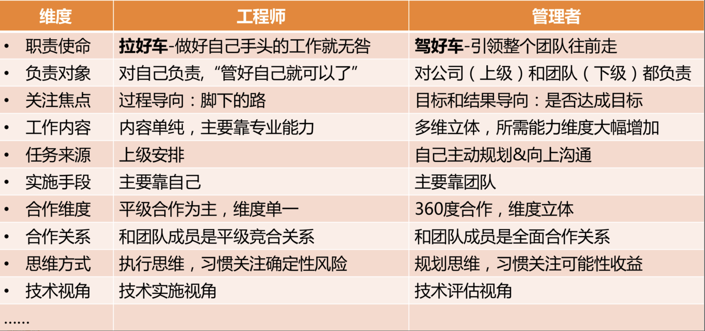
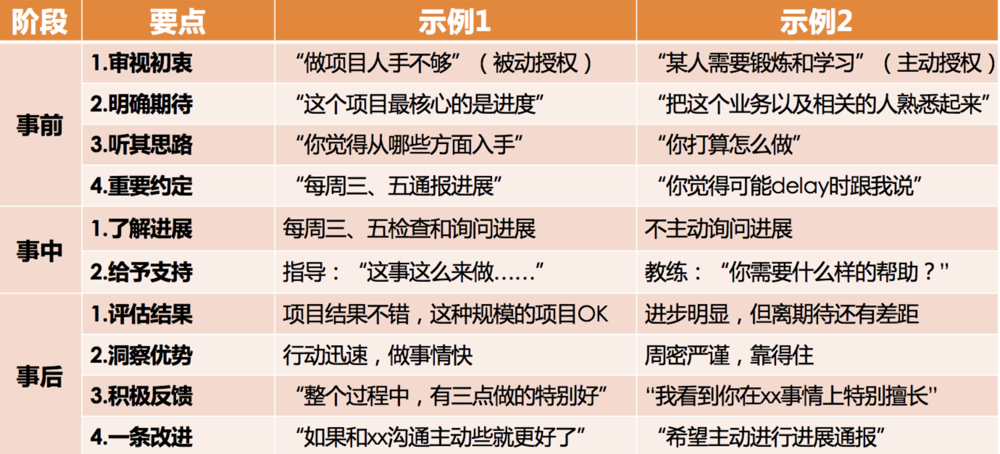
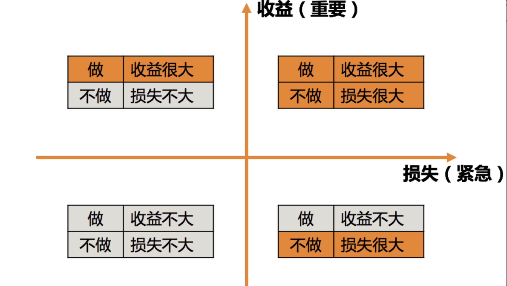
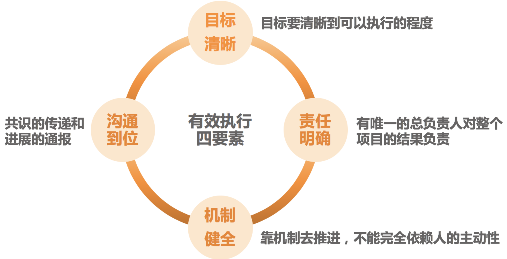
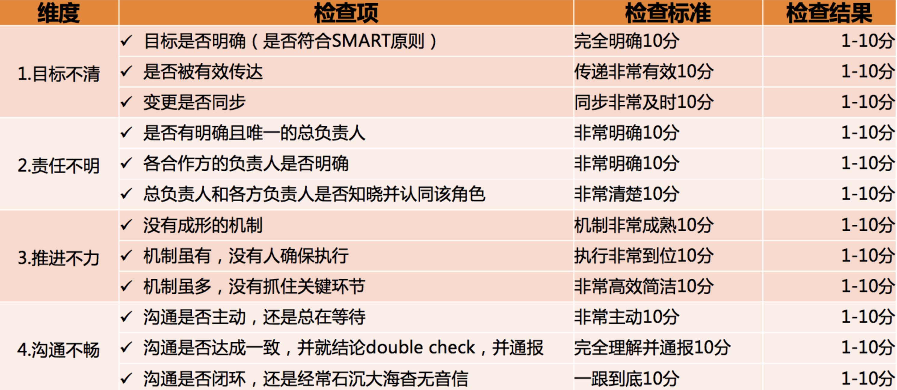

## 1、管理风格

四类领导力风格，简单概况如下：
- 指令式管理：重事不重人，关注目标和结果，喜欢发号施令但不亲力亲为。
- 支持式管理：重人不重事，希望带头冲锋亲力亲为，特别在意团队成员的感受，并替他们分担工作。
- 教练式管理：重人也重事，关注全局和方向，并在做事上给予教练式辅导和启发。
- 授权式管理：不重人也不重事，关注目标和结果，不关心过程和人员发展。

不过，不同的风格，在不同的场景下，的确会有不同的适用程度，简单列出几个场景做一些说明：
- 当一项工作不容有闪失，而你又是唯一熟悉、且最有掌控力的人时，一个命令式的你可能更能降低风险、达成目标。所以，命令式管理最适用于需要强执行的场景。
- 当一个团队特别需要凝聚力和斗志，需要攻坚的时候，一个支持式的你会促成很好的效果。所以，支持式管理特别能带团队士气和凝聚力，在带动大家热情和积极性方面很有优势。
- 当有一些核心人才需要重点培养，团队需要发展梯队的时候，一个教练式的你会带来明显的效果。他们不但能把事情做好，个人能力还能成长。虽然执行速度通常不会太快，但是不会偏离方向。
- 当团队梯队很成熟，团队成员需要发挥空间的时候，一个授权式的你能提供最恰当的管理方式。

## 2、如何面对团队里的老资格员工和高能力员工

- 你现在是团队的负责人，需要把自己从和任何团队成员的比较和竞争中抽离，把目光投向远方，去看看你将带出一个什么样的团队，以及在这个过程中，你能为公司、团队和各位团队成员带来什么样的成绩和成长
- 你要做的，不是和团队成员竞争、比较，也不是比团队每个人都强，而是要考虑如何让大家把自己的才智都发挥出来，去达成一个共同的团队目标。总之，你要做的不是管束和控制大家，而是引导和支持大家
- 当你用引导方向和支持帮助的视角去看待你和那些老资格、高能力的员工时，你会因为自己的初心而不再有猜疑和恐惧，因为只有当你真的能够为团队带来更好发展的时候，才能赢得员工发自内心的真正的信赖

## 3、管理到底都要做哪些事呢

主要做好三件事：带人、做事、看方向，当然，做好这些事都要基于良好的角色认知和管理沟通。”

## 4、管理认知角色

> 从要我做，转变为我要做。我要做的事情，需要调动团队内部和外部的资源共同完成，同时还要确保要做的事情方向要对，不能跑偏。通过团队拿结果，从而获得更大的成就

## 5、管理三步曲：管理规划

**如何开始带团队？**

弄清楚它是一个背负着什么样职责和使命的团队，决定了你需要设定什么样的工作目标，并通过哪些要素来衡量你的目标；决定了你需要什么样的人加入你的团队，以及需要多少；还决定了你选择什么样手段，投入什么样的资源来完成工作
- 职能：你是干什么的？团队是干什么的？
- 目标：你想要什么？关于团队要去哪里？
- 团队：你靠谁？依靠谁去达成目标
- 资源：你要投入什么？

所谓的管理规划，其实就是要管理者说明白一个问题，即，你想要什么目标，以及你需要投入什么资源。由于目标取决于团队的职能，而团队又是管理者的核心资源。所以，一份合格的规划报告，至少需要体现职能、目标、团队、路径这四个要素

**问题：空降管理相关问题**
- 团队中有老员工，无论是从业务、技术方面都很优秀,如何才能获取老员工的支持？
- 团队中层为项目经理，相互之间有业务交叉，但都不积极配合，如何协调其之间的关系？
- 团队成员中有关系户，手可以直触摸到老板，对于这样的成员，如何让其服从管理？
- 团队成员中的既得利益者，如何平衡他们之间的利益？

### 5.1、职能：如何界定团队是干什么的

- 公司为什么要给我这批资源（指这个团队）？是希望我产出什么？
- 这个团队存在的独特价值是什么？
- 你用什么维度来衡量团队的价值高低？

设定团队职责：
- `向上沟通`：听听上级对你团队的期待和要求，以及希望用什么维度来衡量你做得好还是不好。这个信息非常重要，团队的初始定位和基本职责，一般都是上级直接给定的；
- `向下沟通`：主要是和大家探讨对团队业务的看法和理解，以及对未来发展的期待，为以后的沟通做好铺垫；
- `左看右看`：主要是看职能定位的边界在哪里，最好和兄弟团队的职能是无缝对接的。但不要覆盖兄弟团队的职责，否则会带来各种合作上的冲突；
- `你的理解`：即，你对业务的理解，你对领域的理解，你对团队的期待，以及你对自己的期待。团队的更高职责，即，团队使命和愿景，往往来自于你的设想

### 5.2、目标：如何为团队设定合理的目标

团队目标的意义：
- 最基本的，目标包含着你和上级的诉求，即，你们希望收获的东西；
- 目标意味着资源的有效配置。明确的目标可以让你把资源投注在有效的方向上，从“该做什么”去调配资源，而不是“能干什么”；
- 目标意味着执行力：清晰的目标是高效执行的必要条件
- 目标意味着凝聚力；
- 目标也意味着激励

目标设定的原则，即`SMART`原则。分别对应着 5 个英文单词，即 `Specific`、`Measurable`、`Attainable`、`Relevant` 和 `Time-bound`，用中文来说就是目标的`明确性`、`可衡量性`、`可达性`、`相关性`和`时限性`

日常听到：`目标要明确`-可以简单地理解为，把目标设定到可以衡量的程度，就叫做明确了；下面两组目标对比：
- 第一组： 
    - a、`我们的目标是提升某个服务的性能。`这不是一个明确的可以衡量的目标。
    - b、`我们的目标是把某个服务的单机性能从 300qps 提升到 500qps。`这就是一个可以明确衡量的目标。
- 第二组：
    - a、`我们的目标是发布 BI 系统 1.0。`这看似是一个可以衡量的目标，但是 BI 系统 1.0 如何衡量是否完成了呢？又比较模糊。
    - b、`我们的目标是发布 BI 系统 1.0，支持 KPI 数据统计、全量数据导出功能。`这样就清楚 BI 系统 1.0 如何衡量了，要支持这样两项核心功能才行

当评判一个目标是否合理时：
- Specific：目标是否明确具体？
- Measurable：目标的实现是否可测？
- Attainable：目标描述是可达的吗？
- Relevant：目标和总目标是否相关？
- Time-bound：目标是否有时限限制？

目标的描述形式，大体分为两类：一类是可以量化的指标，就是大家常说的 KPI（Key Performance Indicator，关键绩效指标）；另外一类是不可量化的目标，用关键结果来衡量，就是我们常说的 KRA(Key Result Areas) 或 OKR(Objectives & Key Results)，总之就是对关键结果的一种描述
- KPI：到某时间点，什么指标达到什么数字；
- KRA/OKR：到某时间点，完成什么工作，该工作实现了哪些功能或达到了哪些效果。

### 5.3、规划

- 团队规划的第一个视角，是根据团队目标的设定去梳理团队：团队的目标，不是指团队所要完成的业务目标，而是你希望在某个时间节点到来的时候，把团队发展成什么状态，衡量的基础指标：
    - 团队的规模：也就是你团队有多少人，这其中要理清楚有多少人是现有的，有多少人是接下来要新增的，即实际人数和预算人数，加起来就是你规划的团队总规模；
    - 团队的分工：即你的团队都负责哪些业务，每个业务配置了多少人力，以及这些人员都如何分工，人力分布和业务目标是否匹配等；
    - 团队的梯队：一个团队的梯队情况代表了团队的成熟度和复原力
- 团队规划的第二个视角，是从资源角度来审视团队：作为一个管理者，在盘点自己当前人力和预算人力的时候，需要有成本意识，要考虑投入这么多资源和成本是否值得，是否合理；
- 团队规划的第三个视角，是从人才培养角度来看梯队规划

**如何提交规划报告？**

- 第一部分，绘制一张组织结构图。这张图需要体现我前面提到的团队状态三要素：
    - 规模：包括当前人数、预算人数和总人数；
    - 分工：体现团队人力都分布在哪些业务上，以及各个业务都由谁来负责；
    - 梯队：包括团队的级别和梯队分布情况；
- 第二部分，列出整个团队的资源盘点情况。大体是这样的：
    - A 级别：x 人，其中当前 m 人，预算新增 n 人；
    - B 级别：y 人，其中当前 m 人，预算新增 n 人；
    - C 级别：z 人，其中当前 m 人，预算新增 n 人；
- 第三，列出重点培养对象，以及负责业务。大体是这样的：
    - 张三，XX 业务核心工程师，到年底能完全负责 XX 业务，并能带新人

### 5.4、资源：需要申请哪些资源

**（1）你是否了解资源的丰富性？**

一般我们认为的资源主要是：人、财、物，但是其他的一些资源也不可忽视：
- 时间：很多管理者会忽略时间这个最重要的资源。对于任何一项工作，你预算多少人和你预算多少时间是分不开的；
- 信息：信息资源，是另外一个常被忽视的资源。有的时候，你需要更多的公司内外的信息，可能是业务的，也可能是人员的；你的工作如果需要特殊的信息和数据，需要提前和上级沟通，寻求必要的支持
- 权限：看看需要开通哪些之前不具备的权限，以及这些权限是否可获得。比如有的公司一线管理者是有沟通绩效权限的，而有的公司则不允许；

**（2）你是否意识到手段的多样性呢？**

通常在做一个新功能的时候，以下的做法是不同的管理者所采用过的：
- `自学自研`：由于靠自己团队的力量，资金开销比较低，维护成本也可控；而由于需要边学边做，时间成本会比较高
- `招聘专业级人才`：不确定性比较高，招聘顺利固然好，但招聘不顺则时间完全不可预期，整体上时间成本比较高
- `借调工程师`：如果能借调到合适的人，各方面的成本是最低的，但是需要这个事情足够重要才能获得支持
- `跨部门合作`：项目推进的可控性取决于合作情况，这里最大的风险就是合作成本能否控制住
- `请外包或者外部专业人士兼职做`：时间和资金成本一般都可控，用来做尝试性项目或者 demo 是比较合理的。但如果是长期的任务，你会发现外包的解决方案可维护性比较差，迁移和替换的成本会比较高
- `采购云服务`：对于中小公司来说，其实是很好的解决方案，对人才成本、维护成本、时间成本，都可以降得很低，特别适合初创公司
- `购买现成的解决方案`：时间成本很低，资金成本略高的一种方案

## 6、管理三步曲：团队建设

- 提升管理者的角色认知，让他们清楚自己作为 leader 都要做哪些工作；
- 团队融合，你希望工作坊之后，经理间有更好的互信和默契。

### 6.1、如何着手团队建设

团队建设，俗称带人、带团队

**员工个体：**
- `员工实力-能力培养`：如何培养员工的工作能力；
- `使用实力的意愿-员工激励`：提升员工的工作意愿

**员工个体之间：**
- `排兵布阵-团队分工`：分工不是简单地“谁做啥”的问题，还包括是否有相互统一的评估维度；
- `合作默契-协作水平`：团队之间的信任、默契，协作上是否高效等；

**团队整体：**
- `新老强弱-梯队建设`：盘点团队新老强弱的构成。团队工作是着眼长线的工作，我们不是只赶一段路。一个团队如果没有良好的梯队，只是靠一两个成熟的高手在支撑，那么一旦这一两个高手请假、调走或者离职，整个团队就瘫痪了；
- `归属认同-团队文化`：或者可以叫团队氛围，总之就是团队成员能够在这里找到非常好的认同感，大家也非常清楚在这个团队里，什么是重要的，什么是不重要的，什么是应该的，什么是不应该的，都不需要去一点一点交代

### 6.2、提升个人能力

提升团队战斗力的基础和前提，是提升员工的个体能力；但是个体能力是团队战斗力的基础，但是这并不意味着，当你要提升团队战斗力的时候，就必须先从这个要素下手；

**1、要提升员工的什么能力**

什么是工作能力？
- 第一种：分为知识、技能和才干三层，大部分管理者希望员工提升的能力，是在“技能”这个层次，也就是员工能操作和完成的技术，比如快速学习能力、进度控制能力；
- 第二种：是把做好一份工作的能力分为人格力量、专业能力和通用能力：
    - 人格力量通常是指一个人在面对某一情形时稳定的态度和表现，比如迎难而上、坚持不懈、积极正向、主动担当等等，注重平时积累；
    - 专业能力，对于技术人来说，一般就是指技术能力。很多公司都有技术能力衡量标准和体系，用于评估工程师的技术水平；
    - 通用能力，可以自己去定义一些你团队所重视的通用能力就好，比如沟通表达能力、团队协作能力、快速学习能力等作为重要的通用能力，并和团队达成共识；

**2、提升员工个人能力的初衷是什么**

对于一个人的评价，从来都是有双重标准的，一个标准是“及格”，另外一个标准是“优秀”：
- 所谓“及格”，就是只要胜任工作的要求就好了：对他们的期待是把交代给他们的工作做好即可，所以侧重于提升他们的专业技能，以达到专业能力的硬指标，目标是“胜任”
- 而“优秀”，除了胜任工作要求，还需要脱颖而出，超出团队普通表现，成为整个团队的核心人物：对他们的要求和期待就不只是做好本职工作那么简单了，不但对他们的专业能力要求高，还会对很多通用能力做出要求，比如目标管理、沟通协作等等，你甚至会为他们量身打造一个培养计划；

**3、如何达成上述目标**

按照`7-2-1`法则，即：`10%` 靠听课和看书自学，`20%` 靠相互交流和讨论，`70%` 靠工作实践；
- 第一类，关于帮助员工自学。对于管理者来说，常见的做法有：
    - 组织员工参加培训；
    - 为员工推荐和购买书籍；
    - 提供学习文档、视频等；
- 第二类，关于相互交流讨论。对于管理者来说，常见的做法有：
    - 组织兴趣小组、读书会等；
    - 技术分享交流会、代码评审会等；
    - 重点工作复盘，即 case study 等；
- 第三类，关于工作实践。对于管理者来说，常见的做法有：
    - 授权和辅导。给员工独立负责重要工作的机会，并给予辅导和反馈。
    - 调研工作项目化。即把调研学习的工作进行项目化管理。
    - 总结并内化。对于员工完成的重要工作，有必要请其做一个工作总结，看从中学到了什么。员工在这个总结和反思过程中的收获，甚至比总结的结果本身更重要

> 对于提升员工个人能力来说，最关键的往往不是学习的方法，而是学习的意愿

**4、应该如何激发员工学习的动力和意愿呢**

大体上可总结为如下三板斧：`推`、`拉`、`放手`：

所谓`推`，就是给压力，推着他们学：
- 提出明确的工作要求：比如，在 1 周内熟悉某个业务并可以做开发；
- 设置学习机制：也就是强制要求遵守学习规则，并完成学习任务；
- peer pressure：团队整体学习成长的氛围，会给不学习的员工带来压力；
- 惩罚：包括从绩效等级、晋升机会、调薪幅度等等，对于学习意愿低的员工有适当的“关照”

所谓`拉`，就是给方向，引导他们学：
- 树立榜样：把特别有学习意愿和成长快速的员工设为标杆人物，在团队内给予认可和奖励；
- 配备导师：有明确导师的新人和员工，更愿意请教问题并快速融入团队；*`找谁都行`，即意味着没有人对此负责*；
- 给地图：成熟的公司往往会有技术方面的“技能图”，作为管理者，你也可以为自己团队制定一个成长的“技能图”，并标记出重要等级；

所谓`放手`，就是给发挥空间，让他们自主学习：
- 给员工勇挑重担的机会。在风险可控的情况下，给员工承担责任的机会，让他们去负责一些有挑战的工作；
- 给员工自主空间，让他们独立思考，独立决策。你的辅导仅限于在他们的决策之后给出看法和建议；
- 给员工信心和耐心，允许他们犯错、走弯路。因为很多经验都是踩坑儿踩出来的，所以不能一出问题就劈头盖脸一顿批，甚至是剥夺其做事的机会；

**5、关于提升员工的能力，有两个信念特别重要：**
- 第一是相信员工能力的差异性：即看到差异，重视丰富性；创造力往往来源于差异的碰撞，所以作为管理者，你要特别关注能力的丰富性，标准不能太单一；
- 第二是相信团队能力的系统性：即欣赏差异，重视互补性；所谓完美的团队，就是价值观相同，优势互补的团队。所以，作为管理者，你要看到团队能力的系统性，不要把各个员工的能力割裂来看；

> 总结：如何提升员工的个人能力，归结起来无非就是三个步骤：
- 首先，定义你所谓的员工能力；
- 其次，设计出一些可行的方法；
- 最后，激发员工的学习动力

### 6.3、提升员工的工作意愿和积极性

**1、管理者遇到激励相关问题**
- 激励认知不系统：不清楚激励都有哪些手段，以及如何使用，各种零散的说法让人无所适从；
- 激励可用资源匮乏：实实在在的物质激励不受自己掌控，画大饼的精神激励，员工又不买账；
- 激励达不到效果：虽然激励的动作都做到位了，但是并没有收到激发员工动力的效果，或者效果不够令人满意

那么上述问题如何解决呢？

**2、关于对激励的系统认知**

关于驱动力：其发展归纳为三个阶段：驱动力 1.0、2.0 和 3.0。
- 驱动力 1.0：是指驱动力主要来源于对生存和安全的渴望；人们对这个层次的需求似乎已经默认能够保障，所以不再是关注重点，在企业员工激励中，也很少会用到；

- 驱动力 2.0：其基本哲学就是认为人们都是“寻求奖励、避免惩罚”的，所以采取的方案是“奖励好的行为、惩罚坏的行为”，也就是人们经常念叨的“胡萝卜加大棒”。效果不错，但是越用效果越差；因为无论是奖励还是惩罚，这类驱动力最大的特点是来自外部刺激。人对外部刺激的应对机制是增强免疫力；

    表扬一个员工，若遵循下面这三个原则和要素就会让你的表扬效果倍增：
    - `具体`：就是表扬的内容和原因要非常具体，让员工和团队都知道他是因为哪一两点得到了认可；比如`员工 A 非常主动及时地处理了一个线上故障`；
    - `公开`：公开表扬有两大好处，一个是被表扬的同学受到了更大的激励；另外一个更大的好处是，你其实告诉了团队每个人，什么样的行为和价值观在你们团队是被认同和倡导的；
    - `及时`：所有的期待都有时效性，表扬及时，其实就是对员工的反馈要及时。一个不及时的表扬不但会让激励效果大打折扣，而且还会让团队成员很不理解，`这么点事，至于挖坟拿出来说吗！`

- 驱动力 3.0：核心就在于自驱力，前面驱动力 2.0 的核心是外驱力（驱动力 2.0 的核心价值观是“顺从”；而驱动力 3.0 的核心价值观是“自主”）；究竟怎么激发员工的自驱力呢：
    - **第一，提升员工工作的自主性**。即，给员工一定程度的自主掌控感：
        - **工作时间和地点上的自由度**：把焦点放在对结果的评价上，而不是把焦点放在员工的作息习惯上；
        - **工作内容上的自由度**：员工可以在一定程度上选择自己的工作内容；在做季度规划的时候，也可以聊聊员工的意愿，看看能否兼顾个人兴趣和工作要求。
    - **第二，提升员工专精度，让员工持续有成长**，“专精”强调的不是要设定目标去成为某个“专家”，而是强调“自主投入”的过程，为员工创造愿意自主投入的条件，因为只有自主投入才能带来专精；
        - **明确的工作目标**：即，对员工的要求越清晰，他就越愿意投入努力；
        - **目标要略有挑战**：即，对员工的要求要有一定挑战，但又不能太高，要求太高带给员工的是焦虑；要求太低带给员工的是无聊；
        - **要能发挥其优势**：每个人都愿意做自己擅长的事情，如果某项工作能发挥员工的独特优势，必定会给他带来投入的热情；比如某些人特别爱和人沟通协调，那就让他用沟通讨论的方式去工作；如果有人特别善于独立思考和筹划，那就发挥他的思维优势；有的人行动特别迅速，那就让他去快速启动一项工作。总之，千万别简单认为发挥员工优势，就是鼓励员工“挑活”；优势是多层次的，所以让员工发挥优势这件事并不困难;
    - **第三，给予员工意义和使命**，驱动力 3.0 在不拒绝利益的同时，更强调的是工作价值的最大化，希望自己做出来的工作是有意义和价值的

**3、如何提升员工工作幸福感**

- **第一，积极正向的情绪**：你在营造什么样的团队氛围呢？
- **第二，良好的人际关系**：
- **第三，自主投入**：你为员工自主投入提供条件了吗？
- **第四，取得成就**：迎接挑战并取得成就
- **第五，意义和使命**

> 一个简单且实用的方法：即尽量避免用“任务性”的语言，而多使用“成果性”的语言。比如你安排一项工作给员工，常见的说法是：“把项目 A 抓紧做一下吧，下周要发布。”这在员工看起来，他收到了一项任务。但换成“成果性”的说法是：“项目 A 会帮我们验证一个结论，决定我们是否在这个方向上持续投入，下周就要做出决策，所以，你看下周能否搞定？”显然，成果性的说法会让员工更清楚自己工作的价值，完成之后也会很有成就感；

**4、总结**

- `第一，激励要立体`：本文介绍了非常丰富的激励要素，你需要从单一的激励维度，升级为更加立体的激励体系，从而适应新职场环境的要求。
- `第二，激励在平时`：你不能指望一些临时性刺激方案来做好激励，激励体系的搭建应在平时。当员工跟你提离职的时候，它就已经不再是一个激励问题了。
- `第三，激励要设计`：由于每个人的业务特点不同、团队性质不同、管理风格不同、员工特征不同、问题挑战不同，所以不要迷信别人给你的激励建议，我更建议你充分考虑自己面临的实际情况，结合自己的特质和激励框架，来设计适用于自己的激励体系；

### 6.4、如何团队分工

**1、为什么要分工**
- **为了实现规模化**：是为了干大事。因为干大事需要很多人，当有很多人一起做事的时候，就得有一种方式来容纳这么多的人，这个容纳方式就是分工；
- **为了实现协作**：分工是手段，协作是目的，分工和协作是不能割裂开的；
- **为了实现专精**

> 是出于规模化、协作和专精的目的来进行分工的，在做分工的时候不能忘记了这个初衷

**2、常见的分工形式有哪些？**

- **矩阵式结构**：可以这样简单地理解：员工按照角色被划分到不同的团队，每个团队都有自己的负责人。要做项目的时候，会有专门的项目经理来向各个角色的 leader 协调人力，然后把申请到的各个角色的人组织在一起去完成这个特定项目。一旦项目完成之后，人员将回归各自团队去迎接新的项目；这类组织架构的好处是各个角色团队的专业度都会很高，而且角色归属感比较强，资源调配灵活；但不足之处是项目执行起来较为低效，因为每次都要重新申请人力，而且每次的项目团队都需要重新磨合

- **BU 式结构**：也叫事业部制，是指做某项业务所有的人员和资源都统一调配，无论这个事业部是大是小，都角色齐全。这样做的好处是团队长期合作磨合充分，协作效率高，执行速度快；不足是各种角色自己都要有，资源冗余和浪费比较多。另外，由于某些角色不在业务主干上，团队规模比较小，能力要求也不高，所以其角色专业度很难提升；

**3、几个常见的误区、问题和建议原则**

- 最常见的一个分工误区，就是**分工模糊**：为了能够让大家互相补位、主动承担、增强互助，还会刻意去模糊边界；因为只有明确的分工，才能让员工清楚和认同自己的本职职责，产生归属感，并愿意主动付出多做一些；在“边界模糊”之前，要加上“分工明确”这四个字。

- 分工稳定性的问题：分工需要尽可能稳定，因为只有稳定的分工才能体现出分工的价值，比如对某项工作的专精、员工的归属感等，所以，分工能稳定的话，就最好稳定；但是管理者可以通过主动调整分工，因为你可能意识到了长期稳定的分工带来的局限和怠惰。因为分工能带来专精，同时也带来了割裂的视野，所以很多管理者会通过“轮岗”的方式来提升员工的能力和全局观；

- 虚拟组织：虚拟组织又叫虚拟团队，是为了某一个特定的目的和工作内容把大家组织到一起的

### 6.5、如何有效提升团队凝聚力

**1、如何不断提升团队的协作水平呢**，主要是从两个角度来做工作：
- 第一个角度是建立协作机制：通过机制来约定协作的动作，以此来保证大家“动作协调”；
- 第二个视角是提升团队凝聚力：通过提升团队成员间的信任度、认同度和默契度来降低协作成本，提高协作效率

团队凝聚力和协作水平是两个非常有意思的概念，他们含义不同，又紧密相关。团队凝聚力更侧重团队成员间的关系，体现他们的信任度和向心力如何；而协作水平则更关注做事过程中的互动情况；要想提升协作水平，“硬件”靠机制，而“软件”靠凝聚力。凝聚力即是团队协作的基础，又是团队协作的目标。强大的凝聚力，是战斗力强大的团队的重要特征之一

**2、如何来提升团队凝聚力呢？**

从4个角度来看问题：

- 第一个角度，设立共同愿景

    如果团队有着自己的使命，又能得到团队成员的普遍认同，大家会更容易朝着一个方向共同努力，也更容易肩并肩地一起迎接挑战，即所谓的“志同道合”。它是如此重要，下面我简要描述一下其设立步骤：
    - （1）明确你团队的职责、使命和工作目标（这里的工作目标是长远的共同目标）；
    - （2）管理者自己要笃信第 1 条的内容。如果不笃信，就返回步骤 1 继续提炼；
    - （3）在各种合适的场合宣贯这一内容，比如季度会、总结会、沟通会、启动会，以及 1 对 1 沟通等，都要不失时机、不突兀地把使命和愿景同步给大家；
    - （4）坚持不懈地做步骤 3。不要指望一蹴而就，开个会大家就都认同了的好事，现实中不会发生，只有时间长了、频次够了，才会内化，才会深深植入员工的内心；

- 第二个角度，提升员工归属

    提升员工归属感，则是为了让员工凝聚到团队上，让员工从心里就认为自己是团队的一份子
    - 要给他一个位置，给他一个“立足之地”，也就是要分给他一份职责，只有当员工清楚自己能为团队做出什么贡献的时候，才会心安，才会感受到自己是团队的一份子，即`事对`；
    - 要营造良好的团队人际关系，让彼此间形成紧密的连接，即`人对`；
    - 明确亮出团队的文化价值观，好在团队文化本身就是一个筛选器，最终留在团队发挥核心作用的都会是认同团队价值观的人，当然前提是团队先有明确的价值取向，即`味对`；

- 第三个角度，加强相互了解

    比如设计团建活动或者头脑风暴等；

- 第四个角度，共同面对挑战

    让大家在“硝烟”和“炮火”中去建立深厚的感情，这就是所谓的“事上练”

### 6.6、如何物色和培养核心人才？

梯队培养包含两部分工作：
- 选拨和物色培养对象
- 培养这些人

物色培养对象应该要满足以下两个原则：
- 第一：要保持人才选拔和团队建设的一致性，即你对核心人才的选择，需要和你团队建设的理念保持一致，应避免你一方面倡导和推崇某个理念，而在选人上又是另外一个理念
    - **能力**：主要是确保其个体能力和业务特点相互匹配，能力潜质是可成长的；
    - **协作**：其协作的意识和能力，和你团队的要求和期待是否匹配；
    - **文化**：其行为风格和价值观，和团队文化价值观是否匹配；

- 第二：和你相似的人才是人才，和你互补的人才是更宝贵的人才，强调行为风格和思维方式的多样性

如何培养呢？下面三件事情

**1、对齐期待，达成共识。常用方式是 IDP，即个人发展计划**

可以把绩效计划和 IDP 合二为一：其前半部分是关于绩效的约定，比重在 80% 左右，换句话说，培养人才也是要以做出绩效为依托，而不只是为了培养而培养；后半部分是关于成长的约定，比重在 20% 左右，主要约定了未来的一个绩效周期内，个人需要特别聚焦的成长有哪些，并通过“把哪几件事情做到什么标准”来体现，也为之后的评估和反馈提供了一个参照

在对齐期待的环节，有一个原则需要引起重视，就是不承诺原则。你在和培养对象共同制定培养计划的时候，最好秉承“不承诺原则”，这主要有两个方面的原因：
- 一是他能否成为团队核心骨干，或晋升某个岗位，是靠他自己的影响力来获取的，而不是靠你们的约定和承诺；
- 二是为培养失败留下退路。如果你承诺了，未来却又兑现不了，那这个人才大概率就流失了；

**2、提供机会和发挥空间，做好授权**

做培养计划只是第一步，而能力和影响力都是在实战中积累起来的，这就需要给培养对象提供发挥空间，让他在“事上练”，所以就不可避免地要做工作授权；工作授权，并不只是用于人才培养，还可能是因为自己应接不暇时，迫不得已把一些工作授权给员工来做，这种授权以交付结果为核心目的，姑且叫做“被动授权”；用于培养人才的“主动授权”，就是图表中的“示例 2”

- **审视初衷**：主要是管理者审视自己想要在此次授权中收获什么，你是想把某件事做出来，还是想把人带出来，抑或是其他？你可能想说，“我都想要！”也不是不可以，但是总得有个先后主次。明确初衷，就是为了避免“什么都想要”的心理最终导致自己决策标准模糊；
- **明确期待**：“明确期待”就是为了让培养对象清楚你对他的期待是什么，也就是你们就授权目标达成的共识。既然是目标，也就需要符合 SMART 原则。这一点是管理者普遍能够想到的，可能会有不同的表述，比如明确要求、明确口径等，都是一回事；
- **听其思路**：当你交代好授权任务之后，你可以首先听听他对这件工作的看法和思路。你从他的思路和方案中就大体可以判断出，他独立负责这项工作的靠谱程度如何，这不失为风险把控的良方；
- **重要约定**：即，你需要对你特别关心的事情和他做一个约定，比如在什么情况下他需要告知你；
- **了解进展**：大多管理者都能够想到这一点，就是在工作进展过程中要了解进度、评估风险，而不是任务交代完了就撒手不管了；
- **给予支持**：在工作执行过程中，管理者需要给予必要的支持和帮助，这一点也是大部分管理者能够想到的；
- **评估结果**：对于任何一次授权，针对授权对象的工作结果和表现给予有理有据的评价和及时的反馈，都是必要环节；
- **洞察优势**：盘点在整个授权过程中，授权对象所表现出来的突出的优势有哪些，比如特别谨慎周密、特别有责任心、思路特别灵活、特别善于沟通表达等等；
- **积极反馈**：就是对于授权对象的工作，一定要给出一些“正向”的反馈，即，有哪些做的好的方面。主要目的是告诉他，哪些做法是你们推崇和提倡的，哪些是需要持续保持和增强的，同时也能起到激励的作用；
- **一条改进**：就是要给出 1～2 条改进建议，也许你认为他需要改进的地方非常多

**3、建立反馈机制**
- **建立周期性沟通机制**。即，和你的重点培养对象，建立周期性的沟通机制，让沟通常规化，而不是想到了就沟通一下，想不到就不沟通，这样会比较随意，沟通不系统也不深入；
- **review IDP**。IDP 做出来之后只是发挥了一部分价值，即双方明确了目标和期待；对于 IDP 执行情况的评估和反馈，才能体现 IDP 更大的价值；
- **安排第二导师，给予支持和反馈**。为了使培养对象得到更好的成长，也可以为他安排一个除你之外的“指导老师”

> 人才选拔上求同（价值观）存异（行为/思维），培养上有的放矢的授权。

### 6.7、如何建设团队文化

**何为团队文化？**每个团队，都有一些约定俗成的工作方式和是非判断。在这个团队中，即便没有人告诉你什么是对的、什么是错的，你大体上也清楚什么该做、什么不该做。它虽然不像规章制度那么带有明确而强制性的约束力，却也能引导和规范团队成员的言行举止，我们把这种潜移默化的行为准则和工作作风称为团队文化

**1、鲜明的团队文化及价值观，究竟能给一个团队带来什么呢？**
- 第一、效率：这是由文化的秩序性带来的效果；统一的行为准则和协作上的默契，带来了工作效率的大幅度提升
- 第二、空间：这是由文化的导向性带来的效果；由于文化里约定了团队的价值导向，也就意味着，在符合价值导向的前提下，员工可以自主选择自己的工作手段，甚至是工作内容。这为很多有主动性的员工提供了自主发挥的空间；
- 第三、归属：这是由文化的筛选性带来的效果；由于团队文化里蕴含着价值观，所以团队文化有“筛选器”的作用。认同该文化的人会不断加入进来，而不认同该文化的人也会逐渐淡出，久而久之，团队里都是对该文化认同度很高的员工；
- 第四、耐力：这是由文化的延续性带来的效果；文化对于一个组织，是相对稳定的元素，它能够在新、老员工间传承，并不会因为个别人员的变动而明显变化，除非是团队负责人有调整，才会给团队带来明显影响；

**2、怎么打造自己团队的文化呢？**

大体分为3步：`命名它`、`主张它`和`追求它`
- 第一步：`命名它`，其实就是提炼你团队的文化，用合适的词句把它表述出来。看上去非常简单的事情，却有着最为普遍的两大误区：
    - 第一个误区是`拿来主义`。有些高管看到“别人家的文化”非常好，而且公司做得也很成功，于是就希望直接拿过来作为自己的文化来沿用。但他忽略了一个基本事实就是，一个团队的文化价值观，主要来源于团队负责人或核心管理者；你的团队文化和你喜欢什么样的文化关系不大，而和你是什么样的人关系很大；比如
        - 面对问题，如果你总是抱怨，那么和团队强调积极文化是不会成功的；
        - 面对合作，如果你总是对抗，那么和团队强调紧密协作是不会成功的；
        - 面对工作，如果你总是被动等待，那么和团队强调积极主动是不会成功的；
        - 面对下属，如果你总是漠不关心，那么和团队强调温暖有爱也是不会成功的；

        你想打造什么样的团队文化，核心是从你身上的优秀品质中提炼，从而把你优秀的特质放大到整个团队
    - 二个误区是`越简练越好`，文化价值观的描述方式应该是越生动越好，而不是越简练越好，因为目的是为了让大家记住且传播；
- 第二步：`主张它`，就是要把你提炼出来的团队文化，宣贯给整个团队成员，甚至还包括上级和合作的兄弟团队；
- 第三步：`追求它`，这也是最重要的一步。有些员工并不买管理者的账，也不买团队文化的账，认为那就是管理者“洗脑”用的，喊喊口号，没什么实际意义；一般出现这种情形的原因有两个：要么是文化提炼的时候，不是从管理者自身提炼的，管理者不能以身作则，做不到言行一致；要么是没有把团队文化和管理工作结合起来，在员工眼里就是“光说不练”，没法让他们感受到遵照这种文化的益处；

而且，更为重要的是，文化的践行，更多的体现在管理工作中，而不是活动中。比如：
- 你在和员工约定绩效方案的时候，有没有体现团队文化和价值的内容？
- 你在评优和表彰员工的时候，有没有明确体现团队文化价值观？
- 你在选拔新人导师的时候，有没有和团队文化挂钩？
- 你在项目成功发布的时候，有没有总结团队文化？
- 你在辅导和教导员工的时候，是否有提及团队文化？

### 6.8、如何和低绩效员工沟通绩效

> 不要把“低绩效”和“坏消息”划上了等号，而事实上，划上等号就意味着你误会了绩效沟通的目的

**良好的绩效沟通要达到哪些目的？**
- 对齐：绩效沟通的过程，其实是很好的对齐双方观点的机会；互相同步自己的信息，听取对方对于这些事实的看法和判断，了解对方在乎的焦点在哪里，交换双方对于同一个结果的评价标准；
- 辅导：绩效沟通的过程，不仅仅是告知员工绩效结果，更重要的是通过对过去工作的回顾，让员工有更多的思考和觉察；
- 激励：好的绩效沟通，即便对方是低绩效员工，也会通过沟通令他重燃斗志，对未来充满希望，从而达到激励的效果

**如何达成上述目的？**
- **第一，首先需要明白的是，绩效沟通的核心并不在于谈，而在于绩效管理全过程的完整性**。如果绩效计划的制定、确认、review 都没有做到位，只是靠最后的沟通来求取共识，那是无论如何都达不到良好效果的；

    绩效管理大体包含五个步骤的工作：
    - （1）绩效计划或绩效评估方案的制定。即，你未来给员工打绩效的依据是什么；
    - （2）和员工确认绩效计划。即，你和员工都要认同这个评估手段，所以很多公司的绩效计划都是要员工签字的；
    - （3）归档并维护。可能会因为员工工作内容的重大调整，中期会有一些更新；
    - （4）绩效评估。你需要对员工在本次绩效周期内的工作表现进行评估和打分；
    - （5）绩效沟通。就绩效评估结果和员工进行沟通，达到对齐共识、辅导和激励的效果；

    绩效说到底主要是你和员工之间的事儿，它作为一种管理手段，是用来确保员工的产出和你的预期相匹配的，所以是你俩之间的一个“工作协议”，其他人更多的是第三方的角色；对员工的绩效做评价时，一定要有评价依据，这个依据最好就是一起制定的绩效计划；
- **第二，在绩效沟通之前，先摆正自己的角色和姿态。**在绩效评估和沟通之前，先审视一下自己的角色：你是这个团队的管理者，是这个团队的负责人，你是有责任来评价团队每个员工的工作表现和业绩的。你是站在团队的视角来看待这个问题，而不是站在任何一个成员的对立面来特别针对他；

- **第三，把绩效沟通当作是承上启下的新起点，而不是末日审判**；在双方对于基本事实都认同的情况下，尤其要避免抓住过去的问题不放，如果把焦点放在对失败的探讨上，会让他感受到末日审判般的沮丧，以及对于改变这种状况的绝望与无助。而用教练式的引导方式，一起做一场着眼未来的、面向长期发展的绩效沟通，就能收获到辅导和激励的效果

### 6.9、如何做好团建，达到相应的效果

**1、团建的误区**
- **第一个误区，就是认为团建活动是万能的**：要么期待模糊，要么期待过高
- **第二个误区，就是认为团建活动理所应当就有效果。**
- **第三个误区，团建活动是部门助理、HR 或行政的事情，管理者配合就好**

**2、如何避开上述误区**

团建活动四问法：
- 第一问，关乎初衷：你是想做团建活动，还是调节放松，或是其他？
- 第二问，关乎角色：是你想做团建活动，还是只想配合一下助理、HR 或行政的工作？
- 第三问，关乎目标：你想达成团建的什么效果？默契还是文化？
- 第四问，关乎手段：活动方案和你的目标匹配吗？

## 7、管理三步曲：任务执行

研究任务管理，就是为了把事情做出来，产出实实在在的业绩和成果；

做事是管理中非常重要的事情，做事是一个过程，那么我们可以分为事前、事中、事后三个阶段来讨论：
- `在做事之前`，我们需要回答的问题是：要做哪些事？先做哪件，后做哪件？也就是分清楚轻重缓急，也叫`优先级梳理`。
- `在做事过程中`，我们要确保事情的进展按照计划推进，尽在掌握之中，也就是`有效地推进执行`。
- `在做事之后`，我们要复盘做事的整个过程，并从过去的经验之中抽取一些流程机制，以便以后在类似的场景下也可以做得更好、更顺畅；

因此，我们把事前的轻重缓急、事中的有效执行和事后的流程机制，称为任务管理三要素

### 7.1、多任务并行如何应对

排项目优先级是管理中必备的技能，我们常见的是：重要紧急四象限，即分为重要紧急、重要不紧急、紧急不重要、不重要不紧急；

当面对问题时如何判断事情是否重要紧急，可以采取如下自问的策略：
- 如果做，收益是否很大？收益越大，这个事情就越重要；
- 如果不做，损失是否很大？损失越大，这个事情就越紧急；

在实际的工作中，我们经常做的并不是梳理轻重缓急四象限，更常见的情形是，我们要把日常的工作分为两种情况：
- 一种是计划内的，也就是按照我们的规划进行的；
- 另外一种是计划外的，即突发的情况和任务；

应对策略其实非常简单：
- **对于计划内的工作**，我们更关注它在一个规划周期内的价值和收益有多大。我们会把价值足够大的任务安排进来，并持续地往前推进；
- **对于计划外的工作**，由于是一种突发情况，是否要中断既有安排来高优先级跟进呢？中断既有安排一定是会影响正常推进的收益的，所以我们要做的决定是，是否要立刻跟进？如果不立刻跟进，带来的损失有多大？我们是否愿意并能够承担？如果不能，那就立即跟进。如果可以不立即跟进，那就转化为一个可以安排到“计划内”的工作，并参考第 1 条的策略就可以了；

总结起来，对于任何工作任务，决策的步骤就两步：
- **对于“计划内工作”，看收益是否足够大。收益越大就越重要，也就越需要给予相匹配的优先级、资源和关注度；收益相对不大，就放入“To do list”，作为待办任务处理**
- **对于“计划外的工作”，看损失是否足够大。损失够大，就按照紧急任务安排，以止损为核心目的；如果损失可控，就放入“计划内工作”列表**

可以通过看收益来判断重要性，通过看损失来判断紧急性，那么这个四象限我们就可以调整如下：

需要注意的几个点
- **目标是需要一以贯之的**；目标的设定和评估贯穿着整个管理工作的全过程，目标越明确，在关键时刻我们的方向感就越强；反之，我们就会瞻前顾后，反复掂量却不得要领。所以，好的决断力，往往基于明确的诉求和目标；
- **任务安排是弹性的**：对于一个任务来说，其进度、质量和效果这三个要素是可以此消彼长的，所以在拆解任务的时候，对进度的预期不同，对质量的要求不同，对效果的期待不同，都会导致时间预算和优先级的变化，因此不能用固化的视角看待一个任务，每一个任务其实都是可以弹性安排的
- **沟通是不可或缺的**。虽然排优先级主要是管理者来做，但是这并不意味着排好优先级之后就大功告成了。只有和所有相关的人员充分沟通了之后，才算是调整完毕，尤其是和自己的上级，一定要和他沟通新的工作安排方案。告诉他，你优先保证了什么，从而可能会影响什么

### 7.2、如何确保项目有效的执行

#### 7.2.1、项目执行过程中常见的问题

**1、目标不明确**

- 虽然你很清楚做某项目的初衷，但是并没有去设定可以衡量的目标。比如某次技术重构、某个模块性能优化等。也就是说，虽然你知道自己想要什么，但是不知道出于什么原因，你没有设定一个清晰可衡量的目标，而目标不够清晰的话，必然会引发时间预算、人力预算，以及优先级决策的模糊；
- 虽然在你眼中目标很清晰，比如“到年底某模块单机性能达到 500qps”，但是负责项目实施的员工并不知道该从哪里下手去执行；
- 在你看起来，两周能搞定的事情，员工却花了 3 周时间。诚然，完成质量的确很高，可是和质量比起来，你更希望在 2 周内发布；
- 项目交付时间提前到这个周末了，员工没有完成，可他为什么还一副很无辜的样子呢？
- 项目是如期发布了，可是这不是你想要的效果啊！

上述问题共同点：
- 目标不够明确具体，至少没有具体到执行人员可以执行的程度；
- 上、下级对目标的理解看似一致，实则有偏差，尤其是对进度、质量和效果的拿捏上；
- 目标发生变化了，没有及时同步给相关的人员；

**2、责任不明确**

- 这个项目涉及到的各个相关团队，是否都有一个明确的负责人呢？
- 这个负责人和所有项目组成员，是否都清楚各方面的负责人呢？
- 这个项目是否有唯一的总负责人，以及总负责人是否有效呢？

如果上述问题有两个比较模糊的地方，就会让问题失控
- 第一个地方是：各负责人对于“负责”的理解常常是不一致的：很多负责开发的工程师，他们认为的“负责”就是承担自己份内的开发工作，而项目某一角色的负责人是指对该项目中所有涉及项目执行和协调的问题都要负责；
- 第二个地方是：总负责人无效。即，虽然有名义上的总负责人，但是总负责人顾不过来也好、自己不认同也好，都会在项目执行过程中“缺位”；

**3、流程不健全**

- “如果 A 也像 B 那么积极主动，这个项目就不会出问题了，所以 A，你能不能更主动一些呢？”；
- “我们明明约好了有问题及时通报，为啥总有些人不通报呢！”；
- “我们各种各样的流程都有，很完整也很系统，但是大家就是不按照流程办事……”；

于是很多管理者就制定了全套的流程让团队遵循，但由于学习和执行成本很高，员工遵循起来非常痛苦，因此就干脆让流程机制去“睡大觉”。这也是很多团队的真实情况，他们有很多流程机制、规章制度的页面，但是还是做不好项目。

归结起来，这类问题主要体现为：
- 过于依赖人的主动性，缺乏基本的流程和机制；
- 虽然有机制，但是没有人监督执行；
- 虽然机制有人监督执行，但是大家依然不愿意执行

**4、沟通不到位**

- “我通知了啊，为啥他们就是不听呢？”
- “对方有问题不主动找我沟通，关我什么事！”
- “我不知道啊！什么时候变更的？”
- “不是说好了周五交付的吗，他们没有如期交付啊！”

这类情况就是“信息不对称”，大家在一些事情上没有达成共识，由此产生了协作上的偏差和误会。原因可能是对信息本身的理解就不一致，也可能是没有有效传递和同步，总之在沟通这个问题上有诸多的不顺畅，归结起来就是：
- 主动意识不足，沟通不够主动。
- 通报意识不足，没有知会到所有相关人员。
- 闭环意识不足，广播出去了，就默认对方收到了；

#### 7.2.2、如何有效执行任务

通过上面的内容可以看出，这四类问题的钥匙归结为“有效执行四要素”，即目标清晰、责任明确、机制健全和沟通到位，以方便我们梳理和诊断执行问题

这四个要素扩展为 12 个问题，如果你对某个项目的执行不够满意，又想了解到底是哪里出了问题的时候，就可以参照这个“问题清单”检查一下

### 7.3、如何让流程机制有效的执行

要让员工分担我们手头上的工作，要么靠梯队，要么靠机制：
- 所谓靠梯队，就是团队里有胜任度非常好的人，可以帮我们搞定这件事，并且这个人已经是这方面可靠的梯队人才；
- 所谓靠机制，就是设计一套方案，来专门应对某个场景出现的问题，这套方案可以指导和“搀扶着”员工做好这类工作

**如何建立机制**
- **首先要明确该机制要解决什么场景下的什么问题，即明确目标**：机制的一大特点，就是场景化特性非常明显，因为它们都是为了应对好特定场景下的问题而产生的。比如服务报警响应机制、公关事件应对机制、新人入职培养机制、项目沟通机制等等；
- **提炼应对该场景的关键点**：从你和其他经验丰富的人身上提炼出应对该场景的关键环节，因此当有成功经验时，这些关键点的提炼会容易得多；
- **明确由谁来确保机制的执行，即谁在什么时候检查什么关键点**：每个流程和机制的执行情况如何，谁来检查和确认呢？如果少了这个监督者，流程和机制的有效性就得不到保证。所以，每个机制，都要设立监督者或检查者；
- **确认操作成本**：即，确认该机制对于执行者来说是可操作的。你建立机制是为了简化工作，最好能够做到“自动驾驶”，如果建立的机制反而给执行者带来更大的操作成本，那你就得反思这个机制建立的必要性；
- **沟通，并和其他执行人取得共识**：由于机制的制定者和执行者常常不是同一个人，所以，该机制是否有效，以及能否实施，需要和其他执行人沟通，并达成一致；

建立机制时还要遵循如下的四个原则：
- **可操作，即简单原则**：也就是说，机制要以最小的学习成本和操作成本为原则，这是最首要的原则；
- **只打关节点，即关键原则**：建立一套机制，不必要对所有的细节进行完整的描述，没有人喜欢看长篇大论的文字，你只要告诉大家，在哪几个最关键的节点，做什么样的动作即可，而且这样的关键点也不能太多，以不超过 5 个为宜；
- **明确到人，即问责原则**：在各个关键点由谁来跟进呢？这个问题要有明确的约定，不能完全靠人的自觉性；
- **从 case 中来，到 case 中去即实用原则**：千万不要为了建机制而建机制，每一个机制都要有实用价值。由于机制都是有场景化特性的，当场景发生了变化，机制也要随着升级，而对于机制的重新审视和学习都意味着额外的开销，所以，每个机制的维护都是有成本的。

## 8、管理沟通

- [金字塔原理：掌握高效沟通的艺术](https://mp.weixin.qq.com/s/8E30Qc7zkGVXXyJ2YK57ZQ)

向上沟通、员工激励和团队凝聚力提升 是管理沟通上比较难得问题

### 8.1、管理沟通那些事

管理沟通让技术管理者们痛苦的主因是确定性和规则性的减弱，不确定性的大幅度上升，能否从和人沟通这个不稳定的工作之中，找到一些稳定的因素呢？答案是有的，可以通过如下这个沟通框架来仔细探讨：
- 目的：建立通道、同步信息、表达情感、输出影响；
- 内容：内容选取、呈现逻辑、3F倾听、回放确认；
- 通道：沟通意愿、事务需要、沟通风格、信任关系；
- 影响力：职权影响力、非职权影响力；

**沟通的目的：**
- **建立通道**：即建立沟通关系和沟通渠道，说白了就是你要和谁建立沟通关系，以什么方式和频度进行沟通。这就很像两个技术模块相互通信要建立“连接”一样。你刚接手某个团队的时候，需要跟上级、下级和合作的同级都建立沟通和合作关系，即是如此。
- **同步信息**：也就是把相互不了解的信息同步给对方，让对方知悉了解此事。这个目的在日常沟通中非常常见，比如同步目标、汇报进度、通知通报等，即属于此类目的。
- **表达情感**：有的时候，沟通只是为了表达某种情感，比如表达焦虑和压力、快乐和感谢，以及成就感等等。此时沟通本身就成了目的。
- **输出影响**：在工作中，这类目的的沟通也是非常多的，比如提出建议希望对方采纳、管理上级的预期、和员工沟通绩效、向上级申请资源等等，都是希望别人能够采纳和满足自己的观点和诉求，从而达到输出自己影响的目的；

**关于影响力**：促使他人改变的能力；
- 如何获得影响力：信任、链接、成事
    - 麦肯锡信任公式：信任 = （资质能力 * 可靠性 * 亲近程度） / 自我取向，即 信任 = （专业能力 * 靠谱 * 多熟）/ 自私度
    - 链接，即沟通：开放性（乔哈里窗）、目标感（提供解决方案）、建设性（要有落实）
    - 成事：不等于成功，带领项目成员一起打仗，主要：定义问题、重视问题、找到抓手

### 8.2、如何提升沟通效率

可以从两个角度去提升：
- 提升沟通通道的品质；
- 提升沟通的技能。

**沟通通道的品质，主要是从稳定性和效率来衡量的**
- 稳定性：就是这个通道是稳定可靠的，不会动不动就谈崩或断了联系，即使有点误会，双方也能够相互包容和谅解。在这个因素上，信任关系和信任水平就起了决定性作用。当你被对方充分信任的时候，你会发现很多不必要的沟通都可以省掉了，这种合作当然高效；
- 效率，就是这个沟通通道的效果和成本之比。所谓高效，是指双方只需要非常少量的成本，就可以达成很好的沟通效果

**如何提升沟通技能？**

基于"3F"倾听：
- **事实信息（FACT）**：即，对方说了哪些事实性信息？和你掌握的信息相比有没有什么不同？这是沟通的第一层，也是最基础的一层。如果双方连基本的事实信息都不一致，达成有效的沟通结果就无从谈起了；由于事实信息的客观性，只要肯沟通，这层信息是最容易达成一致的。所以，在发生意见和看法不一致的情况下，首先来对齐事实信息是必要且有效的

- **感受和判断（FEELING）**：即，对于上述事实信息，双方是什么样的感受和判断。由于每个人生活的环境不同，所处的角色不同，惯用的思维方式不同，沟通的初衷也不同，所以，即便是针对同样的客观事实，双方的感受和看法也常常是不同的。这就是沟通中最容易发生分歧的地方；常用对话方式：`对于这些事实情况，我的看法是这样的……我想了解下，你的看法是什么呢？”这样一确认，就避免了“猜测”和“想当然”带来的各种各样的误会。`

- **意图（FOCUS）**：即，对方沟通的焦点在哪里，各自为了达到什么意图和目的。每一次沟通，都是基于某个特定的目的和初衷的，无论这个问题你有没有在沟通之前去刻意厘清，都是如此；

通过用“3F”倾听和沟通层次图对上面的案例进行分层拆解，你不难发现，如果我们在沟通中，有意识地分事实、感受、意图这三个层次去理解对方的话，并且从这三个层次分别和自己的事实、感受、意图做一个对应，就可以减少很多不必要的误会，同时避免情绪对抗，从而达成有效的沟通结果。

最后通过沟通达成**共识**

### 8.3、如何管理情绪

大家说的情绪管理，基本上都是对于情绪`激动`、`生气`甚至是`愤怒`的管理；日常所说的情绪化，一般也是指某个人特别容易情绪激动，并且常常把这种情绪带入到工作中；

为什么要特别关注`激动`和`愤怒`两种情绪呢？
- 愤怒是一种“战斗”情绪，自带攻击属性，非常容易引发另一方高度紧张地回应。无论是选择对抗、防卫或逃避，潜意识里感受到的都是威胁，如此，便妨害到“生存和安全”这个人类最基础的需求层次，并由此对合作关系造成很强的破坏性，还容易传染。
- 从愤怒中“跳出来”非常困难。相信你曾经有过这样的体验，面对一个正在愤怒中的人，你说什么他都听不进去，能够不迁怒于你，已经是谢天谢地了

> 可以了解下：[三层脑结构](https://zh.m.wikipedia.org/zh/%E4%B8%89%E9%87%8D%E8%84%91)

管理自己的情绪大致的步骤：
- **认知它：**了解它是怎么产生的，以及怎么发挥作用的。如果是帮下级改进，可以先给他讲讲“三层脑结构”的事情；
- **认同它：**接纳并疏导自己的情绪压力，而不是压抑它。看到它消极的一面，也要看到积极的一面，并和它交朋友。如果是帮下级改进，切忌一味批判他的情绪化，而是引导他看到情绪的两面性。因为很多情绪化的人，往往发怒之后会后悔，希望控制自己的情绪，只是控制不住，这个时候就会全面否定自己的情绪。
- **觉察它：**建立对情绪的觉察，并用我们上面提到的方式不断强化，给予足够的耐心不断练习，直到它变成一种下意识的反应。如果是帮下属改进，你可以和他约定如何提示他，在他自愿的情况下，也可以像我一样，纳入 KPI 管理；

### 8.4、如何向上沟通

向上沟通中下列问题最普遍：
- **和上级能不聊就不聊**
  - “上级太忙了，我的事情好像没有那么重要，等他闲了再说吧。”；
  - “找不到上级，他很少在工位，每次碰到他都急匆匆地走开，没机会聊。”
  - “把领导交代的工作做好就行了呗，有事没事找领导聊啥，最讨厌有事没事讨好领导！”
  - “总是觉得和上级有距离感，很难聊到一块儿。”
  - “每次见了上级说话都不利索，能用邮件沟通就写邮件吧。”
- **拿捏不好该不该和上级聊的分寸和尺度：**
  - “最近取得了一个不错的成绩，要不要和上级说一说呢？”；
  - “感觉自己离技术越来越远，有些焦虑，是不是可以把上级当作朋友来聊聊呢？”；
  - “某项目很可能会 delay，上次和领导打过招呼了，他不置可否，随着形势越来越严峻，我要不要再跟他说一次呢？”；
  - “我和合作者有些隔阂，不知道适不适合告诉上级。”；
  - “上级招我们来是解决问题的，而不是来给上级制造问题的！”
- **很难领会到上级的意图**
  - “上级告诉我这个项目要加紧了，可是要加紧到什么程度呢？”
  - “上级把这个工作交给我负责，却又安排别人参与进来，这是不信任我吗？”
  - “上级让我去做一个调研，也没有说什么时候要结论，到底急不急呢？”
  - “老板到底在想什么呢？他最近突然不找我了……”
- **如何影响上级的一些观点和决策**
  - “老板常常有不靠谱的需求和新想法，我就不知道该如何柔和又不失礼貌地拒绝。”
  - “上级对项目进度的需求总是很高，如何管理上级的预期呢？”
  - “有个项目需要向领导申请增加人力，如何跟他说呢？”
  - “上级总是不采纳我的建议，有何良策吗？”
  - “上级不懂业务，还喜欢拍板做决策，怎么应对？”

**如何应对上述问题**
- （1）关于“和上级能不聊就不聊”：归结起来，都是没有意识、意愿或能力和上级建立良好的“沟通通道”，那如何建立良好的沟通通道：
  - 沟通意愿：上级默认是需要管理者们主动向上沟通和反馈的，而非默认不需要；关于沟通的意愿，你可以首先审视一下你的角色：你是一名工程师还是一名管理者？然后再审视下自己的初衷：你是为了自己而沟通，还是为了团队去沟通？
  - 事务特点：即，根据事务的特点，比如是否重大、是否紧急、是否敏感、是否正式等，来确定沟通的方式和频次；
  - 沟通风格：如果说审视事务的特点，是根据“事”来选沟通方式，那么审视沟通对象的风格，就是根据“人”来选择沟通方式；
  - 信任关系：那么对于你和上级信任关系的审视，就是让你看看，是否可以简化沟通。比如你原本需要长篇大论的汇报，对于默契度很高的上级，可能也就是一条消息的事儿；你原本需要多次沟通的问题，对于信任度很高的上级，可能只要简单一句话，甚至都可以免掉沟通；
- （2）关于“拿捏不好该不该和上级聊的分寸和尺度”：其实没有厘清自己想通过这次沟通拿到什么，即沟通的目的和初衷不清晰，关于沟通目的，你可以自问两个问题：
  - 这次沟通能给你带来什么价值？
  - 这次沟通能给上级带来什么价值？
- （3）关于“很难领会到上级的意图”：其实就是对于信息的无失真传递和接收；关于这个的方案：通道品质足够高的话就靠沟通通道；如果沟通通道品质不高，信任和默契程度不够，就需要靠沟通工具来对齐了，沟通层次图及“3F”倾听是个不错的工具。另外也可以通过回放的方式来确认，比如：`你是不是这个意思，……`、`你看我理解的是否准确，……`；
- （4）关于“如何影响上级的一些观点和决策“：让上级听从自己的看法和方案，即把自己的认知和期待输出给上级。所以，这类需求其沟通的目的就在于“输出影响”；服一个人时，沟通技巧是在“术”（包含内容、方式、技巧、时机、风格）的层面起作用；而对说服效果影响更大的因素，却是水面下的冰山，即“势”（包含影响力-职权和非职权影响力）的部分，也就是你对他的影响力如何；

**如何管理上级？**
- 管理上级的预期：我把自己看到的问题暴露给上级，让他选择，比如会出现什么问题，如果调整，需要放弃什么等。他有更多的上下文，他会平衡该做的事情；
- 帮助上级丰富知识：将你熟悉而上级不熟悉的领域找机会给上级讲讲，丰富其知识；
- 说出你的想法：会哭的孩子有奶吃；

如果经过你的种种努力，发现你的上级真的是完全没法影响，只能以令人无语的方式行事，那你需要仔细考虑一下与他合作的前景了

### 8.5、如何横向沟通

所谓横向沟通，就是和没有直接汇报关系的合作方之间的沟通；横向沟通核心的挑战在于：对于没有汇报关系的合作者，如何获得他们的支持和帮助呢？和向上沟通中希望“说法影响上级”一样，无非是靠沟通的“术”和“势”，而且重点在于“势”，即，你对对方有多大的影响力；主要体现在非职权影响力；

比如同产品经理的沟通，产品经理经常会有如下说辞：
- **老板要的**：面对这种如何处理呢？实际上，老板要求的是方向，不是产品特性。大老板不会安排那么细的细节。所以，一个产品经理该做的事就是把老板给的方向，变成一个个可以实现的产品特性，他要分析其中的合理与不合理，不合理的部分应该是他和老板去沟通的，而不是让开发团队来实现；不妨和产品经理一起去见老板，要扩大自己工作的上下文，这种做法也可以帮助你解决问题，在自己上下文中解决不了的问题，就放到更大的上下文中去解决；

- **别人能做的，我们也要做**：
  - 竞争对手有的产品，我们也要有：“抄”不是问题，问题是无脑地抄；反问如下：竞争对手有这个特性，他为什么要做？他做这个特性与它其他特性是怎么配合的？我们做这个特性，在我们的产品里怎样发挥价值？作为产品经理，你必须给我讲清楚这些；
  - 人家能做到，说明技术上是可行的：必须分清楚两件事：需求和技术；要做什么是需求，怎么做是技术。与产品经理要确认的是，这个需求是不是合理，该不该做。技术上能否实现，这是开发团队要考虑的事情，并不是产品经理说事的理由；还有一种情况需求确实合理，但技术实现的成本极高，所需花费的时间很长。在这种情况下，你和产品经理之间很难互相说服；解决方案是，将问题升级，放到更大的上下文中，让上一层的领导来决定，此时此刻，在现有的资源约束下，是否要按照这种方式做。同时，你最好再提供一个可选的替换方案，这样领导才能更好做选择

### 8.6、如何向下沟通

向下沟通，我们除了可以依靠非职权影响力之外，职权影响力也在发挥作用，因此，很多向下沟通的挑战就被职权影响力化解了；

#### 8.6.1、关于向下沟通，下列四类问题比较集中

**第一类：“如何批评员工”**，常见的说法：
- “A 的项目总是 delay，每次沟通她总是态度积极，表示一定改正，但行动上却还是老样子。我该怎么批评她呢？”；
- “B 的工作做得很粗糙，不追求精益求精，只是做完而不是做好。我要怎么批评他，才能让他改正缺点，又不打击他的干劲儿呢？”；
- “C 的周报发的特别水，请假也不提前打招呼，我问她什么原因，虽然她的解释有一定道理，但是我还是想让她改掉这些问题，有什么办法吗？”；
- “公司实施弹性工作制，D 本来 10 点就到公司了，但发现其他人都没有来，觉得不公平，以后他就故意来晚。结果造成部门的工作时间整体推迟，但是这又很难批评他一个人，你有什么主意吗？”；
- “E 不以解决问题为导向，发现问题后不主动跟进解决，总是推托说这不是他的问题。我平时也会跟他说要多担当，但是没有效果。该怎么批评他，让他改正缺点呢？”

**第二类：沟通不顺畅**，常见的说法：
- “在沟通的时候 A 特别沉默，什么都不愿意反馈，问一句答半句，每次沟通都是草草了事，我也发愁后续怎么和她沟通。”；
- “和 B 总聊不到一个频道上，我聊目标，他聊困难，我聊进展，他聊原因……毫无默契可言。”；
- “我就从来不知道 C 在想什么，她常常口头上说的是一回事，其实内心想的是另一回事，捉摸不透，无法知道她的真实诉求。”；
- “D 之前经常会把做出来的成果给我看，我每次都说了‘很棒’啊，可为啥看她的反应还是情绪不高，挺闷闷不乐啊？”

**第三类，和“牛人”下属之间的较量**，常见的说法有：
- “我们团队的 A 技术架构能力很强，独立工作能力也很好，我很难对他的发展和工作给出建议和帮助，不知道怎么带他。”
- “我和团队里的架构师 B，常常在一些技术决策上发生争执，有点合作不下去了。”
- “我团队的 C 成长很快，感觉他越来越不服我，我是不是得把技术捡起来了？”

**第四类，不知如何应对一些“刺头”员工**，常见的说法有：
- “A 总是越级汇报，我非常反感，但是又拿他没办法，他特别会讨好我的上级。”、
- “B 总是挑活，还很固执，怎么辅导也改不了，真是头疼。”
- “C 总是暗示我给他升职加薪，可是我觉得他能力还不够，怎么跟他沟通才能不打击他的积极性呢？”
- “D 特别情绪化，动不动就跟人吵架，经常在会上乱怼一通，大家都不愿和他共事，可是他技术能力挺强的，怎么辅导他呢？”

#### 8.6.2、针对上面的这几类问题，我们该如何来处理呢？

**第一类：“如何批评员工”**，针对批评员工，实际上是错误的，我们需要遵循如下三个批评原则：
- **人是 OK 的原则**：即，对事不对人。批评事，不要打击人，更不能给人贴标签；
- **具体性原则**：指出具体哪里做的不好，让对方容易认同；
- **面向未来的原则**：体现负面的暂时性和过去时，并提供改变的“出口

AID 批评三步法（发展性反馈）：
- Act：指出具体言行上的问题，而不是人的问题；
- Impact：指出该问题带来的影响；
- Desired outcome：期待的结果，探讨取得结果的行动；

当你遇到一些不符合期待的问题时，建议先从“我不要……”这种意图中走出来，问问自己“我要什么”。然后再来审视采取什么手段是最合适的，这就叫意图转换；

> 要如何应对需要“批评”的员工呢？归结为一句话就是：先转换下意图看看是否需要批评，如果批评依然是最好的手段，那就要用 AID 批评法，为员工改变提供出口。

**第二类问题，关于和下级员工沟通不顺畅**
- 对于内向沉默的员工，可以使用下图的“积极引导四步法”，引导员工打开话匣子，主要话题不必局限于工作，跟员工建立起沟通关系和沟通通道，是首要任务。
  - （1）找关切点：从兴趣点、成就、巅峰时刻作为突破，比如：我看你取得了xx成就；
  - （2）表达欣赏：认同优势/挑战，并表达欣赏，比如：很有挑战，很厉害；
  - （3）表示好奇：开放式询问，比如：我很好奇你是怎么做到的？
  - （4）持续挖掘：还有呢？
- 对于总聊不到一个频道上的员工，可以使用“沟通层次图”，从事实、感受（判断）和意图三个层面来和对方进行频道对齐；
- 对于捉摸不透的员工，也可以使用“沟通层次图”或“3F 倾听”来分辨对方表达的内容，为了避免误会，可以做一些回放和复述，使用类似下面的话术：“你是不是这个意思？”“你看我的理解对不对？”这样就可以大幅度减少沟通偏差了。
- 对于如何给员工的表现进行反馈，推荐使用“主动积极式反馈”；

**第三类问题，关于如何应对“牛人”下属。**作为管理者，就要很好地认清自己的角色，认识到自己是团队的带路人和负责人，而不是要和架构师站在一个层次上去争高低输赢的
- 角色：作为团队的leader，带领而非控制；站在更高的视角，而不是高级工程师对面；
- 认同：认同高工的价值机器专业性，并给与其发挥空间；
- 支持：澄清目标、协调资源、帮助官人、协助管事；
- 约束：评价权限、制约砝码；

**第四类问题，关于如何应对一些“刺头”员工**，如何定义刺头员工：那些需要你付出非常多的时间和精力去管理的员工，叫做“刺头”，也就是管理成本很高的员工；要改变一人，可以从他的“痛点”“痒点”出发，并和他一起制定“迈出第一步”的行动计划，从而去帮他克服掉改变的阻力；

### 8.7、管理沟通的误区

**（1）第一类误区，** 常见的说法有：
- 在项目攻坚初期，有的技术管理者会这样说：“需求还没有出来，为什么我们团队要陪产品团队一起 996？
- ”当上级要求运营任务的时候，有些管理者会这样说：“为什么要我们团队傻傻地去点赞？这个又不在我们团队的职责范围内。”
- 在评审产品设计的时候，有些技术管理者会这样说：“怎么会有这么二的设计，一点儿逻辑都没有！”
- 在确认产品功能和效果的时候，有的产品团队管理者会这样说：“怎么研发老是自作主张，看不懂需求文档吗！”

> 上述误区是沟通视角问题：沟通仅从自己出发，对管理者的角色和视角认知不够；管理者要做出好的业绩，就需要站高一层，站在自己上级的视角来和各个团队协同，以收获共同期待的成果；

**（2）第二类误区**，常见的说法有：
- 上级问：“按照计划进度不是要到 60% 了吗，怎么才到 40% 啊？”有的管理者这样回答：“这也不能怪我啊，产品变更需求了!”
- 上级问：“约定好的流程为什么没有走呢？”有的管理者这样回应：“为啥其他人不走流程你就不说，我已经很认真了啊，流程有这么多问题，我工作又这么紧张……”
- 合作者说：“这里有个问题，帮忙看看怎么回事吧。”有的管理者这样回应：“这不可能，肯定是你看错了”，或者说：“只能做成这样子，我也没办法。”
- 合作者问：“这个 BUG 有多大影响？”有的管理者这样回应：“我估不出来，你找别人吧！”

> 上述误区是沟通姿态问题：总是在防卫，随时准备战斗。防卫姿态对于管理者做好工作不会有正向价值，长此以往，就等于关闭了别人提供帮助的大门，任其自生自灭，这显然是个双输的结果。所以，工作中最好还是以做事为主，少考虑一些个人感受。如果就事论事地去沟通问题，反而会赢得更多合作者的尊重;

**（3）第三类误区**，常见的说法有：
- 管理者这样对下属说：“你怎么这么不靠谱，这么简单的事儿你都搞不定！”
- 对下属相似的说法还有：“你能不能务实一些？你能不能踏实一些？你能不能努力一些？你能不能用点脑子……”
- 管理者这样抱怨合作方：“太脑残了，就没见过你这样的！”
- 管理者这样对合作的产品经理或设计师说：“你到底懂不懂怎么做产品，你根本就不懂设计。”

> 上述误区存在两种可能：管理者就是想发泄情绪、管理者借情绪表达自己对下属和合作方的期待。主要是沟通方式问题：先给人贴标签，对人不对事；意识到问题所在，解决起来倒也简单：学会管理自己的情绪，就事论事地来讨论事情；

**（4）第四类误区**，常见的情形有：
- 你发了一条消息石沉大海……
- 你发了一封邮件石沉大海……
- 你安排了一项任务石沉大海……

> 上述问题是沟通意识问题：沟通没有形成闭环；不能默认对方一定能收到，而且不能默认对方理解的和你想的是一致的。所以，对于你关心的问题，一定要去确认清楚，跟进到底，形成沟通闭环；

**（5）第五类误区**，常见的情形有：
- “这个规定太不合理了，没法遵守！”   -->  那么，怎么样就合理了？
- “我们在指定日期肯定做不完，没戏！” -->  那么，什么条件满足之后，就能做完呢？或者，认为什么时候能做完？
- “这个设计很不合理，完全不考虑用户体验！” --> 那么，怎么样会合理一些呢？
- “团队的氛围太差了，郁闷！” --> 那么，怎么做氛围会变好一点点呢？
  
> 上述问题是沟通初衷问题：只给抱怨不给建议；对这类问题，需要做的是意图转换，“我不要……”转换到“我想要……”，然后看看有哪些事情可以做。

### 8.8、空降

和新同事建立起了良好的信任和协作关系，尤其是和直接上级及重要下级。
交付出明确的、符合公司和上级期待的成果和价值。
只要你愿意，你可以在该公司的该职位上持续做下去，上级和公司是欢迎的

如果你空降到一个团队，该如何做呢？
- **诚意正心**：即，准备好自己的心态。我会问自己的初心：“你到底想要的是什么？你能为上级、下级和公司带来哪些价值呢？”通过问自己这个问题，我会秉持一种帮助公司、帮助 CEO 和下属的初衷，把我们的利益全部统一起来，以至于从一开始就不担心上级不信任、下级不服气以及同级排挤的问题。因为，每个人都不会拒绝你给他带来支持和帮助的；
- **对齐期待**：和你的直接上级去约定（如果你的直接上级对你有充分的管理权限的话）。比如空降的时候，可以问未来上级一个问题：“长期我们很难约定，仅就我入职后的前三个月或前六个月，你觉得我做好哪三件事，你会对我的工作比较满意？”；如果对方都没有想过这个问题，你不难发现，对方聘请你的意图是不清晰的，只是觉得应该有一个技术管理者而已。如此，未来合作关系崩掉的可能性会比较大。如果对方明确地告诉了对你的预期，那你们就相当于对入职初期的三个月到半年的工作达成了一个清晰的“工作协议”
- **兑现承诺**：承诺并兑现，是快速获取上级信任的有效途径；如何体现价值：
  - 和重要相关方建立合作关系，也就是把沟通通道先建起来；比如直接上级、核心下级、重要合作平级；
  - 盘点团队当前工作的轻重缓急。这是为了保持工作推进的平滑稳定，不能因为你的到来耽误了重要工作的正常进展。至于长期来看是不是最合理的安排，可以后续通过管理规划来重新审视；
  - 盘点团队人员情况：能力、意愿、分工、协作、梯队和文化；
  - 管理规划：随着你对业务情况、团队人员的逐渐了解，你可以逐步做出自己的管理规划了，即未来三个月或半年，你希望把团队带成什么样子，做出什么业绩；

总结：
- 和上级对齐期待。——这一条属于角色认知；
- 和关键角色建立沟通关系。——这一条属于管理沟通；
- 确保当下的要事，梳理优先级。——这一条属于任务管理，即“做事”；
- 盘点和熟悉当前的团队。——这一条属于团队建设，即“带人”；
- 规划未来的管理愿景。——这一条属于管理规划，即“看方向”。

## 关于一些问题

### 团队资历老的成员

骨干成员交付能力一般，质量一般，设计能力偏差，经常延期。但来公司时间较长，得大领导喜欢，交付能力强的来公司剪短。如何破解这种难题

划定他的工作范围和工作要求，胜任一定工作就好了。
