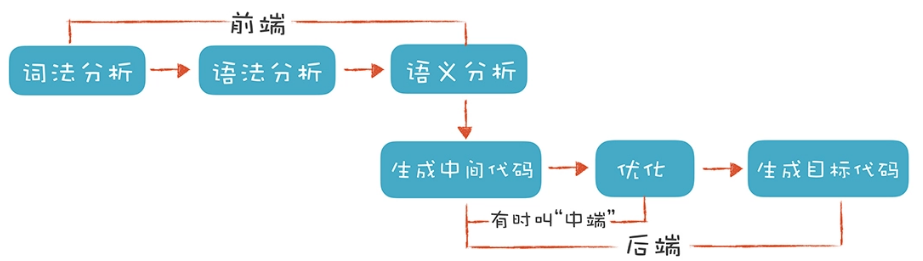
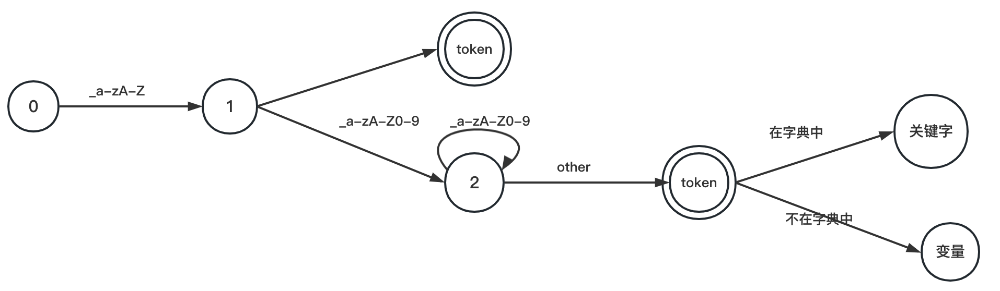

# 1、编译器与解释器

- 编译器：将程序编译成目标程序；
- 程序执行：输入 -> 程序 -> 输出；
- 解释器：源程序+输入 -> 解释器 -> 输出;
- 混合编译器：源程序 -> 第一次编译 -> 中间代码 -> 第二次编译 -> 虚拟机 -> 输出

**编译器分层架构**


# 2、编译器前端过程

编译器前端指的是编译器对程序代码的分析和理解过程，它通常只跟语言的语法有关，跟目标机器无关。而与之对应的“后端（Back End）”则是生成目标代码的过程，跟目标机器有关；



编译器的**前端**技术分为**词法分析**、**语法分析**和**语义分析**三个部分。而它主要涉及自动机和形式语言方面的基础的计算理论;

## 2.1、词法分析

词法分析（Lexical Analysis），通常编译器的第一项工作叫做词法分析；程序处理的叫做“词法记号”，英文叫 Token，就跟阅读文章一样，文章是由一个个的中文单词组成的；数学上是一个元组

串和语言：
- 字母表（alphabet）：语言允许的所有字符；
- 串（string）是语言字母表中字母的一个有穷序列；通过用希腊字母 ε 代表空串；

词法分析的目标：给定程序语言以及所有语言支持的词汇，从中找出这些词汇并为它标注词性；如果源代码中有语言不支持的词汇，报错并提示用户；

如下代码：
```c
#include <stdio.h>
int main(int argc, char* argv[]){
    int age = 45;
    if (age >= 27+8+20) {
        printf("Hello old man!\\n");
    }
    else{
        printf("Hello young man!\\n");
    }
    return 0;
}
```
可以通过制定一些规则来区分每个不同的 Token：
- **识别 age 这样的标识符**：它以字母开头，后面可以是字母或数字，直到遇到第一个既不是字母又不是数字的字符时结束；
- **识别 >= 这样的操作符**： 当扫描到一个 `>` 字符的时候，就要注意，它可能是一个 `GT`（Greater Than，大于）操作符。但由于 `GE`（Greater Equal，大于等于）也是以 `>` 开头的，所以再往下再看一位，如果是 `=`，那么这个 Token 就是 `GE`，否则就是 `GT`；
- **识别 45 这样的数字字面量**：当扫描到一个数字字符的时候，就开始把它看做数字，直到遇到非数字的字符；

上述这些规则可以借助词法分析器来生成，比如Lex；这些生成工具是基于一些规则来工作的，这些规则用“正则文法”表达，符合正则文法的表达式称为“正则表达式”；生成工具可以读入正则表达式，生成一种叫“有限自动机”；通常使用正则表达式来表述词法，然后用状态机来实现正则表达式
的算法，来完成具体的词法分析工作；
- 正则文法是一种最普通、最常见的规则，写正则表达式的时候用的就是正则文法；
- 有限自动机是有限个状态的自动机器；

词法分析器也是一样，它分析整个程序的字符串，当遇到不同的字符时，会驱使它迁移到不同的状态。例如，词法分析程序在扫描 age 的时候，处于“标识符”状态，等它遇到一个 > 符号，就切换到“比较操作符”的状态。词法分析过程，就是这样一个个状态迁移的过程。

一个最简答的问题：区分关键词和变量名
- 关键词和变量名都是以字母下划线开头，但又有所区别；
- 正则表达式：`[_a-zA-Z][_a-zA-Z0-9]*`
- 状态机描述：

    

> 词法分析是把程序分割成一个个 Token 的过程，可以通过构造有限自动机来实现。

[词法分析状态机查看](分析过程/lexer/string.dot)

## 2.2、语法分析

语法分析（Syntactic Analysis, or Parsing），编译器下一个阶段的工作是语法分析。词法分析是识别一个个的单词，而语法分析就是在词法分析的基础上识别出程序的语法结构。这个结构是一个树状结构，是计算机容易理解和执行的；

程序有定义良好的语法结构，它的语法分析过程，就是构造这么一棵树。一个程序就是一棵树，这棵树叫做**抽象语法树（Abstract Syntax Tree，AST）**。树的每个节点（子树）是一个语法单元，这个单元的构成规则就叫“语法”。每个节点还可以有下级节点

在Mac上可以使用如下命令查看AST结构：
```bash
## -ast-dump 参数使它输出 AST，而不是做常规的编译
clang -cc1 -ast-dump hello.c
```
可以在[Javascript抽象语法树](https://resources.jointjs.com/demos/javascript-ast)更直观的看到；

### 2.2.1、抽象语法树

- [Java代码解析器](https://github.com/javaparser/javaparser)
- [AST-Abstract Syntax Tree](https://en.wikipedia.org/wiki/Abstract_syntax_tree)

- 每个节点都是源代码中的一种结构；
- 每个节点都携带了源代码中的一些关键信息；
- 每个节点的子节点代表着语言上的关系；

形成 AST 以后有什么好处呢？就是计算机很容易去处理。比如，针对表达式形成的这棵树，从根节点遍历整棵树就可以获得表达式的值

**如何构造AST呢**？一种非常直观的构造思路是自上而下进行分析。常用的是**递归下降算法**（Recursive Descent Parsing）；

上级文法嵌套下级文法，上级的算法调用下级的算法。表现在生成 AST 中，上级算法生成上级节点，下级算法生成下级节点。这就是“下降”的含义

**上下文无关文法**：[上下文无关文法（Context-Free Grammar，简称：CFG）](https://zh.m.wikipedia.org/wiki/%E4%B8%8A%E4%B8%8B%E6%96%87%E6%97%A0%E5%85%B3%E6%96%87%E6%B3%95)，给定任意语言的句子，可以得到一个合理的抽象语法树；

> 正则文法是上下文无关文法的一个子集，上下文无关文法允许递归调用，而正则文法不允许

几乎所有程序设计语言都是通过上下文无关文法来定义的，[BNF（巴克斯-诺尔范式）](https://zh.m.wikipedia.org/wiki/%E5%B7%B4%E5%85%8B%E6%96%AF-%E8%AF%BA%E5%B0%94%E8%8C%83%E5%BC%8F)经常用来表达上下文无关文法

当然也可以借助工具，[构造AST的工具](https://blog.csdn.net/gongwx/article/details/99645305)

> 语法分析是把程序的结构识别出来，并形成一棵便于由计算机处理的抽象语法树。可以用递归下降的算法来实现。

### 2.2.2、形式语法中的终结符与非终结符

形式语法：左边是一个非终结符（Non-terminal）。右边是它的产生式（Production Rule）。在语法解析的过程中，左边会被右边替代。如果替代之后还有非终结符，那么继续这个替代过程，直到最后全部都是终结符（Terminal），也就是 Token。只有终结符才可以成为 AST 的叶子节点。这个过程，也叫做推导（Derivation）过程；文法的推导过程，就是把非终结符不断替换的过程，让最后的结果没有非终结符，只有终结符

- 终结符：通俗的说就是不能单独出现在推导式左边的符号，也就是说终结符不能再进行推导；比如说下面两个语法：
    ```
    x -> xa
    x -> ax
    ```
    这种描述中，a 是一个终结符，因为没有规则可以把 a 变成别的符号；不过有两个规则可以把 x 变成别的符号，所以 x 是非终结符；一个形式语法中所推导的形式语法必须完全由终结符构成；
- 非终结符：不是终结符的都是非终结符。非终结符可理解为一个可拆分元素，而终结符是不可拆分的最小元素；非终结符是可以被取代的符号。一个形式文法中必须有一个起始符号；这个起始符号属于非终结符的集合；

需要注意的是：
- （1）只要存在有 S → L ，则 S 必然是个非终结符；
- （2）`逗号`，`[`，`]`，`(`，`)` 这5个都是终结符；
- （3）一般书上把非终结符用大写字母 表示，而终结符用小写字母表示；
- （4）只有终结符才可以称为AST的叶子节点；

比如推导式：`expr -> expr + 1 | 1`，读作：expr 可以推导出 expr + 1 或 1，箭头一般解释为推导出，上述可以生成如下：1+1+1或1+1+1+1的句子；其中expr是非终结符，1是终结符，终结符对应词法单元；

### 2.2.3、递归法求抽象语法树**

- `expr -> expr + 1 | 1` 可以拆分为两步：
    - 非终结符（递归）函数：parseExpr（生成一个非叶子节点）；
    - 终结符函数：parseNumber（生成一个叶子节点）；

问题1：*遇到左递归如何处理？*
```
- parseExpr
    . parseExpr
        - parseExpr...遇到无穷无尽的expr递归
```
- 上面产生式变形：`expr -> 1 + expr | 1`，使用右递归解析： 1+1+1+1的过程，其伪代码如下：
```
parseExpr(1+1+1+1)
    eat(1);eat(+);
        parseExpr(1+1+1)
            eat(1);eat(+);
                parseExpr(1+1)
                    eat(1);eat(+);
                        parseNumber(1)
```

### 2.2.4、优先级和左递归

形如`A -> Ac | β` 的产生式，有没有通用方法转为非左递归形式？
- 上述产生式只能以 `β` 开头；
- 可以产生`β，βα，βαα...`的语言；
- 因为存在左递归，无法使用自顶部向下递归法；

可以使用两个等效的产生式替代：
```
A  -> β A'
A' -> αA' | ε
```
例子：`expr -> expr + 1 | 1`
```
根据上面的描述，α = +1，β = 1
套用公式：A  -> β A' 、  A' -> αA' | ε
得到：expr -> 1 expr'  、 expr' -> +1 expr' | ε
```
例子2：`E -> E + T | E - T | T `
```
套用上面的公式，可以得出：
E 对应的是 A，+T 和 -T 对应的是 α，T对应的是 β
那么对应的推导：
E  -> T · E'
E' -> +T E' | -T E' | ε
```

程序的优先级如何控制？
- $E_k$ 代表第k级优先级的表达式，$E_{k+1}$ 代表第k+1级优先级的表达式；类比：$E_k \rightarrow E_k + E_{k+1} | E_{k+1}$，$E_{k+1} \rightarrow E_{k+1} * F | F$；
- $op_k$代表第k级优先级表达式对应的操作符，例如：$op_3 \rightarrow + | -$
- 于是：$E_k \rightarrow E_k op_k E_{k+1} | E_{k+1}$

### 2.2.5、深度优先遍历


## 2.3、语义分析

语义分析（Semantic Analysis）是要让计算机理解我们的真实意图，把一些模棱两可的地方消除掉。

语义分析并没那么复杂，因为计算机语言的语义一般可以表达为一些规则，你只要检查是否符合这些规则就行了，**语义分析实际上就是根据语义规则进行分析判断**；

语义分析工作的某些成果，会作为属性标注在抽象语法树上，比如在 age 这个标识符节点和 45 这个字面量节点上，都会标识它的数据类型是 int 型的；做了这些属性标注以后，编译器在后面就可以依据这些信息生成目标代码了

> 语义分析是消除语义模糊，生成一些属性信息，让计算机能够依据这些信息生成目标代码。

# 参考资料

- [创建自己的编译器](https://citw.dev/tutorial/create-your-own-compiler)
- [简易编译器](https://github.com/jamiebuilds/the-super-tiny-compiler)
- [编译原理-高校课程信息](https://silverbullettt.bitbucket.io/courses/compiler-2022/index.html)
- [Let's make a Teeny Tiny compiler](https://austinhenley.com/blog/teenytinycompiler1.html)
- [My second attempt at explaining Interpreters](https://returnzero.win/2023/01/28/lisp-my-second-attempt-at-explaining-interpreters/)
- [Favorite compiler and interpreter resources](https://lists.eatonphil.com/compilers-and-interpreters.html)
- [编译原理学习资料](https://www.yuque.com/xianyuxuan/coding/compiler)
- [如何实现一个编译器](https://zhuanlan.zhihu.com/p/1898641595605194201)
- [LLVM 是目前最受欢迎的开源编译器基础设施](https://llvm.org/)