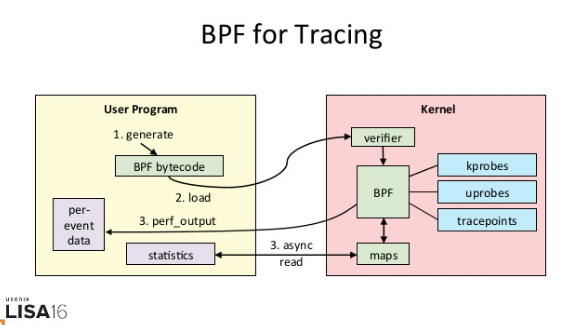

## 内核线程

在 Linux 中，用户态进程的“祖先”，都是 PID 号为 1 的 init 进程。现在主流的 Linux 发行版中，init 都是 systemd 进程；而其他的用户态进程，会通过 systemd 来进行管理。除了用户态进程外，还有大量的内核态线程。按说内核态的线程，应该先于用户态进程启动，可是 systemd 只管理用户态进程。那么，内核态线程又是谁来管理的呢？
实际上，Linux 在启动过程中，有三个特殊的进程，也就是 PID 号最小的三个进程。
- 0 号进程为 idle 进程，这也是系统创建的第一个进程，它在初始化 1 号和 2 号进程后，演变为空闲任务。当 CPU 上没有其他任务执行时，就会运行它。
- 1 号进程为 init 进程，通常是 systemd 进程，在用户态运行，用来管理其他用户态进程。
- 2 号进程为 kthreadd 进程，在内核态运行，用来管理内核线程。

所以，要查找内核线程，只需要从 2 号进程开始，查找它的子孙进程即可。比如，可以使用 ps 命令，来查找 kthreadd 的子进程：
```bash
$ ps -f --ppid 2 -p 2
UID         PID   PPID  C STIME TTY          TIME CMD
root          2      0  0 12:02 ?        00:00:01 [kthreadd]
root          9      2  0 12:02 ?        00:00:21 [ksoftirqd/0]
root         10      2  0 12:02 ?        00:11:47 [rcu_sched]
root         11      2  0 12:02 ?        00:00:18 [migration/0]
...
root      11094      2  0 14:20 ?        00:00:00 [kworker/1:0-eve]
root      11647      2  0 14:27 ?        00:00:00 [kworker/0:2-cgr]
# 内核线程的名称（CMD）都在中括号里
$ ps -ef | grep "\[.*\]"
root         2     0  0 08:14 ?        00:00:00 [kthreadd]
root         3     2  0 08:14 ?        00:00:00 [rcu_gp]
root         4     2  0 08:14 ?        00:00:00 [rcu_par_gp]
...
```
容易发生性能问题的内核线程：
- ksoftirqd：它是一个用来处理软中断的内核线程，并且每个 CPU 上都有一个
- kswapd0：用于内存回收。
- kworker：用于执行内核工作队列，分为绑定 CPU （名称格式为 kworker/CPU86330）和未绑定 CPU（名称格式为 kworker/uPOOL86330）两类。
- migration：在负载均衡过程中，把进程迁移到 CPU 上。每个 CPU 都有一个 migration 内核线程。
- jbd2/sda1-8：jbd 是 Journaling Block Device 的缩写，用来为文件系统提供日志功能，以保证数据的完整性；名称中的 sda1-8，表示磁盘分区名称和设备号。每个使用了 ext4 文件系统的磁盘分区，都会有一个 jbd2 内核线程。
- pdflush：用于将内存中的脏页（被修改过，但还未写入磁盘的文件页）写入磁盘（已经在 3.10 中合并入了 kworker 中）。

## 动态追踪技术

- [SystemTap-Linux 的一种动态追踪框架](https://sourceware.org/systemtap/)
- [DTrace Internals: Digging into DTrace](https://www.bsdcan.org/2017/schedule/attachments/433_dtrace_internals.html#(1))
- [动态追踪技术漫谈](https://blog.openresty.com.cn/cn/dynamic-tracing/)
- [long-last-linux-gets-dynamic-tracing](https://thenewstack.io/long-last-linux-gets-dynamic-tracing/)

### 概述

动态追踪技术，通过探针机制，来采集内核或者应用程序的运行信息，从而可以不用修改内核和应用程序的代码，就获得丰富的信息，帮你分析、定位想要排查的问题

它既不需要停止服务，也不需要修改应用程序的代码；所有一切还按照原来的方式正常运行时，就可以帮你分析出问题的根源，动态追踪只会带来很小的性能损耗（通常在 5% 或者更少）

DTrace 是动态追踪技术的鼻祖，它提供了一个通用的观测框架，并可以使用 D 语言进行自由扩展

DTrace 的工作原理如下图所示。它的运行常驻在内核中，用户可以通过 dtrace 命令，把 D 语言编写的追踪脚本，提交到内核中的运行时来执行。DTrace 可以跟踪用户态和内核态的所有事件，并通过一些列的优化措施，保证最小的性能开销


虽然直到今天，DTrace 本身依然无法在 Linux 中运行，但它同样对 Linux 动态追踪产生了巨大的影响

同 DTrace 一样，SystemTap 也定义了一种类似的脚本语言，方便用户根据需要自由扩展。不过，不同于 DTrace，SystemTap 并没有常驻内核的运行时，它需要先把脚本编译为内核模块，然后再插入到内核中执行。这也导致 SystemTap 启动比较缓慢，并且依赖于完整的调试符号表。

总的来说，为了追踪内核或用户空间的事件，Dtrace 和 SystemTap 都会把用户传入的追踪处理函数（一般称为 Action），关联到被称为探针的检测点上。这些探针，实际上也就是各种动态追踪技术所依赖的事件源

### 动态追踪的事件源

根据事件类型的不同，动态追踪所使用的事件源，可以分为静态探针、动态探针以及硬件事件等三类。它们的关系如下图所示：


其中，**硬件事件通常由性能监控计数器 PMC（Performance Monitoring Counter）产生**，包括了各种硬件的性能情况，比如 CPU 的缓存、指令周期、分支预测等等

**静态探针，是指事先在代码中定义好，并编译到应用程序或者内核中的探针**。这些探针只有在开启探测功能时，才会被执行到；未开启时并不会执行。常见的静态探针包括内核中的跟踪点（tracepoints）和 USDT（Userland Statically Defined Tracing）探针
- 跟踪点（tracepoints），实际上就是在源码中插入的一些带有控制条件的探测点，这些探测点允许事后再添加处理函数。比如在内核中，最常见的静态跟踪方法就是 printk，即输出日志。Linux 内核定义了大量的跟踪点，可以通过内核编译选项，来开启或者关闭。
- [USDT 探针](https://leezhenghui.github.io/linux/2019/03/05/exploring-usdt-on-linux.html)，全称是用户级静态定义跟踪，需要在源码中插入 DTRACE_PROBE() 代码，并编译到应用程序中。不过，也有很多应用程序内置了 USDT 探针，比如 MySQL、PostgreSQL 等

**动态探针，则是指没有事先在代码中定义，但却可以在运行时动态添加的探针**，比如函数的调用和返回等。动态探针支持按需在内核或者应用程序中添加探测点，具有更高的灵活性。常见的动态探针有两种，即用于内核态的 kprobes 和用于用户态的 uprobes
- kprobes 用来跟踪内核态的函数，包括用于函数调用的 kprobe 和用于函数返回的 kretprobe。
- uprobes 用来跟踪用户态的函数，包括用于函数调用的 uprobe 和用于函数返回的 uretprobe。

> 注意，kprobes 需要内核编译时开启 CONFIG_KPROBE_EVENTS；而 uprobes 则需要内核编译时开启 CONFIG_UPROBE_EVENTS


### 动态追踪机制

**ftrace** 最早用于函数跟踪，后来又扩展支持了各种事件跟踪功能。ftrace 的使用接口跟 procfs 类似，它通过 debugfs（4.1 以后也支持 tracefs），以普通文件的形式，向用户空间提供访问接口。这样，不需要额外的工具，就可以通过挂载点（通常为 /sys/kernel/debug/tracing 目录）内的文件读写，来跟 ftrace 交互，跟踪内核或者应用程序的运行事件

**perf** 这可以通过 perf ，来自定义动态事件（perf probe），只关注真正感兴趣的事件

**eBPF** 则在 BPF（Berkeley Packet Filter）的基础上扩展而来，不仅支持事件跟踪机制，还可以通过自定义的 BPF 代码（使用 C 语言）来自由扩展。所以，eBPF 实际上就是常驻于内核的运行时，可以说就是 Linux 版的 DTrace

还有很多内核外的工具，也提供了丰富的动态追踪功能。最常见的就是 SystemTap，还有 BCC（BPF Compiler Collection），以及常用于容器性能分析的 sysdig 等

#### ftrace

ftrace 通过 debugfs（或者 tracefs），为用户空间提供接口。所以使用 ftrace，往往是从切换到 debugfs 的挂载点开始
```bash
$ cd /sys/kernel/debug/tracing
$ ls
README                      instances            set_ftrace_notrace  trace_marker_raw
available_events            kprobe_events        set_ftrace_pid      trace_options
...
```
如果这个目录不存在，则说明系统还没有挂载 debugfs，可以执行下面的命令来挂载它：
```bash
$ mount -t debugfs nodev /sys/kernel/debug
```
ftrace 提供了多个跟踪器，用于跟踪不同类型的信息，比如函数调用、中断关闭、进程调度等。具体支持的跟踪器取决于系统配置，你可以执行下面的命令，来查询所有支持的跟踪器：
```bash
$ cat available_tracers
hwlat blk mmiotrace function_graph wakeup_dl wakeup_rt wakeup function nop
```
这其中，function 表示跟踪函数的执行，function_graph 则是跟踪函数的调用关系，也就是生成直观的调用关系图。这便是最常用的两种跟踪器

除了跟踪器外，使用 ftrace 前，还需要确认跟踪目标，包括内核函数和内核事件。其中，
- 函数就是内核中的函数名。
- 而事件，则是内核源码中预先定义的跟踪点。

可以执行下面的命令，来查询支持的函数和事件：
```bash
$ cat available_filter_functions
$ cat available_events
```

示例：为了列出文件，ls 命令会通过 open 系统调用打开目录文件，而 open 在内核中对应的函数名为 do_sys_open。
第一步，就是把要跟踪的函数设置为 do_sys_open：
```bash
$ echo do_sys_open > set_graph_function
```
第二步，配置跟踪选项，开启函数调用跟踪，并跟踪调用进程：
```bash
$ echo function_graph > current_tracer
$ echo funcgraph-proc > trace_options
```
第三步，也就是开启跟踪：
```bash
$ echo 1 > tracing_on
```
第四步，执行一个 ls 命令后，再关闭跟踪：
```bash
$ ls
$ echo 0 > tracing_on
```
第五步，也是最后一步，查看跟踪结果：
```bash
$ cat trace
# tracer: function_graph
#
# CPU  TASK/PID         DURATION                  FUNCTION CALLS
# |     |    |           |   |                     |   |   |   |
 0)    ls-12276    |               |  do_sys_open() {
 0)    ls-12276    |               |    getname() {
 0)    ls-12276    |               |      getname_flags() {
 0)    ls-12276    |               |        kmem_cache_alloc() {
 0)    ls-12276    |               |          _cond_resched() {
 0)    ls-12276    |   0.049 us    |            rcu_all_qs();
 0)    ls-12276    |   0.791 us    |          }
 0)    ls-12276    |   0.041 us    |          should_failslab();
 0)    ls-12276    |   0.040 us    |          prefetch_freepointer();
 0)    ls-12276    |   0.039 us    |          memcg_kmem_put_cache();
 0)    ls-12276    |   2.895 us    |        }
 0)    ls-12276    |               |        __check_object_size() {
 0)    ls-12276    |   0.067 us    |          __virt_addr_valid();
 0)    ls-12276    |   0.044 us    |          __check_heap_object();
 0)    ls-12276    |   0.039 us    |          check_stack_object();
 0)    ls-12276    |   1.570 us    |        }
 0)    ls-12276    |   5.790 us    |      }
 0)    ls-12276    |   6.325 us    |    }
```
在最后得到的输出中：
- 第一列表示运行的 CPU；
- 第二列是任务名称和进程 PID；
- 第三列是函数执行延迟；
- 最后一列，则是函数调用关系图。

上面步骤比较多，可以使用 [trace-cmd](https://git.kernel.org/pub/scm/utils/trace-cmd/trace-cmd.git/) 在同一个命令行工具里，完成上述所有过程。
```bash
$ trace-cmd record -p function_graph -g do_sys_open -O funcgraph-proc ls
$ trace-cmd report
...
              ls-12418 [000] 85558.075341: funcgraph_entry:                   |  do_sys_open() {
              ls-12418 [000] 85558.075363: funcgraph_entry:                   |    getname() {
              ls-12418 [000] 85558.075364: funcgraph_entry:                   |      getname_flags() {
              ls-12418 [000] 85558.075364: funcgraph_entry:                   |        kmem_cache_alloc() {
              ls-12418 [000] 85558.075365: funcgraph_entry:                   |          _cond_resched() {
              ls-12418 [000] 85558.075365: funcgraph_entry:        0.074 us   |            rcu_all_qs();
              ls-12418 [000] 85558.075366: funcgraph_exit:         1.143 us   |          }
              ls-12418 [000] 85558.075366: funcgraph_entry:        0.064 us   |          should_failslab();
              ls-12418 [000] 85558.075367: funcgraph_entry:        0.075 us   |          prefetch_freepointer();
              ls-12418 [000] 85558.075368: funcgraph_entry:        0.085 us   |          memcg_kmem_put_cache();
              ls-12418 [000] 85558.075369: funcgraph_exit:         4.447 us   |        }
              ls-12418 [000] 85558.075369: funcgraph_entry:                   |        __check_object_size() {
              ls-12418 [000] 85558.075370: funcgraph_entry:        0.132 us   |          __virt_addr_valid();
              ls-12418 [000] 85558.075370: funcgraph_entry:        0.093 us   |          __check_heap_object();
              ls-12418 [000] 85558.075371: funcgraph_entry:        0.059 us   |          check_stack_object();
              ls-12418 [000] 85558.075372: funcgraph_exit:         2.323 us   |        }
              ls-12418 [000] 85558.075372: funcgraph_exit:         8.411 us   |      }
              ls-12418 [000] 85558.075373: funcgraph_exit:         9.195 us   |    }
...
```

#### [perf](./Linux常见操作.md#7perf)

#### eBPF和BCC

如何用 eBPF 和 BCC 实现同样的动态跟踪。

通常，可以把 BCC 应用，拆分为下面这四个步骤。

第一，跟所有的 Python 模块使用方法一样，在使用之前，先导入要用到的模块：
```py
from bcc import BPF
```
第二，需要定义事件以及处理事件的函数。这个函数需要用 C 语言来编写，作用是初始化刚才导入的 BPF 对象。这些用 C 语言编写的处理函数，要以字符串的形式送到 BPF 模块中处理：
```py
# define BPF program (""" is used for multi-line string).
# '#' indicates comments for python, while '//' indicates comments for C.
prog = """
#include <uapi/linux/ptrace.h>
#include <uapi/linux/limits.h>
#include <linux/sched.h>
// define output data structure in C
struct data_t {
    u32 pid;
    u64 ts;
    char comm[TASK_COMM_LEN];
    char fname[NAME_MAX];
};
BPF_PERF_OUTPUT(events);
 
// define the handler for do_sys_open.
// ctx is required, while other params depends on traced function.
int hello(struct pt_regs *ctx, int dfd, const char __user *filename, int flags){
    struct data_t data = {};
    data.pid = bpf_get_current_pid_tgid();
    data.ts = bpf_ktime_get_ns();
    if (bpf_get_current_comm(&data.comm, sizeof(data.comm)) == 0) {
        bpf_probe_read(&data.fname, sizeof(data.fname), (void *)filename);
    }
    events.perf_submit(ctx, &data, sizeof(data));
    return 0;
}
"""
# load BPF program
b = BPF(text=prog)
# attach the kprobe for do_sys_open, and set handler to hello
b.attach_kprobe(event="do_sys_open", fn_name="hello")
```
第三步，是定义一个输出函数，并把输出函数跟 BPF 事件绑定：
```py
# process event
start = 0
def print_event(cpu, data, size):
    global start
    # event’s type is data_t
    event = b["events"].event(data)
    if start == 0:
            start = event.ts
    time_s = (float(event.ts - start)) / 1000000000
    print("%-18.9f %-16s %-6d %-16s" % (time_s, event.comm, event.pid, event.fname))
 
# loop with callback to print_event
b["events"].open_perf_buffer(print_event)
```
最后一步，就是执行事件循环，开始追踪 do_sys_open 的调用：
```py
# print header
print("%-18s %-16s %-6s %-16s" % ("TIME(s)", "COMM", "PID", "FILE”))
# start the event polling loop
while 1:
    try:
        b.perf_buffer_poll()
    except KeyboardInterrupt:
        exit()
```

#### SystemTap 和 sysdig

SystemTap 也是一种可以通过脚本进行自由扩展的动态追踪技术。在 eBPF 出现之前，SystemTap 是 Linux 系统中，功能最接近 DTrace 的动态追踪机制。不过要注意，SystemTap 在很长时间以来都游离于内核之外（而 eBPF 自诞生以来，一直根植在内核中）。

所以，从稳定性上来说，SystemTap 只在 RHEL 系统中好用，在其他系统中则容易出现各种异常问题。当然，反过来说，支持 3.x 等旧版本的内核，也是 SystemTap 相对于 eBPF 的一个巨大优势。

**sysdig 主要用于容器的动态追踪**。ysdig 的特点： sysdig = strace + tcpdump + htop + iftop + lsof + docker inspect。

而在最新的版本中（内核版本 >= 4.14），sysdig 还可以通过 eBPF 来进行扩展，所以，也可以用来追踪内核中的各种函数和事件。

### 如何选择追踪工具

不同场景的工具选择问题
- 在不需要很高灵活性的场景中，使用 perf 对性能事件进行采样，然后再配合火焰图辅助分析，就是最常用的一种方法；
- 而需要对事件或函数调用进行统计分析（比如观察不同大小的 I/O 分布）时，就要用 SystemTap 或者 eBPF，通过一些自定义的脚本来进行数据处理。


## BPF

- [eBPF-什么是eBPF](https://ebpf.io/zh-hans/what-is-ebpf/)
- [eBPF](https://ebpf.io/)
- [BCC](https://www.brendangregg.com/ebpf.html#bcc)
- [BPF and XDP Reference Guide](https://docs.cilium.io/en/stable/reference-guides/bpf/index.html)

### eBPF

eBPF 就是 Linux 版的 DTrace，可以通过 C 语言自由扩展（这些扩展通过 LLVM 转换为 BPF 字节码后，加载到内核中执行）。下面这张图，就表示了 eBPF 追踪的工作原理：



eBPF 的执行需要三步：
- 从用户跟踪程序生成 BPF 字节码；
- 加载到内核中运行；
- 向用户空间输出结果。

在 eBPF 执行过程中，编译、加载还有 maps 等操作，对所有的跟踪程序来说都是通用的。把这些过程通过 Python 抽象起来，也就诞生了 BCC（BPF Compiler Collection），BCC 把 eBPF 中的各种事件源（比如 kprobe、uprobe、tracepoint 等）和数据操作（称为 Maps），也都转换成了 Python 接口（也支持 lua）。这样，使用 BCC 进行动态追踪时，编写简单的脚本就可以了。
```bash
# BCC安装
yum install bcc-tools
```


# 参考资料

- [Linux Kernel内核归档](https://www.kernel.org/)
- [A Little bit about Linux kernel](https://github.com/0xAX/linux-insides)
- [LWN’s kernel page](https://lwn.net/Kernel/Index/)
- [Kernel Planet-Linux 内核开发者的 Blog](https://planet.kernel.org/)
- [Linux源代码](https://mirrors.edge.kernel.org/pub/linux/kernel/)
- [Linux性能介绍](https://unixism.net/2019/04/linux-applications-performance-introduction/)
- [Linux源码在线查看网站](https://elixir.bootlin.com/linux/v6.12.1/source)
- [Linux内核学习资料](https://github.com/0voice/linux_kernel_wiki)
- [Linux源码在线查看网站](https://elixir.bootlin.com/linux/latest/source)

