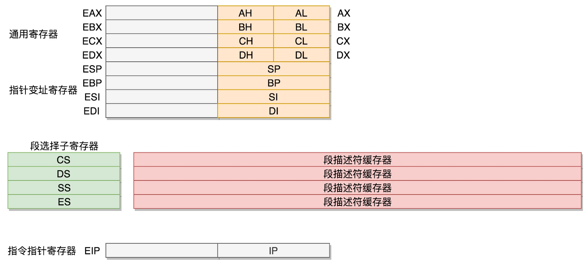

# 一、Linux系统概述

## 1、Linux内核综述


## 2、系统调用

- 进程管理：
    - 创建进程：父子进程、fork进程
- 内存管理：进程内存空间
- 文件管理：文件格式、一切皆文件
- 信号处理
- 进程间通信
- 网络通信：TCP/IP 网络协议栈


## 3、系统初始化

### 3.1、计算机工作模式


- 对于一个计算机来讲，最核心的就是**CPU**（Central Processing Unit，中央处理器）。这是这台计算机的大脑，所有的设备都围绕它展开；
- CPU 和其他设备连接，要靠一种叫作**总线**（Bus）的东西，其实就是主板上密密麻麻的集成电路，这些东西组成了 CPU 和其他设备的高速通道
- 在这些设备中，最重要的是**内存**（Memory）

**CPU 和内存是完成计算任务的核心组件**，那么CPU 和内存是如何配合工作的？

CPU 其实也不是单纯的一块，它包括三个部分，运算单元、数据单元和控制单元
- **运算单元** 只管算，例如做加法、做位移等等。但是，它不知道应该算哪些数据，运算结果应该放在哪里
- **数据单元** 包括 CPU 内部的缓存和寄存器组，空间很小，但是速度飞快，可以暂时存放数据和运算结果
- **控制单元** 是一个统一的指挥中心，它可以获得下一条指令，然后执行这条指令。这个指令会指导运算单元取出数据单元中的某几个数据，计算出个结果，然后放在数据单元的某个地方。


程序运行的过程中要操作的数据和产生的计算结果，都会放在数据段里面。那 CPU 怎么执行这些程序，操作这些数据，产生一些结果，并写入回内存呢？
- CPU 的控制单元里面，有一个**指令指针寄存器**，它里面存放的是下一条指令在内存中的地址。控制单元会不停地将代码段的指令拿进来，先放入指令寄存器；当前的指令分两部分，
    - 一部分是做什么操作，例如是加法还是位移；
    - 一部分是操作哪些数据

    要执行这条指令，就要把第一部分交给运算单元，第二部分交给数据单元；数据单元根据数据的地址，从数据段里读到数据寄存器里，就可以参与运算了。运算单元做完运算，产生的结果会暂存在数据单元的数据寄存器里。最终，会有指令将数据写回内存中的数据段
- CPU 和内存来来回回传数据，靠的都是总线。其实总线上主要有两类数据：
    - 一个是地址数据，也就是想拿内存中哪个位置的数据，这类总线叫地址总线（Address Bus）；
    - 另一类是真正的数据，这类总线叫数据总线（Data Bus）

    所以说，总线其实有点像连接 CPU 和内存这两个设备的高速公路，说总线到底是多少位，就类似说高速公路有几个车道。但是这两种总线的位数意义是不同的
- 地址总线的位数，决定了能访问的地址范围到底有多广。例如只有两位，那 CPU 就只能认 00，01，10，11 四个位置，超过四个位置，就区分不出来了。位数越多，能够访问的位置就越多，能管理的内存的范围也就越广。
- 数据总线的位数，决定了一次能拿多少个数据进来。例如只有两位，那 CPU 一次只能从内存拿两位数。要想拿八位，就要拿四次。位数越多，一次拿的数据就越多，访问速度也就越快。

### 3.2、x86架构

x86 中最经典的一款处理器，8086 处理器


**数据单元**

为了暂存数据，8086 处理器内部有 8 个 16 位的通用寄存器，也就是刚才说的 CPU 内部的数据单元，分别是 AX、BX、CX、DX、SP、BP、SI、DI。这些寄存器主要用于在计算过程中暂存数据，这些寄存器比较灵活，其中 AX、BX、CX、DX 可以分成两个 8 位的寄存器来使用，分别是 AH、AL、BH、BL、CH、CL、DH、DL，其中 H 就是 High（高位），L 就是 Low（低位）的意思

**控制单元**

IP 寄存器就是指令指针寄存器（Instruction Pointer Register)，指向代码段中下一条指令的位置。CPU 会根据它来不断地将指令从内存的代码段中，加载到 CPU 的指令队列中，然后交给运算单元去执行；

如果需要切换进程呢？每个进程都分代码段和数据段，为了指向不同进程的地址空间，有四个 16 位的段寄存器，分别是 CS、DS、SS、ES
- CS 就是代码段寄存器（Code Segment Register），通过它可以找到代码在内存中的位置；
- DS 是数据段的寄存器，通过它可以找到数据在内存中的位置
- SS 是栈寄存器（Stack Register）。栈是程序运行中一个特殊的数据结构，数据的存取只能从一端进行，秉承后进先出的原则，push 就是入栈，pop 就是出栈；凡是与函数调用相关的操作，都与栈紧密相关

如果运算中需要加载内存中的数据，需要通过 DS 找到内存中的数据，加载到通用寄存器中；对于一个段，有一个起始的地址，而段内的具体位置，我们称为**偏移量（Offset）**，在 CS 和 DS 中都存放着一个段的起始地址。代码段的偏移量在 IP 寄存器中，数据段的偏移量会放在通用寄存器中

问题：CS 和 DS 都是 16 位的，也就是说，起始地址都是 16 位的，IP 寄存器和通用寄存器都是 16 位的，偏移量也是 16 位的，但是 8086 的地址总线地址是 20 位。怎么凑够这 20 位呢？方法就是“**起始地址 *16+ 偏移量**”，也就是把 CS 和 DS 中的值左移 4 位，变成 20 位的，加上 16 位的偏移量，这样就可以得到最终 20 位的数据地址

### 3.3、32位处理器

在 32 位处理器中，有 32 根地址总线，可以访问 2^32=4G 的内存，使用原来的模式肯定不行了，但是又不能完全抛弃原来的模式，因为这个架构是开放的。在开放架构的基础上，如何保持兼容呢？

首先，通用寄存器有扩展，可以将 8 个 16 位的扩展到 8 个 32 位的，但是依然可以保留 16 位的和 8 位的使用方式，其中，指向下一条指令的指令指针寄存器 IP，就会扩展成 32 位的，同样也兼容 16 位的



而改动比较大，有点不兼容的就是**段寄存器（Segment Register）**，CS、SS、DS、ES 仍然是 16 位的，但是不再是段的起始地址。段的起始地址放在内存的某个地方。这个地方是一个表格，表格中的一项一项是**段描述符（Segment Descriptor）**。这里面才是真正的段的起始地址。而段寄存器里面保存的是在这个表格中的哪一项，称为**选择子（Selector）**，这样，将一个从段寄存器直接拿到的段起始地址，就变成了先间接地从段寄存器找到表格中的一项，再从表格中的一项中拿到段起始地址，这样段起始地址就会很灵活了。当然为了快速拿到段起始地址，段寄存器会从内存中拿到 CPU 的描述符高速缓存器中

到了 32 位的系统架构下，将前一种模式称为**实模式**（Real Pattern），后一种模式称为**保护模式**（Protected Pattern）

当系统刚刚启动的时候，CPU 是处于实模式的，这个时候和原来的模式是兼容的。也就是说，哪怕你买了 32 位的 CPU，也支持在原来的模式下运行，只不过快了一点而已。当需要更多内存的时候，可以遵循一定的规则，进行一系列的操作，然后切换到保护模式，就能够用到 32 位 CPU 更强大的能力

### 3.4、BIOS

在主板上，有一个东西叫**ROM**（Read Only Memory，只读存储器）。这和内存**RAM**（Random Access Memory，随机存取存储器）不同；ROM 是只读的，上面固化了一些初始化的程序，也就是**BIOS**（Basic Input and Output System，基本输入输出系统）。刚启动的时候，按某个组合键，显示器会弹出一个蓝色的界面。能够调整启动顺序的系统，就是 BIOS，然后就可以先执行它

在 x86 系统中，将 1M 空间最上面的 0xF0000 到 0xFFFFF 这 64K 映射给 ROM，也就是说，到这部分地址访问的时候，会访问 ROM，当电脑刚加电的时候，会做一些重置的工作，将 CS 设置为 0xFFFF，将 IP 设置为 0x0000，所以第一条指令就会指向 0xFFFF0，正是在 ROM 的范围内。在这里，有一个 JMP 命令会跳到 ROM 中做初始化工作的代码，于是，BIOS 开始进行初始化的工作
- BIOS 要检查一下系统的硬件是不是都好着呢
- 要建立一个中断向量表和中断服务程序，因为现在还要用键盘和鼠标，这些都要通过中断进行的

### 3.5、bootloader 时期

在 BIOS 的界面上。会看到一个启动盘的选项。启动盘有什么特点呢？它一般在第一个扇区，占 512 字节，而且以 0xAA55 结束。这是一个约定，当满足这个条件的时候，就说明这是一个启动盘，在 512 字节以内会启动相关的代码。

在 Linux 里面有一个工具，叫Grub2，全称 `Grand Unified Bootloader Version 2`。顾名思义，就是搞系统启动的，可以通过 `grub2-mkconfig -o /boot/grub2/grub.cfg` 来配置系统启动的选项，可以看到如下配置信息：
```
menuentry 'CentOS Linux (3.10.0-862.el7.x86_64) 7 (Core)' --class centos --class gnu-linux --class gnu --class os --unrestricted $menuentry_id_option 'gnulinux-3.10.0-862.el7.x86_64-advanced-b1aceb95-6b9e-464a-a589-bed66220ebee' {
	load_video
	set gfxpayload=keep
	insmod gzio
	insmod part_msdos
	insmod ext2
	set root='hd0,msdos1'
	if [ x$feature_platform_search_hint = xy ]; then
	  search --no-floppy --fs-uuid --set=root --hint='hd0,msdos1'  b1aceb95-6b9e-464a-a589-bed66220ebee
	else
	  search --no-floppy --fs-uuid --set=root b1aceb95-6b9e-464a-a589-bed66220ebee
	fi
	linux16 /boot/vmlinuz-3.10.0-862.el7.x86_64 root=UUID=b1aceb95-6b9e-464a-a589-bed66220ebee ro console=tty0 console=ttyS0,115200 crashkernel=auto net.ifnames=0 biosdevname=0 rhgb quiet 
	initrd16 /boot/initramfs-3.10.0-862.el7.x86_64.img
}
```
这里面的选项会在系统启动的时候，成为一个列表，让你选择从哪个系统启动。最终显示出来的结果就是下面这张图


使用 `grub2-install /dev/sda`，可以将启动程序安装到相应的位置；

grub2 第一个要安装的就是 `boot.img`。它由 `boot.S` 编译而成，一共 512 字节，正式安装到启动盘的第一个扇区。这个扇区通常称为`MBR`（Master Boot Record，主引导记录 / 扇区），BIOS 完成任务后，会将 `boot.img` 从硬盘加载到内存中的 0x7c00 来运，它能做的最重要的一个事情就是加载 grub2 的另一个镜像 `core.img`

core.img 由 lzma_decompress.img、diskboot.img、kernel.img 和一系列的模块组成，功能比较丰富，能做很多事情


- boot.img 先加载的是 core.img 的第一个扇区。如果从硬盘启动的话，这个扇区里面是 diskboot.img，对应的代码是 diskboot.S；
- boot.img 将控制权交给 diskboot.img 后，diskboot.img 的任务就是将 core.img 的其他部分加载进来，先是解压缩程序 lzma_decompress.img，再往下是 kernel.img，最后是各个模块 module 对应的映像。这里需要注意，它不是 Linux 的内核，而是 grub 的内核
- lzma_decompress.img 对应的代码是 startup_raw.S，本来 kernel.img 是压缩过的，现在执行的时候，需要解压缩，另外 lzma_decompress.img 做了一个重要的决定，就是调用 real_to_prot，切换到保护模式，这样就能在更大的寻址空间里面，加载更多的东西；

### 3.6、从实模式切换到保护模式

切换到保护模式后，大部分都与内存的访问方式有关了：
- 第一项是**启用分段**，就是在内存里面建立段描述符表，将寄存器里面的**段寄存器**变成**段选择子**，指向某个段描述符，这样就能实现不同进程的切换了
- 第二项是**启动分页**。能够管理的内存变大了，就需要将内存分成相等大小的块

切换保护模式的函数 DATA32 call real_to_prot 会打开 Gate A20，也就是第 21 根地址线的控制线；

有了足够的空间后，要对压缩过的 kernel.img 进行解压缩，然后跳转到 kernel.img 开始运行，kernel.img 对应的代码是 startup.S 以及一堆 c 文件，在 startup.S 中会调用 grub_main，这是 grub kernel 的主函数，在这个函数里面，grub_load_config() 开始解析 grub.conf 文件里的配置信息；

如果是正常启动，grub_main 最后会调用 grub_command_execute (“normal”, 0, 0)，最终会调用 grub_normal_execute() 函数。在这个函数里面，grub_show_menu() 会显示出需要选择的那个操作系统的列表；

一旦选择了启动某个操作系统，就要开始调用 grub_menu_execute_entry() ，开始解析并执行选择的那一项

grub_command_execute (“boot”, 0, 0) 才开始真正地启动内核

整个过程：


# 二、CPU

- [线程的调度](https://wizardforcel.gitbooks.io/wangdaokaoyan-os/content/8.html)

## 1、基础

## 2、进程与线程

主要从调度、并发性、拥有的资源和系统开销等方面

进程是操作系统分配资源的最小单元，线程是操作系统调度的最小单元

### 2.1、进程

#### 2.1.1、概述

- 进程表示一个逻辑控制流，就是一种计算过程，它造成一个假象，好像这个进程一直在独占CPU资源；
- 进程拥有一个独立的虚拟内存地址空间，它造成一个假象，好像这个进程一致在独占存储器资源；
- 操作系统利用fork系统调用来创建一个子进程。fork所创建的子进程会复制父进程的虚拟地址空间；
    - fork刚创建的子进程采用了共享的方式，只用指针指向了父进程的物理资源。当子进程真正要对某些物理资源写操作时，才会真正的复制一块物理资源来供子进程使用；
    - fork不只是复制了页表结构，还复制了父进程的文件描述符表，信号控制表，进程信息，寄存器资源等等；
    - fork创建的子进程开始执行的位置是fork函数返回的位置；
    - fork创建的进程pid = 0；
- 进程不能通过直接共享内存的方式来进行进程间通信，只能采用信号、管道等方式来进行进程间通信；

#### 2.1.2、进程的状态

- 运行：进程在执行程序
- 阻塞：进程在等待某个外部信号，比如打印完成、读取磁盘完成
- 就绪：进程在排队等待执行

阻塞态可以知己到运行态吗？就绪态可以直接到阻塞态吗？

**进程如何响应中断：**
- 保存当前状态：中断程序第一时间保存当前状态；
- 跳转OS中断响应程序
- 保存当前寄存器：必须保存当前的寄存器确报不受污染；
- 设置新的栈指针：设置新的SP保证栈不受污染；
- 执行中断服务程序：读取中断关联的数据，例如形成缓冲区；
- 执行下一个进程

#### 2.1.3、进程资源

进程上下文切换的资源：
- 页表 -- 对应虚拟内存资源
- 文件描述符表/打开文件表 -- 对应打开的文件资源
- 寄存器 -- 对应运行时数据
- 信号控制信息/进程运行信息

#### 2.1.4、进程间通信

- 管道pipe：管道是一种半双工的通信方式，数据只能单向流动，而且只能在具有亲缘关系的进程间使用。进程的亲缘关系通常是指父子进程关系
- 命名管道FIFO：有名管道也是半双工的通信方式，但是它允许无亲缘关系进程间的通信；
- 消息队列MessageQueue：消息队列是由消息的链表，存放在内核中并由消息队列标识符标识。消息队列克服了信号传递信息少、管道只能承载无格式字节流以及缓冲区大小受限等缺点；
- 文件
- 共享存储SharedMemory：共享内存就是映射一段能被其他进程所访问的内存，这段共享内存由一个进程创建，但多个进程都可以访问。共享内存是最快的 IPC 方式，它是针对其他进程间通信方式运行效率低而专门设计的。它往往与其他通信机制，如信号两，配合使用，来实现进程间的同步和通信；
- 信号量Semaphore：信号量是一个计数器，可以用来控制多个进程对共享资源的访问。它常作为一种锁机制，防止某进程正在访问共享资源时，其他进程也访问该资源。因此，主要作为进程间以及同一进程内不同线程之间的同步手段；Semaphore 内部封装一个整数（P）和一个睡眠线程集合（S），并提供两个原子操作：
    - up()
        * p=p+1
        * 如果s.size() > 1，从s中选择一个唤醒并执行；
    - down()
        * if(p == 0) (sleep(&Semaphore))
        * p--
- 套接字Socket：套接字也是一种进程间通信机制，与其他通信机制不同的是，它可用于不同及其间的进程通信
- 信号(sinal) ： 信号是一种比较复杂的通信方式，用于通知接收进程某个事件已经发生。

### 2.2、线程

- 线程解决的最大问题就是它可以很简单地表示共享资源的问题，这里说的资源指的是存储器资源，资源最后都会加载到物理内存，一个进程的所有线程都是共享这个进程的同一个虚拟地址空间的，也就是说从线程的角度来说，它们看到的物理资源都是一样的，这样就可以通过共享变量的方式来表示共享资源，也就是直接共享内存的方式解决了线程通信的问题；
- 在Linux系统中，线程是使用clone系统调用，clone是一个轻量级的fork；它提供了一系列的参数来表示线程可以共享父类的哪些资源;
- 线程上下文切换需保存的内容：线程的id、寄存器中的值、栈数据、状态

**谁创建了线程**

**谁销毁线程**

**谁调度线程：** 内核负责调度线程

### 2.3、[协程](https://en.wikipedia.org/wiki/Coroutine)

- [在性能优化中使用协程](../../../性能优化/性能优化.md#5协程)
- [协程（coroutine）简介](https://yearn.xyz/posts/techs/%E5%8D%8F%E7%A8%8B/)

协程就是用户态的线程；协程在异步化之上包了一层外衣，兼顾了开发效率与运行效率；

**协程如何实现高并发**

协程与异步编程相似的地方在于，它们必须使用非阻塞的系统调用与内核交互，把切换请求的权力牢牢掌握在用户态的代码中。但不同的地方在于，协程把异步化中的两段函数（业务执行和回调函数），封装为一个阻塞的协程函数。这个函数执行时，会使调用它的协程无感知地放弃执行权，由协程框架切换到其他就绪的协程继续执行。当这个函数的结果满足后，协程框架再选择合适的时机，切换回它所在的协程继续执行。

**协程的切换是如何完成**

用户态的代码切换协程，与内核切换线程的原理是一样的。内核通过管理 CPU 的寄存器来切换线程，以最重要的栈寄存器和指令寄存器为例，看看协程切换时如何切换程序指令与内存；
- 线程的切换：每个线程有独立的栈，而栈既保留了变量的值，也保留了函数的调用关系、参数和返回值，CPU 中的栈寄存器 SP 指向了当前线程的栈，而指令寄存器 IP 保存着下一条要执行的指令地址。因此，从线程 1 切换到线程 2 时，首先要把 SP、IP 寄存器的值为线程 1 保存下来，再从内存中找出线程 2 上一次切换前保存好的寄存器值，写入 CPU 的寄存器，这样就完成了线程切换
- 协程的切换与此相同，只是把内核的工作转移到协程框架实现而已 - 创建协程时，会从进程的堆中分配一段内存作为协程的栈。线程的栈有 8MB，而协程栈的大小通常只有几十 KB。而且，C 库内存池也不会为协程预分配内存，它感知不到协程的存在。这样，更低的内存占用空间为高并发提供了保证，毕竟十万并发请求，就意味着 10 万个协程。当然，栈缩小后，就尽量不要使用递归函数，也不能在栈中申请过多的内存，这是实现高并发必须付出的代价；

### 2.4、区别

- 进程采用fork创建，线程采用clone创建；
- 线程是程序执行的最小单位，而进程是操作系统分配资源的最小单位；一个进程由一个或多个线程组成，线程是一个进程中代码的不同执行路线；
- 进程fork创建的子进程的逻辑流位置在fork返回的位置，线程clone创建的KSE的逻辑流位置在clone调用传入的方法位置，比如Java的Thread的run方法位置；
- 进程拥有独立的虚拟内存地址空间和内核数据结构(页表，打开文件表等)，当子进程修改了虚拟页之后，会通过写时拷贝创建真正的物理页。线程共享进程的虚拟地址空间和内核数据结构，共享同样的物理页；
- 多个进程通信只能采用进程间通信的方式，比如信号，管道，而不能直接采用简单的共享内存方式，原因是每个进程维护独立的虚拟内存空间，所以每个进程的变量采用的虚拟地址是不同的。多个线程通信就很简单，直接采用共享内存的方式，因为不同线程共享一个虚拟内存地址空间，变量寻址采用同一个虚拟内存；
- 进程上下文切换需要切换页表等重量级资源，线程上下文切换只需要切换寄存器等轻量级数据；
- 进程的用户栈独享栈空间，线程的用户栈共享虚拟内存中的栈空间，没有进程高效；
- 一个应用程序可以有多个进程，执行多个程序代码，多个线程只能执行一个程序代码，共享进程的代码段；
- 进程采用父子结构，线程采用对等结构

## 3、存储与寻址

CPU不仅采用了扩充的存储器段式管理机制，而且还提供了可选的存储器分页管理机制

## 4、中断

- [Linux 中断（IRQ/softirq）基础：原理及内核实现](https://arthurchiao.art/blog/linux-irq-softirq-zh/)

### 4.1、概述

中断其实是一种异步的事件处理机制，可以提高系统的并发处理能力。

由于中断处理程序会打断其他进程的运行，所以，为了减少对正常进程运行调度的影响，中断处理程序就需要尽可能快地运行。如果中断本身要做的事情不多，那么处理起来也不会有太大问题；但如果中断要处理的事情很多，中断服务程序就有可能要运行很长时间；

特别是，中断处理程序在响应中断时，还会临时关闭中断。这就会导致上一次中断处理完成之前，其他中断都不能响应，也就是说中断有可能会丢失

为了解决中断处理程序执行过长和中断丢失的问题，Linux 将中断处理过程分成了两个阶段，也就是上半部和下半部：
- 上半部用来快速处理中断，它在中断禁止模式下运行，主要处理跟硬件紧密相关的或时间敏感的工作。
- 下半部用来延迟处理上半部未完成的工作，通常以内核线程的方式运行

举个网卡接收数据包的例子例子说明：网卡接收到数据包后，会通过硬件中断的方式，通知内核有新的数据到了。这时，内核就应该调用中断处理程序来响应它，这种情况下的上半部和下半部分别负责什么工作呢？
- 对上半部来说，既然是快速处理，就是要把网卡的数据读到内存中，然后更新一下硬件寄存器的状态（表示数据已经读好了），最后再发送一个**软中断**信号，通知下半部做进一步的处理。
- 下半部被软中断信号唤醒后，需要从内存中找到网络数据，再按照网络协议栈，对数据进行逐层解析和处理，直到把它送给应用程序；<br/>
这两个阶段也可以这么理解：
- 上半部直接处理硬件请求，也就是常说的硬中断，特点是快速执行；
- 下半部则是由内核触发，也就是常说的软中断，特点是延迟执行。

### 4.2、软中断

上半部会打断 CPU 正在执行的任务，然后立即执行中断处理程序。

软中断是一个内核子系统，下半部以内核线程的方式执行：
- 每个 CPU 都对应一个软中断内核线程，名字为 “ksoftirqd/CPU 编号”，比如说， 0 号 CPU 对应的软中断内核线程的名字就是 ksoftirqd/0。负责处理各种类型的 softirq 中断事件；

不过要注意的是，软中断不只包括了刚刚硬件设备中断处理程序的下半部，一些内核自定义的事件也属于软中断，比如内核调度和 RCU 锁（Read-Copy Update 的缩写，RCU 是 Linux 内核中最常用的锁之一）等。

Linux 中的软中断包括网络收发、定时、调度、RCU 锁等各种类型

**查看软中断和内核线程**

proc 文件系统。它是一种内核空间和用户空间进行通信的机制，可以用来查看内核的数据结构，或者用来动态修改内核的配置。其中：
- `/proc/softirqs` 提供了软中断的运行情况；
- `/proc/interrupts` 提供了硬中断的运行情况。

运行下面的命令，查看 /proc/softirqs 文件的内容，可以看到各种类型软中断在不同 CPU 上的累积运行次数：
```bash
$ cat /proc/softirqs
                    CPU0       CPU1
          HI:          0          0
       TIMER:     811613    1972736
      NET_TX:         49          7
      NET_RX:    1136736    1506885
       BLOCK:          0          0
    IRQ_POLL:          0          0
     TASKLET:     304787       3691
       SCHED:     689718    1897539
     HRTIMER:          0          0
         RCU:    1330771    1354737
```
需要注意的是：
- （1）要注意软中断的类型，也就是上面的第一列的内容，软中断包括了 10 个类别，分别对应不同的工作类型。比如 NET_RX 表示网络接收中断，而 NET_TX 表示网络发送中断
- （2）要注意同一种软中断在不同 CPU 上的分布情况，也就是同一行的内容。正常情况下，同一种中断在不同 CPU 上的累积次数应该差不多

TASKLET 在不同 CPU 上的分布并不均匀。TASKLET 是最常用的软中断实现机制，每个 TASKLET 只运行一次就会结束 ，并且只在调用它的函数所在的 CPU 上运行；因此，使用 TASKLET 特别简便，当然也会存在一些问题，比如说由于只在一个 CPU 上运行导致的调度不均衡，再比如因为不能在多个 CPU 上并行运行带来了性能限制；

> 这里的各类软中断次数，它是系统运行以来的累积中断次数。所以直接查看文件内容，得到的只是累积中断次数

有的时候需要关注这些中断次数的变化速率，如果需要观察，可以使用watch命令，定期运行一个命令来查看输出；如果再加上 -d 参数，还可以高亮出变化的部分，从高亮部分就可以直观看出，哪些内容变化得更快：
```bash
$ watch -d cat /proc/softirqs
                    CPU0       CPU1
          HI:          0          0
       TIMER:    1083906    2368646
      NET_TX:         53          9
      NET_RX:    1550643    1916776
       BLOCK:          0          0
    IRQ_POLL:          0          0
     TASKLET:     333637       3930
       SCHED:     963675    2293171
     HRTIMER:          0          0
         RCU:    1542111    1590625
```
通过 /proc/softirqs 文件内容的变化情况，可以发现 TIMER（定时中断）、NET_RX（网络接收）、SCHED（内核调度）、RCU（RCU 锁）等都会不停的变化；

如何查看软中断内核线程的 ksoftirqd/CPU 编号。那要怎么查看这些线程的运行状况呢？
```bash
$ ps aux | grep softirq
root         7  0.0  0.0      0     0 ?        S    Oct10   0:01 [ksoftirqd/0]
root        16  0.0  0.0      0     0 ?        S    Oct10   0:01 [ksoftirqd/1]
```
这些线程的名字外面都有中括号，这说明 ps 无法获取它们的命令行参数（cmline）。一般来说，ps 的输出中，名字括在中括号里的，一般都是内核线程;

软中断事件的频率过高时，内核线程也会因为 CPU 使用率过高而导致软中断处理不及时，进而引发网络收发延迟、调度缓慢等性能问题。软中断 CPU 使用率过高也是一种最常见的性能问题

## 5、调度

- [进程调度算法](https://mp.weixin.qq.com/s/ZifCDDU-zdUa7fOFo7epiw)

### 5.1、调度任务特征


### 5.2、调度时机


### 5.3、调度算法


## 6、CPU上下文

每个任务运行前，CPU 都需要知道任务从哪里加载、又从哪里开始运行，也就是说，需要系统事先帮它设置好 **CPU 寄存器和程序计数器（Program Counter，PC）**
- CPU 寄存器，是 CPU 内置的容量小、但速度极快的内存。
- 程序计数器，则是用来存储 CPU 正在执行的指令位置、或者即将执行的下一条指令位置。<br/>
它们都是 CPU 在运行任何任务前，必须的依赖环境，因此也被叫做 **CPU 上下文**

**CPU 上下文切换**：就是先把前一个任务的 CPU 上下文（也就是 CPU 寄存器和程序计数器）保存起来，然后加载新任务的上下文到这些寄存器和程序计数器，最后再跳转到程序计数器所指的新位置，运行新任务。

根据任务的不同，CPU 的上下文切换就可以分为几个不同的场景：
- 进程上下文切换
- 线程上下文切换
- 中断上下文切换

### 6.1、进程上下文切换

Linux 按照特权等级，把进程的运行空间分为内核空间和用户空间，分别对应着下图中， CPU 特权等级的 Ring 0 和 Ring 3
- 内核空间（Ring 0）具有最高权限，可以直接访问所有资源；
- 用户空间（Ring 3）只能访问受限资源，不能直接访问内存等硬件设备，必须通过系统调用陷入到内核中，才能访问这些特权资源。


换个角度看，进程既可以在用户空间运行，又可以在内核空间中运行。进程在用户空间运行时，被称为进程的用户态，而陷入内核空间的时候，被称为进程的内核态

从用户态到内核态的转变，需要通过**系统调用**来完成。比如，当我们查看文件内容时，就需要多次系统调用来完成：首先调用 open() 打开文件，然后调用 read() 读取文件内容，并调用 write() 将内容写到标准输出，最后再调用 close() 关闭文件；

系统调用的过程中，发生 CPU 上下文的切换：
- CPU 寄存器里原来用户态的指令位置，需要先保存起来。接着，为了执行内核态代码，CPU 寄存器需要更新为内核态指令的新位置。最后才是跳转到内核态运行内核任务。
- 系统调用结束后，CPU 寄存器需要恢复原来保存的用户态，然后再切换到用户空间，继续运行进程。所以，一次系统调用的过程，其实是发生了两次 CPU 上下文切换

系统调用过程中，并不会涉及到虚拟内存等进程用户态的资源，也不会切换进程。这跟通常所说的进程上下文切换是不一样的：
- 进程上下文切换，是指从一个进程切换到另一个进程运行。
- 而系统调用过程中一直是同一个进程在运行；因此：系统调用过程通常称为特权模式切换，而不是上下文切换

进程上下文切换跟系统调用的区别：
- **进程是由内核来管理和调度的，进程的切换只能发生在内核态**。所以，进程的上下文不仅包括了虚拟内存、栈、全局变量等用户空间的资源，还包括了内核堆栈、寄存器等内核空间的状态；
- 进程的上下文切换就比系统调用时多了一步：在保存当前进程的内核状态和 CPU 寄存器之前，需要先把该进程的虚拟内存、栈等保存下来；而加载了下一进程的内核态后，还需要刷新进程的虚拟内存和用户栈

每次上下文切换都需要几十纳秒到数微秒的 CPU 时间，详细参考：[How long does it take to make a context switch?](https://blog.tsunanet.net/2010/11/how-long-does-it-take-to-make-context.html)，在进程上下文切换次数较多的情况下，很容易导致 CPU 将大量时间耗费在寄存器、内核栈以及虚拟内存等资源的保存和恢复上，进而大大缩短了真正运行进程的时间

另外 Linux 通过 TLB（Translation Lookaside Buffer）来管理虚拟内存到物理内存的映射关系。所以当虚拟内存更新后，TLB 也需要刷新，内存的访问也会随之变慢；TLB 其实就是 **MMU 中页表的高速缓存**。由于进程的虚拟地址空间是独立的，而 TLB 的访问速度又比 MMU 快得多，所以，通过减少进程的上下文切换，减少 TLB 的刷新次数，就可以提高 TLB 缓存的使用率，进而提高 CPU 的内存访问性能

**什么时候会切换进程上下文？**

进程切换时才需要切换上下文，换句话说，只有在进程调度的时候，才需要切换上下文。Linux 为每个 CPU 都维护了一个就绪队列，将活跃进程（即正在运行和正在等待 CPU 的进程）按照优先级和等待 CPU 的时间排序，然后选择最需要 CPU 的进程，也就是优先级最高和等待 CPU 时间最长的进程来运行

进程在什么时候才会被调度到 CPU 上运行呢？
- 进程执行完终止了；
- 当某个进程的时间片耗尽了，就会被系统挂起，切换到其它正在等待 CPU 的进程运行；
- 进程在系统资源不足（比如内存不足）时，要等到资源满足后才可以运行，这个时候进程也会被挂起，并由系统调度其他进程运行；
- 当进程通过睡眠函数 sleep 这样的方法将自己主动挂起时，自然也会重新调度；
- 当有优先级更高的进程运行时，为了保证高优先级进程的运行，当前进程会被挂起，由高优先级进程来运行；
- 发生硬件中断时，CPU 上的进程会被中断挂起，转而执行内核中的中断服务程序；

### 6.2、线程上下文切换

线程与进程最大的区别在于，线程是调度的基本单位，而进程则是资源拥有的基本单位。所谓内核中的任务调度，实际上的调度对象是线程；而进程只是给线程提供了虚拟内存、全局变量等资源；

线程有自己的私有数据，比如栈和寄存器等，这些在上下文切换时是需要保存的。线程的上下文切换其实就可以分为两种情况：
- 前后两个线程属于不同进程。此时，因为资源不共享，所以切换过程就跟进程上下文切换是一样。
- 前后两个线程属于同一个进程。此时，因为虚拟内存是共享的，所以在切换时，虚拟内存这些资源就保持不动，只需要切换线程的私有数据、寄存器等不共享的数据

### 6.3、中断上下文切换

为了快速响应硬件的事件，中断处理会打断进程的正常调度和执行，转而调用中断处理程序，响应设备事件。而在打断其他进程时，就需要将进程当前的状态保存下来，这样在中断结束后，进程仍然可以从原来的状态恢复运行

中断上下文切换不涉及到进程的用户态。所以，即便中断过程打断了一个正处在用户态的进程，也不需要保存和恢复这个进程的虚拟内存、全局变量等用户态资源。中断上下文，其实只包括内核态中断服务程序执行所必需的状态，包括 CPU 寄存器、内核堆栈、硬件中断参数等。

对同一个 CPU 来说，中断处理比进程拥有更高的优先级，所以**中断上下文切换并不会与进程上下文切换同时发生**。中断会打断正常进程的调度和执行；

另外，跟进程上下文切换一样，中断上下文切换也需要消耗 CPU，切换次数过多也会耗费大量的 CPU，甚至严重降低系统的整体性能。

### 6.4、查看系统的上下文切换

过多的上下文切换，会把 CPU 时间消耗在寄存器、内核栈以及虚拟内存等数据的保存和恢复上，缩短进程真正运行的时间，成了系统性能大幅下降的一个元凶

使用 `vmstat` 这个工具，来查询系统的上下文切换情况，`vmstat`是一个常用的系统性能分析工具，主要分析系统的内存使用情况，也可分析 CPU 上下文切换和中断的次数
```bash
## 每隔 5 秒输出 1 组数据
$ vmstat 5
procs -----------memory---------- ---swap-- -----io---- -system-- ------cpu-----
 r  b   swpd   free   buff  cache   si   so    bi    bo   in    cs us sy id  wa st
 0  0      0 7005360  91564 818900    0    0     0     0   25   33  0  0 100  0  0
```
特别关注的四列内容：
- `cs（context switch）`是每秒上下文切换的次数。
- `in（interrupt）`则是每秒中断的次数。
- `r（Running or Runnable）`是就绪队列的长度，也就是正在运行和等待 CPU 的进程数。
- `b（Blocked）`则是处于不可中断睡眠状态的进程数。

`pidstat` 查看每个进程的详细情况
```bash
## 每隔 5 秒输出 1 组数据
$ pidstat -w 5
Linux 4.15.0 (ubuntu)  09/23/18  _x86_64_  (2 CPU)
08:18:26      UID       PID   cswch/s nvcswch/s  Command
08:18:31        0         1      0.20      0.00  systemd
08:18:31        0         8      5.40      0.00  rcu_sched
...
```
- 一个是 cswch ，表示每秒自愿上下文切换（voluntary context switches）的次数；所谓**自愿上下文切换**，是指进程无法获取所需资源，导致的上下文切换。比如说， I/O、内存等系统资源不足时，就会发生自愿上下文切换
- 另一个则是 nvcswch ，表示每秒非自愿上下文切换（non voluntary context switches）的次数；**非自愿上下文切换**，则是指进程由于时间片已到等原因，被系统强制调度，进而发生的上下文切换。比如说，大量进程都在争抢 CPU 时，就容易发生非自愿上下文切换

### 6.5、例子

可以使用 sysbench 来模拟系统多线程调度切换的情况，比如：
```bash
## 以 10 个线程运行 5 分钟的基准测试，模拟多线程切换的问题
$ sysbench --threads=10 --max-time=300 threads run
```
观察情况：
```bash
## 每隔 1 秒输出 1 组数据（需要 Ctrl+C 才结束）
$ vmstat 1
procs -----------memory---------- ---swap-- -----io---- -system-- ------cpu-----
 r  b   swpd   free   buff  cache   si   so    bi    bo   in   cs us sy id wa st
 6  0      0 6487428 118240 1292772    0    0     0     0 9019 1398830 16 84  0  0  0
 8  0      0 6487428 118240 1292772    0    0     0     0 10191 1392312 16 84  0  0  0
```
系统的就绪队列(`r`)过长，也就是正在运行和等待 CPU 的进程数过多，导致了大量的上下文切换，而上下文切换又导致了系统 CPU 的占用率升高；

使用 pidstat 观察
```bash
## 每隔 1 秒输出 1 组数据（需要 Ctrl+C 才结束）
## -w 参数表示输出进程切换指标，而 -u 参数则表示输出 CPU 使用指标
$ pidstat -w -u 1
08:06:33      UID       PID    %usr %system  %guest   %wait    %CPU   CPU  Command
08:06:34        0     10488   30.00  100.00    0.00    0.00  100.00     0  sysbench
08:06:34        0     26326    0.00    1.00    0.00    0.00    1.00     0  kworker/u4:2
08:06:33      UID       PID   cswch/s nvcswch/s  Command
08:06:34        0         8     11.00      0.00  rcu_sched
```
在 vmstat 命令的结果中，中断次数也上升到了 1 万，如何知道中断发生的类型，从 `/proc/interrupts` 这个只读文件中读取。`/proc` 实际上是 Linux 的一个虚拟文件系统，用于内核空间与用户空间之间的通信。`/proc/interrupts` 就是这种通信机制的一部分，提供了一个只读的中断使用情况
```bash
## -d 参数表示高亮显示变化的区域
$ watch -d cat /proc/interrupts
           CPU0       CPU1
...
RES:    2450431    5279697   Rescheduling interrupts
...
```
变化速度最快的是`重调度中断（RES）`，这个中断类型表示，唤醒空闲状态的 CPU 来调度新的任务运行。这是多处理器系统（SMP）中，调度器用来分散任务到不同 CPU 的机制，通常也被称为处理器间中断（Inter-Processor Interrupts，IPI）

### 6.6、总结

**每秒上下文切换多少次才算正常？** 这个数值其实取决于系统本身的 CPU 性能。如果系统的上下文切换次数比较稳定，那么从数百到一万以内，都应该算是正常的。但当上下文切换次数超过一万次，或者切换次数出现数量级的增长时，就很可能已经出现了性能问题，可能得问题：
- 自愿上下文切换变多了，说明进程都在等待资源，有可能发生了 I/O 等其他问题；
- 非自愿上下文切换变多了，说明进程都在被强制调度，也就是都在争抢 CPU，说明 CPU 的确成了瓶颈；
- 中断次数变多了，说明 CPU 被中断处理程序占用，还需要通过查看 `/proc/interrupts` 文件来分析具体的中断类型

## 7、CPU使用率

### 7.1、节拍率

为了维护 CPU 时间，Linux 通过事先定义的节拍率（内核中表示为 HZ），触发时间中断，并使用全局变量 Jiffies 记录了开机以来的节拍数。每发生一次时间中断，Jiffies 的值就加 1；

节拍率 HZ 是内核的可配选项，可以设置为 100、250、1000 等，查看节拍率，可以通过查询 /boot/config 内核选项
```bash
$ grep 'CONFIG_HZ=' /boot/config-$(uname -r)
CONFIG_HZ=1000
```
如上，节拍率设置成了 1000，也就是每秒钟触发 1000 次时间中断；

因为节拍率 HZ 是内核选项，所以用户空间程序并不能直接访问。为了方便用户空间程序，内核还提供了一个用户空间节拍率 USER_HZ，它总是固定为 100，也就是 1/100 秒。这样，用户空间程序并不需要关心内核中 HZ 被设置成了多少，因为它看到的总是固定值 USER_HZ

### 7.2、CPU使用率

CPU 使用率描述了非空闲时间占总 CPU 时间的百分比，根据 CPU 上运行任务的不同，又被分为用户 CPU、系统 CPU、等待 I/O CPU、软中断和硬中断等

Linux 通过 /proc 虚拟文件系统，向用户空间提供了系统内部状态的信息，而 /proc/stat 提供的就是系统的 CPU 和任务统计信息，只关注 CPU 的话，可以执行下面的命令：
```bash
## 只保留各个 CPU 的数据
$ cat /proc/stat | grep ^cpu
cpu  280580 7407 286084 172900810 83602 0 583 0 0 0
cpu0 144745 4181 176701 86423902 52076 0 301 0 0 0
cpu1 135834 3226 109383 86476907 31525 0 282 0 0 0
```
其中，第一列表示的是 CPU 编号，如 cpu0、cpu1 ，而第一行没有编号的 cpu ，表示的是所有 CPU 的累加。其他列则表示不同场景下 CPU 的累加节拍数，它的单位是 USER_HZ，也就是 10 ms（1/100 秒），所以这其实就是不同场景下的 CPU 时间。每一列的含义：
- user（通常缩写为 us），代表用户态 CPU 时间。注意，它不包括下面的 nice 时间，但包括了 guest 时间。
- nice（通常缩写为 ni），代表低优先级用户态 CPU 时间，也就是进程的 nice 值被调整为 1-19 之间时的 CPU 时间。这里注意，nice 可取值范围是 -20 到 19，数值越大，优先级反而越低。
- system（通常缩写为 sys），代表内核态 CPU 时间。
- idle（通常缩写为 id），代表空闲时间。注意，它不包括等待 I/O 的时间（iowait）。
- iowait（通常缩写为 wa），代表等待 I/O 的 CPU 时间。
- irq（通常缩写为 hi），代表处理硬中断的 CPU 时间。
- softirq（通常缩写为 si），代表处理软中断的 CPU 时间。
- steal（通常缩写为 st），代表当系统运行在虚拟机中的时候，被其他虚拟机占用的 CPU 时间。
- guest（通常缩写为 guest），代表通过虚拟化运行其他操作系统的时间，也就是运行虚拟机的 CPU 时间。
- guest_nice（通常缩写为 gnice），代表以低优先级运行虚拟机的时间。

CPU 使用率，就是除了空闲时间外的其他时间占总 CPU 时间的百分比，用公式来表示就是：

$$ CPU使用率 = 1 - \frac{空闲时间}{总CPU时间} $$

根据公式，可以从 `/proc/stat` 中的数据，很容易地计算出 CPU 使用率，这是开机以来的节拍数累加值，所以直接算出来的，是开机以来的平均 CPU 使用率，一般没啥参考价值；为了计算 CPU 使用率，性能工具一般都会取间隔一段时间（比如 3 秒）的两次值，作差后，再计算出这段时间内的平均 CPU 使用率，即

$$ 平均CPU使用率 = 1 - \frac{空闲时间_{new} - 空闲时间_{old}}{总CPU时间_{new} - 总CPU时间_{old}} $$

这个公式，就是各种性能工具所看到的 CPU 使用率的实际计算方法;

进程的CPU使用率：跟系统的指标类似，Linux 也给每个进程提供了运行情况的统计信息，也就是 `/proc/[pid]/stat`。不过，这个文件包含的数据就比较丰富了，总共有 52 列的数据

性能分析工具给出的都是间隔一段时间的平均 CPU 使用率，所以要注意间隔时间的设置

有哪些常见CPU使用率，以及可能得问题：
- 用户 CPU 使用率，包括用户态 CPU 使用率（user）和低优先级用户态 CPU 使用率（nice），表示 CPU 在用户态运行的时间百分比。用户 CPU 使用率高，通常说明有应用程序比较繁忙。
- 系统 CPU 使用率，表示 CPU 在内核态运行的时间百分比（不包括中断）。系统 CPU 使用率高，说明内核比较繁忙。
- 等待 I/O 的 CPU 使用率，通常也称为 iowait，表示等待 I/O 的时间百分比。iowait 高，通常说明系统与硬件设备的 I/O 交互时间比较长。
- 软中断和硬中断的 CPU 使用率，分别表示内核调用软中断处理程序、硬中断处理程序的时间百分比。它们的使用率高，通常说明系统发生了大量的中断。
- 还有在虚拟化环境中会用到的窃取 CPU 使用率（steal）和客户 CPU 使用率（guest），分别表示被其他虚拟机占用的 CPU 时间百分比，和运行客户虚拟机的 CPU 时间百分比。

### 7.3、查看CPU使用率

top 和 ps 是最常用的性能分析工具：
- top 显示了系统总体的 CPU 和内存使用情况，以及各个进程的资源使用情况。
- ps 则只显示了每个进程的资源使用情况。

top的输出格式为：
```bash
## 默认每 3 秒刷新一次
$ top
top - 11:58:59 up 9 days, 22:47,  1 user,  load average: 0.03, 0.02, 0.00
Tasks: 123 total,   1 running,  72 sleeping,   0 stopped,   0 zombie
%Cpu(s):  0.3 us,  0.3 sy,  0.0 ni, 99.3 id,  0.0 wa,  0.0 hi,  0.0 si,  0.0 st
KiB Mem :  8169348 total,  5606884 free,   334640 used,  2227824 buff/cache
KiB Swap:        0 total,        0 free,        0 used.  7497908 avail Mem
 
  PID USER      PR  NI    VIRT    RES    SHR S  %CPU %MEM     TIME+ COMMAND
    1 root      20   0   78088   9288   6696 S   0.0  0.1   0:16.83 systemd
    2 root      20   0       0      0      0 S   0.0  0.0   0:00.05 kthreadd
    4 root       0 -20       0      0      0 I   0.0  0.0   0:00.00 kworker/0:0H
...
```
- 第三行 %Cpu 就是系统的 CPU 使用率，需要注意，top 默认显示的是所有 CPU 的平均值，这个时候你只需要按下数字 1 ，就可以切换到每个 CPU 的使用率了。
- 空白行之后是进程的实时信息，每个进程都有一个 %CPU 列，表示进程的 CPU 使用率。它是用户态和内核态 CPU 使用率的总和，包括进程用户空间使用的 CPU、通过系统调用执行的内核空间 CPU 、以及在就绪队列等待运行的 CPU。在虚拟化环境中，它还包括了运行虚拟机占用的 CPU；

top 并没有细分进程的用户态 CPU 和内核态 CPU，可以使用 pidstat ，它正是一个专门分析每个进程 CPU 使用情况的工具没，比如下面的 pidstat 命令，就间隔 1 秒展示了进程的 5 组 CPU 使用率，包括：
- 用户态 CPU 使用率 （%usr）；
- 内核态 CPU 使用率（%system）；
- 运行虚拟机 CPU 使用率（%guest）；
- 等待 CPU 使用率（%wait）；
- 总的 CPU 使用率（%CPU）。
```bash
## 每隔 1 秒输出一组数据，共输出 5 组
$ pidstat 1 5
15:56:02      UID       PID    %usr %system  %guest   %wait    %CPU   CPU  Command
15:56:03        0     15006    0.00    0.99    0.00    0.00    0.99     1  dockerd
...
Average:      UID       PID    %usr %system  %guest   %wait    %CPU   CPU  Command
Average:        0     15006    0.00    0.99    0.00    0.00    0.99     -  dockerd
```

### 7.4、CPU使用率过高

通过 top、ps、pidstat 等工具，能够轻松找到 CPU 使用率较高（比如 100% ）的进程。接下来，如何知道占用 CPU 的到底是代码里的哪个函数呢？
- GDB（The GNU Project Debugger），GDB 在调试程序错误方面很强大，但是因为 GDB 调试程序的过程会中断程序运行，这在线上环境往往是不允许的。所以，GDB 只适合用在性能分析的后期，当找到了出问题的大致函数后，线下再借助它来进一步调试函数内部的问题；
- perf 是 Linux 2.6.31 以后内置的性能分析工具。它以性能事件采样为基础，不仅可以分析系统的各种事件和内核性能，还可以用来分析指定应用程序的性能问题，使用 perf 分析 CPU 性能问题，两种常见的用法：
    -  perf top，类似于 top，它能够实时显示占用 CPU 时钟最多的函数或者指令，因此可以用来查找热点函数
        ```bash
        $ perf top
        Samples: 833  of event 'cpu-clock', Event count (approx.): 97742399
        Overhead  Shared Object       Symbol
        7.28%  perf                [.] 0x00000000001f78a4
        4.72%  [kernel]            [k] vsnprintf
        4.32%  [kernel]            [k] module_get_kallsym
        3.65%  [kernel]            [k] _raw_spin_unlock_irqrestore
        ...
        ```
        输出结果中，第一行包含三个数据，分别是采样数（Samples）、事件类型（event）和事件总数量（Event count）。比如这个例子中，perf 总共采集了 833 个 CPU 时钟事件，而总事件数则为 97742399，表格式样的数据，每一行包含四列，分别是：
        - 第一列 Overhead ，是该符号的性能事件在所有采样中的比例，用百分比来表示。
        - 第二列 Shared ，是该函数或指令所在的动态共享对象（Dynamic Shared Object），如内核、进程名、动态链接库名、内核模块名等。
        - 第三列 Object ，是动态共享对象的类型。比如 `[.]` 表示用户空间的可执行程序、或者动态链接库，而 `[k]` 则表示内核空间。
        - 最后一列 Symbol 是符号名，也就是函数名。当函数名未知时，用十六进制的地址来表示。
    - perf record 和 perf report：perf top 虽然实时展示了系统的性能信息，但它的缺点是并不保存数据，也就无法用于离线或者后续的分析。而 perf record 则提供了保存数据的功能，保存后的数据，需要你用 perf report 解析展示
        ```bash
        $ perf record ## 按 Ctrl+C 终止采样
        [ perf record: Woken up 1 times to write data ]
        [ perf record: Captured and wrote 0.452 MB perf.data (6093 samples) ]
        $ perf report ## 展示类似于 perf top 的报告
        ```
        还可以 perf top 和 perf record 加上 `-g` 参数，开启调用关系的采样，方便根据调用链来分析性能问题

### 7.5、案例

相关案例参考：[CPU使用问题](../../../Java/实际场景/线上问题排查思路.md#2cpu使用问题)

## 8、CPU性能指标

- **CPU使用率**：最常见的一个性能指标，参考：[CPU使用率](#7cpu使用率)
- [平均负载（Load Average）](../../../性能优化/性能优化.md#111平均负载)：理想情况下，平均负载等于逻辑 CPU 个数，这表示每个 CPU 都恰好被充分利用。如果平均负载大于逻辑 CPU 个数，就表示负载比较重了；
- [进程上下文切换](#61进程上下文切换)：过多的上下文切换，会将原本运行进程的 CPU 时间，消耗在寄存器、内核栈以及虚拟内存等数据的保存和恢复上，缩短进程真正运行的时间，成为性能瓶颈
- CPU 缓存的命中率

## 9、性能工具

（1）平均负载：先用 uptime，查看了系统的平均负载；而在平均负载升高后，用 mpstat 和 pidstat ，分别观察了每个 CPU 和每个进程 CPU 的使用情况，进而找出了导致平均负载升高的进程

（2）上下文切换：先用 vmstat ，查看了系统的上下文切换次数和中断次数；然后通过 pidstat ，观察了进程的自愿上下文切换和非自愿上下文切换情况；最后通过 pidstat ，观察了线程的上下文切换情况，找出了上下文切换次数增多的根源；

（3）进程 CPU 使用率升高：先用 top ，查看了系统和进程的 CPU 使用情况，发现 CPU 使用率升高的进程；再用 perf top ，观察CPU 使用率升高的进程的调用链，最终找出 CPU 升高的根源；

（4）系统的 CPU 使用率升高：先用 top 观察到了系统 CPU 升高，但通过 top 和 pidstat ，却找不出高 CPU 使用率的进程。于是，重新审视 top 的输出，又从 CPU 使用率不高但处于 Running 状态的进程入手，找出了可疑之处，最终通过 perf record 和 perf report，定位到短时进程；短时进程还可以使用 execsnoop；

（5）不可中断进程和僵尸进程：先用 top 观察到了 iowait 升高的问题，并发现了大量的不可中断进程和僵尸进程；接着用 dstat 发现是这是由磁盘读导致的，于是又通过 pidstat 找出了相关的进程。但用 strace 查看进程系统调用却失败了，最终还是用 perf 分析进程调用链，才发现根源在于磁盘直接 I/O

（6）软中断：通过 top 观察到，系统的软中断 CPU 使用率升高；接着查看 `/proc/softirqs`， 找到了几种变化速率较快的软中断；然后通过 sar 命令，发现是网络小包的问题，最后再用 tcpdump ，找出网络帧的类型和来源；

## 10、关联性能指标与性能工具

**第一个维度：从 CPU 的性能指标出发。也就是说，当要查看某个性能指标时，要清楚知道哪些工具可以做到**


**第二个维度，从工具出发。也就是当已经安装了某个工具后，要知道这个工具能提供哪些指标。**


# 三、内存

- [What every programmer should know about memory](https://people.freebsd.org/~lstewart/articles/cpumemory.pdf)
- [内存寻址](https://liam.page/2016/05/01/Introduction-to-Memory-Addressing/)
- [Memory Barriers: a Hardware View for Software Hackers](https://www.puppetmastertrading.com/images/hwViewForSwHackers.pdf)
- [A Tutorial Introduction to the ARM and POWER Relaxed Memory Models](https://www.cl.cam.ac.uk/~pes20/ppc-supplemental/test7.pdf)
- [x86-TSO: A Rigorous and Usable Programmer’s Model for x86 Multiprocessors](https://www.cl.cam.ac.uk/~pes20/weakmemory/cacm.pdf)
- [破解虚拟内存：malloc、堆和程序中断](https://blog.holbertonschool.com/hack-the-virtual-memory-malloc-the-heap-the-program-break/)

内存管理也是操作系统最核心的功能之一。内存主要用来存储系统和应用程序的指令、数据、缓存等

## 1、内存映射

通常所说的内存容量，其实指的是物理内存。物理内存也称为主存，大多数计算机用的主存都是动态随机访问内存（DRAM）。只有内核才可以直接访问物理内存；如果 进程要访问内存时该如何处理？

Linux 内核给每个进程都提供了一个独立的虚拟地址空间，并且这个地址空间是连续的。这样，进程就可以很方便地访问内存，更确切地说是访问**虚拟内存**；

虚拟地址空间的内部又被分为**内核空间和用户空间** 两部分，不同字长（也就是单个 CPU 指令可以处理数据的最大长度）的处理器，地址空间的范围也不同，比如最常见的 32 位和 64 位系统


通过上图可以看出：
- 32 位系统的内核空间占用 1G，位于最高处，剩下的 3G 是用户空间
- 64 位系统的内核空间和用户空间都是 128T，分别占据整个内存空间的最高和最低处，剩下的中间部分是未定义的；

进程的用户态和内核态：
- 进程在用户态时，只能访问用户空间内存；
- 只有进入内核态后，才可以访问内核空间内存。<br/>
虽然每个进程的地址空间都包含了内核空间，但这些内核空间，其实关联的都是相同的物理内存。这样，进程切换到内核态后，就可以很方便地访问内核空间内存。

并不是所有的虚拟内存都会分配物理内存，只有那些实际使用的虚拟内存才分配物理内存，并且分配后的物理内存，是通过 **内存映射** 来管理的，内存映射，其实就是将**虚拟内存地址** 映射到**物理内存地址**。为了完成内存映射，内核为每个进程都维护了一张页表，记录虚拟地址与物理地址的映射关系；


**页表** 实际上存储在 CPU 的内存管理单元 MMU 中，这样，正常情况下，处理器就可以直接通过硬件，找出要访问的内存；而当进程访问的虚拟地址在页表中查不到时，系统会产生一个**缺页异常**，进入内核空间分配物理内存、更新进程页表，最后再返回用户空间，恢复进程的运行

Linux 通过 TLB（Translation Lookaside Buffer）来管理虚拟内存到物理内存的映射关系。所以当虚拟内存更新后，TLB 也需要刷新，内存的访问也会随之变慢；TLB 是 **MMU 中页表的高速缓存**。由于进程的虚拟地址空间是独立的，而 TLB 的访问速度又比 MMU 快得多，所以，**通过减少进程的上下文切换**，减少 TLB 的刷新次数，就可以提高 TLB 缓存的使用率，进而提高 CPU 的内存访问性能

MMU 规定了一个内存映射的最小单位，也就是**页**，通常是 4 KB 大小。这样，每一次内存映射，都需要关联 4 KB 或者 4KB 整数倍的内存空间。页的大小只有 4 KB ，导致的另一个问题就是，整个页表会变得非常大。比方说，仅 32 位系统就需要 100 多万个页表项（4GB/4KB），才可以实现整个地址空间的映射。为了解决页表项过多的问题，Linux 提供了两种机制，也就是**多级页表** 和**大页（HugePage）**
- *多级页表就是把内存分成区块来管理，将原来的映射关系改成区块索引和区块内的偏移*，由于虚拟内存空间通常只用了很少一部分，那么，多级页表就只保存这些使用中的区块，这样就可以大大地减少页表的项数；Linux 用的是四级页表来管理内存页；
- **大页**，就是比普通页更大的内存块，常见的大小有 2MB 和 1GB。大页通常用在使用大量内存的进程上，比如 Oracle、DPDK 等；

## 2、虚拟内存空间分布

用户空间内存被分成了多个不同的段，下图是32位系统各个段的关系


用户空间内存，从低到高分别是五种不同的内存段。
- 只读段，包括代码和常量等。
- 数据段，包括全局变量等。
- 堆，包括动态分配的内存，从低地址开始向上增长。
- 文件映射段，包括动态库、共享内存等，从高地址开始向下增长。
- 栈，包括局部变量和函数调用的上下文等。栈的大小是固定的，一般是 8 MB。

在这五个内存段中，堆和文件映射段的内存是动态分配的。比如说，使用 C 标准库的 malloc() 或者 mmap() ，就可以分别在堆和文件映射段动态分配内存

## 3、内存分配与回收

**内存分配**

malloc() 是 C 标准库提供的内存分配函数，对应到系统调用上，有两种实现方式，即 **brk()** 和 **mmap()**：
- 对小块内存（小于 128K），C 标准库使用 brk() 来分配，也就是通过移动堆顶的位置来分配内存。这些内存释放后并不会立刻归还系统，而是被缓存起来，这样就可以重复使用
- 大块内存（大于 128K），则直接使用内存映射 mmap() 来分配，也就是在文件映射段找一块空闲内存分配出去

各自的优缺点：
- brk() 方式的缓存：
    - 优点：可以减少缺页异常的发生，提高内存访问效率。
    - 缺点：由于这些内存没有归还系统，在内存工作繁忙时，频繁的内存分配和释放会造成内存碎片；
- mmap() 方式分配的内存：
    - 缺点：会在释放时直接归还系统，所以每次 mmap 都会发生缺页异常。在内存工作繁忙时，频繁的内存分配会导致大量的缺页异常，使内核的管理负担增大。这也是 malloc 只对大块内存使用 mmap 的原因

需要注意的是：当这两种调用发生后，其实并没有真正分配内存。这些内存，都只在首次访问时才分配，也就是通过**缺页异常**进入内核中，再由内核来分配内存。

Linux 使用伙伴系统来管理内存分配。伙伴系统也一样，以页为单位来管理内存，并且会通过相邻页的合并，减少内存碎片化（比如 brk 方式造成的内存碎片）

比页更小的对象，比如不到 1K 的时候，该怎么分配内存呢？在用户空间，malloc 通过 **brk()** 分配的内存，在释放时并不立即归还系统，而是缓存起来重复利用。在内核空间，Linux 则通过 **slab** 分配器来管理小内存。可以把 **slab** 看成构建在伙伴系统上的一个缓存，主要作用就是：分配并释放内核中的小对象

**释放内存**

对内存来说，如果只分配而不释放，就会造成内存泄漏，甚至会耗尽系统内存。所以，在应用程序用完内存后，还需要调用 **free()** 或 **unmap()** ，来释放这些不用的内存

**内存回收**

系统不会任由某个进程用完所有内存。在发现内存紧张时，系统就会通过一系列机制来回收内存，比如下面这三种方式：<br/>
*（1）回收缓存，比如使用 LRU（Least Recently Used）算法，回收最近使用最少的内存页面；*

*（2）回收不常访问的内存，把不常用的内存通过交换分区直接写到磁盘中；这方式回收内存会用到交换分区（以下简称 Swap）。*

Swap 其实就是把一块磁盘空间当成内存来用。它可以把进程暂时不用的数据存储到磁盘中（这个过程称为换出），当进程访问这些内存时，再从磁盘读取这些数据到内存中（这个过程称为换入）。

所以，Swap 把系统的可用内存变大了。不过要注意，通常只在内存不足时，才会发生 Swap 交换。并且由于磁盘读写的速度远比内存慢，Swap 会导致严重的内存性能问题。

*（3）杀死进程，内存紧张时系统还会通过 OOM（Out of Memory），直接杀掉占用大量内存的进程*。OOM（Out of Memory），其实是内核的一种保护机制。它监控进程的内存使用情况，并且使用 oom_score 为每个进程的内存使用情况进行评分：
- 一个进程消耗的内存越大，oom_score 就越大；
- 一个进程运行占用的 CPU 越多，oom_score 就越小。<br/>
进程的 oom_score 越大，代表消耗的内存越多，也就越容易被 OOM 杀死，从而可以更好保护系统。OOM 触发的时机基于虚拟内存。换句话说，进程在申请内存时，如果申请的虚拟内存加上服务器实际已用的内存之和，比总的物理内存还大，就会触发 OOM

为了实际工作的需要，管理员可以通过 `/proc` 文件系统，手动设置进程的 `oom_adj` ，从而调整进程的 `oom_score`。`oom_adj` 的范围是 `[-17, 15]`，数值越大，表示进程越容易被 OOM 杀死；数值越小，表示进程越不容易被 OOM 杀死，其中 `-17` 表示禁止 OOM。

比如用下面的命令，就可以把 sshd 进程的 oom_adj 调小为 -16，这样， sshd 进程就不容易被 OOM 杀死
```bash
echo -16 > /proc/$(pidof sshd)/oom_adj
```
缓存回收和 Swap 回收，实际上都是基于 LRU 算法，也就是优先回收不常访问的内存。

LRU 回收算法，实际上维护着 active 和 inactive 两个双向链表，其中：
- active 记录活跃的内存页；
- inactive 记录非活跃的内存页。

越接近链表尾部，就表示内存页越不常访问。这样，在回收内存时，系统就可以根据活跃程度，优先回收不活跃的内存。活跃和非活跃的内存页，按照类型的不同，又分别分为文件页和匿名页，对应着缓存回收和 Swap 回收；从 /proc/meminfo 中，查询它们的大小
```bash
# grep 表示只保留包含 active 的指标（忽略大小写）
# sort 表示按照字母顺序排序
$ cat /proc/meminfo | grep -i active | sort
Active(anon):     167976 kB
Active(file):     971488 kB
Active:          1139464 kB
Inactive(anon):      720 kB
Inactive(file):  2109536 kB
Inactive:        2110256 kB
```
OOM 发生时，你可以在 dmesg 中看到 Out of memory 的信息，从而知道是哪些进程被 OOM 杀死了:
```bash
$ dmesg | grep -i "Out of memory"
Out of memory: Kill process 9329 (java) score 321 or sacrifice child
```

## 4、查看内存使用情况

**free 命令：**
```bash
# 注意不同版本的 free 输出可能会有所不同
$ free
              total        used        free      shared  buff/cache   available
Mem:        8169348      263524     6875352         668     1030472     7611064
Swap:             0           0           0
```
free 输出的是一个表格，其中的数值都默认以字节为单位。表格总共有两行六列，这两行分别是物理内存 Mem 和交换分区 Swap 的使用情况，而六列中，每列数据的含义分别为：
- 第一列，total 是总内存大小；
- 第二列，used 是已使用内存的大小，包含了共享内存；
- 第三列，free 是未使用内存的大小；
- 第四列，shared 是共享内存的大小；
- 第五列，buff/cache 是缓存和缓冲区的大小；
- 最后一列，available 是新进程可用内存的大小。available 不仅包含未使用内存，还包括了可回收的缓存，所以一般会比未使用内存更大

**top：查看进程内存使用**

free 显示的是整个系统的内存使用情况。如果想查看进程的内存使用情况，可以用 top 或者 ps 等工具
```bash
# 按下 M 切换到内存排序
$ top
...
KiB Mem :  8169348 total,  6871440 free,   267096 used,  1030812 buff/cache
KiB Swap:        0 total,        0 free,        0 used.  7607492 avail Mem
  PID USER      PR  NI    VIRT    RES    SHR S  %CPU %MEM     TIME+ COMMAND
  430 root      19  -1  122360  35588  23748 S   0.0  0.4   0:32.17 systemd-journal
 1075 root      20   0  771860  22744  11368 S   0.0  0.3   0:38.89 snapd
 1048 root      20   0  170904  17292   9488 S   0.0  0.2   0:00.24 networkd-dispat
    1 root      20   0   78020   9156   6644 S   0.0  0.1   0:22.92 systemd
12376 azure     20   0   76632   7456   6420 S   0.0  0.1   0:00.01 systemd
12374 root      20   0  107984   7312   6304 S   0.0  0.1   0:00.00 sshd
...
```
top 输出界面的顶端，也显示了系统整体的内存使用情况，这些数据跟 free 类似，看下面的内容，跟内存相关的几列数据，比如 VIRT、RES、SHR 以及 %MEM 等。
- `VIRT` 是进程虚拟内存的大小，只要是进程申请过的内存，即便还没有真正分配物理内存，也会计算在内。
- `RES` 是常驻内存的大小，也就是进程实际使用的物理内存大小，但不包括 Swap 和共享内存。
- `SHR` 是共享内存的大小，比如与其他进程共同使用的共享内存、加载的动态链接库以及程序的代码段等。
- `%MEM` 是进程使用物理内存占系统总内存的百分比。

需要注意的是：
- 虚拟内存通常并不会全部分配物理内存。从上面可以发现每个进程的虚拟内存都比常驻内存大得多。
- 共享内存 SHR 并不一定是共享的，比方说，程序的代码段、非共享的动态链接库，也都算在 SHR 里。当然，SHR 也包括了进程间真正共享的内存。所以在计算多个进程的内存使用时，不要把所有进程的 SHR 直接相加得出结果；

## 5、内存Buffer/Cache

**free的数据来源**

用 man 命令查询 free 的文档，就可以找到对应指标的详细说明。比如，执行 man free ，可以看到下面这个界面
```bash
buffers
    Memory used by kernel buffers (Buffers in /proc/meminfo)
cache
    Memory used by the page cache and slabs (Cached and SReclaimable in /proc/meminfo)
buff/cache
    Sum of buffers and cache
```
从 free 的手册中，可以看到 buffer 和 cache 的说明。
- Buffers 是内核缓冲区用到的内存，对应的是 `/proc/meminfo` 中的 Buffers 值。
- Cache 是内核页缓存和 Slab 用到的内存，对应的是 `/proc/meminfo` 中的 Cached 与 SReclaimable 之和。

**[proc 文件系统](https://man7.org/linux/man-pages/man5/procfs.5.html)**

/proc 是 Linux 内核提供的一种特殊文件系统，是用户跟内核交互的接口。比方说，用户可以从 /proc 中查询内核的运行状态和配置选项，查询进程的运行状态、统计数据等，当然，你也可以通过 /proc 来修改内核的配置； proc 文件系统同时也是很多性能工具的最终数据来源

[proc meminfo](https://man7.org/linux/man-pages/man5/proc_meminfo.5.html)，有如下内容：
```bash
Buffers %lu
    Relatively temporary storage for raw disk blocks that shouldn't get tremendously large (20MB or so).
Cached %lu
   In-memory cache for files read from the disk (the page cache).  Doesn't include SwapCached.
...
SReclaimable %lu (since Linux 2.6.19)
    Part of Slab, that might be reclaimed, such as caches.
SUnreclaim %lu (since Linux 2.6.19)
    Part of Slab, that cannot be reclaimed on memory pressure.
```
- Buffers 是对原始磁盘块的临时存储，也就是用来缓存磁盘的数据，通常不会特别大（20MB 左右）。这样，内核就可以把分散的写集中起来，统一优化磁盘的写入，比如可以把多次小的写合并成单次大的写等等。
- Cached 是从磁盘读取文件的页缓存，也就是用来缓存从文件读取的数据。这样，下次访问这些文件数据时，就可以直接从内存中快速获取，而不需要再次访问缓慢的磁盘。
- SReclaimable 是 Slab 的一部分。Slab 包括两部分，其中的可回收部分，用 SReclaimable 记录；而不可回收部分，用 SUnreclaim 记录。

总结：
- Buffer 既可以用作“将要写入磁盘数据的缓存”，也可以用作“从磁盘读取数据的缓存”。
- Cache 既可以用作“从文件读取数据的页缓存”，也可以用作“写文件的页缓存”

> **简单来说，Buffer 是对磁盘数据的缓存，而 Cache 是文件数据的缓存，它们既会用在读请求中，也会用在写请求中**

Buffer 和 Cache 的设计目的，是为了提升系统的 I/O 性能。它们利用内存，充当起慢速磁盘与快速 CPU 之间的桥梁，可以加速 I/O 的访问速度；Buffer 和 Cache 分别缓存的是对磁盘和文件系统的读写数据。
- 从写的角度来说，不仅可以优化磁盘和文件的写入，对应用程序也有好处，应用程序可以在数据真正落盘前，就返回去做其他工作。
- 从读的角度来说，不仅可以提高那些频繁访问数据的读取速度，也降低了频繁 I/O 对磁盘的压力。

**缓存命中率**

所谓缓存命中率，是指直接通过缓存获取数据的请求次数，占所有数据请求次数的百分比；命中率越高，表示使用缓存带来的收益越高，应用程序的性能也就越好。

Linux 系统中并没有直接提供查询接口，方便我们随时查看缓存的命中情况，有两个工具：cachestat 和 cachetop ，它们正是查看系统缓存命中情况的工具。
- cachestat 提供了整个操作系统缓存的读写命中情况。
- cachetop 提供了每个进程的缓存命中情况。

这两个工具都是 [bcc](https://github.com/iovisor/bcc) 软件包的一部分，它们基于 Linux 内核的 eBPF（extended Berkeley Packet Filters）机制，来跟踪内核中管理的缓存，并输出缓存的使用和命中情况；安装 [bcc](https://github.com/iovisor/bcc/blob/master/INSTALL.md)，安装完成之后 bcc 提供的所有工具就都安装到 `/usr/share/bcc/tools` 这个目录中了。需要注意的是 bcc 软件包默认不会把这些工具配置到系统的 PATH 路径中，所以得自己手动配置

**cachestat 使用示例：**
```bash
# 以 1 秒的时间间隔，输出了 3 组缓存统计数据
$ cachestat 1 3
   TOTAL   MISSES     HITS  DIRTIES   BUFFERS_MB  CACHED_MB
       2        0        2        1           17        279
       2        0        2        1           17        279
       2        0        2        1           17        279 
```
- TOTAL ，表示总的 I/O 次数；
- MISSES ，表示缓存未命中的次数；
- HITS ，表示缓存命中的次数；
- DIRTIES， 表示新增到缓存中的脏页数；
- BUFFERS_MB 表示 Buffers 的大小，以 MB 为单位；
- CACHED_MB 表示 Cache 的大小，以 MB 为单位。

**cachetop 使用**
```bash
$ cachetop
11:58:50 Buffers MB: 258 / Cached MB: 347 / Sort: HITS / Order: ascending
PID      UID      CMD              HITS     MISSES   DIRTIES  READ_HIT%  WRITE_HIT%
   13029 root     python                  1        0        0     100.0%       0.0%
```
它的输出跟 top 类似，默认按照缓存的命中次数（HITS）排序，展示了每个进程的缓存命中情况。具体到每一个指标，这里的 `HITS`、`MISSES` 和 `DIRTIES` ，跟 cachestat 里的含义一样，分别代表间隔时间内的缓存命中次数、未命中次数以及新增到缓存中的脏页数。而 `READ_HIT` 和 `WRITE_HIT` ，分别表示读和写的缓存命中率

**指定文件的缓存大小**

除了缓存的命中率外，还有一个指标那就是指定文件在内存中的缓存大小。可以使用 pcstat 这个工具，来查看文件在内存中的缓存大小以及缓存比例。

pcstat 是一个基于 Go 语言开发的工具
```bash
$ export GOPATH=~/go
$ export PATH=~/go/bin:$PATH
$ go get golang.org/x/sys/unix
$ go get github.com/tobert/pcstat/pcstat
```
pcstat 运行的示例，它展示了 `/bin/ls` 这个文件的缓存情况
```bash
$ pcstat /bin/ls
+---------+----------------+------------+-----------+---------+
| Name    | Size (bytes)   | Pages      | Cached    | Percent |
|---------+----------------+------------+-----------+---------|
| /bin/ls | 133792         | 33         | 0         | 000.000 |
+---------+----------------+------------+-----------+---------+
```
这个输出中，Cached 就是 `/bin/ls` 在缓存中的大小，而 Percent 则是缓存的百分比。你看到它们都是 0，这说明 /bin/ls 并不在缓存中

**总结：**

Buffers 和 Cache 都是操作系统来管理的，应用程序并不能直接控制这些缓存的内容和生命周期。所以，在应用程序开发中，一般要用专门的缓存组件，来进一步提升性能；

另外做I/O操作的时，避免使用 直接 I/O，尽可能让应用程序缓存

## 6、内存泄露

对应用程序来说，动态内存的分配和回收，是既核心又复杂的一个逻辑功能模块。管理内存的过程中，也很容易发生各种各样的“事故”，比如，
- 没正确回收分配后的内存，导致了泄漏。
- 访问的是已分配内存边界外的地址，导致程序异常退出，等等。

关于内存的分配与回收，补充：
- 栈内存由系统自动分配和管理。一旦程序运行超出了这个局部变量的作用域，栈内存就会被系统自动回收，所以不会产生内存泄漏的问题；
- 堆内存由应用程序自己来分配和管理。除非程序退出，这些堆内存并不会被系统自动释放，而是需要应用程序明确调用库函数 free() 来释放它们。如果应用程序没有正确释放堆内存，就会造成内存泄漏。
- 只读段，包括程序的代码和常量，由于是只读的，不会再去分配新的内存，所以也不会产生内存泄漏。
- 数据段，包括全局变量和静态变量，这些变量在定义时就已经确定了大小，所以也不会产生内存泄漏。
- 最后一个内存映射段，包括动态链接库和共享内存，其中共享内存由程序动态分配和管理。所以，如果程序在分配后忘了回收，就会导致跟堆内存类似的泄漏问题

内存泄漏的危害非常大，这些忘记释放的内存，不仅应用程序自己不能访问，系统也不能把它们再次分配给其他应用。内存泄漏不断累积，甚至会耗尽系统内存；虽然，系统最终可以通过 OOM （Out of Memory）机制杀死进程，但进程在 OOM 前，可能已经引发了一连串的反应，导致严重的性能问题，比如：
- 其他需要内存的进程，可能无法分配新的内存；
- 内存不足，又会触发系统的缓存回收以及 SWAP 机制，从而进一步导致 I/O 的性能问题等等

如何排查性能问题呢：参考 [内存泄露了该如何排查](../../../Java/实际场景/线上问题排查思路.md#31内存泄露了该如何排查)

## 7、Swap

关于内存回收：系统释放掉可以回收的内存，比如Buffer/Cache都是属于可回收的内存，它们在内存管理中，通常被叫做**文件页（File-backed Page）**；
- 大部分文件页，都可以直接回收，以后有需要时，再从磁盘重新读取就可以了。
- 而那些被应用程序修改过，并且暂时还没写入磁盘的数据（也就是脏页），就得先写入磁盘，然后才能进行内存释放，这些脏页，一般可以通过两种方式写入磁盘。
    - 可以在应用程序中，通过系统调用 fsync ，把脏页同步到磁盘中；
    - 也可以交给系统，由内核线程 pdflush 负责这些脏页的刷新
- 除了缓存和缓冲区，通过内存映射获取的文件映射页，也是一种常见的文件页。它也可以被释放掉，下次再访问的时候，从文件重新读取

Swap机制：应用程序动态分配的堆内存，也就是内存管理中的**匿名页**（Anonymous Page），不能直接释放内存；但是如果这些内存在分配后很少被访问，似乎也是一种资源浪费，如果把这些数据存放在磁盘中，释放被占用的内存资源给有需要的进程，这就是Swap机制， Swap 把这些不常访问的内存先写到磁盘中，然后释放这些内存，给其他更需要的进程使用。再次访问这些内存时，重新从磁盘读入内存就可以了；

### 7.1、Swap原理

Swap 直白来说，就是把一块磁盘空间或者一个本地文件，当成内存来使用。它包括换出和换入两个过程。
- 所谓换出，就是把进程暂时不用的内存数据存储到磁盘中，并释放这些数据占用的内存。
- 而换入，则是在进程再次访问这些内存的时候，把它们从磁盘读到内存中来。

常见的笔记本电脑的休眠和快速开机的功能，也基于 Swap ；

既然 Swap 是为了回收内存，那么 Linux 到底在什么时候需要回收内存呢：
- 有新的大块内存分配请求，但是剩余内存不足。这个时候系统就需要回收一部分内存（比如缓存），进而尽可能地满足新内存请求。这个过程通常被称为**直接内存回收**；
- 还有一个专门的内核线程用来定期回收内存，也就是**kswapd0**

为了衡量内存的使用情况，kswapd0 定义了三个内存阈值（watermark，也称为水位），分别是：
- 页最小阈值（pages_min），通过设置： `/proc/sys/vm/min_free_kbytes`
- 页低阈值（pages_low），计算： pages_low = pages_min * 5 /4
- 页高阈值（pages_high），计算： pages_high = pages_min * 3 / 2
- 剩余内存，则使用 pages_free 表示。


kswapd0 定期扫描内存的使用情况，并根据剩余内存落在这三个阈值的空间位置，进行内存的回收操作。
- 剩余内存小于**页最小阈值**，说明进程可用内存都耗尽了，只有内核才可以分配内存。
- 剩余内存落在**页最小阈值** 和**页低阈值中间**，说明内存压力比较大，剩余内存不多了。这时 kswapd0 会执行内存回收，直到剩余内存大于高阈值为止。
- 剩余内存落在**页低阈值** 和 **页高阈值**中间，说明内存有一定压力，但还可以满足新内存请求；
- 剩余内存大于**页高阈值**，说明剩余内存比较多，没有内存压力；

一旦剩余内存小于页低阈值，就会触发内存的回收。这个页低阈值，其实可以通过内核选项 `/proc/sys/vm/min_free_kbytes` 来间接设置。min_free_kbytes 设置了页最小阈值，而其他两个阈值，都是根据页最小阈值计算生成的

### 7.2、NUMA 与 Swap

为什么剩余内存很多的情况下，也会发生 Swap 呢？这是 处理器的 NUMA （Non-Uniform Memory Access）架构导致的；

在 NUMA 架构下，多个处理器被划分到不同 Node 上，且每个 Node 都拥有自己的本地内存空间，而同一个 Node 内部的内存空间，实际上又可以进一步分为不同的内存域（Zone），比如直接内存访问区（DMA）、普通内存区（NORMAL）、伪内存区（MOVABLE）等，如下图所示：


既然 NUMA 架构下的每个 Node 都有自己的本地内存空间，那么，在分析内存的使用时，也应该针对每个 Node 单独分析。通过 numactl 命令，来查看处理器在 Node 的分布情况，以及每个 Node 的内存使用情况。比如，下面就是一个 numactl 输出的示例：
```bash
$ numactl --hardware
available: 1 nodes (0)
node 0 cpus: 0 1
node 0 size: 7977 MB
node 0 free: 4416 MB
...
```
上面提到的提到的三个内存阈值（页最小阈值、页低阈值和页高阈值），都可以通过内存域在 proc 文件系统中的接口 `/proc/zoneinfo` 来查看
```bash
$ cat /proc/zoneinfo
...
Node 0, zone   Normal
 pages free     227894
       min      14896
       low      18620
       high     22344
...
     nr_free_pages 227894 # 剩余内存页数
     nr_zone_inactive_anon 11082 # 非活跃的匿名页数
     nr_zone_active_anon 14024 # 活跃的匿名页数
     nr_zone_inactive_file 539024 # 非活跃的文件页数
     nr_zone_active_file 923986 # 活跃的文件页数
...
```
- pages 处的 min、low、high，就是上面提到的三个内存阈值，而 free 是剩余内存页数，它跟后面的 nr_free_pages 相同。
- nr_zone_active_anon 和 nr_zone_inactive_anon，分别是活跃和非活跃的匿名页数。
- nr_zone_active_file 和 nr_zone_inactive_file，分别是活跃和非活跃的文件页数。

某个 Node 内存不足时，系统可以从其他 Node 寻找空闲内存，也可以从本地内存中回收内存。具体选哪种模式，可以通过 `/proc/sys/vm/zone_reclaim_mode` 来调整。它支持以下几个选项：
- 默认的 0 ，也就是刚刚提到的模式，表示既可以从其他 Node 寻找空闲内存，也可以从本地回收内存。
- 1、2、4 都表示只回收本地内存，2 表示可以回写脏数据回收内存，4 表示可以用 Swap 方式回收内存。

### 7.3、swappiness

回收的内存既包括了文件页，又包括了匿名页
- 对文件页的回收，当然就是直接回收缓存，或者把脏页写回磁盘后再回收。
- 而对匿名页的回收，其实就是通过 Swap 机制，把它们写入磁盘后再释放内存；

在实际回收内存时，那么到底该先回收哪一种呢？Linux 提供了一个 `/proc/sys/vm/swappiness` 选项，用来调整使用 Swap 的积极程度。

swappiness 的范围是 0-100，数值越大，越积极使用 Swap，也就是更倾向于回收匿名页；数值越小，越消极使用 Swap，也就是更倾向于回收文件页；

虽然 swappiness 的范围是 0-100，不过要注意，这并不是内存的百分比，而是调整 Swap 积极程度的权重，即使把它设置成 0，当 剩余内存 + 文件页 小于`页高阈值`时，还是会发生 Swap。

### 7.4、Swap案例

通过 free 查看Swap使用情况：
```bash
$ free
             total        used        free      shared  buff/cache   available
Mem:        8169348      331668     6715972         696     1121708     7522896
Swap:             0           0           0
```
从这个 free 输出你可以看到，Swap 的大小是 0，这说明机器没有配置 Swap;

要开启 Swap，首先要清楚，Linux 本身支持两种类型的 Swap，即 Swap 分区和 Swap 文件。以 Swap 文件为例，配置 Swap 文件的大小为 8GB：
```bash
# 创建 Swap 文件
$ fallocate -l 8G /mnt/swapfile
# 修改权限只有根用户可以访问
$ chmod 600 /mnt/swapfile
# 配置 Swap 文件
$ mkswap /mnt/swapfile
# 开启 Swap
$ swapon /mnt/swapfile
$ free  # 确认 Swap 配置成功
             total        used        free      shared  buff/cache   available
Mem:        8169348      331668     6715972         696     1121708     7522896
Swap:       8388604           0     8388604
```
现在模拟下大文件的读取：
```bash
# 写入空设备，实际上只有磁盘的读请求
$ dd if=/dev/sda1 of=/dev/null bs=1G count=2048
```
运行 sar 命令，查看内存各个指标的变化情况
```bash
# 间隔 1 秒输出一组数据
# -r 表示显示内存使用情况，-S 表示显示 Swap 使用情况
$ sar -r -S 1
04:39:56    kbmemfree   kbavail kbmemused  %memused kbbuffers  kbcached  kbcommit   %commit  kbactive   kbinact   kbdirty
04:39:57      6249676   6839824   1919632     23.50    740512     67316   1691736     10.22    815156    841868         4
 
04:39:56    kbswpfree kbswpused  %swpused  kbswpcad   %swpcad
04:39:57      8388604         0      0.00         0      0.00
 
04:39:57    kbmemfree   kbavail kbmemused  %memused kbbuffers  kbcached  kbcommit   %commit  kbactive   kbinact   kbdirty
04:39:58      6184472   6807064   1984836     24.30    772768     67380   1691736     10.22    847932    874224        20
 
04:39:57    kbswpfree kbswpused  %swpused  kbswpcad   %swpcad
04:39:58      8388604         0      0.00         0      0.00
…
04:44:06    kbmemfree   kbavail kbmemused  %memused kbbuffers  kbcached  kbcommit   %commit  kbactive   kbinact   kbdirty
04:44:07       152780   6525716   8016528     98.13   6530440     51316   1691736     10.22    867124   6869332         0
 
04:44:06    kbswpfree kbswpused  %swpused  kbswpcad   %swpcad
04:44:07      8384508      4096      0.05        52      1.27
```
sar 的输出结果是两个表格，第一个表格表示内存的使用情况，第二个表格表示 Swap 的使用情况。其中，各个指标名称前面的 kb 前缀，表示这些指标的单位是 KB
- kbcommit，表示当前系统负载需要的内存。它实际上是为了保证系统内存不溢出，对需要内存的估计值。%commit，就是这个值相对总内存的百分比。
- kbactive，表示活跃内存，也就是最近使用过的内存，一般不会被系统回收。
- kbinact，表示非活跃内存，也就是不常访问的内存，有可能会被系统回收。

**关闭Swap**
```bash
swapoff -a
```
**Swap对性能的影响：** 降低 Swap 的使用，可以提高系统的整体性能
- 禁止 Swap，现在服务器的内存足够大，所以除非有必要，禁用 Swap 就可以了。随着云计算的普及，大部分云平台中的虚拟机都默认禁止 Swap。
- 如果实在需要用到 Swap，可以尝试降低 swappiness 的值，减少内存回收时 Swap 的使用倾向。
- 响应延迟敏感的应用，如果它们可能在开启 Swap 的服务器中运行，你还可以用库函数 mlock() 或者 mlockall() 锁定内存，阻止它们的内存换出。

## 8、内存性能指标


（1）已用内存、剩余内存、共享内存、可用内存、缓存和缓冲区的用量
- 已用内存和剩余内存很容易理解，就是已经使用和还未使用的内存。
- 共享内存是通过 tmpfs 实现的，所以它的大小也就是 tmpfs 使用的内存大小。tmpfs 其实也是一种特殊的缓存。
- 可用内存是新进程可以使用的最大内存，它包括剩余内存和可回收缓存。
- 缓存包括两部分，一部分是磁盘读取文件的页缓存，用来缓存从磁盘读取的数据，可以加快以后再次访问的速度。另一部分，则是 Slab 分配器中的可回收内存。
- 缓冲区是对原始磁盘块的临时存储，用来缓存将要写入磁盘的数据。这样，内核就可以把分散的写集中起来，统一优化磁盘写入

（2）进程的虚拟内存、常驻内存、共享内存以及 Swap 内存
- 虚拟内存，包括了进程代码段、数据段、共享内存、已经申请的堆内存和已经换出的内存等。这里要注意，已经申请的内存，即使还没有分配物理内存，也算作虚拟内存。
- 常驻内存是进程实际使用的物理内存，不过，它不包括 Swap 和共享内存。常驻内存一般会换算成占系统总内存的百分比
- 共享内存，既包括与其他进程共同使用的真实的共享内存，还包括了加载的动态链接库以及程序的代码段等。
- Swap 内存，是指通过 Swap 换出到磁盘的内存。

（3）缺页异常：系统调用内存分配请求后，并不会立刻为其分配物理内存，而是在请求首次访问时，通过缺页异常来分配。缺页异常又分为下面两种场景
- 可以直接从物理内存中分配时，被称为次缺页异常。
- 需要磁盘 I/O 介入（比如 Swap）时，被称为主缺页异常；主缺页异常升高，就意味着需要磁盘 I/O，那么内存访问也会慢很多

（4）Swap使用情况：Swap 的已用空间、剩余空间、换入速度和换出速度等。
- 已用空间和剩余空间很好理解，就是字面上的意思，已经使用和没有使用的内存空间。
- 换入和换出速度，则表示每秒钟换入和换出内存的大小

## 9、内存性能工具

- **free**：这是个最常用的内存工具，可以查看系统的整体内存和 Swap 使用情况。相对应的，可以用 top 或 ps，查看进程的内存使用情况。
- proc 文件系统，找到了内存指标的来源；
- 通过 vmstat，动态观察了内存的变化情况； free 相比，vmstat 除了可以动态查看内存变化，还可以区分缓存和缓冲区、Swap 换入和换出的内存大小；
- 缓存命中：cachestat ，查看整个系统缓存的读写命中情况，并用 cachetop 来观察每个进程缓存的读写命中情况；
- memleak：内存泄漏。通过 memleak 给出的内存分配栈，可以找到内存泄漏的可疑位置。
- sar：Swap分区升高问题

**性能指标和工具的联系**
- 从内存指标出发，更容易把工具和内存的工作原理关联起来。
- 从性能工具出发，可以更快地利用工具，找出我们想观察的性能指标。特别是在工具有限的情况下，我们更得充分利用手头的每一个工具，挖掘出更多的问题


从性能工具出发，整理了这些常见工具能提供的内存指标


## 10、如何统计所有进程的物理内存使用量

可以在上面找到答案：[stackexchange](https://unix.stackexchange.com/questions/33381/getting-information-about-a-process-memory-usage-from-proc-pid-smaps)

直接查 [proc 文件系统](https://www.kernel.org/doc/Documentation/filesystems/proc.txt)的文档：
```bash
The “proportional set size” (PSS) of a process is the count of pages it has in memory, where each page is divided by the number of processes sharing it. So if a process has 1000 pages all to itself, and 1000 shared with one other process, its PSS will be 1500.
```
每个进程的 PSS ，是指把共享内存平分到各个进程后，再加上进程本身的非共享内存大小的和，比如：一个进程的非共享内存为 1000 页，它和另一个进程的共享进程也是 1000 页，那么它的 PSS=1000/2+1000=1500 页；这样，就可以直接累加 PSS ，不用担心共享内存重复计算的问题了
```bash
# 使用 grep 查找 Pss 指标后，再用 awk 计算累加值
$ grep Pss /proc/[1-9]*/smaps | awk '{total+=$2}; END {printf "%d kB\n", total }'
391266 kB
```

# 四、I/O

磁盘和文件系统的管理，也是操作系统最核心的功能。
- 磁盘为系统提供了最基本的持久化存储。
- 文件系统则在磁盘的基础上，提供了一个用来管理文件的树状结构

## 1、文件系统

### 1.1、索引节点和目录项

在 Linux 中一切皆文件。不仅普通的文件和目录，就连块设备、套接字、管道等，也都要通过统一的文件系统来管理；为了方便管理，Linux 文件系统为每个文件都分配两个数据结构，**索引节点**（index node）和**目录项**（directory entry）。它们主要用来记录文件的元信息和目录结构
- 索引节点，简称为 inode，用来记录文件的元数据，比如 inode 编号、文件大小、访问权限、修改日期、数据的位置等。索引节点和文件一一对应，它跟文件内容一样，都会被持久化存储到磁盘中。所以 索引节点同样占用磁盘空间。
- 目录项，简称为 dentry，用来记录文件的名字、索引节点指针以及与其他目录项的关联关系。多个关联的目录项，就构成了文件系统的目录结构。不过，不同于索引节点，目录项是由内核维护的一个内存数据结构，所以通常也被叫做目录项缓存；

索引节点是每个文件的唯一标志，而目录项维护的正是文件系统的树状结构。目录项和索引节点的关系是多对一，可以简单理解为，一个文件可以有多个别名；比如：通过硬链接为文件创建的别名，就会对应不同的目录项，不过这些目录项本质上还是链接同一个文件，所以，它们的索引节点相同；

**文件数据存储**：磁盘读写的最小单位是**扇区**，然而扇区只有 512B 大小，如果每次都读写这么小的单位，效率一定很低。所以，文件系统又把连续的扇区组成了**逻辑块**，然后每次都以逻辑块为最小单元，来管理数据。常见的逻辑块大小为 4KB，也就是由连续的 8 个扇区组成；


需要注意的是：
- 目录项本身就是一个内存缓存，而索引节点则是存储在磁盘中的数据；为了协调慢速磁盘与快速 CPU 的性能差异，文件内容会缓存到页缓存 Cache 中，那么这些索引节点自然也会缓存到内存中，加速文件的访问；
- 磁盘在执行文件系统格式化时，会被分成三个存储区域，超级块、索引节点区和数据块区。其中
    - 超级块，存储整个文件系统的状态。
    - 索引节点区，用来存储索引节点。
    - 数据块区，则用来存储文件数据。


Linux 里有一个特点，那就是一切皆文件。
- 启动一个进程，需要一个程序文件，这是一个二进制文件。
- 启动的时候，要加载一些配置文件，例如 yml、properties 等，这是文本文件；启动之后会打印一些日志，如果写到硬盘上，也是文本文件。
- 但是如果我想把日志打印到交互控制台上，在命令行上唰唰地打印出来，这其实也是一个文件，是标准输出stdout 文件。
- 这个进程的输出可以作为另一个进程的输入，这种方式称为管道，管道也是一个文件。
- 进程可以通过网络和其他进程进行通信，建立的Socket，也是一个文件。
- 进程需要访问外部设备，设备也是一个文件。
- 文件都被存储在文件夹里面，其实文件夹也是一个文件。
- 进程运行起来，要想看到进程运行的情况，会在 /proc 下面有对应的进程号，还是一系列文件。

### 1.2、虚拟文件系统

目录项、索引节点、逻辑块以及超级块，构成了 Linux 文件系统的四大基本要素，不过为了支持各种不同的文件系统，Linux 内核在用户进程和文件系统的中间，又引入了一个抽象层，也就是虚拟文件系统 VFS（Virtual File System）

VFS 定义了一组所有文件系统都支持的数据结构和标准接口。这样，用户进程和内核中的其他子系统，只需要跟 VFS 提供的统一接口进行交互就可以了，而不需要再关心底层各种文件系统的实现细节

下图为 Linux 文件系统的架构图，更好地理解系统调用、VFS、缓存、文件系统以及块存储之间的关系


在 VFS 的下方，Linux 支持各种各样的文件系统，如 Ext4、XFS、NFS 等等。按照存储位置的不同，这些文件系统可以分为三类
- 第一类是基于磁盘的文件系统，也就是把数据直接存储在计算机本地挂载的磁盘中。常见的 Ext4、XFS、OverlayFS 等，都是这类文件系统。
- 第二类是基于内存的文件系统，也就是常说的虚拟文件系统。这类文件系统，不需要任何磁盘分配存储空间，但会占用内存。经常用到的 /proc 文件系统，其实就是一种最常见的虚拟文件系统。此外，/sys 文件系统也属于这一类，主要向用户空间导出层次化的内核对象。
- 第三类是网络文件系统，也就是用来访问其他计算机数据的文件系统，比如 NFS、SMB、iSCSI 等。

这些文件系统，要先挂载到 VFS 目录树中的某个子目录（称为挂载点），然后才能访问其中的文件

### 1.3、文件系统 I/O

把文件系统挂载到挂载点后，就能通过挂载点，再去访问它管理的文件了。VFS 提供了一组标准的文件访问接口。这些接口以系统调用的方式，提供给应用程序使用；

以 cat 命令来为例，它首先调用 open() ，打开一个文件；然后调用 read() ，读取文件的内容；最后再调用 write() ，把文件内容输出到控制台的标准输出中：
```c
int open(const char *pathname, int flags, mode_t mode); 
ssize_t read(int fd, void *buf, size_t count); 
ssize_t write(int fd, const void *buf, size_t count); 
```
文件读写方式的各种差异，导致 I/O 的分类多种多样。最常见的有：缓冲与非缓冲 I/O、直接与非直接 I/O、阻塞与非阻塞 I/O、同步与异步 I/O 等

（1）根据是否利用标准库缓存，可以把文件 I/O 分为缓冲 I/O 与非缓冲 I/O
- 缓冲 I/O，是指利用标准库缓存来加速文件的访问，而标准库内部再通过系统调度访问文件。
- 非缓冲 I/O，是指直接通过系统调用来访问文件，不再经过标准库缓存；

这里所说的“缓冲”，是指标准库内部实现的缓存。无论缓冲 I/O 还是非缓冲 I/O，它们最终还是要经过系统调用来访问文件。系统调用后，还会通过**页缓存**，来减少磁盘的 I/O 操作

（2）根据是否利用操作系统的页缓存，可以把文件 I/O 分为直接 I/O 与非直接 I/O
- 直接 I/O，是指跳过操作系统的页缓存，直接跟文件系统交互来访问文件。
- 非直接 I/O 正好相反，文件读写时，先要经过系统的页缓存，然后再由内核或额外的系统调用，真正写入磁盘

想要实现直接 I/O，需要在系统调用中，指定 `O_DIRECT` 标志。如果没有设置过，默认的是非直接 I/O。不过要注意，直接 I/O、非直接 I/O，本质上还是和文件系统交互。如果是在数据库等场景中，有可能看到跳过文件系统读写磁盘的情况，也就是通常所说的*裸 I/O*

（3）根据应用程序是否阻塞自身运行，可以把文件 I/O 分为阻塞 I/O 和非阻塞 I/O
- 所谓阻塞 I/O，是指应用程序执行 I/O 操作后，如果没有获得响应，就会阻塞当前线程，自然就不能执行其他任务。
- 所谓非阻塞 I/O，是指应用程序执行 I/O 操作后，不会阻塞当前的线程，可以继续执行其他的任务，随后再通过轮询或者事件通知的形式，获取调用的结果；

比如：访问管道或者网络套接字时，设置 O_NONBLOCK 标志，就表示用非阻塞方式访问；而如果不做任何设置，默认的就是阻塞访问

（4）根据是否等待响应结果，可以把文件 I/O 分为同步和异步 I/O：
- 所谓同步 I/O，是指应用程序执行 I/O 操作后，要一直等到整个 I/O 完成后，才能获得 I/O 响应。
- 所谓异步 I/O，是指应用程序执行 I/O 操作后，不用等待完成和完成后的响应，而是继续执行就可以。等到这次 I/O 完成后，响应会用事件通知的方式，告诉应用程序。

### 1.4、性能观测

**容量**

对文件系统来说，最常见的一个问题就是空间不足，用 df 命令，就能查看文件系统的磁盘空间使用情况
```bash
$ df /dev/sda1 
Filesystem     1K-blocks    Used Available Use% Mounted on 
/dev/sda1       30308240 3167020  27124836  11% / 
```
总空间用 1K-blocks 的数量来表示，你可以给 df 加上 -h 选项，以获得更好的可读性：
```bash
$ df -h /dev/sda1 
Filesystem      Size  Used Avail Use% Mounted on 
/dev/sda1        29G  3.1G   26G  11% / 
```
有时候空间明明不足了，但是用 df 查看磁盘空间后，却发现剩余空间还有很多；因为除了文件数据，索引节点也占用磁盘空间。你可以给 df 命令加上 -i 参数，查看索引节点的使用情况：
```bash
$ df -i /dev/sda1 
Filesystem      Inodes  IUsed   IFree IUse% Mounted on 
/dev/sda1      3870720 157460 3713260    5% / 
```
索引节点的容量，（也就是 Inode 个数）是在格式化磁盘时设定好的，一般由格式化工具自动生成。当发现索引节点空间不足，但磁盘空间充足时，很可能就是过多小文件导致的。所以，一般来说，删除这些小文件，或者把它们移动到索引节点充足的其他磁盘中，就可以解决这个问题。

**缓存**

可以用 free 或 vmstat，来观察页缓存的大小。free 输出的 Cache，是页缓存和可回收 Slab 缓存的和，可以从 /proc/meminfo ，直接得到它们的大小：
```bash
$ cat /proc/meminfo | grep -E "SReclaimable|Cached" 
Cached:           748316 kB 
SwapCached:            0 kB 
SReclaimable:     179508 kB 
```
如何观察文件系统中的目录项和索引节点缓存？内核使用 Slab 机制，管理目录项和索引节点的缓存。`/proc/meminfo` 只给出了 Slab 的整体大小，具体到每一种 Slab 缓存，还要查看 `/proc/slabinfo` 这个文件
```bash
$ cat /proc/slabinfo | grep -E '^#|dentry|inode' 
# name            <active_objs> <num_objs> <objsize> <objperslab> <pagesperslab> : tunables <limit> <batchcount> <sharedfactor> : slabdata <active_slabs> <num_slabs> <sharedavail> 
xfs_inode              0      0    960   17    4 : tunables    0    0    0 : slabdata      0      0      0 
... 
ext4_inode_cache   32104  34590   1088   15    4 : tunables    0    0    0 : slabdata   2306   2306      0hugetlbfs_inode_cache     13     13    624   13    2 : tunables    0    0    0 : slabdata      1      1      0 
sock_inode_cache    1190   1242    704   23    4 : tunables    0    0    0 : slabdata     54     54      0 
shmem_inode_cache   1622   2139    712   23    4 : tunables    0    0    0 : slabdata     93     93      0 
proc_inode_cache    3560   4080    680   12    2 : tunables    0    0    0 : slabdata    340    340      0 
inode_cache        25172  25818    608   13    2 : tunables    0    0    0 : slabdata   1986   1986      0 
dentry             76050 121296    192   21    1 : tunables    0    0    0 : slabdata   5776   5776      0 
```
上面 dentry 行表示目录项缓存，inode_cache 行，表示 VFS 索引节点缓存，其余的则是各种文件系统的索引节点缓存；

/proc/slabinfo 的列比较多，具体含义可以查询 [slabinfo](https://man7.org/linux/man-pages/man5/slabinfo.5.html)。在实际性能分析中，更常使用 slabtop ，来找到占用内存最多的缓存类型
```bash
# 按下 c 按照缓存大小排序，按下 a 按照活跃对象数排序 
$ slabtop 
Active / Total Objects (% used)    : 277970 / 358914 (77.4%) 
Active / Total Slabs (% used)      : 12414 / 12414 (100.0%) 
Active / Total Caches (% used)     : 83 / 135 (61.5%) 
Active / Total Size (% used)       : 57816.88K / 73307.70K (78.9%) 
Minimum / Average / Maximum Object : 0.01K / 0.20K / 22.88K 
 
  OBJS ACTIVE  USE OBJ SIZE  SLABS OBJ/SLAB CACHE SIZE NAME 
69804  23094   0%    0.19K   3324       21     13296K dentry 
16380  15854   0%    0.59K   1260       13     10080K inode_cache 
58260  55397   0%    0.13K   1942       30      7768K kernfs_node_cache 
   485    413   0%    5.69K     97        5      3104K task_struct 
  1472   1397   0%    2.00K     92       16      2944K kmalloc-2048 
```

### 1.5、查看文件系统

使用 lsblk 命令可以查看磁盘分区及其对应的文件系统类型：
```bash
[root@aaaa ~]# lsblk -f
NAME   FSTYPE LABEL UUID                                 MOUNTPOINT
vda                                                      
├─vda1                                                   
├─vda2 vfat         C16A-A5F4                            /boot/efi
└─vda3 ext4   root  5e47603e-428b-4ec6-9d59-c93f2b260763 /
```
blkid 命令可以更详细地列出磁盘分区及其文件系统类型：
```bash
[root@aaaa ~]# blkid 
/dev/vda1: PARTUUID="b1df131d-04b1-4481-a592-29d034e3a619"
/dev/vda2: SEC_TYPE="msdos" UUID="C16A-A5F4" BLOCK_SIZE="512" TYPE="vfat" PARTUUID="290638e8-ca3b-4d53-9899-7931bf44e057"
/dev/vda3: LABEL="root" UUID="5e47603e-428b-4ec6-9d59-c93f2b260763" BLOCK_SIZE="4096" TYPE="ext4" PARTUUID="3fbcfd91-b85f-4a97-bfa4-08ff1ff5a176"
```
使用 df 查看挂载点的文件系统类型：df 命令带上 -T 选项，也可以显示文件系统类型：
```bash
[root@aaaa ~]# df -T
Filesystem     Type     1K-blocks     Used Available Use% Mounted on
devtmpfs       devtmpfs    937296        0    937296   0% /dev
tmpfs          tmpfs       958176        0    958176   0% /dev/shm
tmpfs          tmpfs       958176      508    957668   1% /run
tmpfs          tmpfs       958176        0    958176   0% /sys/fs/cgroup
/dev/vda3      ext4      40900288 12874028  26135984  34% /
/dev/vda2      vfat        204580     5920    198660   3% /boot/efi
tmpfs          tmpfs       191632        0    191632   0% /run/user/0
```

## 2、磁盘I/O

- [Linux存储堆栈图](https://www.thomas-krenn.com/en/wiki/Linux_Storage_Stack_Diagram)

### 2.1、磁盘

磁盘是可以持久化存储的设备，根据存储介质的不同，常见磁盘可以分为两类：**机械磁盘和固态磁盘**
- 机械磁盘，也称为硬盘驱动器（Hard Disk Driver），通常缩写为 HDD。机械磁盘主要由**盘片**和**读写磁头**组成，数据就存储在盘片的环状磁道中。在读写数据前，需要移动读写磁头，定位到数据所在的磁道，然后才能访问数据； 显然如果 I/O 请求刚好连续，那就不需要磁道寻址，自然可以获得最佳性能。这其实就是连续 I/O 的工作原理。与之相对应的，当然就是随机 I/O，它需要不停地移动磁头，来定位数据位置，所以读写速度就会比较慢；
- 固态磁盘（Solid State Disk），通常缩写为 SSD，由固态电子元器件组成。固态磁盘不需要磁道寻址，所以，不管是连续 I/O，还是随机 I/O 的性能，都比机械磁盘要好得多；

无论机械磁盘，还是固态磁盘，相同磁盘的随机 I/O 都要比连续 I/O 慢很多，原因也很明显：
- 对机械磁盘来说，由于随机 I/O 需要更多的磁头寻道和盘片旋转，它的性能自然要比连续 I/O 慢；
- 对固态磁盘来说，虽然它的随机性能比机械硬盘好很多，但同样存在“先擦除再写入”的限制。随机读写会导致大量的垃圾回收，所以相对应的，随机 I/O 的性能比起连续 I/O 来，也还是差了很多
- 连续 I/O 还可以通过预读的方式，来减少 I/O 请求的次数，这也是其性能优异的一个原因。很多性能优化的方案，也都会从这个角度出发，来优化 I/O 性能

机械磁盘和固态磁盘还分别有一个最小的读写单位：
- 机械磁盘的最小读写单位是**扇区**，一般大小为 512 字节。
- 固态磁盘的最小读写单位是**页**，通常大小是 4KB、8KB 等；

文件系统会把连续的扇区或页，组成逻辑块，然后以**逻辑块**作为最小单元来管理数据。常见的逻辑块的大小是 4KB，也就是说，连续 8 个扇区，或者单独的一个页，都可以组成一个逻辑块

除了可以按照存储介质来分类，另一个常见的分类方法，是按照接口来分类，比如可以把硬盘分为：
- IDE（Integrated Drive Electronics）
- SCSI（Small Computer System Interface） 
- SAS（Serial Attached SCSI）
- SATA（Serial ATA）
- FC（Fibre Channel）

磁盘接入服务器后，按照不同的使用方式，又可以把它们划分为多种不同的架构：
- 独立磁盘使用，往还会根据需要，划分为不同的逻辑分区，每个分区再用数字编号。比如`/dev/sda` ，还可以分成两个分区 `/dev/sda1` 和 `/dev/sda2`
- 把多块磁盘组合成一个逻辑磁盘，构成冗余独立磁盘阵列，也就是 RAID（Redundant Array of Independent Disks），从而可以提高数据访问的性能，并且增强数据存储的可靠性；根据容量、性能和可靠性需求的不同，RAID 一般可以划分为多个级别，如 RAID0、RAID1、RAID5、RAID10 等： 
    - RAID0 有最优的读写性能，但不提供数据冗余的功能。
    - 其他级别的 RAID，在提供数据冗余的基础上，对读写性能也有一定程度的优化
- 把这些磁盘组合成一个网络存储集群，再通过 NFS、SMB、iSCSI 等网络存储协议，暴露给服务器使用

在 Linux 中，**磁盘实际上是作为一个块设备来管理的**，也就是以**块**为单位读写数据，并且支持随机读写。每个块设备都会被赋予两个设备号，分别是主、次设备号。主设备号用在驱动程序中，用来区分设备类型；而次设备号则是用来给多个同类设备编号

### 2.2、通用块层

为了减小不同块设备的差异带来的影响，Linux 通过一个统一的通用块层，来管理各种不同的块设备。

通用块层，其实是处在文件系统和磁盘驱动中间的一个块设备抽象层。它主要有两个功能：
- 第一个功能跟虚拟文件系统的功能类似。向上，为文件系统和应用程序，提供访问块设备的标准接口；向下，把各种异构的磁盘设备抽象为统一的块设备，并提供统一框架来管理这些设备的驱动程序。
- 第二个功能，通用块层还会给文件系统和应用程序发来的 I/O 请求排队，并通过重新排序、请求合并等方式，提高磁盘读写的效率；

对 I/O 请求排序的过程，也就是 I/O 调度。事实上，[Linux 内核支持四种 I/O 调度算法](https://en.wikipedia.org/wiki/I/O_scheduling)，分别是 NONE、NOOP、CFQ 以及 DeadLine
- NONE ，更确切来说，并不能算 I/O 调度算法。因为它完全不使用任何 I/O 调度器，对文件系统和应用程序的 I/O 其实不做任何处理，常用在虚拟机中（此时磁盘 I/O 调度完全由物理机负责）
- NOOP ，是最简单的一种 I/O 调度算法。它实际上是一个*先入先出*的队列，只做一些最基本的请求合并，常用于 SSD 磁盘
- CFQ（Completely Fair Scheduler），也被称为完全公平调度器，是现在很多发行版的默认 I/O 调度器，它为每个进程维护了一个 I/O 调度队列，并按照时间片来均匀分布每个进程的 I/O 请求；类似于进程 CPU 调度，CFQ 还支持进程 I/O 的优先级调度，所以它适用于运行大量进程的系统，像是桌面环境、多媒体应用等
- DeadLine 调度算法，分别为读、写请求创建了不同的 I/O 队列，可以提高机械磁盘的吞吐量，并确保达到最终期限（deadline）的请求被优先处理。DeadLine 调度算法，多用在 I/O 压力比较重的场景，比如数据库等

**查看当前的 I/O 调度算法**
```bash
# 其中，sdX 是你的磁盘设备（例如，sda, sdb 等）
cat /sys/block/sdX/queue/scheduler
```

更多I/O调度资料参考：[Linux.Kernel.IO.Scheduler](https://lrita.github.io/images/posts/filesystem/Linux.Kernel.IO.Scheduler.pdf)

### 2.3、I/O栈

把 Linux 存储系统的 I/O 栈，由上到下分为三个层次，分别是文件系统层、通用块层和设备层，这三个 I/O 层的关系如下图所示，这其实也是 Linux 存储系统的 I/O 栈全景图

<center>
    <br>
    <div style="color:orange; border-bottom: 1px solid #d9d9d9; display: inline-block; color: #999; padding: 2px;">
        图片来源：<a href='https://www.thomas-krenn.com/en/wiki/Linux_Storage_Stack_Diagram'>Linux Storage Stack Diagram</a>
    </div>
</center>

根据这张 I/O 栈的全景图，更清楚地理解，存储系统 I/O 的工作原理：
- 文件系统层，包括虚拟文件系统和其他各种文件系统的具体实现。它为上层的应用程序，提供标准的文件访问接口；对下会通过通用块层，来存储和管理磁盘数据。
- 通用块层，包括块设备 I/O 队列和 I/O 调度器。它会对文件系统的 I/O 请求进行排队，再通过重新排序和请求合并，然后才要发送给下一级的设备层。
- 设备层，包括存储设备和相应的驱动程序，负责最终物理设备的 I/O 操作。

存储系统的 I/O ，通常是整个系统中最慢的一环。所以， Linux 通过多种缓存机制来优化 I/O 效率。

### 2.4、磁盘性能指标

五个常见指标，经常用到的，使用率、饱和度、IOPS、吞吐量以及响应时间等。这五个指标，是衡量磁盘性能的基本指标
- 使用率，是指磁盘处理 I/O 的时间百分比。过高的使用率（比如超过 80%），通常意味着磁盘 I/O 存在性能瓶颈。使用率只考虑有没有 I/O，而不考虑 I/O 的大小。换句话说，当使用率是 100% 的时候，磁盘依然有可能接受新的 I/O 请求
- 饱和度，是指磁盘处理 I/O 的繁忙程度。过高的饱和度，意味着磁盘存在严重的性能瓶颈。当饱和度为 100% 时，磁盘无法接受新的 I/O 请求。
- IOPS（Input/Output Per Second），是指每秒的 I/O 请求数。
- 吞吐量，是指每秒的 I/O 请求大小。
- 响应时间，是指 I/O 请求从发出到收到响应的间隔时间。

不要孤立地去比较某一指标，而要结合读写比例、I/O 类型（随机还是连续）以及 I/O 的大小，综合来分析，比如：在数据库、大量小文件等这类随机读写比较多的场景中，IOPS 更能反映系统的整体性能；而在多媒体等顺序读写较多的场景中，吞吐量才更能反映系统的整体性能

在为应用程序的服务器选型时，要先对磁盘的 I/O 性能进行基准测试，以便可以准确评估，磁盘性能是否可以满足应用程序的需求，可以用性能测试工具 fio ，来测试磁盘的 IOPS、吞吐量以及响应时间等核心指标；用性能工具得到的这些指标，可以作为后续分析应用程序性能的依据。一旦发生性能问题，你就可以把它们作为磁盘性能的极限值，进而评估磁盘 I/O 的使用情况

### 2.5、磁盘 I/O 观测

**首先，是每块磁盘的使用情况；**

iostat 是最常用的磁盘 I/O 性能观测工具，它提供了每个磁盘的使用率、IOPS、吞吐量等各种常见的性能指标，当然，这些指标实际上来自 /proc/diskstats
```bash
# -d -x 表示显示所有磁盘 I/O 的指标
$ iostat -d -x 1 
Device            r/s     w/s     rkB/s     wkB/s   rrqm/s   wrqm/s  %rrqm  %wrqm r_await w_await aqu-sz rareq-sz wareq-sz  svctm  %util 
loop0            0.00    0.00      0.00      0.00     0.00     0.00   0.00   0.00    0.00    0.00   0.00     0.00     0.00   0.00   0.00 
loop1            0.00    0.00      0.00      0.00     0.00     0.00   0.00   0.00    0.00    0.00   0.00     0.00     0.00   0.00   0.00 
sda              0.00    0.00      0.00      0.00     0.00     0.00   0.00   0.00    0.00    0.00   0.00     0.00     0.00   0.00   0.00 
sdb              0.00    0.00      0.00      0.00     0.00     0.00   0.00   0.00    0.00    0.00   0.00     0.00     0.00   0.00   0.00 
```
iostat 提供了非常丰富的性能指标。第一列的 Device 表示磁盘设备的名字，其他的含义参考：


这些指标中，你要注意：
- `%util` ，就是我们前面提到的磁盘 I/O 使用率；
- `r/s+ w/s` ，就是 IOPS；
- `rkB/s+wkB/s` ，就是吞吐量；
- `r_await+w_await` ，就是响应时间。

### 2.6、进程 I/O 观测

除了每块磁盘的 I/O 情况，每个进程的 I/O 情况也是需要关注的重点； iostat 只提供磁盘整体的 I/O 性能数据，缺点在于，并不能知道具体是哪些进程在进行磁盘读写。要观察进程的 I/O 情况，你还可以使用 pidstat 和 iotop 这两个工具
```bash
#  -d 参数 表示进程的io
$ pidstat -d 1 
13:39:51      UID       PID   kB_rd/s   kB_wr/s kB_ccwr/s iodelay  Command 
13:39:52      102       916      0.00      4.00      0.00       0  rsyslogd
```
从 pidstat 的输出你能看到，它可以实时查看每个进程的 I/O 情况，包括下面这些内容。
- 用户 ID（UID）和进程 ID（PID） 。
- 每秒读取的数据大小（kB_rd/s） ，单位是 KB。
- 每秒发出的写请求数据大小（kB_wr/s） ，单位是 KB。
- 每秒取消的写请求数据大小（kB_ccwr/s） ，单位是 KB。
- 块 I/O 延迟（iodelay），包括等待同步块 I/O 和换入块 I/O 结束的时间，单位是时钟周期。

iotop：它是一个类似于 top 的工具，可以按照 I/O 大小对进程排序，然后找到 I/O 较大的那些进程
```bash
$ iotop
Total DISK READ :       0.00 B/s | Total DISK WRITE :       7.85 K/s 
Actual DISK READ:       0.00 B/s | Actual DISK WRITE:       0.00 B/s 
  TID  PRIO  USER     DISK READ  DISK WRITE  SWAPIN     IO>    COMMAND 
15055 be/3 root        0.00 B/s    7.85 K/s  0.00 %  0.00 % systemd-journald 
```
前两行分别表示，进程的磁盘读写大小总数和磁盘真实的读写大小总数。因为缓存、缓冲区、I/O 合并等因素的影响，它们可能并不相等。剩下的部分，则是从各个角度来分别表示进程的 I/O 情况，包括线程 ID、I/O 优先级、每秒读磁盘的大小、每秒写磁盘的大小、换入和等待 I/O 的时钟百分比等

## 3、性能指标

I/O性能指标，需要区分开文件系统和磁盘，分别用不同指标来描述它们的性能


### 3.1、文件系统 I/O 性能指标

（1）存储空间的使用情况，包括容量、使用量以及剩余空间等。通常也称这些为磁盘空间的使用量，因为文件系统的数据最终还是存储在磁盘上；需要注意这些只是文件系统向外展示的空间使用，而非在磁盘空间的真实用量，因为文件系统的元数据也会占用磁盘空间；

另外索引节点的使用情况，它也包括容量、使用量以及剩余量等三个指标，如果文件系统中存储过多的小文件，就可能碰到索引节点容量已满的问题；

（2）缓存使用情况，包括页缓存、目录项缓存、索引节点缓存以及各个具体文件系统（如 ext4、XFS 等）的缓存，这些缓存会使用速度更快的内存，用来临时存储文件数据或者文件系统的元数据，从而可以减少访问慢速磁盘的次数；

（3）文件 I/O 也是很重要的性能指标，包括 IOPS（包括 r/s 和 w/s）、响应时间（延迟）以及吞吐量（B/s）等，在考察这类指标时，通常还要考虑实际文件的读写情况。比如，结合文件大小、文件数量、I/O 类型等，综合分析文件 I/O 的性能；

### 3.2、磁盘 I/O 性能指标

核心的磁盘 I/O 指标：
- 使用率，是指磁盘忙处理 I/O 请求的百分比。过高的使用率（比如超过 60%）通常意味着磁盘 I/O 存在性能瓶颈。
- IOPS（Input/Output Per Second），是指每秒的 I/O 请求数。
- 吞吐量，是指每秒的 I/O 请求大小。
- 响应时间，是指从发出 I/O 请求到收到响应的间隔时间。

要注意综合 I/O 的具体场景来分析，比如读写类型（顺序还是随机）、读写比例、读写大小、存储类型（有无 RAID 以及 RAID 级别、本地存储还是网络存储）等；另外**不要** 把不同场景的 I/O 性能指标，直接进行分析对比；

**缓冲区（Buffer）**，在磁盘I/O指标中也需要重点关注；

## 4、性能工具

- `df`：查看文件系统容量，它既可以查看文件系统数据的空间容量，也可以查看索引节点的容量
- 文件系统缓存：通过 /proc/meminfo、/proc/slabinfo 以及 slabtop 等各种来源，观察页缓存、目录项缓存、索引节点缓存以及具体文件系统的缓存情况
- iostat 和 pidstat 观察了磁盘和进程的 I/O 情况。它们都是最常用的 I/O 性能分析工具。
    - 通过 iostat ，可以得到磁盘的 I/O 使用率、吞吐量、响应时间以及 IOPS 等性能指标；
    - 通过 pidstat ，则可以观察到进程的 I/O 吞吐量以及块设备 I/O 的延迟等。

## 5、性能指标和工具

从文件系统和磁盘 I/O 的性能指标出发，当你想查看某个性能指标时，要清楚知道，哪些工具可以做到


从工具出发:就是当你已经安装了某个工具后，要知道这个工具能提供哪些指标。


## 6、如何迅速分析 I/O 的性能瓶颈

如何又快又准地找出系统的 I/O 瓶颈呢？**找关联**。多种性能指标间都有一定的关联性，不要完全孤立的看待他们。想弄清楚性能指标的关联性，通晓每种性能指标的工作原理

最开始的分析思路基本上类似，都是：
- 先用 iostat 发现磁盘 I/O 性能瓶颈；
- 再借助 pidstat ，定位出导致瓶颈的进程；
- 随后分析进程的 I/O 行为；
- 最后，结合应用程序的原理，分析这些 I/O 的来源。

所以，为了缩小排查范围，通常先运行那几个支持指标较多的工具，如 iostat、vmstat、pidstat 等，然后再根据观察到的现象，结合系统和应用程序的原理，寻找下一步的分析方向


## 7、I/O 基准测试

I/O 性能优化的目标是什么？也就是说 [I/O 性能指标](../计算机基础/计算机系统/Linux/Linux操作系统.md#3性能指标)（比如 IOPS、吞吐量、延迟等），要达到多少才合适呢？

为了更客观合理地评估优化效果，首先应该对磁盘和文件系统进行基准测试，得到文件系统或者磁盘 I/O 的极限性能；

[fio](https://github.com/axboe/fio)（Flexible I/O Tester）是最常用的文件系统和磁盘 I/O 性能基准测试工具。它提供了大量的可定制化选项，可以用来测试，裸盘或者文件系统在各种场景下的 I/O 性能，包括了不同块大小、不同 I/O 引擎以及是否使用缓存等场景。
```bash
yum install -y fio 
```
fio 的选项非常多，常见场景包括随机读、随机写、顺序读以及顺序写等，可以执行下面这些命令来测试：
```bash
# 随机读
fio -name=randread -direct=1 -iodepth=64 -rw=randread -ioengine=libaio -bs=4k -size=1G -numjobs=1 -runtime=1000 -group_reporting -filename=/dev/sdb
# 随机写
fio -name=randwrite -direct=1 -iodepth=64 -rw=randwrite -ioengine=libaio -bs=4k -size=1G -numjobs=1 -runtime=1000 -group_reporting -filename=/dev/sdb
# 顺序读
fio -name=read -direct=1 -iodepth=64 -rw=read -ioengine=libaio -bs=4k -size=1G -numjobs=1 -runtime=1000 -group_reporting -filename=/dev/sdb
# 顺序写
fio -name=write -direct=1 -iodepth=64 -rw=write -ioengine=libaio -bs=4k -size=1G -numjobs=1 -runtime=1000 -group_reporting -filename=/dev/sdb 
```
关注如下几个参数：
- `direct`，表示是否跳过系统缓存。上面示例中，设置的是 1 ，就表示跳过系统缓存。
- `iodepth`，表示使用异步 I/O（asynchronous I/O，简称 AIO）时，同时发出的 I/O 请求上限。在上面的示例中，设置的是 64。
- `rw`，表示 I/O 模式。read/write 分别表示顺序读 / 写，而 randread/randwrite 则分别表示随机读 / 写。
- `ioengine`，表示 I/O 引擎，它支持同步（sync）、异步（libaio）、内存映射（mmap）、网络（net）等各种 I/O 引擎。上面示例中，设置的 libaio 表示使用异步 I/O。
- `bs`，表示 I/O 的大小。示例中，设置成了 4K（这也是默认值）。
- `filename`，表示文件路径，当然，它可以是磁盘路径（测试磁盘性能），也可以是文件路径（测试文件系统性能）。示例中，把它设置成了磁盘 /dev/sdb。*不过注意，用磁盘路径测试写，会破坏这个磁盘中的文件系统，所以在使用前，一定要事先做好数据备份；*

使用 fio 测试顺序读的一个报告示例
```bash
read: (g=0): rw=read, bs=(R) 4096B-4096B, (W) 4096B-4096B, (T) 4096B-4096B, ioengine=libaio, iodepth=64
fio-3.1
Starting 1 process
Jobs: 1 (f=1): [R(1)][100.0%][r=16.7MiB/s,w=0KiB/s][r=4280,w=0 IOPS][eta 00m:00s]
read: (groupid=0, jobs=1): err= 0: pid=17966: Sun Dec 30 08:31:48 2018
   read: IOPS=4257, BW=16.6MiB/s (17.4MB/s)(1024MiB/61568msec)
    slat (usec): min=2, max=2566, avg= 4.29, stdev=21.76
    clat (usec): min=228, max=407360, avg=15024.30, stdev=20524.39
     lat (usec): min=243, max=407363, avg=15029.12, stdev=20524.26
    clat percentiles (usec):
     |  1.00th=[   498],  5.00th=[  1020], 10.00th=[  1319], 20.00th=[  1713],
     | 30.00th=[  1991], 40.00th=[  2212], 50.00th=[  2540], 60.00th=[  2933],
     | 70.00th=[  5407], 80.00th=[ 44303], 90.00th=[ 45351], 95.00th=[ 45876],
     | 99.00th=[ 46924], 99.50th=[ 46924], 99.90th=[ 48497], 99.95th=[ 49021],
     | 99.99th=[404751]
   bw (  KiB/s): min= 8208, max=18832, per=99.85%, avg=17005.35, stdev=998.94, samples=123
   iops        : min= 2052, max= 4708, avg=4251.30, stdev=249.74, samples=123
  lat (usec)   : 250=0.01%, 500=1.03%, 750=1.69%, 1000=2.07%
  lat (msec)   : 2=25.64%, 4=37.58%, 10=2.08%, 20=0.02%, 50=29.86%
  lat (msec)   : 100=0.01%, 500=0.02%
  cpu          : usr=1.02%, sys=2.97%, ctx=33312, majf=0, minf=75
  IO depths    : 1=0.1%, 2=0.1%, 4=0.1%, 8=0.1%, 16=0.1%, 32=0.1%, >=64=100.0%
     submit    : 0=0.0%, 4=100.0%, 8=0.0%, 16=0.0%, 32=0.0%, 64=0.0%, >=64=0.0%
     complete  : 0=0.0%, 4=100.0%, 8=0.0%, 16=0.0%, 32=0.0%, 64=0.1%, >=64=0.0%
     issued rwt: total=262144,0,0, short=0,0,0, dropped=0,0,0
     latency   : target=0, window=0, percentile=100.00%, depth=64
 
Run status group 0 (all jobs):
   READ: bw=16.6MiB/s (17.4MB/s), 16.6MiB/s-16.6MiB/s (17.4MB/s-17.4MB/s), io=1024MiB (1074MB), run=61568-61568msec
 
Disk stats (read/write):
  sdb: ios=261897/0, merge=0/0, ticks=3912108/0, in_queue=3474336, util=90.09% 
```
重点关注的是， slat、clat、lat ，以及 bw 和 iops 这几行，其中slat、clat、lat 都是指 I/O 延迟（latency）。不同之处在于：
- slat ，是指从 I/O 提交到实际执行 I/O 的时长（Submission latency）；
- clat ，是指从 I/O 提交到 I/O 完成的时长（Completion latency）；
- lat ，指的是从 fio 创建 I/O 到 I/O 完成的总时长。

需要注意的是：
- 对同步 I/O 来说，由于 I/O 提交和 I/O 完成是一个动作，所以 slat 实际上就是 I/O 完成的时间，而 clat 是 0
- 使用异步 I/O（libaio）时，lat 近似等于 slat + clat 之和

另外 bw ，它代表吞吐量； iops ，其实就是每秒 I/O 的次数；

通常情况下，应用程序的 I/O 都是读写并行的，而且每次的 I/O 大小也不一定相同；怎么才能精确模拟应用程序的 I/O 模式呢？fio 支持 I/O 的重放。借助 blktrace，再配合上 fio，就可以实现对应用程序 I/O 模式的基准测试。先用 blktrace ，记录磁盘设备的 I/O 访问情况；然后使用 fio ，重放 blktrace 的记录
```bash
# 使用 blktrace 跟踪磁盘 I/O，注意指定应用程序正在操作的磁盘
$ blktrace /dev/sdb
# 查看 blktrace 记录的结果
# ls
sdb.blktrace.0  sdb.blktrace.1
# 将结果转化为二进制文件
$ blkparse sdb -d sdb.bin
# 使用 fio 重放日志
$ fio --name=replay --filename=/dev/sdb --direct=1 --read_iolog=sdb.bin 
```

# 五、网络

- [Linux硬件-内核-网络](https://github.com/yanfeizhang/coder-kung-fu)
- [Linux 网络栈接收数据（RX）：原理及内核实现](https://arthurchiao.art/blog/linux-net-stack-implementation-rx-zh/)
- [千万并发下，如何保障网络性能](https://mp.weixin.qq.com/s/lDhCoLN0mknquJcO15Fd2Q)

同 CPU、内存以及 I/O 一样，网络也是 Linux 系统最核心的功能。网络是一种把不同计算机或网络设备连接到一起的技术，它本质上是一种进程间通信方式，特别是跨系统的进程间通信，必须要通过网络才能进行
```bash
# 查看网络参数
ls /proc/sys/net/ipv4/
```

## 1、[网络模型](../../计算机网络/00_网络基础.md#一osi-七层模型)

开放式系统互联通信参考模型（Open System Interconnection Reference Model），简称为 OSI 网络模型；为了解决网络互联中异构设备的兼容性问题，并解耦复杂的网络包处理流程，OSI 模型把网络互联的框架分为应用层、表示层、会话层、传输层、网络层、数据链路层以及物理层等七层，每个层负责不同的功能。其中
- 应用层，负责为应用程序提供统一的接口。
- 表示层，负责把数据转换成兼容接收系统的格式。
- 会话层，负责维护计算机之间的通信连接。
- 传输层，负责为数据加上传输表头，形成数据包。
- 网络层，负责数据的路由和转发。
- 数据链路层，负责 MAC 寻址、错误侦测和改错。
- 物理层，负责在物理网络中传输数据帧。

OSI 模型还是太复杂了，也没能提供一个可实现的方法，在 Linux 中，实际上使用的是另一个更实用的四层模型，即 TCP/IP 网络模型
- 应用层，负责向用户提供一组应用程序，比如 HTTP、FTP、DNS 等。
- 传输层，负责端到端的通信，比如 TCP、UDP 等。
- 网络层，负责网络包的封装、寻址和路由，比如 IP、ICMP 等。
- 网络接口层，负责网络包在物理网络中的传输，比如 MAC 寻址、错误侦测以及通过网卡传输网络帧等。

## 2、Linux 网络栈

有了 TCP/IP 模型后，在进行网络传输时，数据包就会按照协议栈，对上一层发来的数据进行逐层处理；然后封装上该层的协议头，再发送给下一层；

以通过 TCP 协议通信的网络包为例，应用程序数据在每个层的封装格式：


其中：
- 传输层在应用程序数据前面增加了 TCP 头；
- 网络层在 TCP 数据包前增加了 IP 头；
- 而网络接口层，又在 IP 数据包前后分别增加了帧头和帧尾。

这些新增的头部和尾部，都按照特定的协议格式填充，详细的[TCP格式](../../计算机网络/02_传输层.md#2tcp数据段格式)

物理链路中并不能传输任意大小的数据包。网络接口配置的**最大传输单元（MTU）**，就规定了最大的 IP 包大小。在最常用的以太网中，MTU 默认值是 1500（这也是 Linux 的默认值）；一旦网络包超过 MTU 的大小，就会在网络层分片，以保证分片后的 IP 包不大于 MTU 值。显然，MTU 越大，需要的分包也就越少，自然，网络吞吐能力就越好；

Linux 内核中的网络栈，其实也类似于 TCP/IP 的四层结构。如下图所示，就是 Linux 通用 IP 网络栈的示意图：


从上到下来看这个网络栈，可以发现，
- 最上层的应用程序，需要通过系统调用，来跟套接字接口进行交互；
- 套接字的下面，就是传输层、网络层和网络接口层；
- 最底层，则是网卡驱动程序以及物理网卡设备。

网卡是发送和接收网络包的基本设备。在系统启动过程中，网卡通过内核中的网卡驱动程序注册到系统中。而在网络收发过程中，内核通过中断跟网卡进行交互；网卡硬中断只处理最核心的网卡数据读取或发送，而协议栈中的大部分逻辑，都会放到软中断中处理

## 3、Linux 网络收发流程

以物理网卡为例

### 3.1、网络包的接收流程

（1）当一个网络帧到达网卡后，网卡会通过 DMA 方式，把这个网络包放到收包队列中；然后通过硬中断，告诉中断处理程序已经收到了网络包；

（2）接着，网卡中断处理程序会为网络帧分配内核数据结构（sk_buff），并将其拷贝到 sk_buff 缓冲区中；然后再通过软中断，通知内核收到了新的网络帧

（3）接下来，内核协议栈从缓冲区中取出网络帧，并通过网络协议栈，从下到上逐层处理这个网络帧，比如：
- 在链路层检查报文的合法性，找出上层协议的类型（比如 IPv4 还是 IPv6），再去掉帧头、帧尾，然后交给网络层。
- 网络层取出 IP 头，判断网络包下一步的走向，比如是交给上层处理还是转发。当网络层确认这个包是要发送到本机后，就会取出上层协议的类型（比如 TCP 还是 UDP），去掉 IP 头，再交给传输层处理。
- 传输层取出 TCP 头或者 UDP 头后，根据 < 源 IP、源端口、目的 IP、目的端口 > 四元组作为标识，找出对应的 Socket，并把数据拷贝到 Socket 的接收缓存中

（4）最后，应用程序就可以使用 Socket 接口，读取到新接收到的数据了。

如图，图的左半部分表示接收流程，而图中的粉色箭头则表示网络包的处理路径


### 3.2、网络包的发送流程

网络包的发送流程就是上图的右半部分，很容易发现，网络包的发送方向，正好跟接收方向相反

（1）首先，应用程序调用 Socket API（比如 sendmsg）发送网络包；由于这是一个系统调用，所以会陷入到内核态的套接字层中。套接字层会把数据包放到 Socket 发送缓冲区中

（2）接下来，网络协议栈从 Socket 发送缓冲区中，取出数据包；再按照 TCP/IP 栈，从上到下逐层处理。比如，传输层和网络层，分别为其增加 TCP 头和 IP 头，执行路由查找确认下一跳的 IP，并按照 MTU 大小进行分片；

（3）分片后的网络包，再送到网络接口层，进行物理地址寻址，以找到下一跳的 MAC 地址。然后添加帧头和帧尾，放到发包队列中。这一切完成后，会有软中断通知驱动程序：发包队列中有新的网络帧需要发送。

（4）最后，驱动程序通过 DMA ，从发包队列中读出网络帧，并通过物理网卡把它发送出去

### 3.3、缓冲区位于什么位置

上面这些缓冲区，都处于内核管理的内存中：
- 环形缓冲区，由于需要 DMA 与网卡交互，理应属于网卡设备驱动的范围；
- sk_buff 缓冲区，是一个维护网络帧结构的双向链表，链表中的每一个元素都是一个网络帧（Packet）。虽然 TCP/IP 协议栈分了好几层，但上下不同层之间的传递，实际上只需要操作这个数据结构中的指针，而无需进行数据复制
- 套接字缓冲区，则允许应用程序，给每个套接字配置不同大小的接收或发送缓冲区。应用程序发送数据，实际上就是将数据写入缓冲区；而接收数据，其实就是从缓冲区中读取。至于缓冲区中数据的进一步处理，则由传输层的 TCP 或 UDP 协议来完成

## 4、性能指标

通常用带宽、吞吐量、延时、PPS（Packet Per Second）等指标衡量网络的性能。
- **带宽**，表示链路的最大传输速率，单位通常为 b/s （比特/秒）。
- **吞吐量**，表示单位时间内成功传输的数据量，单位通常为 b/s（比特/秒）或者 B/s（字节/秒）。吞吐量受带宽限制，而吞吐量/带宽，也就是该网络的使用率。
- **网络延迟**，表示从网络请求发出后，一直到收到远端响应，所需要的时间延迟。在不同场景中，这一指标可能会有不同含义。比如，它可以表示，建立连接需要的时间（比如 TCP 握手延时），或一个数据包往返所需的时间（比如 RTT）。
- **PPS**，是 Packet Per Second（包/秒）的缩写，表示以网络包为单位的传输速率。PPS 通常用来评估网络的转发能力，比如硬件交换机，通常可以达到线性转发（即 PPS 可以达到或者接近理论最大值）。而基于 Linux 服务器的转发，则容易受网络包大小的影响。

除了这些指标，网络的可用性（网络能否正常通信）、并发连接数（TCP 连接数量）、丢包率（丢包百分比）、重传率（重新传输的网络包比例）等也是常用的性能指标

## 5、网络配置

分析网络问题的第一步，通常是查看网络接口的配置和状态。可以使用 ifconfig 或者 ip 命令，来查看网络的配置，推荐使用 ip

> ifconfig 和 ip 分别属于软件包 net-tools 和 iproute2，iproute2 是 net-tools 的下一代。通常情况下它们会在发行版中默认安装。但如果你找不到 ifconfig 或者 ip 命令，可以安装这两个软件包

```bash
$ ifconfig eth0
eth0: flags=4163<UP,BROADCAST,RUNNING,MULTICAST> mtu 1500
      inet 10.240.0.30 netmask 255.240.0.0 broadcast 10.255.255.255
      inet6 fe80::20d:3aff:fe07:cf2a prefixlen 64 scopeid 0x20<link>
      ether 78:0d:3a:07:cf:3a txqueuelen 1000 (Ethernet)
      RX packets 40809142 bytes 9542369803 (9.5 GB)
      RX errors 0 dropped 0 overruns 0 frame 0
      TX packets 32637401 bytes 4815573306 (4.8 GB)
      TX errors 0 dropped 0 overruns 0 carrier 0 collisions 0
​
$ ip -s addr show dev eth0
2: eth0: <BROADCAST,MULTICAST,UP,LOWER_UP> mtu 1500 qdisc mq state UP group default qlen 1000
  link/ether 78:0d:3a:07:cf:3a brd ff:ff:ff:ff:ff:ff
  inet 10.240.0.30/12 brd 10.255.255.255 scope global eth0
      valid_lft forever preferred_lft forever
  inet6 fe80::20d:3aff:fe07:cf2a/64 scope link
      valid_lft forever preferred_lft forever
  RX: bytes packets errors dropped overrun mcast
   9542432350 40809397 0       0       0       193
  TX: bytes packets errors dropped carrier collsns
   4815625265 32637658 0       0       0       0
```
ifconfig 和 ip 命令输出的指标基本相同，只是显示格式略微不同，关注几个跟性能相关的指标：
- 网络接口的状态标志：ifconfig 输出中的 RUNNING ，或 ip 输出中的 LOWER_UP ，都表示物理网络是连通的，即网卡已经连接到了交换机或者路由器中。如果看不到它们，通常表示网线被拔掉了；
- MTU 的大小：MTU 默认大小是 1500，根据网络架构的不同（比如是否使用了 VXLAN 等叠加网络），可能需要调大或者调小 MTU 的数值；
- 网络接口的 IP 地址、子网以及 MAC 地址；
- 网络收发的字节数、包数、错误数以及丢包情况，特别是 TX 和 RX 部分的 errors、dropped、overruns、carrier 以及 collisions 等指标不为 0 时，通常表示出现了网络 I/O 问题。其中：
    - `errors` 表示发生错误的数据包数，比如校验错误、帧同步错误等；
    - `dropped` 表示丢弃的数据包数，即数据包已经收到了 Ring Buffer，但因为内存不足等原因丢包；
    - `overruns` 表示超限数据包数，即网络 I/O 速度过快，导致 Ring Buffer 中的数据包来不及处理（队列满）而导致的丢包；
    - `carrier` 表示发生 carrirer 错误的数据包数，比如双工模式不匹配、物理电缆出现问题等；
    - `collisions` 表示碰撞数据包数

## 6、套接字信息

用 netstat 或者 [ss](https://www.linux.com/topic/networking/introduction-ss-command/) ，来查看套接字、网络栈、网络接口以及路由表的信息；推荐，使用 ss 来查询网络的连接信息，因为它比 netstat 提供了更好的性能（速度更快）。
```bash
# head -n 3 表示只显示前面 3 行
# -l 表示只显示监听套接字
# -n 表示显示数字地址和端口 (而不是名字)
# -p 表示显示进程信息
$ netstat -nlp | head -n 3
Active Internet connections (only servers)
Proto Recv-Q Send-Q Local Address           Foreign Address         State       PID/Program name
tcp        0      0 127.0.0.53:53           0.0.0.0:*               LISTEN      840/systemd-resolve
# -l 表示只显示监听套接字
# -t 表示只显示 TCP 套接字
# -n 表示显示数字地址和端口 (而不是名字)
# -p 表示显示进程信息
$ ss -ltnp | head -n 3
State    Recv-Q    Send-Q        Local Address:Port        Peer Address:Port
LISTEN   0         128           127.0.0.53%lo:53               0.0.0.0:*        users:(("systemd-resolve",pid=840,fd=13))
LISTEN   0         128                 0.0.0.0:22               0.0.0.0:*        users:(("sshd",pid=1459,fd=3))
```
netstat 和 ss 的输出也是类似的，都展示了套接字的状态、接收队列、发送队列、本地地址、远端地址、进程 PID 和进程名称等
- 接收队列（Recv-Q）和发送队列（Send-Q）需要你特别关注，它们通常应该是 0。当发现它们不是 0 时，说明有网络包的堆积发生；
- 当套接字处于连接状态（Established）时，
    - Recv-Q 表示套接字缓冲还没有被应用程序取走的字节数（即接收队列长度）。
    - Send-Q 表示还没有被远端主机确认的字节数（即发送队列长度）
- 当套接字处于监听状态（Listening）时，
    - Recv-Q 表示 syn backlog 的当前值。
    - Send-Q 表示最大的 syn backlog 值。

syn backlog 是 TCP 协议栈中的半连接队列长度，相应的也有一个全连接队列（accept queue），它们都是维护 TCP 状态的重要机制：
- 所谓半连接，就是还没有完成 TCP 三次握手的连接，连接只进行了一半，而服务器收到了客户端的 SYN 包后，就会把这个连接放到半连接队列中，然后再向客户端发送 SYN+ACK 包
- 全连接，则是指服务器收到了客户端的 ACK，完成了 TCP 三次握手，然后就会把这个连接挪到全连接队列中。这些全连接中的套接字，还需要再被 accept() 系统调用取走，这样，服务器就可以开始真正处理客户端的请求了；

## 7、协议栈统计信息

使用 netstat 或 ss ，也可以查看协议栈的信息：
```bash
$ netstat -s
...
Tcp:
    3244906 active connection openings
    23143 passive connection openings
    115732 failed connection attempts
    2964 connection resets received
    1 connections established
    13025010 segments received
    17606946 segments sent out
    44438 segments retransmitted
    42 bad segments received
    5315 resets sent
    InCsumErrors: 42
...
 
$ ss -s
Total: 186 (kernel 1446)
TCP:   4 (estab 1, closed 0, orphaned 0, synrecv 0, timewait 0/0), ports 0
 
Transport Total     IP        IPv6
*	  1446      -         -
RAW	  2         1         1
UDP	  2         2         0
TCP	  4         3         1
...
```
这些协议栈的统计信息都很直观。ss 只显示已经连接、关闭、孤儿套接字等简要统计，而 netstat 则提供的是更详细的网络协议栈信息。

比如，上面 netstat 的输出示例，就展示了 TCP 协议的主动连接、被动连接、失败重试、发送和接收的分段数量等各种信息

## 8、网络吞吐和 PPS

如何查看系统当前的网络吞吐量和 PPS，推荐使用 sar 命令，给 sar 增加 -n 参数就可以查看网络的统计信息，比如网络接口（DEV）、网络接口错误（EDEV）、TCP、UDP、ICMP 等等。执行下面的命令，你就可以得到网络接口统计信息：
```bash
# 数字 1 表示每隔 1 秒输出一组数据
$ sar -n DEV 1
Linux 4.15.0-1035-azure (ubuntu) 	01/06/19 	_x86_64_	(2 CPU)
13:21:40        IFACE   rxpck/s   txpck/s    rxkB/s    txkB/s   rxcmp/s   txcmp/s  rxmcst/s   %ifutil
13:21:41         eth0     18.00     20.00      5.79      4.25      0.00      0.00      0.00      0.00
13:21:41      docker0      0.00      0.00      0.00      0.00      0.00      0.00      0.00      0.00
13:21:41           lo      0.00      0.00      0.00      0.00      0.00      0.00      0.00      0.00
```
- `rxpck/s` 和 `txpck/s` 分别是接收和发送的 PPS，单位为包 / 秒。
- `rxkB/s` 和 `txkB/s` 分别是接收和发送的吞吐量，单位是 KB/ 秒。
- `rxcmp/s` 和 `txcmp/s` 分别是接收和发送的压缩数据包数，单位是包 / 秒。
- `%ifutil` 是网络接口的使用率，即半双工模式下为 (rxkB/s+txkB/s)/Bandwidth，而全双工模式下为 max(rxkB/s, txkB/s)/Bandwidth。

其中，Bandwidth 可以用 ethtool 来查询，它的单位通常是 Gb/s 或者 Mb/s，不过注意这里小写字母 b ，表示比特而不是字节
```bash
$ ethtool eth0 | grep Speed
	Speed: 1000Mb/s
```

## 9、连通性和延时

通常使用 ping ，来测试远程主机的连通性和延时，而这基于 ICMP 协议。比如，执行下面的命令，就可以测试本机到 114.114.114.114 这个 IP 地址的连通性和延时：
```bash
# -c3 表示发送三次 ICMP 包后停止
$ ping -c3 114.114.114.114
PING 114.114.114.114 (114.114.114.114) 56(84) bytes of data.
64 bytes from 114.114.114.114: icmp_seq=1 ttl=54 time=244 ms
64 bytes from 114.114.114.114: icmp_seq=2 ttl=47 time=244 ms
64 bytes from 114.114.114.114: icmp_seq=3 ttl=67 time=244 ms
 
--- 114.114.114.114 ping statistics ---
3 packets transmitted, 3 received, 0% packet loss, time 2001ms
rtt min/avg/max/mdev = 244.023/244.070/244.105/0.034 ms
```
ping 的输出，可以分为两部分。
- 第一部分，是每个 ICMP 请求的信息，包括 ICMP 序列号（icmp_seq）、TTL（生存时间，或者跳数）以及往返延时。
- 第二部分，则是三次 ICMP 请求的汇总

## 10、C10K与C1000K问题

- [The C10K problem](http://www.kegel.com/c10k.html)

C10K 和 C1000K 的首字母 C 是 Client 的缩写。
- C10K 就是单机同时处理 1 万个请求（并发连接 1 万）的问题；
- C1000K 也就是单机支持处理 100 万个请求（并发连接 100 万）的问题

### 10.1、C10K问题

为了支持 10000 个并发请求，这里就有两个问题需要解决
- 怎样在一个线程内处理多个请求，也就是要在一个线程内响应多个网络 I/O。以前的同步阻塞方式下，一个线程只能处理一个请求，到这里不再适用，是不是可以用非阻塞 I/O 或者异步 I/O 来处理多个网络请求呢？
- 怎么更节省资源地处理客户请求，也就是要用更少的线程来服务这些请求。是不是可以继续用原来的 100 个或者更少的线程，来服务现在的 10000 个请求呢？ 

### 10.2、I/O 模型优化

异步、非阻塞 I/O 的解决思路，在网络编程中经常用到的 I/O 多路复用（I/O Multiplexing）；

I/O 事件通知的方式：水平触发和边缘触发，它们常用在套接字接口的文件描述符中。
- 水平触发：只要文件描述符可以非阻塞地执行 I/O ，就会触发通知。也就是说，应用程序可以随时检查文件描述符的状态，然后再根据状态，进行 I/O 操作。
- 边缘触发：只有在文件描述符的状态发生改变（也就是 I/O 请求达到）时，才发送一次通知。这时候，应用程序需要尽可能多地执行 I/O，直到无法继续读写，才可以停止。如果 I/O 没执行完，或者因为某种原因没来得及处理，那么这次通知也就丢失了。

**（1）使用非阻塞 I/O 和水平触发通知，比如使用 select 或者 poll；**

select 和 poll 需要从文件描述符列表中，找出哪些可以执行 I/O ，然后进行真正的网络 I/O 读写。由于 I/O 是非阻塞的，一个线程中就可以同时监控一批套接字的文件描述符，这样就达到了单线程处理多请求的目的
- 最大优点，是对应用程序比较友好，它的 API 非常简单
- 但是，应用软件使用 select 和 poll 时，需要对这些文件描述符列表进行轮询，这样，请求数多的时候就会比较耗时。并且，select 和 poll 还有一些其他的限制
    - select 使用固定长度的位相量，表示文件描述符的集合，因此会有最大描述符数量的限制。比如，在 32 位系统中，默认限制是 1024。并且，在 select 内部，检查套接字状态是用轮询的方法，再加上应用软件使用时的轮询，就变成了一个 O(n^2) 的关系
    - poll 改进了 select 的表示方法，换成了一个没有固定长度的数组，这样就没有了最大描述符数量的限制（当然还会受到系统文件描述符限制）。但应用程序在使用 poll 时，同样需要对文件描述符列表进行轮询，这样，处理耗时跟描述符数量就是 O(N) 的关系
- 除此之外，应用程序每次调用 select 和 poll 时，还需要把文件描述符的集合，从用户空间传入内核空间，由内核修改后，再传出到用户空间中。这一来一回的内核空间与用户空间切换，也增加了处理成本

**（2）使用非阻塞 I/O 和边缘触发通知，比如 epoll**
- epoll 使用红黑树，在内核中管理文件描述符的集合，这样，就不需要应用程序在每次操作时都传入、传出这个集合。
- epoll 使用事件驱动的机制，只关注有 I/O 事件发生的文件描述符，不需要轮询扫描整个集合；
- epoll 是在 Linux 2.6 中才新增的功能（2.4 虽然也有，但功能不完善）。由于边缘触发只在文件描述符可读或可写事件发生时才通知，那么应用程序就需要尽可能多地执行 I/O，并要处理更多的异常事件

**（3）使用异步 I/O（Asynchronous I/O，简称为 AIO）**

由于异步 I/O 跟我们的直观逻辑不太一样，想要使用的话，一定要小心设计，其使用难度比较高

### 10.3、工作模型优化

使用 I/O 多路复用后，就可以在一个进程或线程中处理多个请求，其中，又有下面两种不同的工作模型

**第一种，主进程 + 多个 worker 子进程，这也是最常用的一种模型**。这种方法的一个通用工作模式就是：
- 主进程执行 bind() + listen() 后，创建多个子进程；
- 然后，在每个子进程中，都通过 accept() 或 epoll_wait() ，来处理相同的套接字。

最常用的反向代理服务器 Nginx 就是这么工作的。它也是由主进程和多个 worker 进程组成：
- 主进程主要用来初始化套接字，并管理子进程的生命周期；
- worker 进程，则负责实际的请求处理。

需要注意的是：accept() 和 epoll_wait() 调用，还存在一个*惊群*的问题。换句话说，当网络 I/O 事件发生时，多个进程被同时唤醒，但实际上只有一个进程来响应这个事件，其他被唤醒的进程都会重新休眠
- 其中，accept() 的惊群问题，已经在 Linux 2.6 中解决了；
- epoll 的问题，到了 Linux 4.5 ，才通过 EPOLLEXCLUSIVE 解决

为了避免**惊群**问题， Nginx 在每个 worker 进程中，都增加一个了全局锁（accept_mutex）。这些 worker 进程需要首先竞争到锁，只有竞争到锁的进程，才会加入到 epoll 中，这样就确保只有一个 worker 子进程被唤醒；

**第二种，监听到相同端口的多进程模型**

在这种方式下，所有的进程都监听相同的接口，并且开启 SO_REUSEPORT 选项，由内核负责将请求负载均衡到这些监听进程中去。这一过程如下图所示。


由于内核确保了只有一个进程被唤醒，就不会出现惊群问题了。比如，Nginx 在 1.9.1 中就已经支持了这种模式；

> 注意：想要使用 SO_REUSEPORT 选项，需要用 Linux 3.9 以上的版本才可以

### 10.4、C1000K

基于 I/O 多路复用和请求处理的优化，C10K 问题很容易就可以解决；

C1000K 需要解决的问题：
- 首先从物理资源使用上来说，100 万个请求需要大量的系统资源：
    - 假设每个请求需要 16KB 内存的话，那么总共就需要大约 15 GB 内存。
    - 从带宽上来说，假设只有 20% 活跃连接，即使每个连接只需要 1KB/s 的吞吐量，总共也需要 1.6 Gb/s 的吞吐量。千兆网卡显然满足不了这么大的吞吐量，所以还需要配置万兆网卡，或者基于多网卡 Bonding 承载更大的吞吐量；
- 其次，从软件资源上来说，大量的连接也会占用大量的软件资源，比如文件描述符的数量、连接状态的跟踪（CONNTRACK）、网络协议栈的缓存大小（比如套接字读写缓存、TCP 读写缓存）等等；
- 最后，大量请求带来的中断处理，也会带来非常高的处理成本。这样，就需要多队列网卡、中断负载均衡、CPU 绑定、RPS/RFS（软中断负载均衡到多个 CPU 核上），以及将网络包的处理卸载（Offload）到网络设备（如 TSO/GSO、LRO/GRO、VXLAN OFFLOAD）等各种硬件和软件的优化；

C1000K 的解决方法，本质上还是构建在 epoll 的非阻塞 I/O 模型上。只不过，除了 I/O 模型之外，还需要从应用程序到 Linux 内核、再到 CPU、内存和网络等各个层次的深度优化，特别是需要借助硬件，来卸载那些原来通过软件处理的大量功能

### 10.5、[C10M](http://c10m.robertgraham.com/p/blog-page.html)

- [DPDK: Architecture and Principles](https://selectel.ru/blog/en/2016/11/24/introduction-dpdk-architecture-principles/)
- [Introduction to XDP](https://www.iovisor.org/technology/xdp)

在 C1000K 问题中，各种软件、硬件的优化很可能都已经做到头了，无论你怎么优化应用程序和内核中的各种网络参数，想实现 1000 万请求的并发，都是极其困难的；

究其根本：还是 Linux 内核协议栈做了太多太繁重的工作。从网卡中断带来的硬中断处理程序开始，到软中断中的各层网络协议处理，最后再到应用程序，这个路径实在是太长了，就会导致网络包的处理优化，到了一定程度后，就无法更进一步了；

要解决这个问题，最重要就是**跳过内核协议栈的冗长路径，把网络包直接送到要处理的应用程序那里去**。这里有两种常见的机制，DPDK 和 XDP

**第一种机制，[DPDK](https://en.wikipedia.org/wiki/Data_Plane_Development_Kit)，是用户态网络的标准**。它跳过内核协议栈，直接由用户态进程通过轮询的方式，来处理网络接收；在这里轮询的优势：
- 在 PPS 非常高的场景中，查询时间比实际工作时间少了很多，绝大部分时间都在处理网络包；
- 而跳过内核协议栈后，就省去了繁杂的硬中断、软中断再到 Linux 网络协议栈逐层处理的过程，应用程序可以针对应用的实际场景，有针对性地优化网络包的处理逻辑，而不需要关注所有的细节

此外，DPDK 还通过大页、CPU 绑定、内存对齐、流水线并发等多种机制，优化网络包的处理效率；

DPDK 最主流的高性能网络方案，不过，这需要能支持 DPDK 的网卡配合使用。

**第二种机制，[XDP（eXpress Data Path）](https://en.wikipedia.org/wiki/Express_Data_Path)，则是 Linux 内核提供的一种高性能网络数据路径**，它允许网络包，在进入内核协议栈之前，就进行处理，也可以带来更高的性能。XDP 底层跟 bcc-tools 一样，都是基于 Linux 内核的 eBPF 机制实现的

XDP 对内核的要求比较高，需要的是 Linux 4.8 以上版本，并且它也不提供缓存队列。基于 XDP 的应用程序通常是专用的网络应用，常见的有 IDS（入侵检测系统）、DDoS 防御、 cilium 容器网络插件等

## 11、网络基准测试

首先需要确认应用程序基于协议栈的哪一层呢？比如：
- 基于 HTTP 或者 HTTPS 的 Web 应用程序，显然属于应用层，需要我们测试 HTTP/HTTPS 的性能；
- 而对大多数游戏服务器来说，为了支持更大的同时在线人数，通常会基于 TCP 或 UDP ，与客户端进行交互，这时就需要我们测试 TCP/UDP 的性能；
- 当然，还有一些场景，是把 Linux 作为一个软交换机或者路由器来用的。这种情况下，更关注网络包的处理能力（即 PPS），重点关注网络层的转发性能；

低层协议是其上的各层网络协议的基础。自然，低层协议的性能，也就决定了高层的网络性能

### 11.1、转发性能

网络接口层和网络层，它们主要负责网络包的封装、寻址、路由以及发送和接收。在这两个网络协议层中，每秒可处理的网络包数 PPS，就是最重要的性能指标；

[hping3](https://www.kali.org/tools/hping3/)可以一个测试网络包处理能力的性能工具，另外 Linux 内核自带的高性能网络测试工具 [pktgen](https://wiki.linuxfoundation.org/networking/pktgen)。pktgen 支持丰富的自定义选项，方便你根据实际需要构造所需网络包，从而更准确地测试出目标服务器的性能。

在 Linux 系统中，并不能直接找到 pktgen 命令。因为 pktgen 作为一个内核线程来运行，需要加载 pktgen 内核模块后，再通过 /proc 文件系统来交互。下面就是 pktgen 启动的两个内核线程和 /proc 文件系统的交互文件：
```bash
$ modprobe pktgen
$ ps -ef | grep pktgen | grep -v grep
root     26384     2  0 06:17 ?        00:00:00 [kpktgend_0]
root     26385     2  0 06:17 ?        00:00:00 [kpktgend_1]
$ ls /proc/net/pktgen/
kpktgend_0  kpktgend_1  pgctrl
```
> 如果 modprobe 命令执行失败，说明内核没有配置 CONFIG_NET_PKTGEN 选项。需要配置 pktgen 内核模块（即 CONFIG_NET_PKTGEN=m）后，重新编译内核，才可以使用。

pktgen 在每个 CPU 上启动一个内核线程，并可以通过 `/proc/net/pktgen` 下面的同名文件，跟这些线程交互；而 pgctrl 则主要用来控制这次测试的开启和停止

在使用 pktgen 测试网络性能时，需要先给每个内核线程 kpktgend_X 以及测试网卡，配置 pktgen 选项，然后再通过 pgctrl 启动测试，发包测试结果：
```bash
$ cat /proc/net/pktgen/eth0
Params: count 1000000  min_pkt_size: 64  max_pkt_size: 64
     frags: 0  delay: 0  clone_skb: 0  ifname: eth0
     flows: 0 flowlen: 0
...
Current:
     pkts-sofar: 1000000  errors: 0
     started: 1534853256071us  stopped: 1534861576098us idle: 70673us
...
Result: OK: 8320027(c8249354+d70673) usec, 1000000 (64byte,0frags)
  120191pps 61Mb/sec (61537792bps) errors: 0
```
- 第一部分的 Params 是测试选项；
- 第二部分的 Current 是测试进度，其中， packts so far（pkts-sofar）表示已经发送了 100 万个包，也就表明测试已完成。
- 第三部分的 Result 是测试结果，包含测试所用时间、网络包数量和分片、PPS、吞吐量以及错误数。

可以计算一下千兆交换机的 PPS。交换机可以达到线速（满负载时，无差错转发），它的 PPS 就是 1000Mbit 除以以太网帧的大小，即 1000Mbps/((64+20)*8bit) = 1.5 Mpps（其中，20B 为以太网帧前导和帧间距的大小）

### 11.2、TCP/UDP 性能

iperf 和 netperf 都是最常用的网络性能测试工具，测试 TCP 和 UDP 的吞吐量。它们都以客户端和服务器通信的方式，测试一段时间内的平均吞吐量

目前，iperf 的最新版本为 iperf3，可以运行命令来安装：`yum install -y iperf3`，在目标机器上启动 iperf 服务端：
```bash
# -s 表示启动服务端，-i 表示汇报间隔，-p 表示监听端口
$ iperf3 -s -i 1 -p 10000
```
接着，在另一台机器上运行 iperf 客户端，运行测试：
```bash
# -c 表示启动客户端，192.168.0.30 为目标服务器的 IP
# -b 表示目标带宽 (单位是 bits/s)
# -t 表示测试时间
# -P 表示并发数，-p 表示目标服务器监听端口
$ iperf3 -c 192.168.0.30 -b 1G -t 15 -P 2 -p 10000
```
测试结束，回到目标服务器，查看 iperf 的报告：
```bash
[ ID] Interval           Transfer     Bandwidth
...
[SUM]   0.00-15.04  sec  0.00 Bytes  0.00 bits/sec                  sender
[SUM]   0.00-15.04  sec  1.51 GBytes   860 Mbits/sec                  receiver
```
最后的 SUM 行就是测试的汇总结果，包括测试时间、数据传输量以及带宽等。按照发送和接收，这一部分又分为了 sender 和 receiver 两行

### 11.3、HTTP 性能

要测试 HTTP 的性能，也有大量的工具可以使用，比如 ab、webbench 等，都是常用的 HTTP 压力测试工具。其中，ab 是 Apache 自带的 HTTP 压测工具，主要测试 HTTP 服务的每秒请求数、请求延迟、吞吐量以及请求延迟的分布情况等
```bash
# 安装
yum install -y httpd-tools
```
比如运行Nginx，然后压测：
```bash
# -c 表示并发请求数为 1000，-n 表示总的请求数为 10000
$ ab -c 1000 -n 10000 http://192.168.0.30/
...
Server Software:        nginx/1.15.8
Server Hostname:        192.168.0.30
Server Port:            80
...
Requests per second:    1078.54 [#/sec] (mean)
Time per request:       927.183 [ms] (mean)
Time per request:       0.927 [ms] (mean, across all concurrent requests)
Transfer rate:          890.00 [Kbytes/sec] received
 
Connection Times (ms)
              min  mean[+/-sd] median   max
Connect:        0   27 152.1      1    1038
Processing:     9  207 843.0     22    9242
Waiting:        8  207 843.0     22    9242
Total:         15  233 857.7     23    9268
 
Percentage of the requests served within a certain time (ms)
  50%     23
  66%     24
  75%     24
  80%     26
  90%    274
  95%   1195
  98%   2335
  99%   4663
 100%   9268 (longest request)
```
ab 的测试结果分为三个部分，分别是请求汇总、连接时间汇总还有请求延迟汇总
- 在请求汇总部分:
    - Requests per second 为 1074；
    - 每个请求的延迟（Time per request）分为两行，第一行的 927 ms 表示平均延迟，包括了线程运行的调度时间和网络请求响应时间，而下一行的 0.927ms ，则表示实际请求的响应时间；
    - Transfer rate 表示吞吐量（BPS）为 890 KB/s
- 连接时间汇总部分，则是分别展示了建立连接、请求、等待以及汇总等的各类时间，包括最小、最大、平均以及中值处理时间
- 最后的请求延迟汇总部分，则给出了不同时间段内处理请求的百分比，比如， 90% 的请求，都可以在 274ms 内完成

### 11.4、应用负载性能

为了得到应用程序的实际性能，就要求性能工具本身可以模拟用户的请求负载，而 iperf、ab 这类工具就无能为力了。但是还可以用 wrk、TCPCopy、Jmeter 或者 LoadRunner 等实现这个目标

## 12、网络性能工具


# 六、系统监控

从系统来说，监控系统要涵盖系统的整体资源使用情况，比如 CPU、内存、磁盘和文件系统、网络等各种系统资源；

从应用程序来说，监控系统要涵盖应用程序内部的运行状态，这既包括进程的 CPU、磁盘 I/O 等整体运行状况，更需要包括诸如接口调用耗时、执行过程中的错误、内部对象的内存使用等应用程序内部的运行状况；

## 1、USE 法

专门用于性能监控的 USE（Utilization Saturation and Errors）：USE 法把系统资源的性能指标，简化成了三个类别，即使用率、饱和度以及错误数。
- 使用率，表示资源用于服务的时间或容量百分比。100% 的使用率，表示容量已经用尽或者全部时间都用于服务。
- 饱和度，表示资源的繁忙程度，通常与等待队列的长度相关。100% 的饱和度，表示资源无法接受更多的请求。
- 错误数表示发生错误的事件个数。错误数越多，表明系统的问题越严重。

这三个类别的指标，涵盖了系统资源的常见性能瓶颈，所以常被用来快速定位系统资源的性能瓶颈。这样，无论是对 CPU、内存、磁盘和文件系统、网络等硬件资源，还是对文件描述符数、连接数、连接跟踪数等软件资源，USE 方法都可以帮你快速定位出，是哪一种系统资源出现了性能瓶颈


USE 方法只关注能体现系统资源性能瓶颈的核心指标

## 2、监控系统

掌握 USE 方法以及需要监控的性能指标后，接下来要做的，就是建立监控系统，把这些指标保存下来；然后，根据这些监控到的状态，自动分析和定位大致的瓶颈来源；最后，再通过告警系统，把问题及时汇报给相关团队处理

一个完整的监控系统通常由数据采集、数据存储、数据查询和处理、告警以及可视化展示等多个模块组成；

现在已经有很多开源的监控工具可以直接使用，比如最常见的 Zabbix、Nagios、[Prometheus](../../../运维/监控.md#二prometheus) 等等

## 3、应用监控

应用程序的核心指标，不再是资源的使用情况，而是请求数、错误率和响应时间
- 第一个，是应用进程的资源使用情况，比如进程占用的 CPU、内存、磁盘 I/O、网络等。使用过多的系统资源，导致应用程序响应缓慢或者错误数升高，是一个最常见的性能问题。
- 第二个，是应用程序之间调用情况，比如调用频率、错误数、延时等。由于应用程序并不是孤立的，如果其依赖的其他应用出现了性能问题，应用自身性能也会受到影响。
- 第三个，是应用程序内部核心逻辑的运行情况，比如关键环节的耗时以及执行过程中的错误等。由于这是应用程序内部的状态，从外部通常无法直接获取到详细的性能数据。所以，应用程序在设计和开发时，就应该把这些指标提供出来，以便监控系统可以了解其内部运行状态

由于业务系统通常会涉及到一连串的多个服务，形成一个复杂的分布式调用链。为了迅速定位这类跨应用的性能瓶颈，还可以使用 Zipkin、Jaeger、Pinpoint 等各类开源工具，来构建全链路跟踪系统

## 4、日志监控

- 指标是特定时间段的数值型测量数据，通常以时间序列的方式处理，适合于实时监控。
- 日志则完全不同，日志都是某个时间点的字符串消息，通常需要对搜索引擎进行索引后，才能进行查询和汇总分析

对日志监控来说，最经典的方法，就是使用 ELK 技术栈，即使用 Elasticsearch、Logstash 和 Kibana 这三个组件的组合
- Logstash 负责对从各个日志源采集日志，然后进行预处理，最后再把初步处理过的日志，发送给 Elasticsearch 进行索引。
- Elasticsearch 负责对日志进行索引，并提供了一个完整的全文搜索引擎，这样就可以方便你从日志中检索需要的数据。
- Kibana 则负责对日志进行可视化分析，包括日志搜索、处理以及绚丽的仪表板展示等


# 发行版

Linux 是一个开源的操作系统，有许多不同的发行版。以下是一些流行的 Linux 发行版，以及它们的官方网站链接：
- **Ubuntu**：Ubuntu 是最流行的 Linux 发行版之一，以其易用性和广泛的软件库而闻名。官方网站：[Ubuntu](https://ubuntu.com/)
- **Debian**：Debian 是一个稳定且可高度定制的 Linux 发行版，是许多其他发行版的基础。官方网站：[Debian](https://www.debian.org/)
-  **Fedora**：Fedora 是由 Red Hat 支持的社区驱动的 Linux 发行版，以其创新和快速更新而闻名。官方网站：[Fedora](https://getfedora.org/)
- **CentOS**：CentOS 是一个基于 Red Hat Enterprise Linux (RHEL) 的免费企业级 Linux 发行版。官方网站：[CentOS](https://www.centos.org/)
- **Arch Linux**：Arch Linux 是一个滚动发布的 Linux 发行版，以其简洁和强大的包管理器（AUR）而闻名。官方网站：[Arch Linux](https://www.archlinux.org/)
- **openSUSE**：openSUSE 是一个由 Novell（现为 SUSE）维护的 Linux 发行版，以其易用性和强大的软件库而闻名。官方网站：[openSUSE](https://www.opensuse.org/)
- **Manjaro**：Manjaro 是一个基于 Arch Linux 的发行版，旨在提供简单易用的安装过程和强大的软件库。最接口 OSX 系统的Linux发行版，官方网站：[Manjaro](https://manjaro.org/)
- **Gentoo**：Gentoo 是一个高度可定制的 Linux 发行版，以其强大的包管理器和灵活的配置选项而闻名。官方网站：[Gentoo](https://www.gentoo.org/)
- **Kali Linux**：Kali Linux 是一个基于 Debian 的发行版，专为渗透测试和安全审计而设计。官方网站：[Kali Linux](https://www.kali.org/)
- **Linux Mint**：Linux Mint 是一个基于 Ubuntu 的发行版，以其易用性和美观的用户界面而闻名。官方网站：[Linux Mint](https://linuxmint.com/)

## 参考资料

* [Linux内核碎片](https://pingcap.com/zh/blog/linux-kernel-vs-memory-fragmentation-2)
* [Linux 0.11-内核源码分析](https://github.com/dibingfa/flash-linux0.11-talk)
* [Linux启动流程](https://mp.weixin.qq.com/s/s1YpeLc9K-tX59REh9Wz0A)
* [Linux启动](https://opensource.com/article/17/2/linux-boot-and-startup)
* [Grub2 配置](https://opensource.com/article/17/3/introduction-grub2-configuration-linux)
* [一个64位操作系统的实现](https://github.com/yifengyou/The-design-and-implementation-of-a-64-bit-os)
* [操作系统-3个部分](https://pages.cs.wisc.edu/~remzi/OSTEP/)
* [Red Hat Enterprise Linux 文档](https://docs.redhat.com/en/documentation/red_hat_enterprise_linux/9)

