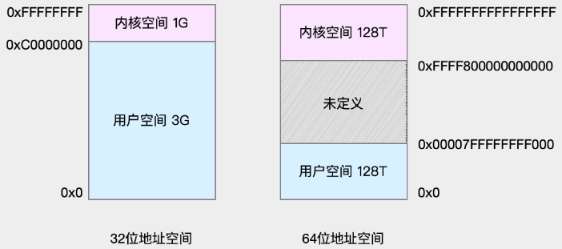

# 一、CPU

## 1、基础

## 2、进程与线程

主要从调度、并发性、拥有的资源和系统开销等方面

进程是操作系统分配资源的最小单元，线程是操作系统调度的最小单元

### 2.1、进程

#### 2.1.1、概述

- 进程表示一个逻辑控制流，就是一种计算过程，它造成一个假象，好像这个进程一直在独占CPU资源；
- 进程拥有一个独立的虚拟内存地址空间，它造成一个假象，好像这个进程一致在独占存储器资源；
- 操作系统利用fork系统调用来创建一个子进程。fork所创建的子进程会复制父进程的虚拟地址空间；
    - fork刚创建的子进程采用了共享的方式，只用指针指向了父进程的物理资源。当子进程真正要对某些物理资源写操作时，才会真正的复制一块物理资源来供子进程使用；
    - fork不只是复制了页表结构，还复制了父进程的文件描述符表，信号控制表，进程信息，寄存器资源等等；
    - fork创建的子进程开始执行的位置是fork函数返回的位置；
    - fork创建的进程pid = 0；
- 进程不能通过直接共享内存的方式来进行进程间通信，只能采用信号、管道等方式来进行进程间通信；

#### 2.1.2、进程的状态

- 运行：进程在执行程序
- 阻塞：进程在等待某个外部信号，比如打印完成、读取磁盘完成
- 就绪：进程在排队等待执行

阻塞态可以知己到运行态吗？就绪态可以直接到阻塞态吗？

**进程如何响应中断：**
- 保存当前状态：中断程序第一时间保存当前状态；
- 跳转OS中断响应程序
- 保存当前寄存器：必须保存当前的寄存器确报不受污染；
- 设置新的栈指针：设置新的SP保证栈不受污染；
- 执行中断服务程序：读取中断关联的数据，例如形成缓冲区；
- 执行下一个进程

#### 2.1.3、进程资源

进程上下文切换的资源：
- 页表 -- 对应虚拟内存资源
- 文件描述符表/打开文件表 -- 对应打开的文件资源
- 寄存器 -- 对应运行时数据
- 信号控制信息/进程运行信息

#### 2.1.4、进程间通信

- 管道pipe：管道是一种半双工的通信方式，数据只能单向流动，而且只能在具有亲缘关系的进程间使用。进程的亲缘关系通常是指父子进程关系
- 命名管道FIFO：有名管道也是半双工的通信方式，但是它允许无亲缘关系进程间的通信；
- 消息队列MessageQueue：消息队列是由消息的链表，存放在内核中并由消息队列标识符标识。消息队列克服了信号传递信息少、管道只能承载无格式字节流以及缓冲区大小受限等缺点；
- 文件
- 共享存储SharedMemory：共享内存就是映射一段能被其他进程所访问的内存，这段共享内存由一个进程创建，但多个进程都可以访问。共享内存是最快的 IPC 方式，它是针对其他进程间通信方式运行效率低而专门设计的。它往往与其他通信机制，如信号两，配合使用，来实现进程间的同步和通信；
- 信号量Semaphore：信号量是一个计数器，可以用来控制多个进程对共享资源的访问。它常作为一种锁机制，防止某进程正在访问共享资源时，其他进程也访问该资源。因此，主要作为进程间以及同一进程内不同线程之间的同步手段；Semaphore 内部封装一个整数（P）和一个睡眠线程集合（S），并提供两个原子操作：
    - up()
        * p=p+1
        * 如果s.size() > 1，从s中选择一个唤醒并执行；
    - down()
        * if(p == 0) (sleep(&Semaphore))
        * p--
- 套接字Socket：套接字也是一种进程间通信机制，与其他通信机制不同的是，它可用于不同及其间的进程通信
- 信号(sinal) ： 信号是一种比较复杂的通信方式，用于通知接收进程某个事件已经发生。

### 2.2、线程

- 线程解决的最大问题就是它可以很简单地表示共享资源的问题，这里说的资源指的是存储器资源，资源最后都会加载到物理内存，一个进程的所有线程都是共享这个进程的同一个虚拟地址空间的，也就是说从线程的角度来说，它们看到的物理资源都是一样的，这样就可以通过共享变量的方式来表示共享资源，也就是直接共享内存的方式解决了线程通信的问题；
- 在Linux系统中，线程是使用clone系统调用，clone是一个轻量级的fork；它提供了一系列的参数来表示线程可以共享父类的哪些资源;
- 线程上下文切换需保存的内容：线程的id、寄存器中的值、栈数据、状态

**谁创建了线程**

**谁销毁线程**

**谁调度线程：** 内核负责调度线程

### 2.3、[协程](https://en.wikipedia.org/wiki/Coroutine)

- [在性能优化中使用协程](../../../性能优化/性能优化.md#5协程)
- [协程（coroutine）简介](https://yearn.xyz/posts/techs/%E5%8D%8F%E7%A8%8B/)

协程就是用户态的线程；协程在异步化之上包了一层外衣，兼顾了开发效率与运行效率；

**协程如何实现高并发**

协程与异步编程相似的地方在于，它们必须使用非阻塞的系统调用与内核交互，把切换请求的权力牢牢掌握在用户态的代码中。但不同的地方在于，协程把异步化中的两段函数（业务执行和回调函数），封装为一个阻塞的协程函数。这个函数执行时，会使调用它的协程无感知地放弃执行权，由协程框架切换到其他就绪的协程继续执行。当这个函数的结果满足后，协程框架再选择合适的时机，切换回它所在的协程继续执行。

**协程的切换是如何完成**

用户态的代码切换协程，与内核切换线程的原理是一样的。内核通过管理 CPU 的寄存器来切换线程，以最重要的栈寄存器和指令寄存器为例，看看协程切换时如何切换程序指令与内存；
- 线程的切换：每个线程有独立的栈，而栈既保留了变量的值，也保留了函数的调用关系、参数和返回值，CPU 中的栈寄存器 SP 指向了当前线程的栈，而指令寄存器 IP 保存着下一条要执行的指令地址。因此，从线程 1 切换到线程 2 时，首先要把 SP、IP 寄存器的值为线程 1 保存下来，再从内存中找出线程 2 上一次切换前保存好的寄存器值，写入 CPU 的寄存器，这样就完成了线程切换
- 协程的切换与此相同，只是把内核的工作转移到协程框架实现而已 - 创建协程时，会从进程的堆中分配一段内存作为协程的栈。线程的栈有 8MB，而协程栈的大小通常只有几十 KB。而且，C 库内存池也不会为协程预分配内存，它感知不到协程的存在。这样，更低的内存占用空间为高并发提供了保证，毕竟十万并发请求，就意味着 10 万个协程。当然，栈缩小后，就尽量不要使用递归函数，也不能在栈中申请过多的内存，这是实现高并发必须付出的代价；

### 2.4、区别

- 进程采用fork创建，线程采用clone创建；
- 线程是程序执行的最小单位，而进程是操作系统分配资源的最小单位；一个进程由一个或多个线程组成，线程是一个进程中代码的不同执行路线；
- 进程fork创建的子进程的逻辑流位置在fork返回的位置，线程clone创建的KSE的逻辑流位置在clone调用传入的方法位置，比如Java的Thread的run方法位置；
- 进程拥有独立的虚拟内存地址空间和内核数据结构(页表，打开文件表等)，当子进程修改了虚拟页之后，会通过写时拷贝创建真正的物理页。线程共享进程的虚拟地址空间和内核数据结构，共享同样的物理页；
- 多个进程通信只能采用进程间通信的方式，比如信号，管道，而不能直接采用简单的共享内存方式，原因是每个进程维护独立的虚拟内存空间，所以每个进程的变量采用的虚拟地址是不同的。多个线程通信就很简单，直接采用共享内存的方式，因为不同线程共享一个虚拟内存地址空间，变量寻址采用同一个虚拟内存；
- 进程上下文切换需要切换页表等重量级资源，线程上下文切换只需要切换寄存器等轻量级数据；
- 进程的用户栈独享栈空间，线程的用户栈共享虚拟内存中的栈空间，没有进程高效；
- 一个应用程序可以有多个进程，执行多个程序代码，多个线程只能执行一个程序代码，共享进程的代码段；
- 进程采用父子结构，线程采用对等结构

## 3、存储与寻址

CPU不仅采用了扩充的存储器段式管理机制，而且还提供了可选的存储器分页管理机制

## 4、中断

- [中断内核分析](https://arthurchiao.art/blog/linux-irq-softirq-zh/)

### 4.1、概述

中断其实是一种异步的事件处理机制，可以提高系统的并发处理能力。

由于中断处理程序会打断其他进程的运行，所以，为了减少对正常进程运行调度的影响，中断处理程序就需要尽可能快地运行。如果中断本身要做的事情不多，那么处理起来也不会有太大问题；但如果中断要处理的事情很多，中断服务程序就有可能要运行很长时间；

特别是，中断处理程序在响应中断时，还会临时关闭中断。这就会导致上一次中断处理完成之前，其他中断都不能响应，也就是说中断有可能会丢失

为了解决中断处理程序执行过长和中断丢失的问题，Linux 将中断处理过程分成了两个阶段，也就是上半部和下半部：
- 上半部用来快速处理中断，它在中断禁止模式下运行，主要处理跟硬件紧密相关的或时间敏感的工作。
- 下半部用来延迟处理上半部未完成的工作，通常以内核线程的方式运行

举个网卡接收数据包的例子例子说明：网卡接收到数据包后，会通过硬件中断的方式，通知内核有新的数据到了。这时，内核就应该调用中断处理程序来响应它，这种情况下的上半部和下半部分别负责什么工作呢？
- 对上半部来说，既然是快速处理，就是要把网卡的数据读到内存中，然后更新一下硬件寄存器的状态（表示数据已经读好了），最后再发送一个**软中断**信号，通知下半部做进一步的处理。
- 下半部被软中断信号唤醒后，需要从内存中找到网络数据，再按照网络协议栈，对数据进行逐层解析和处理，直到把它送给应用程序；<br/>
这两个阶段也可以这么理解：
- 上半部直接处理硬件请求，也就是常说的硬中断，特点是快速执行；
- 下半部则是由内核触发，也就是常说的软中断，特点是延迟执行。

### 4.2、软中断

上半部会打断 CPU 正在执行的任务，然后立即执行中断处理程序。

软中断是一个内核子系统，下半部以内核线程的方式执行：
- 每个 CPU 都对应一个软中断内核线程，名字为 “ksoftirqd/CPU 编号”，比如说， 0 号 CPU 对应的软中断内核线程的名字就是 ksoftirqd/0。负责处理各种类型的 softirq 中断事件；

不过要注意的是，软中断不只包括了刚刚硬件设备中断处理程序的下半部，一些内核自定义的事件也属于软中断，比如内核调度和 RCU 锁（Read-Copy Update 的缩写，RCU 是 Linux 内核中最常用的锁之一）等。

Linux 中的软中断包括网络收发、定时、调度、RCU 锁等各种类型

**查看软中断和内核线程**

proc 文件系统。它是一种内核空间和用户空间进行通信的机制，可以用来查看内核的数据结构，或者用来动态修改内核的配置。其中：
- `/proc/softirqs` 提供了软中断的运行情况；
- `/proc/interrupts` 提供了硬中断的运行情况。

运行下面的命令，查看 /proc/softirqs 文件的内容，可以看到各种类型软中断在不同 CPU 上的累积运行次数：
```bash
$ cat /proc/softirqs
                    CPU0       CPU1
          HI:          0          0
       TIMER:     811613    1972736
      NET_TX:         49          7
      NET_RX:    1136736    1506885
       BLOCK:          0          0
    IRQ_POLL:          0          0
     TASKLET:     304787       3691
       SCHED:     689718    1897539
     HRTIMER:          0          0
         RCU:    1330771    1354737
```
需要注意的是：
- （1）要注意软中断的类型，也就是上面的第一列的内容，软中断包括了 10 个类别，分别对应不同的工作类型。比如 NET_RX 表示网络接收中断，而 NET_TX 表示网络发送中断
- （2）要注意同一种软中断在不同 CPU 上的分布情况，也就是同一行的内容。正常情况下，同一种中断在不同 CPU 上的累积次数应该差不多

TASKLET 在不同 CPU 上的分布并不均匀。TASKLET 是最常用的软中断实现机制，每个 TASKLET 只运行一次就会结束 ，并且只在调用它的函数所在的 CPU 上运行；因此，使用 TASKLET 特别简便，当然也会存在一些问题，比如说由于只在一个 CPU 上运行导致的调度不均衡，再比如因为不能在多个 CPU 上并行运行带来了性能限制；

> 这里的各类软中断次数，它是系统运行以来的累积中断次数。所以直接查看文件内容，得到的只是累积中断次数

有的时候需要关注这些中断次数的变化速率，如果需要观察，可以使用watch命令，定期运行一个命令来查看输出；如果再加上 -d 参数，还可以高亮出变化的部分，从高亮部分就可以直观看出，哪些内容变化得更快：
```bash
$ watch -d cat /proc/softirqs
                    CPU0       CPU1
          HI:          0          0
       TIMER:    1083906    2368646
      NET_TX:         53          9
      NET_RX:    1550643    1916776
       BLOCK:          0          0
    IRQ_POLL:          0          0
     TASKLET:     333637       3930
       SCHED:     963675    2293171
     HRTIMER:          0          0
         RCU:    1542111    1590625
```
通过 /proc/softirqs 文件内容的变化情况，可以发现 TIMER（定时中断）、NET_RX（网络接收）、SCHED（内核调度）、RCU（RCU 锁）等都会不停的变化；

如何查看软中断内核线程的 ksoftirqd/CPU 编号。那要怎么查看这些线程的运行状况呢？
```bash
$ ps aux | grep softirq
root         7  0.0  0.0      0     0 ?        S    Oct10   0:01 [ksoftirqd/0]
root        16  0.0  0.0      0     0 ?        S    Oct10   0:01 [ksoftirqd/1]
```
这些线程的名字外面都有中括号，这说明 ps 无法获取它们的命令行参数（cmline）。一般来说，ps 的输出中，名字括在中括号里的，一般都是内核线程;

软中断事件的频率过高时，内核线程也会因为 CPU 使用率过高而导致软中断处理不及时，进而引发网络收发延迟、调度缓慢等性能问题。软中断 CPU 使用率过高也是一种最常见的性能问题

## 5、调度

- [进程调度算法](https://mp.weixin.qq.com/s/ZifCDDU-zdUa7fOFo7epiw)

### 5.1、调度任务特征


### 5.2、调度时机


### 5.3、调度算法


## 6、CPU上下文

每个任务运行前，CPU 都需要知道任务从哪里加载、又从哪里开始运行，也就是说，需要系统事先帮它设置好 **CPU 寄存器和程序计数器（Program Counter，PC）**
- CPU 寄存器，是 CPU 内置的容量小、但速度极快的内存。
- 程序计数器，则是用来存储 CPU 正在执行的指令位置、或者即将执行的下一条指令位置。<br/>
它们都是 CPU 在运行任何任务前，必须的依赖环境，因此也被叫做 **CPU 上下文**

**CPU 上下文切换**：就是先把前一个任务的 CPU 上下文（也就是 CPU 寄存器和程序计数器）保存起来，然后加载新任务的上下文到这些寄存器和程序计数器，最后再跳转到程序计数器所指的新位置，运行新任务。

根据任务的不同，CPU 的上下文切换就可以分为几个不同的场景：
- 进程上下文切换
- 线程上下文切换
- 中断上下文切换

### 6.1、进程上下文切换

Linux 按照特权等级，把进程的运行空间分为内核空间和用户空间，分别对应着下图中， CPU 特权等级的 Ring 0 和 Ring 3
- 内核空间（Ring 0）具有最高权限，可以直接访问所有资源；
- 用户空间（Ring 3）只能访问受限资源，不能直接访问内存等硬件设备，必须通过系统调用陷入到内核中，才能访问这些特权资源。


换个角度看，进程既可以在用户空间运行，又可以在内核空间中运行。进程在用户空间运行时，被称为进程的用户态，而陷入内核空间的时候，被称为进程的内核态

从用户态到内核态的转变，需要通过**系统调用**来完成。比如，当我们查看文件内容时，就需要多次系统调用来完成：首先调用 open() 打开文件，然后调用 read() 读取文件内容，并调用 write() 将内容写到标准输出，最后再调用 close() 关闭文件；

系统调用的过程中，发生 CPU 上下文的切换：
- CPU 寄存器里原来用户态的指令位置，需要先保存起来。接着，为了执行内核态代码，CPU 寄存器需要更新为内核态指令的新位置。最后才是跳转到内核态运行内核任务。
- 系统调用结束后，CPU 寄存器需要恢复原来保存的用户态，然后再切换到用户空间，继续运行进程。所以，一次系统调用的过程，其实是发生了两次 CPU 上下文切换

系统调用过程中，并不会涉及到虚拟内存等进程用户态的资源，也不会切换进程。这跟通常所说的进程上下文切换是不一样的：
- 进程上下文切换，是指从一个进程切换到另一个进程运行。
- 而系统调用过程中一直是同一个进程在运行；因此：系统调用过程通常称为特权模式切换，而不是上下文切换

进程上下文切换跟系统调用的区别：
- **进程是由内核来管理和调度的，进程的切换只能发生在内核态**。所以，进程的上下文不仅包括了虚拟内存、栈、全局变量等用户空间的资源，还包括了内核堆栈、寄存器等内核空间的状态；
- 进程的上下文切换就比系统调用时多了一步：在保存当前进程的内核状态和 CPU 寄存器之前，需要先把该进程的虚拟内存、栈等保存下来；而加载了下一进程的内核态后，还需要刷新进程的虚拟内存和用户栈

每次上下文切换都需要几十纳秒到数微秒的 CPU 时间，详细参考：[How long does it take to make a context switch?](https://blog.tsunanet.net/2010/11/how-long-does-it-take-to-make-context.html)，在进程上下文切换次数较多的情况下，很容易导致 CPU 将大量时间耗费在寄存器、内核栈以及虚拟内存等资源的保存和恢复上，进而大大缩短了真正运行进程的时间

另外 Linux 通过 TLB（Translation Lookaside Buffer）来管理虚拟内存到物理内存的映射关系。所以当虚拟内存更新后，TLB 也需要刷新，内存的访问也会随之变慢；TLB 其实就是 **MMU 中页表的高速缓存**。由于进程的虚拟地址空间是独立的，而 TLB 的访问速度又比 MMU 快得多，所以，通过减少进程的上下文切换，减少 TLB 的刷新次数，就可以提高 TLB 缓存的使用率，进而提高 CPU 的内存访问性能

**什么时候会切换进程上下文？**

进程切换时才需要切换上下文，换句话说，只有在进程调度的时候，才需要切换上下文。Linux 为每个 CPU 都维护了一个就绪队列，将活跃进程（即正在运行和正在等待 CPU 的进程）按照优先级和等待 CPU 的时间排序，然后选择最需要 CPU 的进程，也就是优先级最高和等待 CPU 时间最长的进程来运行

进程在什么时候才会被调度到 CPU 上运行呢？
- 进程执行完终止了；
- 当某个进程的时间片耗尽了，就会被系统挂起，切换到其它正在等待 CPU 的进程运行；
- 进程在系统资源不足（比如内存不足）时，要等到资源满足后才可以运行，这个时候进程也会被挂起，并由系统调度其他进程运行；
- 当进程通过睡眠函数 sleep 这样的方法将自己主动挂起时，自然也会重新调度；
- 当有优先级更高的进程运行时，为了保证高优先级进程的运行，当前进程会被挂起，由高优先级进程来运行；
- 发生硬件中断时，CPU 上的进程会被中断挂起，转而执行内核中的中断服务程序；

### 6.2、线程上下文切换

线程与进程最大的区别在于，线程是调度的基本单位，而进程则是资源拥有的基本单位。所谓内核中的任务调度，实际上的调度对象是线程；而进程只是给线程提供了虚拟内存、全局变量等资源；

线程有自己的私有数据，比如栈和寄存器等，这些在上下文切换时是需要保存的。线程的上下文切换其实就可以分为两种情况：
- 前后两个线程属于不同进程。此时，因为资源不共享，所以切换过程就跟进程上下文切换是一样。
- 前后两个线程属于同一个进程。此时，因为虚拟内存是共享的，所以在切换时，虚拟内存这些资源就保持不动，只需要切换线程的私有数据、寄存器等不共享的数据

### 6.3、中断上下文切换

为了快速响应硬件的事件，中断处理会打断进程的正常调度和执行，转而调用中断处理程序，响应设备事件。而在打断其他进程时，就需要将进程当前的状态保存下来，这样在中断结束后，进程仍然可以从原来的状态恢复运行

中断上下文切换不涉及到进程的用户态。所以，即便中断过程打断了一个正处在用户态的进程，也不需要保存和恢复这个进程的虚拟内存、全局变量等用户态资源。中断上下文，其实只包括内核态中断服务程序执行所必需的状态，包括 CPU 寄存器、内核堆栈、硬件中断参数等。

对同一个 CPU 来说，中断处理比进程拥有更高的优先级，所以**中断上下文切换并不会与进程上下文切换同时发生**。中断会打断正常进程的调度和执行；

另外，跟进程上下文切换一样，中断上下文切换也需要消耗 CPU，切换次数过多也会耗费大量的 CPU，甚至严重降低系统的整体性能。

### 6.4、查看系统的上下文切换

过多的上下文切换，会把 CPU 时间消耗在寄存器、内核栈以及虚拟内存等数据的保存和恢复上，缩短进程真正运行的时间，成了系统性能大幅下降的一个元凶

使用 `vmstat` 这个工具，来查询系统的上下文切换情况，`vmstat`是一个常用的系统性能分析工具，主要分析系统的内存使用情况，也可分析 CPU 上下文切换和中断的次数
```bash
## 每隔 5 秒输出 1 组数据
$ vmstat 5
procs -----------memory---------- ---swap-- -----io---- -system-- ------cpu-----
 r  b   swpd   free   buff  cache   si   so    bi    bo   in    cs us sy id  wa st
 0  0      0 7005360  91564 818900    0    0     0     0   25   33  0  0 100  0  0
```
特别关注的四列内容：
- `cs（context switch）`是每秒上下文切换的次数。
- `in（interrupt）`则是每秒中断的次数。
- `r（Running or Runnable）`是就绪队列的长度，也就是正在运行和等待 CPU 的进程数。
- `b（Blocked）`则是处于不可中断睡眠状态的进程数。

`pidstat` 查看每个进程的详细情况
```bash
## 每隔 5 秒输出 1 组数据
$ pidstat -w 5
Linux 4.15.0 (ubuntu)  09/23/18  _x86_64_  (2 CPU)
08:18:26      UID       PID   cswch/s nvcswch/s  Command
08:18:31        0         1      0.20      0.00  systemd
08:18:31        0         8      5.40      0.00  rcu_sched
...
```
- 一个是 cswch ，表示每秒自愿上下文切换（voluntary context switches）的次数；所谓**自愿上下文切换**，是指进程无法获取所需资源，导致的上下文切换。比如说， I/O、内存等系统资源不足时，就会发生自愿上下文切换
- 另一个则是 nvcswch ，表示每秒非自愿上下文切换（non voluntary context switches）的次数；**非自愿上下文切换**，则是指进程由于时间片已到等原因，被系统强制调度，进而发生的上下文切换。比如说，大量进程都在争抢 CPU 时，就容易发生非自愿上下文切换

### 6.5、例子

可以使用 sysbench 来模拟系统多线程调度切换的情况，比如：
```bash
## 以 10 个线程运行 5 分钟的基准测试，模拟多线程切换的问题
$ sysbench --threads=10 --max-time=300 threads run
```
观察情况：
```bash
## 每隔 1 秒输出 1 组数据（需要 Ctrl+C 才结束）
$ vmstat 1
procs -----------memory---------- ---swap-- -----io---- -system-- ------cpu-----
 r  b   swpd   free   buff  cache   si   so    bi    bo   in   cs us sy id wa st
 6  0      0 6487428 118240 1292772    0    0     0     0 9019 1398830 16 84  0  0  0
 8  0      0 6487428 118240 1292772    0    0     0     0 10191 1392312 16 84  0  0  0
```
系统的就绪队列(`r`)过长，也就是正在运行和等待 CPU 的进程数过多，导致了大量的上下文切换，而上下文切换又导致了系统 CPU 的占用率升高；

使用 pidstat 观察
```bash
## 每隔 1 秒输出 1 组数据（需要 Ctrl+C 才结束）
## -w 参数表示输出进程切换指标，而 -u 参数则表示输出 CPU 使用指标
$ pidstat -w -u 1
08:06:33      UID       PID    %usr %system  %guest   %wait    %CPU   CPU  Command
08:06:34        0     10488   30.00  100.00    0.00    0.00  100.00     0  sysbench
08:06:34        0     26326    0.00    1.00    0.00    0.00    1.00     0  kworker/u4:2
08:06:33      UID       PID   cswch/s nvcswch/s  Command
08:06:34        0         8     11.00      0.00  rcu_sched
```
在 vmstat 命令的结果中，中断次数也上升到了 1 万，如何知道中断发生的类型，从 `/proc/interrupts` 这个只读文件中读取。`/proc` 实际上是 Linux 的一个虚拟文件系统，用于内核空间与用户空间之间的通信。`/proc/interrupts` 就是这种通信机制的一部分，提供了一个只读的中断使用情况
```bash
## -d 参数表示高亮显示变化的区域
$ watch -d cat /proc/interrupts
           CPU0       CPU1
...
RES:    2450431    5279697   Rescheduling interrupts
...
```
变化速度最快的是`重调度中断（RES）`，这个中断类型表示，唤醒空闲状态的 CPU 来调度新的任务运行。这是多处理器系统（SMP）中，调度器用来分散任务到不同 CPU 的机制，通常也被称为处理器间中断（Inter-Processor Interrupts，IPI）

### 6.6、总结

**每秒上下文切换多少次才算正常？** 这个数值其实取决于系统本身的 CPU 性能。如果系统的上下文切换次数比较稳定，那么从数百到一万以内，都应该算是正常的。但当上下文切换次数超过一万次，或者切换次数出现数量级的增长时，就很可能已经出现了性能问题，可能得问题：
- 自愿上下文切换变多了，说明进程都在等待资源，有可能发生了 I/O 等其他问题；
- 非自愿上下文切换变多了，说明进程都在被强制调度，也就是都在争抢 CPU，说明 CPU 的确成了瓶颈；
- 中断次数变多了，说明 CPU 被中断处理程序占用，还需要通过查看 `/proc/interrupts` 文件来分析具体的中断类型

## 7、CPU使用率

### 7.1、节拍率

为了维护 CPU 时间，Linux 通过事先定义的节拍率（内核中表示为 HZ），触发时间中断，并使用全局变量 Jiffies 记录了开机以来的节拍数。每发生一次时间中断，Jiffies 的值就加 1；

节拍率 HZ 是内核的可配选项，可以设置为 100、250、1000 等，查看节拍率，可以通过查询 /boot/config 内核选项
```bash
$ grep 'CONFIG_HZ=' /boot/config-$(uname -r)
CONFIG_HZ=1000
```
如上，节拍率设置成了 1000，也就是每秒钟触发 1000 次时间中断；

因为节拍率 HZ 是内核选项，所以用户空间程序并不能直接访问。为了方便用户空间程序，内核还提供了一个用户空间节拍率 USER_HZ，它总是固定为 100，也就是 1/100 秒。这样，用户空间程序并不需要关心内核中 HZ 被设置成了多少，因为它看到的总是固定值 USER_HZ

### 7.2、CPU使用率

CPU 使用率描述了非空闲时间占总 CPU 时间的百分比，根据 CPU 上运行任务的不同，又被分为用户 CPU、系统 CPU、等待 I/O CPU、软中断和硬中断等

Linux 通过 /proc 虚拟文件系统，向用户空间提供了系统内部状态的信息，而 /proc/stat 提供的就是系统的 CPU 和任务统计信息，只关注 CPU 的话，可以执行下面的命令：
```bash
## 只保留各个 CPU 的数据
$ cat /proc/stat | grep ^cpu
cpu  280580 7407 286084 172900810 83602 0 583 0 0 0
cpu0 144745 4181 176701 86423902 52076 0 301 0 0 0
cpu1 135834 3226 109383 86476907 31525 0 282 0 0 0
```
其中，第一列表示的是 CPU 编号，如 cpu0、cpu1 ，而第一行没有编号的 cpu ，表示的是所有 CPU 的累加。其他列则表示不同场景下 CPU 的累加节拍数，它的单位是 USER_HZ，也就是 10 ms（1/100 秒），所以这其实就是不同场景下的 CPU 时间。每一列的含义：
- user（通常缩写为 us），代表用户态 CPU 时间。注意，它不包括下面的 nice 时间，但包括了 guest 时间。
- nice（通常缩写为 ni），代表低优先级用户态 CPU 时间，也就是进程的 nice 值被调整为 1-19 之间时的 CPU 时间。这里注意，nice 可取值范围是 -20 到 19，数值越大，优先级反而越低。
- system（通常缩写为 sys），代表内核态 CPU 时间。
- idle（通常缩写为 id），代表空闲时间。注意，它不包括等待 I/O 的时间（iowait）。
- iowait（通常缩写为 wa），代表等待 I/O 的 CPU 时间。
- irq（通常缩写为 hi），代表处理硬中断的 CPU 时间。
- softirq（通常缩写为 si），代表处理软中断的 CPU 时间。
- steal（通常缩写为 st），代表当系统运行在虚拟机中的时候，被其他虚拟机占用的 CPU 时间。
- guest（通常缩写为 guest），代表通过虚拟化运行其他操作系统的时间，也就是运行虚拟机的 CPU 时间。
- guest_nice（通常缩写为 gnice），代表以低优先级运行虚拟机的时间。

CPU 使用率，就是除了空闲时间外的其他时间占总 CPU 时间的百分比，用公式来表示就是：

$$ CPU使用率 = 1 - \frac{空闲时间}{总CPU时间} $$

根据公式，可以从 `/proc/stat` 中的数据，很容易地计算出 CPU 使用率，这是开机以来的节拍数累加值，所以直接算出来的，是开机以来的平均 CPU 使用率，一般没啥参考价值；为了计算 CPU 使用率，性能工具一般都会取间隔一段时间（比如 3 秒）的两次值，作差后，再计算出这段时间内的平均 CPU 使用率，即

$$ 平均CPU使用率 = 1 - \frac{空闲时间_{new} - 空闲时间_{old}}{总CPU时间_{new} - 总CPU时间_{old}} $$

这个公式，就是各种性能工具所看到的 CPU 使用率的实际计算方法;

进程的CPU使用率：跟系统的指标类似，Linux 也给每个进程提供了运行情况的统计信息，也就是 `/proc/[pid]/stat`。不过，这个文件包含的数据就比较丰富了，总共有 52 列的数据

性能分析工具给出的都是间隔一段时间的平均 CPU 使用率，所以要注意间隔时间的设置

有哪些常见CPU使用率，以及可能得问题：
- 用户 CPU 使用率，包括用户态 CPU 使用率（user）和低优先级用户态 CPU 使用率（nice），表示 CPU 在用户态运行的时间百分比。用户 CPU 使用率高，通常说明有应用程序比较繁忙。
- 系统 CPU 使用率，表示 CPU 在内核态运行的时间百分比（不包括中断）。系统 CPU 使用率高，说明内核比较繁忙。
- 等待 I/O 的 CPU 使用率，通常也称为 iowait，表示等待 I/O 的时间百分比。iowait 高，通常说明系统与硬件设备的 I/O 交互时间比较长。
- 软中断和硬中断的 CPU 使用率，分别表示内核调用软中断处理程序、硬中断处理程序的时间百分比。它们的使用率高，通常说明系统发生了大量的中断。
- 还有在虚拟化环境中会用到的窃取 CPU 使用率（steal）和客户 CPU 使用率（guest），分别表示被其他虚拟机占用的 CPU 时间百分比，和运行客户虚拟机的 CPU 时间百分比。

### 7.3、查看CPU使用率

top 和 ps 是最常用的性能分析工具：
- top 显示了系统总体的 CPU 和内存使用情况，以及各个进程的资源使用情况。
- ps 则只显示了每个进程的资源使用情况。

top的输出格式为：
```bash
## 默认每 3 秒刷新一次
$ top
top - 11:58:59 up 9 days, 22:47,  1 user,  load average: 0.03, 0.02, 0.00
Tasks: 123 total,   1 running,  72 sleeping,   0 stopped,   0 zombie
%Cpu(s):  0.3 us,  0.3 sy,  0.0 ni, 99.3 id,  0.0 wa,  0.0 hi,  0.0 si,  0.0 st
KiB Mem :  8169348 total,  5606884 free,   334640 used,  2227824 buff/cache
KiB Swap:        0 total,        0 free,        0 used.  7497908 avail Mem
 
  PID USER      PR  NI    VIRT    RES    SHR S  %CPU %MEM     TIME+ COMMAND
    1 root      20   0   78088   9288   6696 S   0.0  0.1   0:16.83 systemd
    2 root      20   0       0      0      0 S   0.0  0.0   0:00.05 kthreadd
    4 root       0 -20       0      0      0 I   0.0  0.0   0:00.00 kworker/0:0H
...
```
- 第三行 %Cpu 就是系统的 CPU 使用率，需要注意，top 默认显示的是所有 CPU 的平均值，这个时候你只需要按下数字 1 ，就可以切换到每个 CPU 的使用率了。
- 空白行之后是进程的实时信息，每个进程都有一个 %CPU 列，表示进程的 CPU 使用率。它是用户态和内核态 CPU 使用率的总和，包括进程用户空间使用的 CPU、通过系统调用执行的内核空间 CPU 、以及在就绪队列等待运行的 CPU。在虚拟化环境中，它还包括了运行虚拟机占用的 CPU；

top 并没有细分进程的用户态 CPU 和内核态 CPU，可以使用 pidstat ，它正是一个专门分析每个进程 CPU 使用情况的工具没，比如下面的 pidstat 命令，就间隔 1 秒展示了进程的 5 组 CPU 使用率，包括：
- 用户态 CPU 使用率 （%usr）；
- 内核态 CPU 使用率（%system）；
- 运行虚拟机 CPU 使用率（%guest）；
- 等待 CPU 使用率（%wait）；
- 总的 CPU 使用率（%CPU）。
```bash
## 每隔 1 秒输出一组数据，共输出 5 组
$ pidstat 1 5
15:56:02      UID       PID    %usr %system  %guest   %wait    %CPU   CPU  Command
15:56:03        0     15006    0.00    0.99    0.00    0.00    0.99     1  dockerd
...
Average:      UID       PID    %usr %system  %guest   %wait    %CPU   CPU  Command
Average:        0     15006    0.00    0.99    0.00    0.00    0.99     -  dockerd
```

### 7.4、CPU使用率过高

通过 top、ps、pidstat 等工具，能够轻松找到 CPU 使用率较高（比如 100% ）的进程。接下来，如何知道占用 CPU 的到底是代码里的哪个函数呢？
- GDB（The GNU Project Debugger），GDB 在调试程序错误方面很强大，但是因为 GDB 调试程序的过程会中断程序运行，这在线上环境往往是不允许的。所以，GDB 只适合用在性能分析的后期，当找到了出问题的大致函数后，线下再借助它来进一步调试函数内部的问题；
- perf 是 Linux 2.6.31 以后内置的性能分析工具。它以性能事件采样为基础，不仅可以分析系统的各种事件和内核性能，还可以用来分析指定应用程序的性能问题，使用 perf 分析 CPU 性能问题，两种常见的用法：
    -  perf top，类似于 top，它能够实时显示占用 CPU 时钟最多的函数或者指令，因此可以用来查找热点函数
        ```bash
        $ perf top
        Samples: 833  of event 'cpu-clock', Event count (approx.): 97742399
        Overhead  Shared Object       Symbol
        7.28%  perf                [.] 0x00000000001f78a4
        4.72%  [kernel]            [k] vsnprintf
        4.32%  [kernel]            [k] module_get_kallsym
        3.65%  [kernel]            [k] _raw_spin_unlock_irqrestore
        ...
        ```
        输出结果中，第一行包含三个数据，分别是采样数（Samples）、事件类型（event）和事件总数量（Event count）。比如这个例子中，perf 总共采集了 833 个 CPU 时钟事件，而总事件数则为 97742399，表格式样的数据，每一行包含四列，分别是：
        - 第一列 Overhead ，是该符号的性能事件在所有采样中的比例，用百分比来表示。
        - 第二列 Shared ，是该函数或指令所在的动态共享对象（Dynamic Shared Object），如内核、进程名、动态链接库名、内核模块名等。
        - 第三列 Object ，是动态共享对象的类型。比如 `[.]` 表示用户空间的可执行程序、或者动态链接库，而 `[k]` 则表示内核空间。
        - 最后一列 Symbol 是符号名，也就是函数名。当函数名未知时，用十六进制的地址来表示。
    - perf record 和 perf report：perf top 虽然实时展示了系统的性能信息，但它的缺点是并不保存数据，也就无法用于离线或者后续的分析。而 perf record 则提供了保存数据的功能，保存后的数据，需要你用 perf report 解析展示
        ```bash
        $ perf record ## 按 Ctrl+C 终止采样
        [ perf record: Woken up 1 times to write data ]
        [ perf record: Captured and wrote 0.452 MB perf.data (6093 samples) ]
        $ perf report ## 展示类似于 perf top 的报告
        ```
        还可以 perf top 和 perf record 加上 `-g` 参数，开启调用关系的采样，方便根据调用链来分析性能问题

### 7.5、案例

相关案例参考：[CPU使用问题](../../../Java/实际场景/线上问题排查思路.md#2cpu使用问题)

## 8、CPU性能指标

- **CPU使用率**：最常见的一个性能指标，参考：[CPU使用率](#7cpu使用率)
- [平均负载（Load Average）](../../../性能优化/性能优化.md#111平均负载)：理想情况下，平均负载等于逻辑 CPU 个数，这表示每个 CPU 都恰好被充分利用。如果平均负载大于逻辑 CPU 个数，就表示负载比较重了；
- [进程上下文切换](#61进程上下文切换)：过多的上下文切换，会将原本运行进程的 CPU 时间，消耗在寄存器、内核栈以及虚拟内存等数据的保存和恢复上，缩短进程真正运行的时间，成为性能瓶颈
- CPU 缓存的命中率

## 9、性能工具

（1）平均负载：先用 uptime，查看了系统的平均负载；而在平均负载升高后，用 mpstat 和 pidstat ，分别观察了每个 CPU 和每个进程 CPU 的使用情况，进而找出了导致平均负载升高的进程

（2）上下文切换：先用 vmstat ，查看了系统的上下文切换次数和中断次数；然后通过 pidstat ，观察了进程的自愿上下文切换和非自愿上下文切换情况；最后通过 pidstat ，观察了线程的上下文切换情况，找出了上下文切换次数增多的根源；

（3）进程 CPU 使用率升高：先用 top ，查看了系统和进程的 CPU 使用情况，发现 CPU 使用率升高的进程；再用 perf top ，观察CPU 使用率升高的进程的调用链，最终找出 CPU 升高的根源；

（4）系统的 CPU 使用率升高：先用 top 观察到了系统 CPU 升高，但通过 top 和 pidstat ，却找不出高 CPU 使用率的进程。于是，重新审视 top 的输出，又从 CPU 使用率不高但处于 Running 状态的进程入手，找出了可疑之处，最终通过 perf record 和 perf report，定位到短时进程；短时进程还可以使用 execsnoop；

（5）不可中断进程和僵尸进程：先用 top 观察到了 iowait 升高的问题，并发现了大量的不可中断进程和僵尸进程；接着用 dstat 发现是这是由磁盘读导致的，于是又通过 pidstat 找出了相关的进程。但用 strace 查看进程系统调用却失败了，最终还是用 perf 分析进程调用链，才发现根源在于磁盘直接 I/O

（6）软中断：通过 top 观察到，系统的软中断 CPU 使用率升高；接着查看 `/proc/softirqs`， 找到了几种变化速率较快的软中断；然后通过 sar 命令，发现是网络小包的问题，最后再用 tcpdump ，找出网络帧的类型和来源；

## 10、关联性能指标与性能工具

**第一个维度：从 CPU 的性能指标出发。也就是说，当要查看某个性能指标时，要清楚知道哪些工具可以做到**


**第二个维度，从工具出发。也就是当已经安装了某个工具后，要知道这个工具能提供哪些指标。**


# 二、内存

- [Memory Barriers: a Hardware View for Software Hackers](https://www.puppetmastertrading.com/images/hwViewForSwHackers.pdf)
- [A Tutorial Introduction to the ARM and POWER Relaxed Memory Models](https://www.cl.cam.ac.uk/~pes20/ppc-supplemental/test7.pdf)
- [x86-TSO: A Rigorous and Usable Programmer’s Model for x86 Multiprocessors](https://www.cl.cam.ac.uk/~pes20/weakmemory/cacm.pdf)
- [破解虚拟内存：malloc、堆和程序中断](https://blog.holbertonschool.com/hack-the-virtual-memory-malloc-the-heap-the-program-break/)

内存管理也是操作系统最核心的功能之一。内存主要用来存储系统和应用程序的指令、数据、缓存等

## 1、内存映射

通常所说的内存容量，其实指的是物理内存。物理内存也称为主存，大多数计算机用的主存都是动态随机访问内存（DRAM）。只有内核才可以直接访问物理内存；如果 进程要访问内存时该如何处理？

Linux 内核给每个进程都提供了一个独立的虚拟地址空间，并且这个地址空间是连续的。这样，进程就可以很方便地访问内存，更确切地说是访问**虚拟内存**；

虚拟地址空间的内部又被分为**内核空间和用户空间** 两部分，不同字长（也就是单个 CPU 指令可以处理数据的最大长度）的处理器，地址空间的范围也不同，比如最常见的 32 位和 64 位系统



通过上图可以看出：
- 32 位系统的内核空间占用 1G，位于最高处，剩下的 3G 是用户空间
- 64 位系统的内核空间和用户空间都是 128T，分别占据整个内存空间的最高和最低处，剩下的中间部分是未定义的；

进程的用户态和内核态：
- 进程在用户态时，只能访问用户空间内存；
- 只有进入内核态后，才可以访问内核空间内存。<br/>
虽然每个进程的地址空间都包含了内核空间，但这些内核空间，其实关联的都是相同的物理内存。这样，进程切换到内核态后，就可以很方便地访问内核空间内存。

并不是所有的虚拟内存都会分配物理内存，只有那些实际使用的虚拟内存才分配物理内存，并且分配后的物理内存，是通过 **内存映射** 来管理的，内存映射，其实就是将**虚拟内存地址** 映射到**物理内存地址**。为了完成内存映射，内核为每个进程都维护了一张页表，记录虚拟地址与物理地址的映射关系；


**页表** 实际上存储在 CPU 的内存管理单元 MMU 中，这样，正常情况下，处理器就可以直接通过硬件，找出要访问的内存；而当进程访问的虚拟地址在页表中查不到时，系统会产生一个**缺页异常**，进入内核空间分配物理内存、更新进程页表，最后再返回用户空间，恢复进程的运行

Linux 通过 TLB（Translation Lookaside Buffer）来管理虚拟内存到物理内存的映射关系。所以当虚拟内存更新后，TLB 也需要刷新，内存的访问也会随之变慢；TLB 是 **MMU 中页表的高速缓存**。由于进程的虚拟地址空间是独立的，而 TLB 的访问速度又比 MMU 快得多，所以，**通过减少进程的上下文切换**，减少 TLB 的刷新次数，就可以提高 TLB 缓存的使用率，进而提高 CPU 的内存访问性能

MMU 规定了一个内存映射的最小单位，也就是**页**，通常是 4 KB 大小。这样，每一次内存映射，都需要关联 4 KB 或者 4KB 整数倍的内存空间。页的大小只有 4 KB ，导致的另一个问题就是，整个页表会变得非常大。比方说，仅 32 位系统就需要 100 多万个页表项（4GB/4KB），才可以实现整个地址空间的映射。为了解决页表项过多的问题，Linux 提供了两种机制，也就是**多级页表** 和**大页（HugePage）**
- *多级页表就是把内存分成区块来管理，将原来的映射关系改成区块索引和区块内的偏移*，由于虚拟内存空间通常只用了很少一部分，那么，多级页表就只保存这些使用中的区块，这样就可以大大地减少页表的项数；Linux 用的是四级页表来管理内存页；
- **大页**，就是比普通页更大的内存块，常见的大小有 2MB 和 1GB。大页通常用在使用大量内存的进程上，比如 Oracle、DPDK 等；

## 2、虚拟内存空间分布

用户空间内存被分成了多个不同的段，下图是32位系统各个段的关系


用户空间内存，从低到高分别是五种不同的内存段。
- 只读段，包括代码和常量等。
- 数据段，包括全局变量等。
- 堆，包括动态分配的内存，从低地址开始向上增长。
- 文件映射段，包括动态库、共享内存等，从高地址开始向下增长。
- 栈，包括局部变量和函数调用的上下文等。栈的大小是固定的，一般是 8 MB。

在这五个内存段中，堆和文件映射段的内存是动态分配的。比如说，使用 C 标准库的 malloc() 或者 mmap() ，就可以分别在堆和文件映射段动态分配内存

## 3、内存分配与回收

**内存分配**

malloc() 是 C 标准库提供的内存分配函数，对应到系统调用上，有两种实现方式，即 **brk()** 和 **mmap()**：
- 对小块内存（小于 128K），C 标准库使用 brk() 来分配，也就是通过移动堆顶的位置来分配内存。这些内存释放后并不会立刻归还系统，而是被缓存起来，这样就可以重复使用
- 大块内存（大于 128K），则直接使用内存映射 mmap() 来分配，也就是在文件映射段找一块空闲内存分配出去

各自的优缺点：
- brk() 方式的缓存：
    - 优点：可以减少缺页异常的发生，提高内存访问效率。
    - 缺点：由于这些内存没有归还系统，在内存工作繁忙时，频繁的内存分配和释放会造成内存碎片；
- mmap() 方式分配的内存：
    - 缺点：会在释放时直接归还系统，所以每次 mmap 都会发生缺页异常。在内存工作繁忙时，频繁的内存分配会导致大量的缺页异常，使内核的管理负担增大。这也是 malloc 只对大块内存使用 mmap 的原因

需要注意的是：当这两种调用发生后，其实并没有真正分配内存。这些内存，都只在首次访问时才分配，也就是通过**缺页异常**进入内核中，再由内核来分配内存。

Linux 使用伙伴系统来管理内存分配。伙伴系统也一样，以页为单位来管理内存，并且会通过相邻页的合并，减少内存碎片化（比如 brk 方式造成的内存碎片）

比页更小的对象，比如不到 1K 的时候，该怎么分配内存呢？在用户空间，malloc 通过 **brk()** 分配的内存，在释放时并不立即归还系统，而是缓存起来重复利用。在内核空间，Linux 则通过 **slab** 分配器来管理小内存。可以把 **slab** 看成构建在伙伴系统上的一个缓存，主要作用就是：分配并释放内核中的小对象

**释放内存**

对内存来说，如果只分配而不释放，就会造成内存泄漏，甚至会耗尽系统内存。所以，在应用程序用完内存后，还需要调用 **free()** 或 **unmap()** ，来释放这些不用的内存

**内存回收**

系统不会任由某个进程用完所有内存。在发现内存紧张时，系统就会通过一系列机制来回收内存，比如下面这三种方式：<br/>
*（1）回收缓存，比如使用 LRU（Least Recently Used）算法，回收最近使用最少的内存页面；*

*（2）回收不常访问的内存，把不常用的内存通过交换分区直接写到磁盘中；这方式回收内存会用到交换分区（以下简称 Swap）。*

Swap 其实就是把一块磁盘空间当成内存来用。它可以把进程暂时不用的数据存储到磁盘中（这个过程称为换出），当进程访问这些内存时，再从磁盘读取这些数据到内存中（这个过程称为换入）。

所以，Swap 把系统的可用内存变大了。不过要注意，通常只在内存不足时，才会发生 Swap 交换。并且由于磁盘读写的速度远比内存慢，Swap 会导致严重的内存性能问题。

*（3）杀死进程，内存紧张时系统还会通过 OOM（Out of Memory），直接杀掉占用大量内存的进程*。OOM（Out of Memory），其实是内核的一种保护机制。它监控进程的内存使用情况，并且使用 oom_score 为每个进程的内存使用情况进行评分：
- 一个进程消耗的内存越大，oom_score 就越大；
- 一个进程运行占用的 CPU 越多，oom_score 就越小。<br/>
进程的 oom_score 越大，代表消耗的内存越多，也就越容易被 OOM 杀死，从而可以更好保护系统。OOM 触发的时机基于虚拟内存。换句话说，进程在申请内存时，如果申请的虚拟内存加上服务器实际已用的内存之和，比总的物理内存还大，就会触发 OOM

为了实际工作的需要，管理员可以通过 `/proc` 文件系统，手动设置进程的 `oom_adj` ，从而调整进程的 `oom_score`。`oom_adj` 的范围是 `[-17, 15]`，数值越大，表示进程越容易被 OOM 杀死；数值越小，表示进程越不容易被 OOM 杀死，其中 `-17` 表示禁止 OOM。

比如用下面的命令，就可以把 sshd 进程的 oom_adj 调小为 -16，这样， sshd 进程就不容易被 OOM 杀死
```bash
echo -16 > /proc/$(pidof sshd)/oom_adj
```
缓存回收和 Swap 回收，实际上都是基于 LRU 算法，也就是优先回收不常访问的内存。

LRU 回收算法，实际上维护着 active 和 inactive 两个双向链表，其中：
- active 记录活跃的内存页；
- inactive 记录非活跃的内存页。

越接近链表尾部，就表示内存页越不常访问。这样，在回收内存时，系统就可以根据活跃程度，优先回收不活跃的内存。活跃和非活跃的内存页，按照类型的不同，又分别分为文件页和匿名页，对应着缓存回收和 Swap 回收；从 /proc/meminfo 中，查询它们的大小
```bash
# grep 表示只保留包含 active 的指标（忽略大小写）
# sort 表示按照字母顺序排序
$ cat /proc/meminfo | grep -i active | sort
Active(anon):     167976 kB
Active(file):     971488 kB
Active:          1139464 kB
Inactive(anon):      720 kB
Inactive(file):  2109536 kB
Inactive:        2110256 kB
```
OOM 发生时，你可以在 dmesg 中看到 Out of memory 的信息，从而知道是哪些进程被 OOM 杀死了:
```bash
$ dmesg | grep -i "Out of memory"
Out of memory: Kill process 9329 (java) score 321 or sacrifice child
```

## 4、查看内存使用情况

**free 命令：**
```bash
# 注意不同版本的 free 输出可能会有所不同
$ free
              total        used        free      shared  buff/cache   available
Mem:        8169348      263524     6875352         668     1030472     7611064
Swap:             0           0           0
```
free 输出的是一个表格，其中的数值都默认以字节为单位。表格总共有两行六列，这两行分别是物理内存 Mem 和交换分区 Swap 的使用情况，而六列中，每列数据的含义分别为：
- 第一列，total 是总内存大小；
- 第二列，used 是已使用内存的大小，包含了共享内存；
- 第三列，free 是未使用内存的大小；
- 第四列，shared 是共享内存的大小；
- 第五列，buff/cache 是缓存和缓冲区的大小；
- 最后一列，available 是新进程可用内存的大小。available 不仅包含未使用内存，还包括了可回收的缓存，所以一般会比未使用内存更大

**top：查看进程内存使用**

free 显示的是整个系统的内存使用情况。如果想查看进程的内存使用情况，可以用 top 或者 ps 等工具
```bash
# 按下 M 切换到内存排序
$ top
...
KiB Mem :  8169348 total,  6871440 free,   267096 used,  1030812 buff/cache
KiB Swap:        0 total,        0 free,        0 used.  7607492 avail Mem
  PID USER      PR  NI    VIRT    RES    SHR S  %CPU %MEM     TIME+ COMMAND
  430 root      19  -1  122360  35588  23748 S   0.0  0.4   0:32.17 systemd-journal
 1075 root      20   0  771860  22744  11368 S   0.0  0.3   0:38.89 snapd
 1048 root      20   0  170904  17292   9488 S   0.0  0.2   0:00.24 networkd-dispat
    1 root      20   0   78020   9156   6644 S   0.0  0.1   0:22.92 systemd
12376 azure     20   0   76632   7456   6420 S   0.0  0.1   0:00.01 systemd
12374 root      20   0  107984   7312   6304 S   0.0  0.1   0:00.00 sshd
...
```
top 输出界面的顶端，也显示了系统整体的内存使用情况，这些数据跟 free 类似，看下面的内容，跟内存相关的几列数据，比如 VIRT、RES、SHR 以及 %MEM 等。
- `VIRT` 是进程虚拟内存的大小，只要是进程申请过的内存，即便还没有真正分配物理内存，也会计算在内。
- `RES` 是常驻内存的大小，也就是进程实际使用的物理内存大小，但不包括 Swap 和共享内存。
- `SHR` 是共享内存的大小，比如与其他进程共同使用的共享内存、加载的动态链接库以及程序的代码段等。
- `%MEM` 是进程使用物理内存占系统总内存的百分比。

需要注意的是：
- 虚拟内存通常并不会全部分配物理内存。从上面可以发现每个进程的虚拟内存都比常驻内存大得多。
- 共享内存 SHR 并不一定是共享的，比方说，程序的代码段、非共享的动态链接库，也都算在 SHR 里。当然，SHR 也包括了进程间真正共享的内存。所以在计算多个进程的内存使用时，不要把所有进程的 SHR 直接相加得出结果；

## 5、内存Buffer/Cache

**free的数据来源**

用 man 命令查询 free 的文档，就可以找到对应指标的详细说明。比如，执行 man free ，可以看到下面这个界面
```bash
buffers
    Memory used by kernel buffers (Buffers in /proc/meminfo)
cache
    Memory used by the page cache and slabs (Cached and SReclaimable in /proc/meminfo)
buff/cache
    Sum of buffers and cache
```
从 free 的手册中，可以看到 buffer 和 cache 的说明。
- Buffers 是内核缓冲区用到的内存，对应的是 `/proc/meminfo` 中的 Buffers 值。
- Cache 是内核页缓存和 Slab 用到的内存，对应的是 `/proc/meminfo` 中的 Cached 与 SReclaimable 之和。

**[proc 文件系统](https://man7.org/linux/man-pages/man5/procfs.5.html)**

/proc 是 Linux 内核提供的一种特殊文件系统，是用户跟内核交互的接口。比方说，用户可以从 /proc 中查询内核的运行状态和配置选项，查询进程的运行状态、统计数据等，当然，你也可以通过 /proc 来修改内核的配置； proc 文件系统同时也是很多性能工具的最终数据来源

[proc meminfo](https://man7.org/linux/man-pages/man5/proc_meminfo.5.html)，有如下内容：
```bash
Buffers %lu
    Relatively temporary storage for raw disk blocks that shouldn't get tremendously large (20MB or so).
Cached %lu
   In-memory cache for files read from the disk (the page cache).  Doesn't include SwapCached.
...
SReclaimable %lu (since Linux 2.6.19)
    Part of Slab, that might be reclaimed, such as caches.
SUnreclaim %lu (since Linux 2.6.19)
    Part of Slab, that cannot be reclaimed on memory pressure.
```
- Buffers 是对原始磁盘块的临时存储，也就是用来缓存磁盘的数据，通常不会特别大（20MB 左右）。这样，内核就可以把分散的写集中起来，统一优化磁盘的写入，比如可以把多次小的写合并成单次大的写等等。
- Cached 是从磁盘读取文件的页缓存，也就是用来缓存从文件读取的数据。这样，下次访问这些文件数据时，就可以直接从内存中快速获取，而不需要再次访问缓慢的磁盘。
- SReclaimable 是 Slab 的一部分。Slab 包括两部分，其中的可回收部分，用 SReclaimable 记录；而不可回收部分，用 SUnreclaim 记录。

总结：
- Buffer 既可以用作“将要写入磁盘数据的缓存”，也可以用作“从磁盘读取数据的缓存”。
- Cache 既可以用作“从文件读取数据的页缓存”，也可以用作“写文件的页缓存”

> **简单来说，Buffer 是对磁盘数据的缓存，而 Cache 是文件数据的缓存，它们既会用在读请求中，也会用在写请求中**

Buffer 和 Cache 的设计目的，是为了提升系统的 I/O 性能。它们利用内存，充当起慢速磁盘与快速 CPU 之间的桥梁，可以加速 I/O 的访问速度；Buffer 和 Cache 分别缓存的是对磁盘和文件系统的读写数据。
- 从写的角度来说，不仅可以优化磁盘和文件的写入，对应用程序也有好处，应用程序可以在数据真正落盘前，就返回去做其他工作。
- 从读的角度来说，不仅可以提高那些频繁访问数据的读取速度，也降低了频繁 I/O 对磁盘的压力。

**缓存命中率**

所谓缓存命中率，是指直接通过缓存获取数据的请求次数，占所有数据请求次数的百分比；命中率越高，表示使用缓存带来的收益越高，应用程序的性能也就越好。

Linux 系统中并没有直接提供查询接口，方便我们随时查看缓存的命中情况，有两个工具：cachestat 和 cachetop ，它们正是查看系统缓存命中情况的工具。
- cachestat 提供了整个操作系统缓存的读写命中情况。
- cachetop 提供了每个进程的缓存命中情况。

这两个工具都是 [bcc](https://github.com/iovisor/bcc) 软件包的一部分，它们基于 Linux 内核的 eBPF（extended Berkeley Packet Filters）机制，来跟踪内核中管理的缓存，并输出缓存的使用和命中情况；安装 [bcc](https://github.com/iovisor/bcc/blob/master/INSTALL.md)，安装完成之后 bcc 提供的所有工具就都安装到 `/usr/share/bcc/tools` 这个目录中了。需要注意的是 bcc 软件包默认不会把这些工具配置到系统的 PATH 路径中，所以得自己手动配置

**cachestat 使用示例：**
```bash
# 以 1 秒的时间间隔，输出了 3 组缓存统计数据
$ cachestat 1 3
   TOTAL   MISSES     HITS  DIRTIES   BUFFERS_MB  CACHED_MB
       2        0        2        1           17        279
       2        0        2        1           17        279
       2        0        2        1           17        279 
```
- TOTAL ，表示总的 I/O 次数；
- MISSES ，表示缓存未命中的次数；
- HITS ，表示缓存命中的次数；
- DIRTIES， 表示新增到缓存中的脏页数；
- BUFFERS_MB 表示 Buffers 的大小，以 MB 为单位；
- CACHED_MB 表示 Cache 的大小，以 MB 为单位。

**cachetop 使用**
```bash
$ cachetop
11:58:50 Buffers MB: 258 / Cached MB: 347 / Sort: HITS / Order: ascending
PID      UID      CMD              HITS     MISSES   DIRTIES  READ_HIT%  WRITE_HIT%
   13029 root     python                  1        0        0     100.0%       0.0%
```
它的输出跟 top 类似，默认按照缓存的命中次数（HITS）排序，展示了每个进程的缓存命中情况。具体到每一个指标，这里的 `HITS`、`MISSES` 和 `DIRTIES` ，跟 cachestat 里的含义一样，分别代表间隔时间内的缓存命中次数、未命中次数以及新增到缓存中的脏页数。而 `READ_HIT` 和 `WRITE_HIT` ，分别表示读和写的缓存命中率

**指定文件的缓存大小**

除了缓存的命中率外，还有一个指标那就是指定文件在内存中的缓存大小。可以使用 pcstat 这个工具，来查看文件在内存中的缓存大小以及缓存比例。

pcstat 是一个基于 Go 语言开发的工具
```bash
$ export GOPATH=~/go
$ export PATH=~/go/bin:$PATH
$ go get golang.org/x/sys/unix
$ go get github.com/tobert/pcstat/pcstat
```
pcstat 运行的示例，它展示了 `/bin/ls` 这个文件的缓存情况
```bash
$ pcstat /bin/ls
+---------+----------------+------------+-----------+---------+
| Name    | Size (bytes)   | Pages      | Cached    | Percent |
|---------+----------------+------------+-----------+---------|
| /bin/ls | 133792         | 33         | 0         | 000.000 |
+---------+----------------+------------+-----------+---------+
```
这个输出中，Cached 就是 `/bin/ls` 在缓存中的大小，而 Percent 则是缓存的百分比。你看到它们都是 0，这说明 /bin/ls 并不在缓存中

**总结：**

Buffers 和 Cache 都是操作系统来管理的，应用程序并不能直接控制这些缓存的内容和生命周期。所以，在应用程序开发中，一般要用专门的缓存组件，来进一步提升性能；

另外做I/O操作的时，避免使用 直接 I/O，尽可能让应用程序缓存

## 6、内存泄露

对应用程序来说，动态内存的分配和回收，是既核心又复杂的一个逻辑功能模块。管理内存的过程中，也很容易发生各种各样的“事故”，比如，
- 没正确回收分配后的内存，导致了泄漏。
- 访问的是已分配内存边界外的地址，导致程序异常退出，等等。

关于内存的分配与回收，补充：
- 栈内存由系统自动分配和管理。一旦程序运行超出了这个局部变量的作用域，栈内存就会被系统自动回收，所以不会产生内存泄漏的问题；
- 堆内存由应用程序自己来分配和管理。除非程序退出，这些堆内存并不会被系统自动释放，而是需要应用程序明确调用库函数 free() 来释放它们。如果应用程序没有正确释放堆内存，就会造成内存泄漏。
- 只读段，包括程序的代码和常量，由于是只读的，不会再去分配新的内存，所以也不会产生内存泄漏。
- 数据段，包括全局变量和静态变量，这些变量在定义时就已经确定了大小，所以也不会产生内存泄漏。
- 最后一个内存映射段，包括动态链接库和共享内存，其中共享内存由程序动态分配和管理。所以，如果程序在分配后忘了回收，就会导致跟堆内存类似的泄漏问题

内存泄漏的危害非常大，这些忘记释放的内存，不仅应用程序自己不能访问，系统也不能把它们再次分配给其他应用。内存泄漏不断累积，甚至会耗尽系统内存；虽然，系统最终可以通过 OOM （Out of Memory）机制杀死进程，但进程在 OOM 前，可能已经引发了一连串的反应，导致严重的性能问题，比如：
- 其他需要内存的进程，可能无法分配新的内存；
- 内存不足，又会触发系统的缓存回收以及 SWAP 机制，从而进一步导致 I/O 的性能问题等等

如何排查性能问题呢：参考 [内存泄露了该如何排查](../../../Java/实际场景/线上问题排查思路.md#31内存泄露了该如何排查)

## 7、Swap

关于内存回收：系统释放掉可以回收的内存，比如Buffer/Cache都是属于可回收的内存，它们在内存管理中，通常被叫做**文件页（File-backed Page）**；
- 大部分文件页，都可以直接回收，以后有需要时，再从磁盘重新读取就可以了。
- 而那些被应用程序修改过，并且暂时还没写入磁盘的数据（也就是脏页），就得先写入磁盘，然后才能进行内存释放，这些脏页，一般可以通过两种方式写入磁盘。
    - 可以在应用程序中，通过系统调用 fsync ，把脏页同步到磁盘中；
    - 也可以交给系统，由内核线程 pdflush 负责这些脏页的刷新
- 除了缓存和缓冲区，通过内存映射获取的文件映射页，也是一种常见的文件页。它也可以被释放掉，下次再访问的时候，从文件重新读取

Swap机制：应用程序动态分配的堆内存，也就是内存管理中的**匿名页**（Anonymous Page），不能直接释放内存；但是如果这些内存在分配后很少被访问，似乎也是一种资源浪费，如果把这些数据存放在磁盘中，释放被占用的内存资源给有需要的进程，这就是Swap机制， Swap 把这些不常访问的内存先写到磁盘中，然后释放这些内存，给其他更需要的进程使用。再次访问这些内存时，重新从磁盘读入内存就可以了；

### 7.1、Swap原理

Swap 直白来说，就是把一块磁盘空间或者一个本地文件，当成内存来使用。它包括换出和换入两个过程。
- 所谓换出，就是把进程暂时不用的内存数据存储到磁盘中，并释放这些数据占用的内存。
- 而换入，则是在进程再次访问这些内存的时候，把它们从磁盘读到内存中来。

常见的笔记本电脑的休眠和快速开机的功能，也基于 Swap ；

既然 Swap 是为了回收内存，那么 Linux 到底在什么时候需要回收内存呢：
- 有新的大块内存分配请求，但是剩余内存不足。这个时候系统就需要回收一部分内存（比如缓存），进而尽可能地满足新内存请求。这个过程通常被称为**直接内存回收**；
- 还有一个专门的内核线程用来定期回收内存，也就是**kswapd0**

为了衡量内存的使用情况，kswapd0 定义了三个内存阈值（watermark，也称为水位），分别是：
- 页最小阈值（pages_min），通过设置： `/proc/sys/vm/min_free_kbytes`
- 页低阈值（pages_low），计算： pages_low = pages_min * 5 /4
- 页高阈值（pages_high），计算： pages_high = pages_min * 3 / 2
- 剩余内存，则使用 pages_free 表示。


kswapd0 定期扫描内存的使用情况，并根据剩余内存落在这三个阈值的空间位置，进行内存的回收操作。
- 剩余内存小于**页最小阈值**，说明进程可用内存都耗尽了，只有内核才可以分配内存。
- 剩余内存落在**页最小阈值** 和**页低阈值中间**，说明内存压力比较大，剩余内存不多了。这时 kswapd0 会执行内存回收，直到剩余内存大于高阈值为止。
- 剩余内存落在**页低阈值** 和 **页高阈值**中间，说明内存有一定压力，但还可以满足新内存请求；
- 剩余内存大于**页高阈值**，说明剩余内存比较多，没有内存压力；

一旦剩余内存小于页低阈值，就会触发内存的回收。这个页低阈值，其实可以通过内核选项 `/proc/sys/vm/min_free_kbytes` 来间接设置。min_free_kbytes 设置了页最小阈值，而其他两个阈值，都是根据页最小阈值计算生成的

### 7.2、NUMA 与 Swap

为什么剩余内存很多的情况下，也会发生 Swap 呢？这是 处理器的 NUMA （Non-Uniform Memory Access）架构导致的；

在 NUMA 架构下，多个处理器被划分到不同 Node 上，且每个 Node 都拥有自己的本地内存空间，而同一个 Node 内部的内存空间，实际上又可以进一步分为不同的内存域（Zone），比如直接内存访问区（DMA）、普通内存区（NORMAL）、伪内存区（MOVABLE）等，如下图所示：


既然 NUMA 架构下的每个 Node 都有自己的本地内存空间，那么，在分析内存的使用时，也应该针对每个 Node 单独分析。通过 numactl 命令，来查看处理器在 Node 的分布情况，以及每个 Node 的内存使用情况。比如，下面就是一个 numactl 输出的示例：
```bash
$ numactl --hardware
available: 1 nodes (0)
node 0 cpus: 0 1
node 0 size: 7977 MB
node 0 free: 4416 MB
...
```
上面提到的提到的三个内存阈值（页最小阈值、页低阈值和页高阈值），都可以通过内存域在 proc 文件系统中的接口 `/proc/zoneinfo` 来查看
```bash
$ cat /proc/zoneinfo
...
Node 0, zone   Normal
 pages free     227894
       min      14896
       low      18620
       high     22344
...
     nr_free_pages 227894 # 剩余内存页数
     nr_zone_inactive_anon 11082 # 非活跃的匿名页数
     nr_zone_active_anon 14024 # 活跃的匿名页数
     nr_zone_inactive_file 539024 # 非活跃的文件页数
     nr_zone_active_file 923986 # 活跃的文件页数
...
```
- pages 处的 min、low、high，就是上面提到的三个内存阈值，而 free 是剩余内存页数，它跟后面的 nr_free_pages 相同。
- nr_zone_active_anon 和 nr_zone_inactive_anon，分别是活跃和非活跃的匿名页数。
- nr_zone_active_file 和 nr_zone_inactive_file，分别是活跃和非活跃的文件页数。

某个 Node 内存不足时，系统可以从其他 Node 寻找空闲内存，也可以从本地内存中回收内存。具体选哪种模式，可以通过 `/proc/sys/vm/zone_reclaim_mode` 来调整。它支持以下几个选项：
- 默认的 0 ，也就是刚刚提到的模式，表示既可以从其他 Node 寻找空闲内存，也可以从本地回收内存。
- 1、2、4 都表示只回收本地内存，2 表示可以回写脏数据回收内存，4 表示可以用 Swap 方式回收内存。

### 7.3、swappiness

回收的内存既包括了文件页，又包括了匿名页
- 对文件页的回收，当然就是直接回收缓存，或者把脏页写回磁盘后再回收。
- 而对匿名页的回收，其实就是通过 Swap 机制，把它们写入磁盘后再释放内存；

在实际回收内存时，那么到底该先回收哪一种呢？Linux 提供了一个 `/proc/sys/vm/swappiness` 选项，用来调整使用 Swap 的积极程度。

swappiness 的范围是 0-100，数值越大，越积极使用 Swap，也就是更倾向于回收匿名页；数值越小，越消极使用 Swap，也就是更倾向于回收文件页；

虽然 swappiness 的范围是 0-100，不过要注意，这并不是内存的百分比，而是调整 Swap 积极程度的权重，即使把它设置成 0，当 剩余内存 + 文件页 小于`页高阈值`时，还是会发生 Swap。

### 7.4、Swap案例

通过 free 查看Swap使用情况：
```bash
$ free
             total        used        free      shared  buff/cache   available
Mem:        8169348      331668     6715972         696     1121708     7522896
Swap:             0           0           0
```
从这个 free 输出你可以看到，Swap 的大小是 0，这说明机器没有配置 Swap;

要开启 Swap，首先要清楚，Linux 本身支持两种类型的 Swap，即 Swap 分区和 Swap 文件。以 Swap 文件为例，配置 Swap 文件的大小为 8GB：
```bash
# 创建 Swap 文件
$ fallocate -l 8G /mnt/swapfile
# 修改权限只有根用户可以访问
$ chmod 600 /mnt/swapfile
# 配置 Swap 文件
$ mkswap /mnt/swapfile
# 开启 Swap
$ swapon /mnt/swapfile
$ free  # 确认 Swap 配置成功
             total        used        free      shared  buff/cache   available
Mem:        8169348      331668     6715972         696     1121708     7522896
Swap:       8388604           0     8388604
```
现在模拟下大文件的读取：
```bash
# 写入空设备，实际上只有磁盘的读请求
$ dd if=/dev/sda1 of=/dev/null bs=1G count=2048
```
运行 sar 命令，查看内存各个指标的变化情况
```bash
# 间隔 1 秒输出一组数据
# -r 表示显示内存使用情况，-S 表示显示 Swap 使用情况
$ sar -r -S 1
04:39:56    kbmemfree   kbavail kbmemused  %memused kbbuffers  kbcached  kbcommit   %commit  kbactive   kbinact   kbdirty
04:39:57      6249676   6839824   1919632     23.50    740512     67316   1691736     10.22    815156    841868         4
 
04:39:56    kbswpfree kbswpused  %swpused  kbswpcad   %swpcad
04:39:57      8388604         0      0.00         0      0.00
 
04:39:57    kbmemfree   kbavail kbmemused  %memused kbbuffers  kbcached  kbcommit   %commit  kbactive   kbinact   kbdirty
04:39:58      6184472   6807064   1984836     24.30    772768     67380   1691736     10.22    847932    874224        20
 
04:39:57    kbswpfree kbswpused  %swpused  kbswpcad   %swpcad
04:39:58      8388604         0      0.00         0      0.00
…
04:44:06    kbmemfree   kbavail kbmemused  %memused kbbuffers  kbcached  kbcommit   %commit  kbactive   kbinact   kbdirty
04:44:07       152780   6525716   8016528     98.13   6530440     51316   1691736     10.22    867124   6869332         0
 
04:44:06    kbswpfree kbswpused  %swpused  kbswpcad   %swpcad
04:44:07      8384508      4096      0.05        52      1.27
```
sar 的输出结果是两个表格，第一个表格表示内存的使用情况，第二个表格表示 Swap 的使用情况。其中，各个指标名称前面的 kb 前缀，表示这些指标的单位是 KB
- kbcommit，表示当前系统负载需要的内存。它实际上是为了保证系统内存不溢出，对需要内存的估计值。%commit，就是这个值相对总内存的百分比。
- kbactive，表示活跃内存，也就是最近使用过的内存，一般不会被系统回收。
- kbinact，表示非活跃内存，也就是不常访问的内存，有可能会被系统回收。

**关闭Swap**
```bash
swapoff -a
```
**Swap对性能的影响：** 降低 Swap 的使用，可以提高系统的整体性能
- 禁止 Swap，现在服务器的内存足够大，所以除非有必要，禁用 Swap 就可以了。随着云计算的普及，大部分云平台中的虚拟机都默认禁止 Swap。
- 如果实在需要用到 Swap，可以尝试降低 swappiness 的值，减少内存回收时 Swap 的使用倾向。
- 响应延迟敏感的应用，如果它们可能在开启 Swap 的服务器中运行，你还可以用库函数 mlock() 或者 mlockall() 锁定内存，阻止它们的内存换出。

## 8、内存性能指标


（1）已用内存、剩余内存、共享内存、可用内存、缓存和缓冲区的用量
- 已用内存和剩余内存很容易理解，就是已经使用和还未使用的内存。
- 共享内存是通过 tmpfs 实现的，所以它的大小也就是 tmpfs 使用的内存大小。tmpfs 其实也是一种特殊的缓存。
- 可用内存是新进程可以使用的最大内存，它包括剩余内存和可回收缓存。
- 缓存包括两部分，一部分是磁盘读取文件的页缓存，用来缓存从磁盘读取的数据，可以加快以后再次访问的速度。另一部分，则是 Slab 分配器中的可回收内存。
- 缓冲区是对原始磁盘块的临时存储，用来缓存将要写入磁盘的数据。这样，内核就可以把分散的写集中起来，统一优化磁盘写入

（2）进程的虚拟内存、常驻内存、共享内存以及 Swap 内存
- 虚拟内存，包括了进程代码段、数据段、共享内存、已经申请的堆内存和已经换出的内存等。这里要注意，已经申请的内存，即使还没有分配物理内存，也算作虚拟内存。
- 常驻内存是进程实际使用的物理内存，不过，它不包括 Swap 和共享内存。常驻内存一般会换算成占系统总内存的百分比
- 共享内存，既包括与其他进程共同使用的真实的共享内存，还包括了加载的动态链接库以及程序的代码段等。
- Swap 内存，是指通过 Swap 换出到磁盘的内存。

（3）缺页异常：系统调用内存分配请求后，并不会立刻为其分配物理内存，而是在请求首次访问时，通过缺页异常来分配。缺页异常又分为下面两种场景
- 可以直接从物理内存中分配时，被称为次缺页异常。
- 需要磁盘 I/O 介入（比如 Swap）时，被称为主缺页异常；主缺页异常升高，就意味着需要磁盘 I/O，那么内存访问也会慢很多

（4）Swap使用情况：Swap 的已用空间、剩余空间、换入速度和换出速度等。
- 已用空间和剩余空间很好理解，就是字面上的意思，已经使用和没有使用的内存空间。
- 换入和换出速度，则表示每秒钟换入和换出内存的大小

## 9、内存性能工具

- **free**：这是个最常用的内存工具，可以查看系统的整体内存和 Swap 使用情况。相对应的，可以用 top 或 ps，查看进程的内存使用情况。
- proc 文件系统，找到了内存指标的来源；
- 通过 vmstat，动态观察了内存的变化情况； free 相比，vmstat 除了可以动态查看内存变化，还可以区分缓存和缓冲区、Swap 换入和换出的内存大小；
- 缓存命中：cachestat ，查看整个系统缓存的读写命中情况，并用 cachetop 来观察每个进程缓存的读写命中情况；
- memleak：内存泄漏。通过 memleak 给出的内存分配栈，可以找到内存泄漏的可疑位置。
- sar：Swap分区升高问题

**性能指标和工具的联系**
- 从内存指标出发，更容易把工具和内存的工作原理关联起来。
- 从性能工具出发，可以更快地利用工具，找出我们想观察的性能指标。特别是在工具有限的情况下，我们更得充分利用手头的每一个工具，挖掘出更多的问题


从性能工具出发，整理了这些常见工具能提供的内存指标


## 10、如何统计所有进程的物理内存使用量

可以在上面找到答案：[stackexchange](https://unix.stackexchange.com/questions/33381/getting-information-about-a-process-memory-usage-from-proc-pid-smaps)

直接查 [proc 文件系统](https://www.kernel.org/doc/Documentation/filesystems/proc.txt)的文档：
```bash
The “proportional set size” (PSS) of a process is the count of pages it has in memory, where each page is divided by the number of processes sharing it. So if a process has 1000 pages all to itself, and 1000 shared with one other process, its PSS will be 1500.
```
每个进程的 PSS ，是指把共享内存平分到各个进程后，再加上进程本身的非共享内存大小的和，比如：一个进程的非共享内存为 1000 页，它和另一个进程的共享进程也是 1000 页，那么它的 PSS=1000/2+1000=1500 页；这样，就可以直接累加 PSS ，不用担心共享内存重复计算的问题了
```bash
# 使用 grep 查找 Pss 指标后，再用 awk 计算累加值
$ grep Pss /proc/[1-9]*/smaps | awk '{total+=$2}; END {printf "%d kB\n", total }'
391266 kB
```

# 三、I/O

# 四、网络

# 发行版

Linux 是一个开源的操作系统，有许多不同的发行版。以下是一些流行的 Linux 发行版，以及它们的官方网站链接：
- **Ubuntu**：Ubuntu 是最流行的 Linux 发行版之一，以其易用性和广泛的软件库而闻名。官方网站：[Ubuntu](https://ubuntu.com/)
- **Debian**：Debian 是一个稳定且可高度定制的 Linux 发行版，是许多其他发行版的基础。官方网站：[Debian](https://www.debian.org/)
-  **Fedora**：Fedora 是由 Red Hat 支持的社区驱动的 Linux 发行版，以其创新和快速更新而闻名。官方网站：[Fedora](https://getfedora.org/)
- **CentOS**：CentOS 是一个基于 Red Hat Enterprise Linux (RHEL) 的免费企业级 Linux 发行版。官方网站：[CentOS](https://www.centos.org/)
- **Arch Linux**：Arch Linux 是一个滚动发布的 Linux 发行版，以其简洁和强大的包管理器（AUR）而闻名。官方网站：[Arch Linux](https://www.archlinux.org/)
- **openSUSE**：openSUSE 是一个由 Novell（现为 SUSE）维护的 Linux 发行版，以其易用性和强大的软件库而闻名。官方网站：[openSUSE](https://www.opensuse.org/)
- **Manjaro**：Manjaro 是一个基于 Arch Linux 的发行版，旨在提供简单易用的安装过程和强大的软件库。最接口 OSX 系统的Linux发行版，官方网站：[Manjaro](https://manjaro.org/)
- **Gentoo**：Gentoo 是一个高度可定制的 Linux 发行版，以其强大的包管理器和灵活的配置选项而闻名。官方网站：[Gentoo](https://www.gentoo.org/)
- **Kali Linux**：Kali Linux 是一个基于 Debian 的发行版，专为渗透测试和安全审计而设计。官方网站：[Kali Linux](https://www.kali.org/)
- **Linux Mint**：Linux Mint 是一个基于 Ubuntu 的发行版，以其易用性和美观的用户界面而闻名。官方网站：[Linux Mint](https://linuxmint.com/)

## 参考资料

* [内存寻址](https://liam.page/2016/05/01/Introduction-to-Memory-Addressing/)
* [线程的调度](https://wizardforcel.gitbooks.io/wangdaokaoyan-os/content/8.html)
* [Linux内核碎片](https://pingcap.com/zh/blog/linux-kernel-vs-memory-fragmentation-2)
* [Linux 0.11-内核源码分析](https://github.com/dibingfa/flash-linux0.11-talk)
* [Linux启动流程](https://mp.weixin.qq.com/s/s1YpeLc9K-tX59REh9Wz0A)
* [Linux启动](https://opensource.com/article/17/2/linux-boot-and-startup)
* [Grub2 配置](https://opensource.com/article/17/3/introduction-grub2-configuration-linux)
* [一个64位操作系统的实现](https://github.com/yifengyou/The-design-and-implementation-of-a-64-bit-os)
* [操作系统-3个部分](https://pages.cs.wisc.edu/~remzi/OSTEP/)
* [Linux硬件-内核-网络](https://github.com/yanfeizhang/coder-kung-fu)
* [Red Hat Enterprise Linux 文档](https://docs.redhat.com/en/documentation/red_hat_enterprise_linux/9)
* [What every programmer should know about memory](https://people.freebsd.org/~lstewart/articles/cpumemory.pdf)

