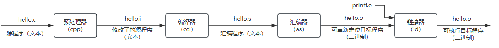

# 一、计算机系统基础

## 1、编译系统

如下C语言代码：
```c
#include<stdio.h>
int main(){
  printf("Hello world\n");
  return 0;
}
```
在Linux上执行编译过程时：
```bash
$ gcc -o hello hello.c
```
gcc编译器读取hello.c源文件，将其翻译为一个可执行文件hello，这个过程可以分为4个阶段：执行这四个阶段的程序（预处理器、编译器、汇编器和链接器）一起构成了编译系统


- 预处理阶段：预处理器（CPP)根据以字符 #开头的命令，修改原始的 C 程序。比如hello.c 中第 1 行的`#include < stdio.h>` 命令告诉预处理器读取系统头文件`stdio.h` 的内容，并把它直接插入程序文本中。结果就得到了另一个 C 程序，通常是以`.i` 作为文件扩展名；
- 编译阶段：编译器(ccl)将文本文件 `hello.i` 翻译成文本文件 `hello.s`，它包含一个汇编语言程序。该程序包含函数 main 的定义，如下所示：
  ```
  1   main:
  2     subbq  $8, %rsp
  3     movl   $.LCO, %edi
  4     call   puts
  5     movl   $0, %eax
  6     addq   $8, %rsp
  7     ret
  ```
  定义中 2〜7 行的每条语句都以一种文本格式描述了一条低级机器语言指令
- 汇编阶段：汇编器(as)将 `hello.s` 翻译成机器语言指令，把这些指令打包成一种叫做可重定位目标程序（relocatable object program)的格式，并将结果保存在目标文件 hello.o 中。hello.o 文件是一个二进制文件，它包含的 17 个字节是函数 main的指令编码。如果在文本编辑器中打开 hello.o 文件，将看到一堆乱码；
- 链接阶段：请注意，hello 程序调用了 printf 函数，它是每个 C 编译器都提供的标准 C 库中的一个函数。printf 函数存在于一个名为 printf.o 的单独的预编译好了的目标文件中，而这个文件必须以某种方式合并到我们的 hello.o 程序中。链接器(Id)就负责处理这种合并。结果就得到 hello 文件，它是一个可执行目标文件(或者简称为可执行文件），可以被加载到内存中，由系统执行。


# 其他

操作系统这门课程，讲的就是这个计算机的大管家，是如何管理程序的运行，以及如何管理计算机硬件资源并提供接口给程序使用的一门计算机基础课程！

操作系统的核心是：
- 管理程序运行：线程管理、进程管理
- 管理内存资源：内存管理
- 管理硬盘资源：文件系统
- 管理网卡资源：网络协议栈；
- 管理输入输出：中断管理、同步与异步
- 为应用程序提供接口：系统调用；

操作系统理论和具体的操作系统实现，这是两码事情！


- [南京大学 计算机科学与技术系 计算机系统基础 课程实验 2023](https://nju-projectn.github.io/ics-pa-gitbook/ics2023/)
- [CSAPP 深入理解计算机系统](https://www.bilibili.com/video/av31289365/)
- [互联网操作系统](https://github.com/HeyPuter/puter)
- [如何学习操作系统](https://mp.weixin.qq.com/s/Fp2ijjGH_qpuClQFOnVzGg)
- [《深入理解计算机系统-3》网络资料](https://csapp.cs.cmu.edu/)
- [解读《深入理解计算机系统(CSAPP)》](http://112.126.57.125/docs/ShiYu-AI/classify006/csapp/note001.html)
- [《深入理解计算机系统-3》思维导图](https://blog.csdn.net/qq_40680007/article/details/112869312)