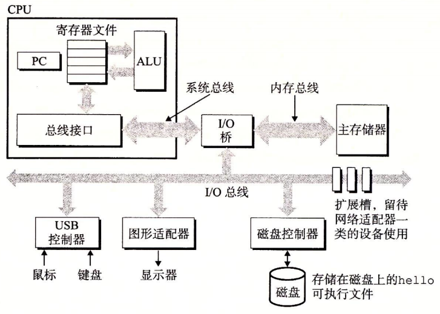
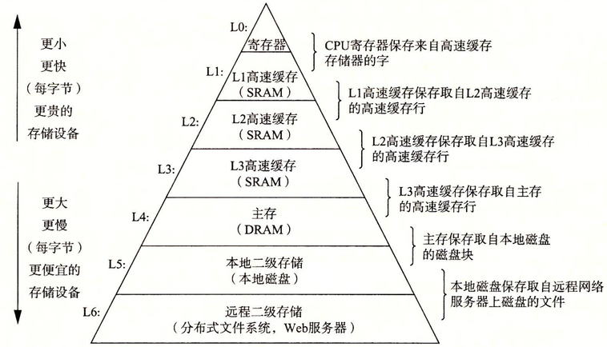
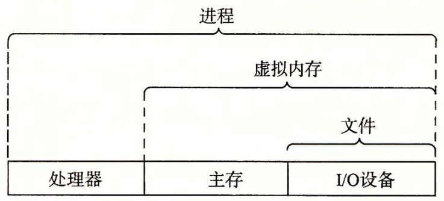
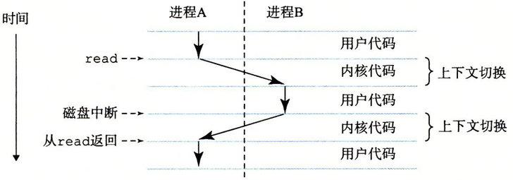
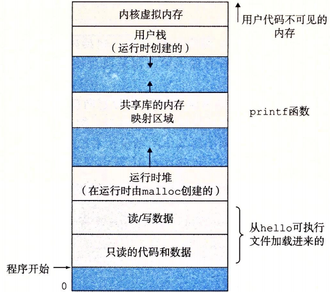
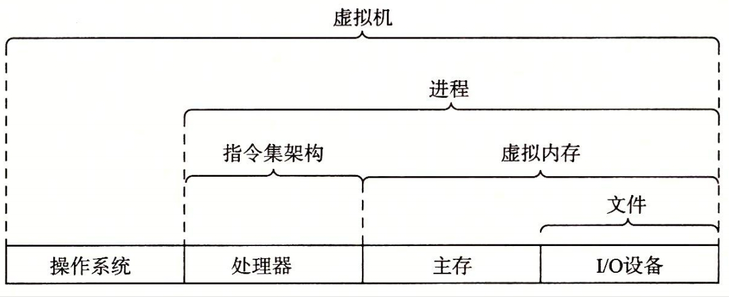

书籍：
- [《深入理解计算机系统-3》网络资料](https://csapp.cs.cmu.edu/)
- [《深入理解计算机系统(CSAPP)》电子书](https://hansimov.gitbook.io/csapp)
- [《深入理解计算机系统-3》思维导图](https://blog.csdn.net/qq_40680007/article/details/112869312)

# 一、计算机系统基础

## 1、编译系统

如下C语言代码：
```c
#include<stdio.h>
int main(){
  printf("Hello world\n");
  return 0;
}
```
在Linux上执行编译过程时：
```bash
$ gcc -o hello hello.c
```
gcc编译器读取hello.c源文件，将其翻译为一个可执行文件hello，这个过程可以分为4个阶段：执行这四个阶段的程序（预处理器、编译器、汇编器和链接器）一起构成了编译系统


- 预处理阶段：预处理器（CPP)根据以字符 #开头的命令，修改原始的 C 程序。比如hello.c 中第 1 行的`#include < stdio.h>` 命令告诉预处理器读取系统头文件`stdio.h` 的内容，并把它直接插入程序文本中。结果就得到了另一个 C 程序，通常是以`.i` 作为文件扩展名；
- 编译阶段：编译器(ccl)将文本文件 `hello.i` 翻译成文本文件 `hello.s`，它包含一个汇编语言程序。该程序包含函数 main 的定义，如下所示：
  ```
  1   main:
  2     subbq  $8, %rsp
  3     movl   $.LCO, %edi
  4     call   puts
  5     movl   $0, %eax
  6     addq   $8, %rsp
  7     ret
  ```
  定义中 2〜7 行的每条语句都以一种文本格式描述了一条低级机器语言指令
- 汇编阶段：汇编器(as)将 `hello.s` 翻译成机器语言指令，把这些指令打包成一种叫做可重定位目标程序（relocatable object program)的格式，并将结果保存在目标文件 hello.o 中。hello.o 文件是一个二进制文件，它包含的 17 个字节是函数 main的指令编码。如果在文本编辑器中打开 hello.o 文件，将看到一堆乱码；
- 链接阶段：请注意，hello 程序调用了 printf 函数，它是每个 C 编译器都提供的标准 C 库中的一个函数。printf 函数存在于一个名为 printf.o 的单独的预编译好了的目标文件中，而这个文件必须以某种方式合并到我们的 hello.o 程序中。链接器(Id)就负责处理这种合并。结果就得到 hello 文件，它是一个可执行目标文件(或者简称为可执行文件），可以被加载到内存中，由系统执行。

## 2、系统硬件组成

一个典型系统的硬件组织：



- **总线**：贯穿整个系统的是一组电子管道，称作总线，它携带信息字节并负责在各个部件间传递。通常总线被设计成传送定长的字节块，也就是字（word）。字中的字节数（即字长）是一个基本的系统参数；
- **I/O 设备**：I/O设备是系统与外部世界的联系通道，每个 I/O 设备都通过一个控制器或适配器与 I/O 总线相连。控制器和适配器之间的区别主要在于它们的封装方式。
    - 控制器是 I/O 设备本身或者系统的主印制电路板（通常称作主板）上的芯片组。
    - 适配器则是一块插在主板插槽上的卡。<br/>
    无论如何，它们的功能都是在 I/O 总线和 I/O 设备之间传递信息
- **主存**：主存是一个临时存储设备，在处理器执行程序时，用来存放程序和程序处理的数据。从物理上来说，主存是由一组动态随机存取存储器（DRAM）芯片组成的
- **处理器**：中央处理单元（CPU），简称处理器，是解释（或执行）存储在主存中指令的引擎。处理器的核心是一个大小为一个字的存储设备（或寄存器），称为程序计数器（PC）。在任何时刻，PC 都指向主存中的某条机器语言指令（即含有该条指令的地址），从系统通电开始，直到系统断电，处理器一直在不断地执行程序计数器指向的指令，再更新程序计数器，使其指向下一条指令；它们围绕着主存、寄存器文件（register file）和算术/逻辑单元（ALU）进行

寄存器文件是一个小的存储设备，由一些单个字长的寄存器组成，每个寄存器都有唯一的名字。ALU 计算新的数据和地址值。下面是一些简单操作的例子，CPU 在指令的要求下可能会执行这些操作。
- 加载：从主存复制一个字节或者一个字到寄存器，以覆盖寄存器原来的内容。
- 存储：从寄存器复制一个字节或者一个字到主存的某个位置，以覆盖这个位置上原 来的内容。 
- 操作：把两个寄存器的内容复制到 ALU，ALU 对这两个字做算术运算，并将结果存放到一个寄存器中，以覆盖该寄存器中原来的内容。 
- 跳转：从指令本身中抽取一个字，并将这个字复制到程序计数器（PC）中，以覆盖 PC 中原来的值

## 3、存储设备层次结构

每个计算机系统中的存储设备都被组织成了一个存储器层次结构，在这个层次结构中，从上至下，设备的访问速度越来越慢、容量越来越大，并且每字节的造价也越来越便宜。寄存器文件在层次结构中位于最顶部，也就是第 0 级或记为 L0。这里我们展示的是三层高速缓存 L1 到 L3，占据存储器层次结构的第 1 层到第 3 层。主存在第 4 层



可以利用对整个存储器层次结构的理解来提高程序性能

## 4、操作系统管理硬件

所有应用程序对硬件的操作尝试都必须通过操作系统。操作系统有两个基本功能∶
- （1）防止硬件被失控的应用程序滥用；
- （2）向应用程序提供简单一致的机制来控制复杂而又通常大不相同的低级硬件设备。

操作系统通过几个基本的抽象概念（进程、虚拟内存和文件）来实现这两个功能



### 4.1、进程

进程是操作系统对一个正在运行的程序的一种抽象。在一个系统上可以同时运行多个进程，而每个进程都好像在独占地使用硬件；并发运行，则是说一个进程的指令和另一个进程的指令是交错执行的；先进的多核处理器同时能够执行多个程序；

无论是在单核还是多核系统中，一个 CPU 看上去都像是在并发地执行多个进程，这是通过处理器在进程间切换来实现的。操作系统实现这种交错执行的机制称为上下文切换

**上下文** 操作系统保持跟踪进程运行所需的所有状态信息。这种状态，也就是上下文，包括许多信息，比如 PC 和寄存器文件的当前值，以及主存的内容；在任何一个时刻，单处理器系统都只能执行一个进程的代码。当操作系统决定要把控制权从当前进程转移到某个新进程时，就会进行上下文切换，即保存当前进程的上下文、恢复新进程的上下文，然后将控制权传递到新进程

从一个进程到另一个进程的转换是由操作系统**内核**（kernel）管理的。内核是操作系统代码常驻主存的部分。当应用程序需要操作系统的某些操作时，比如读写文件，它就执行一条特殊的系统调用（system call）指令，将控制权传递给内核。然后内核执行被请求的操作并返回应用程序。注意，内核不是一个独立的进程。相反，它是系统管理全部进程所用代码和数据结构的集合



### 4.2、线程

一个进程实际上可以由多个称为线程的执行单元组成，每个线程都运行在进程的上下文中，并共享同样的代码和全局数据；

多线程之间比多进程之间更容易共享数据，也因为线程一般来说都比进程更高效。当有多处理器可用的时候，多线程也是一种使得程序可以运行得更快的方法

### 4.3、虚拟内存

虚拟内存是一个抽象概念，它为每个进程提供了一个假象，即每个进程都在独占地使用主存。每个进程看到的内存都是一致的，称为虚拟地址空间；在 Linux 中，地址空间最上面的区域是保留给操作系统中的代码和数据的，这对所有进程来说都是一样。地址空间的底部区域存放用户进程定义的代码和数据。请注意，图中的地址是从下往上增大的



每个进程看到的虚拟地址空间由大量准确定义的区构成，每个区都有专门的功能
- 程序代码和数据：对所有的进程来说，代码是从同一固定地址开始，紧接着的是和 C 全局变量相对应的数据位置；
- 堆：代码和数据区后紧随着的是运行时堆。代码和数据区在进程一开始运行时就被指定了大小，与此不同，当调用像 malloc 和 free 这样的 C 标准库函数时，堆可以在运行时动态地扩展和收缩；
- 共享库：大约在地址空间的中间部分是一块用来存放像 C 标准库和数学库这样的共享库的代码和数据的区域；
- 栈：位于用户虚拟地址空间顶部的是用户栈，编译器用它来实现函数调用。和堆一样，用户栈在程序执行期间可以动态地扩展和收缩。特别地，每次我们调用一个函数时，栈就会增长；从一个函数返回时，栈就会收缩；
- 内核虚拟内存：地址空间顶部的区域是为内核保留的。不允许应用程序读写这个区域的内容或者直接调用内核代码定义的函数。相反，它们必须调用内核来执行这些操作；
- 文件：文件就是字节序列，仅此而已。每个I/O设备，包括磁盘、键盘、显示器，甚至网络，都可以看成是文件。系统中的所有输入输出都是通过使用一小组称为 Unix I/O 的系统函数调用读写文件来实现

## 5、其他

### 5.1、Amdahl 定律

### 5.2、并发和并行

- 并发（concurrency）是一个通用的概念，指一个同时具有多个活动的系统；
- 并行（parallelism）指的是用并发来使一个系统运行得更快

系统层次结构中由高到低的顺序重点强调三个层次
- 线程级并发
- 指令级并行
- 单指令、多数据并行

## 6、系统抽象



- 文件是对 I/O 设备的抽象
- 虚拟内存是对程序存储器的抽象
- 进程是对一个正在运行的程序的抽象。
- 虚拟机，它提供对整个计算机的抽象，包括操作系统、处理器和程序
- 在处理器里，指令集架构提供了对实际处理器硬件的抽象

# 二、信息的表示与处理

## 1、信息存储

大多数计算机使用 8 位的块，或者**字节（byte）**，作为最小的可寻址的内存单位，而不是访问内存中单独的位；

机器级程序将内存视为一个非常大的字节数组，称为**虚拟内存（virtual memory）**，内存的每个字节都由一个唯一的数字来标识，称为它的**地址（address）**，所有可能地址的集合就称为**虚拟地址空间（virtual address space）**

### 1.1、十六进制

一个字节由 8 位组成。在二进制表示法中，它的值域是 $00000000_2$ ~ $11111111_2$。如果看成十进制整数，它的值域就是 $0_{10}$ ~ $255_{10}$ ；

十六进制（简写为 hex）使用数字 0 ~ 9 以及字符 A ~ F 来表示16个可能得值，如下是16个十六进制数字对应的十进制和二进制，用十六进制的话，一个字节的值域为： $00_{16}$ ~ $FF_{16}$

| | | | | | | | | | | | | | | | | |
| --- | --- | --- |--- | --- | --- |--- | --- | --- |--- | --- | --- |--- | --- | --- |--- |--- |
| 十六进制 | 0 | 1 |2  |  3|4  | 5 |  6| 7 | 8 | 9 |A  | B |  C|D  |  E|  F|
| 十进制 | 0| 1 |2  |  3|4  | 5 |  6| 7 | 8 | 9 |10  | 11 |  12|13  | 14|  15|
| 二进制 | 0000| 0000 |0010  |  0011|0100  | 0101 |  0110| 0111 | 1000 | 1001 |1010  | 1011 |  1100|1101  |  1110|  1111|

在 C 语言中，以 Ox 或 0X 开头的数字常量被认为是十六进制的值。字符 A 〜 F 既可以是大写，也可以是小写。例如，可以将数字 FA1D37B $_{16}$ 写作 `0XFA1D37B` 或者 
 `0xfald37b` 甚至是大小写混合；

**二进制与十六进制转换**

二进制和十六进制之间的转换比较简单直接，因为可以一次执行一个十六进制数字的转换；一个简单的窍门是，记住十六进制数字 A、C 和 F 相应的十进制值。而对于把十六进制值 B、D 和 E 转换成十进制值，则可以通过计算它们与前三个值的相对关系来完成，

比如，假设给你一个数字 `0X173A4C` 可以通过展开每个十六进制数字，将它转换为二进制格式，如下所示：

||||||||
|---|---|---|---|---|---|---|
|十六进制|1|7|3|A|4|C|
|二进制|0001|0111|0011|1010|0100|1100|

这样就得到了二进制表示 $000101110011101001001100$ ，反过来，如果给定一个二进制数字 $11 1100 1010 1101 1011 0011$，可以通过从末尾往前每 4 位一组来转换为十六进制。不过要注意，如果位总数不是 4 的倍数，最左边的一组可以少于 4 位，前面用 0 补足

||||||||
|---|---|---|---|---|---|---|
|二进制|0011|1100|1010|1101|1011|0011|
|十六进制|3|C|A|D|B|3|

当值 $x$ 是 2 的非负整数 $n$ 次幂时，也就是 $x=2^n$ 可以很容易地将 $x$ 写成十六进制形式，只要记住 $x$ 的二进制表示就是 1 后面跟 $n$ 个 0。十六进制数字 0 代表 4 个二进制0。所以，当 $n$ 表示成 $i+4j$ 的形式，其中 $0<= i <= 3$, 我们可以把 $x$ 写成开头的十六进制数字为 $1(i=0)、2(i=l)、4(i=2)、8(i=3)$ 后面跟随着 $j$ 个十六进制的 0。比如，$i=2048=2^{11}$ 我们有 $11=3+4*2$, 从而得到十六进制表示 0x800 ；

**十进制与十六进制转换**

十进制和十六进制表示之间的转换需要使用乘法或者除法来处理一般情况。将一个十进制数字 $x$ 转换为十六进制，可以反复地用 16 除 $x$ 得到一个商 $q$ 和一个余数 $r$ 也就是
$x=q*16+r$ 然后，用十六进制数字表示的 $r$ 作为最低位数字，并且通过对 $q$ 反复进行这个过程得到剩下的数字，十进制 $314156$ 的转换：
```
314 156 = 19 634 * 16 + 12 (C)，其中 q = 19634，r=12，最低位
 19 634 = 1227 * 16 + 2    (2)，其中 q = 1227，r=12
   1227 = 76 * 16 + 11     (B)，其中 q = 76，r=12
     76 = 4 * 16 + 12      (C)，其中 q = 4，r=12
      4 = 0 * 16 + 4       (4)，其中 q = 0，r=4，最高位
```
从这里，我们能读出十六进制表示为 0x4CB2C

反过来，将一个十六进制数字转换为十进制数字，我们可以用相应的 16 的幂乘以每个十六进制数字。比如，给定数字 0x7AF，我们计算它对应的十进制值为 $7*16_2 +10*16+15=7*256+10*16+15=1792+160+15=1967$

### 1.2、字数据大小

每台计算机都有一个字长（word size), 指明指针数据的标称大小(nominal size)，因为虚拟地址是以这样的一个字来编码的，所以字长决定的最重要的系统参数就是虚拟地址空
间的最大大小。也就是说，对于一个字长为 $w$ 位的机器而言，虚拟地址的范围为 $0$ ~ $2^w - 1$ ，程序最多访问 $2^w$ 个字节

### 1.3、寻址和字节序

对于跨越多字节的程序对象，必须建立两个规则：
- 这个对象的地址是什么；
- 在内存中如何排列这些字节；

几乎在所有的机器上，多字节对象都被存储为连续的字节序列，对象的地址为所使用字节中最小的地址；

考虑一个 $w$ 位的整数，其位表示为 $[x_{w-1}, x_{w-2}, ..., x_1, x_0]$ , 其中 $x_{w-1}$ 是最高有效位，而 $x_0$ 是最低有效位。假设 $w$ 是 8 的倍数，这些位就能被分组为字节，其中最高有效字节包含位： $[x_{w-1}, x_{w-2}, ..., x_{w-8}]$ , 而有效字节包含位：$[x_7, x_6, ..., x_0]$ , 其他字节包含中间的位。

某些机器选择在内存中按照从最低有效字节到最高有效字节的顺序存储对象，而另一些机器则按照从最高有效字节到最低有效字节的顺序存储
- 前一种规则：最低有效字节在最前面的方式，称为**小端法(little endian)**
- 后一种规则：最高有效字节在最前面的方式，称为**大端法(big endian)**

假设变量x的类型是int，位于地址 0x100 处，它的十六进制值为 0x1234567，地址范围为： 0x100~0x103 的字节顺序依赖与机器的类型
```
大端序： 0x100   0x101   0x102   0x103
        01      23      45      67
小端序： 0x100   0x101   0x102   0x103
        67      45      23      01
```

**如何查看系统的字节序** <br/>
（1）C语言的联合体或位操作
```c
int main() {
    union {
        unsigned int i;
        unsigned char c;
    } test;
    test.i = 1;
    if (test.c == 1) {
        printf("Little Endian\n");
    } else {
        printf("Big Endian\n");
    }
    return 0;
}
int main() {
    unsigned int x = 1;
    char *c = (char*)&x;
    if (*c) {
        printf("Little Endian\n");
    } else {
        printf("Big Endian\n");
    }
    return 0;
}
```
（2）Python 提供了内置的 sys.byteorder 属性来查看字节序
```py
import sys
print(sys.byteorder)  # 输出 'little' 或 'big'
```
（3）在 Linux 系统中，可以使用以下命令查看字节序：
```bash
lscpu | grep "Byte Order"
Byte Order:          Little Endian
```
（4）Java中使用 ByteOrder 类
```java
if (ByteOrder.nativeOrder() == ByteOrder.BIG_ENDIAN) {
    System.out.println("系统字节序是大端序");
} else {
    System.out.println("系统字节序是小端序");
}
```

**字节序可能产生的问题：**
- 在不同类型的机器之间通过网络传送二进制数据时，一个常见的问题是当小端法机器产生的数据被发送到大端法机器或者反过来时，接收程序会发现，字里的字节成了反序的；
- 当阅读表示整数数据的字节序列时字节顺序也很重要

```c
#include<stdio.h>
typedef unsigned char *byte_pointer;
void show_bytes(byte_pointer start, int len) {
  int i;
  for(i = 0; i < len; i++) {
    printf(" %.2x", start[i]);
  }
  printf("\n");
}
void show_int(int x) {
  show_bytes((byte_pointer)&x, sizeof(int));
}
void show_float(float x) {
  show_bytes((byte_pointer)&x, sizeof(float ));
}
void show_pointer(void *x) {
  show_bytes((byte_pointer)&x, sizeof(void *));
}
void test_show_bytes(int val){
  int ival = val;
  float fval = (float) ival;
  int *pval = &ival;
  show_int(ival);
  show_float(fval);
  show_pointer(pval);
}
```

### 1.4、字符串表示

C 语言中字符串被编码为一个以 null(其值为 0)字符结尾的字符数组；

十进制数字 x 的 ASCII 码正好是 0x3x, 而终止字节的十六进制表示为 0x00。在使用 ASCII 码作为字符码的任何系统上都将得到相同的结果，与字节顺序和字大小规则无关。因而，文
本数据比二进制数据具有更强的平台独立性
```c
const char *s = "abcdef";
show_bytes((byte_pointer)s, strlen(s));
```

### 1.5、代码表示

计算机系统的一个基本概念就是，从机器的角度来看，程序仅仅只是字节序列。机器没有关于原始源程序的任何信息，除了可能有些用来帮助调试的辅助表以外。

### 1.6、布尔代数表示

二进制是计算机编码、存储和操作信息的核心，最简单的布尔代数是在二元集合 {0, 1} 基础上的定义；
- 布尔运算 `〜` 对应于逻辑运算 $NOT$ ，在命题逻辑中用符号 ${\neg}$ 表示，也就是说，当 $P$ 不是真的时候，我们就说 ${\neg}P$ 是真的，反之亦然。相应地，当 P 等于 0 时，`〜P` 等于 1, 反之亦然；取反逻辑
- 布尔运算 $\&$ 对应于逻辑运算 $AND$ ，在命题逻辑中用符号 ${\wedge}$ 表示。当 P 和 Q 都为真时，我们说 $P{\wedge}Q$ 为真。相应地，只有当 $p=1$ 且 $q=1$ 时，$p\&q$ 才等于 1
- 布尔运算 `|`对应于逻辑运算 $OR$ ，在命题逻辑中用符号 ${\vee}$ 表示。当 P 或者 Q 为真时，我们说 $P{\vee}Q$ 成立。相应地当 $p=1$ 或者 $q=1$ 时，$p|q$ 等于 1
- 布尔运算 `^` 对应于逻辑运算 异或，在命题逻辑中用符号 ${\oplus}$ 表示。当 P 或者 Q 为真但不同时为真时，我们说 $P{\oplus}Q$ 成立。相应地，当 $p=1$ 且 $q=0$,
或者 $p =0$ 且 $q=1$ 时，$p{\oplus}q$ 等于 1。

### 1.7、C语言的位运算

C语言的位运算为：
- `|` 或运算 （or）
- `&` 与运算（and）
- `~` 取反运算（not）
- `^` 异或（exclusive）

对于任意个 整数， a^a = 0;

位运算的一个常见用法是：是实现掩码运算，表示从一个字节中选出的位的集合；掩码 0xFF（最低的8位为1）表示一个字节的低位字节。位运算 x&0xff 生成一个由 x 的最低有效字节组成的值，而其他的字节就被置为0；

**移位运算**

C 语言还提供了一组移位运算，向左或者向右移动位模式，对于一个位表示为 $[x_{w-1},x_{w-2},...,x_0]$ 的操作数 $x$ ， C 表达式 $x << k$ 会生成一个值，其位表示为 $[x_{w-k-1},x_{w-k-2},...,x_0,0,..,0]$ 也就是说，x 向左移动 $k$ 位，丢弃最高的 $k$ 位，并在右端补 $k$ 个 0。移位量应该是一个 0〜(w-1) 之间的值。移位运算是从左至右可结合的，所以 $x<< j << k$ 等价于 $ (x << j) << k$

*右移*：右移运算是将一个二进制位的操作数按指定移动的位数向右移动，移出位被丢弃，左边移出的空位一律补0，或者补符号位，这由不同的机器而定。在使用补码作为机器数的机器中，正数的符号位为 0 ，负数的符号位为 1 。简单说就是：（分为 2 种）
- 逻辑右移：左边用0填充，右边丢弃。
- 算术右移：左边用原该值的符号位填充，右边丢弃。
> 到底是逻辑右移还是算术右移取决于编译器

### 1.8、C语言的逻辑运算

C 语言还提供了一组逻辑运算符 `||` 、 `&&` 和 ``，分别对应于命题逻辑中的 OR 、 AND 和 NOT 运算

## 2、整数表示

### 2.1、整数数据类型

C语言支持多种整数数据类型，表示有限范围的整数，一般负数的取值范围比正数的范围大1；

> C和C++都支持有符号（默认）和无符号数。Java只支持有符号数；
### 2.2、无符号数的编码


# 其他

操作系统这门课程，讲的就是这个计算机的大管家，是如何管理程序的运行，以及如何管理计算机硬件资源并提供接口给程序使用的一门计算机基础课程！

操作系统的核心是：
- 管理程序运行：线程管理、进程管理
- 管理内存资源：内存管理
- 管理硬盘资源：文件系统
- 管理网卡资源：网络协议栈；
- 管理输入输出：中断管理、同步与异步
- 为应用程序提供接口：系统调用；

操作系统理论和具体的操作系统实现，这是两码事情！


- [南京大学 计算机科学与技术系 计算机系统基础 课程实验 2023](https://nju-projectn.github.io/ics-pa-gitbook/ics2023/)
- [CSAPP 深入理解计算机系统](https://www.bilibili.com/video/av31289365/)
- [互联网操作系统](https://github.com/HeyPuter/puter)
- [如何学习操作系统](https://mp.weixin.qq.com/s/Fp2ijjGH_qpuClQFOnVzGg)
