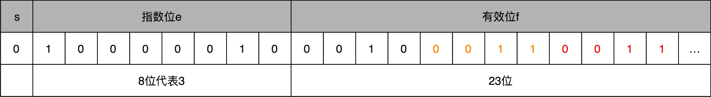
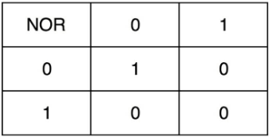

# 1、冯·诺依曼体系结构

## 1.1、计算机的基本硬件组成

三大件：
- CPU：中央处理器（Central Processing Unit）
- 内存：存放在内存里的程序和数据，需要被 CPU 读取，CPU 计算完之后，还要把数据写回到内存
- 主板：CPU 要插在主板上，内存也要插在主板上。主板的芯片组（Chipset）和总线（Bus）解决了 CPU 和内存之间如何通信的问题。芯片组控制了数据传输的流转，也就是数据从哪里到哪里的问题。总线则是实际数据传输的高速公路。因此，总线速度（Bus Speed）决定了数据能传输得多快

最后配上电源、输入输出设备；

另外还有一个特殊设备显卡，图形操作系统少不了这个，显卡之所以特殊，是因为显卡里有除了 CPU 之外的另一个“处理器”，也就是GPU（Graphics Processing Unit，图形处理器），GPU 一样可以做各种“计算”的工作；

### 1.2、冯·诺依曼体系结构

冯·诺依曼在[First Draft](https://en.wikipedia.org/wiki/First_Draft_of_a_Report_on_the_EDVAC)里面描述了一台计算机应该有哪些部分组成
- 首先是一个包含算术逻辑单元（Arithmetic Logic Unit，ALU）和处理器寄存器（Processor Register）的`处理器单元（Processing Unit）`，用来完成各种算术和逻辑运算。因为它能够完成各种数据的处理或者计算工作，因此也有人把这个叫作数据通路（Datapath）或者运算器；
- 然后是一个包含指令寄存器（Instruction Reigster）和程序计数器（Program Counter）的`控制器单元（Control Unit/CU）`，用来控制程序的流程，通常就是不同条件下的分支和跳转。在现在的计算机里，上面的算术逻辑单元和这里的控制器单元，共同组成了我们说的 CPU；
- 接着是用来存储数据（Data）和指令（Instruction）的`内存`，以及更大容量的`外部存储`，在过去，可能是磁带、磁鼓这样的设备，现在通常就是硬盘；
- 最后就是各种`输入和输出设备`，以及对应的输入和输出机制。个人电脑的鼠标键盘是输入设备，显示器是输出设备。我们用的智能手机，触摸屏既是输入设备，又是输出设备。而跑在各种云上的服务器，则是通过网络来进行输入和输出。这个时候，网卡既是输入设备又是输出设备；

任何一台计算机的任何一个部件都可以归到`运算器/处理器单元`、`控制器`、`存储器`、`输入设备`和`输出设备`中，而所有的现代计算机也都是基于这个基础架构来设计开发的；

而所有的计算机程序，也都可以抽象为从输入设备读取输入信息，通过运算器和控制器来执行存储在存储器里的程序，最终把结果输出到输出设备中；

冯·诺依曼体系结构确立了我们现在每天使用的计算机硬件的基础架构

冯·诺依曼体机与图灵机两者比较：两者有交叉但是不同
- 图灵机是一种思想模型（计算机的基本理论基础），是一种有穷的、构造性的问题的问题求解思路，图灵认为凡是能用算法解决的问题也一定能用图灵机解决；
- 冯诺依曼提出了“存储程序”的计算机设计思想，并“参照”图灵模型设计了历史上第一台电子计算机，即冯诺依曼机

# 2、计算机性能和功耗

对于计算机的性能，我们需要有个标准来衡量。这个标准中主要有两个指标：
- 第一个是响应时间（Response time）或者叫执行时间（Execution time）：让计算机跑的更快，响应时间指的就是，我们执行一个程序，到底需要花多少时间。花的时间越少，自然性能就越好
- 第二个是吞吐率（Throughput）或者带宽（Bandwidth）：让计算机搬的更多；吞吐率是指我们在一定的时间范围内，到底能处理多少事情

一般把性能定义成响应时间的倒数：`性能 = 1 / 响应时间`，响应时间越短，性能的数值就越大
 
## 2.1、CPU 时钟

用时间来衡量性能，存在两个问题：
- 第一个就是时间不“准”
- 其次，即使我们已经拿到了 CPU 时间，也不一定可以直接“比较”出两个程序的性能差异，即使在同一台计算机上，CPU 可能满载运行也可能降频运行，降频运行的时候自然花的时间会多一些

**时间不准**

为什么不准？首先，统计时间是用类似于“掐秒表”一样，记录程序运行结束的时间减去程序开始运行的时间。这个时间也叫 Wall Clock Time 或者 Elapsed Time，就是在运行程序期间，挂在墙上的钟走掉的时间；

但是，计算机可能同时运行着好多个程序，CPU 实际上不停地在各个程序之间进行切换。在这些走掉的时间里面，很可能 CPU 切换去运行别的程序了。而且，有些程序在运行的时候，可能要从网络、硬盘去读取数据，要等网络和硬盘把数据读出来，给到内存和 CPU。**所以说，要想准确统计某个程序运行时间，进而去比较两个程序的实际性能，得把这些时间给刨除掉。**

Linux 下有一个叫 time 的命令，可以统计出来：同样的 Wall Clock Time 下，程序实际在 CPU 上到底花了多少时间；它会返回三个值：
```bash
[root@bluefish ~]# time seq 1000000 |wc -l
1000000
real    0m0.013s
user    0m0.011s
sys     0m0.012s
```
- 第一个是real time，也就是前面说的 Wall Clock Time，也就是运行程序整个过程中流逝掉的时间；
- 第二个是user time，也就是 CPU 在运行你的程序，在用户态运行指令的时间；
- 第三个是sys time，是 CPU 在运行你的程序，在操作系统内核里运行指令的时间。而程序实际花费的 CPU 执行时间（CPU Time），就是 user time 加上 sys time；

除了 CPU 之外，时间这个性能指标还会受到主板、内存这些其他相关硬件的影响。所以，需要对“时间”这个可以感知的指标进行拆解，把程序的 CPU 执行时间变成` CPU 时钟周期数（CPU Cycles）`和 `时钟周期时间（Clock Cycle）`的乘积：

<p align="center">程序的CPU执行时间 = CPU时钟周期数 × 时钟周期时间</p>

**时钟周期**

比如电脑的CPU描述：`Intel Core-i7 2.8GHz`，这里的 `2.8GHz` 就是电脑的主频（Frequency/Clock Rate），`2.8GHz` 就代表，我们 CPU 的一个“钟表”能够识别出来的最小的时间间隔；

而在 CPU 内部，和电子石英表类似，有一个叫晶体振荡器（Oscillator Crystal）的东西，简称为晶振。把晶振当成 CPU 内部的电子表来使用。**晶振带来的每一次“滴答”，就是时钟周期时间**

在这个 2.8GHz的CPU上，时间周期时间就是：`1/2.8G`；CPU，是按照这个“时钟”提示的时间来进行自己的操作。主频越高，意味着这个表走得越快，我们的 CPU 也就“被逼”着走得越快；

根据前面计算程序CPU执行时间的公式，最简单的提升性能方案，自然缩短时钟周期时间，也就是提升主频。换句话说，就是换一块好一点的 CPU；

**CPU 时钟周期数**

前面提到提升性能的简单方案是缩短时钟周期时间，即提升主频，也就是换一块好的CPU；除了这个，还可以减少程序需要的 CPU 时钟周期数量，一样能够提升程序性能；

对于 CPU 时钟周期数，可以再做一个分解，把它变成“`指令数×每条指令的平均时钟周期数（Cycles Per Instruction，简称 CPI）`”。不同的指令需要的 Cycles 是不同的，加法和乘法都对应着一条 CPU 指令，但是乘法需要的 Cycles 就比加法要多，自然也就慢。在这样拆分了之后，程序的 CPU 执行时间就可以变成这样三个部分的乘积：

<p align="center">程序的 CPU 执行时间 = 指令数 × CPI × Clock Cycle Time</p>

因此想要解决性能问题，其实是优化这三者：
- 时钟周期时间，就是计算机主频，这个取决于计算机硬件。摩尔定律就一直在不停地提高我们计算机的主频。
- 每条指令的平均时钟周期数 CPI，就是一条指令到底需要多少 CPU Cycle。
- 指令数，代表执行我们的程序到底需要多少条指令、用哪些指令。这个一般交给了编译器。同样的代码，编译成计算机指令时候，就有各种不同的表示方式；

如果要提升计算机的性能，可以从指令数、CPI 以及 CPU 主频这三个地方入手。要搞定指令数或者 CPI，就在 CPU 上多放一点晶体管，不断提升 CPU 的时钟频率，这样就能让 CPU 变得更快，程序的执行时间就会缩短
 
## 2.2、功耗

早期提升CPU性能，就是堆晶体管；

*为什么奔腾 4 的主频没能超过 3.8GHz 的障碍呢？*因为功耗

功耗问题的直观例子：一个 3.8GHz 的奔腾 4 处理器，满载功率是 130 瓦。这个 130 瓦是什么概念呢？机场允许带上飞机的充电宝的容量上限是 100 瓦时。如果我们把这个 CPU 安在手机里面，不考虑屏幕内存之类的耗电，这个 CPU 满载运行 45 分钟，充电宝里面就没电了。而 iPhone X 使用 ARM 架构的 CPU，功率则只有 4.5 瓦左右；

CPU，一般都被叫作`超大规模集成电路（Very-Large-Scale Integration，VLSI）`。这些电路，实际上都是一个个晶体管组合而成的。CPU 在计算，其实就是让晶体管里面的“开关”不断地去“打开”和“关闭”，来组合完成各种运算和功能，想要计算得快：
- 一方面，我们要在 CPU 里，同样的面积里面，多放一些晶体管，也就是`增加密度`；
- 另一方面，我们要让晶体管“打开”和“关闭”得更快一点，也就是`提升主频`。
 
而这两者，都会增加功耗，带来耗电和散热的问题，因此，在 CPU 里面，能够放下的晶体管数量和晶体管的“开关”频率也都是有限的。一个 CPU 的功率，可以用这样一个公式来表示：

<p align="center"> 功耗 ~= 1/2 × 负载电容 × 电压的平方 × 开关频率 × 晶体管数量 </p>

为了要提升性能：
- 需要不断地增加晶体管数量。同样的面积下，想要多放一点晶体管，就要把晶体管造得小一点。这个就是平时所说的提升“制程”。从 28nm 到 7nm，相当于晶体管本身变成了原来的 1/4 大小；
- 还提升主频，让开关的频率变快；
- 功耗增加太多，就会导致 CPU 散热跟不上，这时，就需要降低电压；在整个功耗的公式里面，功耗和电压的平方是成正比的。这意味着电压下降到原来的 1/5，整个的功耗会变成原来的 1/25；

## 2.3、并行优化与阿姆达尔定律

随着技术的发展，面向[摩尔定律](https://en.wikipedia.org/wiki/Moore%27s_law)编程越来越行不通了，Intel 意识到通过提升主频比较“难”去实现性能提升，边开始推出 Core Duo 这样的多核 CPU，通过提升“吞吐率”而不是“响应时间”，来达到目的；这是一个常见的性能提升方式：通过并行提高性能；

能够使用并行计算，需要满足如下条件：
- 要进行的计算，本身可以分解成几个可以并行的任务。好比上面的乘法和加法计算，几个人可以同时进行，不会影响最后的结果。
- 需要能够分解好问题，并确保几个人的结果能够汇总到一起。
- 在“汇总”这个阶段，是没有办法并行进行的，还是得顺序执行，一步一步来；
 
在进行性能优化中，常常用到的一个经验定律，[阿姆达尔定律（Amdahl’s Law）](https://en.wikipedia.org/wiki/Amdahl%27s_law)。这个定律说的就是，对于一个程序进行优化之后，处理器并行运算之后效率提升的情况。具体可以用这样一个公式来表示：
<p align="center">优化后的执行时间 = 受优化影响的执行时间 / 加速倍数 + 不受影响的执行时间</p>

## 2.4、提升性能原则

- 加速大概率事件；
- 通过流水线提高性能：把 CPU 指令执行的过程进行拆分，细化运行，也是现代 CPU 在主频没有办法提升那么多的情况下，性能仍然可以得到提升的重要原因之一；
- 通过预测提高性能：通过预先猜测下一步该干什么，而不是等上一步运行的结果，提前进行运算，也是让程序跑得更快一点的办法；比如数组的访问；“分支和冒险”、“局部性原理”这些 CPU 和存储系统设计方法，其实都是在利用我们对于未来的“预测”，提前进行相应的操作，来提升我们的程序性能

# 3、指令和运算

## 3.1、计算机指令

- [Instruction Set Architecture](https://en.wikipedia.org/wiki/Instruction_set_architecture)

### 3.1、CPU做了啥

CPU 的全称是 Central Processing Unit，中文是中央处理器：
- 从硬件的角度来看，CPU 就是一个超大规模集成电路，通过电路实现了加法、乘法乃至各种各样的处理逻辑；
- 从软件工程师的角度来讲，CPU 就是一个执行各种计算机指令（Instruction Code）的逻辑机器。这里的计算机指令，就好比一门 CPU 能够听得懂的语言，也可以把它叫作机器语言（Machine Language）

**计算机指令集（ Instruction Set）：** 不同的 CPU 能够听懂的语言不太一样，比如，个人电脑用的是 Intel 的 CPU，苹果手机用的是 ARM 的 CPU。这两者能听懂的语言就不太一样。类似这样两种 CPU 各自支持的语言，就是两组不同的计算机指令集；

**存储程序型计算机（Stored-program Computer）：** 一个计算机程序，不可能只有一条指令，而是由成千上万条指令组成的。但是 CPU 里不能一直放着所有指令，所以计算机程序平时是存储在存储器中的。这种程序指令存储在存储器里面的计算机，就叫存储程序型计算机

### 3.2、代码如何变成机器码

下面是一段简单的C语言代码：
```c
// test.c
int main()
{
  int a = 1; 
  int b = 2;
  a = a + b;
}
```
如何让这段程序在计算中运行起来：
- 要让这段程序在一个 Linux 操作系统上跑起来，需要把整个程序翻译成一个 **汇编语言（ASM，Assembly Language）** 的程序，这个过程一般叫 **编译（Compile）成汇编代码** ；
- 针对汇编代码，可以再用汇编器（Assembler）翻译成机器码（Machine Code）。这些机器码由“0”和“1”组成的机器语言表示。这一条条机器码，就是一条条的**计算机指令**，这样一串串的 16 进制数字，就是CPU 能够真正认识的计算机指令；

**如何生成汇编代码和机器码**

在一个 Linux 操作系统上，可以简单地使用 gcc 和 objdump 这样两条命令，把对应的汇编代码和机器码都打印出来：
```bash
[root@bluefish language]# gcc -g -c test.c
[root@bluefish language]# objdump -d -M intel -S test.o
test.o:     file format elf64-x86-64
Disassembly of section .text:
0000000000000000 <main>:
int main()
{
   0:   55                      push   rbp
   1:   48 89 e5                mov    rbp,rsp
  int a = 1; 
   4:   c7 45 fc 01 00 00 00    mov    DWORD PTR [rbp-0x4],0x1
  int b = 2;
   b:   c7 45 f8 02 00 00 00    mov    DWORD PTR [rbp-0x8],0x2
  a = a + b;
  12:   8b 45 f8                mov    eax,DWORD PTR [rbp-0x8]
  15:   01 45 fc                add    DWORD PTR [rbp-0x4],eax
}
  18:   5d                      pop    rbp
  19:   c3                      ret    
```
左侧有一堆数字，这些就是一条条机器码；右边有一系列的 push、mov、add、pop 等，这些就是对应的汇编代码。一行 C 语言代码，有时候只对应一条机器码和汇编代码，有时候则是对应两条机器码和汇编代码。汇编代码和机器码之间是一一对应的；

汇编代码其实就是“给程序员看的机器码”，也正因为这样，机器码和汇编代码是一一对应的。人类很容易记住 `add、mov` 这些用英文表示的指令，而 `8b 45 f8` 这样的指令，由于很难一下子看明白是在干什么，所以会非常难以记忆

### 3.3、解析指令和机器码

日常用的Intel的CPU大概有2000条左右的CPU指令，常见的指令可以分为如下5类：

指令类型 | 指令描述 | 示例指令 | 示例汇编代码 | 含义 | 注释
--------|----------|---------|-------------|--------|--------
算术类指令|加减乘除，在 CPU 层面，都会变成一条条算术类指令|`add` | `add $s1,$s2,$s3` | `$s1=$s2+$s3`|将s2和s3寄存器中的数相加后的结果放到寄存器s1中
逻辑类指令|逻辑上的与或非，都是这一类指令|`or`|`or $s1,$s2,$s3` | `$s1=$s2\|$s3` | 将s2和s3寄存器中的数按位或后的结果放到寄存器s1中
数据传输类指令|给变量赋值、在内存里读写数据，用的都是数据传输类指令|`load word` | `load $s1,10($s2)` | `$1=memory[$s2+10]`|取s2寄存器中的数，加上10偏移量之后，存入到s2的寄存器中
条件分支类指令|日常我们写的“if/else”，其实都是条件分支类指令|`branch no equal`|`beq $s1,$s2,10`|`if($s1==$s2) go to PC+4+10`|如果s1和s2寄存器的值相等，从程序计数器往后跳10
无条件跳转指令|在调用函数的时候，其实就是发起了一个无条件跳转指令|`jump`|`j 1000`|`go to 1000`|跳转到1000这个目标地址；

**汇编器是怎么把对应的汇编代码，翻译成为机器码的**

- [MIPS指令集-指令学习](https://www.cnblogs.com/Roboduster/p/16158413.html)

不同的 CPU 有不同的指令集，也就对应着不同的汇编语言和不同的机器码，这里采用最简单的[MIPS指令集](https://en.wikipedia.org/wiki/MIPS_architecture)，看看机器码是如何生成的

MIPS 的指令是一个 32 位的整数，高 6 位叫操作码（Opcode），也就是代表这条指令具体是一条什么样的指令，剩下的 26 位有三种格式，分别是 R、I 和 J：


- `R 指令`是一般用来做算术和逻辑操作，里面有读取和写入数据的寄存器的地址。如果是逻辑位移操作，后面还有位移操作的位移量，而最后的功能码，则是在前面的操作码不够的时候，扩展操作码表示对应的具体指令的。
- `I 指令`，则通常是用在数据传输、条件分支，以及在运算的时候使用的并非变量还是常数的时候。这个时候，没有了位移量和操作码，也没有了第三个寄存器，而是把这三部分直接合并成了一个地址值或者一个常数。
- `J 指令`就是一个跳转指令，高 6 位之外的 26 位都是一个跳转后的地址；

### 3.4、演示MIPS指令集生成机器码

有指令：`add $t0, $s1, $s2`，转换成机器码，遵循以下步骤，首先确定这是一个R类型指令，其字段如下所示：
- `opcode`（操作码）: 对于所有R类型指令，`opcode`是`000000`。
- `rs`（第一个源寄存器）: `$s1`的编号是17，二进制表示为`10001`。
- `rt`（第二个源寄存器）: `$s2`的编号是18，二进制表示为`10010`。
- `rd`（目标寄存器）: `$t0`的编号是8，二进制表示为`01000`。
- `shamt`（位移量）: 对于`add`指令，这是`00000`，因为这不是位移指令。
- `funct`（功能码）: 对于`add`指令，这是`100000`。

把这些信息组合起来，我们得到这条指令的二进制表示：
```
000000 10001 10010 01000 00000 100000
```
现在，将这个二进制表示转换成十六进制：
- 二进制：`000000 10001 10010 01000 00000 100000`
- 分组（每4位一组，从右到左）：`0000 0010 0011 0010 0100 0000 0010 0000`
- 转换为十六进制：`0x02324020`

因此，MIPS指令 `add $t0, $s1, $s2` 对应的机器码是 `0x02324020`。

## 3.2、CPU如何执行指令

CPU内部是有数以亿计的晶体管组成的，一条条计算机指令的执行非常麻烦，但CPU在软件层面已经封装了，对于软件开发程序员来说，写好的代码变成指令之后，是一条一条顺序执行的；

在逻辑上，可以认为 CPU 其实就是由一堆`寄存器`组成的。而`寄存器`就是 CPU 内部，由多个`触发器（Flip-Flop）`或者`锁存器（Latches）`组成的简单电路，其中`触发器`和`锁存器`是两种不同原理的[数字电路组成的逻辑门](https://en.wikipedia.org/wiki/Logic_gate)；

`N 个触发器或者锁存器`，就可以组成一个 `N 位（Bit）的寄存器`，能够保存 N 位的数据。比方说，用的 64 位 Intel 服务器，寄存器就是 64 位的


一个 CPU 里面会有很多种不同功能的寄存器，下面是三种比较特殊的：
- （1）`PC 寄存器（Program Counter Register）`，也叫`指令地址寄存器（Instruction Address Register）`。顾名思义，它就是用来存放下一条需要执行的计算机指令的内存地址。
- （2）`指令寄存器（Instruction Register）`，用来存放当前正在执行的指令。
- （3）`条件码寄存器（Status Register）`，用里面的一个一个标记位（Flag），存放 CPU 进行算术或者逻辑计算的结果；

除了这些特殊的寄存器，CPU 里面还有更多用来存储数据和内存地址的寄存器。这样的寄存器通常一类里面不止一个。通常根据存放的数据内容来给它们取名字，
- 比如整数寄存器、浮点数寄存器、向量寄存器和地址寄存器等等。
- 有些寄存器既可以存放数据，又能存放地址，我们就叫它通用寄存器


**CPU是如何执行指令的？**
- 一个程序执行的时候，CPU 会根据 PC 寄存器里的地址，从内存里面把需要执行的指令读取到指令寄存器里面执行，然后根据指令长度自增，开始顺序读取下一条指令。可以看到，一个程序的一条条指令，在内存里面是连续保存的，也会一条条顺序加载；
- 有些特殊指令，比如 J 类指令，也就是跳转指令，会修改 PC 寄存器里面的地址值。这样，下一条要执行的指令就不是从内存里面顺序加载的了。事实上，这些跳转指令的存在，也是可以在写程序的时候，使用 `if…else` 条件语句和 `while/for` 循环语句的原因；

## 3.3、指令跳转

### 3.3.1、if...else 的指令跳转

看一段简单的代码
```c
// test.c
#include <time.h>
#include <stdlib.h>
int main()
{
  srand(time(NULL));
  int r = rand() % 2;
  int a = 10;
  if (r == 0)
  {
    a = 1;
  } else {
    a = 2;
  }
}
// 执行如下命令
$ gcc -g -c test.c
$ objdump -d -M intel -S test.o 
```
编译之后，忽略除 if...else之外的汇编代码：
```c
    if (r == 0)
  3b:   83 7d fc 00             cmp    DWORD PTR [rbp-0x4],0x0
  3f:   75 09                   jne    4a <main+0x4a>
    {
        a = 1;
  41:   c7 45 f8 01 00 00 00    mov    DWORD PTR [rbp-0x8],0x1
  48:   eb 07                   jmp    51 <main+0x51>
    }
    else
    {
        a = 2;
  4a:   c7 45 f8 02 00 00 00    mov    DWORD PTR [rbp-0x8],0x2
  51:   b8 00 00 00 00          mov    eax,0x0
    } 
```
分析上述汇编代码：
（1）这里对于 `r == 0` 的条件判断，被编译成了 `cmp` 和 `jne` 这两条指令：
- cmp 指令比较了前后两个操作数的值，这里的 `DWORD PTR` 代表操作的数据类型是 32 位的整数，而 `[rbp-0x4]` 则是一个寄存器的地址。所以，第一个操作数就是从寄存器里拿到的变量 r 的值。第二个操作数 `0x0` 就是设定的常量 0 的 16 进制表示。`cmp` 指令的比较结果，会存入到`条件码寄存器`当中去；<br/>
  如果比较的结果是 True，也就是 r == 0，就把`零标志条件码`（对应的条件码是 ZF，`Zero Flag`）设置为 1。除了零标志之外，Intel 的 CPU 下还有`进位标志`（CF，Carry Flag）、`符号标志`（SF，Sign Flag）以及`溢出标志`（OF，Overflow Flag），用在不同的判断条件下；

- cmp 指令执行完成之后，PC 寄存器会自动自增，开始执行下一条 jne 的指令； jne 指令，是` jump if not equal` 的意思，它会查看对应的零标志位。
  - 如果为 0，会跳转到后面跟着的操作数 4a 的位置。这个 4a，对应这里汇编代码的行号，也就是上面设置的 else 条件里的第一条指令。当跳转发生的时候，PC 寄存器就不再是自增变成下一条指令的地址，而是被直接设置成这里的 4a 这个地址。这个时候，CPU 再把 4a 地址里的指令加载到指令寄存器中来执行；

    跳转到执行地址为 4a 的指令，实际是一条 mov 指令，第一个操作数和前面的 cmp 指令一样，是另一个 32 位整型的寄存器地址，以及对应的 2 的 16 进制值 0x2。mov 指令把 2 设置到对应的寄存器里去，相当于一个赋值操作。然后，PC 寄存器里的值继续自增，执行下一条 mov 指令； mov 指令的第一个操作数 eax，代表累加寄存器，第二个操作数 0x0 则是 16 进制的 0 的表示。这条指令其实没有实际的作用，它的作用是一个占位符

  - 如果if条件满足的话，在赋值的 mov 指令（位置：41）执行完成之后，有一个 jmp 的无条件跳转指令。跳转的地址就是这一行的地址 51。 main 函数没有设定返回值，而 mov eax, 0x0 其实就是给 main 函数生成了一个默认的为 0 的返回值到累加器里面。if 条件里面的内容执行完成之后也会跳转到这里，和 else 里的内容结束之后的位置是一样的


### 3.3.2、如何实现循环

CPU指令来实现循序一般是通过  `if…else` 和 `goto` 来实现循环，如何实现？看一段代码：
```c
int main()
{
    int a = 0;
    for (int i = 0; i < 3; i++)
    {
        a += i;
    }
}
```
编译成汇编代码之后：
```c
    for (int i = 0; i < 3; i++)
   b:   c7 45 f8 00 00 00 00    mov    DWORD PTR [rbp-0x8],0x0
  12:   eb 0a                   jmp    1e <main+0x1e>
    {
        a += i;
  14:   8b 45 f8                mov    eax,DWORD PTR [rbp-0x8]
  17:   01 45 fc                add    DWORD PTR [rbp-0x4],eax
    for (int i = 0; i < 3; i++)
  1a:   83 45 f8 01             add    DWORD PTR [rbp-0x8],0x1
  1e:   83 7d f8 02             cmp    DWORD PTR [rbp-0x8],0x2
  22:   7e f0                   jle    14 <main+0x14>
  24:   b8 00 00 00 00          mov    eax,0x0
    }
```
对应的循环也是用 1e 这个地址上的 cmp 比较指令，和紧接着的 `jle` 条件跳转指令来实现的。主要的差别在于，这里的 jle 跳转的地址，在这条指令之前的地址 `14`，而非 `if…else` 编译出来的跳转指令之后。往前跳转使得条件满足的时候，PC 寄存器会把指令地址设置到之前执行过的指令位置，重新执行之前执行过的指令，直到条件不满足，顺序往下执行 jle 之后的指令，整个循环才结束


jle 和 jmp 指令，有点像程序语言里面的 goto 命令，直接指定了一个特定条件下的跳转位置；想要在硬件层面实现这个 goto 语句，除了本身需要用来保存下一条指令地址，以及当前正要执行指令的 PC 寄存器、指令寄存器外，只需要再增加一个`条件码寄存器`，来保留条件判断的状态。这样简简单单的三个寄存器，就可以实现条件判断和循环重复执行代码的功能

## 3.4、函数调用

- [程序栈压栈和出栈](https://manybutfinite.com/post/journey-to-the-stack/)
- [程序栈压栈和出栈](https://manybutfinite.com/post/epilogues-canaries-buffer-overflows/)

### 3.4.1、为什么需要程序栈

先看一段代码：
```c
// function_example.c
#include <stdio.h>
int static add(int a, int b)
{
    return a+b;
}
int main()
{
    int x = 5;
    int y = 10;
    int u = add(x, y);
}
```
把这个程序编译之后，objdump 出来。我们来看一看对应的汇编代码
```
$ gcc -g -c function_example.c
$ objdump -d -M intel -S function_example.o
```
对应的汇编代码如下：
```c
function_example.o:     file format elf64-x86-64
Disassembly of section .text:
0000000000000000 <add>:
// function_example.c
int static add(int a, int b)
{
   0:   55                      push   rbp
   1:   48 89 e5                mov    rbp,rsp
   4:   89 7d fc                mov    DWORD PTR [rbp-0x4],edi
   7:   89 75 f8                mov    DWORD PTR [rbp-0x8],esi
    return a+b;
   a:   8b 55 fc                mov    edx,DWORD PTR [rbp-0x4]
   d:   8b 45 f8                mov    eax,DWORD PTR [rbp-0x8]
  10:   01 d0                   add    eax,edx
}
  12:   5d                      pop    rbp
  13:   c3                      ret    
0000000000000014 <main>:
int main()
{
  14:   55                      push   rbp
  15:   48 89 e5                mov    rbp,rsp
  18:   48 83 ec 10             sub    rsp,0x10
    int x = 5;
  1c:   c7 45 fc 05 00 00 00    mov    DWORD PTR [rbp-0x4],0x5
    int y = 10;
  23:   c7 45 f8 0a 00 00 00    mov    DWORD PTR [rbp-0x8],0xa
    int u = add(x, y);
  2a:   8b 55 f8                mov    edx,DWORD PTR [rbp-0x8]
  2d:   8b 45 fc                mov    eax,DWORD PTR [rbp-0x4]
  30:   89 d6                   mov    esi,edx
  32:   89 c7                   mov    edi,eax
  34:   e8 c7 ff ff ff          call   0 <add>
  39:   89 45 f4                mov    DWORD PTR [rbp-0xc],eax
  3c:   b8 00 00 00 00          mov    eax,0x0
}
  41:   c9                      leave  
  42:   c3                      ret 
```
跟前面的汇编代码主要区别是：把 `jump` 指令换成了函数调用的 `call` 指令。 `call` 指令后面跟着的，仍然是跳转后的程序地址

先看add函数，add 函数编译之后，代码先执行了一条 push 指令和一条 mov 指令；在函数执行结束的时候，又执行了一条 pop 和一条 ret 指令。这四条指令的执行，其实就是在进行要讲`压栈（Push）`和`出栈（Pop）`操作。

函数调用和 `if…else` 和 `for/while` 循环有点像，它们两个都是在原来顺序执行的指令过程里，执行了一个内存地址的跳转指令，让指令从原来顺序执行的过程里跳开，从新的跳转后的位置开始执行；
- `if…else` 和 `for/while` 的跳转，是跳转走了就不再回来了，就在跳转后的新地址开始顺序地执行指令；
- 函数调用的跳转，在对应函数的指令执行完了之后，还要再回到函数调用的地方，继续执行 call 之后的指令；

  思考：有没有一个可以不跳转回到原来开始的地方，来实现函数的调用呢？可以把调用的函数指令，直接插入在调用函数的地方，替换掉对应的 call 指令，然后在编译器编译代码的时候，直接就把函数调用变成对应的指令替换掉；不过，仔细琢磨一下，会发现这个方法有些问题：如果函数 A 调用了函数 B，然后函数 B 再调用函数 A，就得面临在 A 里面插入 B 的指令，然后在 B 里面插入 A 的指令，这样就会产生无穷无尽地替换。就好像两面镜子面对面放在一块儿，任何一面镜子里面都会看到无穷多面镜子

函数的跳转是单独在内存中开辟一块空间，用栈这个后进先出（LIFO，Last In First Out）的数据结构，栈就像一个乒乓球桶：
- 每次程序调用函数之前，都把调用返回后的地址写在一个乒乓球上，然后塞进这个球桶。这个操作其实就是常说的`压栈`。
- 如果函数执行完了，就从球桶里取出最上面的那个乒乓球，很显然，这就是`出栈`；

在真实的程序里，压栈的不只有函数调用完成后的返回地址。比如函数 A 在调用 B 的时候，需要传输一些参数数据，这些参数数据在寄存器不够用的时候也会被压入栈中。整个函数 A 所占用的所有内存空间，就是函数 A 的`栈帧（Stack Frame）`

而实际的程序栈布局，顶和底与我们的乒乓球桶相比是倒过来的。底在最上面，顶在最下面，这样的布局是因为栈底的内存地址是在一开始就固定的。而一层层压栈之后，栈顶的内存地址是在逐渐变小而不是变大；


对应上面的汇编代码，main 函数调用 add 函数时，add 函数入口在 0～1 行，add 函数结束之后在 12～13 行：
- 调用第 34 行的 call 指令时，会把当前的 PC 寄存器里的下一条指令的地址压栈，保留函数调用结束后要执行的指令地址；而 add 函数的第 0 行，`push rbp` 这个指令，就是在进行`压栈`。这里的` rbp 又叫栈帧指针（Frame Pointer）`，是一个存放了`当前栈帧位置的寄存器`。`push rbp` 就把之前调用函数，也就是 main 函数的栈帧的栈底地址，压到栈顶；
- 接着，第 1 行的一条命令 `mov rbp, rsp` 里，则是把 `rsp` 这个栈指针（Stack Pointer）的值复制到 `rbp` 里，而 `rsp 始终会指向栈顶`。这个命令意味着，`rbp 这个栈帧指针指向的地址`，变成当前最新的栈顶，也就是 add 函数的栈帧的栈底地址了；
- 在函数 add 执行完成之后，又会分别调用第 12 行的 pop rbp 来将当前的栈顶出栈，这部分操作维护好了我们整个栈帧。然后，我们可以调用第 13 行的 ret 指令，这时候同时要把 call 调用的时候压入的 PC 寄存器里的下一条指令出栈，更新到 PC 寄存器中，将程序的控制权返回到出栈后的栈顶

**如何构造一个 stack overflow**

通过引入栈，可以看到，无论有多少层的函数调用，或者在函数 A 里调用函数 B，再在函数 B 里调用 A，这样的递归调用，都只需要通过维持 rbp 和 rsp，这两个维护栈顶所在地址的寄存器，就能管理好不同函数之间的跳转。不过，栈的大小也是有限的。如果函数调用层数太多，往栈里压入它存不下的内容，程序在执行的过程中就会遇到栈溢出的错误，这就是“stack overflow”

### 3.4.2、如何利用函数内联进行性能优化

前面提到把一个实际调用的函数产生的指令，直接插入到的位置，来替换对应的函数调用指令。尽管这个通用的函数调用方案，不适用，但是如果被调用的函数里，没有调用其他函数，这个方法还是可以行得通的；

这就是一个常见的编译器进行自动优化的场景，我们通常叫函数内联（Inline）；只要在 GCC 编译的时候，加上对应的一个让编译器自动优化的参数 -O，编译器就会在可行的情况下，进行这样的指令替换
```c
// function_example_inline.c
#include <stdio.h>
#include <time.h>
#include <stdlib.h>
 
int static add(int a, int b)
{
    return a+b;
}
int main()
{
    srand(time(NULL));
    int x = rand() % 5;
    int y = rand() % 10;
    int u = add(x, y);
    printf("u = %d\n", u)
}
// 编译命令：
$ gcc -g -c -O function_example_inline.c
$ objdump -d -M intel -S function_example_inline.o
```
汇编代码：上面的 function_example_inline.c 的编译出来的汇编代码，没有把 add 函数单独编译成一段指令顺序，而是在调用 u = add(x, y) 的时候，直接替换成了一个 add 指令。
```c
 return a+b;
  4c:   01 de                   add    esi,ebx
```
内联带来的优化是，CPU 需要执行的指令数变少了，根据地址跳转的过程不需要了，压栈和出栈的过程也不用了。

不过内联并不是没有代价，内联意味着，把可以复用的程序指令在调用它的地方完全展开了。如果一个函数在很多地方都被调用了，那么就会展开很多次，整个程序占用的空间就会变大了，这样没有调用其他函数，只会被调用的函数，我们一般称之为 **叶子函数（或叶子过程）**。

## 3.5、ELF和静态链接

既然程序最终都被变成了一条条机器码去执行，那为什么同一个程序，在同一台计算机上，在 Linux 下可以运行，而在 Windows 下却不行呢？反过来，Windows 上的程序在 Linux 上也是一样不能执行的。可是CPU 并没有换掉，它应该可以识别同样的指令呀？

### 3.5.1、编译、链接和装载

C语言程序是如何变成一个可执行程序的？有如下两段代码：
```c
// add_lib.c
int add(int a, int b)
{
    return a+b;
}
// link_example.c
#include <stdio.h>
int main()
{
    int a = 10;
    int b = 5;
    int c = add(a, b);
    printf("c = %d\n", c);
}
```
通过 gcc 来编译这两个文件，然后通过 objdump 命令看看它们的汇编代码
```bash
[root@bluefish language]# gcc -g -c add_lib.c link_example.c
[root@bluefish language]# objdump -d -M intel -S add_lib.o
add_lib.o:     file format elf64-x86-64
Disassembly of section .text:
0000000000000000 <add>:
   0:   55                      push   rbp
   1:   48 89 e5                mov    rbp,rsp
   4:   89 7d fc                mov    DWORD PTR [rbp-0x4],edi
   7:   89 75 f8                mov    DWORD PTR [rbp-0x8],esi
   a:   8b 55 fc                mov    edx,DWORD PTR [rbp-0x4]
   d:   8b 45 f8                mov    eax,DWORD PTR [rbp-0x8]
  10:   01 d0                   add    eax,edx
  12:   5d                      pop    rbp
  13:   c3                      ret    
[root@bluefish language]# objdump -d -M intel -S link_example.o
link_example.o:     file format elf64-x86-64
Disassembly of section .text:
0000000000000000 <main>:
   0:   55                      push   rbp
   1:   48 89 e5                mov    rbp,rsp
   4:   48 83 ec 10             sub    rsp,0x10
   8:   c7 45 fc 0a 00 00 00    mov    DWORD PTR [rbp-0x4],0xa
   f:   c7 45 f8 05 00 00 00    mov    DWORD PTR [rbp-0x8],0x5
  16:   8b 55 f8                mov    edx,DWORD PTR [rbp-0x8]
  19:   8b 45 fc                mov    eax,DWORD PTR [rbp-0x4]
  1c:   89 d6                   mov    esi,edx
  1e:   89 c7                   mov    edi,eax
  20:   b8 00 00 00 00          mov    eax,0x0
  25:   e8 00 00 00 00          call   2a <main+0x2a>
  2a:   89 45 f4                mov    DWORD PTR [rbp-0xc],eax
  2d:   8b 45 f4                mov    eax,DWORD PTR [rbp-0xc]
  30:   89 c6                   mov    esi,eax
  32:   48 8d 3d 00 00 00 00    lea    rdi,[rip+0x0]        # 39 <main+0x39>
  39:   b8 00 00 00 00          mov    eax,0x0
  3e:   e8 00 00 00 00          call   43 <main+0x43>
  43:   b8 00 00 00 00          mov    eax,0x0
  48:   c9                      leave  
  49:   c3                      ret    
```
既然代码已经“编译”成了指令，不妨尝试运行一下 `./link_example.o`。不幸的是，文件没有执行权限，遇到一个 Permission denied 错误。即使通过 chmod 命令赋予 link_example.o 文件可执行的权限，运行`./link_example.o` 仍然只会得到一条 `cannot execute binary file: Exec format error` 的错误；objdump出来的两个程序的地址都是从 0开始的，如果地址是一样的，程序如果需要通过 call 指令调用函数的话，它怎么知道应该跳转到哪一个文件里呢？

无论是这里的运行报错，还是 objdump 出来的汇编代码里面的重复地址，都是因为 add_lib.o 以及 link_example.o 并不是一个`可执行文件（Executable Program）`，而是·。只有通过链接器（Linker）把多个目标文件以及调用的各种函数库链接起来，才能得到一个可执行文件：
```bash
$ gcc -o link-example add_lib.o link_example.o
$ ./link_example
c = 15
```
**C 语言代码 - 汇编代码 - 机器码** 这个过程，在计算机上进行的时候是由两部分组成的：
- 第一个部分由编译（Compile）、汇编（Assemble）以及链接（Link）三个阶段组成。在这三个阶段完成之后，就生成了一个可执行文件；
- 第二部分，通过装载器（Loader）把可执行文件装载（Load）到内存中。CPU 从内存中读取指令和数据，来开始真正执行程序


### 3.5.2、ELF 格式和链接

程序最终是通过装载器变成指令和数据的，所以其实生成的可执行代码也并不仅仅是一条条的指令。通过 objdump 指令，把`可执行文件`的内容拿出来看看：
```bash
[root@bluefish language]# objdump -d -M intel -S link-example
link-example:     file format elf64-x86-64

Disassembly of section .init:
...
Disassembly of section .plt:
...
Disassembly of section .text:
...

000000000040052d <add>:
int add(int a, int b)
{
  40052d:	55                   	push   rbp
  40052e:	48 89 e5             	mov    rbp,rsp
  400531:	89 7d fc             	mov    DWORD PTR [rbp-0x4],edi
  400534:	89 75 f8             	mov    DWORD PTR [rbp-0x8],esi
    return a+b;
  400537:	8b 45 f8             	mov    eax,DWORD PTR [rbp-0x8]
  40053a:	8b 55 fc             	mov    edx,DWORD PTR [rbp-0x4]
  40053d:	01 d0                	add    eax,edx
}
  40053f:	5d                   	pop    rbp
  400540:	c3                   	ret    

0000000000400541 <main>:
#include <stdio.h>
int main()
{
  400541:	55                   	push   rbp
  400542:	48 89 e5             	mov    rbp,rsp
  400545:	48 83 ec 10          	sub    rsp,0x10
    int a = 10;
  400549:	c7 45 fc 0a 00 00 00 	mov    DWORD PTR [rbp-0x4],0xa
    int b = 5;
  400550:	c7 45 f8 05 00 00 00 	mov    DWORD PTR [rbp-0x8],0x5
    int c = add(a, b);
  400557:	8b 55 f8             	mov    edx,DWORD PTR [rbp-0x8]
  40055a:	8b 45 fc             	mov    eax,DWORD PTR [rbp-0x4]
  40055d:	89 d6                	mov    esi,edx
  40055f:	89 c7                	mov    edi,eax
  400561:	b8 00 00 00 00       	mov    eax,0x0
  400566:	e8 c2 ff ff ff       	call   40052d <add>
  40056b:	89 45 f4             	mov    DWORD PTR [rbp-0xc],eax
    printf("c = %d\n", c);
  40056e:	8b 45 f4             	mov    eax,DWORD PTR [rbp-0xc]
  400571:	89 c6                	mov    esi,eax
  400573:	bf 20 06 40 00       	mov    edi,0x400620
  400578:	b8 00 00 00 00       	mov    eax,0x0
  40057d:	e8 8e fe ff ff       	call   400410 <printf@plt>
}
  400582:	c9                   	leave  
  400583:	c3                   	ret    
  400584:	66 2e 0f 1f 84 00 00 	nop    WORD PTR cs:[rax+rax*1+0x0]
  40058b:	00 00 00 
  40058e:	66 90                	xchg   ax,ax
...

Disassembly of section .fini:
...
```
在 Linux 下，可执行文件和目标文件所使用的都是一种叫`ELF（Execuatable and Linkable File Format）`的文件格式，中文名字叫`可执行与可链接文件格式`，这里面不仅存放了编译成的汇编指令，还保留了很多别的数据；

**符号表：** 像 add、main 等等，乃至自己定义的全局可以访问的变量名称，都存放在这个 ELF 格式文件里。这些名字和它们对应的地址，在 ELF 文件里面，存储在一个叫作`符号表（Symbols Table）`的位置里。符号表相当于一个地址簿，把名字和地址关联了起来；

main 函数里调用 add 的跳转地址，不再是下一条指令的地址了，而是 add 函数的入口地址了，这就是 EFL 格式和链接器的功劳；


**ELF文件格式**

ELF 文件格式把各种信息，分成一个一个的 Section 保存起来。ELF 有一个基本的文件头（File Header），用来表示这个文件的基本属性，比如是否是可执行文件，对应的 CPU、操作系统等等。除了这些基本属性之外，大部分程序还有这么一些 Section：
- 首先是`.text Section`，也叫作`代码段`或者指令段（Code Section），用来保存程序的代码和指令；
- 接着是`.data Section`，也叫作`数据段`（Data Section），用来保存程序里面设置好的初始化数据信息；
- 然后就是`.rel.text Secion`，叫作`重定位表`（Relocation Table）。重定位表里，保留的是当前的文件里面，哪些跳转地址其实是不知道的。比如上面的 link_example.o 里面，在 main 函数里面调用了 add 和 printf 这两个函数，但是在链接发生之前，并不知道该跳转到哪里，这些信息就会存储在重定位表里；
- 最后是`.symtab Section`，叫作`符号表`（Symbol Table）。符号表保留了当前文件里面定义的函数名称和对应地址的地址簿。

**可执行文件生成过程：**
- 链接器会扫描所有输入的目标文件，然后把所有符号表里的信息收集起来，构成一个全局的符号表。
- 然后再根据重定位表，把所有不确定要跳转地址的代码，根据符号表里面存储的地址，进行一次修正。
- 最后，把所有的目标文件的对应段进行一次合并，变成了最终的可执行代码。这也是为什么，可执行文件里面的函数调用的地址都是正确的；

在链接器把程序变成可执行文件之后，要装载器去执行程序就容易多了。装载器不再需要考虑地址跳转的问题，只需要解析 ELF 文件，把对应的指令和数据，加载到内存里面供 CPU 执行就可以了


**为什么同样一个程序，在 Linux 下可以执行而在 Windows 下不能执行了。其中一个非常重要的原因就是，两个操作系统下可执行文件的格式不一样**

## 3.6、程序分页装载

### 3.6.1、程序装载的挑战

可执行文件运行时，实际上是通过一个装载器，解析 ELF 或者 PE 格式的可执行文件。装载器会把对应的指令和数据加载到内存里面来，让 CPU 去执行；

**装载器需要满足两个要求：**
- 执行程序加载后占用的内存空间应该是连续的：执行指令的时候，程序计数器是顺序地一条一条指令执行下去。这也就意味着，这一条条指令需要连续地存储在一起；
- 需要同时加载很多个程序，并且不能让程序自己规定在内存中加载的位置，虽然编译出来的指令里已经有了对应的各种各样的内存地址，但是实际加载的时候，没有办法确保，这个程序一定加载在哪一段内存地址上。因为现在的计算机通常会同时运行很多个程序，可能你想要的内存地址已经被其他加载了的程序占用了；

**如何满足上述条件：**

可以在内存里面，找到一段连续的内存空间，然后分配给装载的程序，然后把这段连续的内存空间地址，和整个程序指令里指定的内存地址做一个映射：
- 指令里用到的内存地址叫作`虚拟内存地址`（Virtual Memory Address）；
- 实际在内存硬件里面的空间地址，叫`物理内存地址`（Physical Memory Address；

程序里有指令和各种内存地址，只需要关心虚拟内存地址就行了。对于任何一个程序来说，它看到的都是同样的内存地址。

维护一个虚拟内存到物理内存的映射表，这样实际程序指令执行的时候，会通过虚拟内存地址，找到对应的物理内存地址，然后执行。因为是连续的内存地址空间，所以只需要维护映射关系的`起始地址`和`对应的空间大小`即可

### 3.6.2、内存分段

找出一段连续的物理内存和虚拟内存地址进行映射的方法，叫**分段（Segmentation）** 。这里的段，就是指系统分配出来的那个连续的`内存空间`；


分段的优缺点：
- 优点：解决了程序本身不需要关心具体的物理内存地址的问题；
- 缺点：其中一个就是内存碎片（Memory Fragmentation）的问题

比如：我现在手头的这台电脑，有 1GB 的内存。<br/>
（1）我们先启动一个图形渲染程序，占用了 512MB 的内存，接着启动一个 Chrome 浏览器，占用了 128MB 内存，再启动一个 Python 程序，占用了 256MB 内存。<br/>
（2）这个时候，关掉 Chrome，于是空闲内存还有 1024 - 512 - 256 = 256MB。按理来说，我们有足够的空间再去装载一个 200MB 的程序。但是，这 256MB 的内存空间不是连续的，而是被分成了两段 128MB 的内存。因此，实际情况是，我们的程序没办法加载进来；


上面问题的解决办法：`内存交换（Memory Swapping）` —— 可以把 Python 程序占用的那 256MB 内存写到硬盘上，然后再从硬盘上读回来到内存里面。不过读回来的时候，不再把它加载到原来的位置，而是紧紧跟在那已经被占用了的 512MB 内存后面。这样，就有了连续的 256MB 内存空间，就可以去加载一个新的 200MB 的程序

**总结：**

`虚拟内存`、`分段`，再加上`内存交换`，看起来似乎已经解决了计算机同时装载运行很多个程序的问题。不过，这三者的组合仍然会遇到一个性能瓶颈：硬盘的访问速度要比内存慢很多，而每一次内存交换，都需要把一大段连续的内存数据写到硬盘上。
> 所以，如果内存交换的时候，交换的是一个很占内存空间的程序，这样整个机器都会显得卡顿；

### 3.6.2、内存分页

解决问题的思路：问题出在内存碎片和内存交换的空间太大上，解决问题的办法：
- 少出现一些内存碎片；
- 当需要进行内存交换的时候，让需要交换写入或者从磁盘装载的数据更少一点

上面解决问题的办法：在现在计算机的内存管理里面，就叫作`内存分页（Paging）`，和分段这样分配一整段连续的空间给到程序相比，`分页是把整个物理内存空间切成一段段固定尺寸的大小`，对应的程序所需要占用的虚拟内存空间，也会同样切成一段段固定尺寸的大小。这样一个连续并且尺寸固定的内存空间，叫`页（Page）`；


从虚拟内存到物理内存的映射，不再是拿整段连续的内存的物理地址，而是按照一个一个页来的。页的尺寸一般远远小于整个程序的大小。

在 Linux 下，通常只设置成 4KB。可以通过命令看看 Linux 系统设置的页的大小：
```bash
[root@bluefish ~]# getconf PAGE_SIZE
4096
```
- 由于内存空间都是预先划分好的，也就没有了不能使用的碎片，而只有被释放出来的很多 4KB 的页。即使内存空间不够，需要让现有的、正在运行的其他程序，通过内存交换释放出一些内存的页出来，一次性写入磁盘的也只有少数的一个页或者几个页，不会花太多时间，让整个机器被内存交换的过程给卡住；
- 分页的方式使得在加载程序的时候，不再需要一次性都把程序加载到物理内存中。完全可以在进行虚拟内存和物理内存的页之间的映射之后，并不真的把页加载到物理内存里，而是只在程序运行中，需要用到对应虚拟内存页里面的指令和数据时，再加载到物理内存里面去；

**缺页错误：**

操作系统也是这么干的：当要读取特定的页，却发现数据并没有加载到物理内存里的时候，就会触发一个来自于 CPU 的缺页错误（Page Fault）。操作系统会捕捉到这个错误，然后将对应的页，从存放在硬盘上的虚拟内存里读取出来，加载到物理内存里。这种方式，使得我们可以运行那些远大于我们实际物理内存的程序。同时，这样一来，任何程序都不需要一次性加载完所有指令和数据，只需要加载当前需要用到就行了

通过虚拟内存、内存交换和内存分页这三个技术的组合，最终得到了一个让程序不需要考虑实际的物理内存地址、大小和当前分配空间的解决方案。这些技术和方法，对于程序的编写、编译和链接过程都是透明的。这也是我们在计算机的软硬件开发中常用的一种方法，就是`加入一个间接层`；

> 总结：通过引入虚拟内存、页映射和内存交换，程序本身不再需要考虑对应的真实的内存地址、程序加载、内存管理等问题了。任何一个程序，都只需要把内存当成是一块完整而连续的空间来直接使用

？在 Java 这样使用虚拟机的编程语言里面，我们写的程序是怎么装载到内存里面来的呢？jvm已经是上层应用，无需考虑物理分页，一般更直接是考虑对象本身的空间大小，物理硬件管理统一由承载jvm的操纵系统去解决吧

## 3.7、动态链接

程序的链接，是把对应的不同文件内的代码段，合并到一起，成为最后的可执行文件。这个链接的方式，在写代码的时候能做到“复用”。同样的功能代码只要写一次，然后提供给很多不同的程序进行链接就行了；

但是，如果有很多个程序都要通过装载器装载到内存里面，那里面链接好的同样的功能代码，也都需要再装载一遍，再占一遍内存空间

### 3.7.1、动态链接与静态链接

程序装载到内存的时候，最根本的问题是：**内存不够用**；如果能够让同样功能的代码，在不同的程序里面，不需要各占一份内存空间，那该有多好啊；

这个思路引入了一个新的链接方法：**动态链接（Dynamic Link）**。相应的，之前说的合并代码段的方法，就是**静态链接（Static Link）**

在动态链接的过程中，想要“链接”的，不是存储在硬盘上的目标文件代码，而是加载到内存中的**共享库（Shared Libraries）**。顾名思义，这里的共享库重在“共享“这两个字；这个加载到内存中的共享库会被很多个程序的指令调用到：
- 在 Windows 下，这些共享库文件就是`.dll` 文件，也就是 **Dynamic-Link Libary（DLL，动态链接库）**；
- 在 Linux 下，这些共享库文件就是`.so` 文件，也就是 **Shared Object（一般称之为动态链接库）**；


### 3.7.2、地址无关

要想要在程序运行的时候共享代码，也有一定的要求，就是这些机器码必须是**地址无关**的。也就是说，编译出来的共享库文件的指令代码，是**地址无关码（Position-Independent Code）**。换句话说就是，这段代码，无论加载在哪个内存地址，都能够正常执行。如果不是这样的代码，就是**地址相关**的代码；

举个例子：
- 如果我们有一个骑自行车的程序，要“前进 500 米，左转进入天安门广场，再前进 500 米”。它在 500 米之后要到天安门广场了，这就是**地址相关**的；
- 如果程序是“前进 500 米，左转，再前进 500 米”，无论你在哪里都可以骑车走这 1000 米，没有具体地点的限制，这就是**地址无关**的


**地址相关**和**地址无关**：
- 部分函数库其实都可以做到地址无关，因为它们都接受特定的输入，进行确定的操作，然后给出返回结果就好了；
- 常见的地址相关的代码，比如绝对地址代码（Absolute Code）、利用重定位表的代码等等，都是地址相关的代码；

**共享库的物理地址和虚拟地址：**
- 对于所有动态链接共享库的程序来讲，共享库用的都是同一段物理内存地址；
- 在不同的应用程序里，它所在的虚拟内存地址是不同的；
- 没办法、也不应该要求动态链接同一个共享库的不同程序，必须把这个共享库所使用的虚拟内存地址变成一致；

如何实现：动态共享库编译出来的代码指令，都是地址无关码呢？
- 动态代码库内部的变量和函数调用 只需要使用**相对地址（Relative Address）**就好了。
- 各种指令中使用到的内存地址，给出的不是一个绝对的地址空间，而是一个相对于当前指令偏移量的内存地址。因为整个共享库是放在一段连续的虚拟内存地址中的，无论装载到哪一段地址，不同指令之间的相对地址都是不变的;

### 3.7.3、动态链接的解决方案

看代码示例：
```c
// lib.h：定义了动态链接库的一个函数 show_me_the_money
#ifndef LIB_H
#define LIB_H
void show_me_the_money(int money);

#endif

// lib.c 包含了 lib.h 的实际实现
#include <stdio.h>
void show_me_the_money(int money)
{
    printf("Show me USD %d from lib.c \n", money);
}

// show_me_poor.c 调用了 lib 里面的函数
#include "lib.h"
int main()
{
    int money = 5;
    show_me_the_money(money);
}
// 把 lib.c 编译成了一个动态链接库，也就是 .so 文件
$ gcc lib.c -fPIC -shared -o lib.so
$ gcc -o show_me_poor show_me_poor.c ./lib.so
```
在编译的过程中，我们指定了一个 **`-fPIC`** 的参数。这个参数其实就是 `Position Independent Code` 的意思，也就是要把这个编译成一个地址无关代码；

再通过 gcc 编译 show_me_poor 动态链接了 lib.so 的可执行文件。在这些操作都完成了之后，把 show_me_poor 这个文件通过 objdump 出来看一下：
```bash
$ objdump -d -M intel -S show_me_poor
……
0000000000400540 <show_me_the_money@plt-0x10>:
  400540:       ff 35 12 05 20 00       push   QWORD PTR [rip+0x200512]        # 600a58 <_GLOBAL_OFFSET_TABLE_+0x8>
  400546:       ff 25 14 05 20 00       jmp    QWORD PTR [rip+0x200514]        # 600a60 <_GLOBAL_OFFSET_TABLE_+0x10>
  40054c:       0f 1f 40 00             nop    DWORD PTR [rax+0x0]
 
0000000000400550 <show_me_the_money@plt>:
  400550:       ff 25 12 05 20 00       jmp    QWORD PTR [rip+0x200512]        # 600a68 <_GLOBAL_OFFSET_TABLE_+0x18>
  400556:       68 00 00 00 00          push   0x0
  40055b:       e9 e0 ff ff ff          jmp    400540 <_init+0x28>
……
0000000000400676 <main>:
  400676:       55                      push   rbp
  400677:       48 89 e5                mov    rbp,rsp
  40067a:       48 83 ec 10             sub    rsp,0x10
  40067e:       c7 45 fc 05 00 00 00    mov    DWORD PTR [rbp-0x4],0x5
  400685:       8b 45 fc                mov    eax,DWORD PTR [rbp-0x4]
  400688:       89 c7                   mov    edi,eax
  40068a:       e8 c1 fe ff ff          call   400550 <show_me_the_money@plt>
  40068f:       c9                      leave  
  400690:       c3                      ret    
  400691:       66 2e 0f 1f 84 00 00    nop    WORD PTR cs:[rax+rax*1+0x0]
  400698:       00 00 00 
  40069b:       0f 1f 44 00 00          nop    DWORD PTR [rax+rax*1+0x0]
……
```
可以看到，在 main 函数调用 show_me_the_money 的函数的时候，对应的代码是这样的：`400550 <show_me_the_money@plt>`，这里后面有一个 `@plt` 的关键字，代表了需要从 `PLT`，也就是**程序链接表（Procedure Link Table）**里面找要调用的函数。对应的地址呢，则是 400550 这个地址:
```
400550:       ff 25 12 05 20 00       jmp    QWORD PTR [rip+0x200512]        # 600a68 <_GLOBAL_OFFSET_TABLE_+0x18>
```
在动态链接对应的共享库，在共享库的 data section 里面，保存了一张**全局偏移表（GOT，Global Offset Table**）。虽然共享库的代码部分的物理内存是共享的，但是数据部分是各个动态链接它的应用程序里面各加载一份的。所有需要引用当前共享库外部的地址的指令，都会查询 GOT，来找到当前运行程序的虚拟内存里的对应位置。而 GOT 表里的数据，则是在加载一个个共享库的时候写进去的

不同的进程，调用同样的 lib.so，各自 GOT 里面指向最终加载的动态链接库里面的虚拟内存地址是不同的。


**GOT表如何做到无地址：**

GOT 表位于共享库自己的数据段里。GOT 表在内存里和对应的代码段位置之间的偏移量，始终是确定的。这样，共享库就是地址无关的代码，对应的各个程序只需要在物理内存里面加载同一份代码。而又要通过各个可执行程序在加载时，生成的各不相同的 GOT 表，来找到它需要调用到的外部变量和函数的地址；

> 总结：通过**程序链接表（Procedure Link Table）** 和 **全局偏移表（GOT，Global Offset Table**） 实现了动态链接；

## 3.8、二进制编码

### 3.8.1、二进制

- [进制基础](../Java/Java基础/Java基础知识.md#三进制基础)

### 3.8.2、字符串表示

- [字符集和字符编码](../Java/Java基础/Java扩展.md#三字符集与字符编码)

## 3.9、理解电路：门电路

电报是现代计算机的一个最简单的原型。它和现在使用的现代计算机有很多相似之处。通过电路的“开”和“关”，来表示“1”和“0”。就像晶体管在不同的情况下，表现为导电的“1”和绝缘的“0”的状态；

如何通过“螺旋线圈 + 开关”，来构造基本的逻辑电路，也叫**门电路**：在计算机硬件层面最基本的单元
- 一方面，可以通过继电器或者中继，进行长距离的信号传输；
- 另一方面，也可以通过设置不同的线路和开关状态，实现更多不同的信号表示和处理方式，这些线路的连接方式其实就是在数字电路中所说的门电路。而这些**门电路**，也是创建 CPU 和内存的基本逻辑单元。各种对于计算机二进制的“0”和“1”的操作，其实就是来自于门电路，叫作**组合逻辑电路**

门电路标识：


这些基本的门电路，是计算机硬件端的最基本的“积木”

## 3.10、加法器

### 3.10.1、异或门和半加器

基础门电路，输入都是两个单独的 bit，输出是一个单独的 bit。如果要对 2 个 8 位（bit）的数，计算与、或、非这样的简单逻辑运算，其实很容易。只要连续摆放 8 个开关，来代表一个 8 位数。这样的两组开关，从左到右，上下单个的位开关之间，都统一用“与门”或者“或门”连起来，就是两个 8 位数的 AND 或者 OR 的运算了；

2 个 8 位整数的加法，就是 2 排 8 个开关。加法得到的结果也是一个 8 位的整数，所以又需要 1 排 8 位的开关。加法器就是想一个办法把这三排开关电路连起来：


要做到上面这点，可以先看下人在计算加法一般怎么操作：二进制的加法和十进制没什么区别，所以一样可以用列竖式来计算。仍然是从右到左，一位一位进行计算，只是把从逢 10 进 1 变成逢 2 进 1：


加法计算之后的个位数是：
- 在输入的两位是 00 和 11 的情况下，对应的输出都应该是 0；
- 在输入的两位是 10 和 01 的情况下，输出都是 1；<br/>
这个输入和输出的对应关系，其实就是“**异或门（XOR）**”，`异或门`就是一个最简单的整数加法，所需要使用的基本门电路

算完个位的输出还不算完，输入的两位都是 11 的时候，还需要向更左侧的一位进行进位。那这个就对应一个与门，也就是有且只有在加数和被加数都是 1 的时候，进位才会是 1；

所以通过一个`异或门`计算出个位，通过一个`与门`计算出是否进位，就通过电路算出了一个`一位数的加法`。于是，把两个门电路打包，给它取一个名字，就叫作`半加器（Half Adder）`


### 3.10.2、全加器

半加器可以解决个位的加法问题，但是如果放到二位上来说，就不够用了。这里的竖式是个二进制的加法，所以如果从右往左数，第二列不是十位，称之为“二位”。对应的再往左，就应该分别是四位、八位；

**为什么半加器计算二位？**
- 因为二位除了一个加数和被加数之外，还需要加上来自个位的进位信号，一共需要三个数进行相加，才能得到结果；
- 当前用到的，无论是最简单的门电路，还是用两个门电路组合而成的半加器，输入都只能是两个 bit，也就是两个开关；

**如何解决？**
- 用两个半加器和一个或门，就能组合成一个全加器；
- 第一个半加器，用和个位的加法一样的方式，得到是否进位 X 和对应的二个数加和后的结果 Y，这样两个输出；
- 把这个加和后的结果 Y，和个位数相加后输出的进位信息 U，再连接到一个半加器上，就会再拿到一个是否进位的信号 V 和对应的加和后的结果 W <br/>


这个 W 就是在二位上留下的结果。把两个半加器的进位输出，作为一个`或门`的输入连接起来，只要两次加法中任何一次需要进位，那么在二位上，就会向左侧的四位进一位。因为一共只有三个 bit 相加，即使 3 个 bit 都是 1，也最多会进一位。

这样，通过两个半加器和一个`或门`，就得到了一个，能够接受进位信号、加数和被加数，这样三个数组成的加法。就是需要的**全加器**

**如何实现两个8bit数加法？**

只要把 8 个全加器串联起来就好了。个位的全加器的进位信号作为二位全加器的输入信号，二位全加器的进位信号再作为四位的全加器的进位信号。这样一层层串接八层，就得到了一个支持 8 位数加法的算术单元。如果要扩展到 16 位、32 位，乃至 64 位，都只需要多串联几个输入位和全加器就好了


注意：对于这个全加器，在个位，只需要用一个半加器，或者让全加器的进位输入始终是 0。因为个位没有来自更右侧的进位。而最左侧的一位输出的进位信号，表示的并不是再进一位，而是表示我们的加法是否溢出了

加法溢出问题：在整个加法器的结果中，其实有一个电路的信号，会标识出加法的结果是否溢出。可以把这个对应的信号，输出给到硬件中其他标志位里，让计算机知道计算的结果是否溢出。而现代计算机也正是这样做的。这就是为什么在撰写程序的时候，能够知道计算结果是否溢出在硬件层面得到的支持；

总结：门电路 -> 半加器 -> 全加器 -> 加法器 -> ALU，在硬件层面，通过门电路、半加器、全加器一层层搭出了加法器这样的功能组件。把这些用来做算术逻辑计算的组件叫作 `ALU`，也就是算术逻辑单元

补充：出于性能考虑，实际 CPU 里面使用的加法器，比起前面的电路还有些差别，会更复杂一些。真实的加法器，使用的是一种叫作**超前进位加法器**的东西

### 3.10.3、顺序乘法实现

二进制乘法，列竖式（比如 13 * 9 = 117）整个计算过程：


通过上面列竖式可以看到，单个位置上，乘数只能是 0 或者 1，所以实际的乘法，就退化成了`位移和加法`

在 13×9 这个例子里面，被乘数 13 表示成二进制是 1101，乘数 9 在二进制里面是 1001，步骤：
- 最右边的个位是 1，所以个位乘以被乘数，就是把被乘数 1101 复制下来。
- 因为二位和四位都是 0，所以乘以被乘数都是 0，那么保留下来的都是 0000。
- 乘数的八位是 1，仍然需要把被乘数 1101 复制下来。不过这里和个位位置的单纯复制有一点小小的差别，那就是要把复制好的结果向左侧移三位；
- 然后把四位单独进行乘法加位移的结果，再加起来，就得到了最终的计算结果；

可以用一个开关来决定，下面的输出是完全复制输入，还是将输出全部设置为 0：


至于位移也不麻烦，只要不是直接连线，把正对着的开关之间进行接通，而是斜着错开位置去接就好了。如果要左移一位，就错开一位接线；如果要左移两位，就错开两位接线


其实只需要一组开关就可以实现：
- 先拿乘数最右侧的个位乘以被乘数；
- 然后把结果写入用来存放计算结果的开关里面；
- 然后，把被乘数左移一位，把乘数右移一位，仍然用乘数去乘以被乘数；
- 然后把结果加到刚才的结果上。反复重复这一步骤，直到不能再左移和右移位置。
- 这样，乘数和被乘数就像两列相向而驶的列车，仅仅需要简单的加法器、一个可以左移一位的电路和一个右移一位的电路，就能完成整个乘法<br/>


这里的控制测试，其实就是通过一个时钟信号，来控制左移、右移以及重新计算乘法和加法的时机。以计算 13×9，也就是二进制的 1101×1001 来具体看：


上述方法有一个很大缺点：慢，

在这个乘法器的实现过程里，其实就是把乘法展开，变成了“加法 + 位移”来实现。用的是 4 位数，所以要进行 4 组“位移 + 加法”的操作。而且这 4 组操作还不能同时进行。因为下一组的加法要依赖上一组的加法后的计算结果，下一组的位移也要依赖上一组的位移的结果。这样，整个算法是“顺序”的，每一组加法或者位移的运算都需要一定的时间；

### 3.10.4、并行加速方法

在涉及 CPU 和电路的时候，可以改电路来降低时间复杂度；

32 位数虽然是 32 次加法，但是可以让很多加法同时进行。前面把位移和乘法的计算结果加到中间结果里的方法，32 位整数的乘法，其实就变成了 32 个整数相加

**顺序乘法器硬件**的实现办法，就好像体育比赛里面的单败淘汰赛。只有一个擂台会存下最新的计算结果。每一场新的比赛就来一个新的选手，实现一次加法，实现完了剩下的还是原来那个守擂的，直到其余 31 个选手都上来比过一场。如果一场比赛需要一天，那么一共要比 31 场，也就是 31 天；


**加速的办法**，就是把比赛变成像世界杯足球赛那样的淘汰赛，32 个球队捉对厮杀，同时开赛。这样一天一下子就淘汰了 16 支队，也就是说，32 个数两两相加后，你可以得到 16 个结果。后面的比赛也是一样同时开赛捉对厮杀。只需要 5 天，也就是 `O(log2N)` 的时间，就能得到计算的结果。但是这种方式要求得有 16 个球场。因为在淘汰赛的第一轮，需要 16 场比赛同时进行。对应到 CPU 的硬件上，就是需要更多的晶体管开关，来放下中间计算结果。


通过并联更多的 ALU，加上更多的寄存器，也能加速乘法；

### 3.10.5、电路并行

所以计算会慢，核心原因其实是“顺序”计算，也就是说，要等前面的计算结果完成之后，才能得到后面的计算结果。

**门延迟**

位数越多，越往高位走，等待前面的步骤就越多，这个等待的时间有个专门的名词，叫作**门延迟（Gate Delay）**，每通过一个门电路，就要等待门电路的计算结果，就是一层的门电路延迟，一般给它取一个“T”作为符号。

一个全加器，其实就已经有了 3T 的延迟（进位需要经过 3 个门电路）。而 4 位整数，最高位的计算需要等待前面三个全加器的进位结果，也就是要等 9T 的延迟。如果是 64 位整数，那就要变成 63×3=189T 的延迟。这可不是个小数字啊；

**时钟频率**

顺序乘法计算里面，如果想要用更少的电路，计算的中间结果需要保存在寄存器里面，然后等待下一个时钟周期的到来，控制测试信号才能进行下一次移位和加法，这个延迟比上面的门延迟更可观；

**如何解决？**

只要把进位部分的电路完全展开就好了。半加器到全加器，再到加法器，都是用最基础的门电路组合而成的。门电路的计算逻辑，像做数学里面的多项式乘法一样完全展开。在展开之后呢，可以把原来需要较少的，但是有较多层前后计算依赖关系的门电路，展开成需要较多的，但是依赖关系更少的门电路；

如果我们完全展开电路，高位的进位和计算结果，可以和低位的计算结果同时获得。这个的核心原因是电路是天然并行的，一个输入信号，可以同时传播到所有接通的线路当中


这个优化，本质上是**利用了电路天然的并行性。电路只要接通，输入的信号自动传播到了所有接通的线路里面**，这其实也是硬件和软件最大的不同

无论是这里把对应的门电路逻辑进行完全展开以减少门延迟，还是乘法通过并行计算多个位的乘法，都是把完成一个计算的电路变复杂了。而**电路变复杂了，也就意味着晶体管变多了**。

**为什么晶体管的数量增加可以优化计算机的计算性能**。实际上，这里的门电路展开和并行计算乘法都是很好的例子。通过更多的晶体管，就可以拿到更低的门延迟，以及用更少的时钟周期完成一个计算指令。

> 总结：通过精巧地设计电路，用较少的门电路和寄存器，就能够计算完成乘法这样相对复杂的运算。是用更少更简单的电路，但是需要更长的门延迟和时钟周期；还是用更复杂的电路，但是更短的门延迟和时钟周期来计算一个复杂的指令，这之间的权衡，其实就是**计算机体系结构中 RISC 和 CISC 的经典历史路线之争**

## 3.11、浮点数和定点数

- [Floating Point Math:0.1 + 0.2 = 0.30000000000000004](https://0.30000000000000004.com/)
- [深入理解浮点数](https://polarisxu.studygolang.com/posts/basic/diagram-float-point/)
- [进制转化-支持浮点数](https://baseconvert.com/)

### 3.11.1、浮点数的不精确性

在Python控制台或者Chrome浏览器客户端，计算浮点数：0.3+0.6，出来的结果居然不是准确的 0.9，而是 0.8999999999999999 这么个结果。这是为什么呢？
```bash
[root@bluefish language]# python3.6
Python 3.6.8 (default, Nov 14 2023, 16:29:52) 
[GCC 4.8.5 20150623 (Red Hat 4.8.5-44)] on linux
Type "help", "copyright", "credits" or "license" for more information.
>>> 0.3+0.6
0.8999999999999999
>>> 
```
**用 32 个比特，能够表示所有实数吗？** 很显然是不能。32 个比特，只能表示 2 的 32 次方个不同的数，差不多是 40 亿个。如果表示的数要超过这个数，就会有两个不同的数的二进制表示是一样的。那计算机可就会一筹莫展，不知道这个数到底是多少；

如何让这40 亿个数映射到实数集合上的哪些数，在实际应用中才能产生最大效果？

### 3.11.2、定点数表示

**[BCD 编码](https://en.wikipedia.org/wiki/Binary-coded_decimal)**
- 用 4 个比特来表示 0～9 的整数，那么 32 个比特就可以表示 8 个这样的整数；
- 把最右边的 2 个 0～9 的整数，当成小数部分；
- 把左边 6 个 0～9 的整数，当成整数部分。
- 这样，就可以用 32 个比特，来表示从 0 到 999999.99 这样 1 亿个实数了

这种用二进制来表示十进制的编码方式，叫作**BCD 编码（Binary-Coded Decimal）**

这种表示方式的缺点：
- （1）这样的表示方式有点“浪费”：本来 32 个比特可以表示 40 亿个不同的数，但是在 BCD 编码下，只能表示 1 亿个数，如果要精确到分的话，那么能够表示的最大金额也就是到 100 万；
- （2）这样的表示方式没办法同时表示很大的数字和很小的数字：比如表示商品的金额，关心的是 9.99 这样小的数字；又比如进行物理学的运算，需要表示光速，也就是 $3×10^8$ 这样很大的数字

### 3.11.3、浮点数表示

上面提到定点数无法同时表示很大的数字和很小的数字，有没有既能够表示很小的数，又能表示很大的数呢？答案是：**浮点数（Floating Point）**，也就是**float 类型**。

宽度限制了我们能够表示的数的大小，如何在有限空间内表示很大的数？使用**科学计数法**，比如宇宙内的原子的数量，大概在 10 的 82 次方左右，我们就用 $1.0×{10}^{82}$ 这样的形式来表示这个数值，不需要写下 82 个 0；

**[IEEE标准](https://en.wikipedia.org/wiki/IEEE_754)**

浮点数的科学计数法的表示，有一个**IEEE的标准**，它定义了两个基本的格式：
- 一个是用 32 比特（4位）表示单精度的浮点数，也就是 float 或者 float32 类型。
- 另外一个是用 64 比特（8位）表示双精度的浮点数，也就是 double 或者 float64 类型

双精度类型和单精度类型差不多，这里，单精度类型，双精度自然也就明白了

s = 符号位 | e = 指数位 | f = 有效数位
----------|------------|-----------
1个比特    |  8个比特   | 23个比特

单精度的 32 个比特可以分成三部分：
- 第一部分是一个**符号位**，用来表示是正数还是负数。一般用**s**来表示。在浮点数里，不像正数分符号数还是无符号数，所有的浮点数都是有符号的；0表示整数，1表示负数
- 第二部分是一个 8 个比特组成的**指数位**，一般用**e**来表示，表示指数偏移值。8 个比特能够表示的整数空间，就是 0～255。在这里用 `1～254` 映射到 `-126～127` 这 254 个有正有负的数上。因为浮点数，不仅仅想要表示很大的数，还希望能够表示很小的数，所以指数位也会有负数；<br/>
  注意：没有用到 0 和 255。没错，这里的 0（也就是 8 个比特全部为 0） 和 255 （也就是 8 个比特全部为 1）另有它用；
- 最后，是一个 23 个比特组成的**有效数位**。用**f**来表示。

综合科学计数法，浮点数就可以表示成这样： $(-1)^s × 1.f × 2^e$ 

**0 和一些特殊数的表示：**

这里的浮点数，没有办法表示 0。的确，要表示 0 和一些特殊的数，就要用上在 e 里面留下的 0 和 255 这两个表示，这两个表示其实是两个标记位。**在 e 为 0 且 f 为 0 的时候，就把这个浮点数认为是 0**。至于其它的 e 是 0 或者 255 的特殊情况，可以看下面这个表格，分别可以表示出无穷大、无穷小、NAN 以及一个特殊的不规范数


以 0.5 为例子。0.5 的符号为 s 应该是 0，f 应该是 0，而 e 应该是 -1，也就是： $0.5 = (-1)^0 × 1.0 × 2^{-1} = 0.5$ ，对应的浮点数表示，就是 32 个比特；


$s=0，e=2^{−1}$ ，需要注意，e 表示从 -126 到 127 个，-1 是其中的第 126 个数，这里的 e 如果用整数表示，就是： $2^6+2^5+2^4+2^3+2^2+2^1=126 ,1.f=1.0$ 。 在这样的浮点数表示下，不考虑符号的话，浮点数能够表示的最小的数和最大的数，差不多是 $1.17×10^{−38}$ 和 $3.40×10^{38}$  。比前面的 BCD 编码能够表示的范围大多了;

> 总结：为什么用 0.3 + 0.6 不能得到 0.9 呢？这是因为，浮点数没有办法精确表示 0.3、0.6 和 0.9。事实上，拿出 0.1～0.9 这 9 个数，其中只有 0.5 能够被精确地表示成二进制的浮点数，也就是 s = 0、e = -1、f = 0 这样的情况； 就是浮点数无论是表示还是计算其实都是近似计算；

**双精度浮点数表示**

双精度浮点数由8字节64-bit组成

 s = 符号位 | e = 指数位 | f = 有效数位
----------|------------|-----------
1个比特    |  11位   | 52个比特

双精度浮点数的偏移量为 1023

### 3.11.4、浮点数的二进制转化

- [直接交互式地设置符号位、指数位和有效位数的操作](https://www.h-schmidt.net/FloatConverter/IEEE754.html)

十进制浮点数如何转化为二进制？输入一个任意的十进制浮点数，背后都会对应一个二进制表示，比如：输入了一个十进制浮点数 `9.1`。那么按照前面的说法，在二进制里面，应该把它变成一个**符号位 s+ 指数位 e+ 有效位数 f**的组合。第一步，要做的，就是把这个数变成二进制：
- 首先，把这个数的整数部分，变成一个二进制，这里的 9，换算之后就是 1001；
- 把对应的小数部分也换算成二进制:<br/>
  小数的二进制表示是怎么回事:：
  - 和上面的整数相反，把小数点后的每一位，都表示对应的 2 的 -N 次方。那么 `0.1001`，转化成十进制就是：<br/>
    $1 × 2^{-1} + 0 × 2 + 0 × 2^{-3}$ <br/>
    $1 × 2^{-4} = 0.5625$ <br/>
  - 小数部分转换成二进制是乘以 2，然后看看是否超过 1：
    - 如果超过 1，我们就记下 1，并把结果减去 1，进一步循环操作。在这里，就会看到，0.1 其实变成了一个无限循环的二进制小数，`0.000110011`。这里的“0011”会无限循环下去

    

- 然后，把整数部分和小数部分拼接在一起，`9.1` 这个十进制数就变成了 `1001.000110011…`这样一个二进制表示

浮点数其实是用**二进制的科学计数法**来表示的，可以把小数位数左移3位，就变成： $1.001000110011… × 2^3$ ，那这个二进制的科学计数法表示：
- 符号位 s = 0；
- 对应的有效位 `f=001000110011`…。因为 f 最长只有 23 位，那这里“0011”无限循环，最多到 23 位就截止了。于是，`f=00100011001100110011 001`，后的一个“0011”循环中的最后一个“1”会被截断掉；
- 指数为 e，代表的应该是 3，因为指数位有正又有负，所以指数位在 127 之前代表负数，之后代表正数；那 3 其实对应的是加上 127 的偏移量 130（单精度浮点数的偏移量为127，双精度浮点数为：1023），转化成二进制，对应的就是指数位的二进制，表示出来就是 10000010



把“s+e+f”拼在一起，就可以得到浮点数 `9.1` 的二进制表示了。最终得到的二进制表示就变成了：`010000010 0010 0011001100110011 001`，如果再把这个浮点数表示换算成十进制， 实际准确的值是 `9.09999942779541015625`

再比如：$(112.5)_{10} = (1110000.1)_2$ 单精度浮点数表示
- 将该二进制数使用类似科学计数法表示： $1.1100001 × 2^6$ ；
- 这里 6 就是指数 e，小数点后的 1100001 就是有效位数；
- 32位浮点数表示法中，第一位为符号位，这里是正数，所以是：0
- 第2~9位是用来存放指数的，但浮点数再表示指数时，需要加上偏移量127， $(6+127 =133)_{10} = (1000 0101)_2$，所以这8位为：10000101；不足8位在左侧补0
- 最后的23位表示有效位数，有效位数为小数点后的位数，为： 1100001，其他位置补0；
- 最终 112.5 单精度浮点数表示：`0 10000101 11000010000000000000000`；


### 3.11.5、浮点数的加法和精度损失

浮点数的加法原理也很简单，六个字就行了：**先对齐、再计算** ：
- 先对齐：两个浮点数的指数位可能是不一样的，所以要把两个的指数位，变成一样的；
- 再计算：只去计算有效位的加法就好了；

比如计算：0.5+0.125 的浮点数运算：
- `0.5`，表示成浮点数，对应的指数位是 -1，有效位是 `00…`（后面全是 0，记住 f 前默认有一个 1）。
- `0.125` 表示成浮点数，对应的指数位是 -3，有效位也还是 00…（后面全是 0，记住 f 前默认有一个 1）；
- 对齐：首先要把两个的指数位对齐，也就是把指数位都统一成两个其中较大的 -1。对应的有效位 1.00…也要对应右移两位，因为 f 前面有一个默认的 1，所以就会变成 0.01；
- 计算：然后计算两者相加的有效位 1.f，就变成了有效位 1.01，而指数位是 -1；
 
实现这样一个加法，也只需要位移。和整数加法类似的半加器和全加器的方法就能够实现，在电路层面，也并没有引入太多新的复杂性


**加法丢失精度：**
- 前面加法的过程中，其中指数位较小的数，需要在有效位进行右移，在右移的过程中，最右侧的有效位就被丢弃掉了
- 这会导致对应的指数位较小的数，在加法发生之前，就**丢失精度**；
- 两个相加数的指数位差的越大，位移的位数越大，可能丢失的精度也就越大；也有可能运气非常好，右移丢失的有效位都是 0。这种情况下，对应的加法虽然丢失了需要加的数字的精度，但是因为对应的值都是 0，实际的加法的数值结果不会有精度损失；

**32位数加法精度丢失成倍增长：**32 位浮点数的有效位长度一共只有 23 位，如果两个数的指数位差出 23 位，较小的数右移 24 位之后，所有的有效位就都丢失了。这也就意味着，虽然浮点数可以表示上到 $3.40×10^{38}$，下到 $1.17×10^{−38}$这样的数值范围。但是在实际计算的时候，只要两个数，差出 $2^{24}$，也就是差不多 1600 万倍，那这两个数相加之后，结果完全不会变化:

用一个简单的Java程序，让一个值为2000万的32位浮点数和1相加，会发现，+1这个过程因为精度损失，被“完全抛弃”了：
```java
public class FloatPrecision {
  public static void main(String[] args) {
    float a = 20000000.0f;
    float b = 1.0f;
    float c = a + b;
    System.out.println("c is " + c);
    float d = c - a;
    System.out.println("d is " + d);
  }
}
```

### 3.11.6、Kahan Summation算法

如何解决精度丢失的问题？

用一个循环相加 2000 万个 1.0f，最终的结果会是 1600 万左右，而不是 2000 万。这是因为，加到 1600 万之后的加法因为精度丢失都没有了。这个代码比起上面的使用 2000 万来加 1.0 更具有现实意义：
```java
public class FloatPrecision {
  public static void main(String[] args) {
    float sum = 0.0f;
    for (int i = 0; i < 20000000; i++) {
    	float x = 1.0f;
    	sum += x;    	
    }
    System.out.println("sum is " + sum);  // sum is 1.6777216E7
  }	
}
```
面对这个问题，聪明的计算机科学家们也想出了具体的解决办法。他们发明了一种叫作[Kahan Summation](https://en.wikipedia.org/wiki/Kahan_summation_algorithm)的算法来解决这个问题。算法的对应代码如下。从中可以看到，同样是 2000 万个 1.0f 相加，用这种算法得到了准确的 2000 万的结果：
```java
float sum = 0.0f;
float c = 0.0f;
for (int i = 0; i < 20000000; i++) {
    float x = 1.0f;
    float y = x - c;
    float t = sum + y;
    c = (t - sum) - y;
    sum = t;
}
System.out.println("sum is " + sum);
```
这个算法的原理是：就是在每次的计算过程中，都用一次减法，把当前加法计算中损失的精度记录下来，然后在后面的循环中，把这个精度损失放在要加的小数上，再做一次运算；

# 4、处理器

## 4.1、指令+计算=CPU

### 4.1.1、指令周期（Instruction Cycle）

计算机每执行一条指令的过程，可以分解成这样几个步骤：
- 1.**Fetch（取得指令）**，也就是从 PC 寄存器里找到对应的指令地址，根据指令地址从内存里把具体的指令，加载到指令寄存器中，然后把 PC 寄存器自增，好在未来执行下一条指令。
- 2.**Decode（指令译码）**，也就是根据指令寄存器里面的指令，解析成要进行什么样的操作，是 R、I、J 中的哪一种指令，具体要操作哪些寄存器、数据或者内存地址。
- 3.**Execute（执行指令）**，也就是实际运行对应的 R、I、J 这些特定的指令，进行算术逻辑操作、数据传输或者直接的地址跳转；
- 4.重复进行 1～3 的步骤。
- 
这样的步骤，其实就是一个永不停歇的“**Fetch - Decode - Execute**”的循环，我们把这个循环称之为**指令周期（Instruction Cycle）**；

在这个循环过程中，不同部分其实是由计算机中的不同组件完成的：
- 在取指令的阶段，指令是放在**存储器**里的，实际上，通过 PC 寄存器和指令寄存器取出指令的过程，是由**控制器（Control Unit）**操作的。
- 指令的解码过程，也是由**控制器**进行的。
- 一旦到了执行指令阶段，无论是进行算术操作、逻辑操作的 R 型指令，还是进行数据传输、条件分支的 I 型指令，都是由**算术逻辑单元（ALU）**操作的，也就是由**运算器**处理的。不过，如果是一个简单的无条件地址跳转，那么可以直接在**控制器**里面完成，不需要用到运算器


除了 Instruction Cycle 这个指令周期，在 CPU 里面还有另外两个常见的 Cycle：
- 一个叫**Machine Cycle，机器周期或者CPU 周期**。CPU 内部的操作速度很快，但是访问内存的速度却要慢很多。每一条指令都需要从内存里面加载而来，所以一般把从内存里面读取一条指令的最短时间，称为 **CPU 周期**。
- 还有一个是Clock Cycle，也就是时钟周期以及机器的主频。一个 CPU 周期，通常会由几个时钟周期累积起来。一个 CPU 周期的时间，就是这几个 Clock Cycle 的总和；

这三个周期之间的关系：对于一个指令周期来说，取出一条指令，然后执行它，至少需要两个 CPU 周期。取出指令至少需要一个 CPU 周期，执行至少也需要一个 CPU 周期，复杂的指令则需要更多的 CPU 周期；


所以，一个指令周期，包含多个 CPU 周期，而一个 CPU 周期包含多个时钟周期；

### 4.1.2、建立数据通路

数据通路就是处理器单元。它通常由两类原件组成：
- 第一类叫操作元件，也叫**组合逻辑元件（Combinational Element）**，其实就是 ALU。在前面讲 ALU 的过程中可以看到，它们的功能就是在特定的输入下，根据下面的组合电路的逻辑，生成特定的输出。
- 第二类叫存储元件，也有叫**状态元件（State Element）**的。比如在计算过程中需要用到的寄存器，无论是通用寄存器还是状态寄存器，其实都是存储元件；

通过数据总线的方式，把它们连接起来，就可以完成数据的存储、处理和传输了，这就是所谓的建立数据通路了；

**控制器**：可以把它看成只是机械地重复“Fetch - Decode - Execute“循环中的前两个步骤，然后把最后一个步骤，通过控制器产生的控制信号，交给 ALU 去处理

控制器的电路：
- 一方面，所有 CPU 支持的指令，都会在控制器里面，被解析成不同的输出信号。我们之前说过，现在的 Intel CPU 支持 2000 个以上的指令。这意味着，控制器输出的控制信号，至少有 2000 种不同的组合；
- 运算器里的 ALU 和各种组合逻辑电路，可以认为是一个固定功能的电路。控制器“翻译”出来的，就是不同的控制信号。这些控制信号，告诉 ALU 去做不同的计算。可以说正是控制器的存在，让我们可以“编程”来实现功能，能让我们的“存储程序型计算机”名副其实；

指令译码器将输入的机器码，解析成不同的操作码和操作数，然后传输给 ALU 进行计算；

### 4.1.3、CPU 所需要的硬件电路

要想搭建出来整个 CPU，需要在数字电路层面，实现这样一些功能：
- ALU：它实际就是一个没有状态的，根据输入计算输出结果的第一个电路；
- 寄存器：要有一个能够进行状态读写的电路元件。需要有一个电路，能够存储到上一次的计算结果。这个计算结果并不一定要立刻拿到电路的下游去使用，但是可以在需要的时候拿出来用。常见的能够进行状态读写的电路：
  - 锁存器（Latch）
  - D 触发器（Data/Delay Flip-flop）；
- 自动数数的电路：需要有一个“自动”的电路，按照固定的周期，不停地实现 PC 寄存器自增，自动地去执行“**Fetch - Decode - Execute**“的步骤。程序的执行，并不是靠人去拨动开关来执行指令的。希望有一个“自动”的电路，不停地去一条条执行指令；
  看似写了各种复杂的高级程序进行各种函数调用、条件跳转。其实只是修改 PC 寄存器里面的地址。PC 寄存器里面的地址一修改，计算机就可以加载一条指令新指令，往下运行。实际上，PC 寄存器还有一个名字，就叫作程序计数器。顾名思义，就是随着时间变化，不断去数数。数的数字变大了，就去执行一条新指令；
- “译码”的电路：无论是对于指令进行 decode，还是对于拿到的内存地址去获取对应的数据或者指令，都需要通过一个电路找到对应的数据。这个对应的自然就是“译码器”的电路了；

要实现这四种电路中的中间两种，需要时钟电路的配合；

能够实现一个完整的 CPU 功能，除了加法器这样的电路之外，还需要实现其他功能的电路：其中有一些电路，和加法器一样，只需要给定输入，就能得到固定的输出。这样的电路，称之为**组合逻辑电路（Combinational Logic Circuit）**

**只有组合逻辑电路（Combinational Logic Circuit），CPU会怎样？**

电路输入是确定的，对应的输出自然也就确定了。那么，要进行不同的计算，就要去手动拨动各种开关，来改变电路的开闭状态。这样的计算机，不像现在每天用的功能强大的电子计算机，反倒更像古老的计算尺或者机械计算机，干不了太复杂的工作，只能协助完成一些计算工作

**时序逻辑电路（Sequential Logic Circuit）** 解决的问题：
- **自动运行**的问题：时序电路接通之后可以不停地开启和关闭开关，进入一个自动运行的状态。控制器不停地让 PC 寄存器自增读取下一条指令成为可能；
- **存储**的问题：通过时序电路实现的触发器，能把计算结果存储在特定的电路里面，而不是像组合逻辑电路那样，一旦输入有任何改变，对应的输出也会改变；
- 本质上解决了各个功能按照**时序协调**的问题。无论是程序实现的软件指令，还是到硬件层面，各种指令的操作都有先后的顺序要求。时序电路使得不同的事件按照时间顺序发生；

### 4.1.4、时钟信号的硬件实现

要实现时序逻辑电路：首先需要时钟，前面提到CPU 的主频是由一个晶体振荡器来实现的，而这个晶体振荡器生成的电路信号，就是时钟信号

**时钟信号实现**

和通过电的磁效应产生开关信号的方法是一样的。只不过，这里的磁性开关，打开的不再是后续的线路，而是当前的线路；

在图中，在原先一般只放一个开关的信号输入端，放上了两个开关。一个开关 A，一开始是断开的，由我们手工控制；另外一个开关 B，一开始是合上的，磁性线圈对准一开始就合上的开关 B

于是，一旦合上开关 A，磁性线圈就会通电，产生磁性，开关 B 就会从合上变成断开。一旦这个开关断开了，电路就中断了，磁性线圈就失去了磁性。于是，开关 B 又会弹回到合上的状态。这样一来，电路接通，线圈又有了磁性。这样电路就会来回不断地在开启、关闭这两个状态中切换：


这个不断切换的过程，对于下游电路来说，就是不断地产生新的 0 和 1 这样的信号。如果在下游的电路上接上一个灯泡，就会发现这个灯泡在亮和暗之间不停切换。**这个按照固定的周期不断在 0 和 1 之间切换的信号，就是时钟信号（Clock Signal）**

**反馈电路（Feedback Circuit）**

一般产生这样的信号是一个振荡产生的 0、1 信号。


上面这个**反馈电路**一般可以用下面这个示意图来表示，其实就是一个输出结果接回输入的**反相器（Inverter）**，也就是**非门**


### 4.1.5、通过 D 触发器实现存储功能

有了时钟信号，系统里就有了一个像“自动门”一样的开关。利用这个开关和相同的反馈电路,就可以构造出一个有“记忆”功能的电路。**这个有记忆功能的电路，可以实现在 CPU 中用来存储计算结果的寄存器**，也可以用来实现计算机五大组成部分之一的**存储器**

**触发器（Flip-Flop）电路**


如上这个 RS 触发器电路。这个电路由两个**或非门**电路组成，分别对应图里的：A、B，对应或非门的真值表如下：



- （1）在这个电路一开始，输入开关都是关闭的，所以**或非门（NOR）A** 的输入是 0 和 0。对应到真值表，输出就是 1。而或非门 B 的输入是 0 和 A 的输出 1，对应输出就是 0。B 的输出 0 反馈到 A，和之前的输入没有变化，A 的输出仍然是 1。而整个电路的**输出 Q**，也就是 0；
- （2）当把 A 前面的开关 R 合上的时候，A 的输入变成了 1 和 0，输出就变成了 0，对应 B 的输入变成 0 和 0，输出就变成了 1。B 的输出 1 反馈给到了 A，A 的输入变成了 1 和 1，输出仍然是 0。所以把 A 的开关合上之后，电路仍然是稳定的，不会像晶振那样振荡，但是整个电路的输出 **Q变成了** 1；
- （3）这个时候，如果再把 A 前面的开关 R 打开，A 的输入变成和 1 和 0，输出还是 0，对应的 B 的输入没有变化，输出也还是 1。B 的输出 1 反馈给到了 A，A 的输入变成了 1 和 0，输出仍然是 0。这个时候，电路仍然稳定。**开关 R 和 S 的状态和上面的第一步是一样的，但是最终的输出 Q 仍然是 1，和第 1 步里 Q 状态是相反的**。我们的输入和刚才第二步的开关状态不一样，但是输出结果仍然保留在了第 2 步时的输出没有发生变化；
- （4）这个时候，只有再去关闭下面的开关 S，才可以看到，这个时候，B 有一个输入必然是 1，所以 B 的输出必然是 0，也就是电路的最终**输出 Q**必然是 0；

这样一个电路，称之为**触发器（Flip-Flop）**。
- 接通开关 R，输出变为 1，即使断开开关，输出还是 1 不变。
- 接通开关 S，输出变为 0，即使断开开关，输出也还是 0。<br/>
也就是，当两个开关都断开的时候，最终的输出结果，取决于之前动作的输出结果，这个就是记忆功能

这里的这个电路是最简单的 RS 触发器，也就是所谓的**复位置位触发器（Reset-Set Flip Flop) **。对应的输出结果的真值表，可以看下面这个表格。可以看到，当两个开关都是 0 的时候，对应的输出不是 1 或者 0，而是和 Q 的上一个状态一致；

输入 | 输入 | 输出
-----|------|------
S | R | Q
1 | 0 | 1
0 | 1 | 0
0 | 0 | Q
1 | 1 | NA

再往这个电路里加**两个与门**和一个小小的**时钟信号**，就可以实现一个利用时钟信号来操作一个电路了。这个电路可以实现什么时候可以往 Q 里写入数据

**D 型触发器**

再看下面这个电路，这个在上面的 R-S 触发器基础之上，在 R 和 S 开关之后，加入了两个与门，同时给这两个与门加入了一个**时钟信号 CLK**作为电路输入


- 当时钟信号 CLK 在低电平的时候，与门的输入里有一个 0，两个实际的 R 和 S 后的与门的输出必然是 0。也就是说，无论怎么按 R 和 S 的开关，根据 R-S 触发器的真值表，对应的 Q 的输出都不会发生变化
- 只有当时钟信号 CLK 在高电平的时候，与门的一个输入是 1，输出结果完全取决于 R 和 S 的开关。可以在这个时候，通过开关 R 和 S，来决定对应 Q 的输出；

如果这个时候，让 R 和 S 的开关，也用一个反相器连起来，也就是通过同一个开关控制 R 和 S：


- 只要 CLK 信号是 1，R 和 S 就可以设置输出 Q
- 当 CLK 信号是 0 的时候，无论 R 和 S 怎么设置，输出信号 Q 是不变的

这样，这个电路就成了最常用的 **D 型触发器**。用来控制 R 和 S 这两个开关的信号呢，被视作一个输入的数据信号 D，也就是 **Data**，这就是 D 型触发器的由来；一个 D 型触发器，只能控制 1 个比特的读写，但是如果同时拿出多个 D 型触发器并列在一起，并且把用同一个 CLK 信号控制作为所有 D 型触发器的开关，这就变成了一个 N 位的 D 型触发器，也就可以同时控制 N 位的读写。

CPU 里面的寄存器可以直接通过 D 型触发器来构造。可以在 D 型触发器的基础上，加上更多的开关，来实现清 0 或者全部置为 1 这样的快捷操作

### 4.1.6、PC寄存器

通过一个时钟信号，可以实现计数器，这个会成为 PC 寄存器； PC 寄存器，还有个名字叫程序计数器。
- 有了时钟信号，可以提供定时的输入；
- 有了 D 型触发器，可以在时钟信号控制的时间点写入数据。<br/>
把这两个功能组合起来，就可以实现一个自动的计数器了

加法器的两个输入，一个始终设置成 1，另外一个来自于一个 D 型触发器 A。我们把加法器的输出结果，写到这个 D 型触发器 A 里面。于是，D 型触发器里面的数据就会在固定的时钟信号为 1 的时候更新一次


这样，就有了一个每过一个时钟周期，就能固定自增 1 的自动计数器了。这个自动计数器，可以拿来 作为 PC 寄存器。事实上，PC 寄存器的这个 PC，英文就是 Program Counter，也就是**程序计数器**的意思

每次自增之后，可以去对应的 D 型触发器里面取值，这也是下一条需要运行指令的地址。**为什么要顺序地存放指令**，就是为了通过程序计数器就能定时地不断执行新指令。

**需要时序电路最核心的原因：** 加法计数、内存取值，乃至后面的命令执行，最终其实都是由时钟信号，来控制执行时间点和先后顺序的；

**单指令周期处理器（Single Cycle Processor）** ： 在最简单的情况下，需要让每一条指令，从程序计数，到获取指令、执行指令，都在一个时钟周期内完成。如果 PC 寄存器自增地太快，程序就会出错。因为前一次的运算结果还没有写回到对应的寄存器里面的时候，后面一条指令已经开始读取里面的数据来做下一次计算了。这个时候，如果指令使用同样的寄存器，前一条指令的计算就会没有效果，计算结果就错了。在这种设计下，需要在一个时钟周期里，确保执行完一条最复杂的 CPU 指令，也就是耗时最长的一条 CPU 指令。这样的 CPU 设计，称之为**单指令周期处理器（Single Cycle Processor）**。

### 4.1.7、译码器

数据存储在D型触发器，如果把很多个 D 型触发器放在一起，就可以形成一块很大的存储空间，甚至可以当成一块内存来用。那么怎么才能知道，写入和读取的数据，是在这么大的内存的哪几个比特呢？

需要解决这个问题，需要一个电路，来完成“寻址”的工作，这个“寻址”电路就是**译码器**

> 在现在实际使用的计算机里面，内存所使用的 DRAM，并不是通过上面的 D 型触发器来实现的，而是使用了一种 CMOS 芯片来实现的

如果把“寻址”这件事情退化到最简单的情况，就是在两个地址中，去选择一个地址。这样的电路，叫作**2-1 选择器**


通过一个反相器、两个与门和一个或门，就可以实现一个 2-1 选择器。通过控制反相器的输入是 0 还是 1，能够决定对应的输出信号，是和地址 A，还是地址 B 的输入信号一致

一个反向器只能有 0 和 1 这样两个状态，所以只能从两个地址中选择一个。如果输入的信号有三个不同的开关，就能从 $2^3$，也就是 8 个地址中选择一个了。这样的电路叫**3-8 译码器**。现代的计算机，如果 CPU 是 64 位的，就意味着寻址空间也是 $2^{64}$，那么就需要一个有 64 个开关的译码器


译码器的本质:就是从输入的多个位的信号中，根据一定的开关和电路组合，选择出自己想要的信号。除了能够进行“寻址”之外，还可以把对应的需要运行的指令码，同样通过译码器，找出期望执行的指令，也就是 opcode，以及后面对应的操作数或者寄存器地址。只是，这样的“译码器”，比起 2-1 选择器和 3-8 译码器，要复杂的多；

### 4.1.8、构建CPU

D 触发器、自动计数以及译码器，再加上 ALU，凑齐了一个拼装一个 CPU 必须要的零件了。怎么把这些零件组合起来，才能实现指令执行和算术逻辑计算的 CPU。


- （1）首先，有一个自动计数器。这个自动计数器会随着时钟主频不断地自增，作为 PC 寄存器。
- （2）在这个自动计数器的后面，连上一个译码器。译码器还要同时连着通过大量的 D 触发器组成的内存。
- （3）自动计数器会随着时钟主频不断自增，从译码器当中，找到对应的计数器所表示的内存地址，然后读取出里面的 CPU 指令。
- （4）读取出来的 CPU 指令会通过 CPU 时钟的控制，写入到一个由 D 触发器组成的寄存器，也就是指令寄存器当中。
- （5）在指令寄存器后面，可以再跟一个译码器。这个译码器不再是用来寻址的了，而是将拿到的指令，解析成 opcode 和对应的操作数。
- （6）当拿到对应的 opcode 和操作数，对应的输出线路就要连接 ALU，开始进行各种算术和逻辑运算。对应的计算结果，则会再写回到 D 触发器组成的寄存器或者内存当中。

**问题1：为什么 if…else 会变成这样两条指令，而不是设计成一个复杂的电路，变成一条指令？**

前面提到的程序跳转所使用的条件码寄存器。高级语言中的 if…else，其实是变成了一条 cmp 指令和一条 jmp 指令。
- cmp 指令是在进行对应的比较，比较的结果会更新到条件码寄存器当中。
- jmp 指令则是根据条件码寄存器当中的标志位，来决定是否进行跳转以及跳转到什么地址；

为什么 if…else 会变成这样两条指令，而不是设计成一个复杂的电路，变成一条指令？到这里，就可以解释了。这样分成两个指令实现，完全匹配好了电路层面：**译码 - 执行 - 更新寄存器** 这样的步骤。cmp 指令的执行结果放到了条件码寄存器里面，条件跳转指令也是在 ALU 层面执行的，而不是在控制器里面执行的。这样的实现方式在电路层面非常直观，不需要一个非常复杂的电路，就能实现 if…else 的功能；

**问题2：执行一条指令，其实可以不放在一个时钟周期里面，可以直接拆分到多个时钟周期**

可以在一个时钟周期里面，去自增 PC 寄存器的值，也就是指令对应的内存地址。然后，要根据这个地址从 D 触发器里面读取指令，这个还是可以在刚才那个时钟周期内；

但是对应的指令写入到指令寄存器，可以放在一个新的时钟周期里面。指令译码给到 ALU 之后的计算结果，要写回到寄存器，又可以放到另一个新的时钟周期。所以，执行一条计算机指令，其实可以拆分到很多个时钟周期，而不是必须使用单指令周期处理器的设计；

因为从内存里面读取指令时间很长，所以如果使用单指令周期处理器，就意味着要执行的指令都要去等待一些慢速的操作。这些不同指令执行速度的差异，也正是计算机指令有指令周期、CPU 周期和时钟周期之分的原因；

因此，优化 CPU 的性能时，用的 CPU 都不是单指令周期处理器，而是通过流水线、分支预测等技术，来实现在一个周期里同时执行多个指令。

## 4.2、指令设计

前面提到CPU性能：指令数× CPI × 时钟周期

### 4.2.1、单指令周期处理器

一条 CPU 指令的执行，是由“取得指令（Fetch）- 指令译码（Decode）- 执行指令（Execute） ”这样三个步骤组成的。这个执行过程，至少需要花费一个时钟周期。因为在取指令的时候，需要通过时钟周期的信号，来决定计数器的自增。因此，希望能确保让这样一整条指令的执行，在一个时钟周期内完成。

这样，在一个时钟周期可以执行一条指令，CPI 也就是 1，看起来就比执行一条指令需要多个时钟周期性能要好。采用这种设计思路的处理器，就叫作**单指令周期处理器（Single Cycle Processor）**，也就是在一个时钟周期内，处理器正好能处理一条指令；

但是：时钟周期是固定的，但是指令的电路复杂程度是不同的，所以实际一条指令执行的时间是不同的，因为随着门电路层数的增加，由于门延迟的存在，位数多、计算复杂的指令需要的执行时间会更长；

不同指令的执行时间不同，但是需要让所有指令都在一个时钟周期内完成，那就只好把时钟周期和执行时间最长的那个指令设成一样。这就好比学校体育课 1000 米考试，我们要给这场考试预留的时间，肯定得和跑得最慢的那个同学一样。因为就算其他同学先跑完，也要等最慢的同学跑完间，我们才能进行下一项活动；

在单指令周期处理器里面，无论是执行一条用不到 ALU 的无条件跳转指令，还是一条计算起来电路特别复杂的浮点数乘法运算，都等要等满一个时钟周期。在这个情况下，虽然 CPI 能够保持在 1，但是时钟频率却没法太高。因为太高的话，有些复杂指令没有办法在一个时钟周期内运行完成。那么在下一个时钟周期到来，开始执行下一条指令的时候，前一条指令的执行结果可能还没有写入到寄存器里面。那下一条指令读取的数据就是不准确的，就会出现错误；

前面说过：一个 CPU 时钟周期，可以认为是完成一条简单指令的时间。为什么到了**单指令周期处理器**，反而变成了执行一条最复杂的指令的时间呢？因为，无论是 PC 上使用的 Intel CPU，还是手机上使用的 ARM CPU，都不是单指令周期处理器，而是采用了一种叫作**指令流水线（Instruction Pipeline）**的技术

### 4.2.2、现代处理器的流水线设计

**指令流水线和流水线阶段**

CPU执行一条指令的过程和软件开发过程一样的；

比如开发一个手机APP，都需要先对开发功能的过程进行切分，把这个过程变成“撰写需求文档、开发后台 API、开发客户端 App、测试、发布上线”这样多个独立的过程。每一个后面的步骤，都要依赖前面的步骤；

对比到CPU执行一条指令的过程也是一样的，它会拆分成“取指令、译码、执行”这样三大步骤。更细分一点的话，执行的过程，其实还包含从寄存器或者内存中读取数据，通过 ALU 进行运算，把结果写回到寄存器或者内存中；

CPU 的指令执行过程，其实也是由各个电路模块组成的：
- 在取指令的时候，需要一个译码器把数据从内存里面取出来，写入到寄存器中；
- 在指令译码的时候，需要另外一个译码器，把指令解析成对应的控制信号、内存地址和数据；
- 指令执行的时候，需要的则是一个完成计算工作的 ALU。<br/>
这些都是一个一个独立的组合逻辑电路，可以把它们看作一个团队里面的产品经理、后端工程师和客户端工程师，共同协作来完成任务；


这样一来，就不用把时钟周期设置成整条指令执行的时间，而是拆分成完成这样的一个一个小步骤需要的时间。同时，每一个阶段的电路在完成对应的任务之后，也不需要等待整个指令执行完成，而是可以直接执行下一条指令的对应阶段；这就好像后端程序员不需要等待功能上线，就会从产品经理手中拿到下一个需求，开始开发 API。这样的协作模式，就是**指令流水线**。这里面每一个独立的步骤，就称之为**流水线阶段**或者**流水线级（Pipeline Stage）**

分级指令流水线：
- 如果把一个指令拆分成“取指令 - 指令译码 - 执行指令”这样三个部分，那这就是一个三级的流水线。
- 如果进一步把“执行指令”拆分成“ALU 计算（指令执行）- 内存访问 - 数据写回”，那么它就会变成一个五级的流水线（“取指令 - 指令译码 - 执行指令 - 内存访问 - 数据写回”）；

五级的流水线，就表示在同一个时钟周期里面，同时运行五条指令的不同阶段。这个时候，虽然执行一条指令的时钟周期变成了 5，但是可以把 CPU 的主频提得更高了。**不需要确保最复杂的那条指令在时钟周期里面执行完成，而只要保障一个最复杂的流水线级的操作，在一个时钟周期内完成就好了**

**如何解决单指令周期处理器中性能瓶颈来自于最复杂的指令的问题？**

如果某一个操作步骤的时间太长，可以考虑把这个步骤，拆分成更多的步骤，让所有步骤需要执行的时间尽量都差不多长。这样也可以解决在单指令周期处理器中遇到的，性能瓶颈来自于最复杂的指令的问题；

虽然不能通过流水线，来减少单条指令执行的“延时”这个性能指标，但是，通过同时在执行多条指令的不同阶段，提升了 CPU 的“吞吐率”。在外部看来，CPU 好像是“一心多用”，在同一时间，同时执行 5 条不同指令的不同阶段；

**超长流水线的性能瓶颈**

如果一直增加流水线深度，是有性能成本的。

同步时钟周期的，不再是指令级别的，而是流水线阶段级别的。每一级流水线对应的输出，都要放到流水线寄存器（Pipeline Register）里面，然后在下一个时钟周期，交给下一个流水线级去处理。所以，每增加一级的流水线，就要多一级写入到流水线寄存器的操作。虽然流水线寄存器非常快，比如只有 20 皮秒（ps， $10^{−12}$ 秒）；


如果不断加深流水线，这些操作占整个指令的执行时间的比例就会不断增加。最后，性能瓶颈就会出现在这些 overhead 上：如果指令的执行有 3 纳秒，也就是 3000 皮秒。
- 需要 20 级的流水线，那流水线寄存器的写入就需要花费 400 皮秒，占了超过 10%。
- 如果需要 50 级流水线，就要多花费 1 纳秒在流水线寄存器上，占到 25%。<br/>
这也就意味着，单纯地增加流水线级数，不仅不能提升性能，反而会有更多的 overhead 的开销。所以，设计合理的流水线级数也是现代 CPU 中非常重要的一点

> 一个CPU的时钟时间，应该是流水线中流程中最长的那条的耗时时间

### 4.2.3、“主频战争”带来的超长流水线

**如何衡量性能：** 并不能简单地通过 CPU 的主频，就来衡量 CPU 乃至计算机整机的性能。因为不同的 CPU 实际的体系架构和实现都不一样。同样的 CPU 主频，实际的性能可能差别很大。所以，在工业界，更好的衡量方式通常是，用 SPEC 这样的跑分程序，从多个不同的实际应用场景，来衡量计算机的性能；

**增加流水线深度，在同主频下，其实是降低了 CPU 的性能。** 因为一个 Pipeline Stage，就需要一个时钟周期。那么把任务拆分成 31 个阶段，就需要 31 个时钟周期才能完成一个任务；而把任务拆分成 11 个阶段，就只需要 11 个时钟周期就能完成任务。在这种情况下，31 个 Stage 的 3GHz 主频的 CPU，其实和 11 个 Stage 的 1GHz 主频的 CPU，性能是差不多的。事实上，因为每个 Stage 都需要有对应的 Pipeline 寄存器的开销，这个时候，更深的流水线性能可能还会更差一些；

流水线技术并不能缩短单条指令的**响应时间**这个性能指标，但是可以增加在运行很多条指令时候的**吞吐率**。因为不同的指令，实际执行需要的时间是不同的；

比如顺序执行这样三条指令。
- （1）一条整数的加法，需要 200ps。
- （2）一条整数的乘法，需要 300ps。
- （3）一条浮点数的乘法，需要 600ps。<br/>
那么三条指令的执行时间是：
- 如果在单指令周期的 CPU 上运行，最复杂的指令是一条浮点数乘法，那就需要 600ps。那这三条指令，都需要 600ps。三条指令的执行时间，就需要 1800ps；

- 如果采用的是 6 级流水线 CPU，每一个 Pipeline 的 Stage 都只需要 100ps。那么，在这三个指令的执行过程中，在指令 1 的第一个 100ps 的 Stage 结束之后，第二条指令就开始执行了。在第二条指令的第一个 100ps 的 Stage 结束之后，第三条指令就开始执行了。这种情况下，这三条指令顺序执行所需要的总时间，就是 800ps。那么在 1800ps 内，使用流水线的 CPU 比单指令周期的 CPU 就可以多执行一倍以上的指令数；


虽然每一条指令从开始到结束拿到结果的时间并没有变化，也就是响应时间没有变化。但是同样时间内，完成的指令数增多了，也就是吞吐率上升了

### 4.2.4、新的挑战：冒险和分支预测

**Pentium 4 的超长流水线看起来很合理呀，为什么 Pentium 4 最终成为 Intel 在技术架构层面的大失败呢？**

（1）功耗问题：

提升流水线深度，必须要和提升 CPU 主频同时进行。因为在单个 Pipeline Stage 能够执行的功能变简单了，也就意味着单个时钟周期内能够完成的事情变少了。所以，只有提升时钟周期，CPU 在指令的响应时间这个指标上才能保持和原来相同的性能。

同时，由于流水线深度的增加，需要的电路数量变多了，也就是所使用的晶体管也就变多了；

主频的提升和晶体管数量的增加都使得 CPU 的功耗变大了。这个问题导致了 Pentium 4 在整个生命周期里，都成为了耗电和散热的大户；

（2）流水线技术带来的性能提升，是一个理想情况。在实际的程序执行中，并不一定能够做得到

比如有下面三条指令：
```java
int a = 10 + 5; // 指令 1
int b = a * 2; // 指令 2
float c = b * 1.0f; // 指令 3
```
- 指令 2，不能在指令 1 的第一个 Stage 执行完成之后进行。因为指令 2，依赖指令 1 的计算结果；
- 指令 3 也要依赖指令 2 的计算结果<br/>
这样，即使我们采用了流水线技术，这三条指令执行完成的时间，也是 200 + 300 + 600 = 1100 ps，而不是之前说的 800ps。而如果指令 1 和 2 都是浮点数运算，需要 600ps。那这个依赖关系会导致我们需要的时间变成 1800ps，和单指令周期 CPU 所要花费的时间是一样的

这个依赖问题，就是在计算机组成里面所说的**冒险（Hazard）问题**。这里只是在数据层面的依赖，也就是**数据冒险**。在实际应用中，还会有**结构冒险、控制冒险**等其他的依赖问题

但是，流水线越长，这个冒险的问题就越难解决。这是因为，同一时间同时在运行的指令太多了。如果只有 3 级流水线，可以把后面没有依赖关系的指令放到前面来执行。这个就是所说的乱序执行的技术；

但是，如果有 20 级流水线，意味着要确保这 20 条指令之间没有依赖关系。这个挑战一下子就变大了很多。毕竟平时撰写程序，通常前后的代码都是有一定的依赖关系的，几十条没有依赖关系的指令可不好找。这也是为什么，超长流水线的执行效率反而降低了的一个重要原因。

### 4.2.5、总结

流水线技术和其他技术一样，都讲究一个“折衷”（Trade-Off）。一个合理的流水线深度，会提升 CPU 执行计算机指令的吞吐率。一般用 **IPC（Instruction Per Cycle）**来衡量 CPU 执行指令的效率；

IPC 对应为 CPI（Cycle Per Instruction）的倒数。也就是说， IPC = 3 对应着 CPI = 0.33。Pentium 4 和 Pentium D 的 IPC 都远低于自己上一代的 Pentium III 以及竞争对手 AMD 的 Athlon CPU；

过深的流水线，不仅不能提升计算机指令的吞吐率，更会加大计算的功耗和散热问题；

流水线带来的吞吐率提升，只是一个理想情况下的理论值。在实践的应用过程中，还需要解决指令之间的依赖问题。这个使得流水线，特别是超长的流水线的执行效率变得很低。要想解决好冒险的依赖关系问题，需要引入乱序执行、分支预测等技术；

## 4.3、冒险和预测

要想通过流水线设计来提升 CPU 的吞吐率，需要冒的风险又：
- 结构冒险（Structural Hazard）
- 数据冒险（Data Hazard）
- 控制冒险（Control Hazard）

对于各种冒险可能造成的问题，都有相对于的应对方案

### 4.3.1、结构冒险

结构冒险，本质上是一个硬件层面的资源竞争问题，也就是一个硬件电路层面的问题；

CPU 在同一个时钟周期，同时在运行两条计算机指令的不同阶段。但是这两个不同的阶段，可能会用到同样的硬件电路；最典型的例子就是内存的数据访问


上图是一个5级流水线的示意图，可以看到，在第 1 条指令执行到访存（MEM）阶段的时候，流水线里的第 4 条指令，在执行取指令（Fetch）的操作。访存和取指令，都要进行内存数据的读取。而内存只有一个地址译码器的作为地址输入，那就只能在一个时钟周期里面读取一条数据，没办法同时执行第 1 条指令的读取内存数据和第 4 条指令的读取指令代码；

对于访问内存数据和取指令的冲突，一个直观的解决方案就是把内存分成两部分，让它们各有各的地址译码器。这两部分分别是**存放指令的程序内存**和**存放数据的数据内存**；

这样把内存拆成两部分的解决方案，在计算机体系结构里叫作[哈佛架构](https://en.wikipedia.org/wiki/Harvard_architecture)；但是现代计算机，仍然是冯·诺依曼体系结构的，并没有把内存拆成程序内存和数据内存这两部分。因为如果那样拆的话，对程序指令和数据需要的内存空间，我们就没有办法根据实际的应用去动态分配了。虽然解决了资源冲突的问题，但是也失去了灵活性


不过，借鉴了哈佛结构的思路，现代的 CPU 虽然没有在内存层面进行对应的拆分，却在 CPU 内部的高速缓存部分进行了区分，把高速缓存分成了**指令缓存（Instruction Cache）**和**数据缓存（Data Cache）**两部分；

内存的访问速度远比 CPU 的速度要慢，所以现代的 CPU 并不会直接读取主内存。它会从主内存把指令和数据加载到高速缓存中，这样后续的访问都是访问高速缓存。而指令缓存和数据缓存的拆分，使得 CPU 在进行数据访问和取指令的时候，不会再发生资源冲突的问题了。

### 4.3.2、数据冒险

结构冒险是一个硬件层面的问题，可以靠增加硬件资源的方式来解决。然而还有很多冒险问题，是程序逻辑层面的事儿。其中，最常见的就是**数据冒险**

#### 4.3.2.1、数据冒险分类

数据冒险，其实就是同时在执行的多个指令之间，有数据依赖的情况。这些数据依赖，可以分成三大类，分别是
- **先写后读（Read After Write，RAW）**
- **先读后写（Write After Read，WAR）**
- **写后再写（Write After Write，WAW）**

**（1）先写后读（Read After Write）**

下面是一段C语言代码和对应汇编代码：这段代码简单地定义两个变量 a 和 b，然后计算 a = a + 2。再根据计算出来的结果，计算 b = a + 3
```c
// C语言
int main() {
  int a = 1;
  int b = 2;
  a = a + 2;
  b = a + 3;
}
// 汇编代码
int main() {
   0:   55                      push   rbp
   1:   48 89 e5                mov    rbp,rsp
  int a = 1;
   4:   c7 45 fc 01 00 00 00    mov    DWORD PTR [rbp-0x4],0x1
  int b = 2;
   b:   c7 45 f8 02 00 00 00    mov    DWORD PTR [rbp-0x8],0x2
  a = a + 2;
  12:   83 45 fc 02             add    DWORD PTR [rbp-0x4],0x2
  b = a + 3;
  16:   8b 45 fc                mov    eax,DWORD PTR [rbp-0x4]
  19:   83 c0 03                add    eax,0x3
  1c:   89 45 f8                mov    DWORD PTR [rbp-0x8],eax
}
  1f:   5d                      pop    rbp
  20:   c3                      ret  
```
- 在内存地址为 12 的机器码，把 0x2 添加到 rbp-0x4 对应的内存地址里面。然后，在紧接着的内存地址为 16 的机器码，又要从 rbp-0x4 这个内存地址里面，把数据写入到 eax 这个寄存器里面。
- 所以需要保证，在内存地址为 16 的指令读取 rbp-0x4 里面的值之前，内存地址 12 的指令写入到 rbp-0x4 的操作必须完成。这就是先写后读所面临的数据依赖。如果这个顺序保证不了，程序就会出错；

这个先写后读的依赖关系，一般被称之为**数据依赖**，也就是 Data Dependency

**（2）先读后写（Write After Read）**

如下代码：
```c
int main() {
  int a = 1;
  int b = 2;
  a = b + a;
  b = a + b;
}
// 汇编代码
int main() {
   0:   55                      push   rbp
   1:   48 89 e5                mov    rbp,rsp
   int a = 1;
   4:   c7 45 fc 01 00 00 00    mov    DWORD PTR [rbp-0x4],0x1
   int b = 2;
   b:   c7 45 f8 02 00 00 00    mov    DWORD PTR [rbp-0x8],0x2
   a = b + a;
  12:   8b 45 f8                mov    eax,DWORD PTR [rbp-0x8]
  15:   01 45 fc                add    DWORD PTR [rbp-0x4],eax
   b = a + b;
  18:   8b 45 fc                mov    eax,DWORD PTR [rbp-0x4]
  1b:   01 45 f8                add    DWORD PTR [rbp-0x8],eax
}
  1e:   5d                      pop    rbp
  1f:   c3                      ret       
```
- 在内存地址为 15 的汇编指令里，要把 eax 寄存器里面的值读出来，再加到 rbp-0x4 的内存地址里。接着在内存地址为 18 的汇编指令里，要再写入更新 eax 寄存器里面。
- 如果在内存地址 18 的 eax 的写入先完成了，在内存地址为 15 的代码里面取出 eax 才发生，程序计算就会出错。这里同样要保障对于 eax 的先读后写的操作顺序。

这个先读后写的依赖，一般被叫作**反依赖**，也就是 **Anti-Dependency**

**（3）写后再写（Write After Write）**

先设置变量 a = 1，然后再设置变量 a = 2
```c
int main() {
  int a = 1;
  a = 2;
}
// 汇编代码
int main() {
   0:   55                      push   rbp
   1:   48 89 e5                mov    rbp,rsp
  int a = 1;
   4:   c7 45 fc 01 00 00 00    mov    DWORD PTR [rbp-0x4],0x1
  a = 2;
   b:   c7 45 fc 02 00 00 00    mov    DWORD PTR [rbp-0x4],0x2
}
```
内存地址 4 所在的指令和内存地址 b 所在的指令，都是将对应的数据写入到 rbp-0x4 的内存地址里面。如果内存地址 b 的指令在内存地址 4 的指令之前写入。那么这些指令完成之后，rbp-0x4 里的数据就是错误的。这就会导致后续需要使用这个内存地址里的数据指令，没有办法拿到正确的值。所以需要保障内存地址 4 的指令的写入，在内存地址 b 的指令的写入之前完成。

这个写后再写的依赖，一般被叫作**输出依赖**，也就是 Output Dependency

#### 4.3.2.1、通过流水线停顿解决数据冒险

除了读之后再进行读，对于同一个寄存器或者内存地址的操作，都有明确强制的顺序要求，而流水线架构的核心，就是在前一个指令还没有结束的时候，后面的指令就要开始执行；

所以，需要有解决这些数据冒险的办法。其中最简单的一个办法，不过也是最笨的一个办法，就是流水线停顿（Pipeline Stall），或者叫流水线冒泡（Pipeline Bubbling）；

流水线停顿的办法很容易理解。如果发现了后面执行的指令，会对前面执行的指令有数据层面的依赖关系，那最简单的办法就是“再等等”。在进行指令译码的时候，会拿到对应指令所需要访问的寄存器和内存地址。所以，在这个时候，能够判断出来，这个指令是否会触发数据冒险。如果会触发数据冒险，就可以决定，让整个流水线停顿一个或者多个周期


时钟信号会不停地在 0 和 1 之前自动切换。实际上并没有办法真的停顿下来。流水线的每一个操作步骤必须要干点儿事情。所以，在实践过程中，并不是让流水线停下来，而是在执行后面的操作步骤前面，插入一个 NOP 操作，也就是执行一个其实什么都不干的操作


在采用流水线停顿的解决方案的时候，不仅要在当前指令里面，插入 NOP 操作，所有后续指令也要插入对应的 NOP 操作

### 4.3.3、操作数前推

上面两种简介冒险的方案有点笨：
- 第一种解决方案，好比是在软件开发的过程中，发现效率不够，于是研发负责人说：“我们需要双倍的人手和研发资源。”
- 第二种解决方案，好比你在提需求的时候，研发负责人告诉你说：“来不及做，你只能等我们需求排期。” 你应该很清楚地知道，“堆资源”和“等排期”这样的解决方案，并不会真的提高我们的效率，只是避免冲突的无奈之举;
 
#### 4.3.3.1、NOP 操作和指令对齐

MIPS 体系结构下的 R、I、J 三类指令、五级流水线“取指令（IF）- 指令译码（ID）- 指令执行（EX）- 内存访问（MEM）- 数据写回（WB） ”；在 MIPS 的体系结构下，不同类型的指令，会在流水线的不同阶段进行不同的操作


以 MIPS 的 LOAD，这样从内存里读取数据到寄存器的指令为例，来仔细看看，它需要经历的 5 个完整的流水线。
- STORE 这样从寄存器往内存里写数据的指令，不需要有写回寄存器的操作，也就是没有数据写回的流水线阶段。
- 至于像 ADD 和 SUB 这样的加减法指令，所有操作都在寄存器完成，所以没有实际的内存访问（MEM）操作
 


有些指令没有对应的流水线阶段，但是并不能跳过对应的阶段直接执行下一阶段。不然，如果先后执行一条 LOAD 指令和一条 ADD 指令，就会发生 LOAD 指令的 WB 阶段和 ADD 指令的 WB 阶段，在同一个时钟周期发生。这样，相当于触发了一个结构冒险事件，产生了资源竞争；


所以，在实践当中，各个指令不需要的阶段，并不会直接跳过，而是会运行一次 NOP 操作。通过插入一个 NOP 操作，可以使后一条指令的每一个 Stage，一定不和前一条指令的同 Stage 在一个时钟周期执行。这样，就不会发生先后两个指令，在同一时钟周期竞争相同的资源，产生结构冒险了


#### 4.3.3.2、操作数前推

通过 NOP 操作进行对齐，在流水线里就不会遇到资源竞争产生的结构冒险问题了。除了可以解决结构冒险之外，这个 NOP 操作也是流水线停顿插入的对应操作；

但是，插入过多的 NOP 操作，意味着我们的 CPU 总是在空转，干吃饭不干活；如何解决尽量少插入 NOP 操作呢？以两条先后发生的 ADD 指令作为例子
```c
add $t0, $s2,$s1 // 把 s1 和 s2 寄存器里面的数据相加，存入到 t0 这个寄存器里面。
add $s2, $s1,$t0 // 把 s1 和 t0 寄存器里面的数据相加，存入到 s2 这个寄存器里面。
```
**流水线停顿解决这个冒险问题**：后一条的 add 指令，依赖寄存器 t0 里的值。而 t0 里面的值，又来自于前一条指令的计算结果。所以后一条指令，需要等待前一条指令的数据写回阶段完成之后，才能执行，这里遇到了一个数据依赖类型的冒险；不得不通过流水线停顿来解决这个冒险问题。我们要在第二条指令的译码阶段之后，插入对应的 NOP 指令，直到前一天指令的数据写回完成之后，才能继续执行；

这样的方案，虽然解决了数据冒险的问题，但是也浪费了两个时钟周期。我们的第 2 条指令，其实就是多花了 2 个时钟周期，运行了两次空转的 NOP 操作

:

**如何解决空转NOP操作问题：** 其实我们第二条指令的执行，未必要等待第一条指令写回完成，才能进行。如果第一条指令的执行结果，能够直接传输给第二条指令的执行阶段，作为输入，那第二条指令，就不用再从寄存器里面，把数据再单独读出来一次，才来执行代码；

上面的例子完全可以在第一条指令的执行阶段完成之后，直接将结果数据传输给到下一条指令的 ALU。然后，下一条指令不需要再插入两个 NOP 阶段，就可以继续正常走到执行阶段：


这样的解决方案，就叫作**操作数前推（Operand Forwarding）**，或者**操作数旁路（Operand Bypassing）**

操作数前推的解决方案不但可以单独使用，还可以和流水线冒泡一起使用。有的时候，虽然可以把操作数转发到下一条指令，但是下一条指令仍然需要停顿一个时钟周期；

### 4.3.4、乱序执行

前面提到可以通过增加资源、停顿等待以及主动转发数据的方式，来解决结构冒险和数据冒险问题；但是即便综合运用这三种技术，仍然会遇到不得不停下整个流水线，等待前面的指令完成的情况，也就是采用流水线停顿的解决方案：


即使进行了操作数前推，因为第二条加法指令依赖于第一条指令从内存中获取的数据，还是要插入一次 NOP 的操作

能不能让后面没有数据依赖的指令，在前面指令停顿的时候先执行呢？答案当然是可以的

**代码的顺序不一定是执行顺序**

无论是流水线停顿，还是操作数前推，归根到底，只要前面指令的特定阶段还没有执行完成，后面的指令就会被“阻塞”住；

但是这个“阻塞”很多时候是没有必要的。因为尽管你的代码生成的指令是顺序的，但是如果后面的指令不需要依赖前面指令的执行结果，完全可以不必等待前面的指令运算完成


在流水线里，后面的指令不依赖前面的指令，那就不用等待前面的指令执行，它完全可以先执行。因为第三条指令并不依赖于前两条指令的计算结果，所以在第二条指令等待第一条指令的访存和写回阶段的时候，第三条指令就已经执行完成了；

这样的解决方案，在计算机组成里面，被称为**乱序执行（Out-of-Order Execution，OoOE）**

**CPU 里的“线程池”：理解乱序执行**

从今天软件开发的维度来思考，乱序执行好像是在指令的执行阶段，引入了一个“线程池”；使用乱序执行技术后，CPU 里的流水线就和之前 5 级流水线不太一样了。如图所示：


- （1）在取指令和指令译码的时候，乱序执行的 CPU 和其他使用流水线架构的 CPU 是一样的。它会一级一级顺序地进行取指令和指令译码的工作。
- （2）在指令译码完成之后，就不一样了。CPU 不会直接进行指令执行，而是进行一次指令分发，把指令发到一个叫作保留站（Reservation Stations）的地方。顾名思义，这个保留站，就像一个火车站一样。发送到车站的指令，就像是一列列的火车。
- （3）这些指令不会立刻执行，而要等待它们所依赖的数据，传递给它们之后才会执行。这就好像一列列的火车都要等到乘客来齐了才能出发。
- （4）一旦指令依赖的数据来齐了，指令就可以交到后面的**功能单元（Function Unit，FU）**，其实就是 ALU，去执行了。有很多功能单元可以并行运行，但是不同的功能单元能够支持执行的指令并不相同。就和我们的铁轨一样，有些从上海北上，可以到北京和哈尔滨；有些是南下的，可以到广州和深圳。
- （5）指令执行的阶段完成之后，我们并不能立刻把结果写回到寄存器里面去，而是把结果再存放到一个叫作重排序缓冲区（Re-Order Buffer，ROB）的地方。
- （6）在重排序缓冲区里，我们的 CPU 会按照取指令的顺序，对指令的计算结果重新排序。只有排在前面的指令都已经完成了，才会提交指令，完成整个指令的运算结果。
- （7）实际的指令的计算结果数据，并不是直接写到内存或者高速缓存里，而是先写入存储缓冲区（Store Buffer 面，最终才会写入到高速缓存和内存里。
  
在乱序执行的情况下，只有 CPU 内部指令的执行层面，可能是“乱序”的。只要能在指令的译码阶段正确地分析出指令之间的数据依赖关系，这个“乱序”就只会在互相没有影响的指令之间发生。

即便指令的执行过程中是乱序的，在最终指令的计算结果写入到寄存器和内存之前，依然会进行一次排序，以确保所有指令在外部看来仍然是有序完成的；

乱序执行，极大地提高了 CPU 的运行效率。核心原因是，现代 CPU 的运行速度比访问主内存的速度要快很多

### 4.3.5、控制冒险

在结构冒险和数据冒险中，所有的流水线停顿操作都要从指令执行阶段开始。流水线的前两个阶段，也就是取指令（IF）和指令译码（ID）的阶段，是不需要停顿的。CPU 会在流水线里面直接去取下一条指令，然后进行译码；

取指令和指令译码不会需要遇到任何停顿，这是基于一个假设。这个假设就是，所有的指令代码都是顺序加载执行的。不过这个假设，在执行的代码中，一旦遇到 if…else 这样的条件分支，或者 for/while 循环，就会不成立


可以看到，在 jmp 指令发生的时候，CPU 可能会跳转去执行其他指令。jmp 后的那一条指令是否应该顺序加载执行，在流水线里面进行取指令的时候，没法知道。要等 jmp 指令执行完成，去更新了 PC 寄存器之后，我们才能知道，是否执行下一条指令，还是跳转到另外一个内存地址，去取别的指令；

这种为了确保能取到正确的指令，而不得不进行等待延迟的情况，就是**控制冒险（Control Harzard）**

在遇到了控制冒险之后，CPU 具体会怎么应对呢？除了流水线停顿，等待前面的 jmp 指令执行完成之后，再去取最新的指令，还有什么好办法吗：
- 缩短分支延迟
- 分支预测-静态分支预测
- 动态分支预测

**缩短分支延迟**

条件跳转指令其实进行了两种电路操作：
- 第一种，是进行条件比较：这个条件比较，需要的输入是，根据指令的 opcode，就能确认的条件码寄存器；
- 第二种，是进行实际的跳转：也就是把要跳转的地址信息写入到 PC 寄存器。无论是 opcode，还是对应的条件码寄存器，还是跳转的地址，都是在指令译码（ID）的阶段就能获得的。而对应的条件码比较的电路，只要是简单的逻辑门电路就可以了，并不需要一个完整而复杂的 ALU；

所以可以将条件判断、地址跳转，都提前到指令译码阶段进行，而不需要放在指令执行阶段。对应的，要在 CPU 里面设计对应的旁路，在指令译码阶段，就提供对应的判断比较的电路；这种方式，本质上和前面数据冒险的操作数前推的解决方案类似，就是在硬件电路层面，把一些计算结果更早地反馈到流水线中。这样反馈变得更快了，后面的指令需要等待的时间就变短了

不过只是改造硬件，并不能彻底解决问题。跳转指令的比较结果，仍然要在指令执行的时候才能知道。在流水线里，第一条指令进行指令译码的时钟周期里，其实就要去取下一条指令了。这个时候，我们其实还没有开始指令执行阶段，自然也就不知道比较的结果；

**[分支预测](https://en.wikipedia.org/wiki/Branch_predictor)**

分支预测：让CPU 来猜一猜，条件跳转后执行的指令，应该是哪一条；

最简单的分支预测技术，叫作“**假装分支不发生**”。顾名思义，自然就是仍然按照顺序，把指令往下执行。其实就是 CPU 预测，条件跳转一定不发生。这样的预测方法，其实也是一种静态预测技术。就好像猜硬币的时候，你一直猜正面，会有 50% 的正确率：
- 如果分支预测是正确的，意味着节省了本来需要停顿下来等待的时间；
- 如果分支预测是错误的，那就把后面已经取出指令已经执行的部分，给丢弃掉。这个丢弃的操作，在流水线里面，叫作 Zap 或者 Flush。CPU 不仅要执行后面的指令，对于这些已经在流水线里面执行到一半的指令，还需要做对应的清除操作。比如，清空已经使用的寄存器里面的数据等等，这些清除操作，也有一定的开销；

CPU 需要提供对应的丢弃指令的功能，通过控制信号清除掉已经在流水线中执行的指令

**动态分支预测**

前面的静态预测策略，看起来比较简单，预测的准确率也许有 50%。但是如果运气不好，可能就会特别差

（1）策略1：**一级分支预测（One Level Branch Prediction）**，或者叫**1 比特饱和计数（1-bit saturating counter）**

该策略是用一个比特，去记录当前分支的比较情况，直接用当前分支的比较情况，来预测下一次分支时候的比较情况；

（2）策略2：**2 比特饱和计数**，或者叫**双模态预测器（Bimodal Predictor）**

只用一天下雨，就预测第二天下雨，这个方法还是有些“草率”，可以用更多的信息，而不只是一次的分支信息来进行预测。于是引入一个**状态机（State Machine）**来做这个事情；

如果连续发生下雨的情况，就认为更有可能下雨。之后如果只有一天放晴了，仍然认为会下雨。在连续下雨之后，要连续两天放晴，我们才会认为之后会放晴

这个状态机里，一共有 4 个状态，所以需要 2 个比特来记录对应的状态。这样这整个策略，就可以叫作**2 比特饱和计数**，或者叫**双模态预测器（Bimodal Predictor）**

**为什么循环嵌套会改变性能？**

```java
public class BranchPrediction {
    public static void main(String args[]) {        
        long start = System.currentTimeMillis();
        for (int i = 0; i < 100; i++) {
            for (int j = 0; j <1000; j ++) {
                for (int k = 0; k < 10000; k++) {
                }
            }
        }
        long end = System.currentTimeMillis();
        System.out.println("Time spent is " + (end - start));
        start = System.currentTimeMillis();
        for (int i = 0; i < 10000; i++) {
            for (int j = 0; j <1000; j ++) {
                for (int k = 0; k < 100; k++) {
                }
            }
        }
        end = System.currentTimeMillis();
        System.out.println("Time spent is " + (end - start) + "ms");
    }
}
```
这是一个简单的三重循环，里面没有任何逻辑代码。用两种不同的循环顺序各跑一次：
- 第一次，最外重循环循环了 100 次，第二重循环 1000 次，最内层的循环了 10000 次；
- 第二次，把顺序倒过来，最外重循环 10000 次，第二重还是 1000 次，最内层 100 次；<br/>
代码执行结果如下
```
Time spent in first loop is 5ms
Time spent in second loop is 15ms
```
同样循环了十亿次，第一段程序只花了 5 毫秒，而第二段程序则花了 15 毫秒，足足多了 2 倍

这个差异就来自分支预测，循环其实也是利用 cmp 和 jle 这样先比较后跳转的指令来实现的。这里的代码，每一次循环都有一个 cmp 和 jle 指令。每一个 jle 就意味着，要比较条件码寄存器的状态，决定是顺序执行代码，还是要跳转到另外一个地址。也就是说，在每一次循环发生的时候，都会有一次“分支”；


分支预测策略最简单的一个方式，自然是“**假定分支不发生**”。对应到上面的循环代码，就是循环始终会进行下去。在这样的情况下，
- 上面的第一段循环，也就是内层 k 循环 10000 次的代码。每隔 10000 次，才会发生一次预测上的错误。而这样的错误，在第二层 j 的循环发生的次数，是 1000 次。最外层的 i 的循环是 100 次。每个外层循环一次里面，都会发生 1000 次最内层 k 的循环的预测错误，所以一共会发生 100 × 1000 = 10 万次预测错误。
- 上面的第二段循环，也就是内存 k 的循环 100 次的代码，则是每 100 次循环，就会发生一次预测错误。这样的错误，在第二层 j 的循环发生的次数，还是 1000 次。最外层 i 的循环是 10000 次，所以一共会发生 1000 × 10000 = 1000 万次预测错误；

因为第一段代码发生“分支预测”错误的情况比较少，更多的计算机指令，在流水线里顺序运行下去了，而不需要把运行到一半的指令丢弃掉，再去重新加载新的指令执行；所以第一段代码运行时间少了；

## 4.4、CPU性能提升

程序的 CPU 执行时间 = 指令数 × CPI × Clock Cycle Time，这个公式里，有一个叫 CPI 的指标。CPI 的倒数，又叫作 IPC（Instruction Per Clock），也就是一个时钟周期里面能够执行的指令数，代表了 **CPU 的吞吐率**。那么，这个指标流水线架构的 CPU 里，能达到多少呢？

答案是，最佳情况下，IPC 也只能到 1。因为无论做了哪些流水线层面的优化，即使做到了指令执行层面的乱序执行，CPU 仍然只能在一个时钟周期里面，取一条指令


### 4.4.1、多发射与超标量

浮点数计算已经变成 CPU 里的一部分，但并不是所有计算功能都在一个 ALU 里面，真实的情况是，会有多个 ALU，这也是为什么，在乱序执行时，指令的执行阶段，是由很多个功能单元（FU）并行（Parallel）进行的。

不过，在指令乱序执行的过程中，取指令（IF）和指令译码（ID）部分并不是并行进行的。

既然指令的执行层面可以并行进行，为什么取指令和指令译码不行呢？如果想要实现并行，该怎么办呢？

解决方案：把取指令和指令译码，也一样通过增加硬件的方式，并行进行就好了，可以一次性从内存里面取出多条指令，然后分发给多个并行的指令译码器，进行译码，然后对应交给不同的功能单元去处理。这样，在一个时钟周期里，能够完成的指令就不只一条了。IPC 也就能做到大于 1 了


这种 CPU 设计，叫作**多发射（Mulitple Issue）**和**超标量（Superscalar）**。
- 多发射：同一个时间，可能会同时把多条指令发射（Issue）到不同的译码器或者后续处理的流水线中去；
- 超标量：在一个时钟周期里面，只能执行一个标量（Scalar）的运算。在多发射的情况下，我们就能够超越这个限制，同时进行多次计算；在超标量的 CPU 里面，有很多条并行的流水线，而不是只有一条流水线；
 


### 4.4.2、超长指令字设计

无论是乱序执行，还是现在更进一步的超标量技术，在实际的硬件层面，其实实施起来都挺麻烦的。这是因为，在乱序执行和超标量的体系里面，CPU 要解决依赖冲突的问题。也就是冒险问题；

CPU 需要在指令执行之前，去判断指令之间是否有依赖关系。如果有对应的依赖关系，指令就不能分发到执行阶段。因为这样，超标量 CPU 的多发射功能，又被称为**动态多发射处理器** ， 这些对于依赖关系的检测，都会使得我们的 CPU 电路变得更加复杂；

能不能把分析和解决依赖关系的事情，放到软件里面，而不是放在硬件里面来干呢？

在上面计算CPU执行时间这个公式里面，可以通过改进编译器来优化指令数这个指标。有一个非常大胆的 CPU 设计想法，叫作**超长指令字设计（Very Long Instruction Word，VLIW）**。这个设计呢，不仅想让编译器来优化指令数，还想直接通过编译器，来优化 CPI；围绕着这个设计的，是 Intel 一个著名的“史诗级”失败，也就是著名的 IA-64 架构的安腾（Itanium）处理器；

在乱序执行和超标量的 CPU 架构里，指令的前后依赖关系，是由 CPU 内部的硬件电路来检测的。而到了超长指令字的架构里面，这个工作交给了编译器这个软件


编译器在这个过程中，其实能够知道前后数据的依赖。于是，可以让编译器把没有依赖关系的代码位置进行交换。然后，再把多条连续的指令打包成一个指令包。安腾的 CPU 就是把 3 条指令变成一个指令包


CPU 在运行的时候，不再是取一条指令，而是取出一个指令包。然后，译码解析整个指令包，解析出 3 条指令直接并行运行。可以看到，使用**超长指令字架构**的 CPU，同样是采用流水线架构的。也就是说，一组（Group）指令，仍然要经历多个时钟周期。同样的，下一组指令并不是等上一组指令执行完成之后再执行，而是在上一组指令的指令译码阶段，就开始取指令了；

需要注意的是：流水线停顿这件事情在超长指令字里面，很多时候也是由编译器来做的。除了停下整个处理器流水线，超长指令字的 CPU 不能在某个时钟周期停顿一下，等待前面依赖的操作执行完成。编译器需要在适当的位置插入 NOP 操作，直接在编译出来的机器码里面，就把流水线停顿这个事情在软件层面就安排妥当

安腾失败的原因有很多，其中有一个重要的原因就是“向前兼容”

### 4.4.3、超线程

什么是超线程技术呢？Intel 想，既然 CPU 同时运行那些在代码层面有前后依赖关系的指令，会遇到各种冒险问题，不如去找一些和这些指令完全独立，没有依赖关系的指令来运行好了。那么，这样的指令哪里来呢？自然同时运行在另外一个程序里了

超线程的 CPU，其实是把一个物理层面 CPU 核心，“伪装”成两个逻辑层面的 CPU 核心。这个 CPU，会在硬件层面增加很多电路，使得可以在一个 CPU 核心内部，维护两个不同线程的指令的状态信息；

在一个物理 CPU 核心内部，会有双份的 PC 寄存器、指令寄存器乃至条件码寄存器。这样，这个 CPU 核心就可以维护两条并行的指令的状态。在外面看起来，似乎有两个逻辑层面的 CPU 在同时运行。所以，超线程技术一般也被叫作同时多线程（Simultaneous Multi-Threading，简称 SMT）技术


不过，在 CPU 的其他功能组件上，Intel 可不会提供双份。无论是指令译码器还是 ALU，一个 CPU 核心仍然只有一份。因为超线程并不是真的去同时运行两个指令，那就真的变成物理多核了。

超线程的目的，是在一个线程 A 的指令，在流水线里停顿的时候，让另外一个线程去执行指令。因为这个时候，CPU 的译码器和 ALU 就空出来了，那么另外一个线程 B，就可以拿来干自己需要的事情。这个线程 B 可没有对于线程 A 里面指令的关联和依赖

超线程只在特定的应用场景下效果比较好。一般是在那些各个线程“等待”时间比较长的应用场景下。比如，需要应对很多请求的数据库应用，就很适合使用超线程。各个指令都要等待访问内存数据，但是并不需要做太多计算。

### 4.4.4、SIMD

SIMD，中文叫作**单指令多数据流（Single Instruction Multiple Data）**

面是两段示例程序，一段呢，是通过循环的方式，给一个 list 里面的每一个数加 1。另一段呢，是实现相同的功能，但是直接调用 NumPy 这个库的 add 方法。在统计两段程序的性能的时候，直接调用了 Python 里面的 timeit 的库。
```bash
$ python
>>> import numpy as np
>>> import timeit
>>> a = list(range(1000))
>>> b = np.array(range(1000))
>>> timeit.timeit("[i + 1 for i in a]", setup="from __main__ import a", number=1000000)
32.82800309999993
>>> timeit.timeit("np.add(1, b)", setup="from __main__ import np, b", number=1000000)
0.9787889999997788
>>>
```
从两段程序的输出结果来看，会发现，两个功能相同的代码性能有着巨大的差异，足足差出了 30 多倍。也难怪所有用 Python 讲解数据科学的教程里，往往在一开始就告诉你不要使用循环，而要把所有的计算都向量化（Vectorize）；原因就是，NumPy 直接用到了 SIMD 指令，能够并行进行向量的操作

前面使用循环来一步一步计算的算法呢，一般被称为**SISD**，也就是**单指令单数据（Single Instruction Single Data）**的处理方式。如果是一个多核 CPU 呢，那么它同时处理多个指令的方式可以叫作MIMD，也就是多**指令多数据（Multiple Instruction Multiple Dataa）**。

**为什么 SIMD 指令能快那么多呢？** 这是因为，SIMD 在获取数据和执行指令的时候，都做到了并行。一方面，在从内存里面读取数据的时候，SIMD 是一次性读取多个数据；

所以，对于那些在计算层面存在大量“数据并行”（Data Parallelism）的计算中，使用 SIMD 是一个很划算的办法。在这个大量的“数据并行”，其实通常就是实践当中的向量运算或者矩阵运算；

而基于 SIMD 的向量计算指令，也正是在 Intel 发布 Pentium 处理器的时候，被引入的指令集

## 4.5、异常和中断

### 4.5.1、异常

这里指的是硬件异常，实际上，这些异常，既有来自硬件的，也有来自软件层面的；

关于异常，它其实是一个硬件和软件组合到一起的处理过程。异常的前半生，也就是异常的发生和捕捉，是在硬件层面完成的。但是异常的后半生，也就是说，异常的处理，其实是由软件来完成的；

计算机会为每一种可能会发生的异常，分配一个**异常代码（Exception Number）**或者叫**中断向量（Interrupt Vector）**，异常发生的时候，通常是 CPU 检测到了一个特殊的信号，比如：
- 按下键盘上的按键，输入设备就会给 CPU 发一个信号；
- 正在执行的指令发生了加法溢出，可以有一个进位溢出的信号；

这些信号呢，在组成原理里面，一般叫作发生了一个**事件（Event）**。CPU 在检测到事件的时候，其实也就拿到了对应的异常代码；

这些异常代码里，I/O 发出的信号的异常代码，是由操作系统来分配的，也就是由软件来设定的。而像加法溢出这样的异常代码，则是由 CPU 预先分配好的，也就是由硬件来分配的。这又是另一个软件和硬件共同组合来处理异常的过程；

拿到异常代码之后，CPU 就会触发异常处理的流程。计算机在内存里，会保留一个**异常表（Exception Table）** ，存放的是不同的异常代码对应的异常处理程序（Exception Handler）所在的地址；
- （1）CPU 在拿到了异常码之后，会先把当前的程序执行的现场，保存到程序栈里面；
- （2）然后根据异常码查询，找到对应的异常处理程序；
- （3）最后把后续指令执行的指挥权，交给这个异常处理程序；


### 4.5.2、异常的分类

异常主要4种类型：中断、陷阱、故障和中止
- **中断（Interrupt）**。顾名思义，自然就是程序在执行到一半的时候，被打断了。这个打断执行的信号，来自于 CPU 外部的 I/O 设备。你在键盘上按下一个按键，就会对应触发一个相应的信号到达 CPU 里面。CPU 里面某个开关的值发生了变化，也就触发了一个中断类型的异常；
- **陷阱（Trap）**。时程序员“故意“主动触发的异常。就好像你在程序里面打了一个断点，这个断点就是设下的一个"陷阱"。当程序的指令执行到这个位置的时候，就掉到了这个陷阱当中。然后，对应的异常处理程序就会来处理这个"陷阱"当中的猎物；

  最常见的一类陷阱，发生在应用程序调用系统调用的时候，也就是从程序的用户态切换到内核态的时候；应用程序通过系统调用去读取文件、创建进程，其实也是通过触发一次陷阱来进行的。这是因为，用户态的应用程序没有权限来做这些事情，需要把对应的流程转交给有权限的异常处理程序来进行；

- **故障（Fault）**。它和陷阱的区别在于，陷阱是开发程序的时候刻意触发的异常，而故障通常不是。比如，在程序执行的过程中，进行加法计算发生了溢出，其实就是故障类型的异常。这个异常不是在开发的时候计划内的，也一样需要有对应的异常处理程序去处理；

  > 故障和陷阱、中断的一个重要区别是，故障在异常程序处理完成之后，仍然回来处理当前的指令，而不是去执行程序中的下一条指令。因为当前的指令因为故障的原因并没有成功执行完成

- **中止（Abort）**。与其说这是一种异常类型，不如说这是故障的一种特殊情况。当 CPU 遇到了故障，但是恢复不过来的时候，程序就不得不中止了；


在这四种异常里，中断异常的信号来自系统外部，而不是在程序自己执行的过程中，所以称之为“异步”类型的异常。而陷阱、故障以及中止类型的异常，是在程序执行的过程中发生的，所以称之为“同步“类型的异常；

无论是异步的中断，还是同步的陷阱和故障，采用的处理流程：保存现场、异常代码查询、异常处理程序调用；而中止类型的异常，其实是在故障类型异常的一种特殊情况。当故障发生，但是发现没有异常处理程序能够处理这种异常的情况下，程序就不得不进入中止状态，也就是最终会退出当前的程序执行；

### 4.5.3、异常的处理

在实际的异常处理程序执行之前，CPU 需要去做一次“保存现场”的操作。因为切换到异常处理程序的时候，其实就好像是去调用一个异常处理函数。指令的控制权被切换到了另外一个"函数"里面，所以要把当前正在执行的指令去压栈；这样，才能在异常处理程序执行完成之后，重新回到当前的指令继续往下执行；

切换到异常处理程序，比起函数调用，还是要更复杂一些，因为：
- （1）异常情况往往发生在程序正常执行的预期之外，比如中断、故障发生的时候。所以，除了本来程序压栈要做的事情之外，还需要把 CPU 内当前运行程序用到的所有寄存器，都放到栈里面。最典型的就是条件码寄存器里面的内容；
- （2）类似陷阱这样的异常，涉及程序指令在用户态和内核态之间的切换。对应压栈的时候，对应的数据是压到内核栈里，而不是程序栈里；
- （3）像故障这样的异常，在异常处理程序执行完成之后。从栈里返回出来，继续执行的不是顺序的下一条指令，而是故障发生的当前指令。因为当前指令因为故障没有正常执行成功，必须重新去执行一次；

对于异常这样的处理流程，不像是顺序执行的指令间的函数调用关系。而是更像两个不同的独立进程之间在 CPU 层面的切换，所以这个过程我们称之为**上下文切换（Context Switch）**

## 4.6、CISC和RISC

CPU 的指令集里的机器码是固定长度还是可变长度，也就是 **复杂指令集（Complex Instruction Set Computing，简称 CISC）**和**精简指令集（Reduced Instruction Set Computing，简称 RISC）** 这两种风格的指令集一个最重要的差别

### 4.6.1、CISC VS RISC

在计算机历史的早期，所有的 CPU 其实都是 CISC；

虽然冯·诺依曼高屋建瓴地提出了存储程序型计算机的基础架构，但是实际的计算机设计和制造还是严格受硬件层面的限制。当时的计算机很慢，存储空间也很小，所以 CPU 指令集的设计，需要仔细考虑硬件限制。为了性能考虑，很多功能都直接通过硬件电路来完成。为了少用内存，指令的长度也是可变的；

随着技术的发展，计算机的性能越来越好，存储的空间也越来越大了；实际在 CPU 运行的程序里，80% 的时间都是在使用 20% 的简单指令。于是，卫·帕特森（David Patterson）就提出了 RISC 的理念


RISC 架构的 CPU 的想法其实非常直观。既然 80% 的时间都在用 20% 的简单指令，那能不能只要那 20% 的简单指令就好了呢？答案当然是可以的，指令数量多，计算机科学家们在软硬件两方面都受到了很多挑战：
- 在硬件层面，要想支持更多的复杂指令，CPU 里面的电路就要更复杂，设计起来也就更困难。更复杂的电路，在散热和功耗层面，也会带来更大的挑战；
- 在软件层面，支持更多的复杂指令，编译器的优化就变得更困难。毕竟，面向 2000 个指令来优化编译器和面向 500 个指令来优化编译器的困难是完全不同的；

于是，在 RISC 架构里面，CPU 选择把指令“精简”到 20% 的简单指令。而原先的复杂指令，则通过用简单指令组合起来来实现，让软件来实现硬件的功能；

RISC 的 CPU 里完成指令的电路变得简单了，于是也就腾出了更多的空间：
- 这个空间，常常被拿来放通用寄存器。因为 RISC 完成同样的功能，执行的指令数量要比 CISC 多，所以，如果需要反复从内存里面读取指令或者数据到寄存器里来，那么很多时间就会花在访问内存上。于是，RISC 架构的 CPU 往往就有更多的通用寄存器；
- 除了寄存器这样的存储空间，RISC 的 CPU 也可以把更多的晶体管，用来实现更好的分支预测等相关功能，进一步去提升 CPU 实际的执行效率

对于 CISC 和 RISC 的对比，看公式：`程序的 CPU 执行时间 = 指令数 × CPI × Clock Cycle Time`
- CISC 的架构，就是通过优化**指令数**，来减少 CPU 的执行时间；
- RISC 的架构，其实是在优化 CPI。因为指令比较简单，需要的时钟周期就比较少

### 4.6.2、微指令架构

从 Pentium Pro 时代开始，Intel 开始在处理器里引入了**微指令（Micro-Instructions/Micro-Ops）架构**。而微指令架构的引入，也让 CISC 和 RISC 的分界变得模糊了

在微指令架构的 CPU 里面，编译器编译出来的机器码和汇编代码并没有发生什么变化。但在指令译码的阶段，指令译码器“翻译”出来的，不再是某一条 CPU 指令。译码器会把一条机器码，“**翻译**”成好几条“微指令”。这里的一条条微指令，就不再是 CISC 风格的了，而是变成了固定长度的 RISC 风格的了；

这些 RISC 风格的微指令，会被放到一个微指令缓冲区里面，然后再从缓冲区里面，分发给到后面的超标量，并且是乱序执行的流水线架构里面。不过这个流水线架构里面接受的，就不是复杂的指令，而是精简的指令了。在这个架构里，指令译码器相当于变成了设计模式里的一个“**适配器”（Adaptor）**。这个适配器，填平了 CISC 和 RISC 之间的指令差异；

凡事有好处就有坏处。这样一个能够把 CISC 的指令译码成 RISC 指令的指令译码器，比原来的指令译码器要复杂。这也就意味着更复杂的电路和更长的译码时间：本来以为可以通过 RISC 提升的性能，结果又有一部分浪费在了指令译码上，如何解决这个问题：Intel 就在 CPU 里面加了一层 L0 Cache。这个 Cache 保存的就是指令译码器把 CISC 的指令“翻译”成 RISC 的微指令的结果。于是，在大部分情况下，CPU 都可以从 Cache 里面拿到译码结果，而不需要让译码器去进行实际的译码操作。这样不仅优化了性能，因为译码器的晶体管开关动作变少了，还减少了功耗

### 4.6.3、ARM 和 RISC-V

ARM（Advanced RISC Machines），ARM 的芯片是基于 RISC 架构的。

ARM 真正能够战胜 Intel 的原因大概有两点：
- （1）功耗优先的设计：ARM 的 CPU，主频更低，晶体管更少，高速缓存更小，乱序执行的能力更弱。所有这些，都是为了功耗所做的妥协；
- （2）低价：ARM 并没有自己垄断 CPU 的生产和制造，只是进行 CPU 设计，然后把对应的知识产权授权出去，让其他的厂商来生产 ARM 架构的 CPU。它甚至还允许这些厂商可以基于 ARM 的架构和指令集，设计属于自己的 CPU

ARM 并不是开源的，而[RISC-V](https://riscv.org/)

## 4.7、GPU

### 4.7.1、GPU 的历史进程

GPU 是随着我们开始在计算机里面需要渲染三维图形的出现，而发展起来的设备。图形渲染和设备的先驱，第一个要算是 SGI（Silicon Graphics Inc.）这家公司。SGI 的名字翻译成中文就是“硅谷图形公司”

那为什么 CPU 的性能已经大幅度提升了，但是我们还需要单独的 GPU 呢？

### 4.7.2、图形渲染的流程

现在电脑里面显示出来的 3D 的画面，是通过多边形组合出来的，就是[多边形建模](https://en.wikipedia.org/wiki/Polygonal_modeling)，实际这些人物在画面里面的移动、动作，乃至根据光线发生的变化，都是通过计算机根据图形学的各种计算，实时渲染出来的；

这个对于图像进行实时渲染的过程，可以被分解成下面这样 5 个步骤：
- （1）顶点处理（Vertex Processing）
- （2）图元处理（Primitive Processing）
- （3）栅格化（Rasterization）
- （4）片段处理（Fragment Processing）
- （5）像素操作（Pixel Operations）

**顶点处理**

图形渲染的第一步是顶点处理。构成多边形建模的每一个多边形呢，都有多个顶点（Vertex）。这些顶点都有一个在三维空间里的坐标；但是屏幕是二维的，所以在确定当前视角的时候，需要把这些顶点在三维空间里面的位置，转化到屏幕这个二维空间里面。这个转换的操作，就被叫作**顶点处理**

这样的转化都是通过线性代数的计算来进行的。可以想见建模越精细，需要转换的顶点数量就越多，计算量就越大。而且，这里面每一个顶点位置的转换，互相之间没有依赖，是可以并行独立计算的

**图元处理**

图元处理，就是要把顶点处理完成之后的各个顶点连起来，变成多边形。其实转化后的顶点，仍然是在一个三维空间里，只是第三维的 Z 轴，是正对屏幕的“深度”。所以针对这些多边形，需要做一个操作，叫剔除和裁剪（Cull and Clip），也就是把不在屏幕里面，或者一部分不在屏幕里面的内容给去掉，减少接下来流程的工作量；

**栅格化**

在图元处理完成之后呢，渲染还远远没有完成。屏幕分辨率是有限的，它一般是通过一个个“像素（Pixel）”来显示出内容的。所以，对于做完图元处理的多边形，要开始进行第三步操作。这个操作就是把它们转换成屏幕里面的一个个像素点。这个操作呢，就叫作**栅格化**。这个栅格化操作，有一个特点和顶点处理是一样的，就是每一个图元都可以并行独立地栅格化；

**片段处理**

在栅格化变成了像素点之后，图还是“黑白”的。还需要计算每一个像素的颜色、透明度等信息，给像素点上色。这步操作，就是**片段处理**。这步操作，同样也可以每个片段并行、独立进行，和顶点处理和栅格化一样

**像素操作**

最后一步呢，要把不同的多边形的像素点“混合（Blending）”到一起。可能前面的多边形可能是半透明的，那么前后的颜色就要混合在一起变成一个新的颜色；或者前面的多边形遮挡住了后面的多边形，那么只要显示前面多边形的颜色就好了。最终，输出到显示设备；

经过这完整的 5 个步骤之后，完成了从三维空间里的数据的渲染，变成屏幕上你可以看到的 3D 动画了。这样 5 个步骤的渲染流程呢，一般也被称之为**图形流水线（Graphic Pipeline）**。

### 4.7.3、解放图形渲染的 GPU

如果用 CPU 来进行这个渲染过程，需要花上多少资源呢？

- 在上世纪 90 年代的时候，屏幕的分辨率还没有现在那么高。一般的 CRT 显示器也就是 640×480 的分辨率。这意味着屏幕上有 30 万个像素需要渲染。
- 为了让眼睛看到画面不晕眩，希望画面能有 60 帧。于是，每秒我们就要重新渲染 60 次这个画面。也就是说，每秒需要完成 1800 万次单个像素的渲染。
- 从栅格化开始，每个像素有 3 个流水线步骤，即使每次步骤只有 1 个指令，那么需要 5400 万条指令，也就是 54M 条指令

90 年代的 CPU 的性能是多少呢？93 年出货的第一代 Pentium 处理器，主频是 60MHz，后续逐步推出了 66MHz、75MHz、100MHz 的处理器。以这个性能来看，用 CPU 来渲染 3D 图形，基本上就要把 CPU 的性能用完了。因为实际的每一个渲染步骤可能不止一个指令，CPU 可能根本就跑不动这样的三维图形渲染；

既然图形渲染的流程是固定的，直接用硬件来处理这部分过程，不用 CPU 来计算是不是就好了？很显然，这样的硬件会比制造有同样计算性能的 CPU 要便宜得多。因为整个计算流程是完全固定的，不需要流水线停顿、乱序执行等等的各类导致 CPU 计算变得复杂的问题。也不需要有什么可编程能力，只要让硬件按照写好的逻辑进行运算就好了。

那个时候，整个顶点处理的过程还是都由 CPU 进行的，不过后续所有到图元和像素级别的处理都是通过 Voodoo FX 或者 TNT 这样的显卡去处理的；

### 4.7.4、Shader和可编程图形处理器

在 Voodoo 和 TNT 显卡的渲染管线里面，没有“顶点处理“这个步骤。在当时，把多边形的顶点进行线性变化，转化到屏幕的坐标系的工作还是由 CPU 完成的。所以，CPU 的性能越好，能够支持的多边形也就越多，对应的多边形建模的效果自然也就越像真人。而 3D 游戏的多边形性能也受限于CPU 的性能。无论你的显卡有多快，如果 CPU 不行，3D 画面一样还是不行；

程序员希望 GPU 也能有一定的可编程能力。这个编程能力不是像 CPU 那样，有非常通用的指令，可以进行任何操作，而是在整个的**渲染管线（Graphics Pipeline）**的一些特别步骤，能够自己去定义处理数据的算法或者操作。于是，从 2001 年的 Direct3D 8.0 开始，微软第一次引入了**可编程管线（Programable Function Pipeline）**的概念。


一开始的可编程管线呢，仅限于顶点处理（Vertex Processing）和片段处理（Fragment Processing）部分,；

这些可以编程的接口，称之为**Shader**，中文名称就是**着色器**。之所以叫“着色器”，是因为一开始这些“可编程”的接口，只能修改顶点处理和片段处理部分的程序逻辑。用这些接口来做的，也主要是光照、亮度、颜色等等的处理，所以叫**着色器**

这个时候的 GPU，有两类 Shader，也就是 Vertex Shader 和 Fragment Shader，这两类 Shader 都是独立的硬件电路，也各自有独立的编程接口。因为这么做，硬件设计起来更加简单，一块 GPU 上也能容纳下更多的 Shader；

**存在问题：** 在顶点处理和片段处理上的具体逻辑不太一样，但是里面用到的指令集可以用同一套。而且，虽然把 Vertex Shader 和 Fragment Shader 分开，可以减少硬件设计的复杂程度，但是也带来了一种浪费，有一半 Shader 始终没有被使用。在整个渲染管线里，Vertext Shader 运行的时候，Fragment Shader 停在那里什么也没干。Fragment Shader 在运行的时候，Vertext Shader 也停在那里发呆；

于是，**统一着色器架构（Unified Shader Architecture）** 就应运而生了：既然大家用的指令集是一样的，那不如就在 GPU 里面放很多个一样的 Shader 硬件电路，然后通过统一调度，把顶点处理、图元处理、片段处理这些任务，都交给这些 Shader 去处理，让整个 GPU 尽可能地忙起来；

因为 Shader 变成一个“通用”的模块，才有了把 GPU 拿来做各种通用计算的用法，也就是**GPGPU（General-Purpose Computing on Graphics Processing Units，通用图形处理器）**

### 4.7.5、现代 GPU 的三个核心创意

- 芯片瘦身：GPU 的整个处理过程是一个流式处理（Stream Processing）的过程。因为没有那么多分支条件，或者复杂的依赖关系，可以把 GPU 里这些对应的电路都可以去掉，做一次小小的瘦身，只留下取指令、指令译码、ALU 以及执行这些计算需要的寄存器和缓存就好了，一般来说，会把这些电路抽象成三个部分，就是下面图里的取指令和指令译码、ALU 和执行上下文

  

- 多核并行和 SIMT：
  * 因为GPU 电路就比 CPU 简单很多了。所以可以在一个 GPU 里面，塞很多个这样并行的 GPU 电路来实现计算，就好像 CPU 里面的多核 CPU 一样。和 CPU 不同的是，不需要单独去实现什么多线程的计算。因为 GPU 的运算是天然并行的；
  * GPU 就借鉴了 CPU 里面的 SIMD，用了一种叫作 **SIMT（Single Instruction，Multiple Threads）** 的技术。SIMT 呢，比 SIMD 更加灵活。在 SIMD 里面，CPU 一次性取出了固定长度的多个数据，放到寄存器里面，用一个指令去执行。而 SIMT，可以把多条数据，交给不同的线程去处理
- GPU 里的“超线程” 

## 4.8、硬件发展

### 4.8.1、FPGA

设计简单一点儿的专用于特定功能的芯片，少不了要几个月。而设计一个 CPU，往往要以“年”来计。在这个过程中，硬件工程师们要设计、验证各种各样的技术方案，可能会遇到各种各样的 Bug。如果每次验证一个方案，都要单独设计生产一块芯片，那这个代价也太高了。

有没有什么办法，不用单独制造一块专门的芯片来验证硬件设计呢？能不能设计一个硬件，通过不同的程序代码，来操作这个硬件之前的电路连线，通过“编程”让这个硬件变成设计的电路连线的芯片呢？

这个就是FPGA，即：现场可编程门阵列（Field-Programmable Gate Array）
- P 代表 Programmable，说这是一个可以通过编程来控制的硬件。
- G 代表 Gate 也很容易理解，它就代表芯片里面的门电路。能够去进行编程组合的就是这样一个一个门电路。
- A 代表的 Array，叫作阵列，说的是在一块 FPGA 上，密密麻麻列了大量 Gate 这样的门电路。
- 最后一个 F，不太容易理解。它其实是说，一块 FPGA 这样的板子，可以进行在“现场”多次地进行编程。它不像 PAL（Programmable Array Logic，可编程阵列逻辑）这样更古老的硬件设备，只能“编程”一次，把预先写好的程序一次性烧录到硬件里面，之后就不能再修改了；

CPU 其实就是通过晶体管，来实现各种组合逻辑或者时序逻辑。那么，怎么去“编程”连接这些线路呢？FPGA 的解决方案很精巧，总结为这样三个步骤：

**第一，用存储换功能实现组合逻辑**

在实现 CPU 的功能的时候，需要完成各种各样的电路逻辑。在 FPGA 里，这些基本的电路逻辑，不是采用布线连接的方式进行的，而是预先根据软件里面设计的逻辑电路，算出对应的真值表，然后直接存到一个叫作 **LUT（Look-Up Table，查找表）**的电路里面。这个 LUT 呢，其实就是一块存储空间，里面存储了“特定的输入信号下，对应输出 0 还是 1”


**第二，对于需要实现的时序逻辑电路，可以在 FPGA 里面直接放上 D 触发器，作为寄存器**

把很多个 LUT 的电路和寄存器组合在一起，变成一个叫作逻辑簇（Logic Cluster）的东西。在 FPGA 里，这样组合了多个 LUT 和寄存器的设备，也被叫做 CLB（Configurable Logic Block，可配置逻辑块）。它已经在最基础的门电路上做了组合，能够提供更复杂一点的功能。更复杂的芯片功能，不用再从门电路搭起，可以通过 CLB 组合搭建出来


**第三，FPGA 是通过可编程逻辑布线，来连接各个不同的 CLB，最终实现想要实现的芯片功能**

这个可编程逻辑布线，可以把它当成铁路网。整个铁路系统已经铺好了，但是整个铁路网里面，设计了很多个道岔。可以通过控制道岔，来确定不同的列车线路。在可编程逻辑布线里面，“编程”在做的，就是拨动像道岔一样的各个电路开关，最终实现不同 CLB 之间的连接，完成想要的芯片功能；

> 于是，通过 LUT 和寄存器，能够组合出很多 CLB，而通过连接不同的 CLB，最终有了想要的芯片功能。最关键的是，这个组合过程是可以“编程”控制的。而且这个编程出来的软件，还可以后续改写，重新写入到硬件里。让同一个硬件实现不同的芯片功能；

### 4.8.2、ASIC

尽管一个 CPU 能够处理好手机拍照的功能，也能处理好录音的功能，但是在直接在手机或者录音笔里塞上一个 Intel CPU，显然比较浪费。于是，就考虑为这些有专门用途的场景，单独设计一个芯片。这些专门设计的芯片呢，称之为**ASIC（Application-Specific Integrated Circuit）**，也就是**专用集成电路**

ASIC 是针对专门用途设计的，所以它的电路更精简，单片的制造成本也比 CPU 更低。而且，因为电路精简，所以通常能耗要比用来做通用计算的 CPU 更低

### 4.8.3、TPU

如何设计一块专用芯片

## 4.9、虚拟机技术

- [虚拟机、Docker](https://www.freecodecamp.org/news/a-beginner-friendly-introduction-to-containers-vms-and-docker-79a9e3e119b/)

# 5、存储与IO

## 5.1、存储器的层次结构

存储器系统是一个通过各种不同的方法和设备，一层一层组合起来的系统

把 CPU 比喻成计算机的“大脑”。我们思考的东西，就好比 CPU 中的寄存器（Register）。寄存器与其说是存储器，其实它更像是 CPU 本身的一部分，只能存放极其有限的信息，但是速度非常快，和 CPU 同步；

而我们大脑中的记忆，就好比**CPU Cache**（CPU 高速缓存，简称为“缓存”）。CPU Cache 用的是一种叫作**SRAM（Static Random-Access Memory，静态随机存取存储器）** 的芯片

**SRAM**

SRAM 之所以被称为“静态”存储器，是因为只要处在通电状态，里面的数据就可以保持存在。而一旦断电，里面的数据就会丢失了。在 SRAM 里面，一个比特的数据，需要 6～8 个晶体管。所以 SRAM 的存储密度不高。同样的物理空间下，能够存储的数据有限。不过，因为 SRAM 的电路简单，所以访问速度非常快


在 CPU 里，通常会有 L1、L2、L3 这样三层高速缓存。每个 CPU 核心都有一块属于自己的 L1 高速缓存，通常分成 **指令缓存** 和 **数据缓存** ，分开存放 CPU 使用的指令和数据；这里的指令缓存和数据缓存，来自于[哈佛架构](https://en.wikipedia.org/wiki/Harvard_architecture)
- L1 的 Cache 往往就嵌在 CPU 核心的内部；
- L2 的 Cache 同样是每个 CPU 核心都有的，不过它往往不在 CPU 核心的内部，所以，L2 Cache 的访问速度会比 L1 稍微慢一些；
- L3 Cache，则通常是多个 CPU 核心共用的，尺寸会更大一些，访问速度自然也就更慢一些；

可以把 CPU 中的 L1 Cache 理解为我们的短期记忆，把 L2/L3 Cache 理解成长期记忆，把内存当成我们拥有的书架或者书桌。 当我们自己记忆中没有资料的时候，可以从书桌或者书架上拿书来翻阅。这个过程中就相当于，数据从内存中加载到 CPU 的寄存器和 Cache 中，然后通过“大脑”，也就是 CPU，进行处理和运算；

**DRAM**

内存用的芯片和 Cache 有所不同，它用的是一种叫作**DRAM（Dynamic Random Access Memory，动态随机存取存储器）** 的芯片，比起 SRAM 来说，它的密度更高，有更大的容量，而且它也比 SRAM 芯片便宜不少

DRAM 被称为“动态”存储器，是因为 DRAM 需要靠不断地“刷新”，才能保持数据被存储起来。DRAM 的一个比特，只需要一个晶体管和一个电容就能存储。
- 优点：DRAM 在同样的物理空间下，能够存储的数据也就更多，也就是存储的“密度”更大。
- 缺点：因为数据是存储在电容里的，电容会不断漏电，所以需要定时刷新充电，才能保持数据不丢失。DRAM 的数据访问电路和刷新电路都比 SRAM 更复杂，所以访问延时也就更长

**存储器的层级结构**

大脑（CPU）中的记忆（L1 Cache），不仅受成本层面的限制，更受物理层面的限制。这就好比 L1 Cache 不仅昂贵，其访问速度和它到 CPU 的物理距离有关。芯片造得越大，总有部分离 CPU 的距离会变远。电信号的传输速度又受物理原理的限制，没法超过光速；

对于内存来说，**SSD（Solid-state drive 或 Solid-state disk，固态硬盘）**、**HDD（Hard Disk Drive，硬盘）** 这些被称为硬盘的外部存储设备，就是能存储更多数据的地方
- SSD 这种基于 NAND 芯片的高速硬盘，价格已经大幅度下降；
- HDD 硬盘则是一种完全符合“磁盘”这个名字的传统硬件。“磁盘”的硬件结构，决定了它的访问速度受限于它的物理结构，是最慢的


从 Cache、内存，到 SSD 和 HDD 硬盘，一台现代计算机中，就用上了所有这些存储器设备。其中，容量越小的设备速度越快，而且，CPU 并不是直接和每一种存储器设备打交道，而是每一种存储器设备，只和它相邻的存储设备打交道。比如，CPU Cache 是从内存里加载而来的，或者需要写回内存，并不会直接写回数据到硬盘，也不会直接从硬盘加载数据到 CPU Cache 中，而是先加载到内存，再从内存加载到 Cache 中。

**这样，各个存储器只和相邻的一层存储器打交道，并且随着一层层向下，存储器的容量逐层增大，访问速度逐层变慢，而单位存储成本也逐层下降，也就构成了我们日常所说的存储器层次结构**

**使用存储器的时候，该如何权衡价格和性能？**

存储器在不同层级之间的性能差异和价格差异，都至少在一个数量级以上。L1 Cache 的访问延时是 1 纳秒（ns），而内存就已经是 100 纳秒了。在价格上，这两者也差出了 400 倍；

可以参考[各种存储器成本的对比表格](https://colin-scott.github.io/personal_website/research/interactive_latency.html)

## 5.2、局部性原理

前面提到，不同的存储器设备之间，访问速度、价格和容量都有几十乃至上千倍的差异，性能和价格的巨大差异，给工程师带来了一个挑战：**能不能既享受 CPU Cache 的速度，又享受内存、硬盘巨大的容量和低廉的价格呢？**

想要同时享受到这三点，前辈们已经探索出了答案，那就是，存储器中数据的**局部性原理（Principle of Locality）** ，这个局部性原理包括**时间局部性（temporal locality）** 和 **空间局部性（spatial locality）** 这两种策略
- 时间局部性：这个策略是说，如果一个数据被访问了，那么它在短时间内还会被再次访问；
- 空间局部性：这个策略是说，如果一个数据被访问了，那么和它相邻的数据也很快会被访问；

有了时间局部性和空间局部性，不用再把所有数据都放在内存里，也不用都放在 HDD 硬盘上，而是把访问次数多的数据，放在贵但是快一点的存储器里，把访问次数少的数据，放在慢但是大一点的存储器里。这样组合使用内存、SSD 硬盘以及 HDD 硬盘，使得我们可以用最低的成本提供实际所需要的数据存储、管理和访问的需求

## 5.3、CPU Cache

- [CPU 和内存之间的访问性能](https://people.freebsd.org/~lstewart/articles/cpumemory.pdf)

为什么这两个程序运行结果差别不大？
```java
int[] arr = new int[64 * 1024 * 1024];
// 循环 1
for (int i = 0; i < arr.length; i++) arr[i] *= 3;
// 循环 2
for (int i = 0; i < arr.length; i += 16) arr[i] *= 3
```

### 5.3.1、为什么需要高速缓存

按照[摩尔定律](https://en.wikipedia.org/wiki/Moore%27s_law)，CPU 的访问速度每 18 个月便会翻一番，相当于每年增长 60%。内存的访问速度虽然也在不断增长，却远没有这么快，每年只增长 7% 左右。而这两个增长速度的差异，使得 CPU 性能和内存访问性能的差距不断拉大。到今天来看，一次内存的访问，大约需要 120 个 CPU Cycle，这也意味着，在今天，CPU 和内存的访问速度已经有了 120 倍的差距，而CPU 需要执行的指令、需要访问的数据，都在这个速度不到自己 1% 的内存里；

为了弥补两者之间的性能差异，能真实地把 CPU 的性能提升用起来，而不是让它在那儿空转，在现代 CPU 中引入了**高速缓存**

从 CPU Cache 被加入到现有的 CPU 里开始，内存中的指令、数据，会被加载到 L1-L3 Cache 中，而不是直接由 CPU 访问内存去拿。在 95% 的情况下，CPU 都只需要访问 L1-L3 Cache，从里面读取指令和数据，而无需访问内存。要注意的是，这里说的 CPU Cache 或者 L1/L3 Cache，不是一个单纯的、概念上的缓存，而是指特定的由 SRAM 组成的物理芯片

CPU 从内存中读取数据到 CPU Cache 的过程中，是一小块一小块来读取数据的，而不是按照单个数组元素来读取数据的。这样一小块一小块的数据，在 CPU Cache 里面，把它叫作 **Cache Line（缓存块）**

日常使用的 Intel 服务器或者 PC 里，Cache Line 的大小通常是 64 字节。而在上面的循环 2 里面，每隔 16 个整型数计算一次，16 个整型数正好是 64 个字节，于是，循环 1 和循环 2，需要把同样数量的 Cache Line 数据从内存中读取到 CPU Cache 中，最终两个程序花费的时间就差别不大了

### 5.3.2、Cache 的数据结构和读取过程

现代 CPU 进行数据读取的时候，无论数据是否已经存储在 Cache 中，CPU 始终会首先访问 Cache。只有当 CPU 在 Cache 中找不到数据的时候，才会去访问内存，并将读取到的数据写入 Cache 之中。当时间局部性原理起作用后，这个最近刚刚被访问的数据，会很快再次被访问。而 Cache 的访问速度远远快于内存，这样，CPU 花在等待内存访问上的时间就大大变短了。

**直接映射 Cache（Direct Mapped Cache）**

CPU 访问内存数据，是一小块一小块数据来读取的。对于读取内存中的数据，首先拿到的是数据所在的**内存块（Block）** 的地址。而直接映射 Cache 采用的策略，就是确保任何一个内存块的地址，始终映射到一个固定的 CPU Cache 地址（Cache Line）。而这个映射关系，通常用 mod 运算（求余运算）来实现；

比如说，我们的主内存被分成 0～31 号这样 32 个块。我们一共有 8 个缓存块。用户想要访问第 21 号内存块。如果 21 号内存块内容在缓存块中的话，它一定在 5 号缓存块（21 mod 8 = 5）中


实际计算中，有一个小小的技巧，通常会把缓存块的数量设置成 2 的 N 次方。这样在计算取模的时候，可以直接取地址的低 N 位，也就是二进制里面的后几位。比如这里的 8 个缓存块，就是 2 的 3 次方。那么，在对 21 取模的时候，可以对 21 的 2 进制表示 10101 取地址的低三位，也就是 101，对应的 5，就是对应的缓存块地址；

取 Block 地址的低位，就能得到对应的 Cache Line 地址，除了 21 号内存块外，13 号、5 号等很多内存块的数据，都对应着 5 号缓存块中。既然如此，假如现在 CPU 想要读取 21 号内存块，在读取到 5 号缓存块的时候，*怎么知道里面的数据，究竟是不是 21 号对应的数据呢？*

在对应的缓存块中，会存储一个**组标记（Tag）**。这个组标记会记录，当前缓存块内存储的数据对应的内存块，而缓存块本身的地址表示访问地址的低 N 位。就像上面的例子，21 的低 3 位 101，缓存块本身的地址已经涵盖了对应的信息、对应的组标记，只需要记录 21 剩余的高 2 位的信息，也就是 10 就可以了

除了组标记信息之外，缓存块中还有两个数据。一个自然是从主内存中加载来的实际存放的数据，另一个是**有效位（valid bit）**：
- 有效位：是用来标记，对应的缓存块中的数据是否是有效的，确保不是机器刚刚启动时候的空数据。如果有效位是 0，无论其中的组标记和 Cache Line 里的数据内容是什么，CPU 都不会管这些数据，而要直接访问内存，重新加载数据；

CPU 在读取数据的时候，并不是要读取一整个 Block，而是读取一个他需要的整数。这样的数据，叫作 CPU 里的一 个**字（Word）**。具体是哪个字，就用这个字在整个 Block 里面的位置来决定。这个位置，叫作**偏移量（Offset）**

总结一下：**一个内存的访问地址，最终包括高位代表的组标记、低位代表的索引，以及在对应的 Data Block 中定位对应字的位置偏移量**


而内存地址对应到 Cache 里的数据结构，则多了一个有效位和对应的数据，由**“索引 + 有效位 + 组标记 + 数据”** 组成。如果内存中的数据已经在 CPU Cache 里了，那一个内存地址的访问，就会经历这样 4 个步骤：
- （1）根据内存地址的低位，计算在 Cache 中的索引；
- （2）判断有效位，确认 Cache 中的数据是有效的；
- （3）对比内存访问地址的高位，和 Cache 中的组标记，确认 Cache 中的数据就是我们要访问的内存数据，从 Cache Line 中读取到对应的数据块（Data Block）；
- （4）根据内存地址的 Offset 位，从 Data Block 中，读取希望读取到的字。

如果在 2、3 这两个步骤中，CPU 发现，Cache 中的数据并不是要访问的内存地址的数据，那 CPU 就会访问内存，并把对应的 Block Data 更新到 Cache Line 中，同时更新对应的有效位和组标记的数据；

除了直接映射 Cache 之外，常见的缓存放置策略还有全相连 Cache（Fully Associative Cache）、组相连 Cache（Set Associative Cache）。这几种策略的数据结构都是相似的

### 5.3.3、CPU 高速缓存的写入

可以把 Java 内存模型和计算机组成里的 CPU 结构对照起来看。现在用的 Intel CPU，通常都是多核的的。每一个 CPU 核里面，都有独立属于自己的 L1、L2 的 Cache，然后再有多个 CPU 核共用的 L3 的 Cache、主内存；

因为 CPU Cache 的访问速度要比主内存快很多，而在 CPU Cache 里面，L1/L2 的 Cache 也要比 L3 的 Cache 快。所以，上CPU 始终都是尽可能地从 CPU Cache 中去获取数据，而不是每一次都要从主内存里面去读取数据；


这个层级结构，就好像我们在 Java 内存模型里面，每一个线程都有属于自己的线程栈；

对应数据，不光要读取，还要写入修改，那么问题来了：
- 第一个问题是，写入 Cache 的性能也比写入主内存要快，那写入的数据，到底应该写到 Cache 里还是主内存呢？
- 如果直接写入到主内存里，Cache 里的数据是否会失效呢？

下面看两种写入策略：

**写直达（Write-Through）**


最简单的一种写入策略，叫作**写直达（Write-Through）**。在这个策略里，每一次数据都要写入到主内存里面。在写直达的策略里面，写入前，会先去判断数据是否已经在 Cache 里面了。如果数据已经在 Cache 里面了，先把数据写入更新到 Cache 里面，再写入到主内存里面；如果数据不在 Cache 里，就只更新主内存。

写直达的这个策略很直观，但是问题也很明显，那就是这个策略很慢。无论数据是不是在 Cache 里面，都需要把数据写到主内存里面。这个方式就有点儿像用 volatile 关键字，始终都要把数据同步到主内存里面

**写回（Write-Back）**


在 CPU Cache 的写入策略里，还有一种策略叫作**写回（Write-Back）**。这个策略里，不再是每次都把数据写入到主内存，而是只写到 CPU Cache 里。只有当 CPU Cache 里面的数据要被“替换”的时候，才把数据写入到主内存里面去

写回策略的过程是这样的：
- 如果发现要写入的数据，就在 CPU Cache 里面，那么就只是更新 CPU Cache 里面的数据。同时，会标记 CPU Cache 里的这个 Block 是脏（Dirty）的。所谓**脏的**，就是指这个时候，CPU Cache 里面的这个 Block 的数据，和主内存是不一致的；
- 如果发现，要写入的数据所对应的 Cache Block 里，放的是别的内存地址的数据，那么就要看一看，那个 Cache Block 里面的数据有没有被标记成脏的：
  - 如果是脏的话，要先把这个 Cache Block 里面的数据，写入到主内存里面，然后，再把当前要写入的数据，写入到 Cache 里，同时把 Cache Block 标记成脏的；
  - 如果 Block 里面的数据没有被标记成脏的，那么直接把数据写入到 Cache 里面，然后再把 Cache Block 标记成脏的就好了。

在用了写回这个策略之后，在加载内存数据到 Cache 里面的时候，也要多出一步同步脏 Cache 的动作。如果加载内存里面的数据到 Cache 的时候，发现 Cache Block 里面有脏标记，也要先把 Cache Block 里的数据写回到主内存，才能加载数据覆盖掉 Cache。

可以看到，在写回这个策略里，如果大量的操作，都能够命中缓存。那么大部分时间里，都不需要读写主内存，自然性能会比写直达的效果好很多；

无论是写回还是写直达，其实都还没有解决volatile 程序遇到的问题，也就是多个线程，或者是多个 CPU 核的缓存一致性的问题。这也是在写入修改缓存后，需要解决的第二个问题；

要解决这个问题，需要引入一个新的方法，叫作 **MESI 协议**。这是一个维护**缓存一致性协议**

### 5.3.4、MESI协议

- [Java Memory Model](../Java/Java虚拟机/JMM-Java内存模型.md#一内存模型)

因为 CPU 的每个核各有各的缓存，互相之间的操作又是各自独立的，就会带来缓存一致性（Cache Coherence）的问题


#### （1）缓存一致性问题

如图：


在这两个 CPU 核心里，1 号核心要写一个数据到内存里。比如：iPhone 降价了，要把 iPhone 最新的价格更新到内存里。为了性能问题，它采用了写回策略，先把数据写入到 L2 Cache 里面，然后把 Cache Block 标记成脏的。这个时候，数据其实并没有被同步到 L3 Cache 或者主内存里。1 号核心希望在这个 Cache Block 要被交换出去的时候，数据才写入到主内存里。

如果 CPU 只有 1 号核心这一个 CPU 核，那这其实是没有问题的。不过，旁边还有一个 2 号核心呢！这个时候，2 号核心尝试从内存里面去读取 iPhone 的价格，结果读到的是一个错误的价格。这是因为，iPhone 的价格刚刚被 1 号核心更新过。但是这个更新的信息，只出现在 1 号核心的 L2 Cache 里，而没有出现在 2 号核心的 L2 Cache 或者主内存里面。**这个问题，就是所谓的缓存一致性问题，1 号核心和 2 号核心的缓存，在这个时候是不一致的**

为了解决这个缓存不一致的问题，我们就需要有一种机制，来同步两个不同核心里面的缓存数据，这样的机制需要满足如下条件：
- 第一点叫**写传播（Write Propagation）**。写传播是说，在一个 CPU 核心里， Cache 数据更新，必须能够传播到其他的对应节点的 Cache Line 里；
- 第二点叫**事务的串行化（Transaction Serialization）**，事务串行化是说，在一个 CPU 核心里面的读取和写入，在其他的节点看起来，顺序是一样的；

如何理解事务的串行化（Transaction Serialization）？举例说明：还是以修改iPhone价格为例，这一次，找一个有 4 个核心的 CPU：
- 1 号核心呢，先把 iPhone 的价格改成了 5000 块。
- 差不多在同一个时间，2 号核心把 iPhone 的价格改成了 6000 块。

这里两个修改，都会传播到 3 号核心和 4 号核心；然而这里有个问题：
- 3 号核心先收到了 2 号核心的写传播，再收到 1 号核心的写传播。所以 3 号核心看到的 iPhone 价格是先变成了 6000 块，再变成了 5000 块。
- 而 4 号核心呢，是反过来的，先看到变成了 5000 块，再变成 6000 块。

虽然写传播是做到了，但是各个 Cache 里面的数据，是不一致的。事实上需要的是，从 1 号到 4 号核心，都能看到相同顺序的数据变化。比如说，都是先变成了 5000 块，再变成了 6000 块。这样，才能称之为实现了事务的串行化；

在 CPU Cache 里做到事务串行化，需要做到两点：
- 第一点是一个 CPU 核心对于数据的操作，需要同步通信给到其他 CPU 核心。
- 第二点是，如果两个 CPU 核心里有同一个数据的 Cache，那么对于这个 Cache 数据的更新，需要有一个“锁”的概念。只有拿到了对应 Cache Block 的“锁”之后，才能进行对应的数据更新

#### （2）总线嗅探机制和 MESI 协议

要解决缓存一致性问题，首先要解决的是多个 CPU 核心之间的数据传播问题。最常见的一种解决方案呢，叫作**总线嗅探（Bus Snooping）** ，这个策略，本质上就是把所有的读写请求都通过总线（Bus）广播给所有的 CPU 核心，然后让各个核心去“嗅探”这些请求，再根据本地的情况进行响应；

总线本身就是一个特别适合广播进行数据传输的机制，所以总线嗅探这个办法是日常使用的 Intel CPU 进行缓存一致性处理的解决方案；

基于总线嗅探机制，其实还可以分成很多种不同的缓存一致性协议。不过其中最常用的，就是 MESI 协议；

MESI 协议，是一种叫作**写失效（Write Invalidate）** 的协议。在写失效协议里，只有一个 CPU 核心负责写入数据，其他的核心，只是同步读取到这个写入。在这个 CPU 核心写入 Cache 之后，它会去广播一个“失效”请求告诉所有其他的 CPU 核心。其他的 CPU 核心，只是去判断自己是否也有一个“失效”版本的 Cache Block，然后把这个也标记成失效的就好了；

相对于写失效协议，还有一种叫作**写广播（Write Broadcast）** 的协议。在那个协议里，一个写入请求广播到所有的 CPU 核心，同时更新各个核心里的 Cache；

写广播在实现上自然很简单，但是写广播需要占用更多的总线带宽。写失效只需要告诉其他的 CPU 核心，哪一个内存地址的缓存失效了，但是写广播还需要把对应的数据传输给其他 CPU 核心

   

MESI 协议的由来呢，来自于对 Cache Line 的四个不同的标记，分别是：
- M：代表已修改（Modified），“脏”的 Cache Block，Cache Block 里面的内容我们已经更新过了，但是还没有写回到主内存里面
- E：代表独占（Exclusive）
- S：代表共享（Shared）
- I：代表已失效（Invalidated），这个 Cache Block 里面的数据已经失效了

无论是“独占”还是“共享”，Cache Block 里面的数据和主内存里面的数据是一致的，这两者的差别：
- 在独占状态下，对应的 Cache Line 只加载到了当前 CPU 核所拥有的 Cache 里。其他的 CPU 核，并没有加载对应的数据到自己的 Cache 里。这个时候，如果要向独占的 Cache Block 写入数据，可以自由地写入数据，而不需要告知其他 CPU 核；
- 在独占状态下的数据，如果收到了一个来自于总线的读取对应缓存的请求，它就会变成共享状态。这个共享状态是因为，这个时候，另外一个 CPU 核心，也把对应的 Cache Block，从内存里面加载到了自己的 Cache 里来；
- 在共享状态下，因为同样的数据在多个 CPU 核心的 Cache 里都有。所以，当想要更新 Cache 里面的数据的时候，不能直接修改，而是要先向所有的其他 CPU 核心广播一个请求，要求先把其他 CPU 核心里面的 Cache，都变成无效的状态，然后再更新当前 Cache 里面的数据。这个广播操作，一般叫作 RFO（Request For Ownership），也就是获取当前对应 Cache Block 数据的所有权；

整个 [MESI 的状态](https://zh.wikipedia.org/wiki/MESI%E5%8D%8F%E8%AE%AE)，可以用一个有限状态机来表示它的状态流转。需要注意的是，对于不同状态触发的事件操作，可能来自于当前 CPU 核心，也可能来自总线里其他 CPU 核心广播出来的信号

<p align="center"><a href='https://commons.wikimedia.org/wiki/File:Diagrama_MESI.GIF' target='_blank'></a></p>

## 5.4、内存

在日常使用的 Linux 或者 Windows 操作系统下，程序并不能直接访问物理内存


内存需要被分成固定大小的页（Page），然后再通过虚拟内存地址（Virtual Address）到物理内存地址（Physical Address）的地址转换（Address Translation），才能到达实际存放数据的物理内存位置。而我们的程序看到的内存地址，都是虚拟内存地址

这些虚拟内存地址究竟是怎么转换成物理内存地址的呢？

### 5.4.1、简单页表

想要把虚拟内存地址，映射到物理内存地址，最直观的办法，就是来建一张映射表。这个映射表，能够实现虚拟内存里面的页，到物理内存里面的页的一一映射。这个映射表，在计算机里面，就叫作 **页表（Page Table）**；

页表这个地址转换的办法，会把一个内存地址分成**页号（Directory）** 和 **偏移量（Offset）** 两个部分；

以一个 32 位的内存地址为例理解一下：
- 前面的高位，就是内存地址的页号。
- 后面的低位，就是内存地址里面的偏移量；
 
做地址转换的页表，只需要保留虚拟内存地址的页号和物理内存地址的页号之间的映射关系就可以了。同一个页里面的内存，在物理层面是连续的。以一个页的大小是 4K 比特（4KiB）为例，需要 20 位的高位，12 位的低位；

总结一下，对于一个内存地址转换，其实就是这样三个步骤：
- 把虚拟内存地址，切分成页号和偏移量的组合；
- 从页表里面，查询出虚拟页号，对应的物理页号；
- 直接拿物理页号，加上前面的偏移量，就得到了物理内存地址。


但是，随之而来的问题：这样一个页表需要多大的空间吗？以 32 位的内存地址空间为例，页表一共需要记录 $2^{20}$ 个到物理页号的映射关系。这个存储关系，就好比一个 $2^{20}$ 大小的数组。一个页号是完整的 32 位的 4 字节（Byte），这样一个页表就需要 4MB 的空间；

不过，这个空间可不是只占用一份哦。每一个进程，都有属于自己独立的虚拟内存地址空间。这也就意味着，每一个进程都需要这样一个页表。不管这个进程，是个本身只有几 KB 大小的程序，还是需要几 GB 的内存空间，都需要这样一个页表。

### 5.4.2、多级页表

其实没有必要存下这 $2^{20}$ 个物理页表啊。大部分进程所占用的内存是有限的，需要的页也自然是很有限的。只需要去存那些用到的页之间的映射关系就好了；在实践中，采用的是一种叫作**多级页表（Multi-Level Page Table）** 的解决方案

一个进程的内存地址空间是分配策略：在整个进程的内存地址空间，通常是“两头实、中间空”。在程序运行的时候，内存地址从顶部往下，不断分配占用的栈的空间。而堆的空间，内存地址则是从底部往上，是不断分配占用的；

所以，在一个实际的程序进程里面，虚拟内存占用的地址空间，通常是两段连续的空间。而不是完全散落的随机的内存地址。而多级页表，就特别适合这样的内存地址分布

以一个 4 级的多级页表为例，来看一下。同样一个虚拟内存地址，偏移量的部分和上面简单页表一样不变，但是原先的页号部分，把它拆成四段，从高到低，分成 4 级到 1 级这样 4 个页表索引：


对应的，一个进程会有一个 4 级页表:
- 先通过 4 级页表索引，找到 4 级页表里面对应的条目（Entry）。这个条目里存放的是一张 3 级页表所在的位置。4 级页面里面的每一个条目，都对应着一张 3 级页表，所以可能有多张 3 级页表。
- 找到对应这张 3 级页表之后，用 3 级索引去找到对应的 3 级索引的条目。3 级索引的条目再会指向一个 2 级页表。
- 同样的，2 级页表里我们可以用 2 级索引指向一个 1 级页表。
- 最后一层的 1 级页表里面的条目，对应的数据内容就是物理页号了。在拿到了物理页号之后，同样可以用“页号 + 偏移量”的方式，来获取最终的物理内存地址；

可能有很多张 1 级页表、2 级页表，乃至 3 级页表。但是，因为实际的虚拟内存空间通常是连续的，很可能只需要很少的 2 级页表，甚至只需要 1 张 3 级页表就够了；

事实上，多级页表就像一个多叉树的数据结构，所以常常称它为**页表树（Page Table Tree）**。因为虚拟内存地址分布的连续性，树的第一层节点的指针，很多就是空的，也就不需要有对应的子树了。所谓不需要子树，其实就是不需要对应的 2 级、3 级的页表。找到最终的物理页号，就好像通过一个特定的访问路径，走到树最底层的叶子节点


以这样的分成 4 级的多级页表来看，每一级如果都用 5 个比特表示。那么每一张某 1 级的页表，只需要 2^5=32 个条目。如果每个条目还是 4 个字节，那么一共需要 128 个字节。而一个 1 级索引表，对应 32 个 4KiB 的也就是 16KB 的大小。一个填满的 2 级索引表，对应的就是 32 个 1 级索引表，也就是 512KB 的大小。

可以算一下，一个进程如果占用了 1MB 的内存空间，分成了 2 个 512KB 的连续空间。那么，它一共需要 2 个独立的、填满的 2 级索引表，也就意味着 64 个 1 级索引表，2 个独立的 3 级索引表，1 个 4 级索引表。一共需要 69 个索引表，每个 128 字节，大概就是 9KB 的空间。比起 4MB 来说，只有差不多 1/500;

不过，多级页表虽然节约了存储空间，却带来了时间上的开销，所以它其实是一个“以时间换空间”的策略。原本进行一次地址转换，只需要访问一次内存就能找到物理页号，算出物理内存地址。但是，用了 4 级页表，就需要访问 4 次内存，才能找到物理页号了

### 5.4.3、解析TLB

机器指令里面的内存地址都是虚拟内存地址。程序里面的每一个进程，都有一个属于自己的虚拟内存地址空间。可以通过地址转换来获得最终的实际物理地址。每一个指令都存放在内存里面，每一条数据都存放在内存里面。因此，“地址转换”是一个非常高频的动作，“地址转换”的性能就变得至关重要了；

前面提到多级页表虽然节约了我们的存储空间，但是却带来了时间上的开销，变成了一个“以时间换空间”的策略；内存访问其实比 Cache 要慢很多。本来只是要做一个简单的地址转换，现在反而要一下子多访问好多次内存；

程序所需要使用的指令，都顺序存放在虚拟内存里面。执行的指令，也是一条条顺序执行下去的。也就是说，对于指令地址的访问，存在、“空间局部性”和“时间局部性”，而需要访问的数据也是一样的。连续执行了 5 条指令。因为内存地址都是连续的，所以这 5 条指令通常都在同一个“虚拟页”里；

因此，这连续 5 次的内存地址转换，其实都来自于同一个虚拟页号，转换的结果自然也就是同一个物理页号。那就可以用一个“加个缓存”的办法。把之前的内存转换地址缓存下来，使得不需要反复去访问内存来进行内存地址转换


于是，计算机工程师们专门在 CPU 里放了一块缓存芯片。这块缓存芯片称之为**TLB**，全称是**地址变换高速缓冲（Translation-Lookaside Buffer）**。这块缓存存放了之前已经进行过地址转换的查询结果。这样，当同样的虚拟地址需要进行地址转换的时候，可以直接在 TLB 里面查询结果，而不需要多次访问内存来完成一次转换；

TLB 和CPU 的高速缓存类似，可以分成指令的 TLB 和数据的 TLB，也就是ITLB和DTLB。同样的，也可以根据大小对它进行分级，变成 L1、L2 这样多层的 TLB。

除此之外，还有一点和 CPU 里的高速缓存也是一样的，需要用脏标记这样的标记位，来实现“写回”这样缓存管理策略


为了性能，整个内存转换过程也要由硬件来执行。在 CPU 芯片里面，封装了**内存管理单元（MMU，Memory Management Unit）** 芯片，用来完成地址转换。和 TLB 的访问和交互，都是由这个 MMU 控制的；

### 5.4.4、安全性与内存保护

- [内存包含](https://en.wikipedia.org/wiki/Memory_protection#Capability-based_addressing)
- [幽灵漏洞](https://en.wikipedia.org/wiki/Spectre_(security_vulnerability))

进程的程序也好，数据也好，都要存放在内存里面。实际程序指令的执行，也是通过程序计数器里面的地址，去读取内存内的内容，然后运行对应的指令，使用相应的数据

虽然现代的操作系统和 CPU，已经做了各种权限的管控。正常情况下，已经通过虚拟内存地址和物理内存地址的区分，隔离了各个进程。但是，无论是 CPU 这样的硬件，还是操作系统这样的软件，都太复杂了，难免还是会被黑客们找到各种各样的漏洞。

就像软件开发过程中，常常会有一个“兜底”的错误处理方案一样，在对于内存的管理里面，计算机也有一些最底层的安全保护机制。这些机制统称为**内存保护（Memory Protection）**

**可执行空间保护（Executable Space Protection）**

这个机制是说，对于一个进程使用的内存，只把其中的指令部分设置成“可执行”的，对于其他部分，比如数据部分，不给予“可执行”的权限

比如说，在用 PHP 进行 Web 开发的时候，通常会禁止 PHP 有 eval 函数的执行权限；这个其实就是害怕外部的用户，所以没有把数据提交到服务器，而是把一段想要执行的脚本提交到服务器。服务器里在拼装字符串执行命令的时候，可能就会执行到预计之外被“注入”的破坏性脚本。

还有一个例子就是 SQL 注入攻击。如果服务端执行的 SQL 脚本是通过字符串拼装出来的，那么在 Web 请求里面传输的参数就可以藏下一些我们想要执行的 SQL，让服务器执行一些我们没有想到过的 SQL 语句。这样的结果就是，或者破坏了数据库里的数据，或者被人拖库泄露了数据。

**地址空间布局随机化（Address Space Layout Randomization）**

其他的人、进程、程序，会去修改掉特定进程的指令、数据，然后，让当前进程去执行这些指令和数据，造成破坏。要想修改这些指令和数据，需要知道这些指令和数据所在的位置才行;

原先一个进程的内存布局空间是固定的，所以任何第三方很容易就能知道指令在哪里，程序栈在哪里，数据在哪里，堆又在哪里。这个其实为想要搞破坏的人创造了很大的便利。而地址空间布局随机化这个机制，就是让这些区域的位置不再固定，在内存空间随机去分配这些进程里不同部分所在的内存空间地址，让破坏者猜不出来。猜不出来呢，自然就没法找到想要修改的内容的位置。如果只是随便做点修改，程序只会 crash 掉，而不会去执行计划之外的代码；

这样的“随机化”策略，其实也是日常应用开发中一个常见的策略。一个大家都应该接触过的例子就是密码登陆功能

## 5.5、总线

计算机是用什么样的方式来完成，CPU 和内存、以及外部输入输出设备的通信呢？答案是：总线

### 5.5.1、总线的设计思路来源

计算机上的每一个接口，键盘、鼠标、显示器、硬盘，乃至通过 USB 接口连接的各种外部设备，都对应了一个设备或者模块；

如果各个设备间的通信，都是互相之间单独进行的。如果有 $N$ 个不同的设备，他们之间需要各自单独连接，那么系统复杂度就会变成 $N^2$。每一个设备或者功能电路模块，都要和其他 $N−1$ 个设备去通信。为了简化系统的复杂度，引入了总线，把这个 $N^2$
的复杂度，变成一个 $N$ 的复杂度；

**怎么降低复杂度？**

与其让各个设备之间互相单独通信，不如设计一个公用的线路。CPU 想要和什么设备通信，通信的指令是什么，对应的数据是什么，都发送到这个线路上；设备要向 CPU 发送什么信息呢，也发送到这个线路上。这个线路就好像一个高速公路，各个设备和其他设备之间，不需要单独建公路，只建一条小路通向这条高速公路就好了；

 

这个设计思路，就是**总线（Bus）**

总线，其实就是一组线路。CPU、内存以及输入和输出设备，都是通过这组线路，进行相互间通信的。总线的英文叫作 Bus，就是一辆公交车

类似的思路在做大型系统开发的过程中，经常会用到一种叫作**[事件总线（Event Bus）](https://github.com/google/guava/wiki/EventBusExplained)** 的设计模式

### 5.5.2、三种线路和多总线架构

现代的 Intel CPU 的体系结构里面，通常有好几条总线；

首先，CPU 和内存以及高速缓存通信的总线，这里面通常有两种总线，这种方式，我们称之为**双独立总线**（ Dual Independent Bus，缩写为 DIB）。CPU 里，有一个快速的**本地总线（Local Bus）**，以及一个速度相对较慢的**前端总线（Front-side Bus）** ：
- 高速本地总线，就是用来和高速缓存通信的；
- 前端总线，则是用来和主内存以及输入输出设备通信的

有时候会把本地总线也叫作后端总线（Back-side Bus），和前面的前端总线对应起来。而前端总线也有很多其他名字，比如处理器总线（Processor Bus）、内存总线（Memory Bus）


除了前端总线呢，常常还会听到 PCI 总线、I/O 总线或者系统总线（System Bus）

CPU 里面的北桥芯片，把前端总线，一分为二（这样拆开的两个总线，就叫作 I/O 总线和内存总线），变成了三个总线。前端总线，其实就是系统总线。CPU 里面的内存接口，直接和系统总线通信，然后系统总线再接入一个 I/O 桥接器（I/O Bridge）。这个 I/O 桥接器，一边接入了内存总线，使得CPU 和内存通信；另一边呢，又接入了一个 I/O 总线，用来连接 I/O 设备

在物理层面，完全可以把总线看作一组“电线”。不过呢，这些电线之间也是有分工的，通常有三类线路：
- 数据线（Data Bus），用来传输实际的数据信息，也就是实际上了公交车的“人”。
- 地址线（Address Bus），用来确定到底把数据传输到哪里去，是内存的某个位置，还是某一个 I/O 设备。这个其实就相当于拿了个纸条，写下了上面的人要下车的站点。
- 控制线（Control Bus），用来控制对于总线的访问。虽然我们把总线比喻成了一辆公交车。那么有人想要做公交车的时候，需要告诉公交车司机，这个就是我们的控制信号。

尽管总线减少了设备之间的耦合，也降低了系统设计的复杂度，但同时也带来了一个新问题：那就是总线不能同时给多个设备提供通信功能

总线是很多个设备公用的，那多个设备都想要用总线，我们就需要有一个机制，去决定这种情况下，到底把总线给哪一个设备用。这个机制，就叫作**总线裁决（Bus Arbitraction）** ，总线的[裁决器](https://en.wikipedia.org/wiki/Arbiter_(electronics))

## 5.6、输入输出设备

### 5.6.1、接口和设备

输入输出设备，并不只是一个设备。大部分的输入输出设备，都有两个组成部分：
- 第一个是它的**接口（Interface）**
- 第二个才是实际的 **I/O 设备（Actual I/O Device）**
 
硬件设备并不是直接接入到总线上和 CPU 通信的，而是通过接口，用接口连接到总线上，再通过总线和 CPU 通信；

常见的并行接口（Parallel Interface）、串行接口（Serial Interface）、USB 接口，都是计算机主板上内置的各个接口，实际硬件设备，比如，使用并口的打印机、使用串口的老式鼠标或者使用 USB 接口的 U 盘，都要插入到这些接口上，才能和 CPU 工作以及通信的；

接口本身就是一块电路板。CPU 其实不是和实际的硬件设备打交道，而是和这个接口电路板打交道。设备里面有三类寄存器【状态寄存器（Status Register）、 命令寄存器（Command Register）以及数据寄存器（Data Register）】，其实都在这个设备的接口电路上，而不在实际的设备上；

除了内置在主板上的接口之外，有些接口可以集成在设备上，比如：**IDE 硬盘** ，表示：集成设备电路；

把接口和实际设备分离，这个做法实际上来自于计算机走向[开放架构（Open Architecture）](https://en.wikipedia.org/wiki/Open_architecture)的时代；

各种输入输出设备的制造商，也可以根据接口的控制协议，来设计和制造硬盘、鼠标、键盘、打印机乃至其他种种外设。正是这样的分工协作，带来了 PC 时代的繁荣；

其实，在软件的设计模式里也有这样的思路。面向对象里的面向接口编程的接口，就是 Interface；Adaptor 设计模式，更是一个常见的、用来解决不同外部应用和系统“适配”问题的方案。可以看到，计算机的软件和硬件，在逻辑抽象上，其实是相通的

### 5.6.2、CPU如何控制 I/O 设备

无论是内置在主板上的接口，还是集成在设备上的接口，除了三类寄存器之外，还有对应的**控制电路**。正是通过这个控制电路，CPU 才能通过向这个接口电路板传输信号，来控制实际的硬件。

硬件设备上的这些寄存器的作用，以打印机为例：


- 首先是数据寄存器（Data Register）：CPU 向 I/O 设备写入需要传输的数据，比如要打印的内容是“GeekTime”，我们就要先发送一个“G”给到对应的 I/O 设备；
- 然后是命令寄存器（Command Register）：CPU 发送一个命令，告诉打印机，要进行打印工作。这个时候，打印机里面的控制电路会做两个动作：
  - 第一个，是去设置我们的状态寄存器里面的状态，把状态设置成 not-ready。
  - 第二个，就是实际操作打印机进行打印；
- 而状态寄存器（Status Register），就是告诉了我们的 CPU，现在设备已经在工作了，所以这个时候，CPU 你再发送数据或者命令过来，都是没有用的。直到前面的动作已经完成，状态寄存器重新变成了 ready 状态，我们的 CPU 才能发送下一个字符和命令

### 5.6.3、信号和地址：发挥总线的价值

CPU 到底要往总线上发送一个什么样的命令，才能和 I/O 接口上的设备通信呢？CPU 和 I/O 设备的通信，一样是通过 CPU 支持的机器指令来执行的；

但是MIPS并没有一种专门的和 I/O 设备通信的指令类型，MIPS类型的CPU 到底是通过什么样的指令来和 I/O 设备来通信呢？答案是：使用“内存地址”：
- 为了让已经足够复杂的 CPU 尽可能简单，计算机会把 I/O 设备的各个寄存器，以及 I/O 设备内部的内存地址，都映射到主内存地址空间里来。主内存的地址空间里，会给不同的 I/O 设备预留一段一段的内存地址。
- CPU 想要和这些 I/O 设备通信的时候呢，就往这些地址发送数据。这些地址信息，是通过地址线来发送的，而对应的数据信息呢，自然就是通过数据线来发送的了；

而I/O 设备呢，就会监控**地址线** ，并且在 CPU 往自己地址发送数据的时候，把对应的数据线里面传输过来的数据，接入到对应的设备里面的寄存器和内存里面来。CPU 无论是向 I/O 设备发送命令、查询状态还是传输数据，都可以通过这样的方式。这种方式呢，叫作内**存映射IO** （Memory-Mapped I/O，简称 MMIO）

MMIO 是不是唯一一种 CPU 和设备通信的方式呢？答案是否定的。精简指令集 MIPS 的 CPU 特别简单，所以这里只有 MMIO。而有 2000 多个指令的 Intel X86 架构的计算机，自然可以设计专门的和 I/O 设备通信的指令，也就是 in 和 out 指令

Intel CPU 虽然也支持 MMIO，不过它还可以通过特定的指令，来支持端口映射 I/O（Port-Mapped I/O，简称 PMIO）或者也可以叫独立输入输出（Isolated I/O）。

其实 PMIO 的通信方式和 MMIO 差不多，核心的区别在于：PMIO 里面访问的设备地址，不再是在内存地址空间里面，而是一个专门的端口（Port）。这个端口并不是指一个硬件上的插口，而是和 CPU 通信的一个抽象概念；

无论是 PMIO 还是 MMIO，CPU 都会传送一条二进制的数据，给到 I/O 设备的对应地址。设备自己本身的接口电路，再去解码这个数据。解码之后的数据呢，就会变成设备支持的一条指令，再去通过控制电路去操作实际的硬件设备。对于 CPU 来说，它并不需要关心设备本身能够支持哪些操作

## 5.7、理解IO_WAIT

- [IOPS 和 IO_WAIT-深入理解](https://louwrentius.com/understanding-iops-latency-and-storage-performance.html)
- [Get Hang of IOPS 1.3](https://community.broadcom.com/symantecenterprise/communities/community-home/librarydocuments/viewdocument?DocumentKey=e6fb4a1b-fa13-4956-b763-8134185c0c0a&CommunityKey=63b01f30-d5eb-43c7-9232-72362b508207&tab=librarydocuments)

在开发应用系统的时候，遇到的性能瓶颈大部分都在 I/O 上

**IO 性能、顺序访问和随机访问**

一般硬盘的性能报告，通常包含两个指标：
- 响应时间（Response Time）；
- 数据传输率（Data Transfer Rate）（对比吞吐率）；

常用的硬盘有两种：
- 一种是 HDD 硬盘，就是常说的机械硬盘；现在的 HDD 硬盘，用的是 SATA 3.0 的接口
- 另一种是 SSD 硬盘，一般也被叫作固态硬盘；SSD 硬盘呢，通常会用两种接口：
  - 一部分用的也是 SATA 3.0 的接口；
  - 另一部分呢，用的是 PCI Express 的接口

常用的 SATA 3.0 的接口，带宽是 6Gb/s。这里的“b”是比特。这个带宽相当于每秒可以传输 768MB 的数据。而日常用的 HDD 硬盘的数据传输率，差不多在 200MB/s 左右

除了数据传输率这个吞吐率指标，另一个关心的指标响应时间，这个指标，其实就是程序发起一个硬盘的写入请求，直到这个请求返回的时间；

光看响应时间和吞吐率这两个指标，似乎硬盘性能很不错；即使是廉价的 HDD 硬盘，接收一个来自 CPU 的请求，也能够在几毫秒时间返回。一秒钟能够传输的数据，也有 200MB 左右。你想一想，平时往数据库里写入一条记录，也就是 1KB 左右的大小。拿 200MB 去除以 1KB，那差不多每秒钟可以插入 20 万条数据呢。但是这个计算出来的数字，似乎和日常的经验不符合啊？这又是为什么呢？

答案就来自于硬盘的读写。在**顺序读写** 和**随机读写** 的情况下，硬盘的性能是完全不同的；

每秒读写的次数，称之为**IOPS**，也就是每秒输入输出操作的次数；事实上，比起响应时间，更关注 IOPS 这个性能指标。IOPS 和 DTR（Data Transfer Rate，数据传输率）才是输入输出性能的核心指标；

这是因为，在实际的应用开发当中，对于数据的访问，更多的是随机读写，而不是顺序读写。平时所说的服务器承受的“并发”，其实是在说，会有很多个不同的进程和请求来访问服务器。自然，它们在硬盘上访问的数据，是很难顺序放在一起的。这种情况下，**随机读写的 IOPS 才是服务器性能的核心指标**

**如何定位 IO_WAIT？**

即使 CPU 向硬盘发起一条读写指令，需要很多个时钟周期，一秒钟 CPU 能够执行的指令数，和硬盘能够进行的操作数，也有好几个数量级的差异。这也是为什么，在应用开发的时候往往会说“性能瓶颈在 I/O 上”。因为很多时候，CPU 指令发出去之后，不得不去“等” I/O 的操作完成，才能进行下一步的操作；

在实际遇到服务端程序的性能问题的时候，如何知道这个问题是不是来自于 CPU 等 I/O 来完成操作呢？接下来，就通过 top 和 iostat 这些命令，一起来看看 CPU 到底有没有在等待 io 操作。
```bash
$ top
top - 06:26:30 up 4 days, 53 min,  1 user,  load average: 0.79, 0.69, 0.65
Tasks: 204 total,   1 running, 203 sleeping,   0 stopped,   0 zombie
%Cpu(s): 20.0 us,  1.7 sy,  0.0 ni, 77.7 id,  0.0 wa,  0.0 hi,  0.7 si,  0.0 st
KiB Mem:   7679792 total,  6646248 used,  1033544 free,   251688 buffers
KiB Swap:        0 total,        0 used,        0 free.  4115536 cached Mem
```
在 top 命令的输出结果里面，有一行是以 **%CPU** 开头的。这一行里，有一个叫作 `wa` 的指标，这个指标就代表着 `iowait`，也就是 CPU 等待 IO 完成操作花费的时间占 CPU 的百分比；

知道了 iowait 很大，那么要去看一看，实际的 I/O 操作情况是什么样的。这个时候，可以去用 iostat 这个命令了。输入“iostat”，就能够看到实际的硬盘读写情况
```bash
$ iostat
avg-cpu:  %user   %nice %system %iowait  %steal   %idle
          17.02    0.01    2.18    0.04    0.00   80.76
Device:            tps    kB_read/s    kB_wrtn/s    kB_read    kB_wrtn
sda               1.81         2.02        30.87     706768   10777408
```
这个命令里，不仅有 iowait 这个 CPU 等待时间的百分比，还有一些更加具体的指标了，并且它还是按照机器上安装的多块不同的硬盘划分的：
- tps 指标，对应着硬盘的 IOPS 性能。
- kB_read/s 和 kB_wrtn/s 指标，就对应着数据传输率的指标；

知道实际硬盘读写的 tps、kB_read/s 和 kb_wrtn/s 的指标，基本上可以判断出，机器的性能是不是卡在 I/O 上了。那么，接下来，就是要找出到底是哪一个进程是这些 I/O 读写的来源了。这个时候，你需要“iotop”这个命令：
```bash
$ iotop
Total DISK READ :       0.00 B/s | Total DISK WRITE :      15.75 K/s
Actual DISK READ:       0.00 B/s | Actual DISK WRITE:      35.44 K/s
  TID  PRIO  USER     DISK READ  DISK WRITE  SWAPIN     IO>    COMMAND                                             
  104 be/3 root        0.00 B/s    7.88 K/s  0.00 %  0.18 % [jbd2/sda1-8]
  383 be/4 root        0.00 B/s    3.94 K/s  0.00 %  0.00 % rsyslogd -n [rs:main Q:Reg]
 1514 be/4 www-data    0.00 B/s    3.94 K/s  0.00 %  0.00 % nginx: worker process
```
通过 iotop 这个命令，可以看到具体是哪一个进程实际占用了大量 I/O，那么就可以有的放矢，去优化对应的程序了

## 5.8、机械硬盘

机械硬盘的 IOPS，大概只能做到每秒 100 次左右

**拆解机械硬盘**

整个硬盘的构造，里面有接口，有对应的控制电路版，以及实际的 I/O 设备


一块机械硬盘是由盘面、磁头和悬臂三个部件组成的：
- **盘面（Disk Platter）**：盘面是实际存储数据的盘片；更光盘的盘面类似；

  盘面本身通常是用的铝、玻璃或者陶瓷这样的材质做成的光滑盘片。然后，盘面上有一层磁性的涂层。数据就存储在这个磁性的涂层上。盘面中间有一个受电机控制的转轴。这个转轴会控制盘面去旋转；

  硬盘的**转速**：硬盘有 5400 转的、7200 转的，乃至 10000 转的。这个多少多少转，指的就是盘面中间电机控制的转轴的旋转速度，英文单位叫**RPM**，也就是**每分钟的旋转圈数（Rotations Per Minute）**，所谓 7200 转，其实更准确地说是 7200RPM，指的就是一旦电脑开机供电之后，我们的硬盘就可以一直做到每分钟转上 7200 圈。如果折算到每一秒钟，就是 120 圈
- **磁头（Drive Head）**:：数据并不能直接从盘面传输到总线上，而是通过磁头，从盘面上读取到，然后再通过电路信号传输给控制电路、接口，再到总线上的

  通常，一个盘面上会有两个磁头，分别在盘面的正反面。盘面在正反两面都有对应的磁性涂层来存储数据，而且一块硬盘也不是只有一个盘面，而是上下堆叠了很多个盘面，各个盘面之间是平行的。每个盘面的正反两面都有对应的磁头
- **悬臂（Actutor Arm）**：悬臂链接在磁头上，并且在一定范围内会去把磁头定位到盘面的某个特定的磁道（Track）上

**数据是怎么存放在盘面上的**

一个盘面通常是圆形的，由很多个同心圆组成，就好像是一个个大小不一样的“甜甜圈”嵌套在一起。每一个“甜甜圈”都是一个磁道。每个磁道都有自己的一个编号。悬臂其实只是控制，到底是读最里面那个“甜甜圈”的数据，还是最外面“甜甜圈”的数据；

这样的物理结构，到底是怎么来读取数据的。

一个磁道，会分成一个一个**扇区（Sector）**。上下平行的一个一个盘面的相同扇区呢，叫作一个**柱面（Cylinder）**，读取数据，其实就是两个步骤：
- 步骤1：把盘面旋转到某一个位置。在这个位置上，悬臂可以定位到整个盘面的某一个子区间。这个子区间的形状有点儿像一块披萨饼，一般把这个区间叫作**几何扇区**（Geometrical Sector），意思是，在“几何位置上”，所有这些扇区都可以被悬臂访问到
- 步骤2：把悬臂移动到特定磁道的特定扇区，也就在这个“几何扇区”里面，找到实际的扇区。找到之后，磁头会落下，就可以读取到正对着扇区的数据

进行一次硬盘上的随机访问，需要的时间由两个部分组成：
- 第一个部分，叫作**平均延时**（Average Latency）：这个时间，就是把盘面旋转，把几何扇区对准悬臂位置的时间。这个时间很容易计算，它其实就和机械硬盘的转速相关。随机情况下，平均找到一个几何扇区，需要旋转半圈盘面。比如 7200 转的硬盘，那么一秒里面，就可以旋转 240 个半圈。那么，这个平均延时就是:

$$ 1s / 240 = 4.17ms $$

- 第二个部分，叫作**平均寻道时间**（Average Seek Time），也就是在盘面选转之后，悬臂定位到扇区的的时间。现在用的 HDD 硬盘的平均寻道时间一般在 $4-10ms$
 
这样就能够算出来，如果随机在整个硬盘上找一个数据，需要 $8-14 ms$ 。我们的硬盘是机械结构的，只有一个电机转轴，也只有一个悬臂，所以没有办法并行地去定位或者读取数据。那一块 7200 转的硬盘，一秒钟随机的 IO 访问次数，也就是

<p align='center'>1s / 8 ms = 125 IOPS 或者 1s / 14ms = 70 IOPS</p>

**Partial Stroking：根据场景提升性能**

只有 100 的 IOPS，其实很难满足现在互联网海量高并发的请求。所以，今天的数据库，都会把数据存储在 SSD 硬盘上;

*那么有什么办法，能提高机械硬盘的 IOPS 呢？*

有一个方法：**Partial Stroking**或者**Short Stroking**，可以翻译为“**缩短行程**”

主要思路：既然访问一次数据的时间，是“平均延时 + 寻道时间”，那么只要能缩短这两个之一，不就可以提升 IOPS 了吗？

一般情况下，硬盘的寻道时间都比平均延时要长，有什么办法可以缩短平均的寻道时间。最极端的办法就是不需要寻道，也就是说，把所有数据都放在一个磁道上。比如，始终把磁头放在最外道的磁道上。这样寻道时间就基本为 0，访问时间就只有平均延时了，对应的 IOPS就是 $1s / 4ms = 250 {IOPS}$ ；

不过呢，只用一个磁道，能存的数据就比较有限了，实践当中，可以只用 1/2 或者 1/4 的磁道，也就是最外面 1/4 或者 1/2 的磁道。这样，我们硬盘可以使用的容量可能变成了 1/2 或者 1/4。但是呢，我们的寻道时间，也变成了 1/4 或者 1/2，因为悬臂需要移动的“行程”也变成了原来的 1/2 或者 1/4， IOPS 就能够大幅度提升了；

比如说，一块 7200 转的硬盘，正常情况下，平均延时是 4.17ms，而寻道时间是 9ms。那么，它原本的 IOPS 就是：$1s / (4.17ms + 9ms) = 75.9 IOPS$；

如果我们只用其中 1/4 的磁道，那么，它的 IOPS 就变成了 $1s / (4.17ms + 9ms/4) = 155.8 IOPS$


# 参考资料

- [计算机科学速成课](https://github.com/chenlanqing/Crash-Course-Computer-Science-Chinese)
- [图解计算机基础](https://xiaolincoding.com/)
- [如何开发操作系统](http://osdev.foofun.cn/index.php?title=Expanded_Main_Page)
- [计算机底层资料分享](https://github.com/liuyubobobo/cool-open-sharings)
- [计算机学习路线](https://csguide.cn/roadmap/)
- [计算机专业学习路线](https://hackway.org/docs/cs/intro)
