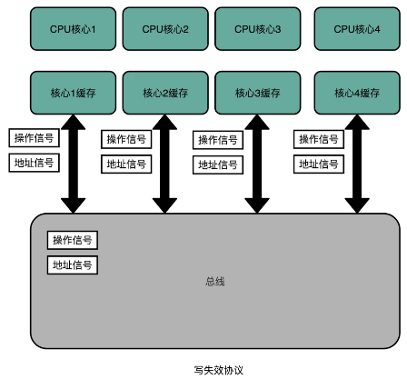

# 1、冯·诺依曼体系结构

## 1.1、计算机的基本硬件组成

三大件：
- CPU：中央处理器（Central Processing Unit）
- 内存：存放在内存里的程序和数据，需要被 CPU 读取，CPU 计算完之后，还要把数据写回到内存
- 主板：CPU 要插在主板上，内存也要插在主板上。主板的芯片组（Chipset）和总线（Bus）解决了 CPU 和内存之间如何通信的问题。芯片组控制了数据传输的流转，也就是数据从哪里到哪里的问题。总线则是实际数据传输的高速公路。因此，总线速度（Bus Speed）决定了数据能传输得多快

最后配上电源、输入输出设备；

另外还有一个特殊设备显卡，图形操作系统少不了这个，显卡之所以特殊，是因为显卡里有除了 CPU 之外的另一个“处理器”，也就是GPU（Graphics Processing Unit，图形处理器），GPU 一样可以做各种“计算”的工作；

### 1.2、冯·诺依曼体系结构

冯·诺依曼在[First Draft](https://en.wikipedia.org/wiki/First_Draft_of_a_Report_on_the_EDVAC)里面描述了一台计算机应该有哪些部分组成
- 首先是一个包含算术逻辑单元（Arithmetic Logic Unit，ALU）和处理器寄存器（Processor Register）的`处理器单元（Processing Unit）`，用来完成各种算术和逻辑运算。因为它能够完成各种数据的处理或者计算工作，因此也有人把这个叫作数据通路（Datapath）或者运算器；
- 然后是一个包含指令寄存器（Instruction Reigster）和程序计数器（Program Counter）的`控制器单元（Control Unit/CU）`，用来控制程序的流程，通常就是不同条件下的分支和跳转。在现在的计算机里，上面的算术逻辑单元和这里的控制器单元，共同组成了我们说的 CPU；
- 接着是用来存储数据（Data）和指令（Instruction）的`内存`，以及更大容量的`外部存储`，在过去，可能是磁带、磁鼓这样的设备，现在通常就是硬盘；
- 最后就是各种`输入和输出设备`，以及对应的输入和输出机制。个人电脑的鼠标键盘是输入设备，显示器是输出设备。我们用的智能手机，触摸屏既是输入设备，又是输出设备。而跑在各种云上的服务器，则是通过网络来进行输入和输出。这个时候，网卡既是输入设备又是输出设备；

任何一台计算机的任何一个部件都可以归到`运算器/处理器单元`、`控制器`、`存储器`、`输入设备`和`输出设备`中，而所有的现代计算机也都是基于这个基础架构来设计开发的；

而所有的计算机程序，也都可以抽象为从输入设备读取输入信息，通过运算器和控制器来执行存储在存储器里的程序，最终把结果输出到输出设备中；

冯·诺依曼体系结构确立了我们现在每天使用的计算机硬件的基础架构

冯·诺依曼体机与图灵机两者比较：两者有交叉但是不同
- 图灵机是一种思想模型（计算机的基本理论基础），是一种有穷的、构造性的问题的问题求解思路，图灵认为凡是能用算法解决的问题也一定能用图灵机解决；
- 冯诺依曼提出了“存储程序”的计算机设计思想，并“参照”图灵模型设计了历史上第一台电子计算机，即冯诺依曼机

# 2、计算机性能和功耗

对于计算机的性能，我们需要有个标准来衡量。这个标准中主要有两个指标：
- 第一个是响应时间（Response time）或者叫执行时间（Execution time）：让计算机跑的更快，响应时间指的就是，我们执行一个程序，到底需要花多少时间。花的时间越少，自然性能就越好
- 第二个是吞吐率（Throughput）或者带宽（Bandwidth）：让计算机搬的更多；吞吐率是指我们在一定的时间范围内，到底能处理多少事情

一般把性能定义成响应时间的倒数：`性能 = 1 / 响应时间`，响应时间越短，性能的数值就越大
 
## 2.1、CPU 时钟

用时间来衡量性能，存在两个问题：
- 第一个就是时间不“准”
- 其次，即使我们已经拿到了 CPU 时间，也不一定可以直接“比较”出两个程序的性能差异，即使在同一台计算机上，CPU 可能满载运行也可能降频运行，降频运行的时候自然花的时间会多一些

**时间不准**

为什么不准？首先，统计时间是用类似于“掐秒表”一样，记录程序运行结束的时间减去程序开始运行的时间。这个时间也叫 Wall Clock Time 或者 Elapsed Time，就是在运行程序期间，挂在墙上的钟走掉的时间；

但是，计算机可能同时运行着好多个程序，CPU 实际上不停地在各个程序之间进行切换。在这些走掉的时间里面，很可能 CPU 切换去运行别的程序了。而且，有些程序在运行的时候，可能要从网络、硬盘去读取数据，要等网络和硬盘把数据读出来，给到内存和 CPU。**所以说，要想准确统计某个程序运行时间，进而去比较两个程序的实际性能，得把这些时间给刨除掉。**

Linux 下有一个叫 time 的命令，可以统计出来：同样的 Wall Clock Time 下，程序实际在 CPU 上到底花了多少时间；它会返回三个值：
```bash
[root@bluefish ~]# time seq 1000000 |wc -l
1000000
real    0m0.013s
user    0m0.011s
sys     0m0.012s
```
- 第一个是real time，也就是前面说的 Wall Clock Time，也就是运行程序整个过程中流逝掉的时间；
- 第二个是user time，也就是 CPU 在运行你的程序，在用户态运行指令的时间；
- 第三个是sys time，是 CPU 在运行你的程序，在操作系统内核里运行指令的时间。而程序实际花费的 CPU 执行时间（CPU Time），就是 user time 加上 sys time；

除了 CPU 之外，时间这个性能指标还会受到主板、内存这些其他相关硬件的影响。所以，需要对“时间”这个可以感知的指标进行拆解，把程序的 CPU 执行时间变成` CPU 时钟周期数（CPU Cycles）`和 `时钟周期时间（Clock Cycle）`的乘积：

<p align="center">程序的CPU执行时间 = CPU时钟周期数 × 时钟周期时间</p>

**时钟周期**

比如电脑的CPU描述：`Intel Core-i7 2.8GHz`，这里的 `2.8GHz` 就是电脑的主频（Frequency/Clock Rate），`2.8GHz` 就代表，我们 CPU 的一个“钟表”能够识别出来的最小的时间间隔；

而在 CPU 内部，和电子石英表类似，有一个叫晶体振荡器（Oscillator Crystal）的东西，简称为晶振。把晶振当成 CPU 内部的电子表来使用。**晶振带来的每一次“滴答”，就是时钟周期时间**

在这个 2.8GHz的CPU上，时间周期时间就是：`1/2.8G`；CPU，是按照这个“时钟”提示的时间来进行自己的操作。主频越高，意味着这个表走得越快，我们的 CPU 也就“被逼”着走得越快；

根据前面计算程序CPU执行时间的公式，最简单的提升性能方案，自然缩短时钟周期时间，也就是提升主频。换句话说，就是换一块好一点的 CPU；

**CPU 时钟周期数**

前面提到提升性能的简单方案是缩短时钟周期时间，即提升主频，也就是换一块好的CPU；除了这个，还可以减少程序需要的 CPU 时钟周期数量，一样能够提升程序性能；

对于 CPU 时钟周期数，可以再做一个分解，把它变成“`指令数×每条指令的平均时钟周期数（Cycles Per Instruction，简称 CPI）`”。不同的指令需要的 Cycles 是不同的，加法和乘法都对应着一条 CPU 指令，但是乘法需要的 Cycles 就比加法要多，自然也就慢。在这样拆分了之后，程序的 CPU 执行时间就可以变成这样三个部分的乘积：

<p align="center">程序的 CPU 执行时间 = 指令数 × CPI × Clock Cycle Time</p>

因此想要解决性能问题，其实是优化这三者：
- 时钟周期时间，就是计算机主频，这个取决于计算机硬件。摩尔定律就一直在不停地提高我们计算机的主频。
- 每条指令的平均时钟周期数 CPI，就是一条指令到底需要多少 CPU Cycle。
- 指令数，代表执行我们的程序到底需要多少条指令、用哪些指令。这个一般交给了编译器。同样的代码，编译成计算机指令时候，就有各种不同的表示方式；

如果要提升计算机的性能，可以从指令数、CPI 以及 CPU 主频这三个地方入手。要搞定指令数或者 CPI，就在 CPU 上多放一点晶体管，不断提升 CPU 的时钟频率，这样就能让 CPU 变得更快，程序的执行时间就会缩短
 
## 2.2、功耗

早期提升CPU性能，就是堆晶体管；

*为什么奔腾 4 的主频没能超过 3.8GHz 的障碍呢？*因为功耗

功耗问题的直观例子：一个 3.8GHz 的奔腾 4 处理器，满载功率是 130 瓦。这个 130 瓦是什么概念呢？机场允许带上飞机的充电宝的容量上限是 100 瓦时。如果我们把这个 CPU 安在手机里面，不考虑屏幕内存之类的耗电，这个 CPU 满载运行 45 分钟，充电宝里面就没电了。而 iPhone X 使用 ARM 架构的 CPU，功率则只有 4.5 瓦左右；

CPU，一般都被叫作`超大规模集成电路（Very-Large-Scale Integration，VLSI）`。这些电路，实际上都是一个个晶体管组合而成的。CPU 在计算，其实就是让晶体管里面的“开关”不断地去“打开”和“关闭”，来组合完成各种运算和功能，想要计算得快：
- 一方面，我们要在 CPU 里，同样的面积里面，多放一些晶体管，也就是`增加密度`；
- 另一方面，我们要让晶体管“打开”和“关闭”得更快一点，也就是`提升主频`。
 
而这两者，都会增加功耗，带来耗电和散热的问题，因此，在 CPU 里面，能够放下的晶体管数量和晶体管的“开关”频率也都是有限的。一个 CPU 的功率，可以用这样一个公式来表示：

<p align="center"> 功耗 ~= 1/2 × 负载电容 × 电压的平方 × 开关频率 × 晶体管数量 </p>

为了要提升性能：
- 需要不断地增加晶体管数量。同样的面积下，想要多放一点晶体管，就要把晶体管造得小一点。这个就是平时所说的提升“制程”。从 28nm 到 7nm，相当于晶体管本身变成了原来的 1/4 大小；
- 还提升主频，让开关的频率变快；
- 功耗增加太多，就会导致 CPU 散热跟不上，这时，就需要降低电压；在整个功耗的公式里面，功耗和电压的平方是成正比的。这意味着电压下降到原来的 1/5，整个的功耗会变成原来的 1/25；

## 2.3、并行优化与阿姆达尔定律

随着技术的发展，面向[摩尔定律](https://en.wikipedia.org/wiki/Moore%27s_law)编程越来越行不通了，Intel 意识到通过提升主频比较“难”去实现性能提升，边开始推出 Core Duo 这样的多核 CPU，通过提升“吞吐率”而不是“响应时间”，来达到目的；这是一个常见的性能提升方式：通过并行提高性能；

能够使用并行计算，需要满足如下条件：
- 要进行的计算，本身可以分解成几个可以并行的任务。好比上面的乘法和加法计算，几个人可以同时进行，不会影响最后的结果。
- 需要能够分解好问题，并确保几个人的结果能够汇总到一起。
- 在“汇总”这个阶段，是没有办法并行进行的，还是得顺序执行，一步一步来；
 
在进行性能优化中，常常用到的一个经验定律，[阿姆达尔定律（Amdahl’s Law）](https://en.wikipedia.org/wiki/Amdahl%27s_law)。这个定律说的就是，对于一个程序进行优化之后，处理器并行运算之后效率提升的情况。具体可以用这样一个公式来表示：
<p align="center">优化后的执行时间 = 受优化影响的执行时间 / 加速倍数 + 不受影响的执行时间</p>

## 2.4、提升性能原则

- 加速大概率事件；
- 通过流水线提高性能：把 CPU 指令执行的过程进行拆分，细化运行，也是现代 CPU 在主频没有办法提升那么多的情况下，性能仍然可以得到提升的重要原因之一；
- 通过预测提高性能：通过预先猜测下一步该干什么，而不是等上一步运行的结果，提前进行运算，也是让程序跑得更快一点的办法；比如数组的访问；“分支和冒险”、“局部性原理”这些 CPU 和存储系统设计方法，其实都是在利用我们对于未来的“预测”，提前进行相应的操作，来提升我们的程序性能

# 3、指令和运算

[指令与运算](./计算机组成_指令与运算.md)

# 4、处理器

[处理器](./计算机组成_处理器.md)

# 5、存储与IO

## 5.1、存储器的层次结构

存储器系统是一个通过各种不同的方法和设备，一层一层组合起来的系统

把 CPU 比喻成计算机的“大脑”。我们思考的东西，就好比 CPU 中的寄存器（Register）。寄存器与其说是存储器，其实它更像是 CPU 本身的一部分，只能存放极其有限的信息，但是速度非常快，和 CPU 同步；

而我们大脑中的记忆，就好比**CPU Cache**（CPU 高速缓存，简称为“缓存”）。CPU Cache 用的是一种叫作**SRAM（Static Random-Access Memory，静态随机存取存储器）** 的芯片

**SRAM**

SRAM 之所以被称为“静态”存储器，是因为只要处在通电状态，里面的数据就可以保持存在。而一旦断电，里面的数据就会丢失了。在 SRAM 里面，一个比特的数据，需要 6～8 个晶体管。所以 SRAM 的存储密度不高。同样的物理空间下，能够存储的数据有限。不过，因为 SRAM 的电路简单，所以访问速度非常快


在 CPU 里，通常会有 L1、L2、L3 这样三层高速缓存。每个 CPU 核心都有一块属于自己的 L1 高速缓存，通常分成 **指令缓存** 和 **数据缓存** ，分开存放 CPU 使用的指令和数据；这里的指令缓存和数据缓存，来自于[哈佛架构](https://en.wikipedia.org/wiki/Harvard_architecture)
- L1 的 Cache 往往就嵌在 CPU 核心的内部；
- L2 的 Cache 同样是每个 CPU 核心都有的，不过它往往不在 CPU 核心的内部，所以，L2 Cache 的访问速度会比 L1 稍微慢一些；
- L3 Cache，则通常是多个 CPU 核心共用的，尺寸会更大一些，访问速度自然也就更慢一些；

可以把 CPU 中的 L1 Cache 理解为我们的短期记忆，把 L2/L3 Cache 理解成长期记忆，把内存当成我们拥有的书架或者书桌。 当我们自己记忆中没有资料的时候，可以从书桌或者书架上拿书来翻阅。这个过程中就相当于，数据从内存中加载到 CPU 的寄存器和 Cache 中，然后通过“大脑”，也就是 CPU，进行处理和运算；

**DRAM**

内存用的芯片和 Cache 有所不同，它用的是一种叫作**DRAM（Dynamic Random Access Memory，动态随机存取存储器）** 的芯片，比起 SRAM 来说，它的密度更高，有更大的容量，而且它也比 SRAM 芯片便宜不少

DRAM 被称为“动态”存储器，是因为 DRAM 需要靠不断地“刷新”，才能保持数据被存储起来。DRAM 的一个比特，只需要一个晶体管和一个电容就能存储。
- 优点：DRAM 在同样的物理空间下，能够存储的数据也就更多，也就是存储的“密度”更大。
- 缺点：因为数据是存储在电容里的，电容会不断漏电，所以需要定时刷新充电，才能保持数据不丢失。DRAM 的数据访问电路和刷新电路都比 SRAM 更复杂，所以访问延时也就更长

**存储器的层级结构**

大脑（CPU）中的记忆（L1 Cache），不仅受成本层面的限制，更受物理层面的限制。这就好比 L1 Cache 不仅昂贵，其访问速度和它到 CPU 的物理距离有关。芯片造得越大，总有部分离 CPU 的距离会变远。电信号的传输速度又受物理原理的限制，没法超过光速；

对于内存来说，**SSD（Solid-state drive 或 Solid-state disk，固态硬盘）**、**HDD（Hard Disk Drive，硬盘）** 这些被称为硬盘的外部存储设备，就是能存储更多数据的地方
- SSD 这种基于 NAND 芯片的高速硬盘，价格已经大幅度下降；
- HDD 硬盘则是一种完全符合“磁盘”这个名字的传统硬件。“磁盘”的硬件结构，决定了它的访问速度受限于它的物理结构，是最慢的


从 Cache、内存，到 SSD 和 HDD 硬盘，一台现代计算机中，就用上了所有这些存储器设备。其中，容量越小的设备速度越快，而且，CPU 并不是直接和每一种存储器设备打交道，而是每一种存储器设备，只和它相邻的存储设备打交道。比如，CPU Cache 是从内存里加载而来的，或者需要写回内存，并不会直接写回数据到硬盘，也不会直接从硬盘加载数据到 CPU Cache 中，而是先加载到内存，再从内存加载到 Cache 中。

**这样，各个存储器只和相邻的一层存储器打交道，并且随着一层层向下，存储器的容量逐层增大，访问速度逐层变慢，而单位存储成本也逐层下降，也就构成了我们日常所说的存储器层次结构**

**使用存储器的时候，该如何权衡价格和性能？**

存储器在不同层级之间的性能差异和价格差异，都至少在一个数量级以上。L1 Cache 的访问延时是 1 纳秒（ns），而内存就已经是 100 纳秒了。在价格上，这两者也差出了 400 倍；

可以参考[各种存储器成本的对比表格](https://colin-scott.github.io/personal_website/research/interactive_latency.html)

## 5.2、局部性原理

前面提到，不同的存储器设备之间，访问速度、价格和容量都有几十乃至上千倍的差异，性能和价格的巨大差异，给工程师带来了一个挑战：**能不能既享受 CPU Cache 的速度，又享受内存、硬盘巨大的容量和低廉的价格呢？**

想要同时享受到这三点，前辈们已经探索出了答案，那就是，存储器中数据的**局部性原理（Principle of Locality）** ，这个局部性原理包括**时间局部性（temporal locality）** 和 **空间局部性（spatial locality）** 这两种策略
- 时间局部性：这个策略是说，如果一个数据被访问了，那么它在短时间内还会被再次访问；
- 空间局部性：这个策略是说，如果一个数据被访问了，那么和它相邻的数据也很快会被访问；

有了时间局部性和空间局部性，不用再把所有数据都放在内存里，也不用都放在 HDD 硬盘上，而是把访问次数多的数据，放在贵但是快一点的存储器里，把访问次数少的数据，放在慢但是大一点的存储器里。这样组合使用内存、SSD 硬盘以及 HDD 硬盘，使得我们可以用最低的成本提供实际所需要的数据存储、管理和访问的需求

## 5.3、CPU Cache

- [CPU 和内存之间的访问性能](https://people.freebsd.org/~lstewart/articles/cpumemory.pdf)

为什么这两个程序运行结果差别不大？
```java
int[] arr = new int[64 * 1024 * 1024];
// 循环 1
for (int i = 0; i < arr.length; i++) arr[i] *= 3;
// 循环 2
for (int i = 0; i < arr.length; i += 16) arr[i] *= 3
```

### 5.3.1、为什么需要高速缓存

按照[摩尔定律](https://en.wikipedia.org/wiki/Moore%27s_law)，CPU 的访问速度每 18 个月便会翻一番，相当于每年增长 60%。内存的访问速度虽然也在不断增长，却远没有这么快，每年只增长 7% 左右。而这两个增长速度的差异，使得 CPU 性能和内存访问性能的差距不断拉大。到今天来看，一次内存的访问，大约需要 120 个 CPU Cycle，这也意味着，在今天，CPU 和内存的访问速度已经有了 120 倍的差距，而CPU 需要执行的指令、需要访问的数据，都在这个速度不到自己 1% 的内存里；

为了弥补两者之间的性能差异，能真实地把 CPU 的性能提升用起来，而不是让它在那儿空转，在现代 CPU 中引入了**高速缓存**

从 CPU Cache 被加入到现有的 CPU 里开始，内存中的指令、数据，会被加载到 L1-L3 Cache 中，而不是直接由 CPU 访问内存去拿。在 95% 的情况下，CPU 都只需要访问 L1-L3 Cache，从里面读取指令和数据，而无需访问内存。要注意的是，这里说的 CPU Cache 或者 L1/L3 Cache，不是一个单纯的、概念上的缓存，而是指特定的由 SRAM 组成的物理芯片

CPU 从内存中读取数据到 CPU Cache 的过程中，是一小块一小块来读取数据的，而不是按照单个数组元素来读取数据的。这样一小块一小块的数据，在 CPU Cache 里面，把它叫作 **Cache Line（缓存块）**

日常使用的 Intel 服务器或者 PC 里，Cache Line 的大小通常是 64 字节。而在上面的循环 2 里面，每隔 16 个整型数计算一次，16 个整型数正好是 64 个字节，于是，循环 1 和循环 2，需要把同样数量的 Cache Line 数据从内存中读取到 CPU Cache 中，最终两个程序花费的时间就差别不大了

### 5.3.2、Cache 的数据结构和读取过程

现代 CPU 进行数据读取的时候，无论数据是否已经存储在 Cache 中，CPU 始终会首先访问 Cache。只有当 CPU 在 Cache 中找不到数据的时候，才会去访问内存，并将读取到的数据写入 Cache 之中。当时间局部性原理起作用后，这个最近刚刚被访问的数据，会很快再次被访问。而 Cache 的访问速度远远快于内存，这样，CPU 花在等待内存访问上的时间就大大变短了。

**直接映射 Cache（Direct Mapped Cache）**

CPU 访问内存数据，是一小块一小块数据来读取的。对于读取内存中的数据，首先拿到的是数据所在的**内存块（Block）** 的地址。而直接映射 Cache 采用的策略，就是确保任何一个内存块的地址，始终映射到一个固定的 CPU Cache 地址（Cache Line）。而这个映射关系，通常用 mod 运算（求余运算）来实现；

比如说，我们的主内存被分成 0～31 号这样 32 个块。我们一共有 8 个缓存块。用户想要访问第 21 号内存块。如果 21 号内存块内容在缓存块中的话，它一定在 5 号缓存块（21 mod 8 = 5）中


实际计算中，有一个小小的技巧，通常会把缓存块的数量设置成 2 的 N 次方。这样在计算取模的时候，可以直接取地址的低 N 位，也就是二进制里面的后几位。比如这里的 8 个缓存块，就是 2 的 3 次方。那么，在对 21 取模的时候，可以对 21 的 2 进制表示 10101 取地址的低三位，也就是 101，对应的 5，就是对应的缓存块地址；

取 Block 地址的低位，就能得到对应的 Cache Line 地址，除了 21 号内存块外，13 号、5 号等很多内存块的数据，都对应着 5 号缓存块中。既然如此，假如现在 CPU 想要读取 21 号内存块，在读取到 5 号缓存块的时候，*怎么知道里面的数据，究竟是不是 21 号对应的数据呢？*

在对应的缓存块中，会存储一个**组标记（Tag）**。这个组标记会记录，当前缓存块内存储的数据对应的内存块，而缓存块本身的地址表示访问地址的低 N 位。就像上面的例子，21 的低 3 位 101，缓存块本身的地址已经涵盖了对应的信息、对应的组标记，只需要记录 21 剩余的高 2 位的信息，也就是 10 就可以了

除了组标记信息之外，缓存块中还有两个数据。一个自然是从主内存中加载来的实际存放的数据，另一个是**有效位（valid bit）**：
- 有效位：是用来标记，对应的缓存块中的数据是否是有效的，确保不是机器刚刚启动时候的空数据。如果有效位是 0，无论其中的组标记和 Cache Line 里的数据内容是什么，CPU 都不会管这些数据，而要直接访问内存，重新加载数据；

CPU 在读取数据的时候，并不是要读取一整个 Block，而是读取一个他需要的整数。这样的数据，叫作 CPU 里的一 个**字（Word）**。具体是哪个字，就用这个字在整个 Block 里面的位置来决定。这个位置，叫作**偏移量（Offset）**

总结一下：**一个内存的访问地址，最终包括高位代表的组标记、低位代表的索引，以及在对应的 Data Block 中定位对应字的位置偏移量**


而内存地址对应到 Cache 里的数据结构，则多了一个有效位和对应的数据，由**“索引 + 有效位 + 组标记 + 数据”** 组成。如果内存中的数据已经在 CPU Cache 里了，那一个内存地址的访问，就会经历这样 4 个步骤：
- （1）根据内存地址的低位，计算在 Cache 中的索引；
- （2）判断有效位，确认 Cache 中的数据是有效的；
- （3）对比内存访问地址的高位，和 Cache 中的组标记，确认 Cache 中的数据就是我们要访问的内存数据，从 Cache Line 中读取到对应的数据块（Data Block）；
- （4）根据内存地址的 Offset 位，从 Data Block 中，读取希望读取到的字。

如果在 2、3 这两个步骤中，CPU 发现，Cache 中的数据并不是要访问的内存地址的数据，那 CPU 就会访问内存，并把对应的 Block Data 更新到 Cache Line 中，同时更新对应的有效位和组标记的数据；

除了直接映射 Cache 之外，常见的缓存放置策略还有全相连 Cache（Fully Associative Cache）、组相连 Cache（Set Associative Cache）。这几种策略的数据结构都是相似的

### 5.3.3、CPU 高速缓存的写入

可以把 Java 内存模型和计算机组成里的 CPU 结构对照起来看。现在用的 Intel CPU，通常都是多核的的。每一个 CPU 核里面，都有独立属于自己的 L1、L2 的 Cache，然后再有多个 CPU 核共用的 L3 的 Cache、主内存；

因为 CPU Cache 的访问速度要比主内存快很多，而在 CPU Cache 里面，L1/L2 的 Cache 也要比 L3 的 Cache 快。所以，上CPU 始终都是尽可能地从 CPU Cache 中去获取数据，而不是每一次都要从主内存里面去读取数据；


这个层级结构，就好像我们在 Java 内存模型里面，每一个线程都有属于自己的线程栈；

对应数据，不光要读取，还要写入修改，那么问题来了：
- 第一个问题是，写入 Cache 的性能也比写入主内存要快，那写入的数据，到底应该写到 Cache 里还是主内存呢？
- 如果直接写入到主内存里，Cache 里的数据是否会失效呢？

下面看两种写入策略：

**写直达（Write-Through）**


最简单的一种写入策略，叫作**写直达（Write-Through）**。在这个策略里，每一次数据都要写入到主内存里面。在写直达的策略里面，写入前，会先去判断数据是否已经在 Cache 里面了。如果数据已经在 Cache 里面了，先把数据写入更新到 Cache 里面，再写入到主内存里面；如果数据不在 Cache 里，就只更新主内存。

写直达的这个策略很直观，但是问题也很明显，那就是这个策略很慢。无论数据是不是在 Cache 里面，都需要把数据写到主内存里面。这个方式就有点儿像用 volatile 关键字，始终都要把数据同步到主内存里面

**写回（Write-Back）**


在 CPU Cache 的写入策略里，还有一种策略叫作**写回（Write-Back）**。这个策略里，不再是每次都把数据写入到主内存，而是只写到 CPU Cache 里。只有当 CPU Cache 里面的数据要被“替换”的时候，才把数据写入到主内存里面去

写回策略的过程是这样的：
- 如果发现要写入的数据，就在 CPU Cache 里面，那么就只是更新 CPU Cache 里面的数据。同时，会标记 CPU Cache 里的这个 Block 是脏（Dirty）的。所谓**脏的**，就是指这个时候，CPU Cache 里面的这个 Block 的数据，和主内存是不一致的；
- 如果发现，要写入的数据所对应的 Cache Block 里，放的是别的内存地址的数据，那么就要看一看，那个 Cache Block 里面的数据有没有被标记成脏的：
  - 如果是脏的话，要先把这个 Cache Block 里面的数据，写入到主内存里面，然后，再把当前要写入的数据，写入到 Cache 里，同时把 Cache Block 标记成脏的；
  - 如果 Block 里面的数据没有被标记成脏的，那么直接把数据写入到 Cache 里面，然后再把 Cache Block 标记成脏的就好了。

在用了写回这个策略之后，在加载内存数据到 Cache 里面的时候，也要多出一步同步脏 Cache 的动作。如果加载内存里面的数据到 Cache 的时候，发现 Cache Block 里面有脏标记，也要先把 Cache Block 里的数据写回到主内存，才能加载数据覆盖掉 Cache。

可以看到，在写回这个策略里，如果大量的操作，都能够命中缓存。那么大部分时间里，都不需要读写主内存，自然性能会比写直达的效果好很多；

无论是写回还是写直达，其实都还没有解决volatile 程序遇到的问题，也就是多个线程，或者是多个 CPU 核的缓存一致性的问题。这也是在写入修改缓存后，需要解决的第二个问题；

要解决这个问题，需要引入一个新的方法，叫作 **MESI 协议**。这是一个维护**缓存一致性协议**

### 5.3.4、MESI协议

- [Java Memory Model](../Java/Java虚拟机/JMM-Java内存模型.md#一内存模型)

因为 CPU 的每个核各有各的缓存，互相之间的操作又是各自独立的，就会带来缓存一致性（Cache Coherence）的问题


#### （1）缓存一致性问题

如图：


在这两个 CPU 核心里，1 号核心要写一个数据到内存里。比如：iPhone 降价了，要把 iPhone 最新的价格更新到内存里。为了性能问题，它采用了写回策略，先把数据写入到 L2 Cache 里面，然后把 Cache Block 标记成脏的。这个时候，数据其实并没有被同步到 L3 Cache 或者主内存里。1 号核心希望在这个 Cache Block 要被交换出去的时候，数据才写入到主内存里。

如果 CPU 只有 1 号核心这一个 CPU 核，那这其实是没有问题的。不过，旁边还有一个 2 号核心呢！这个时候，2 号核心尝试从内存里面去读取 iPhone 的价格，结果读到的是一个错误的价格。这是因为，iPhone 的价格刚刚被 1 号核心更新过。但是这个更新的信息，只出现在 1 号核心的 L2 Cache 里，而没有出现在 2 号核心的 L2 Cache 或者主内存里面。**这个问题，就是所谓的缓存一致性问题，1 号核心和 2 号核心的缓存，在这个时候是不一致的**

为了解决这个缓存不一致的问题，我们就需要有一种机制，来同步两个不同核心里面的缓存数据，这样的机制需要满足如下条件：
- 第一点叫**写传播（Write Propagation）**。写传播是说，在一个 CPU 核心里， Cache 数据更新，必须能够传播到其他的对应节点的 Cache Line 里；
- 第二点叫**事务的串行化（Transaction Serialization）**，事务串行化是说，在一个 CPU 核心里面的读取和写入，在其他的节点看起来，顺序是一样的；

如何理解事务的串行化（Transaction Serialization）？举例说明：还是以修改iPhone价格为例，这一次，找一个有 4 个核心的 CPU：
- 1 号核心呢，先把 iPhone 的价格改成了 5000 块。
- 差不多在同一个时间，2 号核心把 iPhone 的价格改成了 6000 块。

这里两个修改，都会传播到 3 号核心和 4 号核心；然而这里有个问题：
- 3 号核心先收到了 2 号核心的写传播，再收到 1 号核心的写传播。所以 3 号核心看到的 iPhone 价格是先变成了 6000 块，再变成了 5000 块。
- 而 4 号核心呢，是反过来的，先看到变成了 5000 块，再变成 6000 块。

虽然写传播是做到了，但是各个 Cache 里面的数据，是不一致的。事实上需要的是，从 1 号到 4 号核心，都能看到相同顺序的数据变化。比如说，都是先变成了 5000 块，再变成了 6000 块。这样，才能称之为实现了事务的串行化；

在 CPU Cache 里做到事务串行化，需要做到两点：
- 第一点是一个 CPU 核心对于数据的操作，需要同步通信给到其他 CPU 核心。
- 第二点是，如果两个 CPU 核心里有同一个数据的 Cache，那么对于这个 Cache 数据的更新，需要有一个“锁”的概念。只有拿到了对应 Cache Block 的“锁”之后，才能进行对应的数据更新

#### （2）总线嗅探机制和 MESI 协议

要解决缓存一致性问题，首先要解决的是多个 CPU 核心之间的数据传播问题。最常见的一种解决方案呢，叫作**总线嗅探（Bus Snooping）** ，这个策略，本质上就是把所有的读写请求都通过总线（Bus）广播给所有的 CPU 核心，然后让各个核心去“嗅探”这些请求，再根据本地的情况进行响应；

总线本身就是一个特别适合广播进行数据传输的机制，所以总线嗅探这个办法是日常使用的 Intel CPU 进行缓存一致性处理的解决方案；

基于总线嗅探机制，其实还可以分成很多种不同的缓存一致性协议。不过其中最常用的，就是 MESI 协议；

MESI 协议，是一种叫作**写失效（Write Invalidate）** 的协议。在写失效协议里，只有一个 CPU 核心负责写入数据，其他的核心，只是同步读取到这个写入。在这个 CPU 核心写入 Cache 之后，它会去广播一个“失效”请求告诉所有其他的 CPU 核心。其他的 CPU 核心，只是去判断自己是否也有一个“失效”版本的 Cache Block，然后把这个也标记成失效的就好了；

相对于写失效协议，还有一种叫作**写广播（Write Broadcast）** 的协议。在那个协议里，一个写入请求广播到所有的 CPU 核心，同时更新各个核心里的 Cache；

写广播在实现上自然很简单，但是写广播需要占用更多的总线带宽。写失效只需要告诉其他的 CPU 核心，哪一个内存地址的缓存失效了，但是写广播还需要把对应的数据传输给其他 CPU 核心

   

MESI 协议的由来呢，来自于对 Cache Line 的四个不同的标记，分别是：
- M：代表已修改（Modified），“脏”的 Cache Block，Cache Block 里面的内容我们已经更新过了，但是还没有写回到主内存里面
- E：代表独占（Exclusive）
- S：代表共享（Shared）
- I：代表已失效（Invalidated），这个 Cache Block 里面的数据已经失效了

无论是“独占”还是“共享”，Cache Block 里面的数据和主内存里面的数据是一致的，这两者的差别：
- 在独占状态下，对应的 Cache Line 只加载到了当前 CPU 核所拥有的 Cache 里。其他的 CPU 核，并没有加载对应的数据到自己的 Cache 里。这个时候，如果要向独占的 Cache Block 写入数据，可以自由地写入数据，而不需要告知其他 CPU 核；
- 在独占状态下的数据，如果收到了一个来自于总线的读取对应缓存的请求，它就会变成共享状态。这个共享状态是因为，这个时候，另外一个 CPU 核心，也把对应的 Cache Block，从内存里面加载到了自己的 Cache 里来；
- 在共享状态下，因为同样的数据在多个 CPU 核心的 Cache 里都有。所以，当想要更新 Cache 里面的数据的时候，不能直接修改，而是要先向所有的其他 CPU 核心广播一个请求，要求先把其他 CPU 核心里面的 Cache，都变成无效的状态，然后再更新当前 Cache 里面的数据。这个广播操作，一般叫作 RFO（Request For Ownership），也就是获取当前对应 Cache Block 数据的所有权；

整个 [MESI 的状态](https://zh.wikipedia.org/wiki/MESI%E5%8D%8F%E8%AE%AE)，可以用一个有限状态机来表示它的状态流转。需要注意的是，对于不同状态触发的事件操作，可能来自于当前 CPU 核心，也可能来自总线里其他 CPU 核心广播出来的信号

<p align="center"><a href='https://commons.wikimedia.org/wiki/File:Diagrama_MESI.GIF' target='_blank'></a></p>

## 5.4、内存

在日常使用的 Linux 或者 Windows 操作系统下，程序并不能直接访问物理内存


内存需要被分成固定大小的页（Page），然后再通过虚拟内存地址（Virtual Address）到物理内存地址（Physical Address）的地址转换（Address Translation），才能到达实际存放数据的物理内存位置。而我们的程序看到的内存地址，都是虚拟内存地址

这些虚拟内存地址究竟是怎么转换成物理内存地址的呢？

### 5.4.1、简单页表

想要把虚拟内存地址，映射到物理内存地址，最直观的办法，就是来建一张映射表。这个映射表，能够实现虚拟内存里面的页，到物理内存里面的页的一一映射。这个映射表，在计算机里面，就叫作 **页表（Page Table）**；

页表这个地址转换的办法，会把一个内存地址分成**页号（Directory）** 和 **偏移量（Offset）** 两个部分；

以一个 32 位的内存地址为例理解一下：
- 前面的高位，就是内存地址的页号。
- 后面的低位，就是内存地址里面的偏移量；
 
做地址转换的页表，只需要保留虚拟内存地址的页号和物理内存地址的页号之间的映射关系就可以了。同一个页里面的内存，在物理层面是连续的。以一个页的大小是 4K 比特（4KiB）为例，需要 20 位的高位，12 位的低位；

总结一下，对于一个内存地址转换，其实就是这样三个步骤：
- 把虚拟内存地址，切分成页号和偏移量的组合；
- 从页表里面，查询出虚拟页号，对应的物理页号；
- 直接拿物理页号，加上前面的偏移量，就得到了物理内存地址。


但是，随之而来的问题：这样一个页表需要多大的空间吗？以 32 位的内存地址空间为例，页表一共需要记录 $2^{20}$ 个到物理页号的映射关系。这个存储关系，就好比一个 $2^{20}$ 大小的数组。一个页号是完整的 32 位的 4 字节（Byte），这样一个页表就需要 4MB 的空间；

不过，这个空间可不是只占用一份哦。每一个进程，都有属于自己独立的虚拟内存地址空间。这也就意味着，每一个进程都需要这样一个页表。不管这个进程，是个本身只有几 KB 大小的程序，还是需要几 GB 的内存空间，都需要这样一个页表。

### 5.4.2、多级页表

其实没有必要存下这 $2^{20}$ 个物理页表啊。大部分进程所占用的内存是有限的，需要的页也自然是很有限的。只需要去存那些用到的页之间的映射关系就好了；在实践中，采用的是一种叫作**多级页表（Multi-Level Page Table）** 的解决方案

一个进程的内存地址空间是分配策略：在整个进程的内存地址空间，通常是“两头实、中间空”。在程序运行的时候，内存地址从顶部往下，不断分配占用的栈的空间。而堆的空间，内存地址则是从底部往上，是不断分配占用的；

所以，在一个实际的程序进程里面，虚拟内存占用的地址空间，通常是两段连续的空间。而不是完全散落的随机的内存地址。而多级页表，就特别适合这样的内存地址分布

以一个 4 级的多级页表为例，来看一下。同样一个虚拟内存地址，偏移量的部分和上面简单页表一样不变，但是原先的页号部分，把它拆成四段，从高到低，分成 4 级到 1 级这样 4 个页表索引：


对应的，一个进程会有一个 4 级页表:
- 先通过 4 级页表索引，找到 4 级页表里面对应的条目（Entry）。这个条目里存放的是一张 3 级页表所在的位置。4 级页面里面的每一个条目，都对应着一张 3 级页表，所以可能有多张 3 级页表。
- 找到对应这张 3 级页表之后，用 3 级索引去找到对应的 3 级索引的条目。3 级索引的条目再会指向一个 2 级页表。
- 同样的，2 级页表里我们可以用 2 级索引指向一个 1 级页表。
- 最后一层的 1 级页表里面的条目，对应的数据内容就是物理页号了。在拿到了物理页号之后，同样可以用“页号 + 偏移量”的方式，来获取最终的物理内存地址；

可能有很多张 1 级页表、2 级页表，乃至 3 级页表。但是，因为实际的虚拟内存空间通常是连续的，很可能只需要很少的 2 级页表，甚至只需要 1 张 3 级页表就够了；

事实上，多级页表就像一个多叉树的数据结构，所以常常称它为**页表树（Page Table Tree）**。因为虚拟内存地址分布的连续性，树的第一层节点的指针，很多就是空的，也就不需要有对应的子树了。所谓不需要子树，其实就是不需要对应的 2 级、3 级的页表。找到最终的物理页号，就好像通过一个特定的访问路径，走到树最底层的叶子节点


以这样的分成 4 级的多级页表来看，每一级如果都用 5 个比特表示。那么每一张某 1 级的页表，只需要 2^5=32 个条目。如果每个条目还是 4 个字节，那么一共需要 128 个字节。而一个 1 级索引表，对应 32 个 4KiB 的也就是 16KB 的大小。一个填满的 2 级索引表，对应的就是 32 个 1 级索引表，也就是 512KB 的大小。

可以算一下，一个进程如果占用了 1MB 的内存空间，分成了 2 个 512KB 的连续空间。那么，它一共需要 2 个独立的、填满的 2 级索引表，也就意味着 64 个 1 级索引表，2 个独立的 3 级索引表，1 个 4 级索引表。一共需要 69 个索引表，每个 128 字节，大概就是 9KB 的空间。比起 4MB 来说，只有差不多 1/500;

不过，多级页表虽然节约了存储空间，却带来了时间上的开销，所以它其实是一个“以时间换空间”的策略。原本进行一次地址转换，只需要访问一次内存就能找到物理页号，算出物理内存地址。但是，用了 4 级页表，就需要访问 4 次内存，才能找到物理页号了

### 5.4.3、解析TLB

机器指令里面的内存地址都是虚拟内存地址。程序里面的每一个进程，都有一个属于自己的虚拟内存地址空间。可以通过地址转换来获得最终的实际物理地址。每一个指令都存放在内存里面，每一条数据都存放在内存里面。因此，“地址转换”是一个非常高频的动作，“地址转换”的性能就变得至关重要了；

前面提到多级页表虽然节约了我们的存储空间，但是却带来了时间上的开销，变成了一个“以时间换空间”的策略；内存访问其实比 Cache 要慢很多。本来只是要做一个简单的地址转换，现在反而要一下子多访问好多次内存；

程序所需要使用的指令，都顺序存放在虚拟内存里面。执行的指令，也是一条条顺序执行下去的。也就是说，对于指令地址的访问，存在、“空间局部性”和“时间局部性”，而需要访问的数据也是一样的。连续执行了 5 条指令。因为内存地址都是连续的，所以这 5 条指令通常都在同一个“虚拟页”里；

因此，这连续 5 次的内存地址转换，其实都来自于同一个虚拟页号，转换的结果自然也就是同一个物理页号。那就可以用一个“加个缓存”的办法。把之前的内存转换地址缓存下来，使得不需要反复去访问内存来进行内存地址转换


于是，计算机工程师们专门在 CPU 里放了一块缓存芯片。这块缓存芯片称之为**TLB**，全称是**地址变换高速缓冲（Translation-Lookaside Buffer）**。这块缓存存放了之前已经进行过地址转换的查询结果。这样，当同样的虚拟地址需要进行地址转换的时候，可以直接在 TLB 里面查询结果，而不需要多次访问内存来完成一次转换；

TLB 和CPU 的高速缓存类似，可以分成指令的 TLB 和数据的 TLB，也就是ITLB和DTLB。同样的，也可以根据大小对它进行分级，变成 L1、L2 这样多层的 TLB。

除此之外，还有一点和 CPU 里的高速缓存也是一样的，需要用脏标记这样的标记位，来实现“写回”这样缓存管理策略


为了性能，整个内存转换过程也要由硬件来执行。在 CPU 芯片里面，封装了**内存管理单元（MMU，Memory Management Unit）** 芯片，用来完成地址转换。和 TLB 的访问和交互，都是由这个 MMU 控制的；

### 5.4.4、安全性与内存保护

- [内存包含](https://en.wikipedia.org/wiki/Memory_protection#Capability-based_addressing)
- [幽灵漏洞](https://en.wikipedia.org/wiki/Spectre_(security_vulnerability))

进程的程序也好，数据也好，都要存放在内存里面。实际程序指令的执行，也是通过程序计数器里面的地址，去读取内存内的内容，然后运行对应的指令，使用相应的数据

虽然现代的操作系统和 CPU，已经做了各种权限的管控。正常情况下，已经通过虚拟内存地址和物理内存地址的区分，隔离了各个进程。但是，无论是 CPU 这样的硬件，还是操作系统这样的软件，都太复杂了，难免还是会被黑客们找到各种各样的漏洞。

就像软件开发过程中，常常会有一个“兜底”的错误处理方案一样，在对于内存的管理里面，计算机也有一些最底层的安全保护机制。这些机制统称为**内存保护（Memory Protection）**

**可执行空间保护（Executable Space Protection）**

这个机制是说，对于一个进程使用的内存，只把其中的指令部分设置成“可执行”的，对于其他部分，比如数据部分，不给予“可执行”的权限

比如说，在用 PHP 进行 Web 开发的时候，通常会禁止 PHP 有 eval 函数的执行权限；这个其实就是害怕外部的用户，所以没有把数据提交到服务器，而是把一段想要执行的脚本提交到服务器。服务器里在拼装字符串执行命令的时候，可能就会执行到预计之外被“注入”的破坏性脚本。

还有一个例子就是 SQL 注入攻击。如果服务端执行的 SQL 脚本是通过字符串拼装出来的，那么在 Web 请求里面传输的参数就可以藏下一些我们想要执行的 SQL，让服务器执行一些我们没有想到过的 SQL 语句。这样的结果就是，或者破坏了数据库里的数据，或者被人拖库泄露了数据。

**地址空间布局随机化（Address Space Layout Randomization）**

其他的人、进程、程序，会去修改掉特定进程的指令、数据，然后，让当前进程去执行这些指令和数据，造成破坏。要想修改这些指令和数据，需要知道这些指令和数据所在的位置才行;

原先一个进程的内存布局空间是固定的，所以任何第三方很容易就能知道指令在哪里，程序栈在哪里，数据在哪里，堆又在哪里。这个其实为想要搞破坏的人创造了很大的便利。而地址空间布局随机化这个机制，就是让这些区域的位置不再固定，在内存空间随机去分配这些进程里不同部分所在的内存空间地址，让破坏者猜不出来。猜不出来呢，自然就没法找到想要修改的内容的位置。如果只是随便做点修改，程序只会 crash 掉，而不会去执行计划之外的代码；

这样的“随机化”策略，其实也是日常应用开发中一个常见的策略。一个大家都应该接触过的例子就是密码登陆功能

## 5.5、总线

计算机是用什么样的方式来完成，CPU 和内存、以及外部输入输出设备的通信呢？答案是：总线

### 5.5.1、总线的设计思路来源

计算机上的每一个接口，键盘、鼠标、显示器、硬盘，乃至通过 USB 接口连接的各种外部设备，都对应了一个设备或者模块；

如果各个设备间的通信，都是互相之间单独进行的。如果有 $N$ 个不同的设备，他们之间需要各自单独连接，那么系统复杂度就会变成 $N^2$。每一个设备或者功能电路模块，都要和其他 $N−1$ 个设备去通信。为了简化系统的复杂度，引入了总线，把这个 $N^2$
的复杂度，变成一个 $N$ 的复杂度；

**怎么降低复杂度？**

与其让各个设备之间互相单独通信，不如设计一个公用的线路。CPU 想要和什么设备通信，通信的指令是什么，对应的数据是什么，都发送到这个线路上；设备要向 CPU 发送什么信息呢，也发送到这个线路上。这个线路就好像一个高速公路，各个设备和其他设备之间，不需要单独建公路，只建一条小路通向这条高速公路就好了；

 

这个设计思路，就是**总线（Bus）**

总线，其实就是一组线路。CPU、内存以及输入和输出设备，都是通过这组线路，进行相互间通信的。总线的英文叫作 Bus，就是一辆公交车

类似的思路在做大型系统开发的过程中，经常会用到一种叫作**[事件总线（Event Bus）](https://github.com/google/guava/wiki/EventBusExplained)** 的设计模式

### 5.5.2、三种线路和多总线架构

现代的 Intel CPU 的体系结构里面，通常有好几条总线；

首先，CPU 和内存以及高速缓存通信的总线，这里面通常有两种总线，这种方式，我们称之为**双独立总线**（ Dual Independent Bus，缩写为 DIB）。CPU 里，有一个快速的**本地总线（Local Bus）**，以及一个速度相对较慢的**前端总线（Front-side Bus）** ：
- 高速本地总线，就是用来和高速缓存通信的；
- 前端总线，则是用来和主内存以及输入输出设备通信的

有时候会把本地总线也叫作后端总线（Back-side Bus），和前面的前端总线对应起来。而前端总线也有很多其他名字，比如处理器总线（Processor Bus）、内存总线（Memory Bus）


除了前端总线呢，常常还会听到 PCI 总线、I/O 总线或者系统总线（System Bus）

CPU 里面的北桥芯片，把前端总线，一分为二（这样拆开的两个总线，就叫作 I/O 总线和内存总线），变成了三个总线。前端总线，其实就是系统总线。CPU 里面的内存接口，直接和系统总线通信，然后系统总线再接入一个 I/O 桥接器（I/O Bridge）。这个 I/O 桥接器，一边接入了内存总线，使得CPU 和内存通信；另一边呢，又接入了一个 I/O 总线，用来连接 I/O 设备

在物理层面，完全可以把总线看作一组“电线”。不过呢，这些电线之间也是有分工的，通常有三类线路：
- 数据线（Data Bus），用来传输实际的数据信息，也就是实际上了公交车的“人”。
- 地址线（Address Bus），用来确定到底把数据传输到哪里去，是内存的某个位置，还是某一个 I/O 设备。这个其实就相当于拿了个纸条，写下了上面的人要下车的站点。
- 控制线（Control Bus），用来控制对于总线的访问。虽然我们把总线比喻成了一辆公交车。那么有人想要做公交车的时候，需要告诉公交车司机，这个就是我们的控制信号。

尽管总线减少了设备之间的耦合，也降低了系统设计的复杂度，但同时也带来了一个新问题：那就是总线不能同时给多个设备提供通信功能

总线是很多个设备公用的，那多个设备都想要用总线，我们就需要有一个机制，去决定这种情况下，到底把总线给哪一个设备用。这个机制，就叫作**总线裁决（Bus Arbitraction）** ，总线的[裁决器](https://en.wikipedia.org/wiki/Arbiter_(electronics))

## 5.6、输入输出设备

### 5.6.1、接口和设备

输入输出设备，并不只是一个设备。大部分的输入输出设备，都有两个组成部分：
- 第一个是它的**接口（Interface）**
- 第二个才是实际的 **I/O 设备（Actual I/O Device）**
 
硬件设备并不是直接接入到总线上和 CPU 通信的，而是通过接口，用接口连接到总线上，再通过总线和 CPU 通信；

常见的并行接口（Parallel Interface）、串行接口（Serial Interface）、USB 接口，都是计算机主板上内置的各个接口，实际硬件设备，比如，使用并口的打印机、使用串口的老式鼠标或者使用 USB 接口的 U 盘，都要插入到这些接口上，才能和 CPU 工作以及通信的；

接口本身就是一块电路板。CPU 其实不是和实际的硬件设备打交道，而是和这个接口电路板打交道。设备里面有三类寄存器【状态寄存器（Status Register）、 命令寄存器（Command Register）以及数据寄存器（Data Register）】，其实都在这个设备的接口电路上，而不在实际的设备上；

除了内置在主板上的接口之外，有些接口可以集成在设备上，比如：**IDE 硬盘** ，表示：集成设备电路；

把接口和实际设备分离，这个做法实际上来自于计算机走向[开放架构（Open Architecture）](https://en.wikipedia.org/wiki/Open_architecture)的时代；

各种输入输出设备的制造商，也可以根据接口的控制协议，来设计和制造硬盘、鼠标、键盘、打印机乃至其他种种外设。正是这样的分工协作，带来了 PC 时代的繁荣；

其实，在软件的设计模式里也有这样的思路。面向对象里的面向接口编程的接口，就是 Interface；Adaptor 设计模式，更是一个常见的、用来解决不同外部应用和系统“适配”问题的方案。可以看到，计算机的软件和硬件，在逻辑抽象上，其实是相通的

### 5.6.2、CPU如何控制 I/O 设备

无论是内置在主板上的接口，还是集成在设备上的接口，除了三类寄存器之外，还有对应的**控制电路**。正是通过这个控制电路，CPU 才能通过向这个接口电路板传输信号，来控制实际的硬件。

硬件设备上的这些寄存器的作用，以打印机为例：


- 首先是数据寄存器（Data Register）：CPU 向 I/O 设备写入需要传输的数据，比如要打印的内容是“GeekTime”，我们就要先发送一个“G”给到对应的 I/O 设备；
- 然后是命令寄存器（Command Register）：CPU 发送一个命令，告诉打印机，要进行打印工作。这个时候，打印机里面的控制电路会做两个动作：
  - 第一个，是去设置我们的状态寄存器里面的状态，把状态设置成 not-ready。
  - 第二个，就是实际操作打印机进行打印；
- 而状态寄存器（Status Register），就是告诉了我们的 CPU，现在设备已经在工作了，所以这个时候，CPU 你再发送数据或者命令过来，都是没有用的。直到前面的动作已经完成，状态寄存器重新变成了 ready 状态，我们的 CPU 才能发送下一个字符和命令

### 5.6.3、信号和地址：发挥总线的价值

CPU 到底要往总线上发送一个什么样的命令，才能和 I/O 接口上的设备通信呢？CPU 和 I/O 设备的通信，一样是通过 CPU 支持的机器指令来执行的；

但是MIPS并没有一种专门的和 I/O 设备通信的指令类型，MIPS类型的CPU 到底是通过什么样的指令来和 I/O 设备来通信呢？答案是：使用“内存地址”：
- 为了让已经足够复杂的 CPU 尽可能简单，计算机会把 I/O 设备的各个寄存器，以及 I/O 设备内部的内存地址，都映射到主内存地址空间里来。主内存的地址空间里，会给不同的 I/O 设备预留一段一段的内存地址。
- CPU 想要和这些 I/O 设备通信的时候呢，就往这些地址发送数据。这些地址信息，是通过地址线来发送的，而对应的数据信息呢，自然就是通过数据线来发送的了；

而I/O 设备呢，就会监控**地址线** ，并且在 CPU 往自己地址发送数据的时候，把对应的数据线里面传输过来的数据，接入到对应的设备里面的寄存器和内存里面来。CPU 无论是向 I/O 设备发送命令、查询状态还是传输数据，都可以通过这样的方式。这种方式呢，叫作内**存映射IO** （Memory-Mapped I/O，简称 MMIO）

MMIO 是不是唯一一种 CPU 和设备通信的方式呢？答案是否定的。精简指令集 MIPS 的 CPU 特别简单，所以这里只有 MMIO。而有 2000 多个指令的 Intel X86 架构的计算机，自然可以设计专门的和 I/O 设备通信的指令，也就是 in 和 out 指令

Intel CPU 虽然也支持 MMIO，不过它还可以通过特定的指令，来支持端口映射 I/O（Port-Mapped I/O，简称 PMIO）或者也可以叫独立输入输出（Isolated I/O）。

其实 PMIO 的通信方式和 MMIO 差不多，核心的区别在于：PMIO 里面访问的设备地址，不再是在内存地址空间里面，而是一个专门的端口（Port）。这个端口并不是指一个硬件上的插口，而是和 CPU 通信的一个抽象概念；

无论是 PMIO 还是 MMIO，CPU 都会传送一条二进制的数据，给到 I/O 设备的对应地址。设备自己本身的接口电路，再去解码这个数据。解码之后的数据呢，就会变成设备支持的一条指令，再去通过控制电路去操作实际的硬件设备。对于 CPU 来说，它并不需要关心设备本身能够支持哪些操作

## 5.7、理解IO_WAIT

- [IOPS 和 IO_WAIT-深入理解](https://louwrentius.com/understanding-iops-latency-and-storage-performance.html)
- [Get Hang of IOPS 1.3](https://community.broadcom.com/symantecenterprise/communities/community-home/librarydocuments/viewdocument?DocumentKey=e6fb4a1b-fa13-4956-b763-8134185c0c0a&CommunityKey=63b01f30-d5eb-43c7-9232-72362b508207&tab=librarydocuments)

在开发应用系统的时候，遇到的性能瓶颈大部分都在 I/O 上

**IO 性能、顺序访问和随机访问**

一般硬盘的性能报告，通常包含两个指标：
- 响应时间（Response Time）；
- 数据传输率（Data Transfer Rate）（对比吞吐率）；

常用的硬盘有两种：
- 一种是 HDD 硬盘，就是常说的机械硬盘；现在的 HDD 硬盘，用的是 SATA 3.0 的接口
- 另一种是 SSD 硬盘，一般也被叫作固态硬盘；SSD 硬盘呢，通常会用两种接口：
  - 一部分用的也是 SATA 3.0 的接口；
  - 另一部分呢，用的是 PCI Express 的接口

常用的 SATA 3.0 的接口，带宽是 6Gb/s。这里的“b”是比特。这个带宽相当于每秒可以传输 768MB 的数据。而日常用的 HDD 硬盘的数据传输率，差不多在 200MB/s 左右

除了数据传输率这个吞吐率指标，另一个关心的指标响应时间，这个指标，其实就是程序发起一个硬盘的写入请求，直到这个请求返回的时间；

光看响应时间和吞吐率这两个指标，似乎硬盘性能很不错；即使是廉价的 HDD 硬盘，接收一个来自 CPU 的请求，也能够在几毫秒时间返回。一秒钟能够传输的数据，也有 200MB 左右。你想一想，平时往数据库里写入一条记录，也就是 1KB 左右的大小。拿 200MB 去除以 1KB，那差不多每秒钟可以插入 20 万条数据呢。但是这个计算出来的数字，似乎和日常的经验不符合啊？这又是为什么呢？

答案就来自于硬盘的读写。在**顺序读写** 和**随机读写** 的情况下，硬盘的性能是完全不同的；

每秒读写的次数，称之为**IOPS**，也就是每秒输入输出操作的次数；事实上，比起响应时间，更关注 IOPS 这个性能指标。IOPS 和 DTR（Data Transfer Rate，数据传输率）才是输入输出性能的核心指标；

这是因为，在实际的应用开发当中，对于数据的访问，更多的是随机读写，而不是顺序读写。平时所说的服务器承受的“并发”，其实是在说，会有很多个不同的进程和请求来访问服务器。自然，它们在硬盘上访问的数据，是很难顺序放在一起的。这种情况下，**随机读写的 IOPS 才是服务器性能的核心指标**

**如何定位 IO_WAIT？**

即使 CPU 向硬盘发起一条读写指令，需要很多个时钟周期，一秒钟 CPU 能够执行的指令数，和硬盘能够进行的操作数，也有好几个数量级的差异。这也是为什么，在应用开发的时候往往会说“性能瓶颈在 I/O 上”。因为很多时候，CPU 指令发出去之后，不得不去“等” I/O 的操作完成，才能进行下一步的操作；

在实际遇到服务端程序的性能问题的时候，如何知道这个问题是不是来自于 CPU 等 I/O 来完成操作呢？接下来，就通过 top 和 iostat 这些命令，一起来看看 CPU 到底有没有在等待 io 操作。
```bash
$ top
top - 06:26:30 up 4 days, 53 min,  1 user,  load average: 0.79, 0.69, 0.65
Tasks: 204 total,   1 running, 203 sleeping,   0 stopped,   0 zombie
%Cpu(s): 20.0 us,  1.7 sy,  0.0 ni, 77.7 id,  0.0 wa,  0.0 hi,  0.7 si,  0.0 st
KiB Mem:   7679792 total,  6646248 used,  1033544 free,   251688 buffers
KiB Swap:        0 total,        0 used,        0 free.  4115536 cached Mem
```
在 top 命令的输出结果里面，有一行是以 **%CPU** 开头的。这一行里，有一个叫作 `wa` 的指标，这个指标就代表着 `iowait`，也就是 CPU 等待 IO 完成操作花费的时间占 CPU 的百分比；

知道了 iowait 很大，那么要去看一看，实际的 I/O 操作情况是什么样的。这个时候，可以去用 iostat 这个命令了。输入“iostat”，就能够看到实际的硬盘读写情况
```bash
$ iostat
avg-cpu:  %user   %nice %system %iowait  %steal   %idle
          17.02    0.01    2.18    0.04    0.00   80.76
Device:            tps    kB_read/s    kB_wrtn/s    kB_read    kB_wrtn
sda               1.81         2.02        30.87     706768   10777408
```
这个命令里，不仅有 iowait 这个 CPU 等待时间的百分比，还有一些更加具体的指标了，并且它还是按照机器上安装的多块不同的硬盘划分的：
- tps 指标，对应着硬盘的 IOPS 性能。
- kB_read/s 和 kB_wrtn/s 指标，就对应着数据传输率的指标；

知道实际硬盘读写的 tps、kB_read/s 和 kb_wrtn/s 的指标，基本上可以判断出，机器的性能是不是卡在 I/O 上了。那么，接下来，就是要找出到底是哪一个进程是这些 I/O 读写的来源了。这个时候，你需要“iotop”这个命令：
```bash
$ iotop
Total DISK READ :       0.00 B/s | Total DISK WRITE :      15.75 K/s
Actual DISK READ:       0.00 B/s | Actual DISK WRITE:      35.44 K/s
  TID  PRIO  USER     DISK READ  DISK WRITE  SWAPIN     IO>    COMMAND                                             
  104 be/3 root        0.00 B/s    7.88 K/s  0.00 %  0.18 % [jbd2/sda1-8]
  383 be/4 root        0.00 B/s    3.94 K/s  0.00 %  0.00 % rsyslogd -n [rs:main Q:Reg]
 1514 be/4 www-data    0.00 B/s    3.94 K/s  0.00 %  0.00 % nginx: worker process
```
通过 iotop 这个命令，可以看到具体是哪一个进程实际占用了大量 I/O，那么就可以有的放矢，去优化对应的程序了

## 5.8、机械硬盘

机械硬盘的 IOPS，大概只能做到每秒 100 次左右

**拆解机械硬盘**

整个硬盘的构造，里面有接口，有对应的控制电路版，以及实际的 I/O 设备


一块机械硬盘是由盘面、磁头和悬臂三个部件组成的：
- **盘面（Disk Platter）**：盘面是实际存储数据的盘片；更光盘的盘面类似；

  盘面本身通常是用的铝、玻璃或者陶瓷这样的材质做成的光滑盘片。然后，盘面上有一层磁性的涂层。数据就存储在这个磁性的涂层上。盘面中间有一个受电机控制的转轴。这个转轴会控制盘面去旋转；

  硬盘的**转速**：硬盘有 5400 转的、7200 转的，乃至 10000 转的。这个多少多少转，指的就是盘面中间电机控制的转轴的旋转速度，英文单位叫**RPM**，也就是**每分钟的旋转圈数（Rotations Per Minute）**，所谓 7200 转，其实更准确地说是 7200RPM，指的就是一旦电脑开机供电之后，我们的硬盘就可以一直做到每分钟转上 7200 圈。如果折算到每一秒钟，就是 120 圈
- **磁头（Drive Head）**:：数据并不能直接从盘面传输到总线上，而是通过磁头，从盘面上读取到，然后再通过电路信号传输给控制电路、接口，再到总线上的

  通常，一个盘面上会有两个磁头，分别在盘面的正反面。盘面在正反两面都有对应的磁性涂层来存储数据，而且一块硬盘也不是只有一个盘面，而是上下堆叠了很多个盘面，各个盘面之间是平行的。每个盘面的正反两面都有对应的磁头
- **悬臂（Actutor Arm）**：悬臂链接在磁头上，并且在一定范围内会去把磁头定位到盘面的某个特定的磁道（Track）上

**数据是怎么存放在盘面上的**

一个盘面通常是圆形的，由很多个同心圆组成，就好像是一个个大小不一样的“甜甜圈”嵌套在一起。每一个“甜甜圈”都是一个磁道。每个磁道都有自己的一个编号。悬臂其实只是控制，到底是读最里面那个“甜甜圈”的数据，还是最外面“甜甜圈”的数据；

这样的物理结构，到底是怎么来读取数据的。

一个磁道，会分成一个一个**扇区（Sector）**。上下平行的一个一个盘面的相同扇区呢，叫作一个**柱面（Cylinder）**，读取数据，其实就是两个步骤：
- 步骤1：把盘面旋转到某一个位置。在这个位置上，悬臂可以定位到整个盘面的某一个子区间。这个子区间的形状有点儿像一块披萨饼，一般把这个区间叫作**几何扇区**（Geometrical Sector），意思是，在“几何位置上”，所有这些扇区都可以被悬臂访问到
- 步骤2：把悬臂移动到特定磁道的特定扇区，也就在这个“几何扇区”里面，找到实际的扇区。找到之后，磁头会落下，就可以读取到正对着扇区的数据

进行一次硬盘上的随机访问，需要的时间由两个部分组成：
- 第一个部分，叫作**平均延时**（Average Latency）：这个时间，就是把盘面旋转，把几何扇区对准悬臂位置的时间。这个时间很容易计算，它其实就和机械硬盘的转速相关。随机情况下，平均找到一个几何扇区，需要旋转半圈盘面。比如 7200 转的硬盘，那么一秒里面，就可以旋转 240 个半圈。那么，这个平均延时就是:

$$ 1s / 240 = 4.17ms $$

- 第二个部分，叫作**平均寻道时间**（Average Seek Time），也就是在盘面选转之后，悬臂定位到扇区的的时间。现在用的 HDD 硬盘的平均寻道时间一般在 $4-10ms$
 
这样就能够算出来，如果随机在整个硬盘上找一个数据，需要 $8-14 ms$ 。我们的硬盘是机械结构的，只有一个电机转轴，也只有一个悬臂，所以没有办法并行地去定位或者读取数据。那一块 7200 转的硬盘，一秒钟随机的 IO 访问次数，也就是

<p align='center'>1s / 8 ms = 125 IOPS 或者 1s / 14ms = 70 IOPS</p>

**Partial Stroking：根据场景提升性能**

只有 100 的 IOPS，其实很难满足现在互联网海量高并发的请求。所以，今天的数据库，都会把数据存储在 SSD 硬盘上;

*那么有什么办法，能提高机械硬盘的 IOPS 呢？*

有一个方法：**Partial Stroking**或者**Short Stroking**，可以翻译为“**缩短行程**”

主要思路：既然访问一次数据的时间，是“平均延时 + 寻道时间”，那么只要能缩短这两个之一，不就可以提升 IOPS 了吗？

一般情况下，硬盘的寻道时间都比平均延时要长，有什么办法可以缩短平均的寻道时间。最极端的办法就是不需要寻道，也就是说，把所有数据都放在一个磁道上。比如，始终把磁头放在最外道的磁道上。这样寻道时间就基本为 0，访问时间就只有平均延时了，对应的 IOPS就是 $1s / 4ms = 250 {IOPS}$ ；

不过呢，只用一个磁道，能存的数据就比较有限了，实践当中，可以只用 1/2 或者 1/4 的磁道，也就是最外面 1/4 或者 1/2 的磁道。这样，我们硬盘可以使用的容量可能变成了 1/2 或者 1/4。但是呢，我们的寻道时间，也变成了 1/4 或者 1/2，因为悬臂需要移动的“行程”也变成了原来的 1/2 或者 1/4， IOPS 就能够大幅度提升了；

比如说，一块 7200 转的硬盘，正常情况下，平均延时是 4.17ms，而寻道时间是 9ms。那么，它原本的 IOPS 就是：$1s / (4.17ms + 9ms) = 75.9 IOPS$；

如果我们只用其中 1/4 的磁道，那么，它的 IOPS 就变成了 $1s / (4.17ms + 9ms/4) = 155.8 IOPS$

## 5.9、SSD硬盘

- [SSD 的硬件实现原理](https://www.anandtech.com/show/5067/understanding-tlc-nand)

### 5.9.1、SSD 的读写原理

SSD 没有像机械硬盘那样的寻道过程，所以它的随机读写都更快，下图为SSD与HDD的对比：


从上图可以看出，HDD不擅长随机读写，但是有一点，机械硬盘要远强于 SSD，那就是耐用性。如果需要频繁地重复写入删除数据，那么机械硬盘要比 SSD 性价比高很多；

对于 SSD 硬盘，可以先简单地认为，它是由一个电容加上一个电压计组合在一起，记录了一个或者多个比特。

**SLC、MLC、TLC 和 QLC**

给电容里面充上电有电压的时候就是 1，给电容放电里面没有电就是 0。采用这样方式存储数据的 SSD 硬盘，一般称之为**使用了 SLC 的颗粒**，全称是 Single-Level Cell，也就是一个存储单元中只有一位数据；


这样的方式会遇到和 CPU Cache 类似的问题，那就是，同样的面积下，能够存放下的元器件是有限的。如果只用 SLC，就会遇到，存储容量上不去，并且价格下不来的问题。于是呢，硬件工程师们就陆续发明了**MLC**（Multi-Level Cell）、**TLC**（Triple-Level Cell）以及**QLC**（Quad-Level Cell），也就是能在一个电容里面存下 2 个、3 个乃至 4 个比特

**P/E 擦写问题**

SSD 硬盘的硬件构造，大概是自顶向下是这么构成的：
- 首先，自然和其他的 I/O 设备一样，它有对应的**接口和控制电路**。现在的 SSD 硬盘用的是 SATA 或者 PCI Express 接口。在控制电路里，有一个很重要的模块，叫作**FTL（Flash-Translation Layer）**，也就是**闪存转换层**。这个可以说是 SSD 硬盘的一个核心模块，SSD 硬盘性能的好坏，很大程度上也取决于 FTL 的算法好不好；
- 接下来是**实际 I/O 设备**，它其实和机械硬盘很像。现在新的大容量 SSD 硬盘都是 3D 封装的了，也就是说，是由很多个裸片（Die）叠在一起的，就好像机械硬盘把很多个盘面（Platter）叠放再一起一样，这样可以在同样的空间下放下更多的容量
  


接下来，一张裸片上可以放多个**平面**（Plane），一般一个平面上的存储容量大概在 GB 级别。一个平面上面，会划分成很多个块（Block），一般一个块（Block）的存储大小， 通常几百 KB 到几 MB 大小。一个块里面，还会区分很多个页（Page），就和我们内存里面的页一样，一个页的大小通常是 4KB；在这一层一层的结构里面，处在最下面的两层块和页非常重要

SSD的硬盘写读：
- 对于 SSD 硬盘来说，数据的**写入** 叫作 Program。写入不能像机械硬盘一样，通过**覆写**（Overwrite）来进行的，而是要先去**擦除**（Erase），然后再写入；
- SSD 的读取和写入的基本单位，不是一个比特（bit）或者一个字节（byte），而是一个**页**（Page）。SSD 的擦除单位就更夸张了，不仅不能按照比特或者字节来擦除，连按照页来擦除都不行，必须按照**块** 来擦除；

SSD的寿命，其实是每一个块（Block）的擦除的次数，SLC 的芯片，可以擦除的次数大概在 10 万次，MLC 就在 1 万次左右，而 TLC 和 QLC 就只在几千次了；

### 5.9.2、SSD 读写的生命周期

用三种颜色分别来表示 SSD 硬盘里面的页的不同状态：
- 白色代表这个页从来没有写入过数据；
- 绿色代表里面写入的是有效的数据；
- 红色代表里面的数据，在操作系统看来已经是删除的了


大致步骤如下：
- 一开始，所有块的每一个页都是白色的。随着我们开始往里面写数据，里面的有些页就变成了绿色；
- 然后，因为删除了硬盘上的一些文件，所以有些页变成了红色。但是这些红色的页，并不能再次写入数据。因为 SSD 硬盘不能单独擦除一个页，必须一次性擦除整个块，所以新的数据，只能往后面的白色的页里面写。这些散落在各个绿色空间里面的红色空洞，就好像硬盘碎片；
- 如果有哪一个块的数据一次性全部被标红了，那就可以把整个块进行擦除。它就又会变成白色，可以重新一页一页往里面写数据。这种情况其实也会经常发生。毕竟一个块不大，也就在几百 KB 到几 MB。你删除一个几 MB 的文件，数据又是连续存储的，自然会导致整个块可以被擦除；
- 随着硬盘里面的数据越来越多，红色空洞占的地方也会越来越多。于是，你会发现，就要没有白色的空页去写入数据了。这个时候，我们要做一次类似于 Windows 里面“磁盘碎片整理”或者 Java 里面的“内存垃圾回收”工作。找一个红色空洞最多的块，把里面的绿色数据，挪到另一个块里面去，然后把整个块擦除，变成白色，可以重新写入数据；
 
这个“磁盘碎片整理”或者“内存垃圾回收”的工作，不能太主动、太频繁地去做。因为 SSD 的擦除次数是有限的。如果动不动就搞个磁盘碎片整理，那么 SSD 硬盘很快就会报废了


一块 SSD 的硬盘容量，是没办法完全用满的。不过，为了不得罪消费者，生产 SSD 硬盘的厂商，其实是预留了一部分空间，专门用来做这个“磁盘碎片整理”工作的。一块标成 240G 的 SSD 硬盘，往往实际有 256G 的硬盘空间。SSD 硬盘通过我们的控制芯片电路，把多出来的硬盘空间，用来进行各种数据的闪转腾挪，让你能够写满那 240G 的空间。这个多出来的 16G 空间，叫作**预留空间**（Over Provisioning），一般 SSD 的硬盘的预留空间都在 7%-15% 左右；

所以：**SSD 硬盘，特别适合读多写少的应用**

### 5.9.3、磨损均衡、TRIM 和写入放大效应

SSD 的擦除寿命的问题，不仅会影响像磁盘碎片整理这样的功能，其实也很影响我们的日常使用

**FTL 和磨损均衡**

SSD 里面空的块少了，会用“垃圾回收”的方式，进行擦除。这样，我们的擦除会反复发生在这些用来存放数据的地方，有一天，这些块的擦除次数到了，变成了坏块。但是，我们安装操作系统和软件的地方还没有坏，而这块硬盘的可以用的容量却变小了

那么，有没有什么办法，不让这些坏块那么早就出现呢？能不能，匀出一些存放操作系统的块的擦写次数，给到这些存放数据的地方呢？

有一个方法：让 SSD 硬盘各个块的擦除次数，均匀分摊到各个块上。这个策略呢，就叫作**磨损均衡**（Wear-Leveling），实现这个技术的核心办法，和虚拟内存一样，就是添加一个间接层，这个间接层就是 FTL 这个**闪存转换层**


就像在管理内存的时候，通过一个页表映射虚拟内存页和物理页一样，在 FTL 里面，存放了**逻辑块地址**（Logical Block Address，简称 LBA）到**物理块地址**（Physical Block Address，简称 PBA）的映射；

操作系统访问的硬盘地址，其实都是逻辑地址。只有通过 FTL 转换之后，才会变成实际的物理地址，找到对应的块进行访问。操作系统本身，不需要去考虑块的磨损程度，只要和操作机械硬盘一样来读写数据就好了；

操作系统所有对于 SSD 硬盘的读写请求，都要经过 FTL。FTL 里面又有逻辑块对应的物理块，所以 FTL 能够记录下来，每个物理块被擦写的次数。如果一个物理块被擦写的次数多了，FTL 就可以将这个物理块，挪到一个擦写次数少的物理块上。但是，逻辑块不用变，操作系统也不需要知道这个变化

**TRIM 指令的支持**

不过，操作系统不去关心实际底层的硬件是什么，在 SSD 硬盘的使用上，也会带来一个问题。这个问题就是，操作系统的逻辑层和 SSD 的逻辑层里的块状态，是不匹配的；

在操作系统里面去删除一个文件，其实并没有真的在物理层面去删除这个文件，只是在文件系统里面，把对应的 inode 里面的元信息清理掉，这代表这个 inode 还可以继续使用，可以写入新的数据。这个时候，实际物理层面的对应的存储空间，在操作系统里面被标记成可以写入了。

其实日常的文件删除，都只是一个操作系统层面的逻辑删除。这也是为什么，很多时候不小心删除了对应的文件，可以通过各种恢复软件，把数据找回来。同样的，这也是为什么，如果想要删除干净数据，需要用各种“文件粉碎”的功能才行；

在使用 SSD 的硬盘情况下，你会发现，操作系统对于文件的删除，SSD 硬盘其实并不知道。这就导致，为了磨损均衡，很多时候在都在搬运很多已经删除了的数据。这就会产生很多不必要的数据读写和擦除，既消耗了 SSD 的性能，也缩短了 SSD 的使用寿命。

为了解决这个问题，现在的操作系统和 SSD 的主控芯片，都支持TRIM 命令。这个命令可以在文件被删除的时候，让操作系统去通知 SSD 硬盘，对应的逻辑块已经标记成已删除了。现在的 SSD 硬盘都已经支持了 TRIM 命令。无论是 Linux、Windows 还是 MacOS，这些操作系统也都已经支持了 TRIM 命令了

**写入放大**

TRIM 命令的发明，也反应了一个使用 SSD 硬盘的问题，那就是，SSD 硬盘容易越用越慢。

从应用层或者操作系统层面来看，我们可能只是写入了一个 4KB 或者 4MB 的数据。但是，实际通过 FTL 之后，我们可能要去搬运 8MB、16MB 甚至更多的数据；

我们通过“实际的闪存写入的数据量 / 系统通过 FTL 写入的数据量 = 写入放大”，可以得到，写入放大的倍数越多，意味着实际的 SSD 性能也就越差，会远远比不上实际 SSD 硬盘标称的指标。

而解决写入放大，需要在后台定时进行垃圾回收，在硬盘比较空闲的时候，就把搬运数据、擦除数据、留出空白的块的工作做完，而不是等实际数据写入的时候，再进行这样的操作。

**AeroSpike：如何最大化 SSD 的使用效率？**

## 5.10、DMA

无论 I/O 速度如何提升，比起 CPU，总还是太慢。SSD 硬盘的 IOPS 可以到 2 万、4 万，但是我们 CPU 的主频有 2GHz 以上，也就意味着每秒会有 20 亿次的操作。

如果对于 I/O 的操作，都是由 CPU 发出对应的指令，然后等待 I/O 设备完成操作之后返回，那 CPU 有大量的时间其实都是在等待 I/O 设备完成操作。但是，这个 CPU 的等待，在很多时候，其实并没有太多的实际意义。对于 I/O 设备的大量操作，其实都只是把内存里面的数据，传输到 I/O 设备而已，特别是当传输的数据量比较大的时候，比如进行大文件复制，如果所有数据都要经过 CPU，实在是有点儿太浪费时间了；

因此，计算机工程师们，就发明了 DMA 技术，也就是**直接内存访问**（Direct Memory Access）技术，来减少 CPU 等待的时间

**理解DMA**

DMA 技术本质上就是在主板上放一块独立的芯片。在进行内存和 I/O 设备的数据传输的时候，不再通过 CPU 来控制数据传输，而直接通过**DMA 控制器**（DMA Controller，简称 DMAC）。这块芯片，可以认为它其实就是一个**协处理器**（Co-Processor）。

**DMAC 最有价值的地方体现在，当我们要传输的数据特别大、速度特别快，或者传输的数据特别小、速度特别慢的时候**

为什么说DMAC 是一块“协处理器芯片”呢？DMAC 是在“协助”CPU，完成对应的数据传输工作。在 DMAC 控制数据传输的过程中，还是需要 CPU 的；除此之外，DMAC 其实也是一个特殊的 I/O 设备，它和 CPU 以及其他 I/O 设备一样，通过连接到总线来进行实际的数据传输

总线上的设备呢，其实有两种类型：
- 一种称之为**主设备**（Master），想要主动发起数据传输，必须要是一个主设备才可以，CPU 就是主设备
- 另外一种称之为**从设**备（Slave），从设备（比如硬盘）只能接受数据传输。
 
所以，如果通过 CPU 来传输数据，要么是 CPU 从 I/O 设备读数据，要么是 CPU 向 I/O 设备写数据；

那 I/O 设备不能向主设备发起请求么？可以是可以，不过这个发送的不是数据内容，而是控制信号。I/O 设备可以告诉 CPU，我这里有数据要传输给你，但是实际数据是 CPU 从拉走的，而不是 I/O 设备推给 CPU 的


DMAC 它既是一个主设备，又是一个从设备。对于 CPU 来说，它是一个从设备；对于硬盘这样的 IO 设备来说呢，它又变成了一个主设备。那使用 DMAC 进行数据传输的过程究竟是什么样的呢？
（1）首先，CPU 还是作为一个主设备，向 DMAC 设备发起请求。这个请求，其实就是在 DMAC 里面修改配置寄存器；</br>
（2）CPU 修改 DMAC 的配置的时候，会告诉 DMAC 这样几个信息：
  - 首先是**源地址的初始值以及传输时候的地址增减方式**：所谓源地址，就是数据要从哪里传输过来。如果要从内存里面写入数据到硬盘上，那么就是要读取的数据在内存里面的地址。如果是从硬盘读取数据到内存里，那就是硬盘的 I/O 接口的地址。I/O 的地址可以是一个内存地址，也可以是一个端口地址。而**地址的增减方式** 就是说，数据是从大的地址向小的地址传输，还是从小的地址往大的地址传输；
  - 其次是**目标地址初始值和传输时候的地址增减方式**。目标地址自然就是和源地址对应的设备，也就是我们数据传输的目的地；
  - 第三个自然是要传输的数据长度，也就是我们一共要传输多少数据；
  
（3）设置完这些信息之后，DMAC 就会变成一个空闲的状态（Idle）。</br>
（4）如果要从硬盘上往内存里面加载数据，这个时候，硬盘就会向 DMAC 发起一个数据传输请求。这个请求并不是通过总线，而是通过一个额外的连线；</br>
（5）然后，DMAC 需要再通过一个额外的连线响应这个申请；</br>
（6）于是，DMAC 这个芯片，就向硬盘的接口发起要总线读的传输请求。数据就从硬盘里面，读到了 DMAC 的控制器里面</br>
（7）然后，DMAC 再向我们的内存发起总线写的数据传输请求，把数据写入到内存里面</br>
（8）DMAC 会反复进行上面第 6、7 步的操作，直到 DMAC 的寄存器里面设置的数据长度传输完成</br>
（9）数据传输完成之后，DMAC 重新回到第 3 步的空闲状态。</br>

所以，整个数据传输的过程中，不是通过 CPU 来搬运数据，而是由 DMAC 这个芯片来搬运数据。但是 CPU 在这个过程中也是必不可少的。因为传输什么数据，从哪里传输到哪里，其实还是由 CPU 来设置的。这也是为什么，DMAC 被叫作“协处理器”

**Kafka为什么那么快？**

Kafka 里面会有两种常见的海量数据传输的情况：
- 一种是从网络中接收上游的数据，然后需要落地到本地的磁盘上，确保数据不丢失。
- 另一种情况呢，则是从本地磁盘上读取出来，通过网络发送出去。

比如从磁盘读数据发送到网络上去。如果自己写一个简单的程序，最直观的办法，自然是用一个文件读操作，从磁盘上把数据读到内存里面来，然后再用一个 Socket，把这些数据发送到网络上去：
```java
File.read(fileDesc, buf, len);
Socket.send(socket, buf, len);
```
在这个过程中，数据一共发生了四次传输的过程。其中两次是 DMA 的传输，另外两次，则是通过 CPU 控制的传输。下面我们来具体看看这个过程：
- 第一次传输，是从硬盘上，读到操作系统内核的缓冲区里。这个传输是通过 DMA 搬运的。
- 第二次传输，需要从内核缓冲区里面的数据，复制到我们应用分配的内存里面。这个传输是通过 CPU 搬运的。
- 第三次传输，要从我们应用的内存里面，再写到操作系统的 Socket 的缓冲区里面去。这个传输，还是由 CPU 搬运的。
- 最后一次传输，需要再从 Socket 的缓冲区里面，写到网卡的缓冲区里面去。这个传输又是通过 DMA 搬运的。


在整个过程中只是要“搬运”一份数据，结果却整整搬运了四次。而且这里面，从内核的读缓冲区传输到应用的内存里，再从应用的内存里传输到 Socket 的缓冲区里，其实都是把同一份数据在内存里面搬运来搬运去，特别没有效率

事实上，Kafka 做的事情就是，把这个数据搬运的次数，从上面的四次，变成了两次，并且只有 DMA 来进行数据搬运，而不需要 CPU
```java
// Kafka底层调用的方法
@Override
public long transferFrom(FileChannel fileChannel, long position, long count) throws IOException {
    return fileChannel.transferTo(position, count, socketChannel);
}
```
Kafka 的代码调用了 Java NIO 库，具体是 FileChannel 里面的 transferTo 方法。数据并没有读到中间的应用内存里面，而是直接通过 Channel，写入到对应的网络设备里。并且，对于 Socket 的操作，也不是写入到 Socket 的 Buffer 里面，而是直接根据描述符（Descriptor）写入到网卡的缓冲区里面。于是，在这个过程之中，我们只进行了两次数据传输；
- 第一次，是通过 DMA，从硬盘直接读到操作系统内核的读缓冲区里面。
- 第二次，则是根据 Socket 的描述符信息，直接从读缓冲区里面，写入到网卡的缓冲区里面；

在这个方法里面，没有在内存层面去“复制（Copy）”数据，所以这个方法，也被称之为**零拷贝**（Zero-Copy）

## 5.11、数据完整性

单比特翻转：软件解决不了的硬件错误

ECC 内存的全称是 Error-Correcting Code memory，中文名字叫作纠错内存。顾名思义，就是在内存里面出现错误的时候，能够自己纠正过来；

奇偶校验和校验位：捕捉错误的好办法；

不仅能捕捉到错误，还要能够纠正发生的错误。这个策略，我们通常叫作**纠错码**（Error Correcting Code）。它还有一个升级版本，叫作**纠删码**（Erasure Code），不仅能够纠正错误，还能够在错误不能纠正的时候，直接把数据删除。无论是我们的 ECC 内存，还是网络传输，乃至硬盘的 RAID，其实都利用了纠错码和纠删码的相关技术

[CRC](https://en.wikipedia.org/wiki/Cyclic_redundancy_check)

海明码：我们需要多少信息冗余？

最基础的海明码叫**7-4 海明码**。这里的“7”指的是实际有效的数据，一共是 7 位（Bit）。而这里的“4”，指的是我们额外存储了 4 位数据，用来纠错;

海明距离：形象理解海明码的作用

# 参考资料

- [计算机科学速成课](https://github.com/chenlanqing/Crash-Course-Computer-Science-Chinese)
- [图解计算机基础](https://xiaolincoding.com/)
- [如何开发操作系统](http://osdev.foofun.cn/index.php?title=Expanded_Main_Page)
- [计算机底层资料分享](https://github.com/liuyubobobo/cool-open-sharings)
- [计算机学习路线](https://csguide.cn/roadmap/)
- [计算机专业学习路线](https://hackway.org/docs/cs/intro)
