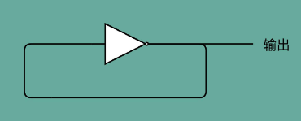

## 4.1、指令+计算=CPU

### 4.1.1、指令周期（Instruction Cycle）

计算机每执行一条指令的过程，可以分解成这样几个步骤：
- 1.**Fetch（取得指令）**，也就是从 PC 寄存器里找到对应的指令地址，根据指令地址从内存里把具体的指令，加载到指令寄存器中，然后把 PC 寄存器自增，好在未来执行下一条指令。
- 2.**Decode（指令译码）**，也就是根据指令寄存器里面的指令，解析成要进行什么样的操作，是 R、I、J 中的哪一种指令，具体要操作哪些寄存器、数据或者内存地址。
- 3.**Execute（执行指令）**，也就是实际运行对应的 R、I、J 这些特定的指令，进行算术逻辑操作、数据传输或者直接的地址跳转；
- 4.重复进行 1～3 的步骤。
- 
这样的步骤，其实就是一个永不停歇的“**Fetch - Decode - Execute**”的循环，我们把这个循环称之为**指令周期（Instruction Cycle）**；

在这个循环过程中，不同部分其实是由计算机中的不同组件完成的：
- 在取指令的阶段，指令是放在**存储器**里的，实际上，通过 PC 寄存器和指令寄存器取出指令的过程，是由**控制器（Control Unit）**操作的。
- 指令的解码过程，也是由**控制器**进行的。
- 一旦到了执行指令阶段，无论是进行算术操作、逻辑操作的 R 型指令，还是进行数据传输、条件分支的 I 型指令，都是由**算术逻辑单元（ALU）**操作的，也就是由**运算器**处理的。不过，如果是一个简单的无条件地址跳转，那么可以直接在**控制器**里面完成，不需要用到运算器


除了 Instruction Cycle 这个指令周期，在 CPU 里面还有另外两个常见的 Cycle：
- 一个叫**Machine Cycle，机器周期或者CPU 周期**。CPU 内部的操作速度很快，但是访问内存的速度却要慢很多。每一条指令都需要从内存里面加载而来，所以一般把从内存里面读取一条指令的最短时间，称为 **CPU 周期**。
- 还有一个是Clock Cycle，也就是时钟周期以及机器的主频。一个 CPU 周期，通常会由几个时钟周期累积起来。一个 CPU 周期的时间，就是这几个 Clock Cycle 的总和；

这三个周期之间的关系：对于一个指令周期来说，取出一条指令，然后执行它，至少需要两个 CPU 周期。取出指令至少需要一个 CPU 周期，执行至少也需要一个 CPU 周期，复杂的指令则需要更多的 CPU 周期；


所以，一个指令周期，包含多个 CPU 周期，而一个 CPU 周期包含多个时钟周期；

### 4.1.2、建立数据通路

数据通路就是处理器单元。它通常由两类原件组成：
- 第一类叫操作元件，也叫**组合逻辑元件（Combinational Element）**，其实就是 ALU。在前面讲 ALU 的过程中可以看到，它们的功能就是在特定的输入下，根据下面的组合电路的逻辑，生成特定的输出。
- 第二类叫存储元件，也有叫**状态元件（State Element）**的。比如在计算过程中需要用到的寄存器，无论是通用寄存器还是状态寄存器，其实都是存储元件；

通过数据总线的方式，把它们连接起来，就可以完成数据的存储、处理和传输了，这就是所谓的建立数据通路了；

**控制器**：可以把它看成只是机械地重复“Fetch - Decode - Execute“循环中的前两个步骤，然后把最后一个步骤，通过控制器产生的控制信号，交给 ALU 去处理

控制器的电路：
- 一方面，所有 CPU 支持的指令，都会在控制器里面，被解析成不同的输出信号。我们之前说过，现在的 Intel CPU 支持 2000 个以上的指令。这意味着，控制器输出的控制信号，至少有 2000 种不同的组合；
- 运算器里的 ALU 和各种组合逻辑电路，可以认为是一个固定功能的电路。控制器“翻译”出来的，就是不同的控制信号。这些控制信号，告诉 ALU 去做不同的计算。可以说正是控制器的存在，让我们可以“编程”来实现功能，能让我们的“存储程序型计算机”名副其实；

指令译码器将输入的机器码，解析成不同的操作码和操作数，然后传输给 ALU 进行计算；

### 4.1.3、CPU 所需要的硬件电路

要想搭建出来整个 CPU，需要在数字电路层面，实现这样一些功能：
- ALU：它实际就是一个没有状态的，根据输入计算输出结果的第一个电路；
- 寄存器：要有一个能够进行状态读写的电路元件。需要有一个电路，能够存储到上一次的计算结果。这个计算结果并不一定要立刻拿到电路的下游去使用，但是可以在需要的时候拿出来用。常见的能够进行状态读写的电路：
  - 锁存器（Latch）
  - D 触发器（Data/Delay Flip-flop）；
- 自动数数的电路：需要有一个“自动”的电路，按照固定的周期，不停地实现 PC 寄存器自增，自动地去执行“**Fetch - Decode - Execute**“的步骤。程序的执行，并不是靠人去拨动开关来执行指令的。希望有一个“自动”的电路，不停地去一条条执行指令；
  看似写了各种复杂的高级程序进行各种函数调用、条件跳转。其实只是修改 PC 寄存器里面的地址。PC 寄存器里面的地址一修改，计算机就可以加载一条指令新指令，往下运行。实际上，PC 寄存器还有一个名字，就叫作程序计数器。顾名思义，就是随着时间变化，不断去数数。数的数字变大了，就去执行一条新指令；
- “译码”的电路：无论是对于指令进行 decode，还是对于拿到的内存地址去获取对应的数据或者指令，都需要通过一个电路找到对应的数据。这个对应的自然就是“译码器”的电路了；

要实现这四种电路中的中间两种，需要时钟电路的配合；

能够实现一个完整的 CPU 功能，除了加法器这样的电路之外，还需要实现其他功能的电路：其中有一些电路，和加法器一样，只需要给定输入，就能得到固定的输出。这样的电路，称之为**组合逻辑电路（Combinational Logic Circuit）**

**只有组合逻辑电路（Combinational Logic Circuit），CPU会怎样？**

电路输入是确定的，对应的输出自然也就确定了。那么，要进行不同的计算，就要去手动拨动各种开关，来改变电路的开闭状态。这样的计算机，不像现在每天用的功能强大的电子计算机，反倒更像古老的计算尺或者机械计算机，干不了太复杂的工作，只能协助完成一些计算工作

**时序逻辑电路（Sequential Logic Circuit）** 解决的问题：
- **自动运行**的问题：时序电路接通之后可以不停地开启和关闭开关，进入一个自动运行的状态。控制器不停地让 PC 寄存器自增读取下一条指令成为可能；
- **存储**的问题：通过时序电路实现的触发器，能把计算结果存储在特定的电路里面，而不是像组合逻辑电路那样，一旦输入有任何改变，对应的输出也会改变；
- 本质上解决了各个功能按照**时序协调**的问题。无论是程序实现的软件指令，还是到硬件层面，各种指令的操作都有先后的顺序要求。时序电路使得不同的事件按照时间顺序发生；

### 4.1.4、时钟信号的硬件实现

要实现时序逻辑电路：首先需要时钟，前面提到CPU 的主频是由一个晶体振荡器来实现的，而这个晶体振荡器生成的电路信号，就是时钟信号

**时钟信号实现**

和通过电的磁效应产生开关信号的方法是一样的。只不过，这里的磁性开关，打开的不再是后续的线路，而是当前的线路；

在图中，在原先一般只放一个开关的信号输入端，放上了两个开关。一个开关 A，一开始是断开的，由我们手工控制；另外一个开关 B，一开始是合上的，磁性线圈对准一开始就合上的开关 B

于是，一旦合上开关 A，磁性线圈就会通电，产生磁性，开关 B 就会从合上变成断开。一旦这个开关断开了，电路就中断了，磁性线圈就失去了磁性。于是，开关 B 又会弹回到合上的状态。这样一来，电路接通，线圈又有了磁性。这样电路就会来回不断地在开启、关闭这两个状态中切换：


这个不断切换的过程，对于下游电路来说，就是不断地产生新的 0 和 1 这样的信号。如果在下游的电路上接上一个灯泡，就会发现这个灯泡在亮和暗之间不停切换。**这个按照固定的周期不断在 0 和 1 之间切换的信号，就是时钟信号（Clock Signal）**

**反馈电路（Feedback Circuit）**

一般产生这样的信号是一个振荡产生的 0、1 信号。


上面这个**反馈电路**一般可以用下面这个示意图来表示，其实就是一个输出结果接回输入的**反相器（Inverter）**，也就是**非门**



### 4.1.5、通过 D 触发器实现存储功能

有了时钟信号，系统里就有了一个像“自动门”一样的开关。利用这个开关和相同的反馈电路,就可以构造出一个有“记忆”功能的电路。**这个有记忆功能的电路，可以实现在 CPU 中用来存储计算结果的寄存器**，也可以用来实现计算机五大组成部分之一的**存储器**

**触发器（Flip-Flop）电路**


如上这个 RS 触发器电路。这个电路由两个**或非门**电路组成，分别对应图里的：A、B，对应或非门的真值表如下：


- （1）在这个电路一开始，输入开关都是关闭的，所以**或非门（NOR）A** 的输入是 0 和 0。对应到真值表，输出就是 1。而或非门 B 的输入是 0 和 A 的输出 1，对应输出就是 0。B 的输出 0 反馈到 A，和之前的输入没有变化，A 的输出仍然是 1。而整个电路的**输出 Q**，也就是 0；
- （2）当把 A 前面的开关 R 合上的时候，A 的输入变成了 1 和 0，输出就变成了 0，对应 B 的输入变成 0 和 0，输出就变成了 1。B 的输出 1 反馈给到了 A，A 的输入变成了 1 和 1，输出仍然是 0。所以把 A 的开关合上之后，电路仍然是稳定的，不会像晶振那样振荡，但是整个电路的输出 **Q变成了** 1；
- （3）这个时候，如果再把 A 前面的开关 R 打开，A 的输入变成和 1 和 0，输出还是 0，对应的 B 的输入没有变化，输出也还是 1。B 的输出 1 反馈给到了 A，A 的输入变成了 1 和 0，输出仍然是 0。这个时候，电路仍然稳定。**开关 R 和 S 的状态和上面的第一步是一样的，但是最终的输出 Q 仍然是 1，和第 1 步里 Q 状态是相反的**。我们的输入和刚才第二步的开关状态不一样，但是输出结果仍然保留在了第 2 步时的输出没有发生变化；
- （4）这个时候，只有再去关闭下面的开关 S，才可以看到，这个时候，B 有一个输入必然是 1，所以 B 的输出必然是 0，也就是电路的最终**输出 Q**必然是 0；

这样一个电路，称之为**触发器（Flip-Flop）**。
- 接通开关 R，输出变为 1，即使断开开关，输出还是 1 不变。
- 接通开关 S，输出变为 0，即使断开开关，输出也还是 0。<br/>
也就是，当两个开关都断开的时候，最终的输出结果，取决于之前动作的输出结果，这个就是记忆功能

这里的这个电路是最简单的 RS 触发器，也就是所谓的**复位置位触发器（Reset-Set Flip Flop) **。对应的输出结果的真值表，可以看下面这个表格。可以看到，当两个开关都是 0 的时候，对应的输出不是 1 或者 0，而是和 Q 的上一个状态一致；

输入 | 输入 | 输出
-----|------|------
S | R | Q
1 | 0 | 1
0 | 1 | 0
0 | 0 | Q
1 | 1 | NA

再往这个电路里加**两个与门**和一个小小的**时钟信号**，就可以实现一个利用时钟信号来操作一个电路了。这个电路可以实现什么时候可以往 Q 里写入数据

**D 型触发器**

再看下面这个电路，这个在上面的 R-S 触发器基础之上，在 R 和 S 开关之后，加入了两个与门，同时给这两个与门加入了一个**时钟信号 CLK**作为电路输入


- 当时钟信号 CLK 在低电平的时候，与门的输入里有一个 0，两个实际的 R 和 S 后的与门的输出必然是 0。也就是说，无论怎么按 R 和 S 的开关，根据 R-S 触发器的真值表，对应的 Q 的输出都不会发生变化
- 只有当时钟信号 CLK 在高电平的时候，与门的一个输入是 1，输出结果完全取决于 R 和 S 的开关。可以在这个时候，通过开关 R 和 S，来决定对应 Q 的输出；

如果这个时候，让 R 和 S 的开关，也用一个反相器连起来，也就是通过同一个开关控制 R 和 S：


- 只要 CLK 信号是 1，R 和 S 就可以设置输出 Q
- 当 CLK 信号是 0 的时候，无论 R 和 S 怎么设置，输出信号 Q 是不变的

这样，这个电路就成了最常用的 **D 型触发器**。用来控制 R 和 S 这两个开关的信号呢，被视作一个输入的数据信号 D，也就是 **Data**，这就是 D 型触发器的由来；一个 D 型触发器，只能控制 1 个比特的读写，但是如果同时拿出多个 D 型触发器并列在一起，并且把用同一个 CLK 信号控制作为所有 D 型触发器的开关，这就变成了一个 N 位的 D 型触发器，也就可以同时控制 N 位的读写。

CPU 里面的寄存器可以直接通过 D 型触发器来构造。可以在 D 型触发器的基础上，加上更多的开关，来实现清 0 或者全部置为 1 这样的快捷操作

### 4.1.6、PC寄存器

通过一个时钟信号，可以实现计数器，这个会成为 PC 寄存器； PC 寄存器，还有个名字叫程序计数器。
- 有了时钟信号，可以提供定时的输入；
- 有了 D 型触发器，可以在时钟信号控制的时间点写入数据。<br/>
把这两个功能组合起来，就可以实现一个自动的计数器了

加法器的两个输入，一个始终设置成 1，另外一个来自于一个 D 型触发器 A。我们把加法器的输出结果，写到这个 D 型触发器 A 里面。于是，D 型触发器里面的数据就会在固定的时钟信号为 1 的时候更新一次


这样，就有了一个每过一个时钟周期，就能固定自增 1 的自动计数器了。这个自动计数器，可以拿来 作为 PC 寄存器。事实上，PC 寄存器的这个 PC，英文就是 Program Counter，也就是**程序计数器**的意思

每次自增之后，可以去对应的 D 型触发器里面取值，这也是下一条需要运行指令的地址。**为什么要顺序地存放指令**，就是为了通过程序计数器就能定时地不断执行新指令。

**需要时序电路最核心的原因：** 加法计数、内存取值，乃至后面的命令执行，最终其实都是由时钟信号，来控制执行时间点和先后顺序的；

**单指令周期处理器（Single Cycle Processor）** ： 在最简单的情况下，需要让每一条指令，从程序计数，到获取指令、执行指令，都在一个时钟周期内完成。如果 PC 寄存器自增地太快，程序就会出错。因为前一次的运算结果还没有写回到对应的寄存器里面的时候，后面一条指令已经开始读取里面的数据来做下一次计算了。这个时候，如果指令使用同样的寄存器，前一条指令的计算就会没有效果，计算结果就错了。在这种设计下，需要在一个时钟周期里，确保执行完一条最复杂的 CPU 指令，也就是耗时最长的一条 CPU 指令。这样的 CPU 设计，称之为**单指令周期处理器（Single Cycle Processor）**。

### 4.1.7、译码器

数据存储在D型触发器，如果把很多个 D 型触发器放在一起，就可以形成一块很大的存储空间，甚至可以当成一块内存来用。那么怎么才能知道，写入和读取的数据，是在这么大的内存的哪几个比特呢？

需要解决这个问题，需要一个电路，来完成“寻址”的工作，这个“寻址”电路就是**译码器**

> 在现在实际使用的计算机里面，内存所使用的 DRAM，并不是通过上面的 D 型触发器来实现的，而是使用了一种 CMOS 芯片来实现的

如果把“寻址”这件事情退化到最简单的情况，就是在两个地址中，去选择一个地址。这样的电路，叫作**2-1 选择器**


通过一个反相器、两个与门和一个或门，就可以实现一个 2-1 选择器。通过控制反相器的输入是 0 还是 1，能够决定对应的输出信号，是和地址 A，还是地址 B 的输入信号一致

一个反向器只能有 0 和 1 这样两个状态，所以只能从两个地址中选择一个。如果输入的信号有三个不同的开关，就能从 $2^3$，也就是 8 个地址中选择一个了。这样的电路叫**3-8 译码器**。现代的计算机，如果 CPU 是 64 位的，就意味着寻址空间也是 $2^{64}$，那么就需要一个有 64 个开关的译码器


译码器的本质:就是从输入的多个位的信号中，根据一定的开关和电路组合，选择出自己想要的信号。除了能够进行“寻址”之外，还可以把对应的需要运行的指令码，同样通过译码器，找出期望执行的指令，也就是 opcode，以及后面对应的操作数或者寄存器地址。只是，这样的“译码器”，比起 2-1 选择器和 3-8 译码器，要复杂的多；

### 4.1.8、构建CPU

D 触发器、自动计数以及译码器，再加上 ALU，凑齐了一个拼装一个 CPU 必须要的零件了。怎么把这些零件组合起来，才能实现指令执行和算术逻辑计算的 CPU。


- （1）首先，有一个自动计数器。这个自动计数器会随着时钟主频不断地自增，作为 PC 寄存器。
- （2）在这个自动计数器的后面，连上一个译码器。译码器还要同时连着通过大量的 D 触发器组成的内存。
- （3）自动计数器会随着时钟主频不断自增，从译码器当中，找到对应的计数器所表示的内存地址，然后读取出里面的 CPU 指令。
- （4）读取出来的 CPU 指令会通过 CPU 时钟的控制，写入到一个由 D 触发器组成的寄存器，也就是指令寄存器当中。
- （5）在指令寄存器后面，可以再跟一个译码器。这个译码器不再是用来寻址的了，而是将拿到的指令，解析成 opcode 和对应的操作数。
- （6）当拿到对应的 opcode 和操作数，对应的输出线路就要连接 ALU，开始进行各种算术和逻辑运算。对应的计算结果，则会再写回到 D 触发器组成的寄存器或者内存当中。

**问题1：为什么 if…else 会变成这样两条指令，而不是设计成一个复杂的电路，变成一条指令？**

前面提到的程序跳转所使用的条件码寄存器。高级语言中的 if…else，其实是变成了一条 cmp 指令和一条 jmp 指令。
- cmp 指令是在进行对应的比较，比较的结果会更新到条件码寄存器当中。
- jmp 指令则是根据条件码寄存器当中的标志位，来决定是否进行跳转以及跳转到什么地址；

为什么 if…else 会变成这样两条指令，而不是设计成一个复杂的电路，变成一条指令？到这里，就可以解释了。这样分成两个指令实现，完全匹配好了电路层面：**译码 - 执行 - 更新寄存器** 这样的步骤。cmp 指令的执行结果放到了条件码寄存器里面，条件跳转指令也是在 ALU 层面执行的，而不是在控制器里面执行的。这样的实现方式在电路层面非常直观，不需要一个非常复杂的电路，就能实现 if…else 的功能；

**问题2：执行一条指令，其实可以不放在一个时钟周期里面，可以直接拆分到多个时钟周期**

可以在一个时钟周期里面，去自增 PC 寄存器的值，也就是指令对应的内存地址。然后，要根据这个地址从 D 触发器里面读取指令，这个还是可以在刚才那个时钟周期内；

但是对应的指令写入到指令寄存器，可以放在一个新的时钟周期里面。指令译码给到 ALU 之后的计算结果，要写回到寄存器，又可以放到另一个新的时钟周期。所以，执行一条计算机指令，其实可以拆分到很多个时钟周期，而不是必须使用单指令周期处理器的设计；

因为从内存里面读取指令时间很长，所以如果使用单指令周期处理器，就意味着要执行的指令都要去等待一些慢速的操作。这些不同指令执行速度的差异，也正是计算机指令有指令周期、CPU 周期和时钟周期之分的原因；

因此，优化 CPU 的性能时，用的 CPU 都不是单指令周期处理器，而是通过流水线、分支预测等技术，来实现在一个周期里同时执行多个指令。

## 4.2、指令设计

前面提到CPU性能：指令数× CPI × 时钟周期

### 4.2.1、单指令周期处理器

一条 CPU 指令的执行，是由“取得指令（Fetch）- 指令译码（Decode）- 执行指令（Execute） ”这样三个步骤组成的。这个执行过程，至少需要花费一个时钟周期。因为在取指令的时候，需要通过时钟周期的信号，来决定计数器的自增。因此，希望能确保让这样一整条指令的执行，在一个时钟周期内完成。

这样，在一个时钟周期可以执行一条指令，CPI 也就是 1，看起来就比执行一条指令需要多个时钟周期性能要好。采用这种设计思路的处理器，就叫作**单指令周期处理器（Single Cycle Processor）**，也就是在一个时钟周期内，处理器正好能处理一条指令；

但是：时钟周期是固定的，但是指令的电路复杂程度是不同的，所以实际一条指令执行的时间是不同的，因为随着门电路层数的增加，由于门延迟的存在，位数多、计算复杂的指令需要的执行时间会更长；

不同指令的执行时间不同，但是需要让所有指令都在一个时钟周期内完成，那就只好把时钟周期和执行时间最长的那个指令设成一样。这就好比学校体育课 1000 米考试，我们要给这场考试预留的时间，肯定得和跑得最慢的那个同学一样。因为就算其他同学先跑完，也要等最慢的同学跑完间，我们才能进行下一项活动；

在单指令周期处理器里面，无论是执行一条用不到 ALU 的无条件跳转指令，还是一条计算起来电路特别复杂的浮点数乘法运算，都等要等满一个时钟周期。在这个情况下，虽然 CPI 能够保持在 1，但是时钟频率却没法太高。因为太高的话，有些复杂指令没有办法在一个时钟周期内运行完成。那么在下一个时钟周期到来，开始执行下一条指令的时候，前一条指令的执行结果可能还没有写入到寄存器里面。那下一条指令读取的数据就是不准确的，就会出现错误；

前面说过：一个 CPU 时钟周期，可以认为是完成一条简单指令的时间。为什么到了**单指令周期处理器**，反而变成了执行一条最复杂的指令的时间呢？因为，无论是 PC 上使用的 Intel CPU，还是手机上使用的 ARM CPU，都不是单指令周期处理器，而是采用了一种叫作**指令流水线（Instruction Pipeline）**的技术

### 4.2.2、现代处理器的流水线设计

**指令流水线和流水线阶段**

CPU执行一条指令的过程和软件开发过程一样的；

比如开发一个手机APP，都需要先对开发功能的过程进行切分，把这个过程变成“撰写需求文档、开发后台 API、开发客户端 App、测试、发布上线”这样多个独立的过程。每一个后面的步骤，都要依赖前面的步骤；

对比到CPU执行一条指令的过程也是一样的，它会拆分成“取指令、译码、执行”这样三大步骤。更细分一点的话，执行的过程，其实还包含从寄存器或者内存中读取数据，通过 ALU 进行运算，把结果写回到寄存器或者内存中；

CPU 的指令执行过程，其实也是由各个电路模块组成的：
- 在取指令的时候，需要一个译码器把数据从内存里面取出来，写入到寄存器中；
- 在指令译码的时候，需要另外一个译码器，把指令解析成对应的控制信号、内存地址和数据；
- 指令执行的时候，需要的则是一个完成计算工作的 ALU。<br/>
这些都是一个一个独立的组合逻辑电路，可以把它们看作一个团队里面的产品经理、后端工程师和客户端工程师，共同协作来完成任务；


这样一来，就不用把时钟周期设置成整条指令执行的时间，而是拆分成完成这样的一个一个小步骤需要的时间。同时，每一个阶段的电路在完成对应的任务之后，也不需要等待整个指令执行完成，而是可以直接执行下一条指令的对应阶段；这就好像后端程序员不需要等待功能上线，就会从产品经理手中拿到下一个需求，开始开发 API。这样的协作模式，就是**指令流水线**。这里面每一个独立的步骤，就称之为**流水线阶段**或者**流水线级（Pipeline Stage）**

分级指令流水线：
- 如果把一个指令拆分成“取指令 - 指令译码 - 执行指令”这样三个部分，那这就是一个三级的流水线。
- 如果进一步把“执行指令”拆分成“ALU 计算（指令执行）- 内存访问 - 数据写回”，那么它就会变成一个五级的流水线（“取指令 - 指令译码 - 执行指令 - 内存访问 - 数据写回”）；

五级的流水线，就表示在同一个时钟周期里面，同时运行五条指令的不同阶段。这个时候，虽然执行一条指令的时钟周期变成了 5，但是可以把 CPU 的主频提得更高了。**不需要确保最复杂的那条指令在时钟周期里面执行完成，而只要保障一个最复杂的流水线级的操作，在一个时钟周期内完成就好了**

**如何解决单指令周期处理器中性能瓶颈来自于最复杂的指令的问题？**

如果某一个操作步骤的时间太长，可以考虑把这个步骤，拆分成更多的步骤，让所有步骤需要执行的时间尽量都差不多长。这样也可以解决在单指令周期处理器中遇到的，性能瓶颈来自于最复杂的指令的问题；

虽然不能通过流水线，来减少单条指令执行的“延时”这个性能指标，但是，通过同时在执行多条指令的不同阶段，提升了 CPU 的“吞吐率”。在外部看来，CPU 好像是“一心多用”，在同一时间，同时执行 5 条不同指令的不同阶段；

**超长流水线的性能瓶颈**

如果一直增加流水线深度，是有性能成本的。

同步时钟周期的，不再是指令级别的，而是流水线阶段级别的。每一级流水线对应的输出，都要放到流水线寄存器（Pipeline Register）里面，然后在下一个时钟周期，交给下一个流水线级去处理。所以，每增加一级的流水线，就要多一级写入到流水线寄存器的操作。虽然流水线寄存器非常快，比如只有 20 皮秒（ps， $10^{−12}$ 秒）；


如果不断加深流水线，这些操作占整个指令的执行时间的比例就会不断增加。最后，性能瓶颈就会出现在这些 overhead 上：如果指令的执行有 3 纳秒，也就是 3000 皮秒。
- 需要 20 级的流水线，那流水线寄存器的写入就需要花费 400 皮秒，占了超过 10%。
- 如果需要 50 级流水线，就要多花费 1 纳秒在流水线寄存器上，占到 25%。<br/>
这也就意味着，单纯地增加流水线级数，不仅不能提升性能，反而会有更多的 overhead 的开销。所以，设计合理的流水线级数也是现代 CPU 中非常重要的一点

> 一个CPU的时钟时间，应该是流水线中流程中最长的那条的耗时时间

### 4.2.3、“主频战争”带来的超长流水线

**如何衡量性能：** 并不能简单地通过 CPU 的主频，就来衡量 CPU 乃至计算机整机的性能。因为不同的 CPU 实际的体系架构和实现都不一样。同样的 CPU 主频，实际的性能可能差别很大。所以，在工业界，更好的衡量方式通常是，用 SPEC 这样的跑分程序，从多个不同的实际应用场景，来衡量计算机的性能；

**增加流水线深度，在同主频下，其实是降低了 CPU 的性能。** 因为一个 Pipeline Stage，就需要一个时钟周期。那么把任务拆分成 31 个阶段，就需要 31 个时钟周期才能完成一个任务；而把任务拆分成 11 个阶段，就只需要 11 个时钟周期就能完成任务。在这种情况下，31 个 Stage 的 3GHz 主频的 CPU，其实和 11 个 Stage 的 1GHz 主频的 CPU，性能是差不多的。事实上，因为每个 Stage 都需要有对应的 Pipeline 寄存器的开销，这个时候，更深的流水线性能可能还会更差一些；

流水线技术并不能缩短单条指令的**响应时间**这个性能指标，但是可以增加在运行很多条指令时候的**吞吐率**。因为不同的指令，实际执行需要的时间是不同的；

比如顺序执行这样三条指令。
- （1）一条整数的加法，需要 200ps。
- （2）一条整数的乘法，需要 300ps。
- （3）一条浮点数的乘法，需要 600ps。<br/>
那么三条指令的执行时间是：
- 如果在单指令周期的 CPU 上运行，最复杂的指令是一条浮点数乘法，那就需要 600ps。那这三条指令，都需要 600ps。三条指令的执行时间，就需要 1800ps；

- 如果采用的是 6 级流水线 CPU，每一个 Pipeline 的 Stage 都只需要 100ps。那么，在这三个指令的执行过程中，在指令 1 的第一个 100ps 的 Stage 结束之后，第二条指令就开始执行了。在第二条指令的第一个 100ps 的 Stage 结束之后，第三条指令就开始执行了。这种情况下，这三条指令顺序执行所需要的总时间，就是 800ps。那么在 1800ps 内，使用流水线的 CPU 比单指令周期的 CPU 就可以多执行一倍以上的指令数；


虽然每一条指令从开始到结束拿到结果的时间并没有变化，也就是响应时间没有变化。但是同样时间内，完成的指令数增多了，也就是吞吐率上升了

### 4.2.4、新的挑战：冒险和分支预测

**Pentium 4 的超长流水线看起来很合理呀，为什么 Pentium 4 最终成为 Intel 在技术架构层面的大失败呢？**

（1）功耗问题：

提升流水线深度，必须要和提升 CPU 主频同时进行。因为在单个 Pipeline Stage 能够执行的功能变简单了，也就意味着单个时钟周期内能够完成的事情变少了。所以，只有提升时钟周期，CPU 在指令的响应时间这个指标上才能保持和原来相同的性能。

同时，由于流水线深度的增加，需要的电路数量变多了，也就是所使用的晶体管也就变多了；

主频的提升和晶体管数量的增加都使得 CPU 的功耗变大了。这个问题导致了 Pentium 4 在整个生命周期里，都成为了耗电和散热的大户；

（2）流水线技术带来的性能提升，是一个理想情况。在实际的程序执行中，并不一定能够做得到

比如有下面三条指令：
```java
int a = 10 + 5; // 指令 1
int b = a * 2; // 指令 2
float c = b * 1.0f; // 指令 3
```
- 指令 2，不能在指令 1 的第一个 Stage 执行完成之后进行。因为指令 2，依赖指令 1 的计算结果；
- 指令 3 也要依赖指令 2 的计算结果<br/>
这样，即使我们采用了流水线技术，这三条指令执行完成的时间，也是 200 + 300 + 600 = 1100 ps，而不是之前说的 800ps。而如果指令 1 和 2 都是浮点数运算，需要 600ps。那这个依赖关系会导致我们需要的时间变成 1800ps，和单指令周期 CPU 所要花费的时间是一样的

这个依赖问题，就是在计算机组成里面所说的**冒险（Hazard）问题**。这里只是在数据层面的依赖，也就是**数据冒险**。在实际应用中，还会有**结构冒险、控制冒险**等其他的依赖问题

但是，流水线越长，这个冒险的问题就越难解决。这是因为，同一时间同时在运行的指令太多了。如果只有 3 级流水线，可以把后面没有依赖关系的指令放到前面来执行。这个就是所说的乱序执行的技术；

但是，如果有 20 级流水线，意味着要确保这 20 条指令之间没有依赖关系。这个挑战一下子就变大了很多。毕竟平时撰写程序，通常前后的代码都是有一定的依赖关系的，几十条没有依赖关系的指令可不好找。这也是为什么，超长流水线的执行效率反而降低了的一个重要原因。

### 4.2.5、总结

流水线技术和其他技术一样，都讲究一个“折衷”（Trade-Off）。一个合理的流水线深度，会提升 CPU 执行计算机指令的吞吐率。一般用 **IPC（Instruction Per Cycle）**来衡量 CPU 执行指令的效率；

IPC 对应为 CPI（Cycle Per Instruction）的倒数。也就是说， IPC = 3 对应着 CPI = 0.33。Pentium 4 和 Pentium D 的 IPC 都远低于自己上一代的 Pentium III 以及竞争对手 AMD 的 Athlon CPU；

过深的流水线，不仅不能提升计算机指令的吞吐率，更会加大计算的功耗和散热问题；

流水线带来的吞吐率提升，只是一个理想情况下的理论值。在实践的应用过程中，还需要解决指令之间的依赖问题。这个使得流水线，特别是超长的流水线的执行效率变得很低。要想解决好冒险的依赖关系问题，需要引入乱序执行、分支预测等技术；

## 4.3、冒险和预测

要想通过流水线设计来提升 CPU 的吞吐率，需要冒的风险又：
- 结构冒险（Structural Hazard）
- 数据冒险（Data Hazard）
- 控制冒险（Control Hazard）

对于各种冒险可能造成的问题，都有相对于的应对方案

### 4.3.1、结构冒险

结构冒险，本质上是一个硬件层面的资源竞争问题，也就是一个硬件电路层面的问题；

CPU 在同一个时钟周期，同时在运行两条计算机指令的不同阶段。但是这两个不同的阶段，可能会用到同样的硬件电路；最典型的例子就是内存的数据访问


上图是一个5级流水线的示意图，可以看到，在第 1 条指令执行到访存（MEM）阶段的时候，流水线里的第 4 条指令，在执行取指令（Fetch）的操作。访存和取指令，都要进行内存数据的读取。而内存只有一个地址译码器的作为地址输入，那就只能在一个时钟周期里面读取一条数据，没办法同时执行第 1 条指令的读取内存数据和第 4 条指令的读取指令代码；

对于访问内存数据和取指令的冲突，一个直观的解决方案就是把内存分成两部分，让它们各有各的地址译码器。这两部分分别是**存放指令的程序内存**和**存放数据的数据内存**；

这样把内存拆成两部分的解决方案，在计算机体系结构里叫作[哈佛架构](https://en.wikipedia.org/wiki/Harvard_architecture)；但是现代计算机，仍然是冯·诺依曼体系结构的，并没有把内存拆成程序内存和数据内存这两部分。因为如果那样拆的话，对程序指令和数据需要的内存空间，我们就没有办法根据实际的应用去动态分配了。虽然解决了资源冲突的问题，但是也失去了灵活性


不过，借鉴了哈佛结构的思路，现代的 CPU 虽然没有在内存层面进行对应的拆分，却在 CPU 内部的高速缓存部分进行了区分，把高速缓存分成了**指令缓存（Instruction Cache）**和**数据缓存（Data Cache）**两部分；

内存的访问速度远比 CPU 的速度要慢，所以现代的 CPU 并不会直接读取主内存。它会从主内存把指令和数据加载到高速缓存中，这样后续的访问都是访问高速缓存。而指令缓存和数据缓存的拆分，使得 CPU 在进行数据访问和取指令的时候，不会再发生资源冲突的问题了。

### 4.3.2、数据冒险

结构冒险是一个硬件层面的问题，可以靠增加硬件资源的方式来解决。然而还有很多冒险问题，是程序逻辑层面的事儿。其中，最常见的就是**数据冒险**

#### 4.3.2.1、数据冒险分类

数据冒险，其实就是同时在执行的多个指令之间，有数据依赖的情况。这些数据依赖，可以分成三大类，分别是
- **先写后读（Read After Write，RAW）**
- **先读后写（Write After Read，WAR）**
- **写后再写（Write After Write，WAW）**

**（1）先写后读（Read After Write）**

下面是一段C语言代码和对应汇编代码：这段代码简单地定义两个变量 a 和 b，然后计算 a = a + 2。再根据计算出来的结果，计算 b = a + 3
```c
// C语言
int main() {
  int a = 1;
  int b = 2;
  a = a + 2;
  b = a + 3;
}
// 汇编代码
int main() {
   0:   55                      push   rbp
   1:   48 89 e5                mov    rbp,rsp
  int a = 1;
   4:   c7 45 fc 01 00 00 00    mov    DWORD PTR [rbp-0x4],0x1
  int b = 2;
   b:   c7 45 f8 02 00 00 00    mov    DWORD PTR [rbp-0x8],0x2
  a = a + 2;
  12:   83 45 fc 02             add    DWORD PTR [rbp-0x4],0x2
  b = a + 3;
  16:   8b 45 fc                mov    eax,DWORD PTR [rbp-0x4]
  19:   83 c0 03                add    eax,0x3
  1c:   89 45 f8                mov    DWORD PTR [rbp-0x8],eax
}
  1f:   5d                      pop    rbp
  20:   c3                      ret  
```
- 在内存地址为 12 的机器码，把 0x2 添加到 rbp-0x4 对应的内存地址里面。然后，在紧接着的内存地址为 16 的机器码，又要从 rbp-0x4 这个内存地址里面，把数据写入到 eax 这个寄存器里面。
- 所以需要保证，在内存地址为 16 的指令读取 rbp-0x4 里面的值之前，内存地址 12 的指令写入到 rbp-0x4 的操作必须完成。这就是先写后读所面临的数据依赖。如果这个顺序保证不了，程序就会出错；

这个先写后读的依赖关系，一般被称之为**数据依赖**，也就是 Data Dependency

**（2）先读后写（Write After Read）**

如下代码：
```c
int main() {
  int a = 1;
  int b = 2;
  a = b + a;
  b = a + b;
}
// 汇编代码
int main() {
   0:   55                      push   rbp
   1:   48 89 e5                mov    rbp,rsp
   int a = 1;
   4:   c7 45 fc 01 00 00 00    mov    DWORD PTR [rbp-0x4],0x1
   int b = 2;
   b:   c7 45 f8 02 00 00 00    mov    DWORD PTR [rbp-0x8],0x2
   a = b + a;
  12:   8b 45 f8                mov    eax,DWORD PTR [rbp-0x8]
  15:   01 45 fc                add    DWORD PTR [rbp-0x4],eax
   b = a + b;
  18:   8b 45 fc                mov    eax,DWORD PTR [rbp-0x4]
  1b:   01 45 f8                add    DWORD PTR [rbp-0x8],eax
}
  1e:   5d                      pop    rbp
  1f:   c3                      ret       
```
- 在内存地址为 15 的汇编指令里，要把 eax 寄存器里面的值读出来，再加到 rbp-0x4 的内存地址里。接着在内存地址为 18 的汇编指令里，要再写入更新 eax 寄存器里面。
- 如果在内存地址 18 的 eax 的写入先完成了，在内存地址为 15 的代码里面取出 eax 才发生，程序计算就会出错。这里同样要保障对于 eax 的先读后写的操作顺序。

这个先读后写的依赖，一般被叫作**反依赖**，也就是 **Anti-Dependency**

**（3）写后再写（Write After Write）**

先设置变量 a = 1，然后再设置变量 a = 2
```c
int main() {
  int a = 1;
  a = 2;
}
// 汇编代码
int main() {
   0:   55                      push   rbp
   1:   48 89 e5                mov    rbp,rsp
  int a = 1;
   4:   c7 45 fc 01 00 00 00    mov    DWORD PTR [rbp-0x4],0x1
  a = 2;
   b:   c7 45 fc 02 00 00 00    mov    DWORD PTR [rbp-0x4],0x2
}
```
内存地址 4 所在的指令和内存地址 b 所在的指令，都是将对应的数据写入到 rbp-0x4 的内存地址里面。如果内存地址 b 的指令在内存地址 4 的指令之前写入。那么这些指令完成之后，rbp-0x4 里的数据就是错误的。这就会导致后续需要使用这个内存地址里的数据指令，没有办法拿到正确的值。所以需要保障内存地址 4 的指令的写入，在内存地址 b 的指令的写入之前完成。

这个写后再写的依赖，一般被叫作**输出依赖**，也就是 Output Dependency

#### 4.3.2.1、通过流水线停顿解决数据冒险

除了读之后再进行读，对于同一个寄存器或者内存地址的操作，都有明确强制的顺序要求，而流水线架构的核心，就是在前一个指令还没有结束的时候，后面的指令就要开始执行；

所以，需要有解决这些数据冒险的办法。其中最简单的一个办法，不过也是最笨的一个办法，就是流水线停顿（Pipeline Stall），或者叫流水线冒泡（Pipeline Bubbling）；

流水线停顿的办法很容易理解。如果发现了后面执行的指令，会对前面执行的指令有数据层面的依赖关系，那最简单的办法就是“再等等”。在进行指令译码的时候，会拿到对应指令所需要访问的寄存器和内存地址。所以，在这个时候，能够判断出来，这个指令是否会触发数据冒险。如果会触发数据冒险，就可以决定，让整个流水线停顿一个或者多个周期


时钟信号会不停地在 0 和 1 之前自动切换。实际上并没有办法真的停顿下来。流水线的每一个操作步骤必须要干点儿事情。所以，在实践过程中，并不是让流水线停下来，而是在执行后面的操作步骤前面，插入一个 NOP 操作，也就是执行一个其实什么都不干的操作


在采用流水线停顿的解决方案的时候，不仅要在当前指令里面，插入 NOP 操作，所有后续指令也要插入对应的 NOP 操作

### 4.3.3、操作数前推

上面两种简介冒险的方案有点笨：
- 第一种解决方案，好比是在软件开发的过程中，发现效率不够，于是研发负责人说：“我们需要双倍的人手和研发资源。”
- 第二种解决方案，好比你在提需求的时候，研发负责人告诉你说：“来不及做，你只能等我们需求排期。” 你应该很清楚地知道，“堆资源”和“等排期”这样的解决方案，并不会真的提高我们的效率，只是避免冲突的无奈之举;
 
#### 4.3.3.1、NOP 操作和指令对齐

MIPS 体系结构下的 R、I、J 三类指令、五级流水线“取指令（IF）- 指令译码（ID）- 指令执行（EX）- 内存访问（MEM）- 数据写回（WB） ”；在 MIPS 的体系结构下，不同类型的指令，会在流水线的不同阶段进行不同的操作


以 MIPS 的 LOAD，这样从内存里读取数据到寄存器的指令为例，来仔细看看，它需要经历的 5 个完整的流水线。
- STORE 这样从寄存器往内存里写数据的指令，不需要有写回寄存器的操作，也就是没有数据写回的流水线阶段。
- 至于像 ADD 和 SUB 这样的加减法指令，所有操作都在寄存器完成，所以没有实际的内存访问（MEM）操作
 


有些指令没有对应的流水线阶段，但是并不能跳过对应的阶段直接执行下一阶段。不然，如果先后执行一条 LOAD 指令和一条 ADD 指令，就会发生 LOAD 指令的 WB 阶段和 ADD 指令的 WB 阶段，在同一个时钟周期发生。这样，相当于触发了一个结构冒险事件，产生了资源竞争；


所以，在实践当中，各个指令不需要的阶段，并不会直接跳过，而是会运行一次 NOP 操作。通过插入一个 NOP 操作，可以使后一条指令的每一个 Stage，一定不和前一条指令的同 Stage 在一个时钟周期执行。这样，就不会发生先后两个指令，在同一时钟周期竞争相同的资源，产生结构冒险了


#### 4.3.3.2、操作数前推

通过 NOP 操作进行对齐，在流水线里就不会遇到资源竞争产生的结构冒险问题了。除了可以解决结构冒险之外，这个 NOP 操作也是流水线停顿插入的对应操作；

但是，插入过多的 NOP 操作，意味着我们的 CPU 总是在空转，干吃饭不干活；如何解决尽量少插入 NOP 操作呢？以两条先后发生的 ADD 指令作为例子
```c
add $t0, $s2,$s1 // 把 s1 和 s2 寄存器里面的数据相加，存入到 t0 这个寄存器里面。
add $s2, $s1,$t0 // 把 s1 和 t0 寄存器里面的数据相加，存入到 s2 这个寄存器里面。
```
**流水线停顿解决这个冒险问题**：后一条的 add 指令，依赖寄存器 t0 里的值。而 t0 里面的值，又来自于前一条指令的计算结果。所以后一条指令，需要等待前一条指令的数据写回阶段完成之后，才能执行，这里遇到了一个数据依赖类型的冒险；不得不通过流水线停顿来解决这个冒险问题。我们要在第二条指令的译码阶段之后，插入对应的 NOP 指令，直到前一天指令的数据写回完成之后，才能继续执行；

这样的方案，虽然解决了数据冒险的问题，但是也浪费了两个时钟周期。我们的第 2 条指令，其实就是多花了 2 个时钟周期，运行了两次空转的 NOP 操作

:

**如何解决空转NOP操作问题：** 其实我们第二条指令的执行，未必要等待第一条指令写回完成，才能进行。如果第一条指令的执行结果，能够直接传输给第二条指令的执行阶段，作为输入，那第二条指令，就不用再从寄存器里面，把数据再单独读出来一次，才来执行代码；

上面的例子完全可以在第一条指令的执行阶段完成之后，直接将结果数据传输给到下一条指令的 ALU。然后，下一条指令不需要再插入两个 NOP 阶段，就可以继续正常走到执行阶段：


这样的解决方案，就叫作**操作数前推（Operand Forwarding）**，或者**操作数旁路（Operand Bypassing）**

操作数前推的解决方案不但可以单独使用，还可以和流水线冒泡一起使用。有的时候，虽然可以把操作数转发到下一条指令，但是下一条指令仍然需要停顿一个时钟周期；

### 4.3.4、乱序执行

前面提到可以通过增加资源、停顿等待以及主动转发数据的方式，来解决结构冒险和数据冒险问题；但是即便综合运用这三种技术，仍然会遇到不得不停下整个流水线，等待前面的指令完成的情况，也就是采用流水线停顿的解决方案：


即使进行了操作数前推，因为第二条加法指令依赖于第一条指令从内存中获取的数据，还是要插入一次 NOP 的操作

能不能让后面没有数据依赖的指令，在前面指令停顿的时候先执行呢？答案当然是可以的

**代码的顺序不一定是执行顺序**

无论是流水线停顿，还是操作数前推，归根到底，只要前面指令的特定阶段还没有执行完成，后面的指令就会被“阻塞”住；

但是这个“阻塞”很多时候是没有必要的。因为尽管你的代码生成的指令是顺序的，但是如果后面的指令不需要依赖前面指令的执行结果，完全可以不必等待前面的指令运算完成


在流水线里，后面的指令不依赖前面的指令，那就不用等待前面的指令执行，它完全可以先执行。因为第三条指令并不依赖于前两条指令的计算结果，所以在第二条指令等待第一条指令的访存和写回阶段的时候，第三条指令就已经执行完成了；

这样的解决方案，在计算机组成里面，被称为**乱序执行（Out-of-Order Execution，OoOE）**

**CPU 里的“线程池”：理解乱序执行**

从今天软件开发的维度来思考，乱序执行好像是在指令的执行阶段，引入了一个“线程池”；使用乱序执行技术后，CPU 里的流水线就和之前 5 级流水线不太一样了。如图所示：


- （1）在取指令和指令译码的时候，乱序执行的 CPU 和其他使用流水线架构的 CPU 是一样的。它会一级一级顺序地进行取指令和指令译码的工作。
- （2）在指令译码完成之后，就不一样了。CPU 不会直接进行指令执行，而是进行一次指令分发，把指令发到一个叫作保留站（Reservation Stations）的地方。顾名思义，这个保留站，就像一个火车站一样。发送到车站的指令，就像是一列列的火车。
- （3）这些指令不会立刻执行，而要等待它们所依赖的数据，传递给它们之后才会执行。这就好像一列列的火车都要等到乘客来齐了才能出发。
- （4）一旦指令依赖的数据来齐了，指令就可以交到后面的**功能单元（Function Unit，FU）**，其实就是 ALU，去执行了。有很多功能单元可以并行运行，但是不同的功能单元能够支持执行的指令并不相同。就和我们的铁轨一样，有些从上海北上，可以到北京和哈尔滨；有些是南下的，可以到广州和深圳。
- （5）指令执行的阶段完成之后，我们并不能立刻把结果写回到寄存器里面去，而是把结果再存放到一个叫作重排序缓冲区（Re-Order Buffer，ROB）的地方。
- （6）在重排序缓冲区里，我们的 CPU 会按照取指令的顺序，对指令的计算结果重新排序。只有排在前面的指令都已经完成了，才会提交指令，完成整个指令的运算结果。
- （7）实际的指令的计算结果数据，并不是直接写到内存或者高速缓存里，而是先写入存储缓冲区（Store Buffer 面，最终才会写入到高速缓存和内存里。
  
在乱序执行的情况下，只有 CPU 内部指令的执行层面，可能是“乱序”的。只要能在指令的译码阶段正确地分析出指令之间的数据依赖关系，这个“乱序”就只会在互相没有影响的指令之间发生。

即便指令的执行过程中是乱序的，在最终指令的计算结果写入到寄存器和内存之前，依然会进行一次排序，以确保所有指令在外部看来仍然是有序完成的；

乱序执行，极大地提高了 CPU 的运行效率。核心原因是，现代 CPU 的运行速度比访问主内存的速度要快很多

### 4.3.5、控制冒险

在结构冒险和数据冒险中，所有的流水线停顿操作都要从指令执行阶段开始。流水线的前两个阶段，也就是取指令（IF）和指令译码（ID）的阶段，是不需要停顿的。CPU 会在流水线里面直接去取下一条指令，然后进行译码；

取指令和指令译码不会需要遇到任何停顿，这是基于一个假设。这个假设就是，所有的指令代码都是顺序加载执行的。不过这个假设，在执行的代码中，一旦遇到 if…else 这样的条件分支，或者 for/while 循环，就会不成立


可以看到，在 jmp 指令发生的时候，CPU 可能会跳转去执行其他指令。jmp 后的那一条指令是否应该顺序加载执行，在流水线里面进行取指令的时候，没法知道。要等 jmp 指令执行完成，去更新了 PC 寄存器之后，我们才能知道，是否执行下一条指令，还是跳转到另外一个内存地址，去取别的指令；

这种为了确保能取到正确的指令，而不得不进行等待延迟的情况，就是**控制冒险（Control Harzard）**

在遇到了控制冒险之后，CPU 具体会怎么应对呢？除了流水线停顿，等待前面的 jmp 指令执行完成之后，再去取最新的指令，还有什么好办法吗：
- 缩短分支延迟
- 分支预测-静态分支预测
- 动态分支预测

**缩短分支延迟**

条件跳转指令其实进行了两种电路操作：
- 第一种，是进行条件比较：这个条件比较，需要的输入是，根据指令的 opcode，就能确认的条件码寄存器；
- 第二种，是进行实际的跳转：也就是把要跳转的地址信息写入到 PC 寄存器。无论是 opcode，还是对应的条件码寄存器，还是跳转的地址，都是在指令译码（ID）的阶段就能获得的。而对应的条件码比较的电路，只要是简单的逻辑门电路就可以了，并不需要一个完整而复杂的 ALU；

所以可以将条件判断、地址跳转，都提前到指令译码阶段进行，而不需要放在指令执行阶段。对应的，要在 CPU 里面设计对应的旁路，在指令译码阶段，就提供对应的判断比较的电路；这种方式，本质上和前面数据冒险的操作数前推的解决方案类似，就是在硬件电路层面，把一些计算结果更早地反馈到流水线中。这样反馈变得更快了，后面的指令需要等待的时间就变短了

不过只是改造硬件，并不能彻底解决问题。跳转指令的比较结果，仍然要在指令执行的时候才能知道。在流水线里，第一条指令进行指令译码的时钟周期里，其实就要去取下一条指令了。这个时候，我们其实还没有开始指令执行阶段，自然也就不知道比较的结果；

**[分支预测](https://en.wikipedia.org/wiki/Branch_predictor)**

分支预测：让CPU 来猜一猜，条件跳转后执行的指令，应该是哪一条；

最简单的分支预测技术，叫作“**假装分支不发生**”。顾名思义，自然就是仍然按照顺序，把指令往下执行。其实就是 CPU 预测，条件跳转一定不发生。这样的预测方法，其实也是一种静态预测技术。就好像猜硬币的时候，你一直猜正面，会有 50% 的正确率：
- 如果分支预测是正确的，意味着节省了本来需要停顿下来等待的时间；
- 如果分支预测是错误的，那就把后面已经取出指令已经执行的部分，给丢弃掉。这个丢弃的操作，在流水线里面，叫作 Zap 或者 Flush。CPU 不仅要执行后面的指令，对于这些已经在流水线里面执行到一半的指令，还需要做对应的清除操作。比如，清空已经使用的寄存器里面的数据等等，这些清除操作，也有一定的开销；

CPU 需要提供对应的丢弃指令的功能，通过控制信号清除掉已经在流水线中执行的指令

**动态分支预测**

前面的静态预测策略，看起来比较简单，预测的准确率也许有 50%。但是如果运气不好，可能就会特别差

（1）策略1：**一级分支预测（One Level Branch Prediction）**，或者叫**1 比特饱和计数（1-bit saturating counter）**

该策略是用一个比特，去记录当前分支的比较情况，直接用当前分支的比较情况，来预测下一次分支时候的比较情况；

（2）策略2：**2 比特饱和计数**，或者叫**双模态预测器（Bimodal Predictor）**

只用一天下雨，就预测第二天下雨，这个方法还是有些“草率”，可以用更多的信息，而不只是一次的分支信息来进行预测。于是引入一个**状态机（State Machine）**来做这个事情；

如果连续发生下雨的情况，就认为更有可能下雨。之后如果只有一天放晴了，仍然认为会下雨。在连续下雨之后，要连续两天放晴，我们才会认为之后会放晴

这个状态机里，一共有 4 个状态，所以需要 2 个比特来记录对应的状态。这样这整个策略，就可以叫作**2 比特饱和计数**，或者叫**双模态预测器（Bimodal Predictor）**

**为什么循环嵌套会改变性能？**

```java
public class BranchPrediction {
    public static void main(String args[]) {        
        long start = System.currentTimeMillis();
        for (int i = 0; i < 100; i++) {
            for (int j = 0; j <1000; j ++) {
                for (int k = 0; k < 10000; k++) {
                }
            }
        }
        long end = System.currentTimeMillis();
        System.out.println("Time spent is " + (end - start));
        start = System.currentTimeMillis();
        for (int i = 0; i < 10000; i++) {
            for (int j = 0; j <1000; j ++) {
                for (int k = 0; k < 100; k++) {
                }
            }
        }
        end = System.currentTimeMillis();
        System.out.println("Time spent is " + (end - start) + "ms");
    }
}
```
这是一个简单的三重循环，里面没有任何逻辑代码。用两种不同的循环顺序各跑一次：
- 第一次，最外重循环循环了 100 次，第二重循环 1000 次，最内层的循环了 10000 次；
- 第二次，把顺序倒过来，最外重循环 10000 次，第二重还是 1000 次，最内层 100 次；<br/>
代码执行结果如下
```
Time spent in first loop is 5ms
Time spent in second loop is 15ms
```
同样循环了十亿次，第一段程序只花了 5 毫秒，而第二段程序则花了 15 毫秒，足足多了 2 倍

这个差异就来自分支预测，循环其实也是利用 cmp 和 jle 这样先比较后跳转的指令来实现的。这里的代码，每一次循环都有一个 cmp 和 jle 指令。每一个 jle 就意味着，要比较条件码寄存器的状态，决定是顺序执行代码，还是要跳转到另外一个地址。也就是说，在每一次循环发生的时候，都会有一次“分支”；


分支预测策略最简单的一个方式，自然是“**假定分支不发生**”。对应到上面的循环代码，就是循环始终会进行下去。在这样的情况下，
- 上面的第一段循环，也就是内层 k 循环 10000 次的代码。每隔 10000 次，才会发生一次预测上的错误。而这样的错误，在第二层 j 的循环发生的次数，是 1000 次。最外层的 i 的循环是 100 次。每个外层循环一次里面，都会发生 1000 次最内层 k 的循环的预测错误，所以一共会发生 100 × 1000 = 10 万次预测错误。
- 上面的第二段循环，也就是内存 k 的循环 100 次的代码，则是每 100 次循环，就会发生一次预测错误。这样的错误，在第二层 j 的循环发生的次数，还是 1000 次。最外层 i 的循环是 10000 次，所以一共会发生 1000 × 10000 = 1000 万次预测错误；

因为第一段代码发生“分支预测”错误的情况比较少，更多的计算机指令，在流水线里顺序运行下去了，而不需要把运行到一半的指令丢弃掉，再去重新加载新的指令执行；所以第一段代码运行时间少了；

## 4.4、CPU性能提升

程序的 CPU 执行时间 = 指令数 × CPI × Clock Cycle Time，这个公式里，有一个叫 CPI 的指标。CPI 的倒数，又叫作 IPC（Instruction Per Clock），也就是一个时钟周期里面能够执行的指令数，代表了 **CPU 的吞吐率**。那么，这个指标流水线架构的 CPU 里，能达到多少呢？

答案是，最佳情况下，IPC 也只能到 1。因为无论做了哪些流水线层面的优化，即使做到了指令执行层面的乱序执行，CPU 仍然只能在一个时钟周期里面，取一条指令


### 4.4.1、多发射与超标量

浮点数计算已经变成 CPU 里的一部分，但并不是所有计算功能都在一个 ALU 里面，真实的情况是，会有多个 ALU，这也是为什么，在乱序执行时，指令的执行阶段，是由很多个功能单元（FU）并行（Parallel）进行的。

不过，在指令乱序执行的过程中，取指令（IF）和指令译码（ID）部分并不是并行进行的。

既然指令的执行层面可以并行进行，为什么取指令和指令译码不行呢？如果想要实现并行，该怎么办呢？

解决方案：把取指令和指令译码，也一样通过增加硬件的方式，并行进行就好了，可以一次性从内存里面取出多条指令，然后分发给多个并行的指令译码器，进行译码，然后对应交给不同的功能单元去处理。这样，在一个时钟周期里，能够完成的指令就不只一条了。IPC 也就能做到大于 1 了


这种 CPU 设计，叫作**多发射（Mulitple Issue）**和**超标量（Superscalar）**。
- 多发射：同一个时间，可能会同时把多条指令发射（Issue）到不同的译码器或者后续处理的流水线中去；
- 超标量：在一个时钟周期里面，只能执行一个标量（Scalar）的运算。在多发射的情况下，我们就能够超越这个限制，同时进行多次计算；在超标量的 CPU 里面，有很多条并行的流水线，而不是只有一条流水线；
 


### 4.4.2、超长指令字设计

无论是乱序执行，还是现在更进一步的超标量技术，在实际的硬件层面，其实实施起来都挺麻烦的。这是因为，在乱序执行和超标量的体系里面，CPU 要解决依赖冲突的问题。也就是冒险问题；

CPU 需要在指令执行之前，去判断指令之间是否有依赖关系。如果有对应的依赖关系，指令就不能分发到执行阶段。因为这样，超标量 CPU 的多发射功能，又被称为**动态多发射处理器** ， 这些对于依赖关系的检测，都会使得我们的 CPU 电路变得更加复杂；

能不能把分析和解决依赖关系的事情，放到软件里面，而不是放在硬件里面来干呢？

在上面计算CPU执行时间这个公式里面，可以通过改进编译器来优化指令数这个指标。有一个非常大胆的 CPU 设计想法，叫作**超长指令字设计（Very Long Instruction Word，VLIW）**。这个设计呢，不仅想让编译器来优化指令数，还想直接通过编译器，来优化 CPI；围绕着这个设计的，是 Intel 一个著名的“史诗级”失败，也就是著名的 IA-64 架构的安腾（Itanium）处理器；

在乱序执行和超标量的 CPU 架构里，指令的前后依赖关系，是由 CPU 内部的硬件电路来检测的。而到了超长指令字的架构里面，这个工作交给了编译器这个软件


编译器在这个过程中，其实能够知道前后数据的依赖。于是，可以让编译器把没有依赖关系的代码位置进行交换。然后，再把多条连续的指令打包成一个指令包。安腾的 CPU 就是把 3 条指令变成一个指令包


CPU 在运行的时候，不再是取一条指令，而是取出一个指令包。然后，译码解析整个指令包，解析出 3 条指令直接并行运行。可以看到，使用**超长指令字架构**的 CPU，同样是采用流水线架构的。也就是说，一组（Group）指令，仍然要经历多个时钟周期。同样的，下一组指令并不是等上一组指令执行完成之后再执行，而是在上一组指令的指令译码阶段，就开始取指令了；

需要注意的是：流水线停顿这件事情在超长指令字里面，很多时候也是由编译器来做的。除了停下整个处理器流水线，超长指令字的 CPU 不能在某个时钟周期停顿一下，等待前面依赖的操作执行完成。编译器需要在适当的位置插入 NOP 操作，直接在编译出来的机器码里面，就把流水线停顿这个事情在软件层面就安排妥当

安腾失败的原因有很多，其中有一个重要的原因就是“向前兼容”

### 4.4.3、超线程

什么是超线程技术呢？Intel 想，既然 CPU 同时运行那些在代码层面有前后依赖关系的指令，会遇到各种冒险问题，不如去找一些和这些指令完全独立，没有依赖关系的指令来运行好了。那么，这样的指令哪里来呢？自然同时运行在另外一个程序里了

超线程的 CPU，其实是把一个物理层面 CPU 核心，“伪装”成两个逻辑层面的 CPU 核心。这个 CPU，会在硬件层面增加很多电路，使得可以在一个 CPU 核心内部，维护两个不同线程的指令的状态信息；

在一个物理 CPU 核心内部，会有双份的 PC 寄存器、指令寄存器乃至条件码寄存器。这样，这个 CPU 核心就可以维护两条并行的指令的状态。在外面看起来，似乎有两个逻辑层面的 CPU 在同时运行。所以，超线程技术一般也被叫作同时多线程（Simultaneous Multi-Threading，简称 SMT）技术


不过，在 CPU 的其他功能组件上，Intel 可不会提供双份。无论是指令译码器还是 ALU，一个 CPU 核心仍然只有一份。因为超线程并不是真的去同时运行两个指令，那就真的变成物理多核了。

超线程的目的，是在一个线程 A 的指令，在流水线里停顿的时候，让另外一个线程去执行指令。因为这个时候，CPU 的译码器和 ALU 就空出来了，那么另外一个线程 B，就可以拿来干自己需要的事情。这个线程 B 可没有对于线程 A 里面指令的关联和依赖

超线程只在特定的应用场景下效果比较好。一般是在那些各个线程“等待”时间比较长的应用场景下。比如，需要应对很多请求的数据库应用，就很适合使用超线程。各个指令都要等待访问内存数据，但是并不需要做太多计算。

### 4.4.4、SIMD

SIMD，中文叫作**单指令多数据流（Single Instruction Multiple Data）**

面是两段示例程序，一段呢，是通过循环的方式，给一个 list 里面的每一个数加 1。另一段呢，是实现相同的功能，但是直接调用 NumPy 这个库的 add 方法。在统计两段程序的性能的时候，直接调用了 Python 里面的 timeit 的库。
```bash
$ python
>>> import numpy as np
>>> import timeit
>>> a = list(range(1000))
>>> b = np.array(range(1000))
>>> timeit.timeit("[i + 1 for i in a]", setup="from __main__ import a", number=1000000)
32.82800309999993
>>> timeit.timeit("np.add(1, b)", setup="from __main__ import np, b", number=1000000)
0.9787889999997788
>>>
```
从两段程序的输出结果来看，会发现，两个功能相同的代码性能有着巨大的差异，足足差出了 30 多倍。也难怪所有用 Python 讲解数据科学的教程里，往往在一开始就告诉你不要使用循环，而要把所有的计算都向量化（Vectorize）；原因就是，NumPy 直接用到了 SIMD 指令，能够并行进行向量的操作

前面使用循环来一步一步计算的算法呢，一般被称为**SISD**，也就是**单指令单数据（Single Instruction Single Data）**的处理方式。如果是一个多核 CPU 呢，那么它同时处理多个指令的方式可以叫作MIMD，也就是多**指令多数据（Multiple Instruction Multiple Dataa）**。

**为什么 SIMD 指令能快那么多呢？** 这是因为，SIMD 在获取数据和执行指令的时候，都做到了并行。一方面，在从内存里面读取数据的时候，SIMD 是一次性读取多个数据；

所以，对于那些在计算层面存在大量“数据并行”（Data Parallelism）的计算中，使用 SIMD 是一个很划算的办法。在这个大量的“数据并行”，其实通常就是实践当中的向量运算或者矩阵运算；

而基于 SIMD 的向量计算指令，也正是在 Intel 发布 Pentium 处理器的时候，被引入的指令集

## 4.5、异常和中断

### 4.5.1、异常

这里指的是硬件异常，实际上，这些异常，既有来自硬件的，也有来自软件层面的；

关于异常，它其实是一个硬件和软件组合到一起的处理过程。异常的前半生，也就是异常的发生和捕捉，是在硬件层面完成的。但是异常的后半生，也就是说，异常的处理，其实是由软件来完成的；

计算机会为每一种可能会发生的异常，分配一个**异常代码（Exception Number）**或者叫**中断向量（Interrupt Vector）**，异常发生的时候，通常是 CPU 检测到了一个特殊的信号，比如：
- 按下键盘上的按键，输入设备就会给 CPU 发一个信号；
- 正在执行的指令发生了加法溢出，可以有一个进位溢出的信号；

这些信号呢，在组成原理里面，一般叫作发生了一个**事件（Event）**。CPU 在检测到事件的时候，其实也就拿到了对应的异常代码；

这些异常代码里，I/O 发出的信号的异常代码，是由操作系统来分配的，也就是由软件来设定的。而像加法溢出这样的异常代码，则是由 CPU 预先分配好的，也就是由硬件来分配的。这又是另一个软件和硬件共同组合来处理异常的过程；

拿到异常代码之后，CPU 就会触发异常处理的流程。计算机在内存里，会保留一个**异常表（Exception Table）** ，存放的是不同的异常代码对应的异常处理程序（Exception Handler）所在的地址；
- （1）CPU 在拿到了异常码之后，会先把当前的程序执行的现场，保存到程序栈里面；
- （2）然后根据异常码查询，找到对应的异常处理程序；
- （3）最后把后续指令执行的指挥权，交给这个异常处理程序；


### 4.5.2、异常的分类

异常主要4种类型：中断、陷阱、故障和中止
- **中断（Interrupt）**。顾名思义，自然就是程序在执行到一半的时候，被打断了。这个打断执行的信号，来自于 CPU 外部的 I/O 设备。你在键盘上按下一个按键，就会对应触发一个相应的信号到达 CPU 里面。CPU 里面某个开关的值发生了变化，也就触发了一个中断类型的异常；
- **陷阱（Trap）**。时程序员“故意“主动触发的异常。就好像你在程序里面打了一个断点，这个断点就是设下的一个"陷阱"。当程序的指令执行到这个位置的时候，就掉到了这个陷阱当中。然后，对应的异常处理程序就会来处理这个"陷阱"当中的猎物；

  最常见的一类陷阱，发生在应用程序调用系统调用的时候，也就是从程序的用户态切换到内核态的时候；应用程序通过系统调用去读取文件、创建进程，其实也是通过触发一次陷阱来进行的。这是因为，用户态的应用程序没有权限来做这些事情，需要把对应的流程转交给有权限的异常处理程序来进行；

- **故障（Fault）**。它和陷阱的区别在于，陷阱是开发程序的时候刻意触发的异常，而故障通常不是。比如，在程序执行的过程中，进行加法计算发生了溢出，其实就是故障类型的异常。这个异常不是在开发的时候计划内的，也一样需要有对应的异常处理程序去处理；

  > 故障和陷阱、中断的一个重要区别是，故障在异常程序处理完成之后，仍然回来处理当前的指令，而不是去执行程序中的下一条指令。因为当前的指令因为故障的原因并没有成功执行完成

- **中止（Abort）**。与其说这是一种异常类型，不如说这是故障的一种特殊情况。当 CPU 遇到了故障，但是恢复不过来的时候，程序就不得不中止了；


在这四种异常里，中断异常的信号来自系统外部，而不是在程序自己执行的过程中，所以称之为“异步”类型的异常。而陷阱、故障以及中止类型的异常，是在程序执行的过程中发生的，所以称之为“同步“类型的异常；

无论是异步的中断，还是同步的陷阱和故障，采用的处理流程：保存现场、异常代码查询、异常处理程序调用；而中止类型的异常，其实是在故障类型异常的一种特殊情况。当故障发生，但是发现没有异常处理程序能够处理这种异常的情况下，程序就不得不进入中止状态，也就是最终会退出当前的程序执行；

### 4.5.3、异常的处理

在实际的异常处理程序执行之前，CPU 需要去做一次“保存现场”的操作。因为切换到异常处理程序的时候，其实就好像是去调用一个异常处理函数。指令的控制权被切换到了另外一个"函数"里面，所以要把当前正在执行的指令去压栈；这样，才能在异常处理程序执行完成之后，重新回到当前的指令继续往下执行；

切换到异常处理程序，比起函数调用，还是要更复杂一些，因为：
- （1）异常情况往往发生在程序正常执行的预期之外，比如中断、故障发生的时候。所以，除了本来程序压栈要做的事情之外，还需要把 CPU 内当前运行程序用到的所有寄存器，都放到栈里面。最典型的就是条件码寄存器里面的内容；
- （2）类似陷阱这样的异常，涉及程序指令在用户态和内核态之间的切换。对应压栈的时候，对应的数据是压到内核栈里，而不是程序栈里；
- （3）像故障这样的异常，在异常处理程序执行完成之后。从栈里返回出来，继续执行的不是顺序的下一条指令，而是故障发生的当前指令。因为当前指令因为故障没有正常执行成功，必须重新去执行一次；

对于异常这样的处理流程，不像是顺序执行的指令间的函数调用关系。而是更像两个不同的独立进程之间在 CPU 层面的切换，所以这个过程我们称之为**上下文切换（Context Switch）**

## 4.6、CISC和RISC

CPU 的指令集里的机器码是固定长度还是可变长度，也就是 **复杂指令集（Complex Instruction Set Computing，简称 CISC）**和**精简指令集（Reduced Instruction Set Computing，简称 RISC）** 这两种风格的指令集一个最重要的差别

### 4.6.1、CISC VS RISC

在计算机历史的早期，所有的 CPU 其实都是 CISC；

虽然冯·诺依曼高屋建瓴地提出了存储程序型计算机的基础架构，但是实际的计算机设计和制造还是严格受硬件层面的限制。当时的计算机很慢，存储空间也很小，所以 CPU 指令集的设计，需要仔细考虑硬件限制。为了性能考虑，很多功能都直接通过硬件电路来完成。为了少用内存，指令的长度也是可变的；

随着技术的发展，计算机的性能越来越好，存储的空间也越来越大了；实际在 CPU 运行的程序里，80% 的时间都是在使用 20% 的简单指令。于是，卫·帕特森（David Patterson）就提出了 RISC 的理念


RISC 架构的 CPU 的想法其实非常直观。既然 80% 的时间都在用 20% 的简单指令，那能不能只要那 20% 的简单指令就好了呢？答案当然是可以的，指令数量多，计算机科学家们在软硬件两方面都受到了很多挑战：
- 在硬件层面，要想支持更多的复杂指令，CPU 里面的电路就要更复杂，设计起来也就更困难。更复杂的电路，在散热和功耗层面，也会带来更大的挑战；
- 在软件层面，支持更多的复杂指令，编译器的优化就变得更困难。毕竟，面向 2000 个指令来优化编译器和面向 500 个指令来优化编译器的困难是完全不同的；

于是，在 RISC 架构里面，CPU 选择把指令“精简”到 20% 的简单指令。而原先的复杂指令，则通过用简单指令组合起来来实现，让软件来实现硬件的功能；

RISC 的 CPU 里完成指令的电路变得简单了，于是也就腾出了更多的空间：
- 这个空间，常常被拿来放通用寄存器。因为 RISC 完成同样的功能，执行的指令数量要比 CISC 多，所以，如果需要反复从内存里面读取指令或者数据到寄存器里来，那么很多时间就会花在访问内存上。于是，RISC 架构的 CPU 往往就有更多的通用寄存器；
- 除了寄存器这样的存储空间，RISC 的 CPU 也可以把更多的晶体管，用来实现更好的分支预测等相关功能，进一步去提升 CPU 实际的执行效率

RISC 设计方案非常简约，通常有 20 多条指令的简化指令集。每条指令长度固定，由专用的加载和储存指令用于访问内存，减少了内存寻址方式，大多数运算指令只能访问操作寄存器。而 CPU 中配有大量的寄存器，这些指令选取的都是工程中使用频率最高的指令。由于指令长度一致，功能单一，操作依赖于寄存器，这些特性使得 CPU 指令预取、分支预测、指令流水线等部件的效能大大发挥，几乎一个时钟周期能执行多条指令

对于 CISC 和 RISC 的对比，看公式：`程序的 CPU 执行时间 = 指令数 × CPI × Clock Cycle Time`
- CISC 的架构，就是通过优化**指令数**，来减少 CPU 的执行时间；
- RISC 的架构，其实是在优化 CPI。因为指令比较简单，需要的时钟周期就比较少

CISC的典型代表：x86体系架构，x86 CPU 中包含大量复杂指令集，比如串操作指令、循环控制指令、进程任务切换指令等，

### 4.6.2、微指令架构

从 Pentium Pro 时代开始，Intel 开始在处理器里引入了**微指令（Micro-Instructions/Micro-Ops）架构**。而微指令架构的引入，也让 CISC 和 RISC 的分界变得模糊了

在微指令架构的 CPU 里面，编译器编译出来的机器码和汇编代码并没有发生什么变化。但在指令译码的阶段，指令译码器“翻译”出来的，不再是某一条 CPU 指令。译码器会把一条机器码，“**翻译**”成好几条“微指令”。这里的一条条微指令，就不再是 CISC 风格的了，而是变成了固定长度的 RISC 风格的了；

这些 RISC 风格的微指令，会被放到一个微指令缓冲区里面，然后再从缓冲区里面，分发给到后面的超标量，并且是乱序执行的流水线架构里面。不过这个流水线架构里面接受的，就不是复杂的指令，而是精简的指令了。在这个架构里，指令译码器相当于变成了设计模式里的一个“**适配器”（Adaptor）**。这个适配器，填平了 CISC 和 RISC 之间的指令差异；

凡事有好处就有坏处。这样一个能够把 CISC 的指令译码成 RISC 指令的指令译码器，比原来的指令译码器要复杂。这也就意味着更复杂的电路和更长的译码时间：本来以为可以通过 RISC 提升的性能，结果又有一部分浪费在了指令译码上，如何解决这个问题：Intel 就在 CPU 里面加了一层 L0 Cache。这个 Cache 保存的就是指令译码器把 CISC 的指令“翻译”成 RISC 的微指令的结果。于是，在大部分情况下，CPU 都可以从 Cache 里面拿到译码结果，而不需要让译码器去进行实际的译码操作。这样不仅优化了性能，因为译码器的晶体管开关动作变少了，还减少了功耗

### 4.6.3、ARM 和 RISC-V

ARM（Advanced RISC Machines），ARM 的芯片是基于 RISC 架构的。

ARM 真正能够战胜 Intel 的原因大概有两点：
- （1）功耗优先的设计：ARM 的 CPU，主频更低，晶体管更少，高速缓存更小，乱序执行的能力更弱。所有这些，都是为了功耗所做的妥协；
- （2）低价：ARM 并没有自己垄断 CPU 的生产和制造，只是进行 CPU 设计，然后把对应的知识产权授权出去，让其他的厂商来生产 ARM 架构的 CPU。它甚至还允许这些厂商可以基于 ARM 的架构和指令集，设计属于自己的 CPU

ARM 并不是开源的，而[RISC-V](https://riscv.org/)

### 4.6.4、RISC-V

RISC-V是从2010年开始研发，在第二年（2011 年）进行了首次流片，流片就是按照芯片设计生产出可以工作的芯片成品

**什么是 RISC-V**

RISC-V 是伯克利分校设计出的第五代 RISC 指令集架构，简单可以定义为：RISC-V 是一套开放许可证书、免费的、由基金会维护的、一个整数运算指令集外加多个扩展指令集的 CPU 架构规范；

任何硬件开发商或者相关组织都可以免费使用这套规范，构建 CPU 芯片产品；

**指令集命名方式**

RISC-V 规范中有相关定义说明，以 RV 为前缀，然后是位宽，最后是代表指令集的字母集合，具体形式如下：
```
RV[###][abc……xyz]
```
- `RV`：用于标识 RISC-V体系架构的前缀，即 RISC-V 的缩写
- `[###]`：用于标识处理器的宽度，取值：{32,64,128}，也就是处理器寄存器的宽度
- `[abc……xyz]`：标识该处理器支持的指令集模块集合

举个例子，比如：`RV64IMAC`，就表示 64 位的 RISC-V，支持整数指令、乘除法指令、原子指令和压缩指令

**指令集模块**

指令集是一款 CPU 架构的主要组成部分，是 CPU 和上层软件交互的核心，也是 CPU 主要功能的体现，但 RISC-V 规范只定义了 CPU 需要包含基础整形操作指令，如整型的储存、加载、加减、逻
辑、移位、分支等。其它的指令称为可选指令或者用户扩展指令，比如乘、除、取模、单精度浮点、双精度浮点、压缩、原子指令等，这些都是扩展指令。扩展指令需要芯片工程师结合功能需求自定义。

所以 RISC-V 采用的是模块化的指令集，易于扩展、组装。它适应于不同的应用场景，可以降低 CPU 的实现成本


**RISC-V 寄存器**

RISC-V 的规范定义了 32 个通用寄存器以及一个 PC 寄存器，这对于 RV32I、RV64I、RV128I 指令集都是一样的，只是寄存器位宽不一样。

如果实现支持 F/D 扩展指令集的 CPU，则需要额外支持 32 个浮点寄存器。而如果实现只支持 RV32E 指令集的嵌入式 CPU，则可以将 32 个通用寄存器缩减为 16 个通用寄存器


定义好ABI标准，就能在语言间互相调用函数了，比如C语言函数调用汇编语言函数

**RISC-V特权级**

不同的特权级能访问的系统资源不同，高特权级能访问低特权级的资源，反之则不行。RISC-V 的规范文档定义了四个特权级别（privilege level），特权等级由高到低排列，如下表所示：


一个 RISC-V 硬件线程（hart），相当于一个 CPU 内的独立的可执行核心，在任一时刻，只能运行在某一个特权级上，这个特权级由 CSR（控制和状态寄存器）指定和配置：

具体分级如下：</br>
（1）机器特权级（M）：RISC-V 中的 hart 可以执行的最高权限模式，在 M 模式下运行的 hart对内存、I/O和一些必要的底层功能（启动和系统配置）有着完全的控制权，因此，它是唯一一个所有标准RISC-V CPU都必须实现的权限级，实际上，普通的RISC-V微控制器仅支持机器特权级；<br/>
（2）虚拟机监视特权级（H）：为了支持虚拟机监视器而定义的特权级<br/>
（3）管理员特权级（S）：主要用于支持现代操作系统，如Linux、FreeBSD和Windows<br/>
（4）用于应用特权级（U）：用于运行应用程序，通用也适用于嵌入式系统；

> 有了特权级的存在，就给指令加上了权力，从而去控制用指令编写的程序，应用程序只能干应用程序该干的事情，不能越权操作，操作系统则拥有更高的权力，能对系统的资源进行管理；

**RISC-V为什么流行**

RISC-V 指令集架构在 2010 年才开发出来，到今天不过 10 多年的时间。那RISC-V 在这么短的时间内流行起来，成为芯片行业一颗耀眼的新星，肯定有其优势：
- 一是 RISC-V 完全开放：它完全毫无保留地开放了 CPU 设计标准，任何人都可以使用该标准，自由地设计生产 CPU，不需要支付任何费用，也没有任何法律问题
- 二是 RISC-V 指令简单：RISC-V 提供了一个非常强大且开放的精简指令集架构，只有 32 个通用寄存器、40 多条常用指令、4 个特权级。如果需要其它功能，则要进行指令集的扩展，单核心的规范文档才不到 300 页；
- 三是 RISC-V 实行模块化设计，易于扩展：RISC-V 的标准开放，指令功能模块可以自由组合，所以用 RISC-V 就能定制一款满足特殊用途的处理器。


## 4.7、GPU

### 4.7.1、GPU 的历史进程

GPU 是随着我们开始在计算机里面需要渲染三维图形的出现，而发展起来的设备。图形渲染和设备的先驱，第一个要算是 SGI（Silicon Graphics Inc.）这家公司。SGI 的名字翻译成中文就是“硅谷图形公司”

那为什么 CPU 的性能已经大幅度提升了，但是我们还需要单独的 GPU 呢？

### 4.7.2、图形渲染的流程

现在电脑里面显示出来的 3D 的画面，是通过多边形组合出来的，就是[多边形建模](https://en.wikipedia.org/wiki/Polygonal_modeling)，实际这些人物在画面里面的移动、动作，乃至根据光线发生的变化，都是通过计算机根据图形学的各种计算，实时渲染出来的；

这个对于图像进行实时渲染的过程，可以被分解成下面这样 5 个步骤：
- （1）顶点处理（Vertex Processing）
- （2）图元处理（Primitive Processing）
- （3）栅格化（Rasterization）
- （4）片段处理（Fragment Processing）
- （5）像素操作（Pixel Operations）

**顶点处理**

图形渲染的第一步是顶点处理。构成多边形建模的每一个多边形呢，都有多个顶点（Vertex）。这些顶点都有一个在三维空间里的坐标；但是屏幕是二维的，所以在确定当前视角的时候，需要把这些顶点在三维空间里面的位置，转化到屏幕这个二维空间里面。这个转换的操作，就被叫作**顶点处理**

这样的转化都是通过线性代数的计算来进行的。可以想见建模越精细，需要转换的顶点数量就越多，计算量就越大。而且，这里面每一个顶点位置的转换，互相之间没有依赖，是可以并行独立计算的

**图元处理**

图元处理，就是要把顶点处理完成之后的各个顶点连起来，变成多边形。其实转化后的顶点，仍然是在一个三维空间里，只是第三维的 Z 轴，是正对屏幕的“深度”。所以针对这些多边形，需要做一个操作，叫剔除和裁剪（Cull and Clip），也就是把不在屏幕里面，或者一部分不在屏幕里面的内容给去掉，减少接下来流程的工作量；

**栅格化**

在图元处理完成之后呢，渲染还远远没有完成。屏幕分辨率是有限的，它一般是通过一个个“像素（Pixel）”来显示出内容的。所以，对于做完图元处理的多边形，要开始进行第三步操作。这个操作就是把它们转换成屏幕里面的一个个像素点。这个操作呢，就叫作**栅格化**。这个栅格化操作，有一个特点和顶点处理是一样的，就是每一个图元都可以并行独立地栅格化；

**片段处理**

在栅格化变成了像素点之后，图还是“黑白”的。还需要计算每一个像素的颜色、透明度等信息，给像素点上色。这步操作，就是**片段处理**。这步操作，同样也可以每个片段并行、独立进行，和顶点处理和栅格化一样

**像素操作**

最后一步呢，要把不同的多边形的像素点“混合（Blending）”到一起。可能前面的多边形可能是半透明的，那么前后的颜色就要混合在一起变成一个新的颜色；或者前面的多边形遮挡住了后面的多边形，那么只要显示前面多边形的颜色就好了。最终，输出到显示设备；

经过这完整的 5 个步骤之后，完成了从三维空间里的数据的渲染，变成屏幕上你可以看到的 3D 动画了。这样 5 个步骤的渲染流程呢，一般也被称之为**图形流水线（Graphic Pipeline）**。

### 4.7.3、解放图形渲染的 GPU

如果用 CPU 来进行这个渲染过程，需要花上多少资源呢？

- 在上世纪 90 年代的时候，屏幕的分辨率还没有现在那么高。一般的 CRT 显示器也就是 640×480 的分辨率。这意味着屏幕上有 30 万个像素需要渲染。
- 为了让眼睛看到画面不晕眩，希望画面能有 60 帧。于是，每秒我们就要重新渲染 60 次这个画面。也就是说，每秒需要完成 1800 万次单个像素的渲染。
- 从栅格化开始，每个像素有 3 个流水线步骤，即使每次步骤只有 1 个指令，那么需要 5400 万条指令，也就是 54M 条指令

90 年代的 CPU 的性能是多少呢？93 年出货的第一代 Pentium 处理器，主频是 60MHz，后续逐步推出了 66MHz、75MHz、100MHz 的处理器。以这个性能来看，用 CPU 来渲染 3D 图形，基本上就要把 CPU 的性能用完了。因为实际的每一个渲染步骤可能不止一个指令，CPU 可能根本就跑不动这样的三维图形渲染；

既然图形渲染的流程是固定的，直接用硬件来处理这部分过程，不用 CPU 来计算是不是就好了？很显然，这样的硬件会比制造有同样计算性能的 CPU 要便宜得多。因为整个计算流程是完全固定的，不需要流水线停顿、乱序执行等等的各类导致 CPU 计算变得复杂的问题。也不需要有什么可编程能力，只要让硬件按照写好的逻辑进行运算就好了。

那个时候，整个顶点处理的过程还是都由 CPU 进行的，不过后续所有到图元和像素级别的处理都是通过 Voodoo FX 或者 TNT 这样的显卡去处理的；

### 4.7.4、Shader和可编程图形处理器

在 Voodoo 和 TNT 显卡的渲染管线里面，没有“顶点处理“这个步骤。在当时，把多边形的顶点进行线性变化，转化到屏幕的坐标系的工作还是由 CPU 完成的。所以，CPU 的性能越好，能够支持的多边形也就越多，对应的多边形建模的效果自然也就越像真人。而 3D 游戏的多边形性能也受限于CPU 的性能。无论你的显卡有多快，如果 CPU 不行，3D 画面一样还是不行；

程序员希望 GPU 也能有一定的可编程能力。这个编程能力不是像 CPU 那样，有非常通用的指令，可以进行任何操作，而是在整个的**渲染管线（Graphics Pipeline）**的一些特别步骤，能够自己去定义处理数据的算法或者操作。于是，从 2001 年的 Direct3D 8.0 开始，微软第一次引入了**可编程管线（Programable Function Pipeline）**的概念。


一开始的可编程管线呢，仅限于顶点处理（Vertex Processing）和片段处理（Fragment Processing）部分,；

这些可以编程的接口，称之为**Shader**，中文名称就是**着色器**。之所以叫“着色器”，是因为一开始这些“可编程”的接口，只能修改顶点处理和片段处理部分的程序逻辑。用这些接口来做的，也主要是光照、亮度、颜色等等的处理，所以叫**着色器**

这个时候的 GPU，有两类 Shader，也就是 Vertex Shader 和 Fragment Shader，这两类 Shader 都是独立的硬件电路，也各自有独立的编程接口。因为这么做，硬件设计起来更加简单，一块 GPU 上也能容纳下更多的 Shader；

**存在问题：** 在顶点处理和片段处理上的具体逻辑不太一样，但是里面用到的指令集可以用同一套。而且，虽然把 Vertex Shader 和 Fragment Shader 分开，可以减少硬件设计的复杂程度，但是也带来了一种浪费，有一半 Shader 始终没有被使用。在整个渲染管线里，Vertext Shader 运行的时候，Fragment Shader 停在那里什么也没干。Fragment Shader 在运行的时候，Vertext Shader 也停在那里发呆；

于是，**统一着色器架构（Unified Shader Architecture）** 就应运而生了：既然大家用的指令集是一样的，那不如就在 GPU 里面放很多个一样的 Shader 硬件电路，然后通过统一调度，把顶点处理、图元处理、片段处理这些任务，都交给这些 Shader 去处理，让整个 GPU 尽可能地忙起来；

因为 Shader 变成一个“通用”的模块，才有了把 GPU 拿来做各种通用计算的用法，也就是**GPGPU（General-Purpose Computing on Graphics Processing Units，通用图形处理器）**

### 4.7.5、现代 GPU 的三个核心创意

- 芯片瘦身：GPU 的整个处理过程是一个流式处理（Stream Processing）的过程。因为没有那么多分支条件，或者复杂的依赖关系，可以把 GPU 里这些对应的电路都可以去掉，做一次小小的瘦身，只留下取指令、指令译码、ALU 以及执行这些计算需要的寄存器和缓存就好了，一般来说，会把这些电路抽象成三个部分，就是下面图里的取指令和指令译码、ALU 和执行上下文

  

- 多核并行和 SIMT：
  * 因为GPU 电路就比 CPU 简单很多了。所以可以在一个 GPU 里面，塞很多个这样并行的 GPU 电路来实现计算，就好像 CPU 里面的多核 CPU 一样。和 CPU 不同的是，不需要单独去实现什么多线程的计算。因为 GPU 的运算是天然并行的；
  * GPU 就借鉴了 CPU 里面的 SIMD，用了一种叫作 **SIMT（Single Instruction，Multiple Threads）** 的技术。SIMT 呢，比 SIMD 更加灵活。在 SIMD 里面，CPU 一次性取出了固定长度的多个数据，放到寄存器里面，用一个指令去执行。而 SIMT，可以把多条数据，交给不同的线程去处理
- GPU 里的“超线程” 

## 4.8、硬件发展

### 4.8.1、FPGA

设计简单一点儿的专用于特定功能的芯片，少不了要几个月。而设计一个 CPU，往往要以“年”来计。在这个过程中，硬件工程师们要设计、验证各种各样的技术方案，可能会遇到各种各样的 Bug。如果每次验证一个方案，都要单独设计生产一块芯片，那这个代价也太高了。

有没有什么办法，不用单独制造一块专门的芯片来验证硬件设计呢？能不能设计一个硬件，通过不同的程序代码，来操作这个硬件之前的电路连线，通过“编程”让这个硬件变成设计的电路连线的芯片呢？

这个就是FPGA，即：现场可编程门阵列（Field-Programmable Gate Array）
- P 代表 Programmable，说这是一个可以通过编程来控制的硬件。
- G 代表 Gate 也很容易理解，它就代表芯片里面的门电路。能够去进行编程组合的就是这样一个一个门电路。
- A 代表的 Array，叫作阵列，说的是在一块 FPGA 上，密密麻麻列了大量 Gate 这样的门电路。
- 最后一个 F，不太容易理解。它其实是说，一块 FPGA 这样的板子，可以进行在“现场”多次地进行编程。它不像 PAL（Programmable Array Logic，可编程阵列逻辑）这样更古老的硬件设备，只能“编程”一次，把预先写好的程序一次性烧录到硬件里面，之后就不能再修改了；

CPU 其实就是通过晶体管，来实现各种组合逻辑或者时序逻辑。那么，怎么去“编程”连接这些线路呢？FPGA 的解决方案很精巧，总结为这样三个步骤：

**第一，用存储换功能实现组合逻辑**

在实现 CPU 的功能的时候，需要完成各种各样的电路逻辑。在 FPGA 里，这些基本的电路逻辑，不是采用布线连接的方式进行的，而是预先根据软件里面设计的逻辑电路，算出对应的真值表，然后直接存到一个叫作 **LUT（Look-Up Table，查找表）**的电路里面。这个 LUT 呢，其实就是一块存储空间，里面存储了“特定的输入信号下，对应输出 0 还是 1”


**第二，对于需要实现的时序逻辑电路，可以在 FPGA 里面直接放上 D 触发器，作为寄存器**

把很多个 LUT 的电路和寄存器组合在一起，变成一个叫作逻辑簇（Logic Cluster）的东西。在 FPGA 里，这样组合了多个 LUT 和寄存器的设备，也被叫做 CLB（Configurable Logic Block，可配置逻辑块）。它已经在最基础的门电路上做了组合，能够提供更复杂一点的功能。更复杂的芯片功能，不用再从门电路搭起，可以通过 CLB 组合搭建出来


**第三，FPGA 是通过可编程逻辑布线，来连接各个不同的 CLB，最终实现想要实现的芯片功能**

这个可编程逻辑布线，可以把它当成铁路网。整个铁路系统已经铺好了，但是整个铁路网里面，设计了很多个道岔。可以通过控制道岔，来确定不同的列车线路。在可编程逻辑布线里面，“编程”在做的，就是拨动像道岔一样的各个电路开关，最终实现不同 CLB 之间的连接，完成想要的芯片功能；

> 于是，通过 LUT 和寄存器，能够组合出很多 CLB，而通过连接不同的 CLB，最终有了想要的芯片功能。最关键的是，这个组合过程是可以“编程”控制的。而且这个编程出来的软件，还可以后续改写，重新写入到硬件里。让同一个硬件实现不同的芯片功能；

### 4.8.2、ASIC

尽管一个 CPU 能够处理好手机拍照的功能，也能处理好录音的功能，但是在直接在手机或者录音笔里塞上一个 Intel CPU，显然比较浪费。于是，就考虑为这些有专门用途的场景，单独设计一个芯片。这些专门设计的芯片呢，称之为**ASIC（Application-Specific Integrated Circuit）**，也就是**专用集成电路**

ASIC 是针对专门用途设计的，所以它的电路更精简，单片的制造成本也比 CPU 更低。而且，因为电路精简，所以通常能耗要比用来做通用计算的 CPU 更低

### 4.8.3、TPU

如何设计一块专用芯片

## 4.9、虚拟机技术

- [虚拟机、Docker](https://www.freecodecamp.org/news/a-beginner-friendly-introduction-to-containers-vms-and-docker-79a9e3e119b/)