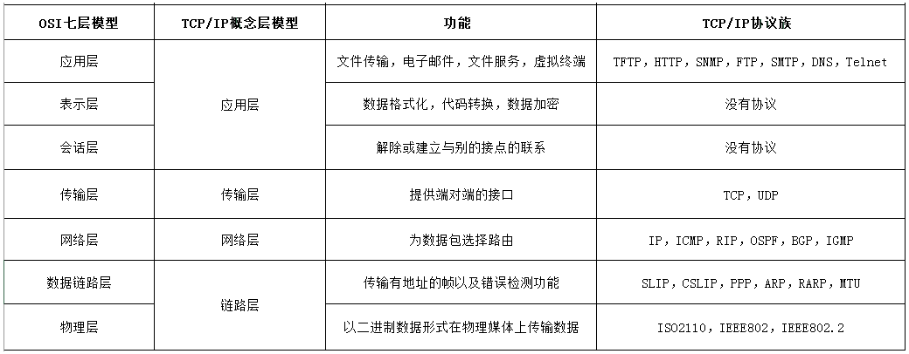
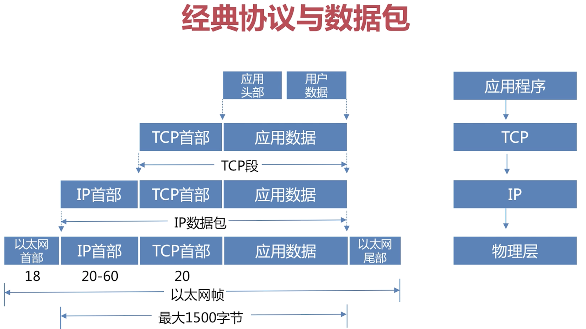

# 一、OSI 七层模型

* [OSI七层模型图解](http://www.cnblogs.com/lemo-/p/6391095.html)
* [科来网络通讯协议图](https://www.colasoft.com.cn/learnings/protocols-map)

## 1、OSI(Open System Interconnection)

称为开放式系统互联参考模型，针对广域网通信进行设计的，将整个网络通信分为7个层次：物理层、数据链路层、网络层、传输层、会话层、表示层、应用层.

- OSI 低四层（从物理层到传输层）定义了如何进行端到端的数据传输，也就是定义了如何通过网卡、物理电缆、交换机和路由器进行数据传输；
- 而高三层(从会话层到应用层)定义了终端系统的应用程序和用户如何彼此通信，即定义了如何重建从发送方到目的方的应用程序数据流；



### 1.1、物理层

是所有计算机网络体系结构的最底层，为所有网络/数据通信提供物理的通信线路。是用来构建计算机网络通信和数据传输的通道的。中继器，集线器、网线、HUB

### 1.2、数据链路层

控制网络层与物理层之间的通信，提供点对点的数据传输通道，通过MAC地址寻址把数据传到目的节点。为了保证传输，从网络层接收到的数据被分割成特定的可被物理层传输的帧。

- 数据链路层在不可靠的物理介质上提供可靠的传输。该层的作用包括：物理地址寻址、数据的成帧、流量控制、数据的检错、重发等
- 据链路层协议的代表包括：SDLC、HDLC、PPP、STP、帧中继等；
- 数据链路可以分为逻辑链路和物理链路。网卡，网桥，交换机

### 1.3、网络层

- 其主要功能是将网络地址翻译成对应的物理地址，并决定如何将数据从发送方路由到接收方
- 在网络中，"路由"是基于编址方案、使用模式以及可达性来指引数据的发送.
- 网络层是可选的，它只用于当两个计算机系统处于不同的由路由器分割开的网段这种情况，或者当通信应用要求某种网络层或传输层提供的服务、特性或者能力时

### 1.4、传输层

- 以端到端方式建立数据传输连接和通信，屏蔽途径网络中所有低层服务上的差异
- 以数据段为基本格式提供流量控制，拥塞控制和差错控制
- 传输层的协议：TCP，UDP
- 作用：传输层为它上面的应用层提供通信服务；
- 在OSI七层参考模型中，传输层是面向通信的最高层，也是用户功能的最底层；
- 传输层两大重要的功能：复用 和 分用
    * 复用：在发送端，多个应用进程共用一个传输层；
    * 分用：在接收端，传输层会根据端口号将数据分派给不同的应用进程.
- 和网络层的区别
    * 网络层为不同主机提供通信服务，而传输层为不同主机的不同应用提供通信服务；
    * 网络层只对报文头部进行差错检测，而传输层对整个报文进行差错检测

### 1.5、会话层

- 维护通信双方应用进程会话；管理双方数据交换进程
- 建立通信链接，保持会话过程通信链接的畅通，同步两个节点之间的对话，决定通信是否被中断以及通信中断时决定从何处重新发送，SESSION认证、断点续传

### 1.6、表示层
 
 数据将按照网络能理解的方案进行格式化
- 数据格式转换，数据加密与解密，数据压缩与解压缩

### 1.7、应用层

是最靠近用户的OSI层
- 负责接受用户的各种网络应用进程的调用；
- 协议：FTP，SMTP，HTTP

## 2、TCP/IP 协议

TCP/IP 协议体系结构，是专门针对使用TCP/IP 协议簇的广域网计算机网络而开发的。其只划分了四层：应用层、传输层、网络层、网络访问层；相比较与OSI七层模型，这里少了会话层和表示层

- 应用层：将OSI参考模型中的会话层和表示层的功能合并到应用层实现
- 传输层：传输层的功能是使源端主机和目标端主机上的对等实体可以进行会话
- 网络层：
    - 网络互连层是整个 TCP/IP 协议栈的核心.它的功能是把分组发往目标网络或主机
    - 定义了分组格式和协议，即IP协议(Internet Protocol)
- 网络访问层



## 3、层与层之间的关系

只要是在网络上跑的包，都是完整的。可以有下层没上层，绝对不可能有上层没下层。对 TCP 协议来说，三次握手也好，重试也好，只要想发出去包，就要有 IP 层和 MAC 层，不然是发不出去的。

所以如果一个 HTTP 协议的包跑在网络上，它一定是完整的。无论这个包经过哪些设备，它都是完整的。

所谓的二层设备、三层设备，都是这些设备上跑的程序不同而已。一个 HTTP 协议的包经过一个二层设备，二层设备收进去的是整个网络包。这里面 HTTP、TCP、 IP、 MAC 都有。什么叫二层设备呀，就是只把 MAC 头摘下来，看看到底是丢弃、转发，还是自己留着。那什么叫三层设备呢？就是把 MAC 头摘下来之后，再把 IP 头摘下来，看看到底是丢弃、转发，还是自己留着

# 二、物理层与数据链路层

# 三、网络层

[网络层](./01_网络层.md)

# 四、传输层

[传输层协议](./02_传输层.md)

# 五、应用层

[应用层协议](./03_应用层.md)

# 六、更多

## 1、CDN

- [Content_delivery_network-内容分发网络](https://en.wikipedia.org/wiki/Content_delivery_network)

## 2、VPN

- [Virtual Private Network](https://en.wikipedia.org/wiki/Virtual_private_network)

VPN，全名 Virtual Private Network，虚拟专用网，就是利用开放的公众网络，建立专用数据传输通道，将远程的分支机构、移动办公人员等连接起来

### 2.1、VPN是如何工作的

VPN 通过隧道技术在公众网络上仿真一条点到点的专线，是通过利用一种协议来传输另外一种协议的技术，这里面涉及三种协议：乘客协议、隧道协议和承载协议

### 2.2、IPsec VPN

基于 IP 协议的安全隧道协议，为了保证在公网上面信息的安全，因而采取了一定的机制保证安全性

## 3、移动互联网

- [移动互联网概括](https://time.geekbang.com/column/article/10534)

# 七、服务器推送技术

## 1、实时推送

Web 应用要实现服务器向客户端的实时数据推送，主要依赖以下几种技术：
- 短轮询 (Polling)
    - 原理：用短连接请求数据。客户端以固定的时间间隔（例如每秒一次）频繁地向服务器发送请求，询问是否有新数据；
    - 缺点：大量请求可能是无效的（无新数据），浪费服务器和带宽资源，实时性差
- 长轮询 (Long Polling):
    - 原理：使用长连接请求数据。客户端发送一个请求，服务器会保持这个连接打开（长连接），直到有新数据可用或超时。一旦客户端收到响应，会立即发起下一个请求。
    - 缺点：虽然减少了无效请求，但每个连接仍然需要客户端发起，服务器需要维护大量挂起的连接，实现复杂。
- 基于 Flash 的解决方案:
    - 原理：利用 Adobe Flash 插件提供的 Socket 功能实现全双工通信。
    - 缺点：依赖浏览器插件，在移动端（如 iPhone）不受支持，且随着技术的发展（Flash 被淘汰）已走向消亡。基于 Flash 方法都非原生支持，效率低下或依赖外部插件
- 基于 WebSocket的解决方案

## 2、[Websocket](https://en.wikipedia.org/wiki/WebSocket)

- [推送业务](../../软件工程/软件设计/实际业务/各种业务.md#二十五推送与即时通信)
- [socket.io协议-基于websocket协议](https://socket.io/docs/v4/)
- [实现了 socket.io 协议框架：netty-socket.io](https://github.com/mrniko/netty-socketio)
- [构建通用WebSocket推送网关的设计与实践](https://mp.weixin.qq.com/s/tqJCzW0WI9mtZGCfaOMp3g)
- [如何封装 websocket 以支撑不同业务的消息即时通讯？](https://mp.weixin.qq.com/s/cSe2k51oMqEFIXs6_vkk5g)
- [WebSocket通信原理和在Tomcat中实现源码详解](https://mp.weixin.qq.com/s/5Oq5gu_rWIC-LNa8oip_lA)
- [石墨文档Websocket百万长连接技术实践](https://mp.weixin.qq.com/s/JLKbE-fsrjQNiMZH5mIX3g)
- [SpringBoot生产级WebSocket集群实践](https://mp.weixin.qq.com/s/ULSr41Iwg5II-ts1osWl4A)
- [websocket测试](https://github.com/sy-records/wstool)
- [websocketd-一个小型命令行工具，允许通过 WebSocket 访问它](https://github.com/joewalnes/websocketd)
- [Websocket 观察](https://mp.weixin.qq.com/s/DxcWMObIkViQ-Z00NpeGjA)

### 2.1、概述

定义：一种浏览器与服务器间进行全双工通信的网络技术。

特点：
- 单一的TCP连接，采用全双工模式通信；
- 与 HTTP 协议有着良好的兼容性。默认端口也是80和443，并且握手阶段采用 HTTP 协议，因此握手时不容易屏蔽，能通过各种 HTTP 代理服务器
- 对代理、防火墙和路由器透明；
- 无头部信息、Cookie和身份验证；
- 无安全开销；
- 通过“ping、pong”帧保持链路激活；
- 服务器可以主动向客户端推送信息，客户端也可以主动向服务器发送信息

### 2.2、请求头描述

请求头里多了个：`Upgrade: websocket`，其状态码是101，表示切换协议

```
Host: localhost:8899
User-Agent: Mozilla/5.0 (Macintosh; Intel Mac OS X 10.14; rv:67.0) Gecko/20100101 Firefox/67.0
Accept: */*
Accept-Language: zh-CN,en-US;q=0.8,zh;q=0.7,zh-TW;q=0.5,zh-HK;q=0.3,en;q=0.2
Accept-Encoding: gzip, deflate
Sec-WebSocket-Version: 13
Origin: http://localhost:63342
Sec-WebSocket-Extensions: permessage-deflate
Sec-WebSocket-Key: AvBJ2EjDQly6a9fhe2rfSw==
Connection: keep-alive, Upgrade
Cookie: Idea-d4397cc9=4ac67172-7de1-4b51-beee-bc66c0088011
Pragma: no-cache
Cache-Control: no-cache
Upgrade: websocket
```

## 3、[SSE](./03_应用层.md#113sseserver-sent-events)

## 4、场景选择

### 4.1、选择 SSE 的场景

- 服务器到客户端的单向数据流。
- 简单和快速实现是关键因素。
- 需要自动错误恢复（重连）。
- 数据传输格式是文本（如 JSON），且不需要二进制。

SSE  典型的应用场景包括：
- 实时新闻推送、体育比分更新。
- 金融报价行情（如股票价格变动）。
- 社交媒体动态更新（如 Twitter 时间线）。
- 服务器日志流监控。
- AI 处理进度或结果的流式输出

### 4.2、选择 WebSocket 场景

- 真正的实时双向通信，客户端和服务器都需要频繁地发送消息。
- 需要传输二进制数据（如视频、音频、图像碎片）。
- 构建交互性极强的应用，其中低延迟至关重要。

WebSocket  典型的应用场景包括：
- 在线聊天应用（如 Slack, Discord）。
- 多人在线游戏。
- 协同编辑工具（如 Google Docs）。
- 实时仪表盘和控制面板（需要双向控制）

### 4.3、WebSocket+SSE 混合架构

一般来说大型应用场景，强网用 WebSocket、弱网适合使用SSE ，这就是WebSocket+SSE 混合架构；

强网用 WebSocket、弱网自动降级到 SSE 的混合架构， 核心在于网络质量动态评估和双通道无缝切换

# 八、其他

## 1、网络请求过程

**问题：从输入url到页面展示到底发生了什么**

总体来说，可以分为以下几个过程：
- DNS解析
- TCP连接
- 发送HTTP请求
- 服务器处理请求并返回HTTP报文
- 浏览器解析渲染页面
- 连接结束

### 1.1、DNS解析过程

#### 1.1.1、DNS解析

DNS解析的过程就是寻找哪台机器上有你需要资源的过程；

当你在浏览器中输入一个地址时，例如`www.baidu.com`，其实不是百度网站真正意义上的地址。互联网上每一台计算机的唯一标识是它的IP地址，但是IP地址并不方便记忆。用户更喜欢用方便记忆的网址去寻找互联网上的其它计算机，也就是上面提到的百度的网址。所以互联网设计者需要在用户的方便性与可用性方面做一个权衡，这个权衡就是一个网址到IP地址的转换，这个过程就是DNS解析。它实际上充当了一个翻译的角色，实现了网址到IP地址的转换

#### 1.1.2、解析过程

[解析过程](#2DNS解析过程)

#### 1.1.3、DNS优化

- DNS缓存

    DNS存在着多级缓存，从离浏览器的距离排序的话，有以下几种: 浏览器缓存、系统缓存、路由器缓存、IPS服务器缓存、根域名服务器缓存、顶级域名服务器缓存、主域名服务器缓存

- [DNS负载均衡](#5DNS负载均衡)

### 1.2、TCP连接

HTTP协议是使用TCP作为其传输层协议的，有[TCP三次握手](#6TCP建立连接-三次握手)和[TCP四次挥手](#7TCP连接释放-四次挥手)

#### 1.1.3、发送HTTP请求

重定向、请求头、请求体、长连接与短连接、HTTPS、反向代理

从TCP编程看HTTP请求：
- Server端创建新的Socket；将Socket绑定到端口80上；允许Socket进行连接，等待连接；
- Client端获取ip地址和端口号；创建新的Socket；连接到服务器:端口上；

### 1.4、服务器处理请求并返回HTTP报文

响应头、响应正文

### 1.5、浏览器解析渲染页面

### 1.6、网络请求过程其他问题

#### 1.6.1、一个TCP连接后是否会在一个HTTP请求完成后断开

默认情况下建立 TCP 连接不会断开，只有在请求报头中声明 Connection: close 才会在请求完成后关闭连接。

因为每次请求都会重新建立和断开 TCP 连接，代价过大

#### 1.6.2、一个TCP对应多少个Http连接

如果维持连接，一个 TCP 连接是可以发送多个 HTTP 请求的

#### 1.6.4、一个 TCP 连接中 HTTP 请求发送可以一起发送么

- 维持和服务器已经建立的 TCP 连接，在同一连接上顺序处理多个请求。
- 和服务器建立多个 TCP 连接

## 2、如何学习网络知识

理论+实战相结合
- 看书+看视频：
- 抓包：
    - ping一个IP地址，抓包分析IP+ICMP
    - ping一个域名，抓包分析UDP+DNS
    - ping一个局域网IP，抓包分析ARP
    - 禁用网卡重新启用，抓包分析DHCP
    - 访问一个网站域名（非HTTPS），抓包分析TCP和HTTP
    - 访问一个网站域名（HTTPS），抓包分析HTTPS
- 编程：
    - 网络流量数据分析软件；
    - 收包和发包
    - 内核驱动程序


# 参考资料

* [网络分层架构-REST架构演化](https://ics.uci.edu/~fielding/pubs/dissertation/top.htm)
* [程序员如何学习和构建网络知识体系](https://plantegg.github.io/2020/05/24/程序员如何学习和构建网络知识体系/)
* [前端常见跨域解决方案](https://segmentfault.com/a/1190000011145364)
* [《网络是怎样连接的》](https://book.douban.com/subject/26941639/)
* [《Wireshark 网络分析就这么简单》](https://book.douban.com/subject/26268767/)
* [《Wireshark 网络分析的艺术》](https://book.douban.com/subject/26710788/)
* [Optimizing TCP for high WAN throughput while preserving low latency](https://blog.cloudflare.com/optimizing-tcp-for-high-throughput-and-low-latency/)

