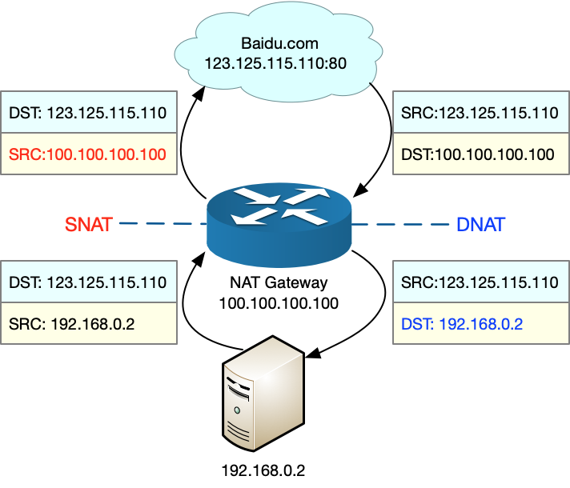
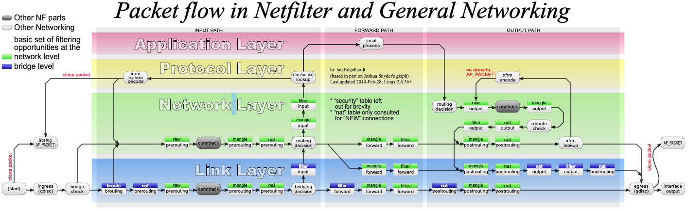

# 一、IP协议

## 1、查看与配置IP地址

### 1.1、查看IP地址

- windows：ipconfig
- Linux：ifconfig、 ip addr

ip地址是一个网卡在网络世界的通信地址；

**`ifconfig` 和 `ip addr` 的区别**
```
[root@bluefish ~]# ifconfig
docker0: flags=4099<UP,BROADCAST,MULTICAST>  mtu 1500
        inet 172.17.0.1  netmask 255.255.0.0  broadcast 172.17.255.255
        inet6 fe80::42:78ff:fea3:7217  prefixlen 64  scopeid 0x20<link>
        ether 02:42:78:a3:72:17  txqueuelen 0  (Ethernet)
        RX packets 16949  bytes 3973836 (3.7 MiB)
        RX errors 0  dropped 0  overruns 0  frame 0
        TX packets 18295  bytes 2207308 (2.1 MiB)
        TX errors 0  dropped 0 overruns 0  carrier 0  collisions 0

eth0: flags=4163<UP,BROADCAST,RUNNING,MULTICAST>  mtu 1500
        inet 10.0.4.10  netmask 255.255.252.0  broadcast 10.0.7.255
        inet6 fe80::5054:ff:fef8:3b51  prefixlen 64  scopeid 0x20<link>
        ether 52:54:00:f8:3b:51  txqueuelen 1000  (Ethernet)
        RX packets 15561713  bytes 5072216736 (4.7 GiB)
        RX errors 0  dropped 0  overruns 0  frame 0
        TX packets 14174378  bytes 2528898689 (2.3 GiB)
        TX errors 0  dropped 0 overruns 0  carrier 0  collisions 0

lo: flags=73<UP,LOOPBACK,RUNNING>  mtu 65536
        inet 127.0.0.1  netmask 255.0.0.0
        inet6 ::1  prefixlen 128  scopeid 0x10<host>
        loop  txqueuelen 1000  (Local Loopback)
        RX packets 3187  bytes 400754 (391.3 KiB)
        RX errors 0  dropped 0  overruns 0  frame 0
        TX packets 3187  bytes 400754 (391.3 KiB)
        TX errors 0  dropped 0 overruns 0  carrier 0  collisions 0

[root@bluefish ~]# ip addr
1: lo: <LOOPBACK,UP,LOWER_UP> mtu 65536 qdisc noqueue state UNKNOWN group default qlen 1000
    link/loopback 00:00:00:00:00:00 brd 00:00:00:00:00:00
    inet 127.0.0.1/8 scope host lo
       valid_lft forever preferred_lft forever
    inet6 ::1/128 scope host 
       valid_lft forever preferred_lft forever
2: eth0: <BROADCAST,MULTICAST,UP,LOWER_UP> mtu 1500 qdisc mq state UP group default qlen 1000
    link/ether 52:54:00:f8:3b:51 brd ff:ff:ff:ff:ff:ff
    inet 10.0.4.10/22 brd 10.0.7.255 scope global eth0
       valid_lft forever preferred_lft forever
    inet6 fe80::5054:ff:fef8:3b51/64 scope link 
       valid_lft forever preferred_lft forever
3: docker0: <NO-CARRIER,BROADCAST,MULTICAST,UP> mtu 1500 qdisc noqueue state DOWN group default 
    link/ether 02:42:78:a3:72:17 brd ff:ff:ff:ff:ff:ff
    inet 172.17.0.1/16 brd 172.17.255.255 scope global docker0
       valid_lft forever preferred_lft forever
    inet6 fe80::42:78ff:fea3:7217/64 scope link 
       valid_lft forever preferred_lft forever
```
在 IP 地址的后面有个 scope，对于 eth0 这张网卡来讲，是 global，说明这张网卡是可以对外的，可以接收来自各个地方的包。对于 lo 来讲，是 host，说明这张网卡仅仅可以供本机相互通信。lo 全称是 loopback，又称环回接口，往往会被分配到 127.0.0.1 这个地址。这个地址用于本机通信，经过内核处理后直接返回，不会在任何网络中出现

### 1.2、配置IP地址

可以使用 `ifconfig`，也可以使用 `ip addr`：
```bash
# 使用 net-tools：
$ sudo ifconfig eth1 10.0.0.1/24
$ sudo ifconfig eth1 up

# 使用 iproute2：
$ sudo ip addr add 10.0.0.1/24 dev eth1
$ sudo ip link set up eth1
```
？？问题：旁边的机器都是 `192.168.1.x`，非得配置一个 `16.158.23.6`，会出现什么现象呢？不会出现任何现象，就是包发不出去呗
- Linux 首先会判断，要去的这个地址和我是一个网段的吗，或者和我的一个网卡是同一网段的吗？只有是一个网段的，它才会发送 ARP 请求，获取 MAC 地址。
- 如果发现不是呢？Linux 默认的逻辑是，如果这是一个跨网段的调用，它便不会直接将包发送到网络上，而是企图将包发送到网关。

如果配置了网关的话，Linux 会获取网关的 MAC 地址，然后将包发出去。对于 `192.168.1.6` 这台机器来讲，虽然路过它家门的这个包，目标 IP 是它，但是无奈 MAC 地址不是它的，所以它的网卡是不会把包收进去的。如果没有配置网关呢？那包压根就发不出去。

当需要手动配置一台机器的网络 IP 时，一定要问网络管理员。如果在机房里面，要去网络管理员那里申请，让他给分配一段正确的 IP 地址。当然，真正配置的时候，一定不是直接用命令配置的，而是放在一个配置文件里面。不同系统的配置文件格式不同，但是无非就是 CIDR、子网掩码、广播地址和网关地址

## 2、IP地址

- [RFC 1518 - An Architecture for IP Address Allocation with CIDR](https://datatracker.ietf.org/doc/html/rfc1518)
- [RFC 4632 - Classless Inter-domain Routing (CIDR): The Internet Address Assignment and](https://datatracker.ietf.org/doc/html/rfc4632)
- [如何用CIDR有效地分配IP地址](https://zhuanlan.zhihu.com/p/653867707)

`IP`地址是指互联网协议地址`（Internet Protocol Address）`，是IP Address的缩写。IP地址是IP协议提供的一种统一的地址格式，它为互联网上的每一个网络和每一台主机分配一个逻辑地址，以此来屏蔽物理地址的差异

IP地址的：A、B、C三类地址

类别|IP地址范围|最大主机数|私有IP地址范围
----|--------|--------|------------
A|0.0.0.0-127.255.255.255|16777214|10.0.0.0-10.255.255.255
B|128.0.0.0-191.255.255.255|65534|172.16.0.0-172.31.255.255
C|192.0.0.0-223.255.255.255|254|192.168.0.0-192.168.255.255

- [CIDR-无类型域间选路](https://zh.wikipedia.org/wiki/%E6%97%A0%E7%B1%BB%E5%88%AB%E5%9F%9F%E9%97%B4%E8%B7%AF%E7%94%B1)：这种方式打破了原来的几类地址做法，将32位的IP地址一分为二，前面是网络号，后面的是主机号.

    比如IP地址：`10.100.122.2/24`，这个 IP 地址中有一个斜杠，斜杠后面有个数字 24。这种地址表示形式，就是 CIDR。后面 24 的意思是，32 位中，前 24 位是网络号，后 8 位是主机号

    伴随着CIDR存在的，一个是广播地址，`10.100.122.255`，如果发送这个地址，所有`10.100.122`网络里面的机器都可以收到。另一个是子网掩码，`255.255.255.0`；

    将子网掩码和IP地址进行 AND计算，前面三个是255，转成二进制都是`1`。`1`和任何数值取AND都是原来数值，因而前面三个数都不变，为`10.100.122` 。后面一个0转成二进制是0，0和任何数值取AND，都是0，因而最后一个数变为0，合起来是`10.100.122.0`.这是网络号，将`子网掩码`和`IP地址`按位计算AND，就可得到网络号

- 如果主机号全是1，那么这个地址为直接广播地址；
- IP地址`255.255.255.255`为受限广播地址；

？？给到一个CIDR：`16.158.165.91/22`，求一下这个网络的第一个地址、子网掩码和广播地址；

`/22` 不是 8 的整数倍，不好办，只能先变成二进制来看。`16.158` 的部分不会动，它占了前 16 位。中间的 `165`，变为二进制为`10100101`。除了前面的 `16` 位，还剩 `6` 位。所以，这 `8` 位中前 `6` 位是网络号，`16.158.<101001>`，而 `<01>.91` 是机器号。第一个地址是 `16.158.<101001><00>.1`，即 `16.158.164.1`。子网掩码是 `255.255.<111111><00>.0`，即 `255.255.252.0`。广播地址为 `16.158.<101001><11>.255`，即 `16.158.167.255`

## 3、公有IP与私有IP

- 上述表格最右列是私有 IP 地址段
- 公有 IP 地址有个组织统一分配，你需要去买

表格中的 `192.168.0.x` 是最常用的私有 IP 地址。家里有 Wi-Fi，对应就会有一个 IP 地址。一般你家里地上网设备不会超过 256 个，所以 `/24` 基本就够了。有时候我们也能见到 `/16` 的 CIDR，这两种是最常见的，也是最容易理解的

不需要将十进制转换为二进制 32 位，就能明显看出 192.168.0 是网络号，后面是主机号。而整个网络里面的第一个地址 192.168.0.1，往往就是你这个私有网络的出口地址。例如，你家里的电脑连接 Wi-Fi，Wi-Fi 路由器的地址就是 192.168.0.1，而 192.168.0.255 就是广播地址。一旦发送这个地址，整个 192.168.0 网络里面的所有机器都能收到

## 4、Mac地址

`MAC`地址又称为物理地址、硬件地址，用来定义网络设备的位置。网卡的物理地址通常是由网卡生产厂家烧入网卡的，具有全球唯一性。`MAC`地址用于在网络中唯一标示一个网卡，一台电脑会有一或多个网卡，每个网卡都需要有一个唯一的`MAC`地址；**MAC 地址更像是身份证，是一个唯一的标识**。它的唯一性设计是为了组网的时候，不同的网卡放在一个网络里面的时候，可以不用担心冲突。从硬件角度，保证不同的网卡有不同的标识

在 IP 地址的上一行是 `link/ether 52:54:00:f8:3b:51 brd ff:ff:ff:ff:ff:ff`，这个被称为 MAC 地址，是一个网卡的物理地址，用十六进制，6 个 byte 表示。

MAC 地址的通信范围比较小，局限在一个子网里面。例如，从 192.168.0.2/24 访问 192.168.0.3/24 是可以用 MAC 地址的。一旦跨子网，即从 192.168.0.2/24 到 192.168.1.2/24，MAC 地址就不行了，需要 IP 地址起作用了

IP地址与Mac地址区别：
- IP地址一般是可以改动的，MAC则是生产厂商烧录好的，一般不能改动；
- 长度不同：IP地址为32位，MAC地址为48位；
- 分配依据不同：IP地址的分配是基于网络拓扑，MAC地址的分配是基于制造商；
- 寻址协议层不同：IP地址应用于OSI第三层，即网络层；而MAC地址应用在OSI第二层，即数据链路层
    - 数据链路层协议可以使数据从一个节点传递到相同链路的另一个节点上（通过MAC地址）；
    - 网络层协议使数据可以从一个网络传递到另一个网络上（ARP根据目的IP地址，找到中间节点的MAC地址，通过中间节点传送，从而最终到达目的网络）

## 5、网络设备的状态标识

上面`<BROADCAST,MULTICAST,UP,LOWER_UP>`是什么意思呢？叫做 `net_device flags`，网络设备的状态标识
- UP 表示网卡处于启动的状态；
- BROADCAST 表示这个网卡有广播地址，可以发送广播包；
- MULTICAST 表示网卡可以发送多播包；
- LOWER_UP 表示 L1 是启动的，也即网线插着呢。

MTU1500 是指什么意思呢？是哪一层的概念呢？最大传输单元 MTU 为 1500，这是以太网的默认值。MTU 是二层 MAC 层的概念。MAC 层有 MAC 的头，以太网规定正文部分不允许超过 1500 个字节。正文里面有 IP 的头、TCP 的头、HTTP 的头。如果放不下，就需要分片来传输。

## 6、DHCP

自动配置的协议，也就是动态主机配置协议（Dynamic Host Configuration Protocol），简称 DHCP

如果是数据中心里面的服务器，IP 一旦配置好，基本不会变，这就相当于买房自己装修。DHCP 的方式就相当于租房。不用装修，都是配置好的。暂时用一下，用完退租就可以了。

解析 DHCP 的工作方式：
- 新来的机器使用 IP 地址 `0.0.0.0` 发送了一个广播包，目的 IP 地址为 `255.255.255.255`。广播包封装了 UDP，UDP 封装了 BOOTP。其实 DHCP 是 BOOTP 的增强版，但是如果去抓包的话，很可能看到的名称还是 BOOTP 协议

## 7、IPV6

- 总共有128位长，一般采用32个十六进制数表示

## 8、private ip

- [私网地址分配](https://datatracker.ietf.org/doc/html/rfc1918)

如何判断内外网，可以通过私网地址来处理

# 二、其他

## 1、[NAT](https://en.wikipedia.org/wiki/Network_address_translation)

**网络地址转换（Network Address Translation）**，缩写为 NAT；

### 1.1、原理

NAT 技术可以重写 IP 数据包的源 IP 或者目的 IP，被普遍地用来解决公网 IP 地址短缺的问题。它的主要原理就是，网络中的多台主机，通过共享同一个公网 IP 地址，来访问外网资源。同时，由于 NAT 屏蔽了内网网络，自然也就为局域网中的机器提供了安全隔离；

既可以在支持网络地址转换的路由器（称为 NAT 网关）中配置 NAT，也可以在 Linux 服务器中配置 NAT。如果采用第二种方式，Linux 服务器实际上充当的是“软”路由器的角色；

NAT 的主要目的，是实现地址转换。根据实现方式的不同，NAT 可以分为三类：
- 静态 NAT，即内网 IP 与公网 IP 是一对一的永久映射关系；
- 动态 NAT，即内网 IP 从公网 IP 池中，动态选择一个进行映射；
- 网络地址端口转换 NAPT（Network Address and Port Translation），即把内网 IP 映射到公网 IP 的不同端口上，让多个内网 IP 可以共享同一个公网 IP 地址。

**NAPT** 是目前最流行的 NAT 类型，在 Linux 中配置的 NAT 也是这种类型。而根据转换方式的不同，又可以把 NAPT 分为三类
- 第一类是源地址转换 SNAT，即目的地址不变，只替换源 IP 或源端口。SNAT 主要用于，多个内网 IP 共享同一个公网 IP ，来访问外网资源的场景。
- 第二类是目的地址转换 DNAT，即源 IP 保持不变，只替换目的 IP 或者目的端口。DNAT 主要通过公网 IP 的不同端口号，来访问内网的多种服务，同时会隐藏后端服务器的真实 IP 地址。
- 第三类是双向地址转换，即同时使用 SNAT 和 DNAT。当接收到网络包时，执行 DNAT，把目的 IP 转换为内网 IP；而在发送网络包时，执行 SNAT，把源 IP 替换为外部 IP。双向地址转换，其实就是外网 IP 与内网 IP 的一对一映射关系，所以常用在虚拟化环境中，为虚拟机分配浮动的公网 IP 地址；

假设：
- 本地服务器的内网 IP 地址为 192.168.0.2；
- NAT 网关中的公网 IP 地址为 100.100.100.100；
- 要访问的目的服务器 baidu.com 的地址为 123.125.115.110。

SNAT 和 DNAT 的过程，就如下图所示：



- 当服务器访问 baidu.com 时，NAT 网关会把源地址，从服务器的内网 IP 192.168.0.2 替换成公网 IP 地址 100.100.100.100，然后才发送给 baidu.com；
- 当 baidu.com 发回响应包时，NAT 网关又会把目的地址，从公网 IP 地址 100.100.100.100 替换成服务器内网 IP 192.168.0.2，然后再发送给内网中的服务器


### 1.2、iptables 与 NAT

Linux 内核提供的 Netfilter 框架，允许对网络数据包进行修改（比如 NAT）和过滤（比如防火墙）。在这个基础上，iptables、ip6tables、ebtables 等工具，又提供了更易用的命令行接口，以便系统管理员配置和管理 NAT、防火墙的规则

[iptables](https://en.wikipedia.org/wiki/Iptables) 就是最常用的一种配置工具

网络数据包通过 Netfilter 时的工作流向：



在这张图中，绿色背景的方框，表示表（table），用来管理链。Linux 支持 4 种表：
- 包括 filter（用于过滤）
- nat（用于 NAT）
- mangle（用于修改分组数据）
- raw（用于原始数据包）；

跟 table 一起的白色背景方框，则表示链（chain），用来管理具体的 iptables 规则。每个表中可以包含多条链，比如：
- filter 表中，内置 INPUT、OUTPUT 和 FORWARD 链；
- nat 表中，内置 PREROUTING、POSTROUTING、OUTPUT 等

灰色的 conntrack，表示连接跟踪模块。它通过内核中的连接跟踪表（也就是哈希表），记录网络连接的状态，是 iptables 状态过滤（-m state）和 NAT 的实现基础；

iptables 的所有规则，就会放到这些表和链中，并按照图中顺序和规则的优先级顺序来执行

要实现 NAT 功能，主要是在 nat 表进行操作。而 nat 表内置了三个链：
- PREROUTING，用于路由判断前所执行的规则，比如，对接收到的数据包进行 DNAT。
- POSTROUTING，用于路由判断后所执行的规则，比如，对发送或转发的数据包进行 SNAT 或 MASQUERADE。
- OUTPUT，类似于 PREROUTING，但只处理从本机发送出去的包

**SNAT**

SNAT 需要在 nat 表的 POSTROUTING 链中配置。常用两种方式来配置它：
- 是为一个子网统一配置 SNAT，并由 Linux 选择默认的出口 IP。这实际上就是经常说的 `MASQUERADE`：
```bash
$ iptables -t nat -A POSTROUTING -s 192.168.0.0/16 -j MASQUERADE
```
- 是为具体的 IP 地址配置 SNAT，并指定转换后的源地址：
```bash
$ iptables -t nat -A POSTROUTING -s 192.168.0.2 -j SNAT --to-source 100.100.100.100
```

**DNAT**

DNAT 需要在 nat 表的 PREROUTING 或者 OUTPUT 链中配置，其中， PREROUTING 链更常用一些（因为它还可以用于转发的包）
```bash
$ iptables -t nat -A PREROUTING -d 100.100.100.100 -j DNAT --to-destination 192.168.0.2
```

**双向地址转换**

双向地址转换，就是同时添加 SNAT 和 DNAT 规则，为公网 IP 和内网 IP 实现一对一的映射关系，即：
```bash
$ iptables -t nat -A POSTROUTING -s 192.168.0.2 -j SNAT --to-source 100.100.100.100
$ iptables -t nat -A PREROUTING -d 100.100.100.100 -j DNAT --to-destination 192.168.0.2
```

在使用 iptables 配置 NAT 规则时，Linux 需要转发来自其他 IP 的网络包，所以千万不要忘记开启 Linux 的 IP 转发功能，查看这一功能是否开启。如果输出的结果是 1，就表示已经开启了 IP 转发：
```bash
$ sysctl net.ipv4.ip_forward
net.ipv4.ip_forward = 1
```
如果还没开启，你可以执行下面的命令，手动开启：
```bash
$ sysctl -w net.ipv4.ip_forward=1
net.ipv4.ip_forward = 1
```
当然，为了避免重启后配置丢失，不要忘记将配置写入 /etc/sysctl.conf 文件中：
```bash
$ cat /etc/sysctl.conf | grep ip_forward
net.ipv4.ip_forward=1
```