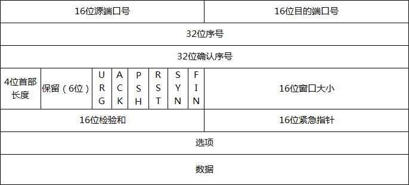
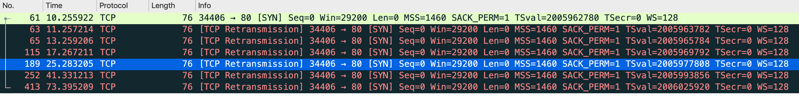
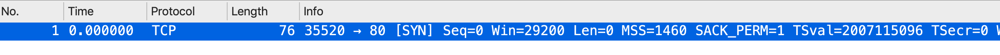
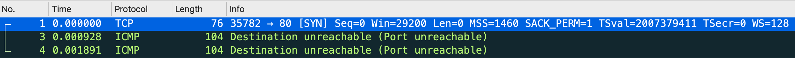
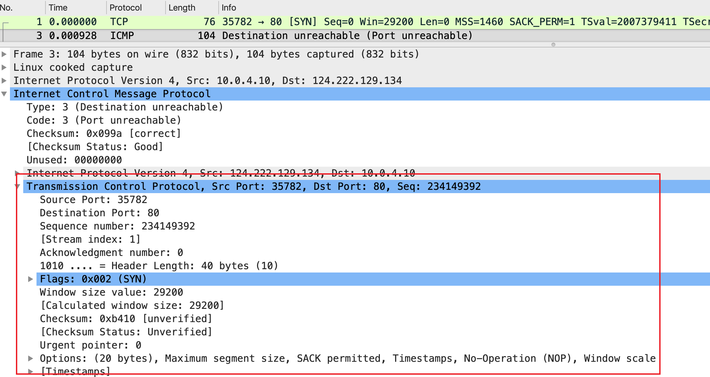
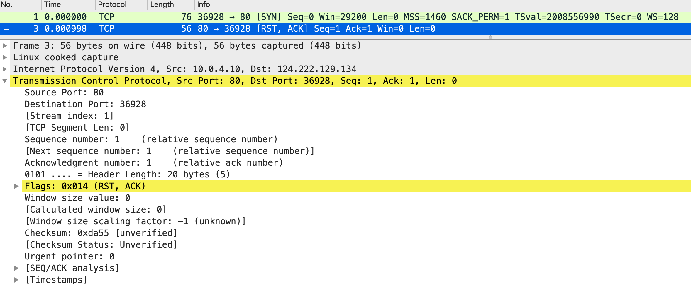
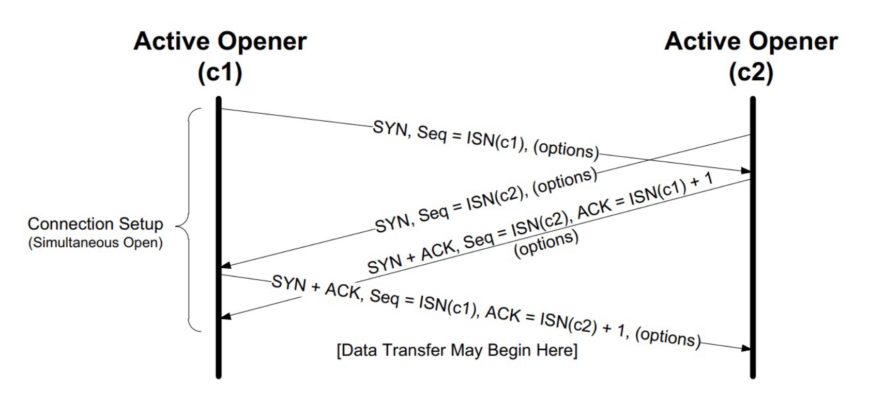
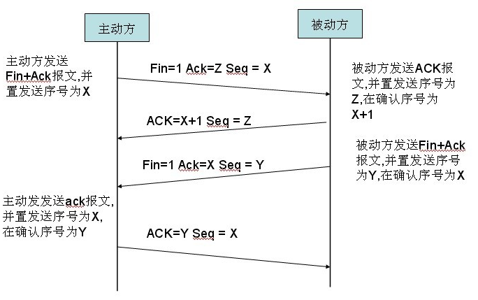
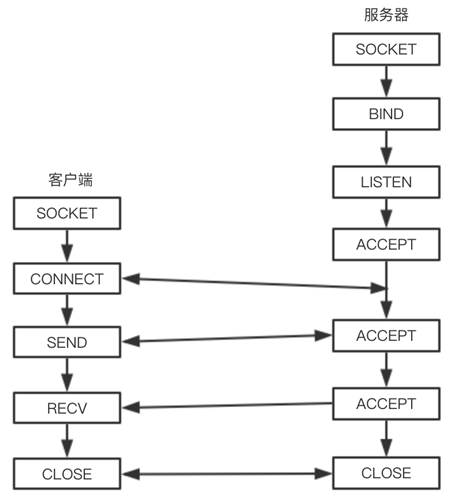

* [Transmission Control Protocol](https://en.wikipedia.org/wiki/Transmission_Control_Protocol)
* [详解TCP/IP协议](https://www.jianshu.com/p/9f3e879a4c9c)
* [TCP基础理论](http://www.52im.net/thread-515-1-1.html)
* [RFC-1180-A TCP/IP Tutorial](https://datatracker.ietf.org/doc/html/rfc1180)
* [RFC-793-TRANSMISSION CONTROL PROTOCOL](https://datatracker.ietf.org/doc/html/rfc793)
* [Linux 下的 TCP 参数-执行 man tcp，查看内核对 TCP 协议栈的详细文档](https://man7.org/linux/man-pages/man7/tcp.7.html)
* [ChatTCP：简化您的TCP分析体验](https://chattcp.com/zh)

## 1、TCP

### 1.1、TCP主要特性

TCP是TCP/IP体系结构中最主要的传输层协议。
- 面向连接的传输协议：应用程序在使用TCP之前，必须先建立TCP传输连接， 在数据传输完毕之后，必须释放已建立的TCP传输连接；
- 仅支持单播传输每条TCP传输连接只有两个端点，只能进行点对点的数据传输，不支持多播和广播的传输方式。注意：这里的TCP传输连接的"端点"不是主机或者主机的IP等，而是套接字(Socket).套接字是IP地址和端口号的组合；
- 提供可靠的交付服务：通过TCP连接传送的数据可以无差错、不丢失、不重复，且按时序到达对端
- 传输单位为数据段：由于数据段大小受应用层传输的报文大小和所途径网络的MTU值大小决定.每次发送的TCP数据段大小不固定.最小的数据段可能仅有21字节
- 仅一种TPDU格式；
- 支持全双工传输：TCP允许通信双方的应用程序在任何时候都能发送数据，因为TCP连接的两端都设有发送和缓存，用来临时存放双向通信的数据.
- TCP连接是基于字节流的，而非报文流；
- 每次发送的TCP数据端大小和数据段都是可变的

## 2、TCP数据段格式



- 源端口和目的端口：各占16位。 一个端口与其主机的IP地址可以完整的标识一个端点.

- 序号(Sequence Number)：序号指TCP数据段中的"数据"部分(不包含"数据段头"部分)的第一个字节的编号，占32位. 整个要传输的字节流的起始序号必须在连接建立时设置，解决乱序问题

- 确认序号(Acknowlegment Number)：确认号指期望接收到对方下一个数据段中"数据"部分的第一个字节序号，占32位。 注意："确认号"不是代表已经正确接收到最后一个字节的序号，"序号"和"确认号"两个字段共同用于TCP服务中的差错控制，确保TCP数据传输的可靠性

- 数据偏移：数据偏移指数据段中的"数据"部分起始处距离TCP数据段起始处的字节偏移量，占4位。这里的数据偏移也是在确定TCP数据段头部分的长度。数据偏移量是以32位(4字节)为单位来计算的.而不是以单个字节来计算的。4个比特位可以表示的最大数为15，所以数据偏移量最大位60字节，也是TCP数据段头部分最大长度；

- 保留(Reserved)：为将来应用而保留的6个比特位，目前应全设置位0

- 标志位：
    - URG：Urgent Pointer(紧急指针)控制位，指出当前数据段中是否有紧急数据，占1位，置1时表示有紧急数据.紧急数据会优先安排传送，而不会按照原来的排队顺序进行发送。仅当本字段设置为1时，后面的紧急指针字段才有意义；

    - ACK：Acknowlegment(确认)控制位，指示TCP数据段中的"确认号"字段是否有效，占1位。仅当ACK = 1时确认号字段才有效，当ACK = 0时确认号无效。TCP规定，在连接建立后所有的传送的报文段都必须把ACK置为1，可以在 wireshark 抓包，可以看到除了 最初建立连接的 SYN 包之外，其他的包也都有 ACK 标志

    - PSH：Push(推)控制位，指示是否需要立即把收到的该数据段提交给应用进程，占1位。发送方TCP把PSH置为1，并立即创建一个报文段发送出去。接收方TCP收到PSH=1的报文段，就尽快地（即“推送”向前）交付接收应用进程。而不用再等到整个缓存都填满了后再向上交付

    - RST：Reset(重置控制位)，用于重置、释放一个已经混乱的传输连接，然后重新的传输连接，占1位。当 RST=1  时，表示 TCP 连接中出现异常（如主机崩溃或其他原因）必须强制断开连接，然后再重新建立连接进行传输。RST置为1还用来拒绝一个非法的报文段或拒绝打开一个连接

    - SYN：Synchronization(同步)控制位，用来在传输连接建立时同步传输连接序号，占1位。当SYN位置1时，表示这一个连接请求或连接确认报文。 当SYN=1，而ACK=0 时，表示这是一个连接请求数据段.如果对方统一建立连接，则对方会返回一个`SYN=1`、`ACK=1`的确认；

    - FIN：Final(最后)控制位，用于释放一个传输连接，占1位。当FIN位置1时，表示数据已经传输完成，发送端没有数据要传输了，希望释放当前连接，但是接收端仍然可以继续接收还没有接收完的数据。在正常传输时，该位置1.

- 窗口大小：指示发送此TCP数据段的主机上用来存储传入数据段的窗口大小，也即发送者当前还可以接收的最大字节数，占16位；是接收端告诉发送端自己还有多少缓冲区可以接收数据。于是发送端就可以根据这个接收端的处理能力来发送数据，而不会导致接收端处理不过来；

- 检验和(Checksum)：检验和是指对"数据段头"、"数据"和"伪头部"这三部分进行校验，主干16位."伪头部"包括源主机和目的主机的32位IP地址、TCP协议号(6)，以及TCP数据段长度.

- 紧急指针(Urgent Pointer)：仅当前面的URG控制位置1时才有意义，它指出本数据段中位紧急数据的字节数，占16位。"紧急指针"字段指明了紧急数据的末尾在数据段中的位置。注意，即使当前窗口大小位0，也是可以发送紧急数据的，因为紧急数据无须缓存.

- 可选项(Option)："可选项"字段时可选的，且长度可变，最长可达40字节.当没有使用该字段时，TCP头部的长度是20字节.

- 数据(Data)：这是由应用层的应用进程提交的数据，作为TCP数据段的"数据"部分.

## 3、TCP套接字

参考：[Socket](#15socket)

## 4、TCP端口

每个端口都拥有一个称为"端口号"整数描述符，用来标识不同的端口或进程。在TCP的数据段格式中，分别定义了一个16比特长度的"源端口"和"目的端口"两个字段，也就是说可以定义2^16个端口，其端口号位0~2^16-1(65535)。由于TCP/IP传输层中的TCP和UDP时两个完全独立的软件模块，因此各自的端口号也相互独立，即各自独立拥有65535个端口。端口可以分为三类：

- 保留端口：通常将0~1023号TCP端口保留，因此，这类端口也称为"常规端口"。这些端口都已固定的分配给了已知的网络应用协议

    |端口号|对应的协议|用途说明|
    |-----|----------|--------|
    |20|FTP|FTP数据传输|
    |21|FTP|FTP控制消息|
    |22|SSH|安全登录|
    |23|TELNET|远程登录|
    |25|SMTP|邮件发送|
    |42|WINS|Internet名称解析服务|
    |53|DNS|域名解析服务|
    |69|TFTP|小型文件传输协议|
    |79|Finger|查询有关用户的信息|
    |80|HTTP|万维网服务|
    |110|POP3|邮件接收服务|
    |115|SFTP|简单文件传输协议|

- 动态分配端口：动态分配的端口一般大于1024，可以动态分配给任意网络服务应用程序使用.
- 注册端口：注册端口比较特殊，它也是固定位某个应用程序服务的端口，但是它所代表的不是已经形成的应用层协议，而是某个软件厂商开发的应用程序，如mysql的3360，redis的6379等

## 5、TCP状态转移

### 5.1、TCP的连接状态

状态 | 描述
-----|-----
CLOSED|呈阻塞，关闭状态，表示主机当前没有获得的传输连接或正在进行传输连接
LISTEN|呈监听状态，表示服务器正在等待新的传输连接进入
SYN RCVD|表示主机已接收到一个传输连接请求，但尚未确认
SYN SENT|表示主机已经一个传输连接请求，等待对方确认，如果对端没有会议 SYN_ACK报文，客户端这个连接的状态，就只能“停留”在 SYN_SENT 状态，无法转化为 ESTABLISHED 状态（这个状态保留时间短）
ESTABLISHED|传输连接建立，通信双方进入正常数据传输状态
FIN WAIT 1|(主动关闭)主机已经发送关闭连接请求，等待对方确认
FIN WAIT 2|(主动关闭)主机已接收到对方关闭传输连接确认，等待对方发送关闭传输连接请求
TIMED WAIT|完成双向传输连接关闭，等待所有分组消息
CLOSIND| 双方同时尝试关闭传输连接，等待对方确认
CLOSE WAIT|(被动关闭)收到对方发来的关闭传输连接请求，并已确认
LASC ACK|(被动关闭)等待最后一个关闭传输连接确认，并等待所有分组消失

### 5.2、TCP状态转换

<center>
    <br>
    <div style="color:orange; border-bottom: 1px solid #d9d9d9; display: inline-block; color: #999; padding: 2px;">
        图片来源：<a href='https://en.wikipedia.org/wiki/File:Tcp_state_diagram.png'>Wikipedia</a>
    </div>
</center>
 
每个连接均开始于CLOSED状态。当一方执行了被动的连接原语(LISTEN)或主动的连接原语(CONNECT)时，它便会离开CLOSED状态；

如果此时执行了相对应的连接原语，连接便建立了，并且状态变为 ESTABLISHED；

任何一方均可以首先请求释放连接，当连接被释放后，状态又回到了CLOSED

## 6、TCP建立连接-三次握手

* [TCP三次握手四次挥手进阶](https://mp.weixin.qq.com/s/hdHPSj0w9DTOHIZnIm_wrQ)
* [TCP/IP四层模型](http://www.cnblogs.com/BlueTzar/articles/811160.html)
* [TCP三次握手的原理](https://mp.weixin.qq.com/s/yH3PzGEFopbpA-jw4MythQ)

### 6.1、三次握手流程


在TCP/IP 协议中，TCP 协议提供可靠的连接服务，连接是通过三次握手进行初始化的。三次握手的目的是同步连接双方的序列号和确认号并交换 TCP 窗口大小信息
- 第一次握手(SYN=1, seq=x)：*建立连接*，客户端发送连接请求报文段，将`SYN`位置为`1`，初始序号（Seq=i）为 i；然后，客户端进入`SYN_SENT`状态，等待服务器的确认；
- 第二次握手(SYN=1, ACK=1, seq=y, ACKnum=x+1)：*服务器收到 SYN 报文段*，返回一个`SYN`字段置1、ACK字段置1(表示此为确认数据)、`ack(确认号)=i+1`、初始化序号为 j 的应答数据段此时服务器进入 `SYN_RECV` 状态；*注意：这里确认号是i+1，而不是i*
- 第三次握手(ACK=1，ACKnum=y+1)：*客户端收到服务器的 SYN+ACK 报文段*，向服务器发送一个`ACK=1(表示此为确认数据段)、序号为i+1、ack=j+1`的确认数据段，同时进入`ESTABLISHED`状态，服务器在收到客户端的ACK数据段后，进入`ESTABLISHED`状态，完成连接建立；

TCP发送每一个消息，都会带着IP层和MAC层，因为，TCP每发送一个消息，IP层和Mac层的所有机制都要运行一遍。

**只要在网络上跑的包，都是完整的，可以有下层没上层，绝对不可能有上层没下层**

**三次握手的过程传输的包是不包含数据的**

### 6.2、静默丢包

所谓静默丢包就是服务端虽然收到了 SYN，但是其直接丢弃了，也不给客户端任何回应，这也导致了一个问题：就是客户端无法分清楚这个 SYN 到底是下面哪种情况：
- 在网络上丢失了，服务端收不到，自然不会有回复；
- 对端收到了但没回，就是刚才说的“静默丢包”；
- 对端收到了也回了，但这个回包在网络中丢了

从客户端的角度，对于 SYN 包发出去之后迟迟没有回应的情况，它的策略是做重试。

client 发送 SYN 包之后没有获取到响应，于是 client 端如果在一定时间内没有收到的TCP会重发`SYN`。

实验：

（1）在服务端，执行下面的这条命令，让 iptables 静默丢弃掉发往自己 80 端口的数据包：
```bash
iptables -I INPUT -p tcp --dport 80 -j DROP
```
（2）在客户端启动 tcpdump 抓包
```bash
sudo tcpdump -i any -w telnet-80.pcap port 80
```
（3）从客户端发起一次 telnet
```bash
telnet 服务端IP 80
```
此时telnet会挂起，待 telnet 超时后退出，可以停止掉 tcpdump（Ctrl + C），使用wireshark打开抓包文件：



在Linux下，默认重试次数为6次，重试的间隔时间从1s开始每次都翻倍，6次的重试时间间隔为1s, 2s, 4s, 8s, 16s，总共31s，第6次发出后还要等32s都知道第5次也超时了，所以，总共需要 `1s + 2s + 4s+ 8s+ 16s + 32s = 2^6 -1 = 63s`，TCP才会把断开这个连接；

> TCP 握手没响应的话，操作系统会做重试

在 Linux 中，这个设置是由内核参数 `net.ipv4.tcp_syn_retries` 控制的，默认值为 6，也就是前面刚观察到的现象：
```bash
[root@bluefish ~]# sudo sysctl net.ipv4.tcp_syn_retries
net.ipv4.tcp_syn_retries = 6
```
> 静默丢包会引起客户端空等待的问题

iptables 的规则动作有好几种，前面使用的是 DROP，这次使用 REJECT，这应该能让客户端立刻退出了。执行下面的这条命令，让 iptables 拒绝发到 80 端口的数据包：
```bash
iptables -I INPUT -p tcp --dport 80 -j REJECT
```
抓包文件里并没有期望的 TCP RST：



抓包命令：`sudo tcpdump -i any -w telnet-80-reject.pcap host <服务端> and port 80` 也没有问题的

这里假设了一个前提，认为这次握手的所有过程都是通过这个 80端口进行的，去掉端口的过滤条件：
```bash
sudo tcpdump -i any -w telnet-80-reject.pcap host <服务端>
```
抓取到的报文如下：



对端回复了一个 ICMP 消息：Destination unreachable (Port unreachable)。



原来，这个 ICMP 消息不仅通过 type=3 表示，这是一个“端口不可达”的错误消息，而且在它的 payload 里面，还携带了完整的 TCP 握手包的信息，而这个握手包，可是客户端发过来的。

回头来看 iptables 规则，原来，它自动补上了–reject-with icmp-port-unreachable，也就是说确实用 ICMP 消息做了回复
```bash
-A INPUT -p tcp -m tcp --dport 80 -j REJECT --reject-with icmp-port-unreachable
```
如果想返回 TCP RST，定义的 iptables规则：
```bash
iptables -I INPUT -p tcp --dport 80 -j REJECT --reject-with tcp-reset
```
返回的报文如下：



无论是收到 `TCP RST` 还是 `ICMP port unreachable` 消息，客户端的 connect() 调用都是返回 ECONNREFUSED`，这就是 telnet 都报“connection refused”的深层次原因；

TCP握手拒绝，也就是说可以是 ICMP 报文来达成的

### 6.3、SYN Flood攻击

当开放了一个TCP端口后，该端口就处于Listening状态，不停地监视发到该端口的Syn报文，一旦接收到Client发来的Syn报文，就需要为该请求分配一个`TCB（Transmission Control Block）`，通常一个TCB至少需要`280个字节`，在某些操作系统中TCB甚至需要1300个字节，并返回一个SYN ACK命令，立即转为`SYN-RECEIVED`即半开连接状态，而某些操作系统在SOCK的实现上最多可开启512个半开连接

从以上过程可以看到，如果恶意的向某个服务器端口发送大量的SYN包，则可以使服务器打开大量的半开连接，分配TCB，从而消耗大量的服务器资源，服务器需要默认等63s才会断开连接，同时也使得正常的连接请求无法被相应。而攻击发起方的资源消耗相比较可忽略不计；

Linux下给了一个叫`tcp_syncookies`的参数来应对这个事：当SYN队列满了后，TCP会通过源地址端口、目标地址端口和时间戳打造出一个特别的Sequence Number发回去（又叫cookie），如果是攻击者则不会有响应，如果是正常连接，则会把这个 SYN Cookie发回来，然后服务端可以通过cookie建连接（即使你不在SYN队列中）；

请注意，请先千万别用tcp_syncookies来处理正常的大负载的连接的情况。因为，SYNC cookies是妥协版的TCP协议，并不严谨。对于正常的请求，你应该调整三个TCP参数可供你选择，第一个是：`tcp_synack_retries 可以用他来减少重试次数`；第二个是：`tcp_max_syn_backlog，可以增大SYN连接数`；第三个是：`tcp_abort_on_overflow 处理不过来干脆就直接拒绝连接了`

### 6.4、同时发起握手

如果两端同时发送了 SYN 给对方，也就是双方都收到了一个 SYN，那么接下来，它们会进入什么状态呢？

其实，通信双方还真的可以同时向对方发送 SYN，也能建立起连接



## 7、TCP连接释放-四次挥手

### 7.1、流程



- 第一次挥手：主机1(可以使客户端，也可以是服务器端)，设置 Sequence Number 和 Acknowledgment Number， 向主机2发送一个 FIN 报文段；此时，主机1进入 FIN_WAIT_1 状态；这表示主机1没有数据要发送给主机2了；

- 第二次挥手：主机2收到了主机1发送的 FIN 报文段，向主机1回一个 ACK 报文段，Acknowledgment Number 为 Sequence Number 加1；主机1进入 FIN_WAIT_2 状态；主机2告诉主机1，我"同意"你的关闭请求；

- 第三次挥手：主机2向主机1发送 FIN 报文段，请求关闭连接，同时主机2进入 LAST_ACK 状态；

- 第四次挥手：主机1收到主机2发送的 FIN 报文段，向主机2发送 ACK 报文段，然后主机1进入 TIME_WAIT 状态；主机2收到主机1的ACK报文段以后，就关闭连接；此时，主机1等待2MSL后依然没有收到回复，则证明Server端已正常关闭，那好，主机1也可以关闭连接了；

> 挥手的发起可以是双方都可以发起的，挥手的双方并不是客户端和服务端的概念；

### 7.2、保活机制

- 保活机制是一种在不影响数据流内容的情况下探测对方的方式；和名字正好相反，是服务器用来确认什么时候应该断开连接的一种机制

- 保活功能在默认情况下是关闭的，TCP连接的任何一端都可以请求打开这一功能

- 在一段时间(称为保活时间,keepalivetime)内连接处于非活动状态，开启保活功能的一端将向对方发送一个保活探测报文。如果发送端没有收到响应报文，那么经过一个已经提前配置好的保活时间间隔(keepaliveinterval)，将继续发送保活探测报文，直到发送探测报文的次数达到保活探测数(keepaliveprobe)，这时对方主机将被确认为不可到达，连接也将被中断；

- 保活探测报文为一个空报文段（或1个字节），序列号等于对方主机发送的ACK报文的最大序列号减1；因为这一序列号的数据段已经被成功接收,所以不会对到达的报文段造成影响,但探测报文返回的响应可以确定连接是否仍在工作；

    探测及其响应报文丢失后都不会重传。探测方主动不重传，相应方的ACK报文并不能自己重传，所以需要保活探测数

- 保活结果：
    - 对方主机仍在工作：服务器端正常收到ACK，说明客户端正常工作。请求端将保活计时器重置。重新计时；
    - 对方主机已经崩溃：对方的TCP将不会响应ACK。超过保活探测数以后，认为对方主机已经关闭,连接也将被断开；
    - 客户主机崩溃并且已重启：客户端响应是一个重置报文段,请求端将会断开连接。
    - 对方主机仍在工作：但是因为其他原因就是没有收到ACK。

**TCP 挥手时双方同时停止发送数据**：一方发送 FIN 只是表示这一方不再发送新的数据，但对方仍可以发送数据

### 7.3、四次挥手过程中状态变化

- FIN_WAIT_1：(主动方)，其实FIN_WAIT_1和FIN_WAIT_2状态的真正含义都是表示等待对方的FIN报文。而这两种状态的区别是：
    * FIN_WAIT_1状态实际上是当SOCKET在ESTABLISHED状态时，它想主动关闭连接，向对方发送了FIN报文，此时该SOCKET即进入到FIN_WAIT_1状态
    * 而当对方回应ACK报文后，则进入到FIN_WAIT_2状态，当然在实际的正常情况下，无论对方何种情况下，都应该马上回应ACK报文，所以FIN_WAIT_1状态一般是比较难见到的，而FIN_WAIT_2状态还有时常常可以用netstat看到；

- FIN_WAIT_2：(主动方)：FIN_WAIT_2状态下的SOCKET，表示半连接，也即有一方要求close连接，但另外还告诉对方，暂时还有点数据需要传送给你(ACK信息)，稍后再关闭连接

- CLOSE_WAIT：表示在等待关闭(被动方)：当对方close一个SOCKET后发送FIN报文给自己，你系统毫无疑问地会回应一个ACK报文给对方，此时则进入到CLOSE_WAIT状态. 接下来需要考虑的是当前是否有数据需要发送给对方，如果没有的话，自己这边也可以close该Socket，发送FIN报文段给对方，即关闭连接.所以在CLOSE_WAIT状态下，需要完成的事情是等该关闭连接.

- LAST_ACK：(被动方)：是被动一方在发生FIN报文后，最后等待对方的ACK报文.当收到ACK报文后，也可以进入到CLOSED可用状态. 

- TIME_WAIT：(主动方)：表示收到了对方的FIN报文，并发送出了ACK报文，就等2MSL后即可回到CLOSED可用状态了。如果FIN_WAIT1状态下，收到了对方同时带FIN标志和ACK标志的报文时，可以直接进入到TIME_WAIT状态，而无须经过FIN_WAIT_2状态.

- CLOSED：表示连接中断

### 7.4、TIME_WAIT

- 关于 `MSL` 和 `TIME_WAIT`：
    - 在TCP的状态图中，从`TIME_WAIT`状态到CLOSED状态，有一个超时设置，这个超时设置是 `2*MSL（Maximum Segment Lifetime）`（RFC793定义了MSL为2分钟，Linux设置成了30s）；
    - 任何报文在网络上存在的最长时间，超过这个时间报文将被丢弃。（IP 报文）
    - 为什么要有`TIME_WAIT`等待2MSL：
        - `TIME_WAIT`确保有足够的时间让对端收到了ACK，如果被动关闭的那方没有收到Ack，就会触发被动端重发Fin，一来一去正好2个MSL；
        - 有足够的时间让这个连接不会跟后面的连接混在一起；
        - 保证TCP协议的全双工连接能够可靠关闭；保证这次连接的重复数据段从网络消失；

- `TIME_WAIT`数量太多的原因
    - `TIME_WAIT`是个很重要的状态，但是如果在高并发的场景下存在大量的短链接，会存在`TIME_WAIT`太多的情况，这也会消耗很多系统资源；
    - TCP 四次挥手关闭连接机制中，为了保证 ACK 重发和丢弃延迟数据，设置 `TIME_WAIT` 为 2 倍的 MSL（报文最大存活时间）

    大量 TIME_WAIT 状态存在，会导致新建 TCP 连接会出错，address already in use : connect 异常，因为TCP 端口数量上限是 6.5w（65535，16 bit）；

- `TIME_WAIT`数量太多解决方案：
    - 客户端，HTTP 请求的头部，connection 设置为 keep-alive，保持存活一段时间；
    - 设置两个参数，一个叫`tcp_tw_reuse`，另一个叫`tcp_tw_recycle`的参数，这两个参数默认值都是被关闭的，后者recyle比前者resue更为激进，resue要温柔一些。另外，如果使用tcp_tw_reuse，必需设置tcp_timestamps=1，否则无效；

TIME_WAIT 是「主动关闭 TCP 连接」一方的状态，可能是「客服端」的，也可能是「服务器端」的；一般情况下，都是「客户端」所处的状态；「服务器端」一般设置「不主动关闭连接」

## 8、TCP传输建立与释放相关问题

### 8.1、为什么要三次握手

- **初始化序列号**：三次握手允许客户端和服务器交换初始序列号（ISN），这是 TCP 连接中数据传输的基础。每个方向上的通信都需要一个序列号来确保数据包的顺序和完整性。
- **避免已失效的连接请求突然传输**：假设没有三次握手，客户端发送了一个 A 请求，但因为某些原因 A 请求在网络中延迟了，然后客户端重新发送了一个 B 请求并成功建立了连接。如果服务器后来又收到 A 请求并建立了连接，那么这个连接就是无效的，因为客户端已经放弃了它。三次握手确保了服务器对客户端的连接请求进行了确认，并且客户端也确认了服务器的确认；
- **确保双方都准备好进行数据传输**：第一次握手：客户端发包，服务端收到了。服务端就知道客户端的发送能力、服务端的接收能力正常；第二次握手：服务端发包，客户端收到了。客户端就知道服务端的接收、发送以及客户端的接收、发送是正常的；第三次握手：客户端发包，服务端收到了。服务端就知道客户端的接收、发送正常，服务端自己的发送、接收也正常；
- **防止资源浪费**：如果没有三次握手（比如两次握手），服务器可能会在没有客户端确认的情况下分配资源，这可能导致资源浪费，因为客户端可能并没有准备好或者已经不再需要连接。；
- **防止重复连接**：在某些情况下，客户端可能会因为网络问题或其他原因多次发送相同的连接请求。如果没有三次握手，服务器可能会为每个请求分配资源，导致资源的不必要分配。通过三次握手，服务器可以确认客户端的意图，并避免为重复的请求分配资源。
- **全双工通信的确认**：TCP 是一个全双工协议，这意味着数据可以在两个方向上独立传输。三次握手确保了两个方向上的通道都已经被建立和确认

*从另一个角度来看问题：*问题的本质是，信道不可靠，但是通信双发需要就某个问题达成一致。而要解决这个问题，无论你在消息中包含什么信息，三次通信是理论上的最小值。所以三次握手不是TCP本身的要求，而是为了满足"在不可靠信道上可靠地传输信息"这一需求所导致的

### 8.2、为什么要四次挥手

- 确保数据传输完成：在 TCP 连接中，数据传输是双向的。当一方完成数据发送并准备关闭连接时，它需要确保另一方也完成了数据的发送和接收。四次挥手允许双方独立地关闭各自的发送通道。
- 防止数据丢失：当一方发送 FIN 标志位来表示它已经完成发送数据时，它可能还在接收来自另一方的数据。四次挥手确保了即使在关闭连接的过程中，接收方也可以继续接收和处理来自发送方的数据，直到它也发送了 FIN。
- 防止数据重复：在网络中，数据包可能会因为各种原因被重复发送。如果一方在没有收到另一方的确认就关闭连接，那么可能会丢失或重复处理数据。四次挥手通过确保双方的确认，减少了数据重复的可能性。
- 防止资源泄露：TCP 连接使用系统资源，如内存和缓冲区。四次挥手确保了在连接不再需要时，这些资源可以被正确释放，防止资源泄露。
- 确认双方的关闭意图：四次挥手允许双方独立地确认它们都同意关闭连接。这确保了连接的关闭是双方协商的结果，而不是单方面的决定。
- 处理延迟或丢失的确认：在网络通信中，确认消息可能会因为网络问题而延迟或丢失。四次挥手通过发送额外的确认消息，确保即使在确认消息丢失的情况下，连接也能够被正确关闭。
- 处理不同步的关闭请求：在某些情况下，客户端和服务器可能几乎同时发送 FIN 来关闭连接。四次挥手允许处理这种情况，确保双方都能够完成关闭过程。
- 允许半关闭状态：在 TCP 中，可以存在半关闭状态，即一方已经停止发送数据，但仍然可以接收数据。四次挥手允许这种状态的存在，直到双方都准备好完全关闭连接

### 8.3、为什么建立连接协议是三次握手，而关闭连接却是四次挥手呢?

- 这是因为服务端的 LISTEN 状态下的 SOCKET 当收到 SYN 报文的连接请求后，它可以把ACK和SYN(ACK起应答作用，而SYN起同步作用)放在一个报文里来发送.
- 但关闭连接时，当收到对方的 FIN 报文通知时，它仅仅表示对方没有数据发送给你了；但未必你所有的数据都全部发送给对方了，所以你可能未必会马上会关闭SOCKET，也即你可能还需要发送一些数据给对方之后，再发送FIN报文给对方来表示你同意现在可以关闭连接了，所以它这里的ACK报文和FIN报文多数情况下都是分开发送的

### 8.4、为什么不能用两次握手进行连接?

- 3次握手完成两个重要的功能：既要双方做好发送数据的准备工作(双方都知道彼此已准备好)，也要允许双方就初始序列号进行协商，这个序列号在握手过程中被发送和确认.
- 把三次握手改成仅需要两次握手，死锁是可能发生的

### 8.5、服务器出现大量的CLOSE_WAIT状态的原因

- 首先close_wait一般出现在被动关闭方；
- 并发请求太多导致；
- 被动关闭方没有及时释放端口资源；

### 8.6、挥手时报文合并

挥手时候的有四个报文是
- （1）发起端：FIN
- （2）对端：ACK
- （3）对端：FIN
- （4）发起端：ACK

其中，2和3经常会在一起发送。除此以外，1和发起端的其他报文一起发送。这是由于 [Piggybacking](https://en.wikipedia.org/wiki/Piggybacking_(Internet_access)) 的存在，让报文看起来只有3次；

另外在 Wireshark 里看不到第一个 FIN。这个时候不要真的把后面那个被Wireshark 直接展示的 FIN 当作是第一个 FIN。需要选中挥手阶段附近的报文，在 TCP 详情里面查看是否有报文携带了 FIN 标志位；

### 8.7、挥手能不能同时发起

- 双方同时发起关闭后，也同时进入了 FIN_WAIT_1 状态；
- 然后也因为收到了对方的 FIN，也都进入了 CLOSING 状态；
- 当双方都收到对方的 ACK 后，最终都进入了 TIME_WAIT 状态。

这也意味着，两端都需要等待 2MSL 的时间，才能复用这个五元组 TCP 连接

## 9、TCP的可靠性传输

在TCP可靠传输主要采用下列四种机制：
- **字节编号机制**：TCP数据段以字节为单位对数据段中的"数据"部分进行一一编号，确保每个字节的数据都可以有序的传送和接收
- **数据段确认机制**：TCP要求每接收一个数据段都必须由接收端向发送端返回一个确认数据段。其中"确认号"表明了接收端已正确接收的数据段序号.
- **超时重传机制**：TCP中有一个重传定时器(RTT)，在发送一个数据段的同时也启动了该定时器。如果在定时器过期时间该数据段还没有被对方确认的话，则定时器停止，然后重传对应序号的数据段.
- **选择性确认(SACK)机制**：在SACK支持下，仅可以重传缺少部分的数据，而不会重传哪些已经正确接收的数据

### 9.1、TCP字节编号机制

因为是按字节进行编号的，所以接收端根据所接收到的数据段中的序号可以知道前面是否还有数据没有接收到，数据可以按顺序向应用进程提交，在对经过了数据段的数据进行重组时也可以根据这个序号进行正确的重组.

为了保证顺序性，每一个包都有一个 ID。在建立连接的时候，会商定起始的 ID 是什么，然后按照 ID 一个个发送。为了保证不丢包，对于发送的包都要进行应答，但是这个应答也不是一个一个来的，而是会应答某个之前的 ID，表示都收到了，这种模式称为累计确认或者累计应答（cumulative acknowledgment）

### 9.2、TCP的数据段确认机制

#### 9.2.1、几个重要概念

- **数据段**：指TCP对从应用层接收的数据进行分割所得到的数据块，通常包含千个以上字节，而且必须是整数倍字节数.正因如此，TCP发送的是字节流，而不是通常所说的报文流，因为在TCP数据段中没有报文边界
- **序号**： TCP发送的数据段中"数据"部分，每个字节都有一个序号，每个数据段中的"序号"字段是以该数据段中第一个字节的序号进行填充.
- **窗口大小**：窗口的大小时本端要告诉对端当前可以接收的数据量，也暗示着对端可以一次性发送的数据大小，以字节位单位。 窗口大小字段是随着 接收端"接收窗口大小"变化而变化的，不是固定的。无论发送端还是接收端，都分别有"发送窗口"和"接收窗户"这两个窗口；
- **确认号**：指发送包含这个"确认号"的数据段的一端期望接收另一端的下一个数据段的起始序号。同时也暗示了在此序号之前的所有字节数据均已正确接收；
- **ACK**：是一个表明"确认号"字段是否有效的标志位.只有ACK=1时数据段中的"确认号"才有意义。
    
#### 9.2.2、TCP确认机制特性

- TCP可一次连续发送多个数据段
- 仅对连续接收的数据段进行确认
- 不连续序号的数据将先缓存

### 9.3、TCP超时重传机制

原理是在发送某一个数据段以后就开启一个超时重传计时器.如果在这个定时器时间内没有收到来自对方的某个数据段的确认，发送端启动重传机制，重新发送对应的的数据段.

- SRTT的计算：发送一个数据包到收到对应的ACK所花费的时间
- RTO的计算：重传时间间隔

### 9.4、TCP的选择性确认机制

在上面超时重传机制中，如果在重传定时器超时后仍没有收到一个数据段的确认，则可能会重传对应序号后面的所有数据段。为了避免这种线程的出现，出现了一种称为"选择性确认(SACK)"的机制，就是在TCP数据段格式的头部"可选项"字段中添加一个代表支持SACK的选项.但这个选项在不同的数据段中有不同的字段名称和不同的含义。

### 9.5、TCP如何保证可靠性传输

- 将数据阶段截为合理的长度： 应用数据被分割成TCP认为最合适发送的数据块.和UDP完全不同，应用程序产生的数据长度将保持不变；
- 超时重发：当TCP发出一个数据段后，它将启动一个定时器，等待目的端确认收到这个报文段。如果不能即使收到一个确认，将重发这个报文段；
- 对于收到的请求，给出确认响应：当TCP收到发自TCP连接另一端的数据，它将发送一个确认数据段.
- 数据校验：TCP将保持它首部和数据的检验和.是一个端到端的检验和，目的是检测数据在传输过程中的任何变化。如果收到段的检验和有差错，TCP将丢弃这个报文段且不确认收到此报文段
- 对失序数据进行重排序：TCP报文段作为IP数据来传输，而IP数据报的到达可能失序，因此TCP报文段的到达也可能会失序。如果有必要，TCP将对收到的数据进行重排序，将收到的数据以正确的顺序交给应用层
- 丢弃重复数据： IP数据报会发生重复，TCP的接收端必须丢弃重复的数据.
- TCP提供了流量控制：TCP连接的每一方都有固定大小的缓冲空间.TCP接收端只允许另一段发送接收端缓冲区所能接纳的数据。这防止较快主机致使较慢主机的缓冲区溢出。TCP使用的流量控制协议时可变大小的滑动窗口协议.
- TCP提供了拥塞控制

## 10、TCP流量控制

### 10.1、概述

流量控制是基于通信双发的数据发送和接收速率匹配方面考虑，通讯方任一方发送过快都会导致对方数据处理不过来，所以就需要把数据放到缓冲区；如果缓冲区满了，发送方还在疯狂发送，那么接收方只能把数据包丢弃。因此需要控制发送速率；缓冲区剩余大小称之为接收创建，用变量win表示。如果win=0，则发送方停止发送；

### 10.2、滑动窗口协议

TCP流量控制时采用滑动窗口协议来进行的。接收方在返回的ACK中会包含自己的接收窗口的大小，以控制发送方的数据发送。滑动窗口协议允许在发送方和接收方之间各自维持一个滑动窗口，发送方是发送窗口，接收方时接收窗口，而该窗口随着时间变化可以详情滑动。

#### 10.2.1、发送窗口中四个概念

- 已发送并收到确认的数据：不再发送窗口和发送缓冲区内
- 已发送但并为收到确认的数据：位于发送窗口之内
- 允许发送但尚未发送该的数据：位于发送窗口之内
- 发送窗口之外的缓冲区暂时不允许发送的数据

#### 10.2.2、接收窗口中也有四个概念

- 已发送确认并交付主机的数据：不在接收窗口和接收缓冲区之内
- 未按序收到的数据：位于接收窗口之内
- 允许的数据：位于接收窗口之内
- 不允许接收的数据：位于发送窗口之内

#### 10.2.3、存在数据丢失情况下的流量控制

如果在数据传输过程中有一个或多个数据段丢失，则发送端收不到对这些数据段的确认数据段，可以通过超时重传机制来解决。"持续计数器"

### 10.3、基于传输效率考虑

Nagle算法和Clark算法

### 10.4、总结

- 发送方不必发送一个全窗口大小的数据；
- 来自接收方的一个报文段确认数据并把窗口向右移动，这是因为窗口的大小是相对序号的；
- 窗口的大小可以减少，但是窗口的右边沿却不能向左移动移动；
- 接收方在发生一个ACK前不必等待窗口被填满；

## 11、TCP拥塞控制

* [拥塞控制等](https://mp.weixin.qq.com/s/QgRq7gw70yBMs1ZTdrUNsg)

### 11.1、概述

拥塞控制时基于网络中各段链路的带宽和中间设备数据处理能力方面而考虑的，不要使网络中出现数据传输阻塞，也就是不要发送端发送的数据大于接收端数据处理能力，是一个端到端的行为。动态调整

### 11.2、TCP拥塞控制方案

- [BBR-拥塞算法](https://switch-router.gitee.io/blog/bbr1/)
- [BBR: Congestion-Based Congestion Control](https://queue.acm.org/detail.cfm?id=3022184)

#### 11.2.1、慢启动

- 慢启动时为了避免出现网络拥塞而采取的一种TCP拥塞初期预防方案.其基本思想是在TCP连接正式传输数据时， 每次可发送的数据大小（这就是"拥塞窗口"含义）是逐渐增大的，也就是先发送一些小字节数的试探性数据，在收到这些数据段的确认后，再慢慢增加发送的数据量，直到达到了某个原先设定的极限值。

- 在"慢启动"拥塞解决方案中，发送端除了维护正常情况下根据接收端发来的"窗口大小"字段而调整的"发送窗口"外，还需要维护一个"拥塞窗口"(Congestion Window， CWND )，它数为了避免发生拥塞而这种的窗口，最终允许发送的字节数是这两个窗口中的最小值.具体步骤如下
    * 在一个TCP传输连接建立时，发送端将"拥塞"窗口初始化为该连接上当前使用的最大数据段大小(MSS)，即 CWND =MSS，然后发送一个大小为MSS的数据段.
    * 如果在定时器过期前发送端收到了该数据段的确认，则发送端将"拥塞窗口"大小增加一个MSS，也就是此时的 CWND =2MSS，然后发送2MSS大小的数据.
    * 如果这次发送的2MSS的数据段也被确认了，则"拥塞窗口"大小再增加两个MSS，一次类推.

- 慢启动方案的基本规律：当"拥塞窗口"大小达到了n个MSS时，如果所有n个数据段都被及时确认，则新的"拥塞窗口"大小再增加n个MSS，也就是新的"拥塞窗口"大小是旧的的"拥塞窗口"的2倍关系.

- 但"拥塞窗口"不可能无限制继续增大，即使 CWND 值仍小于从接收端返回的"窗口大小"字段值，都有可能出现数据丢失现象。慢启动方案另一个桉树-慢启动阈值( SSTHRESH)，其初始值是64KB，即65535个字节。 当发生一次数据丢失时， SSTHRESH设为当前 CWND 的一半，而 CWND 重新置为1MSS，然后继续使用慢启动方案来解决网络拥塞问题。不过当 CWND 再次增长到 SSTHRESH 时便停止使用慢启动方案.需要采用下面的"拥塞避免"解决方案.

#### 11.2.2、拥塞避免

当 CWND 再 次大于或等于 SSTHRESH时，启动"拥塞避免"解决方案.

- 其基本思想：

    在 CWND 值第二次达到 SSTHRESH时，让"拥塞窗口"大小经过一个RTT(一个数据段往返接收端和发送端所需要的时间)时间仅值加1（即新的 CWND 只增加一个MSS大小，而不会原来的 CWND 的几倍），使其以线性方式慢慢的增大，而不是继续像慢启动方案中以指数方式快速增大.当再次发生数据丢失时，又会把 SSTHRESH减为当前 CWND 的一半，同时把 CWND 置为1，重新进入慢启动数据发送过程，以此类推.

#### 11.2.3、快速重传/快速恢复

- 快速重传基本思想：当接收端收到一个不是按序达到的数据段时，TCP实体迅速发送一个重复的 ACK 数据段，而不是等到有数据需要发送时顺带发出确认；在重复收到三个重复的ACK数据段后，即认为对应"确认号"字段的数据段已经丢失，TCP不等重传定时器超时就重传看来已经丢失的数据.
- 快速恢复：在"快速重传"算法发送了看似已经丢失的数据段后，"快速恢复"算法同时发生作用。
    * 其基本思想：在收到第三个重复ACK时，把当前 CWND 值设为当前 SSTHRESH 值得一半，以减轻网络负荷，然后执行前面介绍的拥塞避免算法，使 CWND 值慢慢增大，以避免再次出现网络拥塞。
- BBR 拥塞算法：

## 12、TCP参数

* [TCP性能提升参数设置](https://mp.weixin.qq.com/s/S8pCsqYSFgcvuAHD50QAeA)

### 12.1、查看所有参数

Linux环境下查看TCP参数：
```
[root@bluefish ~]# ls -l /proc/sys/net/ipv4/tcp*
-rw-r--r-- 1 root root 0 Sep 25 10:46 /proc/sys/net/ipv4/tcp_abort_on_overflow
-rw-r--r-- 1 root root 0 Sep 25 10:46 /proc/sys/net/ipv4/tcp_adv_win_scale
-rw-r--r-- 1 root root 0 Sep 25 10:46 /proc/sys/net/ipv4/tcp_allowed_congestion_control
-rw-r--r-- 1 root root 0 Sep 25 10:46 /proc/sys/net/ipv4/tcp_app_win
...
```

### 12.2、提升TCP性能策略

主要从以下三个方面：
- TCP 三次握手的性能提升：
    - 调整 SYN 报文重传次数；
    - 调整 SYN 半连接队列长度；
    - 调整 SYN + ACK 报文重传次数；
    - 调整 accept 队列长度；
    - 绕过三次握手；
- TCP 四次挥手的性能提升：
    - 调整 FIN 报文重传次数；
    - 调整 FIN_WAIT2 状态的时间；
    - 调整孤儿连接的上限个数；
    - 调整 time_wait 状态的上限个数；
    - 复用 time_wait 状态的连接；
- TCP 数据传输的性能提升：
    - 扩大窗口大小；
    - 调整发送缓冲区范围；
    - 调整接收缓冲区范围；
    - 接收缓冲区动态调节；
    - 调整内存范围；

### 12.3、三次握手性能提升

### 12.4、MTU与MSS

- [MTU与MSS相关问题](https://mp.weixin.qq.com/s/W8ZD9qLjdXce1yDUzc59bw)

**MTU**

MTU，中文叫最大传输单元，也就是第三层的报文大小的上限，MTU 是一个静态设置，在同样的路径上，一旦某个尺寸的报文一次没通过，后续
的这个尺寸的报文全都不能通过。这样的话，后续重传的两次 1388 字节的报文也都失败这个事实，也就可以解释了为什么有的时候重传没有成功；

**MSS**

MTU 本身是三层的概念，而在第四层的 TCP 层面，有个对应的概念叫 MSS，Maximum Segment Size（最大分段尺寸），也就是单纯的 TCP 载荷的最大尺寸。MTU 是三层报文的大小，在 MTU 的基础上刨去 IP 头部 20 字节和 TCP 头部 20 字节，就得到了最常见的 MSS=1460 字节

MSS 在 TCP 里是怎么体现的呢？MSS 是在握手阶段完成“通知”的。在 SYN 报文里，客户端向服务端通报了自己的 MSS。而在 SYN+ACK 里，服务端也做了类似的事情。这样，两端就知道了对端的 MSS，在这条连接里发送报文的时候，双方发送的 TCP 载荷都不会超过对方声明的MSS

## 13、Socket

### 13.1、基于TCP的Socket

在TCP/IP网络中，区分不同应用程序进程间的网络通信和连接时主要有三个参数：

* 通信的目的IP地址
* 使用的传输层协议(TCP或UDP)
* 使用的端口号

通过这三个参数结合起来与一个Socket进行绑定，应用层就可以与传输层一起通过套接字接口来区分来自不同应用程序进程或网络连接通信，实现数据传输的并发服务.

**TCP Socket原语**

- 基本概述：在TCP Socket中，包含如下表了一组(共8个)TCP数据传输服务原语，表中前4个原语由服务器按照顺序执行。其中，SOCKET原语用来创建一个新的端点，并且在传输实体中为它们分配相应的空间.SOCKET原语调用成功后，返回一个普通的文件描述符，以便后续在其他的原语调用中使用。但由于新创建的套接字并没有网络地址，需要通过BIND原语为它进行分配，所以BIND原语的用途是为新建的套接字绑定一个本地网络地址。 客户端调用的原语包括：SOCKET，CONNECT，SEND，RECV.

- TCP Socket原语

    |原语名称|含义|
    |-------|----|
    |SCOKET|创建一个新的通信端点|
    |BIND|将一个本地地址关联到一个套接字上|
    |LISTEN|通告愿意接受连接，并给出队列大小|
    |ACCEPT|阻塞调用方，直到有人企图进行连接|
    |CONNECT|主动尝试建立一个连接|
    |SEND|在指定的连接上发送数据|
    |RECV|从指定的连接上接收数据|
    |CLOSE|释放指定的连接|

- TCP Socket原语调用基本流程

    

TCP 的 Socket 就是一个文件流，是非常准确的。因为，Socket 在 Linux 中就是以文件的形式存在的

### 13.2、模拟TCP连接

使用python模拟

**服务端监听 33333 端口**
```py
# tcp_server.py
import socket  # 导入 socket 模块
import time
s = socket.socket()  # 创建 socket 对象
host = socket.gethostname()  # 获取本地主机名
port = 33333  # 设置端口
s.bind((host, port))  # 绑定端口
s.listen(5)  # 等待客户端连接
while True:
    c, addr = s.accept()  # 建立客户端连接
    c.send('hello'.encode("utf-8"))
    c.send('world'.encode("utf-8"))
    time.sleep(1)
    c.close()  # 关闭连接
```
**客户端**：连接 33333 端口，并接收并打印服务端发送的内容
```py
# tcp_client.py
import socket  # 导入 socket 模块
import time
s = socket.socket()  # 创建 socket 对象
host = socket.gethostname()  # 获取本地主机名
port = 33333  # 设置端口号
s.connect((host, port))
print(s.recv(1024))
time.sleep(2)
s.close()
```

## 14、UDP-用户数据报文协议

是一种无连接传输协议，不能保证数据传输成功。是无状态的服务；

如果 MAC 层定义了本地局域网的传输行为，IP 层定义了整个网络端到端的传输行为，这两层基本定义了这样的基因：网络传输是以包为单位的，二层叫帧，网络层叫包，传输层叫段。笼统地称为包。包单独传输，自行选路，在不同的设备封装解封装，不保证到达。基于这个基因，生下来的孩子 UDP 完全继承了这些特性，几乎没有自己的思想；

### 14.1、基本特性

- 无连接性：UDP可以提供五连接的数据报服务，这决定了在使用UDP进行数据传输前时不需要建立专门的传输连接的，也无须释放连接。
- 不可靠性：因为UDP传输数据时时不需要建立专门的传输连接的，所以它的传输时不可靠的。UDP适合用于一些短消息类的数据传输，如DHCP，DNS的一些消息就是采用UDP传输的。其只在IP数据报的头部加入了复用和数据校验字段，一旦应用程序发送给网络层的数据发送出去，就不包括数据备份，接收端是从网络中抓取数据；
- 以报文为边界：UDP直接对应用层提交的报文进行封装、传输，但不拆分也不合并，保留原来报文的边界。因此UDP时报文流，而TCP时字节流。
- 无流量控制和拥塞控制功能
- 支持各种交互通信的方式：TCP不支持组播和广播的通信方式，只支持一对一的单播方式，但UDP支持各种通信方式。计算机网络中很多使用UDP的应用服务：DNS、SNMP、DHCP、RIP等

### 14.2、UDP的数据报头部格式

- 源端口：源端口字段用来标识源主机上使用的UDP端口，占16位（2个字节）；这个字段是可选的，仅当需要目的主机返回一个应答时才有意义；如果不使用它，则此字段值为0；
- 目的端口：目的端口字段用来标识目的主机上使用的UDP锻炼，占16位（2个字节）；如果目的主机应用层没有对应端口的应用进程，则该UDP数据报会被丢弃；
- UDP长度：用来标识此UDP数据报的长度（包括UDP数据报头部和“数据”部分）以字节为单位，占16位（2个字节）

    UDP包最大长度
    ```
    16位 -> 2字节 存储长度信息
    2^16 -1 = 64k -1 = 65536 - 1 = 65535
    自身协议占用：32 + 32 位 = 64位 = 8字节
    65535-8=65507byte 
    ```
- 校验和：在进行校验和计算时，需要在UDP数据报头部前加上12字节的伪头部，然后对整个UDP头部和数据部分进行校验，通常采用CRC校验方式

### 14.3、UDP使用场景

基于 UDP 的特点，可以考虑在以下的场景中使用：
- 需要资源少，在网络情况比较好的内网，或者对于丢包不敏感的应用；
- 不需要一对一沟通，建立连接，而是可以广播的应用；UDP 的不面向连接的功能，可以使得可以承载广播或者多播的协议。DHCP 就是一种广播的形式，就是基于 UDP 协议的；
- 需要处理速度快，时延低，可以容忍少数丢包，但是要求即便网络拥塞，也毫不退缩，一往无前的时候；

具体使用场景：
- 网页或者 APP 的访问：[QUIC](https://zh.wikipedia.org/wiki/QUIC)（全称 Quick UDP Internet Connections，快速 UDP 互联网连接）是 Google 提出的一种基于 UDP 改进的通信协议，其目的是降低网络通信的延迟，提供更好的用户互动体验，QUIC 在应用层上，会自己实现快速连接建立、减少重传时延，自适应拥塞控制；
- 流媒体的协议：直播协议多使用 RTMP，其实基于TCP的；但是很多直播应用，都基于 UDP 实现了自己的视频传输协议；
- 实时游戏：采用自定义的可靠 UDP 协议，自定义重传策略，能够把丢包产生的延迟降到最低，尽量减少网络问题对游戏性造成的影响；
- IoT 物联网：一方面，物联网领域终端资源少，很可能只是个内存非常小的嵌入式系统，而维护 TCP 协议代价太大；另一方面，物联网对实时性要求也很高，而 TCP 还是因为上面的那些原因导致时延大。Google 旗下的 Nest 建立 Thread Group，推出了物联网通信协议 Thread，就是基于 UDP 协议的；
- 移动通信领域：

## 15、单播、广播、多播

- 单播
- 多播（组播）
    将网络中同一业务类型主机进行了逻辑上的分组，进行数据收发的时候其数据仅仅在同一分组中进行，其他的主机没有加入此分组不能收发对应的数据
    相对于传统的一对一的单播，多播具有如下的优点：
- 广播

其中一对多通讯分为两种：对局域网内所有主机发送消息的叫做**广播**，而对部分主机发送消息的，则叫做**组播**

### 15.1、单播

传输层的 TCP 协议为了保证可靠性，建立了逻辑上的连接概念，由于一个连接上只能有两方，所以 TCP 无法进行一对多通讯，即可以理解为单播

### 15.2、广播

使用广播要改用 UDP 协议；

当你访问 Internet 站点时，IP 协议会将数据通过网络设备穿越多个卫星、光纤等网络，才能送到服务器。而网络设备天然就拥有广播能力，当它在一个网络端口上收到主机发来的报文时，可以向其他端口上的所有主机重发一遍，这就是广播；

虽然 IP 协议已经具有广播功能，但实际编程中并不会直接使用 IP 协议发送广播，因为它很难与进程关联起来；根据网络分层模型，上层协议可以使用下层协议的功能，所以传输层协议拥有 IP 协议的广播能力；

广播的性能高有两个原因：
- 首先，交换机直接转发给接收方，要比从发送方到接收方的传输路径更短。
- 其次，原本需要发送方复制多份报文再逐一发送至各个接受者的工作，被交换机完成了，这既分担了发送方的负载，也充分使用了整个网络的带宽；

**如何确定是广播报文？**

以太网中的数据链路层，通过硬件的 MAC 地址来传播消息，交换机就通过报文的 MAC 地址来确定是否需要广播。*当交换机收到目标 MAC 地址是 ff:ff:ff:ff:ff:ff 的报文时，便知道这是一个广播报文*，才会将它转发给局域网中的所有主机，否则只会转发给 MAC 地址对应端口上的主机；

写代码时无法控制底层的 MAC 地址，只能填写目标 IP 地址。什么样的目标 IP地址，会生成广播 MAC 地址呢？如果只是对所在子网进行广播，那么使用受限广播地址 $255.255.255.255$ 就可以了；如果局域网划分了多个子网，主机需要向其他子网广播，则需要正确地设置直接广播地址（路由器需要打开直接广播功能）

**如何正确地设置直接广播 IP 地址？**

由于 IP 协议需要跨越多个网络工作，所以 IP 地址被一分为二，包括前边的网络 ID 和后边的主机 ID，其中，网络 ID 用于不同网络间的寻址，而主机 ID 则用于在本地局域网内通
讯；

举个例子，如果你的局域网 IP 地址是 $192.168.0.101$，那么网络 ID 就是 $192.168.0$，而主机 ID 则是 $101$（这里假定网络管理员没有继续划分 C 类子网）。

这是因为，以 192.168 打头的 IP 地址，被称为 C 类地址，而 C 类地址中，最后 1 个十进制数字代表主机 ID。如果 IP 地址是 172.16.20.227，这就是 B 类地址，此时，172.16 是网络 ID，而 20.227 才是主机 ID;

所以，IP 地址的前缀数字不同，主机 ID 的划分位置也不同。事实上，IP 地址一共被划分为 A、B、C、D、E，5 个类别，它的划分依据正是 IP 地址转换为二进制后，用前 4 个比
特位作为依据的。如果第 1 个比特位为 0，这就是 A 类地址，它的网络 ID 是 IP 地址的第1 到第 8 比特位，而主机 ID 则是随后的 24 个比特位。如果局域网 IP 地址第 1 个数字是10，这就是 A 类私有地址（局域网中的地址不能在公网中使用，统称为私有地址或者内网地址）

主机 ID 不会出现全 0 和全 1 这两种情况，这是因为全 0 和全 1 有特殊用途，其中全 0 特指它自己（所以 0.0.0.0 可以指代本机 IP），而全 1 表示全部主机。所以，主机 ID 的比特位全部设为 1 后就是广播地址;

比如， $192.168.0.101$ 是 C 类地址，把主机 ID 从 101 改为 255 后，就可以用 $192.168.0.255$ 发送广播了;

若 $192.168.0.101$ 的子网掩码是 $255.255.255.192$ ，就表示 IP 地址的前 26 位是网络 ID，后 6 位是主机 ID，将主机 ID 置为全 1 后，就得到了它的广播地址 $192.168.0.127$

设置好 IP 地址后，再把 socket 句柄设置 `SO_BROADCAST` 属性，就可以发送广播了。广播虽然有很多优点，可是一旦被滥用，很容易产生网络风暴，所以路由器默认是不转发广播报文的

### 15.3、组播

当用 UDP 广播来做分布式系统的服务发现，会遇到这样一个问题：若并非网络内的所有主机都属于分布式系统，那么，当指定了端口的 UDP 广播报文到达其他主机时，会怎么样呢？这些广播报文在这 3 个步骤后会被丢弃：
- 第一步：网卡设备收到报文后，查看报文中的目标 MAC 地址是否与本机的 MAC 地址匹配，如果不匹配就会丢弃。广播 MAC 地址默认匹配，继续交由上层的 IP 协议栈处理；
- 第二步：IP 协议栈查看目标 IP 地址是否为本机 IP 地址，不匹配也会丢弃报文。前面广播 IP 地址同样默认匹配，交由传输层协议继续处理。
- 第三步：传输层检查目标端口是否有进程在监听，如果没有则丢弃报文，反之则交付给进程处理。不属于集群的主机自然不会启动服务监听端口，在这一步才会丢弃广播报文。 

对于不属于分布式集群的主机而言，广播报文既占用了它们的带宽，这 3 步协议栈的操作也消耗了 CPU 的计算力。有什么办法能缩小广播的范围，消除它加在无关主机上的负载呢？

组播可以做到。组播是一种“定向广播”，它设定了一个虚拟组，用组播 IP 来标识。这个虚拟组中可以包含多个主机的 IP，当向对应的组播 IP 发送消息时，仅在这个组内的主机才能收到消息；组播 IP 与常见的单播 IP 不同，它是 5 类 IP 地址中的 D 类地址，32 位 IP 地址的前 4 位必须是 1110，因此组播 IP 地址的范围是从 $224.0.0.0$ 到 $239.255.255.255$ 。

当设置好组播 IP 地址后，还要通过管理组播地址的 IGMP 协议（Internet GroupManagement Protocol），将主机 IP 地址添加进虚拟组中。编程语言提供的 setsockopt
函数，就可以操作 IGMP 协议管理组播地址。比如，使用参数 IP_ADD_MEMBERSHIP 就能够向虚拟组中增加 IP，而 IP_DROP_MEMBERSHIP 则可以从组中去除某个主机的 IP

## 16、TCP Keep-alive

- [RFC-1122: TCP Keep-alive](https://datatracker.ietf.org/doc/html/rfc1122#page-101)

如果不做显式的配置，默认创建出来的 TCP Socket 是不启用 Keep-alive 的，也就是都不会发送心跳包（大部分应用程序已经在代码里启用了 Keep-alive）；要打开这个 TCP Keep-alive 特性，需要使用 setsockopt() 系统调用，对已经创建的 Socket进行配置，启用 Keep-alive。具体的调用方法，你可以参考 man setsockopt；

在 Linux 操作系统层级，也有三个跟 Keep-alive 有关的全局配置项。
- 间隔时间：net.ipv4.tcp_keepalive_time，其值默认为 7200（秒），也就是 2 个小时。
- 最大探测次数：net.ipv4.tcp_keepalive_probes，在探测无响应的情况下，可以发送的最多连续探测次数，其默认值为 9（次）。
- 最长间隔：net.ipv4.tcp_keepalive_intvl，在探测无响应的情况下，连续探测之间的最长间隔，其值默认为 75（秒）

TCP 本身提供的 Keep-alive 报文特征
- 首先，它的序列号就很奇特，是上一个报文的序列号减 1，载荷为 0。
- 回复的报文也同样特别，确认号为收到的序列号加 1。而且，无论是探测包还是回复包，其载荷长度都为 0

TCP 认为心跳包也是十分重要的，它跟握手和挥手一样，都属于控制报文