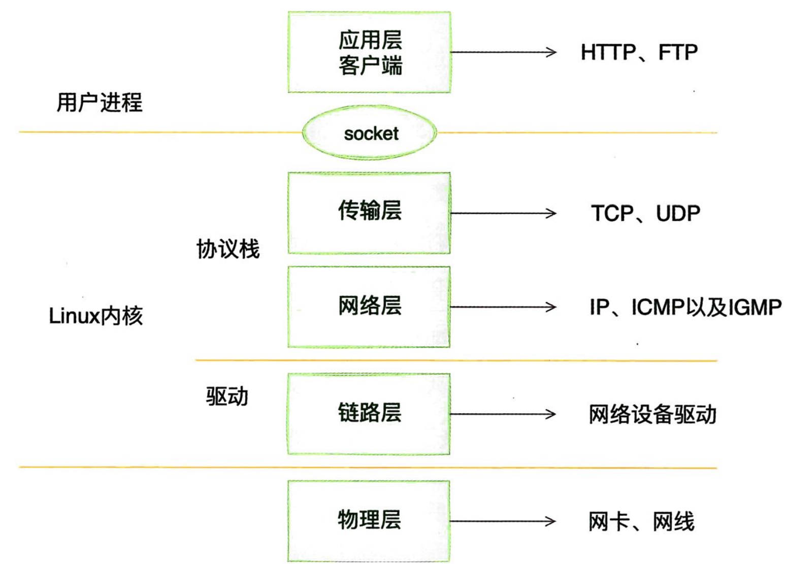
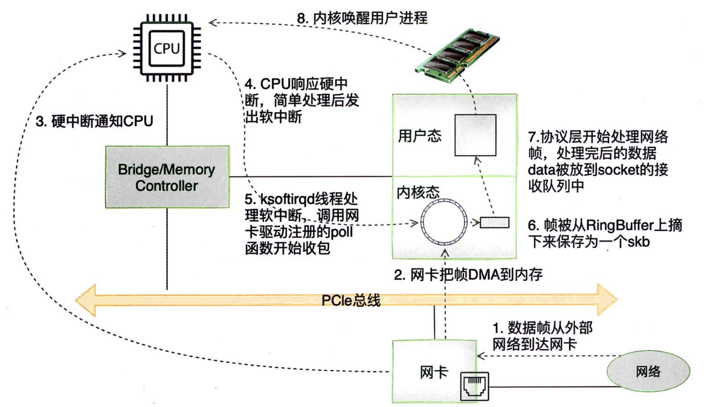

# 一、内核如何接收网络包

## 1、Linux网络收包

在TCP/P⽹络分层模型⾥，整个协议栈被分成了物理层、链路层、⽹络层、传输层和应⽤层。应⽤层对应的是常见的Nginx、FTP等各种应⽤，也包括我们写的各种服务端程序。

Linux内核以及⽹卡驱动主要实现链路层、⽹络层和传输层这三层上的功能，内核为更上⾯的应⽤层提供socket接⼜来⽀持⽤户进程访问。以Linux的视⾓看到的TCP/P⽹络分层模型应该是下图：

在Linux的源码中，⽹络设备驱动对应的逻辑位于`driver/net/ethernet`，其中Intel系列⽹卡的驱动在`driver/net/ethernetintel`⽬录下，协议栈模块代码位于kerel和net⽬录下。

内核和⽹络设备驱动是通过中断的⽅式来处理的；
- 当设备上有数据到达时，会给CPU的相关引脚触发⼀个电压变化，以通知CPU来处理数据；
- Linux中断处理函数是分上半部和下半部的：
    - 上半部只进⾏最简单的⼯作，快速处理然后释放CPU，接着CPU就可以允许其他中断进来；
    - 将剩下的绝⼤部分的⼯作都放到下半部，可以慢慢、从容处理。
- 2.4以后的Linux内核版本采⽤的下半部实现⽅式是软中断，由ksoftirad内核线程全权处理。硬

中断分为硬中断和软中断
- 硬中断：通过给CPU物理引脚施加电压变化实现的；
- 软中断：通过给内存中的⼀个变量赋予⼆进制值以标记有软中断发⽣。

内核收包的路径示意图：

- 当⽹卡收到数据以后，以DMA的⽅式把⽹卡收到的帧写到内存⾥，再向CPU发起⼀个中断，以通知CPU有数据到达。
- 当CPU收到中断请求后，会去调⽤⽹络设备驱动注册的中断处理西数。⽹卡的中断处理函数并 不做过多⼯作，发出软中断请求，然后尽快释放CPU资源。
- ksoftirad内核线程检测到有软中断请求到达，调⽤poll开始轮询收包，收到后交由各级协议栈处理。
- 对于TCP包来说，会被放到⽤户socker的接收队列中。
