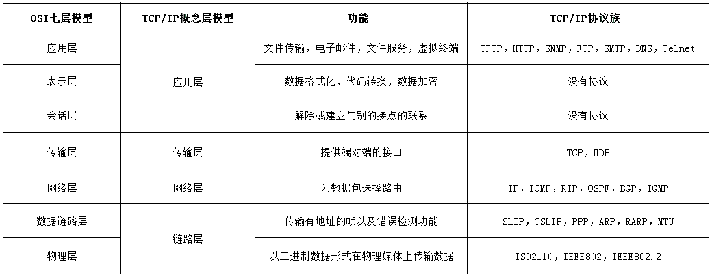

# 一、OSI 七层模型

* [OSI七层模型图解](http://www.cnblogs.com/lemo-/p/6391095.html)

## 1、OSI(Open System Interconnection)

称为开放式系统互联参考模型，针对广域网通信进行设计的，将整个网络通信分为7个层次：物理层、数据链路层、网络层、传输层、会话层、表示层、应用层.

- OSI 低四层（从物理层到传输层）定义了如何进行端到端的数据传输，也就是定义了如何通过网卡、物理电缆、交换机和路由器进行数据传输；
- 而高三层(从会话层到应用层)定义了终端系统的应用程序和用户如何彼此通信，即定义了如何重建从发送方到目的方的应用程序数据流；



### 1.1、物理层

是所有计算机网络体系结构的最底层，为所有网络/数据通信提供物理的通信线路。是用来构建计算机网络通信和数据传输的通道的。中继器，集线器、网线、HUB

### 1.2、数据链路层

控制网络层与物理层之间的通信，提供点对点的数据传输通道，通过MAC地址寻址把数据传到目的节点。为了保证传输，从网络层接收到的数据被分割成特定的可被物理层传输的帧。

- 数据链路层在不可靠的物理介质上提供可靠的传输。该层的作用包括：物理地址寻址、数据的成帧、流量控制、数据的检错、重发等
- 据链路层协议的代表包括：SDLC、HDLC、PPP、STP、帧中继等；
- 数据链路可以分为逻辑链路和物理链路。网卡，网桥，交换机

### 1.3、网络层

- 其主要功能是将网络地址翻译成对应的物理地址，并决定如何将数据从发送方路由到接收方
- 在网络中，"路由"是基于编址方案、使用模式以及可达性来指引数据的发送.
- 网络层是可选的，它只用于当两个计算机系统处于不同的由路由器分割开的网段这种情况，或者当通信应用要求某种网络层或传输层提供的服务、特性或者能力时

### 1.4、传输层

- 以端到端方式建立数据传输连接和通信，屏蔽途径网络中所有低层服务上的差异
- 以数据段为基本格式提供流量控制，拥塞控制和差错控制
- 传输层的协议：TCP，UDP
- 作用：传输层为它上面的应用层提供通信服务；
- 在OSI七层参考模型中，传输层是面向通信的最高层，也是用户功能的最底层；
- 传输层两大重要的功能：复用 和 分用
    * 复用：在发送端，多个应用进程共用一个传输层；
    * 分用：在接收端，传输层会根据端口号将数据分派给不同的应用进程.
- 和网络层的区别
    * 网络层为不同主机提供通信服务，而传输层为不同主机的不同应用提供通信服务；
    * 网络层只对报文头部进行差错检测，而传输层对整个报文进行差错检测

### 1.5、会话层

- 维护通信双方应用进程会话；管理双方数据交换进程
- 建立通信链接，保持会话过程通信链接的畅通，同步两个节点之间的对话，决定通信是否被中断以及通信中断时决定从何处重新发送，SESSION认证、断点续传

### 1.6、表示层
 
 数据将按照网络能理解的方案进行格式化
- 数据格式转换，数据加密与解密，数据压缩与解压缩

### 1.7、应用层

是最靠近用户的OSI层
- 负责接受用户的各种网络应用进程的调用；
- 协议：FTP，SMTP，HTTP

## 2、TCP/IP 协议

TCP/IP 协议体系结构，是专门针对使用TCP/IP 协议簇的广域网计算机网络而开发的。其只划分了四层：应用层、传输层、网络层、网络访问层；相比较与OSI七层模型，这里少了会话层和表示层

- 应用层：将OSI参考模型中的会话层和表示层的功能合并到应用层实现
- 传输层：传输层的功能是使源端主机和目标端主机上的对等实体可以进行会话
- 网络层：
    - 网络互连层是整个 TCP/IP 协议栈的核心.它的功能是把分组发往目标网络或主机
    - 定义了分组格式和协议，即IP协议(Internet Protocol)
- 网络访问层


## 3、层与层之间的关系

只要是在网络上跑的包，都是完整的。可以有下层没上层，绝对不可能有上层没下层。对 TCP 协议来说，三次握手也好，重试也好，只要想发出去包，就要有 IP 层和 MAC 层，不然是发不出去的。

所以如果一个 HTTP 协议的包跑在网络上，它一定是完整的。无论这个包经过哪些设备，它都是完整的。

所谓的二层设备、三层设备，都是这些设备上跑的程序不同而已。一个 HTTP 协议的包经过一个二层设备，二层设备收进去的是整个网络包。这里面 HTTP、TCP、 IP、 MAC 都有。什么叫二层设备呀，就是只把 MAC 头摘下来，看看到底是丢弃、转发，还是自己留着。那什么叫三层设备呢？就是把 MAC 头摘下来之后，再把 IP 头摘下来，看看到底是丢弃、转发，还是自己留着

# 二、物理层与数据链路层

# 三、网络层

主要协议IP协议

## 1、查看与配置IP地址

### 1.1、查看IP地址

- windows：ipconfig
- Linux：ifconfig、 ip addr

ip地址是一个网卡在网络世界的通信地址；

**`ifconfig` 和 `ip addr` 的区别**
```
[root@bluefish ~]# ifconfig
docker0: flags=4099<UP,BROADCAST,MULTICAST>  mtu 1500
        inet 172.17.0.1  netmask 255.255.0.0  broadcast 172.17.255.255
        inet6 fe80::42:78ff:fea3:7217  prefixlen 64  scopeid 0x20<link>
        ether 02:42:78:a3:72:17  txqueuelen 0  (Ethernet)
        RX packets 16949  bytes 3973836 (3.7 MiB)
        RX errors 0  dropped 0  overruns 0  frame 0
        TX packets 18295  bytes 2207308 (2.1 MiB)
        TX errors 0  dropped 0 overruns 0  carrier 0  collisions 0

eth0: flags=4163<UP,BROADCAST,RUNNING,MULTICAST>  mtu 1500
        inet 10.0.4.10  netmask 255.255.252.0  broadcast 10.0.7.255
        inet6 fe80::5054:ff:fef8:3b51  prefixlen 64  scopeid 0x20<link>
        ether 52:54:00:f8:3b:51  txqueuelen 1000  (Ethernet)
        RX packets 15561713  bytes 5072216736 (4.7 GiB)
        RX errors 0  dropped 0  overruns 0  frame 0
        TX packets 14174378  bytes 2528898689 (2.3 GiB)
        TX errors 0  dropped 0 overruns 0  carrier 0  collisions 0

lo: flags=73<UP,LOOPBACK,RUNNING>  mtu 65536
        inet 127.0.0.1  netmask 255.0.0.0
        inet6 ::1  prefixlen 128  scopeid 0x10<host>
        loop  txqueuelen 1000  (Local Loopback)
        RX packets 3187  bytes 400754 (391.3 KiB)
        RX errors 0  dropped 0  overruns 0  frame 0
        TX packets 3187  bytes 400754 (391.3 KiB)
        TX errors 0  dropped 0 overruns 0  carrier 0  collisions 0

[root@bluefish ~]# ip addr
1: lo: <LOOPBACK,UP,LOWER_UP> mtu 65536 qdisc noqueue state UNKNOWN group default qlen 1000
    link/loopback 00:00:00:00:00:00 brd 00:00:00:00:00:00
    inet 127.0.0.1/8 scope host lo
       valid_lft forever preferred_lft forever
    inet6 ::1/128 scope host 
       valid_lft forever preferred_lft forever
2: eth0: <BROADCAST,MULTICAST,UP,LOWER_UP> mtu 1500 qdisc mq state UP group default qlen 1000
    link/ether 52:54:00:f8:3b:51 brd ff:ff:ff:ff:ff:ff
    inet 10.0.4.10/22 brd 10.0.7.255 scope global eth0
       valid_lft forever preferred_lft forever
    inet6 fe80::5054:ff:fef8:3b51/64 scope link 
       valid_lft forever preferred_lft forever
3: docker0: <NO-CARRIER,BROADCAST,MULTICAST,UP> mtu 1500 qdisc noqueue state DOWN group default 
    link/ether 02:42:78:a3:72:17 brd ff:ff:ff:ff:ff:ff
    inet 172.17.0.1/16 brd 172.17.255.255 scope global docker0
       valid_lft forever preferred_lft forever
    inet6 fe80::42:78ff:fea3:7217/64 scope link 
       valid_lft forever preferred_lft forever
```
在 IP 地址的后面有个 scope，对于 eth0 这张网卡来讲，是 global，说明这张网卡是可以对外的，可以接收来自各个地方的包。对于 lo 来讲，是 host，说明这张网卡仅仅可以供本机相互通信。lo 全称是 loopback，又称环回接口，往往会被分配到 127.0.0.1 这个地址。这个地址用于本机通信，经过内核处理后直接返回，不会在任何网络中出现

### 1.2、配置IP地址

可以使用 `ifconfig`，也可以使用 `ip addr`：
```bash
# 使用 net-tools：
$ sudo ifconfig eth1 10.0.0.1/24
$ sudo ifconfig eth1 up

# 使用 iproute2：
$ sudo ip addr add 10.0.0.1/24 dev eth1
$ sudo ip link set up eth1
```
？？问题：旁边的机器都是 `192.168.1.x`，非得配置一个 `16.158.23.6`，会出现什么现象呢？不会出现任何现象，就是包发不出去呗
- Linux 首先会判断，要去的这个地址和我是一个网段的吗，或者和我的一个网卡是同一网段的吗？只有是一个网段的，它才会发送 ARP 请求，获取 MAC 地址。
- 如果发现不是呢？Linux 默认的逻辑是，如果这是一个跨网段的调用，它便不会直接将包发送到网络上，而是企图将包发送到网关。

如果配置了网关的话，Linux 会获取网关的 MAC 地址，然后将包发出去。对于 `192.168.1.6` 这台机器来讲，虽然路过它家门的这个包，目标 IP 是它，但是无奈 MAC 地址不是它的，所以它的网卡是不会把包收进去的。如果没有配置网关呢？那包压根就发不出去。

当需要手动配置一台机器的网络 IP 时，一定要问网络管理员。如果在机房里面，要去网络管理员那里申请，让他给分配一段正确的 IP 地址。当然，真正配置的时候，一定不是直接用命令配置的，而是放在一个配置文件里面。不同系统的配置文件格式不同，但是无非就是 CIDR、子网掩码、广播地址和网关地址

## 2、IP地址

- [RFC 1518 - An Architecture for IP Address Allocation with CIDR](https://datatracker.ietf.org/doc/html/rfc1518)
- [RFC 4632 - Classless Inter-domain Routing (CIDR): The Internet Address Assignment and](https://datatracker.ietf.org/doc/html/rfc4632)
- [如何用CIDR有效地分配IP地址](https://zhuanlan.zhihu.com/p/653867707)

`IP`地址是指互联网协议地址`（Internet Protocol Address）`，是IP Address的缩写。IP地址是IP协议提供的一种统一的地址格式，它为互联网上的每一个网络和每一台主机分配一个逻辑地址，以此来屏蔽物理地址的差异

IP地址的：A、B、C三类地址

类别|IP地址范围|最大主机数|私有IP地址范围
----|--------|--------|------------
A|0.0.0.0-127.255.255.255|16777214|10.0.0.0-10.255.255.255
B|128.0.0.0-191.255.255.255|65534|172.16.0.0-172.31.255.255
C|192.0.0.0-223.255.255.255|254|192.168.0.0-192.168.255.255

- [CIDR-无类型域间选路](https://zh.wikipedia.org/wiki/%E6%97%A0%E7%B1%BB%E5%88%AB%E5%9F%9F%E9%97%B4%E8%B7%AF%E7%94%B1)：这种方式打破了原来的几类地址做法，将32位的IP地址一分为二，前面是网络号，后面的是主机号.

    比如IP地址：`10.100.122.2/24`，这个 IP 地址中有一个斜杠，斜杠后面有个数字 24。这种地址表示形式，就是 CIDR。后面 24 的意思是，32 位中，前 24 位是网络号，后 8 位是主机号

    伴随着CIDR存在的，一个是广播地址，`10.100.122.255`，如果发送这个地址，所有`10.100.122`网络里面的机器都可以收到。另一个是子网掩码，`255.255.255.0`；

    将子网掩码和IP地址进行 AND计算，前面三个是255，转成二进制都是`1`。`1`和任何数值取AND都是原来数值，因而前面三个数都不变，为`10.100.122` 。后面一个0转成二进制是0，0和任何数值取AND，都是0，因而最后一个数变为0，合起来是`10.100.122.0`.这是网络号，将`子网掩码`和`IP地址`按位计算AND，就可得到网络号

- 如果主机号全是1，那么这个地址为直接广播地址；
- IP地址`255.255.255.255`为受限广播地址；

？？给到一个CIDR：`16.158.165.91/22`，求一下这个网络的第一个地址、子网掩码和广播地址；

`/22` 不是 8 的整数倍，不好办，只能先变成二进制来看。`16.158` 的部分不会动，它占了前 16 位。中间的 `165`，变为二进制为`10100101`。除了前面的 `16` 位，还剩 `6` 位。所以，这 `8` 位中前 `6` 位是网络号，`16.158.<101001>`，而 `<01>.91` 是机器号。第一个地址是 `16.158.<101001><00>.1`，即 `16.158.164.1`。子网掩码是 `255.255.<111111><00>.0`，即 `255.255.252.0`。广播地址为 `16.158.<101001><11>.255`，即 `16.158.167.255`

## 3、公有IP与私有IP

- 上述表格最右列是私有 IP 地址段
- 公有 IP 地址有个组织统一分配，你需要去买

表格中的 `192.168.0.x` 是最常用的私有 IP 地址。家里有 Wi-Fi，对应就会有一个 IP 地址。一般你家里地上网设备不会超过 256 个，所以 `/24` 基本就够了。有时候我们也能见到 `/16` 的 CIDR，这两种是最常见的，也是最容易理解的

不需要将十进制转换为二进制 32 位，就能明显看出 192.168.0 是网络号，后面是主机号。而整个网络里面的第一个地址 192.168.0.1，往往就是你这个私有网络的出口地址。例如，你家里的电脑连接 Wi-Fi，Wi-Fi 路由器的地址就是 192.168.0.1，而 192.168.0.255 就是广播地址。一旦发送这个地址，整个 192.168.0 网络里面的所有机器都能收到

## 4、Mac地址

`MAC`地址又称为物理地址、硬件地址，用来定义网络设备的位置。网卡的物理地址通常是由网卡生产厂家烧入网卡的，具有全球唯一性。`MAC`地址用于在网络中唯一标示一个网卡，一台电脑会有一或多个网卡，每个网卡都需要有一个唯一的`MAC`地址；**MAC 地址更像是身份证，是一个唯一的标识**。它的唯一性设计是为了组网的时候，不同的网卡放在一个网络里面的时候，可以不用担心冲突。从硬件角度，保证不同的网卡有不同的标识

在 IP 地址的上一行是 `link/ether 52:54:00:f8:3b:51 brd ff:ff:ff:ff:ff:ff`，这个被称为 MAC 地址，是一个网卡的物理地址，用十六进制，6 个 byte 表示。

MAC 地址的通信范围比较小，局限在一个子网里面。例如，从 192.168.0.2/24 访问 192.168.0.3/24 是可以用 MAC 地址的。一旦跨子网，即从 192.168.0.2/24 到 192.168.1.2/24，MAC 地址就不行了，需要 IP 地址起作用了

IP地址与Mac地址区别：
- IP地址一般是可以改动的，MAC则是生产厂商烧录好的，一般不能改动；
- 长度不同：IP地址为32位，MAC地址为48位；
- 分配依据不同：IP地址的分配是基于网络拓扑，MAC地址的分配是基于制造商；
- 寻址协议层不同：IP地址应用于OSI第三层，即网络层；而MAC地址应用在OSI第二层，即数据链路层
    - 数据链路层协议可以使数据从一个节点传递到相同链路的另一个节点上（通过MAC地址）；
    - 网络层协议使数据可以从一个网络传递到另一个网络上（ARP根据目的IP地址，找到中间节点的MAC地址，通过中间节点传送，从而最终到达目的网络）

## 5、网络设备的状态标识

上面`<BROADCAST,MULTICAST,UP,LOWER_UP>`是什么意思呢？叫做 `net_device flags`，网络设备的状态标识
- UP 表示网卡处于启动的状态；
- BROADCAST 表示这个网卡有广播地址，可以发送广播包；
- MULTICAST 表示网卡可以发送多播包；
- LOWER_UP 表示 L1 是启动的，也即网线插着呢。

MTU1500 是指什么意思呢？是哪一层的概念呢？最大传输单元 MTU 为 1500，这是以太网的默认值。MTU 是二层 MAC 层的概念。MAC 层有 MAC 的头，以太网规定正文部分不允许超过 1500 个字节。正文里面有 IP 的头、TCP 的头、HTTP 的头。如果放不下，就需要分片来传输。

## 4、DHCP

自动配置的协议，也就是动态主机配置协议（Dynamic Host Configuration Protocol），简称 DHCP

如果是数据中心里面的服务器，IP 一旦配置好，基本不会变，这就相当于买房自己装修。DHCP 的方式就相当于租房。不用装修，都是配置好的。暂时用一下，用完退租就可以了。

解析 DHCP 的工作方式：
- 新来的机器使用 IP 地址 `0.0.0.0` 发送了一个广播包，目的 IP 地址为 `255.255.255.255`。广播包封装了 UDP，UDP 封装了 BOOTP。其实 DHCP 是 BOOTP 的增强版，但是如果去抓包的话，很可能看到的名称还是 BOOTP 协议

## 4、IPV6

- 总共有128位长，一般采用32个十六进制数表示

## 5、private ip

- [私网地址分配](https://datatracker.ietf.org/doc/html/rfc1918)

如何判断内外网，可以通过私网地址来处理

# 四、传输层

[传输层协议](./网络协议_传输层.md)

# 五、应用层

[应用层协议](./网络协议_应用层.md)

# 六、更多

## 1、CDN

- [Content_delivery_network-内容分发网络](https://en.wikipedia.org/wiki/Content_delivery_network)

## 2、VPN

- [Virtual Private Network](https://en.wikipedia.org/wiki/Virtual_private_network)

VPN，全名 Virtual Private Network，虚拟专用网，就是利用开放的公众网络，建立专用数据传输通道，将远程的分支机构、移动办公人员等连接起来

### 2.1、VPN是如何工作的

VPN 通过隧道技术在公众网络上仿真一条点到点的专线，是通过利用一种协议来传输另外一种协议的技术，这里面涉及三种协议：乘客协议、隧道协议和承载协议

### 2.2、IPsec VPN

基于 IP 协议的安全隧道协议，为了保证在公网上面信息的安全，因而采取了一定的机制保证安全性

## 3、移动互联网

- [移动互联网概括](https://time.geekbang.com/column/article/10534)

# 七、Websocket

- [推送业务](../../实际业务/业务系统.md二十五推送)
- [socket.io协议-基于websocket协议](https://socket.io/docs/v4/)
- [实现了 socket.io 协议框架：netty-socket.io](https://github.com/mrniko/netty-socketio)
- [实现web实时消息推送的方案](https://juejin.cn/post/7122014462181113887)
- [SpringBoot-realtime-data](https://github.com/chengxy-nds/Springboot-Notebook/tree/master/springboot-realtime-data)
- [微信支付宝-第三方对接](https://github.com/zxhTom/three-party)
- [t-io-高性能网络编程框架](https://github.com/chenlanqing/t-io)
- [Java-WebSocket](https://github.com/TooTallNate/Java-WebSocket)
- [Server-send events:SSE-实现服务器向客户端实时推送数据的Web技术](https://en.wikipedia.org/wiki/Server-sent_events)
- [构建通用WebSocket推送网关的设计与实践](https://mp.weixin.qq.com/s/tqJCzW0WI9mtZGCfaOMp3g)
- [如何封装 websocket 以支撑不同业务的消息即时通讯？](https://mp.weixin.qq.com/s/cSe2k51oMqEFIXs6_vkk5g)
- [WebSocket通信原理和在Tomcat中实现源码详解](https://mp.weixin.qq.com/s/5Oq5gu_rWIC-LNa8oip_lA)
- [石墨文档Websocket百万长连接技术实践](https://mp.weixin.qq.com/s/JLKbE-fsrjQNiMZH5mIX3g)
- [SpringBoot生产级WebSocket集群实践](https://mp.weixin.qq.com/s/ULSr41Iwg5II-ts1osWl4A)
- [爱奇艺WebSocket实时推送网关技术实践](https://mp.weixin.qq.com/s/5ZUn41iVnJi3_kQ1wW5v6w)

## 1、概述

- 定义：一种浏览器与服务器间进行全双工通信的网络技术。

- 特点：
    - 单一的TCP连接，采用全双工模式通信；
    - 与 HTTP 协议有着良好的兼容性。默认端口也是80和443，并且握手阶段采用 HTTP 协议，因此握手时不容易屏蔽，能通过各种 HTTP 代理服务器
    - 对代理、防火墙和路由器透明；
    - 无头部信息、Cookie和身份验证；
    - 无安全开销；
    - 通过“ping、pong”帧保持链路激活；
    - 服务器可以主动向客户端推送信息，客户端也可以主动向服务器发送信息

## 2、请求头描述

请求头里多了个：`Upgrade: websocket`，其状态码是101，表示切换协议

```
Host: localhost:8899
User-Agent: Mozilla/5.0 (Macintosh; Intel Mac OS X 10.14; rv:67.0) Gecko/20100101 Firefox/67.0
Accept: */*
Accept-Language: zh-CN,en-US;q=0.8,zh;q=0.7,zh-TW;q=0.5,zh-HK;q=0.3,en;q=0.2
Accept-Encoding: gzip, deflate
Sec-WebSocket-Version: 13
Origin: http://localhost:63342
Sec-WebSocket-Extensions: permessage-deflate
Sec-WebSocket-Key: AvBJ2EjDQly6a9fhe2rfSw==
Connection: keep-alive, Upgrade
Cookie: Idea-d4397cc9=4ac67172-7de1-4b51-beee-bc66c0088011
Pragma: no-cache
Cache-Control: no-cache
Upgrade: websocket
```

# 八、其他

## 1、网络请求过程

**问题：从输入url到页面展示到底发生了什么**

总体来说，可以分为以下几个过程：
- DNS解析
- TCP连接
- 发送HTTP请求
- 服务器处理请求并返回HTTP报文
- 浏览器解析渲染页面
- 连接结束

### 1.1、DNS解析过程

#### 1.1.1、DNS解析

DNS解析的过程就是寻找哪台机器上有你需要资源的过程；

当你在浏览器中输入一个地址时，例如`www.baidu.com`，其实不是百度网站真正意义上的地址。互联网上每一台计算机的唯一标识是它的IP地址，但是IP地址并不方便记忆。用户更喜欢用方便记忆的网址去寻找互联网上的其它计算机，也就是上面提到的百度的网址。所以互联网设计者需要在用户的方便性与可用性方面做一个权衡，这个权衡就是一个网址到IP地址的转换，这个过程就是DNS解析。它实际上充当了一个翻译的角色，实现了网址到IP地址的转换

#### 1.1.2、解析过程

[解析过程](#2DNS解析过程)

#### 1.1.3、DNS优化

- DNS缓存

    DNS存在着多级缓存，从离浏览器的距离排序的话，有以下几种: 浏览器缓存、系统缓存、路由器缓存、IPS服务器缓存、根域名服务器缓存、顶级域名服务器缓存、主域名服务器缓存

- [DNS负载均衡](#5DNS负载均衡)

### 1.2、TCP连接

HTTP协议是使用TCP作为其传输层协议的，有[TCP三次握手](#6TCP建立连接-三次握手)和[TCP四次挥手](#7TCP连接释放-四次挥手)

#### 1.1.3、发送HTTP请求

重定向、请求头、请求体、长连接与短连接、HTTPS、反向代理

从TCP编程看HTTP请求：
- Server端创建新的Socket；将Socket绑定到端口80上；允许Socket进行连接，等待连接；
- Client端获取ip地址和端口号；创建新的Socket；连接到服务器:端口上；

### 1.4、服务器处理请求并返回HTTP报文

响应头、响应正文

### 1.5、浏览器解析渲染页面

### 1.6、网络请求过程其他问题

#### 1.6.1、一个TCP连接后是否会在一个HTTP请求完成后断开

默认情况下建立 TCP 连接不会断开，只有在请求报头中声明 Connection: close 才会在请求完成后关闭连接。

因为每次请求都会重新建立和断开 TCP 连接，代价过大

#### 1.6.2、一个TCP对应多少个Http连接

如果维持连接，一个 TCP 连接是可以发送多个 HTTP 请求的

#### 1.6.4、一个 TCP 连接中 HTTP 请求发送可以一起发送么

- 维持和服务器已经建立的 TCP 连接，在同一连接上顺序处理多个请求。
- 和服务器建立多个 TCP 连接


# 参考资料

* [网络分层架构-REST架构演化](https://ics.uci.edu/~fielding/pubs/dissertation/top.htm)
* [程序员如何学习和构建网络知识体系](https://plantegg.github.io/2020/05/24/程序员如何学习和构建网络知识体系/)
* [前端常见跨域解决方案](https://segmentfault.com/a/1190000011145364)
* [《网络是怎样连接的》](https://book.douban.com/subject/26941639/)
* [《Wireshark 网络分析就这么简单》](https://book.douban.com/subject/26268767/)
* [《Wireshark 网络分析的艺术》](https://book.douban.com/subject/26710788/)
* [Optimizing TCP for high WAN throughput while preserving low latency](https://blog.cloudflare.com/optimizing-tcp-for-high-throughput-and-low-latency/)

