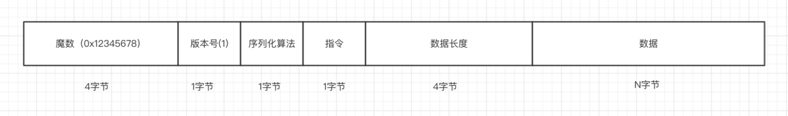

# 一、跨域

## 1、跨域问题

### 1.1、什么是跨域

跨域是指一个域下的文档或脚本试图去请求另一个域下的资源。是因为JavaScript同源策略的限制，a.com 域名下的js无法操作b.com或是c.a.com域名下的对象。两个域具有相同的协议(如http)， 相同的端口(如80)，相同的host(如www.example.org)，那么我们就可以认为它们是相同的域，比如 `http://www.example.org/index.html`和`http://www.example.org/sub/index.html`是同域，而 `http://www.example.org`、`https://www.example.org`、`http://www.example.org：8080`、`http://sub.example.org`中的任何两个都将构成跨域；

### 1.2、广义的跨域


- 资源跳转：A 链接，重定向，表单提交
- 资源嵌入：`<link>`，`<script>`，``，`<frame>`等dom标签，还有样式中的`background：url()`，`@font-face`等文件外链；
- 脚本请求：js发起的ajax请求，dom和js的跨域操作；

我们常说的跨域是狭义的，是由浏览器同源策略限制的一类请求场景

### 1.3、什么是同源策略：(SOP-Same Origin Policy)

- 同源策略是一种约定，是浏览器最核心的也是最基本的安全功能，如果缺少同源策略很容易收到XSS，CSRF 攻击。所谓同源，即"协议+域名+端口"三者相同，即使是两个不同的域名指向同一个IP地址，也非同源
- 同源策略限制以下行为：
    - cookie，localString 和indexDb无法读取；
    - dom和js对象无法获得
    - ajax请求不能发送

### 1.4、常见跨域场景

URL                           |           说明                  |  是否允许通信
------------------------------|--------------------------------|-------------
http://www.domain.com/a.js <br> http://www.domain.com/b.js <br> http://www.domain.com/lab/c.js | 同一域名，不同文件或路径 |允许
http://www.domain.com：8000/a.js <br> http://www.domain.com/b.js |同一域名，不同端口 |不允许
http://www.domain.com/a.js <br> https://www.domain.com/b.js    | 同一域名，不同协议|不允许
http://www.domain.com/a.js <br> http://192.168.4.12/b.js    |域名和域名对应相同ip |不允许
http://www.domain.com/a.js <br> http://x.domain.com/b.js <br> http://domain.com/c.js |主域相同，子域不同 |不允许
http://www.domain1.com/a.js <br>  http://www.domain2.com/b.js |不同域名|不允许

## 2、常见跨域解决方案

### 2.1、通过jsonp跨域

- 通常为了减轻web服务器的负载，我们把js、css、img等静态资源分离到另一台独立域名的服务器上，在html页面中再通过相应的标签从不同域名下加载静态资源，而被浏览器允许.基于此原理.我们可以通过动态创建script.再请求一个带参网址实现跨域通信.
- 原生实现：
```html
    <script>
        var script = document.createElement('script')；
        script.type = 'text/javascript'；
        // 传参并指定回调执行函数为onBack
        script.src = 'http://www.domain2.com：8080/login?user=admin&callback=onBack'；
        document.head.appendChild(script)；
        // 回调执行函数
        function onBack(res) {
            alert(JSON.stringify(res))；
        }
    </script>
    服务端返回如下：
    onBack({"status"： true， "user"： "admin"})
```
- jQuery实现：
```javascript
    $.ajax({
        url： 'http://www.domain2.com：8080/login'，
        type： 'get'，
        dataType： 'jsonp'，  // 请求方式为jsonp
        jsonpCallback： "onBack"，    // 自定义回调函数名
        data： {}
    })；
```
- 缺点：只能实现get一种请求

### 2.2、document.domain + iframe跨域：此方案仅限主域相同，子域不同的跨域应用场景

- 实现原理：两个页面都通过js强制设置document.domain为基础主域，就实现了同域.
- 父窗口：(http://www.domain.com/a.html)
    ```html
    <iframe id="iframe" src="http://child.domain.com/b.html"></iframe>
    <script>
        document.domain = 'domain.com'；
        var user = 'admin'；
    </script>
    ```
- 子窗口：(http://child.domain.com/b.html)
    ```html
    <script>
        document.domain = 'domain.com'；
        // 获取父窗口中变量
        alert('get js data from parent ---> ' + window.parent.user)；
    </script>
    ```

### 2.3、location.hash + iframe

- 实现原理：a欲与b跨域相互通信，通过中间页c来实现. 三个页面.不同域之间利用iframe的location.hash传值.相同域之间直接js访问来通信
- 具体实现：A域：a.html ---> B域：b.html ---> A域：c.html，a与b不同域只能通过hash值单向通信，b与c也不同域也只能单向通信，但c与a同域，所以c可通过parent.parent访问a页面所有对象
- 

### 2.4、window.name + iframe跨域

### 2.5、postMessage跨域

### 2.6、跨域资源共享(CORS)

- [跨域资源共享 CORS 详解](https://www.ruanyifeng.com/blog/2016/04/cors.html)

[Cross-Origin Resource Sharing](https://developer.mozilla.org/en-US/docs/Web/HTTP/CORS)，是一个系统，它由一系列传输的HTTP头组成，这些HTTP头决定浏览器是否阻止前端 JavaScript 代码获取跨域请求的响应

CORS 实现起来非常方便，只需要增加一些 HTTP 头，让服务器能声明允许的访问来源，只要后端实现了 CORS，就实现了跨域

请求头部：
- [Origin（RFC6454）](https://www.rfc-editor.org/rfc/rfc6454)：一个页面的资源可能来自于多个域名，在 AJAX 等子请求中标明来 源于某个域名下的脚本，以通过服务器的安全校验
    - `origin = "Origin:" OWS origin-list-or-null OWS`
    - `origin-list-or-null = %x6E %x75 %x6C %x6C / origin-list`
    - `origin-list = serialized-origin *( SP serialized-origin )`
    - `serialized-origin = scheme "://" host [ ":" port ]`
- `Access-Control-Request-Method`：在 preflight 预检请求 (OPTIONS) 中，告知服务器接下来的请求会使用哪些方法
- `Access-Control-Request-Headers`：在 preflight 预检请求 (OPTIONS) 中，告知服务器接下来的请求会传递哪些头部；

响应头部：
- `Access-Control-Allow-Methods`：在 preflight 预检请求的响应中，告知客户端后续请求允许使用的方法；
- `Access-Control-Allow-Headers`：在 preflight 预检请求的响应中，告知客户端后续请求允许携带的头部；
- `Access-Control-Max-Age`：在 preflight 预检请求的响应中，告知客户端该响应的信息可以缓存多久；
- `Access-Control-Expose-Headers`：告知浏览器哪些响应头部可以供客户端使用，默认情况下只有 Cache-Control、Content-Language、 Content-Type、Expires、Last-Modified、Pragma 可供使用
- `Access-Control-Allow-Origin`：告知浏览器允许哪些域访问当前资源，*表示允许所有域。为避免缓存错乱，响应中需要携带 Vary: Origin
- `Access-Control-Allow-Credentials`：告知浏览器是否可以将 Credentials 暴露给客户端使用，Credentials 包含 cookie、authorization 类头部、 TLS证书等。


### 2.7、nginx代理跨域

### 2.8、nodejs中间件代理跨域

### 2.9、WebSocket 协议跨域

### 2.10、JSON Web Token（JWT）

# 二、网络代理

## 1、概述

与网络转发的区别：

网络代理的类型：
- 正向代理
- 反向代理

[正向代理与反向代理](../Java/分布式/Nginx.md#5正向代理与反向代理)

#  三、通信协议设计

- [应用层 Protocol 的标准设计](https://xie.infoq.cn/article/ad938fbe0c2bf94a015b43366)

## 1、通信协议设计



- 第一个字段是魔数，通常情况下为固定的几个字节。通过这个魔数，服务端首先取出该数据进行对比，能在第一时间识别该数据是否为遵循自定义的协议，也就是无效数据包；
- 第二个字节为版本号，通常情况下是预留字段，用于协议升级的时候；
- 第三部分序列化话算法表示如何把Java对象转换二进制数据以及二进制数据如何转换回Java对象，比如Java自带的序列化，json等；
- 第四部分的字段表示指令，服务端或客户端每收到一种指令都会有相应的处理逻辑；
- 接下来的字段为数据部分的长度，占4个字节；
- 最后一个部分为数据内容；

常见的私有协议：[蚂蚁通信框架实践](https://mp.weixin.qq.com/s/JRsbK1Un2av9GKmJ8DK7IQ)、[蚂蚁金服SOFABolt](https://github.com/alipay/sofa-bolt)


# 四、MQTT协议

- [MQTT协议介绍](https://mcxiaoke.gitbooks.io/mqtt-cn/content/mqtt/01-Introduction.html)
- [MQTT协议中文版](https://github.com/mcxiaoke/mqtt)
- [moquette](https://github.com/moquette-io/moquette)
- [RabbitMQ与MQTT协议](https://juejin.im/post/6883273274248134663)
- [MQTT Quick start](https://www.emqx.com/en/blog/the-easiest-guide-to-getting-started-with-mqtt)

# 五、实时流协议-RTSP

RTSP (Real-Time Stream Protocol) 实时流传输协议是一种基于文本的应用层协议，常被用于 建立的控制媒体流的传输，该协议用于 C/S 模型 , 是一个 基于文本 的协议，用于在客户端和服务器端建立和协商实时流会话

# 六、RDMA网络

远程直接内存访问(即RDMA)是一种直接内存访问技术，它将数据直接从一台计算机的内存传输到另一台计算机，无需双方操作系统的介入

# 七、网络相关面试题

## 1、单台服务器最大TCP连接数

- [一台服务器，最大支持的TCP连接数是多少？](https://mp.weixin.qq.com/s/l9ggXLAEHp4LTjd2Qsyqtg)

- 文件句柄限制：每一个tcp连接都要占一个文件描述符，一旦这个文件描述符使用完了，新的连接到来返回给我们的错误是“Socket/File:Can't open so many files”

- 如何标识一个TCP连接：操作系统上端口号1024以下是系统保留的，从1024-65535是用户使用的；系统用一个4四元组来唯一标识一个TCP连接：`{local ip, local port,remote ip,remote port}`。好吧，我们拿出《UNIX网络编程：卷一》第四章中对accept的讲解来看看概念性的东西，第二个参数cliaddr代表了客户端的ip地址和端口号。而我们作为服务端实际只使用了bind时这一个端口，说明端口号65535并不是并发量的限制；

- server最大tcp连接数：server通常固定在某个本地端口上监听，等待client的连接请求。不考虑地址重用（unix的SO_REUSEADDR选项）的情况下，即使server端有多个ip，本地监听端口也是独占的，因此server端tcp连接4元组中只有remote ip（也就是client ip）和remote port（客户端port）是可变的，因此最大tcp连接为客户端ip数×客户端port数，对IPV4，不考虑ip地址分类等因素，最大tcp连接数约为2的32次方（ip数）×2的16次方（port数），也就是server端单机最大tcp连接数约为2的48次方；

理论上的单机TCP并发连接数可以达到：2的48次方，实际上单机并发连接数肯定要受硬件资源（内存）、网络资源（带宽）的限制

## 2、QQ采用的是什么协议

QQ既有UDP也有TCP！不管UDP还是TCP，最终登陆成功之后，QQ都会有一个TCP连接来保持在线状态。这个TCP连接的远程端口一般是80，采用UDP方式登陆的时候，端口是8000。

UDP协议是无连接方式的协议，它的效率高，速度快，占资源少，但是其传输机制为不可靠传送，必须依靠辅助的算法来完成传输控制。QQ采用的通信协议以UDP为主，辅以TCP协议。由于QQ的服务器设计容量是海量级的应用，一台服务器要同时容纳十几万的并发连接，因此服务器端只有采用UDP协议与客户端进行通讯才能保证这种超大规模的服务。

QQ客户端之间的消息传送也采用了UDP模式，因为国内的网络环境非常复杂，而且很多用户采用的方式是通过代理服务器共享一条线路上网的方式，在这些复杂的情况下，客户端之间能彼此建立起来TCP连接的概率较小，严重影响传送信息的效率。而UDP包能够穿透大部分的代理服务器，因此QQ选择了UDP作为客户之间的主要通信协议。

采用UDP协议，通过服务器中转方式。因此，现在的IP侦探在你仅仅跟对方发送聊天消息的时候是无法获取到IP的。大家都知道，UDP 协议是不可靠协议，它只管发送，不管对方是否收到的，但它的传输很高效。但是，作为聊天软件，怎么可以采用这样的不可靠方式来传输消息呢？于是，腾讯采用了上层协议来保证可靠传输：如果客户端使用UDP协议发出消息后，服务器收到该包，需要使用UDP协议发回一个应答包。如此来保证消息可以无遗漏传输。之所以会发生在客户端明明看到“消息发送失败”但对方又收到了这个消息的情况，就是因为客户端发出的消息服务器已经收到并转发成功，但客户端由于网络原因没有收到服务器的应答包引起的

## 3、网络相关性能指标

- 比特：比特(bit)是计算机中数据量的单位，也是信息论中使用的信息量的单位。英文单词bit来源于binary digit，意思是一个“二进制数字”。网络技术中的速率指的是连接在计算机网络上的主机在数字信道上传送数据的速率，它也称为数据率(data rate)或比特率(bit rate)；
- 带宽：在计算机网络中，带宽用来表示网络的通信线路传送数据的能力，因此网络带宽表示单位时间内从网络中的某一点到另一点所能通过的“最高数据率”。这种意义的带宽的单位是比特/秒；
- 吞吐量：吞吐量(throughput)表示在单位时间内通过某个网络（或信道、接口）的数据量，他表示当前网络传输数据的能力；
- 时延：
    - 发送时延：指主机或路由器发送数据帧所需要的时间，也就是从发送数据帧的第一个比特算起，到该帧的最后一个比特发送完毕所需要的时间；
    - 传播时延：指电磁波在信道中传播一定距离需要花费的时间；
- 时延带宽积」：时延带宽积表示链路可容纳的比特数，因此，链路的时延带宽积又称为以比特为单位的链路长度；
- 往返时间RTT：往返时间RTT，表示从发送方发送数据开始，到发送方收到来自接收方的确认（接收方收到数据后便立即发送确认），总共经历的时间。往返时间一般就会包括分组在网络中的各种时延；
- 利用率：利用率可以分为信道利用率和网络利用率两种。信道利用率指出某信道有百分之几的时间是被利用的（有数据通过）。完全空闲的信道的利用率是零。网络的利用率则是全网络的信道利用率的加权平均值。信道利用率并非越高越好，这是因为，根据排队论的理论，当某信道的利用率增大时，该信道引起的时延也会迅速增加。信道或网络的利用率过高会产生非常大的时延；

# 参考资料

* [低延时网络架构中使用的那些黑科技](https://mp.weixin.qq.com/s/FMOyYqUt251l67U3Ht5H1g?poc_token=HAktXWaj_4IKF0sPBXh4CllCmU36rWFHOS7axhOd)
