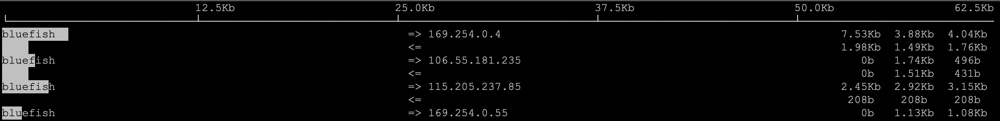
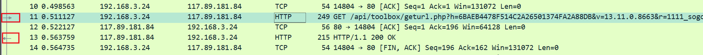
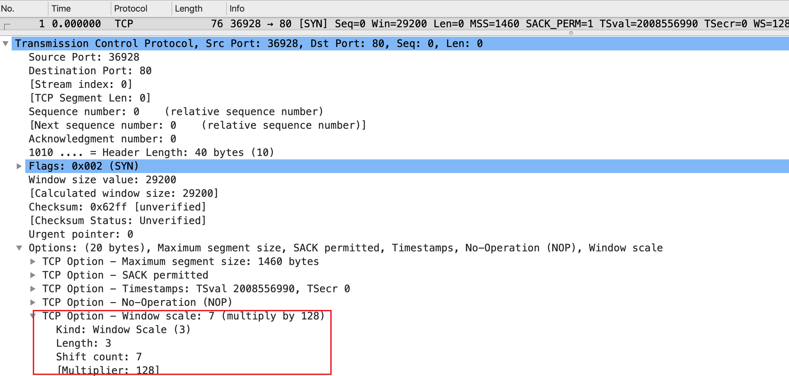
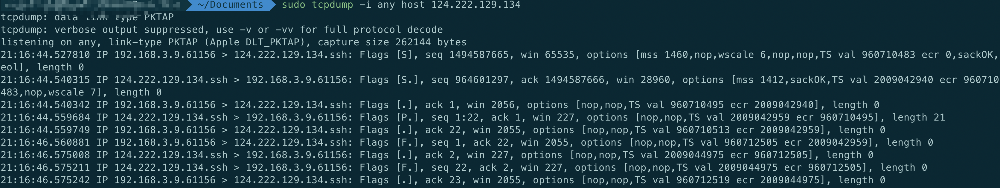

# 一、网络各层排查工具

## 1、应用层

Google浏览器的内置的开发者工具：Network、Security 等

## 2、表示层和会话层

TLS协议，主要工具
- 浏览器开发者工具：Security
- 关于 TLS 握手、密钥交换、密文传输等方面的排查，还是需要用 tcpdump 和 Wireshark 来做。在 Wireshark 中，可以更加全面地查看 TLS 细节。

## 3、传输层

### 3.1、路径可达性测试

测试TCP握手，可以有 telnet 和 nc 两个工具：
- `telnet www.baidu.com 443`
- `nc -w 2 -zv www.baidu.com 443`
```bash
[root@bluefish ~]# nc -w 2 -zv www.baidu.com 443
Ncat: Version 7.50 ( https://nmap.org/ncat )
Ncat: Connected to 180.101.50.188:443.
Ncat: 0 bytes sent, 0 bytes received in 0.01 seconds.
```

### 3.2、查看当前连接状况

可以使用 netstat，可以用来获取当前 TCP、UDP的连接信息：
```bash
[root@bluefish ~]# netstat -ant
Active Internet connections (servers and established)
Proto Recv-Q Send-Q Local Address           Foreign Address         State      
tcp        0      0 0.0.0.0:22              0.0.0.0:*               LISTEN     
tcp        0      0 10.0.4.10:22            217.215.28.96:58067     SYN_RECV   
tcp        0      0 127.0.0.1:25            0.0.0.0:*               LISTEN    
```

### 3.3、查看当前连接的传输速率

如果不知道哪个连接占用了大量带宽，可以使用 iftop ，需要手动安装这个命令，执行该命令需要 root权限



### 3.4、查看丢包和乱序等统计

netstat 除了可以获取实时连接状况，还可以获取历史统计信息，怀疑一台机器的网络很不稳定，除了用 ping 做简单的测试，还可以用 `netstat -s` 来获取更加详细的统计信息：
```bash
[root@bluefish ~]# netstat -s
...
Tcp:
    2918929 active connections openings
    547322 passive connection openings
    106898 failed connection attempts
    97102 connection resets received
    6 connections established
    29192972 segments received
    33639675 segments send out
    4256030 segments retransmited
    1077 bad segments received.
...
TcpExt:
    25900 invalid SYN cookies received
    106842 resets received for embryonic SYN_RECV sockets
    858 packets pruned from receive queue because of socket buffer overrun
    227 ICMP packets dropped because they were out-of-window
    1 ICMP packets dropped because socket was locked
```
上面的是静态值，也可以通过命令：`watch --diff netstat -s`，这个命令会把发生变化的数值进行高亮，方便查看；还可以通过如下方式：
- 写一个简单的脚本，在两次 `netstat -s` 命令之间执行 sleep，然后计算两个读数之间的差值，并除以 sleep 的时间，得到大致的变化速度；
- 把 `netstat -s` 的输出值写入到 TSDB，然后用 Grafana 之类的 Dashboard 展示，这样不仅有视图，也有历史值

`ss` 命令是 Iproute2 包里的命令，也是 netstat 的“取代者”。它提供了对 socket 的丰富的统计信息
```bash
[root@bluefish ~]# ss -s
Total: 234 (kernel 434)
TCP:   12 (estab 4, closed 0, orphaned 0, synrecv 0, timewait 0/0), ports 0
Transport Total     IP        IPv6
*         434       -         -        
RAW       0         0         0        
UDP       5         3         2        
TCP       12        8         4        
INET      17        11        6        
FRAG      0         0         0       
```

## 4、网络层

可以直接使用 ping 命令，有两个更强大的命令： `traceroute` 和 `mtr`

### 4.1、查看网络路径状况

```bash
[root@bluefish ~]# traceroute www.baidu.com
traceroute to www.baidu.com (153.3.238.110), 30 hops max, 60 byte packets
 1  * 11.73.9.193 (11.73.9.193)  1.418 ms *
 2  * * *
 3  * * *
 4  * 10.196.95.173 (10.196.95.173)  1.472 ms *
 5  220.196.197.170 (220.196.197.170)  2.622 ms 10.162.5.110 (10.162.5.110)  2.027 ms 220.196.197.162 (220.196.197.162)  3.028 ms
 6  220.196.196.9 (220.196.196.9)  3.012 ms 220.196.197.169 (220.196.197.169)  3.328 ms 220.196.196.9 (220.196.196.9)  3.412 ms
 7  211.95.32.165 (211.95.32.165)  3.209 ms 211.95.32.61 (211.95.32.61)  3.401 ms 211.95.32.165 (211.95.32.165)  4.278 ms
 8  219.158.19.94 (219.158.19.94)  9.516 ms  10.022 ms  9.755 ms
 9  153.3.228.178 (153.3.228.178)  8.577 ms  8.569 ms  8.533 ms
10  153.37.96.250 (153.37.96.250)  9.181 ms  9.260 ms  9.184 ms
11  * * *
12  * * *
13  * * *
14  * * *
15  * * *
16  * * *
17  * * *
18  *
```
上面后面输出`*`了，可以增加一个参数：`-I`（I代表ICMP）
```bash
[root@bluefish ~]# traceroute www.baidu.com -I
traceroute to www.baidu.com (153.3.238.110), 30 hops max, 60 byte packets
 1  * * 11.73.9.225 (11.73.9.225)  1.470 ms
 2  * * *
 3  10.162.66.141 (10.162.66.141)  1.530 ms * *
 4  10.200.66.81 (10.200.66.81)  2.890 ms  2.889 ms  2.906 ms
 5  220.196.197.170 (220.196.197.170)  2.759 ms 220.196.197.162 (220.196.197.162)  2.875 ms 220.196.197.170 (220.196.197.170)  2.942 ms
 6  220.196.197.169 (220.196.197.169)  3.316 ms  3.198 ms  3.100 ms
 7  211.95.32.177 (211.95.32.177)  4.620 ms  4.504 ms  4.492 ms
 8  219.158.19.94 (219.158.19.94)  10.652 ms  10.646 ms  10.620 ms
 9  153.3.228.178 (153.3.228.178)  8.740 ms  8.709 ms  8.701 ms
10  153.37.96.250 (153.37.96.250)  12.812 ms  12.798 ms  12.832 ms
11  * * *
12  * * *
13  * * *
14  153.3.238.110 (153.3.238.110)  9.265 ms  9.246 ms  9.240 ms
```
traceroute 默认是用 UDP 作为探测协议的，但是很多网络设备并不会对UDP 作出回应。所以改成 ICMP 协议做探测后，网络设备就有回应了；

> traceroute 探测原理：
> 程序是利用增长存活时间（TTL）值来实现其功能的。每当数据包通过一个路由器，其存活时间就会减1。当其存活时间是0时，主机便取消数据包，并发送一个ICMP TTL数据包给原数据包的发出者。程序发出的首3个数据包TTL值是1，以后3个是2，如此类推，它便获得一连串数据包路径。注意IP不保证每一个数据包走的路径都同样

traceroute 也有一个明显的不足：它不能对这个路径做连续多次的探测。于是，mtr 出现了，它可以说是 traceroute 的超集，除了 traceroute 的功能，还能实现丰富的探测报告。尤其是它对每一跳的丢包率的百分比，是用来定位路径中节点问题的重要指标。所以，在遇到“连接状况时好时坏的问题”的时候，单纯用一次性的 traceroute 恐怕难以看清楚，那就可以用 mtr，来获取更加全面和动态的链路状态信息了：
```bash
[root@bluefish ~]# mtr www.baidu.com -r -c 10
Start: Fri Feb 23 16:20:03 2024
HOST: bluefish                    Loss%   Snt   Last   Avg  Best  Wrst StDev
  1.|-- 11.73.9.193               70.0%    10    1.3   1.3   1.3   1.3   0.0
  2.|-- 11.73.56.214              90.0%    10    1.3   1.3   1.3   1.3   0.0
  3.|-- 10.162.66.181             80.0%    10    1.5   1.5   1.5   1.6   0.0
  4.|-- 10.200.66.81               0.0%    10    2.6   2.7   2.6   3.2   0.0
  5.|-- 101.226.210.70             0.0%    10    2.7   3.2   2.7   6.7   1.1
  6.|-- 101.226.210.69            90.0%    10    3.8   3.8   3.8   3.8   0.0
  7.|-- ???                       100.0    10    0.0   0.0   0.0   0.0   0.0
  8.|-- ???                       100.0    10    0.0   0.0   0.0   0.0   0.0
  9.|-- ???                       100.0    10    0.0   0.0   0.0   0.0   0.0
 10.|-- 58.213.95.218             10.0%    10   10.5  10.5  10.4  10.8   0.0
 11.|-- 58.213.95.210             33.3%     9    9.3   9.3   9.2   9.3   0.0
 12.|-- 58.213.96.66               0.0%     9   12.5  12.6  12.4  13.7   0.0
 13.|-- ???                       100.0     9    0.0   0.0   0.0   0.0   0.0
```

### 4.2、查看路由

命令 route 可以查看路由表：
```bash
[root@bluefish ~]# route
Kernel IP routing table
Destination     Gateway         Genmask         Flags Metric Ref    Use Iface
default         gateway         0.0.0.0         UG    0      0        0 eth0
10.0.4.0        0.0.0.0         255.255.252.0   U     0      0        0 eth0
link-local      0.0.0.0         255.255.0.0     U     1002   0        0 eth0
172.17.0.0      0.0.0.0         255.255.0.0     U     0      0        0 docker0
```
 netstat 查看路由，只要加上 `-r` 参数：
 ```bash
[root@bluefish ~]# netstat -r
Kernel IP routing table
Destination     Gateway         Genmask         Flags   MSS Window  irtt Iface
default         gateway         0.0.0.0         UG        0 0          0 eth0
10.0.4.0        0.0.0.0         255.255.252.0   U         0 0          0 eth0
link-local      0.0.0.0         255.255.0.0     U         0 0          0 eth0
172.17.0.0      0.0.0.0         255.255.0.0     U         0 0          0 docker0
 ```
 也可以使用 ip route 命令查看路由：
 ```bash
 [root@bluefish ~]# ip route
default via 10.0.4.1 dev eth0 
10.0.4.0/22 dev eth0 proto kernel scope link src 10.0.4.10 
169.254.0.0/16 dev eth0 scope link metric 1002 
172.17.0.0/16 dev docker0 proto kernel scope link src 172.17.0.1
 ```

## 5、数据链路层和物理层

查看这两层的状况，可以用 ethtool 这个工具：
```bash
ethtool -S enp0s3
```
如果你在传输层和网络层的排查工具上，已经看到明确的链路不稳定的信息，那就直接找网络团队去处理吧

## 6、网络排除核心能力

**（1）把应用层的信息，“翻译”成传输层和网络层的信息**

`应用层信息`可以包含如下：
- `应用层日志`：包括成功日志、报错日志，等等；
- `应用层性能数据`：比如 RPS（每秒请求数），transaction time（处理时间）等；
- `应用层载荷`：比如 HTTP 请求和响应的 header、body 等

`传输层/网络层信息`，可能是以下种种：
- `传输层`：TCP 序列号（Sequence Number）、确认号（Acknowledge Number）、MSS、接收窗口（Receive Window）、拥塞窗口（Congestion Window）、时延（Latency）、重
复确认（DupAck）、选择性确认（Selective Ack）、重传（Retransmission）、丢包（Packet loss）等。
- `网络层`：IP 的 TTL、MTU、跳数（hops）、路由表等

这两大类（应用 vs 网络）信息的视角和度量标准完全不同，所以几乎没办法直接挂钩。而这，也就造成了问题排查方面的两大鸿沟：
- 应用现象跟网络现象之间的鸿沟：你可能看得懂应用层的日志，但是不知道网络上具体发生了什么；
- 工具提示跟协议理解之间的鸿沟：你看得懂 Wireshark、tcpdump 这类工具的输出信息的含义，但就是无法真正地把它们跟你对协议的理解对应起来

如何排除：
- 首先根据应用层的表象信息，抽取出 IP 和 RST 报文这两个过滤条件，启动了报文过滤的工作；
- 分析第一遍的过滤结果，得到进一步推进的过滤条件；
- 结合日志时间范围，继续缩小范围到 3 个 RST 报文，这个范围足够小，我们可以展开分析，最终找到报错相关的 TCP 流。这种“迭代式”的过滤可以反复好几轮，直到你定位到问题报文；
- 在这个 TCP 流里，结合对 TCP 协议和 HTTP 的理解，定位到问题所在。

# 二、网络抓包工具

- [字节跳动开源Linux内核网络抓包工具netcap](https://github.com/bytedance/netcap)

## 1、概述

### 1.1、抓包技术

tcpdump 可以工作在各种 Unix 类的操作系统上，包括 Linux、FreeBSD、macOS、Solaris 等，也是目前使用最为广泛的抓包工具之一。

BPF 全称是 Berkeley Packet Filter（也叫 BSD Packet Filter），它是 tcpdump 等抓包工具的底层基础。`libpcap` 是 BPF 的一层 API 封装；

> 因此， tcpdump 的工作原理：tcpdump 调用了 libpcap 接口，后者调用 BPF 实现了报文过滤和抓取；

window上的抓包：WinPcap，它是 libpcap 的Windows 版本；

eBPF：这是一个更加通用的内核接口，不仅能支持网络抓包，还能支持网络以外的内核观测点的信息收集等工作

### 1.2、抓包文件

- `pcap`：这个是 libpcap 的格式，也是 tcpdump 和 Wireshark 等工具默认支持的文件格式。pcap 格式的文件中除了报文数据以外，也包含了抓包文件的元信息，比如版本号、抓包时间、每个报文被抓取的最大长度，等等
- `cap`：可能含有一些 libpcap 标准之外的数据格式，它是由一些 tcpdump 以外的抓包程序生成的
- `pcapng`：为了弥补 pcap 格式的不足，需要有一种新的文件格式，pcapng 就出现了。有了它，单个抓包文件就可以包含多个网络接口上，抓取到的报文了。

## 2、tcpdump

- [tcpdump](https://www.tcpdump.org/)
- [tcpdump详细使用](https://www.cnblogs.com/wongbingming/p/13212306.html)
- [tcpdump tutorial](https://danielmiessler.com/p/tcpdump/)
- [tcpdump examples](https://hackertarget.com/tcpdump-examples/)

### 2.1、基本使用

#### 2.1.1、语法

`tcpdump [option] [proto] [dir] [type]`
- option：可选参数，可选范围如下：
```
[-aAbdDefhHIJKlLnNOpqStuUvxX#] [ -B size ] [ -c count ]
                [ -C file_size ] [ -E algo:secret ] [ -F file ] [ -G seconds ]
                [ -i interface ] [ -j tstamptype ] [ -M secret ] [ --number ]
                [ -Q|-P in|out|inout ]
                [ -r file ] [ -s snaplen ] [ --time-stamp-precision precision ]
                [ --immediate-mode ] [ -T type ] [ --version ] [ -V file ]
                [ -w file ] [ -W filecount ] [ -y datalinktype ] [ -z postrotate-command ]
                [ -Z user ] [ expression ]
```
- proto 类过滤器：根据协议进行过滤，可识别的关键词有： tcp, udp, icmp, ip, ip6, arp, rarp,ether,wlan, fddi, tr, decnet
- direction 类过滤器：根据数据流向进行过滤，可识别的关键字有：src, dst，同时你可以使用逻辑运算符进行组合，比如 src or dst
- type 类过滤器：可识别的关键词有：host, net, port, portrange，这些词后边需要再接参数。

#### 2.1.2、抓包内容分析

随便抓取一个包，内容如下：
```
11:22:45.308040 IP 172.20.20.1.15605 > 124.90.167.120.13087: Flags [P.], seq 49:97, ack 106048, win 4723, length 48
```
从上面的输出来看，可以总结出：
- 第一列：时分秒毫秒 11:22:45.308040
- 第二列：网络协议 IP
- 第三列：发送方的ip地址+端口号，其中172.20.20.1是 ip，而 15605 是端口号
- 第四列：箭头 >， 表示数据流向
- 第五列：接收方的ip地址+端口号，其中 124.90.167.120 是 ip，而 13087 是端口号
- 第七列：数据包内容，包括Flags 标识符，seq 号，ack 号，win 窗口，数据长度 length，其中 `[P.]` 表示 PUSH 标志位为 1；

**Flags 标识符**：使用 tcpdump 抓包后，会遇到的 TCP 报文 Flags，有以下几种：
- `[S]` : SYN（开始连接）
- `[P]` : PSH（推送数据）
- `[F]` : FIN （结束连接）
- `[R]` : RST（重置连接）
- `[.]` : 没有 Flag （意思是除上面四种类型外的其他情况，有可能是 ACK 也有可能是 URG）

### 2.2、实践

#### 2.2.1、如何抓取报文

用 tcpdump 抓取报文，最常见的场景是要抓取去往某个 ip，或者从某个 ip 过来的流量。可以用 host {对端 IP} 作为抓包过滤条件：
```bash
[root@bluefish ~]# tcpdump host 10.10.10.10
tcpdump: verbose output suppressed, use -v or -vv for full protocol decode
listening on eth0, link-type EN10MB (Ethernet), capture size 262144 bytes
```
另一个常见的场景是抓取某个端口的流量，比如，想抓取 SSH 的流量，那么可以这样：
```bash
[root@bluefish ~]# tcpdump port 22
tcpdump: verbose output suppressed, use -v or -vv for full protocol decode
listening on eth0, link-type EN10MB (Ethernet), capture size 262144 bytes
....
```
其他常用参数：
- `-w 文件名`，可以把报文保存到文件；
- `-c 数量`，可以抓取固定数量的报文，这在流量较高时，可以避免一不小心抓取过多报文；
- `-s 长度`，可以只抓取每个报文的一定长度，后面我会介绍相关的使用场景；
- `-n`，不做地址转换（比如 IP 地址转换为主机名，port 80 转换为 http）；
- `-v/-vv/-vvv`，可以打印更加详细的报文信息；
- `-e`，可以打印二层信息，特别是 MAC 地址；
- `-p`，关闭混杂模式。所谓混杂模式，也就是嗅探（Sniffering），就是把目的地址不是本机地址的网络报文也抓取下来。

#### 2.2.2、如何过滤报文

BPF 本身是基于偏移量来做报文解析的，可以在 tcpdump 中使用这种偏移量技术，实现我们的需求（要统计我们某个 HTTPS VIP 的访问流量里，TLS 版本（现在主要是 TLS1.0、1.1、1.2、1.3）的分布）。下面这个命令，就可以抓取到 TLS 握手阶段的 Client Hello 报文：
```bash
tcpdump -w file.pcap 'dst port 443 && tcp[20]==22 && tcp[25]==1'
```
上面的过滤条件：
- `dst port 443`：这个最简单，就是抓取从客户端发过来的访问 HTTPS 的报文。
- `tcp[20]==22`：这是提取了 TCP 的第 21 个字节（因为初始序号是从 0 开始的），由于 TCP头部占 20 字节，TLS 又是 TCP 的载荷，那么 TLS 的第 1 个字节就是 TCP 的第 21 个字节，也就是 TCP[20]，这个位置的值如果是 22（十进制），那么就表明这个是 TLS 握手报文。
- `tcp[25]==1`：同理，这是 TCP 头部的第 26 个字节，如果它等于 1，那么就表明这个是 Client Hello 类型的 TLS 握手报文；

tcpdump 也预定义了一些相对方便的过滤器。比如想要过滤出 TCP RST 报文，那么可以用下面这种写法，相对来说比用数字做偏移量的写法，要更加容易理解和记忆：
```bash
tcpdump -w file.pcap 'tcp[tcpflags]&(tcp-rst) != 0'
```
如果是用偏移量的写法，会是下面这样：
```bash
tcpdump -w file.pcap 'tcp[13]&4 != 0'
```

#### 2.2.3、如何在抓包时显示报文内容

有时候想看TCP报文的具体内容，比如应用层的数据，可以使用`-X`参数，以ASCII码来展示：
```bash
sudo tcpdump port 80 -X
05:06:57.394573 IP _gateway.52317 > victorebpf.http: Flags [P.], seq 1:17, ack 
0x0000:  4500 0038 282d 0000 4006 3a83 0a00 0202  E..8(-..@.:.....
 0x0010:  0a00 020f cc5d 0050 0502 3a02 3ed1 3771  .....].P..:.>.7q
 0x0020:  5018 ffff 4421 0000 4745 5420 2f20 4854  P...D!..GET./.HT
 0x0030: 5450 2f31 2e31 0d0a                        TP/1.1.
```

#### 2.2.4、如何读取抓包文件

tcpdump 加上 -r 参数和文件名称，就可以读取这个文件了，而且也可以加上过滤条件：
```bash
tcpdump -r file.pcap 'tcp[tcpflags] & (tcp-rst) != 0'
```

#### 2.2.5、如何过滤后转存

从抓包文件中过滤出想要的报文，并转存到另一个文件中。比如想从一个抓包文件中找到 TCP RST 报文，并把这些 RST 报文保存到新文件：
```bash
tcpdump -r file.pcap 'tcp[tcpflags] & (tcp-rst) != 0' -w rst.pcap
```

#### 2.2.6、如何让抓包时间尽量长一点

`-s` 这个长度参数，它的使用场景其实就包括了延长抓包时间。给 tcpdump 加上 `-s` 参数，指定抓取的每个报文的最大长度，就节省抓包文件的大小，也就延长了抓包时间；

一般来说，帧头是 14 字节，IP 头是 20 字节，TCP 头是 20~40 字节。如果明确地知道这次抓包的重点是传输层，那么理论上，对于每一个报文，你只要抓取到传输层头部即可，也就是前 14+20+40 字节（即前 74 字节）：
```bash
tcpdump -s 74 -w file.pcap
```

### 2.3、tcptrace

可以用 `tcpdump -r` 的方式，打开原始抓包文件看看：
```bash
tcpdump -r test.pcap | head -10
reading from file test.pcap, link-type EN10MB (Ethernet)
03:55:10.769412 IP victorebpf.51952 > 180.101.49.12.https: Flags [S], seq 34480
03:55:10.779061 IP 180.101.49.12.https > victorebpf.51952: Flags [S.], seq 1568
03:55:10.779111 IP victorebpf.51952 > 180.101.49.12.https: Flags [.], ack 1, wi
03:55:10.784134 IP victorebpf.51952 > 180.101.49.12.https: Flags [P.], seq 1:51
03:55:10.784297 IP 180.101.49.12.https > victorebpf.51952: Flags [.], ack 518, 
03:55:10.795094 IP 180.101.49.12.https > victorebpf.51952: Flags [P.], seq 1:15
03:55:10.795118 IP victorebpf.51952 > 180.101.49.12.https: Flags [.], ack 1502,
03:55:10.795327 IP 180.101.49.12.https > victorebpf.51952: Flags [P.], seq 1502
03:55:10.795356 IP victorebpf.51952 > 180.101.49.12.https: Flags [.], ack 3881,
03:55:10.802868 IP 180.101.49.12.https > victorebpf.51952: Flags [P.], seq 3881
```
报文都是按时间线原样展示的，缺乏逻辑关系，是不是难以组织起有效的分析？比如，要搞清楚里面有几条 TCP 连接都不太容易，有一个工具能帮上忙，它就是 tcptrace。它不能用来抓包，但是可以用来分析；

比如下面的，tcptrace 告诉我们，这个抓包文件里有 2 个 TCP 连接，并且是以 RST 结束的：
```bash
$ tcptrace -b test.pcap
 1 arg remaining, starting with 'test.pcap'
 Ostermann's tcptrace -- version 6.6.7 -- Thu Nov  4, 2004
145 packets seen, 145 TCP packets traced
 elapsed wallclock time: 0:00:00.028527, 5082 pkts/sec analyzed
 trace file elapsed time: 0:00:04.534695
 TCP connection info:
 1: victorebpf:51952 - 180.101.49.12:443 (a2b)   15>   15<  (complete)  (reset
 2: victorebpf:56794 - 180.101.49.58:443 (c2d)   56>   59<  (complete)  (reset
```

### 2.4、示例

在服务器上抓包：`tcpdump -n -S -i eth0 host www.baidu.com and tcp port 80`
```
# 三次握手包
08:56:17.986128 IP 10.206.0.6.59302 > 180.101.49.11.http: Flags [S], seq 1169761738, win 29200, options [mss 1460,sackOK,TS val 1619227054 ecr 0,nop,wscale 7], length 0
08:56:17.987840 IP 180.101.49.11.http > 10.206.0.6.59302: Flags [S.], seq 2219543779, ack 1169761739, win 8192, options [mss 1424,sackOK,nop,nop,nop,nop,nop,nop,nop,nop,nop,nop,nop,wscale 5], length 0
08:56:17.987856 IP 10.206.0.6.59302 > 180.101.49.11.http: Flags [.], ack 2219543780, win 229, length 0

# 数据传输包
08:56:17.987893 IP 10.206.0.6.59302 > 180.101.49.11.http: Flags [P.], seq 1169761739:1169761816, ack 2219543780, win 229, length 77: HTTP: GET / HTTP/1.1
08:56:17.989716 IP 180.101.49.11.http > 10.206.0.6.59302: Flags [.], ack 1169761816, win 908, length 0
08:56:17.990918 IP 180.101.49.11.http > 10.206.0.6.59302: Flags [P.], seq 2219543780:2219546561, ack 1169761816, win 908, length 2781: HTTP: HTTP/1.1 200 OK
08:56:17.990928 IP 10.206.0.6.59302 > 180.101.49.11.http: Flags [.], ack 2219546561, win 272, length 0

# 四次挥手包
08:56:17.990999 IP 10.206.0.6.59302 > 180.101.49.11.http: Flags [F.], seq 1169761816, ack 2219546561, win 272, length 0
08:56:17.992816 IP 180.101.49.11.http > 10.206.0.6.59302: Flags [.], ack 1169761817, win 908, length 0
08:56:17.992829 IP 180.101.49.11.http > 10.206.0.6.59302: Flags [F.], seq 2219546561, ack 1169761817, win 908, length 0
08:56:17.992836 IP 10.206.0.6.59302 > 180.101.49.11.http: Flags [.], ack 2219546562, win 272, length 0
```

```
sudo tcpdump -i any tcp port 10048 -c 11003 -w catchrecord.pcap
-i any 表示监听所有网络接口，我们也根据自身情况选择网络接口，通常用any足矣
tcp port 10048表示抓取指定端口（这里是10048）的所有http请求
-c 10000表示抓取的请求个数（这里是1W）,即抓到这么多请求就停止抓取
-w catchrecord.pcap 即将结果写入到哪个文件里面，可以根据自己的情况加上文件的全路径，这里使用pcap后缀文件，主要是方便后续WireShark的解析
```

## 3、Wireshark

- [wireshark如何抓包](https://mp.weixin.qq.com/mp/appmsgalbum?__biz=MzAxODI5ODMwOA==&action=getalbum&album_id=2498957890754510854&scene=173&from_msgid=2666568520&from_itemidx=1&count=3&nolastread=1#wechat_redirect)
- [Wireshark Document](https://www.wireshark.org/docs/wsug_html/)

### 3.1、wireshark过滤器

- 通过 `ip.addr eq my_ip` 或 `ip.src eq my_ip`，再或者 `ip.dst eq my_ip`，可以找到跟 my_ip相关的报文。
- 通过 `tcp.flags.reset eq 1` 可以找到 RST 报文，其他 TCP 标志位，依此类推。
- 通过 `tcp.ack eq my_num` 可以找到确认号为 my_num 的报文，对序列号的搜索，同理可用 `tcp.seq eq my_num`。
- 一个过滤表达式之前加上`!`或者 `not` 起到取反的作用，也就是排除掉这些报文。
- 通过 `frame.time >="dec 01, 2015 15:49:48"`这种形式的过滤器，我们可以根据时间来过滤报文。
- 多个过滤条件之间可以用 `and` 或者 `or` 来形成复合过滤器。通过把应用日志中的信息（比如 URL 路径等）和 Wireshark 里的 TCP 载荷的信息进行对
比，可以帮助我们定位到跟这个日志相关的网络报文。
- 过滤请求时间：`frame.time >="dec 01, 2015 15:49:48" and frame.time <="dec 01, 2015 15:49:49"`

示例：
- tcp.len eq 长度
- tcp.flags.fin eq 1
- tcp.flags.reset eq 1
- tcp.payload eq 数据

### 使用技巧

- **怎么知道抓包文件是在哪一端抓取的？**

利用 IP 的 TTL 属性。显然，无论是哪一端，它的报文在发出时，其 TTL 就是原始值，也就是 64、128、255 中的某一个。而对端报文的 TTL，因为会经过若干个网络跳数，所以一般都会比 64、128、255 这几个数值要小一些；

所以，我们只要看一下抓包文件中任何一个客户端报文（也就是源端口为高端口）的 TTL，如果它是 64、128 或 255，那说明这个抓包文件就是在客户端做的。反之，就是在服务端做的。

- **如何定位到应用层的请求和返回的报文**

只要选中请求报文，Wireshark 就会自动帮我们匹配到对应的响应报文，反过来也一样。从图上看，应用层请求（这里是 HTTP 请求）是一个向右的箭头，表示数据是进来的方向；应用层响应是一个向左的箭头，表示数据是出去的方向



- **只截到报文的一部分，这个问题有什么影响吗？**

wireshark加载文件时报错：`The capture file appears to have been cus shor in the middle of a packet`

实际上，这不是什么大的问题，并不影响整体的抓包分析。造成这个报错的原因是，当时tcpdump 程序并不是用 Ctrl+C 等正常方式终止的，而是可能用了操作系统的 SIGKILL 信号，比如用了 kill -9 命令。这样的话，tcpdump 就被强行终止了，导致一部分被抓取的报文还在内存中，还没来得及由 tcpdump 程序正常写入到 pcap 文件里。要避免这个报错，可以在停止 tcpdump 时，用正常退出的方式，比如 Ctrl+C，或者 timeout 命令，或者 kill 但不要用 `-9` 作为参数；

- **乱序一定会引起问题吗**

乱序是否是问题，也取决于乱序的严重程度

# 三、网络问题

## 1、发送的数据还能超过接收窗口

问题：Redis 服务告诉客户端它的接收窗口是 190 字节，但是客户端居然会发送 308字节，大大超出了接收窗口。

TCP窗口有一个概念：Window Scale，原因是指定TCP标准时带宽还很小，TCP 接收窗口自然也没必要很大，2 个字节长度代表的 65535 字节的窗口足矣。但是后来网络带宽越来越大，65535 字节的窗口慢慢就不够用了，于是设计者们又想出了一个巧妙的办法。原先的 Window 字段还是保持不变，在 TCP 扩展部分也就是 TCP Options 里面，增加一个 Window Scale 的字段，它表示原始 Window 值的左移位数，最高可以左移 14
位

用 Wireshark 选中一个 SYN 报文，在 Wireshark 窗口中部找到 TCP 的部分，展开 Options 就能看到了：



- Kind：这个值是 3，每个 TCP Option 都有自己的编号，3 代表这是 Window Scale 类型。
- Length：3 字节，含 Kind、Length（自己）、Shift count。
- Shift count：6，也就是我们最为关心的窗口将要被右移的位数，2 的 6 次方就是 64

> 注意：SYN 包里的 Window 是不会被 Scale 放大的，只有握手后的报文才会；

另外，Window Scale 只出现在 TCP 握手里面。你想想就明白了：这个是“控制面”的信息，说一次让双方明白就够了，每次都说，不光显得“话痨”，也很浪费带宽啊。一般传输过程中的报文，完全不需要再浪费这 3 个字节来传送一个已经同步过的信息。所以，握手之后的 TCP 报文里面，是不带 Window Scale 的。

回到问题：原因缺少 TCP 握手包造成的；Wireshark 也一样要依赖握手包，才能了解到这次连接用的 Window Scale 值，然后才好在原始 Window 值的基础上，对 Window 值进行右移（放大），得出真正的窗口值。于是，因为这次他们的抓包没有抓取到握手报文，所以 Wireshark 里看到的窗口，就是 190 字节，而不是 190 字节的某个倍数了！

> 如果握手双方，一方支持 Window Scale，一方不支持，那么在这个连接里，Window Scale 最终会被启用吗？答案是：不会，可以参考：[RFC1323-TCP Extensions for High Performance](https://datatracker.ietf.org/doc/html/rfc1323)

## 2、UDP有握手吗

看TCP的链接：
```bash
root  ~/Documents  nc -v -w 2 124.222.129.134 22
Connection to 124.222.129.134 port 22 [tcp/ssh] succeeded!
SSH-2.0-OpenSSH_7.4
```
同一时间的 tcpdump 抓包，显示这个 TCP 经历了成功的握手和挥手：



如果用 nc 测试 UDP 22 端口，看看会发生什么。注意，UDP 22 是没有服务在监听的。但是 nc 一样告诉 succeeded！这似乎在告诉我们，这个 UDP 22 端口确实是在监听的：
```bash
root  ~/Documents  nc -v -w 2 47.94.129.219 -u 22
Connection to 47.94.129.219 port 22 [udp/ssh] succeeded!
```
同一时间的抓包，显示客户端发送了 4 个 UDP 报文，但服务端没有任何回复：


从表象上看，nc 告诉我们：这个跟 UDP 22 端口的“连接”是成功的，这是 nc 的 Bug 吗？可能并不算是。原因就在于，UDP 本身不是面向连接的，所以没有一个确定的 UDP 协议层面的“答复”。这种答复，需要由调用 UDP 的应用程序自己去实现；

nc 为什么还是要告诉我们成功呢？可能只是因为对端没有回复 ICMP portunreachable。nc 的逻辑是：
- 对于 UDP 来说，除非明确拒绝，否则可视为“连通”； 
- 对 TCP 来说，除非明确接受，否则视为“不连通”。

所以，当下次用 nc 探测 UDP 端口，不通的结果是可信的，而能通（succeeded）的结果并不准确，只能作为参考

## 3、connection reset by peer

含义：
- 服务器返回了“RST”时，如果此时客户端正在从Socket套接字的输出流中读数据则会提示Connection reset”；
- 服务器返回了“RST”时，如果此时客户端正在往Socket套接字的输入流中写数据则会提示“Connection reset by peer”。
- 该异常在客户端和服务器端均有可能发生，引起该异常的原因有两个，
    - 第一个就是如果一端的Socket被关闭（或主动关闭或者因为异常退出而引起的关闭），另一端仍发送数据，发送的第一个数据包引发该异常(Connect reset by peer)。
    - 另一个是一端退出，但退出时并未关闭该连接，另一端如果在从连接中读数据则抛出该异常（Connection reset）。简单的说就是在连接断开后的读和写操作引起的

可能的原因：
- 网络中断或不稳定连接；
- 超时导致的连接重置；
- 防火墙或网络设备的干预；
- 服务器端主动关闭连接；
- 客户端或服务器端程序错误；
- 网络协议不匹配。

当你在进行网络通信时，可能会遇到 IOException: Connection reset by peer 错误

## 4、Broken pipe

- [排查IOException Broken pipe 错误](https://juejin.cn/post/7063371145944236069)
- [How I fixed java.io.IOException: Broken Pipe in Java](https://blog.bishwapoudel.com.np/fix-broken-pipe-exception-wildfly)

## 5、MTU

# 其他工具

## 3、Fiddler

## 4、postman

## 5、Charles
