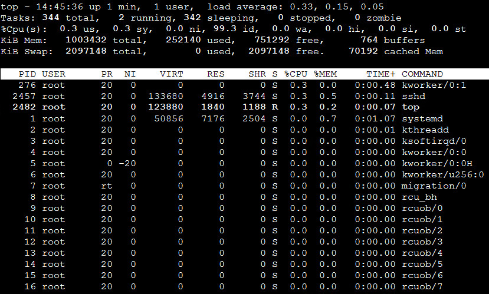

<!-- START doctoc generated TOC please keep comment here to allow auto update -->
<!-- DON'T EDIT THIS SECTION, INSTEAD RE-RUN doctoc TO UPDATE -->
目录

- [一、查找命令](#%E4%B8%80%E6%9F%A5%E6%89%BE%E5%91%BD%E4%BB%A4)
- [二、系统监控](#%E4%BA%8C%E7%B3%BB%E7%BB%9F%E7%9B%91%E6%8E%A7)
  - [1、top](#1top)
  - [2、查看程序运行](#2%E6%9F%A5%E7%9C%8B%E7%A8%8B%E5%BA%8F%E8%BF%90%E8%A1%8C)
  - [3、查看端口占用](#3%E6%9F%A5%E7%9C%8B%E7%AB%AF%E5%8F%A3%E5%8D%A0%E7%94%A8)
  - [4、查看空间](#4%E6%9F%A5%E7%9C%8B%E7%A9%BA%E9%97%B4)
  - [5、监控工具SAR](#5%E7%9B%91%E6%8E%A7%E5%B7%A5%E5%85%B7sar)
- [三、其他](#%E4%B8%89%E5%85%B6%E4%BB%96)
  - [1、查看Linux发行版本](#1%E6%9F%A5%E7%9C%8Blinux%E5%8F%91%E8%A1%8C%E7%89%88%E6%9C%AC)

<!-- END doctoc generated TOC please keep comment here to allow auto update -->


# 一、查找命令

```find / -name filename.txt``` 根据名称查找/目录下的filename.txt文件。

```find . -name "*.xml"``` 递归查找所有的xml文件

```find . -name "*" |xargs grep "hello"``` 递归查找所有文件内容中包含hello world的xml文件

```grep -H 'spring' *.xml``` 查找所以有的包含spring的xml文件

```find ./ -size 0 | xargs rm -f &``` 删除文件大小为零的文件

```ls -l | grep '.jar'``` 查找当前目录中的所有jar文件

```grep 'test' d*``` 显示所有以d开头的文件中包含test的行。

```grep 'test' aa bb cc``` 显示在aa，bb，cc文件中匹配test的行。

```grep '[a-z]\{5\}' aa``` 显示所有包含每个字符串至少有5个连续小写字符的字符串的行。

# 二、系统监控

## 1、top

top命令是Linux下常用的CPU性能分析工具，能够实时显示系统中各个进程的资源占用状况，常用于服务端性能分析

### 1.1、格式

top [参数]

### 1.2、命令参数
- -b 批处理
- -c 显示完整的治命令
- -I 忽略失效过程
- -s 保密模式
- -S 累积模式
- -i<时间> 设置间隔时间
- -u<用户名> 指定用户名
- -p<进程号> 指定进程
- -n<次数> 循环显示的次数

### 1.3、实例



统计信息区：前五行是当前系统情况整体的统计信息区。下面我们看每一行信息的具体意义

- 第一行，任务队列信息，同 uptime 命令的执行结果，具体参数说明情况如下：

    - 14:06:23 — 当前系统时间
    - up 70 days, 16:44 — 系统已经运行了70天16小时44分钟（在这期间系统没有重启过的吆！）
    - 2 users — 当前有2个用户登录系统
    - load average: 1.15, 1.42, 1.44 — load average后面的三个数分别是1分钟、5分钟、15分钟的负载情况。
    - load average数据是每隔5秒钟检查一次活跃的进程数，然后按特定算法计算出的数值。如果这个数除以逻辑CPU的数量，结果高于5的时候就表明系统在超负荷运转了

- 第二行，Tasks — 任务（进程），具体信息说明如下：

    系统现在共有206个进程，其中处于运行中的有1个，205个在休眠（sleep），stoped状态的有0个，zombie状态（僵尸）的有0个。

- 第三行，cpu状态信息，具体属性说明如下：

    - 5.9%us — 用户空间占用CPU的百分比。
    - 3.4% sy — 内核空间占用CPU的百分比。
    - 0.0% ni — 改变过优先级的进程占用CPU的百分比
    - 90.4% id — 空闲CPU百分比
    - 0.0% wa — IO等待占用CPU的百分比
    - 0.0% hi — 硬中断（Hardware IRQ）占用CPU的百分比
    - 0.2% si — 软中断（Software Interrupts）占用CPU的百分比

    *备注：在这里CPU的使用比率和windows概念不同，需要理解linux系统用户空间和内核空间的相关知识！*

- 第四行,内存状态，具体信息如下：

    - 32949016k total — 物理内存总量（32GB）
    - 14411180k used — 使用中的内存总量（14GB）
    - 18537836k free — 空闲内存总量（18GB）
    - 169884k buffers — 缓存的内存量 （169M）   

- 第五行，swap交换分区信息，具体信息说明如下：

    - 32764556k total — 交换区总量（32GB）
    - 0k used — 使用的交换区总量（0K）
    - 32764556k free — 空闲交换区总量（32GB）
    - 3612636k cached — 缓冲的交换区总量（3.6GB）

- 第六行，空行。

- 第七行以下：各进程（任务）的状态监控，项目列信息说明如下：
    - PID : 进程 id
    - USER : 进程所有者
    - PR : 进程优先级
    - NI : nice 值。负值表示高优先级，正值表示低优先级
    - VIRT : 进程使用的虚拟内存总量，单位 kb。VIRT=SWAP+RES
    - RES : 进程使用的、未被换出的物理内存大小，单位 kb。RES=CODE+DATA
    - SHR : 共享内存大小，单位 kb
    - S : 进程状态。D= 不可中断的睡眠状态 R= 运行 S= 睡眠 T= 跟踪 / 停止 Z= 僵尸进程
    - %CPU : 上次更新到现在的 CPU 时间占用百分比
    - %MEM : 进程使用的物理内存百分比
    - TIME+ : 进程使用的 CPU 时间总计，单位 1/100 秒
    - COMMAND : 进程名称

## 2、查看程序运行

```ps –ef|grep tomcat``` 查看所有有关tomcat的进程

```ps -ef|grep --color java``` 高亮要查询的关键字

```ps aux|grep java``` 查看java进程

```lsof -i:8080``` 查看端口属于哪个进程

## 3、查看端口占用

```netstat -tln | grep 8080``` 查看端口8080的使用情况

## 4、查看空间

```df```

```dh -sh *```
## 5、[监控工具SAR](https://mp.weixin.qq.com/s/CyYhAJMET_8kYSkmJDcqWA)


# 三、常用命令

## 1、查看Linux发行版本

cat /etc/redhat-release

## 2、级联创建目录

mkdir -p project/{a,b,c}/src，该命令最终创建的目录结构：
```
.
└── project
    ├── a
    │   └── src
    ├── b
    │   └── src
    └── c
        └── src
```

## 3、按照rz、sz命令

yum install -y lrzsz

## 4、远程拷贝文件与文件夹

- 拷贝文件：`scp shutdown-tomcat.sh root@192.168.56.104:/root/`
- 拷贝文件夹：`scp -r /root/software/ root@192.168.56.104:/root/`
- 远程下载文件：`cp -r root@192.168.56.104:/root/ /root/software/`

## 5、永久关闭防火墙

centOS7

- 查看状态：`systemctl status firewalld.service`；
- 停止防火墙：`systemctl stop firewalld.service`
- 禁止防火墙：`systemctl disable firewalld.service`


