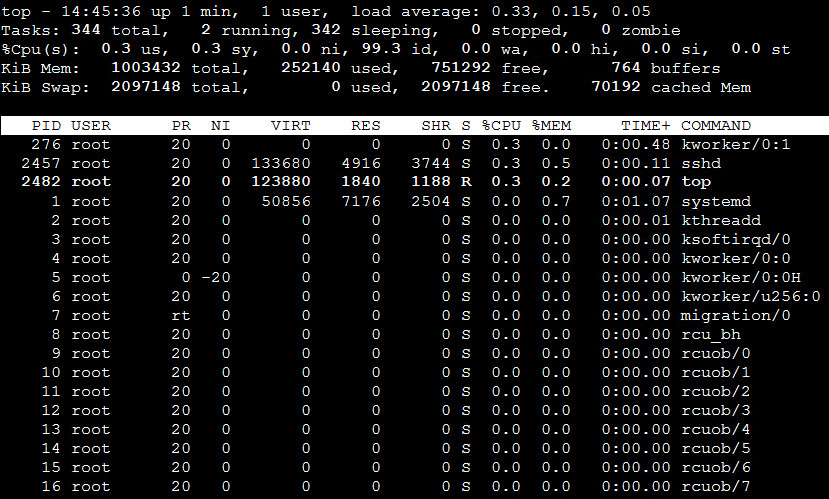

<!-- START doctoc generated TOC please keep comment here to allow auto update -->
<!-- DON'T EDIT THIS SECTION, INSTEAD RE-RUN doctoc TO UPDATE -->
目录

- [一、查找命令](#%E4%B8%80%E6%9F%A5%E6%89%BE%E5%91%BD%E4%BB%A4)
- [二、系统监控](#%E4%BA%8C%E7%B3%BB%E7%BB%9F%E7%9B%91%E6%8E%A7)
  - [1、top](#1top)
  - [2、查看程序运行](#2%E6%9F%A5%E7%9C%8B%E7%A8%8B%E5%BA%8F%E8%BF%90%E8%A1%8C)
  - [3、查看端口占用](#3%E6%9F%A5%E7%9C%8B%E7%AB%AF%E5%8F%A3%E5%8D%A0%E7%94%A8)
  - [4、查看空间](#4%E6%9F%A5%E7%9C%8B%E7%A9%BA%E9%97%B4)
  - [5、监控工具SAR](#5%E7%9B%91%E6%8E%A7%E5%B7%A5%E5%85%B7sar)
- [三、其他](#%E4%B8%89%E5%85%B6%E4%BB%96)
  - [1、查看Linux发行版本](#1%E6%9F%A5%E7%9C%8Blinux%E5%8F%91%E8%A1%8C%E7%89%88%E6%9C%AC)

<!-- END doctoc generated TOC please keep comment here to allow auto update -->


# 一、文件操作命令

## 1、find 命令

```find / -name filename.txt``` 根据名称查找/目录下的filename.txt文件。

```find . -name "*.xml"``` 递归查找所有的xml文件

```find . -name "*" |xargs grep "hello"``` 递归查找所有文件内容中包含hello world的xml文件

- 查找目录：`find /（查找范围） -name '查找关键字' -type d`
- 查找文件：`find /（查找范围） -name 查找关键字 -print`

```find ./ -size 0 | xargs rm -f &``` 删除文件大小为零的文件

## 2、grep 命令

表示全局正则表达式版本，它的使用权限是所有用户，它能使用正则表达式搜索文本，并把匹配的行打印出来

其工作方式：它在一个或多个文件中搜索字符串模板。如果模板包括空格，则必须被引用，模板后的所有字符串被看作文件名。搜索的结果被送到标准输出，不影响原文件内容。

grep可用于shell脚本，因为grep通过返回一个状态值来说明搜索的状态：
- 如果模板搜索成功，则返回0；
- 如果搜索不成功，则返回1；
- 如果搜索的文件不存在，则返回2；

**命令格式：** `grep [option] pattern file`

**命令参数：**
```
-a   --text   #不要忽略二进制的数据。   
-A<显示行数>   --after-context=<显示行数>   #除了显示符合范本样式的那一列之外，并显示该行之后的内容。   
-b   --byte-offset   #在显示符合样式的那一行之前，标示出该行第一个字符的编号。   
-B<显示行数>   --before-context=<显示行数>   #除了显示符合样式的那一行之外，并显示该行之前的内容。   
-c    --count   #计算符合样式的列数。   
-C<显示行数>    --context=<显示行数>或-<显示行数>   #除了显示符合样式的那一行之外，并显示该行之前后的内容。   
-d <动作>      --directories=<动作>   #当指定要查找的是目录而非文件时，必须使用这项参数，否则grep指令将回报信息并停止动作。   
-e<范本样式>  --regexp=<范本样式>   #指定字符串做为查找文件内容的样式。   
-E      --extended-regexp   #将样式为延伸的普通表示法来使用。   
-f<规则文件>  --file=<规则文件>   #指定规则文件，其内容含有一个或多个规则样式，让grep查找符合规则条件的文件内容，格式为每行一个规则样式。   
-F   --fixed-regexp   #将样式视为固定字符串的列表。   
-G   --basic-regexp   #将样式视为普通的表示法来使用。   
-h   --no-filename   #在显示符合样式的那一行之前，不标示该行所属的文件名称。   
-H   --with-filename   #在显示符合样式的那一行之前，表示该行所属的文件名称。   
-i   --ignore-case   #忽略字符大小写的差别。   
-l   --file-with-matches   #列出文件内容符合指定的样式的文件名称。   
-L   --files-without-match   #列出文件内容不符合指定的样式的文件名称。   
-n   --line-number   #在显示符合样式的那一行之前，标示出该行的列数编号。   
-q   --quiet或--silent   #不显示任何信息。   
-r   --recursive   #此参数的效果和指定“-d recurse”参数相同。   
-s   --no-messages   #不显示错误信息。   
-v   --revert-match   #显示不包含匹配文本的所有行。   
-V   --version   #显示版本信息。   
-w   --word-regexp   #只显示全字符合的列。   
-x    --line-regexp   #只显示全列符合的列。   
-y   #此参数的效果和指定“-i”参数相同。
```

## 3、cat 命令

cat命令的用途是连接文件或标准输入并打印。这个命令常用来显示文件内容，或者将几个文件连接起来显示，或者从标准输入读取内容并显示，它常与重定向符号配合使用

- 格式：`cat [选项] [文件]`
- cat主要有三大功能：
    - 一次显示整个文件：`cat filename`
    - 从键盘创建一个文件：`cat > filename` 只能创建新文件，不能编辑已有文件.
    - 将几个文件合并为一个文件：`cat file1 file2 > file`
- 参数
    ```
    -A, --show-all           等价于 -vET
    -b, --number-nonblank    对非空输出行编号
    -e                       等价于 -vE
    -E, --show-ends          在每行结束处显示 $
    -n, --number             对输出的所有行编号,由1开始对所有输出的行数编号
    -s, --squeeze-blank      有连续两行以上的空白行，就代换为一行的空白行 
    -t                       与 -vT 等价
    -T, --show-tabs          将跳格字符显示为 ^I
    -u                       (被忽略)
    -v, --show-nonprinting   使用 ^ 和 M- 引用，除了 LFD 和 TAB 之外
    ```

## 4、more与less命令

### 4.1、more

more命令，功能类似 cat，cat命令是整个文件的内容从上到下显示在屏幕上。more会以一页一页的显示方便使用者逐页阅读，而最基本的指令就是按空白键（space）就往下一页显示，按 b 键就会往回（back）一页显示，而且还有搜寻字串的功能 。more命令从前向后读取文件，因此在启动时就加载整个文件
 
- 命令格式：`more [-dlfpcsu ] [-num ] [+/ pattern] [+ linenum] [file ... ] `
- 命令参数：
    ```
    +n       从笫n行开始显示
    -n       定义屏幕大小为n行
    +/pattern 在每个档案显示前搜寻该字串（pattern），然后从该字串前两行之后开始显示  
    -c       从顶部清屏，然后显示
    -d       提示“Press space to continue，’q’ to quit（按空格键继续，按q键退出）”，禁用响铃功能
    -l        忽略Ctrl+l（换页）字符
    -p       通过清除窗口而不是滚屏来对文件进行换页，与-c选项相似
    -s       把连续的多个空行显示为一行
    -u       把文件内容中的下画线去掉
    ```
- 常用操作命令：
    ```
    Enter    向下n行，需要定义。默认为1行
    Ctrl+F   向下滚动一屏
    空格键  向下滚动一屏
    Ctrl+B  返回上一屏
    =       输出当前行的行号
    ：f     输出文件名和当前行的行号 
    V      调用vi编辑器
    !命令   调用Shell，并执行命令 
    q       退出more
    ```

### 4.2、less

less 工具也是对文件或其它输出进行分页显示的工具，less 的用法比起 more 更加的有弹性；
- 命令格式：`less [参数]  文件`
- 命令功能：less 与 more 类似，但使用 less 可以随意浏览文件，而 more 仅能向前移动，却不能向后移动，而且 less 在查看之前不会加载整个文件
- 命令参数：
    ```
    -b  <缓冲区大小> 设置缓冲区的大小
    -e  当文件显示结束后，自动离开
    -f  强迫打开特殊文件，例如外围设备代号、目录和二进制文件
    -g  只标志最后搜索的关键词
    -i  忽略搜索时的大小写
    -m  显示类似more命令的百分比
    -N  显示每行的行号
    -o <文件名> 将less 输出的内容在指定文件中保存起来
    -Q  不使用警告音
    -s  显示连续空行为一行
    -S  行过长时间将超出部分舍弃
    -x <数字> 将“tab”键显示为规定的数字空格
    /字符串：向下搜索“字符串”的功能
    ?字符串：向上搜索“字符串”的功能
    n： 重复前一个搜索（与 / 或 ? 有关）
    N： 反向重复前一个搜索（与 / 或 ? 有关）
    b   向后翻一页
    d   向后翻半页
    h   显示帮助界面
    Q   退出less 命令
    u   向前滚动半页
    y   向前滚动一行
    空格键  滚动一行
    回车键  滚动一页
    [pagedown]： 向下翻动一页
    [pageup]：   向上翻动一页
    ```

## 5、vi 命令

## 6、tail与head命令

### 6.1、tail命令

tail 命令从指定点开始将文件写到标准输出，用于显示指定文件末尾内容，不指定文件时，作为输入信息进行处理。常用查看日志文件

- 格式：`tail [必要参数] [选择参数] [文件]`
- 命令参数：
    - `-f`：循环读取
    - `-q`：不显示处理信息
    - `-v`：显示详细的处理信息
    - `-c<数目>`：显示的字节数
    - `-n<行数>`：显示行数
    - `--pid=PID`：与-f合用,表示在进程ID,PID死掉之后结束. 
    - `-q`, --quiet, --silent 从不输出给出文件名的首部 
    - `-s`, --sleep-interval=S 与-f合用,表示在每次反复的间隔休眠S秒

### 6.2、head命令

head 与 tail 就像它的名字一样的浅显易懂，它是用来显示开头或结尾某个数量的文字区块，head 用来显示档案的开头至标准输出中

- 命令格式：`head [参数]... [文件]...  `
- 命令功能：head 用来显示档案的开头至标准输出中，默认head命令打印其相应文件的开头10行
- 命令参数：
    ```
    -q 隐藏文件名
    -v 显示文件名
    -c<字节> 显示字节数
    -n<行数> 显示的行数
    ```

# 二、系统监控

## 1、top

top命令是Linux下常用的CPU性能分析工具，能够实时显示系统中各个进程的资源占用状况，常用于服务端性能分析

### 1.1、格式

top [参数]

### 1.2、命令参数
- -b 批处理
- -c 显示完整的治命令
- -I 忽略失效过程
- -s 保密模式
- -S 累积模式
- -i<时间> 设置间隔时间
- -u<用户名> 指定用户名
- -p<进程号> 指定进程
- -n<次数> 循环显示的次数

### 1.3、实例



统计信息区：前五行是当前系统情况整体的统计信息区。下面我们看每一行信息的具体意义

- 第一行，任务队列信息，同 uptime 命令的执行结果，具体参数说明情况如下：

    - 14:06:23 — 当前系统时间
    - up 70 days, 16:44 — 系统已经运行了70天16小时44分钟（在这期间系统没有重启过的吆！）
    - 2 users — 当前有2个用户登录系统
    - load average: 1.15, 1.42, 1.44 — load average后面的三个数分别是1分钟、5分钟、15分钟的负载情况。
    - load average数据是每隔5秒钟检查一次活跃的进程数，然后按特定算法计算出的数值。如果这个数除以逻辑CPU的数量，结果高于5的时候就表明系统在超负荷运转了

- 第二行，Tasks — 任务（进程），具体信息说明如下：

    系统现在共有206个进程，其中处于运行中的有1个，205个在休眠（sleep），stoped状态的有0个，zombie状态（僵尸）的有0个。

- 第三行，cpu状态信息，具体属性说明如下：

    - 5.9%us — 用户空间占用CPU的百分比。
    - 3.4% sy — 内核空间占用CPU的百分比。
    - 0.0% ni — 改变过优先级的进程占用CPU的百分比
    - 90.4% id — 空闲CPU百分比
    - 0.0% wa — IO等待占用CPU的百分比
    - 0.0% hi — 硬中断（Hardware IRQ）占用CPU的百分比
    - 0.2% si — 软中断（Software Interrupts）占用CPU的百分比

    *备注：在这里CPU的使用比率和windows概念不同，需要理解linux系统用户空间和内核空间的相关知识！*

- 第四行,内存状态，具体信息如下：

    - 32949016k total — 物理内存总量（32GB）
    - 14411180k used — 使用中的内存总量（14GB）
    - 18537836k free — 空闲内存总量（18GB）
    - 169884k buffers — 缓存的内存量 （169M）   

- 第五行，swap交换分区信息，具体信息说明如下：

    - 32764556k total — 交换区总量（32GB）
    - 0k used — 使用的交换区总量（0K）
    - 32764556k free — 空闲交换区总量（32GB）
    - 3612636k cached — 缓冲的交换区总量（3.6GB）

- 第六行，空行。

- 第七行以下：各进程（任务）的状态监控，项目列信息说明如下：
    - PID : 进程 id
    - USER : 进程所有者
    - PR : 进程优先级
    - NI : nice 值。负值表示高优先级，正值表示低优先级
    - VIRT : 进程使用的虚拟内存总量，单位 kb。VIRT=SWAP+RES
    - RES : 进程使用的、未被换出的物理内存大小，单位 kb。RES=CODE+DATA
    - SHR : 共享内存大小，单位 kb
    - S : 进程状态。D= 不可中断的睡眠状态 R= 运行 S= 睡眠 T= 跟踪 / 停止 Z= 僵尸进程
    - %CPU : 上次更新到现在的 CPU 时间占用百分比
    - %MEM : 进程使用的物理内存百分比
    - TIME+ : 进程使用的 CPU 时间总计，单位 1/100 秒
    - COMMAND : 进程名称

## 2、查看程序运行

`ps –ef|grep tomcat` 查看所有有关tomcat的进程

`ps -ef|grep --color java` 高亮要查询的关键字

`ps aux|grep java` 查看java进程

`lsof -i:8080` 查看端口属于哪个进程

`ps -ef | grep nginx | grep -v grep` 判断nginx进程是否存在，使用`echo $?` 返回1 


## 3、查看端口占用

```netstat -tln | grep 8080``` 查看端口8080的使用情况

- Linux：`netstat -nltp | grep PID`
- Mac下查看进程占用端口：`lsof -nP -iTCP -sTCP:LISTEN | grep PID`

## 4、查看空间

```df```

```dh -sh *```

## 5、[监控工具SAR](https://mp.weixin.qq.com/s/CyYhAJMET_8kYSkmJDcqWA)


# 三、常用命令

## 1、查看Linux发行版本

cat /etc/redhat-release

## 2、级联创建目录

mkdir -p project/{a,b,c}/src，该命令最终创建的目录结构：
```
.
└── project
    ├── a
    │   └── src
    ├── b
    │   └── src
    └── c
        └── src
```

## 3、按照rz、sz命令

yum install -y lrzsz

## 4、远程拷贝文件与文件夹

- 拷贝文件：`scp shutdown-tomcat.sh root@192.168.56.104:/root/`
- 拷贝文件夹：`scp -rq /root/software/ root@192.168.56.104:/root/`
- 远程下载文件：`cp -r root@192.168.56.104:/root/ /root/software/`

## 5、永久关闭防火墙

针对CentOS7：
- 查看状态：`systemctl status firewalld.service`；
- 停止防火墙：`systemctl stop firewalld.service`
- 禁止防火墙：`systemctl disable firewalld.service`

## 6、查看某个进程的线程数

- 查看所有进程：`pstree -p <pid>`
- 查看所有的进程数量`pstree -p <pid> | wc -l`

## 7、切换用户

- 添加用户：`useradd esuser`
- 授权用户：`chown -R esuser:esuser /usr/local/elasticsearch-7.4.2`，授权某个目录
- 切换到新建的用户：`su esuser`
- 查看当前用户：`whoami`

## 8、过滤掉配置的注释

`more elasticsearch.yml | grep ^[^#]`

## 9、查看脚本过程

`sh -x str.sh`

## 10、修改hostname

`hostnamectl set-hostname <yourhostname>`

## 11、ssh免密登录

机器环境，有三台机器，配置了对应的hosts和hostname
- 192.168.89.141 hadoop001
- 192.168.89.142 hadoop002
- 192.168.89.143 hadoop003

### 11.1、本机免密登录

在hadoop001机器上免密登录 hadoop001，那么操作如下：
- 生成公钥：`ssh-keygen -t rsa`，执行这个命令以后，需要连续按 4 次回车键回到 linux 命令行才表示这个操作执行 结束，在按回车的时候不需要输入任何内容
- 向本机复制公钥：`cat ~/.ssh/id_rsa.pub >> ~/.ssh/authorized_keys`
- 免密登录：`ssh hadoop100`

### 11.2、免密登录远程机器

比如上面hadoop001需要免密登录 hadoop002、hadoop003 两台机器，由于hadoop001上已经生成了公钥，分别执行如下命令：
```
ssh-copy-id -i hadoop002
ssh-copy-id -i hadoop003
```


# 参考资料

- [Linux命令搜索](https://github.com/jaywcjlove/linux-command)