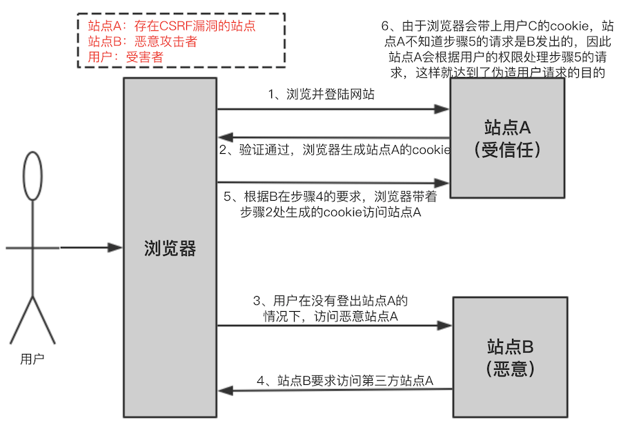

<!-- START doctoc generated TOC please keep comment here to allow auto update -->
<!-- DON'T EDIT THIS SECTION, INSTEAD RE-RUN doctoc TO UPDATE -->
**目录**

- [浏览器安全](#%E6%B5%8F%E8%A7%88%E5%99%A8%E5%AE%89%E5%85%A8)
  - [1、同源策略](#1%E5%90%8C%E6%BA%90%E7%AD%96%E7%95%A5)
- [一、CSRF](#%E4%B8%80csrf)
  - [1、概述](#1%E6%A6%82%E8%BF%B0)
  - [2、攻击原理](#2%E6%94%BB%E5%87%BB%E5%8E%9F%E7%90%86)
  - [3、CSRF的防御](#3csrf%E7%9A%84%E9%98%B2%E5%BE%A1)
- [二、XSS](#%E4%BA%8Cxss)
  - [1、概述](#1%E6%A6%82%E8%BF%B0-1)
  - [2、攻击原理](#2%E6%94%BB%E5%87%BB%E5%8E%9F%E7%90%86-1)
  - [3、如何防御](#3%E5%A6%82%E4%BD%95%E9%98%B2%E5%BE%A1)
    - [3.1、HttpOnly](#31httponly)
    - [3.2、输入检查](#32%E8%BE%93%E5%85%A5%E6%A3%80%E6%9F%A5)
    - [3.3、输出检查](#33%E8%BE%93%E5%87%BA%E6%A3%80%E6%9F%A5)
    - [3.4、富文本的处理](#34%E5%AF%8C%E6%96%87%E6%9C%AC%E7%9A%84%E5%A4%84%E7%90%86)
- [三、点击劫持](#%E4%B8%89%E7%82%B9%E5%87%BB%E5%8A%AB%E6%8C%81)
  - [1、概述](#1%E6%A6%82%E8%BF%B0-2)
  - [2、Flash点击劫持](#2flash%E7%82%B9%E5%87%BB%E5%8A%AB%E6%8C%81)
  - [3、图片覆盖攻击](#3%E5%9B%BE%E7%89%87%E8%A6%86%E7%9B%96%E6%94%BB%E5%87%BB)
- [四、注入攻击](#%E5%9B%9B%E6%B3%A8%E5%85%A5%E6%94%BB%E5%87%BB)
  - [1、SQL注入](#1sql%E6%B3%A8%E5%85%A5)
    - [1.1、如何理解SQL注入](#11%E5%A6%82%E4%BD%95%E7%90%86%E8%A7%A3sql%E6%B3%A8%E5%85%A5)
    - [1.2、SQL注入如何产生](#12sql%E6%B3%A8%E5%85%A5%E5%A6%82%E4%BD%95%E4%BA%A7%E7%94%9F)
    - [1.3、如何寻找SQL注入漏洞](#13%E5%A6%82%E4%BD%95%E5%AF%BB%E6%89%BEsql%E6%B3%A8%E5%85%A5%E6%BC%8F%E6%B4%9E)
    - [1.4、如何进行SQL注入攻击](#14%E5%A6%82%E4%BD%95%E8%BF%9B%E8%A1%8Csql%E6%B3%A8%E5%85%A5%E6%94%BB%E5%87%BB)
    - [1.5、如何防御SQL注入攻击](#15%E5%A6%82%E4%BD%95%E9%98%B2%E5%BE%A1sql%E6%B3%A8%E5%85%A5%E6%94%BB%E5%87%BB)
  - [2、操作系统命令注入](#2%E6%93%8D%E4%BD%9C%E7%B3%BB%E7%BB%9F%E5%91%BD%E4%BB%A4%E6%B3%A8%E5%85%A5)
  - [3、XML注入攻击](#3xml%E6%B3%A8%E5%85%A5%E6%94%BB%E5%87%BB)
- [五、DDOS](#%E4%BA%94ddos)
  - [1、概述](#1%E6%A6%82%E8%BF%B0-3)
  - [2、DDOS分类](#2ddos%E5%88%86%E7%B1%BB)
  - [3、SYN Flood](#3syn-flood)
- [六、文件上传漏洞](#%E5%85%AD%E6%96%87%E4%BB%B6%E4%B8%8A%E4%BC%A0%E6%BC%8F%E6%B4%9E)
  - [1、概述](#1%E6%A6%82%E8%BF%B0-4)
  - [2、设计安全的文件上传功能](#2%E8%AE%BE%E8%AE%A1%E5%AE%89%E5%85%A8%E7%9A%84%E6%96%87%E4%BB%B6%E4%B8%8A%E4%BC%A0%E5%8A%9F%E8%83%BD)
- [七、中间人攻击（MITM）](#%E4%B8%83%E4%B8%AD%E9%97%B4%E4%BA%BA%E6%94%BB%E5%87%BBmitm)
- [八、Java安全机制](#%E5%85%ABjava%E5%AE%89%E5%85%A8%E6%9C%BA%E5%88%B6)
  - [1、运行时安全机制](#1%E8%BF%90%E8%A1%8C%E6%97%B6%E5%AE%89%E5%85%A8%E6%9C%BA%E5%88%B6)
  - [2、Java提供的安全框架API](#2java%E6%8F%90%E4%BE%9B%E7%9A%84%E5%AE%89%E5%85%A8%E6%A1%86%E6%9E%B6api)
  - [3、JDK集成的各种安全工具](#3jdk%E9%9B%86%E6%88%90%E7%9A%84%E5%90%84%E7%A7%8D%E5%AE%89%E5%85%A8%E5%B7%A5%E5%85%B7)
  - [4、安全漏洞](#4%E5%AE%89%E5%85%A8%E6%BC%8F%E6%B4%9E)
- [九、Zip炸弹](#%E4%B9%9Dzip%E7%82%B8%E5%BC%B9)
- [参考资料](#%E5%8F%82%E8%80%83%E8%B5%84%E6%96%99)

<!-- END doctoc generated TOC please keep comment here to allow auto update -->

# 浏览器安全

## 1、同源策略

# 一、CSRF

## 1、概述

CSRF：Cross Site Request Forgery，跨站点请求伪造，是一种常见的web攻击。

可以理解为：攻击者盗用了你的身份，以你的名义向第三方网站发送恶意请求。 CRSF能做的事情包括利用你的身份发邮件、发短信、进行交易转账等，甚至盗取你的账号

## 2、攻击原理



- （1）首先用户C浏览并登录了受信任站点A；
- （2）登录信息验证通过以后，站点A会在返回给浏览器的信息中带上已登录的cookie，cookie信息会在浏览器端保存一定时间（根据服务端设置而定）；
- （3）完成这一步以后，用户在没有登出（清除站点A的cookie）站点A的情况下，访问恶意站点B；
- （4）这时恶意站点 B的某个页面向站点A发起请求，而这个请求会带上浏览器端所保存的站点A的cookie；
- （5）站点A根据请求所带的cookie，判断此请求为用户C所发送的。

## 3、CSRF的防御

- 尽量使用POST，限制GET，GET接口太容易被拿来做CSRF攻击；

- 将cookie设置为HttpOnly：CRSF攻击很大程度上是利用了浏览器的cookie，为了防止站内的XSS漏洞盗取cookie，需要在cookie中设置“HttpOnly”属性，这样通过程序（如JavaScript脚
本、Applet等）就无法读取到cookie信息，避免了攻击者伪造cookie的情况出现；

- 增加token：

    抵御CSRF攻击的关键在于：在请求中放入攻击者所不能伪造的信息，并且该信总不存在于cookie之中。系统开发人员可以在HTTP请求中以参数的形式加入一个随机产生的token，并在服务端进行token校验，如果请求中没有token或者token内容不正确，则认为是CSRF攻击而拒绝该请求；

- 通过Referer识别：根据HTTP协议，在HTTP头中有一个字段叫Referer，它记录了该HTTP请求的来源地址。但是因为服务器并不是什么时候都能取到Referer，所以也无法作为CSRF防御的主要手段。用Referer Check来监控CSRF攻击的发生，倒是一种可行的方法

- 加验证码：验证码，强制用户必须与应用进行交互，才能完成最终请求。在通常情况下，验证码能很好遏制CSRF攻击。但是出于用户体验考虑，网站不能给所有的操作都加上验证码

- 在 HTTP 头中自定义属性并验证

# 二、XSS

## 1、概述

XSS（跨站脚本）攻击：是让浏览器渲染DOM的时候意外的执行了恶意的JS代码。

比如下列脚本：
```html

```
这个脚本加载到页面时，由于图片引用为null，故会执行后面的onerror。

## 2、攻击原理

XSS攻击主要是在网页中嵌入一个恶意脚本。

XSS的类型：
- 反射型XSS：只是简单的把用户入的数据反射给浏览器。需要诱使用户“点击”一个恶意链接，才能攻击成功。也成为“非持久型XSS”；
- 存储型XSS：会把用户输入的数据“存储”在服务器端。比较常见的是写一篇含有恶意JS代码的文章，然后发表；

CSRF与XSS差别很大，CSRF则是通过伪装来自受信任用户的请求来利用受信任的网站，而XSS利用的是站点内的信任用户；

常见的XSS攻击-Cookie劫持：常见的XSS Payload是通过读取浏览器的Cookie对象，从而发起“Cookie”劫持攻击

## 3、如何防御

流行的浏览器都内置了一些对抗XSS的措施，比如Firefox的CSP、Noscript扩展等。

### 3.1、HttpOnly

浏览器将禁止页面的Javascript访问带有HttpOnly属性的Cookie。其解决的主要是XSS后存在的Cookie劫持

### 3.2、输入检查

常见的XSS、SQL注入等都是需要构造一些特殊字符，这些特殊字符可能只正常用户用不到的，所以需要对用户的输入进行相应的检查

### 3.3、输出检查

一般来说，除了富文本的输出外，在变量输出到HTML页面时，可以使用编码或者转义的方式来防御XSS攻击。

### 3.4、富文本的处理

在标签的选择上，应该使用白名单，只允许比较安全的标签。同时应该尽可能的禁止用户自定义CSS与style

如Java中的antisamy第三方扩展，可以对用户输入的存在恶意的脚本进行清理，其可以对富文本进行过滤。

# 三、点击劫持

## 1、概述

点击劫持是一种视觉上的欺骗手段，攻击者使用一个透明的、不可见的iframe，覆盖在一个网页上，然后诱使用户在该网页上进程操作，可以调整iframe页面的位置，可以诱使用户恰好点击在iframe页面上的一些功能按钮；

## 2、Flash点击劫持

主要是用过flash游戏，诱使用户来玩这个游戏。然后让用户去点击按钮，每次点击按钮的位置都会发生变化，最终可以达到控制用户电脑的目的；

## 3、图片覆盖攻击

# 四、注入攻击

## 1、SQL注入

### 1.1、如何理解SQL注入

SQL注入是一种将SQL代码添加到输入参数中，传递到服务器解析并执行的一种攻击手法

### 1.2、SQL注入如何产生

- Web开发人员无法保证所有输入都已经过滤；
- 攻击者利用发生给SQL服务器的输入数据构造可执行SQL代码；
- 数据库未做相应的安全配置；

### 1.3、如何寻找SQL注入漏洞

- 借助逻辑推理
    - 识别web应用中所有输入点
    - 了解哪些类型的请求会触发异常
    - 检测服务器响应中的异常
    
- 盲注

### 1.4、如何进行SQL注入攻击

### 1.5、如何防御SQL注入攻击

- 检查遍历数据类型和格式：只要是有固定格式的遍历，在SQL执行之前，应该严格按照格式去校验，确保是我们预想的格式
- 过滤特殊符号：对于无法确定固定格式的变量，一定要进行特殊符号的过滤或者转义处理
- 绑定变量，使用预编译语句-预防SQL注入的最佳方式
- 对于任何服务器的异常信息，不要暴露给到web端，如:异常堆栈信息等

## 2、操作系统命令注入

Java语言提供了类似Runtime.exec(....)的API，可以用来执行特定命令；

## 3、XML注入攻击

# 五、DDOS

## 1、概述

DDOS又称为分布式拒绝服务，全称是：Distributed Denial of Services。其是利用合理的请求造成资源过载，导致服务不可用

## 2、DDOS分类

- Synflood：该攻击以多个随机的源主机地址向目的主机发送SYN包，而在收到目的主机的SYN ACK后并不回应，这样，目的主机就为这些源主机建立了大量的连接队列，而且由于没有收到ACK一直维护着这些队列，造成了资源的大量消耗而不能向正常请求提供服务。

- Smurf：该攻击向一个子网的广播地址发一个带有特定请求(如ICMP回应请求)的包，并且将源地址伪装成想要攻击的主机地址。子网上所有主机都回应广播包请求而向被攻击主机发包，使该主机受到攻击。

- Land-based：攻击者将一个包的源地址和目的地址都设置为目标主机的地址，然后将该包通过IP欺骗的方式发送给被攻击主机，这种包可以造成被攻击主机因试图与自己建立连接而陷入死循环，从而很大程度地降低了系统性能。

- Ping of Death：根据TCP/IP的规范，一个包的长度最大为65536字节。尽管一个包的长度不能超过65536字节，但是一个包分成的多个片段的叠加却能做到。当一个主机收到了长度大于65536字节的包时，就是受到了Ping of Death攻击，该攻击会造成主机的宕机。

- Teardrop：IP数据包在网络传递时，数据包可以分成更小的片段。攻击者可以通过发送两段(或者更多)数据包来实现Teardrop攻击。第一个包的偏移量为0，长度为N，第二个包的偏移量小于N。为了合并这些数据段，TCP/IP堆栈会分配超乎寻常的巨大资源，从而造成系统资源的缺乏甚至机器的重新启动。

- PingSweep：使用ICMP Echo轮询多个主机。

- Pingflood：该攻击在短时间内向目的主机发送大量ping包，造成网络堵塞或主机资源耗尽。

## 3、SYN Flood

一种最为经典的DDOS攻击。其是利用了TCP协议设计中的缺陷。主要是根据TCP的三次握手机制

# 六、文件上传漏洞

## 1、概述

大多数情况下，文件上传漏洞一般是指：上传web脚本能够被服务器解析的问题。要完成这个攻击，需要满足几个条件：
- 首先，上传的文件能够被web容器解释执行。所以文件上传后所在的目录要是web容器所覆盖到的路径；
- 其次，用户能够从web上访问这个文件。如果文件上传了，但用户无法通过web访问或者无法使得web容器解释这个脚本，那也不能成为漏洞；
- 最后，用户上传的文件若被安全检查、格式化、图片压缩等功能改变了内容，可能导致攻击不成功；

## 2、设计安全的文件上传功能

- 文件上传的目录设置为不可置信；
- 判断文件类型：可以结合MIME Type、后缀等检查方式；
- 使用随机数改写文件名和文件路径
- 单独设置服务器的域名；

# 七、中间人攻击（MITM）

# 八、Java安全机制

## 1、运行时安全机制

即限制Java运行时的行为，不做越权或者不靠谱的事情
- 在类加载过程中，进行字节码验证，以防止不合规的代码影响JVM运行或者载入其他恶意代码；
- 类加载器本身也可以对代码之间进行隔离；
- 利用SercurityManager机制和相关的组件，限制代码的运行时行为能力，其中，你可以定制policy文件和各种粒度的权限定义，限制代码的作用域和权限；

    在应用实践中，如果对安全要求非常高，建议打开SercurityManager ```-Djava.sercurity.manager```，请注意其开销，通常只要开启Sercurity，就会导致10%~15%性能下降；

- 从原则上来讲，Java的GC等资源回收管理机制，都可以看作是运行时安全的一部分，如果相应机制失效，就会导致JVM出现OOM等错误；

## 2、Java提供的安全框架API

这些API是构建安全通信的基础；
- 加密、解密API；
- 授权、鉴权API；
- 安全通信相关类库，比如基本的HTTPS通信协议相关标准实现；

## 3、JDK集成的各种安全工具

- [keytool](https://docs.oracle.com/javase/8/docs/technotes/tools/unix/keytool.html)，这是个强大的工具，可以管理安全场景中不可或缺的秘钥、证书等，并且可以管理java程序使用的keystore文件；
- [jarsinger](https://docs.oracle.com/javase/9/tools/jarsigner.htm#JSWOR-GUID-925E7A1B-B3F3-44D2-8B49-0B3FA2C54864)，用于对jar文件进行签名或者验证；

## 4、安全漏洞

任何可以用来绕过安全策略限制的程序瑕疵，都可以算作是安全漏洞；

# 九、Zip炸弹

- 概述：是指解压缩后能够产生巨大的数据量的可疑压缩文件，这样的压缩文件解压缩可能对解压程序造成严重负担或崩溃，如果带有格式化参数的压缩包，双击压缩包后，所在的硬盘分区被完全格式化了

# 参考资料
* 《白帽子讲Web安全》