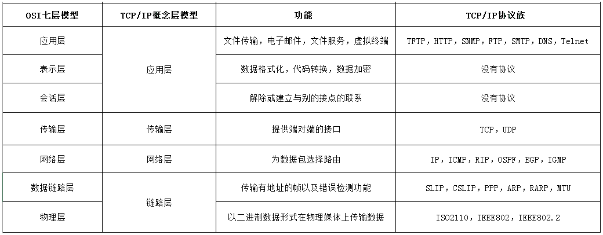
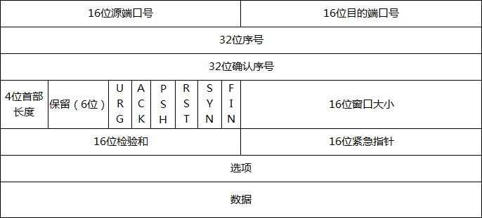
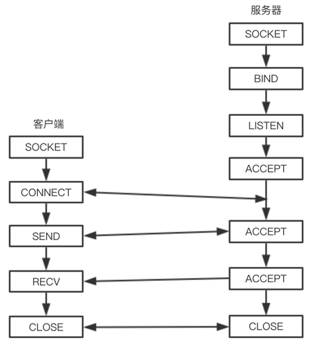
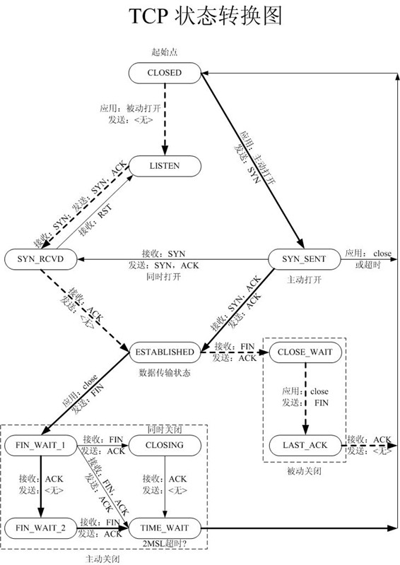
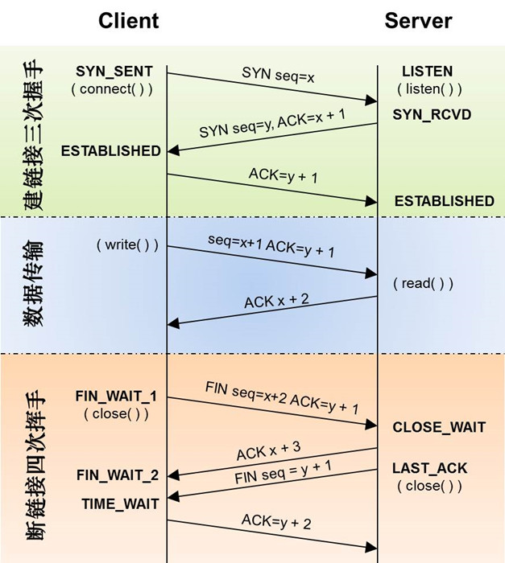
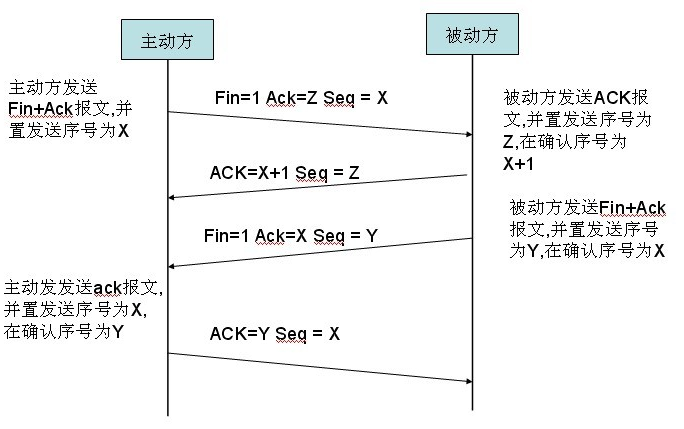
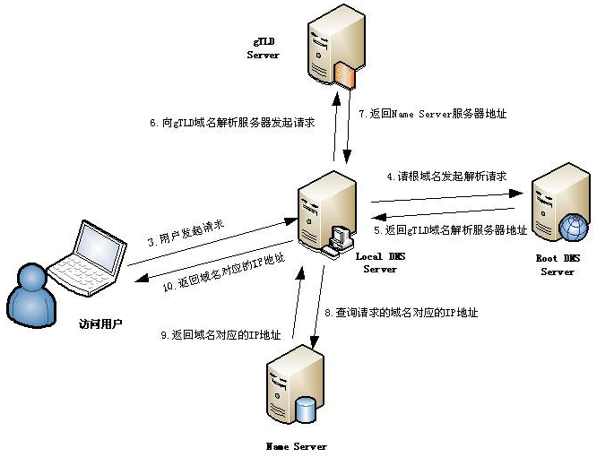
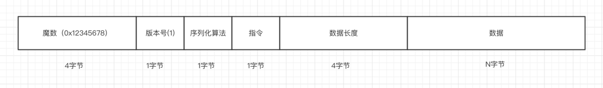

<!-- START doctoc generated TOC please keep comment here to allow auto update -->
<!-- DON'T EDIT THIS SECTION, INSTEAD RE-RUN doctoc TO UPDATE -->
**目录**

- [一、OSI 七层模型](#%E4%B8%80osi-%E4%B8%83%E5%B1%82%E6%A8%A1%E5%9E%8B)
  - [1、OSI(Open System Interconnection)](#1osiopen-system-interconnection)
    - [1.1、物理层](#11%E7%89%A9%E7%90%86%E5%B1%82)
    - [1.2、数据链路层](#12%E6%95%B0%E6%8D%AE%E9%93%BE%E8%B7%AF%E5%B1%82)
    - [1.3、网络层](#13%E7%BD%91%E7%BB%9C%E5%B1%82)
    - [1.4、传输层](#14%E4%BC%A0%E8%BE%93%E5%B1%82)
    - [1.5、会话层](#15%E4%BC%9A%E8%AF%9D%E5%B1%82)
    - [1.6、表示层：数据将按照网络能理解的方案进行格式化](#16%E8%A1%A8%E7%A4%BA%E5%B1%82%E6%95%B0%E6%8D%AE%E5%B0%86%E6%8C%89%E7%85%A7%E7%BD%91%E7%BB%9C%E8%83%BD%E7%90%86%E8%A7%A3%E7%9A%84%E6%96%B9%E6%A1%88%E8%BF%9B%E8%A1%8C%E6%A0%BC%E5%BC%8F%E5%8C%96)
    - [1.7、应用层：是最靠近用户的OSI层](#17%E5%BA%94%E7%94%A8%E5%B1%82%E6%98%AF%E6%9C%80%E9%9D%A0%E8%BF%91%E7%94%A8%E6%88%B7%E7%9A%84osi%E5%B1%82)
  - [2、TCP/IP 协议](#2tcpip-%E5%8D%8F%E8%AE%AE)
- [二、传输层控制协议](#%E4%BA%8C%E4%BC%A0%E8%BE%93%E5%B1%82%E6%8E%A7%E5%88%B6%E5%8D%8F%E8%AE%AE)
  - [1、TCP](#1tcp)
    - [1.1、TCP主要特性](#11tcp%E4%B8%BB%E8%A6%81%E7%89%B9%E6%80%A7)
  - [2、TCP数据段格式](#2tcp%E6%95%B0%E6%8D%AE%E6%AE%B5%E6%A0%BC%E5%BC%8F)
  - [3、TCP套接字](#3tcp%E5%A5%97%E6%8E%A5%E5%AD%97)
    - [3.1、套接字概述](#31%E5%A5%97%E6%8E%A5%E5%AD%97%E6%A6%82%E8%BF%B0)
    - [3.2、Socket原语](#32socket%E5%8E%9F%E8%AF%AD)
  - [4、TCP端口](#4tcp%E7%AB%AF%E5%8F%A3)
  - [5、TCP状态转移](#5tcp%E7%8A%B6%E6%80%81%E8%BD%AC%E7%A7%BB)
    - [5.1、TCP的连接状态](#51tcp%E7%9A%84%E8%BF%9E%E6%8E%A5%E7%8A%B6%E6%80%81)
    - [5.2、TCP状态转换](#52tcp%E7%8A%B6%E6%80%81%E8%BD%AC%E6%8D%A2)
  - [6、TCP建立连接-三次握手](#6tcp%E5%BB%BA%E7%AB%8B%E8%BF%9E%E6%8E%A5-%E4%B8%89%E6%AC%A1%E6%8F%A1%E6%89%8B)
    - [6.1、三次握手流程](#61%E4%B8%89%E6%AC%A1%E6%8F%A1%E6%89%8B%E6%B5%81%E7%A8%8B)
    - [6.2、连接时SYN超时](#62%E8%BF%9E%E6%8E%A5%E6%97%B6syn%E8%B6%85%E6%97%B6)
    - [6.3、SYN Flood攻击](#63syn-flood%E6%94%BB%E5%87%BB)
  - [7、TCP连接释放-四次挥手](#7tcp%E8%BF%9E%E6%8E%A5%E9%87%8A%E6%94%BE-%E5%9B%9B%E6%AC%A1%E6%8C%A5%E6%89%8B)
    - [7.1、流程](#71%E6%B5%81%E7%A8%8B)
    - [7.2、保活机制](#72%E4%BF%9D%E6%B4%BB%E6%9C%BA%E5%88%B6)
    - [7.3、TIME_WAIT](#73time_wait)
  - [8、TCP传输建立与释放相关问题](#8tcp%E4%BC%A0%E8%BE%93%E5%BB%BA%E7%AB%8B%E4%B8%8E%E9%87%8A%E6%94%BE%E7%9B%B8%E5%85%B3%E9%97%AE%E9%A2%98)
    - [8.1、为什么要三次握手](#81%E4%B8%BA%E4%BB%80%E4%B9%88%E8%A6%81%E4%B8%89%E6%AC%A1%E6%8F%A1%E6%89%8B)
    - [8.2、为什么要四次挥手](#82%E4%B8%BA%E4%BB%80%E4%B9%88%E8%A6%81%E5%9B%9B%E6%AC%A1%E6%8C%A5%E6%89%8B)
    - [8.3、为什么建立连接协议是三次握手，而关闭连接却是四次挥手呢?](#83%E4%B8%BA%E4%BB%80%E4%B9%88%E5%BB%BA%E7%AB%8B%E8%BF%9E%E6%8E%A5%E5%8D%8F%E8%AE%AE%E6%98%AF%E4%B8%89%E6%AC%A1%E6%8F%A1%E6%89%8B%E8%80%8C%E5%85%B3%E9%97%AD%E8%BF%9E%E6%8E%A5%E5%8D%B4%E6%98%AF%E5%9B%9B%E6%AC%A1%E6%8C%A5%E6%89%8B%E5%91%A2)
    - [8.4、为什么不能用两次握手进行连接?](#84%E4%B8%BA%E4%BB%80%E4%B9%88%E4%B8%8D%E8%83%BD%E7%94%A8%E4%B8%A4%E6%AC%A1%E6%8F%A1%E6%89%8B%E8%BF%9B%E8%A1%8C%E8%BF%9E%E6%8E%A5)
    - [8.5、TCP长连接与短连接](#85tcp%E9%95%BF%E8%BF%9E%E6%8E%A5%E4%B8%8E%E7%9F%AD%E8%BF%9E%E6%8E%A5)
    - [8.5、服务器出现大量的CLOSE_WAIT状态的额原因](#85%E6%9C%8D%E5%8A%A1%E5%99%A8%E5%87%BA%E7%8E%B0%E5%A4%A7%E9%87%8F%E7%9A%84close_wait%E7%8A%B6%E6%80%81%E7%9A%84%E9%A2%9D%E5%8E%9F%E5%9B%A0)
  - [9、TCP的可靠性传输](#9tcp%E7%9A%84%E5%8F%AF%E9%9D%A0%E6%80%A7%E4%BC%A0%E8%BE%93)
    - [9.1、TCP字节编号机制](#91tcp%E5%AD%97%E8%8A%82%E7%BC%96%E5%8F%B7%E6%9C%BA%E5%88%B6)
    - [9.2、TCP的数据段确认机制](#92tcp%E7%9A%84%E6%95%B0%E6%8D%AE%E6%AE%B5%E7%A1%AE%E8%AE%A4%E6%9C%BA%E5%88%B6)
    - [9.3、TCP超时重传机制](#93tcp%E8%B6%85%E6%97%B6%E9%87%8D%E4%BC%A0%E6%9C%BA%E5%88%B6)
    - [9.4、TCP的选择性确认机制](#94tcp%E7%9A%84%E9%80%89%E6%8B%A9%E6%80%A7%E7%A1%AE%E8%AE%A4%E6%9C%BA%E5%88%B6)
    - [9.5、TCP如何保证可靠性传输](#95tcp%E5%A6%82%E4%BD%95%E4%BF%9D%E8%AF%81%E5%8F%AF%E9%9D%A0%E6%80%A7%E4%BC%A0%E8%BE%93)
  - [10、TCP流量控制](#10tcp%E6%B5%81%E9%87%8F%E6%8E%A7%E5%88%B6)
    - [10.1、概述](#101%E6%A6%82%E8%BF%B0)
    - [10.2、滑动窗口协议](#102%E6%BB%91%E5%8A%A8%E7%AA%97%E5%8F%A3%E5%8D%8F%E8%AE%AE)
    - [10.3、基于传输效率考虑](#103%E5%9F%BA%E4%BA%8E%E4%BC%A0%E8%BE%93%E6%95%88%E7%8E%87%E8%80%83%E8%99%91)
    - [10.4、总结](#104%E6%80%BB%E7%BB%93)
  - [11、TCP拥塞控制](#11tcp%E6%8B%A5%E5%A1%9E%E6%8E%A7%E5%88%B6)
    - [11.1、概述](#111%E6%A6%82%E8%BF%B0)
    - [11.2、TCP拥塞控制方案](#112tcp%E6%8B%A5%E5%A1%9E%E6%8E%A7%E5%88%B6%E6%96%B9%E6%A1%88)
  - [12、UDP-用户数据报文协议](#12udp-%E7%94%A8%E6%88%B7%E6%95%B0%E6%8D%AE%E6%8A%A5%E6%96%87%E5%8D%8F%E8%AE%AE)
    - [12.1、基本特性](#121%E5%9F%BA%E6%9C%AC%E7%89%B9%E6%80%A7)
    - [12.2、UDP的数据报头部格式](#122udp%E7%9A%84%E6%95%B0%E6%8D%AE%E6%8A%A5%E5%A4%B4%E9%83%A8%E6%A0%BC%E5%BC%8F)
    - [12.3、UDP应用场景](#123udp%E5%BA%94%E7%94%A8%E5%9C%BA%E6%99%AF)
    - [12.4、单播、广播、多播](#124%E5%8D%95%E6%92%AD%E5%B9%BF%E6%92%AD%E5%A4%9A%E6%92%AD)
    - [12.5、UDP使用场景](#125udp%E4%BD%BF%E7%94%A8%E5%9C%BA%E6%99%AF)
  - [13、说说HTTP、UDP、TCP之间关系和区别.](#13%E8%AF%B4%E8%AF%B4httpudptcp%E4%B9%8B%E9%97%B4%E5%85%B3%E7%B3%BB%E5%92%8C%E5%8C%BA%E5%88%AB)
- [三、IP-网络层](#%E4%B8%89ip-%E7%BD%91%E7%BB%9C%E5%B1%82)
  - [1、查看IP地址](#1%E6%9F%A5%E7%9C%8Bip%E5%9C%B0%E5%9D%80)
  - [2、IP地址分类](#2ip%E5%9C%B0%E5%9D%80%E5%88%86%E7%B1%BB)
  - [3、IP地址与Mac地址](#3ip%E5%9C%B0%E5%9D%80%E4%B8%8Emac%E5%9C%B0%E5%9D%80)
  - [4、IPV6](#4ipv6)
- [四、HTTP与HTTPS协议-应用层](#%E5%9B%9Bhttp%E4%B8%8Ehttps%E5%8D%8F%E8%AE%AE-%E5%BA%94%E7%94%A8%E5%B1%82)
  - [1、HTTP协议](#1http%E5%8D%8F%E8%AE%AE)
    - [1.1、HTTP主要特性](#11http%E4%B8%BB%E8%A6%81%E7%89%B9%E6%80%A7)
    - [1.2、URL/URI/URN](#12urluriurn)
  - [2、HTTP工作原理](#2http%E5%B7%A5%E4%BD%9C%E5%8E%9F%E7%90%86)
  - [3、HTTP报文](#3http%E6%8A%A5%E6%96%87)
    - [3.1、HTTP请求报文](#31http%E8%AF%B7%E6%B1%82%E6%8A%A5%E6%96%87)
    - [3.2、HTTP响应报文](#32http%E5%93%8D%E5%BA%94%E6%8A%A5%E6%96%87)
  - [4、HTTP状态码](#4http%E7%8A%B6%E6%80%81%E7%A0%81)
  - [5、HTTP请求方式](#5http%E8%AF%B7%E6%B1%82%E6%96%B9%E5%BC%8F)
    - [5.1、HTTP请求方法](#51http%E8%AF%B7%E6%B1%82%E6%96%B9%E6%B3%95)
    - [5.2、GET请求与POST请求的区别](#52get%E8%AF%B7%E6%B1%82%E4%B8%8Epost%E8%AF%B7%E6%B1%82%E7%9A%84%E5%8C%BA%E5%88%AB)
  - [6、浏览器缓存机制](#6%E6%B5%8F%E8%A7%88%E5%99%A8%E7%BC%93%E5%AD%98%E6%9C%BA%E5%88%B6)
    - [6.1、浏览器缓存控制机制有两种](#61%E6%B5%8F%E8%A7%88%E5%99%A8%E7%BC%93%E5%AD%98%E6%8E%A7%E5%88%B6%E6%9C%BA%E5%88%B6%E6%9C%89%E4%B8%A4%E7%A7%8D)
    - [6.2、几个重要概念](#62%E5%87%A0%E4%B8%AA%E9%87%8D%E8%A6%81%E6%A6%82%E5%BF%B5)
    - [6.3、几种状态码的区别](#63%E5%87%A0%E7%A7%8D%E7%8A%B6%E6%80%81%E7%A0%81%E7%9A%84%E5%8C%BA%E5%88%AB)
    - [6.4、用户行为与缓存](#64%E7%94%A8%E6%88%B7%E8%A1%8C%E4%B8%BA%E4%B8%8E%E7%BC%93%E5%AD%98)
  - [7、https：可以认为是HTTP+TLS](#7https%E5%8F%AF%E4%BB%A5%E8%AE%A4%E4%B8%BA%E6%98%AFhttptls)
    - [7.1、HTTP协议存在的问题](#71http%E5%8D%8F%E8%AE%AE%E5%AD%98%E5%9C%A8%E7%9A%84%E9%97%AE%E9%A2%98)
    - [7.2、HTTPS协议概述](#72https%E5%8D%8F%E8%AE%AE%E6%A6%82%E8%BF%B0)
    - [7.3、TSL（SSL）协议](#73tslssl%E5%8D%8F%E8%AE%AE)
  - [8、HTTP与HTTPS的区别](#8http%E4%B8%8Ehttps%E7%9A%84%E5%8C%BA%E5%88%AB)
  - [9、长连接与短连接](#9%E9%95%BF%E8%BF%9E%E6%8E%A5%E4%B8%8E%E7%9F%AD%E8%BF%9E%E6%8E%A5)
    - [9.1、HTTP与TCP](#91http%E4%B8%8Etcp)
    - [9.2、长连接与短连接](#92%E9%95%BF%E8%BF%9E%E6%8E%A5%E4%B8%8E%E7%9F%AD%E8%BF%9E%E6%8E%A5)
    - [9.3、长连接与短连接的优点和缺点](#93%E9%95%BF%E8%BF%9E%E6%8E%A5%E4%B8%8E%E7%9F%AD%E8%BF%9E%E6%8E%A5%E7%9A%84%E4%BC%98%E7%82%B9%E5%92%8C%E7%BC%BA%E7%82%B9)
    - [9.4、长连接和短连接适用场景](#94%E9%95%BF%E8%BF%9E%E6%8E%A5%E5%92%8C%E7%9F%AD%E8%BF%9E%E6%8E%A5%E9%80%82%E7%94%A8%E5%9C%BA%E6%99%AF)
  - [10、HTTP无状态](#10http%E6%97%A0%E7%8A%B6%E6%80%81)
  - [11、HTTP/1.1 与 HTTP/1.0](#11http11-%E4%B8%8E-http10)
  - [12、HTTP2.X](#12http2x)
- [五、DNS协议-应用层](#%E4%BA%94dns%E5%8D%8F%E8%AE%AE-%E5%BA%94%E7%94%A8%E5%B1%82)
  - [1、DNS协议](#1dns%E5%8D%8F%E8%AE%AE)
  - [2、DNS解析过程](#2dns%E8%A7%A3%E6%9E%90%E8%BF%87%E7%A8%8B)
  - [3、清除缓存的域名](#3%E6%B8%85%E9%99%A4%E7%BC%93%E5%AD%98%E7%9A%84%E5%9F%9F%E5%90%8D)
  - [4、域名解析方式](#4%E5%9F%9F%E5%90%8D%E8%A7%A3%E6%9E%90%E6%96%B9%E5%BC%8F)
  - [5、DNS负载均衡](#5dns%E8%B4%9F%E8%BD%BD%E5%9D%87%E8%A1%A1)
  - [6、DNS劫持与污染](#6dns%E5%8A%AB%E6%8C%81%E4%B8%8E%E6%B1%A1%E6%9F%93)
    - [6.1、DNS污染（DNS cache pollution）](#61dns%E6%B1%A1%E6%9F%93dns-cache-pollution)
    - [6.2、DNS劫持](#62dns%E5%8A%AB%E6%8C%81)
    - [6.3、DNS污染和DNS劫持的区别](#63dns%E6%B1%A1%E6%9F%93%E5%92%8Cdns%E5%8A%AB%E6%8C%81%E7%9A%84%E5%8C%BA%E5%88%AB)
    - [6.4、如何解决DNS污染和劫持](#64%E5%A6%82%E4%BD%95%E8%A7%A3%E5%86%B3dns%E6%B1%A1%E6%9F%93%E5%92%8C%E5%8A%AB%E6%8C%81)
- [六、跨域](#%E5%85%AD%E8%B7%A8%E5%9F%9F)
  - [1、跨域问题](#1%E8%B7%A8%E5%9F%9F%E9%97%AE%E9%A2%98)
    - [1.1、什么是跨域](#11%E4%BB%80%E4%B9%88%E6%98%AF%E8%B7%A8%E5%9F%9F)
    - [1.2、广义的跨域](#12%E5%B9%BF%E4%B9%89%E7%9A%84%E8%B7%A8%E5%9F%9F)
    - [1.3、什么是同源策略：(SOP-Same Origin Policy)](#13%E4%BB%80%E4%B9%88%E6%98%AF%E5%90%8C%E6%BA%90%E7%AD%96%E7%95%A5sop-same-origin-policy)
    - [1.4、常见跨域场景](#14%E5%B8%B8%E8%A7%81%E8%B7%A8%E5%9F%9F%E5%9C%BA%E6%99%AF)
    - [1.5、常见跨域解决方案](#15%E5%B8%B8%E8%A7%81%E8%B7%A8%E5%9F%9F%E8%A7%A3%E5%86%B3%E6%96%B9%E6%A1%88)
- [七、网络请求过程](#%E4%B8%83%E7%BD%91%E7%BB%9C%E8%AF%B7%E6%B1%82%E8%BF%87%E7%A8%8B)
  - [1、DNS解析过程](#1dns%E8%A7%A3%E6%9E%90%E8%BF%87%E7%A8%8B)
    - [1.1、DNS解析](#11dns%E8%A7%A3%E6%9E%90)
    - [1.2、解析过程](#12%E8%A7%A3%E6%9E%90%E8%BF%87%E7%A8%8B)
    - [1.3、DNS优化](#13dns%E4%BC%98%E5%8C%96)
  - [2、TCP连接](#2tcp%E8%BF%9E%E6%8E%A5)
  - [3、发送HTTP请求](#3%E5%8F%91%E9%80%81http%E8%AF%B7%E6%B1%82)
  - [4、服务器处理请求并返回HTTP报文](#4%E6%9C%8D%E5%8A%A1%E5%99%A8%E5%A4%84%E7%90%86%E8%AF%B7%E6%B1%82%E5%B9%B6%E8%BF%94%E5%9B%9Ehttp%E6%8A%A5%E6%96%87)
  - [5、浏览器解析渲染页面](#5%E6%B5%8F%E8%A7%88%E5%99%A8%E8%A7%A3%E6%9E%90%E6%B8%B2%E6%9F%93%E9%A1%B5%E9%9D%A2)
- [八、Websocket](#%E5%85%ABwebsocket)
  - [1、概述](#1%E6%A6%82%E8%BF%B0)
  - [2、请求头描述](#2%E8%AF%B7%E6%B1%82%E5%A4%B4%E6%8F%8F%E8%BF%B0)
- [九、通信协议设计](#%E4%B9%9D%E9%80%9A%E4%BF%A1%E5%8D%8F%E8%AE%AE%E8%AE%BE%E8%AE%A1)
  - [1、通信协议设计](#1%E9%80%9A%E4%BF%A1%E5%8D%8F%E8%AE%AE%E8%AE%BE%E8%AE%A1)
- [十、网络工具](#%E5%8D%81%E7%BD%91%E7%BB%9C%E5%B7%A5%E5%85%B7)
  - [1、tcpdump](#1tcpdump)
  - [2、Wireshark](#2wireshark)
  - [3、Fiddler](#3fiddler)
  - [4、postman](#4postman)
- [十一、网络相关面试题](#%E5%8D%81%E4%B8%80%E7%BD%91%E7%BB%9C%E7%9B%B8%E5%85%B3%E9%9D%A2%E8%AF%95%E9%A2%98)
  - [1、单台服务器并发TCP连接数](#1%E5%8D%95%E5%8F%B0%E6%9C%8D%E5%8A%A1%E5%99%A8%E5%B9%B6%E5%8F%91tcp%E8%BF%9E%E6%8E%A5%E6%95%B0)
  - [2、QQ采用的是什么协议](#2qq%E9%87%87%E7%94%A8%E7%9A%84%E6%98%AF%E4%BB%80%E4%B9%88%E5%8D%8F%E8%AE%AE)
  - [3、](#3)
- [参考资料](#%E5%8F%82%E8%80%83%E8%B5%84%E6%96%99)

<!-- END doctoc generated TOC please keep comment here to allow auto update -->


# 一、OSI 七层模型

## 1、OSI(Open System Interconnection)

称为开放式系统互联参考模型，针对广域网通信进行设计的，将整个网络通信分为7个层次：物理层、数据链路层、网络层、传输层、会话层、表示层、应用层.

- OSI 低四层（从物理层到传输层）定义了如何进行端到端的数据传输，也就是定义了如何通过网卡、物理电缆、交换机和路由器进行数据传输；
- 而高三层(从会话层到应用层)定义了终端系统的应用程序和用户如何彼此通信，即定义了如何重建从发送方到目的方的应用程序数据流；



### 1.1、物理层

是所有计算机网络体系结构的最底层，为所有网络/数据通信提供物理的通信线路。是用来构建计算机网络通信和数据传输的通道的。中继器，集线器、网线、HUB

### 1.2、数据链路层

控制网络层与物理层之间的通信，提供点对点的数据传输通道，通过MAC地址寻址把数据传到目的节点。为了保证传输，从网络层接收到的数据被分割成特定的可被物理层传输的帧。

- 数据链路层在不可靠的物理介质上提供可靠的传输。该层的作用包括：物理地址寻址、数据的成帧、流量控制、数据的检错、重发等
- 据链路层协议的代表包括：SDLC、HDLC、PPP、STP、帧中继等；
- 数据链路可以分为逻辑链路和物理链路。网卡，网桥，交换机

### 1.3、网络层

- 其主要功能是将网络地址翻译成对应的物理地址，并决定如何将数据从发送方路由到接收方
- 在网络中，"路由"是基于编址方案、使用模式以及可达性来指引数据的发送.
- 网络层是可选的，它只用于当两个计算机系统处于不同的由路由器分割开的网段这种情况，或者当通信应用要求某种网络层或传输层提供的服务、特性或者能力时

### 1.4、传输层

- 以端到端方式建立数据传输连接和通信，屏蔽途径网络中所有低层服务上的差异
- 以数据段为基本格式提供流量控制，拥塞控制和差错控制
- 传输层的协议：TCP，UDP
- 作用：传输层为它上面的应用层提供通信服务；
- 在OSI七层参考模型中，传输层是面向通信的最高层，也是用户功能的最底层；
- 传输层两大重要的功能：复用 和 分用
    * 复用：在发送端，多个应用进程共用一个传输层；
    * 分用：在接收端，传输层会根据端口号将数据分派给不同的应用进程.
- 和网络层的区别
    * 网络层为不同主机提供通信服务，而传输层为不同主机的不同应用提供通信服务；
    * 网络层只对报文头部进行差错检测，而传输层对整个报文进行差错检测

### 1.5、会话层

- 维护通信双方应用进程会话；管理双方数据交换进程
- 建立通信链接，保持会话过程通信链接的畅通，同步两个节点之间的对话，决定通信是否被中断以及通信中断时决定从何处重新发送，SESSION认证、断点续传

### 1.6、表示层：数据将按照网络能理解的方案进行格式化
 
- 数据格式转换，数据加密与解密，数据压缩与解压缩

### 1.7、应用层：是最靠近用户的OSI层

- 负责接受用户的各种网络应用进程的调用；
- 协议：FTP，SMTP，HTTP

## 2、TCP/IP 协议

TCP/IP 协议体系结构，是专门针对使用TCP/IP 协议簇的广域网计算机网络而开发的.其只划分了四层：应用层、传输层、网际互连层、网络访问层

- 应用层：将OSI参考模型中的会话层和表示层的功能合并到应用层实现
- 传输层：传输层的功能是使源端主机和目标端主机上的对等实体可以进行会话
- 网际互连层：
    - 网络互连层是整个 TCP/IP 协议栈的核心.它的功能是把分组发往目标网络或主机
    - 定义了分组格式和协议，即IP协议(Internet Protocol)
- 网络访问层

# 二、传输层控制协议

## 1、TCP

### 1.1、TCP主要特性

TCP是TCP/IP体系结构中最主要的传输层协议。

- 面向连接的传输协议：应用程序在使用TCP之前，必须先建立TCP传输连接， 在数据传输完毕之后，必须释放已建立的TCP传输连接；
- 仅支持单播传输每条TCP传输连接只有两个端点，只能进行点对点的数据传输，不支持多播和广播的传输方式。注意：这里的TCP传输连接的"端点"不是主机或者主机的IP等，而是套接字(Socket).套接字是IP地址和端口号的组合；
- 提供可靠的交付服务：通过TCP连接传送的数据可以无差错、不丢失、不重复，且按时序到达对端
- 传输单位为数据段：由于数据段大小受应用层传输的报文大小和所途径网络的MTU值大小决定.每次发送的TCP数据段大小不固定.最小的数据段可能仅有21字节
- 仅一种TPDU格式；
- 支持全双工传输：TCP允许通信双方的应用程序在任何时候都能发送数据，因为TCP连接的两端都设有发送和缓存，用来临时存放双向通信的数据.
- TCP连接是基于字节流的，而非报文流；
- 每次发送的TCP数据端大小和数据段都是可变的

## 2、TCP数据段格式



- 源端口和目的端口：<br>
    源端口和目的端口分别代表的呼叫方和被叫方的TCP端口号，各占16位。 一个端口与其主机的IP地址可以完整的标识一个端点.

- 序号(Sequence Number)：<br>
    序号指TCP数据段中的"数据"部分(不包含"数据段头"部分)的第一个字节的编号，栈32位. 整个要传输的字节流的起始序号必须在连接建立时设置.

- 确认序号(Acknowlegment Number)：<br>
    确认号指期望接收到对方下一个数据段中"数据"部分的第一个字节序号，占32位。 注意："确认号"不是代表已经正确接收到最后一个字节的序号，"序号"和"确认号"两个字段共同用于TCP服务中的差错控制，确保TCP数据传输的可靠性

- 数据偏移：<br>
    数据偏移指数据段中的"数据"部分起始处距离TCP数据段起始处的字节偏移量，占4位。这里的数据偏移也是在确定TCP数据段头部分的长度。数据偏移量是以32位(4字节)为单位来计算的.而不是以单个字节来计算的。4个比特位可以表示的最大数为15，所以数据偏移量最大位60字节，也是TCP数据段头部分最大长度；

- 保留(Reserved)：<br>
    为将来应用而保留的6个比特位，目前应全设置位0

- URG：<br>
    Urgent Pointer(紧急指针)控制位，指出当前数据段中是否有紧急数据，占1位，置1时表示有紧急数据.紧急数据会优先安排传送，而不会按照原来的排队顺序进行发送。仅当本字段设置为1时，后面的紧急指针字段才有意义；
- ACK：<br>
    Acknowlegment(确认)控制位，指示TCP数据段中的"确认号"字段是否有效，占1位。仅当ACK位置1时才表示"确认号"字段有效，否则表示"确认号"字段无效.

- PSH：<br>
    Push(推)控制位，指示是否需要立即把收到的该数据段提交给应用进程，占1位.当PSH位置1时要求接收端尽快把该数据提交给应用进程，而置时没有这个要求，可以先缓存起来.

- RST：<br>
    Reset(重置控制位)，用于重置、释放一个已经混乱的传输连接，然后重新的传输连接，占1位。当RST位置1时，释放当前传输连接，然后可以重新建立新的传输连接.

- SYN：<br>
    Synchronization(同步)控制位，用来在传输连接建立时同步传输连接序号，占1位。当SYN位置1时，表示这一个连接请求或连接确认报文。 当SYN=1，而ACK=0 时，表示这是一个连接请求数据段.如果对方统一建立连接，则对方会返回一个SYN=1、ACK=1的确认.

- FIN：<br>
    Final(最后)控制位，用于释放一个传输连接，占1位。当FIN位置1时，表示数据已经传输完成，发送端没有数据要传输了，要求释放当前连接，但是接收端仍然可以继续接收还没有接收完的数据.在正常传输时，该位置1.

- 窗口大小：<br>
    指示发送此TCP数据段的主机上用来存储传入数据段的窗口大小，也即发送者当前还可以接收的最大字节数，占16位；
    是接收端告诉发送端自己还有多少缓冲区可以接收数据。于是发送端就可以根据这个接收端的处理能力来发送数据，而不会导致接收端处理不过来
- 检验和(Checksum)：<br>
    检验和是指对"数据段头"、"数据"和"伪头部"这三部分进行校验，主干16位."伪头部"包括源主机和目的主机的32位IP地址、TCP协议号(6)，以及TCP数据段长度.

- 紧急指针(Urgent Pointer)：<br>

    仅当前面的URG控制位置1时才有意义，它指出本数据段中位紧急数据的字节数，占16位。"紧急指针"字段指明了紧急数据的末尾在数据段中的位置。注意，即使当前窗口大小位0，也是可以发送紧急数据的，因为紧急数据无须缓存.

- 可选项(Option)：<br>
    "可选项"字段时可选的，且长度可变，最长可达40字节.当没有使用该字段时，TCP头部的长度是20字节.

- 数据(Data)：
    这是由应用层的应用进程提交的数据，作为TCP数据段的"数据"部分.

## 3、TCP套接字

### 3.1、套接字概述

在TCP/IP网络中，区分不同应用程序进程间的网络通信和连接时主要有三个参数：

* 通信的目的IP地址
* 使用的传输层协议(TCP或UDP)
* 使用的端口号

通过这三个参数结合起来与一个Socket进行绑定，应用层就可以与传输层一起通过套接字接口来区分来自不同应用程序进程或网络连接通信，实现数据传输的并发服务.

### 3.2、Socket原语

- 基本概述

在TCP Socket中，包含如下表了一组(共8个)TCP数据传输服务原语，表中前4个原语由服务器按照顺序执行。其中，SOCKET原语用来创建一个新的端点，并且在传输实体中为它们分配相应的空间.SOCKET原语调用成功后，返回一个普通的文件描述符，以便后续在其他的原语调用中使用。但由于新创建的套接字并没有网络地址，需要通过BIND原语为它进行分配，所以BIND原语的用途是为新建的套接字绑定一个本地网络地址。 客户端调用的原语包括：SOCKET，CONNECT，SEND，RECV.

- TCP Socket原语

    |原语名称|含义|
    |-------|----|
    |SCOKET|创建一个新的通信端点|
    |BIND|将一个本地地址关联到一个套接字上|
    |LISTEN|通告愿意接受连接，并给出队列大小|
    |ACCEPT|阻塞调用方，直到有人企图进行连接|
    |CONNECT|主动尝试建立一个连接|
    |SEND|在指定的连接上发送数据|
    |RECV|从指定的连接上接收数据|
    |CLOSE|释放指定的连接|

- TCP Socket原语调用基本流程

    

## 4、TCP端口

每个端口都拥有一个称为"端口号"整数描述符，用来标识不同的端口或进程。在TCP的数据段格式中，分别定义了一个16比特长度的"源端口"和"目的端口"两个字段，也就是说可以定义2^16个端口，其端口号位0~2^16-1(65535)。由于TCP/IP传输层中的TCP和UDP时两个完全独立的软件模块，因此各自的端口号也相互独立，即各自独立拥有65535个端口。端口可以分为三类：

- 保留端口：通常将0~1023号TCP端口保留，因此，这类端口也称为"常规端口"。这些端口都已固定的分配给了已知的网络应用协议

    |端口号|对应的协议|用途说明|
    |-----|----------|--------|
    |20|FTP|FTP数据传输|
    |21|FTP|FTP控制消息|
    |22|SSH|安全登录|
    |23|TELNET|远程登录|
    |25|SMTP|邮件发送|
    |42|WINS|Internet名称解析服务|
    |53|DNS|域名解析服务|
    |69|TFTP|小型文件传输协议|
    |79|Finger|查询有关用户的信息|
    |80|HTTP|万维网服务|
    |110|POP3|邮件接收服务|
    |115|SFTP|简单文件传输协议|

- 动态分配端口：动态分配的端口一般大于1024，可以动态分配给任意网络服务应用程序使用.
- 注册端口：注册端口比较特殊，它也是固定位某个应用程序服务的端口，但是它所代表的不是已经形成的应用层协议，而是某个软件厂商开发的应用程序.如mysql的3360，redis的6379等

## 5、TCP状态转移
### 5.1、TCP的连接状态

状态 | 描述
-----|-----
CLOSED|呈阻塞，关闭状态，表示主机当前没有获得的传输连接或正在进行传输连接
LISTEN|呈监听状态，表示服务器正在等待新的传输连接进入
SYN RCVD|表示主机已接收到一个传输连接请求，但尚未确认
SYN SENT|表示主机已经一个传输连接请求，等待对方确认
ESTABLISHED|传输连接建立，通信双方进入正常数据传输状态
FIN WAIT 1|(主动关闭)主机已经发送关闭连接请求，等待对方确认
FIN WAIT 2|(主动关闭)主机已接收到对方关闭传输连接确认，等待对方发送关闭传输连接请求
TIMED WAIT|完成双向传输连接关闭，等待所有分组消息
CLOSIND| 双方同时尝试关闭传输连接，等待对方确认
CLOSE WAIT|(被动关闭)收到对方发来的关闭传输连接请求，并已确认
LASC ACK|(被动关闭)等待最后一个关闭传输连接确认，并等待所有分组消失

### 5.2、TCP状态转换


 
每个连接均开始于CLOSED状态.当一方执行了被动的连接原语(LISTEN)或主动的连接原语(CONNECT)时，它便会离开CLOSED状态.如果此时执行了相对应的连接原语，连接便建立了，并且状态变为 ESTABLISHED.任何一方均可以首先请求释放连接，当连接被释放后，状态又回到了CLOSED


## 6、TCP建立连接-三次握手

### 6.1、三次握手流程



在TCP/IP 协议中，TCP 协议提供可靠的连接服务，连接是通过三次握手进行初始化的。三次握手的目的是同步连接双方的序列号和确认号并交换 TCP 窗口大小信息

- 第一次握手：*建立连接*<br>
    客户端发送连接请求报文段，将SYN位置为1，初始序号为 i； 然后，客户端进入SYN_SENT状态，等待服务器的确认；
- 第二次握手：*服务器收到 SYN 报文段*<br>
    服务器收到客户端的 SYN 报文段，返回一个SYN字段置1、ACK字段置1(表示此为确认数据)、ack(确认号)=i+1、初始化序号为 j 的应答数据段此时服务器进入 SYN_RECV 状态；*注意：这里确认好是i+1，而不是i*
- 第三次握手：*客户端收到服务器的 SYN+ACK 报文段*<br>
    向服务器发送一个ACK=1(表示此为确认数据段)、序号为i+1、ack=j+1的确认数据段，同时进入ESTABLISHED状态，服务器在收到客户端的ACK数据段后，进入ESTABLISHED状态，完成双休连接建立；

TCP发送每一个消息，都会带着IP层和MAC层，因为，TCP每发送一个消息，IP层和Mac层的所有机制都要运行一遍。

*只要在网络上跑的包，都是完整的，可以有下层没上层，绝对不可能有上层没下层*

*三次握手的过程传输的包不包含数据*

### 6.2、连接时SYN超时

如果server端接到了clien发的`SYN`后回了`SYN-ACK`后client掉线了，server端没有收到client回来的`ACK`，那么，这个连接处于一个中间状态，即没成功，也没失败。于是，server端如果在一定时间内没有收到的TCP会重发`SYN-ACK`。在Linux下，默认重试次数为5次，重试的间隔时间从1s开始每次都翻售，5次的重试时间间隔为1s, 2s, 4s, 8s, 16s，总共31s，第5次发出后还要等32s都知道第5次也超时了，所以，总共需要 1s + 2s + 4s+ 8s+ 16s + 32s = 2^6 -1 = 63s，TCP才会把断开这个连接

### 6.3、SYN Flood攻击

当开放了一个TCP端口后，该端口就处于Listening状态，不停地监视发到该端口的Syn报文，一旦接收到Client发来的Syn报文，就需要为该请求分配一个TCB（Transmission Control Block），通常一个TCB至少需要280个字节，在某些操作系统中TCB甚至需要1300个字节，并返回一个SYN ACK命令，立即转为SYN-RECEIVED即半开连接状态，而某些操作系统在SOCK的实现上最多可开启512个半开连接

从以上过程可以看到，如果恶意的向某个服务器端口发送大量的SYN包，则可以使服务器打开大量的半开连接，分配TCB，从而消耗大量的服务器资源，服务器需要默认等63s才会断开连接，同时也使得正常的连接请求无法被相应。而攻击发起方的资源消耗相比较可忽略不计；

Linux下给了一个叫`tcp_syncookies`的参数来应对这个事：当SYN队列满了后，TCP会通过源地址端口、目标地址端口和时间戳打造出一个特别的Sequence Number发回去（又叫cookie），如果是攻击者则不会有响应，如果是正常连接，则会把这个 SYN Cookie发回来，然后服务端可以通过cookie建连接（即使你不在SYN队列中）；

请注意，请先千万别用tcp_syncookies来处理正常的大负载的连接的情况。因为，SYNC cookies是妥协版的TCP协议，并不严谨。对于正常的请求，你应该调整三个TCP参数可供你选择，第一个是：`tcp_synack_retries 可以用他来减少重试次数`；第二个是：`tcp_max_syn_backlog，可以增大SYN连接数`；第三个是：`tcp_abort_on_overflow 处理不过来干脆就直接拒绝连接了`

## 7、TCP连接释放-四次挥手

### 7.1、流程



- 第一次挥手：主机1(可以使客户端，也可以是服务器端)，设置 Sequence Number 和 Acknowledgment Number， 向主机2发送一个 FIN 报文段；此时，主机1进入 FIN_WAIT_1 状态；这表示主机1没有数据要发送给主机2了；

- 第二次挥手：主机2收到了主机1发送的 FIN 报文段，向主机1回一个 ACK 报文段，Acknowledgment Number 为 Sequence Number 加1；主机1进入 FIN_WAIT_2 状态；主机2告诉主机1，我"同意"你的关闭请求；

- 第三次挥手：主机2向主机1发送 FIN 报文段，请求关闭连接，同时主机2进入 LAST_ACK 状态；

- 第四次挥手：主机1收到主机2发送的 FIN 报文段，向主机2发送 ACK 报文段，然后主机1进入 TIME_WAIT 状态；主机2收到主机1的ACK报文段以后，就关闭连接；此时，主机1等待2MSL后依然没有收到回复，则证明Server端已正常关闭，那好，主机1也可以关闭连接了；

### 7.2、保活机制

- 保活机制是一种在不影响数据流内容的情况下探测对方的方式；和名字正好相反，是服务器用来确认什么时候应该断开连接的一种机制

- 保活功能在默认情况下是关闭的，TCP连接的任何一端都可以请求打开这一功能

- 在一段时间(称为保活时间,keepalivetime)内连接处于非活动状态，开启保活功能的一端将向对方发送一个保活探测报文。如果发送端没有收到响应报文，那么经过一个已经提前配置好的保活时间间隔(keepaliveinterval)，将继续发送保活探测报文，直到发送探测报文的次数达到保活探测数(keepaliveprobe)，这时对方主机将被确认为不可到达，连接也将被中断；

- 保活探测报文为一个空报文段（或1个字节），序列号等于对方主机发送的ACK报文的最大序列号减1；因为这一序列号的数据段已经被成功接收,所以不会对到达的报文段造成影响,但探测报文返回的响应可以确定连接是否仍在工作；

    探测及其响应报文丢失后都不会重传。探测方主动不重传，相应方的ACK报文并不能自己重传，所以需要保活探测数

- 保活结果：
    - 对方主机仍在工作：服务器端正常收到ACK，说明客户端正常工作。请求端将保活计时器重置。重新计时；
    - 对方主机已经崩溃：对方的TCP将不会响应ACK。超过保活探测数以后，认为对方主机已经关闭,连接也将被断开；
    - 客户主机崩溃并且已重启：客户端响应是一个重置报文段,请求端将会断开连接。
    - 对方主机仍在工作：但是因为其他原因就是没有收到ACK。

### 7.3、TIME_WAIT

- 关于 MSL 和 TIME_WAIT：
    - 在TCP的状态图中，从TIME_WAIT状态到CLOSED状态，有一个超时设置，这个超时设置是 2*MSL（RFC793定义了MSL为2分钟，Linux设置成了30s）；
    - 为什么要有TIME_WAIT：
        - TIME_WAIT确保有足够的时间让对端收到了ACK，如果被动关闭的那方没有收到Ack，就会触发被动端重发Fin，一来一去正好2个MSL；
        - 有足够的时间让这个连接不会跟后面的连接混在一起

- TIME_WAIT数量太多：
    - TIME_WAIT是个很重要的状态，但是如果在大并发的短链接下，TIME_WAIT 就会太多，这也会消耗很多系统资源；
    - 设置两个参数，一个叫tcp_tw_reuse，另一个叫tcp_tw_recycle的参数，这两个参数默认值都是被关闭的，后者recyle比前者resue更为激进，resue要温柔一些。另外，如果使用tcp_tw_reuse，必需设置tcp_timestamps=1，否则无效

## 8、TCP传输建立与释放相关问题

### 8.1、为什么要三次握手

- 为了防止已失效的连接请求报文段突然又传送到了服务端，因而产生错误。防止了服务器端的一直等待而浪费资源；如：client发出的第一个连接请求报文段并没有丢失，而是在某个网络结点长时间的滞留了，以致延误到连接释放以后的某个时间才到达server

- 从另一个角度来看问题：

    问题的本质是，信道不可靠，但是通信双发需要就某个问题达成一致。而要解决这个问题，无论你在消息中包含什么信息，三次通信是理论上的最小值。所以三次握手不是TCP本身的要求，而是为了满足"在不可靠信道上可靠地传输信息"这一需求所导致的

### 8.2、为什么要四次挥手

TCP 协议是一种面向连接的、可靠的、基于字节流的运输层通信协议.TCP 是全双工模式，这就意味着，当主机1发出FIN报文段时，只是表示主机1没有数据要发送了，当主机1告诉主机2时，它的数据已经发送完成；但是此时主机1还是可以接收来自主机2的数据，当主机2返回ACK报文段时，表示它已经直到主机1没有数据要发送了，但是主机2还是可以发送数据到主机1的，当主机2也发送了FIN报文段时，此时表示主机2也没有数据要发送了，主机1也知道主机2没有数据发送了，之后彼此中断此次TCP连接。

**四次挥手过程中状态变化：**

- FIN_WAIT_1：(主动方)

    其实FIN_WAIT_1和FIN_WAIT_2状态的真正含义都是表示等待对方的FIN报文。而这两种状态的区别是：

    * FIN_WAIT_1状态实际上是当SOCKET在ESTABLISHED状态时，它想主动关闭连接，向对方发送了FIN报文，此时该SOCKET即进入到FIN_WAIT_1状态
    * 而当对方回应ACK报文后，则进入到FIN_WAIT_2状态，当然在实际的正常情况下，无论对方何种情况下，都应该马上回应ACK报文，所以FIN_WAIT_1状态一般是比较难见到的，而FIN_WAIT_2状态还有时常常可以用netstat看到；

- FIN_WAIT_2：(主动方)

    FIN_WAIT_2状态下的SOCKET，表示半连接，也即有一方要求close连接，但另外还告诉对方，暂时还有点数据需要传送给你(ACK信息)，稍后再关闭连接

- CLOSE_WAIT：表示在等待关闭(被动方)

    当对方close一个SOCKET后发送FIN报文给自己，你系统毫无疑问地会回应一个ACK报文给对方，此时则进入到CLOSE_WAIT状态. 接下来需要考虑的是当前是否有数据需要发送给对方，如果没有的话，自己这边也可以close该Socket，发送FIN报文段给对方，即关闭连接.所以在CLOSE_WAIT状态下，需要完成的事情是等该关闭连接.

- LAST_ACK：(被动方)

    是被动一方在发生FIN报文后，最后等待对方的ACK报文.当收到ACK报文后，也可以进入到CLOSED可用状态. 

- TIME_WAIT：(主动方)

    表示收到了对方的FIN报文，并发送出了ACK报文，就等2MSL后即可回到CLOSED可用状态了。如果FIN_WAIT1状态下，收到了对方同时带FIN标志和ACK标志的报文时，可以直接进入到TIME_WAIT状态，而无须经过FIN_WAIT_2状态.

- CLOSED：表示连接中断

### 8.3、为什么建立连接协议是三次握手，而关闭连接却是四次挥手呢?

- 这是因为服务端的 LISTEN 状态下的 SOCKET 当收到 SYN 报文的连接请求后，它可以把ACK和SYN(ACK起应答作用，而SYN起同步作用)放在一个报文里来发送.
- 但关闭连接时，当收到对方的 FIN 报文通知时，它仅仅表示对方没有数据发送给你了；但未必你所有的数据都全部发送给对方了，所以你可能未必会马上会关闭SOCKET，也即你可能还需要发送一些数据给对方之后，再发送FIN报文给对方来表示你同意现在可以关闭连接了，所以它这里的ACK报文和FIN报文多数情况下都是分开发送的

### 8.4、为什么不能用两次握手进行连接?

- 3次握手完成两个重要的功能：既要双方做好发送数据的准备工作(双方都知道彼此已准备好)，也要允许双方就初始序列号进行协商，这个序列号在握手过程中被发送和确认.
- 把三次握手改成仅需要两次握手，死锁是可能发生的

### 8.5、TCP长连接与短连接

https://mp.weixin.qq.com/s/U5SQkaCI2DI6WiaRYVpN2g

### 8.5、服务器出现大量的CLOSE_WAIT状态的额原因


## 9、TCP的可靠性传输

在TCP可靠传输主要采用下列四种机制：
- “字节编号机制”：TCP数据段以字节为单位对数据段中的"数据"部分进行一一编号，确保每个字节的数据都可以有序的传送和接收

- “数据段确认机制”：TCP要求每接收一个数据段都必须由接收端向发送端返回一个确认数据段。其中"确认号"表明了接收端已正确接收的数据段序号.

- “超时重传机制”：TCP中有一个重传定时器(RTT)，在发送一个数据段的同时也启动了该定时器。如果在定时器过期时间该数据段还没有被对方确认的话，则定时器停止，然后重传对应序号的数据段.

- “选择性确认(SACK)机制”：在SACK支持下，仅可以重传缺少部分的数据，而不会重传哪些已经正确接收的数据

### 9.1、TCP字节编号机制

因为是按字节进行编号的，所以接收端根据所接收到的数据段中的序号可以知道前面是否还有数据没有接收到，数据可以按顺序向应用进程提交，在对经过了数据段的数据进行重组时也可以根据这个序号进行正确的重组.

### 9.2、TCP的数据段确认机制

#### 9.2.1、几个重要概念

- 数据段：指TCP对从应用层接收的数据进行分割所得到的数据块，通常包含千个以上字节，而且必须是整数倍字节数.正因如此，TCP发送的是字节流，而不是通常所说的报文流，因为在TCP数据段中没有报文边界

- 序号： TCP发送的数据段中"数据"部分，每个字节都有一个序号，每个数据段中的"序号"字段是以该数据段中第一个字节的序号进行填充.

- 窗口大小：窗口的大小时本端要告诉对端当前可以接收的数据量，也暗示着对端可以一次性发送的数据大小，以字节位单位。 窗口大小字段是随着 接收端"接收窗口大小"变化而变化的，不是固定的。无论发送端还是接收端，都分别有"发送窗口"和"接收窗户"这两个窗口；

- 确认号：指发送包含这个"确认号"的数据段的一端期望接收另一端的下一个数据段的起始序号。同时也暗示了在此序号之前的所有字节数据均已正确接收；

- ACK：是一个表明"确认号"字段是否有效的标志位.只有ACK=1时数据段中的"确认号"才有意义。
    
#### 9.2.2、TCP确认机制特性

- TCP可一次连续发送多个数据段
- 仅对连续接收的数据段进行确认
- 不连续序号的数据将先缓存

### 9.3、TCP超时重传机制

原理是在发送某一个数据段以后就开启一个超时重传计时器.如果在这个定时器时间内没有收到来自对方的某个数据段的确认，发送端启动重传机制，重新发送对应的的数据段.

- SRTT的计算：发送一个数据包到收到对应的ACK所花费的时间
- RTO的计算：重传时间间隔

### 9.4、TCP的选择性确认机制

在上面超时重传机制中，如果在重传定时器超时后仍没有收到一个数据段的确认，则可能会重传对应序号后面的所有数据段。为了避免这种线程的出现，出现了一种称为"选择性确认(SACK)"的机制，就是在TCP数据段格式的头部"可选项"字段中添加一个代表支持SACK的选项.但这个选项在不同的数据段中有不同的字段名称和不同的含义。

### 9.5、TCP如何保证可靠性传输

- 将数据阶段截为合理的长度： 应用数据被分割成TCP认为最合适发送的数据块.和UDP完全不同，应用程序产生的数据长度将保持不变；

- 超时重发：当TCP发出一个数据段后，它将启动一个定时器，等待目的端确认收到这个报文段。如果不能即使收到一个确认，将重发这个报文段；

- 对于收到的请求，给出确认响应：当TCP收到发自TCP连接另一端的数据，它将发送一个确认数据段.

- 数据校验：TCP将保持它首部和数据的检验和.是一个端到端的检验和，目的是检测数据在传输过程中的任何变化。如果收到段的检验和有差错，TCP将丢弃这个报文段且不确认收到此报文段

- 对失序数据进行重排序：TCP报文段作为IP数据来传输，而IP数据报的到达可能失序，因此TCP报文段的到达也可能会失序。如果有必要，TCP将对收到的数据进行重排序，将收到的数据以正确的顺序交给应用层

- 丢弃重复数据： IP数据报会发生重复，TCP的接收端必须丢弃重复的数据.

- TCP提供了流量控制：TCP连接的每一方都有固定大小的缓冲空间.TCP接收端只允许另一段发送接收端缓冲区所能接纳的数据。这防止较快主机致使较慢主机的缓冲区溢出。TCP使用的流量控制协议时可变大小的滑动窗口协议.

- TCP提供了拥塞控制

## 10、TCP流量控制

### 10.1、概述

流量控制是基于通信双发的数据发送和接收速率匹配方面考虑，其最终目的是为了不要让数据发送的太快，以便接收端能够来得及接收，是一个链路两端的点对点的行为。

### 10.2、滑动窗口协议

TCP流量控制时采用滑动窗口协议来进行的。接收方在返回的ACK中会包含自己的接收窗口的大小，以控制发送方的数据发送。滑动窗口协议允许在发送方和接收方之间各自维持一个滑动窗口，发送方是发送窗口，接收方时接收窗口，而该窗口随着时间变化可以详情滑动。

#### 10.2.1、发送窗口中四个概念

- 已发送并收到确认的数据-不再发送窗口和发送缓冲区内
- 已发送但并为收到确认的数据-位于发送窗口之内
- 允许发送但尚未发送该的数据-位于发送窗口之内
- 发送窗口之外的缓冲区暂时不允许发送的数据

#### 10.2.2、接收窗口中也有四个概念

- 已发送确认并交付主机的数据-不在接收窗口和接收缓冲区之内
- 未按序收到的数据-位于接收窗口之内
- 允许的数据-位于接收窗口之内
- 不允许接收的数据-位于发送窗口之内

#### 10.2.3、存在数据丢失情况下的流量控制

如果在数据传输过程中有一个或多个数据段丢失，则发送端收不到对这些数据段的确认数据段，可以通过超时重传机制来解决。"持续计数器"

### 10.3、基于传输效率考虑

Nagle算法和Clark算法

### 10.4、总结

- 发送方不必发送一个全窗口大小的数据；
- 来自接收方的一个报文段确认数据并把窗口向右移动.这是因为窗口的大小是相对序号的.
- 窗口的大小可以减少，但是窗口的右边沿却不能向左移动移动；
- 接收方在发生一个ACK前不必等待窗口被填满.

## 11、TCP拥塞控制

### 11.1、概述

拥塞控制时基于网络中各段链路的带宽和中间设备数据处理能力方面而考虑的，不要使网络中出现数据传输阻塞，也就是不要发送端发送的数据大于接收端数据处理能力，是一个端到端的行为。

### 11.2、TCP拥塞控制方案

#### 11.2.1、慢启动

- 慢启动时为了避免出现网络拥塞而采取的一种TCP拥塞初期预防方案.其基本思想是在TCP连接正式传输数据时， 每次可发送的数据大小（这就是"拥塞窗口"含义）是逐渐增大的，也就是先发送一些小字节数的试探性数据，在收到这些数据段的确认后，再慢慢增加发送的数据量，直到达到了某个原先设定的极限值。

- 在"慢启动"拥塞解决方案中，发送端除了维护正常情况下根据接收端发来的"窗口大小"字段而调整的"发送窗口"外，还需要维护一个"拥塞窗口"(Congestion Window，CWND)，它数为了避免发生拥塞而这种的窗口，最终允许发送的字节数是这两个窗口中的最小值.具体步骤如下
    * 在一个TCP传输连接建立时，发送端将"拥塞"窗口初始化为该连接上当前使用的最大数据段大小(MSS)，即CWND=MSS，然后发送一个大小为MSS的数据段.
    * 如果在定时器过期前发送端收到了该数据段的确认，则发送端将"拥塞窗口"大小增加一个MSS，也就是此时的CWND=2MSS，然后发送2MSS大小的数据.
    * 如果这次发送的2MSS的数据段也被确认了，则"拥塞窗口"大小再增加两个MSS，一次类推.

- 慢启动方案的基本规律：当"拥塞窗口"大小达到了n个MSS时，如果所有n个数据段都被及时确认，则新的"拥塞窗口"大小再增加n个MSS，也就是新的"拥塞窗口"大小是旧的的"拥塞窗口"的2倍关系.

- 但"拥塞窗口"不可能无限制继续增大，即使CWND值仍小于从接收端返回的"窗口大小"字段值，都有可能出现数据丢失现象。慢启动方案另一个桉树-慢启动阈值(SSTHRESH)，其初始值是64KB，即65535个字节。 当发生一次数据丢失时，SSTHRESH设为当前CWND的一半，而CWND重新置为1MSS，然后继续使用慢启动方案来解决网络拥塞问题。不过当CWND再次增长到SSTHRESH时便停止使用慢启动方案.需要采用下面的"拥塞避免"解决方案.

#### 11.2.2、拥塞避免

当CWND再次大于或等于SSTHRESH时，启动"拥塞避免"解决方案.

- 其基本思想：

    在CWND值第二次达到SSTHRESH时，让"拥塞窗口"大小经过一个RTT(一个数据段往返接收端和发送端所需要的时间)时间仅值加1（即新的CWND只增加一个MSS大小，而不会原来的CWND的几倍），使其以线性方式慢慢的增大，而不是继续像慢启动方案中以指数方式快速增大.当再次发生数据丢失时，又会把SSTHRESH减为当前CWND的一半，同时把CWND置为1，重新进入慢启动数据发送过程，以此类推.

#### 11.2.3、快速重传/快速恢复

- 快速重传基本思想：

    当接收端收到一个不是按序达到的数据段时，TCP实体迅速发送一个重复的ACK数据段，而不是等到有数据需要发送时顺带发出确认；在重复收到三个重复的ACK数据段后，即认为对应"确认号"字段的数据段已经丢失，TCP不等重传定时器超时就重传看来已经丢失的数据.

- 快速恢复

    在"快速重传"算法发送了看似已经丢失的数据段后，"快速恢复"算法同时发生作用。

    * 其基本思想：在收到第三个重复ACK时，把当前CWND值设为当前SSTHRESH值得一半，以减轻网络负荷，然后执行前面介绍的拥塞避免算法，使CWND值慢慢增大，以避免再次出现网络拥塞。

## 12、UDP-用户数据报文协议

是一种无连接传输协议，不能保证数据传输成功。

### 12.1、基本特性

- 无连接性：UDP可以提供五连接的数据报服务，这决定了在使用UDP进行数据传输前时不需要建立专门的传输连接的，也无须释放连接。
- 不可靠性：因为UDP传输数据时时不需要建立专门的传输连接的，所以它的传输时不可靠的。UDP适合用于一些短消息类的数据传输，如DHCP，DNS的一些消息就是采用UDP传输的。其只在IP数据报的头部加入了复用和数据校验字段，一旦应用程序发送给网络层的数据发送出去，就不包括数据备份，接收端是从网络中抓取数据；
- 以报文为边界：UDP直接对应用层提交的报文进行封装、传输，但不拆分也不合并，保留原来报文的边界。因此UDP时报文流，而TCP时字节流。
- 无流量控制和拥塞控制功能
- 支持各种交互通信的方式：TCP不支持组播和广播的通信方式，只支持一对一的单播方式，但UDP支持各种通信方式。计算机网络中很多使用UDP的应用服务：DNS、SNMP、DHCP、RIP等

### 12.2、UDP的数据报头部格式

- 源端口：源端口字段用来标识源主机上使用的UDP端口，占16位（2个字节）；这个字段是可选的，仅当需要目的主机返回一个应答时才有意义；如果不使用它，则此字段值为0；

- 目的端口：目的端口字段用来标识目的主机上使用的UDP锻炼，占16位（2个字节）；如果目的主机应用层没有对应端口的应用进程，则该UDP数据报会被丢弃；

- 长度：用来标识此UDP数据报的长度（包括UDP数据报头部和“数据”部分）以字节为单位，占16位（2个字节）

     UDP包最大长度
    ```
    16位 -> 2字节 存储长度信息
    2^16 -1 = 64k -1 = 65536 - 1 = 65535
    自身协议占用：32 + 32 位 = 64位 = 8字节
    65535-8=65507byte 
    ```

- 校验和：在进行校验和计算时，需要在UDP数据报头部前加上12字节的伪头部，然后对整个UDP头部和数据部分进行校验，通常采用CRC校验方式

### 12.3、UDP应用场景

- DNS、TFTP、SNMP
- 视频、音频、普通数据（无关紧要数据）
    
### 12.4、单播、广播、多播

- 单播

- 多播（组播）

    将网络中同一业务类型主机进行了逻辑上的分组，进行数据收发的时候其数据仅仅在同一分组中进行，其他的主机没有加入此分组不能收发对应的数据
    
    相对于传统的一对一的单播，多播具有如下的优点：
    
- 广播

### 12.5、UDP使用场景

- 对实时性要求高：比如实时会议、实时视频、实时游戏
- 多点通信
- 流媒体
- 物联网

## 13、说说HTTP、UDP、TCP之间关系和区别.

- HTTP 是应用层协议，UDP 和 TCP 是传输层协议；
- HTTP 利用 TCP 在两台电脑(通常是Web服务器和客户端)之间传输信息的协议
- TCP 协议是有连接的，有连接的意思是开始传输实际数据之前TCP的客户端和服务器端必须通过三次握手建立连接，会话结束之后也要结束连接；而UDP是无连接的
- TCP 协议保证数据按序发送，按序到达，提供超时重传来保证可靠性；UDP 不保证按序到达，甚至不保证到达，只是努力交付，即便是按序发送的序列，也不保证按序送到.
- TCP 协议所需资源多，TCP 首部需20个字节(不算可选项)；UDP 首部字段只需8个字节。
- TCP 有流量控制和拥塞控制；UDP 没有，网络拥堵不会影响发送端的发送速率
- TCP 是一对一的连接；而UDP则可以支持一对一、多对多、一对多的通信。
- TCP 面向的是字节流的服务；UDP 面向的是报文的服务

# 三、IP-网络层

## 1、查看IP地址

- windows：ipconfig
- Linux：ifconfig、 ip addr

ip地址是一个网卡在网络世界的通信地址

## 2、IP地址分类

A、B、C三类地址

类别|IP地址范围|最大主机数|私有IP地址范围
----|--------|--------|------------
A|0.0.0.0-127.255.255.255|16777214|10.0.0.0-10.255.255.255
B|128.0.0.0-191.255.255.255|65534|172.16.0.0-172.31.255.255
C|192.0.0.0-223.255.255.255|254|192.168.0.0-192.168.255.255

- CIDR-无类型域间选路

    这种方式打破了原来的几类地址做法，将32位的IP地址一分为二，前面是网络号，后面的是主机号.

    伴随着CIDR存在的，一个是广播地址，10.100.122.255，如果发送这个地址，所有10.100.122网络里面的机器都可以收到。另一个是子网掩码，255.255.255.0；

    将子网掩码和IP地址进行 AND计算，前面三个是255，转成二进制都是1.1和任何数值取AND都是原来数值，因而前面三个数都不变，为10.100.122 。后面一个0转成二进制是0，0和任何数值取AND，都是0，因而最后一个数变为0，合起来是10.100.122.0.这是网络号，将子网掩码和IP地址按位计算AND，就可得到网络号

- 如果主机号全是1，那么这个地址为直接广播地址；
- IP地址`255.255.255.255`为受限广播地址

## 3、IP地址与Mac地址

- `IP`地址是指互联网协议地址`（Internet Protocol Address）`，是IP Address的缩写。IP地址是IP协议提供的一种统一的地址格式，它为互联网上的每一个网络和每一台主机分配一个逻辑地址，以此来屏蔽物理地址的差异
- `MAC`地址又称为物理地址、硬件地址，用来定义网络设备的位置。网卡的物理地址通常是由网卡生产厂家烧入网卡的，具有全球唯一性。`MAC`地址用于在网络中唯一标示一个网卡，一台电脑会有一或多个网卡，每个网卡都需要有一个唯一的`MAC`地址；

主要区别：
- IP地址一般是可以改动的，MAC则是生产厂商烧录好的，一般不能改动；
- 长度不同：IP地址为32位，MAC地址为48位；
- 分配依据不同：IP地址的分配是基于网络拓扑，MAC地址的分配是基于制造商；
- 寻址协议层不同：IP地址应用于OSI第三层，即网络层；而MAC地址应用在OSI第二层，即数据链路层
    - 数据链路层协议可以使数据从一个节点传递到相同链路的另一个节点上（通过MAC地址）；
    - 网络层协议使数据可以从一个网络传递到另一个网络上（ARP根据目的IP地址，找到中间节点的MAC地址，通过中间节点传送，从而最终到达目的网络）

## 4、IPV6

- 总共有128位长，一般采用32个十六进制数表示

# 四、HTTP与HTTPS协议-应用层

## 1、HTTP协议

Hyper Text Transfer Protocol-超文本传输协议，是用于万维网服务器传输超文本到本地浏览器的应用层传输协议。所使用的端口是TCP端口80.其是面向文本的应用层协议

### 1.1、HTTP主要特性

- 客户端/服务器模式：C/S模式是所有网络应用服务采用的通用模式.Web客户端只需要使用支持HTTP的客户端程序，就可以访问不同web服务器开发的web网站.
- 无连接：所谓的无连接是指在进行web应用前无需专门建立的HTTP应用层会话连接，仅需要直接利用传输层已为它建立的TCP传输连接即可，而像telnet，SMTP，POP3 这类应用协议，是面向连接的，除了需要传输层的TCP连接外，自己还要建立会话连接.
- 高可靠性：虽然HTTP本身是不可靠的无连接协议，但它使用了可靠的TCP传输层协议，在进行HTTP传输之前，已建立了可靠的TCP连接，因此从数据传输角度讲，HTTP的报文传输仍是可靠的.
- 无状态：无状态是指同一客户在第二次访问同一web服务器上的同一页面时，服务端给客户端的响应与第一次一样的。web服务器不会记住这个客户端曾经访问这个页面，而做出任何其他响应；
- 简单快速：客户端通过HTTP访问web服务器时，只需要传送请求方法和路径. 

### 1.2、URL/URI/URN

#### 1.2.1、URL-Uniform Resource Locator

统一资源定位符，互联网上用来标识某一处资源的地址。URL的一般格式： <协议>：//<主机>：<端口>/<路径><br>
如：`http://www.bluefish.com:8080/news/index.html?id=1#name`

- 协议：协议是指访问对象所使用的协议，包括HTTP、FTP、Telnet、File、Mailto等，在协议后必须加上"：//
- 主机部分-域名：是指web服务器的名称，在互联网的服务器的主机名就是网站的域名，用来指定用户要访问的是哪台服务器主机。互联网的主机名通常是以www开始，后面跟着"："，指定访问对象建立通信连接时所使用的传输层端口.
- 端口：用来指定建立通信连接时所使用的传输层端口.如果采用的是常规协议，端口号可以省略，直接使用默认端口号。端口号后面跟的"/"代表服务器的根目录.
- 路径：用来指定要访问对象在web服务器上的文件路径，与本地主机上的文件路径格式一样，以根目录开始.

#### 1.2.2、URN-Unifrom Resource Name：统一资源名称

指的是资源的名称，主要使用的还是URL

#### 1.2.3、URI-Uniform Resource Identifier：统一资源标识符

- 用来唯一标识一个资源.上述URL和URN是URI的子集.<br>

    URI格式：<方案名>：<主机名>/<路径><br>
    其中方案名是对资源进行标识的协议，主机名是指保存资源的服务器域名，而路径是资源的保存路径.

- 常见的URI类型：

    * `mailto：mbox@domain`：指定通过SMTP发送电子邮件的电子邮箱地址；可以说是URN也可以是URL
    * `ftp：//user：pass@server/file`：指定通过FTP传输文件的用户账户和文件位置；
    * `http://domain/path`：指定通过HTTP访问的网站或网页的路径
    * `file：///path`：标识在本地磁盘或者网络文件系统上的文件地址

- URL和URI的区别

## 2、HTTP工作原理

HTTP协议定义Web客户端如何从Web服务器请求Web页面，以及服务器如何把Web页面传送给客户端；HTTP协议采用了请求/响应模型，客户端向服务器发送一个请求报文，包含请求的方法、URL、协议版本、请求头部和请求数据。服务器以一个状态行作为响应，响应的内容包括协议的版本、成功或错误代码、服务器信息、响应头部和响应数据。

HTTP请求/响应步骤：
- 客户端连接到web服务器：一个HTTP客户端，通常是浏览器，与web服务器的HTTP端口建立一个TCP套接字连接；
- 发送HTTP请求：通过TCP套接字，客户端向web服务器发送一个文本的请求报文，一个请求报文由请求行、请求头部、空行和请求数据4部分组成；
- 服务器接受请求并返回HTTP响应：WEB服务器解析请求，定位请求资源.服务器将资源副本写到TCP套接字，由客户端读取.一个响应由状态行、响应头部、空行数据4部分组成.
- 释放连接TCP连接：<br>
    若connection模式为close，则服务器主动关闭TCP连接，客户端被动关闭连接.释放TCP连接；<br>
    若connection模式为keepalive，则该连接会保持一段时间，在该时间内可以继续接收请求.
- 客户端浏览器解析HTML内容

## 3、HTTP报文

### 3.1、HTTP请求报文

一个HTTP请求报文包括请求行(request line)、请求头(request header)、空行、和实体主体(entity body)4个部分

#### 3.1.1、请求行

"请求行"由请求方法、URL和协议版本3个字段组成；请

求方法：指示本请求所使用的HTTP操作，注意全是大写字母不能为小写。最常用的是GET和POST

#### 3.1.2、请求头部分

包含一系列的"请求头"和她们所对应的值.指出允许客户端向服务器传递请求的附加信息以及客户端自身的信息。下表是典型的HTTP请求头

请求头|含义
------|----|
Accept|指定客户端能处理的MIME(multipuprose internet mail extension，多用途互联网邮件扩展)页面类型.<br>例如 Accept：image/gif，表明客户端希望接受GIF图像资源；Accept：text/html，表明客户端希望接受HTML文本
Accept-Charset|指定客户端可以接受的字符集.例如 Accept-Charset：utf-8，gb2312，表示客户端可以接受的字<br>符集在所列的两个标准中.如果请求消息中没有设置这个请求头，默认是任何字符集都可以接受
Accept-Encoding|指定客户端能进行解码的数据编码方式.例如，Accept-Encoding： gzip， deflate，表示客户<br>端可以接受这两种编码格式.如果请求消息中没有设置这个请求头，那么服务器假定客户端可以接受各种内容编码
Accept-Language|指定客户端能处理的语言类型.例如 Accept-Language： zh-CN，表示客户端只接受中文简体.<br>如果请求消息中没有设置这个请求头，那么服务器认为客户端可以接受任何语言
Authorization|指定客户端信任的凭据列表.当浏览器访问一个页面时，如果收到服务器的响应代码为401(未授权)，<br>那么可以发生一个包含 Authorization 请求报头域的请求，要求服务器对所列的用户账号进行验证
Cookie|将一个以前设置的Cookie送回给服务器
Connections|请求采用持续连续方式
Date|指定消息发送时的日期和时间
From|向服务器请求一个电子邮箱地址
Host|指定请求服务器的域名和端口，如果默认是80端口，则可以省略端口指定步骤
Referer|包括一条URI信息，要求从指定的URI中访问当前请求的页面
User-Agent|允许客户端将它的操作系统，浏览器和其他属性告知服务器
Upgrade|客户端希望切换到新的协议

#### 3.1.3、空行

在HTTP请求报文的最后一个请求头后是一个空行，发送回车符和换行符(一起以"CRLF"表示)通知服务器一下不再有请求头

#### 3.1.4、实体主题行

通常不常用，不能再GET方法中使用，仅在POS方法中用于向服务器提供一些用户凭据信息

#### 3.1.5、HTTP请求报文实例

```
GET /heart HTTP/1.1
Host： www.chenlanqing.com
Connection： keep-alive
Upgrade-Insecure-Requests： 1
User-Agent： Mozilla/5.0 (Macintosh； Intel Mac OS X 10_13_4) AppleWebKit/537.36 (KHTML， like Gecko) Chrome/66.0.3359.181 Safari/537.36
Accept： text/html，application/xhtml+xml，application/xml；q=0.9，image/webp，image/apng，*/*；q=0.8
Accept-Encoding： gzip， deflate
Accept-Language： zh-CN，zh；q=0.9，en；q=0.8

name=Professional%20Ajax&publisher=Wiley
```

### 3.2、HTTP响应报文

一个HTTP响应报文包含四部分：响应行，响应头部行，空行和实体主题行HTTP响应报文中的"空行"部分只有一个回车控制符和一个换行控制符，其目的就是空的一行下面是主体信息

#### 3.2.1、响应行

响应行主要包括三个字段，分别是协议版本、状态码和描述短语，它们之间使用空格分离状态码字段比较重要，它用一个3位数表示不同的状态，如请求是否被接受，表示没有被接受的原因，描述短语是对应状态码的简短描述

[HTTP状态码](#4.HTTP状态码)

#### 3.2.2、响应头部行

允许服务器传递不能房子啊状态行中的附加响应信息，以及关于服务器的信息和对URI所标识的资源进行下一步访问的信息<br>
典型的HTTP响应头：

响应头| 含义说明
-----|-------
Allow|显示服务器支持哪些请求方法
Server|显示服务器的软件信息
Content-Encoding|显示请求文档采用的编码方法
Content-Language|显示请求页面使用的语言
Content-Length|显示请求页面的长度，以字节为单位
Content-Type|显示页面支持的MIME可惜
Date|指定消息发送的日期和时间
Last-Modified|显示请求页面最后被编辑或修改的日期和时间
Location|指示客户端将请求发送到指定的位置，起到重定向的作用
Accept-Range|显示服务器将接收指定范围内的请求
Refresh|指示客户端多少秒后再刷新或者重定向访问本页面
Set-Cookie|指示客户端设置和页面相关的cookie
Upgrade|服务器希望切换到新的协议

## 4、HTTP状态码

- （1）常见的状态码：200-->服务器成功返回， 404-->请求的网页不存在， 503-->服务不可用

- （2）http: Status 1xx  (临时响应)，指示类响应，表示请求已接收，继续处理；表示临时响应并需要请求者继续执行操作的状态代码.<br>
    100-->请求者应当继续提出请求.服务器返回此代码表示已收到请求的第一部分.正在等待其余部分<br>
    101-->请求者已要求服务器切换协议，服务器已确认并准备切换

- （3）HTTP Status 2xx 成功类响应，表示成功处理了请求的状态代码；

    状态码|说明
    -----|----
    HTTP Status 200 (成功) |服务器已成功处理了请求. 通常这表示服务器提供了请求的网页.
    HTTP Status 201 (已创建)|请求成功并且服务器创建了新的资源
    HTTP Status 202 (已接受)|服务器已接受请求，但尚未处理.
    HTTP Status 203 (非授权信息)|服务器已成功处理了请求，但返回的信息可能来自另一来源.
    HTTP Status 204 (无内容)|服务器成功处理了请求，但没有返回任何内容.
    HTTP Status 205 (重置内容)|服务器成功处理了请求，但没有返回任何内容.
    HTTP Status 206 (部分内容)|服务器成功处理了部分 GET 请求

- （4）HTTP Status 3xx-重定向-->表示要完成请求，需要进一步操作.通常，这些状态代码用来重定向
    - 301和302的区别：
        - 共同点：`301`和`302`状态码都表示重定向，就是说浏览器在拿到服务器返回的这个状态码后会自动跳转到一个新的URL地址，这个地址可以从响应的Location首部中获取
        - 不同点：`301`表示旧地址A的资源已经被永久地移除了（这个资源不可访问了），搜索引擎在抓取新内容的同时也将旧的网址交换为重定向之后的网址；`302`表示旧地址A的资源还在（仍然可以访问），这个重定向只是临时地从旧地址A跳转到地址B，搜索引擎会抓取新的内容而保存旧的网址；

- （5）HTTP Status 4xx-请求错误：这些状态代码表示请求可能出错，妨碍了服务器的处理，客户端错误类响应

    状态码|说明
    -------|--------
    HTTP Status 400 （错误请求）|服务器不理解请求的语法.
    HTTP Status 401 （未授权）|请求要求身份验证. 对于需要登录的网页，服务器可能返回此响应.
    HTTP Status 403 （禁止)	| 服务器拒绝请求.
    HTTP Status 404 （未找到）|服务器找不到请求的网页.
    HTTP Status 405 （方法禁用）|禁用请求中指定的方法.
    HTTP Status 406 （不接受）|无法使用请求的内容特性响应请求的网页.
    HTTP Status 407 （需要代理授权）|此状态代码与 401（未授权)类似，但指定请求者应当授权使用代理.
    HTTP Status 408 （请求超时)|服务器等候请求时发生超时.
    HTTP Status 409 （冲突)|服务器在完成请求时发生冲突. 服务器必须在响应中包含有关冲突的信息.
    HTTP Status 410 （已删除)| 如果请求的资源已永久删除，服务器就会返回此响应.
    HTTP Status 411 （需要有效长度）|服务器不接受不含有效内容长度标头字段的请求.
    HTTP Status 412 （未满足前提条件）|服务器未满足请求者在请求中设置的其中一个前提条件.
    HTTP Status 413 （请求实体过大）|服务器无法处理请求，因为请求实体过大，超出服务器的处理能力.
    HTTP Status 414 （请求的 URI 过长) | 请求的 URI（通常为网址)过长，服务器无法处理.
    HTTP Status 415 （不支持的媒体类型)|请求的格式不受请求页面的支持.
    HTTP Status 416 （请求范围不符合要求）|如果页面无法提供请求的范围，则服务器会返回此状态代码.
    HTTP Status 417 （未满足期望值)|服务器未满足”期望”请求标头字段的要求

- （6）HTTP Status 5xx-服务器错误：这些状态代码表示服务器在尝试处理请求时发生内部错误.这些错误可能是服务器本身的错误，而不是请求出错.

    状态码|说明
    -------|--------
    HTTP Status 500 (服务器内部错误) |服务器遇到错误，无法完成请求.
    HTTP Status 501 (尚未实施) |服务器不具备完成请求的功能. 例如，服务器无法识别请求方法时可能会返回此代码.
    HTTP Status 502 (错误网关) |服务器作为网关或代理，从上游服务器收到无效响应.
    HTTP Status 503 (服务不可用)| 服务器目前无法使用(由于超载或停机维护). 通常，这只是暂时状态.
    HTTP Status 504 (网关超时)	|服务器作为网关或代理，但是没有及时从上游服务器收到请求.
    HTTP Status 505 (HTTP 版本不受支持)	| 服务器不支持请求中所用的 HTTP 协议版本.

## 5、HTTP请求方式

### 5.1、HTTP请求方法

请求方法|含义说明
------|-------
GET|请求服务器发送在URL字段中指定的WEB页面，URL的根部分是相对服务器的根目录的，总以"/"前缀开始
HEAD|请求读取URL字段指定的web页面的头部信息，而不是全部的web页面，利用这一方法可以得到图个页面最后修改的时间或者其他头部信息
PUT|向指定资源位置上传其最新内容
POST|向指定资源提交数据进行处理请，例如提交表单或者上传文件，数据被包含在请求体中，POST请求可能会导致新的资源的建立和/或已有资源的修改
DELETE|请求服务器删除Request-URI所标识的资源
TRACE|返回显服务器收到的请求，主要用于测试或诊断
CONNECT|HTTP/1.1协议中预留给能够将连接改为管道方式的代理服务器
OPTIONS|返回服务器针对特定资源所支持的HTTP请求方法.也可以利用向Web服务器发送'*'的请求来测试服务器的功能性

### 5.2、GET请求与POST请求的区别

- 一般而言，GET 用于获取/查询数据，而 POST 用于更新资源信息；
- 根据HTTP规范，GET 用于信息获取，而且应该是安全的和幂等的，安全的意味着该操作用于获取信息而非修改信息。幂等的意味着对同一URL的多个请求应该返回同样的结果
- 根据HTTP规范，POST 表示可能修改变服务器上的资源的请求.
- GET 请求的数据会附在URL之后，就是把数据放置在HTTP协议头中，以?分割URL和传输数据，参数之间以&相连；POST 把提交的数据则放置在是HTTP包的包体中
- GET 是通过URL提交数据，那么GET可提交的数据量就跟URL的长度有直接关系了.实际上，URL 不存在参数上限的问题，HTTP 协议规范没有对URL长度进行限制.这个限制是特定的浏览器及服务器对它的限制。IE 对URL长度的限制是2083字节(2K+35)；
- POST 是没有大小限制的，HTTP 协议规范也没有进行大小限制；
- POST 的安全性要比GET的安全性高
- GET可以被缓存、被存储；POST不行

## 6、浏览器缓存机制

### 6.1、浏览器缓存控制机制有两种

HTML Meta标签 和 HTTP头信息

- HTML Meta 标签控制缓存：<br>
    浏览器缓存机制，其实主要就是HTTP协议定义的缓存机制，如：Expires， Cache-control等，但是也有非HTTP协议定义的缓存机制，如使用HTML Meta 标签，Web 开发者可以在HTML页面的<head>节点中加入<meta>标签<META HTTP-EQUIV="Pragma" CONTENT="no-cache">
- HTTP 头信息控制缓存：
    - 浏览器第一次请求：

    

    - 浏览器再次请求时

    

### 6.2、几个重要概念

- Expires 策略：<br>
    Expires 是Web服务器响应消息头字段，在响应http请求时告诉浏览器在过期时间前浏览器可以直接从浏览器缓存取数据，而无需再次请求<br>
    Expires 是HTTP 1.0的东西，现在默认浏览器均默认使用HTTP 1.1，所以它的作用基本忽略；<br>
    Expires 的一个缺点就是：返回的到期时间是服务器端的时间；<br>
    在HTTP 1.1版开始，使用 Cache-Control： max-age=秒替代；<br>

- Cache-control策略：

    Cache-Control与 Expires的作用一致，都是指明当前资源的有效期，控制浏览器是否直接从浏览器缓存取数据还是重新发请求到服务器取数据.如果同时设置的话，其优先级高于Expires；值可以是：public、private、no-cache、no- store、no-transform、must-revalidate、proxy-revalidate、max-age
    - 各个消息中的指令含义如下：
        - public：指示响应可被任何缓存区缓存.
        - private：指示对于单个用户的整个或部分响应消息.不能被共享缓存处理。这允许服务器仅仅描述当用户的部分响应消息.此响应消息对于其他用户的请求无效。
        - no-cache：指示请求或响应消息不能缓存，该选项并不是说可以设置"不缓存".容易望文生义.
        - no-store：用于防止重要的信息被无意的发布.在请求消息中发送将使得请求和响应消息都不使用缓存，完全不存下來.
        - max-age：指示客户机可以接收生存期不大于指定时间(以秒为单位)的响应.
        - min-fresh：指示客户机可以接收响应时间小于当前时间加上指定时间的响应.
        - max-stale：指示客户机可以接收超出超时期间的响应消息.如果指定max-stale消息的值，那么客户机可以接收超出超时期指定值之内的响应消息

- Last-Modified/If-Modified-Since：Last-Modified/If-Modified-Since 要配合 Cache-Control 使用.<br>
    Last-Modified：标示这个响应资源的最后修改时间.web服务器在响应请求时，告诉浏览器资源的最后修改时间.<br>
    If-Modified-Since：当资源过期时(使用Cache-Control标识的max-age)发现资源具有 Last-Modified声明，则再次向web服务器请求 时带上头 If-Modified-Since，表示请求时间.web服务器收到请求后发现有头 If-Modified-Since 则与被请求资源的最后修改时间进行比对.若最后修改时间较新，说明资源又被改动过，则响应整片资源内容(写在响应消息包体内)HTTP 200；若最后修改时间较旧，说明资源无新修改，则响应HTTP 304 (无需包体，节省浏览)，告知浏览器继续使用所保存的cache；

- Etag(实体标识)：使用 Last-Modified 已经足以让浏览器知道本地的缓存副本是否足够新，为什么还需要Etag?<br>
    - HTTP1.1中Etag的出现主要是为了解决几个 Last-Modified 比较难解决的问题：<br>
        Last-Modified 标注的最后修改只能精确到秒级，如果某些文件在1秒钟以内，被修改多次的话，它将不能准确标注文件的修改时间如果某些文件会被定期生成，当有时内容并没有任何变化，但 Last-Modified 却改变了，导致文件没法使用缓存有可能存在服务器没有准确获取文件修改时间，或者与代理服务器时间不一致等情形

    Etag 是服务器自动生成或者由开发者生成的对应资源在服务器端的唯一标识符，能够更加准确的控制缓存.

    Last-Modified 与 ETag一起使用时，服务器会优先验证ETag

### 6.3、几种状态码的区别

- 200 状态：当浏览器本地没有缓存或者下一层失效时，或者用户点击了 CTRL+F5 时，浏览器直接去服务器下载最新数据；
- 304 状态：这一层由 Last-Modified/ETag 控制.当下一层失效时或用户点击refresh，F5时，浏览器就会发送请求给服务器，如果服务器端没有变化，则返回304给浏览器；
- 200 (form cache)：这一层由 expire/cache-control 控制，expires(http1.0有效)是绝对时间，cache-control(http1.1)相对时间，两者都存在时，<br>
    cache-control 覆盖 expires，只要没有失效，浏览器只访问自己的缓存.
    
### 6.4、用户行为与缓存

用户行为 	    |Expires/Cache-Control | Last-Modified/Etag	
---------------|--------------------- |------------------
地址栏回车		|有效					|有效
页面链接跳转	|有效					|有效
新开窗口		|有效					|有效
前进/后退		|有效					|有效
F5刷新			|无效(BR重置max-age=0)	|有效
Ctrl+F5刷新		|无效(重置CC=no-cache)	|无效
    
## 7、https：可以认为是HTTP+TLS

### 7.1、HTTP协议存在的问题

- 隐私泄露：由于是HTTP本身是明文传输的，用户和服务器之间的传输内容都能被中间人查看到.
- 页面劫持：隐私泄露的风险比较隐蔽，用户基本感知不到.直接篡改用户浏览页面
- 劫持路径与分类

### 7.2、HTTPS协议概述

HTTPS可以理解为HTTP+SSL/TLS，即在HTTP下加入SSL层，HTTPS的安全基础是SSL。TSL的前身是SSL，其实传输层加密协议

### 7.3、TSL（SSL）协议

TLS协议主要有五部分：应用数据层协议、握手协议、报警协议、加密消息确认协议、心跳协议

HTTPS真的安全吗？在浏览器输入地址时默认是http://，浏览器通过转发到HTTPS，很容易发生劫持；

## 8、HTTP与HTTPS的区别

- https协议需要到ca申请证书，一般免费证书很少，需要交费.
- http是超文本传输协议，信息是明文传输；https 则是具有安全性的ssl加密传输协议. 
- http和https使用的是完全不同的连接方式用的端口也不一样，前者是80，后者是443. 
- http的连接很简单，是无状态的.
- HTTPS协议是由SSL+HTTP协议构建的可进行加密传输、身份认证的网络协议，要比http协议安全.

## 9、长连接与短连接

### 9.1、HTTP与TCP

HTTP的长连接与短连接本质是TCP的长连接与短连接.HTTP属于应用层协议，在传输层使用TCP协议，在网络层使用IP协议。IP协议主要解决网络路由和寻址问题，TCP协议主要解决如何在IP层之上可靠的传递数据包，使在网络上的另一端收到发端发出的所有包，并且顺序与发出顺序一致

### 9.2、长连接与短连接

- 在HTTP1.0中，默认使用的是短连接，也就是说浏览器和服务器每进行一次HTTP操作，就建立一次连接，但任务结束就中断连接
- 在HTTP1.1起，默认是使用长连接，以保持连接特性，使用长连接的http协议，会在响应头中加入下列这行代码：

    Connection:keep-alive <br>
    keep-alive: timeout=20  表示该TCP通道可以保持20秒

    在使用长连接的情况下，当一个网页打开完成后，客户端和服务器之间用于传输HTTP数据的TCP连接不会关闭，如果客户端再次访问这个服务器上的网页，会继续使用这条已经建立的连接。keep-alive不会永久保持连接，它有一个保持时间，可在不同的服务器软件上设定这个时间。实现长连接需要客户端和服务器都支持长连接

 * *TCP的keep-alive和HTTP的keep-alive*

    - TCP的keep-alive 是检查当前TCP连接是否活着；当一个连接“一段时间”没有数据通讯时，一方会发出一个心跳包，如果对方有回包则表明当前连接有效，继续监控
    - HTTP的keep-alive是要让一个TCP连接存活多久

### 9.3、长连接与短连接的优点和缺点

- 长连接可以省去较多的TCP建立和关闭操作，减少浪费，节约时间。对于频繁请求资源的客户端来说，较适用于长连接
- 长连接存在一个问题，存活功能探测周期长，还有其只是探测TCP连接的存活；
- 在长连接应用场景下，客户端一般不会主动关闭它们之间的连接，客户端和服务器之间的连接如果一直不关闭的话，会存在一个问题，随着客户端连接越来越多，服务器性能会明显下降

### 9.4、长连接和短连接适用场景

- 长连接多用于操作频繁，点对点的操作，而且连接数不能太多的情况
- 短连接一般适用于web网站的http服务

## 10、HTTP无状态

`HTTP本身是一个无状态的连接协议`

无状态指协议对务处理没有记忆能力；缺少状态意味着如果后续处理需要前面的信息，则它必须重传，这样可能导致每次连接传送的数据量增大；

无状态可以理解为：不同请求之间协议内容无关性，即本次请求与上次请求没有内容的依赖于关系，本次响应也是针对本次请求的；

keep-alive：表示TCP连接可以服用，利用已有的TCP通道进行数据的传输，避免频繁关闭、创建TCP通道带来的资源消耗；

两种用于保持HTTP连接状态的技术就应运而生了，一个是`Cookie`，而另一个则是`Session`，除了上述两种还有：token机制、oauth2（本质上也是token机制）

## 11、HTTP/1.1 与 HTTP/1.0 


## 12、HTTP2.X

https://segmentfault.com/a/1190000016656529

# 五、DNS协议-应用层

## 1、DNS协议

应用层协议，使用客户机/服务器模式在通信的端系统之间运行，把计算机主机名称解析为对应的IP地址的服务

## 2、DNS解析过程

 

- （1）浏览器会检查缓存中有没有这个域名对应的解析过的IP地址，如果缓存中存在，则这个解析过程结束。浏览器缓存域名也是有限制的，不仅浏览器的缓存大小有限制，而且缓存的时间也有限制.
- （2）如果用户浏览器缓存中没有数据，浏览器会查找操作系统缓存中是否有这个域名对应的DNS解析结果。操作系统也有一个域名解析的过程。windows是通过`C:\Windows\System32\drivers\etc\hosts`文件来设置，在Linux中可以通过`/etc/hosts`文件来设置，用户可以将任何域 名解析到任何能够访问的IP地址；
- （3）前两个过程无法解析时，就需要用到DNS服务器地址了.操作系统会把这个域名发送给 LDNS(本地区的域名服务器)。专门的域名解析服务器性能都会很好，它们一般都会缓存域名解析结果，当然缓存时间是受到域名的失效时间控制的。大约80%的域名解析到这里就结束了，所以LDNS主要承担了域名的解析工作；
- （4）如果 LDNS 仍未命中，就直接到 Root Server 域名服务器请求解析；
- （5）根域名服务器返回本地域名服务器一个所查询的主域名服务器(gTLD Server)的地址。gTLD是国际顶级域名服务器，如`.com、.cn、.org`等，全球只有13台左右
- （6）本地域名服务器 LDNS 再向上一步返回的 gTLD 服务器发送请求。
- （7）接受请求的gTLD服务器查找并返回此域名对应的Name Server 域名服务器的地址，这个Name Server通常就是用户注册的域名服务器；
- （8）Name Server 域名服务器会查询存储的域名和IP的映射关系表，在正常情况下都根据域名得到目标IP地址，连同一个TTL值返回给 DNS Server 域名服务器；
- （9）返回该域名对应的IP和TTL值，LDNS 会缓存这个域名和IP的对应关系，缓存时间由TTL值控制；
- （10）把解析的结果返回给用户，用户根据TTL值缓存在本地系统中，域名解析过程结束.

## 3、清除缓存的域名

缓存解析结果的位置：Local DNS Server 和 用户的本地机器

- windows： ipconfig /flushdns
- Linux 环境下可以通过/etc/init.d/nscd restart来清除缓存
- Java 中 JVM 也会缓存 DNS 解析的结果，这个缓存是在 InetAddress 类中完成的，这个缓存时间比较特殊，有两种缓存策略：一种是正确的解析结果，一种是错误的解析结果；这两个缓存时间有两个配置项控制，配置项在 `%JRE_HOME%/lib/security/java.security` 文件中配置的。对应配置项分别为：`networkaddress.cache.ttl`、`networkaddress.cache.negative.ttl`，默认值分别为`-1(永不失效)`和`10(缓存10秒)`。直接修改这两个值就可以了，也可以通过在Java启动参数中增加 `-Dsun.net.inetaddr.ttl=xxx`来修改默认值，也可以通过 InetAddress 类动态修改；`如果需要使用 InetAddress 类解析域名，必须是单例模式，不然会有验证的性能问题`

## 4、域名解析方式

域名解析记录主要分为 A记录、MX记录、CNAME记录、NS记录 和 TXT记录

- A记录：A 代表 Address，用来指定域名对应的IP地址，如将item.taobao.com指定到115.238.23.xxx，将switch.taobao.com 指定到121.14.24.xxx。A 记录可以将多个域名解析到一个IP地址，但是不能将一个域名解析到多个IP地址；
- MX记录：Mail Exchange，就是可以将某个域名下的邮件服务器指向自己的 Mail Server，如taobao.com域名的	A记录IP地址是115.238.25.xxx，如果将MX记录设置为115.238.25.xxx，即xxx@taobao.com的邮件路由，DNS 会将邮件发送到115.238.25.xxx 所在的服务器，而正常通过Web请求的话仍然解析到A记录的IP地址；
- CANME 记录：Canonical Name，即别名解析，所谓别名解析就是可以为一个域名设置一个或者多个别名；
- NS记录：为某个域名指定 DNS 解析服务器，也就是这个域名由指定的IP地址的DNS服务器取解析；
- TXT记录：为某个主机名或域名设置说明，如可以为ddd.net设置TXT记录为"这是XXX的博客"这样的说明

## 5、DNS负载均衡

DNS服务器中为同一个主机名配置多个IP地址，在应答DNS查询时，DNS服务器对每个查询将以DNS文件中主机记录的IP地址按顺序返回不同的解析结果，将客户端的访问引导到不同的机器上去，使得不同的客户端访问不同的服务器，从而达到负载均衡的目的

## 6、DNS劫持与污染

### 6.1、DNS污染（DNS cache pollution）

- 又称域名服务器缓存投毒，是指一些刻意制造或无意中制造出来的域名服务器数据包，把域名指往不正确的IP地址；

- 其工作方式是：由于通常的DNS查询没有任何认证机制，而且DNS查询通常基于的UDP是无连接不可靠的协议，因此DNS的查询非常容易被篡改，通过对UDP端口53上的DNS查询进行入侵检测，一经发现与关键词相匹配的请求则立即伪装成目标域名的解析服务器（NS，Name Server）给查询者返回虚假结果；

- DNS污染指的是用户访问一个地址，国内的服务器(非DNS)监控到用户访问的已经被标记地址时，服务器伪装成DNS服务器向用户发回错误的地址的行为

*简而言之：DNS污染是指把自己伪装成DNS服务器，在检查到用户访问某些网站后，使域名解析到错误的IP地址*

### 6.2、DNS劫持

- 域名劫持，是指在劫持的网络范围内拦截域名解析的请求，分析请求的域名，把审查范围以外的请求放行，否则返回假的IP地址或者什么都不做使请求失去响应，其效果就是对特定的网络不能访问或访问的是假网址

- DNS劫持指的是通过非法手段，获取DNS服务器的权限，然后把DNS配置进行修改，使域名解析到错误的IP地址

### 6.3、DNS污染和DNS劫持的区别

- DNS劫持是劫持了DNS服务器，进而修改其解析结果。
- DNS污染是国内的某些服务器对DNS查询进行入侵检测，发现与黑名单上匹配的请求，该服务器就伪装成DNS服务器，给查询者返回虚假结果。它利用了UDP协议是无连接不可靠性；

**一个是劫持了DNS服务器，一个是伪装成DNS服务器。造成的结果都是返回错误的IP地址**

### 6.4、如何解决DNS污染和劫持

对于 DNS劫持，可以通过手动更换DNS服务器为第三方公共DNS解决。公共DNS 是一种面向大众的免费的 DNS 互联网基础服务。更换 DNS 服务器地址为 公共DNS 后，可以在一定程度上加快域名解析速度、防止 DNS劫持、加强上网安全，还可以屏蔽大部分运营商的广告

# 六、跨域

## 1、跨域问题

### 1.1、什么是跨域

跨域是指一个域下的文档或脚本试图去请求另一个域下的资源。是因为JavaScript同源策略的限制，a.com 域名下的js无法操作b.com或是c.a.com域名下的对象。两个域具有相同的协议(如http)， 相同的端口(如80)，相同的host(如www.example.org)，那么我们就可以认为它们是相同的域，比如 `http://www.example.org/index.html`和`http://www.example.org/sub/index.html`是同域，而 `http://www.example.org`、`https://www.example.org`、`http://www.example.org：8080`、`http://sub.example.org`中的任何两个都将构成跨域；

### 1.2、广义的跨域
```
(1).资源跳转：A 链接，重定向，表单提交
(2).资源嵌入：<link>，<script>，，<frame>等dom标签，还有样式中的background：url()，@font-face等文件外链；
(3).脚本请求：js发起的ajax请求，dom和js的跨域操作；

我们常说的跨域是狭义的，是由浏览器同源策略限制的一类请求场景

```
### 1.3、什么是同源策略：(SOP-Same Origin Policy)

- 同源策略是一种约定，是浏览器最核心的也是最基本的安全功能，如果缺少同源策略很容易收到XSS，CSRF 攻击。所谓同源，即"协议+域名+端口"三者相同，即使是两个不同的域名指向同一个IP地址，也非同源
- 同源策略限制以下行为：
    - cookie，localString 和indexDb无法读取；
    - dom和js对象无法获得
    - ajax请求不能发送

### 1.4、常见跨域场景

URL                           |           说明                  |  是否允许通信
------------------------------|--------------------------------|-------------
http://www.domain.com/a.js <br> http://www.domain.com/b.js <br> http://www.domain.com/lab/c.js | 同一域名，不同文件或路径 |允许
http://www.domain.com：8000/a.js <br> http://www.domain.com/b.js |同一域名，不同端口 |不允许
http://www.domain.com/a.js <br> https://www.domain.com/b.js    | 同一域名，不同协议|不允许
http://www.domain.com/a.js <br> http://192.168.4.12/b.js    |域名和域名对应相同ip |不允许
http://www.domain.com/a.js <br> http://x.domain.com/b.js <br> http://domain.com/c.js |主域相同，子域不同 |不允许
http://www.domain1.com/a.js <br>  http://www.domain2.com/b.js |不同域名|不允许

### 1.5、常见跨域解决方案

#### 1.5.1、通过jsonp跨域

- 通常为了减轻web服务器的负载，我们把js、css、img等静态资源分离到另一台独立域名的服务器上，在html页面中再通过相应的标签从不同域名下加载静态资源，而被浏览器允许.基于此原理.我们可以通过动态创建script.再请求一个带参网址实现跨域通信.
- 原生实现：
```html
    <script>
        var script = document.createElement('script')；
        script.type = 'text/javascript'；
        // 传参并指定回调执行函数为onBack
        script.src = 'http://www.domain2.com：8080/login?user=admin&callback=onBack'；
        document.head.appendChild(script)；
        // 回调执行函数
        function onBack(res) {
            alert(JSON.stringify(res))；
        }
    </script>
    服务端返回如下：
    onBack({"status"： true， "user"： "admin"})
```
- jQuery实现：
```javascript
    $.ajax({
        url： 'http://www.domain2.com：8080/login'，
        type： 'get'，
        dataType： 'jsonp'，  // 请求方式为jsonp
        jsonpCallback： "onBack"，    // 自定义回调函数名
        data： {}
    })；
```
- 缺点：只能实现get一种请求

#### 1.5.2、document.domain + iframe跨域：此方案仅限主域相同，子域不同的跨域应用场景

- 实现原理：两个页面都通过js强制设置document.domain为基础主域，就实现了同域.
- 父窗口：(http://www.domain.com/a.html)
    ```html
    <iframe id="iframe" src="http://child.domain.com/b.html"></iframe>
    <script>
        document.domain = 'domain.com'；
        var user = 'admin'；
    </script>
    ```
- 子窗口：(http://child.domain.com/b.html)
    ```html
    <script>
        document.domain = 'domain.com'；
        // 获取父窗口中变量
        alert('get js data from parent ---> ' + window.parent.user)；
    </script>
    ```

#### 1.5.3、location.hash + iframe

    (1).实现原理：a欲与b跨域相互通信，通过中间页c来实现. 三个页面.不同域之间利用iframe的location.hash传值.相同域之间直接js访问来通信
    (2).具体实现：A域：a.html ---> B域：b.html ---> A域：c.html，a与b不同域只能通过hash值单向通信，b与c也不同域也只能单向通信，但c与a同域，
        所以c可通过parent.parent访问a页面所有对象
    (3).

#### 1.5.4、window.name + iframe跨域

#### 1.5.5、postMessage跨域

#### 1.5.6、跨域资源共享(CORS)

#### 1.5.7、nginx代理跨域

#### 1.5.8、nodejs中间件代理跨域

#### 1.5.9、WebSocket 协议跨域

#### 1.5.10、JSON Web Token（JWT）

# 七、网络请求过程

**问题：从输入url到页面展示到底发生了什么**

总体来说，可以分为以下几个过程：
- DNS解析
- TCP连接
- 发送HTTP请求
- 服务器处理请求并返回HTTP报文
- 浏览器解析渲染页面
- 连接结束

## 1、DNS解析过程

### 1.1、DNS解析

DNS解析的过程就是寻找哪台机器上有你需要资源的过程；

当你在浏览器中输入一个地址时，例如`www.baidu.com`，其实不是百度网站真正意义上的地址。互联网上每一台计算机的唯一标识是它的IP地址，但是IP地址并不方便记忆。用户更喜欢用方便记忆的网址去寻找互联网上的其它计算机，也就是上面提到的百度的网址。所以互联网设计者需要在用户的方便性与可用性方面做一个权衡，这个权衡就是一个网址到IP地址的转换，这个过程就是DNS解析。它实际上充当了一个翻译的角色，实现了网址到IP地址的转换

### 1.2、解析过程

[解析过程](#2DNS解析过程)

### 1.3、DNS优化

- DNS缓存

    DNS存在着多级缓存，从离浏览器的距离排序的话，有以下几种: 浏览器缓存、系统缓存、路由器缓存、IPS服务器缓存、根域名服务器缓存、顶级域名服务器缓存、主域名服务器缓存

- [DNS负载均衡](#5DNS负载均衡)

## 2、TCP连接

HTTP协议是使用TCP作为其传输层协议的，有[TCP三次握手](#6TCP建立连接-三次握手)和[TCP四次挥手](#7TCP连接释放-四次挥手)

## 3、发送HTTP请求

重定向、请求头、请求体、长连接与短连接、HTTPS、反向代理

## 4、服务器处理请求并返回HTTP报文

响应头、响应正文

## 5、浏览器解析渲染页面

# 八、Websocket

## 1、概述

- 定义：一种浏览器与服务器间进行全双工通信的网络技术。

- 特点：
    - 单一的TCP连接，采用全双工模式通信；
    - 与 HTTP 协议有着良好的兼容性。默认端口也是80和443，并且握手阶段采用 HTTP 协议，因此握手时不容易屏蔽，能通过各种 HTTP 代理服务器
    - 对代理、防火墙和路由器透明；
    - 无头部信息、Cookie和身份验证；
    - 无安全开销；
    - 通过“ping、pong”帧保持链路激活；
    - 服务器可以主动向客户端推送信息，客户端也可以主动向服务器发送信息

## 2、请求头描述

请求头里多了个：`Upgrade: websocket`，其状态码是101，表示切换协议

```
Host: localhost:8899
User-Agent: Mozilla/5.0 (Macintosh; Intel Mac OS X 10.14; rv:67.0) Gecko/20100101 Firefox/67.0
Accept: */*
Accept-Language: zh-CN,en-US;q=0.8,zh;q=0.7,zh-TW;q=0.5,zh-HK;q=0.3,en;q=0.2
Accept-Encoding: gzip, deflate
Sec-WebSocket-Version: 13
Origin: http://localhost:63342
Sec-WebSocket-Extensions: permessage-deflate
Sec-WebSocket-Key: AvBJ2EjDQly6a9fhe2rfSw==
Connection: keep-alive, Upgrade
Cookie: Idea-d4397cc9=4ac67172-7de1-4b51-beee-bc66c0088011
Pragma: no-cache
Cache-Control: no-cache
Upgrade: websocket
```

#  九、通信协议设计

## 1、通信协议设计



- 第一个字段是魔数，通常情况下为固定的几个字节。通过这个魔数，服务端首先取出该数据进行对比，能在第一时间识别该数据是否为遵循自定义的协议，也就是无效数据包；
- 第二个字节为版本号，通常情况下是预留字段，用于协议升级的时候；
- 第三部分序列化话算法表示如何把Java对象转换二进制数据以及二进制数据如何转换回Java对象，比如Java自带的序列化，json等；
- 第四部分的字段表示指令，服务端或客户端每收到一种指令都会有相应的处理逻辑；
- 接下来的字段为数据部分的长度，占4个字节；
- 最后一个部分为数据内容；

常见的私有协议：[蚂蚁通信框架实践](https://mp.weixin.qq.com/s/JRsbK1Un2av9GKmJ8DK7IQ)、[蚂蚁金服SOFABolt](https://github.com/alipay/sofa-bolt)

# 十、网络工具

## 1、tcpdump

https://my.oschina.net/xianggao/blog/678644

## 2、Wireshark

## 3、Fiddler


## 4、postman

# 十一、网络相关面试题

## 1、单台服务器并发TCP连接数

- 文件句柄限制：每一个tcp连接都要占一个文件描述符，一旦这个文件描述符使用完了，新的连接到来返回给我们的错误是“Socket/File:Can't open so many files”

- 如何标识一个TCP连接：操作系统上端口号1024以下是系统保留的，从1024-65535是用户使用的；系统用一个4四元组来唯一标识一个TCP连接：`{local ip, local port,remote ip,remote port}`。好吧，我们拿出《UNIX网络编程：卷一》第四章中对accept的讲解来看看概念性的东西，第二个参数cliaddr代表了客户端的ip地址和端口号。而我们作为服务端实际只使用了bind时这一个端口，说明端口号65535并不是并发量的限制；

- server最大tcp连接数：server通常固定在某个本地端口上监听，等待client的连接请求。不考虑地址重用（unix的SO_REUSEADDR选项）的情况下，即使server端有多个ip，本地监听端口也是独占的，因此server端tcp连接4元组中只有remote ip（也就是client ip）和remote port（客户端port）是可变的，因此最大tcp连接为客户端ip数×客户端port数，对IPV4，不考虑ip地址分类等因素，最大tcp连接数约为2的32次方（ip数）×2的16次方（port数），也就是server端单机最大tcp连接数约为2的48次方；

理论上的单机TCP并发连接数可以达到：2的48次方，实际上单机并发连接数肯定要受硬件资源（内存）、网络资源（带宽）的限制

## 2、QQ采用的是什么协议

QQ既有UDP也有TCP！不管UDP还是TCP，最终登陆成功之后，QQ都会有一个TCP连接来保持在线状态。这个TCP连接的远程端口一般是80，采用UDP方式登陆的时候，端口是8000。

UDP协议是无连接方式的协议，它的效率高，速度快，占资源少，但是其传输机制为不可靠传送，必须依靠辅助的算法来完成传输控制。QQ采用的通信协议以UDP为主，辅以TCP协议。由于QQ的服务器设计容量是海量级的应用，一台服务器要同时容纳十几万的并发连接，因此服务器端只有采用UDP协议与客户端进行通讯才能保证这种超大规模的服务。

QQ客户端之间的消息传送也采用了UDP模式，因为国内的网络环境非常复杂，而且很多用户采用的方式是通过代理服务器共享一条线路上网的方式，在这些复杂的情况下，客户端之间能彼此建立起来TCP连接的概率较小，严重影响传送信息的效率。而UDP包能够穿透大部分的代理服务器，因此QQ选择了UDP作为客户之间的主要通信协议。

采用UDP协议，通过服务器中转方式。因此，现在的IP侦探在你仅仅跟对方发送聊天消息的时候是无法获取到IP的。大家都知道，UDP 协议是不可靠协议，它只管发送，不管对方是否收到的，但它的传输很高效。但是，作为聊天软件，怎么可以采用这样的不可靠方式来传输消息呢？于是，腾讯采用了上层协议来保证可靠传输：如果客户端使用UDP协议发出消息后，服务器收到该包，需要使用UDP协议发回一个应答包。如此来保证消息可以无遗漏传输。之所以会发生在客户端明明看到“消息发送失败”但对方又收到了这个消息的情况，就是因为客户端发出的消息服务器已经收到并转发成功，但客户端由于网络原因没有收到服务器的应答包引起的

## 3、

# 参考资料

* [详解TCP/IP协议](https://www.jianshu.com/p/9f3e879a4c9c)
* [详解HTTP协议](https://www.jianshu.com/p/6e9e4156ece3)
* [OSI七层模型图解](http://www.cnblogs.com/lemo-/p/6391095.html)
* [TCP三次握手四次挥手详解](http://www.cnblogs.com/zmlctt/p/3690998.html)
* [TCP三次握手四次挥手进阶](https://mp.weixin.qq.com/s/hdHPSj0w9DTOHIZnIm_wrQ)
* [TCP/IP四层模型](http://www.cnblogs.com/BlueTzar/articles/811160.html)
* [简析TCP的三次握手与四次分手](https://www.jellythink.com/archives/240)
* [前端常见跨域解决方案](https://segmentfault.com/a/1190000011145364)
* [TCP窗口滑动动画演示](http://www.exa.unicen.edu.ar/catedras/comdat1/material/Filminas3_Practico3.swf)
* [TCP基础理论](http://www.52im.net/thread-515-1-1.html)
* [HTTP中GET与POST区别](http://www.cnblogs.com/hyddd/archive/2009/03/31/1426026.html)
* [从输入URL到页面加载发生了什么](https://www.cnblogs.com/xianyulaodi/p/6547807.html)
* [从输入URL到页面加载发生了什么](https://segmentfault.com/a/1190000006879700)
* [DNS全解析](http://www.ruanyifeng.com/blog/2016/06/dns.html)
* [深度解密HTTP通信细节](https://mp.weixin.qq.com/s/7BuQOJ4h2bwHJBFb3_wiVA)
* [保活长连接：自适应的心跳保活机制](https://blog.csdn.net/carson_ho/article/details/79522975)
* [长连接原理介绍](https://caofengbin.github.io/2018/03/16/dhcp-and-nat/)