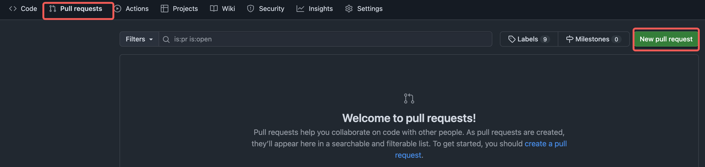
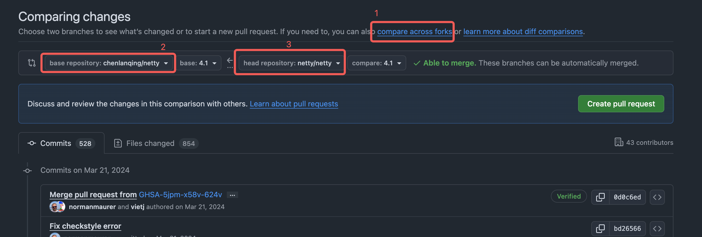
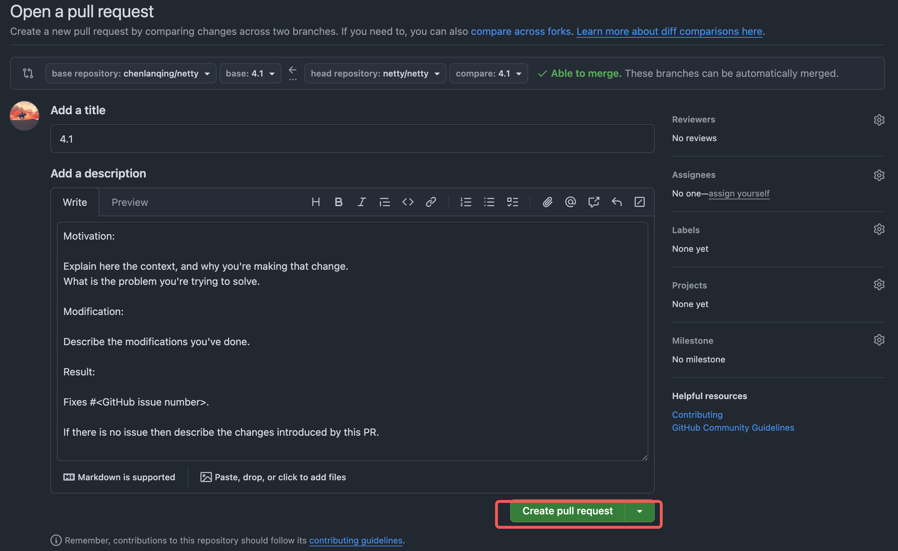
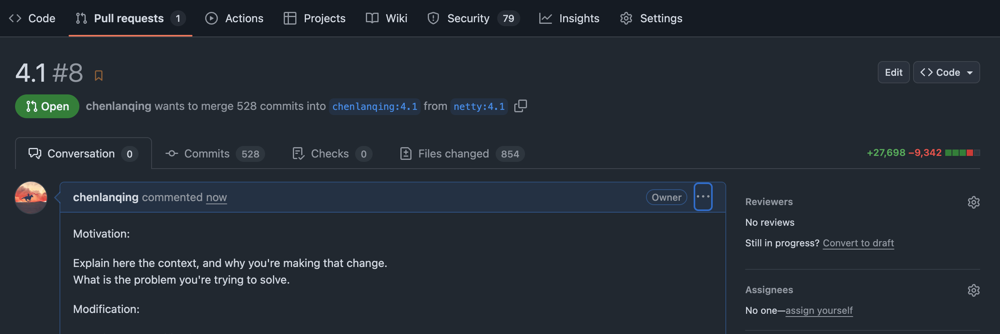
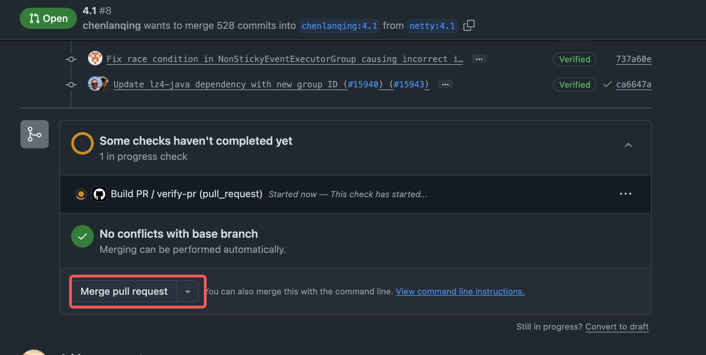
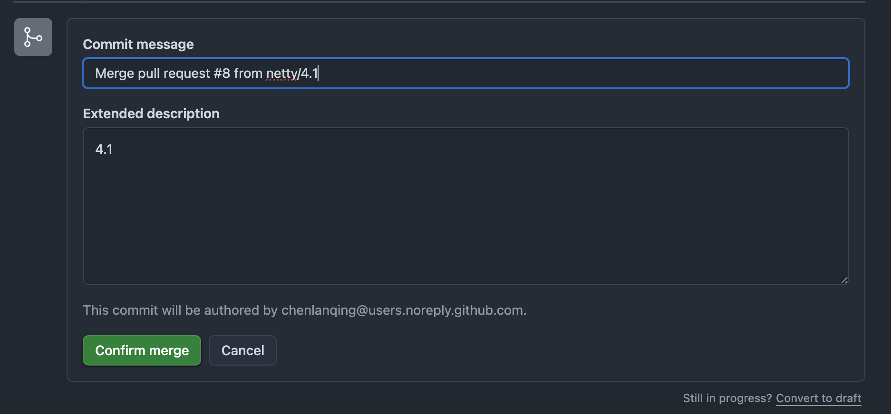

# 1、Github上fork的项目与原项目同步

[github上fork的项目与原项目同步](https://blog.csdn.net/qq1332479771/article/details/56087333)

## 页面操作

- 在 Fork 的工程分支上，选择 Pull requests -> New pull request



- 选择 base repository：这里是fork 后的仓库地址
- 选择 head repository：这是原始仓库地址；如果这两个无法选择，点击一下：compare across forks，就能展示所有可以同步的 commits



- 点击 Create pull request，出现如下界面



- 再次点击 Create pull request，跳转到界面：



- 合并分支



- 确认合并，完成整个同步



## git 命令

使用 git 命令查看远程仓库状态：
```sh
# 查看远程仓库信息
git remote -v 
# 添加远程源仓库地址
git remote add upstream git@github.com:xxx/xxx.git
# 从源仓库同步代码
git fetch upstream
# 合并源仓库代码到本地
git merge upstream/master
# 推送到 fork 的仓库
git push 
```

# 2、GitHub加速

使用反向代理：

## 2.1、加速 git clone

把 github.com 换成代理域名。
```bash
# 原始: 
git clone https://github.com/crewAIInc/crewAI-examples.git
# 加速: 
git clone https://githubproxy.cc/https://github.com/crewAIInc/crewAI-examples.git
```
常用代理域名：
- [githubproxy.cc](https://githubproxy.cc/)
- [ghproxylist.com](https://ghproxylist.com/)
- [ghfast.top](https://ghfast.top/)
- [gh-proxy.com](https://gh-proxy.com/)

# 3、access_token问题

https://blog.csdn.net/weixin_41010198/article/details/119698015

Github 无法使用 账号和密码提交代码：remote: Support for password authentication was removed on August 13, 2021.

# 4、修改默认分支

- [5步将 GitHub 默认分支从 Master 更改为 Main](https://cyfeng.science/2020/12/21/rename-github-branch-from-master-to-main/)
```bash
# Step 1: create main branch locally, taking the history from master
git branch -m master main

# Step 2: push the new local main branch to the remote repo (GitHub) 
git push -u origin main

# Step 3: switch the current HEAD to the main branch
git symbolic-ref refs/remotes/origin/HEAD refs/remotes/origin/main

# Step 4: change the default branch on GitHub to main
# https://docs.github.com/en/github/administering-a-repository/setting-the-default-branch

# Step 5: delete the master branch on the remote
git push origin --delete master
```

# 5、工具

- [zdoc:一个免费的工具，可将 GitHub 的 README 翻译成多种语言，并保持同步](https://www.zdoc.app/zh)
- [DeepWiki:源码解读工具](https://deepwiki.com/)
- [DeepWiki 开源版本-源码分析](https://github.com/AsyncFuncAI/deepwiki-open)
- [Stunning insights for your GitHub Repo](https://repobeats.axiom.co/)
- [Github star history](https://www.star-history.com/)

# 开源项目

## 休闲

- [杂乱输出](https://github.com/svenstaro/genact)
- [跨平台电子宠物](https://github.com/ayangweb/BongoCat)
- [程序员在家做饭指南](https://github.com/Anduin2017/HowToCook)
- [B站 哔哩哔哩 视频下载器](https://github.com/nICEnnnnnnnLee/BilibiliDown)

## 技术

- [中国 Github 用户排行榜](https://china-ranking.aolifu.org/)
- [SAAS 部署产品](https://github.com/Atarity/deploy-your-own-saas)
- [自动修正错误命令](https://github.com/nvbn/thefuck)
- [Supervision 是计算机视觉项目的「万能工具箱」](https://github.com/roboflow/supervision)
- [x86 PC 模拟器和 x86-to-wasm JIT，在浏览器中运行](https://github.com/copy/v86)
- [Ladybird 是真从零写的独立浏览器，不是 Chromium 换皮](https://github.com/LadybirdBrowser/ladybird)
- [警报处理工具：Alertmanager](https://github.com/prometheus/alertmanager)
- [网站变更检测、网页监控和网站变更提醒的最佳且最简单的工具](https://github.com/dgtlmoon/changedetection.io)
- [技术 README 写作技巧](https://github.com/BolajiAyodeji/awesome-technical-writing)
- [谷歌通用的 Java、C++和 JavaScript 库，用于解析、格式化和验证国际电话号码](https://github.com/google/libphonenumber)

## 软件测试开源项目

- [Selenium：Web 自动化测试的扛把子](https://github.com/SeleniumHQ/selenium)
- [JMeter：性能测试的一把好手](https://github.com/apache/jmeter)
- [Cucumber：行为驱动开发的得力助手](https://github.com/cucumber/cucumber)
- [TestNG：Java 测试的利器](https://github.com/cbeust/testng)
- [Behave：Python 的 BDD 好伙伴](https://github.com/behave/behave)
- [Robot Framework：通用自动化测试框架](https://github.com/robotframework/robotframework)
- [RunnerGo：全栈测试的新宠儿](https://github.com/Runner-Go-Team/RunnerGo)
- [Gauge：灵活多变的测试框架](https://github.com/getgauge/gauge)
- [Appium：移动应用测试的救星](https://github.com/appium/appium)


## 设计

- [LOGO生成](https://github.com/bestony/logoly)
- [vRain-纵书排版-中文古籍刻本風格直排電子書製作工具](https://github.com/shanleiguang/vRain)

## 统计

- [umami：网站统计分析工具:谷歌分析的隐私平替](https://github.com/umami-software/umami)
- [ActivityWatch:The best free and open-source automated time tracker](https://github.com/ActivityWatch/activitywatch)

## 生活

- [程序员延寿指南](https://github.com/geekan/HowToLiveLonger)
- [程序员在家做饭指南](https://github.com/Anduin2017/HowToCook)
- [个人财富管理](https://github.com/maybe-finance/maybe)

## 微信

- [一键下载微信公众号文章](https://github.com/qiye45/wechatDownload)
- [AI 微信公众号自动化工具](https://github.com/iniwap/ai_auto_wxgzh)
- [抓取公众号文章生成 RSS 订阅源](https://github.com/rachelos/we-mp-rss)

## 其他

- [x一系列工具列表](https://github.com/trimstray/the-book-of-secret-knowledge)
- [Billion Mail: 一个开源的邮件服务器](https://github.com/aaPanel/BillionMail)
- [Harper：免费开源检测软件](https://github.com/automattic/harper)
- [Pot-desktop: 一个跨平台的划词翻译和OCR软件](https://github.com/pot-app/pot-desktop)
- [Folo 是个信息聚合工具，能把你想关注的各种来源（文章、视频、动态等）都集中放在一个简洁的时间线里，告别到处切换的麻烦](https://github.com/RSSNext/Folo)
- [Scira（原名 MiniPerplx），它是一个主打轻量级和 AI 驱动的搜索引擎。](https://github.com/zaidmukaddam/scira)
- [ArchiveBox:网页时光机，网页归档](https://github.com/ArchiveBox/ArchiveBox)
- [Github项目搜索](https://github.com/xiaoxiunique/1k-github-stars)

# 参考资料

- [发现和分享有趣、入门级开源项目的平台](https://hellogithub.com/)
- [Github实用小技巧](https://javaguide.cn/tools/git/github-tips.html)
- [发现开源项目](https://www.opensourceprojects.dev/)
