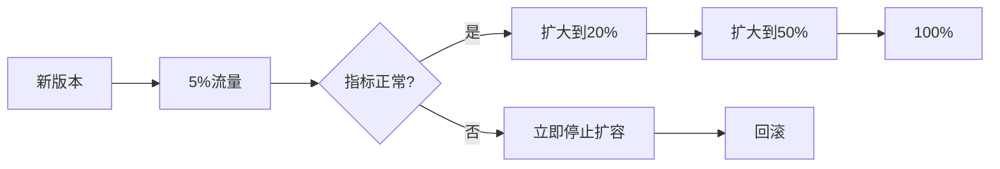
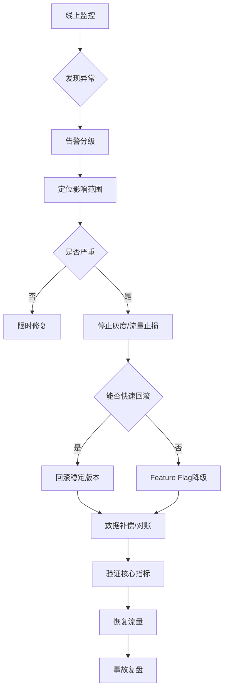

# 线上保证体系

方案上线以后，一般会从“监控发现 → 告警分级 → 快速止损 → 回滚 → 紧急修复 → 复盘”几个环节建立完整的保障机制。

## 监控告警

首先是基础设施监控，包括 CPU、内存、磁盘、网络、JVM、GC、线程池、数据库连接池等。

其次是应用层监控，重点关注：
* QPS、TPS
* 平均响应时间和 P95/P99
* HTTP 5xx、4xx
* 超时率
* 线程池活跃线程数、队列长度
* Redis、MQ 调用耗时和异常率
* 数据库慢 SQL、连接池使用率
* MQ 消息堆积量

对于订单和支付这种核心交易系统，还会增加业务指标，例如：
* 下单成功率
* 支付成功率
* 支付超时率
* 订单状态长时间未变化数量
* 支付成功但订单未更新数量
* MQ 消费失败数量
* 补偿任务数量
* 对账差异数量

也就是说，不仅监控“机器有没有问题”，还要监控“业务有没有问题”。

## 告警分级

告警一般分成 P0、P1、P2。
- P0 是核心交易不可用，例如支付成功率突然大幅下降、订单大量无法创建，需要立即电话或者 IM 告警，要求马上介入。
- P1 是明显性能下降或者部分功能异常，例如 P99 延迟持续超过阈值、MQ 积压快速增长。
- P2 是一般性问题，例如少量接口异常、非核心任务失败，可以由研发在工作时间处理。

同时告警尽量避免只设置一个固定阈值，而是结合“阈值 + 持续时间 + 环比/同比”判断。

例如 P99 突然超过 500ms 并持续 5 分钟，或者支付成功率相比正常基线下降超过一定比例，才触发严重告警，减少告警风暴。

## 发现性能回退之后怎么处理

如果上线后发现 P99 从 200ms 上升到 800ms，我不会马上开始修改代码，而是先判断问题范围。

首先通过 Grafana、APM 和日志确认：
- 请求量有没有突然增加；
- 是哪个接口变慢；
- 是 CPU、GC、线程池还是数据库；
- 是不是某个下游服务变慢；
- MQ 是否发生积压；
- 数据库是否出现慢 SQL。

如果使用 SkyWalking 这类 APM，可以通过 Trace 快速定位到底是哪个 RPC、SQL 或代码段耗时增加。

例如发现：  
API → 订单服务只有 50ms；  
订单服务 → 支付服务变成 500ms。  

那么问题就可以进一步定位到支付链路，而不是盲目调整订单服务线程池。

## 回滚策略

上线的时候我一般不会直接全量发布，而是采用灰度发布。

例如：

灰度期间重点观察：
* P99/P999 延迟
* 错误率
* CPU/GC
* 数据库负载
* MQ 积压
* 下单成功率
* 支付成功率

如果新版本指标明显劣化，首先停止继续放量。

如果确认是代码版本导致，就直接回滚到上一稳定版本。

对于订单和支付这类核心系统，我还会尽量把新功能放到 Feature Flag 后面。

这样即使代码已经部署，也可以先关闭新功能，而不一定需要重新发布。

## 数据层面的回滚

这里需要特别注意：

代码可以快速回滚，但是数据库操作不一定能简单回滚。

所以数据库变更尽量采用向前兼容的方式。

例如新增字段时：

先增加字段 → 发布兼容旧代码 → 新代码开始写入 → 稳定后再切换读取逻辑。

而不是直接删除旧字段或者修改原字段语义。

对于订单和支付这种核心数据，我一般不会依赖数据库事务做线上版本回滚，而是通过状态机、补偿任务和数据修复脚本处理已经产生的业务数据。

## 紧急修复流程

如果问题不能简单通过回滚解决，我会进入紧急修复流程。

第一步是止损。

例如临时关闭非核心功能、降低流量、关闭某个 Feature Flag，或者暂时切换到备用实现。

第二步是定位。

通过日志、Trace、Metrics、数据库监控以及 MQ 监控确定根因。

第三步是修复。

紧急修复尽量遵循“最小变更原则”，只修改导致故障的代码，不在事故期间顺便重构其他模块。

第四步是验证。

先在测试环境验证，然后进行小流量灰度，确认核心指标恢复之后再逐步放量。

## 对于无法回滚的数据异常

比如出现：

支付成功 → 订单状态没有更新。

这种问题即使代码回滚，已经产生的数据也不会自动恢复。

所以系统需要有补偿机制。

例如支付中心发现支付成功，但订单状态长期还是 PAYING，就把它放入补偿队列，由补偿任务重新通知订单中心。

如果多次重试仍然失败，则进入死信队列，同时触发人工告警。

另外通过定时对账任务，从支付渠道、支付中心、订单中心分别查询交易结果，发现状态不一致后自动修复。

整体流程可以概括为：

## 事故复盘

问题解决之后还需要做 RCA。

主要分析：

* 为什么测试环境没有发现；
* 为什么监控没有提前发现；
* 为什么告警没有及时触发；
* 为什么回滚耗时；
* 有没有数据一致性问题；
* 是否需要增加自动化补偿；
* 是否需要增加新的业务监控指标。

最终把事故形成具体的改进项，而不是简单记录“修复完成”。

所以对线上稳定性的理解是：

“监控负责发现问题，告警负责通知问题，灰度和降级负责控制影响面，回滚负责快速恢复服务，补偿和对账负责修复数据，最后通过 RCA 避免同类问题再次发生。”
