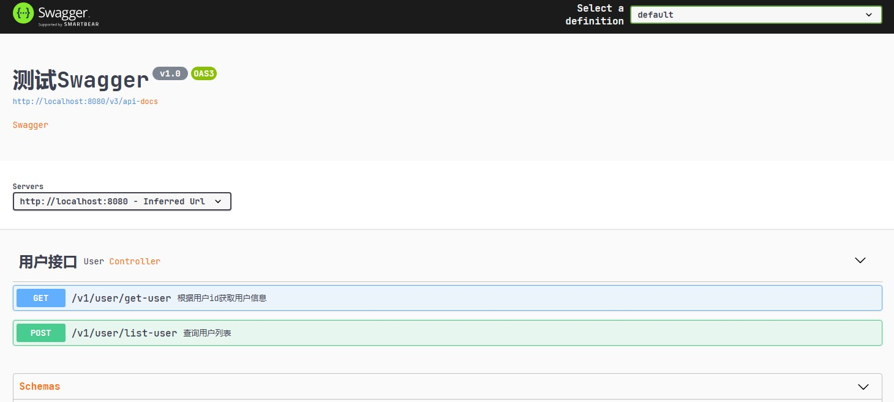
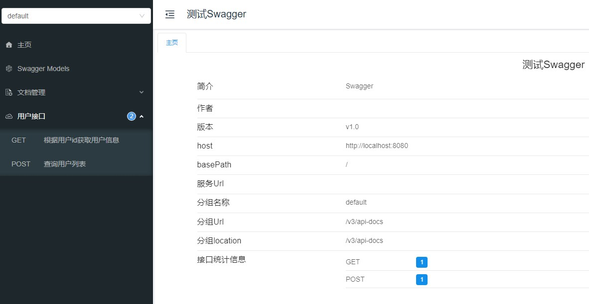
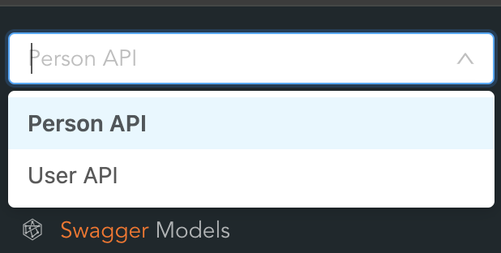
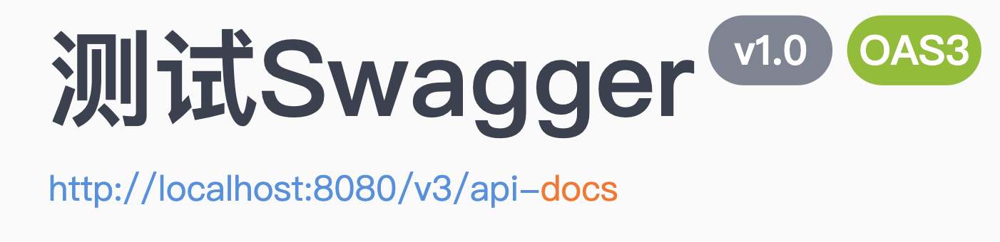
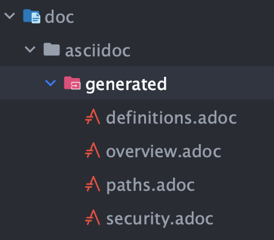
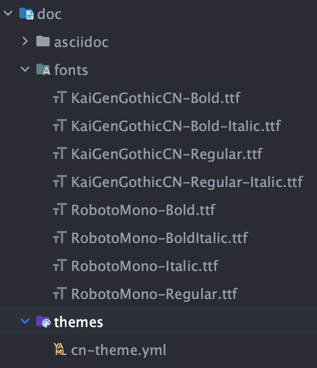

# 一、API设计

[如何设计API](设计案例.md#二API设计)

# 二、Swagger

- [开源集成Swagger](https://swagger.io/tools/open-source/open-source-integrations/)
- [Swagger](https://swagger.io/)
- [Swagger specifications convert to AsciiDoc and PDF](https://blog.devgenius.io/swagger-specifications-convert-to-asciidoc-and-pdf-with-a-custom-font-8e734c6fdd8c)
- [示例代码](https://github.com/chenlanqing/springboot-api-doc)
- [Swagger Editor)

## 1、集成Swagger-UI

- [Spring Boot整合Swagger-UI](https://javabetter.cn/springboot/swagger.html)

> 说明：这里SpringBoot采用的是2.7.18，swagger采用的是springfox:3.0.0

### 1.1、基本步骤
  
（1）在 pom.xml 文件中添加 Swagger 的 starter
```xml
<dependency>
    <groupId>io.springfox</groupId>
    <artifactId>springfox-boot-starter</artifactId>
    <version>3.0.0</version>
</dependency>
```
- springfox-swagger 是一个基于 Spring 生态系统的，Swagger 规范的实现。
- springfox-boot-starter 是 springfox 针对 Spring Boot 项目提供的一个 starter，简化 Swagger 依赖的导入，否则我们就需要在 pom.xml 文件中添加 springfox-swagger、springfox-swagger-ui 等多个依赖

（2）添加Java配置
```java
@Configuration
@EnableOpenApi // 注解表明开启 Swagger
public class SwaggerConfig {
    @Bean
    public Docket docket() {
        Docket docket = new Docket(DocumentationType.OAS_30) // 使用 3.0 版本的 Swagger API。OAS 是 OpenAPI Specification 的简称，翻译成中文就是 OpenAPI 说明书，Swagger 遵循的就是这套规范
                .apiInfo(apiInfo())
                .enable(true)
                .select()
                // apis： 指定匹配所有的 URL，这里可以自定义匹配规则
                .apis(RequestHandlerSelectors.basePackage("com.controller"))
                .paths(PathSelectors.any())
                .build();

        return docket;
    }
    private ApiInfo apiInfo() {// 配置 API 文档基本信息，标题、描述、作者、版本等。
        return new ApiInfoBuilder()
                .title("SpringBoot+Swagger")
                .description("SpringBoot+Swagger集成项目")
                .contact(new Contact("QingFan", "",""))
                .version("v1.0")
                .build();
    }
}
```
SwaggerConfig 类中包含了一个 @Bean 注解声明的方法 docket()，该方法会被 Spring 的 AnnotationConfigApplicationContext 或 AnnotationConfigWebApplicationContext 类进行扫描，然后添加到 Spring 容器当中

（3）添加Controller
```java
@RestController
@Api(tags = "用户接口")
@RequestMapping("/v1/user")
public class UserController {
    @GetMapping("/get-user")
    @ApiOperation("根据用户id获取用户信息")
    public Result<UserVO> getUser(@RequestParam("id") Long id) {
        return Result.ok(new UserVO());
    }
}
```
相关注解参考：[Swagger-Core Annotations](https://github.com/swagger-api/swagger-core/wiki/Annotations-1.5.X)

（4）启动服务，在浏览器中输入 http://localhost:8080/swagger-ui/ 就可以访问 Swagger 生成的 API 文档了，显示效果如下：



### 1.2、版本兼容问题

在 Spring Boot 整合 Swagger 的过程中，Spring Boot 2.6.7 版本和 springfox 3.0.0 版本不兼容，启动的时候直接就报错了：
```java
org.springframework.context.ApplicationContextException: Failed to start bean 'documentationPluginsBootstrapper'; nested exception is java.lang.NullPointerException
	at org.springframework.context.support.DefaultLifecycleProcessor.doStart(DefaultLifecycleProcessor.java:182) ~[spring-context-5.3.31.jar:5.3.31]
	...
	at org.springframework.boot.web.servlet.context.ServletWebServerApplicationContext.refresh(ServletWebServerApplicationContext.java:147) ~[spring-boot-2.7.18.jar:2.7.18]
	at org.springframework.boot.SpringApplication.refresh(SpringApplication.java:732) ~[spring-boot-2.7.18.jar:2.7.18]
	at org.springframework.boot.SpringApplication.refreshContext(SpringApplication.java:409) ~[spring-boot-2.7.18.jar:2.7.18]
	at org.springframework.boot.SpringApplication.run(SpringApplication.java:308) ~[spring-boot-2.7.18.jar:2.7.18]
	at org.springframework.boot.SpringApplication.run(SpringApplication.java:1300) ~[spring-boot-2.7.18.jar:2.7.18]
	at org.springframework.boot.SpringApplication.run(SpringApplication.java:1289) ~[spring-boot-2.7.18.jar:2.7.18]
	at com.qing.fan.Boot2Swagger2.main(Boot2Swagger2.java:15) ~[classes/:na]
Caused by: java.lang.NullPointerException: null
	at springfox.documentation.spring.web.WebMvcPatternsRequestConditionWrapper.getPatterns(WebMvcPatternsRequestConditionWrapper.java:56) ~[springfox-spring-webmvc-3.0.0.jar:3.0.0]
	at springfox.documentation.RequestHandler.sortedPaths(RequestHandler.java:113) ~[springfox-core-3.0.0.jar:3.0.0]
	at springfox.documentation.spi.service.contexts.Orderings.lambda$byPatternsCondition$3(Orderings.java:89) ~...
	at springfox.documentation.spring.web.plugins.AbstractDocumentationPluginsBootstrapper.withDefaults(AbstractDocumentationPluginsBootstrapper.java:107) ~[springfox-spring-web-3.0.0.jar:3.0.0]
	at springfox.documentation.spring.web.plugins.AbstractDocumentationPluginsBootstrapper.buildContext(AbstractDocumentationPluginsBootstrapper.java:91) ~[springfox-spring-web-3.0.0.jar:3.0.0]
	at springfox.documentation.spring.web.plugins.AbstractDocumentationPluginsBootstrapper.bootstrapDocumentationPlugins(AbstractDocumentationPluginsBootstrapper.java:82) ~[springfox-spring-web-3.0.0.jar:3.0.0]
	at springfox.documentation.spring.web.plugins.DocumentationPluginsBootstrapper.start(DocumentationPluginsBootstrapper.java:100) ~[springfox-spring-web-3.0.0.jar:3.0.0]
	at org.springframework.context.support.DefaultLifecycleProcessor.doStart(DefaultLifecycleProcessor.java:179) ~[spring-context-5.3.31.jar:5.3.31]
```
Github上已经有人针对这个提了问题：[because "this.condition" is null #28794](https://github.com/spring-projects/spring-boot/issues/28794)，在Springfox的github上有个问题：[swagger-starter3.0 not support springBoot2.6.x version #3934](https://github.com/springfox/springfox/issues/3934)

其中一个解决方案是切换到[Springdoc](https://springdoc.org/)，但是相对比较麻烦，如果需要从Springfox迁移到Springdoc上，需要改动比较多，详细参考：[Migrating from SpringFox](https://springdoc.org/#migrating-from-springfox)

另外一个解决方案就是：[Spring 5.3/Spring Boot 2.4 support](https://github.com/springfox/springfox/issues/3462)，主要原因：Springfox 和 Spring 在 pathPatternsCondition 上产生了分歧，这两个步骤就是用来消除这个分歧的：
（1）将匹配策略调整为 ant-path-matcher（application.yml）
```yaml
spring:
  mvc:
    path match:
        matching-strategy: ANT_PATH_MATCHER
```
（2）swagger配置类增加如下信息：
```java
@Bean
public static BeanPostProcessor springfoxHandlerProviderBeanPostProcessor() {
    return new BeanPostProcessor() {
        @Override
        public Object postProcessAfterInitialization(Object bean, String beanName) throws BeansException {
            if (bean instanceof WebMvcRequestHandlerProvider || bean instanceof WebFluxRequestHandlerProvider) {
                customizeSpringfoxHandlerMappings(getHandlerMappings(bean));
            }
            return bean;
        }
        private <T extends RequestMappingInfoHandlerMapping> void customizeSpringfoxHandlerMappings(List<T> mappings) {
            List<T> copy = mappings.stream()
                    .filter(mapping -> mapping.getPatternParser() == null)
                    .collect(Collectors.toList());
            mappings.clear();
            mappings.addAll(copy);
        }
        @SuppressWarnings("unchecked")
        private List<RequestMappingInfoHandlerMapping> getHandlerMappings(Object bean) {
            try {
                Field field = ReflectionUtils.findField(bean.getClass(), "handlerMappings");
                field.setAccessible(true);
                return (List<RequestMappingInfoHandlerMapping>) field.get(bean);
            } catch (IllegalArgumentException | IllegalAccessException e) {
                throw new IllegalStateException(e);
            }
        }
    };
}
```

## 2、Swagger整合Knife4j

- [Swagger-Knife4j](https://javabetter.cn/gongju/knife4j.html)

Knife4j 的前身是 swagger-bootstrap-ui，是 springfox-swagger-ui 的增强 UI 实现。swagger-bootstrap-ui 采用的是前端 UI 混合后端 Java 代码的打包方式，在微服务的场景下显得非常臃肿，改良后的 Knife4j 更加小巧、轻量，并且功能更加强大


整体上看起来比较难看，可以结合 [Knife4j](https://doc.xiaominfo.com/docs/quick-start) 来美化页面展示；

（1）添加 Knife4j 的依赖
```xml
<dependency>
    <groupId>com.github.xiaoymin</groupId>
    <artifactId>knife4j-spring-boot-starter</artifactId>
    <version>3.0.3</version>
</dependency>
```
> 说明：这里不需要引入 springfox-boot-starter

（2）其他配置同集成swagger

（3）启动应用后，访问：http://localhost:8080/doc.html



**可能存在的问题**

按照上述步骤集成Knife4j，可能会报如下错误：
```java
Caused by: java.lang.NoClassDefFoundError: javax/validation/constraints/NotBlank
```
原因是 javax-validation 版本冲突，导致没有NotBlank，解决办法：
```xml
<dependency>
    <groupId>com.github.xiaoymin</groupId>
    <artifactId>knife4j-spring-boot-starter</artifactId>
    <version>3.0.3</version>
    <exclusions>
        <exclusion>
            <artifactId>validation-api</artifactId>
            <groupId>javax.validation</groupId>
        </exclusion>
    </exclusions>
</dependency>
<dependency>
    <groupId>javax.validation</groupId>
    <artifactId>validation-api</artifactId>
    <version>2.0.1.Final</version>
</dependency>
```

## 3、Swagger多包分组

分组的效果如下：



分组逻辑主要设置：
```java
@Bean(value = "personDocket")
public Docket personDocket() {
    List<Response> responses = buildResponseList();
    return new Docket(DocumentationType.OAS_30)
            .apiInfo(apiInfo())
            .groupName("Person API") // 设置分组名称
            .enable(true)
            .select()
            //apis： 添加swagger接口提取范围
            .apis(new Predicate<RequestHandler>() {
                @Override
                public boolean test(RequestHandler requestHandler) {
                    // 可以实现匹配逻辑
                    // 比如包路径、具体接口是否包含某个注解等
                    return false;
                }
            })
            .paths(PathSelectors.any())
            .build();
}
```
主要是设置 apis的匹配逻辑：
```java
public ApiSelectorBuilder apis(Predicate<RequestHandler> selector) {
    this.requestHandlerSelector = this.requestHandlerSelector.and(selector);
    return this;
}
public ApiSelectorBuilder paths(Predicate<String> selector) {
    this.pathSelector = this.pathSelector.and(selector);
    return this;
}
```
当然也可以使用：RequestHandlerSelectors 静态方法来实现

具体代码实现参考：[SwaggerConfig](https://github.com/chenlanqing/springboot-api-doc/blob/main/boot2-springfox-kinfe4j/src/main/java/com/qing/fan/config/SwaggerConfig.java)
```java
Configuration
@EnableOpenApi
public class SwaggerConfig {

    @Bean(value = "userDocket")
    public Docket userDocket() {
        List<Response> responses = buildResponseList();
        return new Docket(DocumentationType.OAS_30)
                .useDefaultResponseMessages(false)
                .globalResponses(HttpMethod.GET, responses)
                .globalResponses(HttpMethod.POST, responses)
                .apiInfo(apiInfo())
                .groupName("User API")
                .enable(true)
                .select()
                //apis： 添加swagger接口提取范围
                .apis(RequestHandlerSelectors.basePackage("com.qing.fan.controller"))
                .apis(basePackage("com.qing.fan.controller.user"))
                .paths(PathSelectors.any())
                .build();
    }

    @Bean(value = "personDocket")
    public Docket personDocket() {
        List<Response> responses = buildResponseList();
        return new Docket(DocumentationType.OAS_30)
                .useDefaultResponseMessages(false)
                .globalResponses(HttpMethod.GET, responses)
                .globalResponses(HttpMethod.POST, responses)
                .apiInfo(apiInfo())
                .groupName("Person API")
                .enable(true)
                .select()
                //apis： 添加swagger接口提取范围
                .apis(RequestHandlerSelectors.basePackage("com.qing.fan.controller"))
                .apis(basePackage("com.qing.fan.controller.person"))
                .paths(PathSelectors.any())
                .build();
    }
    private ApiInfo apiInfo() {
        return new ApiInfoBuilder()
                .title("测试Swagger")
                .description("Swagger")
                .version("v1.0")
                .build();
    }
    private List<Response> buildResponseList() {
        List<Response> responseList = new ArrayList<>();
        responseList.add(new ResponseBuilder().code("200").description("Success").build());
        responseList.add(new ResponseBuilder().code("400").description("参数错误").build());
        responseList.add(new ResponseBuilder().code("401").description("没有认证").build());
        responseList.add(new ResponseBuilder().code("403").description("没有访问权限").build());
        responseList.add(new ResponseBuilder().code("404").description("找不到资源").build());
        responseList.add(new ResponseBuilder().code("500").description("服务器内部错误").build());
        return responseList;
    }
    /**
     * 重写basePackage方法，使能够实现多包访问
     */
    public static Predicate<RequestHandler> basePackage(final String basePackage) {
        return new Predicate<RequestHandler>() {
            @Override
            public boolean test(RequestHandler requestHandler) {
                Class<?> clazz = requestHandler.declaringClass();
                // 匹配包
                for (String packageStr : basePackage.split(";")) {
                    boolean matched = clazz.getPackage().getName().startsWith(packageStr);
                    if (matched) {
                        return true;
                    }
                }
                return false;
            }
        };
    }
    @Bean
    public static BeanPostProcessor springfoxHandlerProviderBeanPostProcessor() {
        return new BeanPostProcessor() {

            @Override
            public Object postProcessAfterInitialization(Object bean, String beanName) throws BeansException {
                if (bean instanceof WebMvcRequestHandlerProvider || bean instanceof WebFluxRequestHandlerProvider) {
                    customizeSpringfoxHandlerMappings(getHandlerMappings(bean));
                }
                return bean;
            }

            private <T extends RequestMappingInfoHandlerMapping> void customizeSpringfoxHandlerMappings(List<T> mappings) {
                List<T> copy = mappings.stream()
                        .filter(mapping -> mapping.getPatternParser() == null)
                        .collect(Collectors.toList());
                mappings.clear();
                mappings.addAll(copy);
            }

            @SuppressWarnings("unchecked")
            private List<RequestMappingInfoHandlerMapping> getHandlerMappings(Object bean) {
                try {
                    Field field = ReflectionUtils.findField(bean.getClass(), "handlerMappings");
                    field.setAccessible(true);
                    return (List<RequestMappingInfoHandlerMapping>) field.get(bean);
                } catch (IllegalArgumentException | IllegalAccessException e) {
                    throw new IllegalStateException(e);
                }
            }
        };
    }
}
```

# 三、SpringDoc

- [springdoc-openapi v1.8.0](https://springdoc.org/v1/)
- [springdoc-openapi v2.6.0](https://springdoc.org/)

## 1、关于版本

[SpringBoot与SpringDoc版本对应](https://springdoc.org/#what-is-the-compatibility-matrix-of-springdoc-openapi-with-spring-boot)

`springdoc-openapi:2.x` 与 `spring-boot:3+` 兼容。

springdoc-openapi 的 spring-boot 版本的详尽列表：

spring-boot Versions  |	Minimum springdoc-openapi Versions
----------------------|-----------------------------------
3.0.x | 2.0.x+
2.7.x, 1.5.x | 1.6.0+
2.6.x, 1.5.x | 1.6.0+
2.5.x, 1.5.x | 1.5.9+
2.4.x, 1.5.x | 1.5.0+
2.3.x, 1.5.x | 1.4.0+
2.2.x, 1.5.x | 1.2.1+
2.0.x, 1.5.x | 1.0.0+

> 说明，SpringBoot:2.7.18 和 SpringDoc：1.8.0 不兼容
> Springdoc-openapi v1.7.0 是支持 Spring Boot 2.x 和 1.x 的最后一个版本。

## 2、Springfox迁移

参考官方文档：[Migrating from SpringFox](https://springdoc.org/v1/#migrating-from-springfox)

- 将swagger2注释替换为swagger3注释（它已包含在springdoc-openapi-ui依赖项中）, swagger 3注释的包是`io.swagger.v3.oas.annotations`
    - `@Api` → `@Tag`
    - `@ApiIgnore` → `@Parameter(hidden = true)` or `@Operation(hidden = true)` or `@Hidden`
    - `@ApiImplicitParam` → `@Parameter`
    - `@ApiImplicitParams` → `@Parameters`
    - `@ApiModel` → `@Schema`
    - `@ApiModelProperty(hidden = true, name="")` → `@Schema(accessMode = READ_ONLY, title="")`
    - `@ApiModelProperty` → `@Schema`
    - `@ApiOperation(value = "foo", notes = "bar")` → `@Operation(summary = "foo", description = "bar")`
    - `@ApiParam` → `@Parameter`
    - `@ApiResponse(code = 404, message = "foo")` → `@ApiResponse(responseCode = "404", description = "foo")`

## 3、集成

- [Spring Boot 3 OpenAPI Docs with Springdoc and Swagger](https://howtodoinjava.com/spring-boot/springdoc-openapi-rest-documentation/)

# 四、Swagger生成PDF

- [Swagger2Markup 生成PDF、HTML格式的API文档方法整理（中文支持）](https://blog.csdn.net/aaa_a_b_c/article/details/105482847)
- [Swagger2Markup](https://github.com/Swagger2Markup/swagger2markup)

## 1、生成ASCIIDOC

[ASCIIDOC](https://asciidoc.org/) 是一种轻型标记语言，类似于 Markdown；

swagger2markup 提供了两种方式可以将swagger.json文件生成：
- API
- Maven插件

获取swagger.json的方式，下图中是获取 v3 版本的数据，也可以获取 v2 版本的数据：http://localhost:8080/v2/api-docs



### 1.1、swagger2markup API 生成

添加依赖：
```xm
<dependency>
    <groupId>io.github.swagger2markup</groupId>
    <artifactId>swagger2markup</artifactId>
    <version>1.3.3</version>
</dependency>
```
代码如下：
```java
public static void main(String[] args) throws Exception {
    // 用于转换的swagger.json可以来自于本地文件，也可以来http 获取
    URL remoteSwaggerFile = new URL("http://localhost:8080/v2/api-docs");

    // asciidoc 输出文件夹
    Path outputDir = Paths.get("./doc/asciidoc/generated");

    // 转换配置设置
    Swagger2MarkupConfig config = new Swagger2MarkupConfigBuilder()
            .withMarkupLanguage(MarkupLanguage.ASCIIDOC) // ASCIIDOC
            .withOutputLanguage(Language.ZH) // 中文
            .withPathsGroupedBy(GroupBy.TAGS) // 分组标识
            .build();

    Swagger2MarkupConverter.from(remoteSwaggerFile)
            .withConfig(config)
            .build()
            .toFolder(outputDir);
}
```
完整属性列表参考官方文档：[3.2.5. Swagger2Markup properties](https://swagger2markup.github.io/swagger2markup/1.3.3/#_swagger2markup_properties)

### 1.2、swagger2markup 插件生成

pom.xml 添加插件如下:
```xml
<plugin>
    <groupId>io.github.swagger2markup</groupId>
    <artifactId>swagger2markup-maven-plugin</artifactId>
    <version>1.3.3</version>
    <dependencies>
        <dependency>
            <groupId>io.github.swagger2markup</groupId>
            <artifactId>swagger2markup</artifactId>
            <version>1.3.3</version>
        </dependency>
    </dependencies>
    <configuration>
        <!--本地 swagger.json 路径 或 远程访问地址-->
        <swaggerInput>http://localhost:8080/v2/api-docs</swaggerInput>
        <!-- 输出目录 -->
        <outputDir>../doc/asciidoc/generated</outputDir>
        <config>
            <!--设置输出文件的语言：ASCIIDOC, MARKDOWN, CONFLUENCE_MARKUP-->
            <swagger2markup.markupLanguage>ASCIIDOC</swagger2markup.markupLanguage>
            <!--设置目录的展现方式-->
            <swagger2markup.pathsGroupedBy>TAGS</swagger2markup.pathsGroupedBy>
        </config>
    </configuration>
    <executions>
        <execution>
            <!--  -->
            <phase>package</phase>
            <goals>
                <goal>convertSwagger2markup</goal>
            </goals>
        </execution>
    </executions>
</plugin>
```
生成的时间，修改此处即可：`<phase>package</phase>`

### 1.3、生成的目录如下：



## 2、ASCIIDOC转PDF

采用 [asciidoctor-maven-plugin](https://docs.asciidoctor.org/maven-tools/latest/) 插件的方式来转化Ascii文档。

### 2.1、添加中文主题和字体文件夹

下载字体[（RobotoMono 开头和 KaiGenGothicCN 开头的字体文件）和theme文件（Source code (zip)）](https://github.com/chloerei/asciidoctor-pdf-cjk-kai_gen_gothic/releases)。

在项目的文档目录下创建fonts和themes两个目录，把下载的8个字体文件复制到fonts目录下，解压`asciidoctor-pdf-cjk-kai_gen_gothic-0.1.0-fonts.zip`文件，把`data\themes\`下的`cn-theme.yml`复制到themes目录下:



### 2.2、创建index.adoc

```adoc
include::asciidoc/generated/overview.adoc[]
include::asciidoc/generated/paths.adoc[]
include::asciidoc/generated/security.adoc[]
include::asciidoc/generated/definitions.adoc[]
```
此文件主要用于指引插件访问asciidoc文档

### 2.3、插件配置

```xml
<plugin>
    <groupId>org.asciidoctor</groupId>
    <artifactId>asciidoctor-maven-plugin</artifactId>
    <version>1.5.3</version>

    <!-- Include Asciidoctor PDF for pdf generation -->
    <dependencies>
        <dependency>
            <groupId>org.asciidoctor</groupId>
            <artifactId>asciidoctorj-pdf</artifactId>
            <version>1.5.0-alpha.11</version>
        </dependency>
        <!-- Comment this section to use the default jruby artifact provided by the plugin -->
        <dependency>
            <groupId>org.jruby</groupId>
            <artifactId>jruby-complete</artifactId>
            <version>9.1.8.0</version>
        </dependency>
        <!-- Comment this section to use the default AsciidoctorJ artifact provided by the plugin -->
        <dependency>
            <groupId>org.asciidoctor</groupId>
            <artifactId>asciidoctorj</artifactId>
            <version>1.5.4</version>
        </dependency>
    </dependencies>

    <!-- Configure generic document generation settings -->
    <configuration>
        <!--默认指向 ${basedir}/src/main/asciidoc-->
        <sourceDirectory>../doc/</sourceDirectory>
        <!--an override to process a single source file; 默认指向 ${sourceDirectory} 中的所有文件-->
        <sourceDocumentName>index.adoc</sourceDocumentName>
        <attributes>
            <doctype>book</doctype>
            <toc>left</toc>
            <toclevels>3</toclevels>
            <numbered></numbered>
            <hardbreaks></hardbreaks>
            <sectlinks></sectlinks>
            <sectanchors></sectanchors>
        </attributes>
    </configuration>
    <!-- Since each execution can only handle one backend, run
            separate executions for each desired output type -->
    <executions>
        <execution>
            <id>output-html</id>
            <phase>package</phase>
            <goals>
                <goal>process-asciidoc</goal>
            </goals>
            <configuration>
                <backend>html5</backend>
                <outputDirectory>../doc/asciidoc/html</outputDirectory>
                <sourceHighlighter>coderay</sourceHighlighter>
            </configuration>
        </execution>
        <execution>
            <id>output-pdf</id>
            <phase>package</phase>
            <goals>
                <goal>process-asciidoc</goal>
            </goals>
            <configuration>
                <backend>pdf</backend>
                <outputDirectory>../doc/asciidoc/pdf</outputDirectory>
                <sourceHighlighter>coderay</sourceHighlighter>
                <doctype>book</doctype>
                <attributes>
                    <toc>left</toc>
                    <toclevels>3</toclevels>
                    <numbered></numbered>
                    <hardbreaks></hardbreaks>
                    <sectlinks></sectlinks>
                    <sectanchors></sectanchors>
                    <pdf-fontsdir>./fonts</pdf-fontsdir>
                    <pdf-stylesdir>./themes</pdf-stylesdir>
                    <pdf-style>cn</pdf-style>
                </attributes>
            </configuration>
        </execution>
    </executions>
</plugin>
```
生成的时间，修改此处即可：`<phase>package</phase>`

## 3、代码目录

[swagger-document](https://github.com/chenlanqing/springboot-api-doc/tree/main/swagger-document)

# 参考资料

- [mkdocs-material](https://github.com/squidfunk/mkdocs-material)
- [YApi](https://github.com/YMFE/yapi)
- [hoppscotch-开源API，对标Postman](https://github.com/hoppscotch/hoppscotch)
- [API官方文档编写参考示例](https://github.com/longportapp/openapi-website)
- [Bruno 是一款全新且创新的 API 客户端](https://github.com/usebruno/bruno)
