# 一、秒杀系统

- [一个秒杀系统的设计思考](https://segmentfault.com/a/1190000020970562)
- [一个极简、高效的秒杀系统](https://blog.csdn.net/caiguoxiong0101/article/details/104866073)

## 1、概述

### 1.1、术语

- 热点隔离：秒杀系统设计的第一个原则就是将这种热点数据隔离出来，不要让1%的请求影响到另外的99%，隔离出来后也更方便对这1%的请求做针对性优化；
- 业务隔离：把秒杀做成一种营销活动，卖家要参加秒杀这种营销活动需要单独报名，从技术上来说，卖家报名后对我们来说就是已知热点，当真正开始时我们可以提前做好预热；
- 系统隔离：系统隔离更多是运行时的隔离，可以通过分组部署的方式和另外99%分开。秒杀还申请了单独的域名，目的也是让请求落到不同的集群中；
- 数据隔离： 秒杀所调用的数据大部分都是热数据，比如会启用单独cache集群或MySQL数据库来放热点数据，目前也是不想0.01%的数据影响另外99.99%；

### 1.2、秒杀需要考虑的点

- 秒杀活动的业务特点；
- 秒杀系统的请求链路；
- 了解秒杀的系统瓶颈；

### 1.3、秒杀怎么玩

通常的业务场景：
- 平台商家会拿出稀缺商品，事先在秒杀的运营系统中设置好活动的开始、结束时间，以及投入的库存（简单的玩法，只要这几个主要元素即可）；
- 活动开始之前，秒杀按钮是灰色的，不可点击
- 在活动开始之后，用户可以通过活动抢购入口（一个商品详情页，或是一个广告链接），进入到活动的结算页，然后点击下单，完成商品的抢购操作；

上面这个流程通用性很强，可以适配大部分平台，当然还有一些可以改进的点：
- 如果对流量有预期，可以加上预约功能，即在活动开始前，先开放一段时间的预约，让用户先去进行预约，然后才能获得参加抢购活动的资格；
- 如果面对的业务场景复杂些，你还可以联合风控，在参加活动时校验用户资质，踢掉黄牛以及有过不良行为的人，尽量将资源给到优质用户；
- 当然也可以搭配限购开展活动，控制个人维度下一段时间内的购买数，让抢购成功的快乐触达更多的人；

通用流程如下：

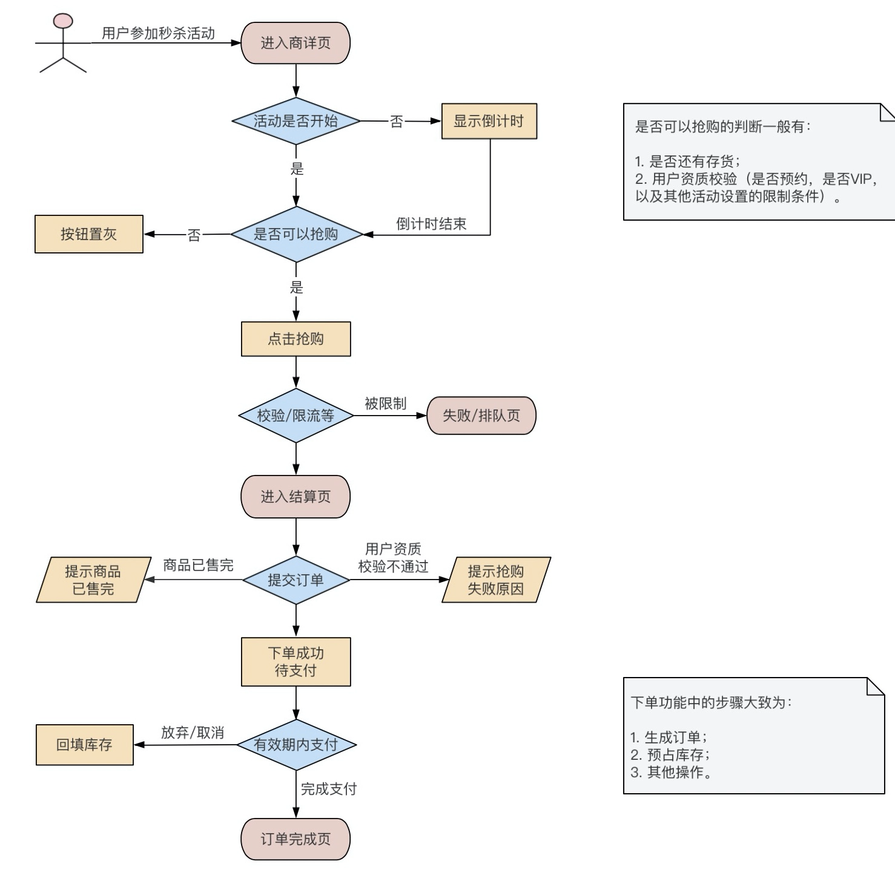

### 1.4、秒杀通用业务架构

秒杀业务独立部署

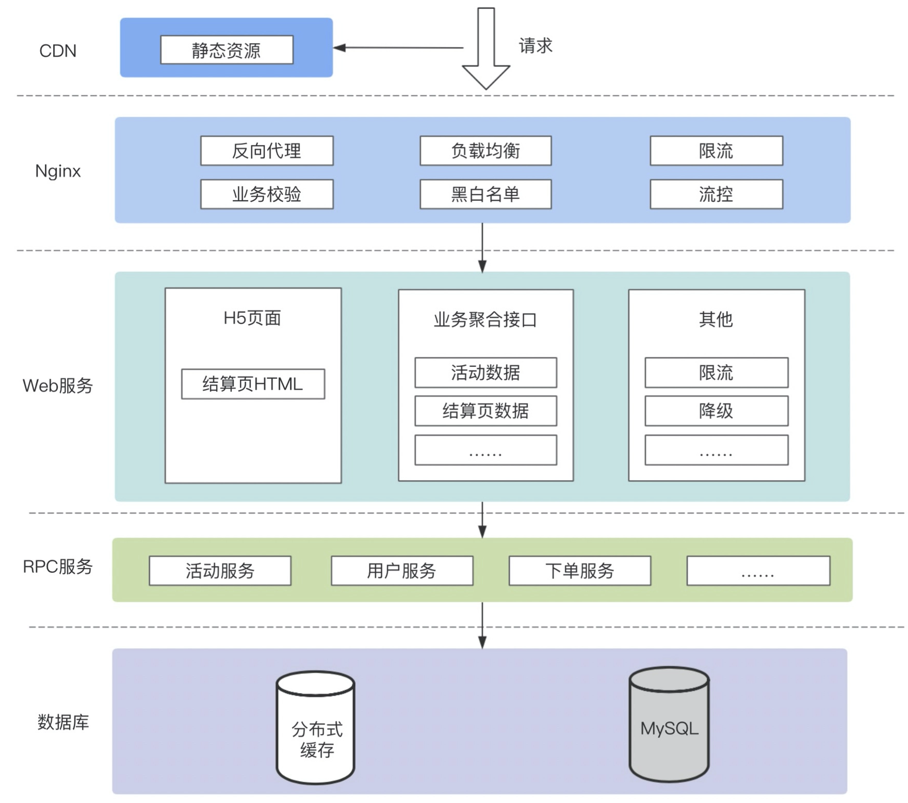

## 2、秒杀要解决的核心问题

- 如何设计一个独立于原有电子商务系统的秒杀系统，并独立部署。
- 这个秒杀系统如何承受比正常情况高数百倍的高并发访问压力。
- 如何防止跳过秒杀页面获得下单 URL。

## 3、设计原则

秒杀系统的本质就是：一个满足大并发、高性能和高可用的分布式系统

架构原则总结为“4要1不要”
- 数据尽量要少
    - 首先是指用户请求的数据能少就少。因为这些数据在网络上传输需要时间，其次不管是请求数据还是返回数据都需要服务器做处理，而服务器在写网络时通常都要做压缩和字符编码；
    - 其实是还要求系统以来的数据能少就少，包括系统完成某些业务逻辑需要读取和保存的数据。而且数据库本身也容易成为一个瓶颈；
- 请求数要尽量少：
    - 用户请求的页面返回后，浏览器渲染这个页面还要包含其他的额外请求，比如依赖的Css/JavaScript、图片，以及ajax请求等，这些额外的请求应该尽量少；
    - 减少请求数最常用的一个实践是合并css和JavaScript文件；这种方式在服务端仍然是单个文件各自存储，只是服务端会有一个组件解析这个URL，然后动态把这些文件合并在一起返回；
- 路径要尽量短：“路径”，就是用户发出请求到返回数据这个过程中，需求经过的中间的节点数；通常这些节点可以表示为一个系统或者一个新的Socket连接。每经过一个节点，一般都会产生一个新的Socket连接；
    缩短请求路径不仅可以增加可用性，同样可以有效提升性能，并减少延时；要缩短访问路径有一种办法，就是多个相互强依赖的应用合并部署在一起，把远程过程调用变成JVM内部之间的方法调用；
- 依赖要尽量少：所谓依赖指的是要完成一次用户请求必须依赖的系统或者服务，这里的依赖指的是强依赖；
    要减少依赖，可以给系统进行分级，比如0级系统、1级系统、2级系统、3级系统，0级系统如果是最重要的系统，那么0级系统强依赖的系统也同样是最重要的系统；
- 不要有单点：应用无状态化

## 4、秒杀实现关键技术

### 4.1、动静分离

所谓动静分离其实是把用户请求的数据划分为`动态数据`和`静态数据`；简而言之，`动态数据`和`静态数据`的主要区别就是看页面中输出的数据是否和URL、浏览者、时间、地域相关，以及是否包含有cookie等私密数据；主要一点是数据中是否含有和访问者相关的个性化数据
- 静态数据缓存
    - 将静态数据缓存到离用户最近的地方；常见的有浏览器、CDN、服务端的cache中；
    - 静态化改造就是要直接缓存HTTP连接
- 全页面静态化：在服务端完成html、css甚至js的渲染成纯hmtl文件部署到CDN上；
    借助phantomjs实现，借助其模拟webkit，采用initView 和hasInit 方式防止多次初始化，编写对应轮询生成的内容方式，将全静态化页面生成后推送到CDN

    考虑将商品模型拆分更新的粒度：对于价格、库存实时性要求高的每次都到服务端拿最新的值；对于sku中其他的属性取CDN内容就行，如果这些实时性要求不高的属性变化了，上游系统发给我们属性变更的消息，我们拿到这个消息出发脚本重新执行一遍无头js，然后把生成的html文件再推倒CDN；

    全页面静态化技术如何保证及时下架：商品变动或下架后，由后端系统触发异步消息给某一个服务，这个服务负责调用爬虫重新生成最新的页面后推送给cdn服务，这些都是需要api对接的

### 4.2、热点数据

- 热点操作：大量的刷新页面、大量的添加购物车、双十一零点下单；这些操作可以抽象为读请求、写请求；读请求的优化空间大些，写请求的瓶颈在存储层；
- 热点数据：
    - 静态热点数据：能够提前预测的热点数据，根据大数据分析的历史成交记录、用户的购物记录等，还可以由卖家报名方式提前筛选出来
    - 动态热点数据：不能被提前预测的数据

处理热点数据的思路：一是优化、二是限制、三是隔离
- 优化：最有效的办法是缓存热点数据，如果热点数据做了动静分离，那么可以长期缓存数；
- 限制：保护机制，例如对被访问的商品做一致性hash，然后根据hash做分桶，每个分桶设置一个处理队列，可以把热点商品限制在一个请求队列中；
- 隔离：秒杀系统的第一原则就是将热点数据隔离出来；
     - 业务隔离：可以把秒杀做成营销活动，卖家要参加秒杀需要单独报名，可以做好提前预热；
     - 系统隔离：更多的是运行时隔离，可以通过分组部署的方式另外的分开；秒杀可以申请单独的域名，让请求落到不同的集群中；
     - 数据隔离：秒杀系统所用的数据大部分是热点数据，可以启用单独的cache或者mysql数据库来放热点数据；
- 基于时间分片削峰：增加秒杀答题，既可以防止秒杀器也可以把峰值的下单请求给拉长了，从以前的1s之内延长到2~10s左右，请求峰值基于时间分片了，这个时间的分片对服务端处理并发非常重要；
- 数据分层校验：所谓分层校验就是对大量的请求做成“漏斗”式设计，在不同层次尽可能把无效的请求过滤，“漏斗”的最末端才是有效的请求，要达到这个效果必须对数据做分层的校验，把大量静态不需要检验的数据放在离用户最近的地方；
- 实时热点发现：

### 4.3、流量削峰

可以Nginx前置用来做 Web 网关，承担部分业务逻辑校验，并且增加黑白名单、限流和流控的功能；

#### 4.3.1、为什么要削峰

服务器的处理资源是恒定的，出现峰值的情况下，很容易导致服务器崩溃。削峰的存在：
- 可以让服务端处理变的更加平稳；
- 节省服务器的资源成本

#### 4.3.2、排队

**如何排队**

使用消息队列来缓冲瞬时流量，把同步的直接调用转换成异步的间接推送。

除了消息队列外，还有一些其他的排队方式：
- 利用线程池加锁等待；
- 先进先出、先进后出等常用的内存排队算法；
- 把请求序列化到文件中，然后在顺序的读文件来恢复请求，类似mysql的binlog同步机制；

**如何泄洪**

#### 4.3.3、秒杀令牌

- 秒杀接口需要依靠令牌才能进入；
- 秒杀令牌由秒杀模块负责生产；
- 秒杀用户需要获得令牌才可以进入；

秒杀大闸：
- 依靠秒杀令牌的授权原理定制发牌逻辑；做到大闸功能

#### 4.3.4、答题

主要是为了增加购买的复杂度，从而达到两个目的：
- 防止部分买家使用秒杀器参加秒杀时作弊；
- 延缓请求，起到对请求流量进行削峰的作用。其主要是把峰值的下单请求拉长。

秒杀答题的设计思路：


整个秒杀答题逻辑主要分为三个部分：
- 题库生成模块
- 题库的推送模块
- 题库的图片生成模块

#### 4.3.5、分层过滤

分层过滤就是采用漏斗式设计来处理请求。分层过滤的核心思想是：在不同的层次尽可能地过滤无效请求，让“漏斗”最末端的才是有效的请求。

分层校验的基本原则：
- 将动态请求的数据缓存在web端，过滤到无效的数据读；
- 对读数据不做强一致性校验，减少因为一致性校验产生的瓶颈的问题；
- 对写数据进行基于时间的合理分片，过滤掉过期的失效请求；
- 对写数据做限流包含，将超出系统承载能力的请求过滤掉；
- 对写数据进行强一致性校验，只保留最后有效的数据

### 4.4、限流

- 限制并发：限制TPS、QPS

### 4.5、查询缓存优化

#### 4.5.1、多级缓存

## 5、优化系统

- 减少编码
- 减少序列化
- Java极致优化：使用原生的servlet处理请求，不要使用传统的MVC框架，可以绕过一堆复杂且用处不大的处理逻辑；直接输出流数据
- 并发读优化

## 6、交易性能优化

### 6.1、交易验证优化

- 用户风控策略优化：策略缓存模型化；
- 活动校验策略优化：引入活动发布流程，模型缓存化，紧急下线能力；

### 6.2、库存扣减优化

- 扣减库存缓存化
- 异步同步数据库
- 库存数据库最终一致性保证

## 7、减库存

减库存的压力：
- 不希望每次减存操作都写DB；
- 不希望每次读取库存都通过DB；

### 7.1、减库存的方式

- 下单减库存：即当买家下单后，在商品的总库存中减去买家购买数量；是最简单的方式，也是控制最精确的方式，这样的情况下一定不会超卖；但是存在用户下单未付款单的情况；
- 付款减库存：即卖家下单后，并不立即减库存，而是等到用户付款后才真正减库存，否则库存一直保留给其他买家；因为付款才减库存，如果并发比较高，有可能出现买家下单后付不了款的情况；
- 预扣库存：买家下单后，库存为其保留一定的时间（如 10 分钟），超过这个时间，库存会自动释放，释放后其他买家可以继续购买；买家付款前，会去校验该订单的库存是否有保留，如果没有保留则再次尝试预扣；如果库存不足，则不允许继续付款；

### 7.2、减库存可能存在的问题

- 如果采用下单减库存的方式，即用户下单后就去减库存，正常情况下，买家下单后付款的概率很高；有一种场景例外，如果有竞争对手恶意下单将卖家的商品全部下单，让这款的商品库存减为零，那这款商品就不能正常售卖了，因为恶意下的单是不会付款的；这是下单减库存的不足之处；
- 付款减库存可能存在超卖的情况：因为下单不会减库存，所以可能会出现下单成功数远远超过真正库存数的情况；会导致很多用户下单成功但是付不了款，买家的购物体验很差；
- 预扣库存：如果把有效的付款时间设置为10分钟，但是恶意买家完全可以10分钟后再次下单，又会减完库存；针对这种情况，解决办法还是结合安全和反作弊的措施来防止；
- 给经常下单不付款的买家进行识别打标（可以在被打标的买家下单时不减库存）

### 7.3、超卖问题

- 在数据表上设置乐观锁字段；
- 利用Redis防止超售；
- 通过数据库update语句计算库存，通过update行锁解决并发问题

### 7.4、库存流水

库存操作需要有相关的记录，即每次对库存操作都要有日志记录；

### 7.5、Redis实现扣减库存

将库存放到缓存，利用redis的incrby特性来扣减库存，解决了超扣和性能问题。但是一旦缓存丢失需要考虑恢复方案。比如抽奖系统扣奖品库存的时候，初始库存=总的库存数-已经发放的奖励数，但是如果是异步发奖，需要等到MQ消息消费完了才能重启redis初始化库存，否则也存在库存不一致的问题。

**具体实现：**
- 使用redis的lua脚本来实现扣减库存；
- 由于是分布式环境下所以还需要一个分布式锁来控制只能有一个服务去初始化库存；
- 需要提供一个回调函数，在初始化库存的时候去调用这个函数获取初始化库存；

代码参考：[StockService.java](https://github.com/chenlanqing/spring-boot-student/blob/master/spring-boot-student-stock-redis/src/main/java/com/xiaolyuh/service/StockService.java)

## 8、秒杀注意事项


## 9、使用Redis实现秒杀

https://blog.csdn.net/caiguoxiong0101/article/details/104866073

提前将秒杀商品缓存到读写分离Redis，并设置秒杀开始标记如下：
```
"goodsId_count": 100 //总数
"goodsId_start": 0   //开始标记
"goodsId_access": 0  //接受下单数
```
秒杀流程：
- 秒杀开始前，服务集群读取`goodsId_start`为0，直接返回未开始。
- 控制模块将`goodsId_start`改为1，标志秒杀开始。
- 服务集群缓存开始标记位并开始接受请求，并记录到Redis中`goodsId_access`，商品剩余数量为（`goodsId_count - goodsId_access`）。
- 当接受下单数达到`goodsId_count`后，继续拦截所有请求，商品剩余数量为0。

将每个秒杀商品在Redis中用一个hash结构表示：
```
"goodsId" : {
    "Total": 100
    "Booked": 0
}
```
扣量时，服务器通过请求Redis获取下单资格，通过以下lua脚本实现，由于Redis是单线程模型，lua可以保证多个命令的原子性
```lua
local n = tonumber(ARGV[1])
if not n  or n == 0 then
    return 0       
end                
local vals = redis.call("HMGET", KEYS[1], "Total", "Booked");
local total = tonumber(vals[1])
local blocked = tonumber(vals[2])
if not total or not blocked then
    return 0       
end                
if blocked + n <= total then
    redis.call("HINCRBY", KEYS[1], "Booked", n)                                   
    return n;   
end                
return 0
```
先使用SCRIPT LOAD将lua脚本提前缓存在Redis，然后调用EVALSHA调用脚本，比直接调用EVAL节省网络带宽，步骤如下：
- 缓存lua脚本至Redis：`SCRIPT LOAD "lua code"`，返回结果为：`"438dd755f3fe0d32771753eb57f075b18fed7716"`
- 调用该lua脚本：`EVALSHA 438dd755f3fe0d32771753eb57f075b18fed7716 1 goodsId 1 `

秒杀服务可通过判断Redis是否返回抢购个数n，即可知道此次请求是否扣量成功

1.消息队列组件依然可以使用Redis实现，在R2中用list数据结构表示
```
orderList {
    [0] = {订单内容} 
    [1] = {订单内容}
    [2] = {订单内容}
    ...
}
```
2.将订单内容写入Redis：
```
LPUSH orderList {订单内容}
```
3.异步下单模块从Redis中顺序获取订单信息，并将订单写入数据库
```
BRPOP orderList 0
```

## 10、秒杀改造

很多电商平台为了方便流量运营，改造了传统秒杀场景，通过先预约再抢购的方式预热商品，并根据预约量调整运营策略。而且在预约抢购的活动中，为了增加商品售卖量，会允许抢购前，预约资格超过实际的库存数量

- 可以通过分布式锁的方式来控制抢购资格的发放

## 11、常用秒杀架构

基于排队的思路，系统总体架构设计如下图所示：

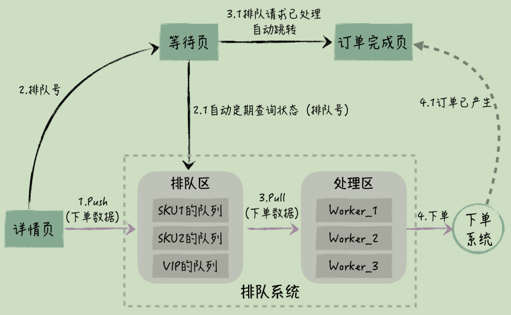

在前台和后台下单系统之间，新增了排队系统，它包括排队区和处理区两个部分。系统整体的处理过程是这样的：
- 用户在商品详情页提交订单后，这个订单会作为预订单进入排队区，同时排队系统会返回用户一个排队编号，这个编号用于跟踪后续的订单处理进度；
- 用户被引导到一个等待页，这个页面会根据排队号，定时地查询排队系统，排队系统会返回预订单在队列中的位置信息，包括它前面还有多少未处理的预订单，以及后台系统大概还要多久会处理这个预订单，这样用户就不会焦虑；
- 在排队系统的处理区，有很多消费者，它们依次从排队区的队列里获取预订单，然后调用后台下单系统生成实际的订单；
- 随着预订单变成正式的订单，队列里的预订单会逐渐变少，如果当前的预订单已经从队列里被移除了，用户的等待页就会检测到这个情况，页面自动跳转到订单完成页，这就和常规的购物流程一样了，用户进行最后的支付，最终完成整个前台下单过程。

用户等待页可以由设计友好

**针对队列的技术选型**：排队系统使用的是 Redis，而不是 MQ。因为相对于 MQ 来说，Redis 更轻量级，性能更好，它内置了队列数据结构

关于队列的调度问题，也就是消费者优先从哪个队列里拿预订单，排队系统会结合下单时间和队列的长度来确定，以保证用户合理的时间体验；

关于队列长度，为了保证用户能够买到商品，我们并不是把所有前台的下单请求都会放到队列里，而是根据参与活动的秒杀商品数量，按照 1:1 的比例，设置队列初始长度，这样就保证了进入队列的请求最终都能生成订单

# 二、延迟队列

- [有赞-延迟队列](https://tech.youzan.com/queuing_delay/)
- [SpringBoot与RabbitMQ实现延迟消息](https://juejin.im/entry/5aea9c58f265da0b851cb0c7)
- [MQ中实现延迟消息](https://www.cnblogs.com/hzmark/p/mq-delay-msg.html)
- [mykit-延时实现](https://github.com/sunshinelyz/mykit-delay)
- [11种实现延时队列方案](https://mp.weixin.qq.com/s/XVnHNQ2-_d5-VM5zPOUOMg)
- [如何实现延迟队列](https://bugstack.cn/md/algorithm/data-structures/2022-08-06-queue.html)

## 1、业务描述

在一段时间之后，完成一个工作任务，比如：
- 滴滴打车订单完成后，如果用户一直不评价，48小时后会将自动评价为5星
- 天猫订单未支付时24小时后失效；
- 电商平台如何设置一个在买家下订单后的”第60秒“发短信通知卖家发货，您需要考虑的是像淘宝一样的大并发量的订单

## 2、定时任务

### 2.1、定时轮询任务

启动一个cron定时任务，每小时跑一次，将完成时间超过48小时的订单取出，置为5星，并把评价状态置为已评价

方案的不足：
- （1）轮询效率比较低
- （2）每次扫库，已经被执行过记录，仍然会被扫描（只是不会出现在结果集中），有重复计算的嫌疑
- （3）时效性不够好，如果每小时轮询一次，最差的情况下，时间误差会达到1小时
- （4）如果通过增加cron轮询频率来减少（3）中的时间误差，（1）中轮询低效和（2）中重复计算的问题会进一步凸显

### 2.2、注册定时任务

如果我们使用的是类似elasticJob的分布式任务调度中心，可以向分布式任务调度中心注册定时任务

## 3、DelayQueue延迟队列

这种方式也比较方便，而且几乎没有延迟，对内存占用也不大；

主要是通过实现Delayed接口。存放到DelayDeque的元素必须继承Delayed接口。Delayed接口使对象成为延迟对象，它使存放在DelayQueue类中的对象具有了激活日期

缺点也比较明显，因为订单是存放在内存的，一旦服务器挂了，就麻烦了

## 4、Redis实现延迟消息

- [用Redis实现延迟队列](https://mp.weixin.qq.com/s/zlXfhLHrx2a3oJ_JGAKWlg)

Redis实现延迟队列有两种方式：
- 监听过期key：使用Redis的订阅/发布功能，生产者在消息发送时需要到指定发送到哪个channel上，消费者订阅这个channel就能获取到消息；
- 使用有序集合

### 4.1、监听过期key

**[keyspace notifications](https://redis.io/docs/latest/develop/use/keyspace-notifications/)**

在Redis中，有很多默认的channel，只不过向这些channel发送消息的生产者不是我们写的代码，而是Redis本身。当消费者监听这些channel时，就可以感知到Redis中数据的变化，这个功能Redis官方称为keyspace notifications

这些默认的channel被分为两类：
- 以`__keyspace@<db>__:`为前缀，后面跟的是key的名称，表示监听跟这个key有关的事件。举个例子，现在有个消费者监听了`__keyspace@0__:sanyou`这个channel，sanyou就是Redis中的一个普通key，那么当sanyou这个key被删除或者发生了其它事件，那么消费者就会收到sanyou这个key删除或者其它事件的消息
- 以`__keyevent@<db>__:`为前缀，后面跟的是消息事件类型，表示监听某个事件同样举个例子，现在有个消费者监听了`__keyevent@0__:expired`这个channel，代表了监听key的过期事件。那么当某个Redis的key过期了（expired），那么消费者就能收到这个key过期的消息。如果把expired换成del，那么监听的就是删除事件。具体支持哪些事件，可从官网查。

> 上述db是指具体的数据库

**延迟队列实现原理**

当这个key过期之后，Redis会发布一个key过期的事件到`__keyevent@<db>__:expired`这个channel，只要我们的服务监听这个channel，那么就能知道过期的Key，从而就算实现了延迟队列功能

所以这种方式实现延迟队列就只需要两步：
- 发送延迟任务，key是延迟消息本身，过期时间就是延迟时间
- 监听`__keyevent@<db>__:expired`这个channel，处理延迟任务

**案例**

Spring已经实现了监听`__keyevent@*__:expired`这个channel这个功能，`__keyevent@*__:expired`中的*代表通配符的意思，监听所有的数据库

KeyExpirationEventMessageListener实现了对 __keyevent@*__:expiredchannel 的监听
当KeyExpirationEventMessageListener收到Redis发布的过期Key的消息的时候，会发布RedisKeyExpiredEvent事件，所以我们只需要监听RedisKeyExpiredEvent事件就可以拿到过期消息的Key，也就是延迟消息
```java
// KeyExpirationEventMessageListener.java
private static final Topic KEYEVENT_EXPIRED_TOPIC = new PatternTopic("__keyevent@*__:expired");
@Override
protected void doHandleMessage(Message message) {
    publishEvent(new RedisKeyExpiredEvent(message.getBody()));
}
```
新建配置类：
```java
@Configuration
public class RedisConfiguration {
    @Bean
    public RedisMessageListenerContainer redisMessageListenerContainer(RedisConnectionFactory connectionFactory){
        RedisMessageListenerContainer container = new RedisMessageListenerContainer();
        container.setConnectionFactory(connectionFactory);
        return container;
    }
    @Bean
    public KeyExpirationEventMessageListener redisKeyExpirationListener(RedisMessageListenerContainer redisMessageListenerContainer) {
        return new KeyExpirationEventMessageListener(redisMessageListenerContainer);
    }
}
// 对RedisKeyExpiredEvent事件的监听实现MyRedisKeyExpiredEventListener
@Component
public class MyRedisKeyExpiredEventListener implements ApplicationListener<RedisKeyExpiredEvent> {
    @Override
    public void onApplicationEvent(RedisKeyExpiredEvent event) {
        byte[] body = event.getSource();
        System.out.println("获取到延迟消息：" + new String(body));
    }
}
```

**存在问题**
- **可能不会及时收到消息**：key的过期事件发布时机并不是当这个key的过期时间到了之后就发布，而是这个key在Redis中被清理之后，也就是真正被删除之后才会发布；也就是说可能是的key已经过期了，由于key还没被清除，后台的定时清理的任务也没扫描到对应的key，那么就不会发布key过期的事件，自然而然也就监听不到了；
- **丢消息太频繁**：Redis实现的发布订阅模式，消息是没有持久化机制，当消息发布到某个channel之后，如果没有客户端订阅这个channel，那么这个消息就丢了，并不会像MQ一样进行持久化，等有消费者订阅的时候再给消费者消费；假设服务重启期间，某个生产者或者是Redis本身发布了一条消息到某个channel，由于服务重启，没有监听这个channel，那么这个消息自然就丢了；
- **消息消费只有广播模式**：Redis的发布订阅模式消息消费只有广播模式一种。所谓的广播模式就是多个消费者订阅同一个channel，那么每个消费者都能消费到发布到这个channel的所有消息；如果通过监听channel来获取延迟任务，那么一旦服务实例有多个的话，还得保证消息不能重复处理，额外地增加了代码开发量；
- **接收到所有key的某个事件**

### 4.2、sorted set方案

Sorted set是set的一个升级版本。它在set的基础上增加了一个顺序属性，这一属性在添加修改元素时候可以指定，每次指定后，zset会自动重新按新的值调整顺序，具有去重有序的功能

通过过`ZRANGEBYSCORE`命令，我们可以取得score在指定区间内的元素。将集合中的元素做为消息，score视为延迟的时间，这便是一个延迟队列的模型

主要有两种方式：
- 第一种是利用 zrangebyscore 查询符合条件的所有待处理任务，循环执行队列任务。
- 第二种实现方式是每次查询最早的一条消息，判断这条信息的执行时间是否小于等于此刻的时间，如果是则执行此任务，否则继续循环检测

**具体过程：**
- 生产者通过`ZADD`将消息发送到队列中；
- 消费者通过`ZRANGEBYSCORE`获取消息。如果时间未到，将得不到消息；当时间已到或已超时，都可以得到消息；
- 使用`ZRANGEBYSCORE`取得消息后，消息并没有从集合中删出。需要调用`ZREM`删除消息

**优点：**
- Redis zset支持高性能的 score 排序；
- Redis是在内存上进行操作的，速度非常快；
- Redis可以搭建集群，当消息很多时候，我们可以用集群来提高消息处理的速度，提高可用性；
- Redis具有持久化机制，当出现故障的时候，可以通过`AOF`和`RDB`方式来对数据进行恢复，保证了数据的可靠性

**缺点：**

消费者组合使用`ZRANGEBYSCORE`和`ZREM`的过程不是原子的，当有多个消费者时会存在竞争，可能使得一条消息被消费多次。此时需要使用Lua脚本保证消费操作的原子性

### 4.3、Redisson实现延迟队列

Redisson可以基于 sorted set 来实现延迟队列
```java
@Component
@Slf4j
public class RedissonDelayQueue {
    private RedissonClient redissonClient;
    private RDelayedQueue<String> delayQueue;
    private RBlockingQueue<String> blockingQueue;
    @PostConstruct
    public void init() {
        initDelayQueue();
        startDelayConsumer();
    }
    private void startDelayConsumer() {
        // 当延迟队列创建之后，会开启一个延迟任务的消费线程，这个线程会一直从RBlockingQueue中通过take方法阻塞获取延迟任务。
        new Thread(() -> {
            while (true) {
                try {
                    String task = blockingQueue.take();
                    log.info("接收到延迟任务:{}", task);
                } catch (Exception e) {
                    e.printStackTrace();
                }
            }
        }, "test-consumer").start();
    }
    private void initDelayQueue() {
        // 创建一个RedissonClient对象，之后通过RedissonClient对象获取到RDelayedQueue和RBlockingQueue对象，传入队列名字
        Config config = new Config();
        SingleServerConfig singleServer = config.useSingleServer();
        singleServer.setAddress("redis://localhost:6379");
        redissonClient = Redisson.create(config);

        blockingQueue = redissonClient.getBlockingQueue("test");
        delayQueue = redissonClient.getDelayedQueue(blockingQueue);
    }
    // 添加任务的时候是通过RDelayedQueue的offer方法添加的
    public void offerTask(String task, long seconds) {
        log.info("添加延迟任务:{} 延迟时间:{}s", task, seconds);
        delayQueue.offer(task, seconds, TimeUnit.SECONDS);
    }
}
```

### 4.4、Redisson的优势

Redisson 的延迟队列 RDelayedQueue 是基于 Redis 的 SortedSet 来实现的。SortedSet 是一个有序集合，其中的每个元素都可以设置一个分数，代表该元素的权重。Redisson 利用这一特性，将需要延迟执行的任务插入到 SortedSet 中，并给它们设置相应的过期时间作为分数。

Redisson 在客户端（即应用程序进程）中启动一个定时任务，到时间后使用 zrangebyscore 命令扫描 SortedSet 中过期的元素（即分数小于或等于当前时间的元素），然后将这些过期元素从 SortedSet 中移除，并将它们加入到就绪消息列表（ List 结构）中。

当任务被移到实际的就绪消息列表中时，Redisson 通常还会通过发布/订阅机制（Redis 的 Pub/Sub 模型）来通知消费者有新任务到达。

就绪消息列表是一个阻塞队列，消费者可以使用阻塞操作（如 BLPOP key 0，0 表示无限等待，直到有消息进入队列）监听。由于 Redis 的 Pub/Sub 机制是事件驱动的，它避免了轮询开销，只有在有新消息时才会触发处理逻辑。

⚠️ 注意：Redisson 的定时任务调度器并不是以固定的时间间隔频繁调用 zrangebyscore 命令进行扫描，而是根据 SortedSet 中最近的到期时间来动态调整下一次检查的时间点

相比于 Redis 过期事件监听实现延时任务功能，这种方式具备下面这些优势：
- 减少了丢消息的可能：DelayedQueue 中的消息会被持久化，即使 Redis 宕机了，根据持久化机制，也只可能丢失一点消息，影响不大。当然了，也可以使用扫描数据库的方法作为补偿机制。
- 消息不存在重复消费问题：每个客户端都是从同一个目标队列中获取任务的，不存在重复消费的问题

### 4.5、对比MQ

跟 Redisson 内置的延时队列相比，消息队列可以通过保障消息消费的可靠性、控制消息生产者和消费者的数量等手段来实现更高的吞吐量和更强的可靠性，实际项目中首选使用消息队列的延时消息这种方案

**为什么不选择 MQ 实现延时任务？**

在我的项目中，由于没有其他场景需要使用消息队列，因此不想为了单一的延时任务场景引入消息队列。引入 MQ 会增加系统的复杂性，需要维护额外的组件和配置，还会增加成本，这是不太可取的。

如果项目将来确实有需要引入 MQ 的场景且 Redis 延时任务确实不再满足项目需求，我会考虑将延时任务的实现平滑迁移到 MQ 上

## 5、消息队列

### 5.1、RabbitMQ

延迟任务通过消息的`TTL`和`Dead Letter Exchange`来实现。需要建立2个队列，一个用于发送消息，一个用于消息过期后的转发目标队列。延时相同的消息必须扔在同一个队列

- 在MQ中我们可以对Queue设置 x-expires 过期时间或者对 Message设置超时时间x-message-ttl
- 可以用RabbitMQ的插件`rabbitmq-delayed-message-exchange`插件来实现延时队列。达到可投递时间时并将其通过 x-delayed-type 类型标记的交换机类型投递至目标队列

### 5.2、RocketMQ

- 延迟消息：消息发送到Broker之后，要特定的时间才会被Consumer消费；
- 目前只支持固定精度的定时消息：RocketMQ 支持发送延迟消息，但不支持任意时间的延迟消息的设置，仅支持内置预设值的延迟时间间隔的延迟消息。预设值的延迟时间间隔为：1s、 5s、 10s、 30s、 1m、 2m、 3m、 4m、 5m、 6m、 7m、 8m、 9m、 10m、 20m、 30m、 1h、 2h
- MessageStoreConfig配置类、ScheduleMessageService 任务类；
- 在消息创建的时候，调用 setDelayTimeLevel(int level) 方法设置延迟时间。broker在接收到延迟消息的时候会把对应延迟级别的消息先存储到对应的延迟队列中，等延迟消息时间到达时，会把消息重新存储到对应的topic的queue里面

rocketmq在发送延时消息时，是先把消息按照延迟时间段发送到指定的队列中（把延时时间段相同的消息放到同一个队列中，保证了消息处理的顺序性，可以让同一个队列中消息延时时间是相同的，整个RocketMQ中延时消息时按照递增顺序排序，保证信息处理的先后顺序性）。之后，通过一个定时器来轮询处理这些队列里的信息，判断是否到期，对于到期的消息会发送到相应的处理队列中，进行处理；

### 5.3、Kafka实现延时队

Kafka基于时间轮自定义了一个用于实现延迟功能的定时器（SystemTimer），Kafka中的时间轮（TimingWheel）是一个存储定时任务的环形队列，可以进行相关的延时队列设置

### 5.4、Pulsar实现延迟队列

**基本使用：**

Pulsar 最早是在 2.4.0 引入了延迟消息投递的特性，在 Pulsar 中使用延迟消息，可以精确指定延迟投递的时间，有 deliverAfter 和 deliverAt 两种方式。其中 deliverAt 可以指定具体的时间戳；deliverAfter 可以指定在当前多长时间后执行。两种方式的本质是一样的，Client 会计算出时间戳送到 Broker：
```
producer.newMessage()
 .deliverAfter(long time, TimeUnit unit)
 .send();

producer.newMessage()
 .deliverAt(long timestamp)
 .send();
```

**实现原理：**

Pulsar 支持的是秒级精度的延迟消息投递，

Pulsar 实现延迟消息投递的方式比较简单，所有延迟投递的消息会被 Delayed Message Tracker 记录对应的 index。index 是由 timestamp | LedgerID | EntryID 三部分组成，其中 LedgerID | EntryID 用于定位该消息，timestamp 除了记录需要投递的时间，还用于 delayed index 优先级队列排序。

Delayed Message Tracker 在堆外内存维护着一个 delayed index 优先级队列，根据延迟时间进行堆排序，延迟时间最短的会放在头上，时间越长越靠后。consumer 在消费时，会先去 Delayed Message Tracker 检查，是否有到期需要投递的消息，如果有到期的消息，则从 Tracker 中拿出对应的 index，找到对应的消息进行消费；如果没有到期的消息，则直接消费正常的消息。

如果集群出现 Broker 宕机或者 topic 的 ownership 转移，Pulsar 会重建 delayed index 队列，来保证延迟投递的消息能够正常工作

## 6、HashWheel

hash wheel 按照任务的到期时间将任务放到一个刻度盘里，比如未来1秒的放到位置1，未来2秒的放到位置2，依次类推。每次刻度盘转一个刻度，转到该可读则将该刻度上所有任务执行，算法复杂度是O(1)

比如Netty，就有基于`时间轮算法`来实现延时队列。Netty在构建延时队列主要用`HashedWheelTimer`，`HashedWheelTimer`底层数据结构是使用`DelayedQueue`，采用时间轮的算法来实现；

## 7、如何实现延迟队列

延迟队列的实现，主要为在优先队列的基础上，添加可重入锁 ReentrantLock 对阻塞队列的实现。当数据存放时，按照二叉堆结构排序元素，出队时依照排序结构进行迁移

## 8、需要解决的问题

- Server重启如何发现未投递消息？
- 正在加载某个时间段内的消息过程中又来了属于该时间段内消息如何处理，会不会重复加载？
- 加载一个时间段内的消息是不是需要占用太多的内存？

# 三、双十一场景业务

## 1、业务分析


## 2、常见解决方案

- 前端DNS解析、软硬负载均衡设施进行分流/限流
- 缓存的业务维度拆分
- 微服务流控：微服务熔断、降级、兜底；
- 微服务接口的幂等性保障
- 数据库分库分表策略：设计契合业务维度的负载均衡算法
- 冷热数据、读写分离
- 对有效业务数据的过滤和业务的解耦
- 顺序消息机制
- 分布式事务

# 四、购物车

## 1、Cookie

- 无须登录、无须查数据库、保存在浏览器端
- 优点：性能好、访问快、没有和数据库交互；
- 缺点1：换电脑购物车数据丢失；
- 缺点2：电脑被其他人登录，隐私安全问题；

## 2、Session

- 用户登录后，购物车数据放入用户会话中；
- 优点：初期性能好，访问快；
- 缺点1：session基于内存，用户量庞大时影响服务器性能；
- 缺点2：只能存在于当前会话，不适用集群与分布式系统；

## 3、数据库存储

- 用户登录后，购物车数据存入数据库；
- 优点：数据持久化，可在任何地点任何时间访问；
- 缺点：频繁读写数据库，造成数据库压力；

## 4、缓存

如Redis
- 优点1：数据持久化，可在任何地点任何时间访问；
- 优点2：频繁读写只基于缓存，不会造成数据库压力；
- 优点3：适用于集群与分布式系统，可扩展性强；

## 5、实现方案1：cookie + redis

实现思路：参考京东
- 用户未登录的情况下，用户添加到购物车，数据存到cookie中；
- 如果用户登录之后：
    - 如果Redis中当前用户不存在购物车数据
        - 如果cookie中没有任何数据，不做处理；
        - 如果cookie中有数据，将cookie中数据同步到redis中，同时添加购物车时，添加或删除数据都同步到redis中；
    - 如果Redis中当前用户存在购物车数据
        - 如果cookie中没有任何数据，直接将redis中的数据取出，同步到cookie中；
        - 如果cookie中数据，对比购物车数据：
            - （1）如果cookie中存在的sku在redis中也存在，则用cookie中的数据覆盖Redis中对应的sku的数据，主要是数量；并将cookie中的该sku数据删除掉；
            - （2）如果都不存在，则合并cookie和redis中的数据；
            - （3）上述步骤1、2完成之后，将完整的数据同步到redis和cookie中；
- 用户退出登录时，删除cookie数据；

## 6、实现方案2：判断用户是否登录

用户在添加商品到购物车时直接判断当前是否有登录，如果没有登录信息，则提示用户登录；

## 7、金额计算

```
1. 背景（这类分摊计算的逻辑还是蛮复杂的，虽然复杂，但这类业务还是蛮有意思的）
1.1 优惠类型可能包括：直减、满减、N元购、折扣、优惠限定SKU
1.2 支付方式优惠券，免息、分期百分比优惠、红包
1.3 合作分摊，包括优惠费用的承担方，各自出资占比，有了出资后运营才能配置优惠券
1.4 多种商品SKU组合购买 X 多种优惠组合支付 X 支付方式优惠(可选)
1.5 部分商品退货，根据优惠分摊金额扣除后，退款其余部分。PS：但有时候也有业务需求是退款时候，分摊调整，所推商品金额如果能覆盖优惠券，则退回优惠券和剩余金额。如：用户支付了80元，买了5件商品，用了100-20的满减优惠券，那么1件商品退款的时候，退款了10元+20元满减券。但也有时候是支持用户选择的，比如你同意退款15元还是退款10元+20元优惠券。具体要根据合规、风控、业务三方协调确定产品方案，有时候不同年度市场规则调整，可能也会随之处理分摊方式。

2. 设计
2.1 结构上使用模板模式，因为分摊是一套标准的流程，具体分摊由不同的优惠券策略进行处理。
2.2 在模板模式中抽象类可以继承数据支撑类和配置类，也可以结合策略模式、责任链模式等，便于组合使用。

3. 流程
3.1 接口中需要的核心参数包括：父单号、下单商品SKU列表、商品价格、实际支付、优惠券金额、优惠券信息。当然可能这些信息需要通过单号拆分后自己查询组合，这个时候模板模式的数据支撑类就发挥作用了。
3.2 模板模式的数据处理中，为商品列表提供分摊占比计算，A/(A+B+...N) 保持占比记录。
3.3 模板模式分摊方法中for循环优惠列表，在循环方法中调用抽象分摊方法。
3.4 在子类实现的抽象分摊方法中，调用优惠类型分摊计算策略方式。100-20 20元按照商品分摊比例，循环计算，并填充到抽象模板中的Map<String, List<分摊对象>>中，key 是优惠ID。由于计算会有余数，这部分分摊给最后一个商品。最终形成一组各个优惠分摊到每个商品SKU的分摊结果。

4. 数据
4.1 在数据库中要记录每一条的分摊记录，商品父单、子单、金额、实付、优惠类型、占比、分摊金额等，这些方便后续进行退款以及结算给商户使用。
4.2 同时要有一张总表来记录一个商品分摊后的完整信息，是哪个商品父单、使用的优惠组合，这个表有点和订单表类似，不过会填充一些分摊信息与4.1表1vn的结构。

5. 扩展
5.1 新提供的分摊优惠券了类型策略，采用数据库配置的方式处理，并在程序启动的时候，加载到分摊模板的Config中，这样就可以处理新增的分摊计算方式了。
5.2 不过可能有时候实际的业务订单要比分摊系统快，那么这个时候出现的订单，不能分摊则要做归档处理，写入归档表，后续开发了新的分摊策略和配置，再开启任务扫描处理分摊
```

# 五、海量数据存储与处理

- [MySQL分库分表](../../../数据库/MySQL/MySQL_架构与高可用.md#三数据库分库分表)
- [分库分表技术演进暨最佳实践](https://mp.weixin.qq.com/s/DahF7Epx6MG95ZbxrMka2Q)
- [分库分表最佳实践](https://mp.weixin.qq.com/s?__biz=MzU5ODUwNzY1Nw==&mid=2247484012&idx=1&sn=be574cb31f0c0a36034f4635294e55d0)
- [海量数据处理算法](../../../算法与数据结构/算法/常见算法.md#七海量数据处理算法)

海量数据存储的核心问题包括：
- 如何利用分布式服务器集群实现海量数据的统一存储？
- 如何正确选择服务器写入并读取数据？
- 为了保证数据的高可用性，如何实现数据的多备份存储？
- 数据多备份存储的时候，又如何保证数据的一致性？

## 1、分布式数据库

### 1.1、为什么不是NoSQL/NewSql

首先，为什么不选择第三种方案NoSQL/NewSQL，主要是RDBMS有以下几个优点：
- RDBMS生态完善；
- RDBMS绝对稳定；
- RDBMS的事务特性；

目前绝大部分公司的核心数据都是：以RDBMS存储为主，NoSQL/NewSQL存储为辅！互联网公司又以MySQL为主，国企&银行等不差钱的企业以Oracle/DB2为主

### 1.2、为什么不是分区

**什么是分区表**：分区表是由多个相关的底层表实现，这些底层表也是由句柄对象表示，所以我们也可以直接访问各个分区，存储引擎管理分区的各个底层表和管理普通表一样（所有的底层表都必须使用相同的存储引擎），分区表的索引只是在各个底层表上各自加上一个相同的索引，从存储引擎的角度来看，底层表和一个普通表没有任何不同，存储引擎也无须知道这是一个普通表还是一个分区表的一部分；

它对用户屏蔽了sharding的细节，即使查询条件没有sharding column，它也能正常工作（只是这时候性能一般）。不过它的缺点很明显：很多的资源都受到单机的限制，例如连接数，网络吞吐等！虽然每个分区可以独立存储，但是分区表的总入口还是一个MySQL示例。从而导致它的并发能力非常一般，远远达不到互联网高并发的要求；无法使用外键，不支持全文索引，但是在互联网时代，一般是使用外键和全文索引的；

如果使用分区表，你的业务应该具备如下两个特点：
- 数据不是海量（分区数有限，存储能力就有限）；
- 并发能力要求不高；

### 1.3、为什么是分库分表

目前互联网行业处理海量数据的通用方法：分库分表

目前市面上分库分表中间件主要有：
- 阿里的TDDL，DRDS和cobar，
- [ShardingSphere](https://shardingsphere.apache.org/)
- MyCAT；
- [Vitess](https://vitess.io/)
- 360的Atlas；
- 美团的zebra；

有这么多分库分表中间件，但是可以归纳为：
- CLIENT模式：TDDL、sharding-jdbc

  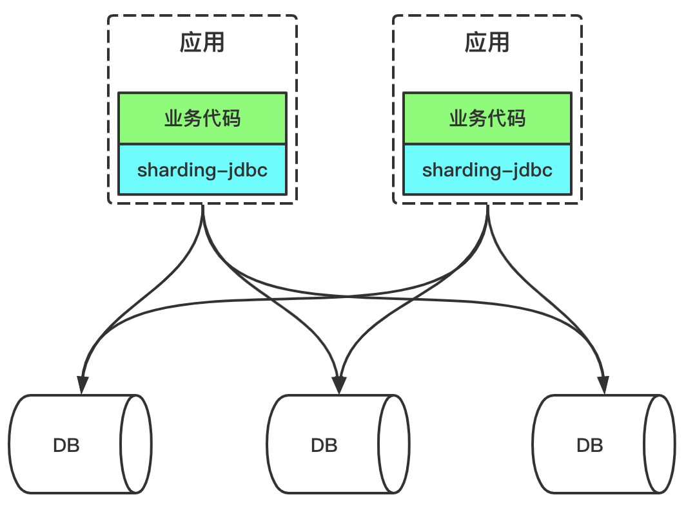

- PROXY模式：sharding-jdbc、MyCAT、cobar

  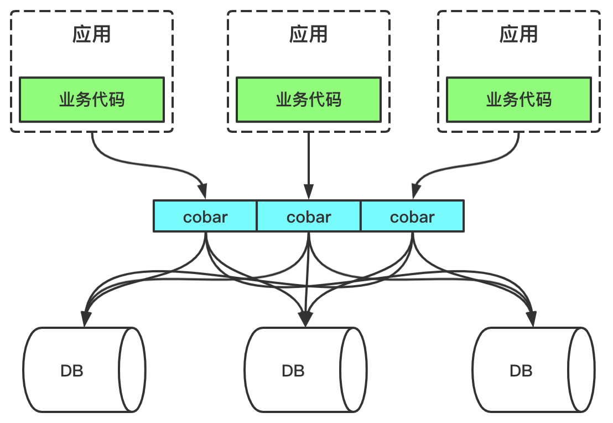

但是无论是Client模式还是Proxy模式，核心步骤都是一样的：SQL解析，重写，路由，执行，结果归并；

这两者的区别：
- 性能方面：Client方式性能更好。Client方式采用的是应用直连数据库的形式，一条SQL直达数据库；Proxy方式在性能方法会有一点损耗，因为中间多了一次路由操作；
- 内存使用：Client方式拿到数据库响应的内容后要在应用本地进行聚合操作，内存，cpu等都是占用当前应用的资源；Proxy方式也是会占用内存，但是它的内存不是当前应用的内存，而是Proxy这个应用的内存，Proxy应用是单独部署的；
- 架构复杂度：Client方式在架构方面比较简单，通常是依赖一个Jar包，不会出现单点故障问题；Proxy方式需要单独部署一个独立的服务，并且这个服务也要考虑高可用，整体的架构复杂度还是比较高的

> 规模不大时建议用Client方式的中间件，使用简单，也没什么维护成本。规模大了后建议用Proxy方式的中间件，更方便统一管控和维护

### 1.4、实践

分库分表最重要的一步也是最难的一步是：确认sharding column，sharding column选择的好坏将直接决定整个分库分表方案最终是否成功。而sharding column的选取跟业务强相关，选择sharding column的方法最主要分析你的API流量，优先考虑流量大的API，将流量比较大的API对应的SQL提取出来，将这些SQL共同的条件作为sharding column；

分库分表的几种主要处理思路：
- 只选取一个sharding column进行分库分表；
- 多个sharding column多个分库分表；
- sharding column 分库分表 + es；

#### 1.4.1、订单表

订单表几个核心字段一般如下：`order_id, user_id, merchant_code, order_amount, order_item, remark` 等；

以阿里订单系统为例：它选择了三个column作为三个独立的sharding column，即：`order_id、user_id、merchant_code`。`user_id`和`merchant_code`就是买家ID和卖家ID，因为阿里的订单系统中买家和卖家的查询流量都比较大，并且查询对实时性要求都很高。而根据order_id进行分库分表，应该是根据order_id的查询也比较多。有一点需要注意：多个`sharding-column`的分库分表是`冗余全量`还是只`冗余关系索引表`，需要我们自己权衡；

- `冗余全量`的情况如下：每个sharding列对应的表的数据都是全量的，这样做的优点是不需要二次查询，性能更好，缺点是比较浪费存储空间；
- `冗余关系索引表`的情况如下：只有一个sharding column的分库分表的数据是全量的，其他分库分表只是与这个sharding column的关系表，这样做的优点是节省空间，缺点是除了第一个sharding column的查询，其他sharding column的查询都需要二次查询（绿色字段就是sharding column）

  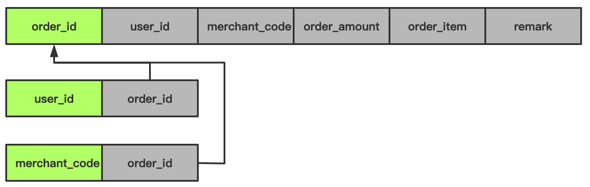

`冗余全量表` VS `冗余关系表`
- 速度对比：冗余全量表速度更快，冗余关系表需要二次查询，即使有引入缓存，还是多一次网络开销；
- 存储成本：冗余全量表需要几倍于冗余关系表的存储成本；
- 维护代价：冗余全量表维护代价更大，涉及到数据变更时，多张表都要进行修改；

#### 1.4.2、用户表

用户表几个核心字段：`user_id, mobile_no, email, username, remark`

一般用户登录场景既可以通过mobile_no，又可以通过email，还可以通过username进行登录。但是一些用户相关的API，又都包含user_id，那么可能需要根据这4个column都进行分库分表，即4个列都是sharding-column；

### 1.5、HBase与ES的组合使用

#### 1.5.1、方案思路

一般查询都是条件中有分区键的SQL执行。但是，总有一些查询条件是不包含分区键的，同时，我们也不可能为了这些请求量并不高的查询，无限制的冗余分库分表。那么这些条件中没有分区键的SQL怎么处理？以sharding-jdbc为例，有多少个分库分表，就要并发路由到多少个分库分表中执行，然后对结果进行合并。

一般是：分表 + ES的，分库分表的数据通过binlog数据同步到ES中；

Sharding + ES + HBase方案

但是`分库分表+es`的方案，随着数据量越来越来，虽然分库分表可以继续成倍扩容，但是这时候压力又落到了es这里。

一般订单等表列可能有上百列，但是真正需要索引的数据只有少部分字段，即只把可能参与条件检索的字段索引到es中，这样整个es集群压力减少到原来的`1/5（核心表50个字段，只有10个字段参与条件）`，而50个字段的全量数据保存到HBase中，这就是经典的`ES+HBase`组合方案，即`索引与数据存储隔离的方案`。将HBase的rowkey作为es的文档id

Hadoop体系下的HBase存储能力是海量的，而且根据它的rowkey查询性能非常高。它们之间的交互大概是这样的：先根据用户输入的条件去es查询获取符合过滤条件的rowkey值，然后用rowkey值去HBase查询，后面这一查询步骤的时间几乎可以忽略，因为这是HBase最擅长的场景，交互图如下所示：

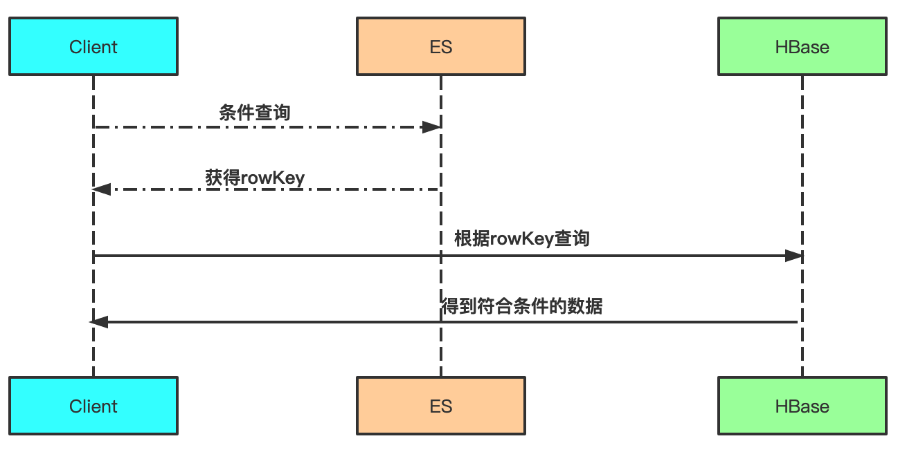

有`sharding column`的查询走分库分表，一些模糊查询，或者多个不固定条件筛选则走ES，海量存储则交给HBase；

#### 1.5.2、存在问题

使用HBase+ES的时候，核心要解决数据写入、数据查询这两个问题，即数据如何准确写入到两个系统，数据又如何从两个系统查询合并，目前常见的方案有三种：
- **应用双写双读**：应用需要同时与HBase、ElasticSearch独立交互，其优点是不需要引入额外依赖，应用可以根据自身需求，定制或简化写入分发和查询合并的逻辑，但缺点也比较多，包括开发成本高、维护复杂、写入Latency增大、可用性下降、一致性解决困难等；

- **数据自动复制，应用双读**：应用在写入链路只与HBase交互，在查询链路仍与两个系统交互，其优点是写入过程对应用保持透明，较容易保证最终一致性，ES系统异常后也不会影响写入，但缺点是需要额外开发维护一套数据同步服务，应用查询数据的复杂性仍然较高；

- **利用触发器，应用只读写HBase**：应用在读写链路只与HBase交互，利用HBase Coprocessor功能，在HBase表上挂载读写触发器，其中写触发器负责数据写入HBase的同时自动往ElasticSearch写入，读触发器负责解析Scan语句中的查询表达，自动根据存储在ElasticSearch的索引字段进行加速，并与HBase中查询到的整行数据进行合并后，返回给客户端。所以，总的来说，这套方案的优点是应用的读写逻辑比较简单，只需要和HBase交互，但其缺点是其开发非常复杂，需要对HBase及其Coprocessor功能有深入理解，开发足够健壮的读写触发器，并将复杂多条件查询和数据检索的需求嵌入到HBase的查询框架中。同时，一致性、可用性、写入Latency这几个问题也依然存在

Lindorm-云原生多模数据库

### 1.6、数据迁移

数据迁移存在的问题：
- 升级过程中如果出现部分数据错误，如何回滚？ 如做回滚，新数据可能在回滚前落入新库，回滚后落入旧库，一部分数据在用户层面将看不到；如果错误只出现一次还好，可以通过洗数解决；但如果升级过程反复发现 bug，反复修订，一定会对业务造成影响；
- 迁移至分库分表后，为了保证数据被查询到且保证查询的性能，一般情况下 sql 的查询条件需要带上分表(片)键，但一个已经运转多年的业务系统它的 sql 肯定不能完全满足这个要求，如果进行全量的 sql 改写将是一个巨大的工作量，且有些业务场景根本就无法进行 sql 改写，比如辅营交易系统表的分表键一般是自身业务的订单号，但它有根据第三方券码查订单的客观需求( 一般是三方回调接口中)。
- 如何确定分库分表后的系统数据业务等价于分库分表前的系统。

一般在数据迁移过程需要满足以下几个目标：
- 迁移应该是在线的迁移，也就是在迁移的同时还会有数据的写入；
- 数据应该保证完整性，也就是说在迁移之后需要保证新的库和旧的库的数据是一致的；
- 迁移的过程需要做到可以回滚，这样一旦迁移的过程中出现问题，可以立刻回滚到源库不会对系统的可用性造成影响；

#### 1.6.1、双写方案

可以分为以下几个步骤：
- 将新的库配置为源库的从库用来同步数据；如果需要将数据同步到多库多表，那么可以使用一些第三方工具获取 Binlog 的增量日志（比如开源工具 Canal），在获取增量日志之后就可以按照分库分表的逻辑写入到新的库表中了；
- 同时需要改造业务代码，在数据写入的时候不仅要写入旧库也要写入新库。当然，基于性能的考虑，可以异步地写入新库，只要保证旧库写入成功即可。但是需要注意的是，需要将写入新库失败的数据记录在单独的日志中，这样方便后续对这些数据补写，保证新库和旧库的数据一致性；
- 然后可以开始校验数据了。由于数据库中数据量很大，做全量的数据校验不太现实。可以抽取部分数据，具体数据量依据总体数据量而定，只要保证这些数据是一致的就可以；
- 如果一切顺利，就可以将读流量切换到新库了。由于担心一次切换全量读流量可能会对系统产生未知的影响，所以这里最好采用灰度的方式来切换，比如开始切换 10% 的流量，如果没有问题再切换到 50% 的流量，最后再切换到 100%；
- 由于有双写的存在，所以在切换的过程中出现任何的问题都可以将读写流量随时切换到旧库去，保障系统的性能；
- 在观察了几天发现数据的迁移没有问题之后，就可以将数据库的双写改造成只写新库，数据的迁移也就完成了

## 2、数据统计

[Redis集合统计](../../../数据库/NoSQL/Redis/Redis_数据类型.md#1统计)

## 3、HDFS

HDFS，即 Hadoop 分布式文件系统，HDFS 的关键组件有两个，一个是 NameNode，另一个是 DataNode。

详情参考 [Hadoop](../../../大数据/Hadoop.md)

## 4、HBase

详情参考 [HBase](../../../大数据/HBase.md)

## 5、大数据量导出

在实际业务中，比较常见是导出excel数据，小数据量导出都还好，但是超过10万、百万数据量导出时就需要注意了，可能引起OOM，一般可以导出csv格式来避免；

从技术上来将，要避免导出时OOM，需要注意一个问题：不能将全量数据一次性加载到内存之中；全量加载不可行，那如何实现数据的分批加载呢？事实上，Mysql本身支持Stream查询，可以通过Stream流获取数据，然后将数据逐条刷入到文件中，每次刷入文件后再从内存中移除这条数据，从而避免OOM

MyBatis实现逐条获取数据，必须要自定义ResultHandler，然后在mapper.xml文件中，对应的select语句中添加`fetchSize="-2147483648"`。
```xml
<select id="selectBy" fetchSize="-2147483648" >
...
</select>
```
最后将自定义的ResultHandler传给SqlSession来执行查询，并将返回的结果进行处理；

详细处理参考文章：[SpringBoot 实现 MySQL 百万级数据量导出并避免 OOM 的解决方案](https://mp.weixin.qq.com/s/QdUvVw8EExceLal5LosD6g)

# 六、社交业务


# 八、推荐系统

- [基础商品推荐](https://github.com/MrQuJL/product-recommendation-system)

# 九、签到

- [签到功能实现-1](https://juejin.im/post/6881928046031568903)
- [签到功能实现-2](https://juejin.cn/post/6904138145923596295)

# 十、文件系统

## 1、文件预览

- [SpringBoot搭建文件预览系统](https://juejin.im/post/6883814001235460110)

# 十一、风控系统

- [全链路风控解决方案深度解读](https://zhuanlan.zhihu.com/p/84747637)
- [阿里风控大脑如何应用大数据来构建风控体系](https://blog.csdn.net/yunqiinsight/article/details/104751118)
- [风控杂谈](https://github.com/chenlanqing/risk-talk)

风控异常发现算法：
- 频繁项集
- Long Short Term Memory(LSTM) 模型

# 十二、结算业务

- [结算业务产品宝典](http://www.woshipm.com/operate/2465326.html)

# 十三、投放

- [运营配置平台](https://tech.meituan.com/2018/09/27/appkit.html)
- [闲鱼高效投放背后的秘密—鲲鹏](https://zhuanlan.zhihu.com/p/112650205)
- [闲鱼拉新投放系统如何设计](https://blog.csdn.net/weixin_38912070/article/details/93816577)

# 十四、排行榜

- [积分排行榜](https://github.com/chenlanqing/tjxt/blob/main/day08-%E6%8E%92%E8%A1%8C%E6%A6%9C%E5%8A%9F%E8%83%BD.docx)

以手机应用商店的热门榜单排序为例：首先按照APP的下载量倒序排序，如果下载量一样，则按照最后更新时间倒序排列；

主要有方案：
- 基于MySQL的离线排序方案；
- 基于Redis的SortedSet；

## 1、常规方案

需要产品做简单的妥协，即不能实时更新榜单。其实现方案是：

定时每隔1分钟（可以由产品确定时间间隔）通过SQL（`select * from tb_apps order by download_count desc, updated_time desc limit 300`）或者其他方式计算热门榜单，然后把TOP300用List结构保存到缓存中；

> 说明：真实用户很少会预览10页以后的数据，即使有这种用户，也可以忽略掉。所以只需要将总计10页，即10x30=300个APP信息用List结构保存即可。分页取数据时，通过lrange命令即可轻松实现

## 2、利用Sorted Set

可以使用Redis的SortedSet实现多维度排序；

SortedSet排序因子score，它是一个双精度64位的浮点型数字字符串。`+inf`和`-inf`都是有效值，能包括的整数范围是`-(2^53)` 到 `+(2^53)`，或者说是`-9007199254740992` 到 `9007199254740992`；

如何实现？构造一个特殊的score，以本案例为例，排序影响因子是下载量和更新时间，那么可以构造一个这样特殊的浮点类型的score：整数部分就是下载量，小数部分就是最后更新时间戳；

比如有5个app的下载量和最后更新时间分别如下（说明：更新时间只精确到秒）：
```
wechat-下载量：12000000，最后更新时间：1564022201；其score为：12000000.1564022201
qq-下载量：12000000，最后更新时间：1564022222；其score为：12000000.1564022222
tiktok-下载量：9808900，最后更新时间：1563552267；其score为：9808900.1563552267
taobao-下载量：11006600，最后更新时间：1564345601；其score为：11006600.1564345601
alipay-下载量：11006600，最后更新时间：1564345600；其score为：11006600.1564345600
```
接下来，我们通过如下命令将这5个APP用SortedSet数据类型保存到Redis中：
```
zadd TopApp 12000000.1564022201 wechat 12000000.1564022222 qq 9808900.1563552267 tiktok 11006600.1564345601 taobao 11006600.1564345600 alipay
```
保存后，我们看一下排序结果是否符合我们的预期：
```
127.0.0.1:6379> zrevrange TopApp 0 -1
1) "qq"
2) "wechat"
3) "taobao"
4) "alipay"
5) "tiktok"
```
当系统用户量规模达到数千万，乃至数亿时，可以采用分治的思想，将用户数据按照积分范围划分为多个桶，例如：
0~100分、101~200分、201~300分、301~500分、501~800分、801~1200分、1201~1500分、1501~2000分，在Redis内为每个桶创建一个SortedSet类型的key，这样就可以将数据分散，减少单个KEY的数据规模了。而要计算排名时，只需要按照范围查询出用户积分所在的桶，再累加分值比他高的桶的用户数量即可。依然非常简单、高效。

## 3、扩展

如果有三维排序，四维排序呢？这里有一种实现参考，即自定义得分权重计算公式，这个公式包含所有影响排序的因子，例如：downloadCount*1000+updatedTime。这种实现无论排序维度多少都搞得定，但是需要注意的是，在具体实现时一定注意不要让score溢出；

可以使用[TairZset](https://github.com/alibaba/TairZset)，其内封装了多维度排序

## 4、实际案例

比如王者荣耀巅峰赛的排行榜，用户打完一局巅峰赛之后，如何快速生成用户的排名，一般王者巅峰赛都是排名前100，也就是Top-K问题，针对王者荣耀的用户数，不可能让全部用户参与排名，也就是可以设定一个阈值，比如1400分，那么只要进入到这个阈值内的都可以参与排名，这样就能大大减少参与排名的用户数，比如可以使用二叉堆来进行排序；

阈值的判定可以动态变化的，比如每个小时变一次等等。。。

## 5、历史排行榜

- 分区表；
- 水平分表，比如按照赛季分表

定时任务将当前排行榜持久化；

# 十五、爬虫

- [高性能异步抖音|TikTok数据爬取工具](https://github.com/chenlanqing/Douyin_TikTok_Download_API)
- [Kspider-可视化爬虫平台](https://github.com/kkangert/kspider)

## 1、什么是[robots.txt](https://en.wikipedia.org/wiki/Robots.txt)

- [Google-robots.txt 简介](https://developers.google.com/search/docs/crawling-indexing/robots/intro?hl=zh-cn)

## 2、性能指标估算

需要每个月从互联网爬取的网页数为 20 亿个，平均每个页面 500KB，且网页需存储 20 年
- 每月新增存储量：估计平均每个页面 500KB，那么每个月需要新增存储 1PB。 $20亿 × 500KB = 1PB$
- 总存储空间：网页存储有效期 20 年，那么需要总存储空间 240PB； $1PB × 12个月 × 20年 = 240PB$
- TPS 应为 800： $20亿 ÷ （30 × 24 × 60 × 60） ≈ 800$

## 3、非功能需求

- 伸缩性：分布式爬虫；
- 健壮性：服务器可能会宕机，网站可能失去响应，网页 HTML 可能是错误的，链接可能有陷阱；
- 去重：
    - 一方面需要对超链接 URL 去重，相同的 URL 不需要重复下载；
    - 另一方面还要对内容去重，不同 URL 但是相同内容的页面也不需要重复存储；
- 扩展性：当前只需要爬取 HTML 页面即可，将来可能会扩展到图片、视频、文档等内容页面；
- 需要遵循互联网爬虫协议，即目标网站的 robots.txt 协议

## 4、概要设计

遍历互联网上的全部网页。而将遍历到的网页下载保存起来，就是爬虫的主要工作；所以不需要事先知道数千亿的 URL，然后再去下载。Bajie 只需要知道一小部分URL，也就是所谓的种子 URL，然后从这些种子 URL 开始遍历，就可以得到全世界的URL，并下载全世界的网页

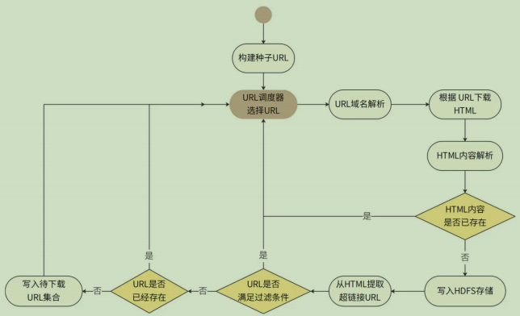

其中，URL 调度器是整个爬虫系统的中枢和核心，也是整个爬虫的驱动器。爬虫就是靠着 URL 调度器源源不断地选择 URL，然后有节奏、可控地下载了整个互联网，所以 URL 调度器也是爬虫的策略中心；

爬虫系统主要有两类服务器：
- 一类是 URL 调度器服务器；
- 一类是 URL 下载处理服务器集群，它是一个分布式集群；每台 URL 下载处理服务器先得到分配给自己的一组 URL，再启动多个线程，其中每个线程处理一个 URL，按照前面的流程，调用域名解析组件、HTML 下载组件、HTML 内容解析组件、内容去重组件、URL 提取组件、URL 过滤组件、URL 去重组件，最终将 HTML 内容写入 HDFS，并将待下载 URL 写入待下载 URL 集合文件。

## 5、详细设计

计关注 3 个技术关键点：URL 调度器算法、去重算法、高可用设计

### 5.1、URL 调度器算法

URL 调度器就需要决定当前先下载哪些URL；如果调度器一段时间内选择的都是同一个域名的 URL，那就意味着我们的爬虫将以 800TPS 的高并发访问同一个网站。目标网站可能会把爬虫判定为 DoS 攻击，从而拒绝请求；更严重的是，高并发的访问压力可能导致目标网站负载过高，系统崩溃；

网页之间的链接关系构成一个有向图，因此我们可以按照图的遍历算法选择URL。图的遍历算法有深度优先和广度优先两种，深度优先就是从一个 URL 开始，访问网页后，从里面提取第一个 URL，然后再访问该 URL 的页面，再提取第一个 URL，如此不断深入；

通常我们针对一个网站，一次只下载一个页面，所以 URL 调度器需要将待下载 URL 根据域名进行分类。此外，不同网站的信息质量也有高低之分，爬虫应该优先爬取那些高质量的网站。优先级和域名都可以使用不同队列来区分，如下图

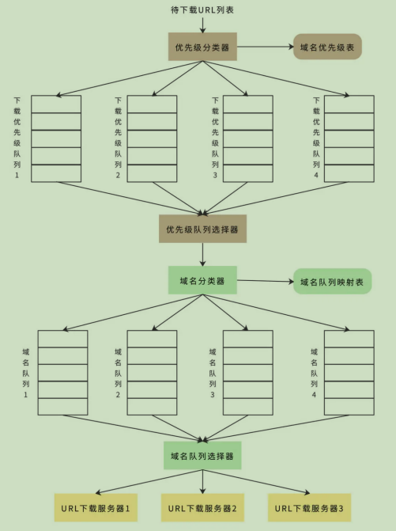

首先优先级分类器会根据网页内容质量将域名分类，并为不同质量等级的域名设置不同的优先级，然后将不同优先级记录在“域名优先级表”中

### 5.2、去重算法

爬虫的去重包括两个方面，一个是 URL，相同 URL 不再重复下载；一个是内容，相同页面内容不再重复存储。去重一方面是提高爬虫效率，避免无效爬取；另一方面提高搜索质
量，避免相同内容在搜索结果中重复出现。URL 去重可以使用布隆过滤器以提高效率

内容去重首先要判断内容是否重复，由于爬虫存储着海量的网页，如果按照字符内容对每一个下载的页面都去和现有的页面比较是否重复，显然是不可能的；计算页面内容的 MD5 值，通过判断下载页面的内容 MD5 值是否已经存在，判断内容是否重复；比较内容重复的时候，需要将 HTML 里面的有效内容提取出来，也就是提取出去除HTML 标签的文本信息，针对有效内容计算 MD5。更加激进的做法是从有效内容中抽取一段话（比如最长的一句话），计算这段话的 MD5，进而判断重复。

### 5.3、高可用设计

可用性主要关注两个方面：
- 一是 URL 调度器或 URL 下载处理服务器宕机；
- 二是下载超时或内容解析错误。

爬虫系统一个离线系统，暂时停止爬取数据的话，不会产生严重的后果，所以并不需要像一般互联网系统那样进行高可用设计。但是当服务器宕机后重启时，系统需要能够正确恢复，保证既不会丢失数据，也不会重复下载；

为了防止下载超时或内容解析错误，URL 下载处理服务器会采用多线程（池）设计。每个线程独立完成一个 URL 的下载和处理，线程也需要捕获各种异常，不会使自己因为网络超时或者解析异常而退出

# 十六、点赞业务

- [Redis点赞业务实现](https://mp.weixin.qq.com/s/fDOmWWNKHBOWx6ITcsAZeQ)
- [B站千亿级点赞系统服务架构设计](https://mp.weixin.qq.com/s/4T_S7nR8-HXJ59IbK4FBWQ)
- [类微博点赞系统设计](https://mp.weixin.qq.com/s/SCrTwoCQUZ8fNdWp3wdBVw)
- [点赞系统](https://github.com/chenlanqing/tjxt/blob/main/day06-%E7%82%B9%E8%B5%9E%E7%B3%BB%E7%BB%9F-v2.docx)

点赞、取消点赞是高频次的操作，若每次都读写数据库，大量的操作会影响数据库性能，所以需要做缓存。

至于多久从 Redis 取一次数据存到数据库中，根据项目的实际情况定吧，暂时设了两个小时。项目需求需要查看都谁点赞了，所以要存储每个点赞的点赞人、被点赞人，不能简单的做计数。

主要分为如下部分：
- Redis 缓存设计及实现
- 数据库设计
- 数据库操作
- 开启定时任务持久化存储到数据库

## 1.1、存储格式

用 Redis 存储两种数据，一种是记录点赞人、被点赞人、点赞状态的数据，另一种是每个用户被点赞了多少次，做个简单的计数。

由于需要记录点赞人和被点赞人，还有点赞状态（点赞、取消点赞），还要固定时间间隔取出 Redis 中所有点赞数据，分析了下 Redis 数据格式中 Hash 最合适，因为 Hash 里的数据都是存在一个键里，可以通过这个键很方便的把所有的点赞数据都取出。这个键里面的数据还可以存成键值对的形式，方便存入点赞人、被点赞人和点赞状态；

- 设点赞人的 id 为 likedPostId，被点赞人的 id 为 likedUserId ，点赞时状态为 1，取消点赞状态为 0。将点赞人 id 和被点赞人 id 作为键，两个 id 中间用 `::` 隔开，点赞状态作为值。
- 如果用户点赞，存储的键为：`likedUserId::likedPostId`，对应的值为 1 。取消点赞，存储的键为：`likedUserId::likedPostId`，对应的值为 0 。取数据时把键用 `::` 切开就得到了两个id，也很方便；

# 十七、中台

- [中台实战100讲2.0最终版](https://mp.weixin.qq.com/s/oAQUvCDQZto3uKcgwcbv0Q)
- [中台的外表](https://time.geekbang.org/column/article/326375)
- [一文读懂中台的前世今生](https://mp.weixin.qq.com/s/ZdNEgn1gxyat9PeOeycHTg)

## 1、如何落地一个中台架构

中台是微服务的升级

每个服务中心都围绕核心业务，自成体系，成为一个微内核，这些微内核形成一个有机整体，共同构成了基础业务平台，也就是中台。松散的微服务 -> 共享服务体 -> 中台，这是微服务架构向中台架构的演进过程

典型的业务中台架构，它一般包含三层，从上到下分别是通用聚合服务层、通用基础业务平台和通用中间件平台

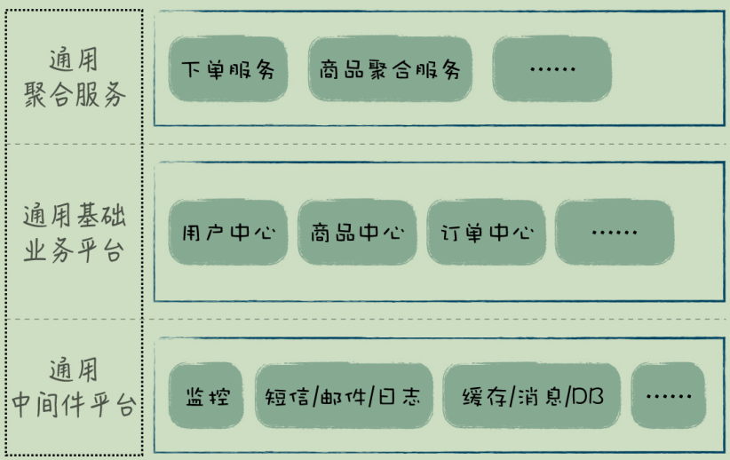

- 对于中台来说，基础业务能力由通用基础业务平台来实现；
- 另外，通用聚合服务对基础业务进行组合，进一步提升了业务能力的易用性；
- 而通用中间件平台，通过技术手段保证了业务中台的稳定性，三者一起实现了企业整体业务能力的复用；

典型的传统企业中台架构设计：

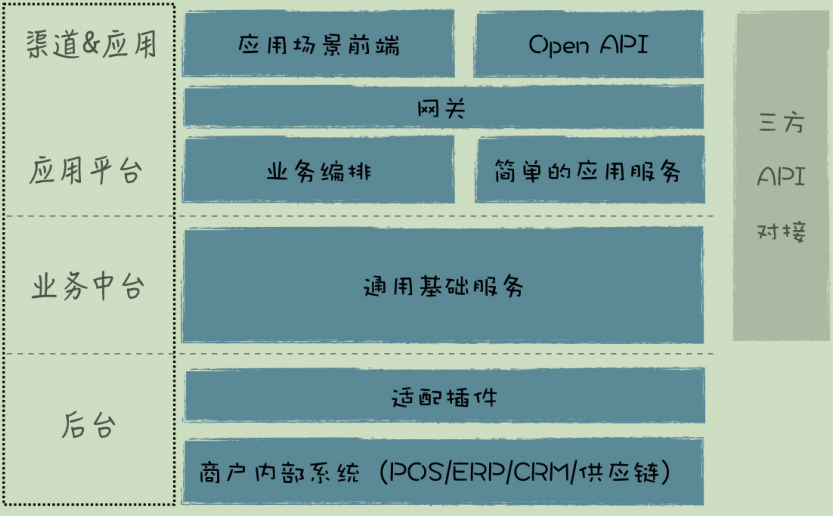

整个中台架构从上到下分为四个层次：
- 渠道 & 应用层，这是整个系统的对外部分，包括了各个应用的前端，如 App、小程序、公众号等等，这些是需要定制的部分。;
- 应用平台：是各个具体应用的母体，它包含了各个应用的服务端，比如小程序服务端、App服务端等等，这些服务端会针对具体场景，做流程编排和信息的聚合；服务端和前端之间还有一个网关，网关实现前后端隔离，具体负责外部访问的安全验证和监控，以及内外部请求的路由和消息格式转换；
- 业务中台：是中台架构的核心，它包括一系列的通用基础服务
- 后台：包括两部分
    - 第一部分是适配插件，用于连接商户内部系统和中台基础服务
    - 第二部分是企业内部系统，这个是企业的 IT 基础设施，业务最终会在这里落地

# 十八、红包业务

## 1、支付宝红包瓜分

支付宝在红包瓜分的时候，如何能够快速、准确、及时的将红包拆分以及用户账户及时到账，主要有两点需要关注：
- 如何快速将红包金额拆分，比如是否是平均、是否有不同等级；
- 如何准确、及时的发放到用户的账号中：可以用户登录时领取；

## 2、微信红包算法

- [红包算法](../../../算法与数据结构/算法/算法题.md#3微信红包算法)

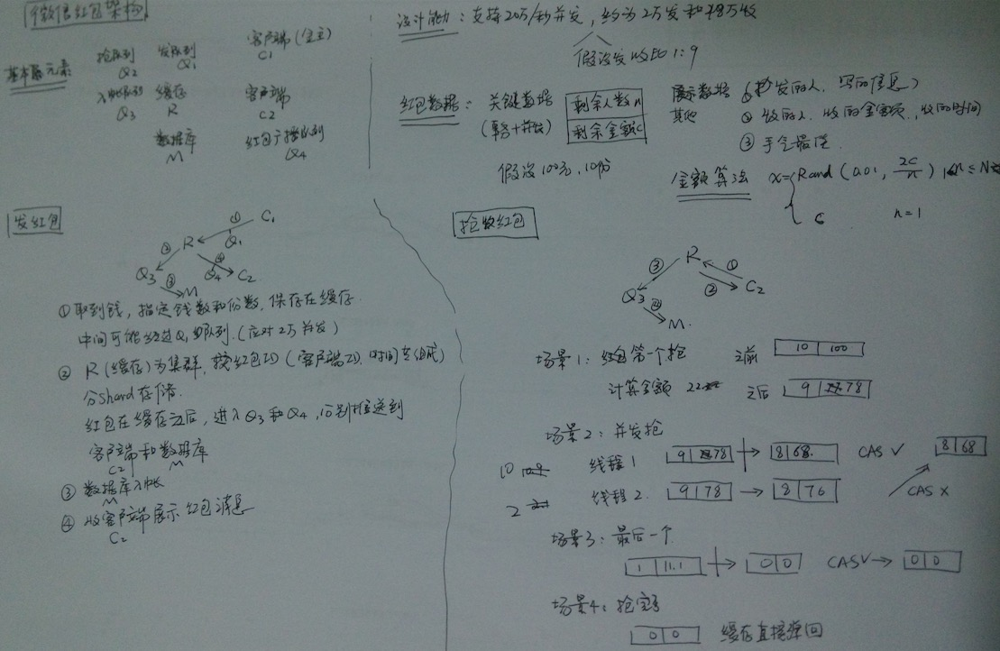

# 十九、支付系统

- [KillBill](https://github.com/killbill/killbill)
- [xxpay](https://gitee.com/jmdhappy/xxpay-master)
- [IJPay](https://gitee.com/javen205/IJPay)
- [pay-java-parent](https://gitee.com/egzosn/pay-java-parent)
- [fastpay](https://github.com/YunaiV/fastpay)
- [easyPay](https://gitee.com/yansongda/pay)
- [aaden-pay](https://gitee.com/aaden/aaden-pay)
- [payment](https://gitee.com/helei112g/payment)
- [Roncoo-Pay](https://gitee.com/roncoocom/roncoo-pay)
- [隐墨星辰：图解支付系统设计与实现](https://juejin.cn/column/7315846848460226597)

# 二十、权益

## 1、优惠券

- [搭建10万级 QPS 大流量、高并发优惠券系统](https://mp.weixin.qq.com/s/iZ9BX6cCCp_TB-SC3knuew)
- [电商项目中的优惠券系统设计](https://mp.weixin.qq.com/s/MqWgK0gOpwJYuviDeuzSdg)
- [优惠券叠加规则、优惠分摊介绍](https://www.woshipm.com/operate/4191246.html)

## 2、会员权益

- [会员权限-ZCube-京东技术](https://mp.weixin.qq.com/s/aAwbar4BuCZzrQaL-SeqMg)


# 二十二、钱包

- [大流量活动下钱包提现方案的设计与实现](https://mp.weixin.qq.com/s/wCbdElWL-1uEyMqXAKKZ_w)

# 二十三、权限设计

- [通用数据权限设计——列权限](https://www.jianshu.com/p/ef8d615ce659)
- [复杂业务场景下的权限设计](https://mp.weixin.qq.com/s/GnVFpREuoeIs6l0veI3PBg)
- [一个web快速开发、灵活的数据权限管理脚手架](https://gitee.com/chenlanqing/wonder-server)
- [权限设计方案](https://mp.weixin.qq.com/s/l_k-tX-3JEQfvsy0xMukUw)

# 二十四、订单系统

- [订单拆单规则与流程详解](https://www.woshipm.com/pd/4441813.html)

## 1、关于订单状态

外部应用和订单服务共同管理状态，即对于订单状态管理，应用和服务各自承担一部分职责；

无论订单的状态变化是如何的复杂，总是可以定义一个订单有哪些基本的状态，包括这些基本状态之间是如何变化的，这些订单的基本状态，我们称之为“主状态”，它们由订单服务负责定义，包括这些主状态之间的转换规则，比如已完成的订单不能变为已取消的订单。主状态的数量是比较有限的，状态之间的变化关系也是比较明确的；

订单除了“主状态”，还有“子状态”，子状态有哪些具体的取值，不同的项目是不一样的，这个就开放给各个应用来定义，订单服务数据模型里有两个字段，其中的主状态由订单服务负责管理，包括主状态之间的变化规则；而子状态由上层应用来定义，管理子状态的变化规则，比如一个配送中的订单，它的子状态可以由“仓库已发货”，变为“快递员正在送货中”

## 2、设计高可用订单系统

比如一家餐饮公司的小程序点单系统，大概流程是：用户在小程序上点餐并支付完成后，订单会先落到订单库，然后进一步推送到门店的收银系统；收银系统接单后，推送给后厨系统进行生产；同时返回小程序取餐码，用户可以凭取餐码去门店取餐或收取外卖。

需要设计在高峰时，前端小程序请求将会达到每秒10 万 QPS，并且预计首日的订单数量会超过 500 万。在这种高并发的情况下，为了保证用户的体验，系统整体的可用性要达到 99.99%。

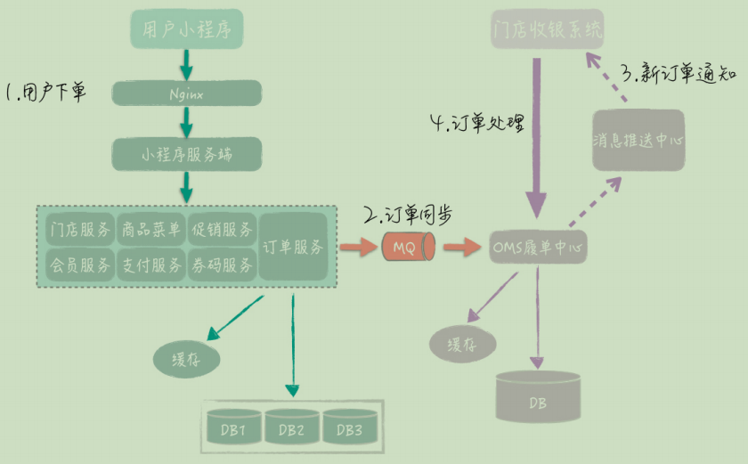

系统主要的调用过程:
- 1. 小程序前端通过 Nginx 网关，访问小程序服务端；
- 2. 小程序服务端会调用一系列的基础服务，完成相应的请求处理，包括门店服务、会员服务、商品服务、订单服务、支付服务等，每个服务都有自己独立的数据库和 Redis 缓存；
- 3. 订单服务接收到新订单后，先在本地数据库落地订单，然后通过 MQ 同步订单给 OMS履单中心；
- 4. 门店的收银系统通过 HTTP 远程访问云端的 OMS 履单中心，拉取新订单，并返回取餐码给 OMS，OMS 再调用小程序订单服务同步取餐码；
- 5. 小程序前端刷新页面，访问服务端获得取餐码，然后用户可以根据取餐码到门店取餐或等待外卖

**高可用系统改造措施：**

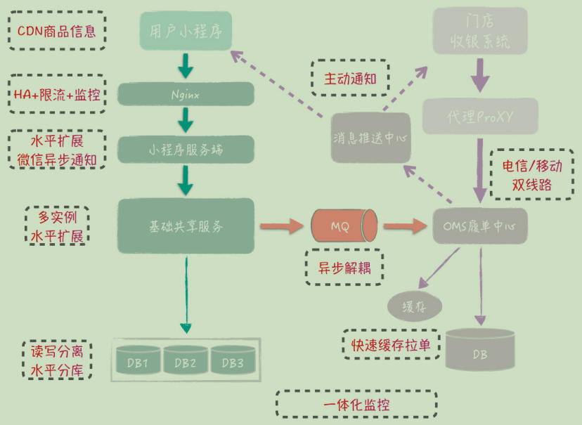

（1）前端接入改造
- 小程序端的 CDN 优化
- Nginx 负载均衡
- 收银端的通信线路备份：增加两条线路，一条发生故障，另一条能及时切换；

（2）应用和服务的水平扩展

（3）订单水平分库

（4）异步化处理
- 消息系统
- 微信消息

（5）主动通知，避免轮询：消息推送中心

（6）缓存的使用

（7）一体化监控


# 二十五、推送与即时通信

- [Websocket协议](../../../计算机基础/计算机网络/网络基础#七websocket)
- [实现web实时消息推送的7种方案](https://juejin.cn/post/7122014462181113887)
- [极光推送](https://www.jiguang.cn/engagelab)
- [消息管理平台实现原理](https://juejin.cn/post/6875113793438318605)
- [微信支付宝-第三方对接](https://github.com/zxhTom/three-party)
- [austin-推送平台](https://gitee.com/zhongfucheng/austin)
- [t-io-高性能网络编程框架](https://github.com/chenlanqing/t-io)
- [Java-WebSocket](https://github.com/TooTallNate/Java-WebSocket)
- [Server-send events:SSE-实现服务器向客户端实时推送数据的Web技术](https://en.wikipedia.org/wiki/Server-sent_events)
- [最全Web端即时通讯技术原理详解](http://www.52im.net/thread-338-1-1.html)
- [消息推送在线服务](https://www.goeasy.io/cn/websocket.html)

# 二十六、加密数据模糊查询

- [加密数据如何进行模糊查询](https://ningyu1.github.io/20201230/encrypted-data-fuzzy-query.html)

为了数据安全我们在开发过程中经常会对重要的数据进行加密存储，常见的有：密码、手机号、电话号码、详细地址、银行卡号、信用卡验证码等信息，这些信息对加解密的要求也不一样，比如说密码我们需要加密存储，一般使用的都是不可逆的慢hash算法，慢hash算法可以避免暴力破解（典型的用时间换安全性），在检索时我们既不需要解密也不需要模糊查找，直接使用密文完全匹配，但是手机号就不能这样做，因为手机号我们要查看原信息，并且对手机号还需要支持模糊查找;

## 1、不靠谱做法

- 将所有数据加载到内存中进行解密，解密后通过程序算法来模糊匹配：将所有数据加载到内存中进行解密，这个如果数据量小的话可以使用这个方式来做，这样做既简单又实惠，如果数据量大的话那就是灾难
- 将密文数据映射一份明文映射表，俗称tag表，然后模糊查询tag来关联密文数据：对数据加密肯定是有安全诉求才会这样做，增加一个明文的映射表就违背了安全诉求；

## 2、常规做法

- （1）在数据库实现加密算法函数，在模糊查询的时候使用`decode(key) like '%partial%`；
- （2）对密文数据进行分词组合，将分词组合的结果集分别进行加密，然后存储到扩展列，查询时通过`key like '%partial%'`；

### 2.1、做法一、实现加密算法函数

在数据库中实现与程序一致的加解密算法，修改模糊查询条件，使用数据库加解密函数先解密再模糊查找，这样做的优点是实现成本低，开发使用成本低，只需要将以往的模糊查找稍微修改一下就可以实现，但是缺点也很明显，这样做无法利用数据库的索引来优化查询，甚至有一些数据库可能无法保证与程序实现一致的加解密算法，但是对于常规的加解密算法都可以保证与应用程序一致。

如果对查询性能要求不是特别高、对数据安全性要求一般，可以使用常见的加解密算法比如说AES、DES之类的也是一个不错的选择；

如果公司有自己的算法实现，并且没有提供多端的算法实现，要么找个算法好的人去研究吃透补全多端实现，要么放弃使用这个办法。

### 2.2、做法二、分词组合

- [淘宝密文字段检索方案](https://open.taobao.com/docV3.htm?docId=106213&docType=1)

对密文数据进行分词组合，将分词组合的结果集分别进行加密，然后存储到扩展列，查询时通过key like '%partial%'；

实现思路：先对字符进行固定长度的分组，将一个字段拆分为多个，比如说根据4位英文字符（半角），2个中文字符（全角）为一个检索条件；如果需要检索所有包含检索条件4个字符的数据比如：ingy ，加密字符后通过 key like “%partial%” 查库；

这个方法虽然可以实现加密数据的模糊查询，但是对模糊查询的字符长度是有要求的，以我上面举的例子模糊查询字符原文长度必须大于等于4个英文/数字，或者2个汉字，再短的长度不建议支持，因为分词组合会增多从而导致存储的成本增加，反而安全性降低

### 2.3、设计算法实现

- [数据库中字符数据的模糊匹配加密方法](https://www.jiamisoft.com/blog/6542-zifushujumohupipeijiamifangfa.html)
- [支持快速查询的数据库如何加密](https://www.jiamisoft.com/blog/5961-kuaisuchaxunshujukujiami.html)

# 二十七、短链系统

- [如何设计短链系统](https://juejin.cn/post/7168090412370886686)
- [SaaS 短链接系统](https://github.com/chenlanqing/shortlink)
- [短 URL 生成器设计：百亿短 URL 怎样做到无冲突？](https://time.geekbang.org/column/article/488496)

## 1、什么是短链系统

根据原始URL生成更短的、更易阅读的短URL，当用户点击这个短 URL 的时候，可以重定向访问，到原始的链接地址；

## 2、短链系统设计

短链访问时序图：

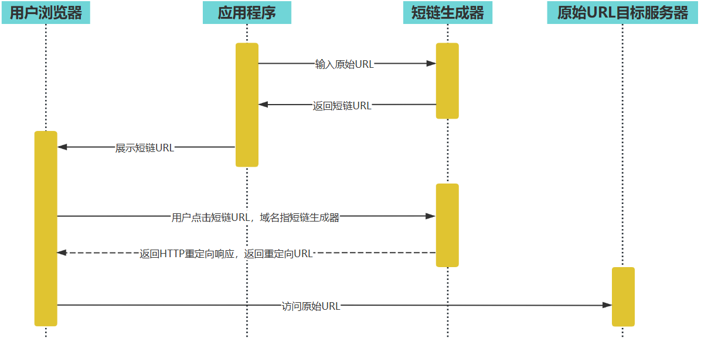

- 用户 client 程序可以使用短链生成器为每个长 URL 生成唯一的短 URL，并存储起来。
- 用户可以访问这个短链，短链生成器将请求重定向到原始长 URL。
- 生成的短链可以是短链生成器自动生成的，也可以是用户自定义的。用户可以指定一个长URL 对应的短链，只要这个短链还没有被使用。
- 管理员可以通过 web 后台检索、查看短链生成器的使用情况。
- 短链有有效期（2 年），后台定时任务会清理超过有效期的 URL，以节省存储资源，同时回收短链地址链接资源。

## 3、性能指标估算

短链生成器，存储容量和并发量估算如下：
- 预计每月新生成短链 5 亿条，短链有效期 2 年，那么总 URL 数量 120 亿。
- 每条短链数据库记录大约 1KB，那么需要总存储空间 12TB（不含数据冗余备份）。
- 每条短链平均读取次数 100 次，那么平均访问吞吐量（每秒访问次数）2 万。$(5亿 × 100) ÷ (30 × 24 × 60 × 60) ≈ 20000$
- 一般系统高峰期访问量是平均访问量的 2 倍，因此系统架构需要支持的吞吐能力应为 4万;
- 网络带宽：短链的重定向响应包含长 URL 地址内容，长 URL 地址大约 500B，HTTP 响应头其他内容大约 500B，所以每个响应 1KB，高峰期需要的响应网络带宽 40MB
- 短链长度估算：短链采用 Base64 编码，如果短链长度是 7 个字符的话，大约可以编码 4 万亿个短URL。

## 4、非功能性需求

- 系统需要保持高可用，不因为服务器、数据库宕机而引起服务失效。
- 另外：短链 应该是不可猜测的，即不能猜测某个短链是否存在，也不能猜测短链可能对应的长 URL 地址内容；

## 5、生成短链算法

短链生成器的设计核心就是短链的生成，即长 URL 通过某种函数，计算得到一个 6个字符的短链。短链有几种不同的生成算法：
- **单项散列函数生成短链**：将长 URL 利用 MD5 或者 SHA256 等单项散列算法，进行 Hash 计算，得到 128bit 或者 256bit 的 Hash 值。然后对该 Hash 值进行 Base64 编码，得到 22个或者 43 个 Base64 字符，再截取前面的 6 个字符，就得到短链了；存在的问题是：可能会发生 Hash 冲突；
- **自增长短 URL**：即维持一个自增长的二进制自然数，然后将该自然数进行 Base64 编码即可得到一系列的短 URL；但是这种算法将导致短 URL 是可猜测的，如果某个应用在某个时间段内生成了一批短URL
- **预生成短 URL**：即预先生成一批没有冲突的短 URL 字符串，当外部请求输入长 URL 需要生成短 URL 的时候，直接从预先生成好的短 URL 字符串池中获取一个即可；可以采用随机数来实现，6 个字符，每个字符都用随机数产生（用0~63 的随机数产生一个 Base64 编码字符）。为了避免随机数产生的短 URL 冲突，需要在预生成的时候检查该 URL 是否已经存在（用布隆过滤器检查）。因为预生成短 URL 是离线的，所以这时不会有性能方面的问题。事实上，短链生成器在上线之前就已经生成全部需要的 144 亿条短 URL 并存储在文件系统中（预估需要短 URL120 亿，短链生成器预生成的时候进行了 20% 的冗余，即 144 亿。）

# 二十八、广告业务

- [穿山甲广告平台](https://www.csjplatform.com/)

# 二十九、问卷业务

- [如何设计问卷](https://www.woshipm.com/pd/5432666.html)

一般设计一套问卷系统，主要需要关注如下点：

设计一套支持用户输入、单选、多选以及分支跳转的问卷系统，主要可分为以下几个步骤：
- 确定问卷目的和内容：在设计问卷之前，需要明确问卷的目的和调查内容。比如，是针对某个特定行业或人群的问卷，还是通用性较强的问卷，问卷中需要包含哪些问题等。
- 确定问卷结构和题型：根据问卷的目的和内容，确定问卷的结构和题型。常见的题型有开放式问题、封闭式问题、单选题、多选题等，需要根据实际情况选择合适的题型。
- 设计问卷流程和分支跳转：根据问卷的结构和题型，设计问卷的流程和分支跳转。分支跳转可以根据用户的回答情况，自动跳转到下一个相关问题，避免重复或无关的问题，提高问卷的效率和质量。
- 搭建问卷系统：在确定好问卷的结构和流程后，需要使用问卷设计工具搭建问卷系统，并将问卷上线。常见的问卷设计工具有问卷星、腾讯问卷、SurveyMonkey等。
- 测试和发布问卷：在完成问卷设计和搭建之后，需要对问卷进行测试，并修正相关问题。然后将问卷发布给目标受众群体，并收集回答数据。

使用Java实现的大致步骤
- 定义问题类（Question）：定义一个问题类，包含问题内容，选项列表，是否必答等属性。
- 定义选项类（Option）：定义一个选项类，包含选项内容，得分等属性。
- 定义题型枚举类（Type）：定义一个题型枚举类，包括开放式问题、封闭式问题、单选题、多选题等。
- 定义问卷类（Questionnaire）：定义一个问卷类，包含问题列表，问卷得分等属性，以及相应的添加问题、计算得分等方法。
- 定义用户回答类（Answer）：定义一个用户回答类，包含问题 ID，选项 ID 等属性。
- 分支跳转：为了实现分支跳转功能，可以在问题类中增加一个跳转目标属性（target），表示该问题的回答选项所对应的下一个问题 ID。通过遍历问题列表和用户回答列表，即可根据当前问题 ID 和用户回答选项 ID 获取下一个问题 ID，从而实现分支跳转。
- 界面交互：可使用 Swing 或 JavaFX 等 GUI 框架实现问卷系统的界面交互，包括显示问题、选项和分支跳转等内容，以及采集用户回答信息，并计算问卷得分等功能。

# 三十、数据混淆与加密

## 1、数据混淆

- [id混淆算法](https://gist.github.com/megayu/50a6741875148613e38dd58a0a6a0972)

## 2、数据加密

相关算法参考[对称加密与非对称加密](../../../信息安全/密码学.md)

### 2.1、获取公钥

**一般思路：**
- 用户调用获取公钥接口；
- 查询Redis，如果有公钥存在，直接返回；
- 如果公钥不存在，则加锁生成公钥和私钥，存到Redis中；然后再将公钥返回；

**存在问题：**
- 公钥过期时间存在临界值，比如快过期了，用户获取到公钥，如果提交数据后，对应的私钥不存在了，则就会提示解密失败；

**更优雅的解决方法：** 采用双公钥和私钥的方式；
- （1）首先从Redis中获取到所有公钥和私钥；
- （2）如果公钥数量为两个，返回过期时间最长的那个；
- （3）如果公钥数量为0 或者 公钥数量为1且过期时间小于buffer（缓冲）时间；则生成一个新的公钥和私钥存到Redis中；
- （4）获取时按照过期时间倒序排列，过期时间长的排在前面，这样每次获取的时候都是获取到最新的；
- （5）重复上面的步骤；

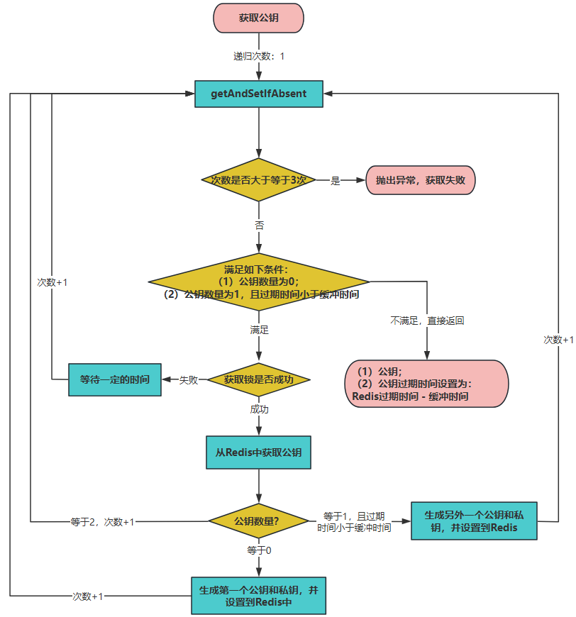

# 三十一、FIX 协议

- [QuickFix-Java的FIX协议引擎](https://www.quickfixj.org/)
- [java-fix-engine](https://www.onixs.biz/java-fix-engine.html)
- [quickfixj-core-usermanual](https://rawgit.com/quickfix-j/quickfixj/master/quickfixj-core/src/main/doc/usermanual/usage/configuration.html)
- [FIX Interactive Message And Tag Explorer](https://fiximate.fixtrading.org/)
- [FIX 字典](https://www.onixs.biz/fix-dictionary.html)

# 三十三、操作日志

- [操作日志最佳实践](../../../Java/Java框架/日志框架.md)

## 1、字段修改对比

### 1.1、有前端情况下

如果在有前端的情况下，如果修改字段，可以由前端来控制，传输到后端的数据实体包含key（数据库字段）、oldValue、newValue，前端传给我们有变化的值，然后我们取newValue，大概格式如下：
```json
{
    "id": 1,
    "changeDataList": [
        {
            "key": "name", // 修改的字段名称
            "oldValue": "张三",
            "newValue": "李四"
        },
        {
            "key": "className",
            "oldValue": "一班",
            "newValue": "二班"
        }
    ]
}
```
其中key，可以约定好更实体以及数据库字段对应；

### 1.2、Mybatis插件

如果是使用了 MyBatis 那么比较常见的通用方案是基于 MyBatis 的插件，拦截请求SQL信息。采集到变更入参和语句：
- 如果粗鲁些，就在这里对要控制的表，先查询下记录，在把入参记录在执行完操作后，一起发送一个MQ出去，或者写到某个库里；
- 如果精细些，可以基于mysql的binlog日志，这样就不用再次查询数据库记录了，减少查询操作

### 1.3、通过binlog

- 添加需要处理添加的数据库表，对应的业务表需要新增字段：更新人和更新人类型等字段；
- 如果需要区分创建和更新、文件上传等，区分不同的Action
- 收集binlog配置，通过比较前后的值新增操作日志；这里可以增加需要忽略的字段，比如更新时间等；
- 提供统一处理操作日志的实现，如果有特殊实现，重写对应的方法即可；
- 操作日志可以区分不同的业务类型，比如：新建、修改、审核等；

# 三十四、拖拽排序


# 三十五、第三方对接

## 1、解决的问题

- 提供一个一致性抽象，屏蔽不同第三方平台 API 之间的差异。
- 提供客户端治理，即提供调用第三方平台 API 的重试、限流等功能。
- 提供可观测性支持。
- 提供测试支持。

### 1.1、一致性抽象

模块或者服务最基本的目标。举个例子，如果你调用的是第三方支付平台，你们公司支持多种接入方式，包括微信支付、支付宝支付；

一致性抽象会统一解决很多细节问题。比如不同的通信协议、不同的加密解密算法、不同的请求和响应格式、不同的身份认证和鉴权机制、不同的回调机制等等。这会带来两个好处：
- 研发效率大幅提高，对于业务方来说他们不需要了解第三方的任何细节，所以他们接入一个第三方会是一件很简单的事情。
- 高可扩展性，可以通过扩展接口的方式轻松接入新的第三方，而已有的业务完全不会受到影响；

### 1.2、客户端治理

一般来说，客户端治理有两个关键措施：**限流**和**重试**
- 限流：大部分的第三方平台 API 为了保护自己的系统，是不允许你频繁发送请求的。比如说某些银行的接口只允许你一秒钟发送十个请求，多了就会拒绝服务。那么自然地，你其实可以在你发起调用之前就开启限流，这样就可以省去一次必然失败的调用；
- 重试：当调用第三方平台超时的时候，业务方肯定不希望你直接返回超时响应，因为他们还要自己处理超时，比如说发起重试等；可以提供重试机制，并且可以对业务方保持透明。但要注意的是，只有当第三方接口是幂等的时候你才能发起重试；

### 1.3、可观测性支持

第三方接口一般都不在你的控制范围内，所以你一定要做好监控，比如说接入 Prometheus 和 SkyWalking 等工具。同时，你还要考虑提供便利的查询工具，让你自己和你的业务方都能够快速定位问题；

告警也是必不可少的。这些告警分成两类：
- 一类是给你和你共同维护这个功能的同事使用的；
- 另外一类是给业务方用的。

例如，当监控系统发现第三方平台突然不可用了，那么它会发出两个告警，一个是告诉你出事了；另外一个则是通知业务方第三方平台目前不稳定，那么业务方就需要确认对他们业务的影响范围，以及他们是否需要启动一些容错措施；

### 1.4、测试支持

测试支持的核心是要提供 mock 服务。例如正常情况下，业务方调用你的接口，会真的调用第三方 API。但是在测试环境下，就要考虑返回 mock 响应

使用 mock 服务有很多好处：
- 没有额外开支。比如说发短信之类的，短信是收费的，那么测试服务如果能避免真的发送短信，多少也能省一点。
- 不受制于第三方平台。有些第三方平台的认证和鉴权机制非常复杂，在测试环境要发起一次调用几乎不可能，那么只能用 mock 服务。
- 可以返回业务方任何预期的响应，包括成功响应、失败响应，甚至于还能返回模拟第三方平台超时的响应；

## 2、同步转异步

在一些不需要立刻拿到响应的场景，如果发现第三方已经崩溃了，可以将业务方的请求临时存储起来。等后面第三方恢复了再继续调用第三方处理。

这种方案一般用于对时效性要求不高的业务。比如业务方只是要求上报数据，不要求立刻成功，那么就可以采用这种方案；

这样做还有一个好处：**解耦**，这种容错机制其实完全可以做成利用消息队列来彻底解耦的形式。在这种解耦的架构下，业务方不再是同步调用一个接口，而是把消息丢到消息队列里面。然后的服务不断消费消息，调用第三方接口处理业务。等处理完毕再将响应通过消息队列通知业务方；

那么这种**解耦的方式**和**直接调用的方式**合并在一起，其实就是正常系统对接业务方的两个方案；

## 3、自动替换第三方

调用一个第三方的接口失败的时候，你可以考虑换一个第三方。

举例来说，你们公司有 A、B、C 三个短信供应商。现在你在选择使用 A 的时候，发现 A 一直返回失败的响应，或者说响应时间很长，那么你就可以考虑自动切换到 B 上；

## 4、压测支持

- 模拟第三方的响应时间。
- 模拟触发你的容错机制。如果你采用了同步转异步这种容错机制，那么你需要确保在流量很大的情况下，你确实转异步了；如果你采用的是自动切换第三方，那你也要确保真的如同你设想的那样真的切换了新的第三方。
- 流量分发。如果是在全链路压测的情况下，压测流量你会分发到 mock 逻辑，而真实业务请求你是真的调用第三方

# 三十六、Feed流

- [如何设计Feed流](https://mp.weixin.qq.com/s/etOJgikAntTeDznxXRWvWQ)

## 1、微博

### 1.1、微博的发表/订阅问题

一种简单的办法就是“推模式”，即建一张用户订阅表，用户关注的好友发表微博后，立即在用户订阅中为该用户插入一条记录，记录用户 id 和好友发表的微博 id。这样当用户刷新微博的时候，只需要从用户订阅表中按用户 id 查询所有订阅的微博，然后按时间顺序构建一个列表即可。也就是说，推模式是在用户发微博的时候推送给所有的关注者；推模式实现起来比较简单，但是推模式意味着，如果一个用户有大量的关注者，那么该用户每发表一条微博，就需要在订阅表中为每个关注者插入一条记录。而对于明星用户而言，可能会有几千万的关注者，明星用户发表一条微博，就会导致上千万次的数据库插入操作，直接导致系统崩溃；

对于 10 亿级用户的微博系统而言，我们需要使用“拉模式”解决发表 / 订阅问题。也就是说，用户刷新微博的时候，根据其关注的好友列表，查询每个好友近期发表的微博，然后将所有微博按照时间顺序排序后构建一个列表。也就是说，拉模式是在用户刷微博的时候拉取他关注的所有好友的最新微博；拉模式极大降低了发表微博时写入数据的负载压力，但是却又急剧增加了刷微博时候读数据库的压力。因为对于用户关注的每个好友，都需要进行一次数据库查询。如果一个用户关注了大量好友，查询压力也是非常巨大的；

采用“推拉结合”的模式：
- 如果用户当前在线，那么就会使用推模式，系统会在缓存中为其创建一个好友最新发表微博列表，关注的好友如果有新发表微博，就立即将该微博插入列表的头部，当该用户刷新微博的时候，只需要将这个列表返回即可；
- 如果用户当前不在线，那么系统就会将该列表删除。当用户登录刷新的时候，用拉模式为其重新构建列表

### 1.2、缓存策略

缓存的空间是有限的，我们必定不能将所有数据都缓存起来。一般缓存使用的是 LRU淘汰算法，即当缓存空间不足时，将最近最少使用的缓存数据删除，空出缓存空间存储新数据；

但是 LRU 算法并不适合微博的场景，因为在拉模式的情况下，当用户刷新微博的时候，我们需要确保其关注的好友最新发表的微博都能展示出来，如果其关注的某个好友较少有其他关注者，那么这个好友发表的微博就很可能会被 LRU 算法淘汰删除出缓存。对于这种情况，系统就不得不去数据库中进行查询。

基于此，使用时间淘汰算法，也就是将最近一定天数内发布的微博全部缓存起来，用户刷新微博的时候，只需要在缓存中进行查找。如果查找到的微博数满足一次返回的条数（20 条），就直接返回给用户；如果缓存中的微博数不足，就再到数据库中查找；缓存 7 天内发表的全部微博，需要的缓存空间约 700G。缓存的 key为用户 ID，value 为用户最近 7 天发表的微博 ID 列表。而微博 ID 和微博内容分别作为key 和 value 也缓存起来；

此外，对于特别热门的微博内容，比如某个明星的离婚微博，这种针对单个微博内容的高并发访问，由于访问压力都集中一个缓存 key 上，会给单台 Redis 服务器造成极大的负载压力。因此，微博还会启用本地缓存模式，即应用服务器在内存中缓存特别热门的微博内容，应用构建微博刷新页的时候，会优先检查微博 ID 对应的微博内容是否在本地缓存中

# 三十七、评论系统

- [B站评论系统架构设计](https://mp.weixin.qq.com/s/s99ZWuSi0Lu6ivfpBHvLWQ)
- [评论系统存储和可用性设计](https://mp.weixin.qq.com/s/N1UdNS4V_5DOLeHi6uzWRQ)
- [评论系统功能和架构设计](https://mp.weixin.qq.com/s/HsjXNDix1PdqGth-k4up8g)

# 三十八、历史记录

- [历史记录系统架构设计](https://mp.weixin.qq.com/s/HdCkJwulfr1ISpZ-S5btdQ)
- [历史记录存储系统设计](https://mp.weixin.qq.com/s/7yflSIVWfwW_cwtlzbApWg)

# 三十九、敏感词与数据脱敏

- [ToolGood.Words](https://github.com/toolgood/ToolGood.Words)

## 1、数据脱敏

数据脱敏是指对某些敏感信息通过脱敏规则进行数据的变形，实现敏感隐私数据的可靠保护。

脱敏的规则有很多种，例如：
- 替换(常用)：将敏感数据中的特定字符或字符序列替换为其他字符。例如，将信用卡号中的中间几位数字替换为星号（*）或其他字符。
- 删除：将敏感数据中的部分内容随机删除。例如，将电话号码的随机 3 位数字进行删除。
- 重排：将原始数据中的某些字符或字段的顺序打乱。例如，将身份证号码的随机位交错互换。
- 加噪：在数据中注入一些误差或者噪音，达到对数据脱敏的效果。例如，在敏感数据中添加一些随机生成的字符。

比如使用 Hutool + Jackson：利用 Hutool 提供的 DesensitizedUtil脱敏工具类配合 Jackson 通过注解的方式完成数据脱敏的。如果不想引入 Hutool 的话，也可以自己实现一个脱敏工具类，实现逻辑非常简单。或者，直接把 Hutool 的脱敏实现拿来用

MyBatis-Flex、Mybatis-Mate、Apache ShardingSphere

# 四十、验证码

- [绕过验证码：2024年17款最佳Captcha Solver](https://blog.browserscan.net/zh/docs/top-17-captcha-solver-in-2024#Capsolver)
- [reCAPTCHA protects your website from fraud and abuse without creating friction](https://www.google.com/recaptcha/about/)
- [Get verification codes with Google Authenticator](https://support.google.com/accounts/answer/1066447?hl=en&co=GENIE.Platform%3DiOS&oco=0)

双因素验证(Two-factor authentication,简称2FA，又名二步验证、双重验证)，是保证账户安全的一道有效防线。在登录或进行敏感操作时，需要输入验证器上的动态密码（类似于银行U盾），进一步保护您的帐户免受潜在攻击者的攻击。双因素验证的动态密码生成器分为软件和硬件两种，最常用的软件有OTP Auth和谷歌验证器 (Google Authenticator)

# 四十一、交友系统

使用的是 GeoHash算法来计算地理位置的

# 网盘

- [网盘项目介绍](https://articles.zsxq.com/id_ndjc7l60rhdk.html)
- [如何设计网盘系统](https://mp.weixin.qq.com/s/Siz3YHxsobRIbZC1JYKMhw)

## 1、需求分析

网盘的主要技术挑战是海量数据的高并发读写访问；

云盘的核心功能是提供文件上传和下载服务。基于核心功能，
- 云盘需要在服务器端保存这些文件，并在下载和上传过程中实现断点续传；
- 还需要实现文件共享的需求；
- 上传下载需要占用大量网络带宽，需要对上传和下载进行流速控制

## 2、负载指标估算

比如设计目标是：支持 10 亿用户注册使用，免费用户最大可拥有 1TB 存储空间。预计日活用户占总用户的 20%，即 2 亿用户。每个活跃用户平均每天上传、下载 4 个文件
- 总存储量：总存储空间估算为 10 亿 TB，即 1 万亿 GB。 $10亿 × 1TB = 10亿TB$ ; 真正需要的存储空间大约是这个估算值的 10%，即 1 亿 TB
- QPS：系统需要满足的平均 QPS 约为 10000。 $2亿 × 4 ÷ （24 × 60 × 60） ≈ 1万$ ，高峰期 QPS 约为平均 QPS 的两倍，即 2 万；
- 带宽负载：每次上传下载文件平均大小 1MB，所以需要网络带宽负载 10GB/s，即 80Gb/s , $1万 × 1MB = 10GB/s = 80Gb/s$

## 3、非功能需求

- 大数据量存储：10 亿注册用户，1000 亿个文件，约 1 亿 TB 的存储空间。
- 高并发访问：平均 1 万 QPS，高峰期 2 万 QPS。
- 大流量负载：平均网络带宽负载 80Gb/S，高峰期带宽负载 160Gb/s。
- 高可靠存储：文件不丢失，持久存储可靠性达到 99.9999% ，即 100 万个文件最多丢失（或损坏）1 个文件。
- 高可用服务：用户正常上传、下载服务可用性在 99.99% 以上，即一年最多 53 分钟不可用。
- 数据安全性：文件需要加密存储，用户本人及共享文件外，其他人不能查看文件内容。
- 不重复上传：相同文件内容不重复上传，也就是说，如果用户上传的文件内容已经被其他用户上传过了，该用户不需要再上传一次文件内容，进而实现“秒传”功能。从用户视角来看，不到一秒就可以完成一个大文件的上传。

## 4、概要设计

网盘设计的关键是元数据与文件内容的分离存储与管理；

文件元数据就是文件所有者、文件属性、访问控制这些文件的基础信息

## 5、关于网盘极速上传

- [网盘系统如何实现秒传](https://time.geekbang.org/column/article/489820)

已经说明可其中非常关键的一步，我来补充一些并说得通俗易懂一些。
我想要为每个用户提供 1G 的网络存储空间。
如果服务器上有一颗 1000G 的硬盘可以全部为用户提供数据储存，如果每个用户分配 1G 的最大储存空间，那么能分配给多少个用户使用呢？
你一定说是 1000/1=1000 个用户。
但事实上你这么分配了，你会发现每个用户平时根本不会上传 1G 的东西将容量占的满满的，有多有少，但平均用户平时只上传 50M 的文件，也就是说，你将 1000G 的硬盘分给 1000个人使用，但只有效利用了其中的 50M*1000=50G 的空间，剩余 950G 的空间基本都浪费了。
那么怎么解决呢？
你可以变通一下，将这 1000G 的空间分配给 20000个 用户使用，每个人的上传上限容量还是 1G，但每人平时还是平均上传 50M 的数据，那么 20000*50M=1000G，这下子就把宝贵的服务器上的存储空间充分利用了。但你又怕这样分配给 20000个 人后，万一某一刻人们突然多上传点数据，那么用户不是就觉察出来你分给人家的 1G 空间是假的了吗？所以可以不分配那么多人，只分配给 19000 人，剩下一些空间做应急之用。
突然发现一下子将可分配的用户数量翻了 19倍啊，了不起。那还有买有办法更加有效的利用一下呢？
如果我有 1000个 以上的服务器，一个服务器上有 1000G 空间，那么我们个服务器上都要留下 50G 的空白空间以备用户突然上传大数据时导致数据塞满的情况，那么我这 1000个服务器上就空出了 1000台*50G=50000G 的空间被浪费了，所么可惜。所以我们发明了计存储集群，使得一个用户的数据可以被分配在多个服务器上存储，但在用户那看起来只是一个 1G 的连续空间，那么就没必要在每个服务器上预留出应急的空间了，甚至可以充分的将前一个服务器塞满后，在将数据往下一个服务器中塞。这样保证了服务器空间的最大利用，如果某一刻管理员发现用户都在疯狂上传数据（在一个大规模用户群下，这样的概率少之又少）导致我现有提供的空间不够了，没关系，只需要随手加几块硬盘或者加几台服务器就解决了。
好吧，这下子我们的服务器空间利用率高多了，可以将一定量的空间分配给最多的用户使用了。但有没有更好的改进方案呢？
管理员有一天发现，即使每个用户均下来只存储 50M 的东西，但这 50M 也不是一蹴而就的，是随着1-2年时间的使用慢慢的达到这个数量的，也就是说，一个新的用户刚刚注册我的网络空间时，不会上传东西，或者只上传一点非常小的东西。那么我为每一个用户都初始分配了 50M 的空间，即使将来2年后他们会填满这 50M ，但这期间的这些空间就很浪费啊。所以聪明的工程师说：既然我们可以分布式、集群式存储，一个用户的数据可以分布在多个服务器上，那么我们就假设一开始就给一个新注册的用户提供 0M 的空间，将来他用多少，我就给他提供多少存储空间，这样就彻底的保证硬盘的利用了。当然用户的前端还是要显示 1G 的，只不过这1G的“空间”只是个数字而已。
工程师的这个点子，使得我在建立网盘初期能用 1台 1000G 的服务器提供了大约 1000000 人来注册和使用，随着注册的人多了，我也有钱了，也可以不断增加服务器以提供他们后期的存贮了。同时因为一部分服务器晚了一年多购买，我的购买成本也下来了。
那么...这结束了吗？若是邮箱提供商的话，这样的利用率够高了。但网盘就不一样了。

聪明的工程师发现：不同于邮箱，邮箱服务器中大家上传的内容和附件绝大多数都是自创的和不相似的。但网盘上大家上传的东西很多都是重复的。
比如：张三 今天下载了一部《TOKYO HOT》上传上传到了自己的网盘上，李四在三天后也下载了一模一样的《TOKYO HOT》上传到了网络硬盘上，随着用户的增多，你会发现总计有 1000个人 上传了 1000份 一模一样的文件到你宝贵的服务器空间上，所以工程师想出一个办法，既然是一样的文件，我就只存一份不久好啦，然后在用户的前端显示是每人都有一份不就行啦。当某些用户要删除这个文件的时候，我并不真的删除，只需要在前端显示似乎删除了，但后端一直保留着以供其他拥有此文件的用户下载。直到所有拥有此文件的用户都删除了这个文件我再真的将其删除吧。
这样子随着存储的数据越来越多，注册的用户越来越多，其上传的重复数据越来越多。你发现这样的检测重复文件存储的效率越来越大。这样算下来似乎每个人上传的不重复的文件只能平均 1M/用户。这下子你可以提供超过 50倍 的用户使用您这有限的空间了。
但伴随着使用，你又发现一个规律：
张三上传的《TOKYO HOT N0124》和李四上传的《TH n124》是同一个文件，只不过文件名不一样，难道我就不能识别出他们是一个文件，然后只将其分别给不同的用户保存成不同的文件名不久行啦？确实可行，但这要利用一些识别文件相同性的算法，例如 MD5 值等。只要两个文件的 MD5 值一样，文件大小一样，我就认为它们是相同的文件，只需要保存一份文件并给不同的用户记作不同的文件名就好了。
有一天你发现，因为每一个文件都需要计算 MD5 值，导致 CPU 负荷很大，而且本来一样的文件非要浪费带宽上传回来才可以检测一致性，能改进一下吗？
聪明的工程师写了个小软件/小插件，美其名曰“上传控件”，将计算 MD5 值的工作利用这个软件交给了上传用户的电脑来完成，一旦计算出用户要上传的数据和服务器上已经存储的某个数据是一样的，就干脆不用上传了，直接在用户那里标记上这个文件已经按照 XX 文件名上传成功了。这个过程几乎是瞬间搞定了，并给其起了个高富帅的名字“秒传”！

通过以上这么多步骤，你发现本来你只能给 1000用户 提供网络空间的，这么多改进办法后，在用户端显示 1G 空间不变的情况下，近乎可以为 1000000个用户 提供网络空间了。
这样若是您哪天心情好，对外宣传说：我要将每个用户的存储空间上限提升到 1TB。那么每个用户平均还是只上传 50M 数据，只有极个别极个别的用户上传了突破 1G 原始空间的数据，你会发现所付出的成本近乎是微乎其微的。

```
作者：杜鑫
链接：https://www.zhihu.com/question/21591490/answer/18762821
来源：知乎
著作权归作者所有。商业转载请联系作者获得授权，非商业转载请注明出处。
```
