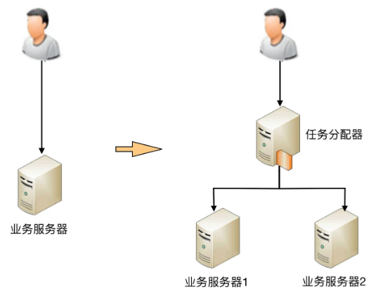
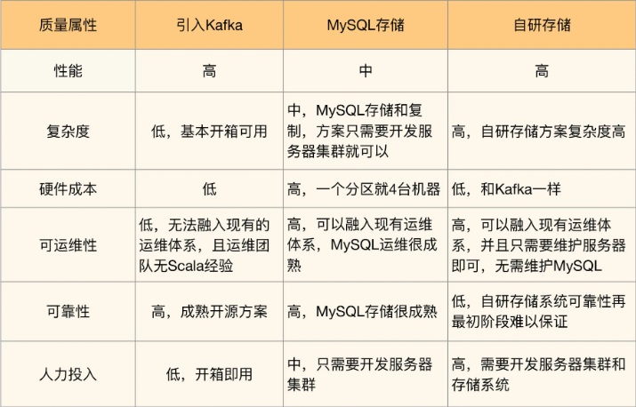

# 一、架构基础

架构设计的关键思维是判断和取舍，程序设计的关键思维是逻辑和实现

## 1、基本概念

### 1.1、系统与子系统

- 系统：泛指由一群有`关联`的个体组成，根据某种`规则`运作，能完成个别原件不能单独完成的工作的群体。它的意思是“总体”、“整体”或联盟
    - `关联`：系统是由一群有关联的个体组成的，没有关联的个体堆在一起不能成为一个系统；
    - `规则`：系统内的个体需要按照指定的规则运作，而不是单个个体各自为政。规则规定了系统内个体分工和协作的方式
    - `能力`：系统能力与个体能力有本质的差别，系统能力不是个体能力之和，而是产生了新的能力
- 子系统：由一群有关联的个体所组成的系统，多半会是更大系统中的一部分；

其实子系统的定义和系统的定义是一样的，只是观察的角度有差异，一个系统可能是另外一个更大系统的子系统；

按照这个定义，系统和子系统比较容易理解，以微信为例来做一个分析：
- 微信本身是一个系统，包含聊天、登录、支付、朋友圈等子系统。
- 朋友圈这个系统又包括动态、评论、点赞等子系统。
- 评论这个系统可能又包括防刷子系统、审核子系统、发布子系统、存储子系统。
- 评论审核子系统不再包含业务意义上的子系统，而是包括各个模块或者组件，这些模块或者组件本身也是另外一个维度上的系统。例如，MySQL、Redis 等是存储系统，但不是业务子系统。

> 一个系统的架构，只包括顶层这一个层级的架构，而不包括下属子系统层级的架构；

### 1.2、模块与组件

- 模块：是一套一致而互相有紧密关联的软件组装。它分别包含了`程序和数据结构`两部分。现代软件开发往往利用模块作为合成单位。模块的接口表达了由该模块提供的功能和调用它时所需的元素。模块是可能分开被编写的单位。这使它们可再用和允许人员同时协作、编写及研究不同的模块
- 组件：定义为自包含的、可编程的、可重用的、与语言无关的软件单元，软件组件可以很容易的被用于组装应用程序中。

模块和组件都是系统的组成部分，只是从不同的角度拆分系统而已；
- 从业务逻辑的角度来拆分系统后，得到的单元就是“模块”；
- 从逻辑角度来拆分系统，得到的单元就是“模块”；
- 从物理的角度来拆分系统后，得到的单元就是“组件”。 
划分模块的主要目的是职责分离；划分组件的主要目的是复用；

作为业务系统的架构师，首先需要思考怎么从业务逻辑的角度把系统拆分成一个个模块角色，其次需要思考怎么从物理部署的角度把系统拆分成组件角色，比如MySQL

### 1.3、框架与架构

- 软件框架通常指的是为了实现某个业界标准或完成特定基本任务的软件组件规范，也指为了实现某个软件组件规范时，提供规范所要求之基础功能的软件产品； 
    关键点：
    - 框架是组件规范，例如MVC；
    - 框架提供基础功能产品，例如SpringMVC是MVC开发框架；
- 软件架构是指软件系统的基础架构，创造这些基础结构的准则，以及对这些结构的描述；

框架和架构的区别还是比较明显的：框架关注的是“规范”，架构关注的是“结构”；框架的英文是 Framework ，架构的英文是 Architecture ；

> 总结：框架是一整套开发规范，架构是某一套开发规范下的具体落地方案，包括各个模块之间的组合关系以及它们协同起来完成功能的运作规则。

### 1.4、软件架构

软件架构指软件系统的顶层（Rank）结构，它定义了系统由哪些角色（Role）组成，角色之间的关系（Relation）和运作规则（Rule）。
- Rank：它是指软件架构是分层的，对应“系统”和“子系统”的分层关系。通常情况下，只需要关注某一层的架构，最多展示相邻两层的架构，而不需要把每一层的架构全部糅杂在一起。无论是架构设计还是画架构图，都应该采取“自顶向下，逐步细化”的方式
- Role：它是指软件系统包含哪些角色，每个角色都会负责系统的一部分功能；架构设计最重要的工作之一就是将系统拆分为多个角色
- Relation：它是指软件系统的角色之间的关系，对应到架构图中其实就是连接线，角色之间的关系不能乱连，任何关系最后都需要代码来实现；
- Rule：它是指软件系统角色之间如何协作来完成系统功能

在实际工作中，Rank、Role 和 Relation 是通过系统架构图来展示的，而 Rule 是通过系统序列图（System Sequence Diagram）来展示的。

## 2、目的

架构设计的误区：
- 因为架构很重要，所以要做架构设计：不做架构设计系统就跑不起来么？做了架构设计就能提升开发效率么？设计良好的架构能促进业务发展么？
- 不是每个系统都要做架构设计吗？
- 公司流程要求系统开发过程中必须有架构设计
- 为了高性能、高可用、可扩展，所以要做架构设计

架构设计的真正目的：为了解决软件系统复杂度带来的问题。

（1）遵循该原则，新手做到心中有数，而不是一头雾水
- *“这么多需求，从哪里开始下手进行架构设计呢？”*： 
▶ 通过熟悉和理解需求，识别系统复杂性所在的地方，然后针对这些复杂点进行架构设计。
- *“架构设计要考虑高性能、高可用、高扩展……这么多高 XX，全部设计完成估计要 1 个月，但老大只给了 1 周时间”*： 
▶ 架构设计并不是要面面俱到，不需要每个架构都具备高性能、高可用、高扩展等特点，而是要识别出复杂点然后有针对性地解决问题。
- *“业界 A 公司的架构是 X，B 公司的方案是 Y，两个差别比较大，该参考哪一个呢？”*： 
▶ 理解每个架构方案背后所需要解决的复杂点，然后才能对比自己的业务复杂点，参考复杂点相似的方案。

（2）遵循该原则，老手有的放矢，而不是贪大求全。
- *“我们的系统一定要做到每秒 TPS 10 万”*： 
▶ 如果系统的复杂度不是在性能这部分，TPS 做到 10 万并没有什么用。
- *“淘宝的架构是这么做的，我们也要这么做”*： 
▶ 淘宝的架构是为了解决淘宝业务的复杂度而设计的，淘宝的业务复杂度并不就是我们的业务复杂度，绝大多数业务的用户量都不可能有淘宝那么大；
- *“Docker 现在很流行，我们的架构应该将 Docker 应用进来”*： 
▶ Docker 不是万能的，只是为了解决资源重用和动态分配而设计的，如果我们的系统复杂度根本不是在这方面，引入 Docker 没有什么意义

总结：
- 做软件架构是为两件事服务的：业务架构和业务量级，应该算是“软件系统复杂度带来问题”具体化
- 需求驱动架构，架起分析与设计实现的桥梁；
- 架构与开发成本的关系
- 做业务架构必须与其面向的实际应用场景相匹配，由于每个产品或项目的业务场景均有所不同，所以每次做新的软件开发前，必须先设计软件架构，试图不经分析直接套用先前的架构方案，十有八九会让当前的系统在某个点上报出大问题导致推翻重来，更不要说直接拿别人的现成架构方案了

## 3、复杂度

前面提到架构是为了解决软件系统复杂度带来的问题，那么软件系统的复杂度的来源有哪些？

### 3.1、高性能

软件系统中高性能带来的复杂度主要体现在两方面：
- 一方面是单台计算机内部为了高性能带来的复杂度；
- 另一方面是多台计算机集群为了高性能带来的复杂度。

**单机复杂度**

计算机内部复杂度最关键的地方就是操作系统；操作系统和性能最相关的就是进程和线程；

多进程多线程虽然让多任务并行处理的性能大大提升，但本质上还是分时系统，并不能做到时间上真正的并行。解决这个问题的方式显而易见，就是让多个 CPU 能够同时执行计算任务，从而实现真正意义上的多任务并行。目前这样的解决方案有 3 种：
- SMP（Symmetric Multi-Processor，对称多处理器结构）；
- NUMA（Non-Uniform Memory Access，非一致存储访问结构）；
- MPP（Massive Parallel Processing，海量并行处理结构）。 
其中 SMP 是我们最常见的，目前流行的多核处理器就是 SMP 方案。

如果要完成一个高性能的软件系统，需要考虑如多进程、多线程、进程间通信、多线程并发等技术点，而且这些技术并不是最新的就是最好的，也不是非此即彼的选择。在做架构设计的时候，需要花费很大的精力来结合业务进行分析、判断、选择、组合，这个过程同样很复杂

**集群的复杂度**

要支持支付宝支付和微信红包这种复杂的业务，单机的性能无论如何是无法支撑的，必须采用机器集群的方式来达到高性能；通过大量机器来提升性能，并不仅仅是增加机器这么简单，让多台机器配合起来达到高性能的目的，是一个复杂的任务

（1）任务分配：意思是指每台机器都可以处理完整的业务任务，不同的任务分配到不同的机器上执行。

1 台服务器演变为 2 台服务器后，架构上明显要复杂多了，主要体现在：
- 需要增加一个任务分配器，这个分配器可能是硬件网络设备（例如，F5、交换机等），可能是软件网络设备（例如，LVS），也可能是负载均衡软件（例如，Nginx、HAProxy），还可能是自己开发的系统。选择合适的任务分配器也是一件复杂的事情，需要综合考虑性能、成本、可维护性、可用性等各方面的因素。
- 任务分配器和真正的业务服务器之间有连接和交互（即图中任务分配器到业务服务器的连接线），需要选择合适的连接方式，并且对连接进行管理。例如，连接建立、连接检测、连接中断后如何处理等。
- 任务分配器需要增加分配算法。例如，是采用轮询算法，还是按权重分配，又或者按照负载进行分配。如果按照服务器的负载进行分配，则业务服务器还要能够上报自己的状态给任务分配器。

上面这个架构只是最简单地增加 1 台业务机器，假设单台业务服务器每秒能够处理 5000 次业务请求，那么这个架构理论上能够支撑 10000 次请求，实际上的性能一般按照 8 折计算，大约是 8000 次左右。如果我们的性能要求继续提高，假设要求每秒提升到 10 万次，上面这个架构会出现什么问题呢？是不是将业务服务器增加到 25 台就可以了呢？显然不是，因为随着性能的增加，任务分配器本身又会成为性能瓶颈，当业务请求达到每秒 10 万次的时候，单台任务分配器也不够用了，任务分配器本身也需要扩展为多台机器；

（2）任务分解：

为了能够继续提升性能，我们需要采取第二种方式：任务分解。通过这种任务分解的方式，能够把原来大一统但复杂的业务系统，拆分成小而简单但需要多个系统配合的业务系统。从业务的角度来看，任务分解既不会减少功能，也不会减少代码量（事实上代码量可能还会增加，因为从代码内部调用改为通过服务器之间的接口调用），那为何通过任务分解就能够提升性能呢？
- *简单的系统更加容易做到高性能*：系统的功能越简单，影响性能的点就越少，就更加容易进行有针对性的优化。而系统很复杂的情况下，首先是比较难以找到关键性能点，因为需要考虑和验证的点太多；其次是即使花费很大力气找到了，修改起来也不容易，因为可能将 A 关键性能点提升了，但却无意中将 B 点的性能降低了，整个系统的性能不但没有提升，还有可能会下降。
- *可以针对单个任务进行扩展*：当各个逻辑任务分解到独立的子系统后，整个系统的性能瓶颈更加容易发现，而且发现后只需要针对有瓶颈的子系统进行性能优化或者提升，不需要改动整个系统，风险会小很多；

既然将一个大一统的系统分解为多个子系统能够提升性能，那是不是划分得越细越好呢？其实不然，这样做性能不仅不会提升，反而还会下降，最主要的原因是如果系统拆分得太细，为了完成某个业务，系统间的调用次数会呈指数级别上升，而系统间的调用通道目前都是通过网络传输的方式，性能远比系统内的函数调用要低得多；

任务分解带来的性能收益是有一个度的，并不是任务分解越细越好，而对于架构设计来说，如何把握这个粒度就非常关键了。

### 3.2、高可用

高可用定义：系统无中断地执行其功能的能力，代表系统的可用性程度，是进行系统设计时的准则之一。

系统的高可用方案五花八门，但万变不离其宗，本质上都是通过“**冗余**”来实现高可用；通俗点来讲，就是一台机器不够就两台，两台不够就四台

高可用的“冗余”解决方案，单纯从形式上来看，和高性能是一样的，都是通过增加更多机器来达到目的，但其实本质上是有根本区别的：
- 高性能增加机器目的在于“扩展”处理性能；
- 高可用增加机器目的在于“冗余”处理单元。

通过冗余增强了可用性，但同时也带来了复杂性，对应到不同的场景，有不同的解决方案

**计算高可用**

“计算”指的是业务的逻辑处理。计算有一个特点就是无论在哪台机器上进行计算，同样的算法和输入数据，产出的结果都是一样的，所以将计算从一台机器迁移到另外一台机器，对业务并没有什么影响。

计算高可用的复杂度体现在哪里呢？其复杂度类似于高性能中的加机器的

具体表现为：
- 需要增加一个任务分配器，选择合适的任务分配器也是一件复杂的事情，需要综合考虑性能、成本、可维护性、可用性等各方面因素。
- 任务分配器和真正的业务服务器之间有连接和交互，需要选择合适的连接方式，并且对连接进行管理。例如，连接建立、连接检测、连接中断后如何处理等。
- 任务分配器需要增加分配算法。例如，常见的双机算法有主备、主主，主备方案又可以细分为冷备、温备、热备。

**存储高可用**

对于需要存储数据的系统来说，整个系统的高可用设计关键点和难点就在于“存储高可用”。存储与计算相比，有一个本质上的区别：**将数据从一台机器搬到到另一台机器，需要经过线路进行传输**

对于高可用系统来说，在传输过程中发生的延迟，体现到系统上就是整个系统在某个时间点上，数据肯定是不一致的。按照“数据 + 逻辑 = 业务”这个公式来套的话，数据不一致，即使逻辑一致，最后的业务表现就不一样了

除了物理上的传输速度限制，传输线路本身也存在可用性问题，传输线路可能中断、可能拥塞、可能异常（错包、丢包），并且传输线路的故障时间一般都特别长，短的十几分钟，长的几个小时都是可能的

综上：无论是正常情况下的传输延迟，还是异常情况下的传输中断，都会导致系统的数据在某个时间点或者时间段是不一致的，而数据的不一致又会导致业务问题；但如果完全不做冗余，系统的整体高可用又无法保证，所以 **存储高可用的难点不在于如何备份数据，而在于如何减少或者规避数据不一致对业务造成的影响。**

分布式领域里面有一个著名的 CAP 定理，从理论上论证了存储高可用的复杂度，要求我们在做架构设计时结合业务进行取舍。

**高可用状态决策**

无论是计算高可用还是存储高可用，其基础都是“状态决策”，即系统需要能够判断当前的状态是正常还是异常，如果出现了异常就要采取行动来保证高可用。具体实践的过程中，恰好存在一个本质的矛盾：**通过冗余来实现的高可用系统，状态决策本质上就不可能做到完全正确**

常见的决策方式： 
（1）*独裁式*：独裁式决策指的是存在一个独立的决策主体，姑且称它为“决策者”，负责收集信息然后进行决策；所有冗余的个体，姑且称它为“上报者”，都将状态信息发送给决策者；

独裁式的决策方式不会出现决策混乱的问题，因为只有一个决策者，但问题也正是在于只有一个决策者。当决策者本身故障时，整个系统就无法实现准确的状态决策。如果决策者本身又做一套状态决策，那就陷入一个递归的死循环了

（2）*协商式*：协商式决策指的是两个独立的个体通过交流信息，然后根据规则进行决策，最常用的协商式决策就是主备决策。这个架构的基本协商规则可以设计成：
- 2 台服务器启动时都是备机。
- 2 台服务器建立连接。
- 2 台服务器交换状态信息。
- 某 1 台服务器做出决策，成为主机；另一台服务器继续保持备机身份。

难点在于，如果两者的信息交换出现问题（比如主备连接中断），此时状态决策应该怎么做。
- 如果备机在连接中断的情况下认为主机故障，那么备机需要升级为主机，但实际上此时主机并没有故障，那么系统就出现了两个主机，这与设计初衷（1 主 1 备）是不符合的。
- 如果备机在连接中断的情况下不认为主机故障，则此时如果主机真的发生故障，那么系统就没有主机了，这同样与设计初衷（1 主 1 备）是不符合的
- 如果为了规避连接中断对状态决策带来的影响，可以增加更多的连接。例如，双连接、三连接。这样虽然能够降低连接中断对状态带来的影响（注意：只能降低，不能彻底解决），但同时又引入了这几条连接之间信息取舍的问题，即如果不同连接传递的信息不同，应该以哪个连接为准？实际上这也是一个无解的答案，无论以哪个连接为准，在特定场景下都可能存在问

（3）*民主式*：民主式决策指的是多个独立的个体通过投票的方式来进行状态决策。例如，ZooKeeper 集群在选举 leader 时就是采用这种方式。

民主式决策和协商式决策比较类似，其基础都是独立的个体之间交换信息，每个个体做出自己的决策，然后按照“多数取胜”的规则来确定最终的状态。不同点在于民主式决策比协商式决策要复杂得多，除了算法复杂，民主式决策还有一个固有的缺陷：脑裂

综合分析，无论采取什么样的方案，状态决策都不可能做到任何场景下都没有问题，但完全不做高可用方案又会产生更大的问题，如何选取适合系统的高可用方案，也是一个复杂的分析、判断和选择的过程。

### 3.3、可扩展性

可扩展性是指，系统为了应对将来需求变化而提供的一种扩展能力，当有新的需求出现时，系统不需要或者仅需要少量修改就可以支持，无须整个系统重构或者重建。

设计具备良好可扩展性的系统，有两个基本条件：
- 正确预测变化
- 完美应对变化

**预测变化**

软件系统在发布后，还可以不断地修改和演进。这就意味着不断有新的需求需要实现。

综合分析，预测变化的复杂性在于：
- 不能每个设计点都考虑可扩展性。
- 不能完全不考虑可扩展性。
- 所有的预测都存在出错的可能性。

如何预测变化：*2 年法则*，即**只预测 2 年内的可能变化，不要试图预测 5 年甚至 10 年后的变化。**

**应对变化**

（1）*方案一：提炼出“变化层”和“稳定层”*

第一种应对变化的常见方案是：*将不变的部分封装在一个独立的“稳定层”，将“变化”封装在一个“变化层”（也叫“适配层”）*。这种方案的核心思想是通过变化层来隔离变化。无论是变化层依赖稳定层，还是稳定层依赖变化层都是可以的，需要根据具体业务情况来设计；

无论采取哪种形式，通过剥离变化层和稳定层的方式应对变化，都会带来两个主要的复杂性相关的问题：
- 变化层和稳定层如何拆分？哪些属于变化层，哪些属于稳定层
- 变化层和稳定层之间的接口如何设计？对于稳定层来说，接口肯定是越稳定越好；但对于变化层来说，在有差异的多个实现方式中找出共同点，并且还要保证当加入新的功能时，原有的接口不需要太大修改，这是一件很复杂的事情，所以接口设计同样至关重要。

（2）*方案二：提炼出“抽象层”和“实现层”*

第二种常见的应对变化的方案是：提炼出一个“抽象层”和一个“实现层”。如果说方案一的核心思想是通过变化层来隔离变化，那么方案二的核心思想就是通过实现层来封装变化。

因为抽象层的接口是稳定的不变的，我们可以基于抽象层的接口来实现统一的处理规则，而实现层可以根据具体业务需求定制开发不同的实现细节，所以当加入新的功能时，只要遵循处理规则然后修改实现层，增加新的实现细节就可以了，无须修改抽象层

方案二典型的实践就是设计模式和规则引擎

**实际工作中具体如何来应对变化呢？**

事不过三，三则重构，或者说“1 写 2 抄 3 重构”，也就是说不要一开始就考虑复杂的可扩展性应对方法，而是等到第三次遇到类似的实现的时候再来重构，重构的时候采取隔离或者封装的方案

假设你们的创新业务要对接第三方钱包，按照这个原则，就可以这样做：
- **1 写**：最开始你们选择了微信钱包对接，此时不需要考虑太多可扩展性，直接快速对照微信支付的 API 对接即可，因为业务是否能做起来还不确定。
- **2 抄**：后来你们发现业务发展不错，决定要接入支付宝，此时还是可以不考虑可扩展，直接把原来微信支付接入的代码拷贝过来，然后对照支付宝的 API，快速修改上线。
- **3 重构**：因为业务发展不错，为了方便更多用户，你们决定接入银联云闪付，此时就需要考虑重构，参考设计模式的模板方法和策略模式将支付对接的功能进行封装。

### 3.4、低成本

当我们设计“高性能”、“高可用”的架构时，通用的手段都是增加更多服务器来满足“高性能”和“高可用”的要求；而低成本正好与此相反，需要减少服务器的数量才能达成低成本的目标。

因此，低成本本质上是与高性能和高可用冲突的，所以低成本很多时候不会是架构设计的首要目标，而是架构设计的附加约束；

首先设定一个成本目标，当我们根据高性能、高可用的要求设计出方案时，评估一下方案是否能满足成本目标，如果不行，就需要重新设计架构；如果无论如何都无法设计出满足成本要求的方案，那就只能找老板调整成本目标了。

低成本给架构设计带来的主要复杂度体现在，往往只有“创新”才能达到低成本目标。这里的“创新”既包括开创一个全新的技术领域，也包括引入新技术；
- 引入新技术的主要复杂度在于需要去熟悉新技术，并且将新技术与已有技术结合起来；
- 创造新技术的主要复杂度在于需要自己去创造全新的理念和技术，并且新技术跟旧技术相比，需要有质的飞跃。

### 3.5、安全

安全本身是一个庞大而又复杂的技术领域，并且一旦出问题，对业务和企业形象影响非常大；

从技术的角度来讲，安全可以分为两类：一类是功能上的安全，一类是架构上的安全。
- 功能安全：常见的 XSS 攻击、CSRF 攻击、SQL 注入、Windows 漏洞、密码破解等，本质上是因为系统实现有漏洞，黑客有了可乘之机；从实现的角度来看，功能安全更多地是和具体的编码相关，与架构关系不大；
- 架构安全：传统的架构安全主要依靠防火墙，防火墙最基本的功能就是隔离网络，通过将网络划分成不同的区域，制定出不同区域之间的访问控制策略来控制不同信任程度区域间传送的数据流；互联网系统的架构安全目前并没有太好的设计手段来实现，更多地是依靠运营商或者云服务商强大的带宽和流量清洗的能力，较少自己来设计和实现

### 3.6、规模

规模带来复杂度的主要原因就是“量变引起质变”，当数量超过一定的阈值后，复杂度会发生质的变化。常见的规模带来的复杂度有：

（1）功能越来越多，导致系统复杂度指数级上升

（2）数据越来越多，系统复杂度发生质变

## 4、架构设计三原则

架构师在多种可能性的选择时候，该如何选择呢：
- 是要选择业界最先进的技术，还是选择团队目前最熟悉的技术？如果选了最先进的技术后出了问题怎么办？如果选了目前最熟悉的技术，后续技术演进怎么办？
- 是要选择 Google 的 Angular 的方案来做，还是选择 Facebook 的 React 来做？Angular 看起来更强大，但 React 看起来更灵活？
- 是要选 MySQL 还是 MongoDB？团队对 MySQL 很熟悉，但是 MongoDB 更加适合业务场景？
- 淘宝的电商网站架构很完善，我们新做一个电商网站，是否简单地照搬淘宝就可以了？

架构设计时遵循如下原则：合适原则、简单原则、演化原则

### 4.1、合适原则

**合适原则宣言：“合适优于业界领先”。** 合适当前的业务，合适当前的团队，合适当前的成本（时间与资本）
- 将军难打无兵之仗：没那么多人，却想干那么多活，是失败的第一个主要原因。
- 罗马不是一天建成的：没有那么多积累，却想一步登天，是失败的第二个主要原因。
- 冰山下面才是关键：业界领先的方案其实都是“逼”出来的！简单来说，“业务”发展到一定阶段，量变导致了质变，出现了新的问题，已有的方式已经不能应对这些问题，需要用一种新的方案来解决，通过创新和尝试，才有了业界领先的方案；没有那么卓越的业务场景，却幻想灵光一闪成为天才，是失败的第三个主要原因。

所以，真正优秀的架构都是在企业当前人力、条件、业务等各种约束下设计出来的，能够合理地将资源整合在一起并发挥出最大功效，并且能够快速落地

### 4.2、简单原则

**简单原则宣言：“简单优于复杂”。**

大部分人在评价一个方案水平高低的时候，复杂性是其中一个重要的参考指标，但是“复杂”在制造领域代表先进，在建筑领域代表领先，但在软件领域，却恰恰相反，代表的是“问题”。

软件领域的复杂性体现在两个方面：

（1）结构的复杂性：结构复杂的系统几乎毫无例外具备两个特点：
- 组成复杂系统的组件数量更多；
- 同时这些组件之间的关系也更加复杂。

结构上的复杂性存在的问题：
- 第一个问题是：组件越多，就越有可能其中某个组件出现故障，从而导致系统故障；
- 第二个问题是：某个组件改动，会影响关联的所有组件，这些被影响的组件同样会继续递归影响更多的组件
- 第三个问题是：定位一个复杂系统中的问题总是比简单系统更加困难；首先是组件多，每个组件都有嫌疑，因此要逐一排查；其次组件间的关系复杂，有可能表现故障的组件并不是真正问题的根源。

（2）逻辑的复杂性：降低组件数量，这样做是行不通的，原因在于除了结构的复杂性，还有逻辑的复杂性，即如果某个组件的逻辑太复杂，一样会带来各种问题。

逻辑复杂的组件，一个典型特征就是单个组件承担了太多的功能。以电商业务为例，常见的功能有：商品管理、商品搜索、商品展示、订单管理、用户管理、支付、发货、客服……把这些功能全部在一个组件中实现，就是典型的逻辑复杂性。

### 4.3、演化原则

**演化原则宣言：“演化优于一步到位”。**

软件架构与建筑是不一样的，建筑一旦完成（甚至一旦开建）就不可再变，而软件却需要根据业务的发展不断地变化！**对于建筑来说，永恒是主题；而对于软件来说，变化才是主题**。软件架构需要根据业务的发展而不断变化；

软件架构设计其实更加类似于大自然“设计”一个生物，通过演化让生物适应环境，逐步变得更加强大：
- 首先，设计出来的架构要满足当时的业务需要。
- 其次，架构要不断地在实际应用过程中迭代，保留优秀的设计，修复有缺陷的设计，改正错误的设计，去掉无用的设计，使得架构逐渐完善。
- 第三，当业务发生变化时，架构要扩展、重构，甚至重写；代码也许会重写，但有价值的经验、教训、逻辑、设计等（类似生物体内的基因）却可以在新架构中延续。

架构师在进行架构设计时需要牢记这个原则，时刻提醒自己不要贪大求全，或者盲目照搬大公司的做法。应该认真分析当前业务的特点，明确业务面临的主要问题，设计合理的架构，快速落地以满足业务需要，然后在运行过程中不断完善架构，不断随着业务演化架构

## 5、架构设计流程

### 5.1、识别复杂度

架构设计流程第 1 步：识别复杂度。

架构设计的本质目的是为了解决软件系统的复杂性，所以在我们设计架构时，首先就要分析系统的复杂性。只有正确分析出了系统的复杂性，后续的架构设计方案才不会偏离方向；

架构的复杂度主要来源于“高性能”“高可用”“可扩展”等几个方面，但架构师在具体判断复杂性的时候，不能生搬硬套，认为任何时候架构都必须同时满足这三方面的要求。实际上大部分场景下，复杂度只是其中的某一个，少数情况下包含其中两个，如果真的出现同时需要解决三个或者三个以上的复杂度，要么说明这个系统之前设计的有问题，要么可能就是架构师的判断出现了失误，即使真的认为要同时满足这三方面的要求，也必须要进行优先级排序

正确的做法是 **将主要的复杂度问题列出来，然后根据业务、技术、团队等综合情况进行排序，优先解决当前面临的最主要的复杂度问题**

原始的需求中并没有哪个地方会明确地说明复杂度在哪里，需要架构师在理解需求的基础上进行分析。有经验的架构师可能一看需求就知道复杂度大概在哪里；如果经验不足，那只能采取“排查法”，从不同的角度逐一进行分析

### 5.2、设计备选方案

架构设计流程第 2 步：设计备选方案

成熟的架构师需要对已经存在的技术非常熟悉，对已经经过验证的架构模式烂熟于心，然后根据自己对业务的理解，挑选合适的架构模式进行组合，再对组合后的方案进行修改和调整。

绝大部分时候我们有了明确的目标后，按图索骥就能够找到可选的解决方案
- 高可用的主备方案、集群方案；
- 高性能的负载均衡、多路复用；
- 可扩展的分层、插件化等技术

**架构设计的误区：**

（1）第一个误区-设计最优秀的方案：应该要根据架构设计原则中“合适原则”和“简单原则“的要求，挑选合适自己业务、团队、技术能力的方案才是好方案；否则要么浪费大量资源开发了无用的系统；

（2）第二个误区-只做一个方案：单个方案容易让架构师陷入思考问题片面、自我坚持的认知陷阱。

更合理的做法是：
- 备选方案的数量以 3 ~ 5 个为最佳：
- 备选方案的差异要比较明显，技术实现上的细节差异不适合做成两个方案；
- 备选方案的技术不要只局限于已经熟悉的技术，需要放宽视野；

（3）第三个误区-备选方案过于详细：过于详细的备选方案不仅浪费时间，还容易因为过度关注细节而忽略的整体的设计；

证券的做法是备选阶段的技术选型，而不是技术细节，技术选型的差异要比较明显；

### 5.3、评估和选择备选方案

架构设计第 3 步：评估和选择备选方案

如何评估和选择备选方案：**“360 度环评”**！具体的操作方式为：列出需要关注的质量属性点，然后分别从这些质量属性的维度去评估每个方案，再综合挑选适合当时情况的最优方案。

常见的方案质量属性点有：性能、可用性、硬件成本、项目投入、复杂度、安全性、可扩展性等。在评估这些质量属性时，需要遵循架构设计原则 1“合适原则”和原则 2“简单原则”，避免贪大求全，基本上某个质量属性能够满足一定时期内业务发展就可以了。

通常情况下，如果某个质量属性评估和业务发展有关系（例如，性能、硬件成本等），需要评估未来业务发展的规模时，一种简单的方式是将当前的业务规模乘以 2 ~4 即可，如果现在的基数较低，可以乘以 4；如果现在基数较高，可以乘以 2；

基于360 度环评评估结果整理出 360 度环评表，一目了然地看到各个方案的优劣点。但是 360 度环评表也只能帮助分析各个备选方案，还是没有告诉具体选哪个方案，原因就在于没有哪个方案是完美的，极少出现某个方案在所有对比维度上都是最优的。基于方案该如何选择呢：
- **数量对比法**：简单地看哪个方案的优点多就选哪个。例如，总共 5 个质量属性的对比，其中 A 方案占优的有 3 个，B 方案占优的有 2 个，所以就挑选 A 方案。这种方案主要的问题在于把所有质量属性的重要性等同，而没有考虑质量属性的优先级
- **加权法**：每个质量属性给一个权重。例如，性能的权重高中低分别得 10 分、5 分、3 分，成本权重高中低分别是 5 分、3 分、1 分，然后将每个方案的权重得分加起来，最后看哪个方案的权重得分最高就选哪个。这种方案主要的问题是无法客观地给出每个质量属性的权重得分
- **按优先级选择**，即架构师综合当前的业务发展情况、团队人员规模和技能、业务发展预测等因素，将质量属性按照优先级排序，首先挑选满足第一优先级的，如果方案都满足，那就再看第二优先级……以此类推

### 5.4、详细方案设计

**架构设计流程第 4 步：详细方案设计。**

详细方案设计就是将方案涉及的关键技术细节给确定下来；假如我们确定使用 Elasticsearch 来做全文搜索，那么就需要确定 Elasticsearch 的索引是按照业务划分，还是一个大索引就可以了；副本数量是 2 个、3 个还是 4 个，集群节点数量是 3 个还是 6 个等。

详细设计方案阶段可能遇到的一种极端情况就是在详细设计阶段发现备选方案不可行，一般情况下主要的原因是备选方案设计时遗漏了某个关键技术点或者关键的质量属性，比如说开发周期的影响，如何避免：
- 架构师不但要进行备选方案设计和选型，还需要对备选方案的关键细节有较深入的理解；
- 通过分步骤、分阶段、分系统等方式，尽量降低方案复杂度，方案本身的复杂度越高，某个细节推翻整个方案的可能性就越高，适当降低复杂性，可以减少这种风险；
- 如果方案本身就很复杂，那就采取设计团队的方式来进行设计，博采众长，汇集大家的智慧和经验，防止只有 1~2 个架构师可能出现的思维盲点或者经验盲区

对于一些新技术的引入，架构师需要对基本原理、优点缺点、关键设计点、架构师至少要安装过、编写demo体验过，确定选型后，要进行性能和可用性测试；

## 6、高性能架构模式

高性能架构设计主要集中在两方面：
- 尽量提升单服务器的性能，将单服务器的性能发挥到极致。
- 如果单服务器无法支撑性能，设计服务器集群方案。

架构设计决定了系统性能的上限，实现细节决定了系统性能的下限

### 6.1、高性能数据库集群：读写分离

读写分离的基本原理是将数据库读写操作分散到不同的节点上，写分离的基本实现是：
- 数据库服务器搭建主从集群，一主一从、一主多从都可以。
- 数据库主机负责读写操作，从机只负责读操作。
- 数据库主机通过复制将数据同步到从机，每台数据库服务器都存储了所有的业务数据。
- 业务服务器将写操作发给数据库主机，将读操作发给数据库从机。

读写分离的实现逻辑并不复杂，但有两个细节点将引入设计复杂度：**主从复制延迟** 和 **分配机制**。

**复制延迟**

以 MySQL 为例，主从复制延迟可能达到 1 秒，如果有大量数据同步，延迟 1 分钟也是有可能的。*主从复制延迟会带来一个问题*：如果业务服务器将数据写入到数据库主服务器后立刻（1 秒内）进行读取，此时读操作访问的是从机，主机还没有将数据复制过来，到从机读取数据是读不到最新数据的，业务上就可能出现问题

解决主从复制延迟有几种常见的方法：
- 写操作后的读操作指定发给数据库主服务器：这种方式和业务强绑定，对业务的侵入和影响较大，如果哪个新来的程序员不知道这样写代码，就会导致一个 bug；
- 读从机失败后再读一次主机：这就是通常所说的“二次读取”，二次读取和业务无绑定，只需要对底层数据库访问的 API 进行封装即可，实现代价较小，不足之处在于如果有很多二次读取，将大大增加主机的读操作压力；
- 关键业务读写操作全部指向主机，非关键业务采用读写分离

**分配机制**

将读写操作区分开来，然后访问不同的数据库服务器，一般有两种方式：**程序代码封装** 和 **中间件封装**。

1.程序代码封装

程序代码封装指在代码中抽象一个数据访问层，实现读写操作分离和数据库服务器连接的管理，主要特点：
- 实现简单，而且可以根据业务做较多定制化的功能
- 每个编程语言都需要自己实现一次，无法通用，如果一个业务包含多个编程语言写的多个子系统，则重复开发的工作量比较大。
- 故障情况下，如果主从发生切换，则可能需要所有系统都修改配置并重启。

目前开源的实现方案中，淘宝的 TDDL（Taobao Distributed Data Layer）是比较有名的

2.中间件封装

中间件封装指的是独立一套系统出来，实现读写操作分离和数据库服务器连接的管理。中间件对业务服务器提供 SQL 兼容的协议，业务服务器无须自己进行读写分离。对于业务服务器来说，访问中间件和访问数据库没有区别，事实上在业务服务器看来，中间件就是一个数据库服务器

###  6.2、高性能数据库集群：分库分表

读写分离分散了数据库读写操作的压力，但没有分散存储压力，当数据量达到千万甚至上亿条的时候，单台数据库服务器的存储能力会成为系统的瓶颈：
- 数据量太大，读写的性能会下降，即使有索引，索引也会变得很大，性能同样会下降。
- 数据文件会变得很大，数据库备份和恢复需要耗费很长时间。
- 数据文件越大，极端情况下丢失数据的风险越高

常见的分散存储的方法“分库分表”

**业务分库**

业务分库指的是按照业务模块将数据分散到不同的数据库服务器，但是带来了新的问题：

1.join 操作问题：业务分库后，原本在同一个数据库中的表分散到不同数据库中，导致无法使用 SQL 的 join 查询。

2.事务问题

3.成本问题

**分表**

业务继续发展，同一业务的单表数据也会达到单台数据库服务器的处理瓶颈，单表数据拆分有两种方式：垂直分表和水平分表

1.垂直分表

垂直分表适合将表中某些不常用且占了大量空间的列拆分出去，垂直分表引入的复杂性主要体现在表操作的数量要增加。例如，原来只要一次查询就可以获取 name、age、sex、nickname、description，现在需要两次查询，一次查询获取 name、age、sex，另外一次查询获取 nickname、description

2.水平分表

水平分表适合表行数特别大的表，水平分表相比垂直分表，会引入更多的复杂性，主要表现在下面几个方面：
- 路由：水平分表后，某条数据具体属于哪个切分后的子表，需要增加路由算法进行计算，这个算法会引入一定的复杂性。
    - 范围路由：选取有序的数据列（例如，整形、时间戳等）作为路由的条件，不同分段分散到不同的数据库表中；范围路由的一个比较隐含的缺点是分布不均匀
    - Hash 路由：选取某个列（或者某几个列组合也可以）的值进行 Hash 运算，然后根据 Hash 结果分散到不同的数据库表中；
        Hash 路由设计的复杂点主要体现在初始表数量的选取上，表数量太多维护比较麻烦，表数量太少又可能导致单表性能存在问题。而用了 Hash 路由后，增加子表数量是非常麻烦的，所有数据都要重分布。
    - 配置路由：配置路由就是路由表，用一张独立的表来记录路由信息；配置路由的缺点就是必须多查询一次，会影响整体性能；而且路由表本身如果太大
- join 操作
- count() 操作，常见处理方式：
    - count() 相加：具体做法是在业务代码或者数据库中间件中对每个表进行 count() 操作，然后将结果相加。这种方式实现简单，缺点就是性能比较低
    - 记录数表：具体做法是新建一张表，假如表名为“记录数表”，包含 table_name、row_count 两个字段，每次插入或者删除子表数据成功后，都更新“记录数表
- order by 操作

### 6.3、高性能NoSQL

关系数据库存在缺点：
- 关系数据库存储的是行记录，无法存储数据结构
- 关系数据库的 schema 扩展很不方便
- 关系数据库在大数据场景下 I/O 较高
- 关系数据库的全文搜索功能比较弱

针对上面这些问题，有不同的NoSQL解决方案，NoSQL 方案带来的优势，本质上是牺牲 ACID 中的某个或者某几个特性，因此不能盲目地迷信 NoSQL 是银弹，而应该将 NoSQL 作为 SQL 的一个有力补充；

场景NoSQL分为4类：
- K-V 存储：解决关系数据库无法存储数据结构的问题，以 Redis 为代表。
- 文档数据库：解决关系数据库强 schema 约束的问题，以 MongoDB 为代表。
- 列式数据库：解决关系数据库大数据场景下的 I/O 问题，以 HBase 为代表。
- 全文搜索引擎：解决关系数据库的全文搜索性能问题，以 Elasticsearch 为代表。

**K-V存储**

Redis 是 K-V 存储的典型代表，它是一款开源（基于 BSD 许可）的高性能 K-V 缓存和存储系统。

**文档数据库**

文档数据库最大的特点就是 no-schema，可以存储和读取任意的数据。目前绝大部分文档数据库存储的数据格式是 JSON（或者 BSON），因为 JSON 数据是自描述的，无须在使用前定义字段，读取一个 JSON 中不存在的字段也不会导致 SQL 那样的语法错误；

文档数据库的这个特点，特别适合电商和游戏这类的业务场景；

文档数据库缺点：
- 不支持事务
- 无法实现关系数据库的 join 操作

**列式数据库**

列式数据库就是按照列来存储数据的数据库，主要优点：
- 节省IO
- 更高的存储压缩比，能够节省更多的存储空间：普通的行式数据库一般压缩率在 3:1 到 5:1 左右，而列式数据库的压缩率一般在 8:1 到 30:1 左右； 
劣势：
- 写入数据是随机IO操作，
- 更新时需要将存储数据解压后更新，然后再压缩，最后写入磁盘。

基于上述列式存储的优缺点，一般将列式存储应用在离线的大数据分析和统计场景中，因为这种场景主要是针对部分列单列进行操作，且数据写入后就无须再更新删除；

**全文搜索引擎**

全文搜索引擎的技术原理被称为“倒排索引”（Inverted index），也常被称为反向索引、置入档案或反向档案，是一种索引方法，其基本原理是建立单词到文档的索引

### 6.4、高性能缓存架构

缓存是为了弥补存储系统在这些复杂业务场景下的不足，其基本原理是将可能重复使用的数据放到内存中，一次生成、多次使用，避免每次使用都去访问存储系统。

[关于缓存，需要知道的点](../../Java/分布式/分布式_缓存.md)

### 6.5、单服务器高性能模式：PPC与TPC

单服务器高性能的关键之一就是服务器采取的并发模型，并发模型有如下两个关键设计点：
- 服务器如何管理连接。
- 服务器如何处理请求。

以上两个设计点最终都和操作系统的 I/O 模型及进程模型相关：
- I/O 模型：阻塞、非阻塞、同步、异步；
- 进程模型：单进程、多进程、多线程。

**PPC模式-Process Per Connection**

含义是指每次有新的连接就新建一个进程去专门处理这个连接的请求，这是传统的 UNIX 网络服务器所采用的模型：
- 父进程接受连接；
- 父进程“fork”子进程；
- 子进程处理连接的读写请求；
- 子进程关闭连接

PPC 模式实现简单，比较适合服务器的连接数没那么多的情况，例如数据库服务器；

如果并发量上来了，该模式的弊端：
- fork 代价高：站在操作系统的角度，创建一个进程的代价是很高的，需要分配很多内核资源，需要将内存映像从父进程复制到子进程；
- 父子进程通信复杂：父进程“fork”子进程时，文件描述符可以通过内存映像复制从父进程传到子进程，但“fork”完成后，父子进程通信就比较麻烦了，需要采用 IPC（Interprocess Communication）之类的进程通信方案；
- 支持的并发连接数量有限：一般情况下，PPC 方案能处理的并发连接数量最大也就几百。

*prefork：提前创建进程（pre-fork）*，可以解决fork代价高的问题，系统在启动的时候就预先创建好进程，然后才开始接受用户的请求，当有新的连接进来的时候，就可以省去 fork 进程的操作，让用户访问更快、体验更

**TPC模式-Thread Per Connection**

含义是指每次有新的连接就新建一个线程去专门处理这个连接的请求。与进程相比，线程更轻量级，创建线程的消耗比进程要少得多；同时多线程是共享进程内存空间的，线程通信相比进程通信更简单。因此，TPC 实际上是解决或者弱化了 PPC fork 代价高的问题和父子进程通信复杂的问题
- 父进程接受连接；
- 父进程创建子线程；
- 子线程处理连接的读写请求；
- 子线程关闭连接

TPC 虽然解决了 fork 代价高和进程通信复杂的问题，但是也引入了新的问题，具体表现在：
- 创建线程虽然比创建进程代价低，但并不是没有代价，高并发时（例如每秒上万连接）还是有性能问题。
- 无须进程间通信，但是线程间的互斥和共享又引入了复杂度，可能一不小心就导致了死锁问题。
- 多线程会出现互相影响的情况，某个线程出现异常时，可能导致整个进程退出（例如内存越界）。

除了引入了新的问题，TPC 还是存在 CPU 线程调度和切换代价的问题

*prethread*： 和 prefork 类似，prethread 模式会预先创建线程，然后才开始接受用户的请求，当有新的连接进来的时候，就可以省去创建线程的操作，让用户感觉更快、体验更好

**总结：**

适用场景：首先，PPC和TPC能够支持的最大连接数差不多，都是几百个，接着再从连接数和请求数来划分，这两种方式明显不支持高连接数的场景：
- 常量连接海量请求。比如数据库，redis，kafka等等
- 常量连接常量请求。比如企业内部网址

### 6.6、单服务器高性能模式：Reactor与Proactor

- [高性能IO设计模式](../../Java/Java基础/Java-IO.md#6高性能io设计模式)

### 6.7、高性能负载均衡：分类及架构

单服务器无论如何优化，无论采用多好的硬件，总会有一个性能天花板，当单服务器的性能无法满足业务需求时，就需要设计高性能集群来提升系统整体的处理性能。

高性能集群的本质很简单，通过增加更多的服务器来提升系统整体的计算能力；

高性能集群的复杂性主要体现在需要增加一个任务分配器，以及为任务选择一个合适的任务分配算法；负载均衡不只是为了计算单元的负载达到均衡状态。

[负载均衡](../../Java/分布式/分布式_负载均衡.md)

## 7、高可用架构模式

### 7.1、CAP理论

[CAP理论基础](../../Java/分布式/分布式_.md#二分布式理论基础)

### 7.2、如何全面分析系统高可用

[FMEA（Failure mode and effects analysis，故障模式与影响分析）](https://en.wikipedia.org/wiki/Failure_mode_and_effects_analysis)又称为失效模式与后果分析、失效模式与效应分析、故障模式与后果分析等；FMEA 是一种在各行各业都有广泛应用的可用性分析方法，通过对系统范围内潜在的故障模式加以分析，并按照严重程度进行分类，以确定失效对于系统的最终影响；

FMEA 并不能指导我们如何做架构设计，而是当我们设计出一个架构后，再使用 FMEA 对这个架构进行分析，看看架构是否还存在某些可用性的隐患；

在架构设计领域，FMEA 的具体分析方法是：
- 给出初始的架构设计图。
- 假设架构中某个部件发生故障。
- 分析此故障对系统功能造成的影响。
- 根据分析结果，判断架构是否需要进行优化。

FMEA 分析的方法其实很简单，就是一个 FMEA 分析表，常见的 FMEA 分析表格包含下面部分：

**（1）功能点**

当前的 FMEA 分析涉及的功能点，注意这里的“功能点”指的是从用户角度来看的，而不是从系统各个模块功能点划分来看的；例如，对于一个用户管理系统，使用 FMEA 分析时 “登录”“注册”才是功能点，而用户管理系统中的数据库存储功能、Redis 缓存功能不能作为 FMEA 分析的功能点。

**（2）故障模式**

故障模式指的是系统会出现什么样的故障，包括故障点和故障形式。需要特别注意的是，这里的故障模式并不需要给出真正的故障原因，只需要假设出现某种故障现象即可；故障模式的描述要尽量精确，多使用量化描述，避免使用泛化的描述；

**（3）故障影响**

当发生故障模式中描述的故障时，功能点具体会受到什么影响。常见的影响有：功能点偶尔不可用、功能点完全不可用、部分用户功能点不可用、功能点响应缓慢、功能点出错等；故障影响也需要尽量准确描述；

**（4）严重程度**

严重程度指站在业务的角度故障的影响程度，一般分为“致命 / 高 / 中 / 低 / 无”五个档次。严重程度按照这个公式进行评估：严重程度 = 功能点重要程度 × 故障影响范围 × 功能点受损程度；

**（5）故障原因**
- 不同的故障原因发生概率不相同；
- 不同的故障原因检测手段不一样；
- 不同的故障原因的处理措施不一样；

**（6）故障概率**

这里的概率就是指某个具体故障原因发生的概率，一般分为“高 / 中 / 低”三档即可，具体评估的时候需要有以下几点需要重点关注：
- 硬件：硬件随着使用时间推移，故障概率会越来越高；
- 开源系统：成熟的开源系统 bug 率低，刚发布的开源系统 bug 率相比会高一些；
- 自研系统：成熟的自研系统故障概率会低，而新开发的系统故障概率会高。

**（7）风险程度**

风险程度就是综合严重程度和故障概率来一起判断某个故障的最终等级，风险程度 = 严重程度 × 故障概率；

同样的故障影响，不同的故障原因有不同的概率，最终得到的风险级别就是不同的。

**（8）已有措施**

针对具体的故障原因，系统现在是否提供了某些措施来应对，包括：检测告警、容错、自恢复等：
- 检测告警：最简单的措施就是检测故障，然后告警，系统自己不针对故障进行处理，需要人工干预
- 容错：检测到故障后，系统能够通过备份手段应对；
- 自恢复：检测到故障后，系统能够自己恢复，这里的恢复主要还是指“业务”上的恢复，一般不太可能将真正的故障恢复

**（9）规避措施**

规避措施指为了降低故障发生概率而做的一些事情，可以是技术手段，也可以是管理手段：
- 技术手段
- 管理手段

**（10）解决措施**

解决措施指为了能够解决问题而做的一些事情，一般都是技术手段：
- 为了解决密码暴力破解，增加密码重试次数限制；
- 为了解决拖库导致数据泄露，将数据库中的敏感数据加密保存；
- 为了解决非法访问，增加白名单控制。

一般来说，如果某个故障既可以采取规避措施，又可以采取解决措施，那么我们会优先选择解决措施，毕竟能解决问题当然是最好的

**（11）后续规划**

综合前面的分析，就可以看出哪些故障我们目前还缺乏对应的措施，哪些已有措施还不够，针对这些不足的地方，再结合风险程度进行排序，给出后续的改进规划

### 7.3、高可用存储架构：双机架构

存储高可用方案的本质都是通过将数据复制到多个存储设备，通过数据冗余的方式来实现高可用，其复杂性主要体现在如何应对复制延迟和中断导致的数据不一致问题；

常见的高可用存储架构有主备、主从、主主、集群、分区

**（1）主备复制**

主备复制是最常见也是最简单的一种存储高可用方案，几乎所有的存储系统都提供了主备复制的功能，例如 MySQL、Redis、MongoDB 等。

其整体架构比较简单，主备架构中的“备机”主要还是起到一个备份作用，并不承担实际的业务读写操作，如果要把备机改为主机，需要人工操作；

主要优点：简单
- 对于客户端来说，不需要感知备机的存在；
- 对于主机和备机来说，双方只需要进行数据复制即可，无须进行状态判断和主备切换这类复杂的操作  
缺点：
- 备机仅仅只为备份，并没有提供读写操作，硬件成本上有浪费；
- 故障后需要人工干预，无法自动恢复

综合主备复制架构的优缺点，内部的后台管理系统使用主备复制架构的情况会比较多，例如学生管理系统、员工管理系统、假期管理系统等；

**（2）主从复制**

主机负责读写操作，从机只负责读操作，不负责写操作；与主备复制架构比较类似，主要的差别点在于从机正常情况下也是要提供读的操作；

主从复制与主备复制相比，优点有：
- 主从复制在主机故障时，读操作相关的业务可以继续运行。
- 主从复制架构的从机提供读操作，发挥了硬件的性能。 
缺点有：
- 主从复制架构中，客户端需要感知主从关系，并将不同的操作发给不同的机器进行处理，复杂度比主备复制要高。
- 主从复制架构中，从机提供读业务，如果主从复制延迟比较大，业务会因为数据不一致出现问题。
- 故障时需要人工干预。

综合主从复制的优缺点，一般情况下，*写少读多*的业务使用主从复制的存储架构比较多。例如，论坛、BBS、新闻网站这类业务，此类业务的读操作数量是写操作数量的 10 倍甚至 100 倍以上

**（3）双机切换**

主备复制和主从复制方案存在两个共性的问题：
- 主机故障后，无法进行写操作。
- 如果主机无法恢复，需要人工指定新的主机角色。

*双机切换* 就是为了解决这两个问题而产生的，包括主备切换和主从切换两种方案。简单来说，这两个方案就是在原有方案的基础上增加“切换”功能，即系统自动决定主机角色，并完成角色切换；

要实现一个完善的切换方案，必须考虑这几个关键的设计点：
- 主备间状态判断，主要包括两方面，状态传递的渠道，以及状态检测的内容。
    - 状态传递的渠道：是相互间互相连接，还是第三方仲裁？
    - 状态检测的内容：例如机器是否掉电、进程是否存在、响应是否缓慢等。
- 切换决策，主要包括几方面：切换时机、切换策略、自动程度。
    - 切换时机：什么情况下备机应该升级为主机？
    - 切换策略：原来的主机故障恢复后，要再次切换，确保原来的主机继续做主机，还是原来的主机故障恢复后自动成为新的备机？
    - 自动程度：切换是完全自动的，还是半自动的？
- 数据冲突解决：当原有故障的主机恢复后，新旧主机之间可能存在数据冲突

根据*状态传递渠道* 的不同，常见的主备切换架构有三种形式：互连式、中介式和模拟式
- 互连式：就是指主备机直接建立状态传递的渠道；客户端同时记录主备机的地址，哪个能访问就访问哪个；备机虽然能收到客户端的操作请求，但是会直接拒绝，拒绝的原因就是“备机不对外提供服务”。主要的缺点在于：
    - 如果状态传递的通道本身有故障，那么备机也会认为主机故障了从而将自己升级为主机，而此时主机并没有故障，最终就可能出现两个主机；
    - 虽然可以通过增加多个通道来增强状态传递的可靠性，但这样做只是降低了通道故障概率而已，不能从根本上解决这个缺点，而且通道越多，后续的状态决策会更加复杂，因为对备机来说，可能从不同的通道收到了不同甚至矛盾的状态信息；
- 中介式：指的是在主备两者之外引入第三方中介，主备机之间不直接连接，而都去连接中介，并且通过中介来传递状态信息
    - 连接管理更简单：主备机无须再建立和管理多种类型的状态传递连接通道，只要连接到中介即可，实际上是降低了主备机的连接管理复杂度。
    - 状态决策更简单：主备机的状态决策简单了，无须考虑多种类型的连接通道获取的状态信息如何决策的问题，只需要按照下面简单的算法即可完成状态决策
        - 无论是主机还是备机，初始状态都是备机，并且只要与中介断开连接，就将自己降级为备机，因此可能出现双备机的情况。
        - 主机与中介断连后，中介能够立刻告知备机，备机将自己升级为主机。
        - 如果是网络中断导致主机与中介断连，主机自己会降级为备机，网络恢复后，旧的主机以新的备机身份向中介上报自己的状态。

    开源方案已经有比较成熟的中介式解决方案，例如 ZooKeeper 和 Keepalived。ZooKeeper 本身已经实现了高可用集群架构，因此已经帮我们解决了中介本身的可靠性问题，在工程实践中推荐基于 ZooKeeper 搭建中介式切换架构。
- 模拟式：指主备机之间并不传递任何状态数据，而是备机模拟成一个客户端，向主机发起模拟的读写操作，根据读写操作的响应情况来判断主机的状态

**（4）主主复制**

两台机器都是主机，互相将数据复制给对方，客户端可以任意挑选其中一台机器进行读写操作；

主主复制架构有其独特的复杂性，具体表现在：如果采取主主复制架构，必须保证数据能够双向复制，而很多数据是不能双向复制的；

因此，主主复制架构对数据的设计有严格的要求，一般适合于那些临时性、可丢失、可覆盖的数据场景。例如，用户登录产生的 session 数据（可以重新登录生成）、用户行为的日志数据（可以丢失）、论坛的草稿数据（可以丢失）等。

### 7.4、高可用存储架构：数据集群和数据分区

#### 7.4.1、数据集群

集群就是多台机器组合在一起形成一个统一的系统，这里的“多台”，数量上至少是 3 台；相比而言，主备、主从都是 2 台机器。根据集群中机器承担的不同角色来划分，集群可以分为两类：数据集中集群、数据分散集群。

**（1）数据集中集群**

数据集中集群与主备、主从这类架构相似，也可以称数据集中集群为 1 主多备或者 1 主多从。无论是 1 主 1 从、1 主 1 备，还是 1 主多备、1 主多从，数据都只能往主机中写，而读操作可以参考主备、主从架构进行灵活多变；

由于集群里面的服务器数量更多，导致复杂度整体更高一些，具体体现在：
- 主机如何将数据复制给备机：多条复制通道首先会增大主机复制的压力，某些场景下我们需要考虑如何降低主机复制压力，或者降低主机复制给正常读写带来的压力。
- 备机如何检测主机状态：在数据集中集群架构中，多台备机都需要对主机状态进行判断，而不同的备机判断的结果可能是不同的，如何处理不同备机对主机状态的不同判断，是一个复杂的问题。
- 主机故障后，如何决定新的主机

目前开源的数据集中集群以 ZooKeeper 为典型，ZooKeeper 通过 ZAB 算法来解决上述提到的几个问题，但 ZAB 算法的复杂度是很高的。

**（2）数据分散集群**

数据分散集群指多个服务器组成一个集群，每台服务器都会负责存储一部分数据；同时，为了提升硬件利用率，每台服务器又会备份一部分数据。

数据分散集群的复杂点在于如何将数据分配到不同的服务器上，算法需要考虑这些设计点：
- 均衡性：算法需要保证服务器上的数据分区基本是均衡的，不能存在某台服务器上的分区数量是另外一台服务器的几倍的情况。
- 容错性：当出现部分服务器故障时，算法需要将原来分配给故障服务器的数据分区分配给其他服务器。
- 可伸缩性：当集群容量不够，扩充新的服务器后，算法能够自动将部分数据分区迁移到新服务器，并保证扩容后所有服务器的均衡性。

数据集中集群架构中，客户端只能将数据写到主机；数据分散集群架构中，客户端可以向任意服务器中读写数据。正是因为这个关键的差异，决定了两种集群的应用场景不同。
- 一般来说，数据集中集群适合数据量不大，集群机器数量不多的场景。例如，ZooKeeper 集群，一般推荐 5 台机器左右，数据量是单台服务器就能够支撑；
- 而数据分散集群，由于其良好的可伸缩性，适合业务数据量巨大、集群机器数量庞大的业务场景。例如，Hadoop 集群、HBase 集群，大规模的集群可以达到上百台甚至上千台服务器。

#### 7.4.2、数据分区

数据分区指将数据按照一定的规则进行分区，不同分区分布在不同的地理位置上，每个分区存储一部分数据，通过这种方式来规避地理级别的故障所造成的巨大影响；

设计数据分区架构需要考虑的点：
- 数据量：数据量的大小直接决定了分区的规则复杂度，数据量越大，分区规则会越复杂，考虑的情况也越多
- 分区规则
- 复制规则：常见的分区复制规则有三种：集中式、互备式和独立式。
    - 集中式：指存在一个总的备份中心，所有的分区都将数据备份到备份中心；
        - 设计简单，各分区之间并无直接联系，可以做到互不影响。
        - 扩展容易
        - 成本较高，需要建设一个独立的备份中心
    - 互备式：指每个分区备份另外一个分区的数据
        - 设计比较复杂，各个分区除了要承担业务数据存储，还需要承担备份功能，相互之间互相关联和影响。
        - 扩展麻烦
        - 成本低，直接利用已有的设备
    - 独立式：指每个分区自己有独立的备份中心，需要注意的细节是：各个分区的备份并不和原来的分区在一个地方
        - 设计简单，各分区互不影响；
        - 扩展容易，新增加的分区只需要搭建自己的备份中心即可。
        - 成本高，每个分区需要独立的备份中心，备份中心的场地成本是主要成本，因此独立式比集中式成本要高很多。

### 7.5、高可用计算架构

计算高可用的主要设计目标是当出现部分硬件损坏时，计算任务能够继续正常运行。因此计算高可用的本质是通过冗余来规避部分故障的风险；

计算高可用架构的设计复杂度主要体现在任务管理方面，即当任务在某台服务器上执行失败后，如何将任务重新分配到新的服务器进行执行，关键点：
- 哪些服务器可以执行任务：
    - 每个服务器都可以执行任务；
    - 只有特定服务器（通常叫“主机”）可以执行任务，当执行任务的服务器故障后，系统需要挑选新的服务器来执行任务
- 任务如何重新执行：
    - 对于已经分配的任务即使执行失败也不做任何处理，系统只需要保证新的任务能够分配到其他非故障服务器上执行即可。
    - 设计一个任务管理器来管理需要执行的计算任务，服务器执行完任务后，需要向任务管理器反馈任务执行结果，任务管理器根据任务执行结果来决定是否需要将任务重新分配到另外的服务器上执行。

**（1）主备**

主备架构是计算高可用最简单的架构，和存储高可用的主备复制架构类似，但是要更简单一些，因为计算高可用的主备架构无须数据复制
- 主机执行所有计算任务。例如，读写数据、执行操作等；
- 当主机故障（例如，主机宕机）时，任务分配器不会自动将计算任务发送给备机，此时系统处于不可用状态
- 如果主机能够恢复（不管是人工恢复还是自动恢复），任务分配器继续将任务发送给主机；
- 如果主机不能够恢复（例如，机器硬盘损坏，短时间内无法恢复），则需要人工操作，将备机升为主机，然后让任务分配器将任务发送给新的主机（即原来的备机）；同时，为了继续保持主备架构，需要人工增加新的机器作为备机。

主备架构又可以细分为冷备架构和温备架构：
- 冷备：备机上的程序包和配置文件都准备好，但备机上的业务系统没有启动；
- 温备：备机上的业务系统已经启动，只是不对外提供服务，主机故障后，人工只需要将任务分配器的任务请求切换发送到备机即可

**（2）主从**

和存储高可用中的主从复制架构类似，计算高可用的主从架构中的从机也是要执行任务的。任务分配器需要将任务进行分类，确定哪些任务可以发送给主机执行，哪些任务可以发送给备机执行

**（3）集群**

高可用计算的集群方案根据集群中服务器节点角色的不同，可以分为两类：一类是对称集群，即集群中每个服务器的角色都是一样的，都可以执行所有任务；另一类是非对称集群，集群中的服务器分为多个不同的角色，不同的角色执行不同的任务，例如最常见的 Master-Slave 角色。
- 对称集群，即：负载均衡集群，设计要点：
    - 任务分配器需要选取分配策略：轮询即可
    - 任务分配器需要检测服务器状态：常用的做法是任务分配器和服务器之间通过心跳来传递信息，包括服务器信息和任务信息，然后根据实际情况来确定状态判断条件。
- 非对称集群：非对称集群中不同服务器的角色是不同的，不同角色的服务器承担不同的职责。以 Master-Slave 为例，部分任务是 Master 服务器才能执行，部分任务是 Slave 服务器才能执行

非对称集群相比负载均衡集群，设计复杂度主要体现在两个方面：
- 任务分配策略更加复杂：需要将任务划分为不同类型并分配给不同角色的集群节点。
- 角色分配策略实现比较复杂

### 7.6、业务高可用保障：异地多活架构

异地多活架构的关键点就是异地、多活，其中异地就是指地理位置上不同的地方，类似于“不要把鸡蛋都放在同一篮子里”；多活就是指不同地理位置上的系统都能够提供业务服务，这里的“活”是活动、活跃的意思。判断一个系统是否符合异地多活，需要满足两个标准：
- 正常情况下，用户无论访问哪一个地点的业务系统，都能够得到正确的业务服务。
- 某个地方业务异常的时候，用户访问其他地方正常的业务系统，能够得到正确的业务服务。

现异地多活架构不是没有代价的，相反其代价很高，具体表现为：
- 系统复杂度会发生质的变化，需要设计复杂的异地多活架构。
- 成本会上升，毕竟要多在一个或者多个机房搭建独立的一套业务系统。

架构模式：同城异区、跨城异地、跨国异地
- 同城异区：关键在于搭建高速网络将两个机房连接起来，达到近似一个本地机房的效果。架构设计上可以将两个机房当作本地机房来设计，无须额外考虑
- 跨城异地：关键在于数据不一致的情况下，业务不受影响或者影响很小，这从逻辑的角度上来说其实是矛盾的，架构设计的主要目的就是为了解决这个矛盾
- 跨国异地：主要是面向不同地区用户提供业务，或者提供只读业务，对架构设计要求不高

#### 7.6.1、设计技巧

**（1）技巧 1：保证核心业务的异地多活**

假设我们需要做一个“用户子系统”，这个子系统负责“注册”“登录”“用户信息”三个业务，优先实现核心业务的异地多活架构！“登录”才是最核心的业务，“注册”和“用户信息”虽然也是主要业务，但并不一定要实现异地多活，主要原因在于业务影响不同；

“登录”才是最核心的业务，“注册”和“用户信息”虽然也是主要业务，但并不一定要实现异地多活，主要原因在于业务影响不同；

**（2）技巧 2：保证核心数据最终一致性**

异地多活本质上是通过异地的数据冗余，因此异地多活架构面临一个无法彻底解决的矛盾：业务上要求数据快速同步，物理上正好做不到数据快速同步，因此所有数据都实时同步，实际上是一个无法达到的目标。

如何减少影响：
- 尽量减少异地多活机房的距离，搭建高速网络；
- 尽量减少数据同步，只同步核心业务相关的数据；
- 保证最终一致性，不保证实时一致性

**（3）技巧 3：采用多种手段同步数据**

避免只使用存储系统的同步功能，可以将多种手段配合存储系统的同步来使用，甚至可以不采用存储系统的同步方案，改用自己的同步方案
- 消息队列方式
- 二次读取方式
- 存储系统同步方式
- 回源读取方式
- 重新生成数据方式

**（4）技巧 4：只保证绝大部分用户的异地多活**

异地多活也无法保证 100% 的业务可用，这是由物理规律决定的，光速和网络的传播速度、硬盘的读写速度、极端异常情况的不可控等，都是无法 100% 解决的；

忍受这一小部分用户或者业务上的损失，否则本来想为了保证最后的 0.01% 的用户的可用性，做一个完美方案，结果却发现 99.99% 的用户都保证不了了。

采取一些措施进行安抚或者补偿：
- 挂公告；
- 事后对用户进行补偿；
- 补充体验；

> 总结：采用多种手段，保证绝大部分用户的核心业务异地多活！

#### 7.6.2、设计步骤

**第 1 步：业务分级**

按照一定的标准将业务进行分级，挑选出核心的业务，只为核心业务设计异地多活，降低方案整体复杂度和实现成本：
- 访问量大的业务：以用户管理系统为例，业务包括登录、注册、用户信息管理，其中登录的访问量肯定是最大的；
- 核心业务
- 产生大量收入的业务

**第 2 步：数据分类**

挑选出核心业务后，需要对核心业务相关的数据进一步分析，目的在于识别所有的数据及数据特征，这些数据特征会影响后面的方案设计

常见数据特征：
- 数据量：包括总的数据量和新增、修改、删除的量。对异地多活架构来说，新增、修改、删除的数据就是可能要同步的数据，数据量越大，同步延迟的几率越高，同步方案需要考虑相应的解决方案。
- 唯一性：指数据是否要求多个异地机房产生的同类数据必须保证唯一；
- 实时性：指如果在 A 机房修改了数据，要求多长时间必须同步到 B 机房，实时性要求越高，对同步的要求越高，方案越复杂；
- 可丢失性：指数据是否可以丢失。
- 可恢复性：可恢复性指数据丢失后，是否可以通过某种手段进行恢复，如果数据可以恢复，至少说明对业务的影响不会那么大，这样可以相应地降低异地多活架构设计的复杂度

**第 3 步：数据同步**

根据不同的数据设计不同的同步方案。常见的数据同步方案有：
- 存储系统同步：这是最常用也是最简单的同步方式，这类数据同步的优点是使用简单，因为几乎主流的存储系统都会有自己的同步方案；缺点是这类同步方案都是通用的，无法针对业务数据特点做定制化的控制；
- 消息队列同步：采用独立消息队列进行数据同步，常见的消息队列有 Kafka、ActiveMQ、RocketMQ 等。
- 重复生成

**第 4 步：异常处理**

异常处理就是假设在出现同步延迟、数据丢失、数据不一致等问题时，系统将采取什么措施来应对。

常见的异常处理措施有这几类：
- *多通道同步*：是采取多种方式来进行数据同步，其中某条通道故障的情况下，系统可以通过其他方式来进行同步，这种方式可以应对同步通道处故障的情况；一般情况下，采取两通道即可；数据库同步通道和消息队列同步通道不能采用相同的网络连接，否则一旦网络故障，两个通道都同时故障；可以一个走公网连接，一个走内网连接
- *同步和访问结合*：指异地机房通过系统的接口来进行数据访问
- *日志记录*：日志记录主要用于用户故障恢复后对数据进行恢复，其主要方式是每个关键操作前后都记录相关一条日志，然后将日志保存在一个独立的地方，当故障恢复后，拿出日志跟数据进行对比，对数据进行修复。
- *用户补偿*：

> 涉及到取舍时就需要参考公司的核心目标和愿景了，如果是和核心目标相关的优先级就高，和核心目标无关或关联度不大的优先级就低。

### 7.7、如何应对接口级故障

接口级故障的典型表现就是，系统并没有宕机、网络也没有中断，但业务却出现问题了，例如业务响应缓慢、大量访问超时和大量访问出现异常（给用户弹出提示“无法连接数据库”）。

这类问题的主要原因在于系统压力太大、负载太高，导致无法快速处理业务请求，由此引发更多的后续问题

导致接口级故障的原因可以分为两大类：
- 内部原因：包括程序 bug 导致死循环，某个接口导致数据库慢查询，程序逻辑不完善导致耗尽内存等。
- 外部原因：包括黑客攻击，促销或者抢购引入了超出平时几倍甚至几十倍的用户，第三方系统大量请求，第三方系统响应缓慢等

解决接口级故障的核心思想：优先保证核心业务和优先保证绝大部分用户。常见的应对方法有四种，降级、熔断、限流和排队

详细参考：[分布式服务治理](../../Java/分布式/分布式_服务治理.md)

## 8、可扩展架构模式

# 架构图

- [常见架构图](https://mp.weixin.qq.com/s/6Jh0EHdbjZb47DCsplwS_A)

常见架构图：
- 业务架构图
- 功能架构图
- 产品架构图
- 应用架构图
- 系统架构图
- 技术架构图
- 信息架构图
- 数据架构图

# 参考资料

* [凤凰架构-构建可靠的大型分布式系统](http://icyfenix.cn/)
* [架构的演进](https://www.cnblogs.com/hafiz/p/9222973.html)
* [如何画架构图](https://developer.aliyun.com/article/765140?spm=a2c6h.12873639.0.0.75482c6dlmkDa6)
* [分布式架构知识体系](https://developer.aliyun.com/article/721007?spm=a2c6h.12873639.0.0.75482c6dlmkDa6)
* [架构设计实践](https://www.infoq.cn/article/RQDwWxDcwbxtwU8LBFSG)
* [如何做技术选型](https://juejin.im/post/6870288195674718222)
* [如何画架构图](https://juejin.cn/post/6844904127856640014)
* [软件架构-RoadMap](https://roadmap.sh/software-architect)
* [COLA架构-整洁面向对象分层架构-应用案例](https://github.com/alibaba/COLA)
* [C4模型](https://c4model.com/)
* [《架构整洁之道》](https://github.com/leewaiho/Clean-Architecture-zh)
