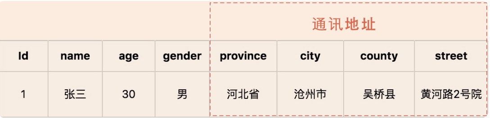
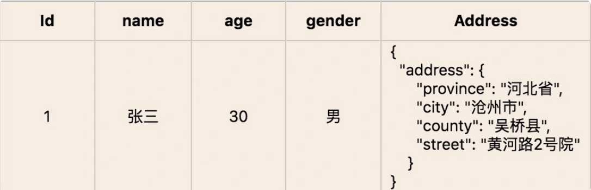
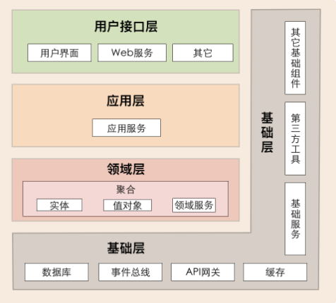

# 一、系统架构设计

- [系统设计面试题](https://mp.weixin.qq.com/s/zr4dkkpy5_QnifTPA7XkdQ)
- [系统设计入门](https://github.com/donnemartin/system-design-primer/blob/master/README-zh-Hans.md)
- [系统设计](https://github.com/ksfzhaohui/blog/tree/master/java8)
- [领域驱动模型在互联网业务中运用](https://tech.meituan.com/2017/12/22/ddd-in-practice.html)
- [system-design-interview](https://github.com/summerjava/system-design-interview)
- [grokking-modern-system-design-interview](https://www.educative.io/courses/grokking-modern-system-design-interview-for-engineers-managers)
- [grokking the system design interview]
- [如何面试系统设计](https://blog.acecodeinterview.com/intro/)
- [System Design Cheatsheet](https://gist.github.com/vasanthk/485d1c25737e8e72759f)
- [系统设计路线图](https://roadmap.sh/system-design)

约定大于配置

## 1、基础理论

## 2、高并发系统设计

- 系统拆分
- 缓存
- MQ
- 分库分表
- 读写分离
- ElasticSearch

### 2.1、设计原则

- 局部并发原则：比如电商场景中的下单链路，涉及到商品检查、用户信息检查、生成付款连接、地址信息、订单快照等，其中没有相互依赖的可以并行处理；
- 服务化拆分：主链路规划

## 3、高可用系统设计

### 3.1、设计原则

- 降级：多级降级
    - 主动降级：开关推送
    - 被动降级：超时降级、异常降级、失败率、熔断保护

- 限流：压测确定限流阈值、动态调整限流
    - 网关层限流：Nginx、Redis+Lua
    - 业务层限流：本地限流（Guava）、分布式限流（sentinel）

- 弹性计算：全链路都要弹性计算（K8S+Docker）

- 流量切换：多机房环境
    - DNS：域名切换入库、Client端流量调度
    - 虚IP：HaProxy、LVS负载均衡
    - 应用层：Nginx + 服务网关

- 回滚：
    - 版本控制：配置中心、CICD Pipeline

## 4、有限状态机

spring statemachine

# 六、领域驱动模型（DDD）

- [洞见：DDD领域驱动](https://insights.thoughtworks.cn/tag/domain-driven-design/)
- [淘技术：DDD领域驱动](https://mp.weixin.qq.com/s/1rdnkROdcNw5ro4ct99SqQ)
- [dddsample-core](https://github.com/citerus/dddsample-core)
- [DDD-Samples](https://github.com/ouchuangxin/leave-sample)
- [领域驱动设计方法论](软件设计.md#6设计方法)

## 1、敏捷与DDD

- 敏捷：关注流程和文化；DDD：关注建模设计方法；
- 敏捷：重人员轻文档；DDD:重视统一语言的建立；

都是软件工程领域的思想，解决软件工程领域的不同问题，一般可以结合使用；

## 2、基本概念

### 2.1、Domain Primitive

Domain Primitive 是一个在特定领域里，拥有精准定义的、可自我验证的、拥有行为的 Value Object：
- DP是一个传统意义上的Value Object，拥有Immutable的特性；
- DP是一个完整的概念整体，拥有精准定义；
- DP使用业务域中的原生语言；
- DP可以是业务域的最小组成部分、也可以构建复杂组合

使用 Domain Primitive 的三原则：
- 让隐性的概念显性化
- 让隐性的上下文显性化
- 封装多对象行为

Domain Primitive 和 DDD 里 Value Object 的区别：
- 在 DDD 中， Value Object 这个概念其实已经存在；
- Domain Primitive 是 Value Object 的进阶版，在原始 VO 的基础上要求每个 DP 拥有概念的整体，而不仅仅是值对象。在 VO 的 Immutable 基础上增加了 Validity 和行为。当然同样的要求无副作用（side-effect free）

什么情况下应该用 Domain Primitive：
- 有格式限制的 String：比如Name，PhoneNumber，OrderNumber，ZipCode，Address等；
- 有限制的Integer：比如OrderId（>0），Percentage（0-100%），Quantity（>=0）等
- 可枚举的 int ：比如 Status（一般不用Enum因为反序列化问题）
- Double 或 BigDecimal：一般用到的 Double 或 BigDecimal 都是有业务含义的，比如 Temperature、Money、Amount、ExchangeRate、Rating 等；
- 复杂的数据结构：比如 `Map<String, List<Integer>>` 等，尽量能把 Map 的所有操作包装掉，仅暴露必要行为

### 2.2、领域、子域、核心域、通用域、支撑域

在DDD中，领域是指具体业务领域的知识、业务逻辑、数据以及业务规则的集合。它是软件要解决问题的业务环境，通常由一系列子领域组成，每个子领域代表业务中的一个特定部分，领域的特性：
- 业务中心：领域是围绕业务需求和业务规则构建的，它是软件设计的核心。
- 模型驱动：领域模型是对业务知识的抽象，它通过领域实体、值对象、服务、聚合等概念来表达。
- 语言一致性：领域模型的构建基于统一语言（Ubiquitous Language），这是开发团队与业务专家共同使用的语言，确保沟通无歧义。
- 边界清晰：领域模型定义了清晰的边界，这些边界划分了不同的子领域和聚合，有助于管理复杂性和维护性

#### 2.2.1、如何理解领域和子域？

领域是用来确定范围的，范围即边界；在研究和解决业务问题时，DDD 会按照一定的规则将业务领域进行细分，当领域细分到一定的程度后，DDD 会将问题范围限定在特定的边界内，在这个边界内建立领域模型，进而用代码实现该领域模型，解决相应的业务问题。简言之，DDD 的领域就是这个边界内要解决的业务问题域

领域是用来限定业务边界和范围的，那么就会有大小之分，领域越大，业务范围就越大，反之则相反

领域可以进一步划分为子领域，把划分出来的多个子领域称为子域，每个子域对应一个更小的问题域或更小的业务范围

> 每一个细分的领域都会有一个知识体系，也就是 DDD 的领域模型。在所有子域的研究完成后，我们就建立了全域的知识体系了，也就建立了全域的领域模型

比如保险领域，为实现保险领域建模和微服务建设，可以根据业务关联度以及流程边界将保险领域细分为：`承保`、`收付`、`再保`以及`理赔`等子域，而承保子域还可以继续细分为`投保`、`保全（寿险）`、`批改（财险）`等子子域；在投保这个限界上下文内可以建立投保的领域模型，投保的领域模型最后映射到系统就是投保微服务；

> 领域建模和微服务建设的过程和方法基本类似，其核心思想就是将问题域逐步分解，降低业务理解和系统实现的复杂度；

#### 2.2.2、如何理解核心域、通用域和支撑域？

在领域不断划分的过程中，领域会细分为不同的子域，子域可以根据自身重要性和功能属性划分为三类子域，它们分别是：核心域、通用域和支撑域
- 核心域：决定产品和公司核心竞争力的子域是核心域，它是业务成功的主要因素和公司的核心竞争力。
- 通用域：没有太多个性化的诉求，同时被多个子域使用的通用功能子域是通用域。比如认证、权限
- 支撑域：还有一种功能子域是必需的，但既不包含决定产品和公司核心竞争力的功能，也不包含通用功能的子域，它就是支撑域。比如数据代码类的数据字典等系统

在公司领域细分、建立领域模型和系统建设时，要结合公司战略重点和商业模式，找到核心域了，且重点关注核心域

核心域、支撑域和通用域的主要目标是：通过领域划分，区分不同子域在公司内的不同功能属性和重要性，从而公司可对不同子域采取不同的资源投入和建设策略，其关注度也会不一样。

### 2.3、通用语言与限界上下文

通用语言定义上下文含义，限界上下文则定义领域边界，以确保每个上下文含义在它特定的边界内都具有唯一的含义，领域模型则存在于这个边界之内；

#### 2.3.1、通用语言

在事件风暴过程中，通过团队交流达成共识的，能够简单、清晰、准确描述业务涵义和规则的语言就是通用语言

#### 2.3.2、限界上下文

可以将限界上下文拆解为两个词：限界和上下文。限界就是领域的边界，而上下文则是语义环境；

限界上下文定义（Bounded Context）：用来封装通用语言和领域对象，提供上下文环境，保证在领域之内的一些术语、业务相关对象等（通用语言）有一个确切的含义，没有二义性；限界上下文就是用来细分领域，从而定义通用语言所在的边界。

`子域`和`限界上下文`在大多数情况下是一对一或者一对多的映射关系，本质上限界上下文就是某一个子域。

限界上下文可以作为微服务边界设计的参考依据。它是一种特殊的子域，是业务领域的边界

### 2.4、实体和值对象

#### 2.4.1、实体

在 DDD 中有这样一类对象，它们拥有唯一标识符，且标识符在历经各种状态变更后仍能保持一致。对这些对象而言，重要的不是其属性，而是其延续性和标识，对象的延续性和标识会跨越甚至超出软件的生命周期。把这样的对象称为实体，代表业务中的实体

**1、实体的业务形态**

在 DDD 不同的设计过程中，实体的形态是不同的：
- 在战略设计时，实体是领域模型的一个重要对象。领域模型中的实体是多个属性、操作或行为的载体。
- 在事件风暴中，可以根据命令、操作或者事件，找出产生这些行为的业务实体对象，进而按照一定的业务规则将依存度高和业务关联紧密的多个实体对象和值对象进行聚类，形成聚合；

**2、实体的代码形态**

在代码模型中，实体的表现形式是实体类，这个类包含了实体的属性和方法，通过这些方法实现实体自身的业务逻辑。在 DDD 里，这些实体类通常采用充血模型，与这个实体相关的所有业务逻辑都在实体类的方法中实现，跨多个实体的领域逻辑则在领域服务中实现；

**3、实体的运行形态**

实体以 DO（领域对象）的形式存在，每个实体对象都有唯一的 ID。我们可以对一个实体对象进行多次修改，修改后的数据和原来的数据可能会大不相同。但是，由于它们拥有相同的 ID，它们依然是同一个实体；

**4、实体的数据库形态**

DDD 是先构建领域模型，针对实际业务场景构建实体对象和行为，再将实体对象映射到数据持久化对象。

#### 2.4.2、值对象

在 DDD 中用来描述领域的特定方面，并且是一个没有标识符的对象，叫作值对象；值对象描述了领域中的一件东西，这个东西是不可变的，它将不同的相关属性组合成了一个概念整体。当度量和描述改变时，可以用另外一个值对象予以替换；

值对象本质上就是一个集合。这个集合里有 若干个用于描述目的、具有整体概念和不可修改的属性；

**1、值对象业务形态**

值对象是 DDD 领域模型中的一个基础对象，它跟实体一样都来源于事件风暴所构建的领域模型，都包含了若干个属性，它与实体一起构成聚合

**2、值对象的代码形态**

值对象在代码中有这样两种形态：
- 如果值对象是单一属性，则直接定义为实体类的属性；
- 如果值对象是属性集合，则把它设计为 Class 类，Class 将具有整体概念的多个属性归集到属性集合，这样的值对象没有 ID，会被实体整体引用

**3、值对象的运行形态**

除了值对象数据初始化和整体替换的行为外，其它业务行为就很少了。

值对象嵌入到实体的话，有这样两种不同的数据格式，也可以说是两种方式，分别是属性嵌入的方式和序列化大对象的方式

- 以属性嵌入的方式形成的人员实体对象，地址值对象直接以属性值嵌入人员实体中

    

- 以序列化大对象的方式形成的人员实体对象，地址值对象被序列化成大对象 Json 串后，嵌入人员实体中；

    

**4、值对象的数据库形态**

DDD 引入值对象是希望实现从“数据建模为中心”向“领域建模为中心”转变，减少数据库表的数量和表与表之间复杂的依赖关系，尽可能地简化数据库设计，提升数据库性能；

DDD 引入值对象是希望实现从“数据建模为中心”向“领域建模为中心”转变，减少数据库表的数量和表与表之间复杂的依赖关系，尽可能地简化数据库设计，提升数据库性能；

在领域建模时，我们可以将部分对象设计为值对象，保留对象的业务涵义，同时又减少了实体的数量；在数据建模时，我们可以将值对象嵌入实体，减少实体表的数量，简化数据库设计。

**5、值对象的优点与缺点**

- 优势是可以简化数据库设计，提升数据库性能；
- 值对象采用序列化大对象的方法简化了数据库设计，减少了实体表的数量，可以简单、清晰地表达业务概念。这种设计方式虽然降低了数据库设计的复杂度，但却无法满足基于值对象的快速查询，会导致搜索值对象属性值变得异常困难；
- 值对象采用属性嵌入的方法提升了数据库的性能，但如果实体引用的值对象过多，则会导致实体堆积一堆缺乏概念完整性的属性，这样值对象就会失去业务涵义，操作起来也不方便；

#### 2.4.3、实体与值对象的关系

实体和值对象是微服务底层的最基础的对象，一起实现实体最基本的核心领域逻辑

### 2.5、聚合与聚合根

#### 2.5.1、聚合

领域模型内的实体和值对象就好比个体，而能让实体和值对象协同工作的组织就是聚合，它用来确保这些领域对象在实现共同的业务逻辑时，能保证数据的一致性

聚合就是由业务和逻辑紧密关联的实体和值对象组合而成的，聚合是数据修改和持久化的基本单元，每一个聚合对应一个仓储，实现数据的持久化；

聚合有一个聚合根和上下文边界，这个边界根据业务单一职责和高内聚原则，定义了聚合内部应该包含哪些实体和值对象，而聚合之间的边界是松耦合的。按照这种方式设计出来的微服务很自然就是“高内聚、低耦合”的；

聚合在 DDD 分层架构里属于领域层，领域层包含了多个聚合，共同实现核心业务逻辑。聚合内实体以充血模型实现个体业务能力，以及业务逻辑的高内聚。跨多个实体的业务逻辑通过领域服务来实现，跨多个聚合的业务逻辑通过应用服务来实现；

#### 2.5.2、聚合根

聚合根的主要目的是为了避免由于复杂数据模型缺少统一的业务规则控制，而导致聚合、实体之间数据不一致性的问题；

如果把聚合比作组织，那聚合根就是这个组织的负责人。聚合根也称为根实体，它不仅是实体，还是聚合的管理者
- 首先它作为实体本身，拥有实体的属性和业务行为，实现自身的业务逻辑。
- 其次它作为聚合的管理者，在聚合内部负责协调实体和值对象按照固定的业务规则协同完成共同的业务逻辑；
- 最后在聚合之间，它还是聚合对外的接口人，以聚合根 ID 关联的方式接受外部任务和请求，在上下文内实现聚合之间的业务协同。也就是说，聚合之间通过聚合根 ID 关联引用，如果需要访问其它聚合的实体，就要先访问聚合根，再导航到聚合内部实体，外部对象不能直接访问聚合内实体；

#### 2.5.3、怎样设计聚合

DDD 领域建模通常采用事件风暴，它通常采用用例分析、场景分析和用户旅程分析等方法，通过头脑风暴列出所有可能的业务行为和事件，然后找出产生这些行为的领域对象，并梳理领域对象之间的关系，找出聚合根，找出与聚合根业务紧密关联的实体和值对象，再将聚合根、实体和值对象组合，构建聚合

构建聚合基本步骤：
- 第 1 步：采用事件风暴，根据业务行为，梳理出在业务过程中发生这些行为的所有的实体和值对象；
- 第 2 步：从众多实体中选出适合作为对象管理者的根实体，也就是聚合根。判断一个实体是否是聚合根，你可以结合以下场景分析：是否有独立的生命周期？是否有全局唯一 ID？是否可以创建或修改其它对象？是否有专门的模块来管这个实体；
- 第 3 步：根据业务单一职责和高内聚原则，找出与聚合根关联的所有紧密依赖的实体和值对象。构建出 1 个包含聚合根（唯一）、多个实体和值对象的对象集合，这个集合就是聚合；
- 第 4 步：在聚合内根据聚合根、实体和值对象的依赖关系，画出对象的引用和依赖模型；
- 第 5 步：多个聚合根据业务语义和上下文一起划分到同一个限界上下文内；

**聚合的一些设计原则**
- **在一致性边界内建模真正的不变条件**：聚合用来封装真正的不变性，而不是简单地将对象组合在一起。聚合内有一套不变的业务规则，各实体和值对象按照统一的业务规则运行，实现对象数据的一致性，边界之外的任何东西都与该聚合无关，这就是聚合能实现业务高内聚的原因；
- **设计小聚合**：如果聚合设计得过大，聚合会因为包含过多的实体，导致实体之间的管理过于复杂，高频操作时会出现并发冲突或者数据库锁，最终导致系统可用性变差；
- **通过唯一标识引用其它聚合**：聚合之间是通过关联外部聚合根 ID 的方式引用，而不是直接对象引用的方式；
- **在边界之外使用最终一致性**：聚合内数据强一致性，而聚合之间数据最终一致性。在一次事务中，最多只能更改一个聚合的状态；
- **通过应用层实现跨聚合的服务调用**：为实现微服务内聚合之间的解耦，以及未来以聚合为单位的微服务组合和拆分，应避免跨聚合的领域服务调用和跨聚合的数据库表关联

## 3、领域事件

- [战术模式-领域事件](https://juejin.cn/post/6844903824516186119)

领域事件是领域模型中非常重要的一部分，用来表示领域中发生的事件；领域事件可以是业务流程的一个步骤，也可以是业务流程过程中发生的事件或者一个事件触发的后续动作；

> 领域事件是领域专家所关心的（需要跟踪的、希望被通知的、会引起其他模型对象改变状态的）发生在领域中的一些事情；

领域事件是领域中发生的有意义的业务事件，它们可以触发其他子系统的反应或流程

### 3.1、如何识别领域事件

在做场景分析时，要捕捉业务、需求人员或领域专家口中的关键词：`如果发生……，则……`、`当做完……的时候，请通知……`、`发生……时，则……`等。在这些场景中，如果发生某种事件后，会触发进一步的操作，那么这个事件很可能就是领域事件；

如果一次业务操作涉及多个聚合状态的更改，应采用领域事件的最终一致性。

领域事件驱动设计可以切断领域模型之间的强依赖关系，事件发布完成后，发布方不必关心后续订阅方事件处理是否成功，这样可以实现领域模型的解耦，维护领域模型的独立性和数据的一致性。在领域模型映射到微服务系统架构时，领域事件可以解耦微服务，微服务之间的数据不必要求强一致性，而是基于事件的最终一致性。

### 3.2、微服务内的领域事件

当领域事件发生在微服务内的聚合之间，领域事件发生后完成事件实体构建和事件数据持久化，发布方聚合将事件发布到事件总线，订阅方接收事件数据完成后续业务操作。

### 3.3、微服务之间的领域事件

跨微服务的领域事件会在不同的限界上下文或领域模型之间实现业务协作，其主要目的是实现微服务解耦，减轻微服务之间实时服务访问的压力；

跨微服务的事件机制要总体考虑事件构建、发布和订阅、事件数据持久化、消息中间件，甚至事件数据持久化时还可能需要考虑引入分布式事务机制等

### 3.4、总结

微服务内的领域事件建议少用，增加复杂性了；

领域事件 = 事件发布 + 事件存储 + 事件分发 + 事件处理
- 事件组成：
  - 事件唯一标识（全局唯一，事件能够无歧义在多个限界上下文中传递）
  - 发生时间
  - 事件类型
  - 事件源

## 4、DDD分层架构

DDD分层架构主要有四层组成，从上到下依次是：用户接口层、应用层、领域层和基础层

### 4.1、各层职责

**1、用户接口层**

用户接口层负责向用户显示信息和解释用户指令。这里的用户可能是：用户、程序、自动化测试和批处理脚本等等；

**2、应用层**
- 协调多个聚合的服务和领域对象完成服务编排和组合，协作完成业务操作；
- 可以调用其它微服务的应用服务，完成微服务之间的服务组合和编排；
- 应用服务是在应用层的，它负责服务的组合、编排和转发，负责处理业务用例的执行顺序以及结果的拼装，以粗粒度的服务通过 API 网关向前端发布。还有，应用服务还可以进行安全认证、权限校验、事务控制、发送或订阅领域事件等；

> 注意：在设计和开发时，不要将本该放在领域层的业务逻辑放到应用层中实现。因为庞大的应用层会使领域模型失焦，时间一长你的微服务就会演化为传统的三层架构，业务逻辑会变得混乱;

**3、领域层**
- 领域层的作用是实现企业核心业务逻辑，通过各种校验手段保证业务的正确性。领域层主要体现领域模型的业务能力，它用来表达业务概念、业务状态和业务规则；
- 领域层包含聚合根、实体、值对象、领域服务等领域模型中的领域对象；

**4、基础层**
- 为其它各层提供通用的技术和基础服务，包括第三方工具、驱动、消息中间件、网关、文件、缓存以及数据库等。比较常见的功能还是提供数据库持久化；
- 基础层包含基础服务，它采用依赖倒置设计，封装基础资源服务，实现应用层、领域层与基础层的解耦，降低外部资源变化对应用的影响；

### 4.2、分层架构原则

每层只能与位于其下方的层发生耦合：领域服务只能被应用服务调用，而应用服务只能被用户接口层调用，服务是逐层对外封装或组合的，依赖关系清晰

## 5、事件风暴

- [事件风暴案例](https://www.processon.com/view/link/639920d07d9c0866853d9d91)
- [如何开展事件风暴](https://juejin.cn/post/7182111319967924282)

事件风暴是一项团队活动，领域专家与项目团队通过头脑风暴的形式，罗列出领域中所有的领域事件，整合之后形成最终的领域事件集合，然后对每一个事件，标注出导致该事件的命令，再为每一个事件标注出命令发起方的角色；

事件风暴的主要过程：
- 第一步是`识别领域事件`，在这一步，我们要找到业务流程中发生了哪些事情；即在业务流程中发生了什么；
- 第二步是`识别命令`，进一步说明是什么角色，做了什么操作，导致上述事情的发生；
- 第三步是`识别领域名词`，从领域事件和命令中找到名词性概念，为进一步的领域建模打下基础；

### 5.1、事件风暴的准备

- 首先是人员的准备。事件风暴要求业务和技术人员共同协作。业务人员，也就是之前说过的“领域专家”，在实践中一般由业务部门的专家，或者产品经理、PO（Product Owner）、BA（Business Analyst）等角色来担任。技术人员呢，首先要有架构师，其次也可以有技术经理，或者其他的开发人员、测试人员也可以参加；

- 第二是场地准备。
- 材料准备

> `协作`才是事件风暴的精髓

### 5.2、事件风暴第一步：识别领域事件

所谓领域事件，就是在业务过程中，业务人员要关注的那些已经发生的事儿。比方说，对于电子商务系统，订单已提交、商品已签收等等，都是领域事件。实际上，领域事件表示的是，业务流程中每个步骤引发的结果。事件风暴的作者认为，从结果入手来梳理需求，比从操作入手，更容易把业务想清楚；

比如合同已签订、客户已添加等领域事件

识别领域事件的过程可以分成了两大步：
- 第一步是参加的人，各自写出领域事件；
- 第二步是一起讨论，统一理解。这种先发散，后收敛，反复迭代的过程实际上就是一种头脑风暴

关于领域事件：
- `第一，不要把技术事件当成领域事件`。领域事件一定要是领域专家所关注的，用的是业务术语。像数据库事务已回滚、缓存已命中之类的技术术语，不是领域事件，不在这个阶段讨论；
- `第二，查询功能不算领域事件`。领域事件应该是对某样事物产生了影响，并被记录的事情。一般是某个事物的创建、修改和删除。还有一种情况是向其他人或者系统发消息，例如“通知邮件已发送”也算领域事件，因为接收方可能会通过进一步处理来影响某些事物；

### 5.3、事件风暴第二步：识别命令

所谓命令（command），就是引发领域事件的操作，我们可以通过分析领域事件得到。除了识别出命令本身以外，我们通常还要识别出谁执行的命令，以及为了执行命令我们要查询出什么数据；

比如说：对于“合同已签订”这个事件，对应的命令就是“签订合同”，那么“签订合同”这个操作是什么人执行的呢？需求里说是“销售人员”。这里的销售人员术语上叫做“执行者”，英文是 actor；执行者是某个角色，而不是具体的人；

在实现层面，一个命令可能对应前端的一个操作，例如按下按钮；对于后端而言，一个命令可能对应一个 API

### 5.4、事件风暴第三步：识别领域名词

这里说的领域名词，是从命令、领域事件、执行者、查询数据里找到的名词性概念。例如，对于签订合同这个命令而言，受到影响的名词性概念是“合同”；类似地，对于合同已签订这个领域事件，是由于“合同”这个名词性概念的状态变化所导致的；

识别领域名词的操作步骤可以分成两小步：
- 第一步，把围绕同一个名词的命令、事件、执行者、查询数据摆在一起，分成好几“堆”，贴在墙上；
- 第二步，把领域名词写在大一点的黄色便利贴上，贴在每堆便利贴的中间；

### 5.5、事件风暴常见问题

**第一个问题是，在事件风暴里是否要列出所有的领域事件和命令**

在事件风暴里只列出主要的、足以用于表达和交流领域知识的步骤

**第二个问题是，各个领域事件需要体现严格的时间顺序吗？**

只需要按照大致的顺序，贴出领域事件就可以了。这是因为，如果要体现严格的时间顺序，需要用到更复杂的符号，例如条件判断，还有要画更多的连线，这会使事件风暴变得非常繁琐

**第三个问题是，每个步骤的颗粒度应该有多大？**

## 其他

使用在线工具[domain-story-modeler](https://github.com/WPS/domain-story-modeler)，可以在线实践domain storytelling。

对象间关系：
- 一个对象为另一个对象的状态变更提供数据；
- 一个对象的状态变更导致另一个对象的状态变更；

# 七、重构

1）重构应该是随时随地进行。不应该为重构而重构。
2）三次法则：第一次做某件事只管去做；第二次做类似的事会产生反感，但无论如何还是可以去做 第三次 再做类似的事情，就应该重构了。
3）添加功能
4）修复bug
5）复审代码，即Code Review时候

