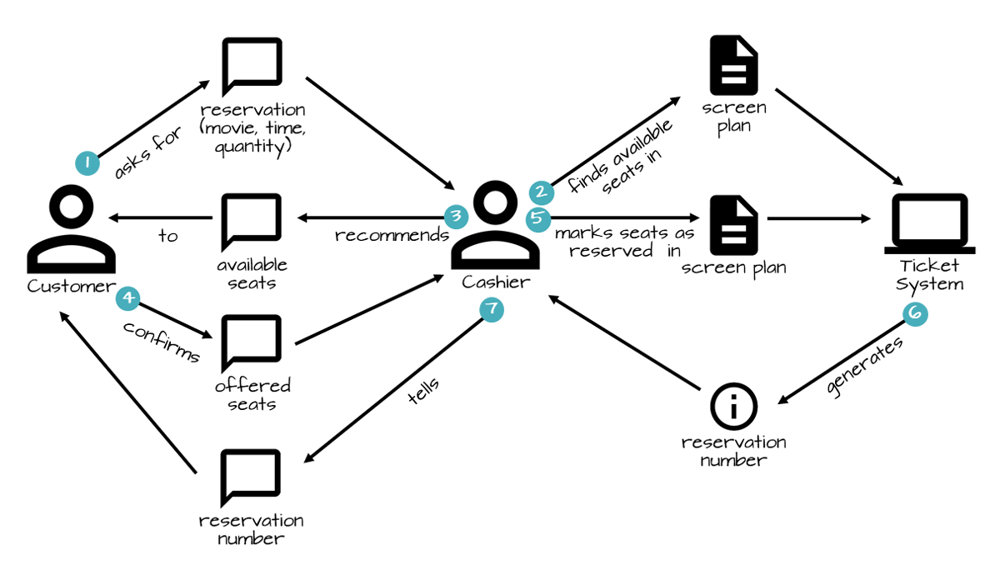

# 一、系统架构设计

- [系统设计面试题](https://mp.weixin.qq.com/s/zr4dkkpy5_QnifTPA7XkdQ)
- [系统设计入门](https://github.com/donnemartin/system-design-primer/blob/master/README-zh-Hans.md)
- [系统设计](https://github.com/ksfzhaohui/blog/tree/master/java8)
- [领域驱动模型在互联网业务中运用](https://tech.meituan.com/2017/12/22/ddd-in-practice.html)
- [system-design-interview](https://github.com/summerjava/system-design-interview)
- [grokking-modern-system-design-interview](https://www.educative.io/courses/grokking-modern-system-design-interview-for-engineers-managers)
- [grokking the system design interview]
- [如何面试系统设计](https://blog.acecodeinterview.com/intro/)
- [System Design Cheatsheet](https://gist.github.com/vasanthk/485d1c25737e8e72759f)
- [系统设计路线图](https://roadmap.sh/system-design)

约定大于配置

## 1、基础理论

## 2、高并发系统设计

- 系统拆分
- 缓存
- MQ
- 分库分表
- 读写分离
- ElasticSearch

### 2.1、设计原则

- 局部并发原则：比如电商场景中的下单链路，涉及到商品检查、用户信息检查、生成付款连接、地址信息、订单快照等，其中没有相互依赖的可以并行处理；
- 服务化拆分：主链路规划

## 3、高可用系统设计

### 3.1、设计原则

- 降级：多级降级
    - 主动降级：开关推送
    - 被动降级：超时降级、异常降级、失败率、熔断保护

- 限流：压测确定限流阈值、动态调整限流
    - 网关层限流：Nginx、Redis+Lua
    - 业务层限流：本地限流（Guava）、分布式限流（sentinel）

- 弹性计算：全链路都要弹性计算（K8S+Docker）

- 流量切换：多机房环境
    - DNS：域名切换入库、Client端流量调度
    - 虚IP：HaProxy、LVS负载均衡
    - 应用层：Nginx + 服务网关

- 回滚：
    - 版本控制：配置中心、CICD Pipeline

## 4、有限状态机

spring statemachine

## 其他

使用在线工具[domain-story-modeler](https://github.com/WPS/domain-story-modeler)，可以在线实践domain storytelling。

对象间关系：
- 一个对象为另一个对象的状态变更提供数据；
- 一个对象的状态变更导致另一个对象的状态变更；

# 七、重构

1）重构应该是随时随地进行。不应该为重构而重构。
2）三次法则：第一次做某件事只管去做；第二次做类似的事会产生反感，但无论如何还是可以去做 第三次 再做类似的事情，就应该重构了。
3）添加功能
4）修复bug
5）复审代码，即Code Review时候

